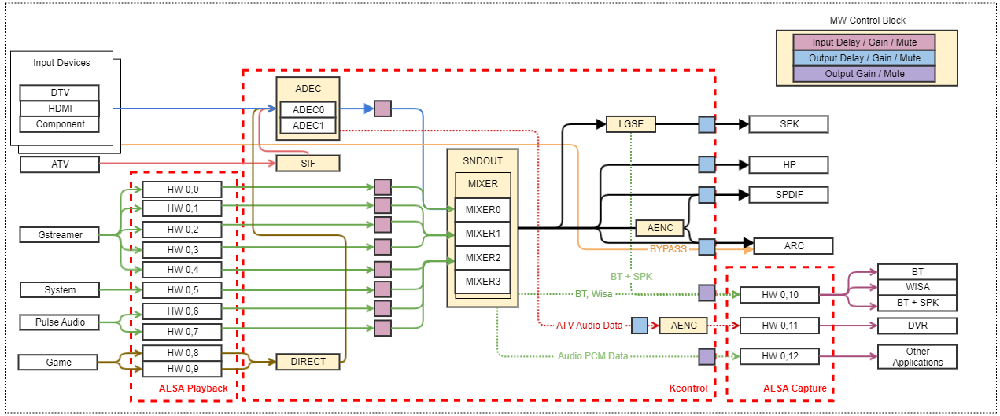

ADEC
####

.. _yongchol.kee: yongchol.kee@lge.com

Introduction
************

| This document describes the ADEC (Audio DECoder) module in the kernel space. This document gives an overview of the ADEC module and provides details about its functionalities and implementation requirements.

Revision History
================

=============== ============ =================== ================================
Version         Date         Changed by          Description
=============== ============ =================== ================================
1.0.20          2025-09-05   `seonghyun.cha`_    Add new API "ADEC AUDIO DROP ENABLE"
1.0.19          2025-03-19   `taesoon.kim`_      Add i2s cmd for webOS Soundbar
1.0.18          2023-12-06   `changyong.ahn`_    Applied new document template.
1.0.17          2022-09-28   `yookyung.uh`_      Add performance/constraint requirement
1.0.16          2022-09-27   `yookyung.uh`_      Add pcm channel number parameter in "Adec Info" api
1.0.15          2022-03-14   `yongsu.yoo`_       PTS rules are explained
1.0.14          2021-05-10   `yongsu.yoo`_       Update audio codec description and audio trick mode
1.0.13          2020-07-29   `cheolhwa.yoo`_     Add Adec AC4 AssociateAudioVolume.
1.0.12          2019-06-19   `kenneth0.park`_    Add Adec AC4 AutoADMixing.
                                                 Change order of the function list.
=============== ============ =================== ================================

Terminology
===========

| The key words "must", "must not", "required", "shall", "shall not", "should", "should not", "recommended", "may", and "optional" in this document are to be interpreted as described in RFC2119.

The following table lists the terms used throughout this document:

**webOS TV specific**

=============================== ===============================
Term                            Description
=============================== ===============================
AAD                             Analog TV Audio Digital converter
AD                              Audio Description
ADC                             Analog Digital Converter.
ADEC                            Audio Decoder
ATP                             Audio TP
ES                              Elementary Stream
PTS                             Presentation Time Stamp
RCA                             Radio Corporation of America
SIF                             Sound Intermediate Frequency
=============================== ===============================

Technical Assistance
====================

For assistance or clarification on information in this guide, please create an issue in the LGE JIRA project and contact the following person:

============ ===============================
Module       Owner
============ ===============================
ADEC         `yongchol.kee`_
============ ===============================

Overview
********

General Description
===================

| The ADEC module decodes Audio ES data according to the specifications defined in ATSC / DVB and converts it into Audio Data. Basically, there are two ADECs: ADEC0 and ADEC1. ADEC should support Downmix, transcoding, DRC mode control, and Audio Description control. AMIX is connected to the SYSTEM, specifies the input ALSA HW port, mixes input PCM data, and sends it to soundout.

Features
========

| The ADEC module provides the following features:

* Downmix : Downsize the number of Audio Channel to support output speaker channel.
* Transcoding : Direct digital-to-digital conversion of one encoding to another. ( ex : Opus to PCM )
* DRC mode control : Dynamic Range Control, ADEC module supports API to control Dolby DRC mode by setting values.
* Audio Description control : Audio Description is multi audio with multi language. The Dolby AC-4 Decoder in ADEC Module supports two presentation selection mode.

Architecture
============
The diagram below illustrates the main modules of the webOS audio framework, which is based on ALSA, and shows their interactions.

Kcontrol is an ALSA Interface for controlling Audio Driver Modules. The variable type used in Kcontrol is always int.

The ADEC block contains functions that were originally used in Audio PATH.
In this block, each input (DTV, HDMI, Component, ATV) can be connected to the desired ADEC.
All inputs can be decoded to PCM through ADEC and can be output.
It can be output to SPDIF or ARC by bypass without decoding according to some user conditions.

The next block to be connected can be Sound Engine/Mixer/ SoundOutput.
However, the output should not be specified in this block but in the Sound Output block.

Basically, ADEC and other resources have the following characteristics.

* Resilience: The resources of each module are open, ready to use, and disabled. (It is possible to connect only when it is open and not closed. If connect is called without being open, an error is returned.)
* Connectivity: The resources of each module are connected / disconnected according to the ALSA Implementation Guide.
* Parallelism: Multiple resources of the same property can exist at the same time.
* Independence: The resources of each module can be independently open / close / connect / disconnect without being affected by other resources.

ADEC Input Resources are as follows.

* ATP (DTV): SDEC feeds Audio ES data fed through PID filtering to ADEC.
* AAD (ATV): It supports standard BG / I / L / DK and M, A2 system, BTSC system and NICAM system. It converts analog audio data into digital and supplies it to ADEC.
* ADC: Converts analog audio data to digital output from RCA connector, SCART and supplies it to ADEC.
* HDMI: This is a part to control the audio of HDMI. It checks the HDMI status (HDMI / DVI or Audio Codec information), performs monitoring and decodes it to conform to HDMI / DVI Path and corresponding codec.
* SYSTEM: It supplies PCM data output from Audio Clip Player to AMXI.

Requirements
************

Functional Requirements
=======================

| The data types and functions used in this module are described in the Data Types and Functions in the API List.

**Optimize Audio Sync**

* Ideally, only the audio frame whose audio PTS(Presentation Time Stamp) is exactly matched with the STC(System Time Clock) should be delivered from the ADEC's decoded audio buffer to next audio processing blocks. But accroding to the ADEC BSP SW structures of TV Soc vendors, there can be some time gap between the real STC(HW) and the STC which the ADEC BSP SW module knows. In this case, the time gap should be under +- 5 msec so that the presenting time error of the decoded audio could be minimized.

* When an ADEC finishs decoding the first audio frame since the ADEC is started, some delay should be added before the first decoded audio being delivered from ADEC's decoded audio buffer to next audio blocks for following reasons. If the ADEC delivers immediately the first decoded audio frame from the adec's decoded buffer to the next audio block, It can cause some audio cutting for below principles. If the second audio frames can have longer decoding time than the first audio frame's playing time. The next audio block cannot get the decoded audio frame for the time gap. It can cause audio cutting. If the third audio decoding time is longer than the second audio's playing time, The next audio block cannot get the decoded audio frame for the time gap. It can cause audio cutting. If the fourth audio decoding time is longer than the third audio's playing time, The next audio block cannot get the decoded audio frame for the time gap. It can cause audio cutting. For preventing this problem, the ADEC should add some delay time between the first Audio decoding finishing time and the first decoded audio's deliverying time. The amounts of delay should be longer than (the max decoding time of the future audio frames - the decoding time of the first audio frame).

Implementation
**************

| This section provides supplementary materials that are useful for ADEC implementation.

- The File Location section provides the location of the Git repository where you can get the header files in which the interface for the ADEC implementation is defined.
- The API List section provides a brief summary of ADEC APIs.
- The Status Log section provides information about the ADEC status log file which is used for examining the status and operation of ADEC.

File Location
=============
| The Git repository of the ADEC module is available at `alsa-ext-decoder-header <https://wall.lge.com/admin/repos/bsp/ref/alsa-ext-decoder-header>`_ . This Git repository contains the header files for the ADEC implementation as well as documentation for the ADEC implementation guide and ADEC API reference.

| It's up to the ADEC implementor to make the decision where to locate their ADEC module implementation in their build structure.

API List
========

Data Types
----------

============================================== ==========================================================================
Name                                           Description
============================================== ==========================================================================
:type:`adec_src_port_index_ext_type_t`         Input ports for adec HDMI Ports are used for Multi View Implementation
:type:`adec_src_codec_ext_type_t`              Adec_src_codec_ext_type_t is showing codec type
:type:`adec_dualmono_mode_ext_type_t`          Adec_dualmono_mode_ext_type_t show dualmono mode
:type:`adec_dolbydrc_mode_ext_type_t`          Drc mode setting values
:type:`adec_downmix_mode_ext_type_t`           Downmix mode setting values
:type:`adec_trick_mode_ext_type_t`             Trick mode values
:type:`adec_tp_mode_ext_type_t`                TP Mode Information
:type:`adec_ac4_ad_ext_type_t`                 AC4 audio description type
:type:`adec_ac4_lang_code_ext_type_t`          Language code type
:type:`adec_i2s_audio_type_ext_type_t`         I2S audio type
:type:`adec_i2s_sample_frequency_ext_type_t`   I2S sample frequency type
============================================== ==========================================================================

Function Calls
^^^^^^^^^^^^^^
Priority 1 ~ 4 is divided for specific models.

============= ================================
Priority              Model
============= ================================
Priority 1    Mandatory
Priority 2    ATV
Priority 3    SPI and SPDIF
Priority 4    BT/WISA/SPDIF (advanced)
============= ================================

Therefore, if the driver is for TV, all APIs corresponding to Priorities 1 ~ 4 are required, but if it is for a Dongle, only the API corresponding to Priority 1 is needed.

* Priority 1

============================================== ==========================================================================
Name                                           Description
============================================== ==========================================================================
:c:macro:`ADEC_OPEN`                           API to open ADEC (Audio Decoder). Opened ADEC can be connected to input sources such as ATP, AAD, ADC, HDMI by ADEC_ADEC_Connect. You can not open duplicates for already opened ADEC.
:c:macro:`ADEC_CLOSE`                          API to close ADEC. If this function is called when ADEC is not open or in the connect state, it returns NOT_OK without action.
:c:macro:`ADEC_CONNECT`                        Connect ADEC with the resource that will be the input of ADEC. ATP, AAD, ADC, HDMI, etc. can be input to ADEC. Only one input can be connected to one ADEC.
:c:macro:`ADEC_DISCONNECT`                     Disconnect ADEC device with input port. Disconnect from connected resource with ADEC input. If attempting to disconnect an unconnected adec index, you should return NOT_OK.
:c:macro:`ADEC_CODEC`                          Set Codec to ADEC port. Function to allocate resources according to codec before ADEC Start. Must be called before Start.
:c:macro:`ADEC_START`                          Start ADEC device decoding.
:c:macro:`ADEC_STOP`                           Stop ADEC device decoding.
:c:macro:`ADEC0_INFO`                          Get information for ADEC 0
:c:macro:`ADEC1_INFO`                          Get information for ADEC 1
:c:macro:`ADEC2_INFO`                          Get information for ADEC 2
:c:macro:`ADEC3_INFO`                          Get information for ADEC 3
:c:macro:`ADEC_MAXCAPACITY`                    Get ADEC and AMIXER Capacity.
:c:macro:`ADEC_USERMAXCAPACITY`                Get ADEC and AMIXER User Capacity.
:c:macro:`ADEC_I2S_CONTROL`                    Set/Get audio type, channel number, sample frequency to I2S MCU.
============================================== ==========================================================================

* Priority 3

============================================== ==========================================================================
Name                                           Description
============================================== ==========================================================================
:c:macro:`ADEC_SYNCMODE`                       Set the Sync mode Sync mode. When On, video and sync are synchronized. If Off, video and sync are not synchronized.
:c:macro:`ADEC_DOLBYDRCMODE`                   Set Dolby DRC (Line, RF) mode.
:c:macro:`ADEC_DEFAULTPRL`                     Set default PRL.
:c:macro:`ADEC_DOWNMIXMODE`                    Set Downmix (LoRo, LtRt) mode.
:c:macro:`ADEC_TRICKMODE`                      Set ADEC play speed in DVR Playback mode Change the Trick state of ADEC during DVR Trick Play such as Pause / Resume.
============================================== ==========================================================================

* Priority 4

============================================== ==========================================================================
Name                                           Description
============================================== ==========================================================================
:c:macro:`ADEC_AC4_AUTO1STLANG`                Put/get ac4 first language code for each decoder
:c:macro:`ADEC_AC4_AUTO2NDLANG`                Put/get ac4 second language code for each decoder
:c:macro:`ADEC_AC4_AUTO_ADTYPE`                Set AC4 decoder's Audio Description Type
:c:macro:`ADEC_AC4_AUTO_PRIORITIZE_ADTYPE`     Choose which AD or Language has higher priority.
:c:macro:`ADEC_AC4_AUTO_ADMIXING`              Set AC4 ADMixing Enable or Disable.
:c:macro:`ADEC_TP_AUDIODESCRIPTION`            Set Audio Description On/Off.
:c:macro:`ADEC_TP_DECODER_OUTPUTMODE`          Set dual_mono mode to adec port
:c:macro:`ADEC_AC4_DIALOGENHANCEGAIN`          Get value for AC4 Dialogue Enhancement Gain.
:c:macro:`ADEC_AC4_PRES_GROUP_IDX`             Put/Get ac4 Presentation Group Index for each decoder
:c:macro:`ADEC_DOLBY_OTTMODE`                  Get value for AC4 Dialogue Enhancement Gain. Set OTT mode and ATMOS Locking for Netflix.
:c:macro:`ADEC0_TP_BUFFERSTATUS`               Return the status of ADEC0 buffer
:c:macro:`ADEC1_TP_BUFFERSTATUS`               Return the status of ADEC1 buffer
:c:macro:`ADEC2_TP_BUFFERSTATUS`               Return the status of ADEC2 buffer
:c:macro:`ADEC3_TP_BUFFERSTATUS`               Return the status of ADEC3_INFO buffer
:c:macro:`ADEC_AC4_AUTO_PRIORITIZE_ADTYPE`     Choose which AD or Language has higher priority.
:c:macro:`ADEC_AC4_ASSOCIATE_AUDIO_VOLUME`     Determines the balance between main and associated audio in the mixed output for AC4.
:c:macro:`ADEC_LIPSYNC_OFFSET`                 Set Audio lipsync offset
:c:macro:`ADEC_MASTER_SYNCMODE`                Set the Master Syncmode. When On, video and sync are synchronized by adec.
:c:macro:`ADEC_AUDIO_DROP_ENABLE`              Put/get Audio Input Drop Enable
============================================== ==========================================================================

Status Log
==========

To examine the status and operation of the ADEC module, you can use the status log file, a text-based log file. For more information on how to use the status log file, see :doc:`Status Log File manual. <part2/alsa-ext-decoder-header/documentation/source/status-files/alsa-ext-decoder-status>`

Testing
*******

To test the implementation of the ADEC module, webOS provides SoCTS (SoC Test Suite) tests. The SoCTS checks the basic operations of the ADEC module and verifies the kernel event operations for the module by using a test execution file. For more information, 
see :doc:`ADEC's SoCTS Unit Test manual </part4/socts/Documentation/source/producer-manual/producer-manual_alsa/producer-manual_alsa-adec>`.

Reference
*********

For additional information on related standards or technical topics, refer to:

* `ALSA-Project <https://www.alsa-project.org/wiki/Main_Page>`_

* `ALSA Kernel API Documentation <https://www.kernel.org/doc/html/v6.6-rc3/sound/kernel-api/index.html>`_
