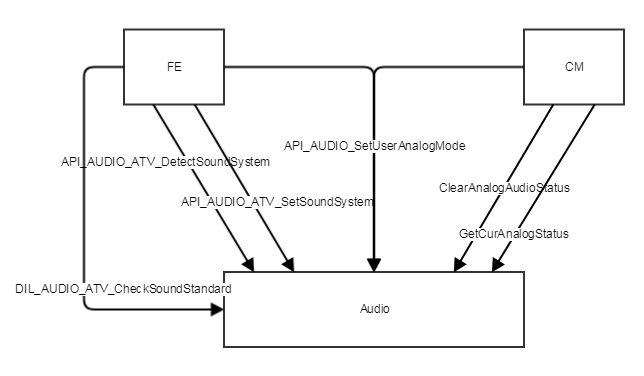
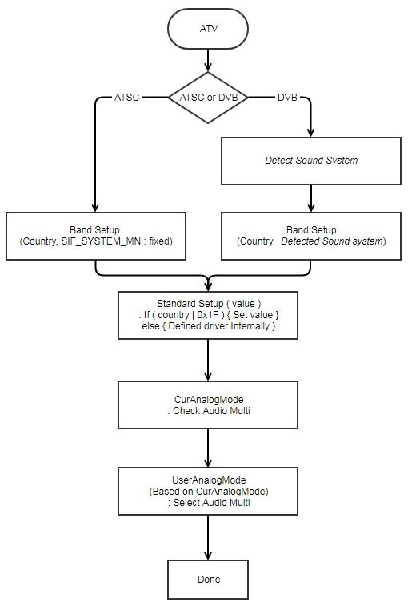

ATV
===

Introduction
------------

| This document describes the ATV driver in the kernel space. The document gives an overview of the ATV driver and provides details about its functionalities and implementation requirements.

Revision History
^^^^^^^^^^^^^^^^

======= ========== ===================== =======
Version Date       Changed by            Comment
======= ========== ===================== =======
1.0.7   2023-11-15 kwonwoo.kang@lge.com  Applied new document template.
1.0.6   2022-07-04 seong.lee@lge.com     Update description and Requirements
1.0.5   2019-07-12 kenneth0.park@lge.com Add description for ATSC ATV Detect
1.0.0   ...        ...                   Create See TV ALSA Implementation Guide. SEE TV ALSA I/G first written.
======= ========== ===================== =======

Terminology
^^^^^^^^^^^

| The key words "must", "must not", "required", "shall", "shall not", "should", "should not", "recommended", "may", and "optional" in this document are to be interpreted as described in RFC2119.

| The following table lists the terms used throughout this document:

================================ ==================================
Term                             Description
================================ ==================================
AAD                              Analog TV Audio Digtal converter
SIF                              Sound Intermediate Frequency
FE                               Front End
CM                               Channel Manager
ATV                              Analog TV
================================ ==================================

Technical Assistance
^^^^^^^^^^^^^^^^^^^^

| For assistance or clarification on information in this guide, please create an issue in the LGE JIRA project and contact the following person:

=============== ==========
Module          Owner
=============== ==========
atv             cheolhwa.yoo@lge.com
=============== ==========

Overview
--------

General Description
^^^^^^^^^^^^^^^^^^^

ATV is a module realted to Audio of Analog TV.
It provides the following functions:

* Audio system(BG/I/DK/L/MN) detection
* Audio standard(A2,NICAM,FM) detection
* Voice multi-mode(stereo, mono, ...) detection
* User selected voice multi-mode(stereo, mono, ...) setting
* HDEV(High Deviation) mode setting

Architecture
^^^^^^^^^^^^

Driver Architecture
*******************
FE module carries RF audio data and information and CM module transmits audio related information from a RF analog TV channel.
ATV audio module set a proper analog sound system of ATV channels with FE and CM modules

================================================= =======================================
Func                                              Description
================================================= =======================================
API_AUDIO_ATV_DetectSoundSystem                   | Get audio strength of selected sound system from DIL_AUDIO_ATV_GetBandDetect()
                                                  | ATV scanner call this function for all supported ATV Audio system.
API_AUDIO_SetUserAnalogMode                       | Set user analog mode. This API read current audio system and country then set possible audio mode to Driver.
                                                  | API_AUDIO_ATV_SetMode()
                                                  | For example, if current atv audio is PAL Mono and user set Stereo, this API set PAL Mono to driver.
API_AUDIO_ATV_SetSoundSystem                      | Set Sound system. API_AUDIO_ATV_SetMode()
                                                  | This is called when channel changed.
ClearAnalogAudioStatus                            | Clear All ATV audio status. Called when ATV finished. (ex. Change channel from ATV to DTV)
GetCurAnalogStatus                                | Get current ATV audio mode from API_AUDIO_ATV_GetMode()
DIL_AUDIO_ATV_CheckSoundStandard                  | check sound standard from driver by calling DIL_AUDIO_ATV_SetModeSetup()
================================================= =======================================

Overall Workflow
^^^^^^^^^^^^^^^^
Audio Standard Detection is performed through the following process when
switching channels.

When switching the ATV channel with the LG HW Spec,
the video should be output and the audio should be output within 700ms.

For BTSC Country, we are using "Standard Setup" manually
(Driver can know that from "Sif BandSetup"s country value).

=============== =========== =========== =============== ===============
Input Signal    BTSC_MONO   BTSC_STEREO BTSC_SAP_MONO   BTSC_SAP_STEREO
=============== =========== =========== =============== ===============
KR(A2)          A2_MONO     A2_MONO     A2_MONO         A2_MONO
US/BR(BTSC)     BTSC_MONO   BTSC_STEREO BTSC_SAP_MONO   BTSC_SAP_STEREO
=============== =========== =========== =============== ===============

=============== =========== =========
Input Signal    A2_MONO     A2_STEREO
=============== =========== =========
KR(A2)          A2_MONO     A2_STEREO
US/BR(BTSC)     BTSC_MONO   BTSC_MONO
=============== =========== =========

For example, KR use NTSC_A2 for Standard Setup.
If the input signal is BTSC_MONO, "Sif CurAnalogMode" value should be A2_MONO.

For example, Originally China(CN) has no NTSC-M signal but TW or HK area has it.
If the input signal is NTSC_M and Area value is 0x0100(CN,HK,TW).
LG will set SIF_BANDSETUP as normally. so ATV gain should be work.

If detection of a specific signal is completed during audio standard detection,
BSP should be set with that signal,
and repeated setting due to missing setting should be avoided.

Requirements
------------

Functional Requirements
^^^^^^^^^^^^^^^^^^^^^^^

The ATV driver implementation must adhere to the interface specifications defined by LG. For more information, refer to the Data Types and Functions in API List.

Quality and Constraints
^^^^^^^^^^^^^^^^^^^^^^^

Performance
***********

Function elapsed time should be less than 10ms.

Design Constraints
******************

ATV may have compatibility issues,
but it should provide the same or higher performance as the existing mass-produced model.

Implementation
--------------

This section provides materials that are useful for ATV implementation.

The File Location section provides the location of the Git repository where you can get the header file in which the interface for the ATV implementation is defined.

The API List section provides a brief summary of ATV APIs that you must implement.

File Location
^^^^^^^^^^^^^

The ATV interfaces are defined in the alsa-ext-atv.h header file, which can be obtained from https://swfarmhub.lge.com/.

- Git repository: bsp/ref/alsa-ext-broadcast-header

API List
^^^^^^^^

The data types and functions used in this module are as follows.

Data Types
**********

Extended Enumerations
"""""""""""""""""""""

================================================= =======================================
Enumeration                                       Description
================================================= =======================================
:type:`sif_soundsystem_ext_type_t`                SIF sound system
:type:`sif_country_ext_type_t`                    Audio country type for initialization
:type:`sif_standard_ext_type_t`                   Shows SIF mode
:type:`sif_mode_ext_type_t`                       SIF analog audio getting parameter
:type:`sif_existence_info_ext_type_t`             Shows if SIF signal exist or not
:type:`sif_mode_user_ext_type_t`                  SIF analog audio user parameter
================================================= =======================================

Functions
*********

Extended Functions
""""""""""""""""""

======================================== ======================================
Function                                 Description
======================================== ======================================
:c:macro:`SIF_OPEN`                      AAD device open
:c:macro:`SIF_CLOSE`                     AAD device close
:c:macro:`SIF_CONNECT`                   AAD device connect
:c:macro:`SIF_DISCONNECT`                AAD device disconnect
:c:macro:`SIF_DETECTSOUNDSYSTEM`         AAD detect sound system
:c:macro:`SIF_SOUNDSYSTEMSTRENGTH`       Get Strength of Given Sound System
:c:macro:`SIF_BANDSETUP`                 AAD band setup
:c:macro:`SIF_STANDARDSETUP`             AAD standard mode setup
:c:macro:`SIF_CUR_ANALOGMODE`            return detected analog_mode
:c:macro:`SIF_USER_ANALOGMODE`           put/get user analog mode
:c:macro:`SIF_SIFEXIST`                  check sif signal exist or not
:c:macro:`SIF_HDEV`                      put/get hdev on_off
======================================== ======================================

======================================== ======================================
Function                                 Description
======================================== ======================================
:c:macro:`SIF_A2THERESHOLDLEVEL`         put/get a2threshold level
======================================== ======================================

Testing
-------

To test the implementation of the ATV driver, webOS provides SoCTS (SoC Test Suite) tests. The SoCTS checks the basic operation of the ATV driver and verifies the kernel event operation for the module by using a test execution file. For details, see :doc:`ATV Unit Test </part4/socts/Documentation/source/producer-manual/producer-manual_alsa/producer-manual_alsa-atv>` in SoCTS Unit Test Specification.

References
----------
| `ALSA-Project <https://www.alsa-project.org/wiki/Main_Page>`_
| `ALSA Kernel API Documentation <https://www.kernel.org/doc/html/v6.6-rc3/sound/kernel-api/index.html>`_
