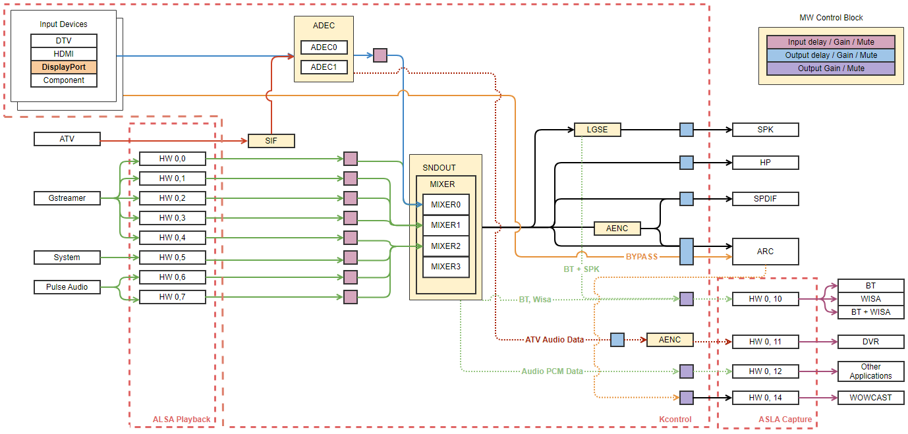

Displayport
###########

Introduction
************

| This document describes the Display Port module (hereafter referred to as Displayport) in the kernel space. The document gives an overview of the Displayport module and provides details about its functionalities and implementation requirements.

Revision History
================

======= ========== ===================== =======
Version Date       Changed by            Comment
======= ========== ===================== =======
1.0.0   2023-11-13 minjae.jun@lge.com    Applied new document template.
======= ========== ===================== =======

Terminology
===========

| The key words "must", "must not", "required", "shall", "shall not", "should", "should not", "recommended", "may", and "optional" in this document are to be interpreted as described in RFC2119. 

| The following table lists the terms used throughout this document: 

================================== ==================================
Definition                         Description
================================== ==================================
ALSA                               Advanced Linux Sound Architecture
================================== ==================================

Technical Assistance
====================

| For assistance or clarification on information in this guide, please create an issue in the LGE JIRA project and contact the following person:

=============== ==========
Module          Owner
=============== ==========
Displayport     yookyung.uh@lge.com
=============== ==========

Overview
********

General Description
===================

| This Displayport module analyzes audio input type and copy protection information from Displayport input signals. Signal information is provided to user applications through the ALSA interface.

Architecture
============

Driver Architecture
-------------------

| Kcontrol is a key element of the interface provided by the ALSA kernel driver for controlling audio functions in user space application. Kcontrol is the name of the structure used to register functions, and user applications can access it as a driver through the ALSA library. This module uses kcontrol to receive information about the input signal.

Requirements
************

Functional Requirements
=======================

The data types and functions used in this module are described in the Data Types and Functions in the API List.

Quality and Constraints
=======================

Performance
-----------

Check the definition of each function.

Functional Constraints
----------------------

#. The variable type used in Kcontrol is always ``int``. 

Design Constraints
------------------

#. Refer to the channel status value of the left and right sub-frames(channel 1/channel 2, IEC60958). If the left and right data are different, the driver operates with reference to the normal data value.
#. Ignore errors that occur in the process of checking the parity bit(from second sub-frame of audio sample subpacket, IEC60958) of the input signal. In some input devices, the signal is normal, but the parity bit setting is incorrect.
#. If the audio FIFO malfunctions due to abnormal signal being transmitted by the input device, it must be recoverable.

Implementation
**************

This section provides materials that are useful for Displayport implementation. 

- The File Location section provides the location of the Git repository where you can get the header file in which the interface for the Displayport implementation is defined.
- The API List section provides a brief summary of Displayport APIs that you must implement.

File Location
=============

The Displayport interfaces are defined in the `alsa-ext-displayport.h <http://10.157.97.248:8000/v4l2/master/latest_html/api/file_integrated_build_source_alsa-ext-extinput-header_linux_alsa-ext-displayport.h.html#file-integrated-build-source-alsa-ext-extinput-header-linux-alsa-ext-displayport-h>`_ header file, which can be obtained from https://swfarmhub.lge.com/.

- Git repository: bsp/ref/alsa-ext-extinput-header

API List
========

The Displayport driver implementation must adhere to the interface specifications defined and implements its functions. Refer to the API Reference for more details.

Data Types
----------

Extended Enumerations
^^^^^^^^^^^^^^^^^^^^^
============================================================= ==================================
Data Type                                                     Description
============================================================= ==================================
:type:`displayport_ext_audio_type_t`                          Enum displayport audio type description. This enum represent the displayport audio types. Some types are not used.
:type:`displayport_ext_audio_copyprotection_type_t`           Enum displayport audio copyprotection type description. This enum represent the displayport audio copyprotection types.
============================================================= ==================================

Functions
---------

Extended Functions
^^^^^^^^^^^^^^^^^^

.. note:: **Priority Definition**
 
    ======== ===============================================
    Level    Definition
    ======== ===============================================
    1        Minimum API for DTV Audio output
    2        Minimum API for ATV/AV/HDMI output
    3        API for the implementation of Basic Audio functionality (Sound Engine, HW Setting ,Delay etc)
    4        Final API with Advanced Audio functionality (ATMOS Detect, Multiview etc)
    ======== ===============================================

Priority 2

============================================= ===============================================
Funtion                                       Description
============================================= ===============================================
:c:macro:`DP_PORT0_AUDIOMODE`                 Get Audio Codec from Displayport
:c:macro:`DP_PORT1_AUDIOMODE`                 Get Audio Codec from Displayport
============================================= ===============================================

Priority 4

============================================= ===============================================
Funtion                                       Description
============================================= ===============================================
:c:macro:`DP_PORT0_COPYPROTECTIONINFO`        Get DisplayPort audio copyprotection for each port
:c:macro:`DP_PORT1_COPYPROTECTIONINFO`        Get DisplayPort audio copyprotection for each port
============================================= ===============================================

Testing
*******
To test the implementation of the Displayport module, webOS TV provides SoCTS (SoC Test Suite) tests. 
The SoCTS checks the basic operations of the Displayport module and verifies the kernel event operations for the module by using a test execution file. 
For more information, see :doc:`Displayport’s SoCTS Unit Test manual </part4/socts/Documentation/source/producer-manual/producer-manual_v4l2/producer-manual_v4l2-displayport>`.