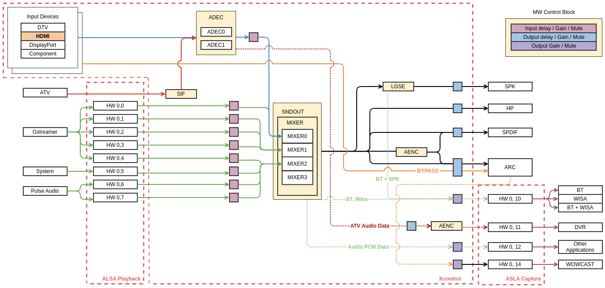

HDMI
====

Introduction
------------

| This document describes the HDMI module in the kernel space. The document gives an overview of the HDMI module and provides details about its functionalities and implementation requirements.

Revision History
^^^^^^^^^^^^^^^^

======= ========== ===================== =======
Version Date       Changed by            Comment
======= ========== ===================== =======
1.0.4   2023-11-15 kwonwoo.kang@lge.com  Applied new document template
1.0.3   2022-04-14 yookyung.uh@lge.com   add performance/constraint requirement
1.0.2   2021-05-03 yookyung.uh@lge.com   add requirement
1.0.1   2019-01-28 kenneth0.park@lge.com value.enumerated.item -> value.integer.value
1.0.0   2019-01-05 kenneth0.park@lge.com first release
======= ========== ===================== =======

Terminology
^^^^^^^^^^^

| The key words "must", "must not", "required", "shall", "shall not", "should", "should not", "recommended", "may", and "optional" in this document are to be interpreted as described in RFC2119. 

| The following table lists the terms used throughout this document: 

================================== ==================================
Term                               Description
================================== ==================================
ALSA                               Advanced Linux Sound Architecture
================================== ==================================

Technical Assistance
^^^^^^^^^^^^^^^^^^^^

| For assistance or clarification on information in this guide, please create an issue in the LGE JIRA project and contact the following person:

=============== ==========
Module          Owner
=============== ==========
HDMI            yookyung.uh@lge.com
=============== ==========

Overview
--------

General Description
^^^^^^^^^^^^^^^^^^^

| The HDMI analyzes audio input type and copy protection information from HDMI input signals. 
| Signal information is provided to user applications through the ALSA interface. 

Architecture
^^^^^^^^^^^^

Driver Architecture
*******************

| This module uses Kcontrol to receive information about the input signal.
| Kcontrol is the name of the structure used to register functions, and user applications can access it as a driver through the ALSA library. 
| Kcontrol is a key element of the interface provided by the ALSA kernel driver for controlling audio functions in user space application. 

Requirements
------------

Functional Requirements
^^^^^^^^^^^^^^^^^^^^^^^

The data types and functions used in this module are described in the Data Types and Functions in the API List.

Quality and Constraints
^^^^^^^^^^^^^^^^^^^^^^^

Performance
***********

Check the definition of each function.

Functional Constraints
**********************

#. The variable type used in Kcontrol is always ``int``. 

Design Constraints
******************

#. Refer to the channel status value of the left and right sub-frames(channel 1/channel 2, IEC60958). If the left and right data are different, the driver operates with reference to the normal data value.
#. Ignore errors that occur in the process of checking the parity bit(from second sub-frame of audio sample subpacket, IEC60958) of the input signal. In some input devices, the signal is normal, but the parity bit setting is incorrect.
#. If the audio FIFO malfunctions due to abnormal signal being transmitted by the input device, it must be recoverable.

Implementation
--------------

This section provides materials that are useful for HDMI implementation.

The File Location section provides the location of the Git repository where you can get the header file in which the interface for the HDMI implementation is defined.

The API List section provides a brief summary of HDMI APIs that you must implement.

File Location
^^^^^^^^^^^^^

The Component input interfaces are defined in the alsa-ext-hdmi.h header file, which can be obtained from https://swfarmhub.lge.com/.

- Git repository: `bsp/ref/alsa-ext-extinput-header <http://10.157.97.248:8000/v4l2/master/latest_html/api/file_integrated_build_source_alsa-ext-extinput-header_linux_alsa-ext-hdmi.h.html#file-integrated-build-source-alsa-ext-extinput-header-linux-alsa-ext-hdmi-h>`_

API List
^^^^^^^^

Data Types
**********

Extended Enumerations
"""""""""""""""""""""

================================================================================== ===================================================================================================
Enumeration                                                                        Description
================================================================================== ===================================================================================================
:type:`ahdmi_type_ext_type_t`                                                      hdmi audio type description
:type:`ahdmi_copyprotection_ext_type_t`                                            hdmi copyprotection type description
================================================================================== ===================================================================================================

Functions
*********

Extended Functions
""""""""""""""""""

.. note:: **Priority Definition**

    ======== ===============================================
    Level    Definition
    ======== ===============================================
    1        Minimum API for DTV Audio output
    2        Minimum API for ATV/AV/HDMI output
    3        API for the implementation of Basic Audio functionality (Sound Engine, HW Setting ,Delay etc)
    4        Final API with Advanced Audio functionality (ATMOS Detect, Multiview etc)
    ======== ===============================================

* Priority 2
======================================== ===============================================
Function                                 Description
======================================== ===============================================
:c:macro:`AHDMI_PORT0_AUDIOMODE`         get Audio Codec from HDMI0
:c:macro:`AHDMI_PORT1_AUDIOMODE`         get Audio Codec from HDMI1
:c:macro:`AHDMI_PORT2_AUDIOMODE`         get Audio Codec from HDMI2
:c:macro:`AHDMI_PORT3_AUDIOMODE`         get Audio Codec from HDMI3
======================================== ===============================================

* Priority 4
=========================================== ===============================================
Function                                    Description
=========================================== ===============================================
:c:macro:`AHDMI_PORT0_COPYPROTECTIONINFO`   get hdmi copyprotection for each hdmi port0
:c:macro:`AHDMI_PORT1_COPYPROTECTIONINFO`   get hdmi copyprotection for each hdmi port1
:c:macro:`AHDMI_PORT2_COPYPROTECTIONINFO`   get hdmi copyprotection for each hdmi port2  
:c:macro:`AHDMI_PORT3_COPYPROTECTIONINFO`   get hdmi copyprotection for each hdmi port3
=========================================== ===============================================

Testing
-------
To test the implementation of the HDMI module, webOS TV provides SoCTS (SoC Test Suite) tests. The SoCTS checks the basic operations of the HDMI module and verifies the kernel event operations for the module by using a test execution file. For more information, 
see :doc:`HDMI’s SoCTS Unit Test manual </part4/socts/Documentation/source/producer-manual/producer-manual_alsa/producer-manual_alsa-hdmi>`.

References
----------
| `ALSA-Project <https://www.alsa-project.org/wiki/Main_Page>`_
| `ALSA Kernel API Documentation <https://www.kernel.org/doc/html/v6.6-rc3/sound/kernel-api/index.html>`_ 
