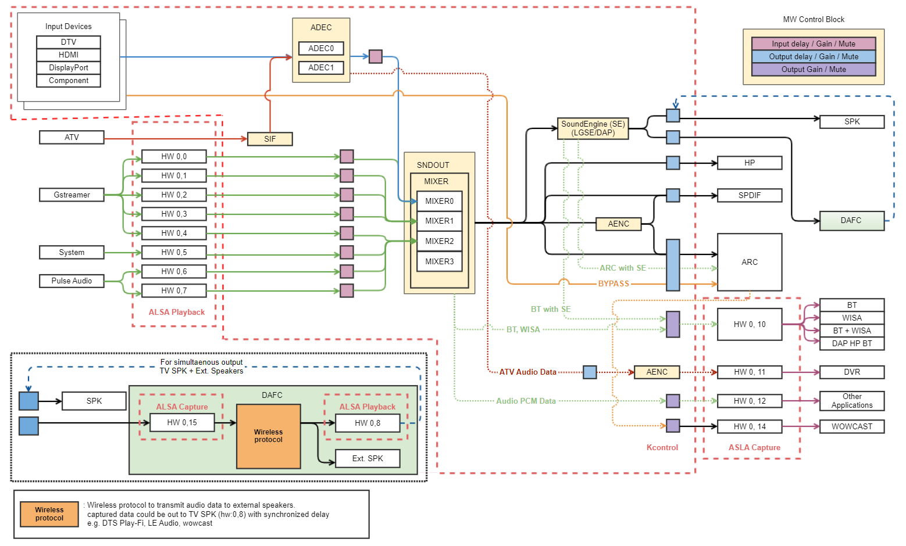

Mute
====

Introduction
------------

| This document describes the Mute driver in the kernel space. The document gives an overview of the Mute driver and provides details about its functionalities and implementation requirements.

Revision History
^^^^^^^^^^^^^^^^

======= ========== ===================== =======
Version Date       Changed by            Comment
======= ========== ===================== =======
1.0.5   2023-11-15 kwonwoo.kang@lge.com  Applied new document template
1.0.4   2022-07-29 jungyong.choi@lge.com Update Overall Description and Performance
1.0.3   2019-04-15 kenneth0.park@lge.com Modify Input Gain Initial Value.
======= ========== ===================== =======

Terminology
^^^^^^^^^^^

| The key words "must", "must not", "required", "shall", "shall not", "should", "should not", "recommended", "may", and "optional" in this document are to be interpreted as described in RFC2119.

| The following table lists the terms used throughout this document:

================================ ==================================
Term                             Description
================================ ==================================
AMIX                             Audio Mixer
================================ ==================================

Technical Assistance
^^^^^^^^^^^^^^^^^^^^

| For assistance or clarification on information in this guide, please create an issue in the LGE JIRA project and contact the following person:

=============== ==========
Module          Owner
=============== ==========
mute            jungyong.choi@lge.com
=============== ==========

Overview
--------

General Description
^^^^^^^^^^^^^^^^^^^

Mute Block controls Mute for Input resources and Output resources

Input Resources are as below
  * ADEC0~1
  * AMIX0~7

The output resources:
  * All output resources of SNDOUT section

Architecture
^^^^^^^^^^^^

Driver Architecture
*******************

The diagram below illustrates the main modules of the webOS audio framework, which is based on ALSA, and shows their interactions.

The input and output driver modules check the mute status to determine whether or not to transmit data information.

The webOS service uses the mute function to prevent noise when muting, changing output, and switching channels.

These functions are configured to mute each input / output.

Input resources:
  * ADEC0
  * ADEC1
  * ADEC2
  * ADEC3
  * AMIX0
  * AMIX1
  * AMIX2
  * AMIX3
  * AMIX4
  * AMIX5
  * AMIX6
  * AMIX7 (The numbers after each port are for the physical number and do not
    limit the port numbers actually used)

The output resources:
  * All output resources of SNDOUT section

Requirements
------------

Functional Requirements
^^^^^^^^^^^^^^^^^^^^^^^

Audio Mute implementation must adhere to the interface specifications defined by LG.
For more information about the data types and functions used in this module, refer to API List :ref:`API List <ALSA MUTE API LIST>`.

Quality and Constraints
^^^^^^^^^^^^^^^^^^^^^^^

Performance
***********

All alsa api for mute should be returned within 10 msec

Design Constraints
******************
All input resources and Output resources should have mute block

Implementation
--------------

This section provides materials that are useful for Mute implementation.

The File Location section provides the location of the Git repository where you can get the header file in which the interface for the Mute implementation is defined.

The API List section provides a brief summary of Mute APIs that you must implement.

File Location
^^^^^^^^^^^^^

The Component input interfaces are defined in the alsa-ext-mute.h header file, which can be obtained from https://swfarmhub.lge.com/.

- Git repository: bsp/ref/alsa-ext-renderer-header

.. _ALSA MUTE API LIST:
API List
^^^^^^^^

Data Types
**********

* No Data Types

Functions
*********

Extended Functions
""""""""""""""""""

======================================== ===============================================
Function                                 Description
======================================== ===============================================
:c:macro:`MUTE_INPUT`                    mute value for input
:c:macro:`MUTE_OUTPUT`                   mute value for output
======================================== ===============================================

Testing
-------
To test the implementation of the Mute module, webOS TV provides SoCTS (SoC Test Suite) tests. The SoCTS checks the basic operations of the Mute module and verifies the kernel event operations for the module by using a test execution file.
For more information, see :doc:`see DMG in SoCTS Unit Test Specification. </part4/socts/Documentation/source/producer-manual/producer-manual_alsa/producer-manual_alsa-delay_alsa-gain_alsa-mute_alsa-dmg>`

References
----------
For additional information on related standards or technical topics, refer to:
| `ALSA-Project <https://www.alsa-project.org/wiki/Main_Page>`_
| `ALSA Kernel API Documentation <https://www.kernel.org/doc/html/v6.6-rc3/sound/kernel-api/index.html>`_