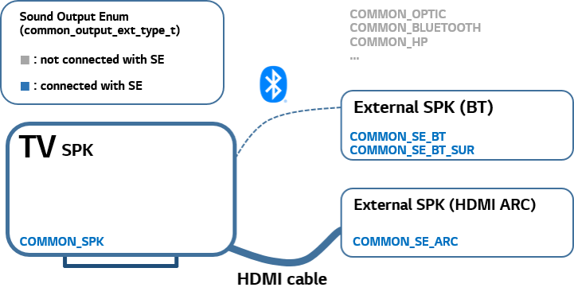
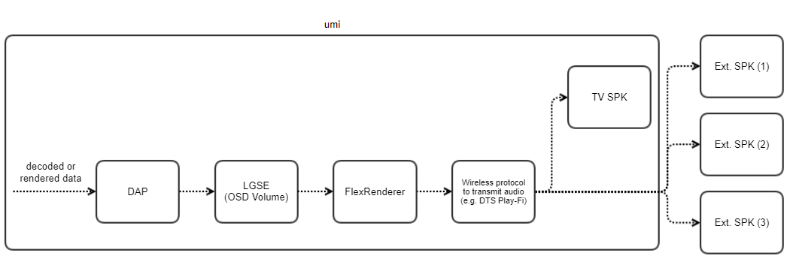

.. _soundengine-common-doc:

SoundEngine Common
==================

Introduction
------------

| This document describes the SoundEngine Common driver in the kernel space. The document gives an overview of the SoundEngine Common driver and provides details about its functionalities and implementation requirements.

Revision History
^^^^^^^^^^^^^^^^

======= ========== ===================== =======
Version Date       Changed by            Comment
======= ========== ===================== =======
1.0.5   2024-04-19 kwangshik.kim@lge.com Add DAFC related enum
1.0.4   2024-04-19 kwangshik.kim@lge.com Refine description
1.0.3   2023-11-15 kwonwoo.kang@lge.com  Applied new document template
1.0.2   2022-09-22 kwangshik.kim@lge.com fill missed requirement
1.0.1   2020-08-21 kwangshik.kim@lge.com Add description in Sound Engine Mode/DownMix
1.0.0   2020-07-08 kwangshik.kim@lge.com create soundengine common guide
======= ========== ===================== =======

Terminology
^^^^^^^^^^^

| The key words "must", "must not", "required", "shall", "shall not", "should", "should not", "recommended", "may", and "optional" in this document are to be interpreted as described in RFC2119.

| The following table lists the terms used throughout this document:

====================================== ==================================
Term                                   Description
====================================== ==================================
ALSA                                   Advanced Linux Sound Architecture
Sound Engine Mode                      According to Middleware scenario, one of Sound Engine module (LGSE, DAP, etc) is selected.
Sound Engine Init                      To prepare which Sound Engine Mode will be used, Middleware calls Sound Engine Init API at the initialization
Sound Engine Index of Output           | Sound Engine can be applied to a combination of sound output, such as TV Spaker, HDMI ARC, Bluetooth(BT) and etc.
                                       | To set Sound Engine Parameters to a specific sound output, pre-defined index is used.
Sound Engine DownMix                   | According to Middleware scenario, multi channel input can be downmixed by Sound Engine or Decoder.
====================================== ==================================

Technical Assistance
^^^^^^^^^^^^^^^^^^^^

| For assistance or clarification on information in this guide, please create an issue in the LGE JIRA project and contact the following person:

=============== ==========
Module          Owner
=============== ==========
soundengine     kwangshik.kim@lge.com
=============== ==========

Overview
--------

General Description
^^^^^^^^^^^^^^^^^^^

In TV Service Middleware, Sound Engine maps user sound effect menu and
Sound Engine Driver's block function according to UI Scenario.

| sound engine common APIs would control sound engine related path setting
| e.g.
| 1) which sound engine would be used for sound effect (LGSE, DAP, or AI Sound)
| 2) which path would downmix multi channel audio data (Decoder or Sound Engine)
| 3) which sound engine block would be connected to which sound output

As :ref:`soundengine-common-doc`., it is used to apply various sound effect for user

The SoundEngine Common module is used to apply various sound effect for the user. It is related to LGSE (LG Sound Engine) and Dolby Audio Post-processing (DAP) :ref:`lgse-doc`, :ref:`dap-doc`

Architecture
^^^^^^^^^^^^

Hardware Architecture
*********************

The following figure illustrates an example of possible sound output combinations where sound is output through the Sound Engine.

| The table below displays the relationship between :type:`lgse_index_ouptut_t` and :type:`common_output_ext_type_t`.
| :c:macro:`LGSE_SE_INDEX_MATCHED_OUTPUT` can be called to clearly match sound output with the sound engine index.

+-----------------------------------+-------------------------------------+
| Connected Sound Output            | Matched Sound Engine Index          |
+===================================+=====================================+
| COMMON_SPK                        | LGSE_SPK                            |
+-----------------------------------+-------------------------------------+
| COMMON_SE_BT                      | LGSE_BT                             |
+-----------------------------------+-------------------------------------+
| COMMON_SE_ARC                     | LGSE_ARC                            |
+-----------------------------------+-------------------------------------+
| - COMMON_SPK                      | - LGSE_SPK_BTSUR                    |
| - COMMON_SE_BT_SUR                | - LGSE_BT_BTSUR                     |
+-----------------------------------+-------------------------------------+
| - COMMON_SPK                      | - LGSE_SPK                          |
| - COMMON_ARC                      | -                                   |
+-----------------------------------+-------------------------------------+
| - COMMON_SPK                      | - LGSE_SPK_ARC                      |
| - COMMON_ARC                      | -                                   |
+-----------------------------------+-------------------------------------+
| - COMMON_DAP_HP_BT                | - LGSE_DAP_HP_BT                    |
+-----------------------------------+-------------------------------------+
| - COMMON_DAFC                     | - LGSE_DAFC                         |
+-----------------------------------+-------------------------------------+

| Examples:
| 1) If only COMMON_SPK is connected for sound output, the index LGSE_SPK is connected to the sound output COMMON_SPK.
| 2) If COMMON_SPK and COMMON_SE_BT_SUR are connected for sound output, the index LGSE_SPK_BTSUR is connected to the sound output COMMON_SPK, and the index LGSE_BT_BTSUR is connected to the sound output COMMON_SE_BT_SUR.
| 3) If COMMON_SPK and COMMON_ARC are connected for sound output, either the index LGSE_SPK_ARC or the index LGSE_SPK can be connected to the sound output COMMON_SPK. The determination would be made by the LGSE_SE_INDEX_MATCHED_OUTPUT function.

Driver Architecture
*******************
The sound engine is determined according to the HW spec supported by the soc, and 'Sound Engine common' is the basic engine with LG sound quality tuning technology applied.

.. role:: raw-html(raw)
    :format: html

.. image:: resources/audio-overview.png
  :width: 100%
  :alt: ADEC Overview

**About DAFC**

| For DAFC (with wireless protocol to transmit audio data) case, DAP output would be passed through LGSE FN009 block (OSD Volume) and go through FlexRenderer (related to DAFC).
| Wireless protocol to transmit audio data such as DTS Play-Fi, wowcast, or LE Audio) would capture FlexRenderer output and transmit to TV SPK and external speakers
| Please refer to below audio path diagram

| This diagram would be managed in `BSP Requirement Description for DAFC Collab Page <http://collab.lge.com/main/pages/viewpage.action?pageId=2418509316>`_ (LGE Only)

Requirements
------------

Functional Requirements
^^^^^^^^^^^^^^^^^^^^^^^

The data types and functions used in this module are located in the Data Types and Functions in the API List.

Quality and Constraints
^^^^^^^^^^^^^^^^^^^^^^^

Performance
***********

Function elapsed time should be less than 5ms

Design Constraints
******************

APIs below control the sound output path, which can result in audio mute when the path is changed.

Mutax Lock
""""""""""

All Sound Engine Middleware operations can be performed using the following functions after executing a function with a 1-lock structure.

If there is no return from the driver, there is a possibility of lock up. Therefore, the driver (HAL function) must pass the control right after execution.

Implementation
--------------

This section provides materials that are useful for SoundEngine Common implementation.

The File Location section provides the location of the Git repository where you can get the header file in which the interface for the SoundEngine Common implementation is defined.

The API List section provides a brief summary of SoundEngine Common APIs that you must implement.

File Location
^^^^^^^^^^^^^

The Component input interfaces are defined in the alsa-ext-soundengine-common.h header file, which can be obtained from https://swfarmhub.lge.com/.

- Git repository: bsp/ref/alsa-ext-soundengine-header

API List
^^^^^^^^

Data Types
**********

Extended Enumerations
"""""""""""""""""""""

================================================================================== ===================================================================================================
Enumeration                                                                        Description
================================================================================== ===================================================================================================
:type:`lgse_se_init_ext_type_t`                                                    set initial driver setting for sound engine
:type:`lgse_se_mode_ext_type_t`                                                    set driver setting for sound engine
:type:`lgse_index_ouptut_t`                                                        every lgse function got index to support corresponding sound output
================================================================================== ===================================================================================================

Functions
*********

Extended Functions
""""""""""""""""""

================================================ ===============================================
Function                                         Description
================================================ ===============================================
:c:macro:`LGSE_SOUNDENGINE_INIT`                 lgse initial setting
:c:macro:`LGSE_SOUNDENGINE_MODE`                 lgse setting
:c:macro:`LGSE_DOWNMIX`                          lgse downmix
:c:macro:`LGSE_SE_INDEX_MATCHED_OUTPUT`          set/get Sound Engine Index matched Sound Output
================================================ ===============================================

.. deprecated:: webOS22
   it will be removed from webOS 24

======================================== ===============================================
Function                                 Description
======================================== ===============================================
:c:macro:`LGSE_INDEX_OUTPUT_CAPABILITY`  except from socts, deprecated function
======================================== ===============================================

Testing
-------
To test the implementation of the SoundEngine Common module, webOS TV provides SoCTS (SoC Test Suite) tests. The SoCTS checks the basic operations of the SoundEngine Common module and verifies the kernel event operations for the module by using a test execution file. 
For more information, see :doc:`Sound Engine’s SoCTS Unit Test manual </part4/socts/Documentation/source/producer-manual/producer-manual_alsa/producer-manual_alsa-soundengine>`.

References
----------
| `ALSA-Project <https://www.alsa-project.org/wiki/Main_Page>`_
| `ALSA Kernel API Documentation <https://www.kernel.org/doc/html/v6.6-rc3/sound/kernel-api/index.html>`_
