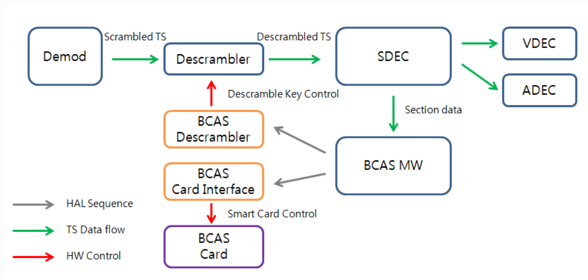
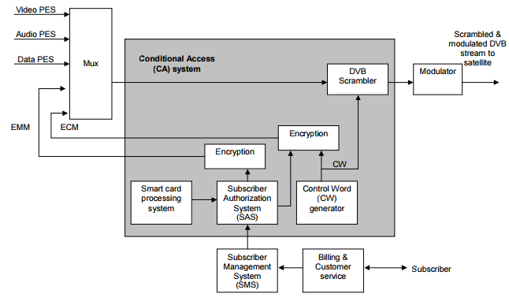
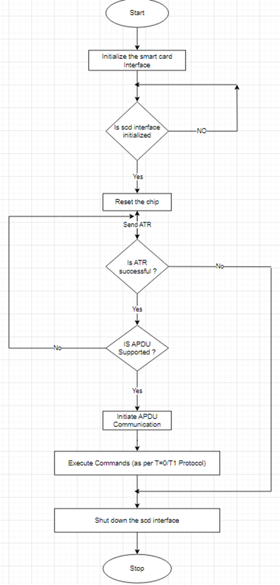
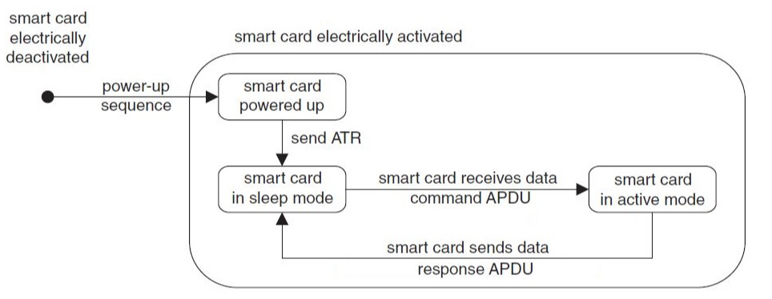
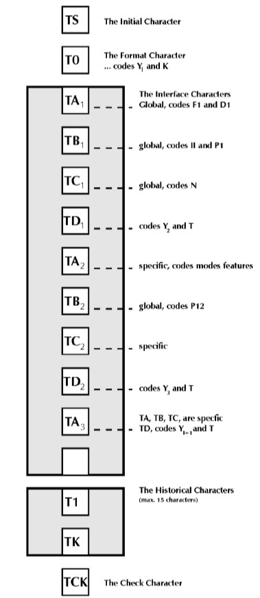
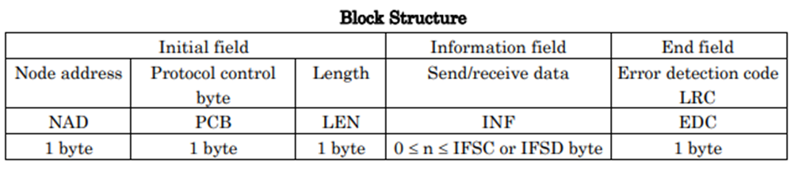
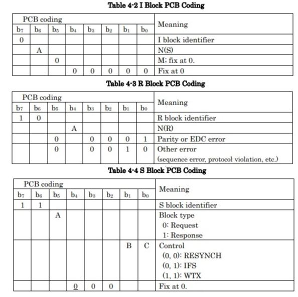
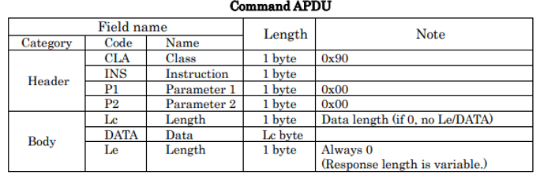
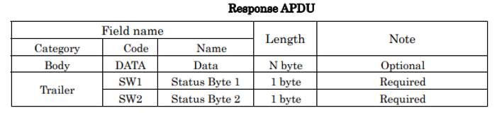
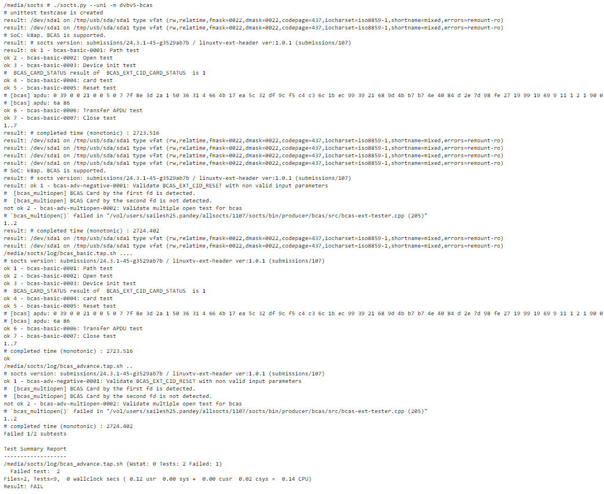

BCAS
####

.. _crystal.moon: crystal.moon@lge.com
.. _amit21.kumar: amit21.kumar@lge.com
.. _seong.lee: seong.lee@lge.com

Introduction
************

| This document provides an overview of the Broadcast Conditional Access System (BCAS) and details its functionalities and implementation requirements.

| It is based on the ARIB document and assumes that the reader has a basic understanding of the MPEG and DVB standards related to the CAS system.

Revision History
================

======= ========== ==================== ==========================================================================
Version Date       Changed by           Comment
======= ========== ==================== ==========================================================================
1.0.4   2024-11-18 `crystal.moon`_      Fixed formmating issues; mentioned that standard functions do not exist; deleted Extended IOCTL and assetization/standardization column from the API list
1.0.3   2024-10-28 `crystal.moon`_      Corrected grammatical errors and improved formatting; added assetization/standardization status to the API list
1.0.2   2023-12-06 `amit21.kumar`_      First release of BCAS Module subject to assetization     
1.0.1   2019-04-02 `seong.lee`_         Initial Document 
======= ========== ==================== ==========================================================================

Terminology
===========

| The key words "must", "must not", "required", "shall", "shall not", "should", "should not", "recommended", "may", and "optional" in this document are to be interpreted as described in RFC2119.

| The following table lists the terms used in the BCAS module guide. You should also refer to the MPEG-2 specification and ATSC / DVB standards for frequently used terms in the field of digital video decoding.

**webOS TV specific**

=============================== ===============================
Term                            Description
=============================== ===============================
APDU                            Application Protocol Data Unit
ARIB                            Association of Radio and Information Businesses, a standardized organization based in Japan
ATR                             Answer to Reset
BCAS                            Broadcast Conditional Access System
BGT                             Block Guard Time
BWT                             Block Waiting Time
CGT                             Character Guard Time
CWT                             Character Waiting Time
ETU                             Elementary Time Unit
IFSD                            Information Field Size of the Device
IFSI                            Information Field Size of Integrated card
PCB                             Protocol Control Bytes
PTS                             Protocol Type Selection
SCD                             Smart Card Device
VDCE                            Video Decoder
VFE                             Video Front End
=============================== ===============================

**MPEG & DTV standards**

============ ===============================
Term         Description
============ ===============================
ATSC         The Advanced Television Systems Committee, Inc. In general, ATSC refers to the ATSC digital television standard A/53.
CAS/CAM      Conditional Access System/Conditional Access Module
DVB          Digital Video Broadcasting. DVB usually stands for the DVB standard for digital television.
ES           Elementary Streams
ISDB         Integrated Services Digital Broadcasting, a broadcasting standard for digital television (DTV)
PES          Packetized Elementary Stream
TS           Transport Stream
============ ===============================

Technical Assistance
====================

For assistance or clarification on information in this guide, please create an issue in the LGE JIRA project and contact the following person:

============ ===============================
Module       Owner
============ ===============================
BCAS         `seong.lee`_
============ ===============================

Overview
********

General Description
===================

| In Japanese models, FHD models must support Broadcast Conditional Access System (BCAS). For a family of models that only support UHD, a BCAS Node must be created, but the functional implementation is optional.

| CAM ensures that only the authorized subscriber can watch the services and contents. It achieves this by using the encrypted control word, which is sent by the broadcaster in the form of ECM and EMM packets. Along with the ECM/EMM packets, the audio, video, and data PIDs are also sent in the packetized elementary stream, which is governed by the MPEG and DVB standards.

Features
========

| In BCAS, there is no interface for card connection/disconnection because the executable command is extended and fixed type.
  Therefore, the features are divided into module initialization, chip interface reset, and APDU interface functions.

Architecture
============

| The following diagram shows the flow of BCAS operating in conjunction with related modules. 

| The BCAS module is related to the insertion, release, and change of the BCAS card, as specified in the ARIB specification. 

| After SEETV, the Descrambler function was moved to the demux.
  The device file location is /dev/dvb/adapter0/bcas0.

Internal Architecture
---------------------

| The diagram below illustrates the general architecture of a CAS in which the encrypted PES is taken from the multiplexer and descrambled using the control word obtained from the ECM/EMM.

Overall Workflow
================

| The following diagram shows the RESET and APDU sequence used for communicating between the BCAS chip and the BCAS interface

| After rebooting the system, the chip interface will be initialized first, with the core driver assisting in the initial setup and configuration of the chip. During this stage, all necessary resources for the chip's initialization will be allocated.

| After the initialization, the chip interface will enter the ATR (Answer to Reset) sequence.
  During this phase, transmission characters will be sent from the chip to the SCD interface, which provides information related to voltage, bit rate, clock frequency, and the protocol to be used for data exchange.
  Basically, this stage helps the reader understand the capabilities of the chip.

| Once this is done, further communication is carried out under the APDU communication using the command-response approach, i.e., the chip reader will send the command and wait for the response from the chip.
  The maximum data exchange and the format will be governed under the T=0 or T=1 protocol, whichever the chip and the interface have agreed upon.

| In case the APDU communication fails for any reason, the reset sequence on the chip is carried out again.

State Diagram
-------------

| The following diagram shows ATR and the APDU (data exchange) sequence when the BCAS chip is powered on.

Requirements
************

This section describes the main functionalities of the BCAS module in terms of the module's requirements and constraints.

Functional Requirements
=======================

| The data types and functions used in the BCAS module are described in the API List section of this document. The Functional Requirements section provides the background information necessary to implement the BCAS interface.

Background
----------

| This section provides additional information to help understanding of BCAS (Reset and APDU Sequence).

ATR (Answer to Reset)
^^^^^^^^^^^^^^^^^^^^^

| ATR is a string of bytes sent from the chip to inform the reader about its capabilities. These bytes are known as Transmission Characters.

Transmission Characters
"""""""""""""""""""""""

| Transmission characters provide information to the terminal about how to communicate with the chip for the remainder of the session.

  - The initial character TS synchronizes information and defines the bit rate of all subsequent characters.

  - The format character T0 provides information necessary to interpret the remaining ATR characters. This character contains two parts, both of which determine what characters are contained in the remaining ATR sequence. The least significant four bits of T0 are referred to as K. These bits determine the number, 0 to 15, of “historical bytes” that will be contained in the remaining ATR sequence.

  - Historical bytes convey general information about a chip, including details such as the manufacturer, chip version, masked ROM, or its operational status. They may also include information about the chip's memory capacity, the types of applications it supports, or its current state of functionality.

  - The interface characters (TAi, TBi, TCi, TDi) carry information relating to the available communication protocols as well as the programming voltage and current parameters for the EPROM. TAi, TBi, and TCi encode the clock rate conversion integer (Fi), the value of the baud rate adjustment integer (Di), the maximum value of the frequency supported (f_max), and extra guide time (N).

  - TDi is used to indicate a transmission protocol and to qualify interface bytes. For example, T=0 refers to the half-duplex protocol transmitting characters; T=1 refers to the half-duplex protocol transmitting blocks.

Frequently Used Terms in APDU Communication
"""""""""""""""""""""""""""""""""""""""""""

=============================== ===============================
Term                            Description
=============================== ===============================
BGT                             The minimum delay between the leading edges of two consecutive characters in opposite directions in a T=1 communication protocol.
BWT                             The maximum delay between the leading edge of the last character of the block received by the chip and the leading edge of the first character of the next block transmitted by the chip. BWT helps the interfacing device in detecting unresponsive smart chips.
CGT                             The minimum delay between the leading edges of two consecutive characters in the same direction of transmission.
CWT                             The maximum delay between the leading edges of two consecutive characters in a block. It may be used to detect an error in the length of a block.
ETU                             Elementary Time Unit, the basic unit of time on which all the communication timings of the chip are based. Basically, ETU refers to the transmission time for 1 bit, i.e., the time taken to transfer 1 bit of data.
IFSI                            The information field size for the smart chip, which is the maximum length of the information field (INF) blocks that can be received by the chip. It is defined by the TA3 character. 
PTS                             PTS is used by the interface device to change the communications protocol and/or the default values of clock frequency (FI) and bit rate (DI). The PTS command must be issued immediately after the answer to reset and only applies when the IC chip is in the negotiable mode. FI is the clock rate conversion factor and DI is the bit rate adjustment factor.
=============================== ===============================

NAD
"""

| The NAD byte uses bits 3-1 to identify the source address and bits 7-5 to identify the destination address. Bits 4 and 8 are used for Vpp control. The node address byte allows the use of multiple logical channels. In our stack, since we are not using this, it is always set to 0.

Protocol Control Bytes
""""""""""""""""""""""

| The PCB byte allows the identification of three types of block frames:

- I-block (Information Block)
        - The I-block is used to carry the actual data from the sender to the receiver.
        - It can also carry a chain bit to indicate whether more I-blocks are coming. This is useful when the data is too large to fit in a single I-block.
        - Each I-block carries a sequence number to help the receiver keep the blocks in order, which is crucial for understanding the data correctly.

- R-block (Receive Ready/Receive Not Ready Block)
        - The R-block is used for flow control and error handling.
        - It carries a bit to indicate whether the receiver is ready or not ready to receive more data.
        - Here also, it will have a sequence number to indicate the next expected I-block.

- S-block (Supervisory Block)
        - The S-block is used for various control purposes, such as resetting the sequence numbers, aborting the communication, etc.
        - It carries a control field to indicate the specific control function being requested or responded to.

| The LEN byte indicates the number of bytes (if any) in the information field of the frame, i.e., how long the message is. The permissible range of values it takes is 00-FE in hex. So, the maximum length of the information field of the message is 254 bytes.

| Again, the information field is used to convey the application commands and data. This is part of your APDU communication protocol.

T=0/T=1 Protocol
""""""""""""""""

| T=0 protocol is also known as a character or byte-oriented protocol. This is an older protocol and is found to be in some of the existing legacy systems. Though it is simpler to implement, it has some inherent issues like having the master-slave format of data exchange in which the communication is always initiated by the chip interface. Also, it is slow, as in each pulse only one character can be sent. The T=0 protocol has a primitive character error detection and correction scheme.

| T=1 protocol has been proposed by the ISO standard where the information is sent in the form of blocks for faster communication. Unlike the T=0 protocol, the command can be initiated by either IFD or ICC. These blocks can be an information block, a receiver block, or a supervisory block. The block protocol also has a more sophisticated error management system. This allows the use of a block error detection code (EDC) and the ability to re-transmit blocks that are subject to some error condition.

APDU Communication
^^^^^^^^^^^^^^^^^^

| APDU consists of either a command message (C-APDU) or a response message (R-APDU), which are sent from the interface device to the chip or vice versa. Data exchange involves either writing or reading from the chip, or the interface device might want to know the current status of the chip or the command that has been executed.

Command APDU
""""""""""""

| A C-APDU consists of a required header, i.e., CLA, INS, P1, P2, and an optional body (e.g., [Lc field] [Data field] [Le field]).

| CLA indicates the class of command. CLA is used for dedicated commands and is defined privately by the standard. So, the CLA byte defines an application-specific class of instructions.

| If Bit8=0, then it is an inter-industry class; else it is a proprietary class. For all our purposes, this value is always set to 0x90.

Response APDU
""""""""""""""

| An R-APDU consists of an optional body and a mandatory trailer. The Data field contains the response data, with a maximum of 255 bytes, returned by the applet. The fields SW1 and SW2 provide feedback about the execution of the C-APDU. Several status words are predefined in the ISO7816 standard. The status word 0x9000 represents the successful execution of the command.

Quality and Constraints
========================

| This section describes the non-functional requirements for BCAS.

Performance
-----------

| Function elapsed time must be less than 100ms.

Implementation
**************
| BCAS should be supported starting from webOS22 K8ap models. This is a requirement for the FHD model.

File Location
=============

- File Location: The BCAS interfaces are defined in `dvbv5-ext-bcas.h <http://10.157.97.248:8000/bsp_document/master/latest_html/api/file_full_build_source_part2_dvbv5-ext-header_linux_dvbv5-ext-bcas.h.html#file-full-build-source-part2-dvbv5-ext-header-linux-dvbv5-ext-bcas-h>`_, and the SoC vendor can obtain the header file from `https://swfarmhub.lge.com/ <https://swfarmhub.lge.com/>`_.

- Git repository: bsp/ref/dvbv5-ext-header

API List
========

| This section describes what data types and APIs are used for BCAS.

Data Types
-----------

======================================= ===============================
Name                                    Description
======================================= ===============================
:cpp:any:`bcas_ext_card_status`         enum for BCAS_EXT_CID_CARD_STATUS
:cpp:any:`bcas_ext_control`             struct for BCAS_EXT_S_CTL or BCAS_EXT_G_CTL
:cpp:any:`bcas_ext_transfer_apdu`       struct for Transfer APDU
======================================= ===============================

Functions
----------

Linux Common Functions
^^^^^^^^^^^^^^^^^^^^^^

======================================= ================================================================================================================== 
Function                                Description
======================================= ================================================================================================================== 
:ref:`open <dvbv5-open>`                Enable DVBv5 H/W resource for each device (ACAS/BCAS/CA/DMX).
:ref:`close <dvbv5-close>`              Close the DVBv5 device driver. Even if all file descriptions are closed, the existing state must be maintained.
======================================= ================================================================================================================== 

Module Standard Functions
^^^^^^^^^^^^^^^^^^^^^^^^^
Do not exist.

Module Extended Functions
^^^^^^^^^^^^^^^^^^^^^^^^^

======================================= =============================================================================================================== 
Function                                Description                                                                                                         
======================================= =============================================================================================================== 
:c:macro:`BCAS_EXT_CID_INIT`            Initialize BCAS chip interface module.
:c:macro:`BCAS_EXT_CID_RESET`           Reset BCAS chip.
:c:macro:`BCAS_EXT_CID_TRANSFER_APDU`   Transmit the APDU to the BCAS card.
:c:macro:`BCAS_EXT_CID_CARD_STATUS`     Return whether the smart card is inserted or not, and also the active state of the smart card.
======================================= =============================================================================================================== 

Testing
*******

| To test the implementation of the BCAS module, webOS TV provides SoCTS (SoC Test Suite) tests. The SoCTS checks the basic operations of the BCAS module and verifies the kernel event operations for the module by using a test execution file. 
For more information, see :doc:`BCAS's SoCTS Unit Test manual </part4/socts/Documentation/source/producer-manual/producer-manual_dvbv5/producer-manual_dvbv5-bcas>`.

References
**********

| For additional information on related standards or technical topics, refer to:

- `Conditional Access System For Digital Broadcasting by ARIB STANDARD <http://www.arib.or.jp/english/html/overview/doc/6-STD-B25v4_2-E2.pdf>`_

