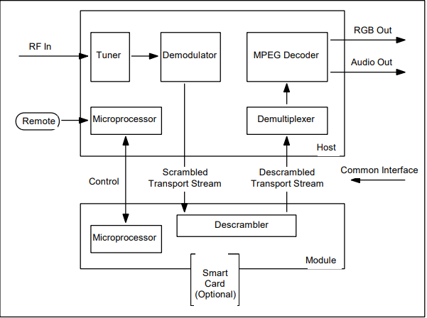
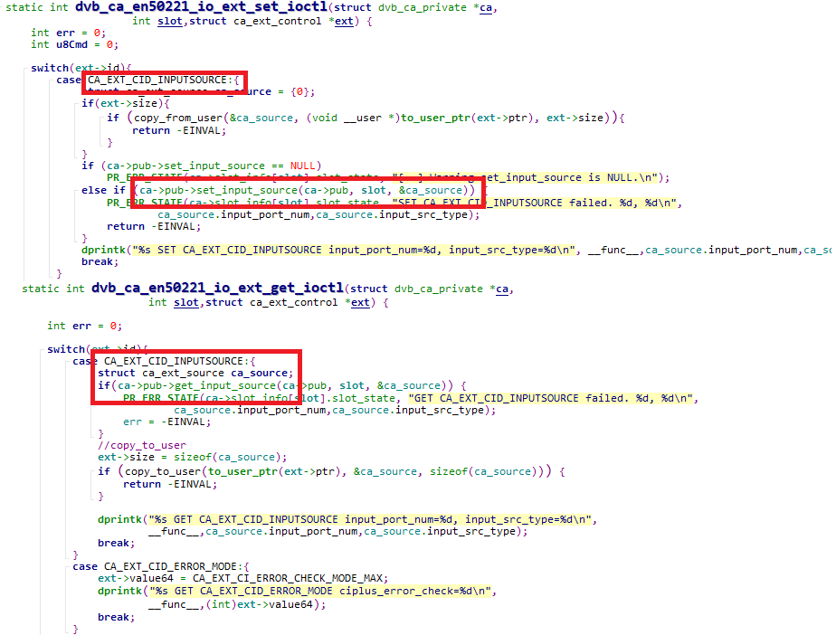
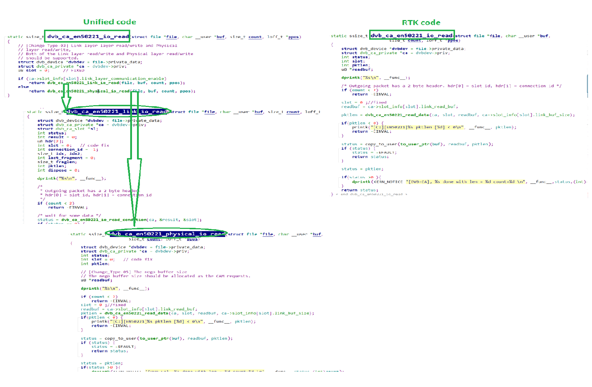
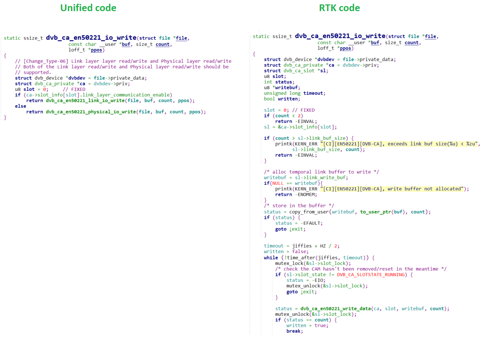
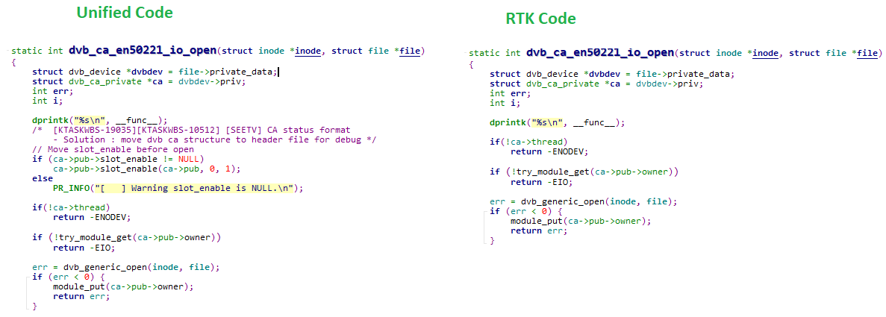
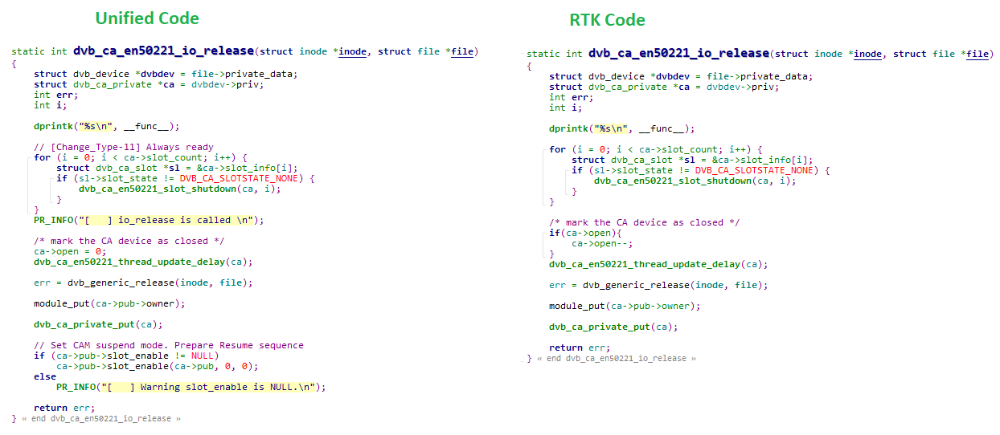
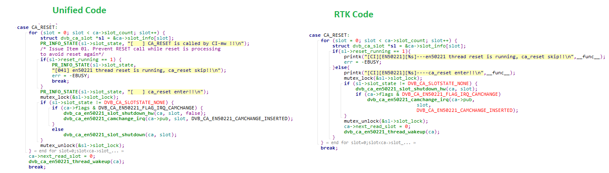
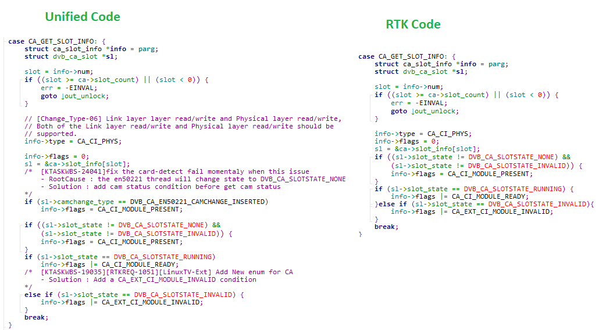
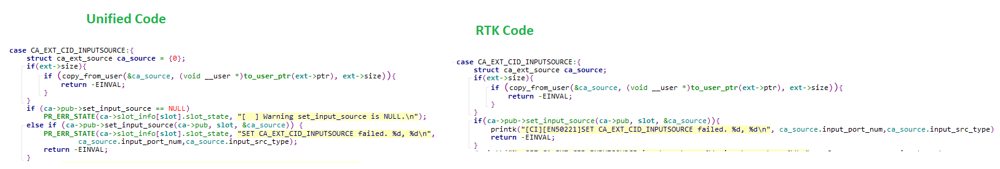
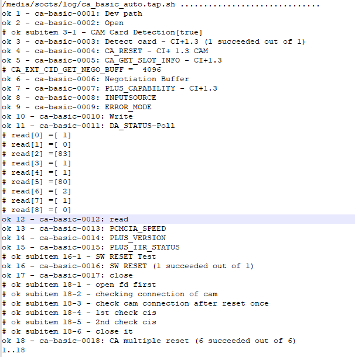

CA
####

.. _crystal.moon: crystal.moon@lge.com
.. _seong.lee: seong.lee@lge.com
.. _darshil.patel: darshil.patel@lge.com
.. _kyoungwon.seo: kyoungwon.seo@lge.com

Introduction
************

| This document describes the Conditional Access (CA) driver in the kernel space. The CA driver provides a standard interface between the Conditional Access Module (CAM) and webOS TV.

| The document gives an overview of the CA driver and provides details about its functionalities and implementation requirements.

Revision History
================

=============== ============ =================== ==========================================
Version         Date         Changed by          Description
=============== ============ =================== ==========================================
1.26.0          2024-11-18   `crystal.moon`_     Moved poll to Common API; deleted Extended IOCTL and assetization/standardization column from the API list
1.25.0          2024-10-28   `crystal.moon`_     Corrected grammatical errors and improved formatting; added assetization/standardization status to the API list
1.24.0          2024-06-11   `kyoungwon.seo`_    | minor fix
                                                 | open() explanation is modified
1.23.0          2023-11-20   `darshil.patel`_    Initial release
=============== ============ =================== ==========================================

Terminology
===========

| The key words "must", "must not", "required", "shall", "shall not", "should", "should not", "recommended", "may", and "optional" in this document are to be interpreted as described in RFC2119. 

| The following table lists the terms used in the VDEC module guide. You should also refer to the MPEG-2 specification and ATSC / DVB standards for frequently used terms in the field of digital video decoding.

**webOS TV specific**

=============================== ===============================
Term                            Description
=============================== =============================== 
CA                              Conditional Access
CAM                             Control Access Module
CI                              Common Interface
CSA                             Common Scrambling Algorithm
DES                             Data Encryption System
DTV                             Digital TV Broadcasting
=============================== =============================== 

Technical Assistance
====================

For assistance or clarification on information in this guide, please create an issue in the LGE JIRA project and contact the following person:

============ ===============================
Module       Owner
============ =============================== 
CA           `seong.lee`_
============ =============================== 

Overview
********

General Description
===================

| A Conditional Access Module (CAM) or CI (Common Interface) Module is a hardware device that can be used with digital television receivers to enable the decryption of encrypted channels.

| It's commonly used in conjunction with a smart card to access subscription-based or encrypted content.

| The CI standard provides a way for TV manufacturers to implement a common interface for conditional access systems, ensuring compatibility with various providers.

| Conditional access provides a standard interface between the module (CI CAM + Smartcard) and the host (webOS TV). This allows broadcast suppliers to use CA (Conditional Access) modules from various solution suppliers.

| This means that DTV which has CI can watch a different type of CA-based broadcast by simply changing the CAM (CA Module). This is accomplished by standardizing the interface between the host and the module.

| This modular approach ensures compatibility across different manufacturers, allowing users to switch devices without losing access to their subscribed services.

Features
========

| The CA module provides the following features:

- Conditional Access: Enables the decryption of encrypted channels, allowing users to access subscription-based or protected content.

- Smart Card Integration: Works in conjunction with a smart card provided by the TV service provider, containing necessary authorization information for accessing specific channels or services.

- Security: Incorporates advanced encryption algorithms to secure communication between the CI Module and the smart card, enhancing the overall security of the conditional access system.

- Content Protection: Plays a crucial role in protecting premium content by decrypting signals only for authorized users with the correct smart card, preventing unauthorized access.

- Upgradeability: Allows for updates to encryption systems or security protocols without requiring users to replace the entire TV or set-top box, supporting long-term usability.

- Modularity: Provides a standardized slot on digital TVs or set-top boxes where the CI Module can be inserted, allowing for a modular and upgradeable approach to conditional access.

- Interoperability: Follows a standardized CI standard, ensuring compatibility across different manufacturers' devices, facilitating seamless integration and allowing users to switch devices without losing access to subscribed services.

- Flexibility: Provides flexibility for users to switch between different TV service providers by changing the smart card in the CI Module, allowing for choices of television services.

Architecture
============

| The following diagram shows the architecture of the CI module from an inter-module perspective (driver architecture) as well as its internal point of view (internal architecture). 

| In the diagram above, Host means webOS TV and Module means CI CAM + Smartcard.

| The flow is summarized as follows:

| 1. TV gets the signal from RF cable and Tuner will receive this signal.

| 2. From Tuner, this signal sent to Demodulator.

| 3. Demodulator extracts the original information from signal.

| 4. In this signal, scrambled transport stream is sent to the Descrambler via Common Interface.

| 5. Descrambler is descramble the encrypted video signal using decryption keys of CAM.

Requirements
************

| This section describes the main functionalities of the CI module in terms of the module's requirements and constraints.

Functional Requirements
=======================

| The functional requirements of the CA module are as follows:
- Encrypt and decrypt the secure signal to protect content from unauthorized access.

- Support a smart card interface for the authentication and authorization process.

- Ensure compatibility with various conditional access systems and encryption algorithms used by broadcasters.

- Efficiently manage cryptographic keys for secure communication between CAM and the conditional access system.

- Provide a secure method for user authentication, ensuring that only authorized users can access content.

- Implement mechanisms to control specific content based on subscription.

- Allow firmware upgrades to adapt to changes in the conditional access system or to address security vulnerabilities.

Quality and Constraints
=======================

| This section lists the non-functional requirements for the CA module, quality requirements and design constraints.

Driver Compatibility
--------------------

| Ensure that it has compatible device drivers for a range of digital television devices, such as set-top boxes and integrated digital TV.

| Verify that its drivers are compatible with the operating system used by popular DTV devices. This may include support for various versions of embedded systems.

| The module must be compatible with a common interface host. Verify that the drivers facilitate smooth communication between the CAM module and the host device.

Kernel Support
--------------

| Its driver must have a compatible interface with the Linux kernel or the kernel used by the target operating system.

| If the module requires specific functionalities that are not part of the standard kernel, it might need a kernel module. The module must be designed to seamlessly integrate with existing kernel infrastructure.

| Ensure that its driver is compatible with a range of kernel versions.

Implementation
**************

| This section provides supplementary materials that are useful for CA implementation. 

- The File Location section provides the location of the Git repository where you can get the header files in which the interface for the CA implementation is defined.
- The API List section provides a brief summary of CA APIs.

File Location
=============
| The CA interfaces are defined in the `dvbv5-ext-ca.h <http://10.157.97.248:8000/bsp_document/master/latest_html/api/file_full_build_source_part2_dvbv5-ext-header_linux_dvbv5-ext-ca.h.html#file-full-build-source-part2-dvbv5-ext-header-linux-dvbv5-ext-ca-h>`_ header file, which can be obtained from https://swfarmhub.lge.com/.

- Git repository: bsp/ref/dvbv5-ext-header

| This Git repository contains the header files for the VDEC implementation as well as documentation for the VDEC implementation guide and VDEC API reference.

Structure
=========

CI _CH_T
--------

| This enumeration defines the input port for CI Plus 1.4.

    .. code-block:: cpp
        typedef enum
        {
            CI_CH_0= 0x00,
            CI_CH_1= 0x01,
            CI_CH_2 = 0x02,
            CI_CH_3 = 0x03,
        } CIPLUS_CI_CH_T;

=============================== ===============================
Member                          Description
=============================== ===============================
CI_CH_0                         CI port-0 
CI_CH_1                         CI port-1
CI_CH_2                         CI port-2
CI_CH_MAX                       CI port-Max
=============================== ===============================

CIPLUS_DECRYPT_KEY_DST_T
------------------------

| This enumeration defines the target place where the decrypting-keys are applied.

    .. code-block:: cpp
        typedef enum
        {
            CIPLUS_DECRYPT_KEY_DST_SDEC_INPUT_CH_A = 0x0,     
            CIPLUS_DECRYPT_KEY_DST_SDEC_INPUT_CH_B = 0x1,       
            CIPLUS_DECRYPT_KEY_DST_SDEC_INPUT_CH_C = 0x2,     
            CIPLUS_DECRYPT_KEY_DST_SDEC_INPUT_CH_D = 0x3,       
            CIPLUS_DECRYPT_KEY_DST_DEMUX_OUT_CI_CH_0 = 0x10,             
            CIPLUS_DECRYPT_KEY_DST_DEMUX_OUT_CI_CH_1 = 0x11,             
            CIPLUS_DECRYPT_KEY_DST_DEMUX_OUT_CI_CH_2 = 0x12,             
            CIPLUS_DECRYPT_KEY_DST_DEMUX_OUT_CI_CH_3 = 0x13,,           
            CIPLUS_DECRYTT_KEY_DST_MAX               = 0xff,
        }CIPLUS_DECRYPT_KEY_DST_T;

============================================= ===============================
Member                                        Description
============================================= ===============================
CIPLUS_DECRYPT_KEY_DST_SDEC_INPUT_CH_A        The decrypting-keys are applied to SDEC Channel A.
CIPLUS_DECRYPT_KEY_DST_SDEC_INPUT_CH_B        The decrypting-keys are applied to SDEC Channel B.
CIPLUS_DECRYPT_KEY_DST_SDEC_INPUT_CH_C        The decrypting-keys are applied to SDEC Channel C.
CIPLUS_DECRYPT_KEY_DST_SDEC_INPUT_CH_D        The decrypting-keys are applied to SDEC Channel D.
CIPLUS_DECRYPT_KEY_DST_DEMUX_OUT_CI_0         The decrypting-keys are applied to DEMUX output’s CI_CH_0
CIPLUS_DECRYPT_KEY_DST_DEMUX_OUT_CI_1         The decrypting-keys are applied to DEMUX output’s CI_CH_1
CIPLUS_DECRYPT_KEY_DST_DEMUX_OUT_CI_2         The decrypting-keys are applied to DEMUX output’s CI_CH_2
CIPLUS_DECRYPT_KEY_DST_DEMUX_OUT_CI_3         The decrypting-keys are applied to DEMUX output’s CI_CH_3
============================================= ===============================

CIPLUS_DATARATE_T
-----------------

| This enumeration describes the data rate on PCMCIA bus for CI plus.

    .. code-block:: cpp

        typedef enum
        {
            CIPLUS_DATARATE_72 = 0,
            CIPLUS_DATARATE_96,
        } CIPLUS_DATARATE_T;

=============================== ===============================
Member                          Description
=============================== ===============================
CIPLUS_DATARATE_72              72 Mbit/s
CIPLUS_DATARATE_96              96 Mbit/s
=============================== ===============================

CIPLUS_CRYPTOGRAPHY_T
---------------------

| This enumeration defines the CI PLUS cryptography type.

    .. code-block:: cpp

        typedef enum
        {
            CIPLUS_CRYPTOGRAPHY_DES = 0,
            CIPLUS_CRYPTOGRAPHY_AES = 1,
        } CIPLUS_CRYPTOGRAPHY_T;

=============================== ===============================
Member                          Description
=============================== ===============================
CIPLUS_CRYPTOGRAPHY_DES         DES
CIPLUS_CRYPTOGRAPHY_AES         AES
=============================== ===============================

CIPLUS_CIPHER_KEY_T
-------------------

    .. code-block:: cpp

        typedef enum
        {
            CIPLUS_CIPHER_KEY_EVEN = 0,
            CIPLUS_CIPHER_KEY_ODD = 1
        } CIPLUS_CIPHER_KEY_T;

=============================== ===============================
Member                          Description
=============================== ===============================
CIPLUS_CIPHER_KEY_EVEN          Even Key.
CIPLUS_CIPHER_KEY_ODD           Odd Key.
=============================== ===============================

CIPLUS_EVENT_HANDLER_INFO_T
---------------------------

    .. code-block:: cpp

        typedef void (*PFN_CIPLUS_EVENT_CB) (UINT16 *pValue)

        typedef struct CIPLUS_EVENT_HANDLER_INFO
        {
        CIPLUS_EVENT_HANDLER_INFO_TC IPLUS_CI_CH_T muxInputCh;
        UINT16 underflowThreshold;
        UINT16 overflowThreshold;
        PFN_CIPLUS_EVENT_CB pfnUnderBufferflowHandler;
        PFN_CIPLUS_EVENT_CB pfnOverBufferflowHandler;
        } CIPLUS_EVENT_HANDLER_INFO_T;

============================= ===============================
Member                        Description
============================= ===============================
Ch                            CIPLUS Input Channel. It should be 0 or 1 or 2.
underflowThreshold            Threshold percentage value of underflow (0~100). The value reflects the percentage value comparing the total memory buffer-100%.
overflowThreshold             Threshold value of overflow (0~100). The value reflects the percentage value comparing the total memory buffer-100%.
pfnUnderBufferflowHandlerr    Function pointer whose function is called in below for cases. when the status is changed from normal to underflow .when the status is changed from underflow to normal .the *pValue is the current percentage value of the upload memory buffer.
pfnOverBufferflowHandler      Function pointer whose function is called in below for cases.when the status is changed from normal to overflow,when the status is changed from overflow to normal,the *pValue is the current percentage value of the upload memory buffer.
============================= ===============================

CI_ERROR_CHECK_MODE_T
---------------------

| This enumeration describes the error check mode (simple mode or full mode) .

    .. code-block:: cpp

        typedef enum

        {
        CI_ERROR_CHECK_MODE_FULL,
        CI_ERROR_CHECK_MODE_SIMPLE,
        CI_ERROR_CHECK_MODE_MAX,

        } CI_ERROR_CHECK_MODE_T;

=============================== ===============================
Member                          Description
=============================== ===============================
CI_ERROR_CHECK_MODE_FULL        FULL CHECK
CI_ERROR_CHECK_MODE_SIMPLE      SIMPLE CHECK
=============================== ===============================

CISTPL_DATA
-----------

| This structure describes the CISTPL_DATA .

    .. code-block:: cpp

        typedef struct CISTPL_DATA
        {
                  UINT8 numOfRealData;
                  UINT8 data[255];
        }CISTPL_DATA_T;

=============================== ===============================
Member                          Description
=============================== ===============================
numOfRealData                   Number of Data
data[255]                       Data
=============================== ===============================

API List
========

Data Types
----------

Standard CA Data Types
^^^^^^^^^^^^^^^^^^^^^^

======================================= ===============================
Name                                    Description
======================================= ===============================
:c:type:`v4l-dvb-apis:ca_slot_info`     This struct stores the CA slot information.
:c:type:`v4l-dvb-apis:ca_descr_info`    Identifies the number of descramblers and their type.
:c:type:`v4l-dvb-apis:ca_caps`          CA slot interface capabilities.
:c:type:`v4l-dvb-apis:ca_msg`           A message to/from a CI-CAM.
:c:type:`v4l-dvb-apis:ca_descr`         CA descrambler control words info
======================================= ===============================

Extended CA Data Types
^^^^^^^^^^^^^^^^^^^^^^

======================================= ===============================
Name                                    Description
======================================= ===============================
:cpp:class:`ca_ext_control`             Specifies CA Extended ioctl parameters. CI struct for CA_EXT_S_CTL or CA_EXT_G_CTL.
:cpp:enum:`ca_src_type`                 Enum for Input source type to CAM.
:cpp:enum:`ca_ext_ciplus_datarate`      Enum for Data rate from CAM.
:cpp:enum:`ca_ext_error_mode`           Enum for Data error check mode
:cpp:enum:`ca_ext_pcmcia_speed`         Enum for PCMCIA io speed.
:cpp:class:`ca_ext_source`              Struct for input source information.
======================================= ===============================

Functions
---------

Linux Common Functions
^^^^^^^^^^^^^^^^^^^^^^

======================================= ===================================================================== 
Function                                Description
======================================= ===================================================================== 
:ref:`open <dvbv5-open>`                | This system call opens a named ca device for subsequent use
                                        |
                                        | See also
                                        | - :c:macro:`DEFAULT_CA_DEV_NO`
                                        | - :c:macro:`STRING_CIP0_DEV`
                                        | - :c:macro:`STRING_CIP1_DEV`
                                        | - :c:macro:`STRING_CIP2_DEV`
:ref:`close <dvbv5-close>`              This system call closes a previously opened CA device
poll                                    The "poll" ioctl lets platform know a fact that some data which should be read by TV appear in CICAM.
======================================= ===================================================================== 

Module Standard Functions
^^^^^^^^^^^^^^^^^^^^^^^^^

======================================================================================= =================================================================================================================================================================================================================== 
Function                                                                                  Description
======================================================================================= =================================================================================================================================================================================================================== 
:ref:`CA_RESET <v4l-dvb-apis:CA_RESET>`                                                   If CA_RESET is called, CAM HW becomes reset and the kernel's CAM controlling SW, the dvb_ca_en50221_thread also resets its internal state to DVB_CA_SLOTSTATE_NON and the CAM initializing process restarts.
:ref:`CA_GET_SLOT_INFO <v4l-dvb-apis:CA_GET_SLOT_INFO>`                                   Returns information about a CA slot identified by ca_slot_info.
======================================================================================= =================================================================================================================================================================================================================== 

Module Extended Functions
^^^^^^^^^^^^^^^^^^^^^^^^^

======================================= ============================================================================================= 
Function                                Description
======================================= ============================================================================================= 
:c:macro:`CA_EXT_CID_INPUTSOURCE`       Sets input type of the CI Device.
:c:macro:`CA_EXT_CID_DA_STATUS`         Reads DA(Data Available) bit in a status register.
:c:macro:`CA_EXT_CID_ERROR_MODE`        Set status-check mode in HW IO access.
:c:macro:`CA_EXT_CID_PLUS_CAPA`         Check the value of CAM between CI CAM and CI+ CAM.
:c:macro:`CA_EXT_CID_DATA_RATE`         Gets the data rate on PCMICA bus for CI Plus.
:c:macro:`CA_EXT_CID_PCMCIA_SPEED`      Set PCMCIA read, write speed setting.
:c:macro:`CA_EXT_CID_PLUS_VERSION`      Reads CI PLUS version in the CIS information.
:c:macro:`CA_EXT_CID_PLUS_IIR_STATUS`   Reads IIR(Initialize Interface Request) bit in a status register for CI Plus.
:c:macro:`CA_EXT_CID_SET_RS_BIT`        Writes a '1' to the RS bit in the Control Register.
:c:macro:`CA_EXT_CID_GET_NEGO_BUFF`     Getting of negotiated buffer size during module initialization.
======================================= ============================================================================================= 

Implementation Details
======================

CA Unified Kernel Code
----------------------

Background
^^^^^^^^^^

LGE has been using the below user space API (IOCTL) as the driver interface of CI modules.

* CI : https://linuxtv.org/downloads/v4l-dvb-apis/userspace-api/dvb/ca_function_calls.html

Below them, there are some Linux open source code as follows:

CI module: 
  * https://elixir.bootlin.com/linux/v5.4.213/source/drivers/media/dvb-core/dvb_ca_en50221.c 
  * https://elixir.bootlin.com/linux/v5.4.213/source/include/media/dvb_ca_en50221.h 
  * https://elixir.bootlin.com/linux/v5.4.213/source/drivers/media/dvb-core/dvb_ringbuffer.c 

The above mentioned Linux DVBv5's open source code has some parts which should be modified to meet LGE TV's requirements and facilitate mass production. Moreover, they have some defects and have caused many SW issues. 

It is hard for LGE to make TV SoC engineers understand how the Linux open source code should be modified with only guiding documents. TV SoC engineers will also feel the same difficulty in understanding them. For improving this problem, LGE suggests the following method.

* LGE provides reference source code to TV SoC vendors. The SoC vendors apply this reference code to their own code.

* Because the reference codes are located in the BSP, the TV SoC should review them first when an issue related to this reference code occurs.

* If TV SoC engineers want to modify the reference code, they should notify LGE of this modification. If acceptable, LGE will apply this in the reference code. All of the code modifying actions will be processed through Harmony Jira.

Physical Layer Interface
^^^^^^^^^^^^^^^^^^^^^^^^

The Linux open-source code which corresponds to LGE's CA reference code uses the physical layer interface (https://linuxtv.org/downloads/v4l-dvb-apis/driver-api/dtv-ca.html). 
LGE added some extension interfaces like below.

=============================== ===============================
Function                        Description
=============================== ===============================
slot_enable                     This interface controls CAM power state.
set_input_source                This interface changes CAM's input source.
get_input_source                This interface returns information about current input source.
=============================== ===============================

* ``slot_enable``

  Control CAM power state. Depending on the value of enable, the third parameter, the operation changes.
  If this value is 1, the CAM is initialized or booted. This action is called in CA kernel loading or TV boot.
  If 0, the CAM goes into suspend mode. This action is called in TV suspending.

  * pub : pub pointer
  * slot : slot index
  * enable : Control CAM. Initialize or resume if 1, set suspend mode if 0

* ``set_input_source``

  This interface is called when put CA_EXT_CID_INPUTSOURCE command is called. This interface
  changes CAM's input source.
  The parameters

  * pub : pub pointer
  * slot : slot index
  * ca_source : struct ca_ext_source

* ``get_input_source``

  This interface is called when get CA_EXT_CID_INPUTSOURCE command is called. This interface 
  returns information about current input source.
  The parameters

  * pub : pub pointer
  * slot : slot index
  * ca_source : struct ca_ext_source

Unification
************

| The CI API which has been unified as part of the POC `TVPLAT-229413 <http://hlm.lge.com/issue/browse/TVPLAT-229413?attachmentSortBy=dateTime&attachmentOrder=asc>`_ .CI (Common Interface) is CICAM required for watching paid DTV. 

Purpose
=======

| The purpose of the unification is to provide an interface to directly access the control/data register, which is a control register related to CICAM's power control and communication between CICAM and TV.

| LGE to LGE TV specifications.It is supplemented accordingly, equated across all Soc companies, and maintained and managed to make LGE an asset.

|  In the case of the CI module, it include a kernel thread and this thread determines whether to connect or disconnect CICAM to the TV. Monitors and implements CICAM initialization sequence when a connection is detected.

| However, because LGE did not present standards for change to Soc companies, Soc companies were changing and using their own methods to implement LGE TV specifications, and the change methods varied widely among Soc companies, and there was a difference in skill between Soc companie
LGE provides new SoC companies with a diff file that allows them to cherry-pick the asset code into the Linux original code. By doing this, whenever a new SoC company is introduced, it is possible to avoid repeating the trials and errors that the SoC company undergoes while modifying the source codes subject to assetization on its own.

| This is because it is very difficult to make the SoC understand how to modify these “intermediate source codes” through the BSP implementation guide document alone, and it is difficult to make the SoC understand that Linux provides the characteristics that a specific hw specific low-level driver API should have.
This is to reduce the resources required for communication between LGE and Soc by not only having them read the official document of hw specific low-level driver API and LGE’s BSP Implementation Guide document, but also having them understand it themselves by directly analyzing the asset code.

| Assuming AMLOGIC is a new Soc company, AMLOGIC will directly port the diff file of the Linux code to be capitalized compared to the Linux original code derived through work with RTK/MTK/SIC. Accordingly, not only will we improve the quality of AMLOGIC’s SDEC/CI BSP, but we will also verify the validation of this new method itself by measuring the degree of reduction in resources consumed by AMLOGIC and LGE for this porting work.

File Location
=============

| All the unified code w.r.t SDEC Module has been located at this `location  <https://wall.lge.com/gitweb?p=webos-pro/bsp/ref/unified-kernel-dec.git;a=blob;f=include/media/dvb_ca_en50221.h;h=d962f01fd111de287cb19ad29534bcea89af4e51;hb=f6d7f04ea3c65a7777d6e3a31acafd37d2cbc150>`_.

=============================== ===============================
Function                        Description
=============================== ===============================
set_input_source	        Function for setting the i/p source as part of ioctl call
get_input_source                Function for getting the i/p source as part of ioctl call
=============================== ===============================

Relevant Code Snippet for (CI Assetization)
============================================

Differences of Assetized API & SOC’s API
========================================

-Unified file:- dvb-code_dvb_ca_en50221.c
-RTK code:- RTK_dvb_ca_en50221.c

| dvb_ca_en50221_init() Function initialize the CA and call dvb_register_device() to register the CA device.

| call the dvb_register_device() with the parameter as structure as dvb_device .
| In dvb_device structure parameter assign another structure dvb_ca_fops.
| In this Structure call the function for read ,write ,ioctls ,open, release and poll.

| **dvb_ca_en50221_io_read**

| dvb_ca_en50221_io_read() is called from file_operation structure to read the data from CA.

| In RTK code, first it will allocate read_buf for reading the data using the dvb_ca_en50221_read_data() Function.
| Read Function is only supported for Physical layer read it will not check the condition for link and physical io read.

| In Unified code, it will support both link layer and Physical layer read operation.
In this function first it will check the link layer communication is enabled or not. If the link layer communication is enabled than it calls the dvb_ca_en50221_link_io_read() function to read in link layer.
If Link layer communication is not enabled, then it calls the dvb_ca_en50221_physical_io_read() function to read in Physical layer.

In Asset code 2 functions are there to read the data link and physical, but in RTK directly call the io_read to read data, this io_read function is same as physical read in asset code.

| **dvb_ca_en50221_io_write**

| dvb_ca_en50221_io_write() function is called from file_operation structure to write the data into CA.

| In RTK, this function it will check the buffer size and after that allocate the write buffer and write the data using this dvb_ca_en50221_write_data() function.
| It will only support physical layer read.

| In unified code, this function it will check link layer communication is enable or not. if link layer communication is enabled then it will call dvb_ca_en50221_link_io_write() function for link layer write.
| If it is not enabled it will call dvb_ca_en50221_physical_io_write() function for physical layer write.
| In link layer write it will check the slot in CAM Module and it is running after this it will check the CAM is not removed or reset.
| After this it will call the dvb_ca_en50221_write_data() to write the data.
| In physical layer it will check the buffer size and after that allocate the write buffer and write the data using this dvb_ca_en50221_write_data() function.

| **dvb_ca_en50221_io_open**

| dvb_ca_en50221_io_open() function is called from file_operation structure to open the CAM module.

| In RTK this function it will check the CA slot info and state of CA, if CA state is DVB_CA_SLOTSTATE_RUNNING or not.
| After this, it will check buffer data in slot if buffer data is present then they will flush the data using dvb_ringbuffer_flush()
| After this it will enable CAM module.

| In unified first it will check the slot enable is NULL or not, if it is NULL it will throw the warning.
| If CA slot is enabled, it will set the state of CAM Module to Resume state using this function ca->pub->slot_enable(ca->pub, 0, 1); 
| After this it will check the CA slot info and state of CAM, if CAM state is DVB_CA_SLOTSTATE_RUNNING or not. if slot is Running then check buffer data in slot if it is there they will flush the data then enable CAM module.

| **dvb_ca_en50221_io_release**

| In RTK, it will check the CA slot state is DVB_CA_SLOTSTATE_NONE or not. If CA slot state is DVB_CA_SLOTSTATE_NONE then it will call the dvb_ca_en50221_slot_shutdown() to release the CA device.
| After this mark the CA device as closed.

| In Unified, it will check the CA slot state is DVB_CA_SLOTSTATE_NONE or not.
| If CAM state is DVB_CA_SLOTSTATE_NONE then it will call the dvb_ca_en50221_slot_shutdown() to release the CA device.
| After this Mark the CA device as closed.
| After marking device as closed it will check the slot enable is NULL or not. and set the CAM Module suspend mode and prepare resume sequence by calling ca->pub->slot_enable(ca->pub, 0, 0).

| **dvb_ca_en50221_io_ioctl**

| dvb_ca_en50221_io_ioctl() function is called from file_operation structure to set and get the CA data.
| In both code, this is wrapper API Which called dvb_ca_en50221_io_do_ioctl().
| In dvb_ca_en50221_io_do_ioctl() based on different cmd value it will process the CA like CA_RESET, CA_GET_CAP, CA_GET_SLOT_INFO, CA_EXT_S_CTL & CA_EXT_G_CTL.

| **Case1 : If cmd == CA_RESET** 
| it will reset the CAM Module.

| In RTK it will check the Reset process is already running or not.
| If Reset process is already running it will again rotate the loop till slot value reaches the CA slot value.
| If Reset process is not running, it will start the Reset process and call dvb_ca_en50221_slot_shutdown_hw() for reset the CA.

| In Unified also it will check the Reset process is running or Not.
| If reset is running, so it will come out of the Loop to prevent Multiple reset Call.
| If reset is not running, it will process to Reset the CA Device and Call dvb_ca_en50221_slot_shutdown() for Reset the CA

| **Case2: If cmd == CA_GET_CAP**
| It will get the information about CA.
| 1. Number of slots supported by CA interface.
| 2. Types of CA Slot, Number Of descramble and type of descrambler.
| No Difference in this Function.

| **Case3: If cmd == CA_GET_SLOT_INFO** 
| It will get the information about CA Slot.

| In RTK, first it will set the slot information type to CA_CI_PHYS and Flag to 0.
| After this it will check the CAM state, if CAM state is not DVB_CA_SLOTSTATE_NONE and DVB_CA_SLOTSTATE_INVALID. then it will set the information flag to CA_CI_MODULE_PRESENT.
| Then it will check if CA State is DVB_CA_SLOTSTATE_RUNNING then it will set the information flag to CA_CI_MODULE_READY.
| If CA State is DVB_CA_SLOTSTATE_INVALID then it will set the information flag to CA_EXT_CI_MODULE_INVALID.

| In Unified Code also it will set the slot information type to CA_CI_PHYS and Flag to 0.
| But in unified code first it will check the CAM Change type.
| If CAM Change type is DVB_CA_EN50221_CAMCHANGE_INSERTED then it will set the information flag to CA_CI_MODULE_PRESENT.

| **Case4: If cmd == CA_EXT_S_CTL**
| dvb_ca_en50221_io_ext_set_ioctl() function calls for set the CA Device.
| In this function, it will call the different function base on the ca_set_ext.

| Here check the external ID's to set the CA data.

| **1. ext == CA_EXT_CID_INPUTSOURCE**

| In RTK It will check the ext size and After this it will set the input source by calling set_input_source() Function.
| If this Function failed it print SET CA_EXT_CID_INPUTSOURCE failed. If It Run perfectly it prints the input port number and input type.

| In Unified after checking the ext size it will check the input source is not NULL.
| If Input source is not NULL then it will call the set_input_source() Function to set the input source.
| And check set_input_source() Run Perfectly or Not.

| **2. If ext == CA_EXT_CID_ERROR_MODE**
| It will create error Mode enumrator and set the value ext->value64.

| **3. If ext == CA_EXT_CID_PCMCIA_SPEED**
| It will create variable of enumrator ca_ext_pcmcia_speed and set the value ext->value64.

| **4. If ext == CA_EXT_CID_SET_RS_BIT**
| It will set the Reset command.

| **Case5: If cmd == CA_EXT_G_CTL**
| It will call dvb_ca_en50221_io_ext_get_ioctl() function to get the data from the CA based on ext value.

| **1. If ext == CA_EXT_CID_INPUTSOURCE**
| It will call the get_input_source() Function to get the informationabout the CA input source type,input Port.

| **2. If ext == CA_EXT_CID_ERROR_MODE**
| It will get the error mode from CA_EXT_CI_ERROR_CHECK_MODE_MAX.

| **3. If ext == CA_EXT_CID_PLUS_CAPA**
| In This It will check current state of CA is DVB_CA_SLOTSTATE_RUNNING.
| If current state is DVB_CA_SLOTSTATE_RUNNING then it will get the information about CA is CI plus ecard or not.

| **4. If ext == CA_EXT_CID_DATA_RATE**
| In This it will get the data rate of CA.
| If CA current state is DVB_CA_SLOTSTATE_RUNNING,then data rate will be CA_EXT_CIPLUS_DATARATE_96,
| Otherwise it will get data rate from CA_EXT_CIPLUS_DATARATE_72.

| **5. If ext == CA_EXT_CID_PLUS_VERSION**
| It will use to get the CIplus version by using the  ca->slot_info[slot].ciplus_version.

| **6. If ext == CA_EXT_CID_GET_NEGO_BUFF**
| It will get the size of buffer using the get_ci_negobuf_size() Function.          

Testing
*******

| To test the implementation of the CA module, webOS TV provides SoCTS (SoC Test Suite) tests. The SoCTS checks the basic operations of the CA module and verifies the kernel event operations for the module by using a test execution file. 
For more information, see :doc:`CA’s SoCTS Unit Test manual </part4/socts/Documentation/source/producer-manual/producer-manual_dvbv5/producer-manual_dvbv5-ca>`.

References
**********
