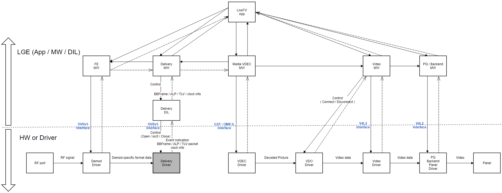
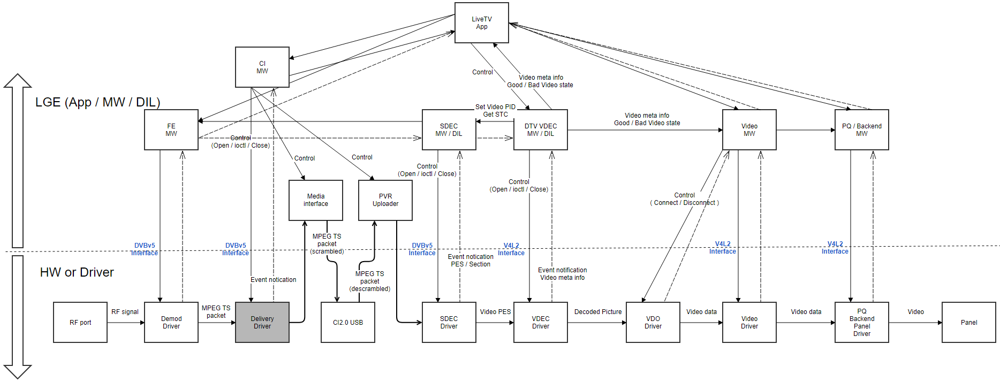
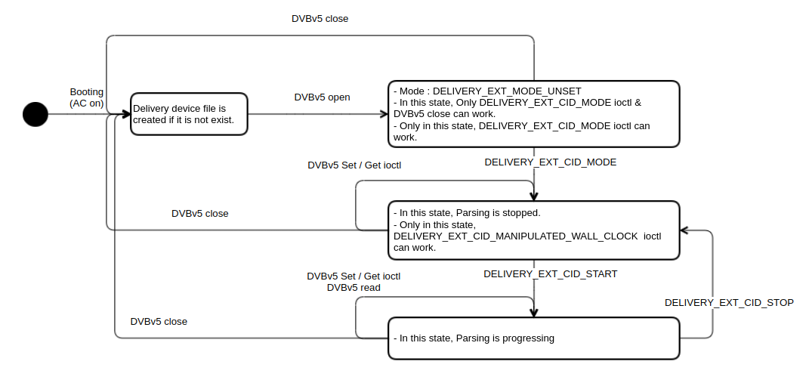
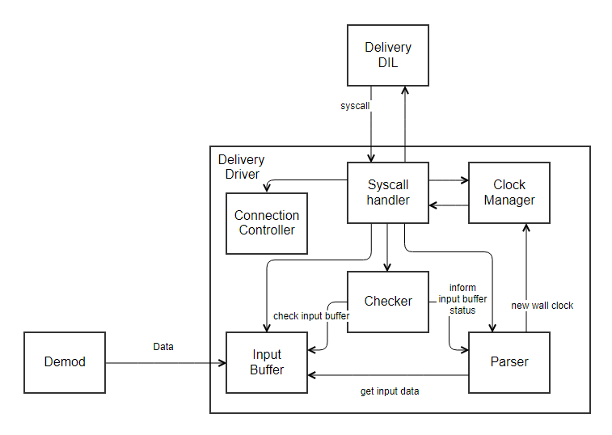
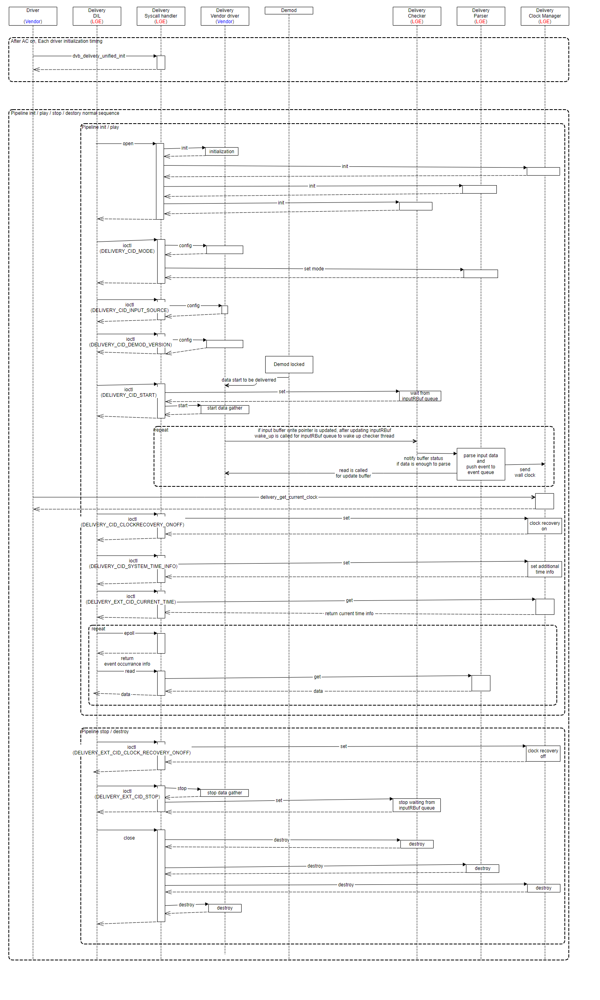

Delivery
========

.. _crystal.moon: crystal.moon@lge.com
.. _kyoungwon.seo: kyoungwon.seo@lge.com
.. _minhye.kim: minhye.kim@lge.com

Introduction
-------------

| This document describes the Delivery module in the kernel space. This document gives an overview of the Delivery module and provides details about its functionalities and implementation requirements.
| The Delivery module is responsible for delivering data for ATSC 3.0 / Japan UHD / CI+ 2.0 from the demodulator BSP to the broadcasting MW. It is also responsible for managing the clock and parsing data. Therefore, this document assumes that the readers are familiar with the specifications of ATSC 3.0, Japan UHD, and CI+ 2.0.


Revision History
^^^^^^^^^^^^^^^^^^

======= ========== ================ ========================================================
Version Date       Changed by       Comment
======= ========== ================ ========================================================
1.26.0  2024-11-18 `crystal.moon`_  Fixed title level inconsistency; updated Function Calls API; deleted Extended IOCTL and assetization/standardization status from the API list
1.25.0  2024-10-28 `crystal.moon`_  Corrected grammatical errors and improved formatting; added assetization/standardization status to the API list
1.24.0  2024-07-05 `kyoungwon.seo`_ Unified driver related description is added
1.23.0  2023-12-28 `kyoungwon.seo`_ The document has been revised throughout to a new format
                   `minhye.kim`_
1.22.2  2022-06-28 `kyoungwon.seo`_ DELIVERY_EXT_CID_MANIPULATED_WALL_CLOCK is added
1.22.1  2022-06-27 `kyoungwon.seo`_ DELIVERY_EXT_CID_INPUT_SOURCE description is updated
1.22.0  2022-03-15 `kyoungwon.seo`_ Delivery ioctl parameter description is updated
1.21.0  2021-04-30 `kyoungwon.seo`_ CI+ 2.0 related description is added
1.20.0  2020-03-27 `kyoungwon.seo`_ Initial release
======= ========== ================ ========================================================

Terminology
^^^^^^^^^^^^
The key words "must", "must not", "required", "shall", "shall not", "should", "should not", "recommended", "may", and "optional" in this document are to be interpreted as described in RFC2119.

The following table lists the terms used throughout this document:

================================ ============
Term                             Description
================================ ============
DTV                              Digital TeleVision.
SD                               Standard Definition. Generally, this means 480p/576i resolution.
HD                               High Definition. Generally, this means 720p resolution.
FHD                              Full High Definition. Generally, this means 1080i resolution.
UHD                              Ultra High Definition. Generally, this means 4K/8K resolution.
ATSC                             Advanced Television Systems Committee, an American set of standards for digital television transmission over terrestrial, cable, and satellite networks.
DVB                              Digital Video Broadcasting, a set of international open standards for digital television.
ARIB                             Association of Radio Industries and Businesses, a standardization organization in Japan.
ES                               Elementary Stream.
PES                              Packetized Elementary Stream.
TS                               Transport Stream.
STC                              System Time Clock.
PTS                              Presentation Time Stamp.
CPB                              Coded Picture Buffer.
UTC                              Coordinated Universal Time/Universal Time Coordinated.
ATSC 3.0                         A major version of the ATSC standards for television broadcasting created. The standards are designed to offer support for newer technologies, including HEVC for video channels of up to 2160p resolution at 120 frames per second, wide color gamut, high dynamic range, Dolby AC-4 and MPEG-H 3D Audio.
ATSC 3.0 channel                 ATSC 3.0 broadcasting channel in KR / US.
Japan UHD channel                Japan BS4K / CS4K broadcasting channel.
                                 This channel is broadcasted by using satellite signals.
Legacy DTV channel               Terrestrial / Cable / Satellite Digital TV channel excluding ATSC 3.0 / Japan BS4K CS4K channel.
Pipeline                         Resource-limited driver-related module list allocated for a specific app.
                                 The modules in the pipeline are managed for open / connect / start / stop / close process.
FE                               Front End. FE module controls Tuner and Demod. For DTV, Convert Transport Stream and deliver to SDEC.
SDEC                             System DECorder (Demux). Demux is a module used to parse section data or PES data in TS. In addition, it supports stream related functions such as Descrambling and Scrambling check function.
VDEC                             Video DECoder. VDEC module receives Video PES data from the Demux. VDEC is responsible for decoding Video ES and delivering the decoded picture to the Video Scaler when is time to display.
VSC                              Video SCaler. VSC module control video in / out region.
VDO                              Video Decoder Out. VDO refers to PTS and STC taken from the Demux. VDO delivers the Picture and Picture information to VSC according to the AV sync logic.
VTP                              Video Transport Processor. VTP is a module that receives Video PES data from Demux and stores it in CPB. It can be operated simply as a path that receives Video PES from Demux to CPB, or it can receive video PES data and extract header information separately.
                                 This may vary depending on the VDEC driver architecture.
TLV                              Type Length Value.
CI+ 2.0                          The second generation DVB-CI standard. The main evolution of this version is to add USB as physical layer to replace the aging PC Card interface.
================================ ============


Technical Assistance
^^^^^^^^^^^^^^^^^^^^^^^^^^^^
For assistance or clarification on information in this guide, please create an issue in the LGE JIRA project and contact the following person:

=============== =================
Module          Owner
=============== =================
delivery        `kyoungwon.seo`_
=============== =================

Overview
--------------------

General Description
^^^^^^^^^^^^^^^^^^^^^

| As a new broadcasting standard was proposed to provide UHD DTV from previous DTV, which was dominated by HD / FHD broadcasting, the ATSC 3.0 has been newly broadcasted in Korea and North America. Also, Japan UHD DTV represented as BS4K / CS4K DTV has been newly broadcasted in Japan.
| Thus, in the view of TV SW architecture, the broadcasting service should be newly reorganized according to the new specification and the Delivery / GStreamer has replaced the role of the conventional broadcasting service modules (SDEC / VDEC modules).
| The Delivery module parses the data delivered from the Demod module into a specific format and delivers it to the new broadcasting MW.
| In addition, based on the parsed clock information, the Delivery module generates the current time of the channel which is being watched or recorded to other modules.


Features
^^^^^^^^^

| The key features of the Delivery module are as follows:

- ATSC 3.0 BaseBand packet delivery
- Japan UHD TLV packet delivery
- CI+ 2.0 TS packet delivery
- Clock management & service

Architecture
^^^^^^^^^^^^^

This section describes the architecture of the Delivery module from an inter-module perspective (driver architecture) as well as its internal point of view (internal architecture).

Driver Architecture
''''''''''''''''''''
The driver architecture of the Delivery module differs depending on its use case, as shown below.

**ATSC 3.0 / Japan UHD channel**
````````````````````````````````

The following diagram shows the driver level architecture of the Delivery module for ATSC 3.0 and Japan UHD, where the module’s interaction with other modules is described.



| When running the LiveTV app for watching ATSC 3.0 / Japan UHD DTV channels,
  as shown in the diagram, the broadcasting signal is processed according to the following procedure:

#. The broadcasting signal is received through the RF port.
#. This signal is demodulated into Demod-specific format data by the FE / Demod module.
#. The Delivery driver parses the data delivered by the Demod according to the ATSC 3.0 BaseBand packet format or TLV packet format and delivers the parsed data to the MW.
#. The Delivery MW / DIL checks data validation and delivers received data to the proper module.

**CI+ 2.0 USB CAM**
````````````````````````````````
The following diagram shows the driver level architecture of the Delivery module for CI+ 2.0 USB CAM, where the module’s interaction with other modules is described.



| When running the LiveTV app for watching CI+ 2.0 DTV channels,
  as shown in the diagram, the broadcasting signal is processed according to the following procedure:

#. The broadcasting signal is received through the RF port.
#. This signal is demodulated into MPEG TS format data by the FE / Demod components.
#. The Delivery driver receives TS packet data from the Demod and delivers the TS packet data to the MW.
#. The CI MW delivers received data to the CI+ 2.0 USB CAM to descramble the data.

Overall Workflow
^^^^^^^^^^^^^^^^^

Delivery State Diagram
''''''''''''''''''''''''
The following state diagram shows the overall behavior of the Delivery driver part in the module.



Requirements
-------------

Functional Requirements
^^^^^^^^^^^^^^^^^^^^^^^^^
The Functional Requirements section sets forth the requirements imposed on Delivery’s basic functionalities.

- The driver shall be able to open multiple times for one device file as a multi-instance.
- ATSC 3.0 Baseband packet delivery

    | The driver shall parse the data delivered by the Demod according to the ATSC 3.0 BaseBand packet format and deliver the parsed data to the MW.
    | The BaseBand packet format is described in A322 Physical Layer Protocol.

      .. list-table:: ATSC 3.0 BaseBand packet
         :widths: auto
         :align: center
         :header-rows: 1

         * - PLP ID
           - Countinuity Count
           - Data Length
           - Data
         * - (8 bit)
           - (8 bit)
           - (16 bit)
           - (Data Length byte)

- Japan UHD TLV packet delivery

    | The driver shall parse the data delivered by the Demod according to the TLV packet format and deliver the parsed data to the MW.
    | The TLV packet format is described in ARIB 6-STD-B32v3.

      .. list-table:: Japen 4K TLV packet
         :widths: auto
         :align: center
         :header-rows: 1

         * - '01'
           - '111111'
           - Packet type
           - Data Length
           - Data
         * - (2 bit)
           - (6 bit)
           - (8 bit)
           - (16 bit)
           - (Data Length byte)

- CI+ 2.0 TS packet delivery

    | The driver shall deliver the TS packets received from the Demod to the MW.
    | The TS packet format is described in ISO/IEC 13818-1 Systems.

- Clock management & service

    | Based on the data received from the Demod, the driver shall manage the clock for the current channel and provide the current time upon request.


Quality and Constraints
^^^^^^^^^^^^^^^^^^^^^^^^^
This section lists the non-functional requirements for Delivery, such as performance, quality requirements, and design constraints.

Performance
''''''''''''
Function elapsed time shall be less than 100ms.

Exception Cases
'''''''''''''''''

The following is exception case that you shall handle when implementing the Delivery module.
  * If a CI+ 2.0 USB CAM is used, auto-tuning is performed through the data delivered via Delivery. In the case of a 1 Tuner model, the possibility of problems is low because Delivery 0 is used.
    In case of a 2 Tuner model, it shall operate normally in both Delivery 0 and 1 for Demod inputs.

Implementation
----------------
This section provides materials that are useful for Delivery implementation.

  * The File Location section provides the location of the Git repository where you can get the header file in which the interface for the Delivery implementation is defined.
  * The API List section provides a brief summary of Delivery APIs that you must implement.
  * The Implementation Details section sets implementation guidance and example code for some major functionalities.


File Location
^^^^^^^^^^^^^^
The Delivery interfaces are defined in the `dvbv5-ext-delivery.h <http://10.157.97.248:8000/bsp_document/master/latest_html/api/file_full_build_source_part2_dvbv5-ext-header_linux_dvbv5-ext-delivery.h.html>`_ header file, which can be obtained from `https://swfarmhub.lge.com <https://swfarmhub.lge.com/>`_.

  * Git repository: bsp/ref/dvbv5-ext-header

This Git repository contains the header files for the Delivery implementation as well as documentation for the Delivery implementation guide and Delivery API reference.


API List
^^^^^^^^^
Delivery implementation must adhere to the interface specifications defined in the Delivery API Reference. Refer to the Delivery API Reference for more information.

Data Types
''''''''''''

Extended Delivery Structures
`````````````````````````````
======================================== ============
Name                                     Description
======================================== ============
:cpp:any:`delivery_ext_control`          Struct for DELIVERY_EXT_S_CTL or DELIVERY_EXT_G_CTL
:cpp:any:`delivery_ext_source`           Struct for DELIVERY_EXT_CID_INPUT_SOURCE
:cpp:any:`delivery_ext_system_time_info` Struct for DELIVERY_EXT_CID_SYSTEM_TIME_INFO
:cpp:any:`delivery_ext_time`             Struct for DELIVERY_EXT_CID_CURRENT_TIME
======================================== ============

Extended Delivery Enumerations
```````````````````````````````
================================== ============
Name                               Description
================================== ============
:cpp:any:`delivery_ext_event`      Enum for event registration
:cpp:any:`delivery_ext_mode`       Enum for DELIVERY_EXT_CID_MODE
:cpp:any:`delivery_ext_src_type`   Enum for DELIVERY_EXT_CID_INPUT_SOURCE
:cpp:any:`delivery_ext_port_type`  Enum for DELIVERY_EXT_CID_INPUT_SOURCE
================================== ============

Functions
''''''''''''

Linux Common Functions
`````````````````````````````
=======================================================================================================================  ================================================================================================================================================================== 
Function                                                                                                                 Description                                                                                                                                               
=======================================================================================================================  ================================================================================================================================================================== 
`DVBv5 open() <https://linuxtv.org/downloads/v4l-dvb-apis/userspace-api/dvb/dmx-fopen.html#dmx-fopen>`_                  | Opens a DVBv5 device                                                                                                                                                 
                                                                                                                         |
                                                                                                                         | See also
                                                                                                                         | - :c:macro:`DVBV5_EXT_DEV_PATH_DELIVERY_CH_A`
                                                                                                                         | - :c:macro:`DVBV5_EXT_DEV_PATH_DELIVERY_CH_B`
                                                                                                                         | - :c:macro:`DVBV5_EXT_DEV_PATH_DELIVERY_CH_C`
`DVBv5 close() <https://linuxtv.org/downloads/v4l-dvb-apis/userspace-api/dvb/dmx-fclose.html#dmx-fclose>`_               Closes a DVBv5 device
`DVBv5 read() <https://linuxtv.org/downloads/v4l-dvb-apis/userspace-api/dvb/dmx-fread.html#dmx-fread>`_                  | Read parsed data, which might be Baseband / TLV / TS packet
                                                                                                                         | Depending on delivery mode which is set, the data shall be transmitted through read syscall in conformance with the format described in function requirement
`Linux epoll_create1() <https://man7.org/linux/man-pages/man2/epoll_create.2.html>`_                                     Creates a new epoll instance
`Linux epoll_ctl() <https://man7.org/linux/man-pages/man2/epoll_ctl.2.html>`_                                            Is used to add, modify, or remove entries in the interest list of the epoll instance
`Linux epoll_wait() <https://man7.org/linux/man-pages/man2/epoll_wait.2.html>`_                                          Waits for events on the epoll instance
=======================================================================================================================  ================================================================================================================================================================== 

Module Standard Functions
`````````````````````````````
Do not exist.

Module Extended Functions
`````````````````````````````

===================================================  =============================================================================================== 
Control ID                                           Description
===================================================  =============================================================================================== 
:c:macro:`DELIVERY_EXT_CID_MODE`                     Set whether to operate in ATSC 3.0 mode or Japan UHD mode or CI+ 2.0 mode
:c:macro:`DELIVERY_EXT_CID_INPUT_SOURCE`             Set the input source type, HW connection type, and demod port number
:c:macro:`DELIVERY_EXT_CID_SYSTEM_TIME_INFO`         Calibrate the incoming ATSC 3.0 wall clock based on UTC
:c:macro:`DELIVERY_EXT_CID_CURRENT_TIME`             Sets/gets ATSC 3.0/Japan UHD current time
:c:macro:`DELIVERY_EXT_CID_CLOCK_RECOVERY_ONOFF`     Turns the clock recovery function on or off
:c:macro:`DELIVERY_EXT_CID_DEMOD_VERSION`            Inform which demod is used because output format can be different if demod is different
:c:macro:`DELIVERY_EXT_CID_START`                    Start delivery working
:c:macro:`DELIVERY_EXT_CID_STOP`                     Stop delivery working
:c:macro:`DELIVERY_EXT_CID_MANIPULATED_WALL_CLOCK`   Set manipulated wall clock pattern for verifying ATSC 3.0 wall clock recovery
===================================================  ===============================================================================================


Implementation Details
^^^^^^^^^^^^^^^^^^^^^^^^

The Delivery module guide and API Reference explain fundamental features and key requirements of the Delivery module that developers must take into account.

This section specifically focuses on the following frequent use cases or usage scenarios around Delivery and explains how these scenarios should be implemented by providing detailed function call sequences.

* init & start playing
* stop & destroy
* change channels

Pipeline Initialize & Playing for DTV
''''''''''''''''''''''''''''''''''''''

In this scenario, DTV pipeline is initialized and playing for watching ATSC 3.0 / Japan UHD / CI+ 2.0 DTV channel.

This scenario is initiated in the following situations:

  * AC on when previous input is DTV ATSC 3.0 / Japan UHD / CI+ 2.0 channel.
  * Change channel from ATV or legacy DTV to DTV ATSC 3.0 / Japan UHD channel.
  * Change input source from any external input to DTV ATSC 3.0 / Japan UHD / CI+ 2.0 channel.
  * Start DTV ATSC 3.0 / Japan UHD channel recording.
  * Play ATSC 3.0 / Japan UHD channel recording file.

The following summarizes the call sequence of Delivery functions to realize this scenario.
Developers should adhere to the sequence given below when implementing this scenario.

Normal Sequence
`````````````````
  .. code-block:: cpp

      Pipeline Open / Connect
      |- Delivery DIL Open
        |- Delivery DVBv5 open ( path : DVBV5_EXT_DEV_PATH_DELIVERY_CH_A / B / C, flag setting : O_RDWR | O_CLOEXEC )
        |- Delivery DVBv5 ioctl invoked with DELIVERY_EXT_CID_MODE ( value64 : DELIVERY_EXT_MODE_ATSC30 / DELIVERY_EXT_MODE_JAPAN4K / DELIVERY_EXT_MODE_CI20 )
        |- Delivery DVBv5 ioctl invoked with DELIVERY_EXT_CID_INPUT_SOURCE ( input_src_type, input_port_num, input_port_type )
        |- Delivery DVBv5 ioctl invoked with DELIVERY_EXT_CID_DEMOD_VERSION ( value64 : specific demod type / version value )

      Pipeline Playing
        |- Delivery Start
          |- Delivery DVBv5 ioctl invoked with DELIVERY_EXT_CID_START ( value64 : DELIVERY_EXT_EVENT_DATA_DUMP )
          |- Delivery DVBv5 ioctl invoked with DELIVERY_EXT_CID_CLOCK_RECOVERY_ONOFF ( value64 : 1 (On) )
          |- Delivery DVBv5 ioctl invoked with DELIVERY_EXT_CID_SYSTEM_TIME_INFO ( current_utc_offset, ptp_prepend, leap59, leap61 )
          |- Delivery DVBv5 read


Pipeline Stop & Destroy for DTV
''''''''''''''''''''''''''''''''''''''
In this scenario, DTV pipeline is stopped and destroyed.

This scenario is initiated in the following situations:

  * AC off when watching DTV ATSC 3.0 / Japan UHD / CI+ 2.0 channel.
  * Change channel from DTV ATSC 3.0 / Japan UHD channel to ATV or legacy DTV.
  * Change input from DTV ATSC 3.0 / Japan UHD / CI+ 2.0 channel to any external input.
  * Finish DTV ATSC 3.0 / Japan UHD channel recording.
  * Finish ATSC 3.0 / Japan UHD channel recording file playing.

The following summarizes the call sequence of Delivery functions to realize this scenario.
Developers should adhere to the sequence given below when implementing this scenario.

Normal Sequence
`````````````````
  .. code-block:: cpp

      Pipeline Stop
      |- Delivery Stop
        |- Delivery DVBv5 ioctl invoked with DELIVERY_EXT_CID_CLOCK_RECOVERY_ONOFF ( value64 : 0 (Off) )
        |- Delivery DVBv5 ioctl invoked with DELIVERY_EXT_CID_STOP ( value64 : DELIVERY_EXT_EVENT_DATA_DUMP )

      Pipeline Destroy
      |- Delivery DIL Close
        |- Delivery DVBv5 close ( )


Channel Change from DTV to DTV
''''''''''''''''''''''''''''''''''''''
In this scenario, DTV pipeline is stopped and playing again for another DTV ATSC 3.0 / Japan UHD / CI+ 2.0 channel.

This scenario is initiated in the following situations:

  * In this scenario, DTV pipeline is stopped & is playing again for another legacy DTV channel.

The following summarizes the call sequence of Delivery functions to realize this scenario.
Developers should adhere to the sequence given below when implementing this scenario.

Normal Sequence
`````````````````
  .. code-block:: cpp

      Pipeline Stop
      |- Delivery Stop
        |- Delivery DVBv5 ioctl invoked with DELIVERY_EXT_CID_CLOCK_RECOVERY_ONOFF ( value64 : 0 (Off) )
        |- Delivery DVBv5 ioctl invoked with DELIVERY_EXT_CID_STOP ( value64 : DELIVERY_EXT_EVENT_DATA_DUMP )

      Pipeline Playing
      |- Delivery Start
        |- Delivery DVBv5 ioctl invoked with DELIVERY_EXT_CID_START ( value64 : DELIVERY_EXT_EVENT_DATA_DUMP )
        |- Delivery DVBv5 ioctl invoked with DELIVERY_EXT_CID_CLOCK_RECOVERY_ONOFF ( value64 : 1 (On) )
        |- Delivery DVBv5 read

Unified Driver
---------------
Before making unified driver, LGE has duty to implement & manage 'DIL' in the user layer. on the other hand, SoC vendor has duty to implement & manage 'driver' in kernel layer. and, syscall has been used as interface.
During the process of making unified driver, LGE implement and manage driver in kernel layer code also except SoC specific parts.
More specifically, if you look inside the delivery driver, there is 'syscall handler' that handles syscalls is invoked from 'DIL', 'connection controller' that handles making connection with 'demod', and 'input buffer' which data delivered from 'demod' is stored. There is 'checker' that notifies 'parser' when data is stored enoughly while polling, and 'parser' that reads, parses, and converts the data into a format for delivery to 'DIL', and 'clock manager' that receives 'wall clock' and generate and manages a base clock.
we are set the purpose of unified driver as to reduce the burden on the SoC vendor.
therefore, Because 'connection controller' & 'input buffer' are parts that can be implemented differently depending on the SoC, SoC vendor implement and manage it, MW will implement and manage the remaining internal delivery parts.

Block Diagram
^^^^^^^^^^^^^^
When a syscall is called from 'DIL', 'syscall handler' is called and processed through 'webOS syscall handler',
and as connection with Demod is set, 'DELIVERY_EXT_CID_MODE' / 'DELIVERY_EXT_CID_DEMOD_VERSION' / 'DELIVERY_EXT_CID_INPUT_SOURCE' ioctl is called, so the set value for this is transmitted to 'connection controller'.
When 'connection controller' is connected to 'demod' and 'demod' side starts to transmit data, the data starts to accumulate in 'input buffer',
and 'checker' do poll that the data has accumulated in 'input buffer' and notifies 'parser', and 'parser' reads the data from 'input buffer' and parses it. and form it for delivery to 'DIL'.
While 'Parser' parses data, 'wall clock' value transmitted along with it is delivered to 'Clock Manager', which creates and manages a reference clock value by referring to this value, and delivers the reference clock value upon request from 'DIL'.



File Location
^^^^^^^^^^^^^^
If unified driver code is needed, please contact to LGE module owner.

Unified delivery code source files should be copied to 'kernel/drivers/media/dvb-core/' directory from in kernel.
And, unified delivery code header file should be copied to 'kernel/include/media/' directory from in kernel.

API List
^^^^^^^^^
Delivery implementation must adhere to the interface specifications defined in the Delivery API Reference. Refer to the Delivery API Reference for more information.

Data Types
'''''''''''
============================= ============
Name                          Description
============================= ============
delivery_priv_t               | Delivery driver private structure
                              |
                              | typedef struct delivery_priv delivery_priv_t;
                              | struct delivery_priv {
                              |     struct module               *owner;
                              |     struct dvb_device           *dvbdev;
                              |
                              |     delivery_vendor_interface_t fops;              // set by vendor, Low level interface functions
                              |     ringbuffer_t                inputRBuf;         // set by vendor, input ring buffer
                              |
                              |     u8                          ch;                // set by vendor, delivery channel : 0 ~ 2
                              |
                              |     ...
                              |
                              |     struct mutex                mutex;
                              | };
delivery_vendor_interface_t   | API list which is managed by Vendor
                              |
                              | typedef struct delivery_vendor_interface {
                              |   // vendor driver low level api
                              |   int (*initialize)(delivery_priv_t *dev, u64 bufferSize);
                              |   int (*destroy)(delivery_priv_t *dev);
                              |   int (*start)(delivery_priv_t *dev);
                              |   int (*stop)(delivery_priv_t *dev);
                              |   int (*config)(delivery_priv_t *dev, struct delivery_ext_control *param);
                              |   int (*read)(delivery_priv_t *dev, ssize_t pread);
                              |   ssize_t (*write)(delivery_priv_t *dev, const char __user *data, size_t size); // Optional
                              |   int (*get)(delivery_priv_t *dev, struct delivery_ext_control *param);         // Optional
                              |   int (*set)(delivery_priv_t *dev, struct delivery_ext_control *param);         // Optional
                              | } delivery_vendor_interface_t;
delivery_buffer_t             | input ring buffer
                              |
                              | typedef struct delivery_buffer {
                              |   u8               *data;
                              |   ssize_t           size;
                              |   ssize_t           pread;
                              |   ssize_t           pwrite;
                              |
                              |   wait_queue_head_t queue;
                              |
                              |   delivery_priv_t  *dev;
                              |
                              |   spinlock_t        lock;
                              | } delivery_buffer_t;
                              | typedef delivery_buffer_t ringbuffer_t;
DELIVERY_CMD_T                | command enum list for using with 'config' / 'set' / 'get' API
                              |
                              | typedef enum {
                              |   DELIVERY_CMD_UNSET         = 0,
                              |   DELIVERY_CMD_MODE,
                              |   DELIVERY_CMD_INPUT_SOURCE,
                              |   DELIVERY_CMD_DEMOD_VERSION,
                              |   DELIVERY_CMD_HW_CLOCK,          // Optional, Vendor HW clock using case
                              |   DELIVERY_CMD_WALL_CLOCK,        // Optional, Vendor clock recovery using case
                              |   DELIVERY_CMD_CLOCK,
                              |   DELIVERY_CMD_MAX
                              | } DELIVERY_CMD_T;
============================= ============

Functions
''''''''''
============================= ============
Function                      Description
============================= ============
dvb_delivery_unified_init     | This API must be called for each delivery channel at booting time to initialize delivery driver
                              |
                              | function prototype
                              | int  dvb_delivery_unified_init(struct dvb_adapter *dvb_adapter, delivery_priv_t *dev);
dvb_delivery_unified_release  | This API must be called for each delivery channel at power off time to finalize delivery driver
                              |
                              | function prototype
                              | void dvb_delivery_unified_release(delivery_priv_t *dev);
initialize                    | Vendor driver must support this API for notifying unified driver to vender driver about open timing
                              |
                              | function prototype
                              | int (*initialize)(delivery_priv_t *dev, u64 bufferSize);
destroy                       | Vendor driver must support this API for notifying unified driver to vender driver about close timing.
                              |
                              | function prototype
                              | int (*destroy)(delivery_priv_t *dev);
start                         | Vendor driver must support this API for notifying unified driver to vender driver about start timing.
                              |
                              | function prototype
                              | int (*start)(delivery_priv_t *dev);
stop                          | Vendor driver must support this API for notifying unified driver to vender driver about stop timing
                              |
                              | function prototype
                              | int (*stop)(delivery_priv_t *dev);
config                        | Vendor driver must support this API for notifying unified driver to vender driver about mode' / 'demod version(type)' / 'input source to control input path' setting
                              |
                              | function prototype
                              | int (*config)(delivery_priv_t *dev, struct delivery_ext_control *param);
read                          | Vendor driver must support this API for updating input buffer read index by unified driver after read syscall handling is done
                              |
                              | function prototype
                              | int (*read)(delivery_priv_t *dev, ssize_t pread);
write                         | Optional API. this API is used for writing data to delivery_prev input ring buffer.
                              |
                              | function prototype
                              | ssize_t (*write)(delivery_priv_t *dev, const char __user *data, size_t size);
get                           | Optional API. this API is used for getting something value to handle exceptional case.
                              |
                              | function prototype
                              | int (*get)(delivery_priv_t *dev, struct delivery_ext_control *param);
set                           | Optional API. this API is used for setting something value to handle exceptional case.
                              |
                              | function prototype
                              | int (*set)(delivery_priv_t *dev, struct delivery_ext_control *param);
delivery_get_current_clock    | This API is supported because clock value which is generated by 'clock manager' can be used by 'VDEC' / 'ADEC' driver
                              |
                              | function prototype
                              | int delivery_get_current_clock(int ch, struct delivery_ext_time *time);
============================= ============

Implementation Details
^^^^^^^^^^^^^^^^^^^^^^^

Normal Sequence Diagram
'''''''''''''''''''''''''
The following diagram summarizes the call sequence of internal functions to realize normal scenario. Developers should adhere to the sequence given below when implementing.



Testing
--------

To test the implementation of the Delivery module, webOS TV provides SoCTS (SoC Test Suite) tests.
The SoCTS checks the basic operations of the Delivery module and verifies the kernel event operations for the module by using a test execution file.
For more information, see :doc:`Delivery’s SoCTS Unit Test manual </part4/socts/Documentation/source/producer-manual/producer-manual_dvbv5/producer-manual_dvbv5-delivery>`.

References
-----------

For additional information on related standards or technical topics, refer to:

* `Linux Digital TV Demux <https://linuxtv.org/downloads/v4l-dvb-apis-new/driver-api/dtv-demux.html>`_
* | `ATSC 3.0 SPEC <https://www.atsc.org/atsc-documents/type/3-0-standards/>`_
  | `A322 Physical Layer Protocol <https://prdatsc.wpenginepowered.com/wp-content/uploads/2022/04/A322-2022-03-Physical-Layer-Protocol.pdf>`_
  | `A330 Link Layer Protocol <https://prdatsc.wpenginepowered.com/wp-content/uploads/2023/01/A330-2022-03-Link-Layer-Protocol.pdf>`_
* | `Japan UHD SPEC <https://www.arib.or.jp/english/std_tr/broadcasting/std-b32.html>`_
  | `6-STD-B32v3_11-3p3-E1 <https://www.arib.or.jp/english/html/overview/doc/6-STD-B32v3_11-3p3-E1.pdf>`_
* `CI+ v2.0 SPEC <https://www.etsi.org/deliver/etsi_ts/103600_103699/103605/01.01.01_60/ts_103605v010101p.pdf>`_
