SDEC
#####

.. _darshil.patel: darshil.patel@lge.com
.. _aravindan.tdasan: aravindan.tdasan@lge.com
.. _crystal.moon: crystal.moon@lge.com
.. _yongsu.yoo: yongsu.yoo@lge.com

Introduction
************

| This document describes the System Decoder (SDEC) driver in the kernel space. The SDEC driver is responsible for processing digitized data. While LG refers to it as SDEC, the Linux standard driver refers it as demux or dmx. 

| The SDEC driver is compatible with MPEG-II System specification defined (MPEG2 System Spec) in IEEE 13818-1. Therefore, the document assumes that the readers are familiar with MPEG-II System specification.

| The document gives an overview of the SDEC driver and provides details about its functionalities and implementation requirements.

Revision History
================

=============== ============ =================== ==========================================
Version         Date         Changed by          Description
=============== ============ =================== ==========================================
1.3             2025-03-17   `yongsu.yoo`_        Add information of BSP assetization per each BSP Interface API
1.2             2024-11-18   `crystal.moon`_      Improved formatting and grammatical errors; Updated API List section; deleted extended IOCTL and assetization section
1.1             2024-10-23   `crystal.moon`_      Added LG BSP Assetization section on APIs
1.0             2023-11-23   `darshil.patel`_     First release
=============== ============ =================== ==========================================

Terminology
===========

| The key words "must", "must not", "required", "shall", "shall not", "should", "should not", "recommended", "may", and "optional" in this document . 

| The following table lists the terms used in the SDEC Module -guide.

=============================== ===============================
Term                            Description
=============================== =============================== 
SDEC                            System Decoder is a module used to parse section data or PES data in TS.
TS                              Transport Stream is digital container format for transmission. 
VTP                             Video Transport Processor is a module that receives Video PES data from SDEC and stores it in CPB. I t can receive video PES data and extract header information separately. This may vary depending on the SDEC driver architecture.
ATP                             Audio Transport Processor Passes the Audio PES data to ADEC. 
VDEC                            Video Decoder module receives Video PES data from the SDEC. And, SDEC is responsible for decoding Video ES
FE                              Front end (FE) module controls Tuner and Demode. For DTV, Convert Transport Stream and deliver to SDEC
ADEC                            Audio Decoder
PES                             Packetized elementary stream
ES                              Elementary stream
ATSC                            The Advanced Television Systems Committee, Inc. In general, ATSC refers to the ATSC digital television standard A/53.
DVB                             Digital Video Broadcasting. DVB usually stands for the DVB standard for digital television
ISDB                            Integrated Services Digital Broadcasting. Broadcasting standard for digital television (DTV).
PCR                             Program clock reference. Used in the AV sync control logic.
STC                             System time clock. Used in the AV sync control logic. STC is a reference time base whose value is determined by PCR data.
Pipeline                        | Resource limited driver-related module list which allocated for a specific App.
                                The modules which in the pipeline are managed for Open / connect / start / stop / close process.
=============================== =============================== 

Technical Assistance
====================

For assistance or clarification on information in this guide, please create an issue in the LGE JIRA project and contact the following person:

============ ===============================
Module       Owner
============ =============================== 
SDEC(Demux)  `aravindan.tdasan`_ 
============ =============================== 

Overview
********

General Description
===================

| SDEC is a module used to parse section data or PES data in TS (Transport Stream). In addition, it supports stream related functions such as Descramble and Scramble check function. It is compatible with MPEG-II System specification defined (MPEG2 System Spec) in IEEE 13818-1.

| The Basic SDEC support the Following Functions.

- PES transmission to ADEC (Audio Decoder), SDEC (Video Decoder)
- PES transmission to Subtitle and Teletext (DVB Spec only)
- PCR processing for clock recovery of STC module.
- Check whether TS data is scrambled
- Descrambling of Data.

| SDEC will receive the PES data from the RF input. After receiving the PES data it will process the PES data and send the PES data to it’s particular module.

- In case of section data, the buffer point of the data is transmitted to the PSI / SI / PSIP / DSMCC decoding module. Audio and video PES data are transmitted to the buffer of the audio / video decoder respectively.

- In case of PES data of Subtitle and Teletext, the data buffer pointer of PES is transmitted by PES unit just as section data.

| The PCR updates the system STC and the updated STC is used in A / V synchronization and other modules. In addition, the SDEC must support all other transport stream related functions, such as A / V scrambling check, descrambling, and the ability to set / get PIDs for each PID filter.

| The STC is not allowed to be modified for any reasons. For example, the processing delay of video path and audio path are usually different each other, for compensating this processing delay difference between audio path and video path, you should not modify the STC. This is because this compensation, which is called as AV Lip Sync, will be controlled by other LGE modules.

Features
========

| The SDEC module provides the following features:

    
- Subtitle and Teletext Handling :-  SDEC support the extraction of addition information such as subtitle and teletext, enhanced the user viewing experience. 

- Channel Separation :- System decoder separated multiple signal and it will allow extraction of specific channel or stream from the input signal.

- Multiple Channel Support :- SDEC can handle multiple channel simultaneously, so user can switch between channel smoothly.

- Digital Broadcasting Standards :- SDEC design to support various broadcasting standard such as ATSC, DVB, or ISDB, ensuring compatibility with regional broadcasting Formats.

- Video Audio Separation :- SDEC separate audio and video streams. Allowing the TV to process and display the video content synchronize to audio.

- Data Rate Handling :- SDEC handle varies data rates associated with different channel, ensuring that extract data is processed at appropriate rate.

- Integration with decoder :- SDEC works in conjunction with TV Decoder, providing different stream to audio , video and other data that decoder process and display on the TV screen. 

Architecture
============

| This section describes the architecture of the SDEC module from an inter-module perspective (driver architecture) as well as its Block Diagram.

Driver Architecture
-------------------

| This section describes the architecture of the SDEC(Demux) module interaction with other module.

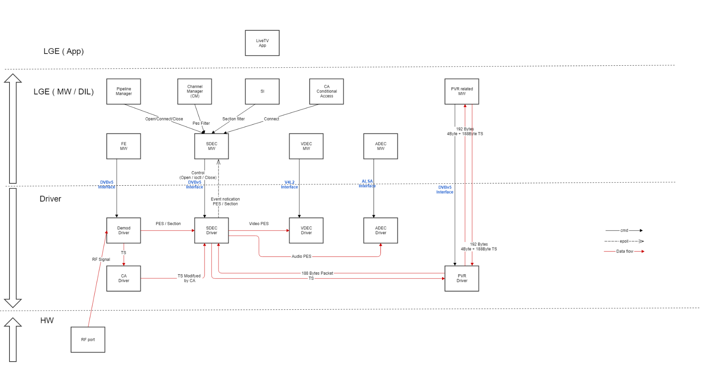

| The main H/W function of SDEC is the function to separate the TP Stream into Video PES, Audio PES, Data PES, and PSI PES and send specific PES to each H/W.

| The main S/W functions of SDEC are the function of selecting PES to be sent to other H/W among separated PES and the function of sending PSI information to MW's SI or PSIP module. In addition, it is a function to send the relevant PES data to the Teletext and Subtitle modules.

| Using RF port RF signal will be received. Which sent to Demod driver. Demod Driver sent PES data SDEC.

| After receiving the PES data from Demod driver, SDEC uses different filtering methods to filter the PES data ,as Audio PES ,video PES and Subtitle PES data.

| SDEC uses PES filtering technique to filter the PES data used for subtitled and Teletext operation on DVB. 

Block Diagram
---------------------

| The following block diagram shows the internal block of the SDEC module and how it interacts with external modules.

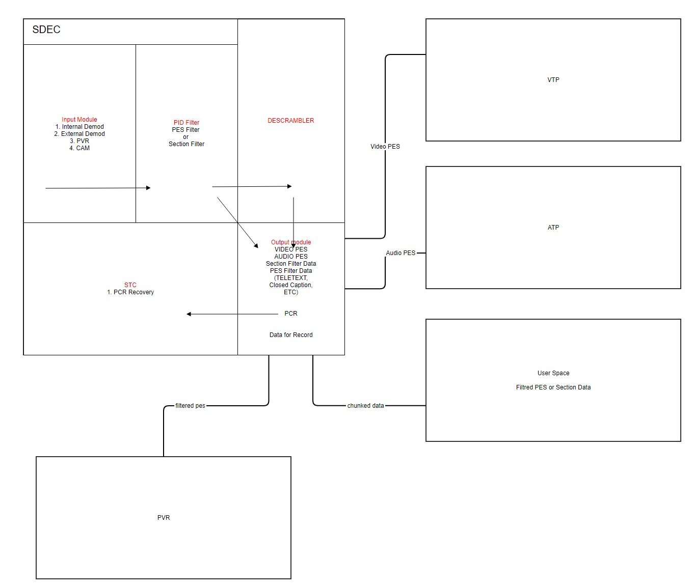

| The internal block of the SDEC module functions as follows:

- Input Mode : SDEC will receive the PES data from other Module eg. Internal demode, PVR, CAM.

- PID Filter : After receiving the PES data SDEC will send PES data to PID Filter, Where different Filter available Which Filter the PES data .For eg, Audio PES filter will filter the audio data , video PES Filter will filter the video data and section filter will filter the PVR PES data.

- Output Module : Output Module receives the Filtered data from the PID Filter and it will send this Filtered data to it’s respective Module as Audio data to ATP, Video data to VTP and recorded PES data to PVR.

- STC : It is system time clock. The clock is generated and managed based on the PCR value.

- Descrambler : Descrambler comes in picture when user need to watch the paid Channel, So it’ use for descrambling or decryption of Paid channel.

Requirements
************

| This section describes the main functionalities of the SDEC Module in terms of the module's requirements and constraints.

Functional Requirements
=======================

The functional requirements for SDEC include:

- Dynamic channel switching
- Compatibility with Video codec
- Conditional Access System
- Compatible with broadcast standard.
- Service Information handling
- Resource Management 

Quality and Constraints
=======================

This section lists the non-functional requirements of SDEC quality requirements and design constraints.

Driver Compatibility
--------------------

| The SDEC hardware in a TV system requires a corresponding device drivers to enable communication with operation system. The driver should be compatible with TV system architecture.

Kernel Support
--------------

| The SDEC driver must be compatible with the version of operating system’s kernel that is running on TV. Kernel changes might affect the existing SDEC driver, necessitating updates or patches to maintain functionality.

Implementation
**************

| This section provides materials that are useful for SDEC implementation.

- The File Location section provides the location of the Git repository where you can get the header file in which the interface for the SDEC implementation is defined.
- The API List section provides a brief summary of SDEC APIs that you must implement.
- The Implementation Details section sets implementation guidance and example code for some major functionalities.

File Location
=============

The SDEC interfaces are defined in the dvbv5-ext-demux.h header file, which can be obtained from https://swfarmhub.lge.com/.

- Git repository: bsp/ref/dvbv5-ext-header

    
API List
========

Data Types
-----------

Standard Demux Data Types
^^^^^^^^^^^^^^^^^^^^^^^^^^

=============================== ===============================
Name                            Description
=============================== ===============================
:c:type:`dmx_output`            Output for the demux.
:c:type:`dmx_input`             Input from the demux.
:c:type:`dmx_ts_pes`            Type of the PES filter.
:c:type:`dmx_sct_filter_params` Specified a section filter parameter.
:c:type:`dmx_pes_filter_params` Specifies Packetized Elementary Stream (PES) filter parameters.
:c:type:`dmx_stc`               Stores System Time Counter (STC) information.
=============================== ===============================

Extended Demux Data Types
^^^^^^^^^^^^^^^^^^^^^^^^^^

======================================= ===============================
Name                                    Description
======================================= ===============================
:cpp:any:`dmx_ext_control`              enum for descramble key type
:cpp:any:`dmx_country`                  enum for descramble type
:cpp:any:`dmx_ext_dscrmb_key`           struct for scramble key
:cpp:any:`dmx_src_type`                 enum for input src type
:cpp:any:`dmx_ext_port_type`            enum for HW connection type
:cpp:any:`dmx_ext_source`               struct for dmx set input config
======================================= ===============================

Functions
-----------
Linux Common Functions
^^^^^^^^^^^^^^^^^^^^^^

========================================================================================= =========================================================== ========================= ======
 | Function                                                                                | Description                                               | Is this API unified ?   | Location of webOS Unified BSP
                                                                                                                                                       | (O/X)                   |
========================================================================================= =========================================================== ========================= ======
:ref:`open <dvbv5-open>`                                                                   | This system call, used with a device name of              | O                       | `kernel/source/drivers/media/dvb-core/dmxdev.c <https://wall.lge.com/c/webos-pro/bsp/ref/unified-kernel-dec/+/454486/1/dvb-code/dmxdev.c#1771.html>`_
                                                                                           | /dev/dvb/adapter?/demux?, allocates a new filter and      |                         |
                                                                                           | returns a handle which can be used for subsequent         |                         |
                                                                                           | control of that filter. This call has to be made for      |                         |
                                                                                           | each filter to be used.                                   |                         |
:ref:`close <dvbv5-close>`                                                                 | This system call deactivates and deallocates a filter     | O                       | `kernel/source/drivers/media/dvb-core/dmxdev.c <https://wall.lge.com/c/webos-pro/bsp/ref/unified-kernel-dec/+/454486/1/dvb-code/dmxdev.c#1771.html>`_
                                                                                           | that was previously allocated via the open() call.        |                         |
`Linux epoll_create1() <https://man7.org/linux/man-pages/man2/epoll_create.2.html>`_       | Creates a new epoll instance                              | X                       |
`Linux epoll_ctl() <https://man7.org/linux/man-pages/man2/epoll_ctl.2.html>`_              | Is used to add, modify, or remove entries in the          | X                       |
                                                                                           | interest list of the epoll instance                       |                         |
`Linux epoll_wait() <https://man7.org/linux/man-pages/man2/epoll_wait.2.html>`_            | Waits for events on the epoll instance                    | X                       |
========================================================================================= =========================================================== ========================= ======

Module Standard Functions
^^^^^^^^^^^^^^^^^^^^^^^^^

======================================= =========================================================== ========================= ==========================
 | Function                              | Description                                               | Is this API unified ?    | Location of webOS Unified BSP
                                                                                                     | (O/X)                    |
======================================= =========================================================== ========================= ==========================
:ref:`v4l-dvb-apis:DMX_START`            | This ioctl call is used to start the actual filtering     | O                        | `kernel/source/drivers/media/dvb-core/dmxdev.c <https://wall.lge.com/c/webos-pro/bsp/ref/unified-kernel-dec/+/454486/1/dvb-code/dmxdev.c#1771.html>`_
                                         | operation defined via the ioctl calls DMX_SET_FILTER      |                          |
                                         |  or DMX_SET_PES_FILTER.                                   |                          |
:ref:`v4l-dvb-apis:DMX_STOP`             | This ioctl call is used to stop the actual filtering      | O                        | `kernel/source/drivers/media/dvb-core/dmxdev.c <https://wall.lge.com/c/webos-pro/bsp/ref/unified-kernel-dec/+/454486/1/dvb-code/dmxdev.c#1783.html>`_
                                         | operation defined via the ioctl calls DMX_SET_FILTER      |                          |
                                         |  or DMX_SET_PES_FILTER and started via the DMX_START      |                          |
                                         | command.                                                  |                          |
:ref:`v4l-dvb-apis:DMX_SET_FILTER`       | This ioctl call sets up a filter according to the         | O                        | `kernel/source/drivers/media/dvb-core/dmxdev.c <https://wall.lge.com/c/webos-pro/bsp/ref/unified-kernel-dec/+/454486/1/dvb-code/dmxdev.c#1792.html>`_
                                         | filter and mask parameters provided. A timeout may        |                          |
                                         | be defined stating number of seconds to wait for a        |                          |
                                         |  section to be loaded.                                    |                          |
:ref:`v4l-dvb-apis:DMX_SET_PES_FILTER`   | This ioctl call sets up a PES filter according to         | O                        | `kernel/source/drivers/media/dvb-core/dmxdev.c <https://wall.lge.com/c/webos-pro/bsp/ref/unified-kernel-dec/+/454486/1/dvb-code/dmxdev.c#1801.html>`_
                                         | the parameters provided. By a PES filter is meant         |                          |
                                         | a filter that is based just on the packet identifier      |                          |
                                         |  (PID).                                                   |                          |
:ref:`v4l-dvb-apis:DMX_SET_BUFFER_SIZE`  | This ioctl call is used to set the size of the            | X                        |
                                         |  circular buffer used for filtered data.                  |                          |
:ref:`v4l-dvb-apis:DMX_GET_STC`          | This ioctl call returns the current value of the          | X                        |
                                         | system time counter                                       |                          |
                                         | (which is driven by a PES filter of type                  |                          |
                                         |  DMX_PES_PCR).                                            |                          |
======================================= =========================================================== ========================= ==========================

Module Extended Functions
^^^^^^^^^^^^^^^^^^^^^^^^^

======================================= =================================================================== ========================== ====
 | Function                               | Description                                                      | Is this API unified ?    | Location of webOS Unified BSP
                                                                                                             | (O/X)                    |
======================================= =================================================================== ========================== ====
:c:macro:`DMX_EXT_CID_PLATFORM`          | Set the regional platform type.The platform type is set           | X                        |
                                         | because different regions can be required different               |                          |
                                         | behavior.                                                         |                          |
:c:macro:`DMX_EXT_CID_COUNTRY`           | Set a country type.Set country values to ensure different         | X                        |
                                         | behaviors in different countries                                  |                          |
:c:macro:`DMX_EXT_CID_INPUTSOURCE`       | Set a input type of the Demux.This Command ID set the TS          | X                        |
                                         | path through which Signal flows from Tuner to Demux or            |                          |
                                         | CAM to Demux.                                                     |                          |
:c:macro:`DMX_EXT_CID_PCR_ONOFF`         | Control PCR Recovery function.                                    | X                        |
:c:macro:`DMX_EXT_CID_REQUEST_SCRMB`     | Set the filter to check scramble bit for ATSC CADTV.Starts        | X                        |
                                         | the scramble check function for this channel. If there is         |                          |
                                         | an extra routine for scramble, like interrupt enable,             |                          |
                                         | this function manages it. To request new pid, LG will get         |                          |
                                         | a new fd for it.                                                  |                          |
:c:macro:`DMX_EXT_CID_CANCEL_SCRMB`      | Cancel filter for checking scramble bit.Stops scramble            | X                        |
                                         | check. This function stops DMX_EXT_CID_REQUEST_SCRMB.             |                          |
                                         | Remove the PID filter and scramble bit check routine              |                          |
                                         | generated in DMX_EXT_CID_REQUEST_SCRMB.                           |                          |
:c:macro:`DMX_EXT_CID_CHECK_SCRMB`       | Check scrmable bit.Checks scramble status.                        | X                        |
                                         | Call DMX_EXT_CID_REQUEST_SCRMB first then use this function,      |                          |
                                         | to check the scrambled status of Scramble bit for specific PID    |                          |
:c:macro:`DMX_EXT_CID_DSCRMB_TYPE`       | Sets descrambler type of this demux channel. Descrambler          | X                        |
                                         | supports the following five modes. (None/PVR/BCAS/CI+AES/CI+DES)  |                          |
:c:macro:`DMX_EXT_CID_DSCRMB_PID`        | Enable or Disable PID Descramble for Japan ACAS.                  | X                        |
:c:macro:`DMX_EXT_CID_DSCRMB_KEY`        | Sets the descramble key of the input type                         | X                        |
:c:macro:`DMX_EXT_CID_ADD_PID`           | If the PID filter generated in designated destination by          | X                        |
                                         | DMX_SET_PES_FILTER, add PID to existing PID filter.               |                          |
:c:macro:`DMX_EXT_CID_ECP_INFO_NOTI`     | This command is used to tell Demux to update ECP related          | X                        |
                                         | information                                                       |                          |
:c:macro:`DMX_EXT_CID_SDT_PORT_INFO`     | Notify Demux that number of sdt filter port.                      | X                        |
:c:macro:`DMX_EXT_CID_NUMBER_OF_TUNERS`  | This command is used for getting demux to know the number         | X                        |
                                         | of tuners which the TV has                                        |                          |
:c:macro:`DMX_SET_TEMI_FILTER`           | Register TEMI(Timed external media information) filter.           | X                        |
:c:macro:`DMX_EXT_CID_AVSYNC_MODE`       | If there is no PCR for a stream produced by an SI                 | X                        |
                                         | (System Integration) company or a customer (Hotel),               |                          |
                                         | BSP judges the stream and selects a PCR master or audio master    |                          |
======================================= =================================================================== ========================== ====

Implementation Details
======================

| The SDEC module guide and SDEC API Reference explains fundamental features and key requirements of the SDEC module that developers must take into account.

| This section specifically focuses on the following frequent use cases or usage scenarios around SDEC and explains how these scenarios should be implemented by providing detailed function call sequences.

- SDEC Initialize
- Pipeline open & connect
- Legacy DTV watching
- Legacy DTV Record
- SDEC for encrypted data.
- Check scramble channel 

SDEC Initialize
---------------

| In this scenario SDEC middleware is initialize,It will observe in Following scenario.

- TV AC is on under the condition that the preceding input was legacy DTV signal

Normal Sequence
^^^^^^^^^^^^^^^

        .. code-block:: cpp

                LG will Prepare MW First
                MW Initialize
                    | - epoll_create1(value: EPOLL_CLOEXEC)
                    | - SDEC DVBv5 open ( path: "/dev/dvb/adapter0/demux%d", flag setting : O_RDWR | O_CLOEXEC | O_NONBLOCK)
                    | - SDEC DVBv5 ioctl invoked with DMX_EXT_CID_NUMBER_OF_TUNERS ( value: max tuner number)
                    | - SDEC DVBv5 close

Sequence Diagram
^^^^^^^^^^^^^^^^

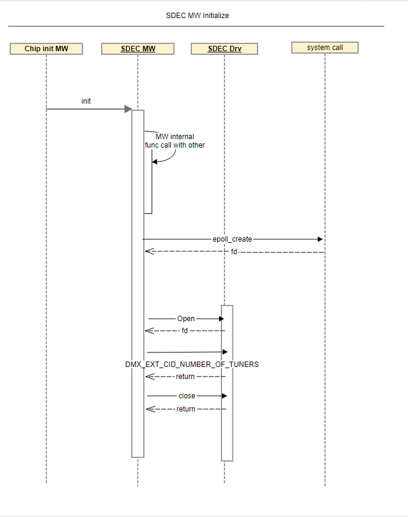
    
Pipeline open & connect the SDEC Pipeline
-----------------------------------------

| In this scenario, DTV pipeline is opened and connected. This is the stage to prepare for DTV data processing.

| This scenario is initiated in the following situations:

- The Channel Changes From No-Legacy DTV to Legacy DTV
- create Pipeline to prepare DTV Record.

Normal Sequence
^^^^^^^^^^^^^^^
        
        .. code-block:: cpp

                Pipeline Open state
                    |- SDEC Open
                    |- SDEC DVBv5 open ( path: "/dev/dvb/adapter0/demux%d", flag setting : O_RDWR | O_CLOEXEC | O_NONBLOCK)

                Pipeline Connect
                    |- SDEC Connect
                    |- SDEC DVBv5 ioctl invoked with DMX_EXT_CID_INPUTSOURCE ( value : struct dmx_ext_source )
                When the opening of each resource is completed, the connect process proceeds. For the DVB model, an open connect process is added with one SDEC channel for SDT data processing.

Sequence Diagram
^^^^^^^^^^^^^^^^

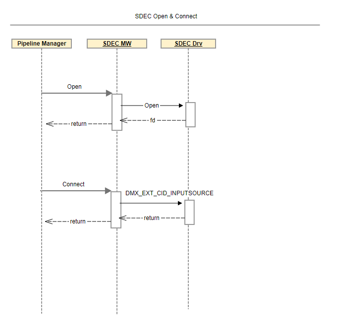

Legacy DTV Watching
-------------------

| In this scenario, DTV pipeline is watching status. Each MW call is independent.

| This scenario is initiated in the following situations:

- The Channel Change to specific channel.

Normal Sequence
^^^^^^^^^^^^^^^

        .. code-block:: cpp

                LG MW is working(Channel manager, SI, etc)
                |- CM
                    |- SDEC DVBv5 open ( path: "/dev/dvb/adapter0/demux%d", flag setting : O_RDWR | O_CLOEXEC | O_NONBLOCK)
                    |- SDEC DVBv5 ioctl invoked with DMX_SET_PES_FILTER( value : struct dmx_pes_filter_params) PCR case
                        |- pid: specific pid value
                        |- input: this value will be DMX_IN_FRONTEND, but it should be ignored.
                        |- output: DMX_OUT_DECODER, It means PES destination is STC HW.
                        |- pes_type: DMX_PES_STC0, It means PES destinations are STC0.
                        |- flags: DMX_IMMEDIATE_START
                    |- SDEC DVBv5 ioctl invoked with DMX_SET_PES_FILTER( value : struct dmx_pes_filter_params) VIDEO case
                        |- pid: specific pid value
                        |- input: this value will be DMX_IN_FRONTEND, but it should be ignored.
                        |- output: DMX_OUT_DECODER, It means PES destination is VDEC.
                        |- pes_type: DMX_PES_VIDEO0, It means PES destinations are VTP0.
                        |- flags: DMX_IMMEDIATE_START
                    |- SDEC DVBv5 ioctl invoked with DMX_SET_PES_FILTER( value : struct dmx_pes_filter_params) AUDIO case
                        |- pid: specific pid value
                        |- input: this value will be DMX_IN_FRONTEND, but it should be ignored.
                        |- output: DMX_OUT_DECODER, It means PES destinations are ADEC.
                        |- pes_type: DMX_PES_AUDIO0, It means PES destinations are ATP0.
                        |- flags: DMX_IMMEDIATE_START

                | - SI
                    | - SDEC DVBv5 open ( path: "/dev/dvb/adapter0/demux%d", flag setting : O_RDWR | O_CLOEXEC | O_NONBLOCK)
                    | - SDEC DVBv5 ioctl invoked with DMX_SET_BUFFER_SIZE( value: max chunk size)
                    | - SDEC DVBv5 ioctl invoked with DMX_SET_FILTER( value: struct dmx_sct_filter_params)
                        | - pid ,flags values, filter values
                        | - filter, dmx_filter value

                | - Other MW likes Closed Caption or Subtitle or TELETEXT
                    | - SDEC DVBv5 open ( path: "/dev/dvb/adapter0/demux%d", flag setting : O_RDWR | O_CLOEXEC | O_NONBLOCK)
                    | - SDEC DVBv5 ioctl invoked with DMX_SET_BUFFER_SIZE( value: max chunk size)
                    | - SDEC DVBv5 ioctl invoked with DMX_SET_PES_FILTER( value: struct dmx_pes_filter_params)
                The new filter has a new fd.
                The data input point is based on the value set in the demux when connecting.
                When the filter is used, fd is closed.
                

Sequence Diagram                
^^^^^^^^^^^^^^^^

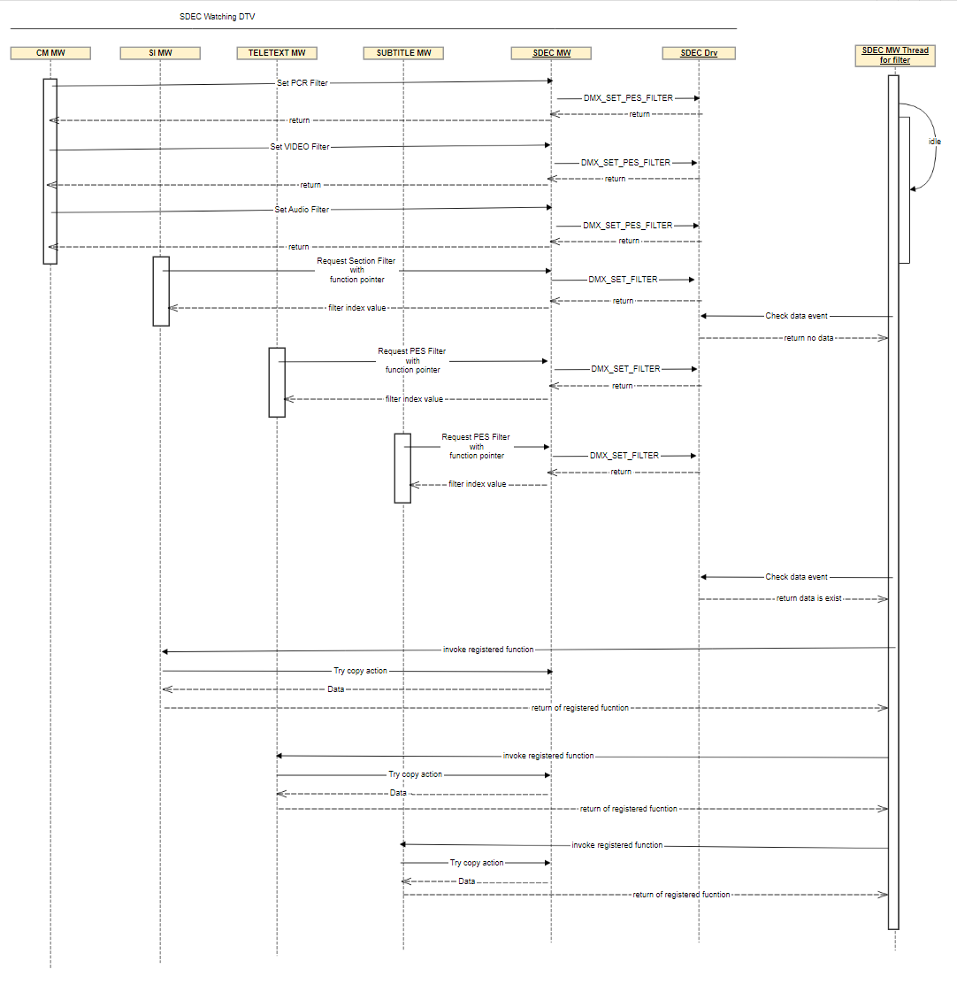

| CM MW: Channel Manager Middleware use to call the SDEC middleware to set the Audio FIilter, PES filter and video filter to filter the audio, video and PES data.

| SI MW: It will request for section filter to SDEC middleware.

| Subtitle MW: It will request PES filter for subtitle to SDEC middleware.

| SDEC MW : It will call the driver to set the audio,video, PES filter, open, start, close and stop the SDEC.

| SDEC Driver : It will call start, stop, close,open SDEC from driver and allocate PES filter, Audio filter, PES filter from Driver side.   

Checking SCRAMBLE Channel information (ATSC Only)
-------------------------------------------------

| In this scenario, LG MW will check about scramble information. 

| In the US model, check the scramble channel and process the channel invisible.

| This scenario is initiated in the following situations:

- In ATSC US model, LG MW will keep checking Scramble channel information.

Normal Sequence
^^^^^^^^^^^^^^^

        .. code-block:: cpp

                |- Channel manager
                    |- SDEC DVBv5 ioctl invoked with DMX_EXT_CID_REQUEST_SCRMB(value: PID)
                    |- SDEC DVBv5 ioctl invoked with DMX_EXT_CID_CHECK_SCRMB  
                    |- SDEC DVBv5 ioctl invoked with DMX_EXT_CID_CANCEL_SCRMB

Sequence Diagram
^^^^^^^^^^^^^^^^

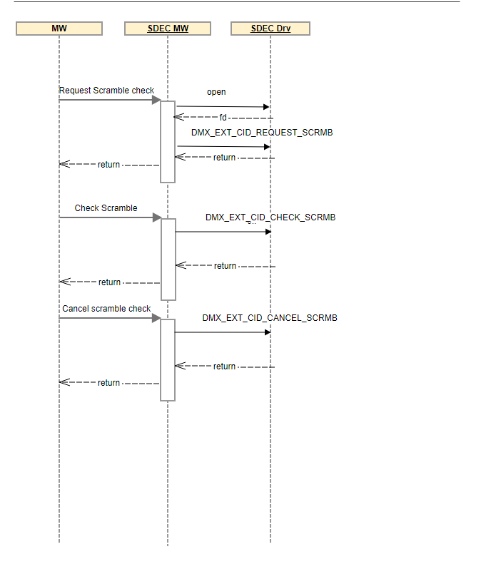

Unification
************

| The SDEC API which has been unified as part of the POC `TVPLAT-229413 <http://hlm.lge.com/issue/browse/TVPLAT-229413?attachmentSortBy=dateTime&attachmentOrder=asc>`_ 

Purpose
=======

| LGE supplements LGE TV specifications, harmonizes them across all SoC companies, and maintains and manages them to make LGE an asset. The above source codes are the part that actually calls the HW specific low-level driver API.

| In the case of the SDEC module, ring buffer control corresponding to each SDEC filter is implemented in the source codes. Since the ioctl of DVBv5 was adopted as the device interface of the SDEC/ module in webOS5.0 (SEETV), the Linux codes have been used by SoC companies. 

| However, because LGE did not present standards for change to SoC companies, SoC companies were changing and using their own methods to implement LGE TV specifications, and the change methods varied widely among SoC companies, and there was a difference in skill between SoC companies.

| LGE provides new SoC companies with a diff file that allows them to cherry-pick the asset code into the Linux original code. By doing this, whenever a new SoC Companies are introduced, it is possible to avoid repeating the trials and errors that the SoC Companies undergoes while modifying the source codes subject to assetization on its own. 

| This is because it is very difficult to make the SoC understand how to modify these "intermediate source codes" through the BSP implementation guide document alone, and it is difficult to make the SoC understand that Linux provides the characteristics that a specific HW specific low-level driver API should have. 

| This is to reduce the resources required for communication between LGE and SoC by not only having them read the official document of HW specific low-level driver API and LGE's BSP Implementation Guide document, but also having them understand it themselves by directly analyzing the asset code.

File Location
=============

| All the assetized code related to SDEC Module has been located at this `location <https://wall.lge.com/gitweb?p=module/element-demux-ts.git;a=tree;f=dvbv5/asset;h=16e3a498d9591fd43c87af1af7868acde8ce2748;hb=refs/heads/16.devel.dvbv5>`_

API List
========

| The following table lists the assetized APIs.

=============================== ===============================
Function                        Description
=============================== ===============================
private_dvr_open	        Function responsible for opening the DVR device
private_dvr_close               Function responsible for opening the DVR device
private_dvr_read	        Function responsible to read recordings to memory for playing PVR recordings.
private_dvr_write	        Function responsible to write recordings to memory for playing PVR recordings.
allocate_temi_feed	        Function for allocating resources for TEMI
release_temi_feed	        Function responsible for releasing the resources associated for TEMI
ext_demux_ioctl	                Extension ioctl of demux  to connect internal code function 
ext_dvr_ioctl                   Extension ioctl of dvr  to connect internal code function 
=============================== ===============================

Function Description
====================

private_dvr_read/private_dvr_write
----------------------------------

 * The Linux open-source code was modified to automatically select or deselect PVR recording and playback-related codes based on the specific requirements of different TV SoC companies.

 * This modification allows for flexibility, certain SoCs can entirely bypass the open-source read/write functions, opting for their own; others might use only the read function from the open source for downloading recordings, while employing their own write functions.

private_dvr_open/private_dvr_close
----------------------------------

 * General DVR function for opening and closing the device which now supports automatic branching based on the SoC Companies choice, offering a more adaptable solution tailored to the diverse needs of various TV SoCs. This approach streamlines the integration process for different SoC providers, ensuring compatibility with their preferred methods for handling PVR recordings and playback.

allocate_temi_feed/release_temi_feed
------------------------------------

 * These additions expanded the capabilities of the SDEC module in the Linux code to support TEMI functionality, enabling it to pick out and process current time information from broadcast signals effectively.

 * This enhancement aligns with the requirements of local data broadcasting, particularly for advertisement control based on timeline information.

ext_demux_ioctl/ext_dvr_ioctl
-----------------------------
 
 * Extension ioctls which is used is used to define a user layer interface in the SDEC module. These are not supported by the  DVBv5. Within the asset code, for each of these extension ioctls, there is a code section that connects the company's own internal functions linked to them

Relevant Code changes (for assetization)
----------------------------------------

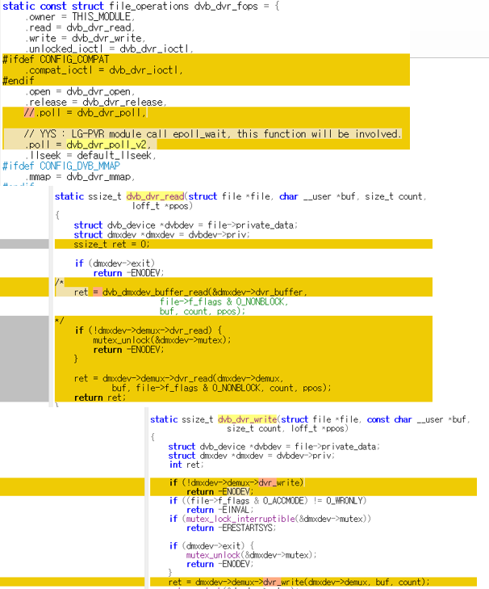

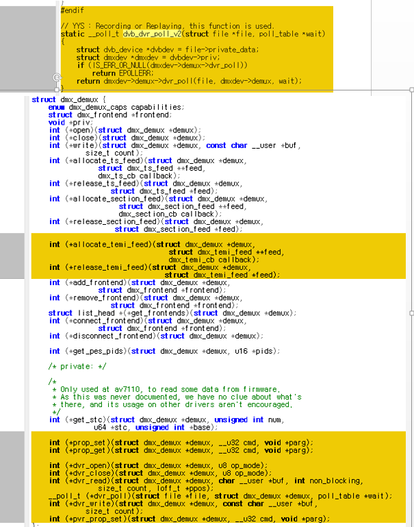

Differences of Assetized API & SOC's API
========================================

- Unified file:- LGE_Unified_dmxdev.c

- RTK code:- RTK_dmxdev.c

| In dvb_dmxdev_init() function open the demux device, calls dvb_dmxdev_filter_state_set() to set the state of dmx device filter.

| call dvb_register_device() with param as structure &dvbdev_demux -> calls &dvb_demux_fops

- In &dvb_demux_fops structure calls dvb_demux_read
        - In dvb_demux_read, check the dmxdev filter type with TYPE_SEC both same then calls dvb_dmxdev_read_sec() it calls dvb_dmxdev_buffer_read() else calls directly dvb_dmxdev_buffer_read()
        - dvb_dmxdev_read_sec() to read buffer data and calls dvb_dmxdev_buffer_read() ->
- In dvb_dmxdev_buffer_read() if src is error then call dvb_ringbuffer_flush return src-> error value or calls dvb_ringbuffer_avail() used to load write pointer on reader side and return the value.
        - call dvb_ringbuffer_read_user() to read user data from ring buffer.
- In &dvb_demux_fops structure calls dvb_demux_ioctl

| **If cmd == DMX_START** 

| before calling dvb_dmxdev_filter_buffer_size_calc() check the filter->buffer.data is positive or not call in unified but in RTK without check buffer data function called.

| In unified code instead of calling dvb_dmxdev_set_buffer_size() allocate memory of buffer size and stored in variable mem -> allocated mem to buffer.data.

| In RTK it will directly check the buffer size using dvb_dmxdev_filter_buffer_size_calc and allocate memory.

| Where as In Asset code it will check buffer data is empty or not if empty then calculate buffer size and allocate memory and store into one variable.

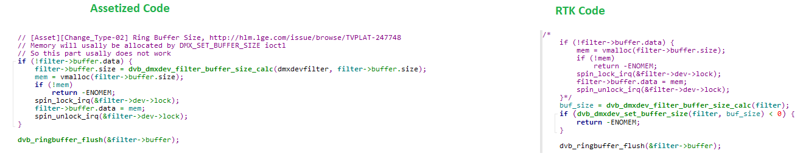

| check the secfeed data with allocate->filter function, if this return value is not possitive then it calls dvb_dmxdev_filter_stop() only in unified 

| ret = filter->feed.sec->start_filtering(filter->feed.sec); if ret is positive then calls dvb_dmxdev_filter_stop() only in unified, after this both calls filter_timer() but in RTK directly calls dvb_dmxdev_filter_timer(filter)

| After This it will allocate the Filter and check Filter is allocated or not. if filter is not allocated in RTK it will directly restart the feed.

| Whereas in Assetized code it will First stop the filter and then after restart the feed.In asset code before restart the feed they stop the filter because some start function fail handling

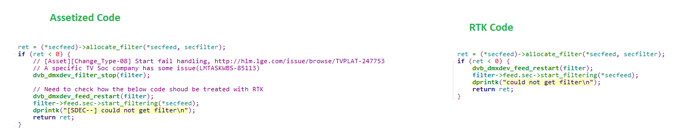

| **If cmd == DMX_STOP**

- calls dvb_dmxdev_filter_stop() 
- in DMX_DEV_TYPE_SEC -> calls dvb_dmxdev_feed_stop(), dvb_dmxdev_feed_restart()
- in DMX_DEV_TYPE_PES -> calls dvb_dmxdev_feed_stop()
- DMXDEV_TYPE_TEMI -> calls dvb_dmxdev_feed_stop()
- calls dvb_ringbuffer_flush() and return 0.

| In DMX_STOP it will call the dvb_dmxdev_filter_stop() to stop the filter. It will check filter type if Filter type is DMXDEV_TYPE_PES.

| In RTK after calling dvb_dmxdev_feed_stop() it will check the active filter count.

| As In Assetized code it will not check active filter count after stop the feed.

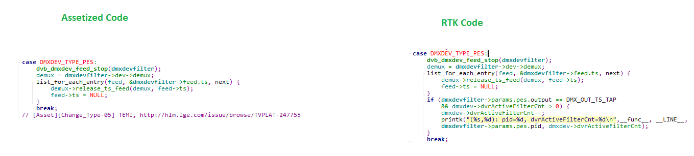

| **If cmd == DMX_SET_FILTER**

| calls dvb_dmxdev_filter_set()

| For DMX_SET_FILTER it will call the dvb_dmxdev_filter_set() to Set the filter type 

| In dvb_dmxdev_filter_set() first they will stop filter and after that they will set the filter type as section filter. After setting the filter type it call dvb_dmxdev_filter_state_set() to set the set the DEMUX state 

| After that it will call dvb_dmxdev_filter_start() to start the filtering process and return 0

| **If cmd == DMX_SET_PES_FILTER** 

| calls dvb_dmxdev_filter_stop() & dvb_dmxdev_filter_reset()

| calls dvb_dmxdev_add_pid() & if param->flags is equal with DMX_IMMEDIATE_START call dvb_dmxdev_filter_start()

| IN DMX_SET_PES_FILTER it will call the dvb_dmxdev_pes_filter_set() to set the filter type. in this Function First it will stop the filter and restart the filter.

| After that it will set the filter type as DMXDEV_TYPE_PES and start the filter.
- No difference in this function

| **If cmd == DMX_SET_BUFFER_SIZE** 

| calls dvb_dmxdev_set_buffer_size()

| In dvb_dmxdev_set_buffer_size() function before set the size of the buffer.

| In asset code call dvb_dmxdev_filter_buffer_size_calc() to calculate the filter buffer size according to dmx device type(Sec, Pes,Temi)

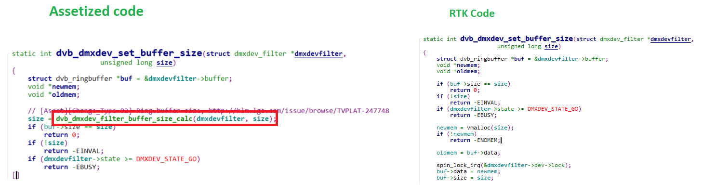

| Before store data of buffer to pointer store the size value.

| Then call the dvb_ringbuffer_reset() to reset and not flush in case the buffer shrinks and return 0.

| **If cmd == DMX_ADD_PID**

| IN DMX_ADD_PID it will call the dvb_dmxdev_add_pid() to add the PID.

| In this Function it will check the filter type If filter type is PES filter, then only it will process.

| Because TS PES filter have multiple PIDS. After adding the PID it will start the feeding.

| In Start feed dunction In Assetized code it will assign Null value to filter->todo.
- No difference in this function

| **if cmd == DMX_REMOVE_PID**

| IN DMX_REMOVE_PID it will call the dvb_dmxdev_remove_pid() to remove the PID.

| In this also it will check filter type is PES or not after that it will remove the PID.
- No difference in this function

| **if cmd == DMX_SET_TEMI_FILTER**

| It will call the dvb_dmxdev_temi_filter_set() to set the temi Filter.

| In this Function to stop the filter it will call dvb_dmxdev_filter_stop().
- No difference in this function

Testing
*******

| To test the implementation of the SDEC module, webOS TV provides SoCTS (SoC Test Suite) tests. The SoCTS checks the basic operations of the SDEC module and verifies the kernel event operations for the module by using a test execution file. 
For more information, see :doc:`Demux’s SoCTS Unit Test manual </part4/socts/Documentation/source/producer-manual/producer-manual_dvbv5/producer-manual_dvbv5-demux>`.

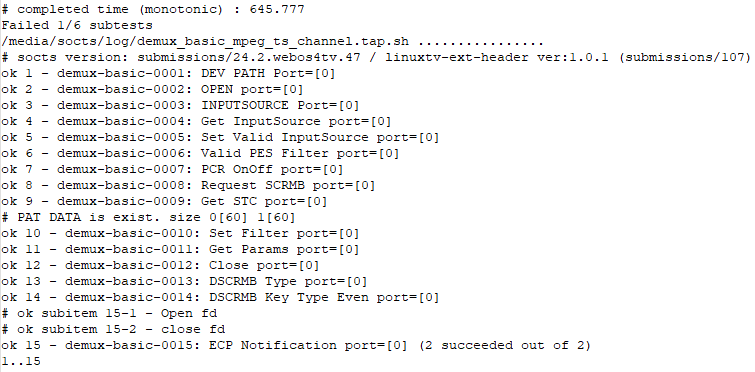

References
**********

| http://collab.lge.com/main/display/~dongho.jung/5.3+SDEC

| http://collab.lge.com/main/pages/viewpage.action?pageId=1534039029
