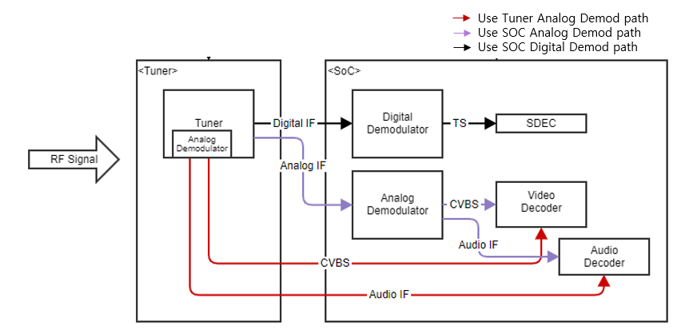
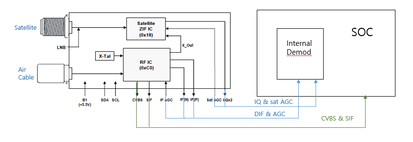
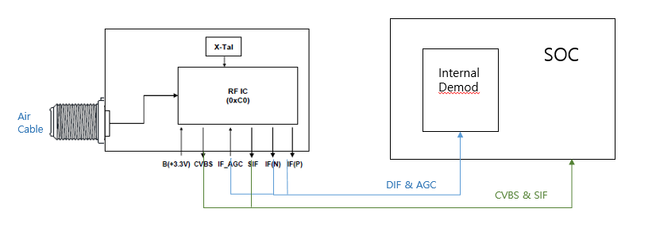
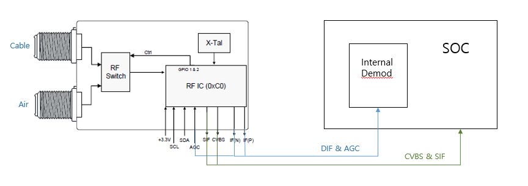
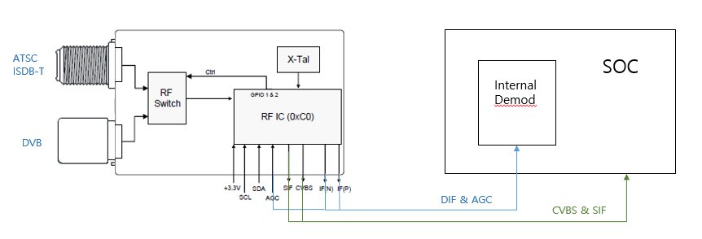
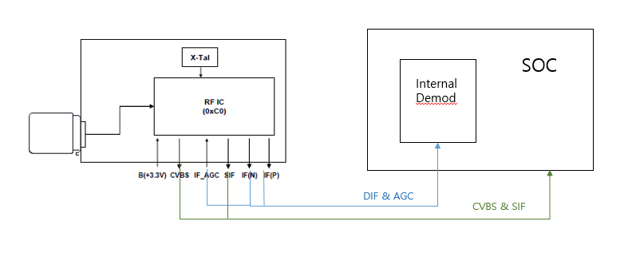
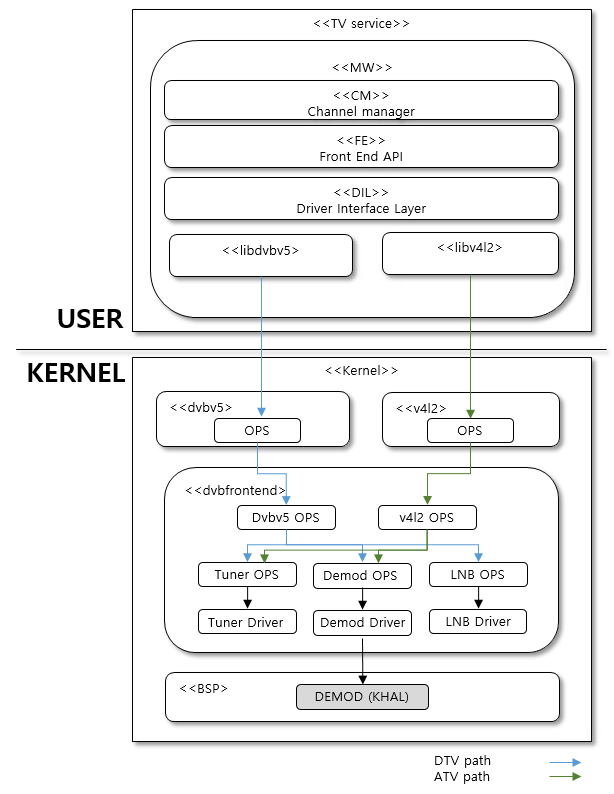
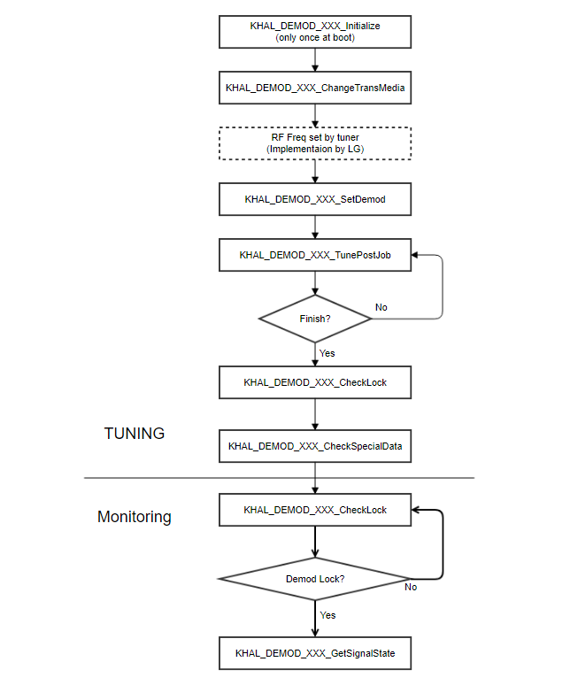
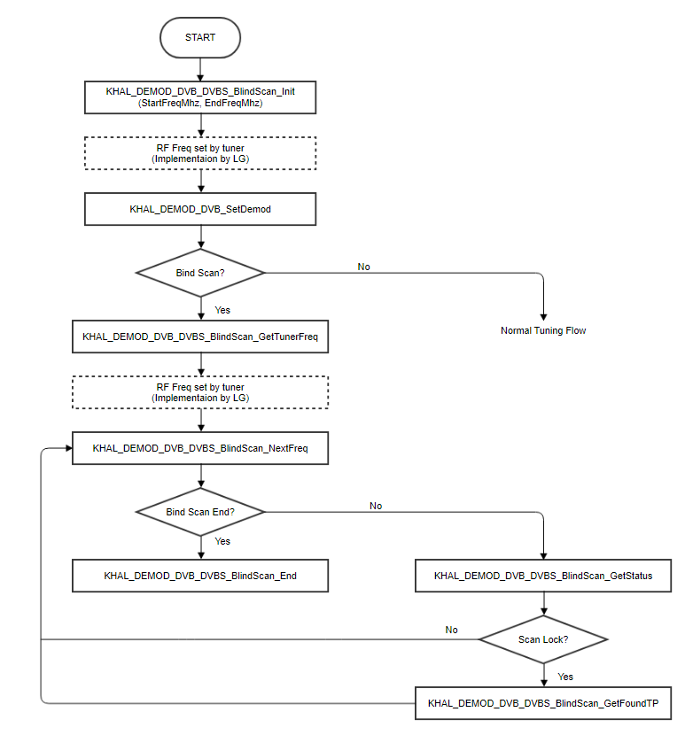
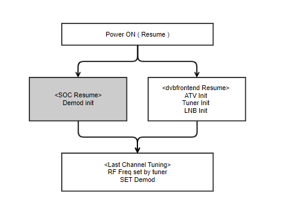

DVB Frontend
#############

.. _hyejeong.choe: hyejeong.choe@lge.com

Introduction
************
| This document describes the DVB frontend module (here after referred to as dvbfrontend) module in the kernel space.
The dvbfrontend module consists of Tuner kernel driver and Demod kernel driver.
Tuner driver is provided by LG, and demod driver is implemented by BSP. 
This document gives an overview of the Demod module and provides details about its functionalities and implementation requirements.

| The dvbfrontend driver is based on dvbv5 framework. The demod driver is called through the KHAL API.

| Therefore, this guide assumes that readers are familiar with and well aware of all broadcast standards(VSB, QAM, ATSC3, DVB-T/T2/C/S/S2, DTMB, ISDBT).

Revision History
================

.. _jjinsuk.choi: jjinsuk.choi@lge.com
.. _mundeok.heo: mundeok.heo@lge.com
.. _joonwoo.hong: joonwoo.hong@lge.com
.. _jehyuk.yeon: jehyuk.yeon@lge.com

======= ============ ================= ==========================================================================
Version Date         Changed by        Comment
======= ============ ================= ==========================================================================
2.18    2023-10-24    `hyejeong.choe`_ Update Implementation
2.17    2023-05-16    `hyejeong.choe`_ Update Tuning Flow
2.16    2023-04-11    `jehyuk.yeon`_   Update KHAL_DEMOD_DVB_DVBS_ToneMode and KHAL_DEMOD_DVBS_22KHZ_MODE_T
2.15    2023-02-20    `jehyuk.yeon`_   Update document to help bring up
2.14    2022-07-04    `hyejeong.choe`_ Modify API New format
2.13    2021-10-21    `joonwoo.hong`_  Explanation in 'Return Value' is modified to check return value also.
2.12    2021-08-20    `hyejeong.choe`_ Delete 'KHAL_DEMOD_XXX_GetDemodInitDone'
2.11    2021-08-20    `hyejeong.choe`_ Add 'KHAL_DEMOD_XXX_GetDemodInitDone'
2.10    2021-04-27    `joonwoo.hong`_  Add 'KHAL_DEMOD_TRANS_SYS_ALWAYSREADY'
2.9     2020-09-09    `hyejeong.choe`_ Change structure name of '3.11' , '3.12'
2.8     2020-07-22    `joonwoo.hong`_  Add 'Addtional Information Setting'
2.7     2020-06-01    `joonwoo.hong`_  Remove undefined enum values
2.6     2020-05-26    `joonwoo.hong`_  Add KHAL API for ATSC3
2.5     2020-04-16    `mundeok.heo`_   KHAL_DEMOD_AUDIO_SIF_SOUNDSYSTEM_T,
2.4     2020-03-19    `joonwoo.hong`_  Change enum value of  'KHAL_DEMOD_TRANS_SYS_ATSC3'
2.3     2020-03-09    `joonwoo.hong`_  New addition
2.2     2020-03-06    `joonwoo.hong`_  Add 'KHAL_DEMOD_TRANS_SYS_ATSC3'
2.1     2019-09-18    `joonwoo.hong`_  Add ATSC3.0 KHAL API
2.0     2019-08-23    `joonwoo.hong`_  Mix with HAL Implementaion Guide
1.0     2017-03-30    `jjinsuk.choi`_  Initial release
======= ============ ================= ==========================================================================

Terminology
===========

| The key words "must", "must not", "required", "shall", "shall not", "should", "should not", "recommended", "may", and "optional" in this document are to be interpreted as described in RFC2119. 

| The following table lists the terms used in the dvbfrontend module guide

============= ============
Term          Description
============= ============
FE            Front End. FE controls the tuner and demod components.
SDEC          System decoder
VDEC          Video decoder
CM            Channel Manager
EU            Europe
JA            MiddleEast Asia and Africa
BR            Brazil
TW            Taiwan
CO            Colombia
AJ            Asia and Middle Asia
US            United state
KR            Korea
CN            China
JP            Japan
CVBS          Composite Video Baseband Signal
IF            Intermediate Frequency
SIF           Sound Intermediate Frequency
KHAL          Kernel Hardware Abstraction Layer
============= ============

Technical Assistance
====================

For assistance or clarification on information in this guide, please create an issue in the LGE JIRA project and contact the following person:

============ ===============================
Module       Owner
============ =============================== 
dvbfrontend  `hyejeong.choe`_ 
============ =============================== 

Overview
********

General Description
===================

| The dvbfrontend module is based on DVBv5 framework and is responsible for controlling both the Tuner and Demod drivers. 
In the case of DTV, the dvbfrontend module converts the Transport Stream (TS) and delivers it to SDEC.
For ATV, it separates the video and audio signals, transmitting CVBS to the video module and SIF to the audio module.

| The Tuner driver is provided by LG, while the Demod driver is implemented by the SoC vendor's BSP. 
The Demod driver must lock the signal and catch signal information.

Architecture
============

This section describes the hardware architecture and the driver architecture for Demod.

Hardware Architecture
---------------------
| The following diagram illustrates the HW path between the Tuner and Demod.
| For ATV, LG utilizes either an internal or external Demod based on the model. The support for internal Demod in ATV is determined according to LG's requirements.
| For Japen, an external demod is used.

| In the subsequent section, the HW path between the Tuner and Demod of the supported broadcast system for each region will be shown.
| Each diagram is based on the utilization of the Tuner and analog Demod.

DVB Tuner
^^^^^^^^^^
- DVB-T/T2/C/S/S2 are supported.
- It is used in the EU, JA, and some countries in Asia that support satellites.

ATSC(US) Tuner
^^^^^^^^^^^^^^^
- The ATSC(VSB and QAM) system are supported.
- If InternalDemod supports ATSC3, you can use this tuner. 
- If your SOC cannot support ATSC3, it is used exteranl Demod for ATSC3.
- It is used in US(United state).

ATSC(KR) Tuner
^^^^^^^^^^^^^^^
- The ATSC(VSB and QAM) system are supported.
- If InternalDemod supports ATSC3, you can use this tuner. 
- If your SOC cannot support ATSC3, it is used exteranl Demod for ATSC3.
- It is used in KR(Korea).

3 Broadcast System Tuner
^^^^^^^^^^^^^^^^^^^^^^^^
- The ATSC(VSB and QAM), ISDB-T, DVB-T/T2/C system are supported on a single board.
- It is used in South America and Asia.

DTMB Tuner
^^^^^^^^^^^
- The DTMB and DVB-C system are supported.
- It is used in China and HongKong.

Driver Architecture
-------------------

| The driver architecute is mainly divided into two layers user space, kernel space (dvbrontend and BSP).
| The user space service, CM (Channel Manager), requests signal tuning to dvbfrontend.
| dvbfrontend delivers tuning information to the Tuner and Demod, then interacts with the vendor driver to control the Demod IP.
| SOC vendors must implement the Demod KHAL API (grey block in the figure below).

| The following is a brief summary on how the architecture is exercised:

- Channel Manager -> FrontEnd Interface -> Driver Interface Layer : Channel Manager requests signal tuning to Frontend.
- When DTV tuning, Driver Interface Layer requests tuning to Tuner and Demod through dvbv5
- When ATV tuning, Driver Interface Layer requests tuning to Tuner and Demod through v4l2

Overall Workflow
================

Tuning & Monitoring Flow
------------------------
- When signal tune is requested, the tuning flow is as follows.
- After the tuning is completed, the signal status is monitored every 1 second.

DVBS BlindScan Flow
-------------------
- BlindScan is a function that finds all the signals of all receivable bands without TP list.
- In case of DVBS/S2, you must support blindscan.
- The flow of the SatelliteDTV Blindscan is as follows:
    - If you select Ku-Band, repeat blindscan 4times.(Lowband Horizontal / Highband Horizontal/ Lowband Vertical / Highband Vertical)
    - If you select C-Band, repeat blindscan 2times.(Lowband Horizontal / Lowband Vertical)

Instant Boot Resume with DVBv5
------------------------------
| When DC Power off/on(Resume), Demod intialize by itself.
| When DC power is turned off/on (resumed), Demod initializes itself.
| Demod initialization must be completed before dvbfrontend resume is completed.
| After dvbfrontend resume, last cahnnel is tuning.
| And then, the task on the user layer is restarted and it waits for the Demod Lock status.
| Refer to Power On Time spec of Performance Requirements.

Requirements
************

This section describes the major functionalities of the Demod driver, as well as its operational flow and requirements.

Functional Requirements
=======================
The Demod driver is called through the KHAL API. Therefore, SoC vendors must implement the KHAL API. For the KHAL API specification, refer to the  :ref:`API_List <API_List>`  section in Implementation.

Performance Requirements
========================
SoC vendors must meet the following Spec.

<Power On Time>
    - Power On Time means from resume woken to resume done.
    - Test Case : DC Power Off->On by webOS.(QSM+ On)

================== ==========
Group              Spec(ms)
================== ==========
KR/US              500
EU                 350
BR                 150
CN                 200
================== ==========

<Demod Lock Time>
    - Demod Lock Time means from set_demod to demod lock OK.
    - Performance must be better than the Spec.

================== ==========
Broadcast System   Spec(ms)
================== ==========
VSB                400
QAM                400
ATSC3.0            800
DVB-T              400
DVB-T2             600
DVB-C              300
DVB-S              300
ISDB-T(BR)         700
DTMB               700
================== ==========

Design Constraints
========================
All Tuner and Demod drivers are composed of .ko files. When the TV is initialized, webOS loads the necessary .ko files. You must adhere to the following rules:

- The demod .ko file must be named "demod_khal.ko".
- The DVBv5 patches listed below are required to control the LG Tuner/Demod driver.

.. code-block::

       +/* Physical layer scrambling */
       +#define DTV_SCRAMBLING_SEQUENCE_INDEX   70
       +
       +//#define DTV_MAX_COMMAND              DTV_STAT_TOTAL_BLOCK_COUNT
       +#define DTV_MAX_COMMAND                DTV_SCRAMBLING_SEQUENCE_INDEX
       ---
        include/uapi/linux/dvb/frontend.h | 6 +++++-
        1 file changed, 5 insertions(+), 1 deletion(-)

.. code-block::

        --- a/drivers/media/dvb-core/dvbdev.c
        +++ b/drivers/media/dvb-core/dvbdev.c
        @@ -509,6 +509,24 @@ int dvb_unregister_adapter(struct dvb_adapter *adap)
        }
        EXPORT_SYMBOL(dvb_unregister_adapter);

        +struct dvb_adapter *dvb_find_adapter(int num)
        +{
        +       struct dvb_adapter *adap;
        +       struct list_head *entry;
        +
        +       mutex_lock(&dvbdev_register_lock);
        +       list_for_each(entry, &dvb_adapter_list) {
        +               adap = list_entry(entry, struct dvb_adapter, list_head);
        +               if (adap->num == num) {
        +                       mutex_unlock(&dvbdev_register_lock);
        +                       return adap;
        +               }
        +       }
        +       mutex_unlock(&dvbdev_register_lock);
        +       return NULL;
        +}
        +EXPORT_SYMBOL(dvb_find_adapter);
        +

.. code-block::

        --- a/drivers/media/dvb-core/dvb_frontend.c
        +++ b/drivers/media/dvb-core/dvb_frontend.c
        @@ -1579,6 +1579,11 @@ static int dtv_property_process_get(struct dvb_frontend *fe,
                        tvp->u.st = c->block_count;
                        break;
                default:
        +               if (fe->ops.get_property) {
        +                       r = fe->ops.get_property(fe, tvp);
        +                       if (r != -EINVAL)
        +                               return r;
        +               }
                        dev_dbg(fe->dvb->device,
                                "%s: FE property %d doesn't exist\n",
                                __func__, tvp->cmd);
        @@ -1829,7 +1834,7 @@ static int dtv_property_process_set(struct dvb_frontend *fe,
                /* Allow the frontend to validate incoming properties */
                if (fe->ops.set_property) {
                        r = fe->ops.set_property(fe, tvp);
        -               if (r < 0)
        +               if (r != -EINVAL)
                                return r;
                }

Implementation
**************

This section provides materials that are useful for Demod implementation.

- The File Location section provides the location of the Git repository where you can get the header file in which the KHAL interface for the Demod implementation is defined.
- The API List section provides the specifications of Demod KHAL APIs that you must implement.

File Location
=============

The Demod KAHL interfaces are defined in kdriver header file, which can be obtained from https://swfarmhub.lge.com/.

- Location: [as_installed]/driver/kdriver
- The header of KHAL API is included in dvbfrontend and BSP(Demod), respectively.
- When adding a new API, both dvbfrontend and Demod must be added.

API List
========

Data Types
----------
======================================================================================== =====================================================================
Enumeration                                                                              Description
======================================================================================== =====================================================================
 :ref:`KHAL_RETURN_VALUE_T <KHAL_RETURN_VALUE_T>`                                        This enumeration describes the return value. 
 :ref:`KHAL_DEMOD_TUNE_MODE_T <KHAL_DEMOD_TUNE_MODE_T>`                                  This enumeration describes the tune modes.
 :ref:`KHAL_DEMOD_TRANS_SYSTEM_T <KHAL_DEMOD_TRANS_SYSTEM_T>`                            This enumeration describes the transmission system.
 :ref:`KHAL_DEMOD_LOCK_STATE_T <KHAL_DEMOD_LOCK_STATE_T>`                                This enumeration describes the lock states.
 :ref:`KHAL_DEMOD_CHANNEL_BW_T <KHAL_DEMOD_CHANNEL_BW_T>`                                This enumeration describes the channel bandwidth information.
 :ref:`KHAL_DEMOD_TPS_CONSTELLATION_T <KHAL_DEMOD_TPS_CONSTELLATION_T>`                  This enumeration describes the TPS Constellation type.
 :ref:`KHAL_DEMOD_TPS_CODERATE_T <KHAL_DEMOD_TPS_CODERATE_T>`                            This enumeration describes the TPS Coderate type.
 :ref:`KHAL_DEMOD_TPS_GUARD_INTERVAL_T <KHAL_DEMOD_TPS_GUARD_INTERVAL_T>`                This enumeration describes the TPS Guard Interval type.
 :ref:`KHAL_DEMOD_TPS_CARRIER_MODE_T <KHAL_DEMOD_TPS_CARRIER_MODE_T>`                    This enumeration describes the TPS Carrier mode type.
 :ref:`KHAL_DEMOD_TPS_HIERARCHY_T <KHAL_DEMOD_TPS_HIERARCHY_T>`                          This enumeration describes the TPS hierachy Mode.
 :ref:`KHAL_DEMOD_AUDIO_SIF_SYSTEM_T <KHAL_DEMOD_AUDIO_SIF_SYSTEM_T>`                    This enumeration describes the analog audio SIF SoundSystem.
 :ref:`KHAL_DEMOD_ATSC3_MULTI_PLP_ID_SEL_T <KHAL_DEMOD_ATSC3_MULTI_PLP_ID_SEL_T>`        This enumeration describes ATSC3 PLP select.
 :ref:`KHAL_DEMOD_TPS_GUARD_INTERVAL_ATSC3_T <KHAL_DEMOD_TPS_GUARD_INTERVAL_ATSC3_T>`    This enumeration describes the TPS ATSC3.0 Guard Interval type.
 :ref:`KHAL_DEMOD_TPS_CODERATE_ATSC3_T <KHAL_DEMOD_TPS_CODERATE_ATSC3_T>`                This enumeration describes the TPS ATSC3.0 code rate type.
 :ref:`KHAL_DEMOD_TPS_CONSTELLATION_ATSC3_T <KHAL_DEMOD_TPS_CONSTELLATION_ATSC3_T>`      This enumeration describes the TPS ATSC3.0 constellation type.
 :ref:`KHAL_DEMOD_DVBS_22KHZ_MODE_T <KHAL_DEMOD_DVBS_22KHZ_MODE_T>`                      This enumeration describes the DVBS 22KHz tone mode.
======================================================================================== =====================================================================

======================================================================================== =====================================================================
Structure                                                                                Description
======================================================================================== =====================================================================
 :ref:`KHAL_DEMOD_SIGNAL_STATE_T <KHAL_DEMOD_SIGNAL_STATE_T>`                            This struncture describes the signal state.
 :ref:`KHAL_DEMOD_ATSC_SET_PARAM_T <KHAL_DEMOD_ATSC_SET_PARAM_T>`                        This struncture describes the ATSC Settting Parameters.
 :ref:`KHAL_DEMOD_ISDBT_SET_PARAM_T <KHAL_DEMOD_ISDBT_SET_PARAM_T>`                      This struncture describes the ISDBT Settting Parameters.
 :ref:`KHAL_DEMOD_DVBT_SET_PARAM_T <KHAL_DEMOD_DVBT_SET_PARAM_T>`                        This struncture describes the DVBT Settting Parameters.
 :ref:`KHAL_DEMOD_DVBT2_SET_PARAM_T <KHAL_DEMOD_DVBT2_SET_PARAM_T>`                      This struncture describes the DVBT2 Settting Parameters.
 :ref:`KHAL_DEMOD_DVBC_SET_PARAM_T <KHAL_DEMOD_DVBC_SET_PARAM_T>`                        This struncture describes the DVBC Settting Parameters.
 :ref:`KHAL_DEMOD_DVBS_SET_PARAM_T <KHAL_DEMOD_DVBS_SET_PARAM_T>`                        This struncture describes the DVBS Settting Parameters.
 :ref:`KHAL_DEMOD_DVBS2_SET_PARAM_T <KHAL_DEMOD_DVBS2_SET_PARAM_T>`                      This struncture describes the DVBS2 Settting Parameters.
 :ref:`KHAL_DEMOD_DTMB_SET_PARAM_T <KHAL_DEMOD_DTMB_SET_PARAM_T>`                        This struncture describes the DTMB Settting Parameters.
 :ref:`KHAL_DEMOD_ANALOG_SET_PARAM_T <KHAL_DEMOD_ANALOG_SET_PARAM_T>`                    This struncture describes the Analog Settting Parameters.
 :ref:`KHAL_DEMOD_SPECDATA_VSB_T <KHAL_DEMOD_SPECDATA_VSB_T>`                            This struncture describes the VSB Special Data members.
 :ref:`KHAL_DEMOD_SPECDATA_QAM_T <KHAL_DEMOD_SPECDATA_QAM_T>`                            This struncture describes the QAM Special Data members.
 :ref:`KHAL_DEMOD_SPECDATA_ISDBT_T <KHAL_DEMOD_SPECDATA_ISDBT_T>`                        This struncture describes the ISDBT Special Data members.
 :ref:`KHAL_DEMOD_SPECDATA_DVBT_T <KHAL_DEMOD_SPECDATA_DVBT_T>`                          This struncture describes the DVBT Special Data members.
 :ref:`KHAL_DEMOD_SPECDATA_DVBT2_T <KHAL_DEMOD_SPECDATA_DVBT2_T>`                        This struncture describes the DVBT2 Special Data members.
 :ref:`KHAL_DEMOD_SPECDATA_DVBC_T <KHAL_DEMOD_SPECDATA_DVBC_T>`                          This struncture describes the DVBC Special Data members.
 :ref:`KHAL_DEMOD_SPECDATA_DVBS_T <KHAL_DEMOD_SPECDATA_DVBS_T>`                          This struncture describes the DVBS Special Data members.
 :ref:`KHAL_DEMOD_SPECDATA_DVBS2_T <KHAL_DEMOD_SPECDATA_DVBS2_T>`                        This struncture describes the DVBS2 Special Data members.
 :ref:`KHAL_DEMOD_SPECDATA_DTMB_T <KHAL_DEMOD_SPECDATA_DTMB_T>`                          This struncture describes the DTMB Special Data members.
 :ref:`KHAL_MULTI_TS_INFO_T <KHAL_MULTI_TS_INFO_T>`                                      This struncture describes the MPLP Info Data members.
 :ref:`KHAL_DEMOD_ANALOG_CONFIG_T <KHAL_DEMOD_ANALOG_CONFIG_T>`                          This struncture describes the ATV Config Parameters.
 :ref:`KHAL_DEMOD_ATSC3_MULTI_PLP_ID_T <KHAL_DEMOD_ATSC3_MULTI_PLP_ID_T>`                This struncture describes the ATSC MPLP Parameters.
 :ref:`KHAL_DEMOD_ATSC3_SET_PARAM_T <KHAL_DEMOD_ATSC3_SET_PARAM_T>`                      This struncture describes the ATSC3 Settting Parameters.
 :ref:`KHAL_DEMOD_SPECDATA_ATSC3_T <KHAL_DEMOD_SPECDATA_ATSC3_T>`                        This struncture describes the ATSC3 Special Data members.
======================================================================================== =====================================================================

.. _API_List:

Functions
---------
| This section describes the detailed information of the KHAL functions.
| KHAL Function name includes one of VQI/DVB/DTMB/ISDBT/ATV/ATSC3 system name.
| KHAL Function name can extends like this KHAL_DEMOD_VQI_VSB_XXX, KHAL_DEMOD_DVB_DVBT_XXX, KHAL_DEMOD_ATV_NTSC_XXX, KHAL_DEMOD_ATV_XXX.

<common API>
  * :func:`KHAL_DEMOD_XXX_Initialize`
  * :func:`KHAL_DEMOD_XXX_ChangeTransMedia`
  * :func:`KHAL_DEMOD_XXX_ChangeTransSystem`
  * :func:`KHAL_DEMOD_XXX_ControlOutput`
  * :func:`KHAL_DEMOD_XXX_ControlTSMode`
  * :func:`KHAL_DEMOD_XXX_SetDemod`
  * :func:`KHAL_DEMOD_XXX_TunePostJob`
  * :func:`KHAL_DEMOD_XXX_CheckLock`
  * :func:`KHAL_DEMOD_XXX_CheckSignalStatus`
  * :func:`KHAL_DEMOD_XXX_CheckSpecialData`
  * :func:`KHAL_DEMOD_XXX_CheckFrequencyOffset`
  * :func:`KHAL_DEMOD_XXX_GetFWVersion`
  * :func:`KHAL_DEMOD_XXX_GetSQI`
  * :func:`KHAL_DEMOD_XXX_GetPacketError`
  * :func:`KHAL_DEMOD_XXX_GetBER`
  * :func:`KHAL_DEMOD_XXX_GetAGC`
  * :func:`KHAL_DEMOD_XXX_GetSNR`
  * :func:`KHAL_DEMOD_XXX_DebugMenu`

<API for ISDB-T>
  * :func:`KHAL_DEMOD_GetEmergencyAlertFlagStatus`

<API for DVB>
  * :func:`KHAL_DEMOD_DVB_OperMode`
  * :func:`KHAL_DEMOD_DVB_GetTsClkRate`
  * :func:`KHAL_DEMOD_DVB_GetCellID`
  * :func:`KHAL_DEMOD_DVB_DVBT2_ChangePLP`
  * :func:`KHAL_DEMOD_DVB_DVBT2_GetMultiPLPInfo`
  * :func:`KHAL_DEMOD_DVB_DVBS_ToneMode`
  * :func:`KHAL_DEMOD_DVB_DVBS_22Khz_Tone`
  * :func:`KHAL_DEMOD_DVB_DVBS_Send_Diseqc`
  * :func:`KHAL_DEMOD_DVB_DVBS_Send_Tone_Burst`
  * :func:`KHAL_DEMOD_DVB_DVBS_BlindScan_Init`
  * :func:`KHAL_DEMOD_DVB_DVBS_BlindScan_GetTunerFreq`
  * :func:`KHAL_DEMOD_DVB_DVBS_BlindScan_NextFreq`
  * :func:`KHAL_DEMOD_DVB_DVBS_BlindScan_GetStatus`
  * :func:`KHAL_DEMOD_DVB_DVBS_BlindScan_GetFoundTP`
  * :func:`KHAL_DEMOD_DVB_DVBS_BlindScan_End`

<API for ATSC3>
  * :func:`KHAL_DEMOD_ATSC3_Get_MPLP_Info`
  * :func:`KHAL_DEMOD_ATSC3_PLP_Select`
  * :func:`KHAL_DEMOD_ATSC3_SetDemodExpand`

<API for ATV>
  * :func:`KHAL_DEMOD_ATV_SetAudioSystem`

Implementation Details
----------------------

.. _KHAL_RETURN_VALUE_T:

KHAL_RETURN_VALUE_T
^^^^^^^^^^^^^^^^^^^^
This enumeration describes the return value.

.. code-block:: cpp
  
  typedef enum { 
    KHAL_OK = 0,
    KHAL_NOK = -1, 
  } KHAL_RETURN_VALUE_T;

.. _KHAL_DEMOD_TUNE_MODE_T:

KHAL_DEMOD_TUNE_MODE_T
^^^^^^^^^^^^^^^^^^^^^^
This enumeration describes the tune modes.

.. code-block:: cpp

  typedef enum {
    KHAL_DEMOD_TUNE_NORMAL = 0x10,
    KHAL_DEMOD_TUNE_MANUAL = 0x20,
    KHAL_DEMOD_TUNE_SCAN = 0x30,
    KHAL_DEMOD_TUNE_SCAN_START,
    KHAL_DEMOD_TUNE_SPECIFIC = 0x40,
    KHAL_DEMOD_TUNE_SPEC_DVBT_HMLP, /* DVBT : Hierarchy Mode */
    KHAL_DEMOD_TUNE_SPEC_DVBC_FIXED_DATA, /* DVBC : Use Fixed NIT Data */
    KHAL_DEMOD_TUNE_UNKNOWN = 0x80,
    KHAL_DEMOD_TUNE_MODE_MASK = 0xF0,
  } KHAL_DEMOD_TUNE_MODE_T;

.. _KHAL_DEMOD_TRANS_SYSTEM_T:

KHAL_DEMOD_TRANS_SYSTEM_T
^^^^^^^^^^^^^^^^^^^^^^^^^
This enumeration describes the transmission system.

.. code-block:: cpp

  typedef enum  {
     KHAL_DEMOD_TRANS_SYS_VSB    = 0x00,
     KHAL_DEMOD_TRANS_SYS_DVBT,
     KHAL_DEMOD_TRANS_SYS_DVBT2,
     KHAL_DEMOD_TRANS_SYS_DTMB,
     KHAL_DEMOD_TRANS_SYS_ISDBT,
     KHAL_DEMOD_TRANS_SYS_DVBC,
     KHAL_DEMOD_TRANS_SYS_DVBC2,
     KHAL_DEMOD_TRANS_SYS_QAM,
     KHAL_DEMOD_TRANS_SYS_ISDBC,
     KHAL_DEMOD_TRANS_SYS_DVBS,
     KHAL_DEMOD_TRANS_SYS_DVBS2,
     KHAL_DEMOD_TRANS_SYS_BS,
     KHAL_DEMOD_TRANS_SYS_CS,
     KHAL_DEMOD_TRANS_SYS_NTSC,
     KHAL_DEMOD_TRANS_SYS_PAL,
     KHAL_DEMOD_TRANS_SYS_ATSC3,
     KHAL_DEMOD_TRANS_SYS_ALWAYSREADY,
     KHAL_DEMOD_TRANS_SYS_END,
     KHAL_DEMOD_TRANS_SYS_UNKNOWN   = 0x1F,
  } KHAL_DEMOD_TRANS_SYSTEM_T;

.. _KHAL_DEMOD_LOCK_STATE_T:

KHAL_DEMOD_LOCK_STATE_T
^^^^^^^^^^^^^^^^^^^^^^^
This enumeration describes the lock states.

.. code-block:: cpp

  typedef enum {
     KHAL_DEMOD_LOCK_OK    = 0x00,
     KHAL_DEMOD_LOCK_FAIL,
     KHAL_DEMOD_LOCK_UNSTABLE,
     KHAL_DEMOD_LOCK_WEAK = 0x10,
     KHAL_DEMOD_LOCK_POOR,
     KHAL_DEMOD_LOCK_ATV_PROGRESS,
     KHAL_DEMOD_LOCK_UNKNOWN = 0x80
  } KHAL_DEMOD_LOCK_STATE_T;

.. _KHAL_DEMOD_CHANNEL_BW_T:

KHAL_DEMOD_CHANNEL_BW_T
^^^^^^^^^^^^^^^^^^^^^^^
This enumeration describes the channel bandwidth information.

.. code-block:: cpp

  typedef enum {
     KHAL_DEMOD_CH_BW_8M    = 0x00,
     KHAL_DEMOD_CH_BW_7M,
     KHAL_DEMOD_CH_BW_6M,
     KHAL_DEMOD_CH_BW_UNKNOWN
  } KHAL_DEMOD_CHANNEL_BW_T;

.. _KHAL_DEMOD_TPS_CONSTELLATION_T:

KHAL_DEMOD_TPS_CONSTELLATION_T
^^^^^^^^^^^^^^^^^^^^^^^^^^^^^^
This enumeration describes the TPS Constellation type.

.. code-block:: cpp

  typedef enum {
     KHAL_DEMOD_TPS_CONST_QPSK    = 0x00,
     KHAL_DEMOD_TPS_CONST_DQPSK,
     KHAL_DEMOD_TPS_CONST_QAM_4NR,
     KHAL_DEMOD_TPS_CONST_QAM_4,
     KHAL_DEMOD_TPS_CONST_PSK_8,
     KHAL_DEMOD_TPS_CONST_VSB_8,
     KHAL_DEMOD_TPS_CONST_QAM_16,
     KHAL_DEMOD_TPS_CONST_QAM_32,
     KHAL_DEMOD_TPS_CONST_QAM_64,
     KHAL_DEMOD_TPS_CONST_QAM_128,
     KHAL_DEMOD_TPS_CONST_QAM_256,
     KHAL_DEMOD_TPS_CONST_END,
     KHAL_DEMOD_TPS_CONST_UNKNOWN = 0x0F
  } KHAL_DEMOD_TPS_CONSTELLATION_T;

.. _KHAL_DEMOD_TPS_CODERATE_T:

KHAL_DEMOD_TPS_CODERATE_T
^^^^^^^^^^^^^^^^^^^^^^^^^
This enumeration describes the TPS Coderate type.

.. code-block:: cpp

  typedef enum {
     KHAL_DEMOD_TPS_CODE_1_2    = 0x00,
     KHAL_DEMOD_TPS_CODE_1_3,
     KHAL_DEMOD_TPS_CODE_1_4,
     KHAL_DEMOD_TPS_CODE_2_3,
     KHAL_DEMOD_TPS_CODE_3_4,
     KHAL_DEMOD_TPS_CODE_2_5,
     KHAL_DEMOD_TPS_CODE_3_5,
     KHAL_DEMOD_TPS_CODE_4_5,
     KHAL_DEMOD_TPS_CODE_5_6,
     KHAL_DEMOD_TPS_CODE_6_7,
     KHAL_DEMOD_TPS_CODE_7_8,
     KHAL_DEMOD_TPS_CODE_8_9,
     KHAL_DEMOD_TPS_CODE_9_10,
     KHAL_DEMOD_TPS_CODE_END,
     KHAL_DEMOD_TPS_CODE_UNKNOWN  = 0x0F
  } KHAL_DEMOD_TPS_CODERATE_T;

.. _KHAL_DEMOD_TPS_GUARD_INTERVAL_T:

KHAL_DEMOD_TPS_GUARD_INTERVAL_T
^^^^^^^^^^^^^^^^^^^^^^^^^^^^^^^
This enumeration describes the TPS Guard Interval type.

.. code-block:: cpp

  typedef enum {
     KHAL_DEMOD_TPS_GUARD_1_4    = 0x00,
     KHAL_DEMOD_TPS_GUARD_1_8,
     KHAL_DEMOD_TPS_GUARD_1_9,
     KHAL_DEMOD_TPS_GUARD_1_16,
     KHAL_DEMOD_TPS_GUARD_1_32,
     KHAL_DEMOD_TPS_GUARD_1_128,
     KHAL_DEMOD_TPS_GUARD_19_128,
     KHAL_DEMOD_TPS_GUARD_19_256,
     KHAL_DEMOD_TPS_GUARD_420_C,
     KHAL_DEMOD_TPS_GUARD_420_V,
     KHAL_DEMOD_TPS_GUARD_595,
     KHAL_DEMOD_TPS_GUARD_945_C,
     KHAL_DEMOD_TPS_GUARD_945_V,
     KHAL_DEMOD_TPS_GUARD_END,
     KHAL_DEMOD_TPS_GUARD_UNKNOWN   = 0x0F
  } KHAL_DEMOD_TPS_GUARD_INTERVAL_T;

.. _KHAL_DEMOD_TPS_CARRIER_MODE_T:

KHAL_DEMOD_TPS_CARRIER_MODE_T
^^^^^^^^^^^^^^^^^^^^^^^^^^^^^
This enumeration describes the TPS Carrier mode type.

.. code-block:: cpp

  typedef enum {
     KHAL_DEMOD_TPS_CARR_1K    = 0x00,
     KHAL_DEMOD_TPS_CARR_2K,
     KHAL_DEMOD_TPS_CARR_4K,
     KHAL_DEMOD_TPS_CARR_8K,
     KHAL_DEMOD_TPS_CARR_16K,
     KHAL_DEMOD_TPS_CARR_32K,
     KHAL_DEMOD_TPS_CARR_SC,
     KHAL_DEMOD_TPS_CARR_MC,
     KHAL_DEMOD_TPS_CARR_END,
     KHAL_DEMOD_TPS_CARR_UNKNOWN  = 0x0F
  } KHAL_DEMOD_TPS_CARRIER_MODE_T;

.. _KHAL_DEMOD_TPS_HIERARCHY_T:
 
KHAL_DEMOD_TPS_HIERARCHY_T
^^^^^^^^^^^^^^^^^^^^^^^^^^
This enumeration describes the TPS hierachy Mode.

.. code-block:: cpp

  typedef enum {
     KHAL_DEMOD_TPS_HIERA_NONE    = 0x00,
     KHAL_DEMOD_TPS_HIERA_1,
     KHAL_DEMOD_TPS_HIERA_2,
     KHAL_DEMOD_TPS_HIERA_4,
     KHAL_DEMOD_TPS_HIERA_END,
     KHAL_DEMOD_TPS_HIERA_UNKNOWN  = 0x07
  } KHAL_DEMOD_TPS_HIERARCHY_T;

.. _KHAL_DEMOD_AUDIO_SIF_SYSTEM_T:

KHAL_DEMOD_AUDIO_SIF_SYSTEM_T
^^^^^^^^^^^^^^^^^^^^^^^^^^^^^
This enumeration describes the analog audio SIF SoundSystem.

.. code-block:: cpp

  typedef enum {
     KHAL_DEMOD_AUDIO_SIF_SYSTEM_BG    = 0x00,
     KHAL_DEMOD_AUDIO_SIF_SYSTEM_I,
     KHAL_DEMOD_AUDIO_SIF_SYSTEM_DK,
     KHAL_DEMOD_AUDIO_SIF_SYSTEM_L,
     KHAL_DEMOD_AUDIO_SIF_SYSTEM_MN,
     KHAL_DEMOD_AUDIO_SIF_SYSTEM_LP,
     KHAL_DEMOD_AUDIO_SIF_SYSTEM_END,
     KHAL_DEMOD_AUDIO_SIF_SYSTEM_UNKNOWN  = 0xF0
  } KHAL_DEMOD_AUDIO_SIF_SYSTEM_T;

.. _KHAL_DEMOD_ATSC3_MULTI_PLP_ID_SEL_T:

KHAL_DEMOD_ATSC3_MULTI_PLP_ID_SEL_T
^^^^^^^^^^^^^^^^^^^^^^^^^^^^^^^^^^^
This enumeration describes ATSC3 PLP select.

.. code-block:: cpp

  typedef enum {
     NONE_PLP_ID    = 0x00,
     FULL_PLP_ID,
     LLS_ONLY_PLP_ID
  } KHAL_DEMOD_ATSC3_MULTI_PLP_ID_SEL_T;

.. _KHAL_DEMOD_TPS_GUARD_INTERVAL_ATSC3_T:

KHAL_DEMOD_TPS_GUARD_INTERVAL_ATSC3_T
^^^^^^^^^^^^^^^^^^^^^^^^^^^^^^^^^^^^^
This enumeration describes the TPS ATSC3.0 Guard Interval type.

.. code-block:: cpp

  typedef enum {
    KHAL_DEMOD_TPS_GUARD_ATSC3_1_192    = 0x00,
    KHAL_DEMOD_TPS_GUARD_ATSC3_2_384,
    KHAL_DEMOD_TPS_GUARD_ATSC3_3_512,
    KHAL_DEMOD_TPS_GUARD_ATSC3_4_768,
    KHAL_DEMOD_TPS_GUARD_ATSC3_5_1024,
    KHAL_DEMOD_TPS_GUARD_ATSC3_6_1536,
    KHAL_DEMOD_TPS_GUARD_ATSC3_7_2048,
    KHAL_DEMOD_TPS_GUARD_ATSC3_8_2432,
    KHAL_DEMOD_TPS_GUARD_ATSC3_9_3072,
    KHAL_DEMOD_TPS_GUARD_ATSC3_10_3648,
    KHAL_DEMOD_TPS_GUARD_ATSC3_11_4096,
    KHAL_DEMOD_TPS_GUARD_ATSC3_12_4864,
    KHAL_DEMOD_TPS_GUARD_ATSC3_END,
    KHAL_DEMOD_TPS_GUARD_ATSC3_UNKNOWN  = 0x0F
  } KHAL_DEMOD_TPS_GUARD_INTERVAL_ATSC3_T;

.. _KHAL_DEMOD_TPS_CODERATE_ATSC3_T:

KHAL_DEMOD_TPS_CODERATE_ATSC3_T
^^^^^^^^^^^^^^^^^^^^^^^^^^^^^^^
This enumeration describes the TPS ATSC3.0 code rate type.

.. code-block:: cpp

  typedef enum {
    KHAL_DEMOD_TPS_CODE_ATSC3_2_15    = 0x00,
    KHAL_DEMOD_TPS_CODE_ATSC3_3_15,
    KHAL_DEMOD_TPS_CODE_ATSC3_4_15,
    KHAL_DEMOD_TPS_CODE_ATSC3_5_15,
    KHAL_DEMOD_TPS_CODE_ATSC3_6_15,
    KHAL_DEMOD_TPS_CODE_ATSC3_7_15,
    KHAL_DEMOD_TPS_CODE_ATSC3_8_15,
    KHAL_DEMOD_TPS_CODE_ATSC3_9_15,
    KHAL_DEMOD_TPS_CODE_ATSC3_10_15,
    KHAL_DEMOD_TPS_CODE_ATSC3_11_15,
    KHAL_DEMOD_TPS_CODE_ATSC3_12_15,
    KHAL_DEMOD_TPS_CODE_ATSC3_13_15,
    KHAL_DEMOD_TPS_CODE_ATSC3_END,
    KHAL_DEMOD_TPS_CODE_ATSC3_UNKNOWN  = 0x0F
  } KHAL_DEMOD_TPS_CODERATE_ATSC3_T;

.. _KHAL_DEMOD_TPS_CONSTELLATION_ATSC3_T:

KHAL_DEMOD_TPS_CONSTELLATION_ATSC3_T
^^^^^^^^^^^^^^^^^^^^^^^^^^^^^^^^^^^^
This enumeration describes the TPS ATSC3.0 constellation type.

.. code-block:: cpp

  typedef enum {
    KHAL_DEMOD_TPS_CONST_ATSC3_QPSK    = 0x00,
    KHAL_DEMOD_TPS_CONST_ATSC3_QAM_16,
    KHAL_DEMOD_TPS_CONST_ATSC3_QAM_64,
    KHAL_DEMOD_TPS_CONST_ATSC3_QAM_256,
    KHAL_DEMOD_TPS_CONST_ATSC3_QAM_1024,
    KHAL_DEMOD_TPS_CONST_ATSC3_QAM_4096,
    KHAL_DEMOD_TPS_CONST_ATSC3_END,
    KHAL_DEMOD_TPS_CONST_ATSC3_UNKNOWN  = 0x0F
  } KHAL_DEMOD_TPS_CONSTELLATION_ATSC3_T;

.. _KHAL_DEMOD_DVBS_22KHZ_MODE_T:

KHAL_DEMOD_DVBS_22KHZ_MODE_T
^^^^^^^^^^^^^^^^^^^^^^^^^^^^
This enumeration describes the DVBS 22KHz tone mode.

.. code-block:: cpp

  typedef enum {
    KHAL_DEMOD_DVBS_22KHZ_ENVELOPE    = 0x00,
    KHAL_DEMOD_DVBS_22KHZ_PULSE,
    KHAL_DEMOD_DVBS_22KHZ_UNKNOWN
  } KHAL_DEMOD_DVBS_22KHZ_MODE_T;

.. _KHAL_DEMOD_SIGNAL_STATE_T:

KHAL_DEMOD_SIGNAL_STATE_T
^^^^^^^^^^^^^^^^^^^^^^^^^
This struncture describes the signal state.

.. code-block:: cpp

  typedef struct {
     BOOLEAN bSignalValid;
     UINT8 strength;
     UINT8 quality;
     UINT32 packetError;
     UINT32 unBER;
     UINT32 unAGC;
     UINT32 unSNR;
  } KHAL_DEMOD_SIGNAL_STATE_T;

.. _KHAL_DEMOD_ATSC_SET_PARAM_T:

KHAL_DEMOD_ATSC_SET_PARAM_T
^^^^^^^^^^^^^^^^^^^^^^^^^^^
This struncture describes the ATSC Settting Parameters.

.. code-block:: cpp

  typedef struct {
     KHAL_DEMOD_TUNE_MODE_T tuneMode;
     KHAL_DEMOD_TRANS_SYSTEM_T transSystem;
     KHAL_DEMOD_CHANNEL_BW_T eChannelBW;
     BOOLEAN bSpectrumInv;
     KHAL_DEMOD_TPS_CONTELLATION_T constellation;
  } KHAL_DEMOD_ATSC_SET_PARAM_T;

.. _KHAL_DEMOD_ISDBT_SET_PARAM_T:

KHAL_DEMOD_ISDBT_SET_PARAM_T
^^^^^^^^^^^^^^^^^^^^^^^^^^^^
This struncture describes the ISDBT Settting Parameters

.. code-block:: cpp

  typedef struct {
     KHAL_DEMOD_TUNE_MODE_T tuneMode;
     KHAL_DEMOD_TRANS_SYSTEM_T transSystem;
     KHAL_DEMOD_CHANNEL_BW_T eChannelBW;
     BOOLEAN bSpectrumInv;
     KHAL_DEMOD_TPS_CRRIER_MODE_T carrierMode;
     KHAL_DEMOD_TPS_GUARD_INTERVAL_T guardInterval;
     KHAL_DEMOD_TPS_CODERATE_T codeRate;
     KHAL_DEMOD_TPS_CONTELLATION_T constellation;
  } KHAL_DEMOD_ISDBT_SET_PARAM_T;

.. _KHAL_DEMOD_DVBT_SET_PARAM_T:

KHAL_DEMOD_DVBT_SET_PARAM_T
^^^^^^^^^^^^^^^^^^^^^^^^^^^
This struncture describes the DVBT Settting Parameters

.. code-block:: cpp

  typedef struct {
     KHAL_DEMOD_TUNE_MODE_T tuneMode;
     KHAL_DEMOD_TRANS_SYSTEM_T transSystem;
     KHAL_DEMOD_CHANNEL_BW_T eChannelBW;
     BOOLEAN bSpectrumInv;
     BOOLEAN bProfileHP;
     KHAL_DEMOD_TPS_HIERACHY_T hierachy;
     KHAL_DEMOD_TPS_CRRIER_MODE_T carrierMode;
     KHAL_DEMOD_TPS_GUARD_INTERVAL_T guardInterval;
     KHAL_DEMOD_TPS_CODERATE_T codeRate;
     KHAL_DEMOD_TPS_CONTELLATION_T constellation;
  } KHAL_DEMOD_DVBT_SET_PARAM_T;

.. _KHAL_DEMOD_DVBT2_SET_PARAM_T:

KHAL_DEMOD_DVBT2_SET_PARAM_T
^^^^^^^^^^^^^^^^^^^^^^^^^^^^
This struncture describes the DVBT2 Settting Parameters

.. code-block:: cpp

  typedef struct {
     KHAL_DEMOD_TUNE_MODE_T tuneMode;
     KHAL_DEMOD_TRANS_SYSTEM_T transSystem;
     KHAL_DEMOD_CHANNEL_BW_T eChannelBW;
     BOOLEAN bSpectrumInv;
     KHAL_DEMOD_TPS_CARRIER_MODE_T carrierMode;
     KHAL_DEMOD_TPS_GUARD_INTERVAL_T guardInterval;
     KHAL_DEMOD_TPS_CODERATE_T codeRate;
     KHAL_DEMOD_TPS_CONSTELLATION_T constellation;
     UINT8 unPLP;
  } KHAL_DEMOD_DVBT2_SET_PARAM_T;

.. _KHAL_DEMOD_DVBC_SET_PARAM_T:

KHAL_DEMOD_DVBC_SET_PARAM_T
^^^^^^^^^^^^^^^^^^^^^^^^^^^
This struncture describes the DVBC Settting Parameters

.. code-block:: cpp

  typedef struct {
     KHAL_DEMOD_TUNE_MODE_T tuneMode;
     KHAL_DEMOD_TRANS_SYSTEM_T transSystem;
     BOOLEAN bSpectrumInv;
     UINT32 symbolRate;
     KHAL_DEMOD_TPS_CODERATE_T codeRate;
     KHAL_DEMOD_TPS_CONSTELLATION_T constellation;
     UINT32 freqKHz;
     BOOLEAN bIsBlind_search;
  } KHAL_DEMOD_DVBC_SET_PARAM_T;

.. _KHAL_DEMOD_DVBS_SET_PARAM_T:

KHAL_DEMOD_DVBS_SET_PARAM_T
^^^^^^^^^^^^^^^^^^^^^^^^^^^
This struncture describes the DVBS Settting Parameters

.. code-block:: cpp

  typedef struct {
     KHAL_DEMOD_TUNE_MODE_T tuneMode;
     KHAL_DEMOD_TRANS_SYSTEM_T transSystem;
     KHAL_DEMOD_CHANNEL_BW_T eChannelBW;
     UINT32 frequency;
     UNIT16 symbolRate;
     BOOLEAN bSpectrumInv;
     KHAL_DEMOD_TPS_CONTELLATION_T constellation;
  } KHAL_DEMOD_DVBS_SET_PARAM_T;

.. _KHAL_DEMOD_DVBS2_SET_PARAM_T:

KHAL_DEMOD_DVBS2_SET_PARAM_T
^^^^^^^^^^^^^^^^^^^^^^^^^^^^
This struncture describes the DVBS2 Settting Parameters

.. code-block:: cpp

  typedef struct {
     KHAL_DEMOD_TUNE_MODE_T tuneMode;
     KHAL_DEMOD_TRANS_SYSTEM_T transSystem;
     BOOLEAN bSpectrumInv;
     UINT32 symbolRate;
     KHAL_DEMOD_TPS_CODERATE_T codeRate;
     KHAL_DEMOD_TPS_CONSTELLATION_T constellation;
     UINT32 freqKHz;
     BOOLEAN bIsBlind_search;
  } KHAL_DEMOD_DVBS2_SET_PARAM_T;

.. _KHAL_DEMOD_DTMB_SET_PARAM_T:

KHAL_DEMOD_DTMB_SET_PARAM_T
^^^^^^^^^^^^^^^^^^^^^^^^^^^
This struncture describes the DTMB Settting Parameters

.. code-block:: cpp

  typedef struct {
     KHAL_DEMOD_TUNE_MODE_T tuneMode;
     KHAL_DEMOD_TRANS_SYSTEM_T transSystem;
     KHAL_DEMOD_CHANNEL_BW_T eChannelBW;
     BOOLEAN bM720;
     KHAL_DEMOD_TPS_CARRIER_MODE_T carrierMode;
     KHAL_DEMOD_TPS_GUARD_INTERVAL_T guardInterval;
     KHAL_DEMOD_TPS_CODERATE_T codeRate;
     KHAL_DEMOD_TPS_CONSTELLATION_T constellation;
  } KHAL_DEMOD_DTMB_SET_PARAM_T;

.. _KHAL_DEMOD_ANALOG_SET_PARAM_T:

KHAL_DEMOD_ANALOG_SET_PARAM_T
^^^^^^^^^^^^^^^^^^^^^^^^^^^^^
This struncture describes the Analog Settting Parameters

.. code-block:: cpp

  typedef struct {
     KHAL_DEMOD_TRANS_SYSTEM_T transSystem;
     BOOLEAN bSpectrmInv;
     UINT32 ifFrq;
  } KHAL_DEMOD_ANALOG_SET_PARAM_T;

.. _KHAL_DEMOD_SPECDATA_VSB_T:

KHAL_DEMOD_SPECDATA_VSB_T
^^^^^^^^^^^^^^^^^^^^^^^^^
This struncture describes the VSB Special Data members.

.. code-block:: cpp

  typedef struct {
     BOOLEAN bCoChannel;
     KHAL_DEMOD_TPS_CONTELLATION_T constellation;
  } KHAL_DEMOD_SPECDATA_VSB_T;

.. _KHAL_DEMOD_SPECDATA_QAM_T:

KHAL_DEMOD_SPECDATA_QAM_T
^^^^^^^^^^^^^^^^^^^^^^^^^
This struncture describes the QAM Special Data members.

.. code-block:: cpp

  typedef struct {
     BOOLEAN bSpectrumInv;
     UINT8 cableBand;
     KHAL_DEMOD_TPS_CONTELLATION_T constellation;
  } KHAL_DEMOD_SPECDATA_QAM_T;

.. _KHAL_DEMOD_SPECDATA_ISDBT_T:

KHAL_DEMOD_SPECDATA_ISDBT_T
^^^^^^^^^^^^^^^^^^^^^^^^^^^
This struncture describes the ISDBT Special Data members.

.. code-block:: cpp

  typedef struct {
     BOOLEAN bSpectrumInv;
     BOOLEAN bProfileHP;
     KHAL_DEMOD_TPS_HIERARCHY_T hierarchy;
     KHAL_DEMOD_TPS_CARRIER_MODE_T carrierMode;
     KHAL_DEMOD_TPS_GUARD_INTERVAL_T guardInterval;
     KHAL_DEMOD_TPS_CODERATE_T codeRate;
     KHAL_DEMOD_TPS_CONSTELLATION_T constellation;
  } KHAL_DEMOD_SPECDATA_ISDBT_T;

.. _KHAL_DEMOD_SPECDATA_DVBT_T:

KHAL_DEMOD_SPECDATA_DVBT_T
^^^^^^^^^^^^^^^^^^^^^^^^^^
This struncture describes the DVBT Special Data members.

.. code-block:: cpp

  typedef struct {
     BOOLEAN bSpectrumInv;
     BOOLEAN bProfileHP;
     KHAL_DEMOD_TPS_HIERACHY_T hierachy;
     KHAL_DEMOD_TPS_CRRIER_MODE_T carrierMode;
     KHAL_DEMOD_TPS_GUARD_INTERVAL_T guardInterval;
     KHAL_DEMOD_TPS_CODERATE_T codeRate;
     KHAL_DEMOD_TPS_CONTELLATION_T constellation;
  } KHAL_DEMOD_SPECDATA_DVBT_T;

.. _KHAL_DEMOD_SPECDATA_DVBT2_T:

KHAL_DEMOD_SPECDATA_DVBT2_T
^^^^^^^^^^^^^^^^^^^^^^^^^^^
This struncture describes the DVBT2 Special Data members.

.. code-block:: cpp

  typedef struct {
     BOOLEAN bSpectrumInv;
     KHAL_DEMOD_TPS_CRRIER_MODE_T carrierMode;
     KHAL_DEMOD_TPS_GUARD_INTERVAL_T guardInterval;
     KHAL_DEMOD_TPS_CODERATE_T codeRate;
     KHAL_DEMOD_TPS_CONTELLATION_T constellation;
     UINT8 unPLP;
  } KHAL_DEMOD_SPECDATA_DVBT2_T;

.. _KHAL_DEMOD_SPECDATA_DVBC_T:

KHAL_DEMOD_SPECDATA_DVBC_T
^^^^^^^^^^^^^^^^^^^^^^^^^^
This struncture describes the DVBC Special Data members.

.. code-block:: cpp

  typedef struct {
     BOOLEAN bSpectrumInv;
     KHAL_DEMOD_TPS_CONTELLATION_T constellation;
     UNIT16 symbolRate;
  } KHAL_DEMOD_SPECDATA_DVBC_T;

.. _KHAL_DEMOD_SPECDATA_DVBS_T:

KHAL_DEMOD_SPECDATA_DVBS_T
^^^^^^^^^^^^^^^^^^^^^^^^^^
This struncture describes the DVBS Special Data members.

.. code-block:: cpp

  typedef struct {
     BOOLEAN bIsDVBS2;
     BOOLEAN bSpectrumInv;
     UINT32 symbolRate;
     KHAL_DEMOD_TPS_CODERATE_T codeRate;
     KHAL_DEMOD_TPS_CONSTELLATION_T constellation;
  } KHAL_DEMOD_SPECDATA_DVBS_T;

.. _KHAL_DEMOD_SPECDATA_DVBS2_T:

KHAL_DEMOD_SPECDATA_DVBS2_T
^^^^^^^^^^^^^^^^^^^^^^^^^^^
This struncture describes the DVBS2 Special Data members.

.. code-block:: cpp

  typedef struct {
     BOOLEAN bIsDVBS2;
     BOOLEAN bSpectrumInv;
     UINT32 symbolRate;
     KHAL_DEMOD_TPS_CODERATE_T codeRate;
     KHAL_DEMOD_TPS_CONSTELLATION_T constellation;
  } KHAL_DEMOD_SPECDATA_DVBS2_T;

.. _KHAL_DEMOD_SPECDATA_DTMB_T:

KHAL_DEMOD_SPECDATA_DTMB_T
^^^^^^^^^^^^^^^^^^^^^^^^^^
This struncture describes the DTMB Special Data members.

.. code-block:: cpp

  typedef struct {
     BOOLEAN bM720;
     KHAL_DEMOD_TPS_CARRIER_MODE_T carrierMode;
     KHAL_DEMOD_TPS_GUARD_INTERVAL_T guardInterval;
     KHAL_DEMOD_TPS_CODERATE_T codeRate;
     KHAL_DEMOD_TPS_CONSTELLATION_T constellation;
  } KHAL_DEMOD_SPECDATA_DTMB_T;

.. _KHAL_MULTI_TS_INFO_T:

KHAL_MULTI_TS_INFO_T
^^^^^^^^^^^^^^^^^^^^
This struncture describes the MPLP Info Data members

.. code-block:: cpp

  typedef struct {
     UINT8 PLPCount;
     UINT8 paPLPID[256];
  } KHAL_MULTI_TS_INFO_T;

.. _KHAL_DEMOD_ANALOG_CONFIG_T:

KHAL_DEMOD_ANALOG_CONFIG_T
^^^^^^^^^^^^^^^^^^^^^^^^^^
This struncture describes the ATV Config Parameters

.. code-block:: cpp

  typedef struct {
     UINT32 ceterFreq;
     UINT32 tunedFreq;
     BOOLEAN bSpectrumInv;
     KHAL_DEMOD_TRANS_SYSTEM_T transSystem;
     KHAL_DEMOD_TUNE_MODE_T tuneMode;
     KHAL_DEMOD_CHANNEL_BW_T channelBW;
     KHAL_DEMOD_AUDIO_SIF_SYSTEM_T audioSystem;
  } KHAL_DEMOD_ANALOG_CONFIG_T;

.. _KHAL_DEMOD_ATSC3_MULTI_PLP_ID_T:

KHAL_DEMOD_ATSC3_MULTI_PLP_ID_T
^^^^^^^^^^^^^^^^^^^^^^^^^^^^^^^
This struncture describes the ATSC MPLP Parameters

.. code-block:: cpp

  typedef struct {
     UINT8 total_plpCount;
     UINT8 selected_plpCount;
     UINT8 plpID[64];
  } KHAL_DEMOD_ATSC3_MULTI_PLP_ID_T;

.. _KHAL_DEMOD_ATSC3_SET_PARAM_T:

KHAL_DEMOD_ATSC3_SET_PARAM_T
^^^^^^^^^^^^^^^^^^^^^^^^^^^^
This struncture describes the ATSC3 Settting Parameters

.. code-block:: cpp

  typedef struct {
     KHAL_DEMOD_TUNE_MODE_T tuneMode;
     KHAL_DEMOD_TRANS_SYSTEM_T transSystem;
     KHAL_DEMOD_CHANNEL_BW_T eChannelBW;
     BOOLEAN bSpectrumInv;
     KHAL_DEMOD_TPS_CONSTELLATION_ATSC3_T constellation;
  } KHAL_DEMOD_ATSC3_SET_PARAM_T;

.. _KHAL_DEMOD_SPECDATA_ATSC3_T:

KHAL_DEMOD_SPECDATA_ATSC3_T
^^^^^^^^^^^^^^^^^^^^^^^^^^^
This struncture describes the ATSC3 Special Data members.

.. code-block:: cpp

  typedef struct {
     BOOLEAN bMPLP
     KHAL_DEMOD_TPS_CRRIER_MODE_T carrierMode;
     KHAL_DEMOD_TPS_GUARD_INTERVAL_ATSC3_T guardInterval;
     KHAL_DEMOD_TPS_CODERATE_ATSC3_T codeRate;
     KHAL_DEMOD_TPS_CONSTELLATION_ATSC3_T constellation;
  } KHAL_DEMOD_SPECDATA_ATSC3_T;

KHAL_DEMOD_XXX_Initialize
^^^^^^^^^^^^^^^^^^^^^^^^^^

.. function:: KHAL_DEMOD_XXX_Initialize()

    **Functional Requirements**
        - Initializes demodulator.
        - In case of 'KHAL_DEMOD_VQI_DVB_ISDBT_Initialize', Initializes the VQI, DVB, ISDB-T demodulator to verify 3 braodcast system by one board.

    **Responses to abnormal situations, including**
        In abnormal case, the BSP must return NOT_OK.

    **Performance Requirements**
        There are no performance requirements.

    **Constraints**
        There are no constraints.

    **Functions & Parameters**
        .. code-block:: cpp
          :linenos:

          // Parameters
          None

          // Function
          int KHAL_DEMOD_DVB_Initialize(void);
          int KHAL_DEMOD_VQI_Initialize(void);
          int KHAL_DEMOD_VQI_ISDBT_Initialize(void); 
          int KHAL_DEMOD_VQI_DVB_ISDBT_Initialize(void);
          int KHAL_DEMOD_VQI_DTMB_Initialize(void);
          int KHAL_DEMOD_ATV_Initialize(void); // If support Analog Demod
          KHAL_RETURN_VALUE_T KHAL_DEMOD_ATSC3_Initialize(void); // If support ATSC3

    **Return Value**
        - If this function succeeds, the return value is OK(0).
        - If this function fails, the return value is NOT_OK(-1).

    **Example**
        .. code-block:: cpp
          :linenos:

          //Pseudo Code
          int KHAL_DEMOD_XXX_Initialize(void) {
            IF Demodator initialization succeeds THEN
                RETURN OK
            ELSE
                RETURN NOT_OK
            ENDIF
          }

KHAL_DEMOD_XXX_ChangeTransMedia
^^^^^^^^^^^^^^^^^^^^^^^^^^^^^^^

.. function:: KHAL_DEMOD_XXX_ChangeTransMedia()

    **Functional Requirements**
        - LG App set trans system through 'KHAL_DEMOD_XXX_ChangeTransMedia' func.
        - Changes demodulator setting according to transmission media.
        - If 'transSystem' is 'KHAL_DEMOD_TRANS_SYS_ALWAYSREADY', ATV/DTV demod must operate in sleep mode.
        - If 'transSystem' is 'KHAL_DEMOD_TRANS_SYS_NTSC/PAL', DTV demod must operate in sleep mode.
        - when changing to DTV system, ATV Demod must operate in sleep mode. (If support Analog Demod)

    **Responses to abnormal situations, including**
        In abnormal case, the BSP must return NOT_OK.

    **Performance Requirements**
        There are no performance requirements.

    **Constraints**
        There are no constraints.

    **Functions & Parameters**
        .. code-block:: cpp
          :linenos:

          // Parameters
          KHAL_DEMOD_TRANS_SYSTEM_T     transMedia      [in]    transmission media

          // Function
          int KHAL_DEMOD_DVB_ChangeTransMedia(KHAL_DEMOD_TRANS_SYSTEM_T transSystem);
          int KHAL_DEMOD_ATV_ChangeTransMedia(KHAL_DEMOD_TRANS_SYSTEM_T transSystem); // If support Analog Demod

    **Return Value**
        - If this function succeeds, the return value is OK.
        - If this function fails, the return value is NOT_OK.

    **Example**
        .. code-block:: cpp
          :linenos:

           //Pseudo Code
          int KHAL_DEMOD_XXX_ChangeTransMedia(KHAL_DEMOD_TRANS_SYSTEM_T transSystem) {
            IF changeing demodulator setting succeeds THEN
                RETURN OK
            ELSE
                RETURN NOT_OK
            ENDIF
          }
         
KHAL_DEMOD_XXX_ChangeTransSystem
^^^^^^^^^^^^^^^^^^^^^^^^^^^^^^^^^

.. function:: KHAL_DEMOD_XXX_ChangeTransSystem()

    **Functional Requirements**
        - LG App set trans system through 'KHAL_DEMOD_XXX_ChangeTransSystem' func.
        - Changes demodulator setting according to transmission system.
        - If 'transSystem' is 'KHAL_DEMOD_TRANS_SYS_ALWAYSREADY', ATV/DTV demod must operate in sleep mode.
        - If 'transSystem' is 'KHAL_DEMOD_TRANS_SYS_NTSC/PAL', DTV demod must operate in sleep mode.
        - when changing to DTV system, ATV Demod must operate in sleep mode.

    **Responses to abnormal situations, including**
        In abnormal case, the BSP must return NOT_OK.

    **Performance Requirements**
        There are no performance requirements.

    **Constraints**
        There are no constraints.

    **Functions & Parameters**
        .. code-block:: cpp
          :linenos:

          // Parameters
          KHAL_DEMOD_TRANS_SYSTEM_T     transMedia      [in]    transmission system

          // Function
          int KHAL_DEMOD_VQI_ChangeTransSystem(KHAL_DEMOD_TRANS_SYSTEM_T transSystem);
          int KHAL_DEMOD_VQI_ISDBT_ChangeTransSystem(KHAL_DEMOD_TRANS_SYSTEM_T transSystem);
          int KHAL_DEMOD_VQI_DTMB_ChangeTransSystem(KHAL_DEMOD_TRANS_SYSTEM_T transSystem);
          KHAL_RETURN_VALUE_T KHAL_DEMOD_ATSC3_ChangeTransSystem(KHAL_DEMOD_TRANS_SYSTEM_T transSystem); // If support ATSC3

    **Return Value**
        - If this function succeeds, the return value is OK.
        - If this function fails, the return value is NOT_OK.

    **Example**
        .. code-block:: cpp
          :linenos:

          //Pseudo Code
          int KHAL_DEMOD_XXX_ChangeTransSystem(KHAL_DEMOD_TRANS_SYSTEM_T transSystem) {
             IF changeing demodulator setting succeeds THEN
                 RETURN OK
             ELSE
                 RETURN NOT_OK
             ENDIF
          }

KHAL_DEMOD_XXX_ControlOutput
^^^^^^^^^^^^^^^^^^^^^^^^^^^^

.. function:: KHAL_DEMOD_XXX_ControlOutput()

    **Functional Requirements**
        - LG App can control TS output of Demod through this function.
        - Set enable/disable of TS Ouput.
        - default Enable.

    **Responses to abnormal situations, including**
        In abnormal case, the BSP must return NOT_OK.

    **Performance Requirements**
        There are no performance requirements.

    **Constraints**
        There are no constraints.

    **Functions & Parameters**
        .. code-block:: cpp
          :linenos:

          // Parameters
          bEnableOutput         [in]         EnableOutput

          // Function
          int KHAL_DEMOD_DVB_ControlOutput(BOOLEAN bEnableOutput);
          int KHAL_DEMOD_VQI_ControlOutput(BOOLEAN bEnableOutput);
          int KHAL_DEMOD_VQI_ISDBT_ControlOutput(BOOLEAN bEnableOutput);
          int KHAL_DEMOD_VQI_DTMB_ControlOutput(BOOLEAN bEnableOutput);
          KHAL_RETURN_VALUE_T KHAL_DEMOD_ATSC3_ControlOutput(BOOLEAN bEnableOutput); // If support ATSC3

    **Return Value**
        - If this function succeeds, the return value is OK.
        - If this function fails, the return value is NOT_OK.

    **Example**
        .. code-block:: cpp
          :linenos:

          //Pseudo Code
          int KHAL_DEMOD_XXX_ControlOutput(BOOLEAN bEnableOutput) {
             IF setting bEnableOutput == TRUE AND succeeds THEN
                 SET TS ouput enable
                 RETURN OK
             ELSE IF bEnableOutput == FALSE AND succeeds THEN
                 SET TS ouput disable
                 RETURN OK
             ELSE
                 RETURN NOT_OK
             ENDIF
          }

KHAL_DEMOD_XXX_ControlTSMode
^^^^^^^^^^^^^^^^^^^^^^^^^^^^^

.. function:: KHAL_DEMOD_XXX_ControlTSMode()

    **Functional Requirements**
        - LG App can control TS mode of Demod through this function.
        - Set Serial / Parallel of TS mode.
        - default serial.

    **Responses to abnormal situations, including**
        In abnormal case, the BSP must return NOT_OK.

    **Performance Requirements**
        There are no performance requirements.

    **Constraints**
        There are no constraints.

    **Functions & Parameters**
        .. code-block:: cpp
          :linenos:

          // Parameters
          bIsSerial         [in]         Tsoutput type (Serial or Parallel)

          // Function
          int KHAL_DEMOD_DVB_ControlTSMode(BOOLEAN bIsSerial);
          int KHAL_DEMOD_VQI_ControlTSMode(BOOLEAN bIsSerial);
          int KHAL_DEMOD_VQI_ISDBT_ControlTSMode(BOOLEAN bIsSerial);
          int KHAL_DEMOD_VQI_DTMB_ControlTSMode(BOOLEAN bIsSerial);
          KHAL_RETURN_VALUE_T KHAL_DEMOD_ATSC3_ControlTSMode(BOOLEAN bIsSerial); // If support ATSC3

    **Return Value**
        - If this function succeeds, the return value is OK.
        - If this function fails, the return value is NOT_OK.

    **Example**
        .. code-block:: cpp
          :linenos:

          //Pseudo Code
          KHAL_RETURN_VALUE_T KHAL_DEMOD_XXX_ControlTSModet(BOOLEAN bIsSerial){
             IF setting bIsSerial == TRUE AND succeeds THEN
                 SET Serial setting
                 RETURN OK
             ELSE IF setting bIsSerial == FALSE AND succeeds THEN
                 SET Parallel setting
                 RETURN OK
             ELSE
                 RETURN NOT_OK
             ENDIF
          }

KHAL_DEMOD_XXX_SetDemod
^^^^^^^^^^^^^^^^^^^^^^^^

.. function:: KHAL_DEMOD_XXX_SetDemod()

    **Functional Requirements**
        - LG App set Demod parameter to tune wanted signal
        - Set Demod with the specified parameters.

    **Responses to abnormal situations, including**
        In abnormal case, the BSP must return NOT_OK.

    **Performance Requirements**
       - Demod must auto-detect DVBT/T2 and DVBS/S2 when Tunemode is Auto.
       - In case of DVBC, Demod must auto-detect modulation and symbolRate when Tunemode is Auto.
       - In case of DVBC, Demod must operate only for the received modulation and symbolrate when Tunemode is manual.
       - symbolrate of DVBC must support from 4000Ks/s to 7200Ks/s.

    **Constraints**
        There are no constraints.

    **Functions & Parameters**
        .. code-block:: cpp
          :linenos:

          // Parameters
          KHAL_DEMOD_XXX_SET_PARAM_T   paramStruct             [in]           parameter structure for tuning

          // Function

          int KHAL_DEMOD_DVB_DVBT_SetDemod(KHAL_DEMOD_DVBT_SET_PARAM_T paramStruct);
          int KHAL_DEMOD_DVB_DVBT2_SetDemod(KHAL_DEMOD_DVBT2_SET_PARAM_T paramStruct);
          int KHAL_DEMOD_DVB_DVBC_SetDemod(KHAL_DEMOD_DVBC_SET_PARAM_T paramStruct);
          int KHAL_DEMOD_DVB_DVBS_SetDemod(KHAL_DEMOD_DVBS_SET_PARAM_T halDVBSParam);
          int KHAL_DEMOD_VQI_ATSC_SetDemod(KHAL_DEMOD_ATSC_SET_PARAM_T paramStruct);
          int KHAL_DEMOD_VQI_ISDBT_SetDemod(KHAL_DEMOD_ISDBT_SET_PARAM_T paramStruct);
          int KHAL_DEMOD_VQI_DTMB_SetDemod(KHAL_DEMOD_DTMB_SET_PARAM_T paramStruct);
          int KHAL_DEMOD_ATV_SetDemod(KHAL_DEMOD_ANALOG_CONFIG_T paramStruct); // If support Analog Demod

    **Return Value**
        - If this function succeeds, the return value is OK.
        - If this function fails, the return value is NOT_OK.

    **Example**
        .. code-block:: cpp
          :linenos:
                  
          //Pseudo Code
          int KHAL_DEMOD_XXX_SetDemod(KHAL_DEMOD_XXX_SET_PARAM_T paramStruct) {
             Set Demod params.
             IF setting Demod. succeeds THEN
                 RETURN OK
             ELSE
                 RETURN NOT_OK
             ENDIF
          }

KHAL_DEMOD_XXX_TunePostJob
^^^^^^^^^^^^^^^^^^^^^^^^^^^

.. function:: KHAL_DEMOD_XXX_TunePostJob()

    **Functional Requirements**
        - The Tunepostjob function is a function that waits until demodulation is completed.
        - This function is called every 10ms until pFinished is True.
        - If it is finished, return pFinished value as true.
        - After KHAL_DEMOD_XXX_TunePostJob is finished, can check if demod lock or unlock.

    **Responses to abnormal situations, including**
        In abnormal case, the BSP must return NOT_OK.

    **Performance Requirements**
        There are no performance requirements.

    **Constraints**
        There are no constraints.

    **Functions & Parameters**
        .. code-block:: cpp
          :linenos:

          // Parameters
          pFinished               [out]         finished

          // Function
          int KHAL_DEMOD_DVB_DVBT_TunePostJob(BOOLEAN *pFinished);
          int KHAL_DEMOD_DVB_DVBC_TunePostJob(BOOLEAN *pFinished);
          int KHAL_DEMOD_DVB_DVBS_TunePostJob(BOOLEAN *pFinished);
          int KHAL_DEMOD_DVB_DVBS2_TunePostJob(BOOLEAN *pFinished);
          int KHAL_DEMOD_VQI_VSB_TunePostJob(BOOLEAN *pFinished);
          int KHAL_DEMOD_VQI_QAM_TunePostJob(BOOLEAN *pFinished);
          int KHAL_DEMOD_VQI_ISDBT_TunePostJob(BOOLEAN *pFinished);
          int KHAL_DEMOD_VQI_DTMB_TunePostJob(BOOLEAN *pFinished);
          int KHAL_DEMOD_ATV_TunePostJob(BOOLEAN *pFinished);  // If support Analog Demod
          KHAL_RETURN_VALUE_T KHAL_DEMOD_ATSC3_TunePostJob(BOOLEAN *pFinished); // If support ATSC3

    **Return Value**
        - If this function succeeds, the return value is OK.
        - If this function fails, the return value is NOT_OK.

    **Example**
        .. code-block:: cpp
          :linenos:

          //Pseudo Code
          int KHAL_DEMOD_XXX_TunePostJob(BOOLEAN *pFinished) {
             IF Demodulation is finished THEN
                 set *pFinished TRUE
                 RETURN OK
             ELSE
                 set *pFinished FALSE (need more time)
                 RETURN OK
             ENDIF
          }

KHAL_DEMOD_XXX_CheckLock
^^^^^^^^^^^^^^^^^^^^^^^^

.. function:: KHAL_DEMOD_XXX_CheckLock()

    **Functional Requirements**
       - LG App get Demod lock status through this function.

    **Responses to abnormal situations, including**
        In abnormal case, the BSP must return NOT_OK.

    **Performance Requirements**
        There are no performance requirements.

    **Constraints**
        On SoCTS environment, Do NOT depend on AVD module when ATV Tune.

    **Functions & Parameters**
        .. code-block:: cpp
          :linenos:

          // Parameters
          KHAL_DEMOD_LOCK_STATE_T   pLockState               [out]         lock state

          // Function
          int KHAL_DEMOD_DVB_DVBT_CheckLock(KHAL_DEMOD_LOCK_STATE_T *pLockState);
          int KHAL_DEMOD_DVB_DVBC_CheckLock(KHAL_DEMOD_LOCK_STATE_T *pLockState);
          int KHAL_DEMOD_DVB_DVBS_CheckLock(KHAL_DEMOD_LOCK_STATE_T *pLockState);
          int KHAL_DEMOD_VQI_VSB_CheckLock(KHAL_DEMOD_LOCK_STATE_T *pLockState);
          int KHAL_DEMOD_VQI_QAM_CheckLock(KHAL_DEMOD_LOCK_STATE_T *pLockState);
          int KHAL_DEMOD_VQI_ISDBT_CheckLock(KHAL_DEMOD_LOCK_STATE_T *pLockState);
          int KHAL_DEMOD_VQI_DTMB_CheckLock(KHAL_DEMOD_LOCK_STATE_T *pLockState);
          int KHAL_DEMOD_ATV_CheckLock(KHAL_DEMOD_LOCK_STATE_T *pLockState); // If support Analog Demod
          KHAL_RETURN_VALUE_T KHAL_DEMOD_ATSC3_CheckLock(KHAL_DEMOD_LOCK_STATE_T *pLockState); // If support ATSC3

    **Return Value**
        - If this function succeeds, the return value is OK.
        - If this function fails, the return value is NOT_OK.

    **Example**
        .. code-block:: cpp
          :linenos:
          
          // Pseudo Code
          int  KHAL_DEMOD_DVB_XXX_CheckLock(KHAL_DEMOD_LOCK_STATE_T *pLockState) {
             Get Demodulator lock state to *pLockState
             If Get lockstatus is success
                 RETURN OK
             ELSE
                 RETURN NOT_OK
             ENDIF
          }

KHAL_DEMOD_XXX_CheckSignalState
^^^^^^^^^^^^^^^^^^^^^^^^^^^^^^^

.. function:: KHAL_DEMOD_XXX_CheckSignalState()

    **Functional Requirements**
        - LG App get signal state with the specified parameters through this function.

    **Responses to abnormal situations, including**
        In abnormal case, the BSP must return NOT_OK.

    **Performance Requirements**
        There are no performance requirements.

    **Constraints**
        There are no constraints.

    **Functions & Parameters**
        .. code-block:: cpp
          :linenos:

          // Parameters
          KHAL_DEMOD_SIGNAL_STATE_T   pSignalState            [out]         signal state

          // Function
          int KHAL_DEMOD_DVB_DVBT_GetSignalState(KHAL_DEMOD_SIGNAL_STATE_T *pSignalState);
          int KHAL_DEMOD_DVB_DVBT2_GetSignalState(KHAL_DEMOD_SIGNAL_STATE_T *pSignalState);
          int KHAL_DEMOD_DVB_DVBC_GetSignalState(KHAL_DEMOD_SIGNAL_STATE_T *pSignalState);
          int KHAL_DEMOD_DVB_DVBS_GetSignalState(KHAL_DEMOD_SIGNAL_STATE_T *pSignalState);
          int KHAL_DEMOD_VQI_CheckSignalStatus(KHAL_DEMOD_SIGNAL_STATE_T *pSignalState);
          int KHAL_DEMOD_VQI_ISDBT_CheckSignalStatus(KHAL_DEMOD_SIGNAL_STATE_T *pSignalState);
          int KHAL_DEMOD_VQI_DTMB_CheckSignalStatus(KHAL_DEMOD_SIGNAL_STATE_T *pSignalState);
          int KHAL_DEMOD_ATV_CheckSignalState(KHAL_DEMOD_SIGNAL_STATE_T *pSignalState);  // If support Analog Demod
          KHAL_RETURN_VALUE_T KHAL_DEMOD_ATSC3_CheckSignalStatus(KHAL_DEMOD_SIGNAL_STATE_T *pSignalState); // If support ATSC3

    **Return Value**
        - If this function succeeds, the return value is OK.
        - If this function fails, the return value is NOT_OK.

    **Example**
        .. code-block:: cpp
          :linenos:

          //Pseudo Code
          KHAL_RETURN_VALUE_T KHAL_DEMOD_XXX_CheckSignalState(KHAL_DEMOD_SIGNAL_STATE_T *pSignalState) {
             Get the specified parameters (quailty, packetError, unBER, unAGC, unSNR) to pSignalState
             If Get signalstatus is success
                 RETURN OK
             ELSE
                 RETURN NOT_OK
             ENDIF
          }

KHAL_DEMOD_XXX_CheckSpecialData
^^^^^^^^^^^^^^^^^^^^^^^^^^^^^^^

.. function:: KHAL_DEMOD_XXX_CheckSpecialData()

    **Functional Requirements**
        - LG App get signal specific datass(system, guard interval, modulation, etc...) through this function.

    **Responses to abnormal situations, including**
        In abnormal case, the BSP must return NOT_OK.

    **Performance Requirements**
        There are no performance requirements.

    **Constraints**
        There are no constraints.

    **Functions & Parameters**
        .. code-block:: cpp
          :linenos:

          // Parameters
          KHAL_DEMOD_SPECDATA_XXX_T   paramStruct		 [out]         special data for each system

          // Function
          int KHAL_DEMOD_DVB_DVBT_CheckSpecialData(KHAL_DEMOD_SPECDATA_DVBT_T *pSpecDVBT);
          int KHAL_DEMOD_DVB_DVBT2_CheckSpecialData(KHAL_DEMOD_SPECDATA_DVBT2_T *pSpecDVBT2);
          int KHAL_DEMOD_DVB_DVBC_CheckSpecialData(KHAL_DEMOD_SPECDATA_DVBC_T *pSpecDVBC);
          int KHAL_DEMOD_DVB_DVBS_CheckSpecialData(KHAL_DEMOD_SPECDATA_DVBS_T *pSpecDVBS);
          int KHAL_DEMOD_VQI_QAM_CheckSpecialData(KHAL_DEMOD_SPECDATA_QAM_T *pSpecQAM);
          int KHAL_DEMOD_VQI_ISDBT_CheckSpecialData(KHAL_DEMOD_SPECDATA_ISDBT_T *pSpecISDB);
          int KHAL_DEMOD_VQI_DTMB_CheckSpecialData(KHAL_DEMOD_SPECDATA_DTMB_T *pSpecDTMB);
          KHAL_RETURN_VALUE_T KHAL_DEMOD_ATSC3_CheckSpecialData(KHAL_DEMOD_SPECDATA_ATSC3_T *pSpecATSC3); // If support ATSC3

    **Return Value**
        - If this function succeeds, the return value is OK.
        - If this function fails, the return value is NOT_OK.

    **Example**
        .. code-block:: cpp
          :linenos:

          //Pseudo Code
          int  KHAL_DEMOD_XXX_CheckSpecialData(KHAL_DEMOD_SPECDATA_XXX_T *pSpecData) {
             Get signal parameters (system, guard interval, modulation, etc...) to pSpecData
             If Get specData is success
                 RETURN OK
             ELSE
                 RETURN NOT_OK
             ENDIF
          }

KHAL_DEMOD_XXX_CheckFrequencyOffset
^^^^^^^^^^^^^^^^^^^^^^^^^^^^^^^^^^^

.. function:: KHAL_DEMOD_XXX_CheckFrequencyOffset()

    **Functional Requirements**
        - LG App get signal frequecy offset through this function.
        - unit of pFreqOffset is KhZ

    **Responses to abnormal situations, including**
        In abnormal case, the BSP must return NOT_OK.

    **Performance Requirements**
        - Other systems except DVBS/S2, Performance must be better than the Spec.
        - But, in case of DVBS/S2, performance must be within spec.
        - ATSC   : +-170KHz
        - ISDB-T : +-250KHz
        - DTMB   : +-500Khz
        - DVB-T  : +-550Khz
        - DVB-T2 : +-170Khz
        - DVB-C  : +-250Khz
        - DVB-S/S2 ( 5MBaud) : +-4Mhz
        - DVB-S/S2 ( 30MBaud/45MBaud) : Min -11MHz~-9Mhz / +9MHz ~+11Mhz

    **Constraints**
        There are no constraints.

    **Functions & Parameters**
        .. code-block:: cpp
          :linenos:

          // Parameters
          pFreqOffset		 [out]         frequency offset

          // Function
          int KHAL_DEMOD_DVB_CheckFrequencyOffset(SINT32 *pFreqOffset);
          int KHAL_DEMOD_VQI_CheckFrequencyOffset(SINT32 *pFreqOffset);
          int KHAL_DEMOD_VQI_ISDBT_CheckFrequencyOffset(SINT32 *pFreqOffset);
          int KHAL_DEMOD_VQI_DTMB_CheckFrequencyOffset(SINT32 *pFreqOffset);
          int KHAL_DEMOD_ATV_CheckFrequencyOffset(SINT32 *pFreqOffset); // If support Analog Demod
          KHAL_RETURN_VALUE_T KHAL_DEMOD_ATSC3_CheckFrequencyOffset(SINT32 *pFreqOffset); // If support ATSC3

    **Return Value**
        - If this function succeeds, the return value is OK.
        - If this function fails, the return value is NOT_OK.

    **Example**
        .. code-block:: cpp
          :linenos:

          //Pseudo Code
          int KHAL_DEMOD_XXX_CheckFrequencyOffset(SINT32 *pFreqOffset) {
             Get frequency offset to pFreqOffset
             If Get frequency offset is success
                 RETURN OK
             ELSE
                 RETURN NOT_OK
             ENDIF
          }

KHAL_DEMOD_XXX_GetFWVersion
^^^^^^^^^^^^^^^^^^^^^^^^^^^

.. function:: KHAL_DEMOD_XXX_GetFWVersion()

    **Functional Requirements**
        - LG App get FWversion of Demod through this function.
        - There is no FW version format, and FWversion set in BSP can be displayed as is.

    **Responses to abnormal situations, including**
        In abnormal case, the BSP must return NOT_OK.

    **Performance Requirements**
        There are no performance requirements.

    **Constraints**
        There are no constraints.

    **Functions & Parameters**
        .. code-block:: cpp
          :linenos:

          // Parameters
          pFWVersion              [out]         firmware version

          // Function
          int KHAL_DEMOD_DVB_GetFWVersion(UINT32 *pFWVersion);
          int KHAL_DEMOD_VQI_ISDBT_GetFWVersion(UINT32 *pFWVersion);
          int KHAL_DEMOD_VQI_DTMB_GetFWVersion(UINT32 *pFWVersion);
          int KHAL_DEMOD_ATV_GetFWVersion(UINT32 *pFWVersion); // If support Analog Demod
          KHAL_RETURN_VALUE_T KHAL_DEMOD_ATSC3_GetFWVersion(UINT32 *pFWVersion); // If support ATSC3

    **Return Value**
        - If this function succeeds, the return value is OK.
        - If this function fails, the return value is NOT_OK.

    **Example**
        .. code-block:: cpp
          :linenos:

          //Pseudo Code
          int KHAL_DEMOD_XXX_GetFWVersion(UINT32 *pFWVersion) {
             Get Demod FW version to pFWversion
             If Get FWversion is success
                 RETURN OK
             ELSE
                 RETURN NOT_OK
             ENDIF
          }

KHAL_DEMOD_XXX_GetSQI
^^^^^^^^^^^^^^^^^^^^^

.. function:: KHAL_DEMOD_XXX_GetSQI()

    **Functional Requirements**
		- LG App can get this SQI value also thru. 'HAL_DEMOD_xxx_CheckSignalStatus'
		- and LG App want to get only SQI value thru. this khal API.

    **Responses to abnormal situations, including**
        In abnormal case, the BSP must return NOT_OK.

    **Performance Requirements**
        If Analog internal demod is supported, when ATV tuning, SQI returns 0.

    **Constraints**
        There are no constraints.

    **Functions & Parameters**
        .. code-block:: cpp
          :linenos:

          // Parameters
          pSQI              [out]         SQI

          // Function
          int KHAL_DEMOD_DVB_GetSQI(UINT8 *pSQI);
          int KHAL_DEMOD_DVB_DVBS_GetSQI(UINT8 *pSQI);
          KHAL_RETURN_VALUE_T KHAL_DEMOD_ATSC3_GetSQI(UINT8 *pSQI); // If support ATSC3

    **Return Value**
        - If this function succeeds, the return value is OK.
        - If this function fails, the return value is NOT_OK.

    **Example**
        .. code-block:: cpp
          :linenos:

          //Pseudo Code
          int KHAL_DEMOD_XXX_GetSQI(UINT8 *pSQI) {
             Get SQI to pSQI
             If Get SQI is success
                 RETURN OK
             ELSE
                 RETURN NOT_OK
             ENDIF
          }

KHAL_DEMOD_XXX_GetPacketError
^^^^^^^^^^^^^^^^^^^^^^^^^^^^^

.. function:: KHAL_DEMOD_XXX_GetPacketError()

    **Functional Requirements**
        - LG App can get this PacketError value also thru. 'KHAL_DEMOD_xxx_CheckSignalStatus'
        - and LG App want to get only PacketError value thru. this khal API.

    **Responses to abnormal situations, including**
        In abnormal case, the BSP must return NOT_OK.

    **Performance Requirements**
        If Analog internal demod is supported, when ATV tuning, PacketError returns 0.

    **Constraints**
        There are no constraints.

    **Functions & Parameters**
        .. code-block:: cpp
          :linenos:

          // Parameters
          pPacketError              [out]         PacketError

          // Function
          int KHAL_DEMOD_DVB_GetPacketError(UINT32 *pFecPkerr);
          int KHAL_DEMOD_DVB_DVBS_GetPacketError(UINT32 *pPacketError);
          KHAL_RETURN_VALUE_T KHAL_DEMOD_ATSC3_GetPacketError(UINT32 *pPacketError);

    **Return Value**
        - If this function succeeds, the return value is OK.
        - If this function fails, the return value is NOT_OK.

    **Example**
        .. code-block:: cpp
          :linenos:

          //Pseudo Code
          int KHAL_DEMOD_XXX_GetPacketError(UINT32 *pPacketError) {
             Get PacketError to pPacketError
             If Get PacketError is success
                 RETURN OK
             ELSE
                 RETURN NOT_OK
             ENDIF
          }

KHAL_DEMOD_XXX_GetBER
^^^^^^^^^^^^^^^^^^^^^

.. function:: KHAL_DEMOD_XXX_GetBER()

    **Functional Requirements**
        - LG App can get this BER value also thru. 'KHAL_DEMOD_xxx_CheckSignalStatus'
        - and LG App want to get only BER(:Bit Error Rate) value thru. this khal API.

    **Responses to abnormal situations, including**
        In abnormal case, the BSP must return NOT_OK.

    **Performance Requirements**
        If Analog internal demod is supported, when ATV tuning, BER returns 0.

    **Constraints**
        There are no constraints.

    **Functions & Parameters**
        .. code-block:: cpp
          :linenos:

          // Parameters
          pBER              [out]         BER

          // Function
          int KHAL_DEMOD_DVB_GetBER(UINT32 *pBER);
          int KHAL_DEMOD_DVB_DVBS_GetBER(UINT32 *pBER);
          KHAL_RETURN_VALUE_T KHAL_DEMOD_ATSC3_GetBER(UINT32 *pBER);

    **Return Value**
        - If this function succeeds, the return value is OK.
        - If this function fails, the return value is NOT_OK.

    **Example**
        .. code-block:: cpp
          :linenos:

          //Pseudo Code
          int KHAL_DEMOD_XXX_GetBER(UINT32 *pBER) {
             Get BER to pBER
             If Get BER is success
                 RETURN OK
             ELSE
                 RETURN NOT_OK
             ENDIF
          }

KHAL_DEMOD_XXX_GetAGC
^^^^^^^^^^^^^^^^^^^^^

.. function:: KHAL_DEMOD_XXX_GetAGC()

    **Functional Requirements**
        - LG App can get this AGC value also thru. 'KHAL_DEMOD_xxx_CheckSignalStatus'
        - and LG App want to get only AGC value thru. this khal API.

    **Responses to abnormal situations, including**
        In abnormal case, the BSP must return NOT_OK.

    **Performance Requirements**
        Set \*pAGC to '0' if Soc does not have internal demod.

    **Constraints**
        There are no constraints.

    **Functions & Parameters**
        .. code-block:: cpp
          :linenos:

          // Parameters
          pAGC              [out]         AGC

          // Function
          int KHAL_DEMOD_DVB_GetAGC(UINT32 *pAGC);
          int KHAL_DEMOD_DVB_DVBS_GetAGC(UINT32 *pAGC);
          KHAL_RETURN_VALUE_T KHAL_DEMOD_ATSC3_GetAGC(UINT32 *pAGC);

    **Return Value**
        - If this function succeeds, the return value is OK.
        - If this function fails, the return value is NOT_OK.

    **Example**
        .. code-block:: cpp
          :linenos:

          //Pseudo Code
          int KHAL_DEMOD_XXX_GetAGC(UINT32 *pAGC) {
             Get AGC to pAGC
             If Get AGC is success
                 RETURN OK
             ELSE
                 RETURN NOT_OK
             ENDIF
          }

KHAL_DEMOD_XXX_GetSNR
^^^^^^^^^^^^^^^^^^^^^

.. function:: KHAL_DEMOD_XXX_GetSNR()

    **Functional Requirements**
        - LG App can get this SNR value also thru. 'KHAL_DEMOD_xxx_CheckSignalStatus'
        - and LG App want to get only SNR value thru. this khal API.

    **Responses to abnormal situations, including**
        In abnormal case, the BSP must return NOT_OK.

    **Performance Requirements**
        Set \*pSNR  to '0' if Soc does not have internal demod.

    **Constraints**
        There are no constraints.

    **Functions & Parameters**
        .. code-block:: cpp
          :linenos:

          // Parameters
          pSNR               [out]         SNR

          // Function
          int KHAL_DEMOD_DVB_GetSNR(UINT32 *pSNR);
          int KHAL_DEMOD_DVB_DVBS_GetSNR(UINT32 *pSNR);
          KHAL_RETURN_VALUE_T KHAL_DEMOD_ATSC3_GetSNR(UINT32 *pSNR);

    **Return Value**
        - If this function succeeds, the return value is OK.
        - If this function fails, the return value is NOT_OK.

    **Example**
        .. code-block:: cpp
          :linenos:

          //Pseudo Code
          int KHAL_DEMOD_XXX_GetSNR (UINT32 *pSNR) {
             Get SNR to pSNR
             If Get SNR is success
                 RETURN OK
             ELSE
                 RETURN NOT_OK
             ENDIF
          }

KHAL_DEMOD_GetEmergencyAlertFlagStatus
^^^^^^^^^^^^^^^^^^^^^^^^^^^^^^^^^^^^^^

.. function:: KHAL_DEMOD_GetEmergencyAlertFlagStatus()

    **Functional Requirements**
        - LG App can use this API if TV support EWBS(Emergency Warning Broadcast system). 
        - LG App get emergency flag status in ISDB-T(Philipin) through this function.

    **Responses to abnormal situations, including**
        In abnormal case, the BSP must return FALSE.

    **Performance Requirements**
        LG App will check this function periodically at DTV channel.

    **Constraints**
        There are no constraints.

    **Functions & Parameters**
        .. code-block:: cpp
          :linenos:

          // Parameters
          None

          // Function
          BOOLEAN KHAL_DEMOD_GetEmergencyAlertFlagStatus(void)

    **Return Value**
        - If emergency flag is 'on' at current channel, the return value is TRUE.
        - If emergency flag is 'off' at current channel, the return value is FALSE.

    **Example**
        .. code-block:: cpp
          :linenos:

          //Pseudo Code
          BOOLEAN KHAL_DEMOD_GetEmergencyAlertFlagStatus() {
             return emegency flag status;
          }

KHAL_DEMOD_DVB_OperMode
^^^^^^^^^^^^^^^^^^^^^^^^

.. function:: KHAL_DEMOD_DVB_OperMode()

    **Functional Requirements**
       - This function is only supported on DVB system.
       - LG App get current trans system through this function.

    **Responses to abnormal situations, including**
        In abnormal case, the BSP must return NOT_OK.

    **Performance Requirements**
        There are no performance requirements.

    **Constraints**
        There are no constraints.

    **Functions & Parameters**
        .. code-block:: cpp
          :linenos:

          // Parameters
          KHAL_DEMOD_TRANS_SYSTEM_T      pOperMode               [out]           trans system

          // Function
          int KHAL_DEMOD_DVB_OperMode(KHAL_DEMOD_TRANS_SYSTEM_T \*pOperMode)

    **Return Value**
        - If this function succeeds, the return value is OK.
        - If this function fails, the return value is NOT_OK.

    **Example**
        .. code-block:: cpp
          :linenos:

          //Pseudo Code
          int KHAL_DEMOD_DVB_OperMode(HAL_DEMOD_TRANS_SYSTEM_T *pOperMode) {
             Set current Transsystem to *pOperMode
             IF  Set Opermode is success THEN
                 RETURN OK
             ELSE
                 RETURN NOT_OK
             ENDIF
          }

KHAL_DEMOD_DVB_GetTsClkRate
^^^^^^^^^^^^^^^^^^^^^^^^^^^^

.. function:: KHAL_DEMOD_DVB_GetTsClkRate()

    **Functional Requirements**
       - This function is only supported on DVB system.
       - After Demod Locked, LG App get TS output CLKrate through this function.

    **Responses to abnormal situations, including**
        In abnormal case, the BSP must return NOT_OK.

    **Performance Requirements**
        There are no performance requirements.

    **Constraints**
        There are no constraints.

    **Functions & Parameters**
        .. code-block:: cpp
          :linenos:

          // Parameters
          TsClkRate              [out]         pTsClkRate

          // Function
          int KHAL_DEMOD_DVB_GetTsClkRate(UINT32 *pTsClkRate);

    **Return Value**
        - If this function succeeds, the return value is OK.
        - If this function fails, the return value is NOT_OK.

    **Example**
        .. code-block:: cpp
          :linenos:

          //Pseudo Code
          int KHAL_DEMOD_DVB_GetTsClkRate(UINT32 *pTsClkRate)  {
             Gets TSClkRate to pTsClkRate
             IF  Gets TSClkRate is success THEN
                 RETURN OK
             ELSE
                 RETURN NOT_OK
             ENDIF
          }

KHAL_DEMOD_DVB_GetCellID
^^^^^^^^^^^^^^^^^^^^^^^^

.. function:: KHAL_DEMOD_DVB_GetCellID()

    **Functional Requirements**
       - This function is only supported on DVB system.
       - LG App get Cell ID info for tuned signal through this function.

    **Responses to abnormal situations, including**
        In abnormal case, the BSP must return NOT_OK.

    **Performance Requirements**
        There are no performance requirements.

    **Constraints**
        There are no constraints.

    **Functions & Parameters**
        .. code-block:: cpp
          :linenos:

          // Parameters
          CellID              [out]         pCellID

          // Function
          int KHAL_DEMOD_DVB_GetCellID(UINT16 *pCellID)

    **Return Value**
        - If this function succeeds, the return value is OK.
        - If this function fails, the return value is NOT_OK.

    **Example**
        .. code-block:: cpp
          :linenos:

          //Pseudo Code
          int KHAL_DEMOD_DVB_GetCellID(UINT16 *pCellID)  {
             Get Cell ID to pCellID
             If Get SNR is success
                 RETURN OK
             ELSE
                 RETURN NOT_OK
             ENDIF
          }

KHAL_DEMOD_DVB_DVBT2_ChangePLP
^^^^^^^^^^^^^^^^^^^^^^^^^^^^^^^

.. function:: KHAL_DEMOD_DVB_DVBT2_ChangePLP()

    **Functional Requirements**
       - This function is only supported on DVB(DVB-T2) system.
       - LG App set PLPID at DVBT2 MPLP signal through this function.

    **Responses to abnormal situations, including**
        In abnormal case, the BSP must return NOT_OK.

    **Performance Requirements**
        There are no performance requirements.

    **Constraints**
        There are no constraints.

    **Functions & Parameters**
        .. code-block:: cpp
          :linenos:

          // Parameters
          unPLP               [in]           PLPID

          // Function
          int KHAL_DEMOD_DVB_DVBT2_ChangePLP (UINT8 unPLP)

    **Return Value**
        - If this function succeeds, the return value is OK.
        - If this function fails, the return value is NOT_OK.

    **Example**
        .. code-block:: cpp
          :linenos:

          //Pseudo Code
          int KHAL_DEMOD_DVB_DVBT2_ChangePLP(UINT8 unPLP) {
             Set PLPID 
             If Set PLPID is success
                 RETURN OK
             ELSE
                 RETURN NOT_OK
             ENDIF
          }

KHAL_DEMOD_DVB_DVBT2_GetMultiPLPInfo
^^^^^^^^^^^^^^^^^^^^^^^^^^^^^^^^^^^^^

.. function:: KHAL_DEMOD_DVB_DVBT2_GetMultiPLPInfo()

    **Functional Requirements**
       - This function is only supported on DVB(DVB-T2) system.
       - LG App get MultiPLP Information(PLPCount, PLPID) at DVBT2 signal through this function.

    **Responses to abnormal situations, including**
        In abnormal case, the BSP must return NOT_OK.

    **Performance Requirements**
        There are no performance requirements.

    **Constraints**
        There are no constraints.

    **Functions & Parameters**
        .. code-block:: cpp
          :linenos:

          // Parameters
          KHAL_MULTI_TS_INFO_T   pPlpInfo    [out]           PLPInfo

          // Function
          int KHAL_DEMOD_DVB_DVBT2_GetMultiPLPInfo(KHAL_MULTI_TS_INFO_T *pPlpInfo);

    **Return Value**
        - If this function succeeds, the return value is OK.
        - If this function fails, the return value is NOT_OK.

    **Example**
        .. code-block:: cpp
          :linenos:

          //Pseudo Code
          int KHAL_DEMOD_DVB_DVBT2_GetMultiPLPInfo(KHAL_MULTI_TS_INFO_T *pPlpInfo) {
             Get PLP Info to pPlpInfo
             If Get PLP Info is success
                 RETURN OK
             ELSE
                 RETURN NOT_OK
             ENDIF
          }

KHAL_DEMOD_DVB_DVBS_ToneMode
^^^^^^^^^^^^^^^^^^^^^^^^^^^^

.. function:: KHAL_DEMOD_DVB_DVBS_ToneMode()

    **Functional Requirements**
        - This function is only supported on DVB(DVB-S/S2) system.
        - LG App set 22khz tone mode for DVBS/S2 through this function.

    **Responses to abnormal situations, including**
        In abnormal case, the BSP must return NOT_OK.

    **Performance Requirements**
        - If tone mode is NOT set, It operates in envelope mode.
        - If set tone mode, keep tone mode setting.

    **Constraints**
        There are no constraints.

    **Functions & Parameters**
        .. code-block:: cpp
          :linenos:

          // Parameters
          KHAL_DEMOD_DVBS_22KHZ_MODE_T  mode         [in]         Tone mode(envelope or pulse)

          // Function
          int KHAL_DEMOD_DVB_DVBS_ToneMode(KHAL_DEMOD_DVBS_22KHZ_MODE_T mode);

    **Return Value**
        - If this function succeeds, the return value is OK.
        - If this function fails, the return value is NOT_OK.

    **Example**
        .. code-block:: cpp
          :linenos:

          //Pseudo Code
          int KHAL_DEMOD_DVB_DVBS_ToneMode(KHAL_DEMOD_DVBS_22KHZ_MODE_T mode) {
             Set 22KHz tone mode (envelope or pulse)
             If Set Tone mode is success
                 RETURN OK
             ELSE
                 RETURN NOT_OK
             ENDIF
          }

KHAL_DEMOD_DVB_DVBS_22Khz_Tone
^^^^^^^^^^^^^^^^^^^^^^^^^^^^^^^

.. function:: KHAL_DEMOD_DVB_DVBS_22Khz_Tone()

    **Functional Requirements**
        - This function is only supported on DVB(DVB-S/S2) system.
        - LG App set 22khz tone on/off through this function.

    **Responses to abnormal situations, including**
        In abnormal case, the BSP must return NOT_OK.

    **Performance Requirements**
        22khz tone signal on/off operates

    **Constraints**
        There are no constraints.

    **Functions & Parameters**
        .. code-block:: cpp
          :linenos:

          // Parameters
          b22kon       [in]         22Khz Tone on/off

          // Function
          int KHAL_DEMOD_DVB_DVBS_22Khz_Tone(BOOLEAN b22kOn);

    **Return Value**
        - If this function succeeds, the return value is OK.
        - If this function fails, the return value is NOT_OK.

    **Example**
        .. code-block:: cpp
          :linenos:

          //Pseudo Code
          int KHAL_DEMOD_DVB_DVBS_22Khz_Tone(BOOLEAN b22kOn) {
             Set 22khz ON or OFF
             If Set 22khz enable is success
                 RETURN OK
             ELSE
                 RETURN NOT_OK
             ENDIF
          }

KHAL_DEMOD_DVB_DVBS_Send_Diseqc
^^^^^^^^^^^^^^^^^^^^^^^^^^^^^^^

.. function:: KHAL_DEMOD_DVB_DVBS_Send_Diseqc()

    **Functional Requirements**
        - This function is only supported on DVB(DVB-S/S2) system.
        - LG App set DiSEqC cmd through this function to Demod.

    **Responses to abnormal situations, including**
        In abnormal case, the BSP must return NOT_OK.

    **Performance Requirements**
        - Demod must ouput DiSEqC cmd as LNBTX
        - BSP do NOT add any delay when send DiSEqC Message. delay is handled by LG Platform layer.

    **Constraints**
        There are no constraints.

    **Functions & Parameters**
        .. code-block:: cpp
          :linenos:

          // Parameters
          - Cmd                  [in]         Command MSG
          - u8CmdSize            [in]         Command Size

          // Function
          int KHAL_DEMOD_DVB_DVBS_Send_Diseqc(UINT8 *pCmd, UINT8 u8CmdSize);

          //Pseudo Code
          int KHAL_DEMOD_DVB_DVBS_Send_Diseqc(UINT8 *pCmd, UINT8 u8CmdSize) {
             Execute Diseqc Cmd
          }

    **Return Value**
        - If this function succeeds, the return value is OK.
        - If this function fails, the return value is NOT_OK.

    **Example**
        .. code-block:: cpp
          :linenos:

          //Pseudo Code
          int KHAL_DEMOD_DVB_DVBS_Send_Diseqc(UINT8 *pCmd, UINT8 u8CmdSize) {
             Set Diseqc Cmd
             If Set Diseqc Cmd is success
                 RETURN OK
             ELSE
                 RETURN NOT_OK
             ENDIF
          }

KHAL_DEMOD_DVB_DVBS_Send_Tone_Burst
^^^^^^^^^^^^^^^^^^^^^^^^^^^^^^^^^^^

.. function:: KHAL_DEMOD_DVB_DVBS_Send_Tone_Burst()

    **Functional Requirements**
        - This function is only supported on DVB(DVB-S/S2) system.
        - LG App set Tone Burst through this function to a SATA/SATB switch.

    **Responses to abnormal situations, including**
        In abnormal case, the BSP must return NOT_OK.

    **Performance Requirements**
        - Demod must ouput Tone Burst as LNBTX

    **Constraints**
        There are no constraints.

    **Functions & Parameters**
        .. code-block:: cpp
          :linenos:

          // Parameters
          bTone1               [in]         DiSEqCToneBurstType (1:toneburst_modulated, 0:toneburst_unmodulated)

          // Function
          int KHAL_DEMOD_DVB_DVBS_Send_Tone_Burst(BOOLEAN bTone1);

          //Pseudo Code
          KHAL_RETURN_VALUE_T KHAL_DEMOD_DVB_DVBS_Send_Tone_Burst(BOOLEAN bTone1) {
             Set toneburst modulated/unmodulated.
          }

    **Return Value**
        - If this function succeeds, the return value is OK.
        - If this function fails, the return value is NOT_OK.

    **Example**
        .. code-block:: cpp
          :linenos:

          //Pseudo Code
          int KHAL_DEMOD_DVB_DVBS_Send_Tone_Burst(BOOLEAN bTone1) {
             Set toneburst modulated/unmodulated.
             If Set toneburst is success
                 RETURN OK
             ELSE
                 RETURN NOT_OK
             ENDIF
          }

KHAL_DEMOD_DVB_DVBS_BlindScan_Init
^^^^^^^^^^^^^^^^^^^^^^^^^^^^^^^^^^

.. function:: KHAL_DEMOD_DVB_DVBS_BlindScan_Init()

    **Functional Requirements**
        - This is a function related to DVBS blindscan.
        - Refer to DVBS blindscan flow in overall workflow.
        - LG App gives the range where blinescan must be performed.
        - Initialize for DVBS blind scan

    **Responses to abnormal situations, including**
        In abnormal case, the BSP must return NOT_OK.

    **Performance Requirements**
        There are no performance requirements.

    **Constraints**
        There are no constraints.

    **Functions & Parameters**
        .. code-block:: cpp
          :linenos:

          // Parameters
          StartFreqMhz             [in]        Start Frequency for blind scan
          EndFreqMhz               [in]        End Frequency for blind scan

          // Function
          int KHAL_DEMOD_DVB_DVBS_BlindScan_Init(UINT32 StartFreqMhz, UINT32 EndFreqMhz);

    **Return Value**
        - If this function succeeds, the return value is OK.
        - If this function fails, the return value is NOT_OK.

    **Example**
        .. code-block:: cpp
          :linenos:

          //Pseudo Code
          int KHAL_DEMOD_DVB_DVBS_BlindScan_Init(UINT32 StartFreqMhz, UINT32 EndFreqMhz) {
             Set Start and End Freq
             If Set Set Start and End Freq is success
                 RETURN OK
             ELSE
                 RETURN NOT_OK
             ENDIF
          }

KHAL_DEMOD_DVB_DVBS_BlindScan_GetTunerFreq
^^^^^^^^^^^^^^^^^^^^^^^^^^^^^^^^^^^^^^^^^^

.. function:: KHAL_DEMOD_DVB_DVBS_BlindScan_GetTunerFreq()

    **Functional Requirements**
        - This is a function related to DVBS blindscan.
        - Refer to DVBS blindscan flow in overall workflow.
        - LG App get tuner CenterFreq and CutOffFreq from Demod, and then, LG App is setting tuner using that information.

    **Responses to abnormal situations, including**
        In abnormal case, the BSP must return NOT_OK.

    **Performance Requirements**
        - TunerCenterFreq can be set within the start freq and end freq of KHAL_DEMOD_DVB_DVBS_BlindScan_Init func.
        - CutOffFreq range is 0 to 45000khz.

    **Constraints**
        There are no constraints.

    **Functions & Parameters**
        .. code-block:: cpp
          :linenos:

          // Parameters
          TunerCenterFreqMhz        [out]        Center Frequency
          TunerCutOffFreqKhz        [out]        CutOff Frequency

          // Function
          int KHAL_DEMOD_DVB_DVBS_BlindScan_GetTunerFreq(UINT32 *TunerCenterFreqMhz, UINT32 *TunerCutOffFreqKhz)

    **Return Value**
        - If this function succeeds, the return value is OK.
        - If this function fails, the return value is NOT_OK.

    **Example**
        .. code-block:: cpp
          :linenos:

          //Pseudo Code
          int KHAL_DEMOD_DVB_DVBS_BlindScan_GetTunerFreq(UINT32 *TunerCenterFreqMhz, UINT32 *TunerCutOffFreqKhz) {
             *TunerCenterFreqMhz = demodCenterFreq;
             *TunerCutOffFreqKhz = demodCutOffFreq; 
             If Get TunerFreq is success
                 RETURN OK
             ELSE
                 RETURN NOT_OK
             ENDIF
          }

KHAL_DEMOD_DVB_DVBS_BlindScan_NextFreq
^^^^^^^^^^^^^^^^^^^^^^^^^^^^^^^^^^^^^^^

.. function:: KHAL_DEMOD_DVB_DVBS_BlindScan_NextFreq()

    **Functional Requirements**
        - This is a function related to DVBS blindscan.
        - Refer to DVBS blindscan flow in overall workflow.
        - Demod sets a flag(bBlindScanEnd) if the next frequency to find exists or if blindscan must be terminated.
        - LG APP gets at this flag and decides to terminate blindscan.

    **Responses to abnormal situations, including**
        In abnormal case, the BSP must return NOT_OK.

    **Performance Requirements**
        There are no performance requirements.

    **Constraints**
        There are no constraints.

    **Functions & Parameters**
        .. code-block:: cpp
          :linenos:

          // Parameters
          bBlindScanEnd                   [out]         1:Blind Scan End, 0:Blind Scan is not End

          // Function
          int KHAL_DEMOD_DVB_DVBS_BlindScan_NextFreq(BOOLEAN *bBlindScanEnd)

    **Return Value**
        - If this function succeeds, the return value is OK.
        - If this function fails, the return value is NOT_OK.

    **Example**
        .. code-block:: cpp
          :linenos:

          //Pseudo Code
         int KHAL_DEMOD_DVB_DVBS_BlindScan_NextFreq(BOOLEAN *bBlindScanEnd) {
             *bBlindScanEnd= bExistDemodNextFreq;
             If Get bBlindScanEnd is success
                 RETURN OK
             ELSE
                 RETURN NOT_OK
             ENDIF
          }

KHAL_DEMOD_DVB_DVBS_BlindScan_GetStatus
^^^^^^^^^^^^^^^^^^^^^^^^^^^^^^^^^^^^^^^^

.. function:: KHAL_DEMOD_DVB_DVBS_BlindScan_GetStatus()

    **Functional Requirements**
        - This is a function related to DVBS blindscan.
        - Refer to DVBS blindscan flow in overall workflow.
        - LG APP gets BlindScan status with Lock status

    **Responses to abnormal situations, including**
        In abnormal case, the BSP must return NOT_OK.

    **Performance Requirements**
        There are no performance requirements.

    **Constraints**
        There are no constraints.

    **Functions & Parameters**
        .. code-block:: cpp
          :linenos:

          // Parameters
          Status                   [out]         Blind Scan Status
          bBlindScanLock           [out]         1:locked, 0:unlocked

          // Function
          int KHAL_DEMOD_DVB_DVBS_BlindScan_GetStatus(UINT8 *Status, BOOLEAN *bBlindScanLock)

    **Return Value**
        - If this function succeeds, the return value is OK.
        - If this function fails, the return value is NOT_OK.

    **Example**
        .. code-block:: cpp
          :linenos:

          //Pseudo Code
          int KHAL_DEMOD_DVB_DVBS_BlindScan_GetStatus(UINT8 *Status, BOOLEAN *bBlindScanLock)) {
             Get Status and BlindScanLock
             IF getting status succeeds THEN
                 RETURN OK
             ELSE
                 RETURN NOT_OK
             ENDIF
          }

KHAL_DEMOD_DVB_DVBS_BlindScan_GetFoundTP
^^^^^^^^^^^^^^^^^^^^^^^^^^^^^^^^^^^^^^^^^

.. function:: KHAL_DEMOD_DVB_DVBS_BlindScan_GetFoundTP()

    **Functional Requirements**
        - This is a function related to DVBS blindscan.
        - Refer to DVBS blindscan flow in overall workflow.
        - If bBlindScanLock is True at 'KHAL_DEMOD_DVB_DVBS_BlindScan_GetStatus', LG APPs Get FoundTP information through this function.
        - LG APP gets frequency and symbolrate of the found TP

    **Responses to abnormal situations, including**
        In abnormal case, the BSP must return NOT_OK.

    **Performance Requirements**
        There are no performance requirements.

    **Constraints**
        There are no constraints.

    **Functions & Parameters**
        .. code-block:: cpp
          :linenos:

          // Parameters
          FreqMhz               [out]         found TP frequency
          SymbolRateKhz         [out]         found TP symbolRate

          // Function
          int KHAL_DEMOD_DVB_DVBS_BlindScan_GetFoundTP(UINT32 *FreqMhz, UINT32 *SymbolRateKhz)

    **Return Value**
        - If this function succeeds, the return value is OK.
        - If this function fails, the return value is NOT_OK.

    **Example**
        .. code-block:: cpp
          :linenos:

          //Pseudo Code
          int KHAL_DEMOD_DVB_DVBS_BlindScan_GetFoundTP(UINT32 *FreqMhz, UINT32 *SymbolRateKhz) {
             Get Frequency and Symbolrate information of FoundTP.
             IF Get found TP infoormation THEN
                 RETURN OK
             ELSE
                 RETURN NOT_OK
             ENDIF
          }

KHAL_DEMOD_DVB_DVBS_BlindScan_End
^^^^^^^^^^^^^^^^^^^^^^^^^^^^^^^^^^

.. function:: KHAL_DEMOD_DVB_DVBS_BlindScan_End()

    **Functional Requirements**
        - This is a function related to DVBS blindscan.
        - Refer to DVBS blindscan flow in overall workflow.
        - If bBlindScanEnd is True at 'KHAL_DEMOD_DVB_DVBS_BlindScan_NextFreq', LG APP set BlindScan End.
        - LG APP set BlindScan End

    **Responses to abnormal situations, including**
        In abnormal case, the BSP must return NOT_OK.

    **Performance Requirements**
        There are no performance requirements.

    **Constraints**
        There are no constraints.

    **Functions & Parameters**
        .. code-block:: cpp
          :linenos:

          // Parameters
          None

          // Function
          int KHAL_DEMOD_DVB_DVBS_BlindScan_End(void)

    **Return Value**
        - If this function succeeds, the return value is OK.
        - If this function fails, the return value is NOT_OK.

    **Example**
        .. code-block:: cpp
          :linenos:

          //Pseudo Code
          int KHAL_DEMOD_DVB_DVBS_BlindScan_End(void) {
             Set BlindScan END
             IF Set Blindscan END is success THEN
                 RETURN OK
             ELSE
                 RETURN NOT_OK
             ENDIF
          }

KHAL_DEMOD_XXX_DebugMenu
^^^^^^^^^^^^^^^^^^^^^^^^^

.. function:: KHAL_DEMOD_XXX_DebugMenu()

    **Functional Requirements**
       DebugMenu

    **Responses to abnormal situations, including**
        In abnormal case, the BSP must return NOT_OK.

    **Performance Requirements**
        There are no performance requirements.

    **Constraints**
        There are no constraints.

    **Functions & Parameters**
        .. code-block:: cpp
          :linenos:

          // Parameters
          None

          // Function
          int KHAL_DEMOD_DVB_DebugMenu(void);
          int KHAL_DEMOD_VQI_DebugMenu(void);
          int KHAL_DEMOD_ISDBT_DebugMenu(void);
          int KHAL_DEMOD_DTMB_DebugMenu(void);
          KHAL_RETURN_VALUE_T KHAL_DEMOD_ATSC3_DebugMenu(void);

    **Return Value**
        - If this function succeeds, the return value is OK.
        - If this function fails, the return value is NOT_OK.

    **Example**
        .. code-block:: cpp
          :linenos:

          //Pseudo Code
          int KHAL_DEMOD_XXX_DebugMenu(void) {
             DebugMenu
          }

KHAL_DEMOD_ATSC3_Get_MPLP_Info
^^^^^^^^^^^^^^^^^^^^^^^^^^^^^^^

.. function:: KHAL_DEMOD_ATSC3_Get_MPLP_Info()

    **Functional Requirements**
      - This function is only supported on ATSC3 system.
      - Gets the PLP infomations by selected PLP value(LLS or Full)
      - For LG requirement, Need to BIT7/BIT7 setting as follow.

      ======== ======= ==== ==== ==== ==== ==== ====
      BIT7     BIT6    BIT5 BIT4 BIT3 BIT2 BIT1 BIT0
      ======== ======= ==== ==== ==== ==== ==== ====
      LDM Info TI Mode
      ======== ======= ==== ==== ==== ==== ==== ====
      - BIT7 : 0(core layer), 1(LDM enhanced layer)
      - BIT6 : 0(Not CTI mode(HTI or No TI)), 1(CTI mode)  
      - BIT0 ~ BIT5 are PLP ID(0~63).

    **Responses to abnormal situations, including**
        In abnormal case, the BSP must return NOT_OK.

    **Performance Requirements**
        There are no performance requirements.

    **Constraints**
        There are no constraints.

    **Functions & Parameters**
        .. code-block:: cpp
          :linenos:

          // Parameters
          KHAL_DEMOD_ATSC3_MULTI_PLP_ID_T           [out]         pPlpParams
          KHAL_DEMOD_ATSC3_MULTI_PLP_ID_SEL_T       [in ]         plpSel

          // Function
          KHAL_RETURN_VALUE_T KHAL_DEMOD_ATSC3_Get_MPLP_Info(KHAL_DEMOD_ATSC3_MULTI_PLP_ID_T \*pPlpParams, KHAL_DEMOD_ATSC3_MULTI_PLP_ID_SEL_T plpSel)

    **Return Value**
        - If this function succeeds, the return value is OK.
        - If this function fails, the return value is NOT_OK.

    **Example**
        .. code-block:: cpp
          :linenos:

          //Pseudo Code
          KHAL_RETURN_VALUE_T KHAL_DEMOD_ATSC3_Get_MPLP_Info(KHAL_DEMOD_ATSC3_MULTI_PLP_ID_T \*pPlpParams, KHAL_DEMOD_ATSC3_MULTI_PLP_ID_SEL_T plpSel)  {
             if (NONE_PLP_ID == plpSel)
                 return OK;
			 if(LLS_ONLY_PLP_ID == plpSel)
             {
                Check LDM & CTI mode
                Set bit masking to BIT6/7
			    pPlpParams?��plpId[PLPCount] = value;
                ...
             }
             if(FULL_PLP_ID == plpSel)
             {
                Check LDM & CTI mode
                Set bit masking to BIT6/7
                pPlpParams?��plpId[PLPCount] = value;
                ...
             }
             pPlpParams->selected_plpCount = valueB;
             pPlpParams->total_plpCount = valueC;
             ...
          }

KHAL_DEMOD_ATSC3_PLP_Select
^^^^^^^^^^^^^^^^^^^^^^^^^^^^

.. function:: KHAL_DEMOD_ATSC3_PLP_Select()

    **Functional Requirements**
       - This function is only supported on ATSC3 system.
       -  LG APP selects the PLP ID for ATSC3.0

    **Responses to abnormal situations, including**
        In abnormal case, the BSP must return NOT_OK.

    **Performance Requirements**
        Unit of TsClkRate is KHz. So it must be 2700 for 2.7MHz and 144000 for 144MHz.

    **Constraints**
        There are no constraints.

    **Functions & Parameters**
        .. code-block:: cpp
          :linenos:

          // Parameters
          UINT8              [in]         plp0_id ~ plp3_id

          // Function
          KHAL_RETURN_VALUE_T KHAL_DEMOD_ATSC3_PLP_Select(UINT8 plp0_id, UINT8 plp1_id, UINT8 plp2_id, UINT8 plp3_id)

    **Return Value**
        - If this function succeeds, the return value is OK.
        - If this function fails, the return value is NOT_OK.

    **Example**
        .. code-block:: cpp
          :linenos:

          //Pseudo Code
          KHAL_RETURN_VALUE_T KHAL_DEMOD_ATSC3_PLP_Select(UINT8 plp0_id, UINT8 plp1_id, UINT8 plp2_id, UINT8 plp3_id){
             ...
             Set_ATSC3_PLP_Change(plp0_id, plp1_id, plp2_id, plp3_id)
             ...
          }

KHAL_DEMOD_ATSC3_SetDemodExpand
^^^^^^^^^^^^^^^^^^^^^^^^^^^^^^^^

.. function:: KHAL_DEMOD_ATSC3_SetDemodExpand()

    **Functional Requirements**
       - This function is only supported on ATSC3 system.
       -  LG APP set Demod for ATSC3. with the specified parameters and plpIds

    **Responses to abnormal situations, including**
        In abnormal case, the BSP must return NOT_OK.

    **Performance Requirements**
        1) For Auto Tuning, LG will set plp0_id to 0xFF and other plp1_id~plp3_id to 0x40.
        2) Default plpx_id value is 0x40. It means LG will set plpx_id to 0x40 when LG don't know the plpId at the tuned channel.
           If LG set plp0_id and plp1_id only, then plp2_id and plp3_id will be set as 0x40.
           Ex.) plp0_id = 1, plp1_id = 0, plp2_id = 0x40, plp3_id = 0x40

    **Constraints**
        There are no constraints.

    **Functions & Parameters**
        .. code-block:: cpp
          :linenos:

          // Parameters
          paramStruct             [in]         parameter structure for tuning
          UINT8                   [in]         plp0_id ~ plp3_id

          // Function
          KHAL_RETURN_VALUE_T KHAL_DEMOD_ATSC3_SetDemodExpand(KHAL_DEMOD_XXX_SET_PARAM_T paramStruct, UINT8 plp0_id, UINT8 plp1_id, UINT8 plp2_id, UINT8 plp3_id)

    **Return Value**
        - If this function succeeds, the return value is OK.
        - If this function fails, the return value is NOT_OK.

    **Example**
        .. code-block:: cpp
          :linenos:

          //Pseudo Code
          KHAL_RETURN_VALUE_T KHAL_DEMOD_ATSC3_SetDemodExpand(KHAL_DEMOD_XXX_SET_PARAM_T paramStruct, UINT8 plp0_id, UINT8 plp1_id, UINT8 plp2_id, UINT8 plp3_id) {
             IF setting Demod. succeeds THEN
                 RETURN OK
             ELSE
                 RETURN NOT_OK
             ENDIF
          }

KHAL_DEMOD_ATV_SetAudioSystem
^^^^^^^^^^^^^^^^^^^^^^^^^^^^^^^

.. function:: KHAL_DEMOD_ATV_SetAudioSystem()

    **Functional Requirements**
       - This function is only supported on ATV system. (If Aanlog Internal Demodulator is supported)
       -  LG APP set ATV Audio System with the specified parameters.

    **Responses to abnormal situations, including**
        In abnormal case, the BSP must return NOT_OK.

    **Performance Requirements**
        There are no performance requirements.

    **Constraints**
        This func is required only when internal ATV demod is supported.

    **Functions & Parameters**
        .. code-block:: cpp
          :linenos:

          // Parameters
          KHAL_DEMOD_AUDIO_SIF_SYSTEM_T   halAudioSystem             [in]           Audio System for ATV

          // Function
          int KHAL_DEMOD_ATV_SetAudioSystem(KHAL_DEMOD_AUDIO_SIF_SYSTEM_T halAudioSystem)

    **Return Value**
        - If this function succeeds, the return value is OK.
        - If this function fails, the return value is NOT_OK.

    **Example**
        .. code-block:: cpp
          :linenos:

          //Pseudo Code
          int KHAL_DEMOD_ATV_SetAudioSystem(KHAL_DEMOD_AUDIO_SIF_SYSTEM_T halAudioSystem){
             IF setting Sound System. succeeds THEN
                 RETURN OK
             ELSE
                 RETURN NOT_OK
             ENDIF
          }

Testing
*******

To test the implementation of the Demod driver, webOS provides SoCTS (SoC Test Suite) tests. The SoCTS checks the basic operation of the Demod driver and verifies the kernel event operation for the module by using a test execution file. 
For details, see :doc:`Demod Unit Test in SoCTS Unit Test Specification </part4/socts/Documentation/source/producer-manual/producer-manual_dvbv5/producer-manual_dvbv5-demux_fe>`. 

References
**********

For additional information on related standards or technical topics, refer to:

- `dvbv5 Linux Kernel Media Documentation <https://linuxtv.org/docs/libdvbv5/>`_
