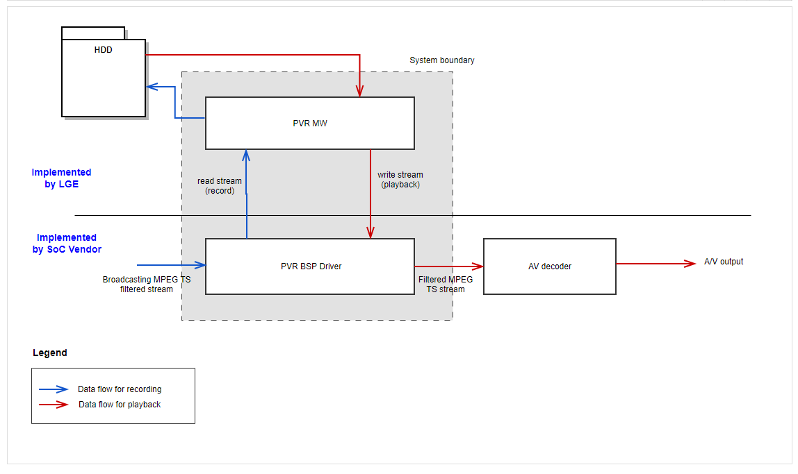
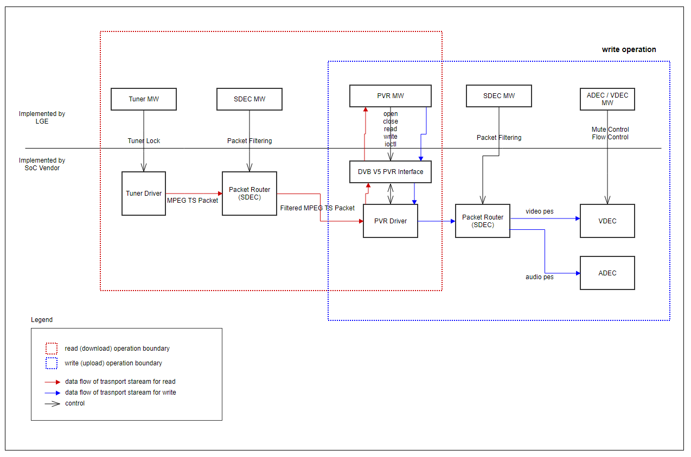
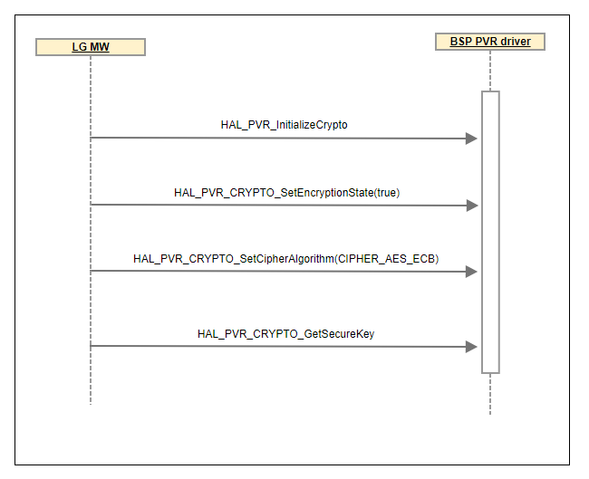
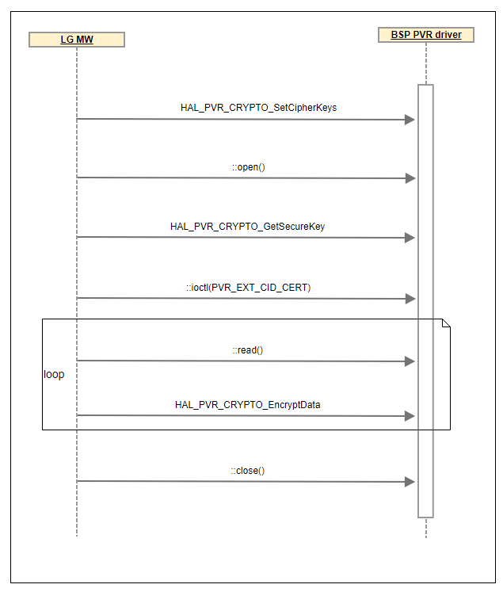
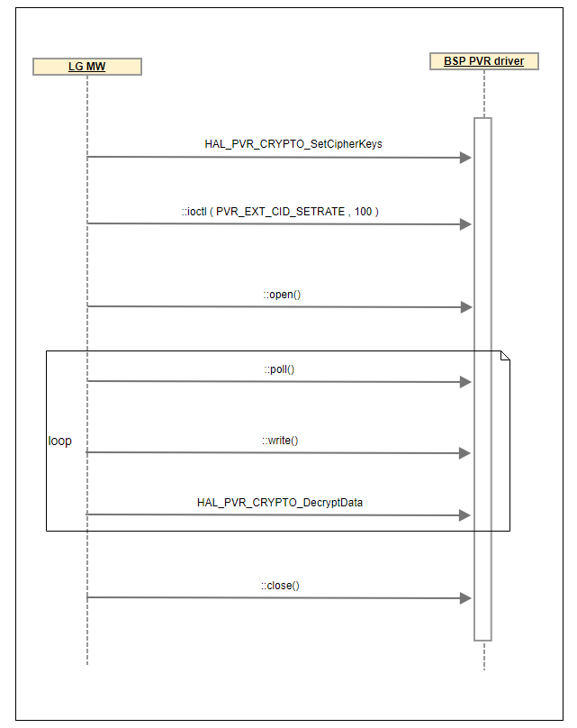
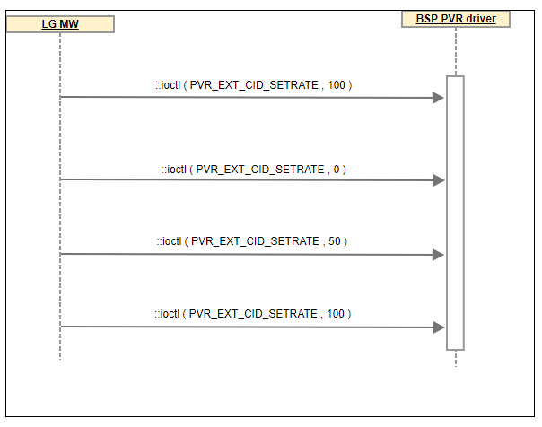
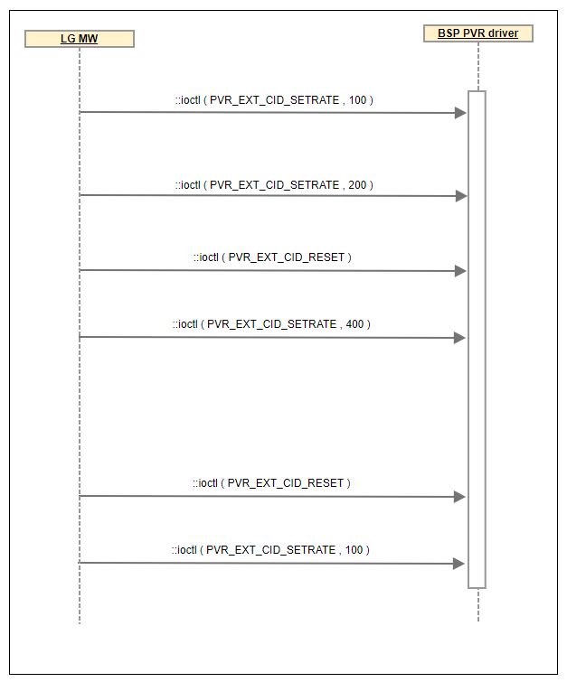
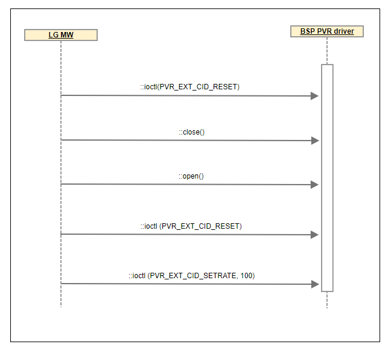

DVBv5 PVR
~~~~~~~~~~~

.. _hwachin.lee: hwachin.lee@lge.com

Introduction
==============

| This document describes the Personal Video Recorder (PVR) driver in the kernel space.
 The document gives an overview of the PVR driver and provides details about its functionalities and implementation requirements.
| The PVR driver is based on the DVBv5 framework. Therefore, the document assumes that the readers are familiar with the DVBv5
 API and framework principles, which include knowledge of DVBv5 controls, buffer management, and streaming handling, among others.
| The PVR driver is responsible for handling and parsing broadcasting transport stream (TS).
 Therefore, it is necessary to understand MPEG4, H264 and HEVC packet protocol.

Revision History
-----------------

======= ========== ============== =======
Version Date       Changed by     Comment
======= ========== ============== =======
1.4.0   2024-01-11 `hwachin.lee`_ Update documentation description
1.4.0   2023-12-20 `hwachin.lee`_ Restructure Document
1.3.0   2023-11-20 `hwachin.lee`_ Add sequence diagram
1.2.10  2022-09-29 `hwachin.lee`_ Add function link for ioctl.
1.2.9   2022-08-10 `hwachin.lee`_ Restructure documentation.
1.2.8   2019-09-27 `hwachin.lee`_ | Fix numbering error.
                                  | Remove mislocated error code description of PVR_EXT_CID_RESET.
                                  | Change description of write function.
                                  | Fix wrong description O_NONBLOCK.
1.2.7   2019-03-13 `hwachin.lee`_ For HAL_PVR_Crypto family functions → no need to move to other part.
1.2.6   2019-03-13 `hwachin.lee`_ Change flag for PVR upload O_RDWR → O_WRONLY
1.2.5   2019-03-08 `hwachin.lee`_ Add description for nonblocking flag for open() function
1.2.4   2019-03-08 `hwachin.lee`_ Add description for error code of write() function
1.2.3   2019-02-28 `hwachin.lee`_ | Change return type of read/write : size_t → ssize_t
                                  | Define magic number and value for below
                                  | PVR_EXT_S_CTL → 'p' , 0
                                  | PVR_EXT_G_CTL → 'p' , 1
1.2.2   2019-02-12 `hwachin.lee`_ Modify IOCTL name and add relevant data structure
1.2.1   2019-02-11 `hwachin.lee`_ Unify ioctl ext with other demux functions
1.2.0   2019-02-11 `hwachin.lee`_ Add description for HAL_PVR_CRYPTO function family
1.1.0   2019-01-28 `hwachin.lee`_ write , ioctl
1.0.0   2018-10-16 `hwachin.lee`_ Remove unnecessary functions
0.0.1   2018-09-27 `hwachin.lee`_ Initial update
======= ========== ============== =======

Terminology
-----------------
| The key words “must”, “must not”, “required”, “shall”, “shall not”, “should”, “should not”, “recommended”, “may”,
 and “optional” in this document are to be interpreted as described in RFC2119.
| The following table lists the terms used throughout this document:

================= ============
Definition        Description
================= ============
PVR               Record and playback module of broadcast stream
VFE               Video front end
VDEC              Video decoder
ADEC              Audio decoder
TS                Transport stream
Packet mode 188   Original stream
Packet mode 192   4bytes timestamp + original stream
SDEC              System decoder. It work Filtering and routing packet
Download          Record broadcast stream
Upload            Playback recorded stream
================= ============

Technical Assistance
---------------------
For assistance or clarification on information in this guide, please create an issue in the LGE JIRA project and contact the following person:

============ =======================
Module       Owner
============ =======================
DVBv5 PVR    | hwachin.lee@lge.com
             | hangyu.park@lge.com
============ =======================

Overview
==============

General Description
--------------------

| The PVR driver is based on Linux DVBv5 and is responsible for handling and parsing broadcasting transport stream (TS).
| This driver does not include encryption functions because they are included in the HAL PVR driver.

Features
----------
| The PVR driver provides the following features:
|  * Record : Read data stream for recording.
|  * Playback : Write data stream for playback.
|  * Certification : Device certification before recording.
|  * Rate Control : Playback rate controls.
|  * Reset Device : Device reset during playback.

Architecture
--------------

System Context
^^^^^^^^^^^^^^^

The following diagram shows the PVR driver interface.

The description of each component is like below.

================ =======================
Component        Description
================ =======================
PVR MW           Control PVR BSP. TS stream passing to PVR BSP Driver (Playback) or HDD (Record).
PVR BSP Driver   Buffering filtered TS stream. Passing TS stream to PVR MW (Record) or AV decoder (Playback).
AV decoder       Decoding audio and video.
================ =======================

Driver Architect
^^^^^^^^^^^^^^^^^^^^^

The following diagram shows the read and write operations between the PVR driver and other associated drivers.

The description of each component is like below.

======================= =======================
Component               Description
======================= =======================
Tuner MW                Control tuner driver.
Tuner Driver            Locking tuner for target broadcasting channel.
SDEC MW                 Control Packet Router.
Packet Router           Filtering packet for recording target(recording). Distribute packet to adec/vdec(playback).
PVR MW                  Control PVR BSP. TS stream passing to PVR BSP Driver (Playback) or HDD (Record).
PVR Driver              Buffering filtered TS stream. Passing TS stream to PVR MW (Record) or AV decoder (Playback).
ADEC/VDEC MW            Control adec / vdec.
VDEC                    Decoding video packet.
ADEC                    Decoding audio packet.
======================= =======================

Requirements
==============
This section describes the major functionalities of the PVR driver, as well as its operational flow and requirements.

Functional Requirements
-----------------------
This section sets forth the requirements imposed on PVR's basic functionalities.

Download
^^^^^^^^^^
| TS data filtered through the set SDEC Path must be saved in a file through the  DVBv5 PVR interface.
| It must be performed based on the 192 packet mode.
| The length of each packet data must be multiple of 192 by the read operation.

Upload
^^^^^^^^
| TS data saved through a file download must be delivered to the AV decoder via the DVBv5 PVR interface.

Upload Control
^^^^^^^^^^^^^^
| Upload rate control and reset operation must be performed.
| For seek, refer to : :c:macro:`PVR_EXT_CID_RESET`
| For play speed control, refer to : :c:macro:`PVR_EXT_CID_SETRATE`

Device certification
^^^^^^^^^^^^^^^^^^^^^
| Before starting recording, the PVR driver must check validation with the pre-arranged key value.
 If this is not done or fails, stream data must not be passed.
| The promised key value is defined as the XOR value for each byte of the secure key with the predefined table value.
| PVR driver must check whether the key value passed to IOCTL PVR_EXC_CID_CERT matches the promised value.

Encryption
^^^^^^^^^^^
The encryption is defined in the HAL_PVR_Crypto document.

Quality and Constraints
-----------------------
| The following are the performance requirements for the PVR driver.
|  * The bitrate of TS Data reaches up to 55Mbps considering the HEVC 4K channel.
|  * Real-time upload/download of the data must be operated.

Implementation
===============
This section provides supplementary materials that are useful for the PVR driver implementation.

|  * The File Location section provides the location of the Git repository where you can get the header file
 in which the interface for the PVR driver implementation is defined.
|  * The API List section provides a brief summary of PVR APIs that you must implement.
|  * The Implementation Details section provides references, sequence diagrams, and sample code for the PVR API.

File Location
--------------

| The PVR interfaces are defined in the dvbv5-ext-pvr.h header file, which can be obtained from https://swfarmhub.lge.com/.
|  * Git repository: bsp/ref/dvbv5-ext-header
| This Git repository contains the header files for the PVR implementation as well as
 documentation for the PVR implementation guide and PVR API reference.

API List
---------
| PVR implementation must adhere to the interface specifications defined in the PVR API Reference.
| Refer to the Delivery API Reference for more information.

Data Types
^^^^^^^^^^^
| The data types used in this module are as follows.
| For more detail click the link with each data type name.

========================= =======================
Data type                 Description
========================= =======================
:type:`pvr_ext_control`   Struct for PVR_EXT_S_CTL or  PVR_EXT_G_CTL
========================= =======================

Functions
^^^^^^^^^^
| The functions used in this module are as follows.
| For more detail click the link with each function name.

===================================== =======================
Data type                             Description
===================================== =======================
:func:`open`                          Device open.
:func:`close`                         Device close.
:func:`read`                          Read TS stream from device.
:func:`write`                         Write TS stream to device.
:func:`cryptos`                       Crypto Family functions. except from socts, it is described on HAL
:c:macro:`PVR_EXT_CID_RESET`          Device reset during PVR uploading.
:c:macro:`PVR_EXT_CID_SETRATE`        Set TS data flow rate.
:c:macro:`PVR_EXT_CID_CERT`           Device certification.
:c:macro:`PVR_EXT_CID_SET_PKTLEN`     Set TS packet length (192 or 188).
:c:macro:`PVR_EXT_S_CTL`              PVR extension control for device setting.
:c:macro:`PVR_EXT_G_CTL`              PVR extension control for device getting. except from socts, it will be use from next chip.
===================================== =======================

Implementation Details
------------------------

Function Implement detail
^^^^^^^^^^^^^^^^^^^^^^^^^^^

Open
******

.. function:: open()

  * Name : Digital TV demux open()
  * Synopsis

  .. code-block:: cpp
     :linenos:

     int open(const char *deviceName, int flags);

  * Arguments

    name : Name of specific Digital TV PVR device. (/dev/dvb/adapter0/dvr0), The number next 'dvr' means channel number.

      /dev/dvb/adapter0/dvr0 - open dvr device with channel 0

      /dev/dvb/adapter0/dvr1 - open dvr device with channel 1

      /dev/dvb/adapter0/dvr2 - open dvr device with channel 2

      /dev/dvb/adapter0/dvr3 - open dvr device with channel 3

    flags : A bit-wise OR of the following flags

    ============ ===========================================================
    O_RDONLY     read-only access ( for download )
    O_WRONLY     read/write access ( for upload )
    O_NONBLOCK   open in non-blocking mode (blocking mode is the default)
    O_CLOEXEC    Enable the close-on-exec flag for the new file descriptor
    ============ ===========================================================

  * Description

    This system call opens a named PVR device.
    Response must be within 50ms.

  * Return Value

    On success open() returns the new file descriptor. On error -1 is returned,
    and the errno variable is set appropriately.

Close
*******

.. function:: close()

  * Name : Digital TV PVR device close()
  * Synopsis

  .. code-block:: cpp
     :linenos:

     int close(int fd)

  * Arguments

    fd : File descriptor returned by a previous call to open()

  * Description

    This system call deactivates and deallocates a filter that was previously
    allocated via the open() call. Response must be within 50ms.

  * Return Value

    On success 0 is returned. On error -1 is returned, and the errno variable
    is set appropriately.

Read
*******

.. function:: read()

  * Name : Digital TV PVR device read()
  * Synopsis

  .. code-block:: cpp
     :linenos:

     ssize_t read(int fd, void * buf , size_t count);

  * Arguments

    fd : File descriptor returned by a previous call to open().

    buf : Buffer to be filled

    count : Max number of bytes to read

  * Description

    This system call returns filtered data, which might be TS data. The filtered
    data is transferred from the driver’s internal circular buffer to buf.
    The maximum amount of data to be transferred is implied by count.
    Response must be within 100ms.

  * Return Value

    On success 0 is returned. On error -1 is returned, and the errno variable
    is set appropriately.

Write
*******

.. function:: write()

  * Name : Digital TV PVR device write()
  * Synopsis

  .. code-block:: cpp
     :linenos:

     ssize_t write(int fd, const void *buf, size_t count);

  * Arguments

    fd : File descriptor returned by a previous call to open().

    buf : Buffer with data to be written

    count : Number of bytes at the buffer

  * Description

    This system call is only provided by the logical device /dev/dvb/adapter?/dvr0,
    associated with the physical demux device that provides the actual DVR functionality.
    Response must be within 100ms.

  * Return Value

    On success actual written size returns.
    In case of 0, it means upload buffer full, need to wait.
    On error -1 is returned, and the errno variable is set appropriately.

Crypto Family Functions
**************************
  .. function:: cryptos()

  * Crypto Family Functions does not implemented based on the linux-dvb but it is described on HAL documents

Sequence Diagram
^^^^^^^^^^^^^^^^^^^

initialize
***********
The figure below provides a sequence diagram of an initialize operation.

record
***********
The figure below provides a sequence diagram of a record operation.

playback
***********
The figure below provides a sequence diagram of a playback operation.

slow play
***********
The figure below provides a sequence diagram of a slow play operation.

fast play
***********
The figure below provides a sequence diagram of a fast play operation.

seek
***********
The figure below provides a sequence diagram of a seek operation.

Example
^^^^^^^^^
| Below is example code for PVR operation.
| readFunction is for recording and writeFunction is for playback.

.. code-block:: cpp
  :linenos:

  function readFunction()
  {
      set recording pid;
      // open PVR device with channel0
      // The channel can be set 0 ~ 3
      // For the flags, O_RDONLY is passed in the recording case
      int fd = open("/dev/adaptor0/dvr0" , O_RDONLY);

      // Before start recording device certification is calling.
      param.id   = PVR_EXT_CID_CERT;
      param.size = 32;
      // cert key is generated by LG sides
      param.ptr  = certKey;
      ioctl(aFd, PVR_EXT_S_CTL, &param);

      while(!stopFlag)
      {
          // read PVR buffer from TS stream data
          size_t sz_read = read(fd , buf , 384K);
          write_stream_to_file(buf, sz_read);
          sleep(100ms);
      }
      // close PVR device
      close(fd);
  }

.. code-block:: cpp
  :linenos:

  function writeFunction(bufferPtr , size)
  {
      // open PVR device with channel2
      // The channel can be set 0 ~ 3
      // For the flags, O_WRONLY is passed in the playback case
      int fd = open("/dev/adaptor0/dvr2" , O_WRONLY);

      // set rate to normal play(100)
      param.id = PVR_EXT_CID_SETRATE;
      param.value64 = 100;
      int ret = ioctl(fd , PVR_EXT_S_CTL , &param);

      while(!stopFlag)
      {
          struct pollfd pfd;
          pfd.fd = fd;
          pfd.events = POLLOUT | POLLPRI;
          if(poll(&pfd, 1, POLLING_TIMEOUT) > 0)
          {
              uint8_t *buffer, size_t size;
              read_stream_data_from_
              write(fd, buffer, size);
          }
      }
      close(fd);
  }

Status Log
-----------

  :doc:`/status-files/pvr-status`

Testing
========
| To test the implementation of the PVR module, webOS TV provides SoCTS (SoC Test Suite) tests. The SoCTS checks the basic operations of
 the PVR module and verifies the kernel event operations for the module by using a test execution file.
| For more information, see :doc:`PVR’s SoCTS Unit Test manual </part4/socts/Documentation/source/producer-manual/producer-manual_dvbv5/producer-manual_dvbv5-pvr>`.
| SOCTS test API is opened like below
    
    * pvr-dn.0001 ~ 0013
    * pvr-up.0001 ~ 0013
