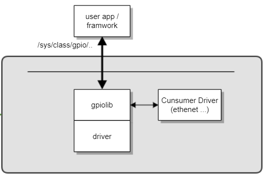

GPIO
#####

.. _khkh.lee: khkh.lee@lge.com
.. _denis.hong: denis.hong@lge.com
.. _kwangseok.kim: kwangseok.kim@lge.com
.. _abhishek.p: abhishek.p@lge.com
.. _jongyeon.yoon : jongyeon.yoon@lge.com

Introduction
************
| This document describes the General-Purpose Input Output (GPIO) driver in the kernel space.
| The document gives an overview of the GPIO driver and provides details about its implementation requirements.
Revision History
================

======= ========== ================== ================================
Version Date       Changed by            Description
======= ========== ================== ================================
2.0     2023.11.7  denis.hong@lge.com Change format & Update contents
1.0     2022.5.31  denis.hong@lge.com Initial release
======= ========== ================== ================================

Terminology
===========

| The key words "must", "must not", "required", "shall", "shall not", "should", "should not", "recommended", "may", and "optional" in this document are to be interpreted as described in RFC2119.

| The following table lists the terms used throughout this document. The GPIO functions are designed to support certain modules, so you should also refer to the modules related to the function.

================================ ==================================
Term                             Description
================================ ==================================
GPIO                             General Purpose Input Output
================================ ==================================

Technical Assistance
====================

For assistance or clarification on information in this guide, please create an issue in the LGE JIRA project and contact the following person:

================== ===================================================================
Module             Owner
================== ===================================================================
GPIO               `khkh.lee`_ & `denis.hong`_ & `kwangseok.kim`_ & `jongyeon.yoon`_
================== ===================================================================

Overview
********

General Description
===================
| A General-Purpose Input Output (GPIO) is an uncommitted digital signal pin on an integrated circuit or electronic circuit board which may be used as an input or output, or both, and is controllable by software.
| The GPIO driver provides an interface to the webOS TV platform to handle I/O requests for GPIO pins.

Features
=========

  * GPIO pins can be configured to be input or output
  * GPIO pins can be enabled/disabled
  * Input values are readable (usually high or low)
  * Output values are writable/readable
  * Input values can often be used as IRQs (usually for wakeup events)

Architecture
=============
| The GPIO driver supports the GPIO read (get) and GPIO write (set) functions through the kernel.
| The following diagram shows the architecture of the GPIO driver. 

Requirements
*************
| The GPIO driver is implemented by SoC vendors according to the SoC specification.
| The following are functional requirments for the GPIO driver.

  * The GPIO driver is implemented by SoC vendors according to the SoC specification.
  * After implementing the GPIO driver, SoCTS unit tests for GPIO must be conducted and they must pass the SoCTS exit criteria.

Functional Requirements
=======================
Please refer to each function's requirements.

Quality and Constraints
=======================
Please refer to each function's constraints.

Implementation
***************

| This section provides supplementary materials that are useful for GPIO Function implementation.
| The GPIO driver is implemented using the Linux standard functions and there are no additional functions defined by LG. Therefore, the GPIO driver is implemented by SoC vendors according to the SoC specification.

File Location
=============
| The GPIO driver uses the standard Linux interface and there is no newly defined interface. Please refer to the standard GPIO header file.

API List
========
The GPIO driver uses the standard Linux interface and there is no newly defined interface. Please refer to the standard GPIO header file.

Implementation Details
======================

|  Refer to the section, the Requirements.

Testing
*******
| To test the implementation of the GPIO driver, webOS TV provides SoCTS (SoC Test Suite) tests. The SoCTS checks the basic operations of the GPIO driver and verifies the kernel event operations for the module by using a test execution file.
| For more information, see :doc:`GPIO in the SoCTS Unit Test manual. </part4/socts/Documentation/source/producer-manual/producer-manual_common/producer-manual_gpio>`

Functions for GPIO's SoCTS Unit Test
====================================
| The following is a list of the GPIO functions tested by SoCTS:

  * :func:`_gpio_sample_export`
  * :func:`_gpio_sample_unexport`
  * :func:`_gpio_sample_get_direction`
  * :func:`_gpio_sample_set_direction`
  * :func:`_gpio_sample_read`
  * :func:`_gpio_sample_write`

References
**********
