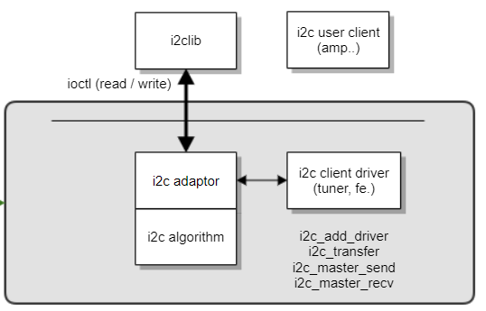

I2C
###

.. _denis.hong: denis.hong@lge.com
.. _khkh.lee: khkh.lee@lge.com
.. _kwangseok.kim: kwangseok.kim@lge.com
.. _jongyeon.yoon : jongyeon.yoon@lge.com

Introduction
************
| This document describes the Inter-Integrated Circuit (I2C) driver in the kernel space.
| The document gives an overview of the I2C driver and provides details about its implementation requirements.

Revision History
=================

======= ========== ================== ================================
Version Date       Changed by            Description
======= ========== ================== ================================
2.0     2023.11.14 denis.hong@lge.com Change format & Update contents
1.0     2022.10.17 denis.hong@lge.com First release
======= ========== ================== ================================

Terminology
===========

| The key words "must", "must not", "required", "shall", "shall not", "should", "should not", "recommended", "may", and "optional" in this document are to be interpreted as described in RFC2119.

| The following table lists the terms used throughout this document. The I2C functions are designed to support certain modules, so you should also refer to the modules related to the function.

================================ ==================================
Term                             Description
================================ ==================================
I2C                              Inter-Integrated Circuit.
================================ ==================================

Technical Assistance
====================

For assistance or clarification on information in this guide, please create an issue in the LGE JIRA project and contact the following person:

================== ===================================================================
Module             Owner
================== ===================================================================
I2C                `khkh.lee`_ & `denis.hong`_ & `kwangseok.kim`_ & `jongyeon.yoon`_
================== ===================================================================

Overview
********

General Description
===================
| I2C (Inter-Integrated Circuit, eye-squared-C), alternatively known as I2C or IIC,is a synchronous, multi-controller/multi-target (controller/target), packet switched, single-ended, serial communication bus invented in 1982 by Philips Semiconductors.
| It is widely used for attaching lower-speed peripheral ICs to processors and microcontrollers in short-distance, intra-board communication.
| The I2C driver provides an interface to the webOS TV platform to communicate with any I2C-compatible devices that connects through the I2C serial bus.

Features
=========
| The I2C reference design is a bus with a clock (SCL) and data (SDA) lines with 7-bit addressing. 
| The bus has two roles for nodes, either controller (master) or target (slave):

  * Controller (master) node: Node that generates the clock and initiates communication with targets (slaves).
  * Target (slave) node: Node that receives the clock and responds when addressed by the controller (master).

| The bus is a multi-controller bus, which means that any number of controller nodes can be present. Additionally, controller and target roles may be changed between messages (after a STOP is sent).

| There may be four potential modes of operation for a given bus device, although most devices only use a single role and its two modes:

  * Controller (master) transmit: Controller node is sending data to a target (slave).
  * Controller (master) receive: Controller node is receiving data from a target (slave).
  * Target (slave) transmit: Target node is sending data to the controller (master).
  * Target (slave) receive: Target node is receiving data from the controller (master).

Architecture
============
| The I2C driver provides I2C read and I2C write functions for standard I2C communication. The following diagram shows the architecture of the I2C driver.

Requirements
*************

Functional Requirements
=======================
| The following are functional requirments for the I2C module:

  * The driver should provide an interface that allows for the adjustment of the I2C speed.
  * This interface is not the standard of the Linux kernel. Instead, a private mode bit will be added to accommodate the desired I2C speed.
  * After implementing the I2C driver, SoCTS unit tests for I2C must be conducted and they must pass the SoCTS exit criteria.

| <Simple scenario>
| The webOS platform requests an I2C read operation with a speed of 400KHz.
| The webOS platform requests an I2C write operation with a speed of 200KHz for other devices utilizing the same I2C bus.

Quality Requirements
====================
| The driver should always meet the speed requested by the webOS platform.

Interface Requirements
=======================
| Private mode bits to control the bus clock frequency.

::

    #define I2C_M_DEFAULT_SPEED    0x0000              // Default speed defined for each channels
    #define I2C_M_LOW_SPEED        0x0002              // Low speed (50KHz)
    #define I2C_M_NORMAL_SPEED     0x0004              // Normal speed (100KHz)
    #define I2C_M_HIGH_SPEED       0x0006              // High speed (400KHz)
    #define I2C_M_FAST_SPEED       0x0008              // Fast speed (chip defined (800KHz), some chips can not have 800KHz)

    static int _kernel_i2c_rdwr(int fd, struct i2c_msg *msgs, size_t count)
    {
        struct i2c_rdwr_ioctl_data data = {0, };

        data.msgs = msgs;
        data.nmsgs = count;

        return ioctl(fd, I2C_RDWR, &data);
    }

    static int _kernel_i2c_read(int fd, unsigned char clockMode, unsigned char dev, void *data, size_t len)
    {
        struct i2c_msg msg = {0, };

        msg.addr = dev;
        msg.flags = I2C_M_RD | clockMode;
        msg.len = len;
        msg.buf = data;

        return _kernel_i2c_rdwr(fd, &msg, 1);
    }

    static int _kernel_i2c_write(int fd, unsigned char clockMode, unsigned char dev, void *data, size_t len)
    {
        struct i2c_msg msg = {0, };

        msg.addr = dev;
        msg.flags = 0 | clockMode;
        msg.len = len;
        msg.buf = data;

        return _kernel_i2c_rdwr(fd, &msg, 1);
    }

Quality and Constraints
=======================
Please refer to each function's constraints.

Implementation
***************

| The I2C driver is implemented using the Linux standard functions and there are no additional functions defined by LG.
| Therefore, the I2C driver is implemented by SoC vendors to meet the requirements listed in Requirements according to the SoC specification.

File Location
=============
| The I2C driver uses the standard Linux interface and there is no newly defined interface. Please refer to the standard I2C header file.

API List
========
The I2C driver uses the standard Linux interface and there is no newly defined interface. Please refer to the standard I2C header file.

Implementation Details
======================

|  Refer to the section, the Requirements.

Testing
*******
| To test the implementation of the I2C driver, :doc:`webOS TV provides SoCTS (SoC Test Suite) tests. </part4/socts/Documentation/source/producer-manual/producer-manual_common/producer-manual_i2c>`
| The SoCTS checks the basic operations of the I2C driver and verifies the kernel event operations for the module by using a test execution file.
| For more information, see I2C in the SoCTS Unit Test manual.

Functions for I2C's SoCTS Unit Test
====================================
| The following is a list of the I2C functions tested by SoCTS:

  * :func:`_i2c_eeprom_open`
  * :func:`_i2c_eeprom_close`
  * :func:`_i2c_eeprom_rdwr`
  * :func:`_i2c_eeprom_read`
  * :func:`_i2c_eeprom_write`

References
**********
