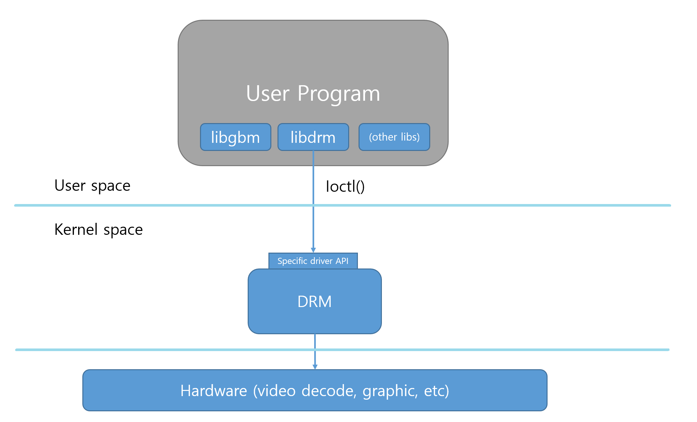
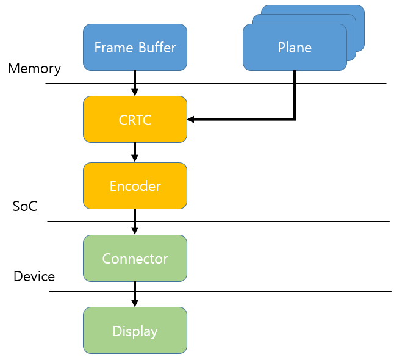

DRM_Graphic
###########

.. _youngman.jung: youngman.jung@lge.com
.. _jinseong1.yang: jinseong1.yang@lge.com

Introduction
************

| This document describes the DRM (Direct Rendering Manager). The document gives an overview of the DRM and provides details about its functionalities and implementation requirements.

| A DRM is a framework to manage Graphics Processing Units (GPUs). Graphics drivers in the kernel may make use of DRM functions to make tasks like memory management, interrupt handling and DMA easier, and provide a uniform interface to applications.

| Therefore, it is necessary to understand GPU and graphic techniques, including knowledge of GBM and etc.

Revision History
================

+--------------+------------+----------------------+---------------------------------------------------------------------------------------+
| Version      | Date       | Changed by           | Description                                                                           |
+==============+============+======================+=======================================================================================+
|1.0.0         | 2024-05-22 | `youngman.jung`_     | First release                                                                         |
|              |            |                      |                                                                                       |
|              |            | `jinseong1.yang`_    |                                                                                       |
+--------------+------------+----------------------+---------------------------------------------------------------------------------------+

Terminology
===========
| The key words "must", "must not", "required", "shall", "shall not", "should", "should not", "recommended", "may", and "optional" in this document are to be interpreted as described in RFC2119. 

| The following table lists the terms used throughout this document: 

=============================== ===============================
Term                            Description
=============================== =============================== 
DRM                             Direct Rendering Manager
GBM                             Generic Buffer Management
DMA                             Direct Memory Access
LSM(Luna Surface Manager)       The graphic compositor on the webOS platform
=============================== =============================== 

Technical Assistance
====================

| For assistance or clarification on information in this guide, please create an issue in the LGE JIRA project and contact the following person:

=============== ============ 
Module          Owner         
=============== ============ 
DRM             `youngman.jung`_ 
=============== ============ 

Overview
********

General Description
===================

| The Direct Rendering Manager (DRM) is a framework to manage Graphics Processing Units (GPUs). It is designed to support the needs of complex graphics devices, usually containing programmable pipelines well suited to 3D graphics acceleration. Furthermore, it is responsible for memory management, interrupt handling and DMA to provide a uniform interface to applications.

| DRM exposes an API that user-space programs can use to send commands and data to the GPU and perform operations such as configuring the mode setting of the display. User-space programs can use the DRM API to command the GPU to do hardware-accelerated. The DRM core exports several interfaces to user-space applications, generally intended to be used through corresponding libdrm wrapper functions.

.. note::
  This page refers are Linux commands Man reference pages.
  Linux Commands ref: https://www.commandlinux.com/man-page/man7/drm.7.html

Architecture
============

This section describes the hardware architecture and the driver architecture for DRM.

Hardware Architecture
---------------------

The user-space programs can access to the DRM through libdrm wrapper functions. libgbm is a frontend library to load the GLES stack and to retrieve the backing buffer objects behind an eglImage (created by EGL_WAYLAND_BUFFER_WL), etc.
This frontend only operates as a backend loader and shim (the buffer component). The backend library must be provided by the GLES implementation.

The following diagram shows interfaces between the user space and the kernel space.

Driver Architecture
-------------------

The Direct Rendering Manager (DRM) is a framework to manage Graphics Processing Units (GPUs). 

DRM provides the following features:

- Support complex graphic devices, usually containing programmable pipelines well suited to 3D graphics acceleration
- Provide a uniform interface to applications (e.g., memory management, Direct Memory Access (DMA), and interrupt handling)

The following diagram shows DRM architecture.

- Plane : Plane a memory object with a buffer to which CRTC
- CRTC : CRTC is scanout engine, which reads the pixel data in the scanout buffer and generates a video mode timing signal. The number of available CRTC determines how many independent output devices the hardware can handle simultaneously, so at least one CRTC is required per display device.
- Encoders : The display controller must encode the video mode timing signals from the CRTC using the format appropriate for the connector.
- Connectors : The display controller sends a video signal in a scanout operation by CRTC to indicate where to display. Typically refres to the physical connector of hardware with an output device.

Requirements
************

Functional Requirements
=======================

| The DRM library used in webOS must be supported.

Quality and Constraints
=======================

Performance Requirements
-----------------------

| We will update the content soon.

Design Constraints
-----------------------

| It must operate normally without performance problems in the webOS environment.

Implementation
**************

This section provides materials that are useful for DRM implementation. 

- The API List section provides a brief summary of APIs related DRM that you must implement.
- The Implementation Details section sets implementation guidance and example code for some major functionalities.
- The Status Log section provides information about the DRM status log file which is used for examining the status and operation of DRM.

File Location
=============
None

API List
========

Functions
^^^^^^^^^

======================================= ===================================================================================================
Funtion                                 Description
======================================= ===================================================================================================
:func:`drmGetCap`                       Gets capabilities of the DRM driver
:func:`drmModeAddFB2`                   Creates a new framebuffer with an buffer object as its scanout buffer with a specific pixel format
:func:`drmModeRmFB`                     Destroys (frees) a framebuffer allocated by drmModeAddFB or drmModeAddFB2.
:func:`drmModeGetCrtc`                  Fetches a drmModeCrtcPtr structure
:func:`drmModeSetCrtc`                  sets the display mode on the CRTC and specified connector
:func:`drmModeFreeCrtc`                 Frees a drmModeCrtcPtr structure allocated by drmModeGetCrtc
:func:`drmModePageFlip`                 Schedules a page flip on the specified CRTC
:func:`drmModeSetCursor2`               Sets a cursor image
:func:`drmModeMoveCursor`               Moves a cursor
:func:`drmModeSetPlane`                 Change a plane’s framebuffer and position
:func:`drmSetClientCap`                 Enables or disables DRM feature
:func:`drmModeCreatePropertyBlob`       Create a property blob
:func:`drmModeGetPropertyBlob`          Get a property blob
:func:`drmModeFreePropertyBlob`         Free a property blob
:func:`drmModeGetPlaneResources`        Get plane resources
:func:`drmModeGetPlane`                 Get information about a plane
:func:`drmModeFreePlaneResources`       Free plane resources
:func:`drmModeAtomicAlloc`              Allocate atomic request pointer
:func:`drmModeConnectorSetProperty`     Set a connector property
:func:`drmModeAtomicCommit`             Commits an atomic property change request to hardware
:func:`drmModeAtomicFree`               Free Atomic request
:func:`drmModeDestroyPropertyBlob`      Destroy a property blob
:func:`gbm_bo_create`                   Allocate a buffer object for the given dimensions
:func:`gbm_bo_destroy`                  Destroys the given buffer object and frees all resources associated with it.
:func:`gbm_bo_write`                    Write data into the buffer object.
:func:`gbm_bo_get_handle`               Get the handle of the buffer object.
:func:`gbm_bo_get_device`               Get the gbm device used to create the buffer object
:func:`gbm_device_get_fd`               Returns the file description for the gbm device
:func:`gbm_bo_get_user_data`            Get the user data associated with a buffer object
:func:`gbm_bo_get_width`                Get the width of the buffer object   
:func:`gbm_bo_get_height`               Get the height of the buffer object
:func:`gbm_bo_get_format`               Get the format of the buffer object
:func:`gbm_bo_set_user_data`            Set the user data associated with a buffer object
:func:`gbm_surface_create`              Allocate a surface object
:func:`gbm_surface_lock_front_buffer`   Lock the surface's current front buffer
:func:`gbm_surface_release_buffer`      Release a locked buffer obtained with gbm_surface_lock_front_buffer()
:func:`gbm_create_device`               Create a gbm device for allocating buffers
:func:`gbm_device_destroy`              Destroy the gbm device and free all resources associated with it.
======================================= ===================================================================================================

Implementation Details
======================

This section contains implementation details and example code for some functionality described in the Requirements section.

drmGetCap
^^^^^^^^^
.. function:: drmGetCap()

    drmGetCap — Gets capabilities of the DRM driver.

    **Functional Requirements**
        drmGetCap gets capabilities of the DRM driver.

    **Responses to abnormal situations, including**
        If abnormal data is set, the driver should return an error. The generic error codes are described at the https://www.kernel.org/doc/html/v5.6/media/uapi/gen-errors.html

    **Performance Requirements**
        There is no performance requirements.

    **Constraints**
        Should be supported libdrm.

    **Functions & Parameters**
        .. code-block:: cpp
          :linenos:

          //
          //function
          //
          int drmGetCap (int fd, 
                            uint64_t capability, 
                            uint64_t *value);

          //
          //parameter
          //
          fd //The file descriptor of an open DRM device.
          capability //The DRM capability to be obtained from the device. Supported capabilities are:
                    //* DRM_CAP_ASYNC_PAGE_FLIP: value is set to 0 if unsupported, 1 if supported.
                    //* DRM_CAP_DUMB_BUFFER: value is set to 0 if unsupported, 1 if supported.
                    //* DRM_CAP_CURSOR_WIDTH: Stores the maximum cursor width allowed by SoC in value if the capability is supported, 0 if unsupported.
                    //* DRM_CAP_CURSOR_HEIGHT: Stores the maximum cursor height allowed by SoC in value if the capability is supported, 0 if unsupported.
                    //* DRM_CAP_TIMESTAMP_MONOTONIC: value is set to 0 if unsupported, 1 if supported. Only supported on Linux.
          value //Returns a capability value as specified by capability.

    **Return Value**
        ``0``
          if successful.

        ``EINVAL``
          One or more of the ioctl parameters are invalid or out of the allowed range. This is a widely used error code. See the individual ioctl requests for specific causes.

    **Example**
        .. code-block:: cpp
          :linenos:

            if (drmGetCap(fd, DRM_CAP_DUMB_BUFFER, &has_dumb) < 0 || !hasdumb) {
                fprintf(stderr, "drm device '%s' does not support dumb buffers\n", node);
                close(fd);
                return -EOPNOTSUPP;
            }

drmModeAddFB2
^^^^^^^^^^^^^
.. function:: drmModeAddFB2()

    drmModeAddFB2 — Creates a framebuffer, specifying format and planes.

    **Functional Requirements**
        This function is similar to :drmModeAddFB, but offers more options. The buffer objects' pixel format is specified explicitly, instead of being depth+bpp as in drmModeAddFB. Also, multiplanar YUV formats are supported. As for drmModeAddFB, the buffer object handle(s) can be a dumb buffers or imported dma-bufs.

    **Responses to abnormal situations, including**
        If abnormal data is set, the driver should return an error. The generic error codes are described at the https://www.kernel.org/doc/html/v5.6/media/uapi/gen-errors.html

    **Performance Requirements**
        There is no performance requirements.

    **Constraints**
        Should be supported libdrm.
        If the call is successful, the application must remove (free) the framebuffer by calling drmModeRmFB.

    **Functions & Parameters**
        .. code-block:: cpp
          :linenos:

          //
          //function
          //
          int drmModeAddFB2 (int fd, 
                               uint32_t width, 
                               uint32_t height, 
                               uint32_t pixel_format, 
                               const uint32_t bo_handles[4], 
                               const uint32_t pitches[4], 
                               const uint32_t offsets[4], 
                               uint32_t * buf_id, 
                               uint32_t flags);

          //
          //parameter
          //
          fd //The file descriptor of an open DRM device.
          width //Framebuffer width in pixels.
          height //Framebuffer height in pixels.
          pixel_format //Pixel format of the bo_handle(s).
          bo_handles //An array of four handles for buffer objects to provide memory backing. Unused array elements must be NULL.
          pitches //An array containing the pitches of the buffer objects in bytes.
          offsets //An array containing the offsets of the buffer objects in bytes.
          buf_id //Receives the framebuffer ID of the created framebuffer if framebuffer creation is successful.
          flags //Creation flags.

    **Return Value**
        ``0``
          if destruction is successful.

        ``-1``
          otherwise.

    **Example**
        .. code-block:: cpp
          :linenos:

            /* create framebuffer object for the dumb-buffer */
            handles[0] = buf->handle;
            pitches[0] = buf->stride;
            ret = drmModeAddFB2(fd, buf->width, buf->height, DRM_FORMAT_XRGB8888,
                    handles, pitches, offsets, &buf->fb, 0);
            if (ret) {
                fprintf(stderr, "cannot create framebuffer (%d): %m\n", errno);
                ret = -errno;
                goto err_destroy;
            }

drmModeRmFB
^^^^^^^^^^^
.. function:: drmModeRmFB()

    drmModeRmFB — Destroys a framebuffer.

    **Functional Requirements**
        drmModeRmFB destroys (frees) a framebuffer allocated by drmModeAddFB or drmModeAddFB2.

    **Responses to abnormal situations, including**
        If abnormal data is set, the driver should return an error. The generic error codes are described at the https://www.kernel.org/doc/html/v5.6/media/uapi/gen-errors.html

    **Performance Requirements**
        There is no performance requirements.

    **Constraints**
        Should be supported libdrm.

    **Functions & Parameters**
        .. code-block:: cpp
          :linenos:

          //
          //function
          //
          int drmModeRmFB (int fd, 
                            uint32_t fb_id);

          //
          //parameter
          //
          fd //The file descriptor of an open DRM device.
          fb_id //The ID of the framebuffer to destroy.

    **Return Value**
        ``0``
          if destruction is successful.

        ``ENOENT``
          No such file or directory (POSIX.1-2001).
          Typically, this error results when a specified pathname does not exist, or one of the components in the directory prefix of a pathname does not exist, or the specified pathname is a dangling symbolic link.

    **Example**
        .. code-block:: cpp
          :linenos:

            /* delete framebuffer */
            drmModeRmFB(fd, iter->fb);

drmModeGetCrtc
^^^^^^^^^^^^^^
.. function:: drmModeGetCrtc()

    drmModeGetCrtc — Gets information for a CRTC.

    **Functional Requirements**
        If the specified CRTC ID is valid, fetches a drmModeCrtcPtr structure which contains information about the CRTC, such as the current framebuffer, mode, position, size, and number of gamma LUT elements.

    **Responses to abnormal situations, including**
        If abnormal data is set, the driver should return an error. The generic error codes are described at the https://www.kernel.org/doc/html/v5.6/media/uapi/gen-errors.html

    **Performance Requirements**
        There is no performance requirements.

    **Constraints**
        Should be supported libdrm.
        If a call is successful, the application must call drmModeFreeCrtc to free the structure it returns.

    **Functions & Parameters**
        .. code-block:: cpp
          :linenos:

          //
          //function
          //
          drmModeCrtcPtr drmModeGetCrtc (int fd, 
                                            uint32_t crtc_id);

          //
          //parameter
          //
          fd //The file descriptor of an open DRM device.
          crtc_id //The CRTC ID of the CRTC to retrieved.

    **Return Value**
	``drmModeCrtcPtr``
          Return a drmModeCrtcPtr structure if successful.

	``NULL``
          if the CRTC is not found or the API is out of memory.

    **Example**
        .. code-block:: cpp
          :linenos:

            /* perform actual modesetting on each found connector+CRTC */
            for (iter = modeset_list; iter; iter = iter->next) {
                iter->saved_crtc = drmModeGetCrtc(fd, iter->crtc);
                ret = drmModeSetCrtc(fd, iter->crtc, iter->fb, 0, 0, &iter->conn, 1, &iter->mode);
                if (ret)
                    fprintf(stderr, "cannot set CRTC for connector %u (%d): %m\n", iter->conn, errno);
            }

drmModeSetCrtc
^^^^^^^^^^^^^^
.. function:: drmModeSetCrtc()

    drmModeSetCrtc — Sets a CRTC configuration.

    **Functional Requirements**
        If the DRM mode is specified (if drm_mode is not NULL), sets the display mode on the CRTC and specified connector(s). New fb_id, x, and y properties will set at vblank.
        The fb_id, x, and y parameters accept the special input value -1, which indicates that the hardware window framebuffer or the corresponding offset is not to be changed. (Kernel based DRM drivers accept -1 only for fb_id. They return error code -ERANGE if given -1 for x or y.)
        It is permitted to specify a valid mode and fb_id==-1, even if no framebuffer is currently attached to the CRTC. The function will set the display mode but will leave the CRTC framebuffer undefined.
        Framebuffers set on a CRTC, whether by drmModeSetCrtc, drmModePageFlip, or any other means, are displayed behind planes. The CRTC display layer is the lowest in stacking order.

    **Responses to abnormal situations, including**
        If abnormal data is set, the driver should return an error. The generic error codes are described at the https://www.kernel.org/doc/html/v5.6/media/uapi/gen-errors.html

    **Performance Requirements**
        There is no performance requirements.

    **Constraints**
        Should be supported libdrm.

    **Functions & Parameters**
        .. code-block:: cpp
          :linenos:

          //
          //function
          //
          int drmModeSetCrtc (int fd, 
                                uint32_t crtc_id, 
                                uint32_t fb_id, 
                                uint32_t x, 
                                uint32_t y, 
                                uint32_t * connectors, 
                                int count, 
                                drmModeModeInfoPtr drm_mode);

          //
          //parameter
          //
          fd //The file descriptor of an open DRM device.
          crtc_id //The ID of the CRTC to be set.
          fb_id //ID of the framebuffer to display with this CRTC, or -1 to use the same CRTC as the previous operation.
          x //Offset from left of active display region to place the framebuffer. If x is -1, the X offset is not changed.
          y //Offset from top of active display region to place the framebuffer. If y is -1, the Y offset is not changed.
          connectors //A pointer to a list of connectors to bind to the CRTC.
          count //Number of connectors in the connectors list.
          drm_mode //Mode to set, or NULL to use the same mode as the previous operation.

    **Return Value**
        ``0``
          if successful

        ``-1``
          if count is invalid

        ``the list specified by connectors``
          incompatible with the CRTC

        ``EINVAL``
          if crtc_id is invalid.

        ``errno``
          otherwise.

    **Example**
        .. code-block:: cpp
          :linenos:

            for (iter = modeset_list; iter; iter = iter->next) {
                buf = &iter->bufs[iter->front_buf ^ 1];
                for (j = 0; j < buf->height; ++j) {
                    for (k = 0; k < buf->width; ++k) {
                    off = buf->stride * j + k * 4;
                    *(uint32_t*)&buf->map[off] =
                                (r << 16) | (g << 8) | b;
                    }
                }

                ret = drmModeSetCrtc(fd, iter->crtc, buf->fb, 0, 0, &iter->conn, 1, &iter->mode);
                if (ret)
                    fprintf(stderr, "cannot flip CRTC for connector %u (%d): %m\n", iter->conn, errno);
                else
                    iter->front_buf ^= 1;
            }

drmModeFreeCrtc
^^^^^^^^^^^^^^^
.. function:: drmModeFreeCrtc()

    drmModeFreeCrtc — Frees a CRTC.

    **Functional Requirements**
        drmModeFreeCrtc frees a drmModeCrtcPtr structure allocated by drmModeGetCrtc.

    **Responses to abnormal situations, including**
        If abnormal data is set, the driver should return an error. The generic error codes are described at the https://www.kernel.org/doc/html/v5.6/media/uapi/gen-errors.html

    **Performance Requirements**
        There is no performance requirements.

    **Constraints**
        Should be supported libdrm.

    **Functions & Parameters**
        .. code-block:: cpp
          :linenos:

          //
          //function
          //
          void drmModeFreeCrtc (drmModeCrtcPtr ptr);

          //
          //parameter
          //
          ptr //A pointer to the CRTC to be freed.

    **Return Value**
		There is no return value.

    **Example**
        .. code-block:: cpp
          :linenos:

            /* restore saved CRTC configuration */
            drmModeSetCrtc(fd,
                    iter->saved_crtc->crtc_id,
                    iter->saved_crtc->buffer_id,
                    iter->saved_crtc->x,
                    iter->saved_crtc->y,
                    &iter->conn,
                    1,
                    &iter->saved_crtc->mode);
            drmModeFreeCrtc(iter->saved_crtc);

drmModePageFlip
^^^^^^^^^^^^^^^
.. function:: drmModePageFlip()

    drmModePageFlip — Requests a page flip (framebuffer change) on the specified CRTC.

    **Functional Requirements**
        drmGetCap requests a page flip (framebuffer change) on the specified CRTC. Schedules a page flip on the specified CRTC. By default, the CRTC will be reprogrammed to display the specified framebuffer after the next vertical refresh.
        drmModePageFlip does not wait for rendering to complete, nor is future rendering blocked until the flip completes. This differs from KMS based implementations that utilize implicit synchronization. When using EGLOutput together with SoC, synchronization is handled internally.

    **Responses to abnormal situations, including**
        If abnormal data is set, the driver should return an error. The generic error codes are described at the https://www.kernel.org/doc/html/v5.6/media/uapi/gen-errors.html

    **Performance Requirements**
        There is no performance requirements.

    **Constraints**
        Should be supported libdrm.

    **Functions & Parameters**
        .. code-block:: cpp
          :linenos:

          //
          //function
          //
          int drmModePageFlip (int fd, 
                                uint32_t crtc_id, 
                                uint32_t fb_id, 
                                uint32_t flags, 
                                void * user_data);

          //
          //parameter
          //
          fd //The file descriptor of an open DRM device.
          crtc_id //CRTC ID of the CRTC whose framebuffer is to be changed.
          fb_id //Framebuffer ID of the framebuffer to be displayed.
          flags //Flags affecting the operation. Supported values are:
                //* DRM_MODE_PAGE_FLIP_ASYNC: Flip immediately, not at vblank.
                //* DRM_MODE_PAGE_FLIP_EVENT: Send page flip event.
          user_data //Data used by the page flip handler if vblank event was requested.

    **Return Value**
        ``0``
          if successful.

        ``EINVAL``
          if crtc_id or fb_id is invalid.

        ``errno``
          otherwise.

    **Example**
        .. code-block:: cpp
          :linenos:

            buf = &dev->bufs[dev->front_buf ^ 1];
            for (j = 0; j < buf->height; ++j) {
                for (k = 0; k < buf->width; ++k) {
                    off = buf->stride * j + k * 4;
                *(uint32_t*)&buf->map[off] =
                    (dev->r << 16) | (dev->g << 8) | dev->b;
                }
            }

            ret = drmModePageFlip(fd, dev->crtc, buf->fb,
                    DRM_MODE_PAGE_FLIP_EVENT, dev);
            if (ret) {
                fprintf(stderr, "cannot flip CRTC for connector %u (%d): %m\n",
                    dev->conn, errno);
            } else {
                dev->front_buf ^= 1;
                dev->pflip_pending = true;
            }

drmModeSetCursor2
^^^^^^^^^^^^^^^^
.. function:: drmModeSetCursor2()

    drmModeSetCursor2 — Sets a cursor image.

    **Functional Requirements**
        drmModeSetCursor2 supported cursor image sizes: 32 x 32 64 x 64 128 x 128 256 x 256. Passing 0 as the bo_handle will disable the cursor.

    **Responses to abnormal situations, including**
        If abnormal data is set, the driver should return an error. The generic error codes are described at the https://www.kernel.org/doc/html/v5.6/media/uapi/gen-errors.html

    **Performance Requirements**
        There is no performance requirements.

    **Constraints**
        Should be supported libdrm.

    **Functions & Parameters**
        .. code-block:: cpp
          :linenos:

          //
          //function
          //
          int drmModeSetCursor2 (int fd, 
                                    uint32_t crtc_id, 
                                    uint32_t bo_handle, 
                                    uint32_t width,  
                                    uint32_t height,  
                                    uint32_t hot_x, 
                                    uint32_t hot_y);

          //
          //parameter
          //
          fd //The file descriptor of an open DRM device.
          crtc_id //CRTC ID of the CRTC whose cursor is to be changed.
          bo_handle //Handle of a buffer object to use as cursor image.
          width //Width of the cursor image.
          height //Height of the cursor image.
          hot_x //Hot spot x-axis of the cursor image.
          hot_y //Hot spot y-axis of the cursor image.

    **Return Value**
        ``0``
          if successful.

        ``EINVAL``
          if either crtc_id or bo_handle are invalid, or an invalid cursor size has been requested.

        ``errno``
          otherwise.

    **Example**
        .. code-block:: cpp
          :linenos:

            if (drmModeSetCursor(swc.drm->fd, plane->crtc, object.u32, buffer->width, buffer->height) != 0)
            {
                ERROR("Could not set cursor: %s\n", strerror(errno));
                return false;
            }

drmModeMoveCursor
^^^^^^^^^^^^^^^^
.. function:: drmModeMoveCursor()

    drmModeMoveCursor — Moves a cursor.

    **Functional Requirements**
        drmModeMoveCursor moves a cursor.

    **Responses to abnormal situations, including**
        If abnormal data is set, the driver should return an error. The generic error codes are described at the https://www.kernel.org/doc/html/v5.6/media/uapi/gen-errors.html

    **Performance Requirements**
        There is no performance requirements.

    **Constraints**
        Should be supported libdrm.

    **Functions & Parameters**
        .. code-block:: cpp
          :linenos:

          //
          //function
          //
          int drmModeMoveCursor (int fd, 
                                    uint32_t crtc_id, 
                                    int x, 
                                    int y);

          //
          //parameter
          //
          fd //The file descriptor of an open DRM device.
          crtc_id //CRTC ID of the CRTC whose cursor is to be moved.
          x //Position of the cursor from left.
          y //Position of the cursor from top.

    **Return Value**
        ``0``
          if successful.

        ``EINVAL``
          if crtc_id is invalid.

        ``errno``
          otherwise.

    **Example**
        .. code-block:: cpp
          :linenos:

	        drmModeMoveCursor(cursor->fd, cursor->crtc_id, x, y);

drmModeSetPlane
^^^^^^^^^^^^^^^^
.. function:: drmModeSetPlane()

    drmModeSetPlane — Change a plane's framebuffer and position.

    **Functional Requirements**
        drmModeSetPlane changes a plane's framebuffer and position.
        The crtc... and src... parameters accept the special input value -1, which indicates that the hardware offset value is not to be changed. (Kernel based DRM drivers return the error code -ERANGE when given this value.)
        Framebuffers set on planes are displayed on top of CRTCs. The stacking order of planes is indicated by the order that the planes are reported by drmModeGetPlaneResources.
        All drmModeSetPlane operations are synced to vblank and are blocking.

    **Responses to abnormal situations, including**
        If abnormal data is set, the driver should return an error. The generic error codes are described at the https://www.kernel.org/doc/html/v5.6/media/uapi/gen-errors.html

    **Performance Requirements**
        There is no performance requirements.

    **Constraints**
        Should be supported libdrm.

    **Functions & Parameters**
        .. code-block:: cpp
          :linenos:

          //
          //function
          //
          int drmModeSetPlane (int fd, 
                                uint32_t plane_id, 
                                uint32_t crtc_id, 
                                uint32_t fb_id, 
                                uint32_t flags, 
                                int32_t crtc_x, 
                                int32_t crtc_y, 
                                uint32_t crtc_w, 
                                uint32_t crtc_h, 
                                uint32_t src_x, 
                                uint32_t src_y, 
                                uint32_t src_w, 
                                uint32_t src_h)		

          //
          //parameter
          //
          fd //The file descriptor of an open DRM device.
          plane_id //Plane ID of the plane to be changed.
          crtc_id //CRTC ID of the CRTC that the plane is on.
          fb_id //Framebuffer ID of the framebuffer to display on the plane, or -1 to leave the framebuffer unchanged.
          flags //Flags that control function behavior. No flags are currently supported for external use.
          crtc_x //Offset from left of active display region to show plane.
          crtc_y //Offset from top of active display region to show plane.
          crtc_w //Width of output rectangle on display.
          crtc_h //Height of output rectangle on display.
          src_x //Clip offset from left of source framebuffer (Q16.16 fixed point).
          src_y //Clip offset from top of source framebuffer (Q16.16 fixed point).
          src_w //Width of source rectangle (Q16.16 fixed point).
          src_h //Height of source rectangle (Q16.16 fixed point).

    **Return Value**
        ``0``
          if successful.

        ``EINVAL``
          if plane_id or crtc_id is invalid.

        ``errno``
          otherwise.

    **Example**
        .. code-block:: cpp
          :linenos:

            ret = drmModeSetPlane(drm.fd, primary_plane_id, drm.crtc_id, fb->fb_id, plane_flags, 0, 0, p_w, p_h, 0, 0, p_w << 16, p_h << 16);
            if (ret)
                fprintf(stderr, "failed to turn primary plane on(%s)\n", strerror(errno));
            else
                LOG_ARGS("%3d: drmModeSetPlane primary on\n", i);

            ret = drmModeSetPlane(drm.fd, overlay_plane_id, drm.crtc_id, 0, 0, 0, 0, 0, 0, 0, 0, 0, 0);
            if (ret)
                fprintf(stderr, "failed to turn overlay plane off(%s)\n", strerror(errno));
            else
                LOG_ARGS("%3d: drmModeSetPlane overlay off\n", i);

drmSetClientCap
^^^^^^^^^^^^^^^^
.. function:: drmSetClientCap()

    drmSetClientCap — Enables or disables DRM feature.

    **Functional Requirements**
        drmSetClientCap enables or disables DRM feature

    **Responses to abnormal situations, including**
        If abnormal data is set, the driver should return an error. The generic error codes are described at the https://www.kernel.org/doc/html/v5.6/media/uapi/gen-errors.html

    **Performance Requirements**
        There is no performance requirements.

    **Constraints**
        Should be supported libdrm.

    **Functions & Parameters**
        .. code-block:: cpp
          :linenos:

          //
          //function
          //
          int drmSetClientCap (int fd, 
                                    uint64_t capability,
                                    uint64_t  value );

          //
          //parameter
          //
          fd //The file descriptor of an open DRM device.
          capability //Specifies the capability to be enabled or disabled.
          value //	0 to disable the capability, or 1 to enable it.

    **Return Value**
        ``0``
          if successful.

        ``EINVAL``
          otherwise.

    **Example**
        .. code-block:: cpp
          :linenos:

	        drmSetClientCap(iFd, ullCapability, ullValue);

drmModeCreatePropertyBlob
^^^^^^^^^^^^^^^^
.. function:: drmModeCreatePropertyBlob()

    drmModeCreatePropertyBlob — Create a property blob.

    **Functional Requirements**
        drmModeCreatePropertyBlob create a property blob

    **Responses to abnormal situations, including**
        If abnormal data is set, the driver should return an error. The generic error codes are described at the https://www.kernel.org/doc/html/v5.6/media/uapi/gen-errors.html

    **Performance Requirements**
        There is no performance requirements.

    **Constraints**
        Should be supported libdrm.

    **Functions & Parameters**
        .. code-block:: cpp
          :linenos:

          //
          //function
          //
          int drmModeCreatePropertyBlob (int fd, 
                                    const void* capability,
                                    size_t size,
                                    uint32_t* id );

          //
          //parameter
          //
          fd //The file descriptor of an open DRM device.
          data //Content of the propert blob.
          size //Size of data.
          id //Returns a property ID for the blob.

    **Return Value**
        ``0``
          if successful.

        ``EINVAL``
          if blob memory could not be allocated.

        ``-1``
          otherwise.

    **Example**
        .. code-block:: cpp
          :linenos:

	        drmModeCreatePropertyBlob(iFd, pstMode, uiSize, uiBlobId);

drmModeGetPropertyBlob
^^^^^^^^^^^^^^^^
.. function:: drmModeGetPropertyBlob()

    drmModeGetPropertyBlob — Allocates and retrieves a userspace property blob pointer.

    **Functional Requirements**
        drmModeGetPropertyBlob allocates and retrieves a userspace property blob pointer

    **Responses to abnormal situations, including**
        If abnormal data is set, the driver should return an error. The generic error codes are described at the https://www.kernel.org/doc/html/v5.6/media/uapi/gen-errors.html

    **Performance Requirements**
        There is no performance requirements.

    **Constraints**
        Should be supported libdrm.

    **Functions & Parameters**
        .. code-block:: cpp
          :linenos:

          //
          //function
          //
          drmModePropertyBlobPtr drmModeGetPropertyBlob (int fd,
                                    uint32_t blob_id );

          //
          //parameter
          //
          fd //The file descriptor of an open DRM device.
          blob_id //ID of the property blob to be retrived.

    **Return Value**
        ``Pointer to the corresponding property blob``
          if successful.

        ``NULL``
          otherwise.

    **Example**
        .. code-block:: cpp
          :linenos:

	        drmModeGetPropertyBlob(iFd, uiBlobId);

drmModeFreePropertyBlob
^^^^^^^^^^^^^^^^
.. function:: drmModeFreePropertyBlob()

    drmModeFreePropertyBlob — Free a userspace property blob pointer.

    **Functional Requirements**
        drmModeFreePropertyBlob free a userspace property blob pointer

    **Responses to abnormal situations, including**
        If abnormal data is set, the driver should return an error. The generic error codes are described at the https://www.kernel.org/doc/html/v5.6/media/uapi/gen-errors.html

    **Performance Requirements**
        There is no performance requirements.

    **Constraints**
        Should be supported libdrm.

    **Functions & Parameters**
        .. code-block:: cpp
          :linenos:

          //
          //function
          //
          void drmModeFreePropertyBlob (drmModePropertyBlobPtr 	ptr );

          //
          //parameter
          //
          ptr //The pointer to the property blob returned by drmModeGetPropertyBlob

    **Return Value**
        ``None``

    **Example**
        .. code-block:: cpp
          :linenos:

	        drmModeFreePropertyBlob(pstBlob);

drmModeGetPlaneResources
^^^^^^^^^^^^^^^^
.. function:: drmModeGetPlaneResources()

    drmModeGetPlaneResources — Get information about planes.

    **Functional Requirements**
        drmModeGetPlaneResources get information about planes

    **Responses to abnormal situations, including**
        If abnormal data is set, the driver should return an error. The generic error codes are described at the https://www.kernel.org/doc/html/v5.6/media/uapi/gen-errors.html

    **Performance Requirements**
        There is no performance requirements.

    **Constraints**
        Should be supported libdrm.

    **Functions & Parameters**
        .. code-block:: cpp
          :linenos:

          //
          //function
          //
          drmModePlaneResPtr drmModeGetPlaneResources (int fd );

          //
          //parameter
          //
          fd //The file descriptor of an open DRM device.

    **Return Value**
        ``drmModePlaneResPtr``
          if successful.

        ``NULL``
          otherwise.

    **Example**
        .. code-block:: cpp
          :linenos:

	        drmModeGetPlaneResources(iFd);

drmModeGetPlane
^^^^^^^^^^^^^^^^
.. function:: drmModeGetPlane()

    drmModeGetPlane — Get information about plane.

    **Functional Requirements**
        drmModeGetPlane get information about plane

    **Responses to abnormal situations, including**
        If abnormal data is set, the driver should return an error. The generic error codes are described at the https://www.kernel.org/doc/html/v5.6/media/uapi/gen-errors.html

    **Performance Requirements**
        There is no performance requirements.

    **Constraints**
        Should be supported libdrm.

    **Functions & Parameters**
        .. code-block:: cpp
          :linenos:

          //
          //function
          //
          drmModePlanePtr drmModeGetPlane (int fd,
                                    uint32_t plane_id );

          //
          //parameter
          //
          fd //The file descriptor of an open DRM device.

    **Return Value**
        ``drmModePlanePtr``
          if successful.

        ``NULL``
          otherwise.

    **Example**
        .. code-block:: cpp
          :linenos:

	        for(INT32 i = 0; i < pstPlaneRes->count_planes; i++)
            {
                *pstPlane = drmModeGetPlane(iFd, pstPlaneRes->planes[i]);
                if((*pstPlane)->possible_crtcs)
                {
                    ......
                }
            }

drmModeFreePlaneResources
^^^^^^^^^^^^^^^^
.. function:: drmModeFreePlaneResources()

    drmModeFreePlaneResources — Free a plane resource information structure.

    **Functional Requirements**
        drmModeFreePlaneResources free a plane resource information structure

    **Responses to abnormal situations, including**
        If abnormal data is set, the driver should return an error. The generic error codes are described at the https://www.kernel.org/doc/html/v5.6/media/uapi/gen-errors.html

    **Performance Requirements**
        There is no performance requirements.

    **Constraints**
        Should be supported libdrm.

    **Functions & Parameters**
        .. code-block:: cpp
          :linenos:

          //
          //function
          //
          void drmModeFreePlaneResources (drmModePlaneResPtr ptr );

          //
          //parameter
          //
          ptr //A pointer to the plane resource structure to free.

    **Return Value**
        ``none``

    **Example**
        .. code-block:: cpp
          :linenos:

	        drmModeFreePlaneResources(pstPlaneRes);

drmModeAtomicAlloc
^^^^^^^^^^^^^^^^
.. function:: drmModeAtomicAlloc()

    drmModeAtomicAlloc — Allocate atomic request pointer.

    **Functional Requirements**
        drmModeAtomicAlloc allocate atomic request pointer

    **Responses to abnormal situations, including**
        If abnormal data is set, the driver should return an error. The generic error codes are described at the https://www.kernel.org/doc/html/v5.6/media/uapi/gen-errors.html

    **Performance Requirements**
        There is no performance requirements.

    **Constraints**
        Should be supported libdrm.

    **Functions & Parameters**
        .. code-block:: cpp
          :linenos:

          //
          //function
          //
          drmModeAtomicReqPtr drmModeAtomicAlloc (void);

          //
          //parameter
          //

    **Return Value**
        ``drmModeAtomicReqPtr``
          if successful.

    **Example**
        .. code-block:: cpp
          :linenos:

	        drmModeAtomicAlloc();

drmModeConnectorSetProperty
^^^^^^^^^^^^^^^^
.. function:: drmModeConnectorSetProperty()

    drmModeConnectorSetProperty — Set a connector property.

    **Functional Requirements**
        drmModeConnectorSetProperty set a connector property

    **Responses to abnormal situations, including**
        If abnormal data is set, the driver should return an error. The generic error codes are described at the https://www.kernel.org/doc/html/v5.6/media/uapi/gen-errors.html

    **Performance Requirements**
        There is no performance requirements.

    **Constraints**
        Should be supported libdrm.

    **Functions & Parameters**
        .. code-block:: cpp
          :linenos:

          //
          //function
          //
          int drmModeConnectorSetProperty (int fd,
                                    uint32_t connector_id,
                                    uint32_t property_id,
                                    uint64_t value );

          //
          //parameter
          //
          fd //The file descriptor of an open DRM device.
          connector_id //The ID of a connector whose property is to be set.
          property_id //The ID of the property to be set.
          value //A new value for the property.

    **Return Value**
        ``0``
          if successful.

        ``-1``
          otherwise.

    **Example**
        .. code-block:: cpp
          :linenos:

	        drmModeConnectorSetProperty(iFd, uiConnector_id, uiDpms_prop, ullValue);

drmModeAtomicCommit
^^^^^^^^^^^^^^^^
.. function:: drmModeAtomicCommit()

    drmModeAtomicCommit — Commits an atomic property change request to hardware.

    **Functional Requirements**
        drmModeAtomicCommit commits an atomic property change request to hardware

    **Responses to abnormal situations, including**
        If abnormal data is set, the driver should return an error. The generic error codes are described at the https://www.kernel.org/doc/html/v5.6/media/uapi/gen-errors.html

    **Performance Requirements**
        There is no performance requirements.

    **Constraints**
        Should be supported libdrm.

    **Functions & Parameters**
        .. code-block:: cpp
          :linenos:

          //
          //function
          //
          int drmModeAtomicCommit (int fd,
                                    uint3drmModeAtomicReqPtr req,
                                    uint32_t flags,
                                    void* user_data );

          //
          //parameter
          //
          fd //The file descriptor of an open DRM device.
          req //The request object describing properties to commit.
          flags //Flags which influence the operation.
          user_data //user data.

    **Return Value**
        ``0``
          if successful.

        ``-EINVAL``
          if DRM_CLIENT_CAP_ATOMIC is not enabled, the value of flags is illegal, or atomic property IDs in the request are not recognized.

        ``-1``
          otherwise.

    **Example**
        .. code-block:: cpp
          :linenos:

	        drmModeAtomicCommit(iFd, dpAtomicReq, iFlag, UserDate);

drmModeAtomicFree
^^^^^^^^^^^^^^^^
.. function:: drmModeAtomicFree()

    drmModeAtomicFree — Free an atomic request.

    **Functional Requirements**
        drmModeAtomicFree free an atomic request

    **Responses to abnormal situations, including**
        If abnormal data is set, the driver should return an error. The generic error codes are described at the https://www.kernel.org/doc/html/v5.6/media/uapi/gen-errors.html

    **Performance Requirements**
        There is no performance requirements.

    **Constraints**
        Should be supported libdrm.

    **Functions & Parameters**
        .. code-block:: cpp
          :linenos:

          //
          //function
          //
          void drmModeAtomicFree ( drmModeAtomicReqPtr req );

          //
          //parameter
          //
          req //The atomic request object to be freed.

    **Return Value**
        ``none``

    **Example**
        .. code-block:: cpp
          :linenos:

	        drmModeAtomicFree(dpAtomicReq);

drmModeDestroyPropertyBlob
^^^^^^^^^^^^^^^^
.. function:: drmModeDestroyPropertyBlob()

    drmModeDestroyPropertyBlob — Destroy a property blob.

    **Functional Requirements**
        drmModeDestroyPropertyBlob destroy a property blob

    **Responses to abnormal situations, including**
        If abnormal data is set, the driver should return an error. The generic error codes are described at the https://www.kernel.org/doc/html/v5.6/media/uapi/gen-errors.html

    **Performance Requirements**
        There is no performance requirements.

    **Constraints**
        Should be supported libdrm.

    **Functions & Parameters**
        .. code-block:: cpp
          :linenos:

          //
          //function
          //
          int drmModeDestroyPropertyBlob (int fd,
                                    uint32_t id );

          //
          //parameter
          //
          fd //The file descriptor of an open DRM device.
          id //The ID of the property blob to be destroyed.

    **Return Value**
        ``0``
          if successful.

        ``-EINVAL``
          if no property blob.

        ``-1``
          otherwise.

    **Example**
        .. code-block:: cpp
          :linenos:

	        drmModeDestroyPropertyBlob(iFd, uiBlobId);

gbm_bo_create
^^^^^^^^^^^^^
.. function:: gbm_bo_create()

    gbm_bo_create — Allocate a buffer object for the given dimensions

    **Functional Requirements**
        gbm_bo_create allocates a buffer object for the given dimensions.

    **Responses to abnormal situations, including**
        If abnormal data is set, the driver should return an error. The generic error codes are described at the https://www.kernel.org/doc/html/v5.6/media/uapi/gen-errors.html

    **Performance Requirements**
        There is no performance requirements.

    **Constraints**
        Should be supported libgbm.

    **Functions & Parameters**
        .. code-block:: cpp
          :linenos:

          //
          //function
          //
          GBM_EXPORT struct gbm_bo * gbm_bo_create (struct gbm_device *gbm, 
                                                        uint32_t width, 
                                                        uint32_t height, 
                                                        uint32_t format, 
                                                        uint32_t flags)

          //
          //parameter
          //
          gbm //The gbm device returned from gbm_create_device()
          width //The width for the buffer
          height //The height for the buffer
          format //The format to use for the buffer, from GBM_FORMAT_* or GBM_BO_FORMAT_* tokens
          flags //The union of the usage flags for this buffer:
                //* GBM_BO_USE_SCANOUT: Buffer is going to be presented to the screen using an API such as KMS
                //* GBM_BO_USE_CURSOR: Send page flip event.
                //* GBM_BO_USE_CURSOR_64X64: Deprecated
                //* GBM_BO_USE_RENDERING: Buffer is to be used for rendering - for example it is going to be used as the storage for a color buffer
                //* GBM_BO_USE_WRITE: Buffer can be used for gbm_bo_write.  This is guaranteed to work with GBM_BO_USE_CURSOR, but may not work for other combinations
                //* GBM_BO_USE_LINEAR: Buffer is linear, i.e. not tiled
                //* GBM_BO_USE_PROTECTED: Buffer is protected, i.e. encrypted and not readable by CPU or any other non-secure / non-trusted components nor by non-trusted OpenGL, OpenCL, and Vulkan applications
                //* GBM_BO_USE_FRONT_RENDERING: The buffer will be used for front buffer rendering. On some platforms this may (for example) disable framebuffer compression to avoid problems with compression flags data being out of sync with pixel data

    **Return Value**
        ``GBM_EXPORT struct gbm_bo *``
          A newly allocated buffer that should be freed with gbm_bo_destroy() when no longer needed.

        ``NULL``
          If an error occurs during allocation.

    **Example**
        .. code-block:: cpp
          :linenos:

            bos = gbm_bo_create(gbm, mode->hdisplay, mode->vdisplay, GBM_FORMAT_XRGB8888, GBM_BO_USE_SCANOUT | GBM_BO_USE_RENDERING);
            if (bos == NULL) {
                LOG_ARGS("failed to allocate frame buffer");
                return 1;
            }

gbm_bo_destroy
^^^^^^^^^^^^^^
.. function:: gbm_bo_destroy()

    gbm_bo_destroy — Destroys the given buffer object and frees all resources associated with it.

    **Functional Requirements**
        gbm_bo_destroy destroys the given buffer object and frees all resources associated with it.

    **Responses to abnormal situations, including**
        If abnormal data is set, the driver should return an error. The generic error codes are described at the https://www.kernel.org/doc/html/v5.6/media/uapi/gen-errors.html

    **Performance Requirements**
        There is no performance requirements.

    **Constraints**
        Should be supported libgbm.

    **Functions & Parameters**
        .. code-block:: cpp
          :linenos:

          //
          //function
          //
          GBM_EXPORT void gbm_bo_create (struct gbm_bo *bo)

          //
          //parameter
          //
          bo //The buffer object

    **Return Value**
        There is no return value.

    **Example**
        .. code-block:: cpp
          :linenos:

            gbm_bo_destroy(bo);

gbm_bo_write
^^^^^^^^^^^^
.. function:: gbm_bo_write()

    gbm_bo_write — Write data into the buffer object.

    **Functional Requirements**
        If the buffer object was created with the GBM_BO_USE_WRITE flag, this function can be used to write data into the buffer object. The data is copied directly into the object and it's the responsibility of the caller to make sure the data represents valid pixel data, according to the width, height, stride and format of the buffer object.

    **Responses to abnormal situations, including**
        If abnormal data is set, the driver should return an error. The generic error codes are described at the https://www.kernel.org/doc/html/v5.6/media/uapi/gen-errors.html

    **Performance Requirements**
        There is no performance requirements.

    **Constraints**
        Should be supported libgbm.

    **Functions & Parameters**
        .. code-block:: cpp
          :linenos:

          //
          //function
          //
          GBM_EXPORT int gbm_bo_write (struct gbm_bo *bo, 
                                            const void *buf, 
                                            size_t count)

          //
          //parameter
          //
          bo //The buffer object
          buf //The data to write
          count //The number of bytes to write

    **Return Value**
        ``0``
          if successful.

        ``-1``
          -1 is returned an errno set.

    **Example**
        .. code-block:: cpp
          :linenos:

            if (gbm_bo_write(bo, buf, sizeof(buf)) < 0)
                LOG_ARGS("failed update!\n");

gbm_bo_get_handle
^^^^^^^^^^^^^^^^^
.. function:: gbm_bo_get_handle()

    gbm_bo_get_handle — Get the handle of the buffer object.

    **Functional Requirements**
        This is stored in the platform generic union gbm_bo_handle type. However the format of this handle is platform specific.

    **Responses to abnormal situations, including**
        If abnormal data is set, the driver should return an error. The generic error codes are described at the https://www.kernel.org/doc/html/v5.6/media/uapi/gen-errors.html

    **Performance Requirements**
        There is no performance requirements.

    **Constraints**
        Should be supported libgbm.

    **Functions & Parameters**
        .. code-block:: cpp
          :linenos:

          //
          //function
          //
          GBM_EXPORT union gbm_bo_handle gbm_bo_get_handle(struct gbm_bo *bo)

          //
          //parameter
          //
          bo //The buffer object

    **Return Value**
        ``buffer object``
          Returns the handle of the allocated buffer object.

    **Example**
        .. code-block:: cpp
          :linenos:

            bo = fb->bo;
            handle = gbm_bo_get_handle(bo).s32;
            if (drmModeSetCursor(drm.fd, crtc_id, handle, cursor_width, cursor_height)) {
                LOG_ARGS("failed to set cursor: %m\n");
                return err;
            }

gbm_bo_get_device
^^^^^^^^^^^^^^^^^
.. function:: gbm_bo_get_device()

    gbm_bo_get_device — Get the gbm device used to create the buffer object

    **Functional Requirements**
        gbm_bo_get_device gets the gbm device used to create the buffer object.

    **Responses to abnormal situations, including**
        If abnormal data is set, the driver should return an error. The generic error codes are described at the https://www.kernel.org/doc/html/v5.6/media/uapi/gen-errors.html

    **Performance Requirements**
        There is no performance requirements.

    **Constraints**
        Should be supported libgbm.

    **Functions & Parameters**
        .. code-block:: cpp
          :linenos:

          //
          //function
          //
          GBM_EXPORT struct gbm_device *gbm_bo_get_device(struct gbm_bo *bo)

          //
          //parameter
          //
          bo //The buffer object

    **Return Value**
        ``gbm device``
          Returns the gbm device with which the buffer object was created.

    **Example**
        .. code-block:: cpp
          :linenos:

            int drm_fd = gbm_device_get_fd(gbm_bo_get_device(bo));
            struct drm_fb *fb = data;
            
            if (fb->fb_id)
                drmModeRmFB(drm_fd, fb->fb_id);

            free(fb);

gbm_device_get_fd
^^^^^^^^^^^^^^^^^
.. function:: gbm_device_get_fd()

    gbm_device_get_fd — Returns the file description for the gbm device

    **Functional Requirements**
        gbm_device_get_fd returns the file description for the gbm device.

    **Responses to abnormal situations, including**
        If abnormal data is set, the driver should return an error. The generic error codes are described at the https://www.kernel.org/doc/html/v5.6/media/uapi/gen-errors.html

    **Performance Requirements**
        There is no performance requirements.

    **Constraints**
        Should be supported libgbm.

    **Functions & Parameters**
        .. code-block:: cpp
          :linenos:

          //
          //function
          //
          GBM_EXPORT int gbm_device_get_fd(struct gbm_device *gbm)

          //
          //parameter
          //
          gbm //The created buffer manager

    **Return Value**
        ``fd``
          The fd that the struct gbm_device was created with.

    **Example**
        .. code-block:: cpp
          :linenos:

            int drm_fd = gbm_device_get_fd(gbm_bo_get_device(bo));
            struct drm_fb *fb = data;
            
            if (fb->fb_id)
                drmModeRmFB(drm_fd, fb->fb_id);

            free(fb);

gbm_bo_get_user_data
^^^^^^^^^^^^^^^^^^^^
.. function:: gbm_bo_get_user_data()

    gbm_bo_get_user_data — Get the user data associated with a buffer object

    **Functional Requirements**
        gbm_bo_get_user_data gets the user data associated with a buffer object.

    **Responses to abnormal situations, including**
        If abnormal data is set, the driver should return an error. The generic error codes are described at the https://www.kernel.org/doc/html/v5.6/media/uapi/gen-errors.html

    **Performance Requirements**
        There is no performance requirements.

    **Constraints**
        Should be supported libgbm.

    **Functions & Parameters**
        .. code-block:: cpp
          :linenos:

          //
          //function
          //
          GBM_EXPORT void *gbm_bo_get_user_data(struct gbm_bo *bo)

          //
          //parameter
          //
          bo //The buffer object

    **Return Value**
        ``user data``
          Returns the user data associated with the buffer object.

        ``NULL``
          if no data was associated with it.

    **Example**
        .. code-block:: cpp
          :linenos:

            struct drm_fb *fb = gbm_bo_get_user_data(bo);

            if (fb)
                return fb;
            
            fb = calloc(1, sizeof *fb);

gbm_bo_get_width
^^^^^^^^^^^^^^^^
.. function:: gbm_bo_get_width()

    gbm_bo_get_width — Get the width of the buffer object

    **Functional Requirements**
        gbm_bo_get_width gets the width of the buffer object.

    **Responses to abnormal situations, including**
        If abnormal data is set, the driver should return an error. The generic error codes are described at the https://www.kernel.org/doc/html/v5.6/media/uapi/gen-errors.html

    **Performance Requirements**
        There is no performance requirements.

    **Constraints**
        Should be supported libgbm.

    **Functions & Parameters**
        .. code-block:: cpp
          :linenos:

          //
          //function
          //
          GBM_EXPORT uint32_t gbm_bo_get_width(struct gbm_bo *bo)

          //
          //parameter
          //
          bo //The buffer object

    **Return Value**
        ``buffer object``
          The width of the allocated buffer object.

    **Example**
        .. code-block:: cpp
          :linenos:

            uint32_t width, height, format;

            width = gbm_bo_get_width(bo);
            height = gbm_bo_get_height(bo);
            format = gbm_bo_get_format(bo);

gbm_bo_get_height
^^^^^^^^^^^^^^^^^
.. function:: gbm_bo_get_height()

    gbm_bo_get_height — Get the height of the buffer object

    **Functional Requirements**
        gbm_bo_get_width gets the height of the buffer object.

    **Responses to abnormal situations, including**
        If abnormal data is set, the driver should return an error. The generic error codes are described at the https://www.kernel.org/doc/html/v5.6/media/uapi/gen-errors.html

    **Performance Requirements**
        There is no performance requirements.

    **Constraints**
        Should be supported libgbm.

    **Functions & Parameters**
        .. code-block:: cpp
          :linenos:

          //
          //function
          //
          GBM_EXPORT uint32_t gbm_bo_get_height(struct gbm_bo *bo)

          //
          //parameter
          //
          bo //The buffer object

    **Return Value**
        ``buffer object``
          The height of the allocated buffer object.

    **Example**
        .. code-block:: cpp
          :linenos:

            uint32_t width, height, format;

            width = gbm_bo_get_width(bo);
            height = gbm_bo_get_height(bo);
            format = gbm_bo_get_format(bo);

gbm_bo_get_format
^^^^^^^^^^^^^^^^^
.. function:: gbm_bo_get_format()

    gbm_bo_get_format — Get the format of the buffer object

    **Functional Requirements**
        gbm_bo_get_format gets the format of the pixels in the buffer.

    **Responses to abnormal situations, including**
        If abnormal data is set, the driver should return an error. The generic error codes are described at the https://www.kernel.org/doc/html/v5.6/media/uapi/gen-errors.html

    **Performance Requirements**
        There is no performance requirements.

    **Constraints**
        Should be supported libgbm.

    **Functions & Parameters**
        .. code-block:: cpp
          :linenos:

          //
          //function
          //
          GBM_EXPORT uint32_t gbm_bo_get_format(struct gbm_bo *bo)

          //
          //parameter
          //
          bo //The buffer object

    **Return Value**
        ``buffer object``
          The format of buffer object, one of the GBM_FORMAT_* codes.

    **Example**
        .. code-block:: cpp
          :linenos:

            uint32_t width, height, format;

            width = gbm_bo_get_width(bo);
            height = gbm_bo_get_height(bo);
            format = gbm_bo_get_format(bo);

gbm_bo_set_user_data
^^^^^^^^^^^^^^^^^^^^
.. function:: gbm_bo_set_user_data()

    gbm_bo_set_user_data — Set the user data associated with a buffer object

    **Functional Requirements**
        gbm_bo_set_user_data set the user data associated with a buffer object.

    **Responses to abnormal situations, including**
        If abnormal data is set, the driver should return an error. The generic error codes are described at the https://www.kernel.org/doc/html/v5.6/media/uapi/gen-errors.html

    **Performance Requirements**
        There is no performance requirements.

    **Constraints**
        Should be supported libgbm.

    **Functions & Parameters**
        .. code-block:: cpp
          :linenos:

          //
          //function
          //
          GBM_EXPORT void gbm_bo_set_user_data(struct gbm_bo *bo, 
                                                    void *data, 
                                                    void (*destroy_user_data)(struct gbm_bo *, void *))

          //
          //parameter
          //
          bo //The buffer object
          data //The data to associate to the buffer object
          destroy_user_data //A callback (which may be %NULL) that will be called prior to the buffer destruction

    **Return Value**
        There is no return value.

    **Example**
        .. code-block:: cpp
          :linenos:

            drm_fb_destroy_callback(struct gbm_bo *bo, void *data)
            {
                int drm_fd = gbm_device_get_fd(gbm_bo_get_device(bo));
                struct drm_fb *fb = data;
            
                if (fb->fb_id)
                    drmModeRmFB(drm_fd, fb->fb_id);

                free(fb);
            }
            struct drm_fb * drm_fb_get_from_bo(struct gbm_bo *bo)
            {
                ...
                gbm_bo_set_user_data(bo, fb, drm_fb_destroy_callback);

                return fb;
            }

gbm_surface_create
^^^^^^^^^^^^^^^^^^
.. function:: gbm_surface_create()

    gbm_surface_create — Allocate a surface object

    **Functional Requirements**
        gbm_surface_create allocates a surface object.

    **Responses to abnormal situations, including**
        If abnormal data is set, the driver should return an error. The generic error codes are described at the https://www.kernel.org/doc/html/v5.6/media/uapi/gen-errors.html

    **Performance Requirements**
        There is no performance requirements.

    **Constraints**
        Should be supported libgbm.

    **Functions & Parameters**
        .. code-block:: cpp
          :linenos:

          //
          //function
          //
          GBM_EXPORT struct gbm_surface *gbm_surface_create(struct gbm_device *gbm, 
                                                                uint32_t width, 
                                                                uint32_t height, 
                                                                uint32_t format, 
                                                                uint32_t flags)

          //
          //parameter
          //
          gbm //The gbm device returned from gbm_create_device()
          width //The width for the surface
          height //The height for the surface
          format //The format to use for the surface
                 //* GBM_BO_FORMAT_XRGB8888: RGB with 8 bits per channel in a 32 bit value
                 //* GBM_BO_FORMAT_ARGB8888: ARGB with 8 bits per channel in a 32 bit value
          flags //The union of the usage flags for this buffer:
                //* GBM_BO_USE_SCANOUT: Buffer is going to be presented to the screen using an API such as KMS
                //* GBM_BO_USE_CURSOR: Send page flip event.
                //* GBM_BO_USE_CURSOR_64X64: Deprecated
                //* GBM_BO_USE_RENDERING: Buffer is to be used for rendering - for example it is going to be used as the storage for a color buffer
                //* GBM_BO_USE_WRITE: Buffer can be used for gbm_bo_write.  This is guaranteed to work with GBM_BO_USE_CURSOR, but may not work for other combinations
                //* GBM_BO_USE_LINEAR: Buffer is linear, i.e. not tiled
                //* GBM_BO_USE_PROTECTED: Buffer is protected, i.e. encrypted and not readable by CPU or any other non-secure / non-trusted components nor by non-trusted OpenGL, OpenCL, and Vulkan applications
                //* GBM_BO_USE_FRONT_RENDERING: The buffer will be used for front buffer rendering. On some platforms this may (for example) disable framebuffer compression to avoid problems with compression flags data being out of sync with pixel data

    **Return Value**
        ``gbm_surface object``
          A newly allocated surface that should be freed with gbm_surface_destroy() when no longer needed.

        ``NULL``
          If an error occurs during allocation.

    **Example**
        .. code-block:: cpp
          :linenos:

            static struct gbm * init_surface(uint64_t modifier)
            {
                if (gbm_surface_create_with_modifiers) {
                    gbm.surface = gbm_surface_create_with_modifiers(gbm.dev, gbm.width, gbm.height, gbm.format, &modifier, 1);
                }

                if (!gbm.surface) {
                    if (modifier != DRM_FORMAT_MOD_LINEAR) {
                        fprintf(stderr, "Modifiers requested but support isn't available\n");
                        return NULL;
                    }
                    gbm.surface = gbm_surface_create(gbm.dev,
                                                    gbm.width, gbm.height,
                                                    gbm.format,
                                                    GBM_BO_USE_SCANOUT | GBM_BO_USE_RENDERING);

                }

                if (!gbm.surface) {
                    printf("failed to create gbm surface\n");
                    return NULL;
                }

                return &gbm;
            }

gbm_surface_lock_front_buffer
^^^^^^^^^^^^^^^^^^^^^^^^^^^^^
.. function:: gbm_surface_lock_front_buffer()

    gbm_surface_lock_front_buffer — Lock the surface's current front buffer

    **Functional Requirements**
        gbm_surface_lock_front_buffer locks rendering to the surface's current front buffer until it is released with gbm_surface_release_buffer().
        This function must be called exactly once after calling eglSwapBuffers. Calling it before any eglSwapBuffer has happened on the surface or two or more times after eglSwapBuffers is an error.

    **Responses to abnormal situations, including**
        If abnormal data is set, the driver should return an error. The generic error codes are described at the https://www.kernel.org/doc/html/v5.6/media/uapi/gen-errors.html

    **Performance Requirements**
        There is no performance requirements.

    **Constraints**
        Should be supported libgbm.

    **Functions & Parameters**
        .. code-block:: cpp
          :linenos:

          //
          //function
          //
          GBM_EXPORT struct gbm_bo *gbm_surface_lock_front_buffer(struct gbm_surface *surf)

          //
          //parameter
          //
          surf //The surface

    **Return Value**
        ``buffer object``
          A buffer object representing the front buffer that should be released with gbm_surface_release_buffer() when no longer needed and before the associated EGL surface gets destroyed.
          The implementation is free to reuse buffers released with gbm_surface_release_buffer() so this bo should not be destroyed using gbm_bo_destroy()

        ``NULL``
          If an error occurs this function.

    **Example**
        .. code-block:: cpp
          :linenos:

            struct gbm_bo *next_bo;

            eglSwapBuffers(gl.display, gl.surface);
            next_bo = gbm_surface_lock_front_buffer(gbm.surface);
            fb = drm_fb_get_from_bo(next_bo);
            ...
            /* release last buffer to render on again: */
            gbm_surface_release_buffer(gbm.surface, bo);
            bo = next_bo;

gbm_surface_release_buffer
^^^^^^^^^^^^^^^^^^^^^^^^^^
.. function:: gbm_surface_release_buffer()

    gbm_surface_release_buffer — Release a locked buffer obtained with gbm_surface_lock_front_buffer()

    **Functional Requirements**
        gbm_surface_release_buffer returns the underlying buffer to the gbm surface.  Releasing a bo will typically make gbm_surface_has_free_buffer() return 1 and thus allow rendering the next frame, but not always. The implementation may choose to destroy the bo immediately or reuse it, in which case the user data associated with it is unchanged.

    **Responses to abnormal situations, including**
        If abnormal data is set, the driver should return an error. The generic error codes are described at the https://www.kernel.org/doc/html/v5.6/media/uapi/gen-errors.html

    **Performance Requirements**
        There is no performance requirements.

    **Constraints**
        Should be supported libgbm.

    **Functions & Parameters**
        .. code-block:: cpp
          :linenos:

          //
          //function
          //
          GBM_EXPORT void gbm_surface_release_buffer(struct gbm_surface *surf, 
                                                            struct gbm_bo *bo)

          //
          //parameter
          //
          surf //The surface
          bo //The buffer object

    **Return Value**
        There is no return value.

    **Example**
        .. code-block:: cpp
          :linenos:

            struct gbm_bo *next_bo;

            eglSwapBuffers(gl.display, gl.surface);
            next_bo = gbm_surface_lock_front_buffer(gbm.surface);
            fb = drm_fb_get_from_bo(next_bo);
            ...
            /* release last buffer to render on again: */
            gbm_surface_release_buffer(gbm.surface, bo);
            bo = next_bo;

gbm_create_device
^^^^^^^^^^^^^^^^^
.. function:: gbm_create_device()

    gbm_create_device — Create a gbm device for allocating buffers

    **Functional Requirements**
        gbm_create_device create a gbm device for allocating buffers. The file descriptor passed in is used by the backend to communicate with platform for allocating the memory. For allocations using DRI this would be the file descriptor returned when opening a device such as /dev/dri/card0

    **Responses to abnormal situations, including**
        If abnormal data is set, the driver should return an error. The generic error codes are described at the https://www.kernel.org/doc/html/v5.6/media/uapi/gen-errors.html

    **Performance Requirements**
        There is no performance requirements.

    **Constraints**
        Should be supported libgbm.

    **Functions & Parameters**
        .. code-block:: cpp
          :linenos:

          //
          //function
          //
          GBM_EXPORT struct gbm_device *gbm_create_device(int fd)

          //
          //parameter
          //
          fd //The file descriptor for a backend specific device

    **Return Value**
        ``gbm_device``
          The newly created struct gbm_device. The resources associated with the device should be freed with gbm_device_destroy() when it is no longer needed.

        ``NULL``
          If the creation of the device failed.

    **Example**
        .. code-block:: cpp
          :linenos:

            printf("init_gbm: primary: %dx%d overlay: %dx%d\n", p_w, p_h, o_w, o_h);

            gbm.dev = gbm_create_device(drm.fd);

            uint64_t modifier = DRM_FORMAT_MOD_LINEAR;

            gbm.surface1 = gbm_surface_create_with_modifiers(gbm.dev, p_w, p_h,
                format, &modifier, 1);
            LOG("gbm.surface1 created by gbm_surface_create_with_modifiers\n");
            if (!gbm.surface1) {
                gbm.surface1 = gbm_surface_create(gbm.dev, p_w, p_h, format,
                    GBM_BO_USE_SCANOUT | GBM_BO_USE_RENDERING);
                if (!gbm.surface1) {
                    printf("failed to create gbm surface1\n");
                    return -1;
                }
            }

gbm_device_destroy
^^^^^^^^^^^^^^^^^^
.. function:: gbm_device_destroy()

    gbm_device_destroy — Destroy the gbm device and free all resources associated with it.

    **Functional Requirements**
        gbm_device_destroy destroy the gbm device and free all resources associated with it. Prior to calling this function all buffers and surfaces created with the gbm device need to be destroyed.

    **Responses to abnormal situations, including**
        If abnormal data is set, the driver should return an error. The generic error codes are described at the https://www.kernel.org/doc/html/v5.6/media/uapi/gen-errors.html

    **Performance Requirements**
        There is no performance requirements.

    **Constraints**
        Should be supported libgbm.

    **Functions & Parameters**
        .. code-block:: cpp
          :linenos:

          //
          //function
          //
          GBM_EXPORT void gbm_device_destroy(struct gbm_device *gbm)

          //
          //parameter
          //
          gbm //The device created using gbm_create_device()

    **Return Value**
        There is no return value.

    **Example**
        .. code-block:: cpp
          :linenos:

            err_gbm:
                gbm_device_destroy(ret->gbm_device);

Status Log
==========

To examine the status and operation of the DRM, you can use the status log file, a text-based log file.

Testing
*******

References
**********

For additional information on related standards or technical topics, refer to:

- `libdrm ref <https://gitlab.freedesktop.org/mesa/drm>`_
- `libgbm ref <https://gitlab.freedesktop.org/mesa/mesa>`_
