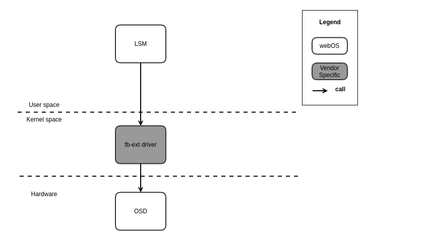
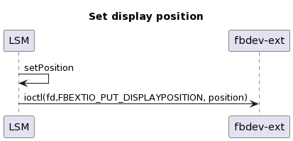
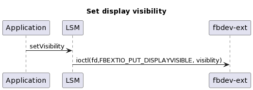
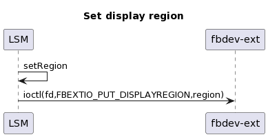

FrameBuffer
###########

.. _jh0506.lee: jh0506.lee@lge.com
.. _hyungjoon.lee: hyungjoon.lee@lge.com
.. _jihee.moon: jihee.moon@lge.com
.. _jaebin01.lee: jaebin01.lee@lge.com

Introduction
************

| The fb-ext driver is a webOS platform extension for the standard Linux frambuffer(fbdev). It provides features
| to control additional attributes of graphic display. It is indicated from the standard fbdev configuration
| that is a linux subsystem used to show graphics on a physical screen.

Revision History
================

+--------------+------------+----------------------+-----------------------------------------------------------------+
| Version      | Date       | Changed by           | Description                                                     |
+==============+============+======================+=================================================================+
|1.3.0         | 2022-12-22 | `jaebin01.lee`_      | Modify ambiguous descrpition                                    |
+--------------+------------+----------------------+-----------------------------------------------------------------+
|1.2.0         | 2022-12-10 | `jaebin01.lee`_      | Applied new document template.                                  |
+--------------+------------+----------------------+-----------------------------------------------------------------+
|1.1.0         | 2019-12-02 | `jihee.moon`_        | Add a new function                                              |
+--------------+------------+----------------------+-----------------------------------------------------------------+
|1.0.0         | 2019-07-19 | `jh0506.lee`_        | First Edition                                                   |
+--------------+------------+----------------------+-----------------------------------------------------------------+

Terminology
===========
| The key words "must", "must not", "required", "shall", "shall not", "should", "should not", "recommended", "may", and "optional" in this document are to be interpreted as described in RFC2119. 

| The following table lists the terms used throughout this document: 

=============================== ===============================
Term                            Description
=============================== =============================== 
Compositor                      Compositor is software that provides applications with an off-screen buffer for each window
EGL                             EGL is an interface between Khronos rendering APIs (such as OpenGL, OpenGL ES or OpenVG) and the underlying native platform windowing system
LSM                             Luna Surface Manager. A component that works as a graphics and window manager. It displays graphical elements on the screen, manages the composition of these elements using Wayland protocol, and performs the event handling for input devices such as keyboard and pointer.
SAM                             System and Application Manager. SAM manages each app throughout its lifecycle, including the installation, launch, termination, and removal of the app.
Wayland                         Wayland is the protocol that applications can use to talk to a display server in order to make themselves visible and get input from the user
OSD                             On Screen Display. Graphic layer that represents the drawing buffer which is created by compositor. 
=============================== =============================== 

Technical Assistance
====================

| For assistance or clarification on information in this guide, please create an issue in the LGE JIRA project and contact the following person:

=============== ================
Module          Owner         
=============== ================
FrameBuffer     `hyungjoon.lee`_ 
=============== ================

Overview
********

General Description
===================
| It is a module that controls the OSD layer.
| It is a module that controls whether to display the corresponding layer on the physical screen and in which area the layer is displayed.
| There is a use case to control the screen display of the 2nd OSD layer, not the main layer(1st OSD layer) in webOS platform.

Features
========
| The fb-ext driver provides the following features:

- Transfer display position
    - The fb-ext driver enables the adjustment of the display position.
- Control display visibility
    - The fb-ext driver controls display visibility. Graphic layer can be visible and invisible. It is limited to control only one graphics plane exclusively.
- Transfer display Region
    - The fb-ext driver controls display region.

Architecture
============
This section describes the driver architecture for FrameBuffer.

Driver Architecture
-------------------

The user space service, LSM, delivers display control request to fb-ext driver, which then interacts with OSD.

- LSM → fb-ext driver: LSM controls fb-ext driver to control display request which contains display region, display visibility, and display position of display plane that store demo is used.
- fb-ext driver → OSD: fb-ext driver sends display infomation to OSD.

Requirements
************
This section describes the major functionalities of the Framebuffer driver, as well as its operational flow and requirements.

Functional Requirements
=======================

| Setting display position is performed by the following extended API:

* FBEXTIO_PUT_DISPLAYPOSITION

The following diagram shows the overall workflow of setting display position. It is a function that sets the visible position of the display

| Setting display visibility is performed by the following extended API:

* FBEXTIO_PUT_DISPLAYVISIBLE

The following diagram shows the overall workflow of setting open display visibility of app. This is a function that requests a specific display to be shown or turned off.

| Setting display position is performed by the following extended API:

* FBEXTIO_PUT_DISPLAYREGION

The following diagram shows the overall workflow of setting display region. It is a function that sets the visible area of the display

Quality and Constraints
-----------------------
The following are the quality requirements for the functionality implementation:

- Display visiblity
   - Display should be seen exclusively. Only one display should appear on the screen at a time

Implementation
**************

File Location
=============
The fb-ext interfaces are defined in the fb-ext.h header file, which can be obtained from https://wall.lge.com/
Git repository: bsp/ref/linuxtv-ext-header/linux/fb-ext/fb-ext.h

API List
========
The fbdev-ext module implementation must adhere to the interface specifications defined and implements its functions.

Data Types
----------

Standard Data Types
^^^^^^^^^^^^^^^^^^^

====================================================== =====================================================================
Structure                                              Description
====================================================== =====================================================================
`fb_var_screeninfo`_                                   Contains display info
====================================================== =====================================================================

Extended Structures
^^^^^^^^^^^^^^^^^^^
====================================================== =====================================================================
Structure                                              Description
====================================================== =====================================================================
:cpp:any:`fb_ext_displayposition`                      Contains display position
:cpp:any:`fb_ext_displayvisible`                       Contains display visible
:cpp:any:`fb_ext_displayregion`                        Contains display region
====================================================== =====================================================================

Functions
---------

Standard Functions
^^^^^^^^^^^^^^^^^^^

====================================================== =====================================================================
Function                                               Description
====================================================== =====================================================================
`FBIOGET_VSCREENINFO`_                                 Takes a pointer to a fb_var_screeninfo structure(ioctl)
====================================================== =====================================================================

Extended Functions
^^^^^^^^^^^^^^^^^^^
====================================================== =====================================================================
Function                                               Description
====================================================== =====================================================================
:c:macro:`FBEXTIO_PUT_DISPLAYPOSITION`                 Put display position of opened fb device.
:c:macro:`FBEXTIO_PUT_DISPLAYVISIBLE`                  Put display position of opened fb device.
:c:macro:`FBEXTIO_PUT_DISPLAYREGION`                   Put display position of opened fb device.
====================================================== =====================================================================

Implementation Details
======================
We will update the content soon.

Testing
*******

| To test the implementation of the fb-ext driver, webOS provides SoCTS (SoC Compatible Test Suite) tests. 
| The SoCTS checks the basic operation of the fb-ext driver and verifies the kernel event operation for the module by using a test execution file. 
| For details, see :doc:`fb-ext Unit Test in SoCTS Unit Test Specification. </part4/socts/Documentation/source/producer-manual/producer-manual_common/producer-manual_option_framebuffer>`

References
**********
For additional information on related standards or technical topics, refer to:

- https://docs.kernel.org/fb/api.html

.. _fb_var_screeninfo: https://docs.kernel.org/fb/api.html#screen-information
.. _FBIOGET_VSCREENINFO: https://docs.kernel.org/fb/api.html?highlight=fbioget_vscreeninfo