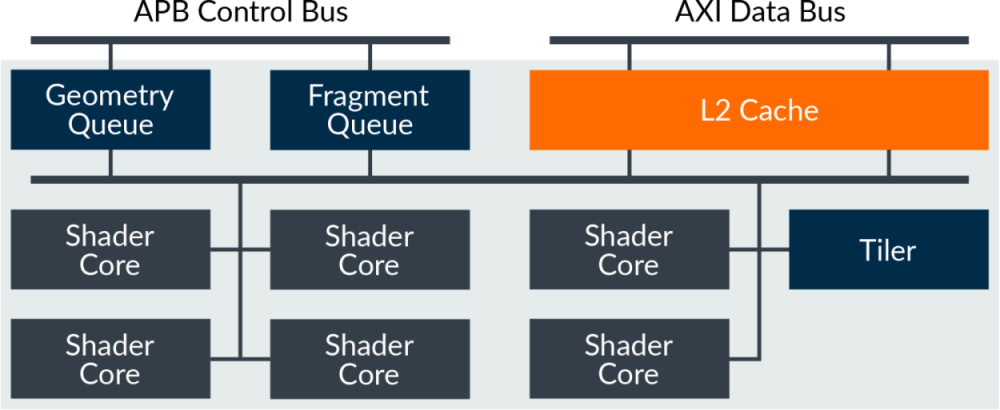
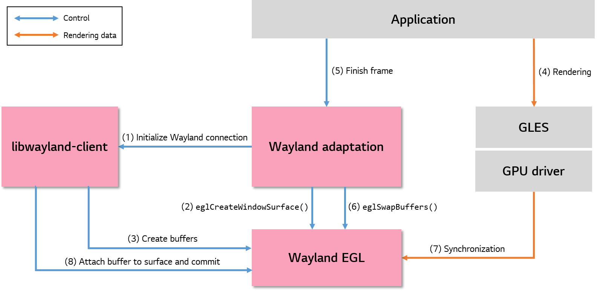

GPU
###

.. _youngman.jung: youngman.jung@lge.com
.. _jinseong1.yang: jinseong1.yang@lge.com
.. _seongcheoll.kim: seongcheoll.kim@lge.com
.. _jjaem.kim: jjaem.kim@lge.com

Introduction
************

| This document describes the GPU (graphic processing unit). The document gives an overview of the GPU and provides details about its functionalities and implementation requirements.

| A GPU is a computational device that performances a graphic operation to accelerate the creation of images in a frame buffer and outputs a result value to a display device.

| Therefore, it is necessary to understand GPU and graphic techniques, including knowledge of OpenGL, EGL, etc.

Revision History
================

+--------------+------------+----------------------+---------------------------------------------------------------------------------------+
| Version      | Date       | Changed by           | Description                                                                           |
+==============+============+======================+=======================================================================================+
|1.3.0         | 2023-11-18 | `youngman.jung`_     | Applied new document template.                                                        |
|              |            |                      |                                                                                       |
|              |            | `jinseong1.yang`_    | Added descriptions for the major function requirements of the driver.                 |
+--------------+------------+----------------------+---------------------------------------------------------------------------------------+
|1.2.0         | 2022-03-23 | `jjaem.kim`_         | Modify implement descriptions                                                         |
+--------------+------------+----------------------+---------------------------------------------------------------------------------------+
|1.1.0         | 2022-03-07 | `jjaem.kim`_         | Modify API lists                                                                      |
+--------------+------------+----------------------+---------------------------------------------------------------------------------------+
|1.0.0         | 2022-02-21 | `jjaem.kim`_         | First release                                                                         |
+--------------+------------+----------------------+---------------------------------------------------------------------------------------+

Terminology
===========
| The key words "must", "must not", "required", "shall", "shall not", "should", "should not", "recommended", "may", and "optional" in this document are to be interpreted as described in RFC2119. 

| The following table lists the terms used throughout this document: 

=============================== ===============================
Term                            Description
=============================== =============================== 
OpenGL                          Open Graphic Library
OpenGL ES                       OpenGL for Embedded Systems
EGL                             Embedded-System Graphics Library
GBM                             Generic Bufer Management
KMS                             Kernel mode stetting
LSM(Luna Surface Manager)       The graphic compositor on the webOS platform
=============================== =============================== 

Technical Assistance
====================

| For assistance or clarification on information in this guide, please create an issue in the LGE JIRA project and contact the following person:

=============== ============ 
Module          Owner         
=============== ============ 
GPU             `youngman.jung`_ 
=============== ============ 

Overview
********

General Description
===================

| A GPU is resposible for creating frame buffer, shader object and rendering graphic image . Therefore, it is necessary to understand graphic rendering process. The webOS is using a GPU based on EGL and OpenGL ES api.

Architecture
============

This section describes the hardware architecture and the driver architecture for GPU.

Hardware Architecture
---------------------

Mali GPU is explained as an example, the following figure shows the block diagram of the top-level architecture of the mali GPU.

(ref : https://developer.arm.com/documentation/102546/0100/Third-Gen-Mali-GPU-Architecture)

Driver Architecture
-------------------

The GPU and wayland rendering process is shown in the figure below.

- ( 1 ) To perform rendering, the window to be used for rendering must be defined. A window is the same concept as the surface in Wayland. When the request for creating wl_surface is received through Wayland adaptation layer, the request is sent to the compositor through libwayland-client, and then the compositor allocates the structure for the surface that the client requested.

- ( 2 ) To make space for rendering, the client calls the eglCreateWindowSurface() using the Wayland EGL interface. The allocation of graphics buffers for rendering does not occur at this step.

- ( 3 ) The client gets the buffers allocated for rendering of the first frame. The client requests creation of buffers to the compositor using the Wayland protocol through libwayland-client (the process is not shown on the diagram). The compositor gets the buffers allocated using the extended protocol on the GPU side connected through Wayland EGL.

- ( 4 ) The client connects the allocated buffers with the EGL surface created by eglCreateWindowSurface(), and performs rendering on buffers using the GLES interface.

- (5)-(6) When the rendering is completed, the client finishes the frame processing and requests a swap buffer operation to Wayland EGL using eglSwapBuffers().

- (7)-(8) The result of rendering by Wayland EGL (buffer) is shared with LSM. Using the result, LSM performs composition and rendering to display the final output on the screen.

Requirements
************

Functional Requirements
=======================

| The graphic library (OpenGL ES, OpenCL, Vulkan, ...) used in webOS must be supported.

Quality and Constraints
=======================

Performance Requirements
-----------------------

| We will update the content soon.

Design Constraints
-----------------------

| It must operate normally without performance problems in the webOS environment.

Implementation
**************

This section provides materials that are useful for GPU implementation. 

- The API List section provides a brief summary of APIs related GPU that you must implement.
- The Implementation Details section sets implementation guidance and example code for some major functionalities.

File Location
=============
None

API List
========

Functions
^^^^^^^^^

======================================= ===================================================================================================
Funtion                                 Description
======================================= ===================================================================================================
:func:`eglGetDisplay`                   return an EGL display connection
:func:`eglTerminate`                    terminate an EGL display connection
:func:`eglInitialize`                   initialize an EGL display connection
:func:`eglCreateContext`                create a new EGL rendering context
:func:`eglDestroyContext`               destroy an EGL rendering context
:func:`eglCreatePbufferSurface`         create a new EGL pixel buffer surface
:func:`eglDestroySurface`               destroy an EGL surface
:func:`glGenBuffers`                    generate buffer object names
:func:`glBindBuffer`                    bind a named buffer object
:func:`glBufferData`                    creates and initializes a buffer object’s data store
:func:`glDeleteBuffers`                 delete named buffer objects
:func:`glMapBufferRange`                map all or part of a buffer object’s data store into the client’s address space
:func:`glUnmapBuffer`                   release the mapping of a buffer object’s data store into the client’s address space
:func:`glGenFramebuffers`               generate framebuffer object names
:func:`glBindFramebuffer`               bind a framebuffer to a framebuffer target
:func:`glGenRenderbuffers`              generate renderbuffer object names
:func:`glBindRenderbuffer`              bind a renderbuffer to a renderbuffer target
:func:`glRenderbufferStorage`           establish data storage, format and dimensions of a renderbuffer object’s image
:func:`glFramebufferRenderbuffer`       attach a renderbuffer as a logical buffer of a framebuffer object
:func:`glDeleteRenderbuffers`           delete renderbuffer objects
:func:`glDeleteFramebuffers`            delete framebuffer objects
:func:`glGenTextures`                   generate texture names
:func:`glBindTexture`                   bind a named texture to a texturing target
:func:`glTexImage2D`                    specify a two-dimensional texture image
:func:`glFramebufferTexture2D`          attach a level of a texture object as a logical buffer of a framebuffer object
:func:`glCheckFramebufferStatus`        check the completeness status of a framebuffer
:func:`glDeleteTextures`                delete named textures
:func:`glGetError`                      return error information
:func:`glTexParameterf`                 set texture parameters
:func:`glCopyTexImage2D`                copy pixels into a 2D texture image
:func:`eglGetProcAddress`               return a GL or an EGL extension function
:func:`eglGetCurrentDisplay`            return the display for the current EGL rendering context
:func:`glTexParameteri`                 set texture parameters
:func:`eglGetCurrentSurface`            return the read or draw surface for the current EGL rendering context
:func:`eglQuerySurface`                 return EGL surface information
:func:`glGetIntegerv`                   return the value or values of a selected parameter
:func:`glBindAttribLocation`            Associates a generic vertex attribute index with a named attribute variable
:func:`glLinkProgram`                   Links a program object
:func:`glGetProgramiv`                  Returns a parameter from a program object
:func:`glUseProgram`                    Installs a program object as part of current rendering state
:func:`glClearColor`                    specify clear values for the color buffers
:func:`glClear`                         clear buffers to preset values
:func:`glViewport`                      set the viewport
:func:`glEnableVertexAttribArray`       Enable or disable a generic vertex attribute array
:func:`glVertexAttribPointer`           define an array of generic vertex attribute data
:func:`glDrawArrays`                    render primitives from array data
:func:`glCreateShader`                  Creates a shader object
:func:`glShaderSource`                  Replaces the source code in a shader object
:func:`glCompileShader`                 Compiles a shader object
:func:`glGetShaderiv`                   Returns a parameter from a shader object
:func:`glDeleteShader`                  Deletes a shader object
:func:`glCreateProgram`                 Creates a program object
:func:`glAttachShader`                  Attaches a shader object to a program object
:func:`glDeleteProgram`                 Deletes a program object
======================================= ===================================================================================================

Implementation Details
======================

This section contains implementation details and example code for some functionality described in the Requirements section.

eglGetDisplay
^^^^^^^^^^^^^
.. function:: eglGetDisplay()

    eglGetDisplay — return an EGL display connection
    
	**Functional Requirements**
        eglGetDisplay obtains the EGL display connection for the native display native_display.

        The behavior of eglGetDisplay is similar to that of eglGetPlatformDisplay, but is specified in terms of implementation-specific behavior rather than platform-specific extensions. As for eglGetPlatformDisplay, EGL considers the returned EGLDisplay as belonging to the same platform as display_id. However, the set of platforms to which display_id is permitted to belong, as well as the actual type of display_id, are implementation-specific. If display_id is EGL_DEFAULT_DISPLAY, a default display is returned. Multiple calls made to eglGetDisplay with the same display_id will return the same EGLDisplay handle.

        If display_id is EGL_DEFAULT_DISPLAY, a default display connection is returned.

        If no display connection matching native_display is available, EGL_NO_DISPLAY is returned. No error is generated.

        Use eglInitialize to initialize the display connection.

    **Responses to abnormal situations, including**
        If abnormal data is set, the driver should return an error. The generic error codes are described at the :ref:`Generic Error Codes <v4l-dvb-apis:gen-errors>` chapter.

    **Performance Requirements**
        It depends on the system environment, but it usually takes less than 500ms.

    **Constraints**
        Should be supported khronos OpenGL2.1 and EGL1.4.

    **Functions & Parameters**
        .. code-block:: cpp
          :linenos:

          //
          //function
          //
          EGLDisplay eglGetDisplay(NativeDisplayType native_display);
                                         

          //
          //parameter
          //
          native_display //Specifies the display to connect to. EGL_DEFAULT_DISPLAY indicates the default display.

    **Return Value**
        Please refer the below open API page.

        https://www.khronos.org/registry/EGL/sdk/docs/man/html/eglGetDisplay.xhtml

    **Example**
        Please refer the below open API page.

        https://www.khronos.org/registry/EGL/sdk/docs/man/html/eglGetDisplay.xhtml

eglTerminate
^^^^^^^^^^^^
.. function:: eglTerminate()

    eglTerminate — terminate an EGL display connection

    **Functional Requirements**
        eglTerminate releases resources associated with an EGL display connection. Termination marks all EGL resources associated with the EGL display connection for deletion. If contexts or surfaces associated with display is current to any thread, they are not released until they are no longer current as a result of eglMakeCurrent.

        Terminating an already terminated EGL display connection has no effect. A terminated display may be re-initialized by calling eglInitialize again.

    **Responses to abnormal situations, including**
        EGL_FALSE is returned if eglTerminate fails, EGL_TRUE otherwise.

        EGL_BAD_DISPLAY is generated if display is not an EGL display connection.

    **Performance Requirements**
        It depends on the system environment, but it usually takes less than 500ms.

    **Constraints**
        Should be supported khronos OpenGL2.1 and EGL1.4.

    **Functions & Parameters**
        .. code-block:: cpp
          :linenos:

          //
          //function
          //
          EGLBoolean eglTerminate(EGLDisplay display);
                                         

          //
          //parameter
          //
          display //Specifies the EGL display connection to terminate.

    **Return Value**
        Please refer the below open API page.

        https://www.khronos.org/registry/EGL/sdk/docs/man/html/eglTerminate.xhtml

    **Example**
        Please refer the below open API page.

        https://www.khronos.org/registry/EGL/sdk/docs/man/html/eglTerminate.xhtml

eglInitialize
^^^^^^^^^^^^^
.. function:: eglInitialize()

    eglInitialize — initialize an EGL display connection

    **Functional Requirements**
        eglInitialize initialized the EGL display connection obtained with eglGetDisplay. Initializing an already initialized EGL display connection has no effect besides returning the version numbers.

        major and minor do not return values if they are specified as NULL.

        Use eglTerminate to release resources associated with an EGL display connection.

    **Responses to abnormal situations, including**
        EGL_FALSE is returned if eglInitialize fails, EGL_TRUE otherwise. major and minor are not modified when EGL_FALSE is returned.

        EGL_BAD_DISPLAY is generated if display is not an EGL display connection.

        EGL_NOT_INITIALIZED is generated if display cannot be initialized.

    **Performance Requirements**
        It depends on the system environment, but it usually takes less than 500ms.

    **Constraints**
        Should be supported khronos OpenGL2.1 and EGL1.4.

    **Functions & Parameters**
        .. code-block:: cpp
          :linenos:

          //
          //function
          //
          EGLBoolean eglInitialize(EGLDisplay display,
                                         EGLint * major,
                                         EGLint * minor);
                                         

          //
          //parameter
          //
          display //Specifies the EGL display connection to initialize.
          major //Returns the major version number of the EGL implementation. May be NULL.
          minor //Returns the minor version number of the EGL implementation. May be NULL.

    **Return Value**
        Please refer the below open API page.

        https://www.khronos.org/registry/EGL/sdk/docs/man/html/eglInitialize.xhtml

    **Example**
        Please refer the below open API page.

        https://www.khronos.org/registry/EGL/sdk/docs/man/html/eglInitialize.xhtml

eglCreateContext
^^^^^^^^^^^^^^^^
.. function:: eglCreateContext()

    eglCreateContext — create a new EGL rendering context

    **Functional Requirements**
        eglCreateContext creates an EGL rendering context for the current rendering API (as set with eglBindAPI) and returns a handle to the context. The context can then be used to render into an EGL drawing surface. If eglCreateContext fails to create a rendering context, EGL_NO_CONTEXT is returned.

        If share_context is not EGL_NO_CONTEXT, then all shareable data in the context (as defined by the client API specification for the current rendering API) are shared by context share_context, all other contexts share_context already shares with, and the newly created context. An arbitrary number of rendering contexts can share data. However, all rendering contexts that share data must themselves exist in the same address space. Two rendering contexts share an address space if both are owned by a single process.

        attrib_list specifies a list of attributes for the context. The list has the same structure as described for eglChooseConfig. The attributes and attribute values which may be specified are as follows:

        EGL_CONTEXT_MAJOR_VERSION
            Must be followed by an integer specifying the requested major version of an OpenGL or OpenGL ES context. The default value is 1. This attribute is an alias of the older EGL_CONTEXT_CLIENT_VERSION, and the tokens may be used interchangeably.

        EGL_CONTEXT_MINOR_VERSION
            Must be followed by an integer specifying the requested minor version of an OpenGL or OpenGL ES context. The default value is 0.

        EGL_CONTEXT_OPENGL_PROFILE_MASK
            Must be followed by an integer bitmask specifying the profile of an OpenGL context. Bits which may be set include EGL_CONTEXT_OPENGL_CORE_PROFILE_BIT for a core profile and EGL_CONTEXT_OPENGL_COMPATIBILITY_PROFILE_BIT for a compatibility profile. The default value is EGL_CONTEXT_OPENGL_CORE_PROFILE_BIT. All OpenGL 3.2 and later implementations are required to implement the core profile, but implementation of the compatibility profile is optional.

        EGL_CONTEXT_OPENGL_DEBUG
            Must be followed by EGL_TRUE, specifying that an OpenGL or OpenGL ES debug context should be created, or EGL_FALSE, if a non-debug context should be created. The default value is EGL_FALSE.

        EGL_CONTEXT_OPENGL_FORWARD_COMPATIBLE
            Must be followed by EGL_TRUE, specifying that a forward-compatible OpenGL context should be created, or EGL_FALSE, if a non-forward-compatible context should be created. The default value is EGL_FALSE.

        EGL_CONTEXT_OPENGL_ROBUST_ACCESS
            Must be followed by EGL_TRUE, specifying that an OpenGL or OpenGL ES context supporting robust buffer access should be created, or EGL_FALSE, if a non-robust context should be created. The default value is EGL_FALSE.

        EGL_CONTEXT_OPENGL_RESET_NOTIFICATION_STRATEGY
            Must be followed by EGL_LOSE_CONTEXT_ON_RESET, specifying that an OpenGL or OpenGL ES context with reset notification behavior GL_LOSE_CONTEXT_ON_RESET_ARB should be created, or EGL_NO_RESET_NOTIFICATION, specifying that an OpenGL or OpenGL ES context with reset notification behavior GL_NO_RESET_NOTIFICATION_ARB should be created, as described by the GL_ARB_robustness extension. If the EGL_CONTEXT_OPENGL_ROBUST_ACCESS attribute is not set to EGL_TRUE, context creation will not fail, but the resulting context may not support robust buffer access, and therefore may not support the requested reset notification strategy The default value for EGL_CONTEXT_OPENGL_RESET_NOTIFICATION_STRATEGY is EGL_NO_RESET_NOTIFICATION .

        There are many possible interactions between requested OpenGL and OpenGL ES context creation attributes, depending on the API versions and extensions supported by the implementation. These interactions are described in detail in the EGL 1.5 Specification, but are not listed here for compactness. The requested attributes may not be able to be satisfied, but context creation may still succeed. Applications should ensure that the OpenGL or OpenGL ES contexts supports needed features before using them, by determining the actual context version, supported extensions, and supported context flags using runtime queries.

    **Responses to abnormal situations, including**
        If abnormal data is set, the driver should return an error. The generic error codes are described at the :ref:`Generic Error Codes <v4l-dvb-apis:gen-errors>` chapter.

    **Performance Requirements**
        It depends on the system environment, but it usually takes less than 500ms.

    **Constraints**
        Should be supported khronos OpenGL2.1 and EGL1.4.

    **Functions & Parameters**
        .. code-block:: cpp
          :linenos:

          //
          //function
          //
          EGLContext eglCreateContext(EGLDisplay display,
                                         EGLConfig config,
                                         EGLContext share_context,
                                         EGLint const * attrib_list);
                                         

          //
          //parameter
          //
          display //Specifies the EGL display connection.
          config //Specifies the EGL frame buffer configuration that defines the frame buffer resource available to the rendering context.
          share_context //Specifies another EGL rendering context with which to share data, as defined by the client API corresponding to the contexts. Data is also shared with all other contexts with which share_context shares data. EGL_NO_CONTEXT indicates that no sharing is to take place.
          attrib_list //Specifies attributes and attribute values for the context being created. Only the attribute EGL_CONTEXT_CLIENT_VERSION may be specified.

    **Return Value**
        Please refer the below open API page.

        https://www.khronos.org/registry/EGL/sdk/docs/man/html/eglCreateContext.xhtml

    **Example**
        Please refer the below open API page.

        https://www.khronos.org/registry/EGL/sdk/docs/man/html/eglCreateContext.xhtml

eglDestroyContext
^^^^^^^^^^^^^^^^^
.. function:: eglDestroyContext()

    eglDestroyContext — destroy an EGL rendering context

    **Functional Requirements**

        If the EGL rendering context context is not current to any thread, eglDestroyContext destroys it immediately. Otherwise, context is destroyed when it becomes not current to any thread.

    **Responses to abnormal situations, including**

        EGL_FALSE is returned if destruction of the context fails, EGL_TRUE otherwise.

        EGL_BAD_DISPLAY is generated if display is not an EGL display connection.

        EGL_NOT_INITIALIZED is generated if display has not been initialized.

        EGL_BAD_CONTEXT is generated if context is not an EGL rendering context.

    **Performance Requirements**

        It depends on the system environment, but it usually takes less than 500ms.

    **Constraints**

        Should be supported khronos OpenGL2.1 and EGL1.4.

    **Functions & Parameters**

        .. code-block:: cpp
          :linenos:

          //
          //function
          //
          EGLBoolean eglDestroyContext(EGLDisplay display,
                                         EGLContext context);
                                         

          //
          //parameter
          //
          display //Specifies the EGL display connection.
          context //Specifies the EGL rendering context to be destroyed.

    **Return Value**

        Please refer the below open API page.

        https://www.khronos.org/registry/EGL/sdk/docs/man/html/eglDestroyContext.xhtml

    **Example**

        Please refer the below open API page.

        https://www.khronos.org/registry/EGL/sdk/docs/man/html/eglDestroyContext.xhtml

eglCreatePbufferSurface
^^^^^^^^^^^^^^^^^^^^^^^
.. function:: eglCreatePbufferSurface()

    eglCreatePbufferSurface — create a new EGL pixel buffer surface

    **Functional Requirements**

        eglCreatePbufferSurface creates an off-screen pixel buffer surface and returns its handle. If eglCreatePbufferSurface fails to create a pixel buffer surface, EGL_NO_SURFACE is returned.

        Surface attributes are specified as a list of attribute-value pairs, terminated with EGL_NONE. Accepted attributes are:

        EGL_GL_COLORSPACE
            Specifies the color space used by OpenGL and OpenGL ES when rendering to the surface. If its value is EGL_GL_COLORSPACE_SRGB, then a non-linear, perceptually uniform color space is assumed, with a corresponding GL_FRAMEBUFFER_ATTACHMENT_COLOR_ENCODING value of GL_SRGB. If its value is EGL_GL_COLORSPACE_LINEAR, then a linear color space is assumed, with a corresponding GL_FRAMEBUFFER_ATTACHMENT_COLOR_ENCODING value of GL_LINEAR. The default value of EGL_GL_COLORSPACE is EGL_GL_COLORSPACE_LINEAR. Note that the EGL_GL_COLORSPACE attribute is used only by OpenGL and OpenGL ES contexts supporting sRGB framebuffers. EGL itself does not distinguish multiple colorspace models. Refer to the ``sRGB Conversion'' sections of the OpenGL 4.6 and OpenGL ES 3.2 Specifications for more information.

        EGL_HEIGHT
            Specifies the required height of the pixel buffer surface. The default value is 0.

        EGL_LARGEST_PBUFFER
            Requests the largest available pixel buffer surface when the allocation would otherwise fail. Use eglQuerySurface to retrieve the dimensions of the allocated pixel buffer. The default value is EGL_FALSE.

        EGL_MIPMAP_TEXTURE
            Specifies whether storage for mipmaps should be allocated. Space for mipmaps will be set aside if the attribute value is EGL_TRUE and EGL_TEXTURE_FORMAT is not EGL_NO_TEXTURE. The default value is EGL_FALSE.

        EGL_TEXTURE_FORMAT
            Specifies the format of the texture that will be created when a pbuffer is bound to a texture map. Possible values are EGL_NO_TEXTURE, EGL_TEXTURE_RGB, and EGL_TEXTURE_RGBA. The default value is EGL_NO_TEXTURE.

        EGL_TEXTURE_TARGET
            Specifies the target for the texture that will be created when the pbuffer is created with a texture format of EGL_TEXTURE_RGB or EGL_TEXTURE_RGBA. Possible values are EGL_NO_TEXTURE, or EGL_TEXTURE_2D. The default value is EGL_NO_TEXTURE.

        EGL_VG_ALPHA_FORMAT
            Specifies how alpha values are interpreted by OpenVG when rendering to the surface. If its value is EGL_VG_ALPHA_FORMAT_NONPRE, then alpha values are not premultipled. If its value is EGL_VG_ALPHA_FORMAT_PRE, then alpha values are premultiplied. The default value of EGL_VG_ALPHA_FORMAT is EGL_VG_ALPHA_FORMAT_NONPRE.

        EGL_VG_COLORSPACE
            Specifies the color space used by OpenVG when rendering to the surface. If its value is EGL_VG_COLORSPACE_sRGB, then a non-linear, perceptually uniform color space is assumed, with a corresponding VGImageFormat of form VG_s*. If its value is EGL_VG_COLORSPACE_LINEAR, then a linear color space is assumed, with a corresponding VGImageFormat of form VG_l*. The default value of EGL_VG_COLORSPACE is EGL_VG_COLORSPACE_sRGB.

        EGL_WIDTH
            Specifies the required width of the pixel buffer surface. The default value is 0.

        Any EGL rendering context that was created with respect to config can be used to render into the surface. Use eglMakeCurrent to attach an EGL rendering context to the surface.

        Use eglQuerySurface to retrieve the dimensions of the allocated pixel buffer surface or the ID of config.

        Use eglDestroySurface to destroy the surface.

    **Responses to abnormal situations, including**

        EGL_NO_SURFACE is returned if creation of the context fails.

        EGL_BAD_DISPLAY is generated if display is not an EGL display connection.

        EGL_NOT_INITIALIZED is generated if display has not been initialized.

        EGL_BAD_CONFIG is generated if config is not an EGL frame buffer configuration.

        EGL_BAD_ATTRIBUTE is generated if attrib_list contains an invalid pixel buffer attribute or if an attribute value is not recognized or out of range.

        EGL_BAD_ATTRIBUTE is generated if attrib_list contains any of the attributes EGL_MIPMAP_TEXTURE, EGL_TEXTURE_FORMAT, or EGL_TEXTURE_TARGET, and config does not support OpenGL ES rendering (e.g. the EGL version is 1.2 or later, and the EGL_RENDERABLE_TYPE attribute of config does not include at least one of EGL_OPENGL_ES_BIT, EGL_OPENGL_ES2_BIT, or EGL_OPENGL_ES3_BIT),

        EGL_BAD_ALLOC is generated if there are not enough resources to allocate the new surface.

        EGL_BAD_MATCH is generated if config does not support rendering to pixel buffers (the EGL_SURFACE_TYPE attribute does not contain EGL_PBUFFER_BIT).

        EGL_BAD_MATCH is generated if the EGL_TEXTURE_FORMAT attribute is not EGL_NO_TEXTURE, and EGL_WIDTH and/or EGL_HEIGHT specify an invalid size (e.g., the texture size is not a power of 2, and the underlying OpenGL ES implementation does not support non-power-of-two textures).

        EGL_BAD_MATCH is generated if the EGL_TEXTURE_FORMAT attribute is EGL_NO_TEXTURE, and EGL_TEXTURE_TARGET is something other than EGL_NO_TEXTURE; or, EGL_TEXTURE_FORMAT is something other than EGL_NO_TEXTURE, and EGL_TEXTURE_TARGET is EGL_NO_TEXTURE.

        EGL_BAD_MATCH is generated if config does not support the specified OpenVG alpha format attribute (the value of EGL_VG_ALPHA_FORMAT is EGL_VG_ALPHA_FORMAT_PRE and the EGL_VG_ALPHA_FORMAT_PRE_BIT is not set in the EGL_SURFACE_TYPE attribute of config) or colorspace attribute (the value of EGL_VG_COLORSPACE is EGL_VG_COLORSPACE_LINEAR and the EGL_VG_COLORSPACE_LINEAR_IT is not set in the EGL_SURFACE_TYPE attribute of config).

    **Performance Requirements**

        It depends on the system environment, but it usually takes less than 500ms.

    **Constraints**

        Should be supported khronos OpenGL2.1 and EGL1.4.

    **Functions & Parameters**

        .. code-block:: cpp
          :linenos:

          //
          //function
          //
          EGLSurface eglCreatePbufferSurface(EGLDisplay display,
                                         EGLConfig config,
                                         EGLint const * attrib_list);
                                         

          //
          //parameter
          //
          display //Specifies the EGL display connection.
          config //Specifies the EGL frame buffer configuration that defines the frame buffer resource available to the surface.
          attrib_list //Specifies pixel buffer surface attributes. May be NULL or empty (first attribute is EGL_NONE).

    **Return Value**

        Please refer the below open API page.

        https://www.khronos.org/registry/EGL/sdk/docs/man/html/eglCreatePbufferSurface.xhtml

    **Example**

        Please refer the below open API page.

        https://www.khronos.org/registry/EGL/sdk/docs/man/html/eglCreatePbufferSurface.xhtml

eglDestroySurface
^^^^^^^^^^^^^^^^^
.. function:: eglDestroySurface()

    eglDestroySurface — destroy an EGL surface

    **Functional Requirements**

        If the EGL surface surface is not current to any thread, eglDestroySurface destroys it immediately. Otherwise, surface is destroyed when it becomes not current to any thread. Furthermore, resources associated with a pbuffer surface are not released until all color buffers of that pbuffer bound to a texture object have been released.

    **Responses to abnormal situations, including**

        EGL_FALSE is returned if destruction of the surface fails, EGL_TRUE otherwise.

        EGL_BAD_DISPLAY is generated if display is not an EGL display connection.

        EGL_NOT_INITIALIZED is generated if display has not been initialized.

        EGL_BAD_SURFACE is generated if surface is not an EGL surface.

    **Performance Requirements**

        It depends on the system environment, but it usually takes less than 500ms.

    **Constraints**

        Should be supported khronos OpenGL2.1 and EGL1.4.

    **Functions & Parameters**

        .. code-block:: cpp
          :linenos:

          //
          //function
          //
          EGLBoolean eglDestroySurface(EGLDisplay display,
                                         EGLSurface surface);
                                         

          //
          //parameter
          //
          display //Specifies the EGL display connection.
          surface //Specifies the EGL surface to be destroyed.

    **Return Value**

        Please refer the below open API page.

        https://www.khronos.org/registry/EGL/sdk/docs/man/html/eglDestroySurface.xhtml

    **Example**

        Please refer the below open API page.

        https://www.khronos.org/registry/EGL/sdk/docs/man/html/eglDestroySurface.xhtml

eglGetProcAddress
^^^^^^^^^^^^^^^^^
.. function:: eglGetProcAddress()

    eglGetProcAddress — return a GL or an EGL extension function

    **Functional Requirements**

        eglGetProcAddress returns the address of the client API or EGL function named by procname. procname must be a null-terminated string. The pointer returned should be cast to a function pointer matching the function's definition in the corresponding API or extension specification. A return value of NULL indicates that the specific function does not exist for the implementation.

        A non-NULL return value does not guarantee that an extension function is actually supported at runtime. The client must also make a corresponding query, such as glGetString(GL_EXTENSIONS) for OpenGL and OpenGL ES extensions; vgGetString(VG_EXTENSIONS) for OpenVG extensions; eglQueryString(display, EGL_EXTENSIONS); or query the EGL or client API version for non-extension functions, to determine if a function is supported by EGL or a specific client API context.

        Client API function pointers returned by eglGetProcAddress are independent of the display and the currently bound client API context, and may be used by any client API context which supports the function.

        eglGetProcAddress may be queried for all EGL and client API functions supported by the implementation (whether those functions are extensions or not, and whether they are supported by the current client API context or not).

        For functions that are queryable with eglGetProcAddress, implementations may choose to also export those functions statically from the object libraries implementing those functions. However, portable clients cannot rely on this behavior.

    **Responses to abnormal situations, including**

        If abnormal data is set, the driver should return an error. The generic error codes are described at the :ref:`Generic Error Codes <v4l-dvb-apis:gen-errors>` chapter.

    **Performance Requirements**

        It depends on the system environment, but it usually takes less than 500ms.

    **Constraints**

        Should be supported khronos OpenGL2.1 and EGL1.4.

    **Functions & Parameters**

        .. code-block:: cpp
          :linenos:

          //
          //function
          //
          void (* eglGetProcAddress(char const * procname))(void);
                                         

          //
          //parameter
          //
          procname //Specifies the name of the function to return.

    **Return Value**

        Please refer the below open API page.

        https://www.khronos.org/registry/EGL/sdk/docs/man/html/eglGetProcAddress.xhtml

    **Example**

        Please refer the below open API page.

        https://www.khronos.org/registry/EGL/sdk/docs/man/html/eglGetProcAddress.xhtml

eglGetCurrentDisplay
^^^^^^^^^^^^^^^^^^^^
.. function:: eglGetCurrentDisplay()

    eglGetCurrentDisplay — return the display for the current EGL rendering context

    **Functional Requirements**

        eglGetCurrentDisplay returns the current EGL display connection for the current EGL rendering context, as specified by eglMakeCurrent. If no context is current, EGL_NO_DISPLAY is returned.

    **Responses to abnormal situations, including**

        Passing EGL_NO_DISPLAY to any command taking an EGLDisplay parameter will generate either an EGL_BAD_DISPLAY error if the EGL implementation validates EGLDisplay handles, or undefined behavior as described at the end of section 3.1 of the EGL 1.5 Specification. The only exception to this rule is that eglQueryString will accept an EGLDisplay parameter of EGL_NO_DISPLAY when querying the client extension string (see section 3.3 of the EGL 1.5 Specification).

    **Performance Requirements**

        It depends on the system environment, but it usually takes less than 500ms.

    **Constraints**

        Should be supported khronos OpenGL2.1 and EGL1.4.

    **Functions & Parameters**

        .. code-block:: cpp
          :linenos:

          //
          //function
          //
          EGLDisplay eglGetCurrentDisplay(void);
                                         

          //
          //parameter
          //
          void

    **Return Value**

        Please refer the below open API page.

        https://www.khronos.org/registry/EGL/sdk/docs/man/html/eglGetCurrentDisplay.xhtml

    **Example**

        Please refer the below open API page.

        https://www.khronos.org/registry/EGL/sdk/docs/man/html/eglGetCurrentDisplay.xhtml

eglGetCurrentSurface
^^^^^^^^^^^^^^^^^^^^
.. function:: eglGetCurrentSurface()

    eglGetCurrentSurface — return the read or draw surface for the current EGL rendering context

    **Functional Requirements**

        eglGetCurrentSurface returns the read or draw surface attached to the current EGL rendering context, as specified by eglMakeCurrent. If no context is current, EGL_NO_SURFACE is returned.

    **Responses to abnormal situations, including**

        If abnormal data is set, the driver should return an error. The generic error codes are described at the :ref:`Generic Error Codes <v4l-dvb-apis:gen-errors>` chapter.

    **Performance Requirements**

        It depends on the system environment, but it usually takes less than 500ms.

    **Constraints**

        Should be supported khronos OpenGL2.1 and EGL1.4.

    **Functions & Parameters**

        .. code-block:: cpp
          :linenos:

          //
          //function
          //
          EGLSurface eglGetCurrentSurface(EGLint readdraw);
                                         

          //
          //parameter
          //
          readdraw //Specifies whether to return the read surface (EGL_READ) or the draw surface (EGL_DRAW).

    **Return Value**

        Please refer the below open API page.

        https://www.khronos.org/registry/EGL/sdk/docs/man/html/eglGetCurrentSurface.xhtml

    **Example**

        Please refer the below open API page.

        https://www.khronos.org/registry/EGL/sdk/docs/man/html/eglGetCurrentSurface.xhtml

eglQuerySurface
^^^^^^^^^^^^^^^
.. function:: eglQuerySurface()

    eglQuerySurface — return EGL surface information

    **Functional Requirements**

        eglQuerySurface returns in value the value of attribute for surface. attribute can be one of the following:

        EGL_CONFIG_ID
            Returns the ID of the EGL frame buffer configuration with respect to which the surface was created.

        EGL_GL_COLORSPACE
            Returns the color space used by OpenGL and OpenGL ES when rendering to the surface, either EGL_GL_COLORSPACE_SRGB or EGL_GL_COLORSPACE_LINEAR.

        EGL_HEIGHT
            Returns the height of the surface in pixels.

        EGL_HORIZONTAL_RESOLUTION
            Returns the horizontal dot pitch of the display on which a window surface is visible. The value returned is equal to the actual dot pitch, in pixels/meter, multiplied by the constant value EGL_DISPLAY_SCALING.

        EGL_LARGEST_PBUFFER
            Returns the same attribute value specified when the surface was created with eglCreatePbufferSurface. For a window or pixmap surface, value is not modified.

        EGL_MIPMAP_LEVEL
            Returns which level of the mipmap to render to, if texture has mipmaps.

        EGL_MIPMAP_TEXTURE
            Returns EGL_TRUE if texture has mipmaps, EGL_FALSE otherwise.

        EGL_MULTISAMPLE_RESOLVE
            Returns the filter used when resolving the multisample buffer. The filter may be either EGL_MULTISAMPLE_RESOLVE_DEFAULT or EGL_MULTISAMPLE_RESOLVE_BOX, as described for eglSurfaceAttrib.

        EGL_PIXEL_ASPECT_RATIO
            Returns the aspect ratio of an individual pixel (the ratio of a pixel's width to its height). The value returned is equal to the actual aspect ratio multiplied by the constant value EGL_DISPLAY_SCALING.

        EGL_RENDER_BUFFER
            Returns the buffer which client API rendering is requested to use. For a window surface, this is the same attribute value specified when the surface was created. For a pbuffer surface, it is always EGL_BACK_BUFFER. For a pixmap surface, it is always EGL_SINGLE_BUFFER. To determine the actual buffer being rendered to by a context, call eglQueryContext.

        EGL_SWAP_BEHAVIOR
            Returns the effect on the color buffer when posting a surface with eglSwapBuffers. Swap behavior may be either EGL_BUFFER_PRESERVED or EGL_BUFFER_DESTROYED, as described for eglSurfaceAttrib.

        EGL_TEXTURE_FORMAT
            Returns format of texture. Possible values are EGL_NO_TEXTURE, EGL_TEXTURE_RGB, and EGL_TEXTURE_RGBA.

        EGL_TEXTURE_TARGET
            Returns type of texture. Possible values are EGL_NO_TEXTURE, or EGL_TEXTURE_2D.

        EGL_VERTICAL_RESOLUTION
            Returns the vertical dot pitch of the display on which a window surface is visible. The value returned is equal to the actual dot pitch, in pixels/meter, multiplied by the constant value EGL_DISPLAY_SCALING.

        EGL_VG_ALPHA_FORMAT
            Returns the interpretation of alpha values used by OpenVG when rendering to the surface, either EGL_VG_ALPHA_FORMAT_NONPRE or EGL_VG_ALPHA_FORMAT_PRE.

        EGL_VG_COLORSPACE
            Returns the color space used by OpenVG when rendering to the surface, either EGL_VG_COLORSPACE_sRGB or EGL_VG_COLORSPACE_LINEAR.

        EGL_WIDTH
            Returns the width of the surface in pixels.

    **Responses to abnormal situations, including**

        EGL_FALSE is returned on failure, EGL_TRUE otherwise. value is not modified when EGL_FALSE is returned.

        EGL_BAD_DISPLAY is generated if display is not an EGL display connection.

        EGL_NOT_INITIALIZED is generated if display has not been initialized.

        EGL_BAD_SURFACE is generated if surface is not an EGL surface.

        EGL_BAD_ATTRIBUTE is generated if attribute is not a valid surface attribute.

    **Performance Requirements**

        It depends on the system environment, but it usually takes less than 500ms.

    **Constraints**

        Should be supported khronos OpenGL2.1 and EGL1.4.

    **Functions & Parameters**

        .. code-block:: cpp
          :linenos:

          //
          //function
          //
          EGLBoolean eglQuerySurface(EGLDisplay display,
                                         EGLSurface surface,
                                         EGLint attribute,
                                         EGLint * value);
                                         

          //
          //parameter
          //
          display //Specifies the EGL display connection.
          surface //Specifies the EGL surface to query.
          attribute //Specifies the EGL surface attribute to be returned.
          value //Returns the requested value.

    **Return Value**

        Please refer the below open API page.

        https://www.khronos.org/registry/EGL/sdk/docs/man/html/eglQuerySurface.xhtml

    **Example**

        Please refer the below open API page.

        https://www.khronos.org/registry/EGL/sdk/docs/man/html/eglQuerySurface.xhtml

glGenBuffers
^^^^^^^^^^^^
.. function:: glGenBuffers()

    glGenBuffers — generate buffer object names

    **Functional Requirements**

        glGenBuffers returns n buffer object names in buffers. There is no guarantee that the names form a contiguous set of integers; however, it is guaranteed that none of the returned names was in use immediately before the call to glGenBuffers.

        Buffer object names returned by a call to glGenBuffers are not returned by subsequent calls, unless they are first deleted with glDeleteBuffers.

        No buffer objects are associated with the returned buffer object names until they are first bound by calling glBindBuffer.

    **Responses to abnormal situations, including**

        GL_INVALID_VALUE is generated if n is negative.

    **Performance Requirements**

        It depends on the system environment, but it usually takes less than 500ms.

    **Constraints**

        Should be supported khronos OpenGL2.1 and EGL1.4.

    **Functions & Parameters**

        .. code-block:: cpp
          :linenos:

          //
          //function
          //
          void glGenBuffers(GLsizei n,
                                         GLuint * buffers);
                                         

          //
          //parameter
          //
          n //Specifies the number of buffer object names to be generated.
          buffers //Specifies an array in which the generated buffer object names are stored.

    **Return Value**

        Please refer the below open API page.

        https://www.khronos.org/registry/OpenGL-Refpages/gl4/html/glGenBuffers.xhtml

    **Example**

        Please refer the below open API page.

        https://www.khronos.org/registry/OpenGL-Refpages/gl4/html/glGenBuffers.xhtml

glBindBuffer
^^^^^^^^^^^^
.. function:: glBindBuffer()

    glBindBuffer — bind a named buffer object

    **Functional Requirements**

        glBindBuffer binds a buffer object to the specified buffer binding point. Calling glBindBuffer with target set to one of the accepted symbolic constants and buffer set to the name of a buffer object binds that buffer object name to the target. If no buffer object with name buffer exists, one is created with that name. When a buffer object is bound to a target, the previous binding for that target is automatically broken.

        Buffer object names are unsigned integers. The value zero is reserved, but there is no default buffer object for each buffer object target. Instead, buffer set to zero effectively unbinds any buffer object previously bound, and restores client memory usage for that buffer object target (if supported for that target). Buffer object names and the corresponding buffer object contents are local to the shared object space of the current GL rendering context; two rendering contexts share buffer object names only if they explicitly enable sharing between contexts through the appropriate GL windows interfaces functions.

        glGenBuffers must be used to generate a set of unused buffer object names.

        The state of a buffer object immediately after it is first bound is an unmapped zero-sized memory buffer with GL_READ_WRITE access and GL_STATIC_DRAW usage.

        While a non-zero buffer object name is bound, GL operations on the target to which it is bound affect the bound buffer object, and queries of the target to which it is bound return state from the bound buffer object. While buffer object name zero is bound, as in the initial state, attempts to modify or query state on the target to which it is bound generates an GL_INVALID_OPERATION error.

        When a non-zero buffer object is bound to the GL_ARRAY_BUFFER target, the vertex array pointer parameter is interpreted as an offset within the buffer object measured in basic machine units.

        When a non-zero buffer object is bound to the GL_DRAW_INDIRECT_BUFFER target, parameters for draws issued through glDrawArraysIndirect and glDrawElementsIndirect are sourced from the specified offset in that buffer object's data store.

        When a non-zero buffer object is bound to the GL_DISPATCH_INDIRECT_BUFFER target, the parameters for compute dispatches issued through glDispatchComputeIndirect are sourced from the specified offset in that buffer object's data store.

        While a non-zero buffer object is bound to the GL_ELEMENT_ARRAY_BUFFER target, the indices parameter of glDrawElements, glDrawElementsInstanced, glDrawElementsBaseVertex, glDrawRangeElements, glDrawRangeElementsBaseVertex, glMultiDrawElements, or glMultiDrawElementsBaseVertex is interpreted as an offset within the buffer object measured in basic machine units.

        While a non-zero buffer object is bound to the GL_PIXEL_PACK_BUFFER target, the following commands are affected: glGetCompressedTexImage, glGetTexImage, and glReadPixels. The pointer parameter is interpreted as an offset within the buffer object measured in basic machine units.

        While a non-zero buffer object is bound to the GL_PIXEL_UNPACK_BUFFER target, the following commands are affected: glCompressedTexImage1D, glCompressedTexImage2D, glCompressedTexImage3D, glCompressedTexSubImage1D, glCompressedTexSubImage2D, glCompressedTexSubImage3D, glTexImage1D, glTexImage2D, glTexImage3D, glTexSubImage1D, glTexSubImage2D, and glTexSubImage3D. The pointer parameter is interpreted as an offset within the buffer object measured in basic machine units.

        The buffer targets GL_COPY_READ_BUFFER and GL_COPY_WRITE_BUFFER are provided to allow glCopyBufferSubData to be used without disturbing the state of other bindings. However, glCopyBufferSubData may be used with any pair of buffer binding points.

        The GL_TRANSFORM_FEEDBACK_BUFFER buffer binding point may be passed to glBindBuffer, but will not directly affect transform feedback state. Instead, the indexed GL_TRANSFORM_FEEDBACK_BUFFER bindings must be used through a call to glBindBufferBase or glBindBufferRange. This will affect the generic GL_TRANSFORM_FEEDBACK_BUFFER binding.

        Likewise, the GL_UNIFORM_BUFFER, GL_ATOMIC_COUNTER_BUFFER and GL_SHADER_STORAGE_BUFFER buffer binding points may be used, but do not directly affect uniform buffer, atomic counter buffer or shader storage buffer state, respectively. glBindBufferBase or glBindBufferRange must be used to bind a buffer to an indexed uniform buffer, atomic counter buffer or shader storage buffer binding point.

        The GL_QUERY_BUFFER binding point is used to specify a buffer object that is to receive the results of query objects through calls to the glGetQueryObject family of commands.

        A buffer object binding created with glBindBuffer remains active until a different buffer object name is bound to the same target, or until the bound buffer object is deleted with glDeleteBuffers.

        Once created, a named buffer object may be re-bound to any target as often as needed. However, the GL implementation may make choices about how to optimize the storage of a buffer object based on its initial binding target.

    **Responses to abnormal situations, including**

        GL_INVALID_ENUM is generated if target is not one of the allowable values.

        GL_INVALID_VALUE is generated if buffer is not a name previously returned from a call to glGenBuffers.

    **Performance Requirements**

        It depends on the system environment, but it usually takes less than 500ms.

    **Constraints**

        Should be supported khronos OpenGL2.1 and EGL1.4.

    **Functions & Parameters**

        .. code-block:: cpp
          :linenos:

          //
          //function
          //
          void glBindBuffer(GLenum target,
                                         GLuint buffer);
                                         

          //
          //parameter
          //
          target //Specifies the target to which the buffer object is bound, which must be one of the buffer binding targets in the following table: Buffer Binding TargetPurposeGL_ARRAY_BUFFERVertex attributesGL_ATOMIC_COUNTER_BUFFERAtomic counter storageGL_COPY_READ_BUFFERBuffer copy sourceGL_COPY_WRITE_BUFFERBuffer copy destinationGL_DISPATCH_INDIRECT_BUFFERIndirect compute dispatch commandsGL_DRAW_INDIRECT_BUFFERIndirect command argumentsGL_ELEMENT_ARRAY_BUFFERVertex array indicesGL_PIXEL_PACK_BUFFERPixel read targetGL_PIXEL_UNPACK_BUFFERTexture data sourceGL_QUERY_BUFFERQuery result bufferGL_SHADER_STORAGE_BUFFERRead-write storage for shadersGL_TEXTURE_BUFFERTexture data bufferGL_TRANSFORM_FEEDBACK_BUFFERTransform feedback bufferGL_UNIFORM_BUFFERUniform block storage
          buffer //Specifies the name of a buffer object.

    **Return Value**

        Please refer the below open API page.

        https://www.khronos.org/registry/OpenGL-Refpages/gl4/html/glBindBuffer.xhtml

    **Example**

        Please refer the below open API page.

        https://www.khronos.org/registry/OpenGL-Refpages/gl4/html/glBindBuffer.xhtml

glBufferData
^^^^^^^^^^^^
.. function:: glBufferData()

    glBufferData, glNamedBufferData — creates and initializes a buffer object's data store

    **Functional Requirements**

        glBufferData and glNamedBufferData create a new data store for a buffer object. In case of glBufferData, the buffer object currently bound to target is used. For glNamedBufferData, a buffer object associated with ID specified by the caller in buffer will be used instead.

        While creating the new storage, any pre-existing data store is deleted. The new data store is created with the specified size in bytes and usage. If data is not NULL, the data store is initialized with data from this pointer. In its initial state, the new data store is not mapped, it has a NULL mapped pointer, and its mapped access is GL_READ_WRITE.

        usage is a hint to the GL implementation as to how a buffer object's data store will be accessed. This enables the GL implementation to make more intelligent decisions that may significantly impact buffer object performance. It does not, however, constrain the actual usage of the data store. usage can be broken down into two parts: first, the frequency of access (modification and usage), and second, the nature of that access. The frequency of access may be one of these:

        STREAM
            The data store contents will be modified once and used at most a few times.

        STATIC
            The data store contents will be modified once and used many times.

        DYNAMIC
            The data store contents will be modified repeatedly and used many times.

        The nature of access may be one of these:

        DRAW
            The data store contents are modified by the application, and used as the source for GL drawing and image specification commands.

        READ
            The data store contents are modified by reading data from the GL, and used to return that data when queried by the application.

        COPY
            The data store contents are modified by reading data from the GL, and used as the source for GL drawing and image specification commands.

    **Responses to abnormal situations, including**

        GL_INVALID_ENUM is generated by glBufferData if target is not one of the accepted buffer targets.

        GL_INVALID_ENUM is generated if usage is not GL_STREAM_DRAW, GL_STREAM_READ, GL_STREAM_COPY, GL_STATIC_DRAW, GL_STATIC_READ, GL_STATIC_COPY, GL_DYNAMIC_DRAW, GL_DYNAMIC_READ, or GL_DYNAMIC_COPY.

        GL_INVALID_VALUE is generated if size is negative.

        GL_INVALID_OPERATION is generated by glBufferData if the reserved buffer object name 0 is bound to target.

        GL_INVALID_OPERATION is generated by glNamedBufferData if buffer is not the name of an existing buffer object.

        GL_INVALID_OPERATION is generated if the GL_BUFFER_IMMUTABLE_STORAGE flag of the buffer object is GL_TRUE.

        GL_OUT_OF_MEMORY is generated if the GL is unable to create a data store with the specified size.

    **Performance Requirements**

        It depends on the system environment, but it usually takes less than 500ms.

    **Constraints**

        Should be supported khronos OpenGL2.1 and EGL1.4.

    **Functions & Parameters**

        .. code-block:: cpp
          :linenos:

          //
          //function
          //
          void glBufferData(GLenum target,
                                         GLsizeiptr size,
                                         const void * data,
                                         GLenum usage);
                                         void glNamedBufferData(GLuint buffer,
                                         GLsizeiptr size,
                                         const void *data,
                                         GLenum usage);
                                         

          //
          //parameter
          //
          target //Specifies the target to which the buffer object is bound for glBufferData, which must be one of the buffer binding targets in the following table: Buffer Binding TargetPurposeGL_ARRAY_BUFFERVertex attributesGL_ATOMIC_COUNTER_BUFFERAtomic counter storageGL_COPY_READ_BUFFERBuffer copy sourceGL_COPY_WRITE_BUFFERBuffer copy destinationGL_DISPATCH_INDIRECT_BUFFERIndirect compute dispatch commandsGL_DRAW_INDIRECT_BUFFERIndirect command argumentsGL_ELEMENT_ARRAY_BUFFERVertex array indicesGL_PIXEL_PACK_BUFFERPixel read targetGL_PIXEL_UNPACK_BUFFERTexture data sourceGL_QUERY_BUFFERQuery result bufferGL_SHADER_STORAGE_BUFFERRead-write storage for shadersGL_TEXTURE_BUFFERTexture data bufferGL_TRANSFORM_FEEDBACK_BUFFERTransform feedback bufferGL_UNIFORM_BUFFERUniform block storage
          buffer //Specifies the name of the buffer object for glNamedBufferData function.
          size //Specifies the size in bytes of the buffer object's new data store.
          data //Specifies a pointer to data that will be copied into the data store for initialization, or NULL if no data is to be copied.
          usage //Specifies the expected usage pattern of the data store. The symbolic constant must be GL_STREAM_DRAW, GL_STREAM_READ, GL_STREAM_COPY, GL_STATIC_DRAW, GL_STATIC_READ, GL_STATIC_COPY, GL_DYNAMIC_DRAW, GL_DYNAMIC_READ, or GL_DYNAMIC_COPY.

    **Return Value**

        Please refer the below open API page.

        https://www.khronos.org/registry/OpenGL-Refpages/gl4/html/glBufferData.xhtml

    **Example**

        Please refer the below open API page.

        https://www.khronos.org/registry/OpenGL-Refpages/gl4/html/glBufferData.xhtml

glDeleteBuffers
^^^^^^^^^^^^^^^
.. function:: glDeleteBuffers()

    glDeleteBuffers — delete named buffer objects

    **Functional Requirements**

        glDeleteBuffers deletes n buffer objects named by the elements of the array buffers. After a buffer object is deleted, it has no contents, and its name is free for reuse (for example by glGenBuffers). If a buffer object that is currently bound is deleted, the binding reverts to 0 (the absence of any buffer object).

        glDeleteBuffers silently ignores 0's and names that do not correspond to existing buffer objects.

    **Responses to abnormal situations, including**

        GL_INVALID_VALUE is generated if n is negative.

    **Performance Requirements**

        It depends on the system environment, but it usually takes less than 500ms.

    **Constraints**

        Should be supported khronos OpenGL2.1 and EGL1.4.

    **Functions & Parameters**

        .. code-block:: cpp
          :linenos:

          //
          //function
          //
          void glDeleteBuffers(GLsizei n,
                                         const GLuint * buffers);
                                         

          //
          //parameter
          //
          n //Specifies the number of buffer objects to be deleted.
          buffers //Specifies an array of buffer objects to be deleted.

    **Return Value**

        Please refer the below open API page.

        https://www.khronos.org/registry/OpenGL-Refpages/gl4/html/glDeleteBuffers.xhtml

    **Example**

        Please refer the below open API page.

        https://www.khronos.org/registry/OpenGL-Refpages/gl4/html/glDeleteBuffers.xhtml

glMapBufferRange
^^^^^^^^^^^^^^^^
.. function:: glMapBufferRange()

    glMapBufferRange, glMapNamedBufferRange — map all or part of a buffer object's data store into the client's address space

    **Functional Requirements**

        glMapBufferRange and glMapNamedBufferRange map all or part of the data store of a specified buffer object into the client's address space. offset and length indicate the range of data in the buffer object that is to be mapped, in terms of basic machine units. access is a bitfield containing flags which describe the requested mapping. These flags are described below.

        A pointer to the beginning of the mapped range is returned once all pending operations on the buffer object have completed, and may be used to modify and/or query the corresponding range of the data store according to the following flag bits set in access:

        GL_MAP_READ_BIT indicates that the returned pointer may be used to read buffer object data. No GL error is generated if the pointer is used to query a mapping which excludes this flag, but the result is undefined and system errors (possibly including program termination) may occur. GL_MAP_WRITE_BIT indicates that the returned pointer may be used to modify buffer object data. No GL error is generated if the pointer is used to modify a mapping which excludes this flag, but the result is undefined and system errors (possibly including program termination) may occur. GL_MAP_PERSISTENT_BIT indicates that the mapping is to be made in a persistent fashion and that the client intends to hold and use the returned pointer during subsequent GL operation. It is not an error to call drawing commands (render) while buffers are mapped using this flag. It is an error to specify this flag if the buffer's data store was not allocated through a call to the glBufferStorage command in which the GL_MAP_PERSISTENT_BIT was also set. GL_MAP_COHERENT_BIT indicates that a persistent mapping is also to be coherent. Coherent maps guarantee that the effect of writes to a buffer's data store by either the client or server will eventually become visible to the other without further intervention from the application. In the absence of this bit, persistent mappings are not coherent and modified ranges of the buffer store must be explicitly communicated to the GL, either by unmapping the buffer, or through a call to glFlushMappedBufferRange or glMemoryBarrier.

        

        The following optional flag bits in access may be used to modify the mapping:

        GL_MAP_INVALIDATE_RANGE_BIT indicates that the previous contents of the specified range may be discarded. Data within this range are undefined with the exception of subsequently written data. No GL error is generated if subsequent GL operations access unwritten data, but the result is undefined and system errors (possibly including program termination) may occur. This flag may not be used in combination with GL_MAP_READ_BIT. GL_MAP_INVALIDATE_BUFFER_BIT indicates that the previous contents of the entire buffer may be discarded. Data within the entire buffer are undefined with the exception of subsequently written data. No GL error is generated if subsequent GL operations access unwritten data, but the result is undefined and system errors (possibly including program termination) may occur. This flag may not be used in combination with GL_MAP_READ_BIT. GL_MAP_FLUSH_EXPLICIT_BIT indicates that one or more discrete subranges of the mapping may be modified. When this flag is set, modifications to each subrange must be explicitly flushed by calling glFlushMappedBufferRange. No GL error is set if a subrange of the mapping is modified and not flushed, but data within the corresponding subrange of the buffer are undefined. This flag may only be used in conjunction with GL_MAP_WRITE_BIT. When this option is selected, flushing is strictly limited to regions that are explicitly indicated with calls to glFlushMappedBufferRange prior to unmap; if this option is not selected glUnmapBuffer will automatically flush the entire mapped range when called. GL_MAP_UNSYNCHRONIZED_BIT indicates that the GL should not attempt to synchronize pending operations on the buffer prior to returning from glMapBufferRange or glMapNamedBufferRange. No GL error is generated if pending operations which source or modify the buffer overlap the mapped region, but the result of such previous and any subsequent operations is undefined.

        

        If an error occurs, a NULL pointer is returned.

        If no error occurs, the returned pointer will reflect an allocation aligned to the value of GL_MIN_MAP_BUFFER_ALIGNMENT basic machine units. Subtracting offset from this returned pointer will always produce a multiple of the value of GL_MIN_MAP_BUFFER_ALIGNMENT.

        The returned pointer values may not be passed as parameter values to GL commands. For example, they may not be used to specify array pointers, or to specify or query pixel or texture image data; such actions produce undefined results, although implementations may not check for such behavior for performance reasons.

        Mappings to the data stores of buffer objects may have nonstandard performance characteristics. For example, such mappings may be marked as uncacheable regions of memory, and in such cases reading from them may be very slow. To ensure optimal performance, the client should use the mapping in a fashion consistent with the values of GL_BUFFER_USAGE for the buffer object and of access. Using a mapping in a fashion inconsistent with these values is liable to be multiple orders of magnitude slower than using normal memory.

    **Responses to abnormal situations, including**

        GL_INVALID_ENUM is generated by glMapBufferRange if target is not one of the buffer binding targets listed above.

        GL_INVALID_OPERATION is generated by glMapBufferRange if zero is bound to target.

        GL_INVALID_OPERATION is generated by glMapNamedBufferRange if buffer is not the name of an existing buffer object.

        GL_INVALID_VALUE is generated if offset or length is negative, if $offset + length$ is greater than the value of GL_BUFFER_SIZE for the buffer object, or if access has any bits set other than those defined above.

        GL_INVALID_OPERATION is generated for any of the following conditions:

        length is zero.

        The buffer object is already in a mapped state.

        Neither GL_MAP_READ_BIT nor GL_MAP_WRITE_BIT is set.

        GL_MAP_READ_BIT is set and any of GL_MAP_INVALIDATE_RANGE_BIT, GL_MAP_INVALIDATE_BUFFER_BIT or GL_MAP_UNSYNCHRONIZED_BIT is set.

        GL_MAP_FLUSH_EXPLICIT_BIT is set and GL_MAP_WRITE_BIT is not set.

        Any of GL_MAP_READ_BIT, GL_MAP_WRITE_BIT, GL_MAP_PERSISTENT_BIT, or GL_MAP_COHERENT_BIT are set, but the same bit is not included in the buffer's storage flags.

        

        No error is generated if memory outside the mapped range is modified or queried, but the result is undefined and system errors (possibly including program termination) may occur.

    **Performance Requirements**

        It depends on the system environment, but it usually takes less than 500ms.

    **Constraints**

        Should be supported khronos OpenGL2.1 and EGL1.4.

    **Functions & Parameters**

        .. code-block:: cpp
          :linenos:

          //
          //function
          //
          void *glMapBufferRange(GLenum target,
                                         GLintptr offset,
                                         GLsizeiptr length,
                                         GLbitfield access);
                                         void *glMapNamedBufferRange(GLuint buffer,
                                         GLintptr offset,
                                         GLsizeiptr length,
                                         GLbitfield access);
                                         

          //
          //parameter
          //
          target //Specifies the target to which the buffer object is bound for glMapBufferRange, which must be one of the buffer binding targets in the following table: Buffer Binding TargetPurposeGL_ARRAY_BUFFERVertex attributesGL_ATOMIC_COUNTER_BUFFERAtomic counter storageGL_COPY_READ_BUFFERBuffer copy sourceGL_COPY_WRITE_BUFFERBuffer copy destinationGL_DISPATCH_INDIRECT_BUFFERIndirect compute dispatch commandsGL_DRAW_INDIRECT_BUFFERIndirect command argumentsGL_ELEMENT_ARRAY_BUFFERVertex array indicesGL_PIXEL_PACK_BUFFERPixel read targetGL_PIXEL_UNPACK_BUFFERTexture data sourceGL_QUERY_BUFFERQuery result bufferGL_SHADER_STORAGE_BUFFERRead-write storage for shadersGL_TEXTURE_BUFFERTexture data bufferGL_TRANSFORM_FEEDBACK_BUFFERTransform feedback bufferGL_UNIFORM_BUFFERUniform block storage
          buffer //Specifies the name of the buffer object for glMapNamedBufferRange.
          offset //Specifies the starting offset within the buffer of the range to be mapped.
          length //Specifies the length of the range to be mapped.
          access //Specifies a combination of access flags indicating the desired access to the mapped range.

    **Return Value**

        Please refer the below open API page.

        https://www.khronos.org/registry/OpenGL-Refpages/gl4/html/glMapBufferRange.xhtml

    **Example**

        Please refer the below open API page.

        https://www.khronos.org/registry/OpenGL-Refpages/gl4/html/glMapBufferRange.xhtml

glUnmapBuffer
^^^^^^^^^^^^^
.. function:: glUnmapBuffer()

    glUnmapBuffer, glUnmapNamedBuffer — release the mapping of a buffer object's data store into the client's address space

    **Functional Requirements**

        glUnmapBuffer and glUnmapNamedBuffer unmap (release) any mapping of a specified buffer object into the client's address space (see glMapBufferRange and glMapBuffer).

        If a mapping is not unmapped before the corresponding buffer object's data store is used by the GL, an error will be generated by any GL command that attempts to dereference the buffer object's data store, unless the buffer was successfully mapped with GL_MAP_PERSISTENT_BIT (see glMapBufferRange). When a data store is unmapped, the mapped pointer becomes invalid.

        glUnmapBuffer returns GL_TRUE unless the data store contents have become corrupt during the time the data store was mapped. This can occur for system-specific reasons that affect the availability of graphics memory, such as screen mode changes. In such situations, GL_FALSE is returned and the data store contents are undefined. An application must detect this rare condition and reinitialize the data store.

        A buffer object's mapped data store is automatically unmapped when the buffer object is deleted or its data store is recreated with glBufferData).

    **Responses to abnormal situations, including**

        GL_INVALID_ENUM is generated by glUnmapBuffer if target is not one of the buffer binding targets listed above.

        GL_INVALID_OPERATION is generated by glUnmapBuffer if zero is bound to target.

        GL_INVALID_OPERATION is generated by glUnmapNamedBuffer if buffer is not the name of an existing buffer object.

        GL_INVALID_OPERATION is generated if the buffer object is not in a mapped state.

    **Performance Requirements**

        It depends on the system environment, but it usually takes less than 500ms.

    **Constraints**

        Should be supported khronos OpenGL2.1 and EGL1.4.

    **Functions & Parameters**

        .. code-block:: cpp
          :linenos:

          //
          //function
          //
          GLboolean glUnmapBuffer(GLenum target);
                                         GLboolean glUnmapNamedBuffer(GLuint buffer);
                                         

          //
          //parameter
          //
          target //Specifies the target to which the buffer object is bound for glUnmapBuffer, which must be one of the buffer binding targets in the following table: Buffer Binding TargetPurposeGL_ARRAY_BUFFERVertex attributesGL_ATOMIC_COUNTER_BUFFERAtomic counter storageGL_COPY_READ_BUFFERBuffer copy sourceGL_COPY_WRITE_BUFFERBuffer copy destinationGL_DISPATCH_INDIRECT_BUFFERIndirect compute dispatch commandsGL_DRAW_INDIRECT_BUFFERIndirect command argumentsGL_ELEMENT_ARRAY_BUFFERVertex array indicesGL_PIXEL_PACK_BUFFERPixel read targetGL_PIXEL_UNPACK_BUFFERTexture data sourceGL_QUERY_BUFFERQuery result bufferGL_SHADER_STORAGE_BUFFERRead-write storage for shadersGL_TEXTURE_BUFFERTexture data bufferGL_TRANSFORM_FEEDBACK_BUFFERTransform feedback bufferGL_UNIFORM_BUFFERUniform block storage
          buffer //Specifies the name of the buffer object for glUnmapNamedBuffer.

    **Return Value**

        Please refer the below open API page.

        https://www.khronos.org/registry/OpenGL-Refpages/gl4/html/glUnmapBuffer.xhtml

    **Example**

        Please refer the below open API page.

        https://www.khronos.org/registry/OpenGL-Refpages/gl4/html/glUnmapBuffer.xhtml

glGenFramebuffers
^^^^^^^^^^^^^^^^^
.. function:: glGenFramebuffers()

    glGenFramebuffers — generate framebuffer object names

    **Functional Requirements**

        glGenFramebuffers returns n framebuffer object names in ids. There is no guarantee that the names form a contiguous set of integers; however, it is guaranteed that none of the returned names was in use immediately before the call to glGenFramebuffers.

        Framebuffer object names returned by a call to glGenFramebuffers are not returned by subsequent calls, unless they are first deleted with glDeleteFramebuffers.

        The names returned in ids are marked as used, for the purposes of glGenFramebuffers only, but they acquire state and type only when they are first bound.

    **Responses to abnormal situations, including**

        GL_INVALID_VALUE is generated if n is negative.

    **Performance Requirements**

        It depends on the system environment, but it usually takes less than 500ms.

    **Constraints**

        Should be supported khronos OpenGL2.1 and EGL1.4.

    **Functions & Parameters**

        .. code-block:: cpp
          :linenos:

          //
          //function
          //
          void glGenFramebuffers(GLsizei n,
                                         GLuint *ids);
                                         

          //
          //parameter
          //
          n //Specifies the number of framebuffer object names to generate.
          ids //Specifies an array in which the generated framebuffer object names are stored.

    **Return Value**

        Please refer the below open API page.

        https://www.khronos.org/registry/OpenGL-Refpages/gl4/html/glGenFramebuffers.xhtml

    **Example**

        Please refer the below open API page.

        https://www.khronos.org/registry/OpenGL-Refpages/gl4/html/glGenFramebuffers.xhtml

glBindFramebuffer
^^^^^^^^^^^^^^^^^
.. function:: glBindFramebuffer()

    glBindFramebuffer — bind a framebuffer to a framebuffer target

    **Functional Requirements**

        glBindFramebuffer binds the framebuffer object with name framebuffer to the framebuffer target specified by target. target must be either GL_DRAW_FRAMEBUFFER, GL_READ_FRAMEBUFFER or GL_FRAMEBUFFER. If a framebuffer object is bound to GL_DRAW_FRAMEBUFFER or GL_READ_FRAMEBUFFER, it becomes the target for rendering or readback operations, respectively, until it is deleted or another framebuffer is bound to the corresponding bind point. Calling glBindFramebuffer with target set to GL_FRAMEBUFFER binds framebuffer to both the read and draw framebuffer targets. framebuffer is the name of a framebuffer object previously returned from a call to glGenFramebuffers, or zero to break the existing binding of a framebuffer object to target.

    **Responses to abnormal situations, including**

        GL_INVALID_ENUM is generated if target is not GL_DRAW_FRAMEBUFFER, GL_READ_FRAMEBUFFER or GL_FRAMEBUFFER.

        GL_INVALID_OPERATION is generated if framebuffer is not zero or the name of a framebuffer previously returned from a call to glGenFramebuffers.

    **Performance Requirements**

        It depends on the system environment, but it usually takes less than 500ms.

    **Constraints**

        Should be supported khronos OpenGL2.1 and EGL1.4.

    **Functions & Parameters**

        .. code-block:: cpp
          :linenos:

          //
          //function
          //
          void glBindFramebuffer(GLenum target,
                                         GLuint framebuffer);
                                         

          //
          //parameter
          //
          target //Specifies the framebuffer target of the binding operation.
          framebuffer //Specifies the name of the framebuffer object to bind.

    **Return Value**

        Please refer the below open API page.

        https://www.khronos.org/registry/OpenGL-Refpages/gl4/html/glBindFramebuffer.xhtml

    **Example**

        Please refer the below open API page.

        https://www.khronos.org/registry/OpenGL-Refpages/gl4/html/glBindFramebuffer.xhtml

glGenRenderbuffers
^^^^^^^^^^^^^^^^^^
.. function:: glGenRenderbuffers()

    glGenRenderbuffers — generate renderbuffer object names

    **Functional Requirements**

        glGenRenderbuffers returns n renderbuffer object names in renderbuffers. There is no guarantee that the names form a contiguous set of integers; however, it is guaranteed that none of the returned names was in use immediately before the call to glGenRenderbuffers.

        Renderbuffer object names returned by a call to glGenRenderbuffers are not returned by subsequent calls, unless they are first deleted with glDeleteRenderbuffers.

        The names returned in renderbuffers are marked as used, for the purposes of glGenRenderbuffers only, but they acquire state and type only when they are first bound.

    **Responses to abnormal situations, including**

        GL_INVALID_VALUE is generated if n is negative.

    **Performance Requirements**

        It depends on the system environment, but it usually takes less than 500ms.

    **Constraints**

        Should be supported khronos OpenGL2.1 and EGL1.4.

    **Functions & Parameters**

        .. code-block:: cpp
          :linenos:

          //
          //function
          //
          void glGenRenderbuffers(GLsizei n,
                                         GLuint *renderbuffers);
                                         

          //
          //parameter
          //
          n //Specifies the number of renderbuffer object names to generate.
          renderbuffers //Specifies an array in which the generated renderbuffer object names are stored.

    **Return Value**

        Please refer the below open API page.

        https://www.khronos.org/registry/OpenGL-Refpages/gl4/html/glGenRenderbuffers.xhtml

    **Example**

        Please refer the below open API page.

        https://www.khronos.org/registry/OpenGL-Refpages/gl4/html/glGenRenderbuffers.xhtml

glBindRenderbuffer
^^^^^^^^^^^^^^^^^^
.. function:: glBindRenderbuffer()

    glBindRenderbuffer — bind a renderbuffer to a renderbuffer target

    **Functional Requirements**

        glBindRenderbuffer binds the renderbuffer object with name renderbuffer to the renderbuffer target specified by target. target must be GL_RENDERBUFFER. renderbuffer is the name of a renderbuffer object previously returned from a call to glGenRenderbuffers, or zero to break the existing binding of a renderbuffer object to target.

    **Responses to abnormal situations, including**

        GL_INVALID_ENUM is generated if target is not GL_RENDERBUFFER.

        GL_INVALID_OPERATION is generated if renderbuffer is not zero or the name of a renderbuffer previously returned from a call to glGenRenderbuffers.

    **Performance Requirements**

        It depends on the system environment, but it usually takes less than 500ms.

    **Constraints**

        Should be supported khronos OpenGL2.1 and EGL1.4.

    **Functions & Parameters**

        .. code-block:: cpp
          :linenos:

          //
          //function
          //
          void glBindRenderbuffer(GLenum target,
                                         GLuint renderbuffer);
                                         

          //
          //parameter
          //
          target //Specifies the renderbuffer target of the binding operation. target must be GL_RENDERBUFFER.
          renderbuffer //Specifies the name of the renderbuffer object to bind.

    **Return Value**

        Please refer the below open API page.

        https://www.khronos.org/registry/OpenGL-Refpages/gl4/html/glBindRenderbuffer.xhtml

    **Example**

        Please refer the below open API page.

        https://www.khronos.org/registry/OpenGL-Refpages/gl4/html/glBindRenderbuffer.xhtml

glRenderbufferStorage
^^^^^^^^^^^^^^^^^^^^^
.. function:: glRenderbufferStorage()

    glRenderbufferStorage, glNamedRenderbufferStorage — establish data storage, format and dimensions of a renderbuffer object's image

    **Functional Requirements**

        glRenderbufferStorage is equivalent to calling glRenderbufferStorageMultisample with the samples set to zero, and glNamedRenderbufferStorage is equivalent to calling glNamedRenderbufferStorageMultisample with the samples set to zero.

        For glRenderbufferStorage, the target of the operation, specified by target must be GL_RENDERBUFFER. For glNamedRenderbufferStorage, renderbuffer must be a name of an existing renderbuffer object. internalformat specifies the internal format to be used for the renderbuffer object's storage and must be a color-renderable, depth-renderable, or stencil-renderable format. width and height are the dimensions, in pixels, of the renderbuffer. Both width and height must be less than or equal to the value of GL_MAX_RENDERBUFFER_SIZE.

        Upon success, glRenderbufferStorage and glNamedRenderbufferStorage delete any existing data store for the renderbuffer image and the contents of the data store after calling glRenderbufferStorage are undefined.

    **Responses to abnormal situations, including**

        GL_INVALID_ENUM is generated by glRenderbufferStorage if target is not GL_RENDERBUFFER.

        GL_INVALID_OPERATION is generated by glNamedRenderbufferStorage if renderbuffer is not the name of an existing renderbuffer object.

        GL_INVALID_VALUE is generated if either of width or height is negative, or greater than the value of GL_MAX_RENDERBUFFER_SIZE.

        GL_INVALID_ENUM is generated if internalformat is not a color-renderable, depth-renderable, or stencil-renderable format.

        GL_OUT_OF_MEMORY is generated if the GL is unable to create a data store of the requested size.

    **Performance Requirements**

        It depends on the system environment, but it usually takes less than 500ms.

    **Constraints**

        Should be supported khronos OpenGL2.1 and EGL1.4.

    **Functions & Parameters**

        .. code-block:: cpp
          :linenos:

          //
          //function
          //
          void glRenderbufferStorage(GLenum target,
                                         GLenum internalformat,
                                         GLsizei width,
                                         GLsizei height);
                                         void glNamedRenderbufferStorage(GLuint renderbuffer,
                                         GLenum internalformat,
                                         GLsizei width,
                                         GLsizei height);
                                         

          //
          //parameter
          //
          target //Specifies a binding target of the allocation for glRenderbufferStorage function. Must be GL_RENDERBUFFER.
          renderbuffer //Specifies the name of the renderbuffer object for glNamedRenderbufferStorage function.
          internalformat //Specifies the internal format to use for the renderbuffer object's image.
          width //Specifies the width of the renderbuffer, in pixels.
          height //Specifies the height of the renderbuffer, in pixels.

    **Return Value**

        Please refer the below open API page.

        https://www.khronos.org/registry/OpenGL-Refpages/gl4/html/glRenderbufferStorage.xhtml

    **Example**

        Please refer the below open API page.

        https://www.khronos.org/registry/OpenGL-Refpages/gl4/html/glRenderbufferStorage.xhtml

glFramebufferRenderbuffer
^^^^^^^^^^^^^^^^^^^^^^^^^
.. function:: glFramebufferRenderbuffer()

    glFramebufferRenderbuffer, glNamedFramebufferRenderbuffer — attach a renderbuffer as a logical buffer of a framebuffer object

    **Functional Requirements**

        glFramebufferRenderbuffer and glNamedFramebufferRenderbuffer attaches a renderbuffer as one of the logical buffers of the specified framebuffer object. Renderbuffers cannot be attached to the default draw and read framebuffer, so they are not valid targets of these commands.

        For glFramebufferRenderbuffer, the framebuffer object is that bound to target, which must be GL_DRAW_FRAMEBUFFER, GL_READ_FRAMEBUFFER or GL_FRAMEBUFFER. GL_FRAMEBUFFER is equivalent to GL_DRAW_FRAMEBUFFER.

        For glNamedFramebufferRenderbuffer, framebuffer is the name of the framebuffer object.

        renderbuffertarget must be GL_RENDERBUFFER.

        renderbuffer must be zero or the name of an existing renderbuffer object of type renderbuffertarget. If renderbuffer is not zero, then the specified renderbuffer will be used as the logical buffer identified by attachment of the specified framebuffer object. If renderbuffer is zero, then the value of renderbuffertarget is ignored.

        attachment specifies the logical attachment of the framebuffer and must be GL_COLOR_ATTACHMENTi, GL_DEPTH_ATTACHMENT, GL_STENCIL_ATTACHMENT or GL_DEPTH_STENCIL_ATTACHMENT. i in may range from zero to the value of GL_MAX_COLOR_ATTACHMENTS minus one. Setting attachment to the value GL_DEPTH_STENCIL_ATTACHMENT is a special case causing both the depth and stencil attachments of the specified framebuffer object to be set to renderbuffer, which should have the base internal format GL_DEPTH_STENCIL.

        The value of GL_FRAMEBUFFER_ATTACHMENT_OBJECT_TYPE for the specified attachment point is set to GL_RENDERBUFFER and the value of GL_FRAMEBUFFER_ATTACHMENT_OBJECT_NAME is set to renderbuffer. All other state values of specified attachment point are set to their default values. No change is made to the state of the renderbuuffer object and any previous attachment to the attachment logical buffer of the specified framebuffer object is broken.

        If renderbuffer is zero, these commands will detach the image, if any, identified by the specified attachment point of the specified framebuffer object. All state values of the attachment point are set to their default values.

    **Responses to abnormal situations, including**

        GL_INVALID_ENUM is generated by glFramebufferRenderbuffer if target is not one of the accepted framebuffer targets.

        GL_INVALID_OPERATION is generated by glFramebufferRenderbuffer if zero is bound to target.

        GL_INVALID_OPERATION is generated by glNamedFramebufferRenderbuffer if framebuffer is not the name of an existing framebuffer object.

        GL_INVALID_ENUM is generated if attachment is not one of the accepted attachment points.

        GL_INVALID_ENUM is generated if renderbuffertarget is not GL_RENDERBUFFER.

        GL_INVALID_OPERATION is generated if renderbuffertarget is not zero or the name of an existing renderbuffer object of type GL_RENDERBUFFER.

    **Performance Requirements**

        It depends on the system environment, but it usually takes less than 500ms.

    **Constraints**

        Should be supported khronos OpenGL2.1 and EGL1.4.

    **Functions & Parameters**

        .. code-block:: cpp
          :linenos:

          //
          //function
          //
          void glFramebufferRenderbuffer(GLenum target,
                                         GLenum attachment,
                                         GLenum renderbuffertarget,
                                         GLuint renderbuffer);
                                         void glNamedFramebufferRenderbuffer(GLuint framebuffer,
                                         GLenum attachment,
                                         GLenum renderbuffertarget,
                                         GLuint renderbuffer);
                                         

          //
          //parameter
          //
          target //Specifies the target to which the framebuffer is bound for glFramebufferRenderbuffer.
          framebuffer //Specifies the name of the framebuffer object for glNamedFramebufferRenderbuffer.
          attachment //Specifies the attachment point of the framebuffer.
          renderbuffertarget //Specifies the renderbuffer target. Must be GL_RENDERBUFFER.
          renderbuffer //Specifies the name of an existing renderbuffer object of type renderbuffertarget to attach.

    **Return Value**

        Please refer the below open API page.

        https://www.khronos.org/registry/OpenGL-Refpages/gl4/html/glFramebufferRenderbuffer.xhtml

    **Example**

        Please refer the below open API page.

        https://www.khronos.org/registry/OpenGL-Refpages/gl4/html/glFramebufferRenderbuffer.xhtml

glDeleteRenderbuffers
^^^^^^^^^^^^^^^^^^^^^
.. function:: glDeleteRenderbuffers()

    glDeleteRenderbuffers — delete renderbuffer objects

    **Functional Requirements**

        glDeleteRenderbuffers deletes the n renderbuffer objects whose names are stored in the array addressed by renderbuffers. The name zero is reserved by the GL and is silently ignored, should it occur in renderbuffers, as are other unused names. Once a renderbuffer object is deleted, its name is again unused and it has no contents. If a renderbuffer that is currently bound to the target GL_RENDERBUFFER is deleted, it is as though glBindRenderbuffer had been executed with a target of GL_RENDERBUFFER and a name of zero.

        If a renderbuffer object is attached to one or more attachment points in the currently bound framebuffer, then it as if glFramebufferRenderbuffer had been called, with a renderbuffer of zero for each attachment point to which this image was attached in the currently bound framebuffer. In other words, this renderbuffer object is first detached from all attachment ponits in the currently bound framebuffer. Note that the renderbuffer image is specifically not detached from any non-bound framebuffers.

    **Responses to abnormal situations, including**

        GL_INVALID_VALUE is generated if n is negative.

    **Performance Requirements**

        It depends on the system environment, but it usually takes less than 500ms.

    **Constraints**

        Should be supported khronos OpenGL2.1 and EGL1.4.

    **Functions & Parameters**

        .. code-block:: cpp
          :linenos:

          //
          //function
          //
          void glDeleteRenderbuffers(GLsizei n,
                                         GLuint *renderbuffers);
                                         

          //
          //parameter
          //
          n //Specifies the number of renderbuffer objects to be deleted.
          renderbuffers //A pointer to an array containing n renderbuffer objects to be deleted.

    **Return Value**

        Please refer the below open API page.

        https://www.khronos.org/registry/OpenGL-Refpages/gl4/html/glDeleteRenderbuffers.xhtml

    **Example**

        Please refer the below open API page.

        https://www.khronos.org/registry/OpenGL-Refpages/gl4/html/glDeleteRenderbuffers.xhtml

glDeleteFramebuffers
^^^^^^^^^^^^^^^^^^^^
.. function:: glDeleteFramebuffers()

    glDeleteFramebuffers — delete framebuffer objects

    **Functional Requirements**

        glDeleteFramebuffers deletes the n framebuffer objects whose names are stored in the array addressed by framebuffers. The name zero is reserved by the GL and is silently ignored, should it occur in framebuffers, as are other unused names. Once a framebuffer object is deleted, its name is again unused and it has no attachments. If a framebuffer that is currently bound to one or more of the targets GL_DRAW_FRAMEBUFFER or GL_READ_FRAMEBUFFER is deleted, it is as though glBindFramebuffer had been executed with the corresponding target and framebuffer zero.

    **Responses to abnormal situations, including**

        GL_INVALID_VALUE is generated if n is negative.

    **Performance Requirements**

        It depends on the system environment, but it usually takes less than 500ms.

    **Constraints**

        Should be supported khronos OpenGL2.1 and EGL1.4.

    **Functions & Parameters**

        .. code-block:: cpp
          :linenos:

          //
          //function
          //
          void glDeleteFramebuffers(GLsizei n,
                                         GLuint *framebuffers);
                                         

          //
          //parameter
          //
          n //Specifies the number of framebuffer objects to be deleted.
          framebuffers //A pointer to an array containing n framebuffer objects to be deleted.

    **Return Value**

        Please refer the below open API page.

        https://www.khronos.org/registry/OpenGL-Refpages/gl4/html/glDeleteFramebuffers.xhtml

    **Example**

        Please refer the below open API page.

        https://www.khronos.org/registry/OpenGL-Refpages/gl4/html/glDeleteFramebuffers.xhtml

glGenTextures
^^^^^^^^^^^^^
.. function:: glGenTextures()

    glGenTextures — generate texture names

    **Functional Requirements**

        glGenTextures returns n texture names in textures. There is no guarantee that the names form a contiguous set of integers; however, it is guaranteed that none of the returned names was in use immediately before the call to glGenTextures.

        The generated textures have no dimensionality; they assume the dimensionality of the texture target to which they are first bound (see glBindTexture).

        Texture names returned by a call to glGenTextures are not returned by subsequent calls, unless they are first deleted with glDeleteTextures.

    **Responses to abnormal situations, including**

        GL_INVALID_VALUE is generated if n is negative.

    **Performance Requirements**

        It depends on the system environment, but it usually takes less than 500ms.

    **Constraints**

        Should be supported khronos OpenGL2.1 and EGL1.4.

    **Functions & Parameters**

        .. code-block:: cpp
          :linenos:

          //
          //function
          //
          void glGenTextures(GLsizei n,
                                         GLuint * textures);
                                         

          //
          //parameter
          //
          n //Specifies the number of texture names to be generated.
          textures //Specifies an array in which the generated texture names are stored.

    **Return Value**

        Please refer the below open API page.

        https://www.khronos.org/registry/OpenGL-Refpages/gl4/html/glGenTextures.xhtml

    **Example**

        Please refer the below open API page.

        https://www.khronos.org/registry/OpenGL-Refpages/gl4/html/glGenTextures.xhtml

glBindTexture
^^^^^^^^^^^^^
.. function:: glBindTexture()

    glBindTexture — bind a named texture to a texturing target

    **Functional Requirements**

        glBindTexture lets you create or use a named texture. Calling glBindTexture with target set to GL_TEXTURE_1D, GL_TEXTURE_2D, GL_TEXTURE_3D, GL_TEXTURE_1D_ARRAY, GL_TEXTURE_2D_ARRAY, GL_TEXTURE_RECTANGLE, GL_TEXTURE_CUBE_MAP, GL_TEXTURE_CUBE_MAP_ARRAY, GL_TEXTURE_BUFFER, GL_TEXTURE_2D_MULTISAMPLE or GL_TEXTURE_2D_MULTISAMPLE_ARRAY and texture set to the name of the new texture binds the texture name to the target. When a texture is bound to a target, the previous binding for that target is automatically broken.

        Texture names are unsigned integers. The value zero is reserved to represent the default texture for each texture target. Texture names and the corresponding texture contents are local to the shared object space of the current GL rendering context; two rendering contexts share texture names only if they explicitly enable sharing between contexts through the appropriate GL windows interfaces functions.

        You must use glGenTextures to generate a set of new texture names.

        When a texture is first bound, it assumes the specified target: A texture first bound to GL_TEXTURE_1D becomes one-dimensional texture, a texture first bound to GL_TEXTURE_2D becomes two-dimensional texture, a texture first bound to GL_TEXTURE_3D becomes three-dimensional texture, a texture first bound to GL_TEXTURE_1D_ARRAY becomes one-dimensional array texture, a texture first bound to GL_TEXTURE_2D_ARRAY becomes two-dimensional array texture, a texture first bound to GL_TEXTURE_RECTANGLE becomes rectangle texture, a texture first bound to GL_TEXTURE_CUBE_MAP becomes a cube-mapped texture, a texture first bound to GL_TEXTURE_CUBE_MAP_ARRAY becomes a cube-mapped array texture, a texture first bound to GL_TEXTURE_BUFFER becomes a buffer texture, a texture first bound to GL_TEXTURE_2D_MULTISAMPLE becomes a two-dimensional multisampled texture, and a texture first bound to GL_TEXTURE_2D_MULTISAMPLE_ARRAY becomes a two-dimensional multisampled array texture. The state of a one-dimensional texture immediately after it is first bound is equivalent to the state of the default GL_TEXTURE_1D at GL initialization, and similarly for the other texture types.

        While a texture is bound, GL operations on the target to which it is bound affect the bound texture, and queries of the target to which it is bound return state from the bound texture. In effect, the texture targets become aliases for the textures currently bound to them, and the texture name zero refers to the default textures that were bound to them at initialization.

        A texture binding created with glBindTexture remains active until a different texture is bound to the same target, or until the bound texture is deleted with glDeleteTextures.

        Once created, a named texture may be re-bound to its same original target as often as needed. It is usually much faster to use glBindTexture to bind an existing named texture to one of the texture targets than it is to reload the texture image using glTexImage1D, glTexImage2D, glTexImage3D or another similar function.

    **Responses to abnormal situations, including**

        GL_INVALID_ENUM is generated if target is not one of the allowable values.

        GL_INVALID_VALUE is generated if texture is not a name returned from a previous call to glGenTextures.

        GL_INVALID_OPERATION is generated if texture was previously created with a target that doesn't match that of target.

    **Performance Requirements**

        It depends on the system environment, but it usually takes less than 500ms.

    **Constraints**

        Should be supported khronos OpenGL2.1 and EGL1.4.

    **Functions & Parameters**

        .. code-block:: cpp
          :linenos:

          //
          //function
          //
          void glBindTexture(GLenum target,
                                         GLuint texture);
                                         

          //
          //parameter
          //
          target //Specifies the target to which the texture is bound. Must be one of GL_TEXTURE_1D, GL_TEXTURE_2D, GL_TEXTURE_3D, GL_TEXTURE_1D_ARRAY, GL_TEXTURE_2D_ARRAY, GL_TEXTURE_RECTANGLE, GL_TEXTURE_CUBE_MAP, GL_TEXTURE_CUBE_MAP_ARRAY, GL_TEXTURE_BUFFER, GL_TEXTURE_2D_MULTISAMPLE or GL_TEXTURE_2D_MULTISAMPLE_ARRAY.
          texture //Specifies the name of a texture.

    **Return Value**

        Please refer the below open API page.

        https://www.khronos.org/registry/OpenGL-Refpages/gl4/html/glBindTexture.xhtml

    **Example**

        Please refer the below open API page.

        https://www.khronos.org/registry/OpenGL-Refpages/gl4/html/glBindTexture.xhtml

glTexImage2D
^^^^^^^^^^^^
.. function:: glTexImage2D()

    glTexImage2D — specify a two-dimensional texture image

    **Functional Requirements**

        Texturing allows elements of an image array to be read by shaders.

        To define texture images, call glTexImage2D. The arguments describe the parameters of the texture image, such as height, width, width of the border, level-of-detail number (see glTexParameter), and number of color components provided. The last three arguments describe how the image is represented in memory.

        If target is GL_PROXY_TEXTURE_2D, GL_PROXY_TEXTURE_1D_ARRAY, GL_PROXY_TEXTURE_CUBE_MAP, or GL_PROXY_TEXTURE_RECTANGLE, no data is read from data, but all of the texture image state is recalculated, checked for consistency, and checked against the implementation's capabilities. If the implementation cannot handle a texture of the requested texture size, it sets all of the image state to 0, but does not generate an error (see glGetError). To query for an entire mipmap array, use an image array level greater than or equal to 1.

        If target is GL_TEXTURE_2D, GL_TEXTURE_RECTANGLE or one of the GL_TEXTURE_CUBE_MAP targets, data is read from data as a sequence of signed or unsigned bytes, shorts, or longs, or single-precision floating-point values, depending on type. These values are grouped into sets of one, two, three, or four values, depending on format, to form elements. Each data byte is treated as eight 1-bit elements, with bit ordering determined by GL_UNPACK_LSB_FIRST (see glPixelStore).

        If target is GL_TEXTURE_1D_ARRAY, data is interpreted as an array of one-dimensional images.

        If a non-zero named buffer object is bound to the GL_PIXEL_UNPACK_BUFFER target (see glBindBuffer) while a texture image is specified, data is treated as a byte offset into the buffer object's data store.

        The first element corresponds to the lower left corner of the texture image. Subsequent elements progress left-to-right through the remaining texels in the lowest row of the texture image, and then in successively higher rows of the texture image. The final element corresponds to the upper right corner of the texture image.

        format determines the composition of each element in data. It can assume one of these symbolic values:

        GL_RED
            Each element is a single red component. The GL converts it to floating point and assembles it into an RGBA element by attaching 0 for green and blue, and 1 for alpha. Each component is clamped to the range [0,1].

        GL_RG
            Each element is a red/green double. The GL converts it to floating point and assembles it into an RGBA element by attaching 0 for blue, and 1 for alpha. Each component is clamped to the range [0,1].

        GL_RGB, GL_BGR
            Each element is an RGB triple. The GL converts it to floating point and assembles it into an RGBA element by attaching 1 for alpha. Each component is clamped to the range [0,1].

        GL_RGBA, GL_BGRA
            Each element contains all four components. Each component is clamped to the range [0,1].

        GL_DEPTH_COMPONENT
            Each element is a single depth value. The GL converts it to floating point and clamps to the range [0,1].

        GL_DEPTH_STENCIL
            Each element is a pair of depth and stencil values. The depth component of the pair is interpreted as in GL_DEPTH_COMPONENT. The stencil component is interpreted based on specified the depth + stencil internal format.

        If an application wants to store the texture at a certain resolution or in a certain format, it can request the resolution and format with internalformat. The GL will choose an internal representation that closely approximates that requested by internalformat, but it may not match exactly. (The representations specified by GL_RED, GL_RG, GL_RGB, and GL_RGBA must match exactly.)

        internalformat may be one of the base internal formats shown in Table 1, below

        

        Table 1. Base Internal FormatsBase Internal FormatRGBA, Depth and Stencil ValuesInternal ComponentsGL_DEPTH_COMPONENTDepthDGL_DEPTH_STENCILDepth, StencilD, SGL_REDRedRGL_RGRed, GreenR, GGL_RGBRed, Green, BlueR, G, BGL_RGBARed, Green, Blue, AlphaR, G, B, A

        

        internalformat may also be one of the sized internal formats shown in Table 2, below

        

        Table 2. Sized Internal FormatsSized Internal FormatBase Internal FormatRed BitsGreen BitsBlue BitsAlpha BitsShared BitsGL_R8GL_RED8    GL_R8_SNORMGL_REDs8    GL_R16GL_RED16    GL_R16_SNORMGL_REDs16    GL_RG8GL_RG88   GL_RG8_SNORMGL_RGs8s8   GL_RG16GL_RG1616   GL_RG16_SNORMGL_RGs16s16   GL_R3_G3_B2GL_RGB332  GL_RGB4GL_RGB444  GL_RGB5GL_RGB555  GL_RGB8GL_RGB888  GL_RGB8_SNORMGL_RGBs8s8s8  GL_RGB10GL_RGB101010  GL_RGB12GL_RGB121212  GL_RGB16_SNORMGL_RGB161616  GL_RGBA2GL_RGB2222 GL_RGBA4GL_RGB4444 GL_RGB5_A1GL_RGBA5551 GL_RGBA8GL_RGBA8888 GL_RGBA8_SNORMGL_RGBAs8s8s8s8 GL_RGB10_A2GL_RGBA1010102 GL_RGB10_A2UIGL_RGBAui10ui10ui10ui2 GL_RGBA12GL_RGBA12121212 GL_RGBA16GL_RGBA16161616 GL_SRGB8GL_RGB888  GL_SRGB8_ALPHA8GL_RGBA8888 GL_R16FGL_REDf16    GL_RG16FGL_RGf16f16   GL_RGB16FGL_RGBf16f16f16  GL_RGBA16FGL_RGBAf16f16f16f16 GL_R32FGL_REDf32    GL_RG32FGL_RGf32f32   GL_RGB32FGL_RGBf32f32f32  GL_RGBA32FGL_RGBAf32f32f32f32 GL_R11F_G11F_B10FGL_RGBf11f11f10  GL_RGB9_E5GL_RGB999 5GL_R8IGL_REDi8    GL_R8UIGL_REDui8    GL_R16IGL_REDi16    GL_R16UIGL_REDui16    GL_R32IGL_REDi32    GL_R32UIGL_REDui32    GL_RG8IGL_RGi8i8   GL_RG8UIGL_RGui8ui8   GL_RG16IGL_RGi16i16   GL_RG16UIGL_RGui16ui16   GL_RG32IGL_RGi32i32   GL_RG32UIGL_RGui32ui32   GL_RGB8IGL_RGBi8i8i8  GL_RGB8UIGL_RGBui8ui8ui8  GL_RGB16IGL_RGBi16i16i16  GL_RGB16UIGL_RGBui16ui16ui16  GL_RGB32IGL_RGBi32i32i32  GL_RGB32UIGL_RGBui32ui32ui32  GL_RGBA8IGL_RGBAi8i8i8i8 GL_RGBA8UIGL_RGBAui8ui8ui8ui8 GL_RGBA16IGL_RGBAi16i16i16i16 GL_RGBA16UIGL_RGBAui16ui16ui16ui16 GL_RGBA32IGL_RGBAi32i32i32i32 GL_RGBA32UIGL_RGBAui32ui32ui32ui32

        

        Finally, internalformat may also be one of the generic or compressed texture formats shown in Table 3 below

        

        Table 3. Compressed Internal FormatsCompressed Internal FormatBase Internal FormatTypeGL_COMPRESSED_REDGL_REDGenericGL_COMPRESSED_RGGL_RGGenericGL_COMPRESSED_RGBGL_RGBGenericGL_COMPRESSED_RGBAGL_RGBAGenericGL_COMPRESSED_SRGBGL_RGBGenericGL_COMPRESSED_SRGB_ALPHAGL_RGBAGenericGL_COMPRESSED_RED_RGTC1GL_REDSpecificGL_COMPRESSED_SIGNED_RED_RGTC1GL_REDSpecificGL_COMPRESSED_RG_RGTC2GL_RGSpecificGL_COMPRESSED_SIGNED_RG_RGTC2GL_RGSpecificGL_COMPRESSED_RGBA_BPTC_UNORMGL_RGBASpecificGL_COMPRESSED_SRGB_ALPHA_BPTC_UNORMGL_RGBASpecificGL_COMPRESSED_RGB_BPTC_SIGNED_FLOATGL_RGBSpecificGL_COMPRESSED_RGB_BPTC_UNSIGNED_FLOATGL_RGBSpecific

        

        If the internalformat parameter is one of the generic compressed formats, GL_COMPRESSED_RED, GL_COMPRESSED_RG, GL_COMPRESSED_RGB, or GL_COMPRESSED_RGBA, the GL will replace the internal format with the symbolic constant for a specific internal format and compress the texture before storage. If no corresponding internal format is available, or the GL can not compress that image for any reason, the internal format is instead replaced with a corresponding base internal format.

        If the internalformat parameter is GL_SRGB, GL_SRGB8, GL_SRGB_ALPHA, or GL_SRGB8_ALPHA8, the texture is treated as if the red, green, or blue components are encoded in the sRGB color space. Any alpha component is left unchanged. The conversion from the sRGB encoded component cs to a linear component cl is:

        cl={cs12.92ifcs≤0.04045(cs+0.0551.055)2.4ifcs&gt;0.04045

        Assume cs is the sRGB component in the range [0,1].

        Use the GL_PROXY_TEXTURE_2D, GL_PROXY_TEXTURE_1D_ARRAY, GL_PROXY_TEXTURE_RECTANGLE, or GL_PROXY_TEXTURE_CUBE_MAP target to try out a resolution and format. The implementation will update and recompute its best match for the requested storage resolution and format. To then query this state, call glGetTexLevelParameter. If the texture cannot be accommodated, texture state is set to 0.

        A one-component texture image uses only the red component of the RGBA color extracted from data. A two-component image uses the R and G values. A three-component image uses the R, G, and B values. A four-component image uses all of the RGBA components.

        Image-based shadowing can be enabled by comparing texture r coordinates to depth texture values to generate a boolean result. See glTexParameter for details on texture comparison.

    **Responses to abnormal situations, including**

        GL_INVALID_ENUM is generated if target is not GL_TEXTURE_2D, GL_TEXTURE_1D_ARRAY, GL_TEXTURE_RECTANGLE, GL_PROXY_TEXTURE_2D, GL_PROXY_TEXTURE_1D_ARRAY, GL_PROXY_TEXTURE_RECTANGLE, GL_PROXY_TEXTURE_CUBE_MAP, GL_TEXTURE_CUBE_MAP_POSITIVE_X, GL_TEXTURE_CUBE_MAP_NEGATIVE_X, GL_TEXTURE_CUBE_MAP_POSITIVE_Y, GL_TEXTURE_CUBE_MAP_NEGATIVE_Y, GL_TEXTURE_CUBE_MAP_POSITIVE_Z, or GL_TEXTURE_CUBE_MAP_NEGATIVE_Z.

        GL_INVALID_ENUM is generated if target is one of the six cube map 2D image targets and the width and height parameters are not equal.

        GL_INVALID_ENUM is generated if type is not a type constant.

        GL_INVALID_VALUE is generated if width is less than 0 or greater than GL_MAX_TEXTURE_SIZE.

        GL_INVALID_VALUE is generated if target is not GL_TEXTURE_1D_ARRAY or GL_PROXY_TEXTURE_1D_ARRAY and height is less than 0 or greater than GL_MAX_TEXTURE_SIZE.

        GL_INVALID_VALUE is generated if target is GL_TEXTURE_1D_ARRAY or GL_PROXY_TEXTURE_1D_ARRAY and height is less than 0 or greater than GL_MAX_ARRAY_TEXTURE_LAYERS.

        GL_INVALID_VALUE is generated if level is less than 0.

        GL_INVALID_VALUE may be generated if level is greater than log2⁡max, where max is the returned value of GL_MAX_TEXTURE_SIZE.

        GL_INVALID_VALUE is generated if internalformat is not one of the accepted resolution and format symbolic constants.

        GL_INVALID_VALUE is generated if width or height is less than 0 or greater than GL_MAX_TEXTURE_SIZE.

        GL_INVALID_VALUE is generated if border is not 0.

        GL_INVALID_OPERATION is generated if type is one of GL_UNSIGNED_BYTE_3_3_2, GL_UNSIGNED_BYTE_2_3_3_REV, GL_UNSIGNED_SHORT_5_6_5, GL_UNSIGNED_SHORT_5_6_5_REV, or GL_UNSIGNED_INT_10F_11F_11F_REV, and format is not GL_RGB.

        GL_INVALID_OPERATION is generated if type is one of GL_UNSIGNED_SHORT_4_4_4_4, GL_UNSIGNED_SHORT_4_4_4_4_REV, GL_UNSIGNED_SHORT_5_5_5_1, GL_UNSIGNED_SHORT_1_5_5_5_REV, GL_UNSIGNED_INT_8_8_8_8, GL_UNSIGNED_INT_8_8_8_8_REV, GL_UNSIGNED_INT_10_10_10_2, GL_UNSIGNED_INT_2_10_10_10_REV, or GL_UNSIGNED_INT_5_9_9_9_REV, and format is neither GL_RGBA nor GL_BGRA.

        GL_INVALID_OPERATION is generated if target is not GL_TEXTURE_2D, GL_PROXY_TEXTURE_2D, GL_TEXTURE_RECTANGLE, or GL_PROXY_TEXTURE_RECTANGLE, and internalformat is GL_DEPTH_COMPONENT, GL_DEPTH_COMPONENT16, GL_DEPTH_COMPONENT24, or GL_DEPTH_COMPONENT32F.

        GL_INVALID_OPERATION is generated if format is GL_DEPTH_COMPONENT and internalformat is not GL_DEPTH_COMPONENT, GL_DEPTH_COMPONENT16, GL_DEPTH_COMPONENT24, or GL_DEPTH_COMPONENT32F.

        GL_INVALID_OPERATION is generated if internalformat is GL_DEPTH_COMPONENT, GL_DEPTH_COMPONENT16, GL_DEPTH_COMPONENT24, or GL_DEPTH_COMPONENT32F, and format is not GL_DEPTH_COMPONENT.

        GL_INVALID_OPERATION is generated if a non-zero buffer object name is bound to the GL_PIXEL_UNPACK_BUFFER target and the buffer object's data store is currently mapped.

        GL_INVALID_OPERATION is generated if a non-zero buffer object name is bound to the GL_PIXEL_UNPACK_BUFFER target and the data would be unpacked from the buffer object such that the memory reads required would exceed the data store size.

        GL_INVALID_OPERATION is generated if a non-zero buffer object name is bound to the GL_PIXEL_UNPACK_BUFFER target and data is not evenly divisible into the number of bytes needed to store in memory a datum indicated by type.

        GL_INVALID_VALUE is generated if target is GL_TEXTURE_RECTANGLE or GL_PROXY_TEXTURE_RECTANGLE and level is not 0.

    **Performance Requirements**

        It depends on the system environment, but it usually takes less than 500ms.

    **Constraints**

        Should be supported khronos OpenGL2.1 and EGL1.4.

    **Functions & Parameters**

        .. code-block:: cpp
          :linenos:

          //
          //function
          //
          void glTexImage2D(GLenum target,
                                         GLint level,
                                         GLint internalformat,
                                         GLsizei width,
                                         GLsizei height,
                                         GLint border,
                                         GLenum format,
                                         GLenum type,
                                         const void * data);
                                         

          //
          //parameter
          //
          target //Specifies the target texture. Must be GL_TEXTURE_2D, GL_PROXY_TEXTURE_2D, GL_TEXTURE_1D_ARRAY, GL_PROXY_TEXTURE_1D_ARRAY, GL_TEXTURE_RECTANGLE, GL_PROXY_TEXTURE_RECTANGLE, GL_TEXTURE_CUBE_MAP_POSITIVE_X, GL_TEXTURE_CUBE_MAP_NEGATIVE_X, GL_TEXTURE_CUBE_MAP_POSITIVE_Y, GL_TEXTURE_CUBE_MAP_NEGATIVE_Y, GL_TEXTURE_CUBE_MAP_POSITIVE_Z, GL_TEXTURE_CUBE_MAP_NEGATIVE_Z, or GL_PROXY_TEXTURE_CUBE_MAP.
          level //Specifies the level-of-detail number. Level 0 is the base image level. Level n is the nth mipmap reduction image. If target is GL_TEXTURE_RECTANGLE or GL_PROXY_TEXTURE_RECTANGLE, level must be 0.
          internalformat //Specifies the number of color components in the texture. Must be one of base internal formats given in Table 1, one of the sized internal formats given in Table 2, or one of the compressed internal formats given in Table 3, below.
          width //Specifies the width of the texture image. All implementations support texture images that are at least 1024 texels wide.
          height //Specifies the height of the texture image, or the number of layers in a texture array, in the case of the GL_TEXTURE_1D_ARRAY and GL_PROXY_TEXTURE_1D_ARRAY targets. All implementations support 2D texture images that are at least 1024 texels high, and texture arrays that are at least 256 layers deep.
          border //This value must be 0.
          format //Specifies the format of the pixel data. The following symbolic values are accepted: GL_RED, GL_RG, GL_RGB, GL_BGR, GL_RGBA, GL_BGRA, GL_RED_INTEGER, GL_RG_INTEGER, GL_RGB_INTEGER, GL_BGR_INTEGER, GL_RGBA_INTEGER, GL_BGRA_INTEGER, GL_STENCIL_INDEX, GL_DEPTH_COMPONENT, GL_DEPTH_STENCIL.
          type //Specifies the data type of the pixel data. The following symbolic values are accepted: GL_UNSIGNED_BYTE, GL_BYTE, GL_UNSIGNED_SHORT, GL_SHORT, GL_UNSIGNED_INT, GL_INT, GL_HALF_FLOAT, GL_FLOAT, GL_UNSIGNED_BYTE_3_3_2, GL_UNSIGNED_BYTE_2_3_3_REV, GL_UNSIGNED_SHORT_5_6_5, GL_UNSIGNED_SHORT_5_6_5_REV, GL_UNSIGNED_SHORT_4_4_4_4, GL_UNSIGNED_SHORT_4_4_4_4_REV, GL_UNSIGNED_SHORT_5_5_5_1, GL_UNSIGNED_SHORT_1_5_5_5_REV, GL_UNSIGNED_INT_8_8_8_8, GL_UNSIGNED_INT_8_8_8_8_REV, GL_UNSIGNED_INT_10_10_10_2, and GL_UNSIGNED_INT_2_10_10_10_REV.
          data //Specifies a pointer to the image data in memory.

    **Return Value**

        Please refer the below open API page.

        https://www.khronos.org/registry/OpenGL-Refpages/gl4/html/glTexImage2D.xhtml

    **Example**

        Please refer the below open API page.

        https://www.khronos.org/registry/OpenGL-Refpages/gl4/html/glTexImage2D.xhtml

glFramebufferTexture2D
^^^^^^^^^^^^^^^^^^^^^^
.. function:: glFramebufferTexture2D()

    glFramebufferTexture — attach a level of a texture object as a logical buffer of a framebuffer object

    **Functional Requirements**

        These commands attach a selected mipmap level or image of a texture object as one of the logical buffers of the specified framebuffer object. Textures cannot be attached to the default draw and read framebuffer, so they are not valid targets of these commands.

        For all commands exceptglNamedFramebufferTexture, the framebuffer object is that bound to target, which must be GL_DRAW_FRAMEBUFFER, GL_READ_FRAMEBUFFER, or GL_FRAMEBUFFER. GL_FRAMEBUFFER is equivalent to GL_DRAW_FRAMEBUFFER.

        For glNamedFramebufferTexture, framebuffer is the name of the framebuffer object.

        attachment specifies the logical attachment of the framebuffer and must be GL_COLOR_ATTACHMENTi, GL_DEPTH_ATTACHMENT, GL_STENCIL_ATTACHMENT or GL_DEPTH_STENCIL_ATTACHMENT. i in GL_COLOR_ATTACHMENTi may range from zero to the value of GL_MAX_COLOR_ATTACHMENTS minus one. Attaching a level of a texture to GL_DEPTH_STENCIL_ATTACHMENT is equivalent to attaching that level to both the GL_DEPTH_ATTACHMENTand the GL_STENCIL_ATTACHMENT attachment points simultaneously.

        For glFramebufferTexture1D, glFramebufferTexture2D and glFramebufferTexture3D, textarget specifies what type of texture is named by texture, and for cube map textures, specifies the face that is to be attached. If texture is not zero, it must be the name of an existing texture object with effective target textarget unless it is a cube map texture, in which case textarget must be GL_TEXTURE_CUBE_MAP_POSITIVE_XGL_TEXTURE_CUBE_MAP_NEGATIVE_X, GL_TEXTURE_CUBE_MAP_POSITIVE_Y, GL_TEXTURE_CUBE_MAP_NEGATIVE_Y, GL_TEXTURE_CUBE_MAP_POSITIVE_Z, or GL_TEXTURE_CUBE_MAP_NEGATIVE_Z.

        If texture is non-zero, the specified level of the texture object named texture is attached to the framebfufer attachment point named by attachment. For glFramebufferTexture1D, glFramebufferTexture2D, and glFramebufferTexture3D, texture must be zero or the name of an existing texture with an effective target of textarget, or texture must be the name of an existing cube-map texture and textarget must be one of GL_TEXTURE_CUBE_MAP_POSITIVE_X, GL_TEXTURE_CUBE_MAP_POSITIVE_Y, GL_TEXTURE_CUBE_MAP_POSITIVE_Z, GL_TEXTURE_CUBE_MAP_NEGATIVE_X, GL_TEXTURE_CUBE_MAP_NEGATIVE_Y, or GL_TEXTURE_CUBE_MAP_NEGATIVE_Z.

        If textarget is GL_TEXTURE_RECTANGLE, GL_TEXTURE_2D_MULTISAMPLE, or GL_TEXTURE_2D_MULTISAMPLE_ARRAY, then level must be zero.

        If textarget is GL_TEXTURE_3D, then level must be greater than or equal to zero and less than or equal to $log_2$ of the value of GL_MAX_3D_TEXTURE_SIZE.

        If textarget is one of GL_TEXTURE_CUBE_MAP_POSITIVE_X, GL_TEXTURE_CUBE_MAP_POSITIVE_Y, GL_TEXTURE_CUBE_MAP_POSITIVE_Z, GL_TEXTURE_CUBE_MAP_NEGATIVE_X, GL_TEXTURE_CUBE_MAP_NEGATIVE_Y, or GL_TEXTURE_CUBE_MAP_NEGATIVE_Z, then level must be greater than or equal to zero and less than or equal to $log_2$ of the value of GL_MAX_CUBE_MAP_TEXTURE_SIZE.

        For all other values of textarget, level must be greater than or equal to zero and less than or equal to $log_2$ of the value of GL_MAX_TEXTURE_SIZE.

        layer specifies the layer of a 2-dimensional image within a 3-dimensional texture.

        For glFramebufferTexture1D, if texture is not zero, then textarget must be GL_TEXTURE_1D. For glFramebufferTexture2D, if texture is not zero, textarget must be one of GL_TEXTURE_2D, GL_TEXTURE_RECTANGLE, GL_TEXTURE_CUBE_MAP_POSITIVE_X, GL_TEXTURE_CUBE_MAP_POSITIVE_Y, GL_TEXTURE_CUBE_MAP_POSITIVE_Z, GL_TEXTURE_CUBE_MAP_NEGATIVE_X, GL_TEXTURE_CUBE_MAP_NEGATIVE_Y, GL_TEXTURE_CUBE_MAP_NEGATIVE_Z, or GL_TEXTURE_2D_MULTISAMPLE. For glFramebufferTexture3D, if texture is not zero, then textarget must be GL_TEXTURE_3D.

        For glFramebufferTexture and glNamedFramebufferTexture, if texture is the name of a three-dimensional, cube map array, cube map, one- or two-dimensional array, or two-dimensional multisample array texture, the specified texture level is an array of images, and the framebuffer attachment is considered to be layered.

    **Responses to abnormal situations, including**

        GL_INVALID_ENUM is generated by all commands accepting a target parameter if it is not one of the accepted framebuffer targets.

        GL_INVALID_OPERATION is generated by all commands accepting a target parameter if zero is bound to that target.

        GL_INVALID_OPERATION is generated by glNamedFramebufferTexture if framebuffer is not the name of an existing framebuffer object.

        GL_INVALID_ENUM is generated if attachment is not one of the accepted attachment points.

        GL_INVALID_VALUE is generated if texture is not zero or the name of an existing texture object.

        GL_INVALID_VALUE is generated if texture is not zero and level is not a supported texture level for texture.

        GL_INVALID_VALUE is generated by glFramebufferTexture3D if texture is not zero and layer is larger than the value of GL_MAX_3D_TEXTURE_SIZE minus one.

        GL_INVALID_OPERATION is generated by all commands accepting a textarget parameter if texture is not zero, and textarget and the effective target of texture are not compatible.

        GL_INVALID_OPERATION is generated by if texture is a buffer texture.

    **Performance Requirements**

        It depends on the system environment, but it usually takes less than 500ms.

    **Constraints**

        Should be supported khronos OpenGL2.1 and EGL1.4.

    **Functions & Parameters**

        .. code-block:: cpp
          :linenos:

          //
          //function
          //
          void glFramebufferTexture(GLenum target,
                                         GLenum attachment,
                                         GLuint texture,
                                         GLint level);
                                         void glFramebufferTexture1D(GLenum target,
                                         GLenum attachment,
                                         GLenum textarget,
                                         GLuint texture,
                                         GLint level);
                                         void glFramebufferTexture2D(GLenum target,
                                         GLenum attachment,
                                         GLenum textarget,
                                         GLuint texture,
                                         GLint level);
                                         void glFramebufferTexture3D(GLenum target,
                                         GLenum attachment,
                                         GLenum textarget,
                                         GLuint texture,
                                         GLint level,
                                         GLint layer);
                                         void glNamedFramebufferTexture(GLuint framebuffer,
                                         GLenum attachment,
                                         GLuint texture,
                                         GLint level);
                                         

          //
          //parameter
          //
          target //Specifies the target to which the framebuffer is bound for all commands exceptglNamedFramebufferTexture.
          framebuffer //Specifies the name of the framebuffer object for glNamedFramebufferTexture.
          attachment //Specifies the attachment point of the framebuffer.
          textarget //For glFramebufferTexture1D, glFramebufferTexture2D and glFramebufferTexture3D, specifies what type of texture is expected in the texture parameter, or for cube map textures, which face is to be attached.
          texture //Specifies the name of an existing texture object to attach.
          level //Specifies the mipmap level of the texture object to attach.

    **Return Value**

        Please refer the below open API page.

        https://www.khronos.org/registry/OpenGL-Refpages/gl4/html/glFramebufferTexture.xhtml

    **Example**

        Please refer the below open API page.

        https://www.khronos.org/registry/OpenGL-Refpages/gl4/html/glFramebufferTexture.xhtml

glCheckFramebufferStatus
^^^^^^^^^^^^^^^^^^^^^^^^
.. function:: glCheckFramebufferStatus()

    glCheckFramebufferStatus, glCheckNamedFramebufferStatus — check the completeness status of a framebuffer

    **Functional Requirements**

        glCheckFramebufferStatus and glCheckNamedFramebufferStatus return the completeness status of a framebuffer object when treated as a read or draw framebuffer, depending on the value of target.

        For glCheckFramebufferStatus, the framebuffer checked is that bound to target, which must be GL_DRAW_FRAMEBUFFER, GL_READ_FRAMEBUFFER or GL_FRAMEBUFFER. GL_FRAMEBUFFER is equivalent to GL_DRAW_FRAMEBUFFER.

        For glCheckNamedFramebufferStatus, framebuffer is zero or the name of the framebuffer object to check. If framebuffer is zero, then the status of the default read or draw framebuffer, as determined by target, is returned.

        The return value is GL_FRAMEBUFFER_COMPLETE if the specified framebuffer is complete. Otherwise, the return value is determined as follows:

        GL_FRAMEBUFFER_UNDEFINED is returned if the specified framebuffer is the default read or draw framebuffer, but the default framebuffer does not exist. GL_FRAMEBUFFER_INCOMPLETE_ATTACHMENT is returned if any of the framebuffer attachment points are framebuffer incomplete. GL_FRAMEBUFFER_INCOMPLETE_MISSING_ATTACHMENT is returned if the framebuffer does not have at least one image attached to it. GL_FRAMEBUFFER_INCOMPLETE_DRAW_BUFFER is returned if the value of GL_FRAMEBUFFER_ATTACHMENT_OBJECT_TYPE is GL_NONE for any color attachment point(s) named by GL_DRAW_BUFFERi. GL_FRAMEBUFFER_INCOMPLETE_READ_BUFFER is returned if GL_READ_BUFFER is not GL_NONE and the value of GL_FRAMEBUFFER_ATTACHMENT_OBJECT_TYPE is GL_NONE for the color attachment point named by GL_READ_BUFFER. GL_FRAMEBUFFER_UNSUPPORTED is returned if the combination of internal formats of the attached images violates an implementation-dependent set of restrictions. GL_FRAMEBUFFER_INCOMPLETE_MULTISAMPLE is returned if the value of GL_RENDERBUFFER_SAMPLES is not the same for all attached renderbuffers; if the value of GL_TEXTURE_SAMPLES is the not same for all attached textures; or, if the attached images are a mix of renderbuffers and textures, the value of GL_RENDERBUFFER_SAMPLES does not match the value of GL_TEXTURE_SAMPLES. GL_FRAMEBUFFER_INCOMPLETE_MULTISAMPLE is also returned if the value of GL_TEXTURE_FIXED_SAMPLE_LOCATIONS is not the same for all attached textures; or, if the attached images are a mix of renderbuffers and textures, the value of GL_TEXTURE_FIXED_SAMPLE_LOCATIONS is not GL_TRUE for all attached textures. GL_FRAMEBUFFER_INCOMPLETE_LAYER_TARGETS is returned if any framebuffer attachment is layered, and any populated attachment is not layered, or if all populated color attachments are not from textures of the same target.

        

        Additionally, if an error occurs, zero is returned.

    **Responses to abnormal situations, including**

        GL_INVALID_ENUM is generated if target is not GL_DRAW_FRAMEBUFFER, GL_READ_FRAMEBUFFER or GL_FRAMEBUFFER.

        GL_INVALID_OPERATION is generated by glCheckNamedFramebufferStatus if framebuffer is not zero or the name of an existing framebuffer object.

    **Performance Requirements**

        It depends on the system environment, but it usually takes less than 500ms.

    **Constraints**

        Should be supported khronos OpenGL2.1 and EGL1.4.

    **Functions & Parameters**

        .. code-block:: cpp
          :linenos:

          //
          //function
          //
          GLenum glCheckFramebufferStatus(GLenum target);
                                         GLenum glCheckNamedFramebufferStatus(GLuint framebuffer,
                                         GLenum target);
                                         

          //
          //parameter
          //
          target //Specify the target to which the framebuffer is bound for glCheckFramebufferStatus, and the target against which framebuffer completeness of framebuffer is checked for glCheckNamedFramebufferStatus.
          framebuffer //Specifies the name of the framebuffer object for glCheckNamedFramebufferStatus

    **Return Value**

        Please refer the below open API page.

        https://www.khronos.org/registry/OpenGL-Refpages/gl4/html/glCheckFramebufferStatus.xhtml

    **Example**

        Please refer the below open API page.

        https://www.khronos.org/registry/OpenGL-Refpages/gl4/html/glCheckFramebufferStatus.xhtml

glDeleteTextures
^^^^^^^^^^^^^^^^
.. function:: glDeleteTextures()

    glDeleteTextures — delete named textures

    **Functional Requirements**

        glDeleteTextures deletes n textures named by the elements of the array textures. After a texture is deleted, it has no contents or dimensionality, and its name is free for reuse (for example by glGenTextures). If a texture that is currently bound is deleted, the binding reverts to 0 (the default texture).

        glDeleteTextures silently ignores 0's and names that do not correspond to existing textures.

    **Responses to abnormal situations, including**

        GL_INVALID_VALUE is generated if n is negative.

    **Performance Requirements**

        It depends on the system environment, but it usually takes less than 500ms.

    **Constraints**

        Should be supported khronos OpenGL2.1 and EGL1.4.

    **Functions & Parameters**

        .. code-block:: cpp
          :linenos:

          //
          //function
          //
          void glDeleteTextures(GLsizei n,
                                         const GLuint * textures);
                                         

          //
          //parameter
          //
          n //Specifies the number of textures to be deleted.
          textures //Specifies an array of textures to be deleted.

    **Return Value**

        Please refer the below open API page.

        https://www.khronos.org/registry/OpenGL-Refpages/gl4/html/glDeleteTextures.xhtml

    **Example**

        Please refer the below open API page.

        https://www.khronos.org/registry/OpenGL-Refpages/gl4/html/glDeleteTextures.xhtml

glGetError
^^^^^^^^^^
.. function:: glGetError()

    glGetError — return error information

    **Functional Requirements**

        glGetError returns the value of the error flag. Each detectable error is assigned a numeric code and symbolic name. When an error occurs, the error flag is set to the appropriate error code value. No other errors are recorded until glGetError is called, the error code is returned, and the flag is reset to GL_NO_ERROR. If a call to glGetError returns GL_NO_ERROR, there has been no detectable error since the last call to glGetError, or since the GL was initialized.

        To allow for distributed implementations, there may be several error flags. If any single error flag has recorded an error, the value of that flag is returned and that flag is reset to GL_NO_ERROR when glGetError is called. If more than one flag has recorded an error, glGetError returns and clears an arbitrary error flag value. Thus, glGetError should always be called in a loop, until it returns GL_NO_ERROR, if all error flags are to be reset.

        Initially, all error flags are set to GL_NO_ERROR.

        The following errors are currently defined:

        GL_NO_ERROR
            No error has been recorded. The value of this symbolic constant is guaranteed to be 0.

        GL_INVALID_ENUM
            An unacceptable value is specified for an enumerated argument. The offending command is ignored and has no other side effect than to set the error flag.

        GL_INVALID_VALUE
            A numeric argument is out of range. The offending command is ignored and has no other side effect than to set the error flag.

        GL_INVALID_OPERATION
            The specified operation is not allowed in the current state. The offending command is ignored and has no other side effect than to set the error flag.

        GL_INVALID_FRAMEBUFFER_OPERATION
            The framebuffer object is not complete. The offending command is ignored and has no other side effect than to set the error flag.

        GL_OUT_OF_MEMORY
            There is not enough memory left to execute the command. The state of the GL is undefined, except for the state of the error flags, after this error is recorded.

        GL_STACK_UNDERFLOW
            An attempt has been made to perform an operation that would cause an internal stack to underflow.

        GL_STACK_OVERFLOW
            An attempt has been made to perform an operation that would cause an internal stack to overflow.

        When an error flag is set, results of a GL operation are undefined only if GL_OUT_OF_MEMORY has occurred. In all other cases, the command generating the error is ignored and has no effect on the GL state or frame buffer contents. If the generating command returns a value, it returns 0. If glGetError itself generates an error, it returns 0.

    **Responses to abnormal situations, including**

        If abnormal data is set, the driver should return an error. The generic error codes are described at the :ref:`Generic Error Codes <v4l-dvb-apis:gen-errors>` chapter.

    **Performance Requirements**

        It depends on the system environment, but it usually takes less than 500ms.

    **Constraints**

        Should be supported khronos OpenGL2.1 and EGL1.4.

    **Functions & Parameters**

        .. code-block:: cpp
          :linenos:

          //
          //function
          //
          GLenum glGetError(void);
                                         

          //
          //parameter
          //
          void

    **Return Value**

        Please refer the below open API page.

        https://www.khronos.org/registry/OpenGL-Refpages/gl4/html/glGetError.xhtml

    **Example**

        Please refer the below open API page.

        https://www.khronos.org/registry/OpenGL-Refpages/gl4/html/glGetError.xhtml

glTexParameterf
^^^^^^^^^^^^^^^
.. function:: glTexParameterf()

    glTexParameter, glTextureParameter — set texture parameters

    **Functional Requirements**

        glTexParameter and glTextureParameter assign the value or values in params to the texture parameter specified as pname. For glTexParameter, target defines the target texture, either GL_TEXTURE_1D, GL_TEXTURE_1D_ARRAY, GL_TEXTURE_2D, GL_TEXTURE_2D_ARRAY, GL_TEXTURE_2D_MULTISAMPLE, GL_TEXTURE_2D_MULTISAMPLE_ARRAY, GL_TEXTURE_3D, GL_TEXTURE_CUBE_MAP, GL_TEXTURE_CUBE_MAP_ARRAY, or GL_TEXTURE_RECTANGLE. The following symbols are accepted in pname:

        GL_DEPTH_STENCIL_TEXTURE_MODE
            Specifies the mode used to read from depth-stencil format textures. params must be one of GL_DEPTH_COMPONENT or GL_STENCIL_INDEX. If the depth stencil mode is GL_DEPTH_COMPONENT, then reads from depth-stencil format textures will return the depth component of the texel in Rt and the stencil component will be discarded. If the depth stencil mode is GL_STENCIL_INDEX then the stencil component is returned in Rt and the depth component is discarded. The initial value is GL_DEPTH_COMPONENT.

        GL_TEXTURE_BASE_LEVEL
            Specifies the index of the lowest defined mipmap level. This is an integer value. The initial value is 0.

        

        GL_TEXTURE_BORDER_COLOR
            The data in params specifies four values that define the border values that should be used for border texels. If a texel is sampled from the border of the texture, the values of GL_TEXTURE_BORDER_COLOR are interpreted as an RGBA color to match the texture's internal format and substituted for the non-existent texel data. If the texture contains depth components, the first component of GL_TEXTURE_BORDER_COLOR is interpreted as a depth value. The initial value is 0.0,0.0,0.0,0.0. If the values for GL_TEXTURE_BORDER_COLOR are specified with glTexParameterIiv or glTexParameterIuiv, the values are stored unmodified with an internal data type of integer. If specified with glTexParameteriv, they are converted to floating point with the following equation: f=2c+12b-1. If specified with glTexParameterfv, they are stored unmodified as floating-point values.

        GL_TEXTURE_COMPARE_FUNC
            Specifies the comparison operator used when GL_TEXTURE_COMPARE_MODE is set to GL_COMPARE_REF_TO_TEXTURE. Permissible values are: Texture Comparison Function Computed result GL_LEQUALresult=1.00.0⁢  r&lt;=Dtr&gt;DtGL_GEQUALresult=1.00.0⁢  r&gt;=Dtr&lt;DtGL_LESSresult=1.00.0⁢  r&lt;Dtr&gt;=DtGL_GREATERresult=1.00.0⁢  r&gt;Dtr&lt;=DtGL_EQUALresult=1.00.0⁢  r=Dtr≠DtGL_NOTEQUALresult=1.00.0⁢  r≠Dtr=DtGL_ALWAYSresult=1.0GL_NEVERresult=0.0 where r is the current interpolated texture coordinate, and Dt is the depth texture value sampled from the currently bound depth texture. result is assigned to the red channel.

        GL_TEXTURE_COMPARE_MODE
            Specifies the texture comparison mode for currently bound depth textures. That is, a texture whose internal format is GL_DEPTH_COMPONENT_*; see glTexImage2D) Permissible values are: GL_COMPARE_REF_TO_TEXTURE Specifies that the interpolated and clamped r texture coordinate should be compared to the value in the currently bound depth texture. See the discussion of GL_TEXTURE_COMPARE_FUNC for details of how the comparison is evaluated. The result of the comparison is assigned to the red channel. GL_NONE Specifies that the red channel should be assigned the appropriate value from the currently bound depth texture.

        GL_COMPARE_REF_TO_TEXTURE
            Specifies that the interpolated and clamped r texture coordinate should be compared to the value in the currently bound depth texture. See the discussion of GL_TEXTURE_COMPARE_FUNC for details of how the comparison is evaluated. The result of the comparison is assigned to the red channel.

        GL_NONE
            Specifies that the red channel should be assigned the appropriate value from the currently bound depth texture.

        GL_TEXTURE_LOD_BIAS
            params specifies a fixed bias value that is to be added to the level-of-detail parameter for the texture before texture sampling. The specified value is added to the shader-supplied bias value (if any) and subsequently clamped into the implementation-defined range -biasmaxbiasmax, where biasmax is the value of the implementation defined constant GL_MAX_TEXTURE_LOD_BIAS. The initial value is 0.0.

        GL_TEXTURE_MIN_FILTER
            The texture minifying function is used whenever the level-of-detail function used when sampling from the texture determines that the texture should be minified. There are six defined minifying functions. Two of them use either the nearest texture elements or a weighted average of multiple texture elements to compute the texture value. The other four use mipmaps. A mipmap is an ordered set of arrays representing the same image at progressively lower resolutions. If the texture has dimensions 2n×2m, there are max⁡nm+1 mipmaps. The first mipmap is the original texture, with dimensions 2n×2m. Each subsequent mipmap has dimensions 2k-1×2l-1, where 2k×2l are the dimensions of the previous mipmap, until either k=0 or l=0. At that point, subsequent mipmaps have dimension 1×2l-1 or 2k-1×1 until the final mipmap, which has dimension 1×1. To define the mipmaps, call glTexImage1D, glTexImage2D, glTexImage3D, glCopyTexImage1D, or glCopyTexImage2D with the level argument indicating the order of the mipmaps. Level 0 is the original texture; level max⁡nm is the final 1×1 mipmap. params supplies a function for minifying the texture as one of the following: GL_NEAREST Returns the value of the texture element that is nearest (in Manhattan distance) to the specified texture coordinates. GL_LINEAR Returns the weighted average of the four texture elements that are closest to the specified texture coordinates. These can include items wrapped or repeated from other parts of a texture, depending on the values of GL_TEXTURE_WRAP_S and GL_TEXTURE_WRAP_T, and on the exact mapping. GL_NEAREST_MIPMAP_NEAREST Chooses the mipmap that most closely matches the size of the pixel being textured and uses the GL_NEAREST criterion (the texture element closest to the specified texture coordinates) to produce a texture value. GL_LINEAR_MIPMAP_NEAREST Chooses the mipmap that most closely matches the size of the pixel being textured and uses the GL_LINEAR criterion (a weighted average of the four texture elements that are closest to the specified texture coordinates) to produce a texture value. GL_NEAREST_MIPMAP_LINEAR Chooses the two mipmaps that most closely match the size of the pixel being textured and uses the GL_NEAREST criterion (the texture element closest to the specified texture coordinates ) to produce a texture value from each mipmap. The final texture value is a weighted average of those two values. GL_LINEAR_MIPMAP_LINEAR Chooses the two mipmaps that most closely match the size of the pixel being textured and uses the GL_LINEAR criterion (a weighted average of the texture elements that are closest to the specified texture coordinates) to produce a texture value from each mipmap. The final texture value is a weighted average of those two values. As more texture elements are sampled in the minification process, fewer aliasing artifacts will be apparent. While the GL_NEAREST and GL_LINEAR minification functions can be faster than the other four, they sample only one or multiple texture elements to determine the texture value of the pixel being rendered and can produce moire patterns or ragged transitions. The initial value of GL_TEXTURE_MIN_FILTER is GL_NEAREST_MIPMAP_LINEAR.

        GL_NEAREST
            Returns the value of the texture element that is nearest (in Manhattan distance) to the specified texture coordinates.

        GL_LINEAR
            Returns the weighted average of the four texture elements that are closest to the specified texture coordinates. These can include items wrapped or repeated from other parts of a texture, depending on the values of GL_TEXTURE_WRAP_S and GL_TEXTURE_WRAP_T, and on the exact mapping.

        GL_NEAREST_MIPMAP_NEAREST
            Chooses the mipmap that most closely matches the size of the pixel being textured and uses the GL_NEAREST criterion (the texture element closest to the specified texture coordinates) to produce a texture value.

        GL_LINEAR_MIPMAP_NEAREST
            Chooses the mipmap that most closely matches the size of the pixel being textured and uses the GL_LINEAR criterion (a weighted average of the four texture elements that are closest to the specified texture coordinates) to produce a texture value.

        GL_NEAREST_MIPMAP_LINEAR
            Chooses the two mipmaps that most closely match the size of the pixel being textured and uses the GL_NEAREST criterion (the texture element closest to the specified texture coordinates ) to produce a texture value from each mipmap. The final texture value is a weighted average of those two values.

        GL_LINEAR_MIPMAP_LINEAR
            Chooses the two mipmaps that most closely match the size of the pixel being textured and uses the GL_LINEAR criterion (a weighted average of the texture elements that are closest to the specified texture coordinates) to produce a texture value from each mipmap. The final texture value is a weighted average of those two values.

        

        GL_TEXTURE_MAG_FILTER
            The texture magnification function is used whenever the level-of-detail function used when sampling from the texture determines that the texture should be magified. It sets the texture magnification function to either GL_NEAREST or GL_LINEAR (see below). GL_NEAREST is generally faster than GL_LINEAR, but it can produce textured images with sharper edges because the transition between texture elements is not as smooth. The initial value of GL_TEXTURE_MAG_FILTER is GL_LINEAR. GL_NEAREST Returns the value of the texture element that is nearest (in Manhattan distance) to the specified texture coordinates. GL_LINEAR Returns the weighted average of the texture elements that are closest to the specified texture coordinates. These can include items wrapped or repeated from other parts of a texture, depending on the values of GL_TEXTURE_WRAP_S and GL_TEXTURE_WRAP_T, and on the exact mapping.

        GL_NEAREST
            Returns the value of the texture element that is nearest (in Manhattan distance) to the specified texture coordinates.

        GL_LINEAR
            Returns the weighted average of the texture elements that are closest to the specified texture coordinates. These can include items wrapped or repeated from other parts of a texture, depending on the values of GL_TEXTURE_WRAP_S and GL_TEXTURE_WRAP_T, and on the exact mapping.

        

        GL_TEXTURE_MIN_LOD
            Sets the minimum level-of-detail parameter. This floating-point value limits the selection of highest resolution mipmap (lowest mipmap level). The initial value is -1000.

        

        GL_TEXTURE_MAX_LOD
            Sets the maximum level-of-detail parameter. This floating-point value limits the selection of the lowest resolution mipmap (highest mipmap level). The initial value is 1000.

        

        GL_TEXTURE_MAX_LEVEL
            Sets the index of the highest defined mipmap level. This is an integer value. The initial value is 1000.

        

        GL_TEXTURE_SWIZZLE_R
            Sets the swizzle that will be applied to the r component of a texel before it is returned to the shader. Valid values for param are GL_RED, GL_GREEN, GL_BLUE, GL_ALPHA, GL_ZERO and GL_ONE. If GL_TEXTURE_SWIZZLE_R is GL_RED, the value for r will be taken from the first channel of the fetched texel. If GL_TEXTURE_SWIZZLE_R is GL_GREEN, the value for r will be taken from the second channel of the fetched texel. If GL_TEXTURE_SWIZZLE_R is GL_BLUE, the value for r will be taken from the third channel of the fetched texel. If GL_TEXTURE_SWIZZLE_R is GL_ALPHA, the value for r will be taken from the fourth channel of the fetched texel. If GL_TEXTURE_SWIZZLE_R is GL_ZERO, the value for r will be subtituted with 0.0. If GL_TEXTURE_SWIZZLE_R is GL_ONE, the value for r will be subtituted with 1.0. The initial value is GL_RED.

        

        GL_TEXTURE_SWIZZLE_G
            Sets the swizzle that will be applied to the g component of a texel before it is returned to the shader. Valid values for param and their effects are similar to those of GL_TEXTURE_SWIZZLE_R. The initial value is GL_GREEN.

        

        GL_TEXTURE_SWIZZLE_B
            Sets the swizzle that will be applied to the b component of a texel before it is returned to the shader. Valid values for param and their effects are similar to those of GL_TEXTURE_SWIZZLE_R. The initial value is GL_BLUE.

        

        GL_TEXTURE_SWIZZLE_A
            Sets the swizzle that will be applied to the a component of a texel before it is returned to the shader. Valid values for param and their effects are similar to those of GL_TEXTURE_SWIZZLE_R. The initial value is GL_ALPHA.

        

        GL_TEXTURE_SWIZZLE_RGBA
            Sets the swizzles that will be applied to the r, g, b, and a components of a texel before they are returned to the shader. Valid values for params and their effects are similar to those of GL_TEXTURE_SWIZZLE_R, except that all channels are specified simultaneously. Setting the value of GL_TEXTURE_SWIZZLE_RGBA is equivalent (assuming no errors are generated) to setting the parameters of each of GL_TEXTURE_SWIZZLE_R, GL_TEXTURE_SWIZZLE_G, GL_TEXTURE_SWIZZLE_B, and GL_TEXTURE_SWIZZLE_A successively.

        

        GL_TEXTURE_WRAP_S
            Sets the wrap parameter for texture coordinate s to either GL_CLAMP_TO_EDGE, GL_CLAMP_TO_BORDER, GL_MIRRORED_REPEAT, GL_REPEAT, or GL_MIRROR_CLAMP_TO_EDGE. GL_CLAMP_TO_EDGE causes s coordinates to be clamped to the range 12N1-12N, where N is the size of the texture in the direction of clamping. GL_CLAMP_TO_BORDER evaluates s coordinates in a similar manner to GL_CLAMP_TO_EDGE. However, in cases where clamping would have occurred in GL_CLAMP_TO_EDGE mode, the fetched texel data is substituted with the values specified by GL_TEXTURE_BORDER_COLOR. GL_REPEAT causes the integer part of the s coordinate to be ignored; the GL uses only the fractional part, thereby creating a repeating pattern. GL_MIRRORED_REPEAT causes the s coordinate to be set to the fractional part of the texture coordinate if the integer part of s is even; if the integer part of s is odd, then the s texture coordinate is set to 1-frac⁡s, where frac⁡s represents the fractional part of s. GL_MIRROR_CLAMP_TO_EDGE causes the s coordinate to be repeated as for GL_MIRRORED_REPEAT for one repetition of the texture, at which point the coordinate to be clamped as in GL_CLAMP_TO_EDGE. Initially, GL_TEXTURE_WRAP_S is set to GL_REPEAT.

        

        GL_TEXTURE_WRAP_T
            Sets the wrap parameter for texture coordinate t to either GL_CLAMP_TO_EDGE, GL_CLAMP_TO_BORDER, GL_MIRRORED_REPEAT, GL_REPEAT, or GL_MIRROR_CLAMP_TO_EDGE. See the discussion under GL_TEXTURE_WRAP_S. Initially, GL_TEXTURE_WRAP_T is set to GL_REPEAT.

        

        GL_TEXTURE_WRAP_R
            Sets the wrap parameter for texture coordinate r to either GL_CLAMP_TO_EDGE, GL_CLAMP_TO_BORDER, GL_MIRRORED_REPEAT, GL_REPEAT, or GL_MIRROR_CLAMP_TO_EDGE. See the discussion under GL_TEXTURE_WRAP_S. Initially, GL_TEXTURE_WRAP_R is set to GL_REPEAT.

    **Responses to abnormal situations, including**

        GL_INVALID_ENUM is generated by glTexParameter if target is not one of the accepted defined values.

        GL_INVALID_ENUM is generated if pname is not one of the accepted defined values.

        GL_INVALID_ENUM is generated if params should have a defined constant value (based on the value of pname) and does not.

        GL_INVALID_ENUM is generated if glTexParameter{if} or glTextureParameter{if} is called for a non-scalar parameter (pname GL_TEXTURE_BORDER_COLOR or GL_TEXTURE_SWIZZLE_RGBA).

        GL_INVALID_ENUM is generated if the effective target is either GL_TEXTURE_2D_MULTISAMPLE or GL_TEXTURE_2D_MULTISAMPLE_ARRAY, and pname is any of the sampler states.

        GL_INVALID_ENUM is generated if the effective target is GL_TEXTURE_RECTANGLE and either of pnames GL_TEXTURE_WRAP_S or GL_TEXTURE_WRAP_T is set to either GL_MIRROR_CLAMP_TO_EDGE, GL_MIRRORED_REPEAT or GL_REPEAT.

        GL_INVALID_ENUM is generated if the effective target is GL_TEXTURE_RECTANGLE and pname GL_TEXTURE_MIN_FILTER is set to a value other than GL_NEAREST or GL_LINEAR (no mipmap filtering is permitted).

        GL_INVALID_OPERATION is generated if the effective target is either GL_TEXTURE_2D_MULTISAMPLE or GL_TEXTURE_2D_MULTISAMPLE_ARRAY, and pname GL_TEXTURE_BASE_LEVEL is set to a value other than zero.

        GL_INVALID_OPERATION is generated by glTextureParameter if texture is not the name of an existing texture object.

        GL_INVALID_OPERATION is generated if the effective target is GL_TEXTURE_RECTANGLE and pname GL_TEXTURE_BASE_LEVEL is set to any value other than zero.

        GL_INVALID_VALUE is generated if pname is GL_TEXTURE_BASE_LEVEL or GL_TEXTURE_MAX_LEVEL, and param or params is negative.

        

    **Performance Requirements**

        It depends on the system environment, but it usually takes less than 500ms.

    **Constraints**

        Should be supported khronos OpenGL2.1 and EGL1.4.

    **Functions & Parameters**

        .. code-block:: cpp
          :linenos:

          //
          //function
          //
          void glTexParameterf(GLenum target,
                                         GLenum pname,
                                         GLfloat param);
                                         void glTexParameteri(GLenum target,
                                         GLenum pname,
                                         GLint param);
                                         void glTextureParameterf(GLuint texture,
                                         GLenum pname,
                                         GLfloat param);
                                         void glTextureParameteri(GLuint texture,
                                         GLenum pname,
                                         GLint param);
                                         void glTexParameterfv(GLenum target,
                                         GLenum pname,
                                         const GLfloat * params);
                                         void glTexParameteriv(GLenum target,
                                         GLenum pname,
                                         const GLint * params);
                                         void glTexParameterIiv(GLenum target,
                                         GLenum pname,
                                         const GLint * params);
                                         void glTexParameterIuiv(GLenum target,
                                         GLenum pname,
                                         const GLuint * params);
                                         void glTextureParameterfv(GLuint texture,
                                         GLenum pname,
                                         const GLfloat *params);
                                         void glTextureParameteriv(GLuint texture,
                                         GLenum pname,
                                         const GLint *params);
                                         void glTextureParameterIiv(GLuint texture,
                                         GLenum pname,
                                         const GLint *params);
                                         void glTextureParameterIuiv(GLuint texture,
                                         GLenum pname,
                                         const GLuint *params);
                                         

          //
          //parameter
          //
          target //Specifies the target to which the texture is bound for glTexParameter functions. Must be one of GL_TEXTURE_1D, GL_TEXTURE_1D_ARRAY, GL_TEXTURE_2D, GL_TEXTURE_2D_ARRAY, GL_TEXTURE_2D_MULTISAMPLE, GL_TEXTURE_2D_MULTISAMPLE_ARRAY, GL_TEXTURE_3D, GL_TEXTURE_CUBE_MAP, GL_TEXTURE_CUBE_MAP_ARRAY, or GL_TEXTURE_RECTANGLE.
          texture //Specifies the texture object name for glTextureParameter functions.
          pname //Specifies the symbolic name of a single-valued texture parameter. pname can be one of the following: GL_DEPTH_STENCIL_TEXTURE_MODE, GL_TEXTURE_BASE_LEVEL, GL_TEXTURE_COMPARE_FUNC, GL_TEXTURE_COMPARE_MODE, GL_TEXTURE_LOD_BIAS, GL_TEXTURE_MIN_FILTER, GL_TEXTURE_MAG_FILTER, GL_TEXTURE_MIN_LOD, GL_TEXTURE_MAX_LOD, GL_TEXTURE_MAX_LEVEL, GL_TEXTURE_SWIZZLE_R, GL_TEXTURE_SWIZZLE_G, GL_TEXTURE_SWIZZLE_B, GL_TEXTURE_SWIZZLE_A, GL_TEXTURE_WRAP_S, GL_TEXTURE_WRAP_T, or GL_TEXTURE_WRAP_R.For the vector commands (glTexParameter*v), pname can also be one of GL_TEXTURE_BORDER_COLOR or GL_TEXTURE_SWIZZLE_RGBA.
          param //For the scalar commands, specifies the value of pname.
          params //For the vector commands, specifies a pointer to an array where the value or values of pname are stored.

    **Return Value**

        Please refer the below open API page.

        https://www.khronos.org/registry/OpenGL-Refpages/gl4/html/glTexParameter.xhtml

    **Example**

        Please refer the below open API page.

        https://www.khronos.org/registry/OpenGL-Refpages/gl4/html/glTexParameter.xhtml

glCopyTexImage2D
^^^^^^^^^^^^^^^^
.. function:: glCopyTexImage2D()

    glCopyTexImage2D — copy pixels into a 2D texture image

    **Functional Requirements**

        glCopyTexImage2D defines a two-dimensional texture image, or cube-map texture image with pixels from the current GL_READ_BUFFER.

        The screen-aligned pixel rectangle with lower left corner at (x, y) and with a width of width and a height of height defines the texture array at the mipmap level specified by level. internalformat specifies the internal format of the texture array.

        The pixels in the rectangle are processed exactly as if glReadPixels had been called, but the process stops just before final conversion. At this point all pixel component values are clamped to the range 01 and then converted to the texture's internal format for storage in the texel array.

        Pixel ordering is such that lower x and y screen coordinates correspond to lower s and t texture coordinates.

        If any of the pixels within the specified rectangle of the current GL_READ_BUFFER are outside the window associated with the current rendering context, then the values obtained for those pixels are undefined.

        When internalformat is one of the sRGB types, the GL does not automatically convert the source pixels to the sRGB color space. In this case, the glPixelMap function can be used to accomplish the conversion.

    **Responses to abnormal situations, including**

        GL_INVALID_ENUM is generated if target is not GL_TEXTURE_2D, GL_TEXTURE_CUBE_MAP_POSITIVE_X, GL_TEXTURE_CUBE_MAP_NEGATIVE_X, GL_TEXTURE_CUBE_MAP_POSITIVE_Y, GL_TEXTURE_CUBE_MAP_NEGATIVE_Y, GL_TEXTURE_CUBE_MAP_POSITIVE_Z, or GL_TEXTURE_CUBE_MAP_NEGATIVE_Z.

        GL_INVALID_VALUE is generated if level is less than 0.

        GL_INVALID_VALUE may be generated if level is greater than log2⁢max, where max is the returned value of GL_MAX_TEXTURE_SIZE.

        GL_INVALID_VALUE is generated if width is less than 0 or greater than GL_MAX_TEXTURE_SIZE.

        GL_INVALID_VALUE is generated if border is not 0.

        GL_INVALID_VALUE is generated if internalformat is not an accepted format.

        GL_INVALID_OPERATION is generated if internalformat is GL_DEPTH_COMPONENT, GL_DEPTH_COMPONENT16, GL_DEPTH_COMPONENT24, or GL_DEPTH_COMPONENT32 and there is no depth buffer.

    **Performance Requirements**

        It depends on the system environment, but it usually takes less than 500ms.

    **Constraints**

        Should be supported khronos OpenGL2.1 and EGL1.4.

    **Functions & Parameters**

        .. code-block:: cpp
          :linenos:

          //
          //function
          //
          void glCopyTexImage2D(GLenum target,
                                         GLint level,
                                         GLenum internalformat,
                                         GLint x,
                                         GLint y,
                                         GLsizei width,
                                         GLsizei height,
                                         GLint border);
                                         

          //
          //parameter
          //
          target //Specifies the target texture. Must be GL_TEXTURE_2D, GL_TEXTURE_CUBE_MAP_POSITIVE_X, GL_TEXTURE_CUBE_MAP_NEGATIVE_X, GL_TEXTURE_CUBE_MAP_POSITIVE_Y, GL_TEXTURE_CUBE_MAP_NEGATIVE_Y, GL_TEXTURE_CUBE_MAP_POSITIVE_Z, or GL_TEXTURE_CUBE_MAP_NEGATIVE_Z.
          level //Specifies the level-of-detail number. Level 0 is the base image level. Level n is the nth mipmap reduction image.
          internalformat //Specifies the internal format of the texture. Must be one of the following symbolic constants: GL_COMPRESSED_RED, GL_COMPRESSED_RG, GL_COMPRESSED_RGB, GL_COMPRESSED_RGBA. GL_COMPRESSED_SRGB, GL_COMPRESSED_SRGB_ALPHA. GL_DEPTH_COMPONENT, GL_DEPTH_COMPONENT16, GL_DEPTH_COMPONENT24, GL_DEPTH_COMPONENT32, GL_STENCIL_INDEX8, GL_RED, GL_RG, GL_RGB, GL_R3_G3_B2, GL_RGB4, GL_RGB5, GL_RGB8, GL_RGB10, GL_RGB12, GL_RGB16, GL_RGBA, GL_RGBA2, GL_RGBA4, GL_RGB5_A1, GL_RGBA8, GL_RGB10_A2, GL_RGBA12, GL_RGBA16, GL_SRGB, GL_SRGB8, GL_SRGB_ALPHA, or GL_SRGB8_ALPHA8.
          x, y //Specify the window coordinates of the lower left corner of the rectangular region of pixels to be copied.
          width //Specifies the width of the texture image.
          height //Specifies the height of the texture image.
          border //Must be 0.

    **Return Value**

        Please refer the below open API page.

        https://www.khronos.org/registry/OpenGL-Refpages/gl4/html/glCopyTexImage2D.xhtml

    **Example**

        Please refer the below open API page.

        https://www.khronos.org/registry/OpenGL-Refpages/gl4/html/glCopyTexImage2D.xhtml

glTexParameteri
^^^^^^^^^^^^^^^
.. function:: glTexParameteri()

    glTexParameter, glTextureParameter — set texture parameters

    **Functional Requirements**

        glTexParameter and glTextureParameter assign the value or values in params to the texture parameter specified as pname. For glTexParameter, target defines the target texture, either GL_TEXTURE_1D, GL_TEXTURE_1D_ARRAY, GL_TEXTURE_2D, GL_TEXTURE_2D_ARRAY, GL_TEXTURE_2D_MULTISAMPLE, GL_TEXTURE_2D_MULTISAMPLE_ARRAY, GL_TEXTURE_3D, GL_TEXTURE_CUBE_MAP, GL_TEXTURE_CUBE_MAP_ARRAY, or GL_TEXTURE_RECTANGLE. The following symbols are accepted in pname:

        GL_DEPTH_STENCIL_TEXTURE_MODE
            Specifies the mode used to read from depth-stencil format textures. params must be one of GL_DEPTH_COMPONENT or GL_STENCIL_INDEX. If the depth stencil mode is GL_DEPTH_COMPONENT, then reads from depth-stencil format textures will return the depth component of the texel in Rt and the stencil component will be discarded. If the depth stencil mode is GL_STENCIL_INDEX then the stencil component is returned in Rt and the depth component is discarded. The initial value is GL_DEPTH_COMPONENT.

        GL_TEXTURE_BASE_LEVEL
            Specifies the index of the lowest defined mipmap level. This is an integer value. The initial value is 0.

        

        GL_TEXTURE_BORDER_COLOR
            The data in params specifies four values that define the border values that should be used for border texels. If a texel is sampled from the border of the texture, the values of GL_TEXTURE_BORDER_COLOR are interpreted as an RGBA color to match the texture's internal format and substituted for the non-existent texel data. If the texture contains depth components, the first component of GL_TEXTURE_BORDER_COLOR is interpreted as a depth value. The initial value is 0.0,0.0,0.0,0.0. If the values for GL_TEXTURE_BORDER_COLOR are specified with glTexParameterIiv or glTexParameterIuiv, the values are stored unmodified with an internal data type of integer. If specified with glTexParameteriv, they are converted to floating point with the following equation: f=2c+12b-1. If specified with glTexParameterfv, they are stored unmodified as floating-point values.

        GL_TEXTURE_COMPARE_FUNC
            Specifies the comparison operator used when GL_TEXTURE_COMPARE_MODE is set to GL_COMPARE_REF_TO_TEXTURE. Permissible values are: Texture Comparison Function Computed result GL_LEQUALresult=1.00.0⁢  r&lt;=Dtr&gt;DtGL_GEQUALresult=1.00.0⁢  r&gt;=Dtr&lt;DtGL_LESSresult=1.00.0⁢  r&lt;Dtr&gt;=DtGL_GREATERresult=1.00.0⁢  r&gt;Dtr&lt;=DtGL_EQUALresult=1.00.0⁢  r=Dtr≠DtGL_NOTEQUALresult=1.00.0⁢  r≠Dtr=DtGL_ALWAYSresult=1.0GL_NEVERresult=0.0 where r is the current interpolated texture coordinate, and Dt is the depth texture value sampled from the currently bound depth texture. result is assigned to the red channel.

        GL_TEXTURE_COMPARE_MODE
            Specifies the texture comparison mode for currently bound depth textures. That is, a texture whose internal format is GL_DEPTH_COMPONENT_*; see glTexImage2D) Permissible values are: GL_COMPARE_REF_TO_TEXTURE Specifies that the interpolated and clamped r texture coordinate should be compared to the value in the currently bound depth texture. See the discussion of GL_TEXTURE_COMPARE_FUNC for details of how the comparison is evaluated. The result of the comparison is assigned to the red channel. GL_NONE Specifies that the red channel should be assigned the appropriate value from the currently bound depth texture.

        GL_COMPARE_REF_TO_TEXTURE
            Specifies that the interpolated and clamped r texture coordinate should be compared to the value in the currently bound depth texture. See the discussion of GL_TEXTURE_COMPARE_FUNC for details of how the comparison is evaluated. The result of the comparison is assigned to the red channel.

        GL_NONE
            Specifies that the red channel should be assigned the appropriate value from the currently bound depth texture.

        GL_TEXTURE_LOD_BIAS
            params specifies a fixed bias value that is to be added to the level-of-detail parameter for the texture before texture sampling. The specified value is added to the shader-supplied bias value (if any) and subsequently clamped into the implementation-defined range -biasmaxbiasmax, where biasmax is the value of the implementation defined constant GL_MAX_TEXTURE_LOD_BIAS. The initial value is 0.0.

        GL_TEXTURE_MIN_FILTER
            The texture minifying function is used whenever the level-of-detail function used when sampling from the texture determines that the texture should be minified. There are six defined minifying functions. Two of them use either the nearest texture elements or a weighted average of multiple texture elements to compute the texture value. The other four use mipmaps. A mipmap is an ordered set of arrays representing the same image at progressively lower resolutions. If the texture has dimensions 2n×2m, there are max⁡nm+1 mipmaps. The first mipmap is the original texture, with dimensions 2n×2m. Each subsequent mipmap has dimensions 2k-1×2l-1, where 2k×2l are the dimensions of the previous mipmap, until either k=0 or l=0. At that point, subsequent mipmaps have dimension 1×2l-1 or 2k-1×1 until the final mipmap, which has dimension 1×1. To define the mipmaps, call glTexImage1D, glTexImage2D, glTexImage3D, glCopyTexImage1D, or glCopyTexImage2D with the level argument indicating the order of the mipmaps. Level 0 is the original texture; level max⁡nm is the final 1×1 mipmap. params supplies a function for minifying the texture as one of the following: GL_NEAREST Returns the value of the texture element that is nearest (in Manhattan distance) to the specified texture coordinates. GL_LINEAR Returns the weighted average of the four texture elements that are closest to the specified texture coordinates. These can include items wrapped or repeated from other parts of a texture, depending on the values of GL_TEXTURE_WRAP_S and GL_TEXTURE_WRAP_T, and on the exact mapping. GL_NEAREST_MIPMAP_NEAREST Chooses the mipmap that most closely matches the size of the pixel being textured and uses the GL_NEAREST criterion (the texture element closest to the specified texture coordinates) to produce a texture value. GL_LINEAR_MIPMAP_NEAREST Chooses the mipmap that most closely matches the size of the pixel being textured and uses the GL_LINEAR criterion (a weighted average of the four texture elements that are closest to the specified texture coordinates) to produce a texture value. GL_NEAREST_MIPMAP_LINEAR Chooses the two mipmaps that most closely match the size of the pixel being textured and uses the GL_NEAREST criterion (the texture element closest to the specified texture coordinates ) to produce a texture value from each mipmap. The final texture value is a weighted average of those two values. GL_LINEAR_MIPMAP_LINEAR Chooses the two mipmaps that most closely match the size of the pixel being textured and uses the GL_LINEAR criterion (a weighted average of the texture elements that are closest to the specified texture coordinates) to produce a texture value from each mipmap. The final texture value is a weighted average of those two values. As more texture elements are sampled in the minification process, fewer aliasing artifacts will be apparent. While the GL_NEAREST and GL_LINEAR minification functions can be faster than the other four, they sample only one or multiple texture elements to determine the texture value of the pixel being rendered and can produce moire patterns or ragged transitions. The initial value of GL_TEXTURE_MIN_FILTER is GL_NEAREST_MIPMAP_LINEAR.

        GL_NEAREST
            Returns the value of the texture element that is nearest (in Manhattan distance) to the specified texture coordinates.

        GL_LINEAR
            Returns the weighted average of the four texture elements that are closest to the specified texture coordinates. These can include items wrapped or repeated from other parts of a texture, depending on the values of GL_TEXTURE_WRAP_S and GL_TEXTURE_WRAP_T, and on the exact mapping.

        GL_NEAREST_MIPMAP_NEAREST
            Chooses the mipmap that most closely matches the size of the pixel being textured and uses the GL_NEAREST criterion (the texture element closest to the specified texture coordinates) to produce a texture value.

        GL_LINEAR_MIPMAP_NEAREST
            Chooses the mipmap that most closely matches the size of the pixel being textured and uses the GL_LINEAR criterion (a weighted average of the four texture elements that are closest to the specified texture coordinates) to produce a texture value.

        GL_NEAREST_MIPMAP_LINEAR
            Chooses the two mipmaps that most closely match the size of the pixel being textured and uses the GL_NEAREST criterion (the texture element closest to the specified texture coordinates ) to produce a texture value from each mipmap. The final texture value is a weighted average of those two values.

        GL_LINEAR_MIPMAP_LINEAR
            Chooses the two mipmaps that most closely match the size of the pixel being textured and uses the GL_LINEAR criterion (a weighted average of the texture elements that are closest to the specified texture coordinates) to produce a texture value from each mipmap. The final texture value is a weighted average of those two values.

        

        GL_TEXTURE_MAG_FILTER
            The texture magnification function is used whenever the level-of-detail function used when sampling from the texture determines that the texture should be magified. It sets the texture magnification function to either GL_NEAREST or GL_LINEAR (see below). GL_NEAREST is generally faster than GL_LINEAR, but it can produce textured images with sharper edges because the transition between texture elements is not as smooth. The initial value of GL_TEXTURE_MAG_FILTER is GL_LINEAR. GL_NEAREST Returns the value of the texture element that is nearest (in Manhattan distance) to the specified texture coordinates. GL_LINEAR Returns the weighted average of the texture elements that are closest to the specified texture coordinates. These can include items wrapped or repeated from other parts of a texture, depending on the values of GL_TEXTURE_WRAP_S and GL_TEXTURE_WRAP_T, and on the exact mapping.

        GL_NEAREST
            Returns the value of the texture element that is nearest (in Manhattan distance) to the specified texture coordinates.

        GL_LINEAR
            Returns the weighted average of the texture elements that are closest to the specified texture coordinates. These can include items wrapped or repeated from other parts of a texture, depending on the values of GL_TEXTURE_WRAP_S and GL_TEXTURE_WRAP_T, and on the exact mapping.

        

        GL_TEXTURE_MIN_LOD
            Sets the minimum level-of-detail parameter. This floating-point value limits the selection of highest resolution mipmap (lowest mipmap level). The initial value is -1000.

        

        GL_TEXTURE_MAX_LOD
            Sets the maximum level-of-detail parameter. This floating-point value limits the selection of the lowest resolution mipmap (highest mipmap level). The initial value is 1000.

        

        GL_TEXTURE_MAX_LEVEL
            Sets the index of the highest defined mipmap level. This is an integer value. The initial value is 1000.

        

        GL_TEXTURE_SWIZZLE_R
            Sets the swizzle that will be applied to the r component of a texel before it is returned to the shader. Valid values for param are GL_RED, GL_GREEN, GL_BLUE, GL_ALPHA, GL_ZERO and GL_ONE. If GL_TEXTURE_SWIZZLE_R is GL_RED, the value for r will be taken from the first channel of the fetched texel. If GL_TEXTURE_SWIZZLE_R is GL_GREEN, the value for r will be taken from the second channel of the fetched texel. If GL_TEXTURE_SWIZZLE_R is GL_BLUE, the value for r will be taken from the third channel of the fetched texel. If GL_TEXTURE_SWIZZLE_R is GL_ALPHA, the value for r will be taken from the fourth channel of the fetched texel. If GL_TEXTURE_SWIZZLE_R is GL_ZERO, the value for r will be subtituted with 0.0. If GL_TEXTURE_SWIZZLE_R is GL_ONE, the value for r will be subtituted with 1.0. The initial value is GL_RED.

        

        GL_TEXTURE_SWIZZLE_G
            Sets the swizzle that will be applied to the g component of a texel before it is returned to the shader. Valid values for param and their effects are similar to those of GL_TEXTURE_SWIZZLE_R. The initial value is GL_GREEN.

        

        GL_TEXTURE_SWIZZLE_B
            Sets the swizzle that will be applied to the b component of a texel before it is returned to the shader. Valid values for param and their effects are similar to those of GL_TEXTURE_SWIZZLE_R. The initial value is GL_BLUE.

        

        GL_TEXTURE_SWIZZLE_A
            Sets the swizzle that will be applied to the a component of a texel before it is returned to the shader. Valid values for param and their effects are similar to those of GL_TEXTURE_SWIZZLE_R. The initial value is GL_ALPHA.

        

        GL_TEXTURE_SWIZZLE_RGBA
            Sets the swizzles that will be applied to the r, g, b, and a components of a texel before they are returned to the shader. Valid values for params and their effects are similar to those of GL_TEXTURE_SWIZZLE_R, except that all channels are specified simultaneously. Setting the value of GL_TEXTURE_SWIZZLE_RGBA is equivalent (assuming no errors are generated) to setting the parameters of each of GL_TEXTURE_SWIZZLE_R, GL_TEXTURE_SWIZZLE_G, GL_TEXTURE_SWIZZLE_B, and GL_TEXTURE_SWIZZLE_A successively.

        

        GL_TEXTURE_WRAP_S
            Sets the wrap parameter for texture coordinate s to either GL_CLAMP_TO_EDGE, GL_CLAMP_TO_BORDER, GL_MIRRORED_REPEAT, GL_REPEAT, or GL_MIRROR_CLAMP_TO_EDGE. GL_CLAMP_TO_EDGE causes s coordinates to be clamped to the range 12N1-12N, where N is the size of the texture in the direction of clamping. GL_CLAMP_TO_BORDER evaluates s coordinates in a similar manner to GL_CLAMP_TO_EDGE. However, in cases where clamping would have occurred in GL_CLAMP_TO_EDGE mode, the fetched texel data is substituted with the values specified by GL_TEXTURE_BORDER_COLOR. GL_REPEAT causes the integer part of the s coordinate to be ignored; the GL uses only the fractional part, thereby creating a repeating pattern. GL_MIRRORED_REPEAT causes the s coordinate to be set to the fractional part of the texture coordinate if the integer part of s is even; if the integer part of s is odd, then the s texture coordinate is set to 1-frac⁡s, where frac⁡s represents the fractional part of s. GL_MIRROR_CLAMP_TO_EDGE causes the s coordinate to be repeated as for GL_MIRRORED_REPEAT for one repetition of the texture, at which point the coordinate to be clamped as in GL_CLAMP_TO_EDGE. Initially, GL_TEXTURE_WRAP_S is set to GL_REPEAT.

        

        GL_TEXTURE_WRAP_T
            Sets the wrap parameter for texture coordinate t to either GL_CLAMP_TO_EDGE, GL_CLAMP_TO_BORDER, GL_MIRRORED_REPEAT, GL_REPEAT, or GL_MIRROR_CLAMP_TO_EDGE. See the discussion under GL_TEXTURE_WRAP_S. Initially, GL_TEXTURE_WRAP_T is set to GL_REPEAT.

        

        GL_TEXTURE_WRAP_R
            Sets the wrap parameter for texture coordinate r to either GL_CLAMP_TO_EDGE, GL_CLAMP_TO_BORDER, GL_MIRRORED_REPEAT, GL_REPEAT, or GL_MIRROR_CLAMP_TO_EDGE. See the discussion under GL_TEXTURE_WRAP_S. Initially, GL_TEXTURE_WRAP_R is set to GL_REPEAT.

    **Responses to abnormal situations, including**

        GL_INVALID_ENUM is generated by glTexParameter if target is not one of the accepted defined values.

        GL_INVALID_ENUM is generated if pname is not one of the accepted defined values.

        GL_INVALID_ENUM is generated if params should have a defined constant value (based on the value of pname) and does not.

        GL_INVALID_ENUM is generated if glTexParameter{if} or glTextureParameter{if} is called for a non-scalar parameter (pname GL_TEXTURE_BORDER_COLOR or GL_TEXTURE_SWIZZLE_RGBA).

        GL_INVALID_ENUM is generated if the effective target is either GL_TEXTURE_2D_MULTISAMPLE or GL_TEXTURE_2D_MULTISAMPLE_ARRAY, and pname is any of the sampler states.

        GL_INVALID_ENUM is generated if the effective target is GL_TEXTURE_RECTANGLE and either of pnames GL_TEXTURE_WRAP_S or GL_TEXTURE_WRAP_T is set to either GL_MIRROR_CLAMP_TO_EDGE, GL_MIRRORED_REPEAT or GL_REPEAT.

        GL_INVALID_ENUM is generated if the effective target is GL_TEXTURE_RECTANGLE and pname GL_TEXTURE_MIN_FILTER is set to a value other than GL_NEAREST or GL_LINEAR (no mipmap filtering is permitted).

        GL_INVALID_OPERATION is generated if the effective target is either GL_TEXTURE_2D_MULTISAMPLE or GL_TEXTURE_2D_MULTISAMPLE_ARRAY, and pname GL_TEXTURE_BASE_LEVEL is set to a value other than zero.

        GL_INVALID_OPERATION is generated by glTextureParameter if texture is not the name of an existing texture object.

        GL_INVALID_OPERATION is generated if the effective target is GL_TEXTURE_RECTANGLE and pname GL_TEXTURE_BASE_LEVEL is set to any value other than zero.

        GL_INVALID_VALUE is generated if pname is GL_TEXTURE_BASE_LEVEL or GL_TEXTURE_MAX_LEVEL, and param or params is negative.

        

    **Performance Requirements**

        It depends on the system environment, but it usually takes less than 500ms.

    **Constraints**

        Should be supported khronos OpenGL2.1 and EGL1.4.

    **Functions & Parameters**

        .. code-block:: cpp
          :linenos:

          //
          //function
          //
          void glTexParameterf(GLenum target,
                                         GLenum pname,
                                         GLfloat param);
                                         void glTexParameteri(GLenum target,
                                         GLenum pname,
                                         GLint param);
                                         void glTextureParameterf(GLuint texture,
                                         GLenum pname,
                                         GLfloat param);
                                         void glTextureParameteri(GLuint texture,
                                         GLenum pname,
                                         GLint param);
                                         void glTexParameterfv(GLenum target,
                                         GLenum pname,
                                         const GLfloat * params);
                                         void glTexParameteriv(GLenum target,
                                         GLenum pname,
                                         const GLint * params);
                                         void glTexParameterIiv(GLenum target,
                                         GLenum pname,
                                         const GLint * params);
                                         void glTexParameterIuiv(GLenum target,
                                         GLenum pname,
                                         const GLuint * params);
                                         void glTextureParameterfv(GLuint texture,
                                         GLenum pname,
                                         const GLfloat *params);
                                         void glTextureParameteriv(GLuint texture,
                                         GLenum pname,
                                         const GLint *params);
                                         void glTextureParameterIiv(GLuint texture,
                                         GLenum pname,
                                         const GLint *params);
                                         void glTextureParameterIuiv(GLuint texture,
                                         GLenum pname,
                                         const GLuint *params);
                                         

          //
          //parameter
          //
          target //Specifies the target to which the texture is bound for glTexParameter functions. Must be one of GL_TEXTURE_1D, GL_TEXTURE_1D_ARRAY, GL_TEXTURE_2D, GL_TEXTURE_2D_ARRAY, GL_TEXTURE_2D_MULTISAMPLE, GL_TEXTURE_2D_MULTISAMPLE_ARRAY, GL_TEXTURE_3D, GL_TEXTURE_CUBE_MAP, GL_TEXTURE_CUBE_MAP_ARRAY, or GL_TEXTURE_RECTANGLE.
          texture //Specifies the texture object name for glTextureParameter functions.
          pname //Specifies the symbolic name of a single-valued texture parameter. pname can be one of the following: GL_DEPTH_STENCIL_TEXTURE_MODE, GL_TEXTURE_BASE_LEVEL, GL_TEXTURE_COMPARE_FUNC, GL_TEXTURE_COMPARE_MODE, GL_TEXTURE_LOD_BIAS, GL_TEXTURE_MIN_FILTER, GL_TEXTURE_MAG_FILTER, GL_TEXTURE_MIN_LOD, GL_TEXTURE_MAX_LOD, GL_TEXTURE_MAX_LEVEL, GL_TEXTURE_SWIZZLE_R, GL_TEXTURE_SWIZZLE_G, GL_TEXTURE_SWIZZLE_B, GL_TEXTURE_SWIZZLE_A, GL_TEXTURE_WRAP_S, GL_TEXTURE_WRAP_T, or GL_TEXTURE_WRAP_R.For the vector commands (glTexParameter*v), pname can also be one of GL_TEXTURE_BORDER_COLOR or GL_TEXTURE_SWIZZLE_RGBA.
          param //For the scalar commands, specifies the value of pname.
          params //For the vector commands, specifies a pointer to an array where the value or values of pname are stored.

    **Return Value**

        Please refer the below open API page.

        https://www.khronos.org/registry/OpenGL-Refpages/gl4/html/glTexParameter.xhtml

    **Example**

        Please refer the below open API page.

        https://www.khronos.org/registry/OpenGL-Refpages/gl4/html/glTexParameter.xhtml

glGetIntegerv
^^^^^^^^^^^^^
.. function:: glGetIntegerv()

    glGet — return the value or values of a selected parameter

    **Functional Requirements**

        These commands return values for simple state variables in GL. pname is a symbolic constant indicating the state variable to be returned, and data is a pointer to an array of the indicated type in which to place the returned data.

        Type conversion is performed if data has a different type than the state variable value being requested. If glGetBooleanv is called, a floating-point (or integer) value is converted to GL_FALSE if and only if it is 0.0 (or 0). Otherwise, it is converted to GL_TRUE. If glGetIntegerv is called, boolean values are returned as GL_TRUE or GL_FALSE, and most floating-point values are rounded to the nearest integer value. Floating-point colors and normals, however, are returned with a linear mapping that maps 1.0 to the most positive representable integer value and -1.0 to the most negative representable integer value. If glGetFloatv or glGetDoublev is called, boolean values are returned as GL_TRUE or GL_FALSE, and integer values are converted to floating-point values.

        The following symbolic constants are accepted by pname:

        GL_ACTIVE_TEXTURE
            data returns a single value indicating the active multitexture unit. The initial value is GL_TEXTURE0. See glActiveTexture.

        GL_ALIASED_LINE_WIDTH_RANGE
            data returns a pair of values indicating the range of widths supported for aliased lines. See glLineWidth.

        GL_ARRAY_BUFFER_BINDING
            data returns a single value, the name of the buffer object currently bound to the target GL_ARRAY_BUFFER. If no buffer object is bound to this target, 0 is returned. The initial value is 0. See glBindBuffer.

        GL_BLEND
            data returns a single boolean value indicating whether blending is enabled. The initial value is GL_FALSE. See glBlendFunc.

        GL_BLEND_COLOR
            data returns four values, the red, green, blue, and alpha values which are the components of the blend color. See glBlendColor.

        GL_BLEND_DST_ALPHA
            data returns one value, the symbolic constant identifying the alpha destination blend function. The initial value is GL_ZERO. See glBlendFunc and glBlendFuncSeparate.

        GL_BLEND_DST_RGB
            data returns one value, the symbolic constant identifying the RGB destination blend function. The initial value is GL_ZERO. See glBlendFunc and glBlendFuncSeparate.

        GL_BLEND_EQUATION_RGB
            data returns one value, a symbolic constant indicating whether the RGB blend equation is GL_FUNC_ADD, GL_FUNC_SUBTRACT, GL_FUNC_REVERSE_SUBTRACT, GL_MIN or GL_MAX. See glBlendEquationSeparate.

        GL_BLEND_EQUATION_ALPHA
            data returns one value, a symbolic constant indicating whether the Alpha blend equation is GL_FUNC_ADD, GL_FUNC_SUBTRACT, GL_FUNC_REVERSE_SUBTRACT, GL_MIN or GL_MAX. See glBlendEquationSeparate.

        GL_BLEND_SRC_ALPHA
            data returns one value, the symbolic constant identifying the alpha source blend function. The initial value is GL_ONE. See glBlendFunc and glBlendFuncSeparate.

        GL_BLEND_SRC_RGB
            data returns one value, the symbolic constant identifying the RGB source blend function. The initial value is GL_ONE. See glBlendFunc and glBlendFuncSeparate.

        GL_COLOR_CLEAR_VALUE
            data returns four values: the red, green, blue, and alpha values used to clear the color buffers. Integer values, if requested, are linearly mapped from the internal floating-point representation such that 1.0 returns the most positive representable integer value, and -1.0 returns the most negative representable integer value. The initial value is (0, 0, 0, 0). See glClearColor.

        GL_COLOR_LOGIC_OP
            data returns a single boolean value indicating whether a fragment's RGBA color values are merged into the framebuffer using a logical operation. The initial value is GL_FALSE. See glLogicOp.

        GL_COLOR_WRITEMASK
            data returns four boolean values: the red, green, blue, and alpha write enables for the color buffers. The initial value is (GL_TRUE, GL_TRUE, GL_TRUE, GL_TRUE). See glColorMask.

        GL_COMPRESSED_TEXTURE_FORMATS
            data returns a list of symbolic constants of length GL_NUM_COMPRESSED_TEXTURE_FORMATS indicating which compressed texture formats are available. See glCompressedTexImage2D.

        GL_MAX_COMPUTE_SHADER_STORAGE_BLOCKS
            data returns one value, the maximum number of active shader storage blocks that may be accessed by a compute shader.

        GL_MAX_COMBINED_SHADER_STORAGE_BLOCKS
            data returns one value, the maximum total number of active shader storage blocks that may be accessed by all active shaders.

        GL_MAX_COMPUTE_UNIFORM_BLOCKS
            data returns one value, the maximum number of uniform blocks per compute shader. The value must be at least 14. See glUniformBlockBinding.

        GL_MAX_COMPUTE_TEXTURE_IMAGE_UNITS
            data returns one value, the maximum supported texture image units that can be used to access texture maps from the compute shader. The value must be at least 16. See glActiveTexture.

        GL_MAX_COMPUTE_UNIFORM_COMPONENTS
            data returns one value, the maximum number of individual floating-point, integer, or boolean values that can be held in uniform variable storage for a compute shader. The value must be at least 1024. See glUniform.

        GL_MAX_COMPUTE_ATOMIC_COUNTERS
            data returns a single value, the maximum number of atomic counters available to compute shaders.

        GL_MAX_COMPUTE_ATOMIC_COUNTER_BUFFERS
            data returns a single value, the maximum number of atomic counter buffers that may be accessed by a compute shader.

        GL_MAX_COMBINED_COMPUTE_UNIFORM_COMPONENTS
            data returns one value, the number of words for compute shader uniform variables in all uniform blocks (including default). The value must be at least 1. See glUniform.

        GL_MAX_COMPUTE_WORK_GROUP_INVOCATIONS
            data returns one value, the number of invocations in a single local work group (i.e., the product of the three dimensions) that may be dispatched to a compute shader.

        GL_MAX_COMPUTE_WORK_GROUP_COUNT
            Accepted by the indexed versions of glGet. data the maximum number of work groups that may be dispatched to a compute shader. Indices 0, 1, and 2 correspond to the X, Y and Z dimensions, respectively.

        GL_MAX_COMPUTE_WORK_GROUP_SIZE
            Accepted by the indexed versions of glGet. data the maximum size of a work groups that may be used during compilation of a compute shader. Indices 0, 1, and 2 correspond to the X, Y and Z dimensions, respectively.

        GL_DISPATCH_INDIRECT_BUFFER_BINDING
            data returns a single value, the name of the buffer object currently bound to the target GL_DISPATCH_INDIRECT_BUFFER. If no buffer object is bound to this target, 0 is returned. The initial value is 0. See glBindBuffer.

        GL_MAX_DEBUG_GROUP_STACK_DEPTH
            data returns a single value, the maximum depth of the debug message group stack.

        GL_DEBUG_GROUP_STACK_DEPTH
            data returns a single value, the current depth of the debug message group stack.

        GL_CONTEXT_FLAGS
            data returns one value, the flags with which the context was created (such as debugging functionality).

        GL_CULL_FACE
            data returns a single boolean value indicating whether polygon culling is enabled. The initial value is GL_FALSE. See glCullFace.

        GL_CULL_FACE_MODE
            data returns a single value indicating the mode of polygon culling. The initial value is GL_BACK. See glCullFace.

        GL_CURRENT_PROGRAM
            data returns one value, the name of the program object that is currently active, or 0 if no program object is active. See glUseProgram.

        GL_DEPTH_CLEAR_VALUE
            data returns one value, the value that is used to clear the depth buffer. Integer values, if requested, are linearly mapped from the internal floating-point representation such that 1.0 returns the most positive representable integer value, and -1.0 returns the most negative representable integer value. The initial value is 1. See glClearDepth.

        GL_DEPTH_FUNC
            data returns one value, the symbolic constant that indicates the depth comparison function. The initial value is GL_LESS. See glDepthFunc.

        GL_DEPTH_RANGE
            data returns two values: the near and far mapping limits for the depth buffer. Integer values, if requested, are linearly mapped from the internal floating-point representation such that 1.0 returns the most positive representable integer value, and -1.0 returns the most negative representable integer value. The initial value is (0, 1). See glDepthRange.

        GL_DEPTH_TEST
            data returns a single boolean value indicating whether depth testing of fragments is enabled. The initial value is GL_FALSE. See glDepthFunc and glDepthRange.

        GL_DEPTH_WRITEMASK
            data returns a single boolean value indicating if the depth buffer is enabled for writing. The initial value is GL_TRUE. See glDepthMask.

        GL_DITHER
            data returns a single boolean value indicating whether dithering of fragment colors and indices is enabled. The initial value is GL_TRUE.

        GL_DOUBLEBUFFER
            data returns a single boolean value indicating whether double buffering is supported.

        GL_DRAW_BUFFER
            data returns one value, a symbolic constant indicating which buffers are being drawn to. See glDrawBuffer. The initial value is GL_BACK if there are back buffers, otherwise it is GL_FRONT.

        GL_DRAW_BUFFERi
            data returns one value, a symbolic constant indicating which buffers are being drawn to by the corresponding output color. See glDrawBuffers. The initial value of GL_DRAW_BUFFER0 is GL_BACK if there are back buffers, otherwise it is GL_FRONT. The initial values of draw buffers for all other output colors is GL_NONE.

        GL_DRAW_FRAMEBUFFER_BINDING
            data returns one value, the name of the framebuffer object currently bound to the GL_DRAW_FRAMEBUFFER target. If the default framebuffer is bound, this value will be zero. The initial value is zero. See glBindFramebuffer.

        GL_READ_FRAMEBUFFER_BINDING
            data returns one value, the name of the framebuffer object currently bound to the GL_READ_FRAMEBUFFER target. If the default framebuffer is bound, this value will be zero. The initial value is zero. See glBindFramebuffer.

        GL_ELEMENT_ARRAY_BUFFER_BINDING
            data returns a single value, the name of the buffer object currently bound to the target GL_ELEMENT_ARRAY_BUFFER. If no buffer object is bound to this target, 0 is returned. The initial value is 0. See glBindBuffer.

        GL_FRAGMENT_SHADER_DERIVATIVE_HINT
            data returns one value, a symbolic constant indicating the mode of the derivative accuracy hint for fragment shaders. The initial value is GL_DONT_CARE. See glHint.

        GL_IMPLEMENTATION_COLOR_READ_FORMAT
            data returns a single GLenum value indicating the implementation's preferred pixel data format. See glReadPixels.

        GL_IMPLEMENTATION_COLOR_READ_TYPE
            data returns a single GLenum value indicating the implementation's preferred pixel data type. See glReadPixels.

        GL_LINE_SMOOTH
            data returns a single boolean value indicating whether antialiasing of lines is enabled. The initial value is GL_FALSE. See glLineWidth.

        GL_LINE_SMOOTH_HINT
            data returns one value, a symbolic constant indicating the mode of the line antialiasing hint. The initial value is GL_DONT_CARE. See glHint.

        GL_LINE_WIDTH
            data returns one value, the line width as specified with glLineWidth. The initial value is 1.

        GL_LAYER_PROVOKING_VERTEX
            data returns one value, the implementation dependent specifc vertex of a primitive that is used to select the rendering layer. If the value returned is equivalent to GL_PROVOKING_VERTEX, then the vertex selection follows the convention specified by glProvokingVertex. If the value returned is equivalent to GL_FIRST_VERTEX_CONVENTION, then the selection is always taken from the first vertex in the primitive. If the value returned is equivalent to GL_LAST_VERTEX_CONVENTION, then the selection is always taken from the last vertex in the primitive. If the value returned is equivalent to GL_UNDEFINED_VERTEX, then the selection is not guaranteed to be taken from any specific vertex in the primitive.

        GL_LOGIC_OP_MODE
            data returns one value, a symbolic constant indicating the selected logic operation mode. The initial value is GL_COPY. See glLogicOp.

        GL_MAJOR_VERSION
            data returns one value, the major version number of the OpenGL API supported by the current context.

        GL_MAX_3D_TEXTURE_SIZE
            data returns one value, a rough estimate of the largest 3D texture that the GL can handle. The value must be at least 64. Use GL_PROXY_TEXTURE_3D to determine if a texture is too large. See glTexImage3D.

        GL_MAX_ARRAY_TEXTURE_LAYERS
            data returns one value. The value indicates the maximum number of layers allowed in an array texture, and must be at least 256. See glTexImage2D.

        GL_MAX_CLIP_DISTANCES
            data returns one value, the maximum number of application-defined clipping distances. The value must be at least 8.

        GL_MAX_COLOR_TEXTURE_SAMPLES
            data returns one value, the maximum number of samples in a color multisample texture.

        GL_MAX_COMBINED_ATOMIC_COUNTERS
            data returns a single value, the maximum number of atomic counters available to all active shaders.

        GL_MAX_COMBINED_FRAGMENT_UNIFORM_COMPONENTS
            data returns one value, the number of words for fragment shader uniform variables in all uniform blocks (including default). The value must be at least 1. See glUniform.

        GL_MAX_COMBINED_GEOMETRY_UNIFORM_COMPONENTS
            data returns one value, the number of words for geometry shader uniform variables in all uniform blocks (including default). The value must be at least 1. See glUniform.

        GL_MAX_COMBINED_TEXTURE_IMAGE_UNITS
            data returns one value, the maximum supported texture image units that can be used to access texture maps from the vertex shader and the fragment processor combined. If both the vertex shader and the fragment processing stage access the same texture image unit, then that counts as using two texture image units against this limit. The value must be at least 48. See glActiveTexture.

        GL_MAX_COMBINED_UNIFORM_BLOCKS
            data returns one value, the maximum number of uniform blocks per program. The value must be at least 70. See glUniformBlockBinding.

        GL_MAX_COMBINED_VERTEX_UNIFORM_COMPONENTS
            data returns one value, the number of words for vertex shader uniform variables in all uniform blocks (including default). The value must be at least 1. See glUniform.

        GL_MAX_CUBE_MAP_TEXTURE_SIZE
            data returns one value. The value gives a rough estimate of the largest cube-map texture that the GL can handle. The value must be at least 1024. Use GL_PROXY_TEXTURE_CUBE_MAP to determine if a texture is too large. See glTexImage2D.

        GL_MAX_DEPTH_TEXTURE_SAMPLES
            data returns one value, the maximum number of samples in a multisample depth or depth-stencil texture.

        GL_MAX_DRAW_BUFFERS
            data returns one value, the maximum number of simultaneous outputs that may be written in a fragment shader. The value must be at least 8. See glDrawBuffers.

        GL_MAX_DUAL_SOURCE_DRAW_BUFFERS
            data returns one value, the maximum number of active draw buffers when using dual-source blending. The value must be at least 1. See glBlendFunc and glBlendFuncSeparate.

        GL_MAX_ELEMENTS_INDICES
            data returns one value, the recommended maximum number of vertex array indices. See glDrawRangeElements.

        GL_MAX_ELEMENTS_VERTICES
            data returns one value, the recommended maximum number of vertex array vertices. See glDrawRangeElements.

        GL_MAX_FRAGMENT_ATOMIC_COUNTERS
            data returns a single value, the maximum number of atomic counters available to fragment shaders.

        GL_MAX_FRAGMENT_SHADER_STORAGE_BLOCKS
            data returns one value, the maximum number of active shader storage blocks that may be accessed by a fragment shader.

        GL_MAX_FRAGMENT_INPUT_COMPONENTS
            data returns one value, the maximum number of components of the inputs read by the fragment shader, which must be at least 128.

        GL_MAX_FRAGMENT_UNIFORM_COMPONENTS
            data returns one value, the maximum number of individual floating-point, integer, or boolean values that can be held in uniform variable storage for a fragment shader. The value must be at least 1024. See glUniform.

        GL_MAX_FRAGMENT_UNIFORM_VECTORS
            data returns one value, the maximum number of individual 4-vectors of floating-point, integer, or boolean values that can be held in uniform variable storage for a fragment shader. The value is equal to the value of GL_MAX_FRAGMENT_UNIFORM_COMPONENTS divided by 4 and must be at least 256. See glUniform.

        GL_MAX_FRAGMENT_UNIFORM_BLOCKS
            data returns one value, the maximum number of uniform blocks per fragment shader. The value must be at least 12. See glUniformBlockBinding.

        GL_MAX_FRAMEBUFFER_WIDTH
            data returns one value, the maximum width for a framebuffer that has no attachments, which must be at least 16384. See glFramebufferParameter.

        GL_MAX_FRAMEBUFFER_HEIGHT
            data returns one value, the maximum height for a framebuffer that has no attachments, which must be at least 16384. See glFramebufferParameter.

        GL_MAX_FRAMEBUFFER_LAYERS
            data returns one value, the maximum number of layers for a framebuffer that has no attachments, which must be at least 2048. See glFramebufferParameter.

        GL_MAX_FRAMEBUFFER_SAMPLES
            data returns one value, the maximum samples in a framebuffer that has no attachments, which must be at least 4. See glFramebufferParameter.

        GL_MAX_GEOMETRY_ATOMIC_COUNTERS
            data returns a single value, the maximum number of atomic counters available to geometry shaders.

        GL_MAX_GEOMETRY_SHADER_STORAGE_BLOCKS
            data returns one value, the maximum number of active shader storage blocks that may be accessed by a geometry shader.

        GL_MAX_GEOMETRY_INPUT_COMPONENTS
            data returns one value, the maximum number of components of inputs read by a geometry shader, which must be at least 64.

        GL_MAX_GEOMETRY_OUTPUT_COMPONENTS
            data returns one value, the maximum number of components of outputs written by a geometry shader, which must be at least 128.

        GL_MAX_GEOMETRY_TEXTURE_IMAGE_UNITS
            data returns one value, the maximum supported texture image units that can be used to access texture maps from the geometry shader. The value must be at least 16. See glActiveTexture.

        GL_MAX_GEOMETRY_UNIFORM_BLOCKS
            data returns one value, the maximum number of uniform blocks per geometry shader. The value must be at least 12. See glUniformBlockBinding.

        GL_MAX_GEOMETRY_UNIFORM_COMPONENTS
            data returns one value, the maximum number of individual floating-point, integer, or boolean values that can be held in uniform variable storage for a geometry shader. The value must be at least 1024. See glUniform.

        GL_MAX_INTEGER_SAMPLES
            data returns one value, the maximum number of samples supported in integer format multisample buffers.

        GL_MIN_MAP_BUFFER_ALIGNMENT
            data returns one value, the minimum alignment in basic machine units of pointers returned fromglMapBuffer and glMapBufferRange. This value must be a power of two and must be at least 64.

        GL_MAX_LABEL_LENGTH
            data returns one value, the maximum length of a label that may be assigned to an object. See glObjectLabel and glObjectPtrLabel.

        GL_MAX_PROGRAM_TEXEL_OFFSET
            data returns one value, the maximum texel offset allowed in a texture lookup, which must be at least 7.

        GL_MIN_PROGRAM_TEXEL_OFFSET
            data returns one value, the minimum texel offset allowed in a texture lookup, which must be at most -8.

        GL_MAX_RECTANGLE_TEXTURE_SIZE
            data returns one value. The value gives a rough estimate of the largest rectangular texture that the GL can handle. The value must be at least 1024. Use GL_PROXY_TEXTURE_RECTANGLE to determine if a texture is too large. See glTexImage2D.

        GL_MAX_RENDERBUFFER_SIZE
            data returns one value. The value indicates the maximum supported size for renderbuffers. See glFramebufferRenderbuffer.

        GL_MAX_SAMPLE_MASK_WORDS
            data returns one value, the maximum number of sample mask words.

        GL_MAX_SERVER_WAIT_TIMEOUT
            data returns one value, the maximum glWaitSync timeout interval.

        GL_MAX_SHADER_STORAGE_BUFFER_BINDINGS
            data returns one value, the maximum number of shader storage buffer binding points on the context, which must be at least 8.

        GL_MAX_TESS_CONTROL_ATOMIC_COUNTERS
            data returns a single value, the maximum number of atomic counters available to tessellation control shaders.

        GL_MAX_TESS_EVALUATION_ATOMIC_COUNTERS
            data returns a single value, the maximum number of atomic counters available to tessellation evaluation shaders.

        GL_MAX_TESS_CONTROL_SHADER_STORAGE_BLOCKS
            data returns one value, the maximum number of active shader storage blocks that may be accessed by a tessellation control shader.

        GL_MAX_TESS_EVALUATION_SHADER_STORAGE_BLOCKS
            data returns one value, the maximum number of active shader storage blocks that may be accessed by a tessellation evaluation shader.

        GL_MAX_TEXTURE_BUFFER_SIZE
            data returns one value. The value gives the maximum number of texels allowed in the texel array of a texture buffer object. Value must be at least 65536.

        GL_MAX_TEXTURE_IMAGE_UNITS
            data returns one value, the maximum supported texture image units that can be used to access texture maps from the fragment shader. The value must be at least 16. See glActiveTexture.

        GL_MAX_TEXTURE_LOD_BIAS
            data returns one value, the maximum, absolute value of the texture level-of-detail bias. The value must be at least 2.0.

        GL_MAX_TEXTURE_SIZE
            data returns one value. The value gives a rough estimate of the largest texture that the GL can handle. The value must be at least 1024. Use a proxy texture target such as GL_PROXY_TEXTURE_1D or GL_PROXY_TEXTURE_2D to determine if a texture is too large. See glTexImage1D and glTexImage2D.

        GL_MAX_UNIFORM_BUFFER_BINDINGS
            data returns one value, the maximum number of uniform buffer binding points on the context, which must be at least 36.

        GL_MAX_UNIFORM_BLOCK_SIZE
            data returns one value, the maximum size in basic machine units of a uniform block, which must be at least 16384.

        GL_MAX_UNIFORM_LOCATIONS
            data returns one value, the maximum number of explicitly assignable uniform locations, which must be at least 1024.

        GL_MAX_VARYING_COMPONENTS
            data returns one value, the number components for varying variables, which must be at least 60.

        GL_MAX_VARYING_VECTORS
            data returns one value, the number 4-vectors for varying variables, which is equal to the value of GL_MAX_VARYING_COMPONENTS and must be at least 15.

        GL_MAX_VARYING_FLOATS
            data returns one value, the maximum number of interpolators available for processing varying variables used by vertex and fragment shaders. This value represents the number of individual floating-point values that can be interpolated; varying variables declared as vectors, matrices, and arrays will all consume multiple interpolators. The value must be at least 32.

        GL_MAX_VERTEX_ATOMIC_COUNTERS
            data returns a single value, the maximum number of atomic counters available to vertex shaders.

        GL_MAX_VERTEX_ATTRIBS
            data returns one value, the maximum number of 4-component generic vertex attributes accessible to a vertex shader. The value must be at least 16. See glVertexAttrib.

        GL_MAX_VERTEX_SHADER_STORAGE_BLOCKS
            data returns one value, the maximum number of active shader storage blocks that may be accessed by a vertex shader.

        GL_MAX_VERTEX_TEXTURE_IMAGE_UNITS
            data returns one value, the maximum supported texture image units that can be used to access texture maps from the vertex shader. The value may be at least 16. See glActiveTexture.

        GL_MAX_VERTEX_UNIFORM_COMPONENTS
            data returns one value, the maximum number of individual floating-point, integer, or boolean values that can be held in uniform variable storage for a vertex shader. The value must be at least 1024. See glUniform.

        GL_MAX_VERTEX_UNIFORM_VECTORS
            data returns one value, the maximum number of 4-vectors that may be held in uniform variable storage for the vertex shader. The value of GL_MAX_VERTEX_UNIFORM_VECTORS is equal to the value of GL_MAX_VERTEX_UNIFORM_COMPONENTS and must be at least 256.

        GL_MAX_VERTEX_OUTPUT_COMPONENTS
            data returns one value, the maximum number of components of output written by a vertex shader, which must be at least 64.

        GL_MAX_VERTEX_UNIFORM_BLOCKS
            data returns one value, the maximum number of uniform blocks per vertex shader. The value must be at least 12. See glUniformBlockBinding.

        GL_MAX_VIEWPORT_DIMS
            data returns two values: the maximum supported width and height of the viewport. These must be at least as large as the visible dimensions of the display being rendered to. See glViewport.

        GL_MAX_VIEWPORTS
            data returns one value, the maximum number of simultaneous viewports that are supported. The value must be at least 16. See glViewportIndexed.

        GL_MINOR_VERSION
            data returns one value, the minor version number of the OpenGL API supported by the current context.

        GL_NUM_COMPRESSED_TEXTURE_FORMATS
            data returns a single integer value indicating the number of available compressed texture formats. The minimum value is 4. See glCompressedTexImage2D.

        GL_NUM_EXTENSIONS
            data returns one value, the number of extensions supported by the GL implementation for the current context. See glGetString.

        GL_NUM_PROGRAM_BINARY_FORMATS
            data returns one value, the number of program binary formats supported by the implementation.

        GL_NUM_SHADER_BINARY_FORMATS
            data returns one value, the number of binary shader formats supported by the implementation. If this value is greater than zero, then the implementation supports loading binary shaders. If it is zero, then the loading of binary shaders by the implementation is not supported.

        GL_PACK_ALIGNMENT
            data returns one value, the byte alignment used for writing pixel data to memory. The initial value is 4. See glPixelStore.

        GL_PACK_IMAGE_HEIGHT
            data returns one value, the image height used for writing pixel data to memory. The initial value is 0. See glPixelStore.

        GL_PACK_LSB_FIRST
            data returns a single boolean value indicating whether single-bit pixels being written to memory are written first to the least significant bit of each unsigned byte. The initial value is GL_FALSE. See glPixelStore.

        GL_PACK_ROW_LENGTH
            data returns one value, the row length used for writing pixel data to memory. The initial value is 0. See glPixelStore.

        GL_PACK_SKIP_IMAGES
            data returns one value, the number of pixel images skipped before the first pixel is written into memory. The initial value is 0. See glPixelStore.

        GL_PACK_SKIP_PIXELS
            data returns one value, the number of pixel locations skipped before the first pixel is written into memory. The initial value is 0. See glPixelStore.

        GL_PACK_SKIP_ROWS
            data returns one value, the number of rows of pixel locations skipped before the first pixel is written into memory. The initial value is 0. See glPixelStore.

        GL_PACK_SWAP_BYTES
            data returns a single boolean value indicating whether the bytes of two-byte and four-byte pixel indices and components are swapped before being written to memory. The initial value is GL_FALSE. See glPixelStore.

        GL_PIXEL_PACK_BUFFER_BINDING
            data returns a single value, the name of the buffer object currently bound to the target GL_PIXEL_PACK_BUFFER. If no buffer object is bound to this target, 0 is returned. The initial value is 0. See glBindBuffer.

        GL_PIXEL_UNPACK_BUFFER_BINDING
            data returns a single value, the name of the buffer object currently bound to the target GL_PIXEL_UNPACK_BUFFER. If no buffer object is bound to this target, 0 is returned. The initial value is 0. See glBindBuffer.

        GL_POINT_FADE_THRESHOLD_SIZE
            data returns one value, the point size threshold for determining the point size. See glPointParameter.

        GL_PRIMITIVE_RESTART_INDEX
            data returns one value, the current primitive restart index. The initial value is 0. See glPrimitiveRestartIndex.

        GL_PROGRAM_BINARY_FORMATS
            data an array of GL_NUM_PROGRAM_BINARY_FORMATS values, indicating the proram binary formats supported by the implementation.

        GL_PROGRAM_PIPELINE_BINDING
            data a single value, the name of the currently bound program pipeline object, or zero if no program pipeline object is bound. See glBindProgramPipeline.

        GL_PROGRAM_POINT_SIZE
            data returns a single boolean value indicating whether vertex program point size mode is enabled. If enabled, then the point size is taken from the shader built-in gl_PointSize. If disabled, then the point size is taken from the point state as specified by glPointSize. The initial value is GL_FALSE.

        GL_PROVOKING_VERTEX
            data returns one value, the currently selected provoking vertex convention. The initial value is GL_LAST_VERTEX_CONVENTION. See glProvokingVertex.

        GL_POINT_SIZE
            data returns one value, the point size as specified by glPointSize. The initial value is 1.

        GL_POINT_SIZE_GRANULARITY
            data returns one value, the size difference between adjacent supported sizes for antialiased points. See glPointSize.

        GL_POINT_SIZE_RANGE
            data returns two values: the smallest and largest supported sizes for antialiased points. The smallest size must be at most 1, and the largest size must be at least 1. See glPointSize.

        GL_POLYGON_OFFSET_FACTOR
            data returns one value, the scaling factor used to determine the variable offset that is added to the depth value of each fragment generated when a polygon is rasterized. The initial value is 0. See glPolygonOffset.

        GL_POLYGON_OFFSET_UNITS
            data returns one value. This value is multiplied by an implementation-specific value and then added to the depth value of each fragment generated when a polygon is rasterized. The initial value is 0. See glPolygonOffset.

        GL_POLYGON_OFFSET_FILL
            data returns a single boolean value indicating whether polygon offset is enabled for polygons in fill mode. The initial value is GL_FALSE. See glPolygonOffset.

        GL_POLYGON_OFFSET_LINE
            data returns a single boolean value indicating whether polygon offset is enabled for polygons in line mode. The initial value is GL_FALSE. See glPolygonOffset.

        GL_POLYGON_OFFSET_POINT
            data returns a single boolean value indicating whether polygon offset is enabled for polygons in point mode. The initial value is GL_FALSE. See glPolygonOffset.

        GL_POLYGON_SMOOTH
            data returns a single boolean value indicating whether antialiasing of polygons is enabled. The initial value is GL_FALSE. See glPolygonMode.

        GL_POLYGON_SMOOTH_HINT
            data returns one value, a symbolic constant indicating the mode of the polygon antialiasing hint. The initial value is GL_DONT_CARE. See glHint.

        GL_READ_BUFFER
            data returns one value, a symbolic constant indicating which color buffer is selected for reading. The initial value is GL_BACK if there is a back buffer, otherwise it is GL_FRONT. See glReadPixels.

        GL_RENDERBUFFER_BINDING
            data returns a single value, the name of the renderbuffer object currently bound to the target GL_RENDERBUFFER. If no renderbuffer object is bound to this target, 0 is returned. The initial value is 0. See glBindRenderbuffer.

        GL_SAMPLE_BUFFERS
            data returns a single integer value indicating the number of sample buffers associated with the framebuffer. See glSampleCoverage.

        GL_SAMPLE_COVERAGE_VALUE
            data returns a single positive floating-point value indicating the current sample coverage value. See glSampleCoverage.

        GL_SAMPLE_COVERAGE_INVERT
            data returns a single boolean value indicating if the temporary coverage value should be inverted. See glSampleCoverage.

        GL_SAMPLER_BINDING
            data returns a single value, the name of the sampler object currently bound to the active texture unit. The initial value is 0. See glBindSampler.

        GL_SAMPLES
            data returns a single integer value indicating the coverage mask size. See glSampleCoverage.

        GL_SCISSOR_BOX
            data returns four values: the x and y window coordinates of the scissor box, followed by its width and height. Initially the x and y window coordinates are both 0 and the width and height are set to the size of the window. See glScissor.

        GL_SCISSOR_TEST
            data returns a single boolean value indicating whether scissoring is enabled. The initial value is GL_FALSE. See glScissor.

        GL_SHADER_COMPILER
            data returns a single boolean value indicating whether an online shader compiler is present in the implementation. All desktop OpenGL implementations must support online shader compilations, and therefore the value of GL_SHADER_COMPILER will always be GL_TRUE.

        GL_SHADER_STORAGE_BUFFER_BINDING
            When used with non-indexed variants of glGet (such as glGetIntegerv), data returns a single value, the name of the buffer object currently bound to the target GL_SHADER_STORAGE_BUFFER. If no buffer object is bound to this target, 0 is returned. When used with indexed variants of glGet (such as glGetIntegeri_v), data returns a single value, the name of the buffer object bound to the indexed shader storage buffer binding points. The initial value is 0 for all targets. See glBindBuffer, glBindBufferBase, and glBindBufferRange.

        GL_SHADER_STORAGE_BUFFER_OFFSET_ALIGNMENT
            data returns a single value, the minimum required alignment for shader storage buffer sizes and offset. The initial value is 1. See glShaderStorageBlockBinding.

        GL_SHADER_STORAGE_BUFFER_START
            When used with indexed variants of glGet (such as glGetInteger64i_v), data returns a single value, the start offset of the binding range for each indexed shader storage buffer binding. The initial value is 0 for all bindings. See glBindBufferRange.

        GL_SHADER_STORAGE_BUFFER_SIZE
            When used with indexed variants of glGet (such as glGetInteger64i_v), data returns a single value, the size of the binding range for each indexed shader storage buffer binding. The initial value is 0 for all bindings. See glBindBufferRange.

        GL_SMOOTH_LINE_WIDTH_RANGE
            data returns a pair of values indicating the range of widths supported for smooth (antialiased) lines. See glLineWidth.

        GL_SMOOTH_LINE_WIDTH_GRANULARITY
            data returns a single value indicating the level of quantization applied to smooth line width parameters.

        GL_STENCIL_BACK_FAIL
            data returns one value, a symbolic constant indicating what action is taken for back-facing polygons when the stencil test fails. The initial value is GL_KEEP. See glStencilOpSeparate.

        GL_STENCIL_BACK_FUNC
            data returns one value, a symbolic constant indicating what function is used for back-facing polygons to compare the stencil reference value with the stencil buffer value. The initial value is GL_ALWAYS. See glStencilFuncSeparate.

        GL_STENCIL_BACK_PASS_DEPTH_FAIL
            data returns one value, a symbolic constant indicating what action is taken for back-facing polygons when the stencil test passes, but the depth test fails. The initial value is GL_KEEP. See glStencilOpSeparate.

        GL_STENCIL_BACK_PASS_DEPTH_PASS
            data returns one value, a symbolic constant indicating what action is taken for back-facing polygons when the stencil test passes and the depth test passes. The initial value is GL_KEEP. See glStencilOpSeparate.

        GL_STENCIL_BACK_REF
            data returns one value, the reference value that is compared with the contents of the stencil buffer for back-facing polygons. The initial value is 0. See glStencilFuncSeparate.

        GL_STENCIL_BACK_VALUE_MASK
            data returns one value, the mask that is used for back-facing polygons to mask both the stencil reference value and the stencil buffer value before they are compared. The initial value is all 1's. See glStencilFuncSeparate.

        GL_STENCIL_BACK_WRITEMASK
            data returns one value, the mask that controls writing of the stencil bitplanes for back-facing polygons. The initial value is all 1's. See glStencilMaskSeparate.

        GL_STENCIL_CLEAR_VALUE
            data returns one value, the index to which the stencil bitplanes are cleared. The initial value is 0. See glClearStencil.

        GL_STENCIL_FAIL
            data returns one value, a symbolic constant indicating what action is taken when the stencil test fails. The initial value is GL_KEEP. See glStencilOp. This stencil state only affects non-polygons and front-facing polygons. Back-facing polygons use separate stencil state. See glStencilOpSeparate.

        GL_STENCIL_FUNC
            data returns one value, a symbolic constant indicating what function is used to compare the stencil reference value with the stencil buffer value. The initial value is GL_ALWAYS. See glStencilFunc. This stencil state only affects non-polygons and front-facing polygons. Back-facing polygons use separate stencil state. See glStencilFuncSeparate.

        GL_STENCIL_PASS_DEPTH_FAIL
            data returns one value, a symbolic constant indicating what action is taken when the stencil test passes, but the depth test fails. The initial value is GL_KEEP. See glStencilOp. This stencil state only affects non-polygons and front-facing polygons. Back-facing polygons use separate stencil state. See glStencilOpSeparate.

        GL_STENCIL_PASS_DEPTH_PASS
            data returns one value, a symbolic constant indicating what action is taken when the stencil test passes and the depth test passes. The initial value is GL_KEEP. See glStencilOp. This stencil state only affects non-polygons and front-facing polygons. Back-facing polygons use separate stencil state. See glStencilOpSeparate.

        GL_STENCIL_REF
            data returns one value, the reference value that is compared with the contents of the stencil buffer. The initial value is 0. See glStencilFunc. This stencil state only affects non-polygons and front-facing polygons. Back-facing polygons use separate stencil state. See glStencilFuncSeparate.

        GL_STENCIL_TEST
            data returns a single boolean value indicating whether stencil testing of fragments is enabled. The initial value is GL_FALSE. See glStencilFunc and glStencilOp.

        GL_STENCIL_VALUE_MASK
            data returns one value, the mask that is used to mask both the stencil reference value and the stencil buffer value before they are compared. The initial value is all 1's. See glStencilFunc. This stencil state only affects non-polygons and front-facing polygons. Back-facing polygons use separate stencil state. See glStencilFuncSeparate.

        GL_STENCIL_WRITEMASK
            data returns one value, the mask that controls writing of the stencil bitplanes. The initial value is all 1's. See glStencilMask. This stencil state only affects non-polygons and front-facing polygons. Back-facing polygons use separate stencil state. See glStencilMaskSeparate.

        GL_STEREO
            data returns a single boolean value indicating whether stereo buffers (left and right) are supported.

        GL_SUBPIXEL_BITS
            data returns one value, an estimate of the number of bits of subpixel resolution that are used to position rasterized geometry in window coordinates. The value must be at least 4.

        GL_TEXTURE_BINDING_1D
            data returns a single value, the name of the texture currently bound to the target GL_TEXTURE_1D. The initial value is 0. See glBindTexture.

        GL_TEXTURE_BINDING_1D_ARRAY
            data returns a single value, the name of the texture currently bound to the target GL_TEXTURE_1D_ARRAY. The initial value is 0. See glBindTexture.

        GL_TEXTURE_BINDING_2D
            data returns a single value, the name of the texture currently bound to the target GL_TEXTURE_2D. The initial value is 0. See glBindTexture.

        GL_TEXTURE_BINDING_2D_ARRAY
            data returns a single value, the name of the texture currently bound to the target GL_TEXTURE_2D_ARRAY. The initial value is 0. See glBindTexture.

        GL_TEXTURE_BINDING_2D_MULTISAMPLE
            data returns a single value, the name of the texture currently bound to the target GL_TEXTURE_2D_MULTISAMPLE. The initial value is 0. See glBindTexture.

        GL_TEXTURE_BINDING_2D_MULTISAMPLE_ARRAY
            data returns a single value, the name of the texture currently bound to the target GL_TEXTURE_2D_MULTISAMPLE_ARRAY. The initial value is 0. See glBindTexture.

        GL_TEXTURE_BINDING_3D
            data returns a single value, the name of the texture currently bound to the target GL_TEXTURE_3D. The initial value is 0. See glBindTexture.

        GL_TEXTURE_BINDING_BUFFER
            data returns a single value, the name of the texture currently bound to the target GL_TEXTURE_BUFFER. The initial value is 0. See glBindTexture.

        GL_TEXTURE_BINDING_CUBE_MAP
            data returns a single value, the name of the texture currently bound to the target GL_TEXTURE_CUBE_MAP. The initial value is 0. See glBindTexture.

        GL_TEXTURE_BINDING_RECTANGLE
            data returns a single value, the name of the texture currently bound to the target GL_TEXTURE_RECTANGLE. The initial value is 0. See glBindTexture.

        GL_TEXTURE_COMPRESSION_HINT
            data returns a single value indicating the mode of the texture compression hint. The initial value is GL_DONT_CARE.

        GL_TEXTURE_BINDING_BUFFER
            data returns a single value, the name of the buffer object currently bound to the GL_TEXTURE_BUFFER buffer binding point. The initial value is 0. See glBindBuffer.

        GL_TEXTURE_BUFFER_OFFSET_ALIGNMENT
            data returns a single value, the minimum required alignment for texture buffer sizes and offset. The initial value is 1. See glUniformBlockBinding.

        GL_TIMESTAMP
            data returns a single value, the 64-bit value of the current GL time. See glQueryCounter.

        GL_TRANSFORM_FEEDBACK_BUFFER_BINDING
            When used with non-indexed variants of glGet (such as glGetIntegerv), data returns a single value, the name of the buffer object currently bound to the target GL_TRANSFORM_FEEDBACK_BUFFER. If no buffer object is bound to this target, 0 is returned. When used with indexed variants of glGet (such as glGetIntegeri_v), data returns a single value, the name of the buffer object bound to the indexed transform feedback attribute stream. The initial value is 0 for all targets. See glBindBuffer, glBindBufferBase, and glBindBufferRange.

        GL_TRANSFORM_FEEDBACK_BUFFER_START
            When used with indexed variants of glGet (such as glGetInteger64i_v), data returns a single value, the start offset of the binding range for each transform feedback attribute stream. The initial value is 0 for all streams. See glBindBufferRange.

        GL_TRANSFORM_FEEDBACK_BUFFER_SIZE
            When used with indexed variants of glGet (such as glGetInteger64i_v), data returns a single value, the size of the binding range for each transform feedback attribute stream. The initial value is 0 for all streams. See glBindBufferRange.

        GL_UNIFORM_BUFFER_BINDING
            When used with non-indexed variants of glGet (such as glGetIntegerv), data returns a single value, the name of the buffer object currently bound to the target GL_UNIFORM_BUFFER. If no buffer object is bound to this target, 0 is returned. When used with indexed variants of glGet (such as glGetIntegeri_v), data returns a single value, the name of the buffer object bound to the indexed uniform buffer binding point. The initial value is 0 for all targets. See glBindBuffer, glBindBufferBase, and glBindBufferRange.

        GL_UNIFORM_BUFFER_OFFSET_ALIGNMENT
            data returns a single value, the minimum required alignment for uniform buffer sizes and offset. The initial value is 1. See glUniformBlockBinding.

        GL_UNIFORM_BUFFER_SIZE
            When used with indexed variants of glGet (such as glGetInteger64i_v), data returns a single value, the size of the binding range for each indexed uniform buffer binding. The initial value is 0 for all bindings. See glBindBufferRange.

        GL_UNIFORM_BUFFER_START
            When used with indexed variants of glGet (such as glGetInteger64i_v), data returns a single value, the start offset of the binding range for each indexed uniform buffer binding. The initial value is 0 for all bindings. See glBindBufferRange.

        GL_UNPACK_ALIGNMENT
            data returns one value, the byte alignment used for reading pixel data from memory. The initial value is 4. See glPixelStore.

        GL_UNPACK_IMAGE_HEIGHT
            data returns one value, the image height used for reading pixel data from memory. The initial is 0. See glPixelStore.

        GL_UNPACK_LSB_FIRST
            data returns a single boolean value indicating whether single-bit pixels being read from memory are read first from the least significant bit of each unsigned byte. The initial value is GL_FALSE. See glPixelStore.

        GL_UNPACK_ROW_LENGTH
            data returns one value, the row length used for reading pixel data from memory. The initial value is 0. See glPixelStore.

        GL_UNPACK_SKIP_IMAGES
            data returns one value, the number of pixel images skipped before the first pixel is read from memory. The initial value is 0. See glPixelStore.

        GL_UNPACK_SKIP_PIXELS
            data returns one value, the number of pixel locations skipped before the first pixel is read from memory. The initial value is 0. See glPixelStore.

        GL_UNPACK_SKIP_ROWS
            data returns one value, the number of rows of pixel locations skipped before the first pixel is read from memory. The initial value is 0. See glPixelStore.

        GL_UNPACK_SWAP_BYTES
            data returns a single boolean value indicating whether the bytes of two-byte and four-byte pixel indices and components are swapped after being read from memory. The initial value is GL_FALSE. See glPixelStore.

        GL_VERTEX_ARRAY_BINDING
            data returns a single value, the name of the vertex array object currently bound to the context. If no vertex array object is bound to the context, 0 is returned. The initial value is 0. See glBindVertexArray.

        GL_VERTEX_BINDING_DIVISOR
            Accepted by the indexed forms. data returns a single integer value representing the instance step divisor of the first element in the bound buffer's data store for vertex attribute bound to index.

        GL_VERTEX_BINDING_OFFSET
            Accepted by the indexed forms. data returns a single integer value representing the byte offset of the first element in the bound buffer's data store for vertex attribute bound to index.

        GL_VERTEX_BINDING_STRIDE
            Accepted by the indexed forms. data returns a single integer value representing the byte offset between the start of each element in the bound buffer's data store for vertex attribute bound to index.

        GL_VERTEX_BINDING_BUFFER
            Accepted by the indexed forms. data returns a single integer value representing the name of the buffer bound to vertex binding index.

        GL_MAX_VERTEX_ATTRIB_RELATIVE_OFFSET
            data returns a single integer value containing the maximum offset that may be added to a vertex binding offset.

        GL_MAX_VERTEX_ATTRIB_BINDINGS
            data returns a single integer value containing the maximum number of vertex buffers that may be bound.

        GL_VIEWPORT
            When used with non-indexed variants of glGet (such as glGetIntegerv), data returns four values: the x and y window coordinates of the viewport, followed by its width and height. Initially the x and y window coordinates are both set to 0, and the width and height are set to the width and height of the window into which the GL will do its rendering. See glViewport. When used with indexed variants of glGet (such as glGetIntegeri_v), data returns four values: the x and y window coordinates of the indexed viewport, followed by its width and height. Initially the x and y window coordinates are both set to 0, and the width and height are set to the width and height of the window into which the GL will do its rendering. See glViewportIndexedf.

        GL_VIEWPORT_BOUNDS_RANGE
            data returns two values, the minimum and maximum viewport bounds range. The minimum range should be at least [-32768, 32767].

        GL_VIEWPORT_INDEX_PROVOKING_VERTEX
            data returns one value, the implementation dependent specifc vertex of a primitive that is used to select the viewport index. If the value returned is equivalent to GL_PROVOKING_VERTEX, then the vertex selection follows the convention specified by glProvokingVertex. If the value returned is equivalent to GL_FIRST_VERTEX_CONVENTION, then the selection is always taken from the first vertex in the primitive. If the value returned is equivalent to GL_LAST_VERTEX_CONVENTION, then the selection is always taken from the last vertex in the primitive. If the value returned is equivalent to GL_UNDEFINED_VERTEX, then the selection is not guaranteed to be taken from any specific vertex in the primitive.

        GL_VIEWPORT_SUBPIXEL_BITS
            data returns a single value, the number of bits of sub-pixel precision which the GL uses to interpret the floating point viewport bounds. The minimum value is 0.

        GL_MAX_ELEMENT_INDEX
            data returns a single value, the maximum index that may be specified during the transfer of generic vertex attributes to the GL.

        Many of the boolean parameters can also be queried more easily using glIsEnabled.

    **Responses to abnormal situations, including**

        GL_INVALID_ENUM is generated if pname is not an accepted value.

        GL_INVALID_VALUE is generated on any of glGetBooleani_v, glGetIntegeri_v, or glGetInteger64i_v if index is outside of the valid range for the indexed state target.

    **Performance Requirements**

        It depends on the system environment, but it usually takes less than 500ms.

    **Constraints**

        Should be supported khronos OpenGL2.1 and EGL1.4.

    **Functions & Parameters**

        .. code-block:: cpp
          :linenos:

          //
          //function
          //
          void glGetBooleanv(GLenum pname,
                                         GLboolean * data);
                                         void glGetDoublev(GLenum pname,
                                         GLdouble * data);
                                         void glGetFloatv(GLenum pname,
                                         GLfloat * data);
                                         void glGetIntegerv(GLenum pname,
                                         GLint * data);
                                         void glGetInteger64v(GLenum pname,
                                         GLint64 * data);
                                         void glGetBooleani_v(GLenum target,
                                         GLuint index,
                                         GLboolean * data);
                                         void glGetIntegeri_v(GLenum target,
                                         GLuint index,
                                         GLint * data);
                                         void glGetFloati_v(GLenum target,
                                         GLuint index,
                                         GLfloat * data);
                                         void glGetDoublei_v(GLenum target,
                                         GLuint index,
                                         GLdouble * data);
                                         void glGetInteger64i_v(GLenum target,
                                         GLuint index,
                                         GLint64 * data);
                                         

          //
          //parameter
          //
          pname //Specifies the parameter value to be returned for non-indexed versions of glGet. The symbolic constants in the list below are accepted.
          target //Specifies the parameter value to be returned for indexed versions of glGet. The symbolic constants in the list below are accepted.
          index //Specifies the index of the particular element being queried.
          data //Returns the value or values of the specified parameter.

    **Return Value**

        Please refer the below open API page.

        https://www.khronos.org/registry/OpenGL-Refpages/gl4/html/glGet.xhtml

    **Example**

        Please refer the below open API page.

        https://www.khronos.org/registry/OpenGL-Refpages/gl4/html/glGet.xhtml

glBindAttribLocation
^^^^^^^^^^^^^^^^^^^^
.. function:: glBindAttribLocation()

    glBindAttribLocation — Associates a generic vertex attribute index with a named attribute variable

    **Functional Requirements**

        glBindAttribLocation is used to associate a user-defined attribute variable in the program object specified by program with a generic vertex attribute index. The name of the user-defined attribute variable is passed as a null terminated string in name. The generic vertex attribute index to be bound to this variable is specified by index. When program is made part of current state, values provided via the generic vertex attribute index will modify the value of the user-defined attribute variable specified by name.

        If name refers to a matrix attribute variable, index refers to the first column of the matrix. Other matrix columns are then automatically bound to locations index+1 for a matrix of type mat2; index+1 and index+2 for a matrix of type mat3; and index+1, index+2, and index+3 for a matrix of type mat4.

        This command makes it possible for vertex shaders to use descriptive names for attribute variables rather than generic variables that are numbered from zero to the value of GL_MAX_VERTEX_ATTRIBS minus one. The values sent to each generic attribute index are part of current state. If a different program object is made current by calling glUseProgram, the generic vertex attributes are tracked in such a way that the same values will be observed by attributes in the new program object that are also bound to index.

        Attribute variable name-to-generic attribute index bindings for a program object can be explicitly assigned at any time by calling glBindAttribLocation. Attribute bindings do not go into effect until glLinkProgram is called. After a program object has been linked successfully, the index values for generic attributes remain fixed (and their values can be queried) until the next link command occurs.

        Any attribute binding that occurs after the program object has been linked will not take effect until the next time the program object is linked.

    **Responses to abnormal situations, including**

        GL_INVALID_VALUE is generated if index is greater than or equal to GL_MAX_VERTEX_ATTRIBS.

        GL_INVALID_OPERATION is generated if name starts with the reserved prefix "gl_".

        GL_INVALID_VALUE is generated if program is not a value generated by OpenGL.

        GL_INVALID_OPERATION is generated if program is not a program object.

    **Performance Requirements**

        It depends on the system environment, but it usually takes less than 500ms.

    **Constraints**

        Should be supported khronos OpenGL2.1 and EGL1.4.

    **Functions & Parameters**

        .. code-block:: cpp
          :linenos:

          //
          //function
          //
          void glBindAttribLocation(GLuint program,
                                         GLuint index,
                                         const GLchar *name);
                                         

          //
          //parameter
          //
          program //Specifies the handle of the program object in which the association is to be made.
          index //Specifies the index of the generic vertex attribute to be bound.
          name //Specifies a null terminated string containing the name of the vertex shader attribute variable to which index is to be bound.

    **Return Value**

        Please refer the below open API page.

        https://www.khronos.org/registry/OpenGL-Refpages/gl4/html/glBindAttribLocation.xhtml

    **Example**

        Please refer the below open API page.

        https://www.khronos.org/registry/OpenGL-Refpages/gl4/html/glBindAttribLocation.xhtml

glLinkProgram
^^^^^^^^^^^^^
.. function:: glLinkProgram()

    glLinkProgram — Links a program object

    **Functional Requirements**

        glLinkProgram links the program object specified by program. If any shader objects of type GL_VERTEX_SHADER are attached to program, they will be used to create an executable that will run on the programmable vertex processor. If any shader objects of type GL_GEOMETRY_SHADER are attached to program, they will be used to create an executable that will run on the programmable geometry processor. If any shader objects of type GL_FRAGMENT_SHADER are attached to program, they will be used to create an executable that will run on the programmable fragment processor.

        The status of the link operation will be stored as part of the program object's state. This value will be set to GL_TRUE if the program object was linked without errors and is ready for use, and GL_FALSE otherwise. It can be queried by calling glGetProgram with arguments program and GL_LINK_STATUS.

        As a result of a successful link operation, all active user-defined uniform variables belonging to program will be initialized to 0, and each of the program object's active uniform variables will be assigned a location that can be queried by calling glGetUniformLocation. Also, any active user-defined attribute variables that have not been bound to a generic vertex attribute index will be bound to one at this time.

        Linking of a program object can fail for a number of reasons as specified in the OpenGL Shading Language Specification. The following lists some of the conditions that will cause a link error.

        The number of active attribute variables supported by the implementation has been exceeded.The storage limit for uniform variables has been exceeded.The number of active uniform variables supported by the implementation has been exceeded.The main function is missing for the vertex, geometry or fragment shader.A varying variable actually used in the fragment shader is not declared in the same way (or is not declared at all) in the vertex shader, or geometry shader if present.A reference to a function or variable name is unresolved.A shared global is declared with two different types or two different initial values.One or more of the attached shader objects has not been successfully compiled.Binding a generic attribute matrix caused some rows of the matrix to fall outside the allowed maximum of GL_MAX_VERTEX_ATTRIBS.Not enough contiguous vertex attribute slots could be found to bind attribute matrices.The program object contains objects to form a fragment shader but does not contain objects to form a vertex shader.The program object contains objects to form a geometry shader but does not contain objects to form a vertex shader.The program object contains objects to form a geometry shader and the input primitive type, output primitive type, or maximum output vertex count is not specified in any compiled geometry shader object.The program object contains objects to form a geometry shader and the input primitive type, output primitive type, or maximum output vertex count is specified differently in multiple geometry shader objects.The number of active outputs in the fragment shader is greater than the value of GL_MAX_DRAW_BUFFERS.The program has an active output assigned to a location greater than or equal to the value of GL_MAX_DUAL_SOURCE_DRAW_BUFFERS and has an active output assigned an index greater than or equal to one.More than one varying out variable is bound to the same number and index.The explicit binding assigments do not leave enough space for the linker to automatically assign a location for a varying out array, which requires multiple contiguous locations.The count specified by glTransformFeedbackVaryings is non-zero, but the program object has no vertex or geometry shader.Any variable name specified to glTransformFeedbackVaryings in the varyings array is not declared as an output in the vertex shader (or the geometry shader, if active).Any two entries in the varyings array given glTransformFeedbackVaryings specify the same varying variable.The total number of components to capture in any transform feedback varying variable is greater than the constant GL_MAX_TRANSFORM_FEEDBACK_SEPARATE_COMPONENTS and the buffer mode is GL_SEPARATE_ATTRIBS.

        When a program object has been successfully linked, the program object can be made part of current state by calling glUseProgram. Whether or not the link operation was successful, the program object's information log will be overwritten. The information log can be retrieved by calling glGetProgramInfoLog.

        glLinkProgram will also install the generated executables as part of the current rendering state if the link operation was successful and the specified program object is already currently in use as a result of a previous call to glUseProgram. If the program object currently in use is relinked unsuccessfully, its link status will be set to GL_FALSE , but the executables and associated state will remain part of the current state until a subsequent call to glUseProgram removes it from use. After it is removed from use, it cannot be made part of current state until it has been successfully relinked.

        If program contains shader objects of type GL_VERTEX_SHADER, and optionally of type GL_GEOMETRY_SHADER, but does not contain shader objects of type GL_FRAGMENT_SHADER, the vertex shader executable will be installed on the programmable vertex processor, the geometry shader executable, if present, will be installed on the programmable geometry processor, but no executable will be installed on the fragment processor. The results of rasterizing primitives with such a program will be undefined.

        The program object's information log is updated and the program is generated at the time of the link operation. After the link operation, applications are free to modify attached shader objects, compile attached shader objects, detach shader objects, delete shader objects, and attach additional shader objects. None of these operations affects the information log or the program that is part of the program object.

    **Responses to abnormal situations, including**

        GL_INVALID_VALUE is generated if program is not a value generated by OpenGL.

        GL_INVALID_OPERATION is generated if program is not a program object.

        GL_INVALID_OPERATION is generated if program is the currently active program object and transform feedback mode is active.

    **Performance Requirements**

        It depends on the system environment, but it usually takes less than 500ms.

    **Constraints**

        Should be supported khronos OpenGL2.1 and EGL1.4.

    **Functions & Parameters**

        .. code-block:: cpp
          :linenos:

          //
          //function
          //
          void glLinkProgram(GLuint program);
                                         

          //
          //parameter
          //
          program //Specifies the handle of the program object to be linked.

    **Return Value**

        Please refer the below open API page.

        https://www.khronos.org/registry/OpenGL-Refpages/gl4/html/glLinkProgram.xhtml

    **Example**

        Please refer the below open API page.

        https://www.khronos.org/registry/OpenGL-Refpages/gl4/html/glLinkProgram.xhtml

glGetProgramiv
^^^^^^^^^^^^^^
.. function:: glGetProgramiv()

    glGetProgramiv — Returns a parameter from a program object

    **Functional Requirements**

        glGetProgram returns in params the value of a parameter for a specific program object. The following parameters are defined:

        GL_DELETE_STATUS
            params returns GL_TRUE if program is currently flagged for deletion, and GL_FALSE otherwise.

        GL_LINK_STATUS
            params returns GL_TRUE if the last link operation on program was successful, and GL_FALSE otherwise.

        GL_VALIDATE_STATUS
            params returns GL_TRUE or if the last validation operation on program was successful, and GL_FALSE otherwise.

        GL_INFO_LOG_LENGTH
            params returns the number of characters in the information log for program including the null termination character (i.e., the size of the character buffer required to store the information log). If program has no information log, a value of 0 is returned.

        GL_ATTACHED_SHADERS
            params returns the number of shader objects attached to program.

        GL_ACTIVE_ATOMIC_COUNTER_BUFFERS
            params returns the number of active attribute atomic counter buffers used by program.

        GL_ACTIVE_ATTRIBUTES
            params returns the number of active attribute variables for program.

        GL_ACTIVE_ATTRIBUTE_MAX_LENGTH
            params returns the length of the longest active attribute name for program, including the null termination character (i.e., the size of the character buffer required to store the longest attribute name). If no active attributes exist, 0 is returned.

        GL_ACTIVE_UNIFORMS
            params returns the number of active uniform variables for program.

        GL_ACTIVE_UNIFORM_MAX_LENGTH
            params returns the length of the longest active uniform variable name for program, including the null termination character (i.e., the size of the character buffer required to store the longest uniform variable name). If no active uniform variables exist, 0 is returned.

        GL_PROGRAM_BINARY_LENGTH
            params returns the length of the program binary, in bytes that will be returned by a call to glGetProgramBinary. When a progam's GL_LINK_STATUS is GL_FALSE, its program binary length is zero.

        GL_COMPUTE_WORK_GROUP_SIZE
            params returns an array of three integers containing the local work group size of the compute program as specified by its input layout qualifier(s). program must be the name of a program object that has been previously linked successfully and contains a binary for the compute shader stage.

        GL_TRANSFORM_FEEDBACK_BUFFER_MODE
            params returns a symbolic constant indicating the buffer mode used when transform feedback is active. This may be GL_SEPARATE_ATTRIBS or GL_INTERLEAVED_ATTRIBS.

        GL_TRANSFORM_FEEDBACK_VARYINGS
            params returns the number of varying variables to capture in transform feedback mode for the program.

        GL_TRANSFORM_FEEDBACK_VARYING_MAX_LENGTH
            params returns the length of the longest variable name to be used for transform feedback, including the null-terminator.

        GL_GEOMETRY_VERTICES_OUT
            params returns the maximum number of vertices that the geometry shader in program will output.

        GL_GEOMETRY_INPUT_TYPE
            params returns a symbolic constant indicating the primitive type accepted as input to the geometry shader contained in program.

        GL_GEOMETRY_OUTPUT_TYPE
            params returns a symbolic constant indicating the primitive type that will be output by the geometry shader contained in program.

    **Responses to abnormal situations, including**

        GL_INVALID_VALUE is generated if program is not a value generated by OpenGL.

        GL_INVALID_OPERATION is generated if program does not refer to a program object.

        GL_INVALID_OPERATION is generated if pname is GL_GEOMETRY_VERTICES_OUT, GL_GEOMETRY_INPUT_TYPE, or GL_GEOMETRY_OUTPUT_TYPE, and program does not contain a geometry shader.

        GL_INVALID_ENUM is generated if pname is not an accepted value.

        GL_INVALID_OPERATION is generated if pname is GL_COMPUTE_WORK_GROUP_SIZE and program does not contain a binary for the compute shader stage.

    **Performance Requirements**

        It depends on the system environment, but it usually takes less than 500ms.

    **Constraints**

        Should be supported khronos OpenGL2.1 and EGL1.4.

    **Functions & Parameters**

        .. code-block:: cpp
          :linenos:

          //
          //function
          //
          void glGetProgramiv(GLuint program,
                                         GLenum pname,
                                         GLint *params);
                                         

          //
          //parameter
          //
          program //Specifies the program object to be queried.
          pname //Specifies the object parameter. Accepted symbolic names are GL_DELETE_STATUS, GL_LINK_STATUS, GL_VALIDATE_STATUS, GL_INFO_LOG_LENGTH, GL_ATTACHED_SHADERS, GL_ACTIVE_ATOMIC_COUNTER_BUFFERS, GL_ACTIVE_ATTRIBUTES, GL_ACTIVE_ATTRIBUTE_MAX_LENGTH, GL_ACTIVE_UNIFORMS, GL_ACTIVE_UNIFORM_BLOCKS, GL_ACTIVE_UNIFORM_BLOCK_MAX_NAME_LENGTH, GL_ACTIVE_UNIFORM_MAX_LENGTH, GL_COMPUTE_WORK_GROUP_SIZEGL_PROGRAM_BINARY_LENGTH, GL_TRANSFORM_FEEDBACK_BUFFER_MODE, GL_TRANSFORM_FEEDBACK_VARYINGS, GL_TRANSFORM_FEEDBACK_VARYING_MAX_LENGTH, GL_GEOMETRY_VERTICES_OUT, GL_GEOMETRY_INPUT_TYPE, and GL_GEOMETRY_OUTPUT_TYPE.
          params //Returns the requested object parameter.

    **Return Value**

        Please refer the below open API page.

        https://www.khronos.org/registry/OpenGL-Refpages/gl4/html/glGetProgram.xhtml

    **Example**

        Please refer the below open API page.

        https://www.khronos.org/registry/OpenGL-Refpages/gl4/html/glGetProgram.xhtml

glUseProgram
^^^^^^^^^^^^
.. function:: glUseProgram()

    glUseProgram — Installs a program object as part of current rendering state

    **Functional Requirements**

        glUseProgram installs the program object specified by program as part of current rendering state. One or more executables are created in a program object by successfully attaching shader objects to it with glAttachShader, successfully compiling the shader objects with glCompileShader, and successfully linking the program object with glLinkProgram.

        A program object will contain an executable that will run on the vertex processor if it contains one or more shader objects of type GL_VERTEX_SHADER that have been successfully compiled and linked. A program object will contain an executable that will run on the geometry processor if it contains one or more shader objects of type GL_GEOMETRY_SHADER that have been successfully compiled and linked. Similarly, a program object will contain an executable that will run on the fragment processor if it contains one or more shader objects of type GL_FRAGMENT_SHADER that have been successfully compiled and linked.

        While a program object is in use, applications are free to modify attached shader objects, compile attached shader objects, attach additional shader objects, and detach or delete shader objects. None of these operations will affect the executables that are part of the current state. However, relinking the program object that is currently in use will install the program object as part of the current rendering state if the link operation was successful (see glLinkProgram ). If the program object currently in use is relinked unsuccessfully, its link status will be set to GL_FALSE, but the executables and associated state will remain part of the current state until a subsequent call to glUseProgram removes it from use. After it is removed from use, it cannot be made part of current state until it has been successfully relinked.

        If program is zero, then the current rendering state refers to an invalid program object and the results of shader execution are undefined. However, this is not an error.

        If program does not contain shader objects of type GL_FRAGMENT_SHADER, an executable will be installed on the vertex, and possibly geometry processors, but the results of fragment shader execution will be undefined.

    **Responses to abnormal situations, including**

        GL_INVALID_VALUE is generated if program is neither 0 nor a value generated by OpenGL.

        GL_INVALID_OPERATION is generated if program is not a program object.

        GL_INVALID_OPERATION is generated if program could not be made part of current state.

        GL_INVALID_OPERATION is generated if transform feedback mode is active.

    **Performance Requirements**

        It depends on the system environment, but it usually takes less than 500ms.

    **Constraints**

        Should be supported khronos OpenGL2.1 and EGL1.4.

    **Functions & Parameters**

        .. code-block:: cpp
          :linenos:

          //
          //function
          //
          void glUseProgram(GLuint program);
                                         

          //
          //parameter
          //
          program //Specifies the handle of the program object whose executables are to be used as part of current rendering state.

    **Return Value**

        Please refer the below open API page.

        https://www.khronos.org/registry/OpenGL-Refpages/gl4/html/glUseProgram.xhtml

    **Example**

        Please refer the below open API page.

        https://www.khronos.org/registry/OpenGL-Refpages/gl4/html/glUseProgram.xhtml

glClearColor
^^^^^^^^^^^^
.. function:: glClearColor()

    glClearColor — specify clear values for the color buffers

    **Functional Requirements**

        glClearColor specifies the red, green, blue, and alpha values used by glClear to clear the color buffers. Values specified by glClearColor are clamped to the range 01.

    **Responses to abnormal situations, including**

        If abnormal data is set, the driver should return an error. The generic error codes are described at the :ref:`Generic Error Codes <v4l-dvb-apis:gen-errors>` chapter.

    **Performance Requirements**

        It depends on the system environment, but it usually takes less than 500ms.

    **Constraints**

        Should be supported khronos OpenGL2.1 and EGL1.4.

    **Functions & Parameters**

        .. code-block:: cpp
          :linenos:

          //
          //function
          //
          void glClearColor(GLfloat red,
                                         GLfloat green,
                                         GLfloat blue,
                                         GLfloat alpha);
                                         

          //
          //parameter
          //
          red, green, blue, alpha //Specify the red, green, blue, and alpha values used when the color buffers are cleared. The initial values are all 0.

    **Return Value**

        Please refer the below open API page.

        https://www.khronos.org/registry/OpenGL-Refpages/gl4/html/glClearColor.xhtml

    **Example**

        Please refer the below open API page.

        https://www.khronos.org/registry/OpenGL-Refpages/gl4/html/glClearColor.xhtml

glClear
^^^^^^^
.. function:: glClear()

    glClear — clear buffers to preset values

    **Functional Requirements**

        glClear sets the bitplane area of the window to values previously selected by glClearColor, glClearDepth, and glClearStencil. Multiple color buffers can be cleared simultaneously by selecting more than one buffer at a time using glDrawBuffer.

        The pixel ownership test, the scissor test, dithering, and the buffer writemasks affect the operation of glClear. The scissor box bounds the cleared region. Alpha function, blend function, logical operation, stenciling, texture mapping, and depth-buffering are ignored by glClear.

        glClear takes a single argument that is the bitwise OR of several values indicating which buffer is to be cleared.

        The values are as follows:

        GL_COLOR_BUFFER_BIT
            Indicates the buffers currently enabled for color writing.

        GL_DEPTH_BUFFER_BIT
            Indicates the depth buffer.

        GL_STENCIL_BUFFER_BIT
            Indicates the stencil buffer.

        The value to which each buffer is cleared depends on the setting of the clear value for that buffer.

    **Responses to abnormal situations, including**

        GL_INVALID_VALUE is generated if any bit other than the three defined bits is set in mask.

    **Performance Requirements**

        It depends on the system environment, but it usually takes less than 500ms.

    **Constraints**

        Should be supported khronos OpenGL2.1 and EGL1.4.

    **Functions & Parameters**

        .. code-block:: cpp
          :linenos:

          //
          //function
          //
          void glClear(GLbitfield mask);
                                         

          //
          //parameter
          //
          mask //Bitwise OR of masks that indicate the buffers to be cleared. The three masks are GL_COLOR_BUFFER_BIT, GL_DEPTH_BUFFER_BIT, and GL_STENCIL_BUFFER_BIT.

    **Return Value**

        Please refer the below open API page.

        https://www.khronos.org/registry/OpenGL-Refpages/gl4/html/glClear.xhtml

    **Example**

        Please refer the below open API page.

        https://www.khronos.org/registry/OpenGL-Refpages/gl4/html/glClear.xhtml

glViewport
^^^^^^^^^^
.. function:: glViewport()

    glViewport — set the viewport

    **Functional Requirements**

        glViewport specifies the affine transformation of x and y from normalized device coordinates to window coordinates. Let xndynd be normalized device coordinates. Then the window coordinates xwyw are computed as follows:

        

        xw=xnd+1⁢width2+x

        

        

        yw=ynd+1⁢height2+y

        

        Viewport width and height are silently clamped to a range that depends on the implementation. To query this range, call glGet with argument GL_MAX_VIEWPORT_DIMS.

    **Responses to abnormal situations, including**

        GL_INVALID_VALUE is generated if either width or height is negative.

    **Performance Requirements**

        It depends on the system environment, but it usually takes less than 500ms.

    **Constraints**

        Should be supported khronos OpenGL2.1 and EGL1.4.

    **Functions & Parameters**

        .. code-block:: cpp
          :linenos:

          //
          //function
          //
          void glViewport(GLint x,
                                         GLint y,
                                         GLsizei width,
                                         GLsizei height);
                                         

          //
          //parameter
          //
          x, y //Specify the lower left corner of the viewport rectangle, in pixels. The initial value is (0,0).
          width, height //Specify the width and height of the viewport. When a GL context is first attached to a window, width and height are set to the dimensions of that window.

    **Return Value**

        Please refer the below open API page.

        https://www.khronos.org/registry/OpenGL-Refpages/gl4/html/glViewport.xhtml

    **Example**

        Please refer the below open API page.

        https://www.khronos.org/registry/OpenGL-Refpages/gl4/html/glViewport.xhtml

glEnableVertexAttribArray
^^^^^^^^^^^^^^^^^^^^^^^^^
.. function:: glEnableVertexAttribArray()

    glEnableVertexAttribArray — Enable or disable a generic vertex attribute array

    **Functional Requirements**

        glEnableVertexAttribArray and glEnableVertexArrayAttrib enable the generic vertex attribute array specified by index. glEnableVertexAttribArray uses currently bound vertex array object for the operation, whereas glEnableVertexArrayAttrib updates state of the vertex array object with ID vaobj.

        glDisableVertexAttribArray and glDisableVertexArrayAttrib disable the generic vertex attribute array specified by index. glDisableVertexAttribArray uses currently bound vertex array object for the operation, whereas glDisableVertexArrayAttrib updates state of the vertex array object with ID vaobj.

        By default, all client-side capabilities are disabled, including all generic vertex attribute arrays. If enabled, the values in the generic vertex attribute array will be accessed and used for rendering when calls are made to vertex array commands such as glDrawArrays, glDrawElements, glDrawRangeElements, glMultiDrawElements, or glMultiDrawArrays.

    **Responses to abnormal situations, including**

        GL_INVALID_OPERATION is generated by glEnableVertexAttribArray and glDisableVertexAttribArray if no vertex array object is bound.

        GL_INVALID_OPERATION is generated by glEnableVertexArrayAttrib and glDisableVertexArrayAttrib if vaobj is not the name of an existing vertex array object.

        GL_INVALID_VALUE is generated if index is greater than or equal to GL_MAX_VERTEX_ATTRIBS.

    **Performance Requirements**

        It depends on the system environment, but it usually takes less than 500ms.

    **Constraints**

        Should be supported khronos OpenGL2.1 and EGL1.4.

    **Functions & Parameters**

        .. code-block:: cpp
          :linenos:

          //
          //function
          //
          void glEnableVertexAttribArray(GLuint index);
                                         void glDisableVertexAttribArray(GLuint index);
                                         void glEnableVertexArrayAttrib(GLuint vaobj,
                                         GLuint index);
                                         void glDisableVertexArrayAttrib(GLuint vaobj,
                                         GLuint index);
                                         

          //
          //parameter
          //
          vaobj //Specifies the name of the vertex array object for glDisableVertexArrayAttrib and glEnableVertexArrayAttrib functions.
          index //Specifies the index of the generic vertex attribute to be enabled or disabled.

    **Return Value**

        Please refer the below open API page.

        https://www.khronos.org/registry/OpenGL-Refpages/gl4/html/glEnableVertexAttribArray.xhtml

    **Example**

        Please refer the below open API page.

        https://www.khronos.org/registry/OpenGL-Refpages/gl4/html/glEnableVertexAttribArray.xhtml

glVertexAttribPointer
^^^^^^^^^^^^^^^^^^^^^
.. function:: glVertexAttribPointer()

    glVertexAttribPointer — define an array of generic vertex attribute data

    **Functional Requirements**

        glVertexAttribPointer, glVertexAttribIPointer and glVertexAttribLPointer specify the location and data format of the array of generic vertex attributes at index index to use when rendering. size specifies the number of components per attribute and must be 1, 2, 3, 4, or GL_BGRA. type specifies the data type of each component, and stride specifies the byte stride from one attribute to the next, allowing vertices and attributes to be packed into a single array or stored in separate arrays.

        For glVertexAttribPointer, if normalized is set to GL_TRUE, it indicates that values stored in an integer format are to be mapped to the range [-1,1] (for signed values) or [0,1] (for unsigned values) when they are accessed and converted to floating point. Otherwise, values will be converted to floats directly without normalization.

        For glVertexAttribIPointer, only the integer types GL_BYTE, GL_UNSIGNED_BYTE, GL_SHORT, GL_UNSIGNED_SHORT, GL_INT, GL_UNSIGNED_INT are accepted. Values are always left as integer values.

        glVertexAttribLPointer specifies state for a generic vertex attribute array associated with a shader attribute variable declared with 64-bit double precision components. type must be GL_DOUBLE. index, size, and stride behave as described for glVertexAttribPointer and glVertexAttribIPointer.

        If pointer is not NULL, a non-zero named buffer object must be bound to the GL_ARRAY_BUFFER target (see glBindBuffer), otherwise an error is generated. pointer is treated as a byte offset into the buffer object's data store. The buffer object binding (GL_ARRAY_BUFFER_BINDING) is saved as generic vertex attribute array state (GL_VERTEX_ATTRIB_ARRAY_BUFFER_BINDING) for index index.

        When a generic vertex attribute array is specified, size, type, normalized, stride, and pointer are saved as vertex array state, in addition to the current vertex array buffer object binding.

        To enable and disable a generic vertex attribute array, call glEnableVertexAttribArray and glDisableVertexAttribArray with index. If enabled, the generic vertex attribute array is used when glDrawArrays, glMultiDrawArrays, glDrawElements, glMultiDrawElements, or glDrawRangeElements is called.

    **Responses to abnormal situations, including**

        GL_INVALID_VALUE is generated if index is greater than or equal to GL_MAX_VERTEX_ATTRIBS.

        GL_INVALID_VALUE is generated if size is not 1, 2, 3, 4 or (for glVertexAttribPointer), GL_BGRA.

        GL_INVALID_ENUM is generated if type is not an accepted value.

        GL_INVALID_VALUE is generated if stride is negative.

        GL_INVALID_OPERATION is generated if size is GL_BGRA and type is not GL_UNSIGNED_BYTE, GL_INT_2_10_10_10_REV or GL_UNSIGNED_INT_2_10_10_10_REV.

        GL_INVALID_OPERATION is generated if type is GL_INT_2_10_10_10_REV or GL_UNSIGNED_INT_2_10_10_10_REV and size is not 4 or GL_BGRA.

        GL_INVALID_OPERATION is generated if type is GL_UNSIGNED_INT_10F_11F_11F_REV and size is not 3.

        GL_INVALID_OPERATION is generated by glVertexAttribPointer if size is GL_BGRA and normalized is GL_FALSE.

        GL_INVALID_OPERATION is generated if zero is bound to the GL_ARRAY_BUFFER buffer object binding point and the pointer argument is not NULL.

    **Performance Requirements**

        It depends on the system environment, but it usually takes less than 500ms.

    **Constraints**

        Should be supported khronos OpenGL2.1 and EGL1.4.

    **Functions & Parameters**

        .. code-block:: cpp
          :linenos:

          //
          //function
          //
          void glVertexAttribPointer(GLuint index,
                                         GLint size,
                                         GLenum type,
                                         GLboolean normalized,
                                         GLsizei stride,
                                         const void * pointer);
                                         void glVertexAttribIPointer(GLuint index,
                                         GLint size,
                                         GLenum type,
                                         GLsizei stride,
                                         const void * pointer);
                                         void glVertexAttribLPointer(GLuint index,
                                         GLint size,
                                         GLenum type,
                                         GLsizei stride,
                                         const void * pointer);
                                         

          //
          //parameter
          //
          index //Specifies the index of the generic vertex attribute to be modified.
          size //Specifies the number of components per generic vertex attribute. Must be 1, 2, 3, 4. Additionally, the symbolic constant GL_BGRA is accepted by glVertexAttribPointer. The initial value is 4.
          type //Specifies the data type of each component in the array. The symbolic constants GL_BYTE, GL_UNSIGNED_BYTE, GL_SHORT, GL_UNSIGNED_SHORT, GL_INT, and GL_UNSIGNED_INT are accepted by glVertexAttribPointer and glVertexAttribIPointer. Additionally GL_HALF_FLOAT, GL_FLOAT, GL_DOUBLE, GL_FIXED, GL_INT_2_10_10_10_REV, GL_UNSIGNED_INT_2_10_10_10_REV and GL_UNSIGNED_INT_10F_11F_11F_REV are accepted by glVertexAttribPointer. GL_DOUBLE is also accepted by glVertexAttribLPointer and is the only token accepted by the type parameter for that function. The initial value is GL_FLOAT.
          normalized //For glVertexAttribPointer, specifies whether fixed-point data values should be normalized (GL_TRUE) or converted directly as fixed-point values (GL_FALSE) when they are accessed.
          stride //Specifies the byte offset between consecutive generic vertex attributes. If stride is 0, the generic vertex attributes are understood to be tightly packed in the array. The initial value is 0.
          pointer //Specifies a offset of the first component of the first generic vertex attribute in the array in the data store of the buffer currently bound to the GL_ARRAY_BUFFER target. The initial value is 0.

    **Return Value**

        Please refer the below open API page.

        https://www.khronos.org/registry/OpenGL-Refpages/gl4/html/glVertexAttribPointer.xhtml

    **Example**

        Please refer the below open API page.

        https://www.khronos.org/registry/OpenGL-Refpages/gl4/html/glVertexAttribPointer.xhtml

glDrawArrays
^^^^^^^^^^^^
.. function:: glDrawArrays()

    glDrawArrays — render primitives from array data

    **Functional Requirements**

        glDrawArrays specifies multiple geometric primitives with very few subroutine calls. Instead of calling a GL procedure to pass each individual vertex, normal, texture coordinate, edge flag, or color, you can prespecify separate arrays of vertices, normals, and colors and use them to construct a sequence of primitives with a single call to glDrawArrays.

        When glDrawArrays is called, it uses count sequential elements from each enabled array to construct a sequence of geometric primitives, beginning with element first. mode specifies what kind of primitives are constructed and how the array elements construct those primitives.

        Vertex attributes that are modified by glDrawArrays have an unspecified value after glDrawArrays returns. Attributes that aren't modified remain well defined.

    **Responses to abnormal situations, including**

        GL_INVALID_ENUM is generated if mode is not an accepted value.

        GL_INVALID_VALUE is generated if count is negative.

        GL_INVALID_OPERATION is generated if a non-zero buffer object name is bound to an enabled array and the buffer object's data store is currently mapped.

        GL_INVALID_OPERATION is generated if a geometry shader is active and mode is incompatible with the input primitive type of the geometry shader in the currently installed program object.

    **Performance Requirements**

        It depends on the system environment, but it usually takes less than 500ms.

    **Constraints**

        Should be supported khronos OpenGL2.1 and EGL1.4.

    **Functions & Parameters**

        .. code-block:: cpp
          :linenos:

          //
          //function
          //
          void glDrawArrays(GLenum mode,
                                         GLint first,
                                         GLsizei count);
                                         

          //
          //parameter
          //
          mode //Specifies what kind of primitives to render. Symbolic constants GL_POINTS, GL_LINE_STRIP, GL_LINE_LOOP, GL_LINES, GL_LINE_STRIP_ADJACENCY, GL_LINES_ADJACENCY, GL_TRIANGLE_STRIP, GL_TRIANGLE_FAN, GL_TRIANGLES, GL_TRIANGLE_STRIP_ADJACENCY, GL_TRIANGLES_ADJACENCY and GL_PATCHES are accepted.
          first //Specifies the starting index in the enabled arrays.
          count //Specifies the number of indices to be rendered.

    **Return Value**

        Please refer the below open API page.

        https://www.khronos.org/registry/OpenGL-Refpages/gl4/html/glDrawArrays.xhtml

    **Example**

        Please refer the below open API page.

        https://www.khronos.org/registry/OpenGL-Refpages/gl4/html/glDrawArrays.xhtml

glCreateShader
^^^^^^^^^^^^^^
.. function:: glCreateShader()

    glCreateShader — Creates a shader object

    **Functional Requirements**

        glCreateShader creates an empty shader object and returns a non-zero value by which it can be referenced. A shader object is used to maintain the source code strings that define a shader. shaderType indicates the type of shader to be created. Five types of shader are supported. A shader of type GL_COMPUTE_SHADER is a shader that is intended to run on the programmable compute processor. A shader of type GL_VERTEX_SHADER is a shader that is intended to run on the programmable vertex processor. A shader of type GL_TESS_CONTROL_SHADER is a shader that is intended to run on the programmable tessellation processor in the control stage. A shader of type GL_TESS_EVALUATION_SHADER is a shader that is intended to run on the programmable tessellation processor in the evaluation stage. A shader of type GL_GEOMETRY_SHADER is a shader that is intended to run on the programmable geometry processor. A shader of type GL_FRAGMENT_SHADER is a shader that is intended to run on the programmable fragment processor.

        When created, a shader object's GL_SHADER_TYPE parameter is set to either GL_COMPUTE_SHADER, GL_VERTEX_SHADER, GL_TESS_CONTROL_SHADER, GL_TESS_EVALUATION_SHADER, GL_GEOMETRY_SHADER or GL_FRAGMENT_SHADER, depending on the value of shaderType.

    **Responses to abnormal situations, including**

        This function returns 0 if an error occurs creating the shader object.

        GL_INVALID_ENUM is generated if shaderType is not an accepted value.

    **Performance Requirements**

        It depends on the system environment, but it usually takes less than 500ms.

    **Constraints**

        Should be supported khronos OpenGL2.1 and EGL1.4.

    **Functions & Parameters**

        .. code-block:: cpp
          :linenos:

          //
          //function
          //
          GLuint glCreateShader(GLenum shaderType);
                                         

          //
          //parameter
          //
          shaderType //Specifies the type of shader to be created. Must be one of GL_COMPUTE_SHADER, GL_VERTEX_SHADER, GL_TESS_CONTROL_SHADER, GL_TESS_EVALUATION_SHADER, GL_GEOMETRY_SHADER, or GL_FRAGMENT_SHADER.

    **Return Value**

        Please refer the below open API page.

        https://www.khronos.org/registry/OpenGL-Refpages/gl4/html/glCreateShader.xhtml

    **Example**

        Please refer the below open API page.

        https://www.khronos.org/registry/OpenGL-Refpages/gl4/html/glCreateShader.xhtml

glShaderSource
^^^^^^^^^^^^^^
.. function:: glShaderSource()

    glShaderSource — Replaces the source code in a shader object

    **Functional Requirements**

        glShaderSource sets the source code in shader to the source code in the array of strings specified by string. Any source code previously stored in the shader object is completely replaced. The number of strings in the array is specified by count. If length is NULL, each string is assumed to be null terminated. If length is a value other than NULL, it points to an array containing a string length for each of the corresponding elements of string. Each element in the length array may contain the length of the corresponding string (the null character is not counted as part of the string length) or a value less than 0 to indicate that the string is null terminated. The source code strings are not scanned or parsed at this time; they are simply copied into the specified shader object.

    **Responses to abnormal situations, including**

        GL_INVALID_VALUE is generated if shader is not a value generated by OpenGL.

        GL_INVALID_OPERATION is generated if shader is not a shader object.

        GL_INVALID_VALUE is generated if count is less than 0.

    **Performance Requirements**

        It depends on the system environment, but it usually takes less than 500ms.

    **Constraints**

        Should be supported khronos OpenGL2.1 and EGL1.4.

    **Functions & Parameters**

        .. code-block:: cpp
          :linenos:

          //
          //function
          //
          void glShaderSource(GLuint shader,
                                         GLsizei count,
                                         const GLchar **string,
                                         const GLint *length);
                                         

          //
          //parameter
          //
          shader //Specifies the handle of the shader object whose source code is to be replaced.
          count //Specifies the number of elements in the string and length arrays.
          string //Specifies an array of pointers to strings containing the source code to be loaded into the shader.
          length //Specifies an array of string lengths.

    **Return Value**

        Please refer the below open API page.

        https://www.khronos.org/registry/OpenGL-Refpages/gl4/html/glShaderSource.xhtml

    **Example**

        Please refer the below open API page.

        https://www.khronos.org/registry/OpenGL-Refpages/gl4/html/glShaderSource.xhtml

glCompileShader
^^^^^^^^^^^^^^^
.. function:: glCompileShader()

    glCompileShader — Compiles a shader object

    **Functional Requirements**

        glCompileShader compiles the source code strings that have been stored in the shader object specified by shader.

        The compilation status will be stored as part of the shader object's state. This value will be set to GL_TRUE if the shader was compiled without errors and is ready for use, and GL_FALSE otherwise. It can be queried by calling glGetShader with arguments shader and GL_COMPILE_STATUS.

        Compilation of a shader can fail for a number of reasons as specified by the OpenGL Shading Language Specification. Whether or not the compilation was successful, information about the compilation can be obtained from the shader object's information log by calling glGetShaderInfoLog.

    **Responses to abnormal situations, including**

        GL_INVALID_VALUE is generated if shader is not a value generated by OpenGL.

        GL_INVALID_OPERATION is generated if shader is not a shader object.

    **Performance Requirements**

        It depends on the system environment, but it usually takes less than 500ms.

    **Constraints**

        Should be supported khronos OpenGL2.1 and EGL1.4.

    **Functions & Parameters**

        .. code-block:: cpp
          :linenos:

          //
          //function
          //
          void glCompileShader(GLuint shader);
                                         

          //
          //parameter
          //
          shader //Specifies the shader object to be compiled.

    **Return Value**

        Please refer the below open API page.

        https://www.khronos.org/registry/OpenGL-Refpages/gl4/html/glCompileShader.xhtml

    **Example**

        Please refer the below open API page.

        https://www.khronos.org/registry/OpenGL-Refpages/gl4/html/glCompileShader.xhtml

glGetShaderiv
^^^^^^^^^^^^^
.. function:: glGetShaderiv()

    glGetShaderiv — Returns a parameter from a shader object

    **Functional Requirements**

        glGetShader returns in params the value of a parameter for a specific shader object. The following parameters are defined:

        GL_SHADER_TYPE
            params returns GL_VERTEX_SHADER if shader is a vertex shader object, GL_GEOMETRY_SHADER if shader is a geometry shader object, and GL_FRAGMENT_SHADER if shader is a fragment shader object.

        GL_DELETE_STATUS
            params returns GL_TRUE if shader is currently flagged for deletion, and GL_FALSE otherwise.

        GL_COMPILE_STATUS
            params returns GL_TRUE if the last compile operation on shader was successful, and GL_FALSE otherwise.

        GL_INFO_LOG_LENGTH
            params returns the number of characters in the information log for shader including the null termination character (i.e., the size of the character buffer required to store the information log). If shader has no information log, a value of 0 is returned.

        GL_SHADER_SOURCE_LENGTH
            params returns the length of the concatenation of the source strings that make up the shader source for the shader, including the null termination character. (i.e., the size of the character buffer required to store the shader source). If no source code exists, 0 is returned.

    **Responses to abnormal situations, including**

        GL_INVALID_VALUE is generated if shader is not a value generated by OpenGL.

        GL_INVALID_OPERATION is generated if shader does not refer to a shader object.

        GL_INVALID_ENUM is generated if pname is not an accepted value.

    **Performance Requirements**

        It depends on the system environment, but it usually takes less than 500ms.

    **Constraints**

        Should be supported khronos OpenGL2.1 and EGL1.4.

    **Functions & Parameters**

        .. code-block:: cpp
          :linenos:

          //
          //function
          //
          void glGetShaderiv(GLuint shader,
                                         GLenum pname,
                                         GLint *params);
                                         

          //
          //parameter
          //
          shader //Specifies the shader object to be queried.
          pname //Specifies the object parameter. Accepted symbolic names are GL_SHADER_TYPE, GL_DELETE_STATUS, GL_COMPILE_STATUS, GL_INFO_LOG_LENGTH, GL_SHADER_SOURCE_LENGTH.
          params //Returns the requested object parameter.

    **Return Value**

        Please refer the below open API page.

        https://www.khronos.org/registry/OpenGL-Refpages/gl4/html/glGetShader.xhtml

    **Example**

        Please refer the below open API page.

        https://www.khronos.org/registry/OpenGL-Refpages/gl4/html/glGetShader.xhtml

glDeleteShader
^^^^^^^^^^^^^^
.. function:: glDeleteShader()

    glDeleteShader — Deletes a shader object

    **Functional Requirements**

        glDeleteShader frees the memory and invalidates the name associated with the shader object specified by shader. This command effectively undoes the effects of a call to glCreateShader.

        If a shader object to be deleted is attached to a program object, it will be flagged for deletion, but it will not be deleted until it is no longer attached to any program object, for any rendering context (i.e., it must be detached from wherever it was attached before it will be deleted). A value of 0 for shader will be silently ignored.

        To determine whether an object has been flagged for deletion, call glGetShader with arguments shader and GL_DELETE_STATUS.

    **Responses to abnormal situations, including**

        GL_INVALID_VALUE is generated if shader is not a value generated by OpenGL.

    **Performance Requirements**

        It depends on the system environment, but it usually takes less than 500ms.

    **Constraints**

        Should be supported khronos OpenGL2.1 and EGL1.4.

    **Functions & Parameters**

        .. code-block:: cpp
          :linenos:

          //
          //function
          //
          void glDeleteShader(GLuint shader);
                                         

          //
          //parameter
          //
          shader //Specifies the shader object to be deleted.

    **Return Value**

        Please refer the below open API page.

        https://www.khronos.org/registry/OpenGL-Refpages/gl4/html/glDeleteShader.xhtml

    **Example**

        Please refer the below open API page.

        https://www.khronos.org/registry/OpenGL-Refpages/gl4/html/glDeleteShader.xhtml

glCreateProgram
^^^^^^^^^^^^^^^
.. function:: glCreateProgram()

    glCreateProgram — Creates a program object

    **Functional Requirements**

        glCreateProgram creates an empty program object and returns a non-zero value by which it can be referenced. A program object is an object to which shader objects can be attached. This provides a mechanism to specify the shader objects that will be linked to create a program. It also provides a means for checking the compatibility of the shaders that will be used to create a program (for instance, checking the compatibility between a vertex shader and a fragment shader). When no longer needed as part of a program object, shader objects can be detached.

        One or more executables are created in a program object by successfully attaching shader objects to it with glAttachShader, successfully compiling the shader objects with glCompileShader, and successfully linking the program object with glLinkProgram. These executables are made part of current state when glUseProgram is called. Program objects can be deleted by calling glDeleteProgram. The memory associated with the program object will be deleted when it is no longer part of current rendering state for any context.

    **Responses to abnormal situations, including**

        This function returns 0 if an error occurs creating the program object.

    **Performance Requirements**

        It depends on the system environment, but it usually takes less than 500ms.

    **Constraints**

        Should be supported khronos OpenGL2.1 and EGL1.4.

    **Functions & Parameters**

        .. code-block:: cpp
          :linenos:

          //
          //function
          //
          GLuint glCreateProgram(void);
                                         

          //
          //parameter
          //
          void

    **Return Value**

        Please refer the below open API page.

        https://www.khronos.org/registry/OpenGL-Refpages/gl4/html/glCreateProgram.xhtml

    **Example**

        Please refer the below open API page.

        https://www.khronos.org/registry/OpenGL-Refpages/gl4/html/glCreateProgram.xhtml

glAttachShader
^^^^^^^^^^^^^^
.. function:: glAttachShader()

    glAttachShader — Attaches a shader object to a program object

    **Functional Requirements**

        In order to create a complete shader program, there must be a way to specify the list of things that will be linked together. Program objects provide this mechanism. Shaders that are to be linked together in a program object must first be attached to that program object. glAttachShader attaches the shader object specified by shader to the program object specified by program. This indicates that shader will be included in link operations that will be performed on program.

        All operations that can be performed on a shader object are valid whether or not the shader object is attached to a program object. It is permissible to attach a shader object to a program object before source code has been loaded into the shader object or before the shader object has been compiled. It is permissible to attach multiple shader objects of the same type because each may contain a portion of the complete shader. It is also permissible to attach a shader object to more than one program object. If a shader object is deleted while it is attached to a program object, it will be flagged for deletion, and deletion will not occur until glDetachShader is called to detach it from all program objects to which it is attached.

    **Responses to abnormal situations, including**

        GL_INVALID_VALUE is generated if either program or shader is not a value generated by OpenGL.

        GL_INVALID_OPERATION is generated if program is not a program object.

        GL_INVALID_OPERATION is generated if shader is not a shader object.

        GL_INVALID_OPERATION is generated if shader is already attached to program.

    **Performance Requirements**

        It depends on the system environment, but it usually takes less than 500ms.

    **Constraints**

        Should be supported khronos OpenGL2.1 and EGL1.4.

    **Functions & Parameters**

        .. code-block:: cpp
          :linenos:

          //
          //function
          //
          void glAttachShader(GLuint program,
                                         GLuint shader);
                                         

          //
          //parameter
          //
          program //Specifies the program object to which a shader object will be attached.
          shader //Specifies the shader object that is to be attached.

    **Return Value**

        Please refer the below open API page.

        https://www.khronos.org/registry/OpenGL-Refpages/gl4/html/glAttachShader.xhtml

    **Example**

        Please refer the below open API page.

        https://www.khronos.org/registry/OpenGL-Refpages/gl4/html/glAttachShader.xhtml

glDeleteProgram
^^^^^^^^^^^^^^^
.. function:: glDeleteProgram()

    glDeleteProgram — Deletes a program object

    **Functional Requirements**

        glDeleteProgram frees the memory and invalidates the name associated with the program object specified by program. This command effectively undoes the effects of a call to glCreateProgram.

        If a program object is in use as part of current rendering state, it will be flagged for deletion, but it will not be deleted until it is no longer part of current state for any rendering context. If a program object to be deleted has shader objects attached to it, those shader objects will be automatically detached but not deleted unless they have already been flagged for deletion by a previous call to glDeleteShader. A value of 0 for program will be silently ignored.

        To determine whether a program object has been flagged for deletion, call glGetProgram with arguments program and GL_DELETE_STATUS.

    **Responses to abnormal situations, including**

        GL_INVALID_VALUE is generated if program is not a value generated by OpenGL.

    **Performance Requirements**

        It depends on the system environment, but it usually takes less than 500ms.

    **Constraints**

        Should be supported khronos OpenGL2.1 and EGL1.4.

    **Functions & Parameters**

        .. code-block:: cpp
          :linenos:

          //
          //function
          //
          void glDeleteProgram(GLuint program);
                                         

          //
          //parameter
          //
          program //Specifies the program object to be deleted.

    **Return Value**

        Please refer the below open API page.

        https://www.khronos.org/registry/OpenGL-Refpages/gl4/html/glDeleteProgram.xhtml

    **Example**

        Please refer the below open API page.

        https://www.khronos.org/registry/OpenGL-Refpages/gl4/html/glDeleteProgram.xhtml

Testing
*******

| To test the implementation of the GPU, :doc:`webOS provides SoCTS (SoC Test Suite) tests. </part4/socts/Documentation/source/producer-manual/producer-manual_common/producer-manual_graphic>`
| The SoCTS checks the basic operation of the GPU. This SoCTS does test about GPU library(OpenGL|ES, EGL) what controls GPU hardware. 
| GPU library API isn’t in charge of unit function. GPU is state machine so GPU library just set state. 
| For these reason, GPU unit test isn’t useful. 
| Also, basic GPU library unit test is performed by GPU chip vendor. 
| So this SoCTS targets to advance test via defines and executes scenarios.

References
**********

For additional information on related standards or technical topics, refer to:

- `EGL ref provided by khronos <https://www.khronos.org/registry/EGL/sdk/docs/man/>`_
- `GL ref provided by khronos <https://www.khronos.org/registry/OpenGL-Refpages/gl2.1/>`_