Room To Room
#####
.. _Dongheon.Kim: dongheon.kim@lge.com
.. _praveen.ch: praveen.ch@lge.com

Introduction
**************
- This document was created to explain the room to room feature provided by miracast player and helps in understanding requirments to be implemented from soc's as well as application.
- You need to understand the miracast player for reading this document.

Revision History
================

=======  ==========  ================ =============
Version  Date        Changed by       Description
=======  ==========  ================ =============
1.0      2023-11-23   karthik.m       First release
=======  ==========  ================ =============

Terminology
===========

============ ======================================
Definition   Description
============ ======================================
MEMC          motion estimation motion compensation
============ ======================================

Technical Assistance
====================

=============== ==========
Module          Owner
=============== ==========
media           praveen.ch@lge.com
media           dongheon.kim@lge.com
=============== ==========

Overview
********

What is room to room
====================
- The room to room means sending media stream from cable connected living room TV to cable disconnected bad room TV.
- The room to room means network communication occurrs between rooms.

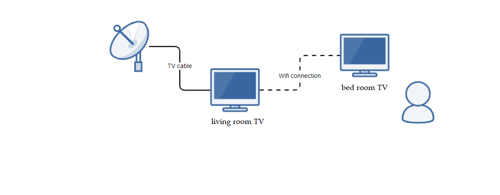

Diagram for room to room
========================
- This is a diagram of Room to room operation

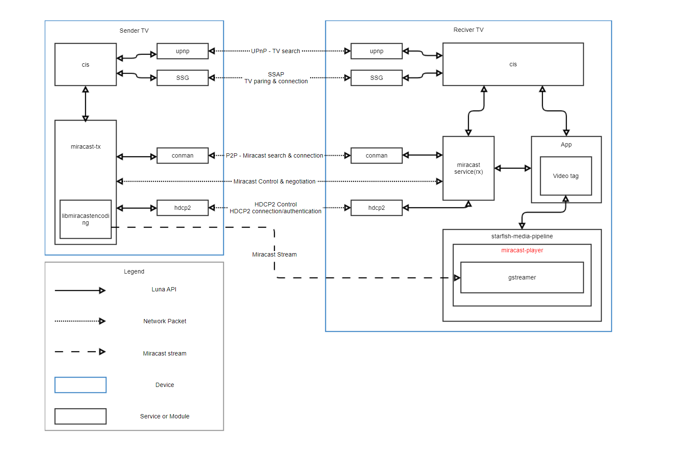

- The operation is almost same in reciver TV both room to room and phone/pc. The miracast stream is sent when connection is established.
- However, miracast-player provides a buffering function to prevent judder at the room to room case.

The feature of room to room miracast media playing
==================================================

- The low latency is most important feature in phone/pc miracast media playing. Because time difference between phone and TV should be minimized. To achieve this, miracast-player plays data as soon as it comes in, and does not match lib synch perfectly.
- The low latency is less important feature in room to room miracast media playing because of picture quality. The MEMC is used to enhance picture quality in room to room. For MEMC, the buffering is required.

Buffering Requirement
**********************

- Below Scenarios has to be considered by SOC's for Room to Room case.

Scenario details by case
========================

- This section describes detailed scenarios for each case.

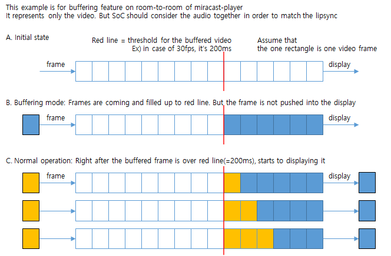

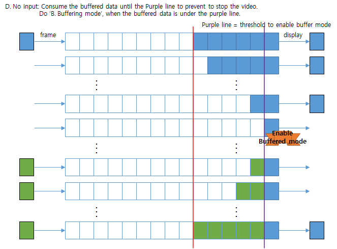

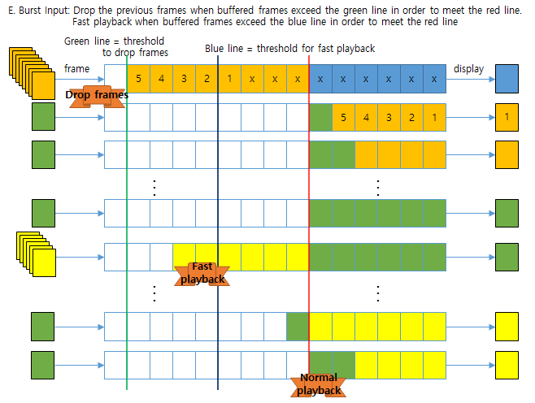

- The contents of the figure above are summarized as follows.

.. list-table::
   :widths: 25 25 50
   :header-rows: 1

   * - ID
     - Case
     - Description
   * - CaseA
     - Before data comes in
     - No playback situation
   * - CaseB
     - Data is coming in but not filled up to the threshold
     - Frame is not delivered to screen
   * - CaseC
     - Data is filled up to the threshold
     - Frame is delivered to the screen
   * - CaseD
     - Data does not come in, so the remaining data falls below a certain standard
     - Frame is not delivered to screen
   * - CaseE
     - Data comes in a lot suddenly
     - If it is above the blue line, it plays quickly, and if it is above the green line, the frame is dropped.

Playing statue according to the frame filled
============================================

- This section describes the playing statue according to the frame filled state

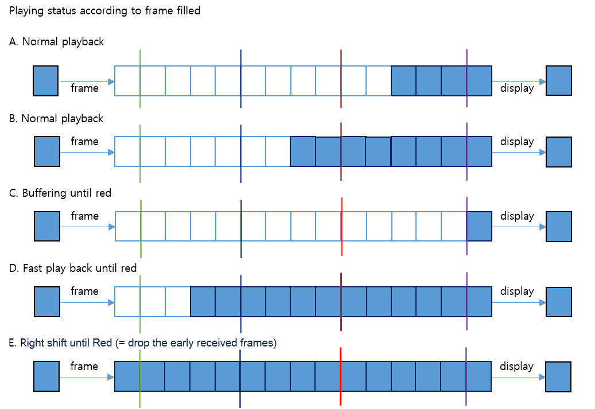

Buffering size
==============

- The buffering size is basically 200 msec.
- This value is based on the bsp situation and experience.
- The k8ap soc cannot support this buffer size. Therefore, if the app sets 200 msec, k8ap bsp sets by 100 msec. This 100 msec is the max value that k8ap can support. If similar issue is occurred at other SOC, you should apply this method.

Only 1 pipeline instance should be exist in room to room case
=============================================================

- Buffering increases bsp memory usage. Because of bsp memory limitation, only 1 pipeline instance should be exist in room to room case.
- There is no function or interface to handle this in starfish-media-pipeline api.
- In order to make this possible, 4 quantities of VDEC were allocated when requesting a resource in starfish-media-pipeline at room to room case.
- If the MAX value of VDEC's quantity is not 4, the above exception handling may be a problem.

Implementation
**************

- The app-type and base-playback-threshold are set to gstreamer filter in room to room case.

Media load option
=================

- App sends below media load option in room to room case

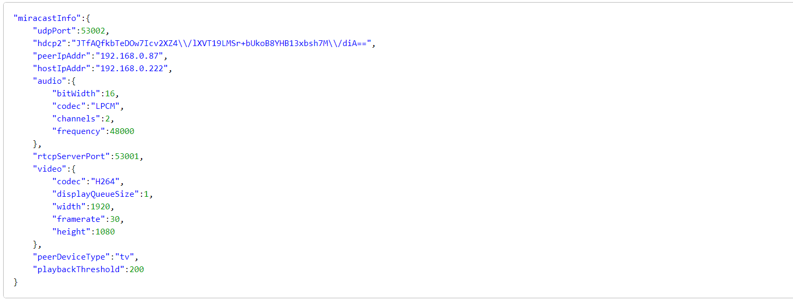

- The peerDeviceType and playbackThreshold are related with room to room.
- If peerDeviceType is tv, it is room to room connection case. If not, it is phone/pc miracast connection case.
- The playbackThreshold is buffering size delivered by App.

The app-type property
=====================

- The R2R app-type is used in room to room case.

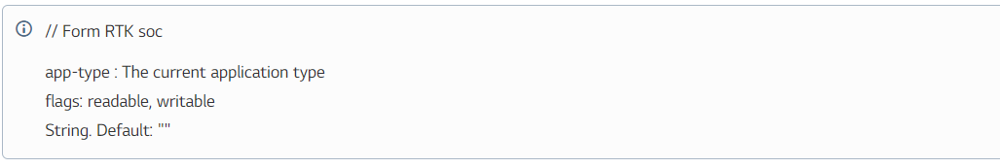

- This should be set to decoder and sink filter.

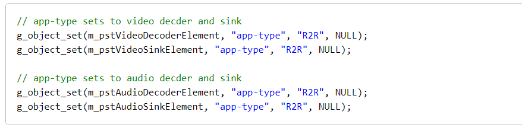

The base-playback-threshold property
====================================

- The buffring size is set by base-playback-threshold property.

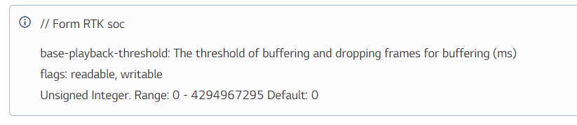

- This should be set to sink filter.

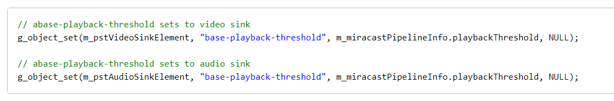

Test
****

- This section describes about test method.

Test environment
================

- Prepare the TV for sender and TV for receiver.
- Sender TV is available only for SIC soc.
- Both the TV for sender and TV for receiver should be connected by one router.

Use room to room app
--------------------

- Run the room to room app on Sender and Receiver TV, connect and play.

Basic test
==========

- Connects video signals or plays media file in sender TV.
- Check ip of reciver TV(In this example, ip is 192.168.0.65).
- Perform the following work in the receiver TV.

.. code-block:: cpp

  1. Set room to room mode forcibly (Performed once every time the TV boots)
     touch /tmp/enable_miracast_forced_r2r_mode
  2. Turn on FRC by disabling lowDelayMode set in PQ (Performed every time when room to room is connected)
     luna-send -n 1 -f luna://com.webos.service.pqcontroller/setPQ '{"video":{"videoInfo":{"lowDelayMode":false}}}'
  3. Set Config (for standbyme)
     luna-send -f -n 1 luna://com.webos.service.config/setConfigs '{"configs": {"profile.list": []}}'

- Input below command to sender TV and reciver TV.

.. code-block:: cpp

  luna-send -f -n 1 luna://com.webos.service.hdcp2/rx/debug '{"debugNum":3}'

- Input below command to sender TV.

.. code-block:: cpp

  // When input below command, sender TV and reciver TV are connected and the screen of sender TV is transmitted to reciver TV.
  // Check video/audio broken and libsync during channels change several times
     luna-send -f -n 1 luna://com.webos.service.miracasttx/connect '{"mode":"infra", "deviceName":"TEST", "ip":"192.168.0.65", "port":7250, "encodingMode":"video"}'
  // When input below command, sender TV and reciver TV are disconnected
     luna-send -f -n 1 luna://com.webos.service.miracasttx/requestMsg ' {"msg":"teardown"}'

Test scenario
=============

- Please check test case : https://harmony.lge.com:8443/issue/browse/WOSBIT-1606
- Connects video signals or plays media file in sender TV.
- Check ip of reciver TV(In this example, ip is 192.168.0.65).
- Input below command to sender TV and reciver TV.

.. code-block:: cpp

  luna-send -f -n 1 luna://com.webos.service.hdcp2/rx/debug '{"debugNum":3}'

- Perform the following work in the receiver TV.

.. code-block:: cpp

  1. Set room to room mode forcibly (Performed once every time the TV boots)
     touch /tmp/enable_miracast_forced_r2r_mode
  2. Turn on FRC by disabling lowDelayMode set in PQ (Performed every time when room to room is connected)
     luna-send -n 1 -f luna://com.webos.service.pqcontroller/setPQ '{"video":{"videoInfo":{"lowDelayMode":false}}}'
  3. Set Config (for standbyme)
     luna-send -f -n 1 luna://com.webos.service.config/setConfigs '{"configs": {"profile.list": []}}'

- Perform the following work in the sender TV.

.. code-block:: cpp

  // When input below command, sender TV and reciver TV are just connected
  // Need to get port number at pmlog of sender TV
  // 2022-03-04T01:40:58.865477Z [1259.426626880] user.info miracast-tx [] miracast-tx INFOMSG {} rtsp_requestEncoderLoad (1040) : streaming ip: 192.168.0.86, port: 53008
     luna-send -f -n 1 luna://com.webos.service.miracasttx/connect ' {"mode":"infra", "deviceName":"TEST", "ip":"192.168.0.65", "port":7250, "encodingLoad":false}'
  // Execute encoder test banary in sender TV
     test_miracastencoding
  // Load encoder pipeline in sender TV
     load 192.168.0.65 53008
  // Start media transmission. If you spend many time until here after connection, reciver TV forcibly disconnects. So you need to input command quickly
  // Check video/audio broken and libsync during channels change several times
     start
  // Restart after 2000 msec
     restart 2000
  // Delay durng 2000 msec
     lazy 2000
  // Stop
     stop
  // Unload pipeline
     unload
  // Terminate encoder test banary
     quit
  // When input below command, sender TV and reciver TV are disconnected
     luna-send -f -n 1 luna://com.webos.service.miracasttx/requestMsg ' {"msg":"teardown"}'
