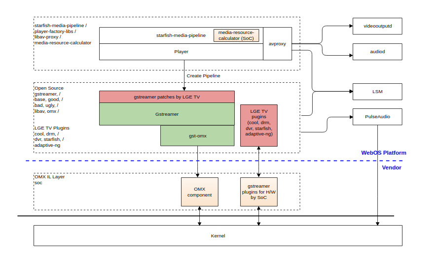
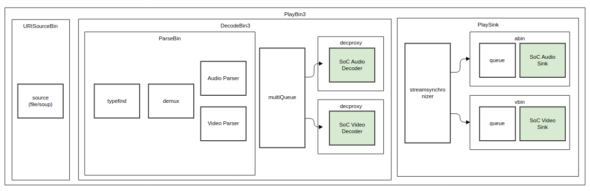
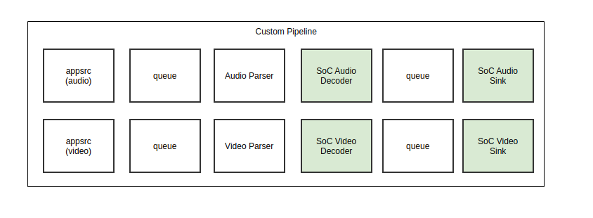
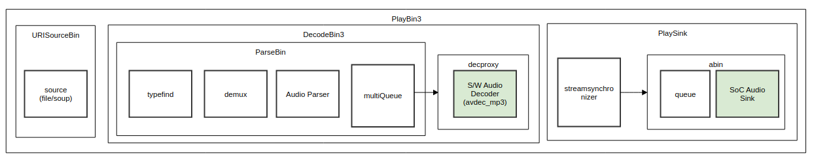
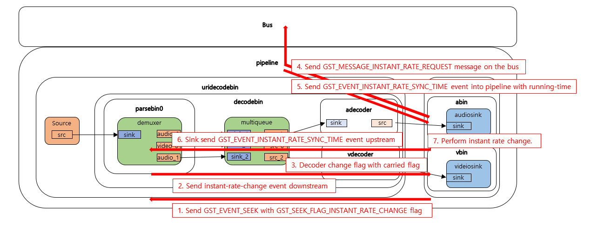
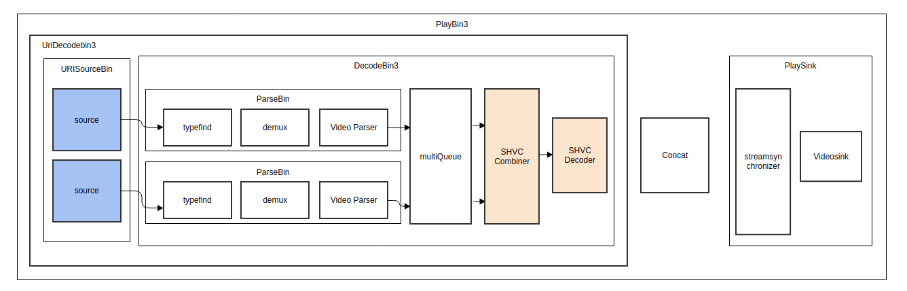
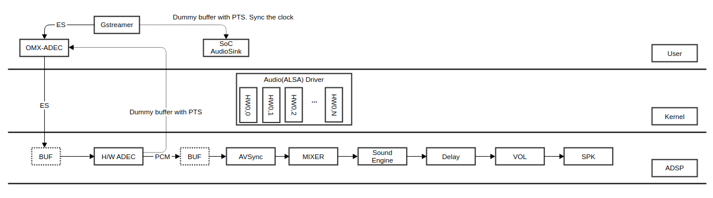
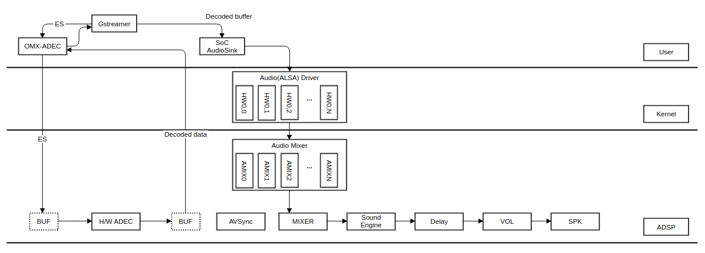

Media
#####
.. _suhwang.kim: suhwang.kim@lge.com
.. _crystal.moon: crystal.moon@lge.com
.. _yongsu.yoo: yongsu.yoo@lge.com

Introduction
**************

| This document shares overview of gstreamer pipeline with SoC decoder/sink in webOS TV. webOS TV use gstreamer release version 1.18.5 in webOS TV. SoC elements must use at least version 1.18.5.

Revision History
================

======= ========== ================ =============
Version Date       Changed by       Description
======= ========== ================ =============
1.02    2023-11-23   `yongsu.yoo`_  Added explanations for 'General Description' and 'Features'
1.01    2023-11-23  `crystal.moon`_ Applied new document template and fixed some typos
1.0     2022-09-14 `suhwang.kim`_      First release
======= ========== ================ =============

Terminology
===========

============ ======================================
Definition   Description
============ ======================================
DSC          Dynamic Stream Change
decproxy     Decoder Proxy
IRC          Instant Rate Change
SHVC         Scalable HEVC
PTS          Present Time Stamp
PCR          Program Clock Reference
STC          System Time Clock generated by H/W
RCD          Reference Clock Difference
BL           Base Layer
EL           Enhanced Layer
============ ======================================

Technical Assistance
====================

=============== ==========
Module          Owner
=============== ==========
media           suhwang.kim@lge.com
=============== ==========

Overview
********

General Description
===================
|     Like YouTube, Neflix, Disney+, there are enormous popular and loved multimedia contents. We cannot imagine life without them. In most of these cases, video/audio are usually delivered in compressed data form to multimedia devices. So multimedia devices must have capabilities by which video/audio data could be de-compressed.

|     The "media" in webOS platform is a BSP module which perform these jobs. The "media" module's detail roles are like following. The first is that it gets compressed video/audio data from webOS platform and de-compresses them. The second is that it sends the de-compressed video/audio to adjacent video/audio renderer modules or returns back the de-compressed video/audio data to webOS platform or directly render them in synchronized timing. For this data processing, LGE uses SW based on gstreamer open source ( https://gstreamer.freedesktop.org/, The open source were edited by LGE and LGE's SoC Vendors for meeting LGE's unique requirements) as most of recent multimedia frameworks do. The gstreamer can be divided to gstreamer pipeline and gstreamer plugins. The gstreamer plugins belong to SoC vendors whereas the gstreamer pipeline belong to webOS(LGE). They are the gstreamer plugins which perform these key actions which were mentioned previously. So the gstreamer plugins correspond to the "media" module which we mentioned earlier. The gstreamer plugins are made, distributed and managed by SoC vendors. The gstreamer plugins dynamically and actively interact with webOS platform (LGE gstreamer pipeline and LGE player) through method functions and messages and the gstreamer plugins are the current border lines which separate the LGE SW territory and SoC Vendor SW territory. Comparing with other BSP modules, it is very impressive that the separation is not realized by specific BSP driver APIs, which usually can be seen in other BSP modules, but the separation is realized by SW instances which are called as "plugins" and their corresponding method functions.

|     Because, in the points of view of managing multi SoC vendors , the lower the BSP interface layer is, the better it is. So LGE is now doing some researches which lower the border line more to kernel layer by adopting V4L2 ( https://www.linuxtv.org/wiki/index.php/Main_Page ) instead of gstreamer plugins as the media's new device driver interface. But until the job is complete, these gstreamer plugins are the official border line which separate LGE SW territory and SoC Vendor SW territory.

Features
========
| The "media" module in webOS platform includes 4 gstreamer plugins (Video decoder plugin, Audio decoder plugin, Video sink plugin and Audio sink plugin), which are related with decoding and rendering. Each plugin's role is like below

- Video decoder plugin

 - The video decoder plugin de-compresses the compressed video data. It should have capabilities to de-compress contents of various video codecs.

- Video sink plugin

 - The video sink plugin sends the de-compressed video data to video renderer in synchronized timing

- Audio decoder plugin

 - The audio decoder plugin de-compresses the compressed audio data. It should have capabilities to de-compress contents of various audio codecs.

- Audio sink plugin

 - The audio sink plugin sends the de-compressed audio data to audio renderer in synchronized timing.

The plugins which were mentioned above should provide the following features.

- Normal play

 - Video/Audio is played in normal 1 speed and normal direction.

- AV Synchronization

 - Both of Video and audio should be output on exact timing, otherwise the lipsync ( https://en.wikipedia.org/wiki/Lip_sync ) problem can be recognized by users. This can make users dizzy. Not only plugins should be able to output video/audio on exact timing, but also they should be able to cope with some problematic conditions like abnormal relation between PTS and STC for minimizing its effects.

- Trick play

 - Video/Audio is played in various kinds of speeds and directions. The speed includes 0.5 x play, 1 x play, 2 x play, 4 x play, 8 x play, 16 x play. and the direction includes forward, backward and pause.

- Adaptive streaming

 - According the  network condition, the format of audio/video are optimally changed for minimizing audio/video cut. For realizing this feature, both of LGE media framework and SoC Vendor's gstreamer plugins are dynamically cooperated together.

| The above mentioned scenario cannot be realized solely by plugins. Only after plugins cooperate LGE's gstreamer pipelines/player, these scenario can be realized.

Architecture
============

The following figure illustrates the webOS media system context. It uses opensource Gstreamer as a media framework, allocates HW A/V decoder resources, and provides LG's own plug-in for DVR and DRM operation.

- Gstreamer plugins for H/W by SoC vendor

  - The gstreamer plugins for H/W by SoC vendor can be linked and used easily to the gstreamer pipeline, which is used in the multimedia framework.

- OpenMAX plugins

  - Some of the SoC vendor provide OpenMAX IL components and not Gstreamer plugins. WebOS provides the gst-omx plugins to use the OpenMAX IL components. The gstreamer pipeline used in the multimedia framework can control and transfer data to OpenMAX IL component using the gst-omx plugins.

Generic pipeline
-------------------------

First one is **generic** pipeline and it generally uses playbin3 pipeline. Most File and DLNA protocols use playbin3 pipeline and all plugins are constructed automatically by gstreamer auto-plug mechanism. Also SoC decoder/sink plugins are configured automatically instead of s/w decoders.
For this job, the decproxy which is created by LG plugs a fake decoder until acquisition of H/W resources and then changes from fake to SoC decoder.
See the below picture

Custom pipeline
-------------------------

The second one is **custom** pipeline and its all plugins are constructed manually. It is mostly used in premium native CP such as YouTube, Netflix, Amazon and so on.

Music pipeline
-------------------------

The other one is **music** pipeline and it generally uses playbin3 pipeline like **generic** pipeline. To support audio only gstreamer pipeline such as music player, S/W audio decoder (e.g. ffmpeg) in playbin3 is used as following picture.

- Audio only case (e.g. music player) uses the s/w audio decoder in order not to occupy ADEC H/W resource.

- SoC audio sink shall handle the raw pcm data from s/w audio decoders (e.g. avdec_mp3) and render it property.

  - reconfiguration path in s/w audio decoder and SoC audio sink if it needs.

  - use mixer port if it needs.

Design Constraints
========================

Playbin3(playsink) use only one video and audio sink in pipeline running time and don't support dynamically changing video and audio sink elements.

- For example, we cannot support to change audio sink when audio track is changed in different codes. (aac -> raw pcm)

Requirements
************

| This section describes the main functionalities of the media module in terms of the module’s requirements and constraints.

Dynamic Stream Change
===================================

Background
-------------------

Basically, DSC(Dynamic Stream Change) is internal terminology in LGE. It means even A/V stream type or property (i.e. content resolutions, bit-rates, frame-rates and audio/video codec format changes, clear/encrypted changes) is changed during streaming and playback.
TV platform must support seamless switching for them. More general terminology for DSC is seamless switching, seamless transition or seamless playback. It is used for adaptive streaming (HLS, DASH, Smooth Streaming) and ATSC 3.0 broad casting in playbin3 pipeline.
For example, VOD service is feeding mpeg2-ts stream and stream property is changed while running time.

- e.g. resolution: 1920 x 1080 → 3840 x 2160

- e.g. codec: video/x-h264 → video/x-h265

Cases of Stream Change

- Deal with changing video and audio codec in running time

- Deal with changing properties of video codec (resolution, framerate ratio, etc) in running time

- Deal with changing properties of audio codec (channel, bitrate, etc) in running time

- Deal with changing internal subtitle in running time

- Deal with changing number of tracks in video, audio, internal subtitle in running time

- Deal with additional information(i.e. MetaData) in running time

Functional Requirements
--------------------------------------

The seamless switching must be completed within 250 ms without video garbage and audio noise.
We recommend to show the last video frame as a still image until a new video frame of the new stream is prerolled.

Considering maximum resolution and codes, we need to acquire maximum size of H/W resource. ''max-width'' and ''max-height'' are given to SoC decoder by ''resource-info'' property.

Instant Rate Change
==================================

Background
-------------------

In YouTube Cobalt Certification checklist, It was required to apply full decoding / rendering without dropping all the frames by applying the changed speed.Support for values of 0.25, 0.5, 1, 1.25, 1.5, 2

- NOT trick play— display all frames

- Must be supported for Audio and Video

- Audio may be muted for 0.25 if necessary

- YouTube Desktop has this functionality today

Goal of Design
-------------------

- Without disrupting playback

  - No position change (anywhere, including upstream of seek handler)

  - No audio/video corruption

- As fast as possible

- In a backwards-compatible way (meaning elements that don't handle seeks or do synchronization are not disrupted by the new API and design)

Design Overview
-------------------

We strongly recommend to see the link (https://gstconf.ubicast.tv/videos/changing-playback-rate-instantly/) first and It helps to understand new APIs and event flow in pipeline.

To support Instant Rate Change, Gapless rate change, gstreamer support followings :

- Flush Seek will not occur (No Flushing Event, No New Segment, No Reset Running time of Clock.)

- There is no flush operation so Basesink does not require async-start / done and preroll buffer processing.

- Update segment information based on the rate to be applied in Basesink and current running time, and adjust the offset of running time to render directly at the changed speed.

- New APIs operate with a single sequence number. This is to prevent the duplicated rate change operation.

Event Flow
-------------------

1. An application sends a non-flushing GST_EVENT_SEEK with the GST_SEEK_FLAG_INSTANT_RATE_CHANGE flag on it.

2. A seek handler (typically a demuxer) validates the instant-rate change event and sends a non-serializedGST_EVENT_INSTANT_RATE_CHANGE event downstream indicating the rate from the seek event

3. When decoders receive the GST_EVENT_INSTANT_RATE_CHANGE they extract the carried flags from the GST_SEGMENT_INSTANT_FLAGS subset and replace the flags in the active (and subsequent segments) to enable/disable trick modes on the fly.

4. When sinks receive the GST_EVENT_INSTANT_RATE_CHANGE they check if they have already received a GST_EVENT_INSTANT_RATE_SYNC_TIME event with that sequence ID. If not, the sink sends a GST_MESSAGE_INSTANT_RATE_REQUEST on the bus with the specified rate.

5. When the pipeline receives GST_MESSAGE_INSTANT_RATE_REQUEST it calculates the running-time spent at the active rate override (1.0 by default) and from that calculates a new target running-time and the corresponding original pipeline running-time (as if no rate override had been applied) and places those into a GST_EVENT_INSTANT_RATE_SYNC_TIME event and sends it into the pipeline.

6. Sinks also send that event upstream.

7. Sinks modify their internal GstSegment (which they use for synchronization) using the specified running time (as the position at which they should switch), upstream-running-time and rate multiplier from theGST_EVENT_INSTANT_RATE_SYNC_TIME. The sinks use the difference between the 2 running times to adjust synchronization and QoS events.

Quality and Constraints
---------------------------------------------------------

- No position change

- No rate direction change

- start_type & stop_type should be set GST_SEEK_TYPE_NONE

- GST_SEEK_FLAG_FLUSH must not contained in flag

- Only matroska-demux, qtdemux, tsdemux, adaptivedemux was changed.

SHVC in ATSC 3.0 in North Ameria
=========================================

Background
-------------------

To support Scalable HEVC streams in GStreamer for ATSC 3.0 in North America and it aims for explain what to do in SoC.

- scalable streams: Combination of BL (Base Layer) and EL (Enhanced Layers). BL is independently decodable but EL is dependently to BL.

Design Overview
-------------------

For scalable streams such as BL and EL or combination streams, GStreamer Playbin3 with combining structure is designed as below.
"SHVC combiner" plugin is introduced to feeding BL and EL buffers sequentially based on same timestamp and it is placed before SHVC Decoder (e.g. openhevcdec).

At first, BL buffer is delivered to SHVC decoder. And then corresponding EL buffer is delivered to SHVC decoder.

In terms of video decoder, based on same timestamp, A buffer for BL is delivered and then A buffer for EL is delivered.

This figure shows that combing streams in playbin3 with SHVC combiner.

These combining structure in playbin3(decodebin3) and SHVC combiner are generated from open source maintainers but, they are not merged yet to gstreamer open source due to some reasons.

Implementation
*********************

File Location
======================
Each SoCs has a their gstreamer plugins. For example, other SoCs use gst-omx and has their own plugins.
To support SoC's plugins, we need to make repositories in LG SWFarmHub. (e.g. gst-omx-[vender_name], gst-plugins-[vender_name], omx-il-[vender_name]).

- https://swfarmhub.lge.com/

Also we need to prepare recipe (e.g. bb file) for the new repositories for webOS OE build.

API List
========

Data Types
---------------

Dynamic Stream Change
''''''''''''''''''''''''''''''''''''''''''''''''''''

**GST_QUERY_ACCEPT_CAPS** shall be implemented in SoC audio and video decoder elements.

Decodebin3 sends **gst_pad_query_accept_caps()** to the decoder element when new caps event is given in order to check current decoder is re-usable or not.
If the current decoder is re-usable or can accept the new caps, the current decoder shall return TRUE for the **GST_QUERY_ACCEPT_CAPS**.
If not, current decoder shall return FALSE for the **GST_QUERY_ACCEPT_CAPS**.

- **Re-usable Decoder Case**

  .. image:: resources/media_reusable_decoder_case.png
  :width: 100%

- **Non Re-usable Decoder Case**

  .. image:: resources/media_nonreusable_decoder_case.png
  :width: 100%

Instant Rate Change
''''''''''''''''''''''''''

New variables are added in pipeline and basesink.

- **gstpipeline**

  - Through pipeline, update upstream running time with calculated value using running time and rate information.

  .. list-table::
    :header-rows: 1

    * - **Value**
      - **Type**
      - **Comment**
    * - instant_rate_clock_anchor
      - GstClockTime
      - - Running time of Current Clock (clock_time - base_time)

        - This value is set in running_time in INSTANT-RATE-SYNT-TIME event.

        - e.g.) Change rate to 2 at 10s : value is set to 10s

        - After that, Change rate to 0.25 at 20s : value is set to 20

    * - instant_rate_upstream_anchor
      - GstClockTime
      - - Running time calculated using rate and passed Time

        - This value is set in upstream_running_time in INSTANT-RATE-SYNC-TIME event.

        - e.g.) Change rate to 2 at 10s : value is set to 10

        - After that, Change rate to 0.25 at 20s : value is set to 30

- **gstbasesink**

  - In Basesink, It updates segment information using running time and changed rate and adjusts the running time offset by deriving a difference in consideration of the time passed by the correction algorithm.

  .. list-table::
    :header-rows: 1

    * - **Value**
      - **Type**
      - **Comment**
    * - upstream_segment
      - GstSegment
      - segment which is sent to upstream such as demux

    * - last_anchor_running_time
      - GstClockTime
      - - running time sent with INSTANT-RATE-SYNC-TIME event

        - e.g.) Change rate to 2 at 10s : value is set to 10

        - After that, Change rate to 0.25 at 20s : value is set to 20

    * - instant_rate_offset
      - GstClockTimeDiff
      - - running_time - upstream_running_time (running time & upstream_running_time sent with INSTANT-RATE-SYNC-TIME event)

        - Will be used to compensate offset of running time.

        - e.g. > Change rate to 2 at 10s : value is set to 0

        - After that, Change rate to 0.25 at 20s : value is set to -10

    * - sink->Segment
      - GstSegment
      - Update segment information such as rate,base,position and offset using values sent into Basesink

    * - actual_duration
      - GstClockTime
      - - The passed time from event delivery.(now - last_anchor_running_time)

        - e.g. > If passed time is 100ms,

        - Change rate to 2 at 10s : value is set to 100

        - After that, Change rate to 0.25 at 20s : value is set to 100

    * - upstream_duration
      - GstClockTime
      - - (actual_duration * basesink->segment.rate) / basesink→priv→upstream_segment.Rate

        - e.g. > Change rate to 2 at 10s : value is set to 200 ms (100 * 2 / 1)

        - After that, changing rate to 0.25 at 20s : value is set to 25 ms (100 * 0.25 / 1)

    * - difference
      - GstClockTimeDiff
      - - instant_rate_offset + (actual_duration - upstream_duration)

        - e.g. > Change rate to 2 at 10s : value is set to -100 ms (0s + 100 ms - 200 ms)

        - After that, changing rate to 0.25 at 20s : value is set to -9975 ms (-10s + 100 ms - 25 ms)

        - Running time offset is calculated using:

        - gst_event_set_running_time_offset (event, -difference);

Functions
-------------------

Instant Rate Change
''''''''''''''''''''''''''
Four APIs were added to add new functions as follows.

- **New GstSeekFlag : GST_SEEK_FLAG_INSTANT_RATE_CHANGE**

  - Flag contained in seek event

  - If Demux receives seek event including the GST_SEEK_FLAG_INSTANT_RATE_CHANGE flag, INSTANT_RATE_CHANGE event is delivered to downstream without flushing process and new segment creation.

  - Currently, it is implemented only in AdaptiveDemux, QTDemux, MatroskaDemux, and TSDemux.

    .. code-block:: cpp

      GST_SEEK_FLAG_INSTANT_RATE_CHANGE = (1 << 10),

- **New Event : GST_EVENT_INSTANT_RATE_CHANGE**

  - Event which informs downstream (basesink) that Instant-rate-change should be done without flushing.

    .. code-block:: cpp
      :linenos:

      /* non-sticky downstream non-serialized */
      GST_EVENT_INSTANT_RATE_CHANGE = GST_EVENT_MAKE_TYPE (180, FLAG(DOWNSTREAM) | FLAG(STICKY)),

      /* Create a new instant-rate-change event. */
      GstEvent *gst_event_new_instant_rate_change (gdouble rate_multiplier, GstSegmentFlags new_flags)

      /* Extract rate and flags from an instant-rate-change event. */
      void gst_event_parse_instant_rate_change (GstEvent * event, gdouble * rate_multiplier, GstSegmentFlags * new_flags)

- **New Message : GST_MESSAGE_INSTANT_RATE_REQUEST**

  - This message is used to request the pipeline to perform instant-rate-change through Basesink.

  - The pipeline which receives this message sends **INSTANT_RATE_SYNC_TIME** event to Basesink.

    .. code-block:: cpp
      :linenos:

      /* Creates a new instant-rate-request message. */
      GstMessage * gst_message_new_instant_rate_request (GstObject * src, gdouble rate_multiplier)

      /* Parses the rate_multiplier from the instant-rate-request message. */
      void gst_message_parse_instant_rate_request (GstMessage * message, gdouble * rate_multiplier)

- **New Event : GST_EVENT_INSTANT_RATE_SYNC_TIME**

  - Event informs the clock to synchronize with the running time of the clock in the pipeline which receives INSTANT_RATE_REQUEST message.

  - The segment information is updated with time information (running_time and upstream_running_time) transmitted from the basesink, and the offset of the running time is adjusted.

    .. code-block:: cpp
      :linenos:

      /* upstream events */
      GST_EVENT_INSTANT_RATE_SYNC_TIME = GST_EVENT_MAKE_TYPE (261, FLAG(UPSTREAM)),

      /* Create a new instant-rate-sync-time event. */
      GstEvent * gst_event_new_instant_rate_sync_time (gdouble rate_multiplier,
          GstClockTime running_time, GstClockTime upstream_running_time)

      /* Extract rate multiplier and running times from an instant-rate-sync-time event. */
      void gst_event_parse_instant_rate_sync_time (GstEvent * event,
          gdouble * rate_multiplier, GstClockTime * running_time,
          GstClockTime * upstream_running_time)

Implementation Details
======================

SHVC in ATSC 3.0 in North America
-------------------------------------------

SoC video decoder shall combine the BL and corresponding EL (same timestamp) and then push a combined buffer to downstream(e.g. videosink).

  **1. Detect Scalable Stream**

    a. It is best if the video decoder can detect it on its own.

    b. LGE can give the information that it is a scalable stream using property. (resource-info)

  **2. Arrange Enough Memory**

    a. For example, EL stream has a high resolution and codec than BL.

      i. BL (2K, h.264, 1920 x 1080), EL (4K, h.265, 3840 x 2160)

    b. LGE can give the information for 'max-width' and 'max-height' using property (resource-info)

    c. Allocate larger buffer for VDEC (VO).

  **3. Combine BL and EL buffer based on same timestamp and then push a combined buffer to downstream.**

Reference Test
''''''''''''''''''''''''''
To use openhevcviddec, install LGE gstreamer and openhevcviddec in desktop environment (Linux box).

.. code-block:: cpp
  
    Install LGE gstreamer based on @1182.webos4tv branch.
    The `ffmpeg_update` branch of openhevc : https://github.com/OpenHEVC/openHEVC/tree/ffmpeg_update
    The openhevc gstreamer plugin from https://github.com/ystreet/gst-openhevc

1) For file play in gstreamer in desktop using openhevcviddec.

  .. code-block:: cpp
    
      gst-launch-1.0 -v filesrc location=/home/hoonhee/work/contents/SHVC/20190405_ateme_shvc/BL_844.mp4 ! qtdemux ! h265parse ! h265combiner name=hc ! openhevcdec quality-layer-id=1 ! videoconvert ! autovideosink sync=false filesrc location=/home/hoonhee/work/contents/SHVC/20190405_ateme_shvc/EL_845.mp4 ! qtdemux ! video/x-h265, stream-format=lhe1 ! h265parse ! hc.enhancement_sink

2) For dash based play in desktop using openhevcviddec

  .. code-block:: cpp
  
      gst-launch-1.0 h265combiner name=comb ! openhevcdec quality-layer-id=1 ! videoconvert ! queue ! xvimagesink sync=False http://tvmedia-streaming.lge.com/SHVC3/20190405_ateme_shvc/manifest_v2.mpd ! dashdemux ! qtdemux ! h265parse disable-passthrough=False ! comb.enhancement_sink http://tvmedia-streaming.lge.com/SHVC3/20190405_ateme_shvc/manifest_v1.mpd ! dashdemux ! qtdemux ! h265parse disable-passthrough=False ! comb.base_sink

3) Use GPAC's MP4Client tool

  .. code-block:: cpp

      GPAC's MP4Client tool (GPAC: master, compiled against openHEVC; OpenHEVC: ffmpeg_update branch)
      openHEVC decoder: https://github.com/OpenHEVC/openHEVC (ffmpeg_update branch)

Configuration
-----------------------

webOS TV use special configuration file (/etc/gst/gstcool.conf) to apply special settings when gstreamer initialization time (e.g. gst_init()). All gstreamer pipelines which are created in webOS TV use this configuration and it will be applied as each pipeline process is created.

You can see blow options. The important thing is 'default_sink'. It helps playsink of playbin3 read the 'default_sink' and create them.

  - [rank]: we can adjust and apply rank what we want for specific plugin (e.g. pulsesink=0)

  - [sw_decoder]: we can register s/w audio decoder plugins for music only or other s/w audio decoding use cases (e.g. avdec_mp3)

  - [sw_video_decoder]: we can register s/w video decoder for s/w video decoding use cases (e.g. avdec_h264)

  - **[default_sink]**: we can register SoC video and audio sink plugins.

    - e.g.) **video=xvimagesink**

    - e.g.) **audio=alsasink**

  - [debug]: we can enable GST_DEBUG and dump the gstreamer log.

  - See the sample for gstcool.conf.

    .. code-block:: cpp

      [buffering]
      max-size-buffers=0
      max-size-bytes=25165824
      max-size-time=20000000000
      low-percent=10
      high-percent=99
      ring-buffer-max-size=0
      use-rate-estimate=1

      [rank]
      mpegpsdemux=310
      decproxy=300
      mediainfo=64
      avdec_mp3=64

      [sw_decoder]
      avdec_mp3=0
      avdec_aac=0
      avdec_ac3=0
      ...
      adpcmdec=0
      dvdlpcmdec=0
      vorbisdec=0

      [sw_video_decoder]
      avdec_h264=0
      avdec_vp8=0
      avdec_vp9=0

      [default_sink]
      video=ximagesink
      audio=alsasink

      [debug]
      DEBUG_MODE=disable
      GST_DEBUG=5
      GST_DEBUG_FILE=/tmp/gst.log
      GST_DEBUG_DUMP_DOT_DIR=/tmp/
      GST_DEBUG_NO_COLOR=1
      DOT_GRAPH_TIMEOUT=0

All we have to do is to **register SoC default video and audio sink** to [default_sink] category and it must be one.

H/W resource setting
----------------------------

Message flow for H/W resource setting
''''''''''''''''''''''''''''''''''''''''''''''''''''

Below picture shows how to interface with H/W resource setting.

  .. image:: resources/media_playbin3_with_rm.png
  :width: 100%

1. The Playbin3 (Decodebin3) send request-resource message to player when all tracks are parsed after multiqueue

   a. Internally, Decodebin3 deploy the decproxy (decoder proxy bin) which has a fake a/v decoder.

   b. Decproxy blocks all data until resource acquisition is completed in order to prevent data loss.

2. The player check the resource table with the parsed information of all tracks (e.g. codec, resolution, framerate, channel,,,). Then, send 'acquired-resource' event to playbin3 after H/W resource acquisition.

3. Pipeline(decodebin3/playsink) handle the 'acquired-resource' event and send it to each SoC decoder and sink elements.

   a. Internally, Decproxy switch the fake decoder to SoC decoder and send 'resource-info' property.

   b. Internally, Playsink send 'resource-info' property to each audio/video sink elements.

resource-info property
''''''''''''''''''''''''''''''''''''''''''''''''''''

- Decproxy and Playsink send the 'resource-info' property to each audio/video decoders and sink elements.

- The 'resource-info' property shall be implemented in each audio/video decoder and audiosink elements.

  - Also videosink would implement 'resource-info' property if it needs.

  .. image:: resources/media_media_info.png
  :width: 100%

.. function:: resource-info

  **Element**
    - Video/Audio Decoder

    - Video/Audio Sink

  **Value Type**
    - GstStructure

  **Platform**
    - Common

  **Setting Time**
    - It is given to decoder element as soon as factory_make. It means null state.

    - It is given to sink element after factory_make and state change to ready as the playsink’s mechanism.

  **Description**
    - After acquisition of H/W resources is completed, allocated resource information must be delivered to the decoder and the sink.

    - The ‘resource-info’ property is GstStructure type and it includes below values.

      - core-type: G_TYPE_STRING (mandatory)

        - allocated decoder core name

      - video-port: G_TYPE_INT (mandatory)

        - the number of video decoder port (e.g. -1, 0, 1)

      - audio-port: G_TYPE_INT (mandatory)

        - the number of audio decoder port (e.g. -1, 0, 1)

			-	max-width: G_TYPE_INT (optional)

        - Maximum value of width (it is used for adaptive case)

      - max-height: G_TYPE_INT (optional)

        - Maximum value of height (it is used for adaptive case)

      - mixer-port: G_TYPE_INT (mandatory)

        - the number of mixer port (e.g. -1, 0, 1, 2, 3, 4)

  **Sample Code**
    .. code-block:: cpp
      :linenos:

      gst_video_dec_class_init () {

        g_object_class_install_property (gobject_class, PROP_RESOURCE_INFO,
            g_param_spec_boxed ("resource-info", "Resource Info",
            "Hold resource values for resource manager query",
            GST_TYPE_STRUCTURE, G_PARAM_READWRITE | G_PARAM_STATIC_STRINGS));

      }

      gst_video_dec_set_property ((GObject * object, guint prop_id,
          const GValue * value, GParamSpec * pspec) {

        case PROP_RESOURCE_INFO:
        {
          const GstStructure \*structure = NULL;
          const gchar \*gstr = NULL;
          structure = gst_value_get_structure (value);
          gstr = gst_structure_get_string (structure, "core-type");
          gst_structure_get_int (structure, "video-port", &self->resource.video_port);
        }
      }

Clock and Synchronize in gstreamer
---------------------------------------------

Normally, gstreamer pipeline uses the clock that is provided from audio sink that is inherited from gstreamer system clock (e.g. Linux system time or monotonic clock) in Linux box. Most of cases, audio is master and it provides gstreamer clock object (e.g. gstaudiobasesink). It is propagated to all elements in the pipeline and basesink uses the clock to synchronize the buffer's PTS.

  - https://gstreamer.freedesktop.org/documentation/application-development/advanced/clocks.html?gi-language=c

Generally, a chip has their own STC H/W clock (counter) and shall provide the STC clock object to gstreamer layer if the STC H/W clock is not served automatically from SoC audio or video sink element. If not, gstreamer system clock based on chip's system time will be used by default.

  - https://gstreamer.freedesktop.org/documentation/plugin-development/element-types/base-classes.html?gi-language=c

  - See the sample code to provide gstreamer clock.

  .. code-block:: cpp
    :linenos:

    struct _GstXXXAudioClock
    {
      GstSystemClock clock;
    };

    struct _GstXXXAudioClockClass
    {
      GstSystemClockClass parent_class;
    };

    GstClock *
    gst_xxx_audio_clock_new (const gchar * name, GstXXXAudioClockGetTimeFunc func,
        gpointer user_data, GDestroyNotify destroy_notify)
    {
      GstXXXAudioClock *aclock = GST_XXX_AUDIO_CLOCK (g_object_new (GST_TYPE_XXX_AUDIO_CLOCK, "name", name,
          "clock-type", GST_CLOCK_TYPE_OTHER, NULL));
      aclock->func = func;
      aclock->user_data = user_data;
      aclock->destroy_notify = destroy_notify;
      return (GstClock *) aclock;
    }

    gst_xxx_audio_base_sink_init (GstXXXAudioBaseSink * audiobasesink)
    {
      audiobasesink->provided_clock = gst_xxx_audio_clock_new ("GstXXXAudioSinkClock",
          (GstXXXAudioClockGetTimeFunc) gst_xxx_audio_base_sink_get_time,
          audiobasesink, NULL);
    }

To synchronizing the buffer's PTS with gstreamer clock is very simple in basesink.

  1. Check the buffer's timestamp is out of range in given segment.

  2. Calculate 'running' and 'stream' start/stop-time with clipped time based on segment.

  3. Adjust running time using latency (render-delay).

       a. Each Chip has a backend delay and it needs to be applied (gst_base_sink_set_render_delay ()) before playing.

  4. Wait the buffer until the running time of buffer reaches to the clock. (gst_base_sink_wait_clock ())
  5. Render. (basesink→render) Actually, write(output) the decoded buffer

Render Delay
''''''''''''''''''

Each SoC has its own backend delay.

Delay Table (TBD)

Decode Flow
--------------------------------------

Generally, we can see 2 kinds of decode flow. One is 'tunnel' and the other one is 'non tunnel' mode. And it depends on each SoC's architecture.

Tunnel Mode
'''''''''''''

In tunnel mode, the ADEC output data sends to AudioOut. Gstreamer decoder element uses OMX IL to create a decoder in Audio FW. OMX IL gets ES data from GST element and sends the data to Audio FW to decode and output.

None Tunnel Mode
'''''''''''''''''''''

In this mode, the ADEC output data sends back to OMX-IL layer and transmit to GStreamer.

H/W Decode Flow
'''''''''''''''''''

Before the explanation, we need to know the notion of the words below.

  - PTS: Present Time Stamp

  - PCR: Program Clock Reference

  - STC: System Time Clock generated by H/W. (e.g. A chip use 90KHz system clock and used for AV sync)

  - RCD: Reference Clock Difference. (RCD = PCR - STC - Offset)

  - Offset: To ensure that buffer has enough data for buffering. and prevent from data underflow of display not smooth.

  .. image:: resources/media_decode_flow.png
  :width: 100%

The figure shows the decode flow and clock sync of specific SoC in tunnel mode in webOS TV.

In gstreamer layer(basesink), use the mapped the reference clock and synchronize the clock with buffer's timestamp.

At this time, use the same referenced clock in Audio/Video F/W and write(render/output) the data to VO/AO when PTS is matched to STC.

S/W Decode Flow
'''''''''''''''''''''''''

This figure shows S/W decode flow. Gstreamer sends PCM data to Audio F/W to output directly.

Music only such s/w decoding case uses this flow.

  .. image:: resources/media_sw_decode_flow.png
  :width: 100%

Testing
************
To test the implementation of the Media module, webOS TV provides SoCTS (SoC Test Suite) tests.
The SoCTS checks the basic operation of the Media module and verifies the kernel event operation for the module by using a test execution file.
For more information, see :doc:`media SoCTS document. </part4/socts/Documentation/source/producer-manual/producer-manual_common/producer-manual_gpio>`

References
********************

Playback Function
===========================

Below playback in playbin3 shall be supported in webOS TV.

- Play/Pause/Resume

- EOS

- Seek (Flush Seek with GST_SEEK_FLAG_KEY_UNIT)

- Trick Play (2x, 4x, 8x, 16x, -2x, -4x, -8x, -16x)

- Multi Audio Track Change

Volume and Sound mute control
=============================================

In webOS TV, the volume is only controlled by the system sound, and there is no element to control s/w sound in the gstreamer pipeline. It means that 'volume' element is not really used.

The audio mute is applied when **'GST_SEEK_FLAG_TRICKMODE_NO_AUDIO'** for trick play or the **'mute'** property is given from the application.

  1) **'GST_SEEK_FLAG_TRICKMODE_NO_AUDIO'**: audio decoder will receive gap event from upstream element or would have to drop all frames and push gap to downstream.

    - FHD(2K): **No sound** should be output from 4x speed or higher and negative speed.

    - UHD(4K): **No sound** should be output from 2x speed or higher and negative speed.

  2) **'mute'** property: This property can be delivered by application for other reasons even if it is not a trick play.

    - SoC Audio Sink shall implement the 'mute' property.

    - Need to reset buffer(frame) or mute to driver for No Audio.

Soc audio decoder and sink elements shall handle 'GST_SEEK_FLAG_TRICKMODE_NO_AUDIO' with gap and 'mute' property.