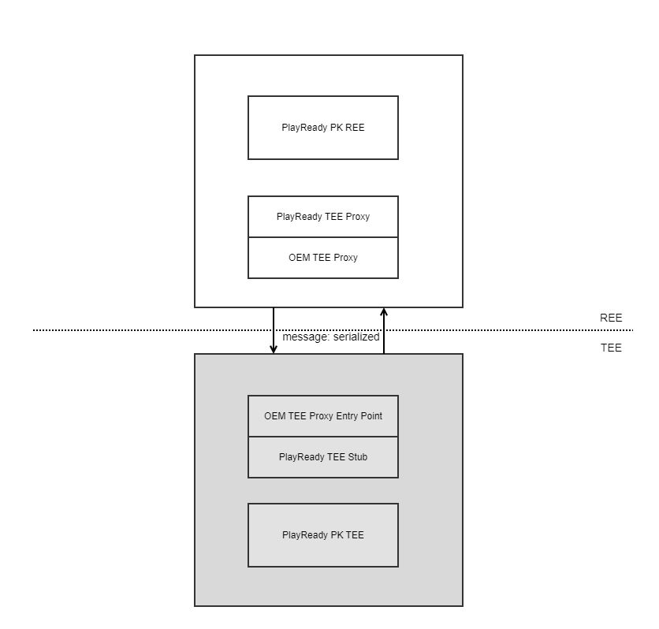

PlayReady
=========

Introduction
------------
| This document describes PlayReady, the DRM feature of webOS. This outlines the capabilities of PlayReady, the level of security that must be adhered to in order to produce webOS, and describes the required features.

| PlayReady is a DRM solution provided by Microsoft and is essential for providing major OTT services on webOS. PlayReady Device Porting Kit (hereinafter referred to as PK) is only accessible to a limited number of people from a security perspective, so it does not cover specific API specifications.

Revision History
^^^^^^^^^^^^^^^^

======= ========== ================ =============
Version Date       Changed by       Description
======= ========== ================ =============
1.0     2023.11.10 cs.jung          First release
======= ========== ================ =============

Terminology
^^^^^^^^^^^

| The key words "must", "must not", "required", "shall", "shall not", "should", "should not", "recommended", "may", and "optional" in this document are to be interpreted as described in RFC2119.

| More detailed information can be found in the guidance document provided to PlayReady developers.

============ ===============================
Term         Description
============ ===============================
DRM          Digital Rights Management
PRITEE       PlayReady Interface for TEE
REE          Rich Execution Environments
TEE          Trusted Execution Environments
CA           Client Application
TA           Trusted Application
SVP          Secure Video Path
============ ===============================

Technical Assistance
^^^^^^^^^^^^^^^^^^^^

For assistance or clarification on information in this guide, please create an issue in the LGE JIRA project and contact the following person:

============== ============
Module         Owner
============== ============
DRM(Manager)   sehan.yoon`_
DRM(PlayReady) cs.jung`_
============== ============

Overview
--------

General Description
^^^^^^^^^^^^^^^^^^^

| PlayReady is a DRM technology developed by Microsoft. It is designed to protect and manage the distribution of digital content.

| To provide the function, the REE part and TEE part must be implemented separately, and LG is responsible for implementing the REE part and Partner is responsible for implementing the TEE part.

| For implementation of the function, refer to the implementation guide of the PlayReady Device Porting Kit.

- https://learn.microsoft.com/en-us/playready/overview/clients

Features
^^^^^^^^

| Starting with webOS 22, the latest webOS supports PlayReady version 4.4. The SoC Vendor must implement the functions described here in the <PKInstallPath>/source/trustedexec/ subfolder.

- aes128cbc

- aes128ctr

- base

- decrypt

- dom (Domains)

- licprep (License Preparation)

- lprov (Local Provisioning)

- revocation

- securestop

- securestop2

- securetime

- sign

Requirements
------------

This section describes OEM changes that are not referenced in PlayReady PK.

Functional Requirements
^^^^^^^^^^^^^^^^^^^^^^^

- Device Individualization: The Manufacturer Name, Model Name, and Model Number to be entered into the PlayReady Cert Chain for each individual device must be implemented so that they can be recorded in UTF-8. At this time, the Manufacturer Name is “LG ELECTRONICS INC.”, the Model Name is “LG webOS TV”, and the Model Number is obtained from the individual device.

- Secure Video Path: To meet the SL3000 certification, Secure Video Path (SVP) implementation is required. When the decryption mode is set to OEM_TEE_DECRYPTION_MODE_HANDLE, the decrypted stream must be moved to SEMEM which is decribed in following document.
:doc:`{hal-libs-header/documentation/source/security/svp} </part3/hal-libs-header/documentation/source/security/svp>`

- SL2000 for audio: webOS meets SL3000 only for video stream.

- Digital Output Protection over HDCP: The OEM_TEE_DECRYPT_EnforcePolicy function checks the HDCP version of the output device and applies the policy according to the PlayReady Output Protection Level. This is not the case for build-in display only (TV).

Quality and Constraints
^^^^^^^^^^^^^^^^^^^^^^^

- Complete random seed generation: The RNG (Random Number Generation) used in PlayReady must support True Random, and it cannot be a simple logic that uses the current time or a combination thereof as a seed, or a method that reuses functions provided as samples in the Porting Kit.

- There is a performance (in terms of speed) requirements for the decryption operation. Please refer to the SVP requirements.
:doc:`{hal-libs-header/documentation/source/security/svp} </part3/hal-libs-header/documentation/source/security/svp>`

Implementation
--------------

| For PlayReady function implementation, refer to the PlayReady reference document and Porting Kit header.

Testing
-------

PlayReady is tested by :doc:`the webOS TV SoCTS (SoC Test Suite). </part4/socts/Documentation/source/producer-manual/producer-manual_drm/producer-manual_option_playready>` Prior to this test, the Model certificate and private key must be installed. These must be implemented to be installed with webOS firmware, but in the early stages SoC Vendors can install and test them in any way they wish.

References
----------

Technical support for PlayReady is available from Microsoft.

- https://learn.microsoft.com/en-us/playready/

