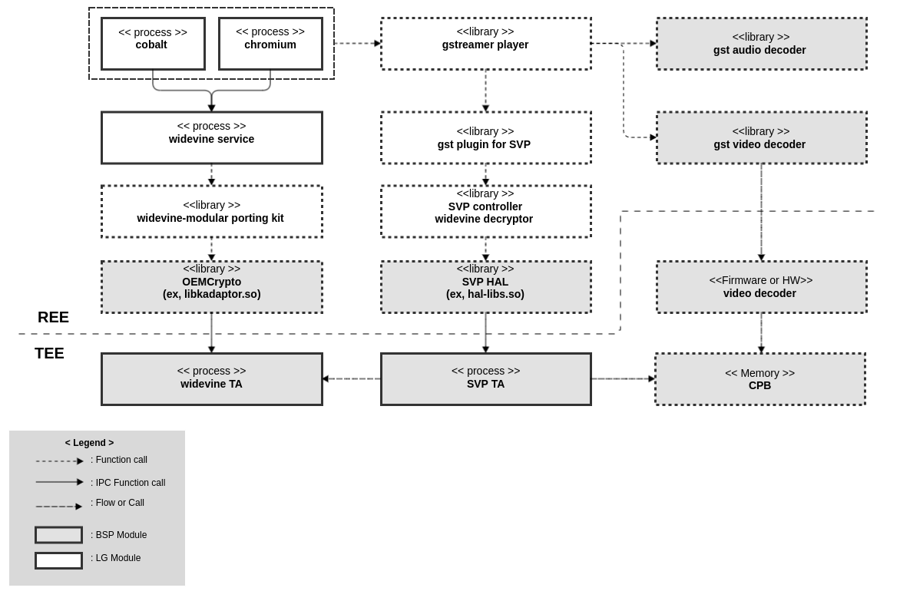
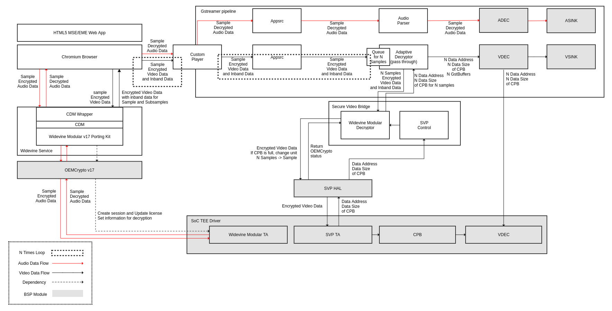
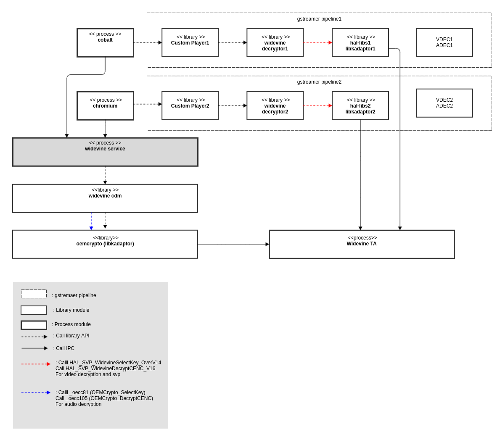

WIDEVINE
####

.. _jeeseung.jung: jeeseung.jung@lge.com
.. _doohwan.kim: doohwan0.kim@lge.com
.. _sehan.yoon: sehan.yoon@lge.com
.. _Google OEMCrypto V17 Document: https://developers.google.com/widevine/drm/client/oemcrypto/v17
.. _Google OEMCrypto OPK Document: https://developers.google.com/widevine/drm/client/opk
.. _Google Resource Rating Tier Document: https://developers.google.com/widevine/drm/feature/resource-rating
.. _Google Chipset Workflow Document: https://developers.google.com/widevine/drm/device-management/chipset
.. _Google Provisioning 2.0 Document: https://developers.google.com/widevine/drm/device-management/provisioning-2

Introduction
************

| This document describes widevine in webOS TV. This document gives an overview of the widevine module and provides details about its version and overall structure.

| Widevine DRM is a content protection system from Google, used to secure premium media. It has major partners like YouTube, Disney+, HBO Max, Hulu, Peacock, Discovery+, and more.

Revision History
================

=============== ============ =================== ================================
Version         Date         Changed by          Description
=============== ============ =================== ================================
1.00.00         2023-11-22   `jeeseung.jung`_    Initial
=============== ============ =================== ================================

Terminology
===========

| The key words "must", "must not", "required", "shall", "shall not", "should", "should not", "recommended", "may", and "optional" in this document are to be interpreted as described in RFC2119. 

| The following table lists the terms used throughout this document: 

=============================== ===============================
Term                            Description
=============================== =============================== 
Gstreamer                       GStreamer is an open-source multimedia framework that serves as a library for constructing graphs of media-handling components, supporting a wide range of audio/video processing and streaming applications.
Media Pipeline                  Media player based on Gstreamer in webOS
CDM                             Content Decryption Module
CP                              Contents Provider
CPB                             Coded Picture Buffer
DRM                             Digital Rights Management
EME                             Encrypted Media Extensions
HTML5                           Hypertext Markup Language version 5
MSE                             Media Source Extensions
OP-TEE                          Open Portable Trusted Execution Environment
REE                             Rich Execution Environment
SoC                             System on Chip
SVP                             Secure Video Path
TA                              Trusted Application
TEE                             Trusted Execution Environment
=============================== =============================== 

Technical Assistance
====================

For assistance or clarification on information in this guide, please create an issue in the LGE JIRA project and contact the following person:

=================== ===================================
Module               Owner
=================== ===================================
Widevine             `jeeseung.jung`_ , `doohwan.kim`_
Secure Video Path    `sehan.yoon`_ 
=================== ===================================

.. note::
  Need permission to access google page(Please request permission to Google Widevine)

Overview
********

General Description
===================

| Widevine DRM provides multiplatform DRM and video optimization solutions using industry adopted standards including common encryption (CENC) and encrypted media extensions (EME).
| Widevine DRM adopts the following standards:
- Encrypted Media Extensions - a W3C specification.
- Common Encryption ISO/IEC 23001-7 - Common encryption in ISO base media file format files.
- ISO/IEC 23001-9 - Common encryption of MPEG-2 transport streams. The focus of Widevine is to provide the best experience for viewing premium content over digital distribution. Widevine does not assess any fee for use of its products and services. A license agreement is required for the use of Widevine products or services.
| Widevine DRM plays a crucial role within the webOS in controlling access to and use of encrypted content via widevine, and preventing copyright infringement. It prevents users from illegally copying or sharing content, and allows content creators to maintain control over their works.
| Currently, the latest webOS supports Widevine CDM/OEMCrypto v17.1.

Features
========

| The main function of the widevine is provisioning, licensing, decrypting securely.

| The key features of the widevine are as follows:

- Provisioning
    - For widevine, it need factory provisioning based on provisioning2.0. The SoC provide the generation tool and the key to parse the Widevine keybox xml file provided by Google and encrypt each widevine keybox. In the factory, an encrypted Widevine keybox is injected, and the Widevine keybox is re-encrypted with a unique key and stored safely.
    - The widevine generates provisioning request message with injected widevine keybox. After going through the authentication process on the provisioning server based on the widevine keybox, widevine receive a certificate and RSA private key and the widevine store them safely.
- Licensing
    - The widevine generates license request message with nonce and signature and app requests the license with the license request message.
    - The widevine recieves license response and parse the response and load keys from license.
- Decrypting
    - For video data, widevine decrypts input video data and don't return decrypted data and pass svp module in the TEE.
    - For audio data, widevine decrypts input audio data in the TEE and return decrypted data to the REE.
    - The widevine supports CTR and CBCS cipher mode for decryption.

Architecture
============

This section describes the architecture of the widevine

Driver Architecture
-------------------

The following diagram shows the architecture of widevine and svp module where the widevine module's interaction with other modules is described.

| When attempting to play Widevine content, it operates in the following order.
| This does not cover the entire SVP operation, but only fills in the parts necessary for Widevine.

#. To use widevine cdm, the app (cobalt, chromium) loads widevine service, a separate process, and performs widevine cdm and oemcrypto initialize within the widevine service process.
#. Next, the app performs provisioning and licensing through the widevine service and attempts audio decoding through the widevine service.
#. The app delivers encrypted video data and decrypted audio data to gstreamer.
#. Encrypted video data is delivered to the svp plugin in gstreamer, and the data is delivered to the SVP TA (or Widevine TA) through the SVP controller in the svp plugin and the SVP HAL of the widevine decryptor.
#. Video data decrypted from Widevine TA is stored in CPB within TEE through SVP TA.
#. The CPB address is passed back to the gstreamer player and then to the video decoder within gstreamer. The video decoder firmware or HW decoder reads data in the CPB with the received CPB address.

Overall Workflow
================

| The diagram above shows the overall workflow when a Chromium web app plays widevine content.
| As mentioned above in the driver architecture, widevine cdm and oemcrypto initialize, provisioning, licensing, etc. are performed in a separate widevine service process.
| Audio decryption is also performed through the widevine service, and the decrypted audio data is delivered to the gstreamer pipeline.
| In the case of video decryption, it is performed by the adaptive decryptor of the gstreamer pipeline rather than the widevine service, and decryption is performed by collecting N samples considering the memory size required for decryption and SVP allowed by the SoC.
| Video decryption is performed through SVP HAL, and decrypted video data is stored into the CPB within the TEE.
| Afterwards, the address and size of the CPB where the video data is stored is passed from the adaptive decryptor to vdec.

Requirements
************

| Widevine BSP Module is OEMCrypto and Widevine TA and must be basically implemented according to the Integration Guide in the document specified by Google `Google OEMCrypto V17 Document`_. This section describes the webOS Specific functionalities of the Widevine in terms of the module's requirements and constraints.

Functional Requirements
=======================

| Please refer to `Google OEMCrypto V17 Document`_ for OEMCrypto requirments.
| And OEMCrypto must support OPK and please refer to `Google OEMCrypto OPK Document`_ for OEMCrypto OPK requirments.
| The section below will focus on parts that are not mentioned in the above Google document or are LG specific.

Provisioning2.0
---------------

| Please refer to `Google Provisioning 2.0 Document`_ for Provisioning 2.0 overview.
| OEMCrypto must support Provisioning2.0 among several provisioning methods.

Chip model registration
^^^^^^^^^^^^^^^^^^^^^^^

| Please refer to `Google Chipset Workflow Document`_ for chip model registration.

| In the early stages of development, it is important to quickly register the Device Series in the Google Widevine System and generate a Keybox before starting device production for the event. In order to register a Device Series, it is necessary to first register the Chip model in the SoC side.

| The SoC must share the name and detailed information of the chip model registered in the Google Widevine System with LG.

Widevine key generation tool
^^^^^^^^^^^^^^^^^^^^^^^^^^^^

| The SoC must provide a tool that parses the widevine keybox file in xml format provided by Google Widevine, encrypts each key, and then extracts it as a file.
| At this time, the key used when encrypting within the tool must also be provided by the SoC, and it is also used when the key is injected during the process and decrypted within the TEE.

Multi-Decryption
----------------
| As with the overall flow mentioned above, Widevine performs video decryption and audio decryption in different processes, so the decryption operation performed in each process must be guaranteed.

=========== ===================================================================
Stream Type  API Call Sequence
=========== ===================================================================
Audio       OEMCrypto_SelectKey->OEMCrypto_DecryptCENC
Video       HAL_SVP_WidevineSelectKey_OverV14->HAL_SVP_WidevineDecryptCENC_V16
=========== ===================================================================

| Also, it is a multi-view function that can play 2 widevine contents in the same time, and since several premium content providers are requesting concurrunt playback, multi-decryption must be supported.
| Multi-decryption sequence is below and the decryption operation performed in each process must be guaranteed.

=========== =============== ===================================================================
Stream Type  Process         API Call Sequence
=========== =============== ===================================================================
Audio       widevine sevice OEMCrypto_SelectKey->OEMCrypto_DecryptCENC
Video       GST Pipeline1   HAL_SVP_WidevineSelectKey_OverV14->HAL_SVP_WidevineDecryptCENC_V16
Video       GST Pipeline2   HAL_SVP_WidevineSelectKey_OverV14->HAL_SVP_WidevineDecryptCENC_V16
=========== =============== ===================================================================

| Simple widevine multi-decryption flow

Quality and Constraints
=======================

This section lists the non-functional requirements for widevine, such as performance,  quality requirements and design constraints.

Decryption Performance
----------------------

Decryption(OEMCrypto_DecryptCENC, HAL_SVP_WidevineDecryptCENC_V16) must be performed within 16ms regardless of number of subsamples and cipher mode.

Resource Rating Tier
--------------------

| Widevine OEMCrypto must support below resource rating tier for quality.
| Please refer to `Google Resource Rating Tier Document`_ for resource rating information.

======================================================= ================= ================== ================ ===============
Resource Rating Tier                                    1 - Low           2 - Medium         3 - High         4 - Very High
======================================================= ================= ================== ================ ===============
Example Device                                          phone for Only SD phone for SD or HD UHD TV or Device 8K TV or Device
Minimum Sample size                                     1 MiB             2 MiB              4 MiB            16 MiB
Minimum Number of Subsamples - H264 or HEVC             10                16                 32               64
Minimum Number of Subsamples - VP9                      9                 9                  9                9
Minimum Number of Subsamples - AV1                      72                144                288              576
Minimum subsample buffer size                           100 KiB           500 KiB            1 MiB            4 MiB
Minimum Generic crypto buffer size                      10 KiB            100 KiB            500 KiB          1 MiB
Minimum Number of concurrent sessions                   10                20                 30               40
Minimum Number of keys per session                      4                 20                 20               30
Minimum Total Number of Keys (all sessions)             16                40                 80               90
Minimum Total Number of DRM Private Keys (all sessions) 2                 4                  6                8
Message Size                                            8 KiB             8 KiB              16 KiB           32 KiB
Decrypted Frames per Second                             30 fps SD         30 fps HD          60 fps HD        60 fps at 8k
======================================================= ================= ================== ================ ===============

Widevine Key Provisioning
-------------------------

| For injecting encrypted widevine key file with factory provisioning securely,
#. Injected widevine key must be decrypted within TEE.
#. Widevine key must be encrypted via device unique key within TEE.
#. Widevine key must be stored in secure storage.

Implementation
**************

| This section guides the location of documents for OEMCrypto, HAL DRM, and HAL SVP API required for Widevine operation.

=================================== ====================================================================
API                                 Document
=================================== ====================================================================
OEMCrypto apis                      `Google OEMCrypto V17 Document`_, `Google OEMCrypto OPK Document`_
HAL SVP api                         :doc:`Hal Libs Svp Documentation. </part3/hal-libs-header/documentation/source/security/svp>`
HAL_SVP_WidevineDecryptCENC_V16     :cpp:func:`HAL_SVP_WidevineDecryptCENC_V16`
HAL_SVP_WidevineSelectKey_OverV14   :cpp:func:`HAL_SVP_WidevineSelectKey_OverV14`
HAL DRM api                         :doc:`Hal Libs Drm Documentation. </part3/hal-libs-header/documentation/source/security/drm>`
HAL_DRM_WriteWidevineKeyBox         :cpp:func:`HAL_DRM_WriteWidevineKeyBox`
HAL_DRM_GetWidevineDeviceID         :cpp:func:`HAL_DRM_GetWidevineDeviceID`
=================================== ====================================================================

For reference, the number of each step in the Detail Depth part may be slightly different.

Testing
*******
| To test the implementation of Widevine OEMCrypto, webOS provides SoCTS (SoC Compatible Test Suite) tests. 
| The SoCTS checks the basic operation of the widevine OEMCrypto and verifies the widevine TA operation for the module by using a test execution file. 
| For details, see :doc:`Widevine Unit Test in SoCTS Unit Test Specification. </part4/socts/Documentation/source/producer-manual/producer-manual_drm/producer-manual_option_widevine>`
| Detail Depth : SoCTS > Test Manual > Unit Test(Producer) Manual > 6.DRM Producer Guide > 6.2. Widevine Producer

References
**********

| Need permission to access google page(Please request permission to Google Widevine)
| Google OEMCrypto V17 Document: https://developers.google.com/widevine/drm/client/oemcrypto/v17
| Google OEMCrypto OPK Document: https://developers.google.com/widevine/drm/client/opk
| Google Resource Rating Tier Document: https://developers.google.com/widevine/drm/feature/resource-rating
| Google Chipset Workflow Document: https://developers.google.com/widevine/drm/device-management/chipset
| W3C EME: https://www.w3.org/TR/encrypted-media/
| W3C Web Cryptography API: https://www.w3.org/TR/WebCryptoAPI/
| MPEG Common Encryption: https://www.iso.org/standard/68042.html
| Google Provisioning 2.0 Document: https://developers.google.com/widevine/drm/device-management/provisioning-2
