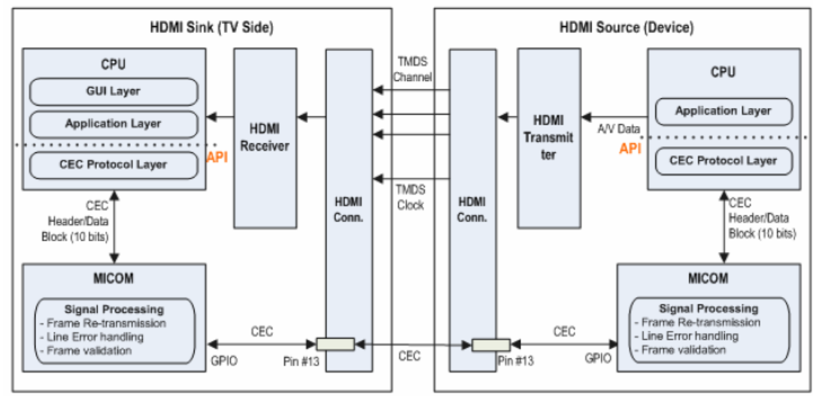

CEC
####

.. _vanshika08.sood: vanshika08.sood@lge.com
.. _jagatha.prakash: jagatha.prakash@lge.com

Introduction
************

| This document describes the Consumer Electronics Control (CEC) module in the kernel space. This document gives an overview of the CEC module and provides details about its functionalities and implementation requirements.

| CEC is a feature of HDMI designed to allow users to command and control devices connected through HDMI by using only one remote control. This document assumed that the readers are familiar with the Linux Media Subsystem and the CEC kernel API.

Revision History
================

======= ========== ===================== ===============
Version Date       Changed by            Description
======= ========== ===================== ===============
1.0     2023.11.22 `vanshika08.sood`_    First release
======= ========== ===================== ===============

Terminology
===========

| The key words "must", "must not", "required", "shall", "shall not", "should", "should not", "recommended", "may", and "optional" in this document are to be interpreted as described in RFC2119.

| The following table lists the terms used in the CEC module guide :

===================== ======================================================================================================================================================
Term                  Description
===================== ======================================================================================================================================================
Audio System          A device, which is not a TV, that has the ability to render audio, e.g. an audio Amplifier.
Broadcast message     This is a message, sent to Logical Address 15, which all devices are expected to receive.
CEC                   Consumer Electronics Control
CEC Root (device)     | A device, generally a display (Sink) device, formally defined by the following rule:
                      | A device that has no HDMI output or, a device that has chosen to take the physical address 0.0.0.0 (see Section 8.7).
Clear                 Set to an empty/undefined state.When a Physical Address is cleared it takes the value F.F.F.F. When a Logical Address is cleared it takes the value 15.
Deck                  The part of a Recording Device or Playback Device that provides playback functionality e.g. from a media such as DVD or Hard Disk.
Destination           The target device for a CEC message.
DDC                   It stands for Display Data Channel.DDC operates over i2c using a pair of lines in the HDMI cable.
Follower              A device that has just received a CEC message and is required to respond to it.
Initiator             The device that is sending, or has just sent, a CEC message and, if appropriate, is waiting for a Follower to respond.
Logical Address       A unique address assigned to each device (see section CEC 10.2)
Menu Providing Device A non-display device that may render a menu on TV.
Playback device       A device that has the ability to play media, e.g. a DVD Player.
Rx                    Receiver
Recording device      A device that has the ability to record a source such as an internal tuner or an external connection.					  
(HDMI) Source         A device with an HDMI output.
(HDMI) Sink           A device with an HDMI input.
Source Device         A device that is currently providing an AV stream via HDMI.
Tx                    Transmitter
Tuner Device          A device that contains a tuner, e.g. an STB or a Recording Device.
Timer Setting Device  A device that has the ability to set the record timer blocks of a Recording Device.
TV                    A device with HDMI input that has the ability to display the input HDMI signal. Generally it has no HDMI output.
VSDB                  It stands for Vendor specific Data Block.For some formats, additional codings are defined for certain fields in this block.
===================== ======================================================================================================================================================

Technical Assistance
====================

| For assistance or clarification on information in this guide, please create an issue in the LGE JIRA project and contact the following person:

=========== ===============================
Module      Owner
=========== ===============================
CEC         `jagatha.prakash`_ 
=========== ===============================

Overview
********

General Description
===================

| Consumer Electronics Control (CEC) is a feature of HDMI designed to allow users to command and control devices connected through HDMI by using only one remote control.

| For example, by using the remote control of a television set to control a set-top box and/or DVD player.Up to 15 devices can be controlled.CEC also allows for individual CEC-enabled devices to command and control each other without user intervention.

* An optional supplement to HDMI using pin 13 of the HDMI connector.

* Provides high-level control functions between the various audiovisual products in a user's environment.

* Based on the old AV.link scart standard (EN 50157-2-[123]).

* Implemented in HDMI receivers/transmitters and USB HDMI-passthrough devices.

* Data packets: 1 header byte + 0 to 15 data bytes.

* Very, very slow data rate ~400 bits/s.

Features
========

| The CEC module provides the following features:

* **End-User Features**

| **One Touch Play -** The One Touch Play feature allows your device to play and become the active source by pressing a single button.

| **System Standby -** Enables the user to switch all devices to the Standby state with one button press.

| **Deck Control -** This function is for controlling the Playback Device (a deck or disc player or recorder) with another device (TV).

| **Tuner Control -** Allows a device to control the tuner of another device.

| **Device Menu Control -** This feature allows you to control your device's menus via your TV's remote control as if you were using your own remote control. When another device has a menu on its display, it allows your TV to recognize it and control it.

| **Remote Control Pass Through -** This feature allows one device (usually a TV) to receive remote control commands. It is used to pass through to other devices on the network.

| **Give Device Power Status -** Several messages, such as <Image View On> and <Play>, bring other devices out of standby. The <Give Device Power Status> message is used to check the current power status of the target device. The target device responds with a <Report Power Status> message that includes a power status operand.

| **System Audio Control -** This function allows the Amplifier to provide audio functionality as a source to be displayed on the TV. In this mode, the Amplifier uses the same source as video and provides volume control and mute functions instead of TV.

| **One Touch Record -** Whatever is shown on the TV screen is recorded on a selected Recording Device.

| **Timer Programming -** Allows the user to program the timers in a Recording Device from and EPG running on a TV or STB.

* **Supporting Features** 

| **Device OSD Name Transfer -** This function is used to request the device's preferred name for use in all on-screen displays (e.g. menus).
 
| **Device Power Status -** Allows the current power status of a device to be discovered.

| **OSD Display -** This feature allows the device to send text strings to the TV for On Screen Display (OSD).

| **Routing Control -** This feature is used to control the routing of an HDMI network by controlling the CEC switch.

| **System Information -** This feature allows devices to automatically use the same OSD and Menu language as the TV.

| **Vendor Specific Commands -** This feature allows vendor specific commands to be used to communicate between devices.

| **Audio Rate Control -** Allows an Amplifier to fractionally increase or decrease the playback rate of an audio source.

| **Audio Return Channel Control -** This feature allows an Audio Return Channel receiver (ARC Rx) device to start and terminate an Audio Return Channel between itself and an adjacent Audio Return Channel transmitter (ARC Tx) device. Conversely, an ARC Tx device allows adjacent ARC RX devices to request that an Audio Return Channel be started and terminated between the devices.

| **Capability Discovery and Control -** Controls HDMI Ethernet Channel(HEC) part of HEAC.

Architecture
============

| The diagram below is the architecture of the CEC(Consumer Electronic Control) module interaction with other module.

| The CEC communication consists of three levels: bit-level, block-level, and frame-level. 

| The bit-level protocol defines the timing and voltage levels of the CEC signal, which is modulated by the devices using a bi-phase mark coding scheme. 

| The block-level protocol defines the arbitration and retransmission mechanisms, which ensure that only one device can send a message at a time and that the message is received correctly. 

| The frame-level protocol defines the message format and content, which include the header, the opcode, and the operands. 

| The header contains the initiator and destination logical addresses, which identify the type and role of the devices. The opcode indicates the function or command of the message. The operands provide additional information or parameters for the message.

| The CEC communication also involves the device connectivity and addressing, which determine the topology and logical addresses of the devices in the HDMI network. 

| The device connectivity is based on the physical address, which is a 16-bit value that represents the position of the device in the HDMI tree. The physical address is assigned by the HDMI source device, which acts as the root of the tree. The device addressing is based on the logical address, which is a 4-bit value that represents the product type of the device.

| The logical address is allocated by the TV, which acts as the communication hub. The TV periodically sends a "Give Physical Address" message to the logical address 0E, which is reserved for devices that are requesting a logical address. If a device responds to this message with its physical address and device type, the TV will assign it a logical address based on its availability and priority.

Requirements
************

| This section describes the main functionalities of the CEC  module in terms of the module's requirements and constraints.

Functional Requirements
=======================

| In this section ,  the Functional Requirements of the CEC module are listed and described.

**CEC Plugin** - Manages the work of the TV part of CEC.

* Performs ARC connection/disconnection/information-related operations between the TV and libcecp.

* Transmits power change requests between TV and libcecp.

* When a device playback request command is received from libcecp, the external input is changed to a CEC device.

* Processes key commands received from TV and libcecp.

* In Factory, Power Only mode, exception operation occurs for H/W verification.

**libcecp** - Manages CEC unique functions and CEC device list.

* Performs ARC connection/disconnection/information-related operations between the CEC Plugin and CEC devices.

* Transmits power change requests between the CEC Plugin and the CEC device.

* When a playback request is received from a CEC device, the CEC Plugin is requested to switch the relevant external input.

* Processes key commands from CEC devices and CEC Plugin.

Quality and Constraints
=======================

| This section lists the non-functional requirements for CEC, such as quality requirements and design constraints.

| Non-functional requirements that the CEC module must satisfy are : 

* It should be easy to obtain information on connected CEC devices
* It must be possible to send/receive CEC messages sent from various devices.
* To detect unrecognized connection/disconnection of CEC devices, polling is conducted periodically (15 seconds).

| Restrictions from technical perspective are :

* Normal service is guaranteed for up to one audio type device on the same CEC Line.
* Normal service is guaranteed for up to three recording type devices on the same CEC Line.
* Normal service is guaranteed for up to four Tuner type devices on the same CEC Line. 
* Normal service is guaranteed for up to three Player type devices on the same CEC Line.
* ARC is supported only when connected to an ARC-supported port.
* If Physical.address is not properly assigned to the CEC Device, CEC service support is limited.
* CEC can transmit up to 16 bytes at a time.
* It takes approximately 24 to 28 msec to transmit 1 byte. 
* All devices connected to CEC use TX/RX in common. (If one device uses a lot of resources, other devices cannot use it.)

Implementation
**************

| This section provides materials that are useful for CEC implementation. 

* The File Location section provides the location of the Git repository where you can get the header file in which the interface for the Delivery implementation is defined.
* The API List section provides a brief summary of Delivery APIs that you must implement.
* The Implementation Details section provides standard CEC API reference.

File Location
=============

| The CEC module uses the standard Linux interface and there is no newly defined interface by LG. Please refer to the standard CEC header file.

API List
========

| This section describes what are API's & functions are used for CEC implemetation.

Data Types
----------

**Standard V4L2 Data Types**

| Name and description of data types are as follows:

======================== =====================
Name                     Description
======================== =====================
:c:type:`cec_caps`       CEC Capabilities
:c:type:`cec_msg`        CEC Message
:c:type:`cec_log_addrs`  CEC logical addresses
======================== =====================

Functions
---------

| Functions and their description are as follows:

=============================== ====================================
Function                        Description
=============================== ====================================
:func:`open`                    Opens a CEC Device
:func:`close`                   Closes a cec device
:func:`ioctl`                   Manipulates cec device parameters
:c:macro:`CEC_RECEIVE`          To receive a CEC message 
:c:macro:`CEC_TRANSMIT`         To send a CEC message
:c:macro:`CEC_ADAP_G_CAPS`      Get capabilities
:c:macro:`CEC_ADAP_G_LOG_ADDRS` To get the logical addresses for the CEC adaptor
:c:macro:`CEC_ADAP_S_LOG_ADDRS` Set logical addresses for the CEC adaptor
:c:macro:`CEC_ADAP_G_PHYS_ADDR` Get Physical addresses for the CEC adaptor
:c:macro:`CEC_ADAP_S_PHYS_ADDR` Set Physical addresses for the CEC adaptor
:c:macro:`CEC_G_MODE`           Get modes for follower and initiator
:c:macro:`CEC_S_MODE`           Set modes for follower and initiator
=============================== ====================================

| The CEC Specification defines logical addresses from 0x0 to 0xF.
========  =====================
Address   Device
========  =====================
0         TV (root device)  
1         Recording device 1
2         Recording device 2 
3         Tuner 1 
4         Playback device 1 
5         Audio system 
6         Tuner 2 
7         Tuner 3 
8         Playback device 2
9         Recording device 3
10        Tuner4
11        Playback device 3
12        Reserved
13        Reserved
14        Specific use
15        | Unregistered (as Initiator address) 
          | Broadcast(as Destination address)
========  =====================

Implementation details
======================
Open
^^^^

.. function:: open()

    .. seealso::

      :ref:`v4l-dvb-apis:cec-func-open`

    **Description**

        This function makes CEC HW resource enabled.
        Other functions of CEC operate normally only when HDMI is enabled by this function.

        To open a cec device applications call :c:func:`open()` with the
        desired device name. The function has no side effects; the device
        configuration remain unchanged.

        When the device is opened in read-only mode, attempts to modify its
        configuration will result in an error, and ``errno`` will be set to
        EBADF.

    **Responses to abnormal situations, including**

        See the :ref:`v4l-dvb-apis:cec-func-open`.

    **Performance Requirements**

        | It should be returned within 50 msec.
        | See the :ref:`v4l-dvb-apis:cec-func-open`.

    **Constraints**

        See the :ref:`v4l-dvb-apis:cec-func-open`.

    **Functions & Parameters**

        .. code-block:: cpp
          :linenos:

          // Command
          int open(const char *device_name, int flags);

    **Return Value**

        :c:func:`open()` returns the new file descriptor on success. On error,
        -1 is returned, and ``errno`` is set appropriately. Possible error codes
        include:

        ``EACCES``
            The requested access to the file is not allowed.

        ``EMFILE``
            The process already has the maximum number of files open.

        ``ENFILE``
            The system limit on the total number of open files has been reached.

        ``ENOMEM``
            Insufficient kernel memory was available.

        ``ENXIO``
            No device corresponding to this device special file exists.

    **Example**

        .. code-block:: cpp
          :linenos:

          int fd;
          char* device_name = "/dev/cec0";

          fd = open(device_name, O_RDWR);

close
^^^^^

.. function:: close()

    .. seealso::

      :ref:`v4l-dvb-apis:cec-func-close`

    **Description**

        This function makes close the cec device.
        Other functions of CEC don't operate normally and error is returned after
        a cec device is closed.

        Resources associated with the file descriptor are freed. The device configuration remain unchanged.

    **Responses to abnormal situations, including**

        See the :ref:`v4l-dvb-apis:cec-func-close`.

    **Performance Requirements**

        | It should be returned within 50 msec.
        | See the :ref:`v4l-dvb-apis:cec-func-close`.

    **Constraints**

        See the :ref:`v4l-dvb-apis:cec-func-close`.

    **Functions & Parameters**

        .. code-block:: cpp
          :linenos:

          // Command
          int close(int fd);

    **Return Value**

        :c:func:`close()` returns 0 on success. On error, -1 is returned, and
        ``errno`` is set appropriately. Possible error codes are:

        ``EBADF``
            ``fd`` is not a valid open file descriptor.

    **Example**

        .. code-block:: cpp
          :linenos:

          int ret;

          ret = close(fd);

ioctl
^^^^^

.. function:: ioctl()

    .. seealso::

      :ref:`v4l-dvb-apis:cec-func-ioctl`

    **Description**

        The :c:func:`ioctl()` function manipulates cec device parameters. The
        argument ``fd`` must be an open file descriptor.

        The ioctl ``request`` code specifies the cec function to be called. It
        has encoded in it whether the argument is an input, output or read/write
        parameter, and the size of the argument ``argp`` in bytes.

        Macros and structures definitions specifying cec ioctl requests and
        their parameters are located in the cec.h header file. All cec ioctl
        requests, their respective function and parameters are specified in
        :ref:`v4l-dvb-apis:cec-user-func`.

    **Responses to abnormal situations, including**

        See the :ref:`v4l-dvb-apis:cec-func-ioctl`.

    **Performance Requirements**

        See the :ref:`v4l-dvb-apis:cec-func-ioctl`.

    **Constraints**

        See the :ref:`v4l-dvb-apis:cec-func-ioctl`.

    **Functions & Parameters**

        .. code-block:: cpp
          :linenos:

          // Command
          int ioctl(int fd, int request, void *argp);

    **Return Value**

        On success 0 is returned, on error -1 and the ``errno`` variable is set
        appropriately. The generic error codes are described at the
        :ref:`Generic Error Codes <v4l-dvb-apis:gen-errors>` chapter.

        Request-specific error codes are listed in the individual requests
        descriptions.

        When an ioctl that takes an output or read/write parameter fails, the
        parameter remains unmodified.

    **Example**

        .. code-block:: cpp
          :linenos:

          int ret = 0;
          struct cec_caps cec_caps = {};

          ret = ioctl( fd, CEC_ADAP_G_CAPS, &cec_caps);

CEC_RECEIVE and CEC_TRANSMIT
^^^^^^^^^^^^^^^^^^^^^^^^^^^^

.. c:macro:: CEC_RECEIVE
.. c:macro:: CEC_TRANSMIT

    .. seealso::

      :ref:`v4l-dvb-apis:CEC_TRANSMIT`

    **Description**

        To receive a CEC message the application has to fill in the
        ``timeout`` field of struct :c:type:`cec_msg` and pass it to
        :ref:`ioctl CEC_RECEIVE <CEC_RECEIVE>`.
        If the file descriptor is in non-blocking mode and there are no received
        messages pending, then it will return -1 and set errno to the ``EAGAIN``
        error code. If the file descriptor is in blocking mode and ``timeout``
        is non-zero and no message arrived within ``timeout`` milliseconds, then
        it will return -1 and set errno to the ``ETIMEDOUT`` error code.

        A received message can be:

        1. a message received from another CEC device (the ``sequence`` field will
           be 0).
        2. the result of an earlier non-blocking transmit (the ``sequence`` field will
           be non-zero).

        To send a CEC message the application has to fill in the struct
        :c:type:`cec_msg` and pass it to :ref:`ioctl CEC_TRANSMIT <CEC_TRANSMIT>`.
        The :ref:`ioctl CEC_TRANSMIT <CEC_TRANSMIT>` is only available if
        ``CEC_CAP_TRANSMIT`` is set. If there is no more room in the transmit
        queue, then it will return -1 and set errno to the ``EBUSY`` error code.
        The transmit queue has enough room for 18 messages (about 1 second worth
        of 2-byte messages). Note that the CEC kernel framework will also reply
        to core messages (see :ref:`cec-core-processing`), so it is not a good
        idea to fully fill up the transmit queue.

        If the file descriptor is in non-blocking mode then the transmit will
        return 0 and the result of the transmit will be available via
        :ref:`ioctl CEC_RECEIVE <CEC_RECEIVE>` once the transmit has finished
        (including waiting for a reply, if requested).

        The ``sequence`` field is filled in for every transmit and this can be
        checked against the received messages to find the corresponding transmit
        result.

        Normally calling :ref:`ioctl CEC_TRANSMIT <CEC_TRANSMIT>` when the physical
        address is invalid (due to e.g. a disconnect) will return ``ENONET``.

        However, the CEC specification allows sending messages from 'Unregistered' to
        'TV' when the physical address is invalid since some TVs pull the hotplug detect
        pin of the HDMI connector low when they go into standby, or when switching to
        another input.

        When the hotplug detect pin goes low the EDID disappears, and thus the
        physical address, but the cable is still connected and CEC still works.
        In order to detect/wake up the device it is allowed to send poll and 'Image/Text
        View On' messages from initiator 0xf ('Unregistered') to destination 0 ('TV').

        The CEC driver shall deliver all messages received to the kernel core.
        The CEC driver should not have processing logic to respond to specific CEC messages. In other words,
        all CEC messages must be delivered to the CEC kernel core, and the CEC kernelcore/webOS CEC
        modules process the received CEC messages.

        The CEC driver shall deliver all messages received to the CEC kernel core upon receipt.
        In other words, if the CEC driver receives another CEC message B before forwarding the received CEC message A to
        the CEC kernel core, it must deliver CEC message A to the CEC kernel core and then deliver
        CEC message B to the CEC kernel core without delay.

        The CEC driver can have its own CEC message re-transmission logic, but otherwise the CEC kernel core can provide CEC message
        re-transmission function. If you have your own CEC message re-transmission logic, you must try to transmit CEC message
        max retry and then set the ``CEC_TX_STATUS_MAX_RETRIES`` bit of :c:type:`tx_status` to return it to the CEC kernel
        core. When using CEC message re-transmission logic of the CEC kernel core, do not set the ``CEC_TX_STATUS_MAX_RETRIES``
        bit of :c:type:`tx_status` on the CEC driver. It is set by the CEC kernel core.

    **Responses to abnormal situations, including**

        See the :ref:`v4l-dvb-apis:CEC_TRANSMIT`.

    **Performance Requirements**

        | CEC_TRANSMIT: It should be returned within 3000 msec.
        | CEC_RECEIVE: It should be returned within 4000 msec.
        | See the :ref:`v4l-dvb-apis:CEC_TRANSMIT`.

    **Constraints**

        See the :ref:`v4l-dvb-apis:CEC_TRANSMIT`.

    **Functionss & Parameters**

        .. code-block:: cpp
          :linenos:

          // Parameter
          /**
           * struct cec_msg - CEC message structure.
           * @tx_ts:      Timestamp in nanoseconds using CLOCK_MONOTONIC. Set by the
           *              driver when the message transmission has finished.
           * @rx_ts:      Timestamp in nanoseconds using CLOCK_MONOTONIC. Set by the
           *              driver when the message was received.
           * @len:        Length in bytes of the message.
           * @timeout:    The timeout (in ms) that is used to timeout CEC_RECEIVE.
           *              Set to 0 if you want to wait forever. This timeout can also be
           *              used with CEC_TRANSMIT as the timeout for waiting for a reply.
           *              If 0, then it will use a 1 second timeout instead of waiting
           *              forever as is done with CEC_RECEIVE.
           * @sequence:   The framework assigns a sequence number to messages that are
           *              sent. This can be used to track replies to previously sent
           *              messages.
           * @flags:      Set to 0.
           * @msg:        The message payload.
           * @reply:      This field is ignored with CEC_RECEIVE and is only used by
           *              CEC_TRANSMIT. If non-zero, then wait for a reply with this
           *              opcode. Set to CEC_MSG_FEATURE_ABORT if you want to wait for
           *              a possible ABORT reply. If there was an error when sending the
           *              msg or FeatureAbort was returned, then reply is set to 0.
           *              If reply is non-zero upon return, then len/msg are set to
           *              the received message.
           *              If reply is zero upon return and status has the
           *              CEC_TX_STATUS_FEATURE_ABORT bit set, then len/msg are set to
           *              the received feature abort message.
           *              If reply is zero upon return and status has the
           *              CEC_TX_STATUS_MAX_RETRIES bit set, then no reply was seen at
           *              all. If reply is non-zero for CEC_TRANSMIT and the message is a
           *              broadcast, then -EINVAL is returned.
           *              if reply is non-zero, then timeout is set to 1000 (the required
           *              maximum response time).
           * @rx_status:  The message receive status bits. Set by the driver.
           * @tx_status:  The message transmit status bits. Set by the driver.
           * @tx_arb_lost_cnt: The number of 'Arbitration Lost' events. Set by the driver.
           * @tx_nack_cnt: The number of 'Not Acknowledged' events. Set by the driver.
           * @tx_low_drive_cnt: The number of 'Low Drive Detected' events. Set by the
           *              driver.
           * @tx_error_cnt: The number of 'Error' events. Set by the driver.
          */
          struct cec_msg {
                  __u64 tx_ts;
                  __u64 rx_ts;
                  __u32 len;
                  __u32 timeout;
                  __u32 sequence;
                  __u32 flags;
                  __u8 msg[CEC_MAX_MSG_SIZE];
                  __u8 reply;
                  __u8 rx_status;
                  __u8 tx_status;
                  __u8 tx_arb_lost_cnt;
                  __u8 tx_nack_cnt;
                  __u8 tx_low_drive_cnt;
                  __u8 tx_error_cnt;
          };

          /* cec_msg flags field */
          #define CEC_MSG_FL_REPLY_TO_FOLLOWERS   (1 << 0)
          #define CEC_MSG_FL_RAW                  (1 << 1)

          /* cec_msg tx/rx_status field */
          #define CEC_TX_STATUS_OK                (1 << 0)
          #define CEC_TX_STATUS_ARB_LOST          (1 << 1)
          #define CEC_TX_STATUS_NACK              (1 << 2)
          #define CEC_TX_STATUS_LOW_DRIVE         (1 << 3)
          #define CEC_TX_STATUS_ERROR             (1 << 4)
          #define CEC_TX_STATUS_MAX_RETRIES       (1 << 5)
          #define CEC_TX_STATUS_ABORTED           (1 << 6)
          #define CEC_TX_STATUS_TIMEOUT           (1 << 7)

          #define CEC_RX_STATUS_OK                (1 << 0)
          #define CEC_RX_STATUS_TIMEOUT           (1 << 1)
          #define CEC_RX_STATUS_FEATURE_ABORT     (1 << 2)
          #define CEC_RX_STATUS_ABORTED           (1 << 3)

          // Command
          int ioctl(int fd, CEC_RECEIVE, struct cec_msg *argp);
          int ioctl(int fd, CEC_TRANSMIT, struct cec_msg *argp);

    **Return Value**

        On success 0 is returned, on error -1 and the ``errno`` variable is set
        appropriately. The generic error codes are described at the
        :ref:`Generic Error Codes <gen-errors>` chapter.

        The :ref:`ioctl CEC_RECEIVE <CEC_RECEIVE>` can return the following
        error codes:

        ``EAGAIN``
            No messages are in the receive queue, and the filehandle is in non-blocking mode.

        ``ETIMEDOUT``
            The ``timeout`` was reached while waiting for a message.

        ``ERESTARTSYS``
            The wait for a message was interrupted (e.g. by Ctrl-C).

        The :ref:`ioctl CEC_TRANSMIT <CEC_TRANSMIT>` can return the following
        error codes:

        ``ENOTTY``
            The ``CEC_CAP_TRANSMIT`` capability wasn't set, so this ioctl is not supported.

        ``EPERM``
            The CEC adapter is not configured, i.e. :ref:`ioctl CEC_ADAP_S_LOG_ADDRS <CEC_ADAP_S_LOG_ADDRS>`
            has never been called, or ``CEC_MSG_FL_RAW`` was used from a process that
            did not have the ``CAP_SYS_RAWIO`` capability.

        ``ENONET``
            The CEC adapter is not configured, i.e. :ref:`ioctl CEC_ADAP_S_LOG_ADDRS <CEC_ADAP_S_LOG_ADDRS>`
            was called, but the physical address is invalid so no logical address was claimed.
            An exception is made in this case for transmits from initiator 0xf ('Unregistered')
            to destination 0 ('TV'). In that case the transmit will proceed as usual.

        ``EBUSY``
            Another filehandle is in exclusive follower or initiator mode, or the filehandle
            is in mode ``CEC_MODE_NO_INITIATOR``. This is also returned if the transmit
            queue is full.

        ``EINVAL``
            The contents of struct :c:type:`cec_msg` is invalid.

        ``ERESTARTSYS``
            The wait for a successful transmit was interrupted (e.g. by Ctrl-C).

    **Example**

        Ping play

        .. code-block:: cpp
          :linenos:

          int ret = 0;
          struct cec_msg cMsg;
          memset( &cMsg, 0x00, sizeof(cMsg) );

          cMsg.len = 1;
          cMsg.timeout = 1000;
          cMsg.msg[0] = 0x04; // TV is 0x0, Destination Player is 0x4

          ret = ioctl( fd, CEC_TRANSMIT, &cMsg );

          if (cMsg.tx_status == CEC_TX_STATUS_OK) // ping ok

          int ret = 0;
          struct cec_msg cMsg;
          memset( &cMsg, 0x00, sizeof(cMsg) );

          cMsg.timeout = 3000; // Time out is 3 seconds, Wait indefinitely if it is set to 0

          ret = ioctl( fd, CEC_RECEIVE, &cMsg );

          if (cMsg.rx_status == CEC_RX_STATUS_OK)
              // check received message.

        Give Physical Address

        .. code-block:: cpp
          :linenos:

          int ret = 0;
          struct cec_msg cMsg;
          memset( &cMsg, 0x00, sizeof(cMsg) );

          cMsg.len = 2;
          cMsg.timeout = 1000;
          cMsg.msg[0] = 0x04; // TV is 0x0, Destination Player is 0x4
          cMsg.msg[1] = CEC_MSG_GIVE_PHYSICAL_ADDR; // 0x83

          ret = ioctl( fd, CEC_TRANSMIT, &cMsg );

          if (cMsg.tx_status == CEC_TX_STATUS_OK)
            // polling to receive message

CEC_ADAP_G_CAPS
^^^^^^^^^^^^^^^^

.. c:macro:: CEC_ADAP_G_CAPS

    .. seealso::

      :ref:`v4l-dvb-apis:CEC_ADAP_G_CAPS`

    **Description**

        All cec devices must support :ref:`ioctl CEC_ADAP_G_CAPS <v4l-dvb-apis:CEC_ADAP_G_CAPS>`. To query
        device information, applications call the ioctl with a pointer to a
        struct :c:type:`cec_caps`. The driver fills the structure and
        returns the information to the application. The ioctl never fails.

    **Responses to abnormal situations, including**

        See the :ref:`v4l-dvb-apis:CEC_ADAP_G_CAPS`.

    **Performance Requirements**

        | It should be returned within 50 msec.
        | See the :ref:`v4l-dvb-apis:CEC_ADAP_G_CAPS`.

    **Constraints**

        See the :ref:`v4l-dvb-apis:CEC_ADAP_G_CAPS`.

    **Functions & Parameters**

        .. code-block:: cpp
          :linenos:

          // Parameter
          /**
           * struct cec_caps - CEC capabilities structure.
           * @driver: name of the CEC device driver.
           * @name: name of the CEC device. @driver + @name must be unique.
           * @available_log_addrs: number of available logical addresses.
           * @capabilities: capabilities of the CEC adapter.
           * @version: version of the CEC adapter framework.
          */
          struct cec_caps {
                  char driver[32];
                  char name[32];
                  __u32 available_log_addrs;
                  __u32 capabilities;
                  __u32 version;
          };

          /* Userspace has to configure the physical address */
          #define CEC_CAP_PHYS_ADDR       (1 << 0)
          /* Userspace has to configure the logical addresses */
          # define CEC_CAP_LOG_ADDRS       (1 << 1)
          /* Userspace can transmit messages (and thus become follower as well) */
          #define CEC_CAP_TRANSMIT        (1 << 2)
          /*
           * Passthrough all messages instead of processing them.
          */
          #define CEC_CAP_PASSTHROUGH     (1 << 3)
          /* Supports remote control */
          #define CEC_CAP_RC              (1 << 4)
          /* Hardware can monitor all messages, not just directed and broadcast. */
          #define CEC_CAP_MONITOR_ALL     (1 << 5)
          /* Hardware can use CEC only if the HDMI HPD pin is high. */
          #define CEC_CAP_NEEDS_HPD       (1 << 6)
          /* Hardware can monitor CEC pin transitions */
          #define CEC_CAP_MONITOR_PIN     (1 << 7)
          /* CEC_ADAP_G_CONNECTOR_INFO is available */
          #define CEC_CAP_CONNECTOR_INFO  (1 << 8)

          // Command
          int ioctl(int fd, CEC_ADAP_G_CAPS, struct cec_caps *argp);

    **Return Value**

        On success 0 is returned, on error -1 and the ``errno`` variable is set
        appropriately. The generic error codes are described at the
        :ref:`Generic Error Codes <gen-errors>` chapter.

    **Example**

        .. code-block:: cpp
          :linenos:

          int ret = 0;
          struct cec_caps cec_caps = {};

          ret = ioctl( fd, CEC_ADAP_G_CAPS, &cec_caps);

CEC_ADAP_G_LOG_ADDRS and CEC_ADAP_S_LOG_ADDRS
^^^^^^^^^^^^^^^^^^^^^^^^^^^^^^^^^^^^^^^^^^^^^

.. c:macro:: CEC_ADAP_G_LOG_ADDRS 
.. c:macro:: CEC_ADAP_S_LOG_ADDRS

    .. seealso::

      :ref:`v4l-dvb-apis:CEC_ADAP_G_LOG_ADDRS`

    **Description**

        To query the current CEC logical addresses, applications call
        :ref:`ioctl CEC_ADAP_G_LOG_ADDRS <v4l-dvb-apis:CEC_ADAP_G_LOG_ADDRS>` with a pointer to a
        struct :c:type:`cec_log_addrs` where the driver stores the logical addresses.

        To set new logical addresses, applications fill in
        struct :c:type:`cec_log_addrs` and call :ref:`ioctl CEC_ADAP_S_LOG_ADDRS <v4l-dvb-apis:CEC_ADAP_S_LOG_ADDRS>`
        with a pointer to this struct. The :ref:`ioctl CEC_ADAP_S_LOG_ADDRS <v4l-dvb-apis:CEC_ADAP_S_LOG_ADDRS>`
        is only available if ``CEC_CAP_LOG_ADDRS`` is set (the ``ENOTTY`` error code is
        returned otherwise). The :ref:`ioctl CEC_ADAP_S_LOG_ADDRS <v4l-dvb-apis:CEC_ADAP_S_LOG_ADDRS>`
        can only be called by a file descriptor in initiator mode (see :ref:`v4l-dvb-apis:CEC_S_MODE`), if not
        the ``EBUSY`` error code will be returned.

        To clear existing logical addresses set ``num_log_addrs`` to 0. All other fields
        will be ignored in that case. The adapter will go to the unconfigured state and the
        ``cec_version``, ``vendor_id`` and ``osd_name`` fields are all reset to their default
        values (CEC version 2.0, no vendor ID and an empty OSD name).

        If the physical address is valid (see :ref:`ioctl CEC_ADAP_S_PHYS_ADDR <v4l-dvb-apis:CEC_ADAP_S_PHYS_ADDR>`),
        then this ioctl will block until all requested logical
        addresses have been claimed. If the file descriptor is in non-blocking mode then it will
        not wait for the logical addresses to be claimed, instead it just returns 0.

        A :ref:`CEC_EVENT_STATE_CHANGE <v4l-dvb-apis:CEC-EVENT-STATE-CHANGE>` event is sent when the
        logical addresses are claimed or cleared.

        Attempting to call :ref:`ioctl CEC_ADAP_S_LOG_ADDRS <v4l-dvb-apis:CEC_ADAP_S_LOG_ADDRS>` when
        logical address types are already defined will return with error ``EBUSY``.

    **Responses to abnormal situations, including**

        See the :ref:`v4l-dvb-apis:CEC_ADAP_G_LOG_ADDRS`.

    **Performance Requirements**

        | CEC_ADAP_G_LOG_ADDRS : It should be returned within 50 msec.
        | CEC_ADAP_S_LOG_ADDRS : It should be returned within 3000 msec.
        | See the :ref:`v4l-dvb-apis:CEC_ADAP_G_LOG_ADDRS`.

    **Constraints**

        See the :ref:`v4l-dvb-apis:CEC_ADAP_G_LOG_ADDRS`.

    **Functions & Parameters**

        .. code-block:: cpp
          :linenos:

          // Parameter
          /**
           * struct cec_log_addrs - CEC logical addresses structure.
           * @log_addr: the claimed logical addresses. Set by the driver.
           * @log_addr_mask: current logical address mask. Set by the driver.
           * @cec_version: the CEC version that the adapter should implement. Set by the
           *      caller.
           * @num_log_addrs: how many logical addresses should be claimed. Set by the
           *      caller.
           * @vendor_id: the vendor ID of the device. Set by the caller.
           * @flags: flags.
           * @osd_name: the OSD name of the device. Set by the caller.
           * @primary_device_type: the primary device type for each logical address.
           *      Set by the caller.
           * @log_addr_type: the logical address types. Set by the caller.
           * @all_device_types: CEC 2.0: all device types represented by the logical
           *      address. Set by the caller.
           * @features:   CEC 2.0: The logical address features. Set by the caller.
          */
          struct cec_log_addrs {
                  __u8 log_addr[CEC_MAX_LOG_ADDRS];
                  __u16 log_addr_mask;
                  __u8 cec_version;
                  __u8 num_log_addrs;
                  __u32 vendor_id;
                  __u32 flags;
                  char osd_name[15];
                  __u8 primary_device_type[CEC_MAX_LOG_ADDRS];
                  __u8 log_addr_type[CEC_MAX_LOG_ADDRS];

                  /* CEC 2.0 */
                  __u8 all_device_types[CEC_MAX_LOG_ADDRS];
                  __u8 features[CEC_MAX_LOG_ADDRS][12];
          };

          /* Allow a fallback to unregistered */
          #define CEC_LOG_ADDRS_FL_ALLOW_UNREG_FALLBACK   (1 << 0)
          /* Passthrough RC messages to the input subsystem */
          #define CEC_LOG_ADDRS_FL_ALLOW_RC_PASSTHRU      (1 << 1)
          /* CDC-Only device: supports only CDC messages */
          #define CEC_LOG_ADDRS_FL_CDC_ONLY               (1 << 2)

          /* CEC Version Operand (cec_version) */
          #define CEC_OP_CEC_VERSION_1_3A                         4
          #define CEC_OP_CEC_VERSION_1_4                          5
          #define CEC_OP_CEC_VERSION_2_0                          6

          /* Primary Device Type Operand (prim_devtype) */
          #define CEC_OP_PRIM_DEVTYPE_TV                          0
          #define CEC_OP_PRIM_DEVTYPE_RECORD                      1
          #define CEC_OP_PRIM_DEVTYPE_TUNER                       3
          #define CEC_OP_PRIM_DEVTYPE_PLAYBACK                    4
          #define CEC_OP_PRIM_DEVTYPE_AUDIOSYSTEM                 5
          #define CEC_OP_PRIM_DEVTYPE_SWITCH                      6
          #define CEC_OP_PRIM_DEVTYPE_PROCESSOR                   7

          /* The logical address types that the CEC device wants to claim */
          #define CEC_LOG_ADDR_TYPE_TV            0
          #define CEC_LOG_ADDR_TYPE_RECORD        1
          #define CEC_LOG_ADDR_TYPE_TUNER         2
          #define CEC_LOG_ADDR_TYPE_PLAYBACK      3
          #define CEC_LOG_ADDR_TYPE_AUDIOSYSTEM   4
          #define CEC_LOG_ADDR_TYPE_SPECIFIC      5
          #define CEC_LOG_ADDR_TYPE_UNREGISTERED  6

          /* All Device Types Operand (all_device_types) */
          #define CEC_OP_ALL_DEVTYPE_TV                           0x80
          #define CEC_OP_ALL_DEVTYPE_RECORD                       0x40
          #define CEC_OP_ALL_DEVTYPE_TUNER                        0x20
          #define CEC_OP_ALL_DEVTYPE_PLAYBACK                     0x10
          #define CEC_OP_ALL_DEVTYPE_AUDIOSYSTEM                  0x08
          #define CEC_OP_ALL_DEVTYPE_SWITCH                       0x04

          // Command
          int ioctl(int fd, CEC_ADAP_G_LOG_ADDRS, struct cec_log_addrs *argp);
          int ioctl(int fd, CEC_ADAP_S_LOG_ADDRS, struct cec_log_addrs *argp);

    **Return Value**

        On success 0 is returned, on error -1 and the ``errno`` variable is set
        appropriately. The generic error codes are described at the
        :ref:`Generic Error Codes <gen-errors>` chapter.

        The :ref:`ioctl CEC_ADAP_S_LOG_ADDRS <CEC_ADAP_S_LOG_ADDRS>` can return the following
        error codes:

        ``ENOTTY``
            The ``CEC_CAP_LOG_ADDRS`` capability wasn't set, so this ioctl is not supported.

        ``EBUSY``
            The CEC adapter is currently configuring itself, or it is already configured and
            ``num_log_addrs`` is non-zero, or another filehandle is in exclusive follower or
            initiator mode, or the filehandle is in mode ``CEC_MODE_NO_INITIATOR``.

        ``EINVAL``
            The contents of struct :c:type:`cec_log_addrs` is invalid.

    **Example**

        .. code-block:: cpp
          :linenos:

          int ret = 0;
          struct cec_log_addrs cec_log_addrs = {};

          ret = ioctl( fd, CEC_ADAP_G_LOG_ADDRS, &cec_log_addrs);
          ret = ioctl( fd, CEC_ADAP_S_LOG_ADDRS, &cec_log_addrs);

CEC_ADAP_G_PHYS_ADDR and CEC_ADAP_S_PHYS_ADDR
^^^^^^^^^^^^^^^^^^^^^^^^^^^^^^^^^^^^^^^^^^^^^

.. c:macro:: CEC_ADAP_G_PHYS_ADDR 
.. c:macro:: CEC_ADAP_S_PHYS_ADDR

    .. seealso::

      :ref:`v4l-dvb-apis:CEC_ADAP_G_PHYS_ADDR`

    **Description**

        To query the current physical address applications call
        :ref:`ioctl CEC_ADAP_G_PHYS_ADDR <v4l-dvb-apis:CEC_ADAP_G_PHYS_ADDR>` with a pointer to a __u16 where the
        driver stores the physical address.

        To set a new physical address applications store the physical address in
        a __u16 and call :ref:`ioctl CEC_ADAP_S_PHYS_ADDR <v4l-dvb-apis:CEC_ADAP_S_PHYS_ADDR>` with a pointer to
        this integer. The :ref:`ioctl CEC_ADAP_S_PHYS_ADDR <v4l-dvb-apis:CEC_ADAP_S_PHYS_ADDR>` is only available if
        ``CEC_CAP_PHYS_ADDR`` is set (the ``ENOTTY`` error code will be returned
        otherwise). The :ref:`ioctl CEC_ADAP_S_PHYS_ADDR <v4l-dvb-apis:CEC_ADAP_S_PHYS_ADDR>` can only be called
        by a file descriptor in initiator mode (see :ref:`v4l-dvb-apis:CEC_S_MODE`), if not
        the ``EBUSY`` error code will be returned.

        To clear an existing physical address use ``CEC_PHYS_ADDR_INVALID``.
        The adapter will go to the unconfigured state.

        If logical address types have been defined (see :ref:`ioctl CEC_ADAP_S_LOG_ADDRS <v4l-dvb-apis:CEC_ADAP_S_LOG_ADDRS>`),
        then this ioctl will block until all
        requested logical addresses have been claimed. If the file descriptor is in non-blocking mode
        then it will not wait for the logical addresses to be claimed, instead it just returns 0.

        A :ref:`CEC_EVENT_STATE_CHANGE <v4l-dvb-apis:CEC-EVENT-STATE-CHANGE>` event is sent when the physical address
        changes.

        The physical address is a 16-bit number where each group of 4 bits
        represent a digit of the physical address a.b.c.d where the most
        significant 4 bits represent 'a'. The CEC root device (usually the TV)
        has address 0.0.0.0. Every device that is hooked up to an input of the
        TV has address a.0.0.0 (where 'a' is ≥ 1), devices hooked up to those in
        turn have addresses a.b.0.0, etc. So a topology of up to 5 devices deep
        is supported. The physical address a device shall use is stored in the
        EDID of the sink.

        For example, the EDID for each HDMI input of the TV will have a
        different physical address of the form a.0.0.0 that the sources will
        read out and use as their physical address.

    **Responses to abnormal situations, including**

        See the :ref:`v4l-dvb-apis:CEC_ADAP_G_PHYS_ADDR`.

    **Performance Requirements**

        | CEC_ADAP_G_PHYS_ADDR : It should be returned within 50 msec.
        | CEC_ADAP_S_PHYS_ADDR : It should be returned within 3000 msec.
        | See the :ref:`v4l-dvb-apis:CEC_ADAP_G_PHYS_ADDR`.

    **Constraints**

        See the :ref:`v4l-dvb-apis:CEC_ADAP_G_PHYS_ADDR`.

    **Functions & Parameters**

        .. code-block:: cpp
          :linenos:

          // Command
          int ioctl(int fd, CEC_ADAP_G_PHYS_ADDR, __u16 *argp);
          int ioctl(int fd, CEC_ADAP_S_PHYS_ADDR, __u16 *argp);

    **Return Value**

        On success 0 is returned, on error -1 and the ``errno`` variable is set
        appropriately. The generic error codes are described at the
        :ref:`Generic Error Codes <gen-errors>` chapter.

        The :ref:`ioctl CEC_ADAP_S_PHYS_ADDR <CEC_ADAP_S_PHYS_ADDR>` can return the following
        error codes:

        ``ENOTTY``
            The ``CEC_CAP_PHYS_ADDR`` capability wasn't set, so this ioctl is not supported.

        ``EBUSY``
            Another filehandle is in exclusive follower or initiator mode, or the filehandle
            is in mode ``CEC_MODE_NO_INITIATOR``.

        ``EINVAL``
            The physical address is malformed.

    **Example**

        .. code-block:: cpp
          :linenos:

          int ret = 0;
          __u16 phys_addr = 0;

          ret = ioctl( fd, CEC_ADAP_G_PHYS_ADDR, &phys_addr);
          ret = ioctl( fd, CEC_ADAP_S_PHYS_ADDR, &phys_addr);

CEC_G_MODE and CEC_S_MODE
^^^^^^^^^^^^^^^^^^^^^^^^^

.. c:macro:: CEC_G_MODE 
.. c:macro:: CEC_S_MODE

    .. seealso::

        :ref:`v4l-dvb-apis:CEC_G_MODE`

    **Description**

        By default any filehandle can use :ref:`v4l-dvb-apis:CEC_TRANSMIT`, but in order to prevent
        applications from stepping on each others toes it must be possible to
        obtain exclusive access to the CEC adapter. This ioctl sets the
        filehandle to initiator and/or follower mode which can be exclusive
        depending on the chosen mode. The initiator is the filehandle that is
        used to initiate messages, i.e. it commands other CEC devices. The
        follower is the filehandle that receives messages sent to the CEC
        adapter and processes them. The same filehandle can be both initiator
        and follower, or this role can be taken by two different filehandles.

        When a CEC message is received, then the CEC framework will decide how
        it will be processed. If the message is a reply to an earlier
        transmitted message, then the reply is sent back to the filehandle that
        is waiting for it. In addition the CEC framework will process it.

        If the message is not a reply, then the CEC framework will process it
        first. If there is no follower, then the message is just discarded and a
        feature abort is sent back to the initiator if the framework couldn't
        process it. If there is a follower, then the message is passed on to the
        follower who will use :ref:`ioctl CEC_RECEIVE <v4l-dvb-apis:CEC_RECEIVE>` to dequeue
        the new message. The framework expects the follower to make the right
        decisions.

        The CEC framework will process core messages unless requested otherwise
        by the follower. The follower can enable the passthrough mode. In that
        case, the CEC framework will pass on most core messages without
        processing them and the follower will have to implement those messages.
        There are some messages that the core will always process, regardless of
        the passthrough mode. See :ref:`v4l-dvb-apis:cec-core-processing` for details.

        If there is no initiator, then any CEC filehandle can use
        :ref:`ioctl CEC_TRANSMIT <v4l-dvb-apis:CEC_TRANSMIT>`. If there is an exclusive
        initiator then only that initiator can call
        :ref:`v4l-dvb-apis:CEC_TRANSMIT`. The follower can of course
        always call :ref:`ioctl CEC_TRANSMIT <v4l-dvb-apis:CEC_TRANSMIT>`.

    **Responses to abnormal situations, including**

        See the :ref:`v4l-dvb-apis:CEC_G_MODE`.

    **Performance Requirements**

        | It should be returned within 50 msec.
        | See the :ref:`v4l-dvb-apis:CEC_G_MODE`.

    **Constraints**

        See the :ref:`v4l-dvb-apis:CEC_G_MODE`.

    **Functions & Parameters**

        .. code-block:: cpp
          :linenos:

          // Parameter
          /* Modes for initiator */
          #define CEC_MODE_NO_INITIATOR           (0x0 << 0)
          #define CEC_MODE_INITIATOR              (0x1 << 0)
          #define CEC_MODE_EXCL_INITIATOR         (0x2 << 0)
          #define CEC_MODE_INITIATOR_MSK          0x0f

          /* Modes for follower */
          #define CEC_MODE_NO_FOLLOWER            (0x0 << 4)
          #define CEC_MODE_FOLLOWER               (0x1 << 4)
          #define CEC_MODE_EXCL_FOLLOWER          (0x2 << 4)
          #define CEC_MODE_EXCL_FOLLOWER_PASSTHRU (0x3 << 4)
          #define CEC_MODE_MONITOR_PIN            (0xd << 4)
          #define CEC_MODE_MONITOR                (0xe << 4)
          #define CEC_MODE_MONITOR_ALL            (0xf << 4)
          #define CEC_MODE_FOLLOWER_MSK           0xf0

          // Command
          int ioctl(int fd, CEC_G_MODE, __u32 *argp);
          int ioctl(int fd, CEC_S_MODE, __u32 *argp);

    **Return Value**

        On success 0 is returned, on error -1 and the ``errno`` variable is set
        appropriately. The generic error codes are described at the
        :ref:`Generic Error Codes <gen-errors>` chapter.

        The :ref:`ioctl CEC_S_MODE <CEC_S_MODE>` can return the following
        error codes:

        ``EINVAL``
            The requested mode is invalid.

        ``EPERM``
            Monitor mode is requested, but the process does have the ``CAP_NET_ADMIN``
            capability.

        ``EBUSY``
            Someone else is already an exclusive follower or initiator.

    **Example**

        .. code-block:: cpp
          :linenos:

          int ret = 0;
          __u32 cec_mode = 0;

          ret = ioctl( fd, CEC_G_MODE, &phys_addr);
          ret = ioctl( fd, CEC_S_MODE, &phys_addr);

Testing
*******

| To test the implementation of the CEC module, webOS TV provides SoCTS (SoC Test Suite) tests. The SoCTS checks the basic operations of the CEC module and verifies the kernel event operations for the module by using a test execution file. 
| For more information, see :doc:`CEC’s SoCTS Unit Test manual. </part4/socts/Documentation/source/producer-manual/producer-manual_common/producer-manual_option_cec>`

References
**********

| For additional information on related standards or technical topics, refer to:

* `Linux TV Document <https://linuxtv.org/docs.php>`_
* :ref:`v4l-dvb-apis:cec`
* :doc:`v4l-dvb-apis:driver-api/cec-core`
* :doc:`v4l-dvb-apis:userspace-api/cec/cec-header`
* `CEC Frame Simultation <http://www.cec-o-matic.com>`_