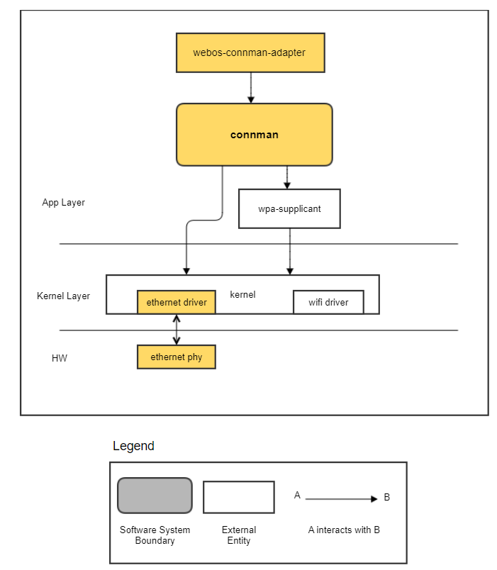
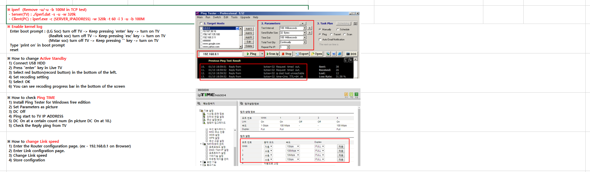
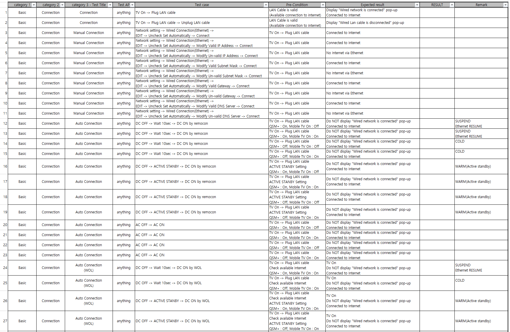
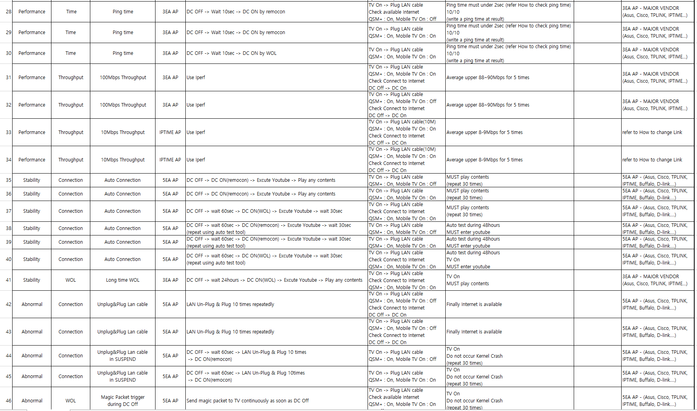
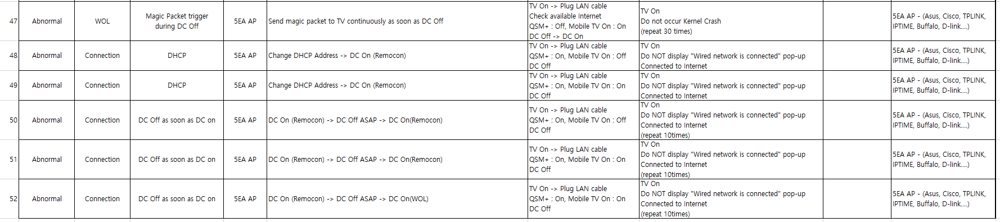

Ethernet
########

.. _byungkuk.kim: byungkuk.kim@lge.com

Introduction
************
| This document describes Ethernet driver in the kernel space. The document gives an overview of the Ethernet driver and provides details about its functionalities and implementation requirements.

Revision History
================

=============== =============== =================== ==================
Version         Date            Changed by          Description
=============== =============== =================== ==================
1.0             2023-11-24      `byungkuk.kim`_     First release
=============== =============== =================== ==================

Terminology
===========

| The key words "must", "must not", "required", "shall", "shall not", "should", "should not", "recommended", "may", and "optional" in this document are to be interpreted as described in RFC2119.
| The following table lists the terms used throughout this document:
=============== ===================
Term            Description
=============== ===================
connman         connection manager
WOL             Wake On Lan
=============== ===================

Technical Assistance
====================

| For assistance or clarification on information in this guide, please create an issue in the LGE JIRA project and contact the following person:

=============== ============
Module          Owner
=============== ============
Ethernet driver `byungkuk.kim`_
=============== ============

Overview
********

General Description
===================

| webOS TV uses the kernel standard for Ethernet function, which means there are no specific APIs requested by LGE.

| SoC vendors can implement the Ethernet device driver using general Linux and libnl, and they can verify it using general network Linux tools such as ethtool, ifconfig, and iperf.

| If SoC vendors successfully verify the Ethernet driver with ethtool and ifconfig, LGE uses the Ethernet driver with connman.

| In addition, there are some specific requests for webOS TV, such as Ethernet resume, which are describes Functional Requirement.

Architecture
============
| The Ethernet driver architecture shown in the figure below, is mainly divided into three layers app layer, kernel layer and hardware.

| The table below describes the responsibilities of each entity within the architecture diagram.

================================= ======================================
Entity                            Responsibility
================================= ======================================
webos-connman-adapter             Provides luna API to services that require setting app and network information.
ethernet driver                   When connecting to ethernet network, the kernel sends an event to connman through netlink.
kernel                            Load the Ethernet/WiFi driver on it.
================================= ======================================

| The table below describes the responsibilities of each relationship within the architecture diagram.

================================= ======================================
Relationships                     Responsibility
================================= ======================================
webos-connman-adapter -> connman  Request overall network information using Dbus to Connman.
connman -> kernel -> Ethernet     Request Ethernet network information using Dbus to Kernel.
================================= ======================================

Requirements
************
| This section describes the major functionalities of the Ethernet driver, as well as its operational flow and requirements.

Functional Requirements
=======================

| The functional requirements for the Ethernet module are as follows:

| 1) Ready to use eth0 interface on the kernel layer.

- You must provide the eth0 interface after booting up.
- You can check it using the ifconfig command.
- .. image:: resources/eth_ifconfig.png
    :width: 100%

| 2) WOL (Wake on LAN) - Vendors must support WOL mode

- The TV should turn on when it receives “Magic packet” during DC off status.
- If the driver enters isolation mode as soon as receiving a request, the driver needs to delay the action until the kernel suspend period in the case of QSM+ On. Please refer to figure and
  code below of M/W settings for WOL. (#define WAKE_MAGIC_SUSPEND (1 << 15))
- .. image:: resources/eth_wol_1.png
    :width: 100%
- .. image:: resources/eth_wol_2.png
    :width: 100%

| 3) Ethernet Resume

- In QSM+ On & Mobile TV On (WOL): On condition, the Ethernet link should be maintained. There should be no occurrence of disconnect -> connect behavior during DC off/on.
- No change LAN in suspend: Keep the eth0 link in resume.
- Plug out LAN in suspend: The eth0 link down in resume.
- Change to LAN from other router in suspend: The eth0 link down&up.

Quality and Constraints
=======================

This section lists the non-functional requirements such as performance,  quality requirements and design constraints.

Performance
-----------

| Throughput

- It should support 10/100Mbps Ethernet performance. We use the iperf tool for checking it. Refer to the Testing section below.

| Ethernet resume

- When the DC is on, Ethernet starts working within 2 secs. Refer to the Testing section below.

Implementation
**************

| SoC vendors can implement the Ethernet device driver using the standard Linux and libnl, and verify it using ethtool.

| There is no specific API, defined by LGE, because we use the kernel standard.

Testing
*******
| To test the implementation of the Ethernet driver, webOS provides SoCTS (SoC Test Suite) tests. 
| The SoCTS checks the basic operation of the Ethernet driver and verifies the kernel event operation for the module by using a test execution file. For details, see Ethernet's SoCTS Unit Test Manual.

Functions for ethernet's SoCTS Unit Test
========================================
| The following is a list of the ethernet functions tested by :doc:`SoCTS: </part4/socts/Documentation/source/producer-manual/producer-manual_common/producer-manual_option_ethernet>`

  * :c:macro:`LinkUpValid`
  * :c:macro:`WakeOnLanVaild`

| We provide verification TCs for Ethernet as follows:

References
**********
| For additional information on related standards or technical topics, refer to:

* `Netlink Library Page <https://www.infradead.org/~tgr/libnl/>`_