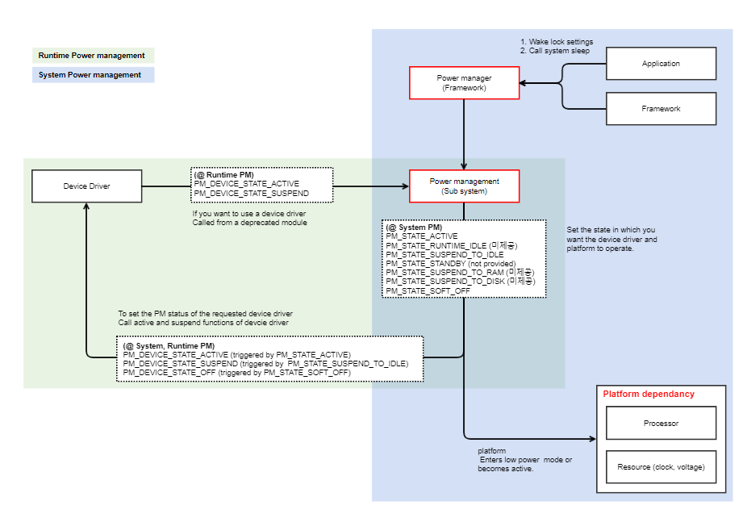

Runtimepm
#########

.. _rahul.bhosale: rahul.bhosale@lge.com

Introduction
************

| The device runtime power management (PM) framework is an active power management mechanism which reduces the overall system power consumption by suspending the devices which are idle or not used independently of the system state.

| The responsibility of runtime power management is to optimize and regulate the power consumption of a system or device while it is actively running. 

| This involves dynamically adjusting various hardware and software components to achieve a balance between performance and energy efficiency.

Revision History
================

=============== ============ =================== ================================
Version         Date         Changed by          Description
=============== ============ =================== ================================
1.0             2022.05.22   `rahul.bhosale`_     First release
1.1             2023-11-16   `rahul.bhosale`_     Second release
=============== ============ =================== ================================

Terminology
===========

| The key words "must", "must not", "required", "shall", "shall not", "should", "should not", "recommended", "may", and "optional" in this document are to be interpreted as described in RFC2119.

| The following table lists the terms used in the runtimepm module guide.

**webOS TV specific**

=================== ==========================================
Term                Description
=================== ==========================================
runtimepm           runtime power management.
DVFS                Dynamic Voltage and Frequency Scaling.
ALPM                Aggressive Link Power Management
=================== ==========================================

Technical Assistance
====================

For assistance or clarification on information in this guide, please create an issue in the LGE JIRA project and contact the following person:

=========== ===============================
Module      Owner
=========== ===============================
runtimepm   `rahul.bhosale`_
=========== ===============================

Overview
********

General Description
===================

| Runtime Power Management is a crucial aspect of system optimization that focuses on dynamically regulating and optimizing the power consumption of a device or system during its active operation.

| The primary goal of Runtime Power Management is to adapt the power usage of individual hardware and software components in real-time, aligning with the varying demands of the system workload.

| This involves employing a range of techniques, including adjusting processor frequencies, transitioning components between different power states, and selectively activating or deactivating peripherals based on their necessity.

| Runtime Power Management include Dynamic Voltage and Frequency Scaling (DVFS), which dynamically tunes the voltage and clock frequency of the processor to match the current processing requirements.

| Additionally, the management of idle states, clock gating, and peripheral power states play pivotal roles in minimizing power consumption during periods of inactivity.

Features
========

| The main function of the RuntimePM involves dynamically adjusting power usage to optimize energy efficiency during the operation of a system..

| The key features of the RuntimePM are as follows:

- Dynamic Voltage and Frequency Scaling (DVFS): :
    - Adjusting voltage and frequency based on the workload to balance performance and power consumption.
- CPU Idle States:
    - Putting the CPU into low-power states during idle periods to conserve energy.
- Device Power States:
    - Managing power states of peripheral devices, allowing them to enter low-power modes when not in use.
- Aggressive Link Power Management (ALPM):
    - Managing power states of communication links like PCIe to reduce power consumption during low activity.
- Wake Locks and Suspend Mechanisms:
    -  Controlling device wake-up and suspend states to minimize power usage during standby.

Architecture
============

This section describes the architecture of the RuntimePM module.

| Runtime PM is effective when the status of System PM is Active.

| What this means is that the device state will be turned on or off at runtime only when the system is operating normally.

| When the state of System PM is not Active, it changes to the device state linked to the System PM state. 

| System PM controls not only the device driver, but also the clock and voltage of the processor and chip platform.

| Resource control of the processor and chip platform must use the low power function provided by the chip manufacturer, so confirmation is required whenever the chip platform is changed.

| Power management is a function to reduce power consumption, which requires resource limitations (device driver off, clock, voltage off, etc.).

| Therefore, there are cases where resources are limited and abnormal operation occurs.

| To avoid this, we provide an interface that prevents resource limitations so that it can be used in applications, frameworks, and device drivers.

| The interface includes wake lock and busy flag.

Requirements
************

This section describes the functionalities of the runtimepm module in terms of the module's requirements and constraints.

Functional Requirements
=======================

The functional requirements for runtime power management include the followings:

1.Smart energy use.

2.Saving power when not busy.

3.CPU idle state.

4.Task Offloading.

5.Aggressive link power management.

6.System should efficiently manage wake locks and suspend/resume mechanism.

7.Avoiding overheating.

Quality and Constraints
=======================

This section lists the non-functional requirements for runtime power management, such as performance, quality requirements and design constraints.

Latency Constraints:
-------------------

1.The existing latency framework operates at a systemwide level and incorporates CPUidle and PM QoS for managing CPU_DMA_LATENCY.

2.Specific sleep and wakeup latencies tailored to individual devices are also necessary.

3.The power state of a device is directly linked to the desired latency.

4.To minimize wakeup latency, it is recommended to refrain from fully disabling hardware and to avoid utilizing deep power states.

Implementation
**************

| This section provides supplementary materials that are useful for runtime power management implementation.

- The File Location section provides the location of the Git repository from you can get the header files in which the interface for the runtime power management implementation is defined.
- The API List section provides a brief summary of runtime power management module.

File Location
=============
| The Git repository of the runtimepm module is available at `linuxtv-ext-header <https://wall.lge.com/admin/repos/bsp/ref/linuxtv-ext-header,general>`_ . This Git repository contains the header files for the runtimepm implementation as well as documentation for the runtimepm implementation guide.

API List
========

| This section describes what are API's & functions are used for runtimepm implementation.

Structure and Data Types:
-------------------------
**Standard power management domain structure**
  .. code-block:: cpp

      struct dev_pm_domain
      {
          struct dev_pm_ops       ops;
          int (*start)(struct device *dev);
          void (*detach)(struct device *dev, bool power_off);
          int (*activate)(struct device *dev);
          void (*sync)(struct device *dev);
          void (*dismiss)(struct device *dev);
          int (*set_performance_state)(struct device *dev, unsigned int state);
       };

- ops :
    - Power management operations associated with this domain.

- start
    - Called when a user needs to start the device via the domain.

- detach
    - Called when removing a device from the domain.

- activate
    - Called before executing probe routines for bus types and drivers.

- sync
    - Called after successful driver probe.

- dismiss
    - Called after unsuccessful driver probe and after driver removal.

- set_performance_state
    - Called to request a new performance state.

**Device Power Management callbacks**
    .. code-block:: cpp

       struct dev_pm_ops
       {
          int (*prepare)(struct device *dev);
          void (*complete)(struct device *dev);
          int (*suspend)(struct device *dev);
          int (*resume)(struct device *dev);
          int (*freeze)(struct device *dev);
          int (*thaw)(struct device *dev);
          int (*poweroff)(struct device *dev);
          int (*restore)(struct device *dev);
          int (*suspend_late)(struct device *dev);
          int (*resume_early)(struct device *dev);
          int (*freeze_late)(struct device *dev);
          int (*thaw_early)(struct device *dev);
          int (*poweroff_late)(struct device *dev);
          int (*restore_early)(struct device *dev);
          int (*suspend_noirq)(struct device *dev);
          int (*resume_noirq)(struct device *dev);
          int (*freeze_noirq)(struct device *dev);
          int (*thaw_noirq)(struct device *dev);
          int (*poweroff_noirq)(struct device *dev);
          int (*restore_noirq)(struct device *dev);
          int (*runtime_suspend)(struct device *dev);
          int (*runtime_resume)(struct device *dev);
          int (*runtime_idle)(struct device *dev);
       };

Functions
---------

=============================== ====================================================================================================================
Function                        Description
=============================== ====================================================================================================================
:func:`runtime_suspend`         Perform device-specific operations required to suspend the device and put it into a low-power state
:func:`runtime_resume`          Perform device-specific operations required to resume the device and bring it back to an active state.
:func:`runtime_idle`            Executed by the PM core for the bus type of given device whenever the device appears to be idle
=============================== ====================================================================================================================

Driver callbacks : 
******************

- All are optional 
- ->runtime_suspend()
    - Save context 
    - Power down HW 
- ->runtime_resume() 
    - Power up HW 
    - Restore context 
- ->runtime_idle()

API Description of Driver callbacks :
=====================================

runtime_suspend
^^^^^^^^^^^^^^^^
.. function:: runtime_suspend()

    **Description**
        - Describe the suspend operation for runtime power management of devices.
        - Perform device-specific operations required to suspend the device and put it into a low-power state.
        - This may include stopping data transfers, disabling interrupts, saving device state, and any other necessary actions to prepare the device for a power-saving mode.

    **Return Value**
        :c:func:`runtime_suspend()` return 0 indicate that suspend opration successful,if any error occur during suspend process,it will return appropriate error code.

runtime_resume
^^^^^^^^^^^^^^^
.. function:: runtime_resume()

    **Description**
        - Describe the resume operation for runtime power management of devices.
        - Perform device-specific operations required to resume the device and bring it back to an active state.
        - This may include restoring device state, enabling interrupts, starting data transfers, and any other necessary actions to bring the device back to its operational mode.

    **Return Value**
        :c:func:`runtime_resume()` return 0 indicate that resume opration successful,if any error occur during resume process,it will return appropriate error code.

runtime_idle
^^^^^^^^^^^^^
.. function:: runtime_idle()

    **Description**
        - Describe the idle operation for runtime power management of devices.
        - Executed by the PM core for the bus type of given device whenever the device appears to be idle.
        - Which indicated by the PM core by two counters, the device's usage counter and the counter of 'active' children of the device.

    **Return Value**
        :c:func:`runtime_idle()` return 0 indicate that resume opration successful,if any error occur during resume process,it will return appropriate error code.

Device Driver implementation:
*****************************
 - Probe 
    - pm_runtime_enable() 
    - probe/configure hardware 
    - pm_runtime_suspend()
 - Activity 
    - pm_runtime_get()
    - Do work 
    - pm_runtime_put() 
 - Done 
    - pm_runtime_suspend()

API Description of Device Driver :
==================================

pm_runtime_enable()
^^^^^^^^^^^^^^^^^
.. function:: pm_runtime_enable(struct device *dev)

    **Description**
        - This function will enable runtime PM on the given device. If the device is in PM_DEVICE_STATE_ACTIVE state, the device will be suspended.

    **Parameters**
        - dev – Device instance.

    **Return Value**
        :c:func:`pm_runtime_enable()` 
            - 0 – If the device runtime PM is enabled successfully.
            - EPERM – If device has power state locked.
            - ENOTSUP – If the device does not support PM.
            - ENOSYS – If the functionality is not available.
            - errno – Other negative errno, result of suspending the device.

pm_runtime_suspend()
^^^^^^^^^^^^^^^^^^^^

.. function:: pm_runtime_suspend(struct device *dev)

    **Description**
        - If the device is currently suspended it will be resumed.  

    **Parameters**
        - dev – Device instance.

    **Return Value**
        :c:func:`pm_runtime_suspend()` 
           - 0 – If the device runtime PM is disabled successfully.
           - ENOTSUP – If the device does not support PM.
           - ENOSYS – If the functionality is not available.
           - errno – Other negative errno, result of resuming the device.

pm_runtime_get()
^^^^^^^^^^^^^^^^

.. function:: pm_runtime_get(struct device *dev)

    **Description**
        - Resume a device based on usage count.
        - This function will resume the device if the device is suspended (usage count equal to 0). In case of a resume failure, usage count and device state will be left unchanged. In all other cases, usage count will be incremented.

    **Parameters**
        - dev – Device instance.

    **Return Value**
        :c:func:`pm_runtime_get()` 
           - 0 – If it succeeds. In case device runtime PM is not enabled or not available this function will be a no-op and will also return 0.
           - ENOTSUP – If the device does not support PM.
           - errno – Other negative errno, result of the PM action callback.

pm_runtime_put()
^^^^^^^^^^^^^^^^

.. function:: pm_runtime_put(struct device *dev)

    **Description**
        - Suspend a device based on usage count.
        - This function will suspend the device if the device is no longer required (usage count equal to 0). In case of suspend failure, usage count and device state will be left unchanged. In all other cases, usage count will be decremented (down to 0).

    **Parameters**
        - dev – Device instance.

    **Return Value**
        :c:func:`pm_runtime_put()` 
           - 0 – If it succeeds. In case device runtime PM is not enabled or not available this function will be a no-op and will also return 0.
           - ENOTSUP – If the device does not support PM.
           - EALREADY – If device is already suspended (can only happen if get/put calls are unbalanced).
           - errno – Other negative errno, result of the action callback.

Implementation Details :
========================

The below code snippet provides the information about:

1.Performing necessary operations to resume the device,like restoring device state, enabling interrupts, etc.

2.Performing necessary operations to suspend the device, like disabling interrupts, stopping data transfers, etc.

**Example**
    .. code-block:: c

       #include <linux/pm_runtime.h>

       static int device_runtime_resume(struct device *dev)
       {
          /* Perform necessary operations to resume the device */
          /* For example, restoring device state, enabling interrupts, etc. */

          /* Device-specific resume logic goes here */
        return 0;
       }

       static int device_runtime_suspend(struct device *dev)
       {
          /* Perform necessary operations to suspend the device */
          /* For example, disabling interrupts, stopping data transfers, etc. */

          /* Device-specific suspend logic goes here */
          return 0;
       }

       static struct dev_pm_ops device_pm_ops=
       {
           .suspend  = device_runtime_resume;
           .resume   = device_runtime_suspend;
       };

Debugging
*********

| This section provides debugging guide for runtime power management.

**1.Check the Always ready setting using below luna command:**

.. code-block:: cpp

    # luna-send -n 1 -f luna://com.webos.settingsservice/setSystemSettings '{ "category":"general", "settings":{"lifeOnScreenMode":"alwaysReady"}}'

**2.AC off/on**

**3.Set log level after booting**

**4.Wait about 1~2 minutes**

**5.Press power key to make TV always ready mode**

**6.Check alwaysready log per every 10 seconds**

**How to check the logs:**
=========================
    - All the devices should be suspended when TV is AlwaysReady mode.

    .. code-block:: cpp

        2021-07-08T06:10:15.592948Z [1305.079076516] user.debug alwaysready [] alwaysready DBGMSG {} getRuntimePmState(/sys/devices/platform/vscdev/power/runtime_status)(active)   → device is still running
        2021-07-08T06:10:15.593116Z [1305.079236627] user.debug alwaysready [] alwaysready DBGMSG {} getRuntimePmState(/sys/devices/platform/vscdev/power/runtime_status)(active)
        2021-07-08T06:10:15.593218Z [1305.079338479] user.debug alwaysready [] alwaysready DBGMSG {} getRuntimePmState(/sys/devices/platform/vscdev/power/runtime_status)(active)
        2021-07-08T06:10:15.593314Z [1305.079433516] user.debug alwaysready [] alwaysready DBGMSG {} getRuntimePmState(/sys/devices/platform/vpqdev/power/runtime_status)(suspended) → device is suspended(low power) successfully
        2021-07-08T06:10:15.593409Z [1305.079528331] user.debug alwaysready [] alwaysready DBGMSG {} getRuntimePmState(/sys/devices/platform/vscdev/power/runtime_status)(active)
        2021-07-08T06:10:15.593504Z [1305.079623849] user.debug alwaysready [] alwaysready DBGMSG {} getRuntimePmState(/sys/devices/platform/vscdev/power/runtime_status)(active)
        2021-07-08T06:10:15.593599Z [1305.079718775] user.debug alwaysready [] alwaysready DBGMSG {} getRuntimePmState(/sys/devices/platform/vfedev/power/runtime_status)(suspended)

**How to check device states**
==============================

    .. code-block:: cpp

           / # luna-send -n 1 -f luna://com.webos.service.alwaysready/monitor/getDeviceState '{}'
            {
                "returnValue": true,
                "state": {
                    "/sys/devices/platform/v4l2_vpq/power/runtime_status": "suspended",
                    "/sys/devices/platform/v4l2_gps/power/runtime_status": "suspended",
                    "/sys/devices/platform/v4l2_vbe/power/runtime_status": "suspended",
                    "/sys/devices/platform/v4l2_vt/power/runtime_status": "suspended",
                    "/sys/devices/platform/lg1k-te/power/runtime_status": "suspended",
                    "/sys/devices/platform/v4l2_lgsr/power/runtime_status": "suspended",
                    "/sys/devices/platform/venc/power/runtime_status": "suspended",
                    "/sys/devices/platform/lg1k-sys/power/runtime_status": "suspended",
                    "/sys/devices/platform/lg1k-fb/power/runtime_status": "suspended",
                    "/sys/devices/platform/v4l2_vsc/power/runtime_status": "suspended"
                }
            }

References
**********
* `https://www.kernel.org/doc/html/v5.4/driver-api/pm/devices.html`
* `http://collab.lge.com/main/display/PLATUP/Lower+Power+mode`
* `http://collab.lge.com/main/display/WEBOSDOCS/com.webos.service.config+v1.3#com.webos.service.configv1.3-getConfigs`
* `https://docs.swedishembedded.com/zephyr/services/pm/device.html#runtime-device-power-management`
