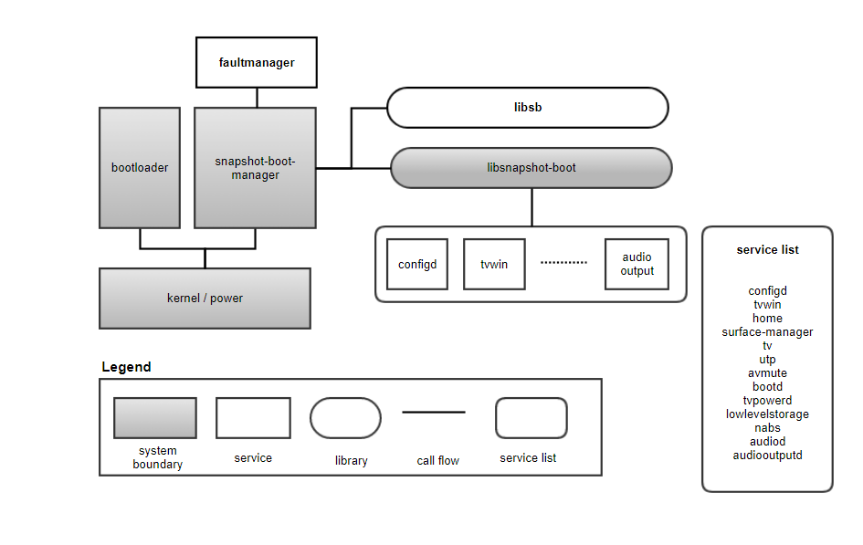
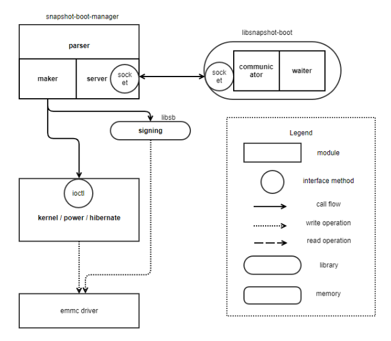
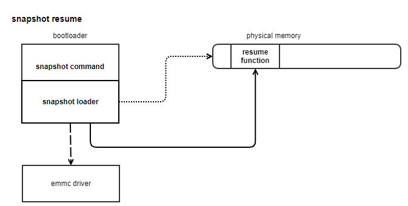
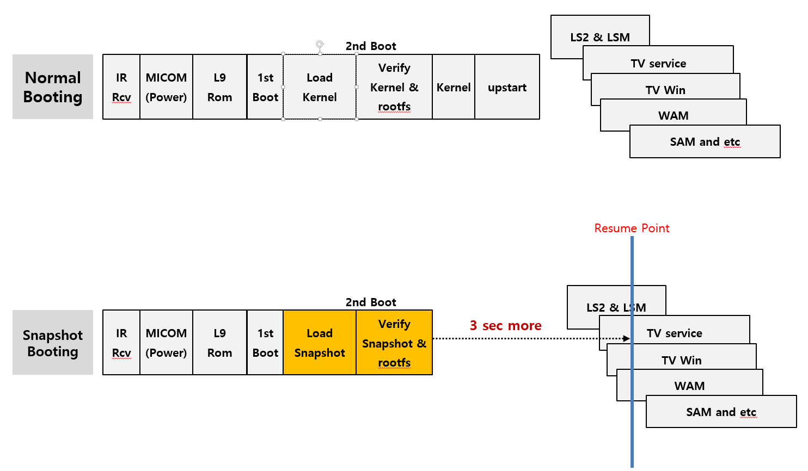
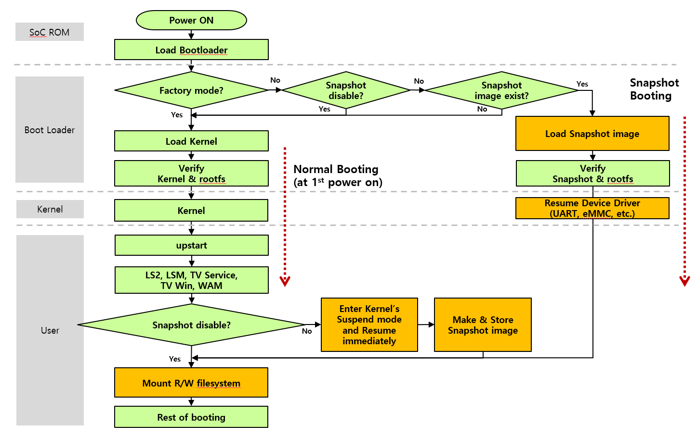

STD
####

Introduction
************

| This document describes the Suspend to disk (STD) module in the kernel space. This document gives an overview of the STD module and provides details about its functionalities and implementation requirements.

| Suspend to disk also known as hibernation, operating system has ability to save the current system (I.e TV) state to the disk before powering off. This allows for a faster boot-up when then device is turned back on, as it can resume from the saved state rather than starting from scratch.

| In webOS, this feature is typically used in devices like smart TVs and was designed to enhance user experience by reducing the time it takes for the device become operational after being powered down.

Revision History
================

=================== =========== =============== ===============
Version             Date        Changed by      Description
=================== =========== =============== ===============
1.0                 2023.02.05  `abhishek.p`    First release
1.1                 2023.11.13  `abhishek.p`    second release
=================== =========== =============== ===============

Terminology
===========

| The key words "must", "must not", "required", "shall", "shall not", "should", "should not", "recommended", "may", and "optional" in this document are to be interpreted as described in RFC2119.

| The following table lists the terms used in the STD module guide.

=================== ==========================================
Term                Description
=================== ==========================================
STD                 Suspend to Disk
eMMC                Embedded multimedia card
CPU                 Central processing unit
ACPI                Advanced configuration and power interface
OS                  Operating system
=================== ==========================================

Technical Assistance
====================

For assistance or clarification on information in this guide, please create an issue in the LGE JIRA project and contact the following person:

=========== ===============================
Module      Owner
=========== ===============================
STD         juno.choi@lge.com
=========== ===============================

Overview
********

General Description
===================

| When a device is turned off or restarted, the operating system typically has to go through a number of time-consuming processes to get the system up and running, such as checking hardware, initializing drivers, and loading system services. With snapshot boot, instead of starting from scratch, the system loads a saved snapshot of the operating system and application state from the previous session, allowing it to bypass some of the boot-up processes and start much faster.

| It saves the state of your system to the hard disk and completely powers off. When resuming, the saved state is restored to RAM.

| when hibernation is triggered, the kernel stops all system activity and creates a snapshot image of memory to be written into persistent storage (Hard disk). Next, the system goes into a state in which the snapshot image can be saved, the image is written out and finally the system goes into the target low-power state in which power is cut from almost all of its hardware components, including memory, except for a limited set of wakeup devices.

Features
========

| power saving : Suspend to disk is deeper power-saving mode compared to regular sleep mode. since the system is powered off, it consumes minimal power, making it suitable for conserving battery life of system.

| Boot time : Resuming from hibernation generally takes longer than waking up from sleep, as the system needs to reload the saved date from the hibernation file back into RAM.

| Quick-resume : When the device is powered back on, it can quickly resume to the exact state it was in before hibernation, providing a seamless user experience.

| Enhanced user experience : User can pick up right where they left off, without waiting for application to reload or losing any save data.

| Data integrity : Suspend to disk ensure data integrity by saving the system's memory contents to disk, preventing data loss in case of a power failure or unexpected shutdown.

| Automatic Hibernation : Depending on setting and power management, webOS device may automatically enter suspend to disk mode after a period of inactivity or when the battery level reaches a certain threshold.

Architecture
============

This section describes the architecture of the STD(Suspend to Disk) module interaction with other module.

| Hibernation process is managed by snapshot-boot-manger, bootloader, libsnapshot-boot.

| When running snapshot-boot-manager, Parser will parse the arguments to determine what action to take.

| Maker will request snapshot making to the kernel and manage image making operations by completing size and signing.

| First, when hibernation is triggered, the kernel stops all system activity and creates a snapshot image of memory to be written into persistent storage. 

| Next, the system goes into a state in which the snapshot image can be saved, the image is written out and finally the system goes into the target low-power state in which power is cut from almost all of its hardware components, including memory, except for a limited set of wakeup devices. 

| Once the snapshot image has been written out, the system may either enter a special low-power state, or it may simply power down itself. Powering down means minimum power draw and it allows this mechanism to work on any system. However, entering a special low-power state may allow additional means of system wakeup to be used.

| After wakeup, control goes to the platform firmware that runs a boot loader which boots a fresh instance of the kernel. That new instance of the kernel, looks for a hibernation image in persistent storage and if one is found, it is loaded into memory. 

| Next, all activity in the system is stopped and the restore kernel overwrites itself with the image contents and jumps into a special trampoline area in the original kernel stored in the image (referred to as the image kernel), which is where the special architecture-specific low-level code is needed. Finally, the image kernel restores the system to the pre-hibernation state and allows user space to run again.

Driver Architecture
-------------------

| The following diagram shows the snapshot making of the STD module where the STD module.

- Verifying system
    - Freeze process
    - Preallocate memory space

- Saving system state 
    - Device state (suspend)
    - Disable non-boot CPU
    - Core state

- Snapshotting memory state
    - copy snapshot image into memory.
    
- Restoring system state
    - core state
    - Enable non-boot CPU
    - Device state (resume)

- Writing snapshot image
    - copy image into eMMC
    - free pre-allocated memory space
    - Thaw process

| The following diagram shows the snapshot resume of the STD module.

- Restore snapshot image
    - copy snapshot image into memory.
    - Enable MMU

- Restore system state
    - Core state
    - Enable non-boot CPU
    - Free pre-allocated memory space
    - Device state (resume)

- Thaw process.

.. _Overall Snapshot boot description:

Overall flow
--------------

*Explanation*   
    - Here in 1st time boot system will check everything like loading the kernel and verifying the kernel & rootfs, then it starts all other services like LSM( Luna service manager), TV service, TV Win, Web & system app manager and if snapshot boot enable, all current state of system will be stored into the (hard disk).
    - Next boot (2nd) it restores current image (snapshot image) into RAM & start execution from saved state.
    - It increases boot-up speed.
    - In snapshot enable state, it will skip some boot up step like load kernel, verify kernel & service which already store in snapshot image

   
*Explanation*
    **SOC Rom** (Micom)
        - power on/off control and receive the IR key
    **Boot loader**
        - Device init
        - Boot logo
        - Verify apps
        - Read snapshot image
        - Decompress snapshot image
        - Verify snapshot image
        - Read the magic number from PM domain register to check it is cold boot or resume mode.
        - Load the resume address from PM domain register.
        - Apply the setting for resume mode and wake up kernel.
        - Jump to kernel.
    **Kernel** (include BSP drivers)   
        - Save/restore the register settings for suspend/resume mode.
        - Save the resume address into PM domain register.
        - Save the magic number into PM domain register to indicate it is STR mode.
        - Set the GPIO level to notify the external Micom to enter suspend mode.
        - Driver suspend/resume functionality.
    **Applications** (user process)
        - Save/restore the current status for suspend/resume mode.
        - Overall, the snapshot boot process in OS help to provide a faster & smoother user experience, by reducing the amount of the required for the system to start up & for application to load.

Requirements
************

This section describes the main functionalities of the STD  module in terms of the module's requirements and constraints.

Functional Requirements
=======================

The functional requirements for suspend to disk typically include

====== =============================
Sr.No   Functional Requirements
====== =============================
1       Data prevention
2       Fast recovery 
3       power management 
4       system state 
5       compatibility 
6       security
7       User interface integration
8       Reliability
====== =============================
 
Quality and Constraints
=======================

| This section lists the non-functional requirements for STD,  quality requirements and design constraints.

Compatibility issue
^^^^^^^^^^^^^^^^^^^

| some hardware configuration may not full support suspend-to-disk, leading to compatibility issue or system instability.

Driver compatibility
^^^^^^^^^^^^^^^^^^^^

| Incompatibility with certain device drivers can cause problems during the suspend & resume.

Kernel support
^^^^^^^^^^^^^^

| The Linux kernel or the OS kernel needs to properly support suspend-to-disk for it to work reliably.

System resource
^^^^^^^^^^^^^^^

| The system should have enough disk space to store the hibernation image, and there should be enough free RAM to save current state.

Implementation
**************

| This section provides supplementary materials that are useful for STD implementation.

- The File Location section provides the location of the Git repository where you can get the header files in which the interface for the STD implementation is defined.
- The API List section provides a brief summary of STD module.

File Location
=============
| The Git repository of the STD module is available at `linuxtv-ext-header <https://wall.lge.com/admin/repos/bsp/ref/linuxtv-ext-header,general>`_ . This Git repository contains the header files for the STD implementation as well as documentation for the STD implementation guide.

API List
========

| This section describes what are API's & functions are used for STD implementation.

Data types
----------

**standard platform device structure**
    .. code-block:: cpp

       struct platform_device
       {
          const char      *name;
          u32             id;
          struct device   dev;
          u32             num_resources;
       };

| Here,
|   name                 - name of the device, used for driver binding and identification.
|   id                   - instance id of the device, used to distinguish multiple devices of the same name.
|   dev                  - device structure associated with the platform bus.
|   num_resources        - number of resources that the device needs, such as memory regions, IRQs, etc.

**standard  device driver structure**
    .. code-block:: cpp

       struct device_driver driver
       {
          const char * name;
          struct bus_type * bus;
          struct module * owner;
          const char * mod_name;
          bool suppress_bind_attrs;
          enum probe_type probe_type;
          const struct of_device_id * of_match_table;
          const struct acpi_device_id * acpi_match_table;
          int (* probe) (struct device *dev);
          int (* remove) (struct device *dev);
          void (* shutdown) (struct device *dev);
          int (* suspend) (struct device *dev, pm_message_t state);
          int (* resume) (struct device *dev);
          const struct attribute_group ** groups;
          const struct dev_pm_ops * pm;
          struct driver_private * p;
       };

**standard Power Management callbacks structure**
    .. code-block:: cpp

       struct dev_pm_ops
       {
          int (*prepare)(struct device *dev);
          void (*complete)(struct device *dev);
          int (*suspend)(struct device *dev);
          int (*resume)(struct device *dev);
          int (*freeze)(struct device *dev);
          int (*thaw)(struct device *dev);
          int (*poweroff)(struct device *dev);
          int (*restore)(struct device *dev);
          int (*suspend_late)(struct device *dev);
          int (*resume_early)(struct device *dev);
          int (*freeze_late)(struct device *dev);
          int (*thaw_early)(struct device *dev);
          int (*poweroff_late)(struct device *dev);
          int (*restore_early)(struct device *dev);
          int (*suspend_noirq)(struct device *dev);
          int (*resume_noirq)(struct device *dev);
          int (*freeze_noirq)(struct device *dev);
          int (*thaw_noirq)(struct device *dev);
          int (*poweroff_noirq)(struct device *dev);
          int (*restore_noirq)(struct device *dev);
          int (*runtime_suspend)(struct device *dev);
          int (*runtime_resume)(struct device *dev);
          int (*runtime_idle)(struct device *dev);
       };

| Hibernating the system is more complicated than putting it into sleep states, because it involves creating and saving a system image. Therefore there are more phases for hibernation, with a different set of callbacks. These phases always run after tasks have been frozen and enough memory has been freed.

| The general procedure for hibernation is to freeze all devices ("freeze"), create an image of the system memory while everything is stable, reactivate all devices ("thaw"), write the image to permanent storage, and finally shut down the system ("power off").

Function
--------

==================================================== ===========================================================
Function                                             Description
==================================================== ===========================================================
:ref:`probe() <std_probe>`                           Determine if the device is compatible with the platform driver and register device with the kernel so that other parts of the system can use it.
:ref:`remove() <std_remove>`                         It is responsible for cleaning up any resources that were allocated by the probe() & unregistering the device from the kernel.
:ref:`suspend() <std_suspend>`                       This function is responsible for putting device into a low power state when the system is going into low power state.
:ref:`resume() <std_resume>`                         This function is called when the system resume from a sleep state, and it is responsible for restoring the device to previous operational state.              
:ref:`prepare() <std_prepare>`                       The prepare phase is meant to prevent races by preventing new devices from being registered
:ref:`freeze() <std_freeze>`                         It should quiesce the device so that it doesn't generate IRQs or DMA
:ref:`freeze_late() <std_freeze_late>`               For a number of devices it is convenient to split suspend into the "quiesce device" and "save device state" phases, in which cases freeze_late is meant to do the latter
:ref:`freeze_noirq() <std_freeze_noirq>`             This will happen after IRQ handlers have been disabled, which means that the driver's interrupt handler will not be called while the callback method is running.
:ref:`thaw_noirq() <std_thaw_noirq>`                 It should perform any actions needed before the driver's interrupt handlers are invoked.
:ref:`thaw_early() <std_thaw_early>`                 It should prepare devices for the execution of the thaw methods. It is a method that undo the actions of the preceding freeze_late, if necessary
:ref:`thaw() <std_thaw>`                             It should bring the device back to an operating state, so that it can be used for saving the image if necessary.
:ref:`complete() <std_complete>`                     The complete phase should undo the actions of the prepare phase. For this reason, unlike the other resume-related phases, during the complete phase the device hierarchy is traversed bottom-up.
==================================================== ===========================================================

Descriptions
--------------

.. _std_probe:

probe
^^^^^^^^^^^^^^
.. function:: probe()

    **Description**
        - Determine if the device is compatible with the platform driver.
        - Allocate & initialize any resource needed by the driver.
        - Register device with the kernel so that other parts of the system can use it.
        - When device is detected by the system, the platform driver's 'probe()'function is called.

    **Return Value**
        :c:func:`probe()` returns 0 on success. On error,``errno`` is set appropriately.
	    Possible error codes include:

        ``ENODEV``
        The device is not present or is not compatible with the platform driver.

        ``ENOMEM``
        Insufficient kernel memory was available.

        ``EIO``
        input/output error during initialization.

.. _std_remove:

remove
^^^^^^^^^^^^^
.. function:: remove()

    **Description**
        - It is responsible for cleaning up any resources that were allocated by the probe() & unregistering the device from the kernel.

    **Return Value**
	    :c:func:`remove()` returns on success zero is returned. On error, return negative value.

.. _std_resume:

resume
^^^^^^^^^^^^^
.. function:: resume()

    **Description**
        - This function is called when the system resume from a sleep state, and it is responsible for restoring the device to previous operational state.
        - When the system resumes, the 'resume()' function is called to bring the device back to the previous state.
        - Restore the device hardware register to their previous values.
        - Re-enable interrupt or other hardware features that were disabled before the system entered the sleep state.

.. _std_suspend:

suspend
^^^^^^^^^^^^^
.. function:: suspend()

    **Description**
        - This function is responsible for putting device into a low power state when the system is going into low power state.
        - When suspend or hibernation event occure,kernel send signal to all devices registered with the PM driver framwrork to enter a low power state.
        - save the current state of device.

.. _std_prepare:

prepare
^^^^^^^^^^^^^^
.. function:: prepare()

    **Description**
        - The prepare phase is meant to prevent races by preventing new devices from being registered
        - The method may also prepare the device or driver in some way for the upcoming system power transition, but it should not put the device into a low-power state.                       
        - After the prepare callback method returns, no new children may be registered below the device. 

.. _std_freeze:

freeze
^^^^^^^^^^^^^
.. function:: freeze()

    **Description**
        - It should quiesce the device so that it doesn't generate IRQs or DMA
        - They may need to save the values of device registers. However the device does not have to be put in a low-power state
        - The device should not be prepared to generate wakeup events.

.. _std_freeze_late:

freeze_late 
^^^^^^^^^^^^^
.. function:: freeze_late()

    **Description**
        - For a number of devices it is convenient to split suspend into the "quiesce device" and "save device state" phases, in which cases freeze_late is meant to do the latter
        - It is always executed after runtime power management has been disabled

.. _std_freeze_noirq:

freeze_noirq
^^^^^^^^^^^^^
.. function:: freeze_noirq()

    **Description**
        - This will happen after IRQ handlers have been disabled, which means that the driver's interrupt handler will not be called while the callback method is running.
        - It should save the values of the device's registers that weren't saved previously and the device should not be put into a low-power state and should not be allowed to generate wakeup events.      
        - At this point the system image is created. All devices should be inactive and the contents of memory should remain undisturbed while this happens, so that the image forms an atomic snapshot of the system state.

.. _std_thaw_noirq:

thaw_noirq
^^^^^^^^^^^^^
.. function:: thaw_noirq()

    **Description**
        - It should perform any actions needed before the driver's interrupt handlers are invoked.
        - If the bus type permits devices to share interrupt vectors, like PCI, the method should bring the device and its driver into a state in which the driver can recognize if the device is the source of incoming interrupts, if any, and handle them correctly.      
        - It can assume the device is in the same state as at the end of the freeze_noirq phase.

.. _std_thaw_early:

thaw_early
^^^^^^^^^^^^^
.. function:: thaw_early()

    **Description**
        - It should prepare devices for the execution of the thaw methods.
        - It is a method that undo the actions of the preceding freeze_late, if necessary

.. _std_thaw:

thaw 
^^^^^^^^^^^^^
.. function:: thaw()

    **Description**
        -It should bring the device back to an operating state, so that it can be used for saving the image if necessary.

.. _std_complete:

complete  
^^^^^^^^^^^^^
.. function:: complete()

    **Description**
        - The complete phase should undo the actions of the prepare phase. For this reason, unlike the other resume-related phases, during the complete phase the device hierarchy is traversed bottom-up.
        - New children may be registered below the device as soon as the resume callbacks occur; it's not necessary to wait until the complete phase runs.
        - At this point the system image is saved, and the devices then need to be prepared for the upcoming system shutdown. 

Implementation details
^^^^^^^^^^^^^^^^^^^^^^

**Example**
    .. code-block:: cpp

       #include<linux/module.h>
       #include<linux/kernel.h>
       #include<linux/platform_device.h>
       #include<linux/pm.h>

       static int std_probe(struct platform_device *pdev)
       {
           ........
           Allocate & initialize your device specific data structure.
           Set up power management callbacks
           ........
       }

       static int std_suspend(struct device *dev)
       {
           1. Verifying system
               Freeze processes                ie static int suspend_prepare(suspend_state_t state). freeze_processeses()
               Preallocate memory space        ie hibernate_preallocate_memory()
           2. Saving system states
               Device states (suspend)         ie pm_states_init()
               Disable non boot cpu            ie run sysrq poweroff on boot cpu
               Core states                     ie core_initcall()
           3. Snapshotting memory state
               Copy snapshot image to memory   ie rawdev_snapshot_write()
           4. Restore system state
               Core states
               Enable non boot cpu
               Device States(resume)
           5. Write snapshot image
               Copy memory image to eMMC       ie save_image_compress()
               Free preallocate memory space   ie preallocate_image_pages()
               Thaw Processes                  ie thaw_processes()
       }

       static int std_resume(struct device *dev)
       {
           1. Restore Snapshot Image
               Copy snapshot image to memory       ie rawdev_snapshot_write()
               Enable mmu
           2. Restore system states
               Core states                         ie core_initcall()
               Enable non boot cpu
               Free preallocate memory space
               Device states (resume)
       }

       static int std_remove(struct platform_device *pdev)
       {
           ........
           Deallocate & clean device specific data structure
           ........
       }

       static struct dev_pm_ops device_pm_ops=
       {
           .suspend  = std_suspend,
           .resume   = std_resume,
       };

       static struct platform_driver std_driver =
       {
           .probe          = std_probe,
           .remove         = std_remove,
           .driver         =
           {
               .name   = "snap_driver",
               .pm     = &pm_ops,
           },
       };

References
**********

* `https://www.kernel.org/doc/html/v5.4/driver-api/pm/devices.html`
