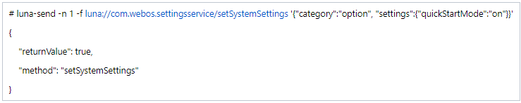
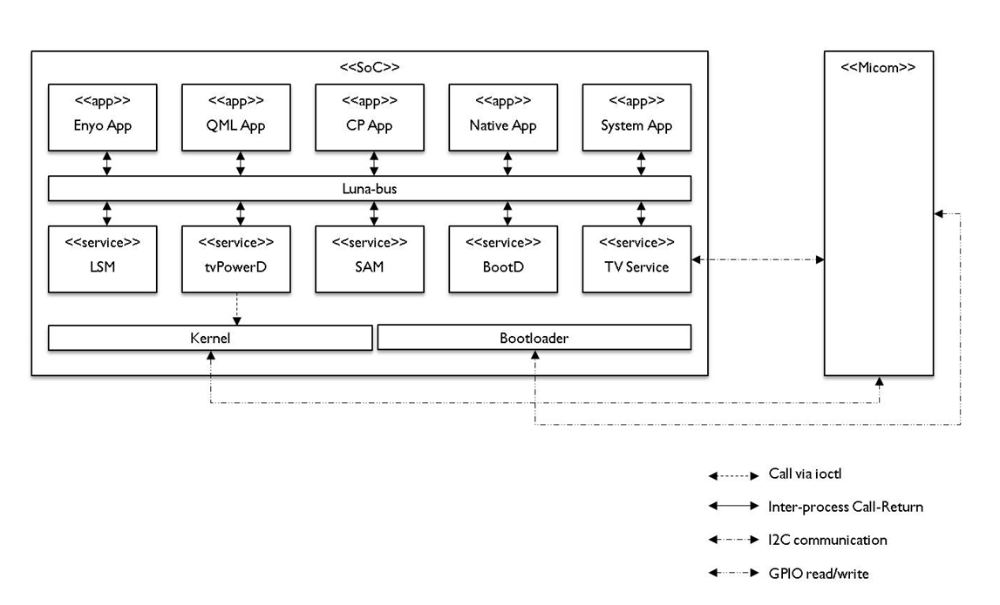
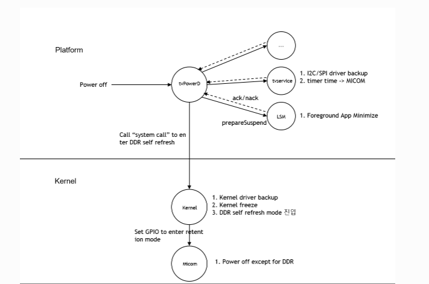

STR
####

.. _abhishek.p: abhishek.p@lge.com

Introduction
************

| This document describes the suspend to RAM (STR) module in the kernel space. This document gives an overview of the STR module and provides details about its functionalities and implementation requirements.

| Suspend to RAM is power-saving state where a TV content are stored (including apps data & setting) in RAM instead of being written to non-volatile storage.

| This allows the TV to quickly resume from a stored state, instead of full reboot.

| Resuming from STR is faster then a cold boot because the TV doesn't need to reload the entire operating system & applications.

| Generally it involves a combination of kernel-level support & user-space mechanism to save & restore the necessary information.

Revision History
================

=============== =============== =================== ================
Version         Date            Changed by          Description
=============== =============== =================== ================
1.0             2023.02.05      abhishek.p          First release
1.1             2023.11.13      abhishek.p          second release
=============== =============== =================== ================

Terminology
===========

The following table lists the terms used in the STR module guide.

=============================== =============================================
Definition                      Description
=============================== =============================================
QSM+				            Quick start mode
STR				                Suspend To Ram
DDR RAM			                Double data rate Random access memory
SOC				                System on Chip
OS                              Operating system
S2RAM                           Suspend to RAM
ACPI                            Advanced Configuration and Power Interface
=============================== =============================================

Technical Assistance
====================

For assistance or clarification on information in this guide, please create an issue in the LGE JIRA project and contact the following person

=============== ===================
Module          Owner
=============== ===================
STR             juno.choi@lge.com
=============== ===================

Overview
********

General Description
===================

| A technology provided by Kernel and DDR, commonly used as a term Suspend To Ram (STR), also called Instant boot at one time.

| Quick Start Mode is a feature in smart TV platform that enables the TV to turn on quickly and resume playback of content from the point where it was last stopped. 

| The main function of STR is a power-saving feature that allows a TV to enter a low-power state while keeping its current state in the RAM.

| When Quick Start Mode is enabled, the TV enters a low-power state instead of fully powering off, which allows it to start up quickly and resume playback without having to reload the operating system and applications.

Quick Start+ is a function that allows you to select the booting speed when TV DC Off -> On.
When Quick Start+ On, fast boot,
When Quick Start+ Off, normal boot.

| To start QSM from luna API

Features
========

| **Instant On** : Provides a near-instantaneous return to the previous state, enhancing the overall responsiveness of the device.

| **Quick Resumption** : Enables rapid startup as the system is not fully powered off, allowing users to resume their task almost instantly.

| **Power Efficiency** : Help conserve energy by minimizing power consumption during idle periods, contributing to longer battery life for devices like TV.

| **Background Update** : Allow the system to perform updates and maintenance task in the background while in a low-power state, ensuring that the device is up-to-date and optimized.

| **User Convenience** : Enhances user experience by eliminating the need to wait for a full system boot, promoting seamless and swift transitions between active & idle state.

| **Multitasking Efficiency** : Facilitates the prevention of system state, enable user to switch between applications without need to reload or reopen them.

Architecture
============

This section describes the architecture of the STR(Suspend to RAM) module interaction with other module.

| App/service involved in quick start in webOS. Basically, each app/service performs IPC communication through the luna bus, and communication with the kernel is also required for transition to suspend/resume. 

| Role of MICOM is important in quick start because MICOM triggers the entry and exit of quick start. 

| The components listed below move organically when turned on/off to determine the TV's power sequence. Of course, the components below are also used in quick start.

Element Responsibility
----------------------

| following are the element & responsibilities of each layer.
======================= ===================================================================================================================================================
Element                 Responsibility
======================= ===================================================================================================================================================
Enyo App                Enyo App is an app created with the Enyo framework of webOS and is a type of web app.
QML App                 QML App This is an app created with QML (Qt Markup Language) and operates as a single process like a native app,System apps mainly use QML
CP App                  A CP (contents provider) app that has existed since the Netcast era and includes web app and native app. For web apps, Enyo is not used.
Native App              Native App Apps that run as a standalone process include games and CP apps
System App              System App is an app that is included from the beginning when mass-produced and is made with Enyo, QML, etc. Updates are also possible.
LSM                     LSM Luna Surface Manager is responsible for window management and compositor functions. It also has a key manager and an AP with window focusing.
tvpwerd                 tvPowerD is a service that manages the power sequence of TV.
SAM                     System Application Manager manage the application life cycle.
BootD                   This is a module that manages the boot sequence and brings up a different boot sequence depending on the power state of tvPowerd.
TV service              This module performs broadcasting signal analysis, channel management, and input management.
======================= ===================================================================================================================================================

.. _Overall STR flow:

Suspend/Resume sequence of app/platform/kernel side
---------------------------------------------------

Explanation
-----------

    **Micom**
        - power on/off control and receive the IR key
        - All remote key value is defined.

    **Platform**
        - LSM(Luna surface Manager) : It will check for which key event is generated.
        - tvpowerD                  : It will handle TV activities like power_on, power_off, suspend etc. here callback_getpower_state(), setpower_state() etc.
        - settingservice            : It will check which service/method called from luna API like "QuickStartMode"

    **Kernel** (include BSP drivers)
        - Kernel freezing user space processes
        - It will call IP suspend function
        - Store CPU register & prepare suspend
        - DDR Ram self refresh & power off
        - The state in which DDR enters Self Refresh Mode by DC Off is called Suspend state, and Kernel, BSP, each Service, and App enter Suspend after completing necessary processes before entering Suspend state.   
        - The process of returning to life by DC On in the Suspend state is called Resume, and during Resume, the state information and data that were backed up before entering Suspend are restored.
        - It will handle all TV related activities.  ioctl call "LGIB_SUSPEND_TO_RAM" for suspend.
        - Send power off command to micom
 
    **Applications** (user process)
        - Save/restore the current status for suspend/resume mode.

Requirements
************

This section describes the main functionalities of the STR module in terms of the module's requirements and constraints.

Functional Requirements
=======================

1. **Compatibility** Ensure compatibility with hardware components, drivers, and the operating system for seamless functionality.

2. **State Preservation** Save the current state of the system, including the contents of RAM, to non-volatile storage.

3. **Quick Resumption** Enable a fast and efficient process to resume the system from the suspended state.

4. **Low Power Consumption** Enter a low-power state to reduce energy consumption while maintaining the system's current state.

5. **Customization** Allow users to configure suspend to RAM settings based on their preferences and requirements.

6. **Security** Implement security measures to protect the system during the suspend state and maintain data integrity.

7. **User Interaction** Allow for waking the system through user input, such as keyboard/mouse activity.

**Boot definition**
- Cold boot: Reboots after the power is completely turned off and does not maintain the previous state.
- Seamless boot: The previous functional state is maintained and can be used from the previous state during the next booting.

Quality 
=======

|**Fast Resumption**: Suspend to RAM allows for quick system resumption as it stores the system's current state in RAM, enabling a faster wake-up compared to a full reboot.

|**User-Friendly** : Users can quickly resume their work without need to save and close applications, providing seamless experience.

|**Silent Operation** : Suspend to RAM is generally silent, without need for spinning up hard drives or other components, contributing to a quieter user experience.

Constraints
===========

|**Limited Storage Capacity** : RAM is volatile memory, so it has limited capacity. Storing the entire system state in RAM may be challenging for system with large amount for data.

|**Power Dependency**: Suspend to RAM requires a continuous power supply to keep data in RAM. If battery depletes or there's power failure, data loss can occur.

|**Not suitable for Long-Term Storage**: Since RAM is volatile memory, it's not suitable for long-term storage of data. A power loss or system shutdown can result in data loss. 

Implementation
**************

| This section provides supplementary materials that are useful for STR implementation.

- The File Location section provides the location of the Git repository where you can get the header files in which the interface for the STR implementation is defined.
- The API List section provides a brief summary of STR module.

File Location
=============
| The Git repository of the STR module is available at `linuxtv-ext-header <https://wall.lge.com/admin/repos/bsp/ref/linuxtv-ext-header,general>`_ . This Git repository contains the header files for the STD implementation as well as documentation for the STD implementation guide.

API List
========
| This section describes what are API's & functions are used for STR implementation.

The data types and functions used in this module are as follows.

Data types
----------

**Platform devices are given a name ,id used in driver binding**
    .. code-block:: cpp

       struct platform_device
       {
           const char      *name;
           u32             id;
           struct device   dev;
           u32             num_resources;
       };

|   Here,
|      name     - name of the device, used for driver binding and identification.
|      id       - instance id of the device, used to distinguish multiple devices of the same name.
|      dev      - device structure associated with the platform bus.
|      num_resources - number of resources that the device needs, such as memory regions, IRQs, etc.

**The basic device driver structure**
    .. code-block:: cpp

       struct device_driver driver
       {
           const char * name;
           struct bus_type * bus;
           struct module * owner;
           const char * mod_name;
           bool suppress_bind_attrs;
           enum probe_type probe_type;
           const struct of_device_id * of_match_table;
           const struct acpi_device_id * acpi_match_table;
           int (* probe) (struct device *dev);
           int (* remove) (struct device *dev);
           void (* shutdown) (struct device *dev);
           int (* suspend) (struct device *dev, pm_message_t state);
           int (* resume) (struct device *dev);
           const struct attribute_group ** groups;
           const struct dev_pm_ops * pm;
           struct driver_private * p;
       };

**Device Power Management callbacks**
    .. code-block:: cpp

       struct dev_pm_ops
       {
           int (*prepare)(struct device *dev);
           void (*complete)(struct device *dev);
           int (*suspend)(struct device *dev);
           int (*resume)(struct device *dev);
           int (*freeze)(struct device *dev);
           int (*thaw)(struct device *dev);
           int (*poweroff)(struct device *dev);
           int (*restore)(struct device *dev);
           int (*suspend_late)(struct device *dev);
           int (*resume_early)(struct device *dev);
           int (*freeze_late)(struct device *dev);
           int (*thaw_early)(struct device *dev);
           int (*poweroff_late)(struct device *dev);
           int (*restore_early)(struct device *dev);
           int (*suspend_noirq)(struct device *dev);
           int (*resume_noirq)(struct device *dev);
           int (*freeze_noirq)(struct device *dev);
           int (*thaw_noirq)(struct device *dev);
           int (*poweroff_noirq)(struct device *dev);
           int (*restore_noirq)(struct device *dev);
       };

Function
--------

============================================ ===========================================================
Function                                     Description
============================================ ===========================================================
:ref:`probe() <str_probe>`                   Determine if the device is compatible with the platform driver and register device with the kernel so that other parts of the system can use it
:ref:`remove() <str_remove>`                 It is responsible for cleaning up any resources that were allocated by the probe() & unregistering the device from the kernel.
:ref:`suspend() <str_suspend>`               It save system state and suspend device
:ref:`resume() <str_resume>`                 It identify system state and restore, update system status
:ref:`freeze() <std_freeze>`                 It should quiesce the device so that it doesn't generate IRQs or DMA
:ref:`freeze_late() <std_freeze_late>`       For a number of devices it is convenient to split suspend into the "quiesce device" and "save device state" phases, in which cases freeze_late is meant to do the latter
:ref:`freeze_noirq() <std_freeze_noirq>`     This will happen after IRQ handlers have been disabled, which means that the driver's interrupt handler will not be called while the callback method is running.
:ref:`thaw_noirq() <std_thaw_noirq>`         It should perform any actions needed before the driver's interrupt handlers are invoked.
:ref:`thaw_early() <std_thaw_early>`         It should prepare devices for the execution of the thaw methods. It is a method that undo the actions of the preceding freeze_late, if necessary
:ref:`thaw() <std_thaw>`                     It should bring the device back to an operating state, so that it can be used for saving the image if necessary.
============================================ ===========================================================

Descriptions
--------------

.. _str_probe:

probe
^^^^^^^^^^^^^^
.. function:: probe()

    **Description**
        - Determine if the device is compatible with the platform driver.
        - Allocate & initialize any resource needed by the driver.
        - Register device with the kernel so that other parts of the system can use it.
        - When device is detected by the system, the platform driver's 'probe()'function is called.

    **Return Value**
        :c:func:`probe()` returns 0 on success. On error,``errno`` is set appropriately.
	    Possible error codes include:

        ``ENODEV``
        The device is not present or is not compatible with the platform driver.

        ``ENOMEM``
        Insufficient kernel memory was available.

        ``EIO``
        input/output error during initialization.

.. _str_remove:

remove
^^^^^^^^^^^^^
.. function:: remove()

    **Description**
        - It is responsible for cleaning up any resources that were allocated by the probe() & unregistering the device from the kernel.

    **Return Value**
	    :c:func:`remove()` returns on success zero is returned. On error, return negative value.

.. _str_resume:

resume
^^^^^^^^^^^^^
.. function:: resume()

    **Description**
        - identify system state.
        - Restore system state : this will typically involve setting HW register.
        - Restore device
        - Handle any error during resume process.
        - Update system status.

.. _str_suspend:

suspend
^^^^^^^^^^^^^
.. function:: suspend()

    **Description**
        - Save system state.
        - suspend device
        - Enter suspend state

.. _std_freeze:

freeze
^^^^^^^^^^^^^
.. function:: freeze()

    **Description**
        - It should quiesce the device so that it doesn't generate IRQs or DMA
        - They may need to save the values of device registers. However the device does not have to be put in a low-power state
        - The device should not be prepared to generate wakeup events.

.. _std_freeze_late:

freeze_late 
^^^^^^^^^^^^^
.. function:: freeze_late()

    **Description**
        - For a number of devices it is convenient to split suspend into the "quiesce device" and "save device state" phases, in which cases freeze_late is meant to do the latter
        - It is always executed after runtime power management has been disabled

.. _std_freeze_noirq:

freeze_noirq
^^^^^^^^^^^^^
.. function:: freeze_noirq()

    **Description**
        - This will happen after IRQ handlers have been disabled, which means that the driver's interrupt handler will not be called while the callback method is running.
        - It should save the values of the device's registers that weren't saved previously and the device should not be put into a low-power state and should not be allowed to generate wakeup events.      
        - At this point the system image is created. All devices should be inactive and the contents of memory should remain undisturbed while this happens, so that the image forms an atomic snapshot of the system state.

.. _std_thaw_noirq:

thaw_noirq
^^^^^^^^^^^^^
.. function:: thaw_noirq()

    **Description**
        - It should perform any actions needed before the driver's interrupt handlers are invoked.
        -  If the bus type permits devices to share interrupt vectors, like PCI, the method should bring the device and its driver into a state in which the driver can recognize if the device is the source of incoming interrupts, if any, and handle them correctly.      
        - It can assume the device is in the same state as at the end of the freeze_noirq phase.

.. _std_thaw_early:

thaw_early
^^^^^^^^^^^^^
.. function:: thaw_early()

    **Description**
        - It should prepare devices for the execution of the thaw methods.
        - It is a method that undo the actions of the preceding freeze_late, if necessary

.. _std_thaw:

thaw 
^^^^^^^^^^^^^
.. function:: thaw()

    **Description**
        -It should bring the device back to an operating state, so that it can be used for saving the image if necessary.

**Example**
    .. code-block:: cpp

       #include<linux/module.h>
       #include<linux/kernel.h>
       #include<linux/platform_device.h>
       #include<linux/pm.h>

       static int str_probe(struct platform_device *pdev)
       {
           ........
           Allocate & initialize your device specific data structure.
           Set up power management callbacks
           ........
       }

       static int prepare_suspend(struct device *dev)
       {
           1. Kernel PM core (sys sync,suspend notifier, freeze processes)
           2. call IP HW suspend functions.
           3. Save CPU registers (Co-processor, GIC, MMU, CPU register)
           4. Set resume address &  magic number to register.
           5. Set DDR ram to self refresh mode & power off
           6. Send power command (GPIO0) to micom and into infinite loop
       }

       static int prepare_resume(struct device *dev)
       {
           1. Back from resume address & restore CPU registers (Co-processor, GIC, MMU, CPU register)
           2. call IP HW resume functions.
           3. Kernel PM core (restart processes, resume notifier ...)
       }

       static int str_remove(struct platform_device *pdev)
       {
           ........
           Deallocate & clean device specific data structure
           ........
       }

       static struct dev_pm_ops device_pm_ops=
       {
           .suspend  = prepare_suspend,
           .resume   = prepare_resume,
       };

       static struct platform_driver qsm_driver =
       {
           .probe          = str_probe,
           .remove         = str_remove,
           .driver         =
           {
               .name   = "qsm",
               .pm     = &pm_ops,
           },
       };

References
**********
* `https://www.kernel.org/doc/html/v5.4/driver-api/pm/devices.html`
