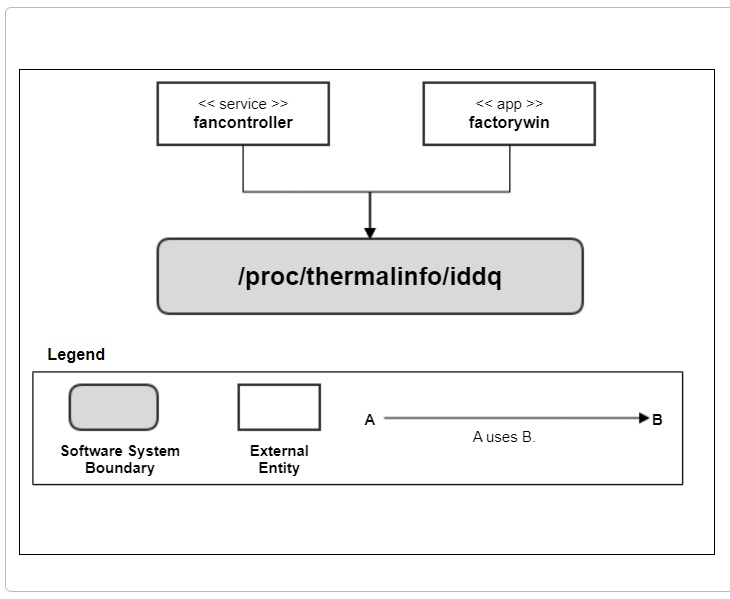
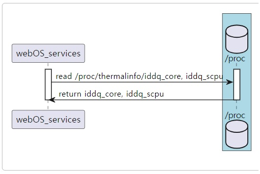

Iddq
###########

.. _kwangseok.kim: kwangseok.kim@lge.com

Introduction
************

|  This document describes the Iddq driver for the webOS. The document gives an overview of the Iddq driver and provides details about its functionalities and implementation requirements.
|  The Iddq information interface is based on the proc filesystem file. Therefore, the document assumes that the readers are familiar with the each functionality.
|  The Iddq is responsible for getting Iddq values of core and CPU.

Revision History
================

======= ========== ===================== ======================
Version  Date        Changed by          Description
======= ========== ===================== ======================
1.0.0   2023.11.16   `kwangseok.kim`_    First release
======= ========== ===================== ======================

Terminology
===========

================= ==================================================
Definition                Description
================= ==================================================
Iddq               The supply current (Idd) in the quiescent state
================= ==================================================

Technical Assistance
====================
|  For assistance or clarification on information in this guide, please create an issue in the LGE JIRA project and contact the following person:

================= ============================
Module             Owner
================= ============================
Iddq                `kwangseok.kim`_
================= ============================

Overview
********

General Description
===================

|  The Iddq driver supports getting information on SoC core and CPU Iddq values.
|  The main features provided is:
- Getting core and CPU Iddq values
    - Iddq testing is a method for testing CMOS integrated circuits for the presence of manufacturing faults. It relies on measuring the supply current (Idd) in the quiescent state (when the circuit is not switching and inputs are held at static values). The current consumed in the state is commonly called Iddq for Idd (quiescent) and hence the name.
    - These values are displayed in the instart menu which is used in the factory.
    - We can use these values to determine wherther the SoC chip has normal Iddq value or not.

Architecture
============

|  The following diagram shows the system context of getting the iddq values of core and cpu. Through this system context, external entities are identified and the system boundary is clarified.

========================= ====================================================================================================
Entity                    Responsibility
========================= ====================================================================================================
<<service>> fancontroller The Iddq file is read from the proc file system and provided where necessary.
<<app>> factorywin        The Iddq file is read from the proc file system and displayed in the instart menu.
========================= ====================================================================================================

======================================= ====================================================================================================
Relationships                           Responsibility
======================================= ====================================================================================================
factorywin -> /proc/thermalinfo/iddq    In order to output Iddq information to the instart menu, /proc/thermalinfo/iddq related files are read.
fancontroller -> /proc/thermalinfo/iddq To output iddq information to noraml log, /proc/thermalinfo/iddq related files are read.
======================================= ====================================================================================================

Overal Workflow
===============

|  The following diragram shows the sequence of getting the Iddq values.

Requirements
************

|  This section describes the main functionalities of the Iddq driver in terms of the module's requirements and constraints.

Functional Requirments
======================

|  The Driver must provide the Iddq value
- Iddq for core and CPU

**Simple scenario**

|  The webOS platform will request the iddq values to the driver and the driver will provide them.
|  The webOS platform will show the iddq values with OSD, just like instart-menu.

**Interface requirements**

| output data : Iddq values for core and CPU
| Iddq file in proc filesystem

::

 core iddq path : /proc/thermalinfo/iddq_core
 cpu iddq path : /proc/thermalinfo/iddq_scpu (file name is scpu not cpu.)
 The iddq_core and iddq_scpu have only integer data.

Quality and Constraints
=======================

Performance Requirements
------------------------

|  It should return within 100ms, if there are no special reasons.

Implementation
**************

File Location
=============

|  The Git repository of the iddq driver is available at bsp kernel driver.

API List
========

|  The data types and functions used in this module are as follows.

Functions
---------

| The webOS platform will call standard api for reading a file.

Testing
*******
|  To test the implementation of the Iddq driver, webOS TV provides BIT tests. The BIT checks the basic operations of the Iddq driver and verifies it.

