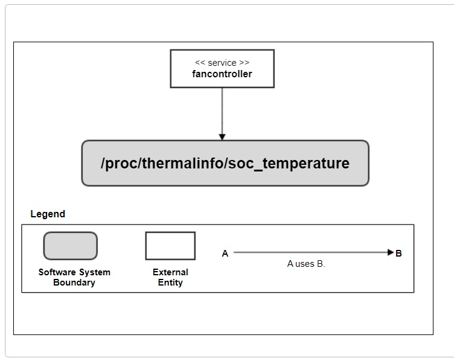
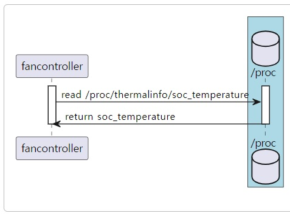

SoC Temperature
###############

.. _kwangseok.kim: kwangseok.kim@lge.com

Introduction
************

|  This document describes SoC Temperature driver (hereafter referred to as soc-temperature) for the webOS. The document gives an overview of the soc_temperature driver and provides details about its functionalities and implementation requirements.
|  The soc_temperature interface is based on the proc filesystem file. Therefore, the document assumes that the readers are familiar with the each functionality.
|  The soc_temperature is responsible for getting SoC temperature value.

Revision History
================

======= ========== ===================== ======================
Version  Date        Changed by          Description
======= ========== ===================== ======================
1.0.0   2023.11.16   `kwangseok.kim`_    First release
======= ========== ===================== ======================

Terminology
===========

================= ==================================================
Definition                Description
================= ==================================================
SoC               System on Chip
================= ==================================================

Technical Assistance
====================
|  For assistance or clarification on information in this guide, please create an issue in the LGE JIRA project and contact the following person:

================= ============================
Module             Owner
================= ============================
soc_temperature    `kwangseok.kim`_
================= ============================

Overview
********

General Description
===================

|  The soc_temperature driver supports getting information on SoC temperature value.
|  The main feature provided is:
- Getting SoC temperature
    - The webOS platform monitors the SoC temperature if there is abnormal SoC temperature or not.

Architecture
============

|  The following diagram shows the system context of getting the SoC temperature value. Through this system context, external entities are identified and the system boundary is clarified.

========================= ====================================================================================================
Entity                    Responsibility
========================= ====================================================================================================
<<service>> fancontroller The soc_temperature file is read from the proc file system and provided where necessary.
========================= ====================================================================================================

================================================== ====================================================================================================
Relationships                                      Responsibility
================================================== ====================================================================================================
fancontroller -> /proc/thermalinfo/soc_temperature The /proc/thermalinfo/soc_temperature file is read to output soc_temperature information to noraml log.
================================================== ====================================================================================================

Overal Workflow
===============

|  The following diagram shows the sequence of getting the soc_temperarue

Requirements
************

|  This section describes the main functionalities of the soc_temperature driver in terms of the module's requirements and constraints.

Functional Requirments
======================

|  The driver must provides the current SoC temperature.
|  The unit of temperature should be Celsius, not Fahrenheit.

**Simple scenario**

|  The webOS platform will request current SoC temperature to the driver and the driver will provide the temperature.
|  The webOS platform will save the SoC temperature values into normal log for field product monitoring.

**Interface requirements**

| output data : current temperature
| soc_temperature file in proc filesystem

::

 path : /proc/thermalinfo/soc_temperature
 degree data : fill the only temperature data in that file, soc_temperature.

Quality and Constraints
=======================

Performance Requirements
------------------------

|  It should return within 100ms, if there are no special reasons.

Implementation
**************

File Location
=============

|  The Git repository of the soc_temperature driver is available at BSP kernel driver.

API List
========

|  The data types and functions used in this module are as follows.

Functions
---------

| The webOS platform will call standard api for file read.

Testing
*******
|  To test the implementation of the soc_temperature driver, webOS TV provides BIT tests. The BIT checks the basic operations of the soc_temperature driver and verifies it.

