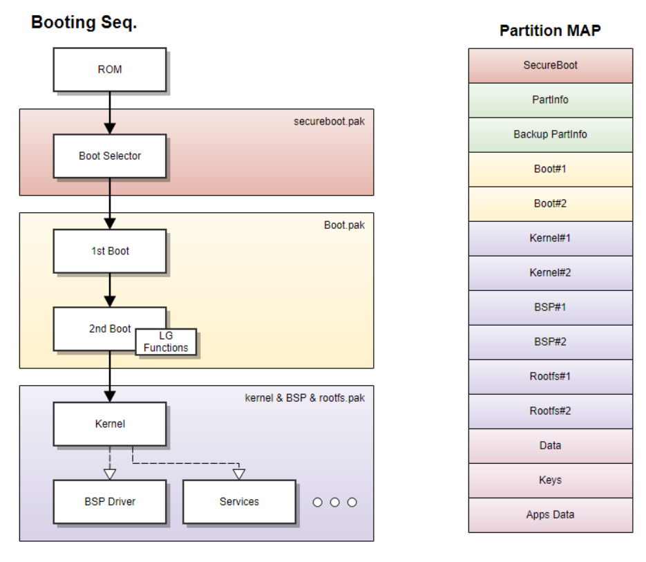
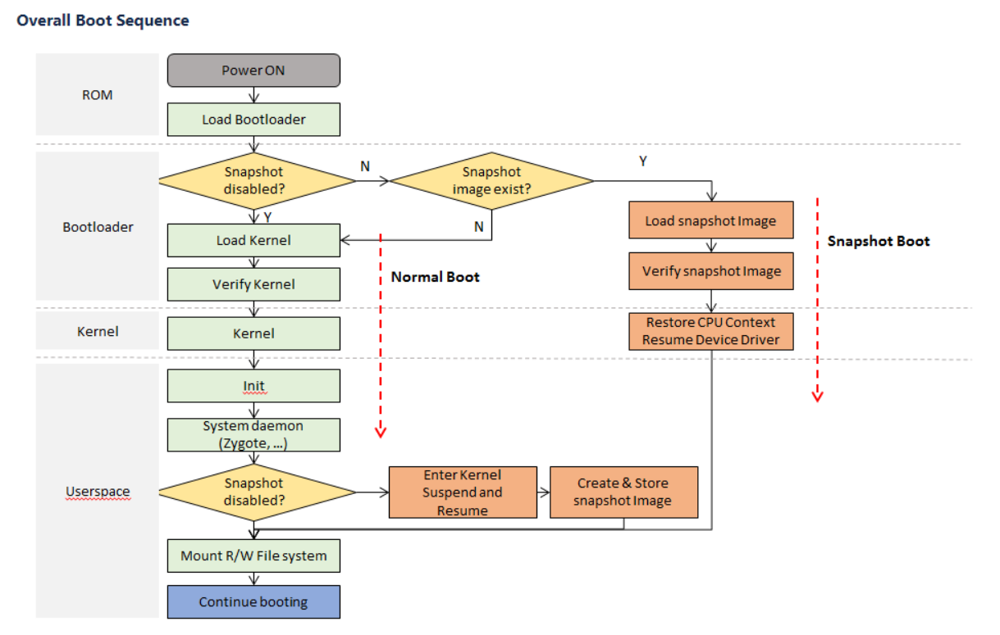
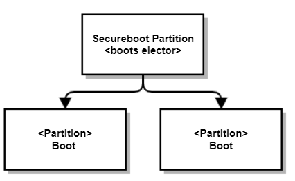
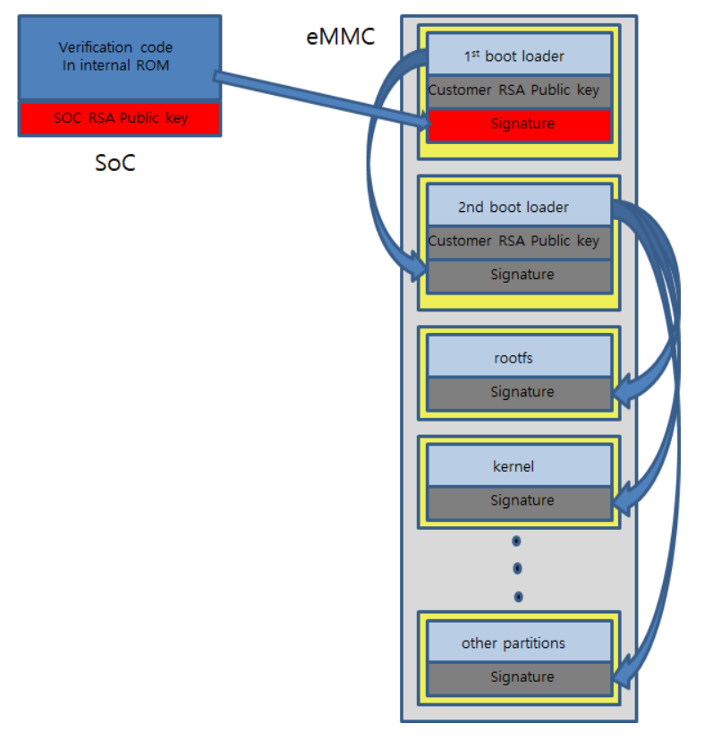
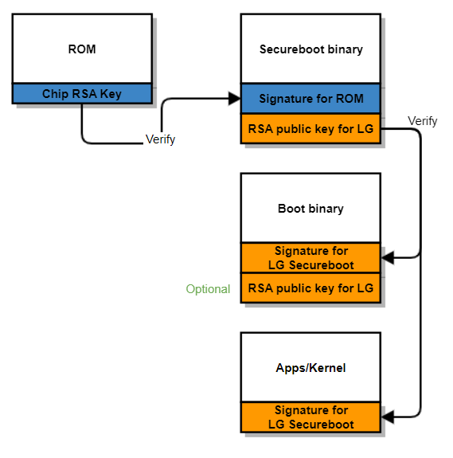
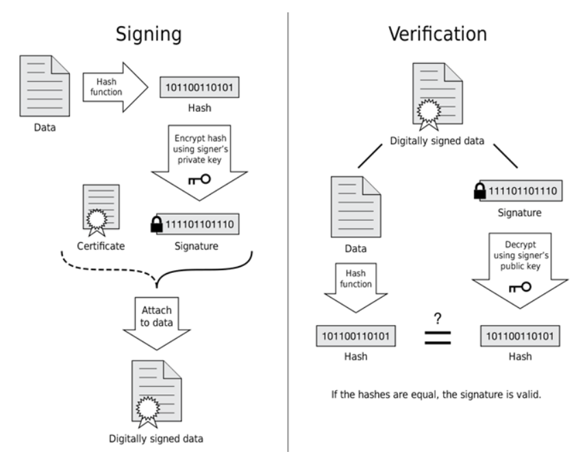
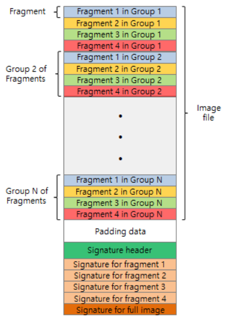
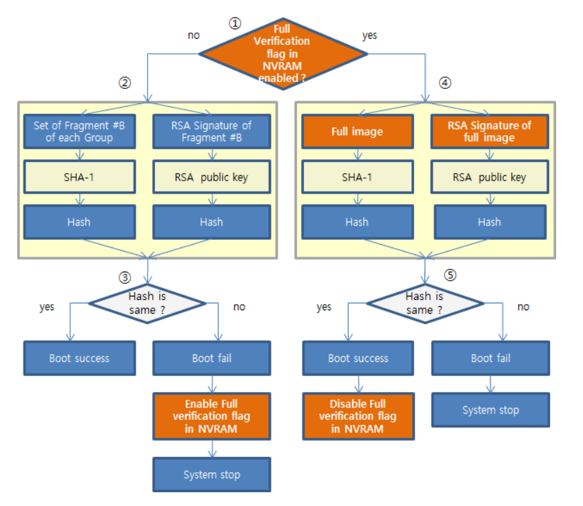
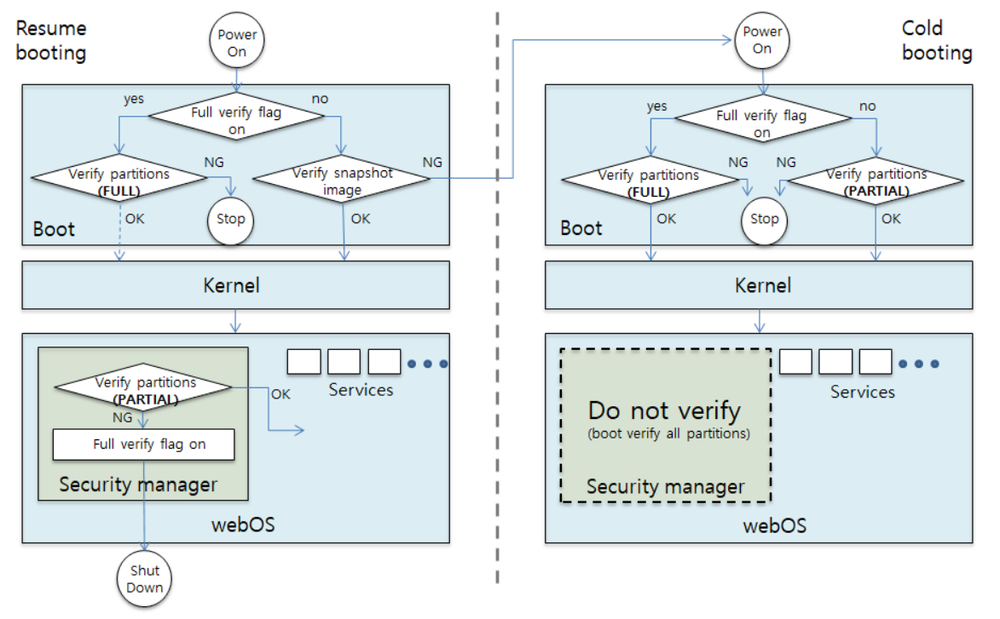

Bootloader
##########

.. contents:: Table of Contents
   :depth: 2
   :local: 

Overview
********

The boot loader in the BSP (called bootloader) is responsible for initializing hardware components and bringing up the kernel on the webOS TV device. When initiating a booting process, a small piece of code in the device ROM is executed to initialize the system operation and pass execution to the kernel.

The bootloader and partitions are closely linked in the execution of the booting process. The bootloader must be configured to correctly locate necessary partitions to fetch required images and data over the course of the booting process. The Partition Policy section provides information about the partition map and the role of each partition in the map. 

webOS TV's bootloader is built upon `u-boot <https://docs.u-boot.org/en/latest/>`_, an open-source project for developing a bootloader for embedded devices. the reference source code of the bootloader is open to the public through the `LG Open Source site <https://opensource.lge.com/>`_. See Reference Code for more information. 

Since the design concept and the required role of the bootloader loader are almost the same across all SoC chips, vendors can implement the bootloader upon their existing implementation and add some webOS TV specific features to it. 

Booting Sequence
****************

The bootloader is stored in the SoC's internal ROM memory. There are 2 other layers for the bootloader: the secureboot layer for the boot selector (secureboot.pak) and the boot layer for the 1st boot and 2nd boot (boot.pak).

* ROM: The bootloader code in the ROM is responsible for configuring chip settings and providing secure functions. 
* Boot Selector Layer (secureboot.pak): The Boot Selector is implemented in this area. (This does not include implementation for the secure boot functionality. Dont' be mislead by the partition name, secureboot.pak.) The Boot Selector makes sure that only the verified image is loaded into the memory during the booting process.
* Boot Layer (boot.pak): This layer consists of the 1st boot and 2nd boot areas.
    * 1st Boot: The 1st boot sets up chip functions to prepare the boot environment and then jumps to the 2nd boot.
    * 2nd Boot: The 2nd boot is built upon the u-boot implementation and sets up main PCB-related functions. This 2nd boot includes webOS TV specific features (informally, this code is called LG codes or LG functions). The 2nd boot has a boot mode that can control the boot environment, security functions, and external devices such as eMMC and NVM.

The 2nd boot is often called the "boot" part of the webOS TV BSP, since webOS TV specific bootloader features are included in it. These features may not be available as source code but provided as a library since they contain some confidential information. 

The following diagram shows the booting sequence.

* ROM: When the device is powered on, the code in the ROM memory is executed to load the bootloader. 
* Boot Selector: The Boot Selector makes sure only the trusted and properly signed image gets loaded in order to protect the system from unauthorized or malicious accesses. This code is executed from the secureboot.pak partition.
* 1st Boot: The 1st boot performs a test to verify the RSA signature of the image that was appended to the bootloader image from the verification code stored in the ROM memory. This code is executed from the Boot#1 partition.
* 2nd Boot: The 2nd boot sets up the boot environment. It prepares the rootfs and loads the kernel either through a normal boot or a snapshot boot. When loading the kernel, it passes information about the rootfs as well as information about the hardware configuration of the device to the kernel. The implementation of the 2nd boot is based on u-boot and contains webOS TV specific bootloader features. This code is executed from the Boot#2 partition. 

The following diagram shows the overall boot sequence of the normal boot and the snapshot boot:

If the snapshot function is disabled or the snapshot image doesn't exist, the bootloader follows the normal boot sequence. In the normal boot, the bootloader loads the kernel image and then verifies the authenticity of the loaded kernel. Then the execution is passed to the loaded kernel.

If the snapshot function is enabled and the snapshot image exists, then the bootloader loads the snapshot image and verifies its authenticity. Then the execution is passed to the loaded snapshot image whether the kernel resumes the system from the saved system states.

In the normal boot and the snapshot boot, ATF and OPTEE provide security functions to make sure the system runs in a trusted environment. This is out of the scope of this document and thus won't be discussed in this guide.

a. Normal Boot
1st boot ---> ATF ---> OPTEE ---> ATF ---> u-boot --> ATF ---> kernel
b. Snapshot Boot
1st boot ---> ATF ---> OPTEE ---> ATF ---> u-boot --> ATF ---> snapshot

\* Details about ATF(Arm Trusted Firmware) with OPTEE are not covered on this page. LG Security team is in charge of OPTEE.

Partition Policy
****************

webOS TV has a partition layout to configure the TV SW binary. In general, for partitions that require an SW update, there exist two partitions in pairs so that they can be exchanged or switched during the SW update. Other data or key-related partitions do not swap (no update), and such partitions must be changed once they have been mounted on the system.

The size of each partition is determined at the beginning stage of development and the left-over space can be used for the user space. The overall partition map size depends on the eMMC memory size.

In the boot mode, the ``partinfo`` command, which is used for displaying information about the partition map, can modify the properties of an individual partition. For example, one can modify the used / unused flag to swap the partition image.

.. warning::

    The modified partition information is discarded if the changes you made are not saved.

The partition map is used in every layer of the software entities of webOS TV. See the following table for how the map is used in each entity:

.. list-table:: 
   :header-rows: 1

   * - Entity
     - Responsibility
   * - Kernel
     - The kernel refers to the partition map to prepare the boot environment such as mounting the rootfs.
   * - OE build
     - In the OE build process, the partition map is used to generate SW images.
   * - Boot Mode
     - In the boot mode, the partition map is used to perform the SW update and execute the booting process.
   * - Update Engine
     - The SW update feature refers to the partition map to perform the SW update of images.

Partition Map
=============

The partition map shows information about each partition in the system. See the following description for details about partition info.

An entry in the partition map or information about a partition is given in the following format: 

.. code-block:: 

    [ 0] "secureboot " : 0x000000000-0x000100000 (0x000100000) FM--- : "secureboot.bin "[0000016384] - 0x00000000 : (U/V) [ 1%]

.. list-table:: 
   :header-rows: 1

   * - Field
     - Description
     - Example
   * - [ ]
     - index of the partition
     - ``[ 0]``
   * - "xxxxxxxx"
     - partition name
     - ``"secureboot "``
   * - 0x0000 - 0x0000
     - start offset - end offset 
     - ``0x000000000-0x000100000``
   * - (0x000)
     - partition size
     - ``(0x000100000)``
   * - FMID
     - Options (F: Fixed, M: Master, I: IDKEY, D: DATA )
        * F: fixed partition
        * M: master partition (see the offset or dual partition) 
        * I: DRM, secure key
        * D: RW partition for data
     - ``FM---``
   * - "xxxx.bin"
     - binary file name
     - ``"secureboot.bin "``
   * - \[00000 ]
     - binary size
     - ``[0000016384]``
   * - 0x00000
     - binary version
     - ``0x00000000``
   * - U/u
     - U: Used, u: unused
     - ``(U/V)``
   * - V/v
     - V: Valid, v: invalid
     - ``(U/V)``
   * - [ %]
     - memory usage
     - ``[ 1%]``

Required Partitions
===================

Vendors must provide the following partitions to ensure proper operation of the software components.

As for webOS 5.0 K6Hp, the following partitions must exist in the partition list. The duplicated entries in the list mean they are a backup partition.

* secureboot, partinfo, mapbak, boot, boot, swue, swue, emergency, crc32info, macadr, env_nvm, widevine, idfile, cert, authcxt, nvram, marlin, xcas, sestore, wossestore, kernel, kernel, sedata, sedata, logo, pmsfw, rootfs, bspfw, bsppart, otncabi, otycabi, fonts, tzfw, license, wovbin, intmicom, pmsfw, rootfs, bspfw, bsppart, otncabi, otycabi, fonts, tzfw, license, wovbin, intmicom, wovdb, dbboot, uhdcp, profdata, efs, hib, dump, hist, db8, data, apps

For other webOS versions, please contact the owner of the partition map feature for details.

Disclaimer: partition names can only be distinguished by the first four letters of their name.

.. warning::

    The first two partitions, secureboot and partinfo have fixed sizes. That means their offsets are pre-determined as shown below:

    .. code-block:: bash

        [ 0] "secureboot " : 0x000000000-0x000100000 (0x000100000) FM--- : "secureboot.bin "[0] - 0x000000 : (U/V) [ 0%]
        [ 1] "partinfo " : 0x000100000-0x000140000 (0x000040000) FM--- : "PART.INFO "[0] - 0x0000f2 : (U/V) [ 0%]

Bootloader Requirements
***********************

Boot Selector
=============

The purpose of the Boot Selector is to select the used boot partition to be loaded.

webOS TV uses the A/B update policy to update software images. webOS TV maintains 2 sets of partitions in pairs, one for used (or running) and another for unused (or backup) partitions. When carrying out the SW update, the boot selector loads the used partition and then these partitions are swapped. The boot image in the used partition is selected and loaded. The system runs from the image loaded from this partition and the other unused partition is used for backup.

It is the vendor's responsibility to implement the boot selector since it is heavily dependent on the hardware configuration of the vendor's SoC.

The boot selector must not include any features related to chip settings. This is because the webOS TV image for the network channel, which is mainly downloaded by customers, does not contain the secureboot.pak partition. If there are any issues related to the chip settings included in the boot selector, then there's no way to fix such issue through the network software update.

Vendors can refer to the ``get_used_partition()`` function to decide which partition should be loaded. This function is implemented in the ``cmd_partinfo.c`` file under the ``customer`` directory of the reference bootloader code. Vendors can modify existing functions or add new functions based on their requirements.

Command Line Commands
=====================

The following commands must be supported in the bootloader command line. See each command for their requirements. 

SW Update
---------

Vendors need to implement the following commands to support the software update feature to flash images through TFTP, USB, etc., on the boot mode. Typical image files use epk or bin file format (for example, http://webos-ci.lge.com/download/starfish/starfish-mlt4tv-official-o22/94/o22/lib32-starfish-global-flash/lib32-starfish-global-flash-o22-mlt4tv-94-02.00.94.squashfs.epk).

.. warning::

    Be aware that secure images cannot be updated in the boot mode. The SECURED suffix is appended to the file name of a secure image (_SECURED.epk), such as lib32-starfish-global-secured-o22-mlt4tv-94-02.00.94_usb_V3_**SECURED**.epk.

    Also note that the secureboot image cannot be updated, either.

.. list-table:: 
   :header-rows: 1

   * - Command
     - Function
     - ex)
   * - swu
     - Update an epk image by TFTP or HTTP
        * update a flash file
        * update an epk file
        * The memory size or the buffer size should be larger than the image size
        * If the image size is smaller then the DDR size (this means the memory allocation cannot be completed by a single operation), then this command should act as if the swup command is executed.
     - swu starfish-global-flash.epk
   * - swup
     - Update an epk image by TFTP or HTTP
        * partial update when the image size is big 
     - swup starfish-global-flash.epk
   * - swub
     - Update an epk binary file by TFTP or HTTP
        * binary file update 
     - swub starfish-global-flash.bin
   * - swuu
     - Update an epk image by USB 
     - swuu starfish-global-flash.epk
   * - swuub
     - Update a binary file by USB
     - swuub starfish-global-flash.bin

.. warning::

    **Suggestion for implementation**

    If possible, vendors can implement additional update features to support updates by web file servers such as tftp and ftp.

    Vendors can expand commands. For example, combine the ``swu`` command with an additional parameter to specify the update channel. For example, ``swu usb:abc.epk`` or ``swu tftp:aa.epk``, or the like.

partinfo (partiton map)
-----------------------

webOS TV has a partition map. The ``partinfo`` command displays information about the partition map of a device. Vendors can modify the outcome of this command based on their needs. 

You can refer to the ``customer/cmd/cmd_lg/cmd_part.c`` file in the reference code for details about its implementation.

.. code-block:: bash

    Realtek> partinfo
    !!!!!Get crc:edd20e62
    
    Partition Information ---------------------------------------------------------------------------------
    
    cur epk ver : 0x000000
    old epk ver : 0x000000
    
    [ 0] "secureboot  " : 0x000000000-0x000100000 (0x000100000) FM--- : "secureboot.bin      "[166912] - 0x000000 : (U/V) [ 15%]
    [ 1] "partinfo    " : 0x000100000-0x000140000 (0x000040000) FM--- : "PART.INFO           "[0] - 0x000088 : (U/V) [  0%]
    [ 2] "mapbak      " : 0x000140000-0x000180000 (0x000040000) F---- : "PART.INFO           "[0] - 0x000088 : (u/V) [  0%]
    [ 3] "boot        " : 0x000580000-0x000980000 (0x000400000) F---- : "boot.bin            "[1045408] - 0x000000 : (U/V) [ 24%]
    [ 4] "boot        " : 0x000180000-0x000580000 (0x000400000) FM--- : "boot.bin            "[1037216] - 0x000000 : (u/V) [ 24%]
    [ 5] "swue        " : 0x001d80000-0x003180000 (0x001400000) F---- : "swue.squashfs       "[14827792] - 0x000000 : (U/V) [ 70%]
    [ 6] "swue        " : 0x000980000-0x001d80000 (0x001400000) FM--- : "swue.squashfs       "[14811408] - 0x000000 : (u/V) [ 70%]
    [ 7] "emergency   " : 0x003180000-0x0031c0000 (0x000040000) F----
    [ 8] "crc32info   " : 0x0031c0000-0x003200000 (0x000040000) FM--- : "CRC32.INFO          "[256] - 0x000000 : (U/V) [  0%]
    [ 9] "macadr      " : 0x003200000-0x003240000 (0x000040000) F--I-
    [10] "env_nvm     " : 0x003240000-0x003280000 (0x000040000) F--I-
    [11] "widevine    " : 0x003280000-0x003300000 (0x000080000) F--I- : "widevine.squashfs   "[0] - 0x000000 : (U/V) [  0%]
    [12] "idfile      " : 0x003300000-0x003380000 (0x000080000) F--I- : "idfile.squashfs     "[0] - 0x000000 : (U/V) [  0%]
    [13] "cert        " : 0x003380000-0x003400000 (0x000080000) F--I- : "cert.squashfs       "[0] - 0x000000 : (U/V) [  0%]
    [14] "authcxt     " : 0x003400000-0x003a00000 (0x000600000) F--I-
    [15] "nvram       " : 0x003a00000-0x004200000 (0x000800000) F--I-
    [16] "marlin      " : 0x004200000-0x004240000 (0x000040000) F--I- : "marlin.squashfs     "[0] - 0x000000 : (U/V) [  0%]
    [17] "xcas        " : 0x004240000-0x004640000 (0x000400000) F--I-
    [18] "sestore     " : 0x004640000-0x0046c0000 (0x000080000) F--I-
    [19] "wossestore  " : 0x0046c0000-0x0047c0000 (0x000100000) F--I-
    [20] "kernel      " : 0x006000000-0x007800000 (0x001800000) F---- : "kernel.lzo          "[13400609] - 0x000000 : (U/V) [ 53%]
    [21] "kernel      " : 0x004800000-0x006000000 (0x001800000) FM--- : "kernel.lzo          "[13344037] - 0x000000 : (u/V) [ 53%]
    [22] "sedata      " : 0x007880000-0x007900000 (0x000080000) F---- : "sedata.dat          "[63513] - 0x000001 : (U/V) [ 12%]
    [23] "sedata      " : 0x007800000-0x007880000 (0x000080000) FM--- : "sedata.dat          "[63410] - 0x000001 : (u/V) [ 12%]
    [24] "logo        " : 0x007900000-0x007980000 (0x000080000) -M--- : "logo.img            "[42868] - 0x000000 : (U/V) [  8%]
    [25] "pmsfw       " : 0x007980000-0x007a80000 (0x000100000) -----
    [26] "rootfs      " : 0x06f040000-0x0c6760000 (0x057720000) ----- : "rootfs.squashfs     "[1233826064] - 0x000000 : (U/V) [ 84%]
    [27] "bspfw       " : 0x0c6760000-0x0c8760000 (0x002000000) ----- : "bspfw.bin           "[13616824] - 0x000000 : (U/V) [ 40%]
    [28] "bsppart     " : 0x0c8760000-0x0cc360000 (0x003c00000) ----- : "bsp.squashfs        "[58081552] - 0x000000 : (U/V) [ 92%]
    [29] "otncabi     " : 0x0cc360000-0x0cf760000 (0x003400000) ----- : "otncabi.squashfs    "[17039632] - 0x000000 : (U/V) [ 31%]
    [30] "otycabi     " : 0x0cf760000-0x0cf860000 (0x000100000) ----- : "otycabi.squashfs    "[24832] - 0x000000 : (U/V) [  2%]
    [31] "fonts       " : 0x0cf860000-0x0d5960000 (0x006100000) ----- : "fonts.squashfs      "[76308752] - 0x000000 : (U/V) [ 75%]
    [32] "tzfw        " : 0x0d5960000-0x0d5de0000 (0x000480000) ----- : "tzfw.bin            "[1463024] - 0x000000 : (U/V) [ 31%]
    [33] "license     " : 0x0d5de0000-0x0d5fe0000 (0x000200000) ----- : "license.squashfs    "[385280] - 0x000000 : (U/V) [ 18%]
    [34] "wovbin      " : 0x06ea20000-0x06ef20000 (0x000500000) -M--- : "wov.bin             "[0] - 0x000000 : (U/V) [  0%]
    [35] "intmicom    " : 0x0d64e0000-0x0d6500000 (0x000020000) ----- : "internalpm.bin      "[65792] - 0x11130000 : (U/V) [ 50%]
    [36] "pmsfw       " : 0x06ef40000-0x06f040000 (0x000100000) -----
    [37] "rootfs      " : 0x007a80000-0x05f1a0000 (0x057720000) -M--- : "rootfs.squashfs     "[1226793232] - 0x000000 : (u/V) [ 83%]
    [38] "bspfw       " : 0x05f1a0000-0x0611a0000 (0x002000000) -M--- : "bspfw.bin           "[13562768] - 0x000000 : (u/V) [ 40%]
    [39] "bsppart     " : 0x0611a0000-0x064da0000 (0x003c00000) -M--- : "bsp.squashfs        "[56742160] - 0x000000 : (u/V) [ 90%]
    [40] "otncabi     " : 0x064da0000-0x0681a0000 (0x003400000) -M--- : "otncabi.squashfs    "[17101072] - 0x000000 : (u/V) [ 31%]
    [41] "otycabi     " : 0x0681a0000-0x0682a0000 (0x000100000) -M--- : "otycabi.squashfs    "[24832] - 0x000000 : (u/V) [  2%]
    [42] "fonts       " : 0x0682a0000-0x06e3a0000 (0x006100000) -M--- : "fonts.squashfs      "[76300560] - 0x000000 : (u/V) [ 75%]
    [43] "tzfw        " : 0x06e3a0000-0x06e820000 (0x000480000) -M--- : "tzfw.bin            "[1463008] - 0x000000 : (u/V) [ 31%]
    [44] "license     " : 0x06e820000-0x06ea20000 (0x000200000) -M--- : "license.squashfs    "[385280] - 0x000000 : (u/V) [ 18%]
    [45] "wovbin      " : 0x0d5fe0000-0x0d64e0000 (0x000500000) ----- : "wov.bin             "[0] - 0x000000 : (u/V) [  0%]
    [46] "intmicom    " : 0x06ef20000-0x06ef40000 (0x000020000) -M--- : "internalpm.bin      "[62549] - 0x10630000 : (u/V) [ 47%]
    [47] "wovdb       " : 0x0d6500000-0x0d6800000 (0x000300000) ----D
    [48] "dbboot      " : 0x0d6800000-0x0d6c00000 (0x000400000) ----D
    [49] "uhdcp       " : 0x0d6c00000-0x0d7100000 (0x000500000) ----D
    [50] "profdata    " : 0x0d7100000-0x0d7180000 (0x000080000) ----D
    [51] "efs         " : 0x0d7180000-0x0fc980000 (0x025800000) ----D
    [52] "hib         " : 0x0fc980000-0x105f80000 (0x009600000) ----D
    [53] "apphib      " : 0x105f80000-0x118b80000 (0x012c00000) ----D
    [54] "dump        " : 0x118b80000-0x119580000 (0x000a00000) ----D
    [55] "hist        " : 0x119580000-0x119600000 (0x000080000) ----D
    [56] "db8         " : 0x119600000-0x120600000 (0x007000000) ----D
    [57] "data        " : 0x120600000-0x14f400000 (0x02ee00000) ----D
    [58] "apps        " : 0x14f400000-0x1d2000000 (0x082c00000) ----D
    [59] "reserved    " : 0x1d2000000-0x200000000 (0x02e000000) F----
    
    A.      Add    partition
    E.      Edit   partition
    B.      Blank  partition
    R.      Remove partition
    
    D.      Default
    L.      Load
    S.      Save
    Q.      Exit
    
    select  :

emmc control
------------

.. list-table:: 
   :header-rows: 1

   * - Command
     - function
     - ex)
   * - emmc erase
     - emmc ease offset|partition size
     - 
        #. emmc erase all 
        #. emmc erase kernel 
            * erase kernel partition
        #. emmc erase 0x1000 0x100
   * - emmc dump
     - emmc ease offset|partition size
     - 
        #. emmc dump kernel 
        #. emmc dump 0x1000 0x100

nset
----

This command is used for setting the network.

.. code-block:: text

    > nset
        - ipaddr: 192.168.0.200 =>
        - serverip: 192.168.0.3 =>
        - lserverip:            =>
        - gatewayip: 192.168.0.1=>
        - netmask: 255.255.255.0=>
    >

macprog
-------

This command is used for setting the MAC address.

.. code-block:: text

    > macprog 11:22:33:44:55:66

nfs
---

This command shows information about the network file system such as nfsserver and nfsroot.

.. code-block:: text

    > nfs
        - nfsserver:        =>
        - nfsroot:          =>
    >

save
----

This command is an alias for saveenv.

print
----

This command enables or disables printing the boot logs.

printenv
----

This command is used for printing the configuration of the boot environment.

set
----

This command is an alias for setenv.

bootmode
----

Used to set the boot type

* auto: (default) use the emmc partition
* webos: use the nfs partition

.. code-block:: text

    > bootmode
    Usage:
    bootmode    - set boot type (auto or user or webos)
    bootmode [auto|user|webos]
    ...

verify
------

Used to verify a partition.

.. code-block:: text

    > verify
    Usage in do_verify:
    offset: use hex value, size: use dec value
    verify - offset: use hex value, size: use dec value
    
    Usage:
    verify verify offset size
    >

reset
-----

Used to reset webOS TV. 

HW options
==========

HW options provide information about the hardware configuration of the device. This information is based on GPIO or ADC port configurations of the board. The system refers to this information to configure the system environment at run time.

HW options data is passed from the bootloader to the kernel through the kernel command line. The kernel uses the HW options data to allow the webOS TV platform to decide which module should be loaded or not. The options data, of course, is different from one model to another, and the configuration of the HW options is noted on the board schematic diagram. The bootloader determines the value of HW options by reading GPIO or ADC levels indicated in the schematic diagram, according to the following steps:

#. Read GPIO or ADC levels to determine the value of the HW options.
#. Classify functions by GPIO or ADC levels noted on the HW options. (The following list is based on the O22 model. Other models might use different HW options.)
* CountryType
* Support_5byteVx1Mode
* panelInterface
* panelResolution
* SupportFRC
* PanelType
* SupportCPbox
* SupportTuner
* panelOutputFrameRate
* SupportEWBS
* DDRSize
* SupportOptic (OLED)
* DivisionType
* GraphicResolution
* FRCType
* SpecialModelType

The bootloader passes the HW options data to the kernel according to the following steps:

1. Get the HW options data from the bootloader based on the GPIO or ADC levels and store the data to /proc/cmdline. This data is passed to the kernel command line.
    a. The value in the "hwopt= " field specifies each supported HW option according to the following rules:
        i.hwopt=202210001105002001 → 2[CountryType]0[Support_5byteVx1Mode]2[panelInterface]2[panelResolution]1[SupportFRC]0[panelType]001105002001
    b. The value in the "modelopt= " field is a series of the raw value read from GPID or ADC pin levels. The following example shows the data read from BIT0~BIT7 and MODEL_OPT_8~MODEL_OPT_13.
        * modelopt=02102100001010 → 0[BIT0]2[BIT1]1[BIT2]0[BIT3]2[BIT4]1[BIT5]0[BIT6]0[BIT7]0[MODEL_OPT_8]0[MODEL_OPT_9]1[MODEL_OPT_10]0[MODEL_OPT_11]1[MODEL_OPT_12]0[MODEL_OPT_13]
    c. Exceptionally in some special cases, the configuration data in the HW options is passed by using a string representation instead of using "hwopt=" or "modelopt=" fields.
2. The dile-libs provides the dile_boardinfo API to the upper webOS TV platform. This API is generated on the HW options data from the kernel command line. the configd service uses this API to let webOS TV services and apps to determine the HW options.
3. In case the configd service is not available (for example, before the configd service is initiated), the system might directly access dile-libs or the kernel command line data.

The following example shows to how read the HW options data in the /proc/cmdline from the bootloader:

.. code-block:: bash

    # cat /proc/cmdline
    root=/dev/mmcblk0p27  ro  rootfstype=squashfs PM ethaddr=CC:2D:8C:B6:2E:CB mmcoops=dump wdtlog=dump@1M quiet loglevel=0 console=ttyS0,115200 rootwait ssc_enable=<NULL> mode
    lopt=002040100 hwopt=402200002003002001 ToolOpt=72115:32790:69632:65:48249142:158387467 modelName=WEBOS22 serialNum=SKJY107 countryGrp=1 debugMode=4 devtmpfs.mount=1 chip=L
    M21AA0 resume=/dev/mmcblk0p48 tvregion=ATSC factory pwrOnly NR_BANK=0x0 vmalloc=508M LX_MEM=0x1c100000 EMAC_MEM=0x100000 DRAM_LEN=0x60000000 LX_MEM2=0x43400000,0x38e00000 L
    X_MEM3=0xe0000000,0x0 DRAM_SIZE1=0x60000000 DRAM_SIZE2=0x0 KERNEL_PROTECT MIU_DEBUG_LEVEL=5 MIU_HIT_INTERRUPT=ON MIU_HIT_PANIC=ON criu_enabled emmc_size=0x1d1fff000 BOOTLOG
    O_IN_MBOOT ENV_VAR_OFFSET=0x0 ENV_VAR_SIZE=0x10000 ENV=EMMC SECURITY=ON sver=0.1.475 bver=0.1.475 innolux=0 tcontype=0 SkipFlag_PMIC=<NULL> get_tconEnumFrom=<NULL> bForceVf
    req60HZ=1 enable_tcon_panel=0 bVfreq120to60HZ=3 log_buf_len=1M CMA0=PVRDOWNLOAD,miu=0,hid=23,sz=0xc00000,st=0x19000000 CMA1=PVRUPLOAD,miu=0,hid=24,sz=0x400000,st=0x19c00000
    CMA2=CIPLUS,miu=0,hid=27,sz=0x1000000,st=0x18000000 CMA3=GOP,miu=0,hid=29,sz=0x8400000,st=0x23400000 CMA6=PIP,miu=0,hid=25,sz=0x1800000,st=0x1a000000 CMA7=ACPU1,miu=0,hid=
    26,sz=0x400000,st=0x1b800000 CMA8=ACPU2,miu=0,hid=30,sz=0x400000,st=0x1bc00000 tee_mode=optee pwm=1 cgroup.memory=nokmem cmdEnd

You can see "hwopt=402200002003002001" from the printed output. 

The mapping of the HW options is given by the lowlevelstorage component. See the following file for details: ``lowlevelstorage/configd_binary_hwconfig/hwoption_type_config.h``.

For example, according to the following mapping, the first digit in the ``hwopt`` field, which is 4 in the above example, implies that the country code is 4 = US.

You can run the following command to modify the HW options data. In the below example, the BIT12 value is changed (402200002003002001 → 402200002003012001), which sets the display type to LCD.

.. code-block:: bash

    # setenv user_param "hwopt=402200002003012001"
    # save

Now check the following JSON file which shows the TV HW configuration, to make sure the change is reflected. You can see the display type is set to LCD from the following field: "displayType":"LCD".

.. code-block:: bash

    # cat /var/run/tvconfig/hwoption/tv.hw.json
    {"tv.hw":{"supportCpBox":false,"panelResolution":"UD","supportDualTuner":false,"hwoptCountryLevel":4,"mainboardMaker":"LG","supportNMRM":false,"hwoptTunerLevel":2,"supportT
    2Tuner":false,"supportTripleTuner":false,"supportNMRMBattery":false,"panelInterface":"VBYONE","displayType":"LCD","ddrSize":"1.5G","dramSize":1572864,"eepromSize":32,"panel
    OutputFrameRate":"60Hz","SoCChipType":"LM21AN","frcChipType":"frc_internal","supportATSC3":true,"supportSatellite":false,"supportOptic":false,"supportVoiceLongDistance":fal
    se,"SoCOutputFrameRate":"60Hz","supportEWBS":false,"emmcSize":7634940,"pmicType":"SiliconWorks","supportNewModelTuner":false,"graphicResolution":"1920x1080","supportInterna
    lAtvDemod":false,"countryType":"KR","bSupport_8K_resolution":false,"turnkeyVersion":"LG","supportWirelessAV":false,"atsc30legacybox":"ATSC30_LEGACYBOX_NONE"}}
    #

Partition Map
==========

The partition map must be saved to "partinfo" and "mapbak" partitions. The "mapbak" partition is the backup partition for partinfo.

I2C
===

The bootloader uses external devices such as sensors, NVM, and panels. Thus the bootloader can implement I2C functionality to manage such external devices.

Thread
======

The bootloader can implement a thread functionality to run some functions. 

Image Rendering
===============

Some webOS TV models draw boot logo images during the boot process. Thus, the bootloader needs to prepare an image rendering feature to draw image files. 

The image file is compressed in the  LZ4 format and it's saved in the "logo" partition.

Standalone Operation
====================

The u-boot offers standalone applications to run dynamically on the u-boot. The secure boot feature is implemented by utilizing this standalone support. Vendors must implement this feature on their own to support the secure boot functionality.

The bootloader for webOS TV has to run as standalone. So each soc vendor has to prepare necessary funcitons to implement this feature, including support for setting load binary offset, setting space in the boot binary, etc.

The standalone operation is used to verify the integrity of the stored binary in partitions. See Secure Boot and signtool for more information about the requirements on the secure boot functionality.

refer)  Secureboot & signtool

.. warning::

    Be aware that the secureboot partition (secureboot.pak) does not contain implementation of the secure boot functionality. It simply verifies the bootloader and the uboot (1st boot, 2nd boot) and then pass execution to the next component in the booting sequence.

Functional Requirements
=======================

The bootloader has to meet the following functional requirements:
                                                          Supports 1) the flash booting to boot from rootfs stored in eMMC and 2) the nfs booting to boot from rootfs connected through network.
+-------------------------------------------+----------+----------------------------------------------------------------------------------------------------------------------------------------------------------------------------------------+
| Function                                  |Label     |Description                                                                                                                                                                             |
+===========================================+==========+========================================================================================================================================================================================+
|acas_lib                                   |FR1-1     |Detects forgery or alteration of eMMC data.                                                                                                                                             |
|                                           +----------+----------------------------------------------------------------------------------------------------------------------------------------------------------------------------------------+
|                                           |FR1-2     |If secureboot fails during the first boot after the SW update, boot to the previous version.                                                                                            |
+-------------------------------------------+----------+----------------------------------------------------------------------------------------------------------------------------------------------------------------------------------------+
|HW option                                  |FR2-1     |The values of the HW option are obtained normally.                                                                                                                                      |
+-------------------------------------------+----------+----------------------------------------------------------------------------------------------------------------------------------------------------------------------------------------+
|Kernel command line                        |FR3-1     |Passes information about the hardware configuration to the kernel command line.                                                                                                         |
|                                           |          |Information about the following items needs to be delivered to the kernel command line:                                                                                                 |
|                                           |          |* modelopt                                                                                                                                                                              |
|                                           |          |* hwopt                                                                                                                                                                                 |
|                                           |          |* ToolOpt                                                                                                                                                                               |
|                                           |          |* countryGrp                                                                                                                                                                            |
|                                           |          |* debugMode                                                                                                                                                                             |
|                                           |          |* modelName                                                                                                                                                                             |
|                                           |          |* serialNum                                                                                                                                                                             |
|                                           |          |* emmc_size                                                                                                                                                                             |
|                                           |          |* chip                                                                                                                                                                                  |
|                                           |          |* sver, bver                                                                                                                                                                            |
|                                           |          |* snapshot                                                                                                                                                                              |
|                                           |          |* portProtection                                                                                                                                                                        |
|                                           |          |* factory                                                                                                                                                                               |
|                                           |          |* pwrOnly                                                                                                                                                                               |
|                                           |          |* Aplus                                                                                                                                                                                 |
+-------------------------------------------+----------+----------------------------------------------------------------------------------------------------------------------------------------------------------------------------------------+
|SW update                                  |FR4-1     |Updates the SW binary files of the format supported by webOS TV.                                                                                                                        |
|                                           |          |The following formats must be supported:                                                                                                                                                |
|                                           |          |* EPK                                                                                                                                                                                   |
|                                           |          |* PAK                                                                                                                                                                                   |
|                                           |          |* Gang Image                                                                                                                                                                            |
+-------------------------------------------+----------+----------------------------------------------------------------------------------------------------------------------------------------------------------------------------------------+
|Applying panel power sequence              |FR5-1     |Updates the SW binary files of the format supported by webOS TV.                                                                                                                        |
+-------------------------------------------+----------+----------------------------------------------------------------------------------------------------------------------------------------------------------------------------------------+
|Boot mode settings                         |FR6-1     |Supports 1) the **flash** booting to boot from rootfs stored in eMMC and 2) the **nfs** booting to boot from rootfs connected through network.                                          |
+-------------------------------------------+----------+----------------------------------------------------------------------------------------------------------------------------------------------------------------------------------------+
|Using bootdb                               |FR7-1     |Reads bootDB data to get lowerlevelstorage (LLS) data.                                                                                                                                  |
|                                           +----------+----------------------------------------------------------------------------------------------------------------------------------------------------------------------------------------+
|                                           |FR7-2     |Reads bootDB data to set LLS data.                                                                                                                                                      |
|                                           +----------+----------------------------------------------------------------------------------------------------------------------------------------------------------------------------------------+
|                                           |FR7-3     |Validates LLS data.                                                                                                                                                                     |
+-------------------------------------------+----------+----------------------------------------------------------------------------------------------------------------------------------------------------------------------------------------+
|Functions for mass production of image     |FR8-1     |Sets the default debug status value to RELEASE.                                                                                                                                         |
|                                           +----------+----------------------------------------------------------------------------------------------------------------------------------------------------------------------------------------+
|                                           |FR8-2     |In case of the RELEASE mode, prevents entry into the boot mode.                                                                                                                         |
+-------------------------------------------+----------+----------------------------------------------------------------------------------------------------------------------------------------------------------------------------------------+

Bootloader-related Features
***************************

Secure Boot
===========

Secure Boot is designed to authenticate embedded SW images in webOS TV during its boot process.

This function can detect any changes in the original embedded SW images that might have originated from malicious or unauthorized entities.

|

The following diagram shows the overall secure boot flow.

The SHA algorithm is used to hash SW images and encrypt the hash later. The encrypted hash is called the signature. This signature is attached to the end of SW images and is authenticated during the boot process.

It is recommended that vendors use RSA-2048 / SHA-256 algorithms as a good secure measure.

The bootloader is launched from the internal ROM. Verification code in the ROM is used to verify the signature of the bootloader and other boot images loaded in the subsequent boot process.

The 1st boot performs a test to verify the RSA signature of the image that was appended to the bootloader image from the verification code stored in the ROM memory. In this stage, the vendor's RSA public key is used for verification.

In the same manner, the 2nd boot verifies the signature appended from the 1st boot image with the vendor's RSA public key.

The signature from the 2nd boot is then appended to rootfs, the kernel, and other partitions for verification purposes.

If the image being loaded and verified in each step does not have a legitimate signature, then Secure Boot stops the execution of the image that was loaded and fails to pass the verification to protect the system from malicious attacks.

The following section explains details about the signing and verification mechanism used in the bootloader. 

Image Signing and Verification
==============================

Each binary image is signed according to the security policy of Secure Boot.

The secureboot binary and the boot binary impose the following additional security policy: 

* The secureboot binary contains an RSA public key released by LG Electronics. This key is used to verify the signature of each webOS TV image.
* The RSA public key is inserted according to the following rules:
  * The signtool inserts the RSA public key when carrying out the OE build job. The signtool should be developed and maintained by each vendor. LG Electronics delivers its requirements to vendors.

Signing and Verification Steps
------------------------------

The following figure shows the signing and verification procedures.

The signing procedure is as follows: The data in a software image is hashed by a hash function. The hash data is encrypted by using the signer's private key to generate its signature. The signature and the corresponding certificate are attached to the data to eventually form the digitally signed data.

The verification procedure is as follows: The data portion goes through a hash function to generate its hash. The signature is then decrypted by using the RSA public key into another hash. If these two hashes match with each other, then the signature is considered valid and verified.

Partial Verification
--------------------

In webOS TV, partial verification is employed to efficiently manage and secure boot requirements during the boot process. Partial verification is designed to reduce the booting time without compromising security.

In partial verification, the SW image to be verified is broken up into "N" fragments, each of which is called a signature fragment. Signature fragments are randomly distributed across the image, but their sum covers the entire image.

The size of a signature fragment is kept relatively small to ensure reasonable flash access and processing time. Furthermore, the number "N" is frequently kept as a small value either, in order to achieve full coverage of the image. The number N is determined based on the required level of security, generally determined by LG Electronics.

The signature header which includes information about the number of fragments and the fragment unit size is appended at the end of the image being verified.

The RSA signature for each fragment is calculated and appended at the end of the image, next to the signature header. Then, the signature of the entire image is also calculated and appended at the very end.

In partial verification, the hardware random number generator randomly selects one fragment among the N fragments (from 1 to N) and validates the signature of the chosen fragment. Since each fragment has an equal probability of being selected, this partial verification guarantees that the selection of the fragment is not predictable even if the previous history of the selection is known to an observer.

Currently, LG Electronics uses N=32 and fragment unit size = 128k, in consideration of the required security level and complexity.

The number N and the fragment unit size should be selected from the following range:

* 1 <= number of fragments <= 32
* 4k <= fragment’s unit size <= 128k 

The following figure shows how the signature for an image file is inserted into its image in case of  "Number of Fragment = 4". See how the signature header and subsequent signatures are appended to the image file.

Bootloader Full / Partial Verification Flow
-------------------------------------------

A cold boot means that the system starts from a completely power-off state. Whenever a cold boot is initiated, the bootloader verifies the authenticity of partitions that contain executable data. This includes boot, kernel, tzfw, rootfs, bsppart, etc.

When the system resumes from a snapshot image, then the bootloader performs verifications only on boot, tzfw, and some other partitions. In this case, the verification of the snapshot image is carried out first and other verification jobs are postponed to the Security Manager in the userspace of the webOS TV platform after the platform is brought up.

|

Basically, partial verification is executed first unless the system is configured to perform full verification first. If partial verification fails, then a full verification flag is enabled so that full verification can be carried out first in the next power cycle. If full verification is successful, then the full verification flag is disabled so that partial verification is applied in the next power cycle. 

The following diagram shows this partial/full verification flow in a nutshell:

#. First, check whether the full verification flag in the NVRAM is enabled.
#. If the flag is disabled, perform partial verification (examining 1 out of N fragments).
#. If the partial verification is ok, then the boot succeeds. If the partial verification fails, then the boot fails. Enable the full verification flag so that full verification can be applied in the next power cycle. Then stop the system from running.
#. If the full verification flag is enabled, then perform full verification (examining the entire image).
#. If the full verification is ok, then the boot succeeds. Disable the full verification flag so that partial verification can be applied in the next power cycle. If it fails, stop the system from running.

The following diagram shows the role of the bootloader and the Security Manager in terms of partition verification:

In case of cold boot:
---------------------

The bootloader verifies each partition either by full verification or partial verification based on the setting of the full verification flag.

Security Manager does not perform verification, since the verification job is already done by the bootloader.

In case of snapshot boot (the system resumes from a snapshot image):
--------------------------------------------------------------------

If the full verification flag is disabled when the system powers on, then the bootloader verifies the snapshot image and examines only a few partitions such as boot and tzfw. Other partitions are examined by the Security Manager on the webOS TV platform side (userspace) through partial verification. If it passes, then the platform is loaded successfully. If it fails, then the Security Manager enables the full verification flag and then shuts down the system.

If the full verification flag is enabled when the system powers on, the bootloader performs full verification. In this case, Security Manager does not perform verification, since the verification job is already done by the bootloader.

signtool
--------

The signtool is a signing tool that digitally signs image files and verifies signed images. It refers to the SoC's RSA private key in pair with the SoC's RSA public key stored in the internal ROM when signing or verifying image files.

Vendors should generate their RSA private key and public key (customer keys) with the signtool. Customer keys are used as verification functions in the bootloader and are also used as a library by applications.

The signtool has the following properties:

* The signtool uses the RSA-2048 algorithm to generate RSA private and public key pairs.
* The signtool uses the SHA-256 algorithm to make a hash of the image.
* The signtool supports partial signing and full signing.
* The signtool supports the following commands:
* usage: sign_tool <option> <arguments …>
  * options: -g, -b1, -b2, -k, -a
    * -g <customer key>: Generate customer RSA private/public key pairs
    * -b1 <SoC Priv. key> <customer Pub. Key> <1st boot> <signed 1st boot>: Signs the 1st boot with SoC RSA Priv. key including customer Pub. key
    * -b2 <customer Priv. key> <customer Pub. Key> <2nd boot> <signed 2nd boot>: Signs the 2nd boot with customer RSA Priv. key including customer Pub. key
    * -k <customer Priv. key> <customer Pub. Key> <kernel> <signed kernel>: Signs the kernel binary
    * -a <customer Priv. key> <customer Pub. Key> <fragment unit size> <num of fragment> <application> <signed application>: Signs the application binary 

Verification Functions
----------------------

Once the system completes the boot process, the webOS TV platform relies on the secureboot library, the libsb.so file, to execute verification functions.

libsb.so is implemented in the hal-libs layer and implementation of the following 3 functions for signing and verifying image files must be provided by vendors: 

.. code-block:: cpp

  int sb_verify_image(const char* blkdev, unsigned long image_size, unsigned int full_verify);
  int sb_sign_image_ex(const char* blkdev, int start_offset, int size, int frag_unit_size, int num_of_frag);
  int sb_verify_data(const char* blkdev, uint64_t  start_offset, uint64_t  image_size, unsigned int full_verify);

Vendors don't need to provide their implementation in the source code form but need to release a dynamic library that supplies the implementation for the above functions in the libsb.so library.

To use the libsb.so library, 

1. Make the binary when building the hal-libs layer. 
2. Install the libsb in the OE build by adjusting the OE build configuration as shown below:

  .. code-block:: cpp

    ...
    meta-soc-[VENDOR_NAME]/recipes-bsp/hal-libs/hal-libs.bb:9:PROVIDES += "libsb"
    meta-soc-[VENDOR_NAME]/recipes-bsp/hal-libs/hal-libs.bb:204:    oe_libinstall -C ${S}/output libsb* ${D}${libdir}
    ...

3. Upload the binary to the tvbin server: http://tvbin.lge.com:8080/p/hal-libs/ 

Verification function in the bootloader
---------------------------------------

.. code-block:: cpp

  int sb_verify_image(unsigned long long offset, unsigned long image_size, unsigned int flag)

1. Input
  a. offset: offset  in emmc
  #. image_size: image size will be verified including signatures
  #. flag : 1 = full verification , 0 = partial verification
2. Return
  a. return value < 0 : fail , return value = 0 : OK

Verification function in the library used by applications
---------------------------------------------------------

.. code-block:: cpp

  int sb_verify_image(const char* blkdev, unsigned long image_size, unsigned int full_verify)

1. Input
  a. blkdev: emmc block device node (ex. /dev/mmcblk0p23)
  #. image_size: image size will be verified including signatures
  #. full_verify: 1 = full verification , 0 = partial verification
2. Return
  #. return value < 0 : fail , return value = 0 : OK

- Customer public key is loaded on a specific region on the DRAM in the bootloader
- This verification function uses the customer (vendor) public key on the specific memory to verify the image
- This function verifies the image optionally by full_verify flag
- The vendor should release the library (libsb.a) that includes an implementation for this function

.. code-block:: cpp

  int sb_verify_data(const char* blkdev, uint64_t start_offset, uint64_t image_size, unsigned int full_verify)

1. Input
  a. blkdev: /dev/mmcblk0
  #. start_offset: data start offset in eMMC
  #. image_size: data size to verify
  #. full_verify
    i. SB_FLAG_MODE_PARTIAL (0x100): partial verification
    ii. SB_FLAG_MODE_FULL (0x200): full verification
2. return value
  a. If the result is OK, return 0. If not, return -1.

Reference Code
**************

The source code of the bootloader for webOS TV models is publicly released on the `LG Open Source site <https://opensource.lge.com/>`_. 

For webOS22 models, download the source code from the following link: http://opensource.lge.com/product/list?page=&ctgr=005&subCtgr=006&keyword=OLED65A2NNA

For webOS23 models, search for "webOS23" from the LG Open Source site and download one among the search results whose specification is most similar to the vendor's model.

Extract the downloaded files and go to the ``/chipset/bsp/bootcode`` directory where the source code for the bootloader is located. The ``bootcode`` directory contains the following subdirectories:

.. code-block:: text

  ┬ /chipset/bsp/bootcode
  ├ bin
  ├ bsp
  ├ customer
  ├ include
  ├ src
  ├ tools
  └ uboot

The ``customer`` directory contains implementations for the bootloader commands such as ``partinfo`` and ``swu``.

The ``uboot`` directory is the implementation of the 2nd boot and it's based on the u-boot open source code. You can check the version of the reference u-boot from the ``Makefile`` file in the ``uboot`` directory.

The 2nd boot is built upon the u-boot implementation and sets up main PCB-related functions. The ``bootcode`` directory includes webOS TV specific features and contains the boot mode which can control the boot environment, security functions, and external devices such as eMMC and NVM.