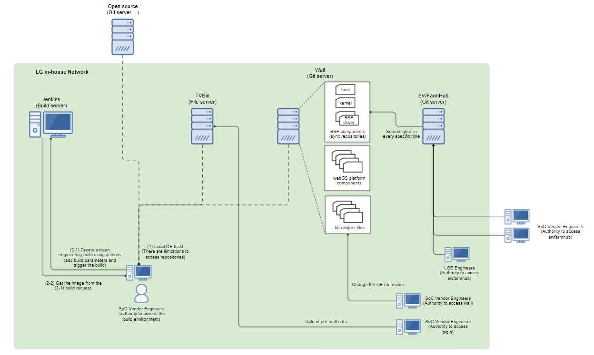
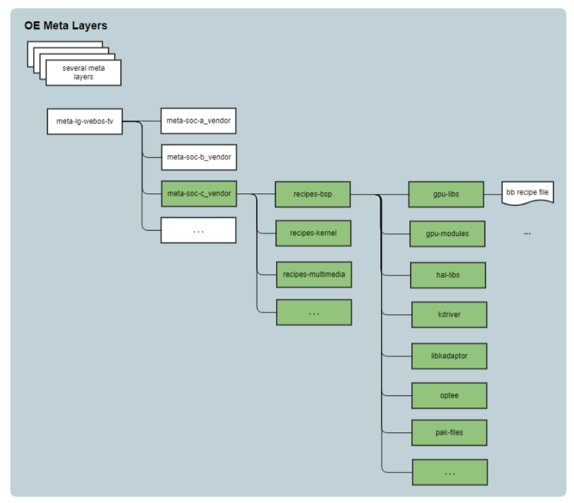
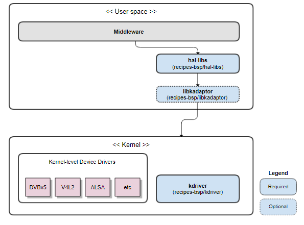
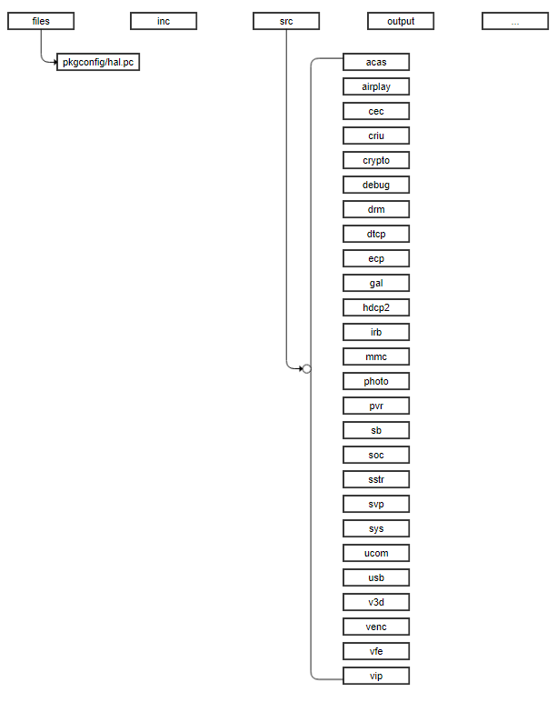
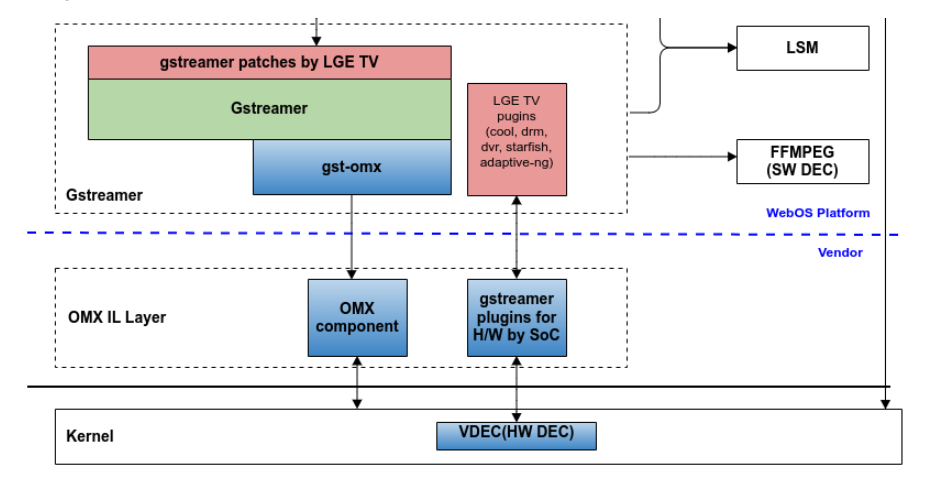
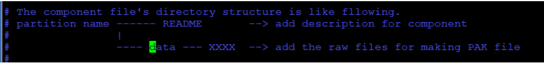
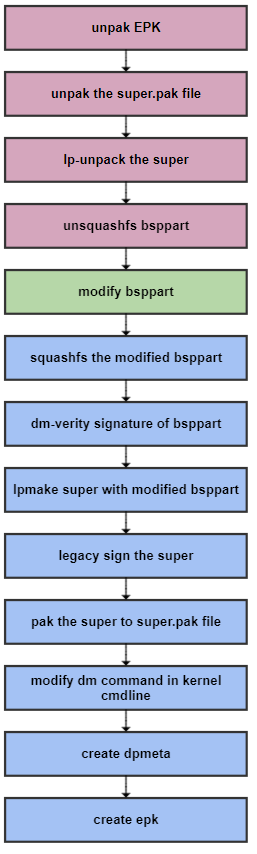

Build Environment
###################

This chapter provides information on a build environment used for webOS TV. LG's proprietary toolchain and OpenEmbedded are used to build and create binary images for webOS TV.

.. contents:: Table of Contents
   :depth: 3
   :local: 

Toolchain
**********

webOS provides a toolchain SDK that is ready to use for building the BSP. Therefore, you must use the toolchain SDK provided by LG to build the kernel and kernel drivers. This section describes how to install, set up, and use the toolchain SDK.

Toolchain SDK Components
========================

The toolchain SDK is a set of tools that includes the compiler toolchain, libraries, and header files. It is provided as a shell script (.sh) to facilitate the setup process of toolchain environments. By executing the .sh file, the required toolchain will be installed, and by running the environment setup script, the necessary environment settings can be easily configured.

The toolchain SDK contains the following components:

  * toolchain: consists of a cross-compiler and cross-linker.
  * sysroot: contains needed headers and libraries for generating binaries that run on the ARM architecture.

Prerequisites
=============

  * Linux host machine
     * 64-bit Linux required
  * 16GB RAM
  * Ubuntu 18.04 (64-bit) recommended

**Get Toolchain SDK**

webOS supports both 64-bit and 32-bit versions of the toolchain SDK. The 64-bit SDK is used for kernel space programs, while the 32-bit SDK is used for user space programs.

  * 64-bit : starfish-sdk-x86_64-aarch64-toolchain-7.0.0.sh
  * 32-bit : starfish-sdk-x86_64-ca9v1-toolchain-7.0.0.sh 

To access and download the latest version of the SDK, contact your LG representative.

Install and Set up
==================

To install and set up the toolchain SDK, follow these steps:

1. To install the SDK in your preferred location, run the script ( ``.sh`` ) file that you downloaded.

  .. code-block:: bash 
     
     $ ./starfish-sdk-x86_64-aarch64-toolchain-7.0.0.sh
     # Example results for webOS TV v7.0.0
     webOS TV SDK installer version 7.0.0
     ====================================
     Enter target directory for SDK (default: /opt/starfish-sdk-x86_64/7.0.0): ./starfish-sdk
     You are about to install the SDK to "/home/earnest.son/starfish-sdk". Proceed [Y/n]?
     Extracting SDK................................................done
     Setting it up...done
     SDK has been successfully set up and is ready to be used.
     Each time you wish to use the SDK in a new shell session, you need to source the environment setup script e.g.
     $ . /home/earnest.son/starfish-sdk/environment-setup-aarch64-starfish-linux
     $ . /home/earnest.son/starfish-sdk/environment-setup-ca9v1-starfishmllib32-linux-gnueabi

2. If the process succeeds, the environment setup script file (environment-setup-ca9v1-starfishmllib32-linux-gnueabi) will be generated in the target directory.

  .. code-block:: bash 

      ./
      ├── environment-setup-aarch64-starfish-linux
      ├── environment-setup-ca9v1-starfishmllib32-linux-gnueabi
      ├── site-config-aarch64-starfish-linux
      ├── site-config-ca9v1-starfishmllib32-linux-gnueabi
      ├── sysroots
      │   ├── aarch64-starfish-linux
      │   └── x86_64-starfishsdk-linux
      ├── version-aarch64-starfish-linux
      └── version-ca9v1-starfishmllib32-linux-gnueabi

3. To set up the environment, run the environment setup script.
  
  .. code-block:: bash 

    $ source environment-setup-ca9v1-starfishmllib32-linux-gnueabi

  Output messages might or might not be displayed depending on your computer’s setup. If you see the message below, it’s not an error so you can proceed to the next step.

  ``Icecc not found. Disabling distributed compiling``

4. The environment setup for using the toolchain has been completed, which can be confirmed by using the "export" command. To check the version of the compiler and the configuration status, use the following command:

  .. code-block:: bash 

    $ ${CC} --version
    arm-starfishmllib32-linux-gnueabi-gcc (GCC) 9.3.0
    Copyright (C) 2019 Free Software Foundation, Inc.
    This is free software; see the source for copying conditions.  There is NO
    warranty; not even for MERCHANTABILITY or FITNESS FOR A PARTICULAR PURPOSE.

Usage
=====

To compile a program, use :code:`${CC} file_name.c -o file_name`. Typically, the build is performed using macros that are already exported. The following is an example of how to use the toolchain to compile a simple Hello application.

.. code-block:: bash 

  $ ${CC} hello.c -o hello

After running the above steps, you can see the :code:`hello` executable in your directory. To check this. run the following command:

.. code-block:: bash 

  $ file hello

This should produce output similar to:

.. code-block::

  hello: ELF 32-bit LSB shared object, ARM, EABI5 version 1 (SYSV), dynamically linked, interpreter /lib/ld-linux.so.3, for GNU/Linux 3.2.0, with debug_info, not stripped

Building is performed using environment variables such as CFLAGS/LDFLAGS that have been set. Use environment variables that have been exported. For details, please refer to ``environment-setup-ca9v1-starfish-linux-gnueabi`` .

.. code-block:: 

  SDKTARGETSYSROOT="path../sysroots/aarch64-starfish-linux"   --> installed path of SDK
    
  CC="arm-starfishmllib32-linux-gnueabi-gcc  -mthumb -mfpu=neon -mfloat-abi=softfp -mcpu=cortex-a9 -mtune=cortex-a9 -funwind-tables -rdynamic    -Wformat -Wformat-security -Werror=format-security --sysroot=$SDKTARGETSYSROOT"
  CXX="arm-starfishmllib32-linux-gnueabi-g++  -mthumb -mfpu=neon -mfloat-abi=softfp -mcpu=cortex-a9 -mtune=cortex-a9 -funwind-tables -rdynamic    -Wformat -Wformat-security -Werror=format-security --sysroot=$SDKTARGETSYSROOT"
  CPP="arm-starfishmllib32-linux-gnueabi-gcc -E  -mthumb -mfpu=neon -mfloat-abi=softfp -mcpu=cortex-a9 -mtune=cortex-a9 -funwind-tables -rdynamic    -Wformat -Wformat-security -Werror=format-security --sysroot=$SDKTARGETSYSROOT"
  AS="arm-starfishmllib32-linux-gnueabi-as "
  LD="arm-starfishmllib32-linux-gnueabi-ld  --sysroot=$SDKTARGETSYSROOT"
  GDB=arm-starfishmllib32-linux-gnueabi-gdb
  STRIP=arm-starfishmllib32-linux-gnueabi-strip
  RANLIB=arm-starfishmllib32-linux-gnueabi-ranlib
  OBJCOPY=arm-starfishmllib32-linux-gnueabi-objcopy
  OBJDUMP=arm-starfishmllib32-linux-gnueabi-objdump
  READELF=arm-starfishmllib32-linux-gnueabi-readelf
  AR=arm-starfishmllib32-linux-gnueabi-ar
  NM=arm-starfishmllib32-linux-gnueabi-nm
  M4=m4
  TARGET_PREFIX=arm-starfishmllib32-linux-gnueabi-
  CONFIGURE_FLAGS="--target=arm-starfishmllib32-linux-gnueabi --host=arm-starfishmllib32-linux-gnueabi --build=x86_64-linux --with-libtool-sysroot=$SDKTARGETSYSROOT"
  CFLAGS=" -O2 -pipe -g -feliminate-unused-debug-types "
  CXXFLAGS=" -O2 -pipe -g -feliminate-unused-debug-types "
  LDFLAGS="-Wl,-O1 -Wl,--hash-style=gnu -Wl,--as-needed  -Wl,-z,relro,-z,now"
  CPPFLAGS=""
  KCFLAGS="--sysroot=$SDKTARGETSYSROOT"
  OECORE_DISTRO_VERSION="7.0.0"
  OECORE_SDK_VERSION="7.0.0"
  ARCH=arm
  CROSS_COMPILE=arm-starfishmllib32-linux-gnueabi-

Compile Options
===============

The toolchain SDK supports both software floating point (softfp) and hard floating point (hard). softfp is commonly used for building the webOS TV BSP.

.. list-table:: 
   :widths: 15 50 50
   :header-rows: 1

   * - 
     - CPU Architecture Specific
     - Common
   * - softfp
     - -mcpu=cortex-a9 -mfpu=neon -mtune=cortex-a9
     - -mfloat-abi=softfp  -mthumb  -funwind-tables -ftree-vectorize -rdynamic -O2
   * - hard
     - -mcpu=cortex-a9 -mfpu=neon -mtune=cortex-a9
     - -mfloat-abi=hard  -mthumb -funwind-tables -ftree-vectorize -rdynamic  -O2

.. warning::
   Starting from Yocto 2.6, the option "-march=armv7-a" has been incompatible. In the latest oe-core, if the "-mcpu" option is provided, the "-march" option will be incompatible as well. You can find more information about this change at: https://git.openembedded.org/openembedded-core/commit/?id=ac83d22eb5031f7fdd09d34a1a46d92fd3e39a3c 

.. _OpenEmbedded (OE) :

OpenEmbedded (OE) 
*********************

OpenEmbedded (OE) is a build system used by webOS TV. It is supported by `Yocto Project <https://docs.yoctoproject.org/>`_ from the Linux Foundation and provides a way to easily maintain embedded Linux distributions.

Meta layers in OE are a key concept that enables customization and extensibility of the build system. A meta-layer is a collection of recipes and/or configurations that define how BSP components are built and integrated into the final image.

This section introduces the OE environment for building an image for webOS TV. It describes the meta layers for webOS TV BSP components and provides instructions on setting up the OE build system integration.

.. _OE Build Environment :

OE Build Environment
=========================

The OE build environment for webOS TV is established within LGE's in-house network. Therefore, to build the webOS TV image in the OE environment, the engineer from a SoC vendor must have access to LG's in-house network and have an authorized LG account.

The figure below represents the system configuration and relationships between systems for webOS OE build from the perspective of BSP development. It illustrates the repositories for the source code required for OE build, the build server, and the server accessibility based on the engineer's authorization.

   OE Build Env.

The following table describes the system required for OE build.

+----------------+-----------+------------+---------------------------------------------------------------------------------------------------------------+----------------------------------------------------------------------------------------------------------------+
| Network Access | System    | Type       | URL                                                                                                           | Description                                                                                                    |
+================+===========+============+===============================================================================================================+================================================================================================================+
|LGE In-house    | Wall      | Git server | https://wall.lge.com/                                                                                         | A Git server for the webOS TV platform                                                                         |
|                |           |            |                                                                                                               |                                                                                                                |
|                |           |            |                                                                                                               | * Software configuration management for webOS TV components.                                                   |
|                |           |            |                                                                                                               | * Software configuration management for BSP components synced from the SWFarmHub server.                       |
|                |           |            |                                                                                                               | * Software configuration management for OE recipe files (.bb).                                                 |
|                +-----------+------------+---------------------------------------------------------------------------------------------------------------+----------------------------------------------------------------------------------------------------------------+
|                | TVBin     | Data server|http://tvbin.lge.com:8080/                                                                                     | A data server for storing and versioning of pre-built binary images.                                           |
|                +-----------+------------+---------------------------------------------------------------------------------------------------------------+----------------------------------------------------------------------------------------------------------------+
|                |Jenkins    |Build server|https://cerberus.lge.com/                                                                                      | A build server that allows for easy webOS OE builds by adding build parameters.                                |
|                |           |            |                                                                                                               |                                                                                                                |
|                |           |            |                                                                                                               | Engineers can use Bee as a build server instead of Jenkins.                                                    |                                                                      
|                |           |            |                                                                                                               |                                                                                                                |
|                |           |            |                                                                                                               | The full URL of Jenkins is as follows:                                                                         |                         
|                |           |            |                                                                                                               |                                                                                                                |
|                |           |            |                                                                                                               | https://cerberus.lge.com/jenkins/view/Clean%20engineering%20build%20-%20List/job/clean-engineering-build-third |
+----------------+-----------+------------+---------------------------------------------------------------------------------------------------------------+----------------------------------------------------------------------------------------------------------------+
| External       |SWFarmHub  | Git server |https://swfarmhub.lge.com/                                                                                     | A Git server for collaborating with 3rd party vendors.                                                         |
|                |           |            |                                                                                                               |                                                                                                                |
|                |           |            |                                                                                                               | * Software configuration management for BSP components specific to a SoC vendor.                               |
|                |           |            |                                                                                                               | * boot, kernel, kdriver, hal-libs, gstreamer, etc.                                                             |
+                +-----------+------------+---------------------------------------------------------------------------------------------------------------+----------------------------------------------------------------------------------------------------------------+
|                |Open source| Git server |https://github.com/webosose                                                                                    | A Git server for webOS Open Source Edition (webOS OSE).                                                        |
|                |           |            |                                                                                                               |                                                                                                                |
|                |           |            |                                                                                                               | * boot, kernel, etc.                                                                                           |
+----------------+-----------+------------+---------------------------------------------------------------------------------------------------------------+----------------------------------------------------------------------------------------------------------------+

The following table describes the roles of SoC vendor engineers and LGE engineers, authorized to access each system, can perform.

+-------------+-------------+-----------------------------------------------------------------------------------+
| Engineer    |Access System| Description                                                                       | 
+=============+=============+===================================================================================+
|SoC vendor   |Bee / Jenkins|SoC vendor engineers with the authority to access the OE build server, require an  | 
|             |             |authorized LGE account and access is limited to LGE's in-house network.            |
|engineers    |             |                                                                                   |
|             |             |                                                                                   |
|             |             |The following who types of OE build methods are supported.                         |
|             |             |                                                                                   |
|             |             |* OE build from Bee which is a cloud-based build environment                       |
|             |             |  ( \*There are limitations on accessible repositories.)                           |
|             +-------------+-----------------------------------------------------------------------------------+
|             |wall         |SoC vendor engineers need the authority to access the wall server and require an   |
|             |             |authorized LGE account and access is limited to LGE's in-house network.            |
|             |             |                                                                                   |
|             |             |* Modify the recipes files (.bb) of BSP components.                                |
|             +-------------+-----------------------------------------------------------------------------------+
|             |TVBin        |SoC vendor engineers with the authority to access the TVBin server, requiring an   |
|             |             |authorized LGE account and limited to LGE's in-house network access.               |
|             |             |                                                                                   |
|             |             |* Modify and upload the pre-built binary image among BSP components.               |
|             +-------------+-----------------------------------------------------------------------------------+
|             |SWFramHub    |SoC vendor engineers with the authority to access the SWFarmHub server             |
|             |             |                                                                                   |
|             |             |* Modify and upload the source files of BSP components.                            |
+-------------+-------------+-----------------------------------------------------------------------------------+
|LGE engineers|SWFramHub    |LGE engineers with the authority to access the SWFarmHub server                    |
|             |             |                                                                                   |
|             |             |* Modify and upload the source files of BSP components.                            |
+-------------+-------------+-----------------------------------------------------------------------------------+

webOS Meta Layers
=======================

The OE build environment for webOS TV contains several meta layers. 

* The ``meta-lg-webos-tv`` layer is designed to build the webOS TV stack.
* The :code:`meta-soc-*` layer under ``meta-lg-webos-tv`` is used to maintain SoC vendor-specific BSP components. 

The following figure shows the meta-layer structure for a webOS TV BSP.

   OE Meta Layers

The :samp:`meta-soc-[Vendor name]` layer is organized into the following recipe directories.

.. list-table:: 
   :widths: 20 30 
   :header-rows: 1

   * - Directory
     - Description
   * - ``<vendor folder>``
     - Base directory with a predefined structure for a specific SoC vendor        
        * ``meta-lg-webos-tv/meta-soc-[Vendor name]/``
   * - ``<vendor folder>/recipes-bsp``
     - Contains recipe files (.bb) for almost all BSP components except the kernel 
   * - ``<vendor folder>/recipes-bsp/gpu-libs``
     - Contains a recipe file (.bb) for the gpu-libs component 
        * GPU libraries such as EGL, GLES, VULKAN and etc. 
   * - ``<vendor folder>/recipes-bsp/gpu-modules``
     - Contains a recipe file (.bb) for the gpu-modules component 
        * Substantial ko driver for each SoC. 
   * - ``<vendor folder>/recipes-bsp/hal-libs``
     - Contains a recipe file (.bb) for the hal-libs components
        * User-level device drivers that run in user space
   * - ``<vendor folder>/recipes-bsp/kdriver``
     - Contains a recipe file (.bb) for the kdriver component
        * Kernel-level device drivers that run in kernel space
   * - ``<vendor folder>/recipes-bsp/libkadaptor``
     - Contains a recipe file (.bb) for the libkadaptor component
        * BSP modules that act as an interface between hal-libs and the kernel
   * - ``<vendor folder>/recipes-bsp/optee``
     - Contains a recipe file (.bb) for the optee component
   * - ``<vendor folder>/recipes-bsp/pak-files``
     - Contains a recipe file (.bb) for the prebuilt binary components
        * boot, secureboot, intmicom, tzfw, etc
   * - ``<vendor folder>/recipes-bsp/...``
     - Contains recipe files (.bb) for BSP components that need to be defined separately.
   * - ``<vendor folder>/recipes-kernel``
     - Contains a recipe file (.bb) for the kernel 
   * - ``<vendor folder>/recipes-multimedia``
     - Contains a recipe file (.bb) related to multimedia
   * - ``<vendor folder>/...``
     - Contains recipe files (.bb) for components that need to be defined separately.
        * webOS TV components that need to be redefined only for a specific SoC.

The main BSP components (hal-libs, libkadaptor, kernel, kdriver, linuxtv-extension) are located in the following directories. libkadaptor acts as an interface between hal-libs and the kernel, and it is not mandatory. If you have already developed user-space drivers based on OE, we can discuss the possibility of using the driver modules defined as OE components instead of libkadaptor.

   BSP Layers

Set up to Integrate OE Build System
===================================

To build the final image of webOS TV, it is necessary to fully integrate a BSP developed by a SoC vendor into the webOS OE build system and environment.

.. note::
   BSP Integration Test (BIT) is performed on OE build artifacts to verify that the components of the BSP developed by the SoC vendor are correctly integrated and functioning within webOS TV. Therefore, it is necessary to set up the OE build environment before conducting BIT.

The steps for setting up the OE build system and environment to integrate a BSP typically include the following:

1. LGE prepares the basic structure of a BSP layer named ``meta-soc-*`` for a specific SoC vendor.

2. Both LGE and the SoC vendor push the source code of BSP components.

    2-1. LGE prepares a Gerrit site for the SoC BSP on the SWFarmHub server and issues LG accounts to SoC Vendor engineers for accessing the Gerrit site.

    2-2. LGE prepares Git repositories (boot, hal-libs, libkadaptor, kdriver, kernel, gstreamer-plugin, etc.) for BSP components on the Gerrit site.

    2-3. The SoC vendor pushes the source code of BSP components to the corresponding repository on the Gerrit site.

    2-4. LGE synchronizes the source code of BSP components to the Wall server.

3. LGE and the SoC Vendor prepare the OE build environment.

    3-1. LGE provides guidance to the SoC Vendor on OE build information for webOS TV and how to initiate the build process.

    3-2. LGE grants access authority to the Wall server for the SoC vendor engineers.

    3-3. LGE sets up the OE build environment on the Wall server for SoC vendor engineers. The SoC vendor verifies the Git cloning from the Wall server.

    3-4. LGE grants access authority to the TVBin server for the SoC vendor engineers.

4. Once the environment setup for OE build is complete, perform OE build for each BSP component (hal-libs, kdriver, optee, ...). For detailed information on the format and installation location of the build artifacts for each component, please refer to the :ref:`BSP Component Organization` section.

BSP Component Organization
=========================================

This section describes how to find and place BSP components in the source tree. It also provides information on the packaging format for the following BSP components.

* hal-libs
* libkadaptor
* kdriver
* kernel
* gstreamer
* prebuilt binary
   * gpu-libs
   * gpu-modules
   * optee
   * boot and secureboot
   * tzfw

hal-libs
-----------------

hal-libs contains user-level device drivers that run in user space. They provide an interface between a webOS TV application and kernel-level device drivers or other operating system components.

hal-libs related files are placed in the following root file system ( ``/sysroot`` ) locations: 

.. code-block:: 

   .:
   usr
    
   ./usr:
   include  lib  share

* ``/usr/include``: Include header files of hal-libs 
* ``/usr/lib``: Artifacts of hal-libs in the form of .so files
* ``/usr/share``: The pkg-config file, hal.pc, is located in usr/share/pkgconfig/

Build artifacts
^^^^^^^^^^^^^^^^^^^^^^^

The implementations of hal-libs must be packaged into shared library modules (.so files) with the following names. libhal_libs.so is the library file that contains the complete source code for hal-libs.

+----------------------------+-------------------------+
| HAL Header File            |.so File Name            |
+============================+=========================+
|acas_lib                    | libhal_acas.so          |
+----------------------------+-------------------------+
|airplay                     | libhal_airplay.so       |
+----------------------------+-------------------------+
|criu                        | libhal_criu.so          |
+----------------------------+-------------------------+
|crypto                      | libhal_crypto.so        |
+----------------------------+-------------------------+
|drm                         | libdrmddi.so            |
+----------------------------+-------------------------+
|ecp                         | libhal_ecp.so           |
+----------------------------+-------------------------+
| gal                        | libhal                  |
+----------------------------+-------------------------+
| hdcp2                      | libhal_hdcp2.so         |
+----------------------------+-------------------------+
| irb                        | libhal_irb.so           |
+----------------------------+-------------------------+
| jpeg                       | libhal_photo.so         |
+----------------------------+                         |
| vo                         |                         |
+----------------------------+-------------------------+
| mmc                        | libhal_mmc.so           |
+----------------------------+-------------------------+
| pvr                        | libhal_pvr.so           |
+----------------------------+-------------------------+
| sstr                       | libhal_sstr.so          |
+----------------------------+-------------------------+
| svp                        | libhal_svp.so           |
+----------------------------+-------------------------+
| sys                        | libhal_sys.so           |
+----------------------------+-------------------------+
| ucom(micom)                | libhal_ucom.so          |
+----------------------------+-------------------------+
| usb                        | libhal_usb.so           |
+----------------------------+-------------------------+
| venc                       | libhal_venc.so          |
+----------------------------+-------------------------+
| whole hal-libs module      | libhal_libs.so          |
+----------------------------+-------------------------+
| secureboot library         | libsb.so                |
+----------------------------+-------------------------+

The following shows an example of a list of hal-libs artifacts (.so files) under the ``/usr/lib`` directory.

.. code-block:: 

    ./usr/lib:
    libdrmddi.so          libhal_airplay.so.1      libhal_crypto.so.1.0.0  libhal_hdcp2.so        libhal_mmc.so.1        libhal_pvr.so.1.0.0      libhal_svp.so        libhal_uart.so.1      libhal_usb.so.1.0.0
    libdrmddi.so.1        libhal_airplay.so.1.0.0  libhal_ecp.so           libhal_hdcp2.so.1      libhal_mmc.so.1.0.0    libhal_libs.so        libhal_svp.so.1      libhal_uart.so.1.0.0  libhal_venc.so
    libdrmddi.so.1.0.0    libhal_criu.so           libhal_ecp.so.1         libhal_hdcp2.so.1.0.0  libhal_photo.so        libhal_libs.so.1      libhal_svp.so.1.0.0  libhal_ucom.so        libhal_venc.so.1
    libhal_acas.so        libhal_criu.so.1         libhal_ecp.so.1.0.0     libhal_irb.so          libhal_photo.so.1      libhal_libs.so.1.0.0  libhal_sys.so        libhal_ucom.so.1      libhal_venc.so.1.0.0
    libhal_acas.so.1      libhal_criu.so.1.0.0     libhalgal.so            libhal_irb.so.1        libhal_photo.so.1.0.0  libhal_sstr.so           libhal_sys.so.1      libhal_ucom.so.1.0.0  libsb.so
    libhal_acas.so.1.0.0  libhal_crypto.so         libhalgal.so.1          libhal_irb.so.1.0.0    libhal_pvr.so          libhal_sstr.so.1         libhal_sys.so.1.0.0  libhal_usb.so         libsb.so.1
    libhal_airplay.so     libhal_crypto.so.1       libhalgal.so.1.0.0      libhal_mmc.so          libhal_pvr.so.1        libhal_sstr.so.1.0.0     libhal_uart.so       libhal_usb.so.1       libsb.so.1.0.0

pkg config
^^^^^^^^^^^^^^^^^^^^

``hal.pc`` is a pkg-config used to obtain information such as compiler flags or link libraries required to compile the hal-libs.

.. code-block:: 

   ./usr/share/pkgconfig/hal.pc

The following shows an example of the ``hal.pc`` file.

.. code-block:: bash 

    # @@@LICENSE
    #
    # Copyright (c) 2022 LG Electronics, Inc.
    #
    # LICENSE@@@
    
    libdir=/usr/lib
    includedir=/usr/include/hal
    kadp_includedir=/usr/include/kadaptor
    kdrv_includedir=/usr/include/kdriver
    
    Name: hal-libs
    Description: HAL Library
    Version: 0.0.1
    Libs: -L${libdir} -lhal_libs
    Cflags: -I${includedir} -I${kadp_includedir} -I${kdrv_includedir}

* ``Name``: The name of the library.
* ``Description`` : A brief description of the library.
* ``Version``: A string specifically defining the version of the library.
* ``Libs``: The path and name of the library files required for linking the library.
* ``Cflags``: The path of the header files required for compiling the library.

hal-libs source tree
^^^^^^^^^^^^^^^^^^^^^^^^^

The hal-libs source tree is managed on a per-module basis, as shown below:

   hal-libs source tree

libkadaptor
---------------

libkadaptor interfaces between kernel-level device drivers and user-level device drivers, and its implementation varies depending on the SoC vendor.

.. warning::
   
   If a SoC vendor has already developed user-level drivers based on OE, LG can discuss and decide whether to use the modules defined as OE components by the SoC vendor instead of libkadaptor.

   The webOS modules/services have dependencies on libadaptor. Therefore, if user-level device drivers are not included in libkadaptor, a dummy libkapator.so must be created and used.

libkadaptor related files are placed in the following root file system ( ``/sysroot`` ) locations:

.. code-block:: 

   .:
   usr
    
   ./usr:
   include  lib  share

* ``/usr/include``: Include header files of libkadaptor
* ``/usr/lib``: Artifacts of libkadaptor in the form of .so files
* ``/usr/share``: The pkg-config file, kadaptor.pc, is located ``in usr/share/pkgconfig/``

Build artifact
^^^^^^^^^^^^^^^^^^^^^^

The implementations of libkadaptor must be packaged into a shared library module (.so file) with the following name. 

================= ==============
HAL Header File   .so File Name
================= ==============
libkadaptor       libkadaptor.so
================= ==============

The following shows an example of a list of libkadaptor artifacts (.so files) under the ``/usr/lib`` directory.

.. code-block:: 
    
    ./lib:
    libkadaptor.so  libkadaptor.so.1  libkadaptor.so.1.0.0

pkg config
^^^^^^^^^^^^^^^^^^

``kadaptor.pc`` is a pkg-config used to obtain information such as compiler flags or link libraries required to compile a package.

.. code-block:: bash

    ./usr/share:
    pkgconfig
    
    ./usr/share/pkgconfig:
    kadaptor.pc

The following shows an example of the ``kadaptor.pc`` file.

.. code-block:: bash 

    # @@@LICENSE
    #
    # Copyright (c) 2022 LG Electronics, Inc.
    #
    # LICENSE@@@
    
    libdir=/usr/lib
    includedir=/usr/include/kadaptor
    kdrv_includedir=/usr/include/kdriver
    
    Name: libkadaptor
    Description: libkadaptor Library
    Version: 0.0.1
    Libs: -L${libdir} -lkadaptor
    Cflags: -I${includedir} -I${kdrv_includedir}

kdriver
------------------

kdriver contains kernel-level device drivers that provide an interface between webOS TV and the hardware. 
  * The Git repositories for the kernel drivers and the kernel must be separated.
  * All kernel drivers must be built into the kernel. Any kernel driver modules that need to be packaged into .ko files should be discussed with LG in advance.
  * In the OE build environment, the kernel driver build is copied to the kernel driver folder during the kernel build process. For more information, see kernel.

.. code-block:: 

    .:
    etc
    
    ./etc:
    systemd
    
    ./etc/systemd:
    system
    
    ./etc/systemd/system:
    kdrivers.service

Build artifact
^^^^^^^^^^^^^^^^^^^^^^^^

When building kdriver, it is required to install a systemd service file named kdrivers.service. This file serves the purpose of performing tasks that the kernel driver needs to handle independently during device boot-up.

.. code-block:: 

    ./etc/systemd/system: 
    kdrivers.service

The following shows an example of the ``kdrivers.service`` file.

.. code-block:: 

    # @@@LICENSE
    #
    # Copyright (c) 2019 LG Electronics, Inc.
    #
    # Confidential computer software. Valid license from LG required for
    # possession, use or copying. Consistent with FAR 12.211 and 12.212,
    # Commercial Computer Software, Computer Software Documentation, and
    # Technical Data for Commercial Items are licensed to the U.S. Government
    # under vendor's standard commercial license.
    #
    # LICENSE@@@
    
    [Unit]
    Description=starfish - "%n"
    DefaultDependencies=no
    Wants=mount-bsp.service mknod.service kdrivers-vdec_cmn.service kdrivers-venc_hxenc.service
    After=mount-bsp.service mknod.service kdrivers-vdec_cmn.service kdrivers-venc_hxenc.service
    
    [Service]
    Type=oneshot
    ExecStart=/bin/true
    RemainAfterExit=yes

[Unit]

  * Description: A description of the service.
  * DefaultDependencies: This service unit does not have default dependencies.
  * Wants: Other service units that this service wants to be started before.
  * After: Other service units that should be started before this service. 

[Service]

  * Type: The type of the service. This service is executed once and then exits.
  * ExecStart: The command to be executed when the service starts. 
  * RemainAfterExit: This service's state remains "active" even after it has exited.

kernel
------------------

The kernel is built for each SoC vendor, and the kernel image generated from the build is located in /boot directory.

.. code-block:: 

    ./boot:
    Image.lz4

Build artifact
^^^^^^^^^^^^^^^^^^^^^^^^

The output of the kernel build is the Image.lz4 file, which is installed during the OE build.
   * All kernel drivers must be built into the kernel.
   * The kernel image is named Image.xxx, and the extension varies depending on the compression type, such as lz4 or gz.

.. code-block:: 

    ./boot:
    Image.lz4

gstreamer
----------

GStreamer is an open-source multimedia framework that simplifies the development of applications handling audio, video, or both. The GStreamer for webOS TV is currently based on GStreamer version 1.18.5 as of 2023. Consequently, SoC vendors are required to develop GStreamer plugins and libraries that work with hardware-accelerated AV decoder and AV renderer based on GStreamer upstream version 1.18.5, and install them in webOS GStreamer.

The following figure illustrates the GStreamer plugins and their relations. It shows 2 types of codec plugins: GStreamer and OpenMAX (Open Media Acceleration, abbreviated as "OMX"). Depending on the codec specifications of the SoC, develop GStreamer plugin or gst-omx to facilitate the integration between GStreamer and hardware resources.

.. note:
   The GStreamer for webOS TV, commonly provided by LG to SoC vendors, uses the following repositories within SWFarmHub:

   * `gstreamer/gstreamer <https://swfarmhub.lge.com:8080/admin/repos/gstreamer/gstreamer>`_
   * `gstreamer/gst-plugins-bad <https://swfarmhub.lge.com:8080/admin/repos/gstreamer/gst-plugins-bad>`_
   * `gstreamer/gst-plugins-base <https://swfarmhub.lge.com:8080/admin/repos/gstreamer/gst-plugins-base>`_
   * `gstreamer/gst-plugins-cool <https://swfarmhub.lge.com:8080/admin/repos/gstreamer/gst-plugins-cool>`_
   * `gstreamer/gst-plugins-good <https://swfarmhub.lge.com:8080/admin/repos/gstreamer/gst-plugins-good>`_
   * `gstreamer/gst-plugins-ugly <https://swfarmhub.lge.com:8080/admin/repos/gstreamer/gst-plugins-ugly>`_
   * `gstreamer/gst-libav <https://swfarmhub.lge.com:8080/admin/repos/gstreamer/gst-libav>`_

GStreamer repositories for each SoC vendor
^^^^^^^^^^^^^^^^^^^^^^^^^^^^^^^^^^^^^^^^^^

The repository for GStreamer plugins or gst-omx developed by a SoC Vendor will be created on the SoC vendor-specific Gerrit Site on SWFarmHub with the following naming rules:
   * ``module/gst-plugins-[Vendor Name]``
   * ``module/gst-omx-[Vendor Name]``
If there are additional repositories required, coordinate with your LG GStreamer representative to create them.

| During the BSP development stage, only the repositories in SWFarmHub will be used for building. Once productization is decided, the same repository will be cloned to the Wall server (`wall.lge.com <https://wall.lge.com/>`_).
| LG will then run a script so that SWFarmHub commits can be automatically synchronized to the Wall server.

The SoC vendor's development team provides LG with a list of developers who require repository access to obtain permissions for committing to SWFarmHub.

GStreamer related environment variables for each SoC vendor
^^^^^^^^^^^^^^^^^^^^^^^^^^^^^^^^^^^^^^^^^^^^^^^^^^^^^^^^^^^
If there are additional GStreamer related environment variables for OE Build or loading SoC vendor plugins in webOS, you need to modify starfish-initscripts repository. 
Adding your own enviroment variables to 81-ums.conf.in located in below path.
   * ``common/etc/systemd/system.conf.d/81-ums.conf.in``

.. code-block:: 
    
    # 81-ums.conf.in
    ...
    [Manager]
    ...
    DefaultEnvironment=GST_REGISTRY_UPDATE=no
    DefaultEnvironment=COMPONENTS_PATH=/mnt/lg/res/lglib/openmax

    # Add as below 
    + DefaultEnvironment=<VARIABLES_WHAT_YOU_WANT_TO_ADD>=<VALUE>

**temporary**

You can also check it temporarily by following below steps in running webOS.

.. code-block:: 

    # shell

    $ cp /etc/systemd/system.conf.d/81-ums.conf PATH/TO/MOUNT/
    $ vi /PATH/TO/MOUNT/81-ums.conf
    // add new environment variables need for SoC Vendor
    $ echo DefaultEnvironment=<VARIABLES_WHAT_YOU_WANT_TO_ADD>=<VALUE> >> /PATH/TO/MOUNT/81-ums.conf
    
    $ mount -B /PATH/TO/MOUNT/81-ums.conf /etc/systemd/system.conf.d/81-ums.conf
    $ systemctl daemon-reexec // to restart systemd daemon that reference /system.conf.d/*.conf
    $ exit
    
    // in new shell
    $ export | grep 'GST\|OMX' // confirm new added env grepped.

Source code upload
^^^^^^^^^^^^^^^^^^

There are no special rules for uploading source code to the SoC-specific repository.

By default, GStreamer commits the source code, but prebuilt libraries can also be uploaded to TVBin (`tvbin.lge.com:8080 <http://tvbin.lge.com:8080/>`_) for OE build if necessary temporarily.

Recipes for OE build
^^^^^^^^^^^^^^^^^^^^

| OE build is required to generate the webOS image, and for this purpose, a recipe is needed for module build in the registered repository mentioned above.
| The location of the recipe for a SoC vendor's GStreamer module build is as follows:

* ``meta-lg-webos-tv/meta-soc-[Vendor Name]/recipes-multimedia/gstreamer/gstreamer1.0-plugins-<Vendor Name>.bb``
* ``meta-lg-webos-tv/meta-soc-[Vendor Name]/recipes-multimedia/gstreamer/gstreamer1.0-omx_<Version>.bbappend``

| In case of Soc-specific repository, there are two options you can choose. 
| First one is providing source code to LG.  
* ``meta-lg-webos-tv/meta-soc-[Vendor Name]/recipes-bsp/omx-il-[Vendor Name]/*``

| Second one is providing prebuilt library to LG.
* ``meta-lg-webos-tv/meta-soc-[Vendor Name]/recipes-bsp/msil-omx-libs/msil-omx-libs_[Machine Name]/*``

| There is no separate specific guide for writing recipes; please refer to the Yocto documentation.
| https://docs.yoctoproject.org/dev-manual/new-recipe.html

**temporary**

| *You can use GStreamer prebuilt binaries temporarily for convenience during the bring-up process. But ultimately, you must provide source code for OE Build.*
| You should create ``gstreamer1.0-omx-install.bb`` to get prebuilt libraries from TVBin instead of ``gstreamer1.0-omx_<Version>.bbappend``
| And modify ``meta-soc-[Vendor Name]/recipes-core/packagegroups/packagegroup-starfish-bsp.bbappend`` like below.

.. code-block:: 

    -    gstreamer1.0-omx \
    +    gstreamer1.0-omx-install \

Build artifact
^^^^^^^^^^^^^^

The build artifacts of GStreamer modules should be generated and installed similar to the following. The example below shows the generated artifacts from the OE build, which may vary depending on the SoC Vendor.

.. code-block:: 

        ├── bin // SoC plugins unittest
    │   ├── gst-SoC-dmaheap-test-1.0
    │   ├── gst-SoC-rvscale-test-1.0
    │   ├── gst-SoC-test-1.0
    │   ├── gst-SoC-thumbnail-1.0
    │   └── gst-SoC-webrtc-test-1.0
    └── lib
        ├── gstreamer-1.0
        │   ├── libgstdvo.so
        │   ├── libgsthdmvlpcmparse.so
        │   ├── libgstSoCalsa.so
        │   ├── libgstSoCdebug.so
        │   ├── libgstSoClpcmdec.so
        │   ├── libgstSoCvdec.so
        │   ├── libgstSoCvenc.so
        │   ├── libgstSoCvscale.so
        │   └── libgstSoCvsink.so
        └── pkgconfig
            ├── gstreamer-SoC-audio-1.0.pc
            ├── gstreamer-SoC-clock-1.0.pc
            ├── gstreamer-SoC-codec-1.0.pc
            ├── gstreamer-SoC-dma-1.0.pc
            ├── gstreamer-SoC-dvo-1.0.pc
            ├── gstreamer-SoC-sdec-1.0.pc
            └── gstreamer-SoC-utils-1.0.pc

.. note:
   Apart from the above GStreamer module build guide, there may be multimedia-related modules with dependencies on GStreamer modules depending on the SoC. If the responsible person from LG is not clear, it is recommended to coordinate with BTAM to clarify ownership and organize accordingly.

prebuilt binary
---------------

| Pre-built libraries or binaries from external 3rd-parties, not part of the webOS OE build system, are first added to the TVBin server (tvbin.lge.com) in the form of a tarball. These pre-built binaries are then utilized as binaries during the OE build process.
| The types of binaries that are pre-built are as follows:

* gpu-libs
* gpu-modules
* optee
* boot and secureboot
* tzfw

gpu-libs
^^^^^^^^

gpu-libs are libraries used by GPU, including EGL, GLES, VULKAN, and etc. 

Build artifact
""""""""""""""

| The systemd service file, header files of gpu-libs, and shared object files should be generated and installed during the OE build.
| These gpu-libs related files are placed in the following root file system (/sysroot) locations:

.. code-block:: 

    .
    ├── files
    │   ├── launch
    │   ├── launch.2
    │   └── pkgconfig
    └── usr
        ├── bin
        ├── include
        │   ├── CL
        │   │   └── CL
        │   ├── CL_HPP
        │   │   └── include
        │   │       └── CL
        │   ├── EGL
        │   ├── GLES
        │   ├── GLES2
        │   ├── GLES3
        │   ├── KHR
        └── lib

* files : gpu-libs.service file and pkg-config files 
* usr/bin : GPU-related test files
* usr/include : EGL, GLES, GLES2, GLES3, KHR related header files provided under /sysroot
* usr/lib : libEGL, libGLESv1_CM, libGLESv2, libmali, libwayland-egl shared object files

The following shows an example of a list of gpu-libs.service file and pkg-config files under the ``/files`` directory.

.. code-block:: 

    .
    ├── launch
    │   └── gpu-libs.service
    ├── launch.2
    │   └── gpu-libs
    └── pkgconfig
        ├── egl.pc
        ├── glesv2.pc
        └── wayland-egl.pc

The following shows an example of a list of GPU-related test files under the ``/usr/bin`` directory.

.. code-block:: 

    .
    ├── mali_base_jd_test
    └── mali_egl_integration_tests

The following shows an example of a list of EGL, GLES, GLES2, GLES3, KHR related header files under the ``/usr/include`` directory.

.. code-block:: 

    .
    ├── CL
    │   ├── CL
    │   │   ├── cl_d3d10.h
    │   │   ├── cl_d3d11.h
    │   │   ├── cl_dx9_media_sharing.h
    │   │   ├── cl_dx9_media_sharing_intel.h
    │   │   ├── cl_egl.h
    │   │   ├── cl_ext.h
    │   │   ├── cl_ext_intel.h
    │   │   ├── cl_gl_ext.h
    │   │   ├── cl_gl.h
    │   │   ├── cl.h
    │   │   ├── cl_half.h
    │   │   ├── cl_icd.h
    │   │   ├── cl_layer.h
    │   │   ├── cl_platform.h
    │   │   ├── cl_va_api_media_sharing_intel.h
    │   │   ├── cl_version.h
    │   │   └── opencl.h
    │   ├── LICENSE
    │   └── README.md
    ├── CL_HPP
    │   └── include
    │       └── CL
    │           ├── cl2.hpp
    │           └── opencl.hpp
    ├── EGL
    │   ├── eglext.h
    │   ├── egl.h
    │   └── eglplatform.h
    ├── gbm.h
    ├── GLES
    │   ├── egl.h
    │   ├── glext.h
    │   ├── gl.h
    │   └── glplatform.h
    ├── GLES2
    │   ├── gl2ext.h
    │   ├── gl2.h
    │   └── gl2platform.h
    ├── GLES3
    │   ├── gl31.h
    │   ├── gl32.h
    │   ├── gl3.h
    │   └── gl3platform.h
    └── KHR
        └── khrplatform.h

The following shows an example of a list of shared object  files under the ``/usr/lib`` directory.

.. code-block:: 

    .
    ├── libEGL.so -> libEGL.so.1
    ├── libEGL.so.1 -> libEGL.so.1.4.0
    ├── libEGL.so.1.4.0
    ├── libGLESv1_CM.so -> libGLESv1_CM.so.1
    ├── libGLESv1_CM.so.1 -> libGLESv1_CM.so.1.1.0
    ├── libGLESv1_CM.so.1.1.0
    ├── libGLESv2.so -> libGLESv2.so.2
    ├── libGLESv2.so.2 -> libGLESv2.so.2.1.0
    ├── libGLESv2.so.2.1.0
    ├── libmali.so -> libmali.so.0
    ├── libmali.so.0 -> libmali.so.0.41.0
    ├── libmali.so.0.41.0
    ├── libOpenCL.so -> libOpenCL.so.2
    ├── libOpenCL.so.2 -> libOpenCL.so.2.1.0
    ├── libOpenCL.so.2.1.0
    ├── libwayland-egl.so -> libwayland-egl.so.1
    ├── libwayland-egl.so.1 -> libwayland-egl.so.1.0.0
    └── libwayland-egl.so.1.0.0

pkg config
""""""""""

``egl.pc`` is a pkg-config used to obtain information such as compiler flags or link libraries required to compile the gpu-libs. It is located in the ``files/pkgconfig/`` directory.

.. code-block:: 

    prefix=/usr
    exec_prefix=/usr
    libdir=/usr/lib
    includedir=${prefix}/include
    
    Name: egl
    Description: EGL Libraries
    Version: 1.1.3.0.1.4
    Libs: -L${libdir} -lEGL -lmali
    Cflags: -I${includedir}

gpu-modules
^^^^^^^^^^^

gpu-modules are GPU kernel modules used in each SoC.

Build artifact
""""""""""""""

GPU kernel modules should be generated as ko files as follows:

.. code-block:: 

    .
    └── ko
        ├── dma-buf-test-exporter.ko
        ├── mali_fb.ko
        └── mali_kbase.ko

optee
^^^^^

| optee is the filename for the compressed release file that includes tee-supplicant and trusted applications. 
| The following shows the directory structure of /optee that is placed in the root file system (/sysroot):

.. code-block:: 

    .:
    optee
    
    ./optee:
    usr
    
    ./optee/usr:
    bin
    lib
    
    ./optee/usr/bin:
    tee-supplicant
    
    ./optee/usr/lib:
    optee_armtz
    
    ./optee/usr/lib/optee_armtz:
    *.ta

* tee-supplicant is a program that runs as a daemon responsible for remote services expected by the TEE OS. 
* ``*.ta`` is a trusted application that runs on TEE (Trusted Execution Environment).

tee-supplicant is started by the systemd script shown below.

.. code-block:: 

    # @@@LICENSE
    #
    # Copyright (c) 2019 LG Electronics, Inc.
    #
    # Confidential computer software. Valid license from LG required for
    # possession, use or copying. Consistent with FAR 12.211 and 12.212,
    # Commercial Computer Software, Computer Software Documentation, and
    # Technical Data for Commercial Items are licensed to the U.S. Government
    # under vendor's standard commercial license.
    #
    # LICENSE@@@
    
    [Unit]
    Description=starfish - "%n"
    DefaultDependencies=no
    Requires=ls-hubd.service
    After=ls-hubd.service
    
    [Service]
    Type=simple
    EnvironmentFile=-/var/systemd/system/env/tee-supplicant.env
    ExecStart=/usr/bin/tee-supplicant
    Restart=on-failure

boot and secureboot
^^^^^^^^^^^^^^^^^^^

The boot and secureboot binaries developed by the SoC vendor are included in the OE build process after they are built and uploaded to the TVBin server respectively.

* boot : http://tvbin.lge.com:8080/p/boot/
* secureboot : http://tvbin.lge.com:8080/p/secureboot/
* During the OE build process, the boot and secureboot binaries are packaged as PAK files and included in the webOS image file, EPK.
* The PAK files for boot and secureboot are installed on the respective partitions of the device.

Binary artifact
"""""""""""""""

The boot and secureboot artifacts are binary files that are uploaded to TVBin and converted to PAK format during OE build, which are then included in the EPK file.

* The directory structure of a binary file is as follows:

   * <See : meta-webos-pro/classes/webos_pak_gen.bbclass >

* When uploading to the TVBin server, compress them in tar.bz2 format

Security policy of secure boot
""""""""""""""""""""""""""""""

| webOS TV supports Secure Boot for security purposes. Secure Boot is designed to authenticate embedded SW images in webOS TV during its boot process. Therefore, each binary must be signed according to the security policy of Secure Boot.
| The secureboot and boot binaries have additional security policies. For more information, see Image Signing and Verification.

tzfw
^^^^

| tzfw is the filename for the compressed release file including the binary of arm-trusted-firmware + tee os.
| The tzfw is released in a compressed format as tar.bz2. The following shows the directory structure of /tzfw that is placed in the root file system (/sysroot): 

.. code-block:: 

    .:
    tzfw
    
    ./tzfw:
    data
    
    ./tzfw/data:
    TEE.bin

* TEE.bin : arm-trusted-firmware + tee os
   * LG receives BL31 (arm-trusted-firmware) and BL32 (secure os) as a separate package called tzfw for release. 
   * During the build process, tzfw is signed with LG's customer key.

Build BSP PAK (disttool)
========================

webOS TV supports a tool called disttool, which allows you to extract the BSP partition (bsppart) from an EPK file, modify it, and update it to regenerate the EPK file. The disttool is distributed separately to each SoC vendor. 

Starting from the webOS24 platform, dynamic partitioning is applied, and the bsppart image is included within the super partition. Therefore, for webOS24 and above, the disttool includes the process of modifying the bsppart, generating the super image, and then converting it into PAK and EPK files. 

File Structure
--------------

disttool has the following file structure:

.. code-block:: 

    ├── bin                      ===> Executable binaries used for image extraction/generation, such as mksquashfs and unsquashfs.
    ├── lpunpack_and_lpmake      ===> Executable binaries used for logical image extraction/generation.
    ├── partinfo_parser          ===> Executable file used for partinfo reading/parsing.
    ├── webos-signtool           ===> Keys and tools related to security, provided by the Security team.
    │   ├── key                 ===> Repository for keys
    │   └── tool                ===> Repository for tools
    ├── disttool.py              ===> Python script files for image extraction/generation.
    └── README                   ===> README file containing the description of disttool.

Prerequisites
-------------

The required installation packages to run disttool are as follows:

* Python 2.7.17 or higher, or Python 3.6.9 or higher
* Veritysetup 2.0.2

Usage
-----

By utilizing the disttool, it is possible to validate modifications made to the BSP quickly on the target device (in a flashed state, not using nfs) after applying them to the EPK file. This is particularly useful for SoC vendors who do not have an OE build environment.

Extracting BSP from EPK
^^^^^^^^^^^^^^^^^^^^^^^

1. Unzip the distributed dist-tool.zip file.
2. Move to the dist-tool directory.
.. code-block::
    $ cd dist-tool  
3. Execute the following command to extract the BSP from the EPK file.
.. code-block::
    dist-tool $ python disttool.py extract [EPK_PATH] [MACHINE]
    # (example) python disttool.py extract /home/work/jongyeon.yoon/lib32-starfish-global-flash-k8lpn2-webos4tv-verf.hq-1415.squashfs.epk k8lp
4.  The bsppart file will be extracted in the dist-tool/deploy/squashfs-root directory.

Regenerating EPK with Modified BSP
^^^^^^^^^^^^^^^^^^^^^^^^^^^^^^^^^^

1. Move to the dist-tool directory.
.. code-block::
    $ cd dist-tool
2. Execute the following command to regenerate the EPK file with the modified BSP.
.. code-block:: 
    dist-tool $ python disttool.py create
3. The EPK file will be regenerated in the dist-tool/deploy/ directory.

Image Regeneration Process
--------------------------

The following diagram illustrates the process of unpacking an EPK file, making modifications, compressing it again, and signing it to regenerate the EPK file.

