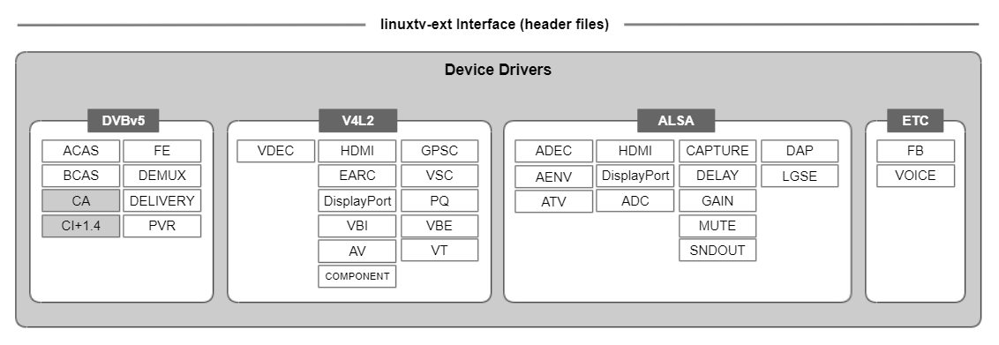

Device Drivers
##############

This chapter provides an overview of device drivers and describes device driver classes. Additionally, it offers implementation guidelines that cover driver implementation and testing of the drivers.

.. contents:: Table of Contents
   :depth: 3
   :local: 

Overview
********

The device drivers for webOS TV, also known as kdrivers, run in the kernel space and provide an interface between webOS TV and the specific hardware devices. The webOS TV application/framework can directly access the hardware through these kernel-level drivers or indirectly through user-level HAL libraries and kernel-level drivers, enabling the utilization of all device functionalities.

To ensure optimal performance and compatibility, the device drivers are based primarily on open-source technologies. These technologies include Digital Video Broadcasting (DVB), Video for Linux API version 2 (V4L2), and Advanced Linux Sound Architecture (ALSA). By leveraging these technologies, the device drivers provide a reliable and efficient foundation for hardware interaction in webOS TV.

Device Driver Classes
*********************

The device drivers can be categorized into four classes: DVBv5, V4L2, ALSA, and ETC. The following diagram illustrates the classes:

DVBv5 (Digital Video Broadcast version 5)
=========================================

The DVBv5 drivers provide interfaces to control hardware devices associated with digital broadcasting service, as defined by the Linux Media Subsystem standard.

* Tuner and Demodulator
* Conditional Access 
* TS Demultiplexer

V4L2 (Video4Linux API version 2)
================================

The V4L2 drivers provide interfaces to control video-related broadcasting inputs, external inputs, and outputs, as defined by the Linux Media Subsystem standard.

* MPEG2 Video Decoder (VDEC)
* External inputs (HDMI, eARC, Display Port, VBI input, A/V, Component)
* Video outputs (Scaler, Picture Quality, Panel, Video Texture)

ALSA (Advanced Linux Sound Architecture)
========================================

The ALSA drivers provide interfaces to control audio-related inputs, external inputs, outputs, and sound engines, as defined by the Linux Sound Subsystem standard.

* MPEG2 Audio Decoder (ADEC)
* External inputs (HDMI, Display Port, ADC)
* Audio outputs (Capture, Delay, Gain, Mute, Soundout)
* Sound effects (DAP, SoundEngine)

ETC
===

In addition to the DVBv5, V4L2, and ALSA drivers, there are the following device drivers.

* Frame buffer control (FB)
* Built-in microphone voice input control (Voice)

Implementation Guidelines
*************************

This section provides guidelines for device driver implementation.

Driver Implementation
=====================

A webOS TV BSP provides an interface to kernel-level device drivers by implementing a specific set of standard functions and extended ``ioctl()`` commands to support unique hardware attributes. The complete interface to device drivers is defined in the linuxtv-ext header files. A driver implementation must adhere to the interface specifications defined and properly implement its functions. Additionally, the driver implementation must meet its quality requirements. 

For detailed information about functionalities, requirements, and interface specifications for a device driver, please refer to the respective driver implementation guide in **Part II LG Linux TV Driver Implementation**.

For detailed information about the packaging format for device drivers and how to place the build package in the source tree, please refer to the **BSP Component Organization** section.

Testing Drivers
===============

The device drivers should be thoroughly tested in functionality, exception handling, and performance by using the SoCTS tool. For detailed information on how to test your device drivers, please refer to **Part IV. Testing and Verification**.

