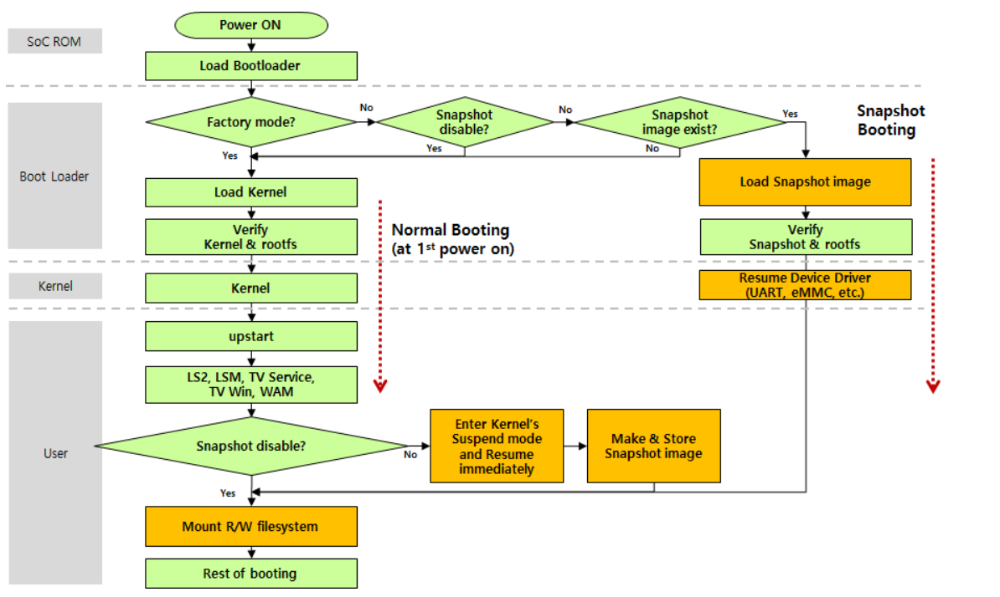

HAL Libraries
#############

This chapter provides an overview of HAL libraries and describes the types of HAL libraries. Additionally, it offers implementation guidelines that cover driver implementation and testing of the libraries.

.. contents:: Table of Contents
   :depth: 3
   :local: 

Overview
********

The HAL libraries, also known as hal-libs, are a type of user-level device drivers. They provide an interface between the upper layer (webOS applications, modules, and services) and the hardware devices. HAL libraries do not directly control the hardware but instead, access the hardware through kernel-level device drivers. 

The HAL libraries consist of various modules responsible for TV broadcast-related features, graphic control, content protection, as well as system and hardware control, as shown in the figure below.

* Broadcast-related features (ECP, PVR, ACAS_LIB)
* GPU control (GAL)
* Image (JPEG, VO)
* Content protection (SVP, DRM, CRYPTO, HDCP2)
* System and hardware control (SYS, USB, MICOM, MMC)

Implementation Guidelines
*************************

This section provides guidelines for device driver implementation.

HAL Implementation
==================

The HAL libraries are designed to offer a set of hardware abstraction APIs and to interact easily with the upper layers. Each module consists of a set of functions covering the features used by traditional TV services.

The complete interface to device drivers is defined in the hal-libs header files. A module implementation must adhere to the interface specifications defined and properly implement its functions. Additionally, the module implementation must meet its quality requirements. 

For detailed information about functionalities, requirements, and interface specifications for a HAL library module, please refer to the respective driver implementation guide in **Part III LG HAL Implementation.**

For detailed information about the packaging format for modules and how to place the build package in the source tree, please refer to the **BSP Component Organization** section.

Testing HAL 
===========

The HAL libraries should be thoroughly tested in functionality, exception handling, and performance by using the SoCTS tool. For detailed information on how to test your device drivers, please refer to **Part IV. Testing and Verification.**

