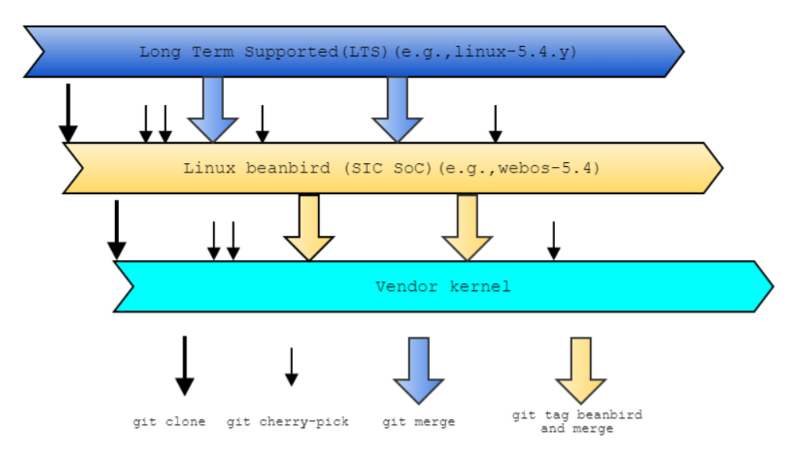
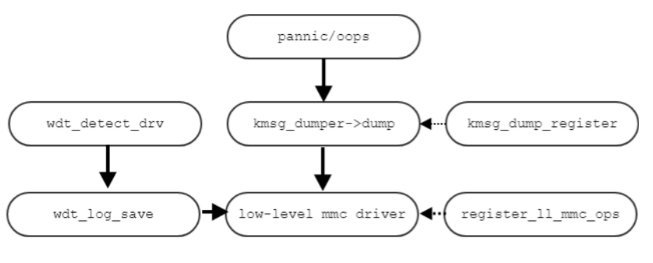

kernel
######

Overview
*********

When powering webOS TV on third-party chips, vendors use different versions of the kernel and their implementation of some features of the kernel differs with each other, which leads to fragmentation.

To resolve such fragmentation issue, the kernel implemented on the SoC manufactured by LG Electronics, the so-called SIC SoC, has been adopted as the standard kernel for webOS TVs and named "**beanbird kernel**". 

The beanbird kernel is based on the upstream Linux Long-Term Supported (LTS) kernel. webOS TV specific changes and some other improvements are applied to the Linux LTS kernel, which results in forming the beanbird kernel.

Vendors use the beanbird kernel as the backbone of their kernel implementation and apply vendor/OEM-specific changes to add support for their own SoCs.

The following diagram shows the kernel construction flow from the LTS kernel down to the vendor kernel:

The beanbird kernel is maintained in the `kernel.lge.com <http://kernel.lge.com/>`_ space.

If vendor/OEM features should be reflected or patches applied to the beanbird kernel, vendors place a patch request for the beanbird kernel in `kernel.lge.com <http://kernel.lge.com/>`_, which will be reviewed and reflected to the beanbird kernel subsequently.

Vendor kernel source codes are maintained in the `swfarmhu.lge.com <http://swfarmhu.lge.com/>`_ space, or simply swfarmhub. 

When vendors prepare their build environment, their kernel source should be downloaded from the swfarmhub to configure their BSP components. See :ref:`Build Environment > OE Build Environment <OE Build Environment>` for details about how the kernel codes should be maintained.

Kernel Features
***************

Movable Zone CMA
================

The Linux kernel divides memory into the following three memory zones: DMA, Normal, and Movable. 

The Movable zone is also known as ZONE_MOVABLE. This zone is used for allocating the memory of movable pages. Movable pages can be relocated and easily moved by the kernel if necessary.

In the beanbird kernel, the **mm/cma** component manages the memory of the Contiguous Memory Allocator (CMA) area by using the ZONE_MOVABLE zone.

CMA enables the allocation of contiguous blocks of memory and has the following characteristics so that the pages allocated by CMA can be easily accessed in the system:

* The CMA area consists of movable pages.
* When allocating memory, CMA migrates the allocated pages and hands out large contiguous blocks.

The mainline kernel's CMA implementation has the following limitations:

* CMA memory utilization: CMA memory classified as migration type in the same zone is not actively utilized.
* Useless reclaim: Unnecessary reclaims occur since it's difficult to distinguish CMA pages.
* Atomic allocation failure problem: Due to the CMA's fallback allocation policy, atomic allocation occasionally fails as kswapd does not operate properly.
* Useless compaction: When performing compaction, you might run into a situation where CMA pages are not distinguished and unmovable allocation fails.

To resolve such issues, the beanbird kernel changes the mainline kernel's CMA into the Memory zone and uses the Movable zone as its CMA zone, instead.

This can be accomplished by applying the GFP_CMA flag to determine the CMA policy, as shown below:

* To minimize the CMA allocation failure, implement the __GFP_CMA flag additionally which can be allocated with high priority in the page allocation path.
* Apply the __GFP_CMA flag to allocate anonymous pages first in the CMA area.
* Apply the __GFP_CMA flag to allocate zspage first in the CMA area.

<configuration>
  .. list-table::
    
    * - CONFIG_CMA_ZSPAGES
      - Set to yes if zspages are allowed to be allocated in the CMA area.
    * - CONFIG_CMA_ANON
      - Set to yes if anonymous pages are allowed to be allocated in the CMA area.
    * - CONFIG_CMA_POPULATE
      - Set to no if CMA is not populated to GFP_HIGHUSERMOVABLE and allocation with __GFP_CMA only is allowed to be allocated in the CMA area.

logger/mmcoops
==============

**logger/mmcoops** is a feature that saves kernel log or debug messages into the flash memory when the following system crashes have occurred in the kernel:

* **The kernel panics or oops.** A panic refers to a system crash in which the system cannot recover on its own and an oops means a serious error has occurred that has to be analyzed and fixed for proper operation of the system.
* **The watchdog detects a system failure.** The watchdog timer monitors the overall system behavior and reports any faults detected in the system.
* **dm-verity fails.** dm-verity is used for verified boot to ensure the integrity of blocks being loaded.

In the boot parameter, assign the partition name and the offset address where the log messages will be saved.

.. code-block:: text

  mmcoops=<partition name>@<offset address>
  ex) mmcoops=hib@0x1000000, mmcoops=kernel_log

The following diagram shows the workflow of the mmcoops component:

<configuration>

.. list-table::
  
  * - CONFIG_LOGGER
    - Choose this option to enable the logger which stores panic and debug messages to a flash partition where it can be read back at some later point when the system crashes.
  * - CONFIG_LL_MMC
    - Support for the low-level MMC driver which is only used during a kernel crash. Once this driver has worked, there's no way the system can be recovered.
  * - CONFIG_WDT_LOG
    - Support for saving log files on WDT by MICOM

Low memory notifier
===================

The **low_mem_notify** driver informs user processes of low memory conditions so that they can prepare user memory in advance and prevent the oom kill action before the oom killer is triggered.

The low_mem_notify driver's most fundamental function is setting a threshold to send notifications from the low-memory notifier and informing the low-memory notifier when the threshold is reached.

* The low-memory notifier sets its threshold for notification by using ``/sys/kernel/mm/low_mem_notify/event_ctrl``.
* The ``__alloc_pages_nodemask()`` function repeatedly calls ``low_mem_notify()`` to check and detect the low memory condition quickly.
* You can check the currently available pages through ``usable_page``.

<configuration>

.. list-table::
  
  * - CONFIG_LOW_MEM_NOTIFY
    - Enables support for low memory notifier

Fault Notifier
==============

Fault Notifier operates in conjunction with webOS TV's Fault Manager and reports information about the following faults in the kernel to the Fault Manager. In addition to the following fault conditions, developers can use the ``fn_kernel_notify`` function to add more fault conditions that must be reported to the Fault Manager.

* ext4 file system crash
* file description leakage
* specific driver failure

<configuration>

.. list-table::
  
  * - CONFIG_FAULT_NOTIFIER
    - Support for Fault Notifier that communicates with Fault Manager in webOS TV.

File System : r/w ntfs
======================

The beanbird kernel uses a read-writable NTFS file system by modifying the existing open-source (read-only) NTFS file system in the Linux kernel and adding the read-write functionality to it.

R/W NTFS is required to support scenarios using external disks (USB) since external disks are generally formatted to Microsoft Windows file systems and NTFS takes the largest portion of it. Although other alternative commercial or open-source versions of R/W NTFS solutions (such as NTFS-3g and userspace R/W NTFS) are available, the beanbird kernel implements its own R/W NTFS file system due to security, maintenance, and cost issues. Recently, the Linux kernel has included an open-source version of R/W NTFS (NTFS3), but due to its insufficient maintenance support, the beanbird kernel maintains its own R/W NTFS file system.

The beanbird kernel also implements ntfsprogs-plus, a collection of utilities for managing the NTFS file system. Currently, the journaling feature is not supported.

Get the Kernel Running
**********************

Using the Beanbird Kernel
=========================

The source code of the beanbird kernel is maintained on the following site: `kernel.lge.com <http://kernel.lge.com/>`_

Run the following command to download the source of the beanbird kernel from one of the SIC SoC models, which is maintained as the standard kernel for webOS TVs.

.. code-block:: bash

  $ git clone git://kernel.lge.com/linux-lg115x.git

webOS common kernel features are committed to the beanbird kernel (Linux beanbird). To maintain common deployment, vendors merge the commits released through beanbird tags in the beanbird kernel into their vendor kernels. 

Import the linux-beanbird.git repository in the swfamrhub site and then add the beanbird tag:

.. code-block:: bash

  $ git clone ssh://<my_id>@swfarmhub.lge.com:29418/linux-beanbird.git
  $ cd linux-beanbird/
  $ git remote add kernel.lge.com http://kernel.lge.com:8418/p/kernel/linux-lg115x.git
  $ git checkout -b webos-5.4 remotes/origin/webos-5.4
  $ git fetch kernel.lge.com refs/tags/beanbird-5.4/<submission>:refs/tags/beanbird-5.4/<submission>
  $ git reset --hard beanbird-5.4/<submission>
  $ git push origin webos-5.4
  $ git push origin beanbird-5.4/<submission>

In case you only import the new tag in the repository and add the beanbird tag, run the following commands:

.. code-block:: bash

  $ git remote update
  $ git fetch kernel.lge.com refs/tags/beanbird-5.4/<submission>:refs/tags/beanbird-5.4/<submission>
  $ git reset --hard beanbird-5.4/<submission>
  $ git push origin webos-5.4
  $ git push origin beanbird-5.4/<submission>

At this point, vendors can use their own toolchain to build the downloaded kernel. This approach is discouraged since a good deal of effort is necessary to get the kernel built with the individual vendor's own toolchain. 

Using the Starfish Kernel
=========================

Vendors need to use the OE build to build the kernel. 

1. Make sure you download and install the webOS toolchain.
2. Download the kernel source code from the following "build-starfish" git. You need to have access to the wall (wall.lge.com) repository. 

  .. code-block:: bash

    $ git clone ssh://wall.lge.com:29444/wall/starfish/build-starfish

3. Checkout the following build version: 

  .. code-block:: bash

    $ git checkout builds/webos4tv/1083
  
4. Run the following mcf command. The mcf command creates a file to initialize the build environment. 

  .. code-block:: bash

    $ ./mcf -p <num of CPUs> -b <num of CPUs> <machine>

    ex) $ ./mcf -p 8 -8p o24

5. Build the kernel with the following command: 

  .. code-block:: bash

    $ make linux-rockhopper

6. You can alternatively use the following commands to build the kernel: 

  .. code-block:: bash

    $ source oe-init-build-env
    $ bitbake linux-rockhopper

To clean your build, run the following command: 

  .. code-block:: bash

    $ make cleanall-linux-rockhopper

You can alternatively use the following command to clean your build:

  .. code-block:: bash

    $ bitbake linux-rockhopper -c cleanall

Kernel Configuration
********************

The beanbird kernel's configuration is based on the Linux kernel's defconfig configuration file. Defconfig files contains kconfig settings for kernel features and system parameters which are used to properly build the kernel with desired kernel configuration settings.

The beanbird kernel's configuration file is name ``lg1k_defconfig``, which is found at the ``/arch/arm64/configs`` directory of the kernel tree. The Linux kernel's defconfig file is also located at the same path.

.. code-block:: 

  ┬/arch/arm64/configs
  ├ defconfig
  ├ lgk1_defconfig
  └ lgk1_kdump_defconfig

When building the kernel, use the lg1k_defconfig file as the vendor kernel's initial base configuration for their kernel build. We recommend that vendors incrementally enable vendor specific features one by one by following the trial-and-error approach to gradually incorporate necessary features and parameters into their kernel configuration.

When a beanbird tag is released in the beanbird kernel, vendors compare their defconfig file with the newly released lgk1_defconfig and reflect necessary changes to their kernel configuration.

Power Management Guideline
**************************

This section discusses guidelines for power management in the beanbird kernel. The beanbird kernel leverages technologies such as snapshot boot, suspend-to-disk (STD), and suspend-to-RAM (STR) to manage its power consumption.

Snapshot Boot
=============

The beanbird kernel has the following two responsibilities in dealing with snapshot boot:

* Creating a snapshot image (Making Image)
* Loading and resuming from a snapshot image (Resume)

Making Image 
------------

According to the Linux kernel's `hibernation requirements <https://www.kernel.org/doc/html/next/admin-guide/pm/sleep-states.html#hibernation>`_, the kernel should perform the following two tasks when the system goes into hibernation:

* Stops all system activity
* Creates a snapshot image of memory to be written into persistent storage (hard disk)

As set forth in the Linux kernel's specification, the kernel is responsible for making a snapshot image when the system enters into hibernation. In webOS TV, the suspend-to-disk (STD) action is considered to trigger the hibernation state.

The beanbird kernel creates a snapshot image only if it's the first time the boot-up sequence is executed.

The snapshot-making sequence is carried out in the kernel according to the following manner:

1. Verifies the system
  a. Freeze processes
  #. Preallocate memory space
2. Saves system states
  a. Suspend device states (SUSPEND)
  #. Disable non boot cpu
  #. Save core states
3. Snapshot the memory state
  a. Copy the snapshot image to memory
4. Restore the system state
  a. Load core states
  #. Enable non boot cpu
  #. Resume device states (RESUME)
5. Write the snapshot image
  a. Copy memory image to eMMC
  #. Free the pre-allocated memory space
  #. Thaw Processes
6. TV done
7. webOS done

Resume
------

If a snapshot image already exists in the eMMC memory, then the kernel loads the snapshot image in the memory and resumes the system to the previously saved states.

The snapshot resume is carried out according to the following manner:

1. Restore the snapshot image
  a. Copy snapshot image to memory
  #. Enable mmu
2. Restore system states
  a. Restore core states
  #. Enable non boot cpu
  #. Free the pre-allocated memory space
  #. Resume device states
3. Thaw processes
4. TV done
5. WebOS done

Snapshot Booting Sequence
-------------------------

The overall snapshot booting actions are managed by Snapshot Boot Manager (SBM). The following diagram shows the snapshot booting sequence for the normal boot and the snapshot resume.

.. image:: resource/snapshot_booting_sequence_diagram.PNG
  :width: 100%

STD
===

The kernel saves and restores the state of the system when the system goes into or wakes up from STD, also known as hibernation. The kernel's role in STD is summarized in the :ref:`Overall Snapshot boot description`_ of the STD documentation.

STR
===

STR is also known as standby mode. STR consumes more power than STD, since the system isn't actually turned off but stays in a low-power state by preserving the system state in RAM. The kernel's role in STR is summarized in the :ref:`Overall STR flow`_ section of the STR documentation.

Linux Kernel Power Management
=============================

The Linux kernel imposes a set of power management requirements. Refer to the following topics in the Linux kernel guides for your reference on power management.

STD
---

Linux Kernel's STD definition: https://www.kernel.org/doc/html/next/admin-guide/pm/sleep-states.html#hibernation

Linux Kernel's hibernation testing (STD): https://docs.kernel.org/power/basic-pm-debugging.html#testing-hibernation-aka-suspend-to-disk-or-std

STR
---

Linux Kernel's STR definition: https://www.kernel.org/doc/html/next/admin-guide/pm/sleep-states.html#suspend-to-ram

Linux Kernel's STR testing: https://docs.kernel.org/power/basic-pm-debugging.html#testing-suspend-to-ram-str 

Testing suspend and resume
--------------------------
Linux Kernel's suspend and resume testing: https://docs.kernel.org/power/drivers-testing.html#testing-suspend-and-resume-support-in-device-drivers