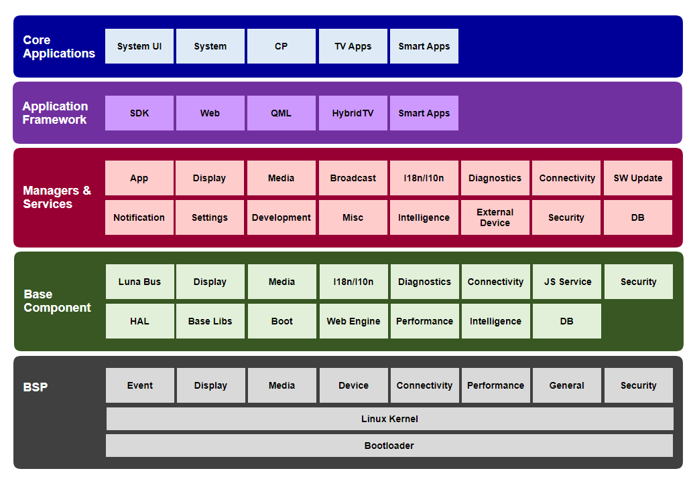
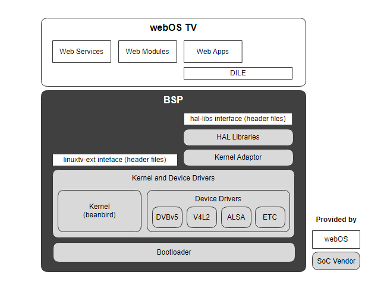
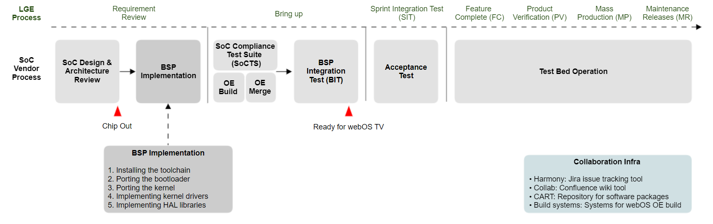

Overview
############

webOS TV is a web-centric smart TV platform that has powered LG Smart TVs for over a decade, delivering a full range of entertainment through its user-friendly home UX/UI interface and seamless connection.

webOS TV is based on Linux and adopts verified open-source software (OSS) components such as Yocto, Qt, Chromium, and Enact. It not only verified its reliable and stable performance across the globe but also demonstrated the potential and qualification to become a leading player in the Linux-based smart display platforms competition.

This chapter provides an overview of webOS TV and a Board Support Package (BSP) for webOS TV. It includes brief descriptions of the webOS TV architecture, the components that make up the BSP, and outlines the steps needed to develop the BSP for a new hardware platform.

.. contents:: Table of Contents
   :depth: 1
   :local: 

webOS TV Architecture
*************************

The following figure shows the overall layered architecture of webOS TV. webOS TV consists of a set of layers: Core Applications, Application Framework, Managers & Services, Base Components, BSP, and Kernel.

**Core Applications**

webOS TV has Core Applications as the top layer and this layer includes System UI and System, CP, TV apps, and Smart apps.

**Application Framework**

To help developers create better apps and services, the Application Framework layer provides enhanced options and environments compared to developing solely with HTML5, JavaScript, or CSS. The web app framework Enact and Software Development Kit (SDK) are provided, as well as the app frameworks for QML, HybridTV, and System apps.

**Managers & Services**

The Managers & Services layer provides managers and services for using webOS TV functions in the app. It includes key components such as System and Application Manager, Web Application Manager, Activity Manager, Luna Surface Manager, uMediaServer, Broadcast Player, DB8, and more.

**Base Components**

The Base Components layer provides third-party open-source libraries or other components that serve as the base for the functions provided by the Managers & Services layer. It includes key components such as Luna Bus (LS2), Web Engine, Node.js, and more.

**Board Support Package (BSP)**

For webOS TV to run on a specific hardware platform, it needs a Board Support Package (BSP) that is customized to the target device. BSP consists of several components for SoC vendors to implement. For a description, including definitions, of BSP components, refer to :ref:`Board Support Package (BSP)`.

.. _Board Support Package (BSP):

Board Support Package (BSP)
*****************************

The BSP contains software required to run webOS TV on a hardware platform. It creates an abstraction of webOS TV that is independent of a specific hardware platform implementation. The following figure shows the components of a webOS TV BSP and the relationship between the BSP components.

**Bootloader**

The bootloader performs all the initial operations required to make the hardware properly usable. It is the first program that a processor executes and is an essential component that must be included in the BSP. The bootloader is responsible for loading the kernel and file system, as well as performing all the basic hardware initializations required before webOS TV can run.

**Kernel and Device Drivers**

The kernel and device drivers are core parts of webOS TV and play vital roles in managing system resources and interacting with hardware devices.

* webOS TV provides a common kernel, called beanbird, to address kernel fragmentation that can occur when SoC vendors use different kernel versions and implement some webOS features differently.
* Device drivers are kernel modules that provide an interface between webOS TV and the hardware. They are based primarily on open-source technologies such as Digital Video Broadcasting (DVB), Video for Linux 2 (V4L2), and Advanced Linux Sound Architecture (ALSA). The interfaces of these drivers are defined in the linuxtv-ext header files.

**Kernel adaptor**

The kernel adaptor, also known as kadaptor, acts as an interface between kernel-level device drivers and HAL libraries. The implementation of the kadaptor may vary depending on SoC vendors, and in some cases, it may be replaced by other modules provided by the SoC vendor.

**Hardware Adaptation Layer (HAL) Libraries**

The HAL libraries are a type of user-level device drivers that run in user space. They provide an interface between a webOS TV application and kernel-level device drivers or other operating system components. The interfaces of HAL libraries are defined in the hal-libs header files.

BSP Development Process
*************************

The majority of the work involved in enabling webOS TV to run on a specific hardware platform is implementing the BSP for webOS TV and verifying the functionality and stability of the BSP. The figure below illustrates the overall BSP development process for SoC vendors who are new to webOS TV to bring up their hardware platform.

**SoC Design & Architecture Review**

The SoC Design & Architecture Review phase reviews the SoC design and specifications, analyzes the requirements that the SoC vendor must implement, and provides feedback and suggestions on potential risks. All requirements to be implemented by the SoC vendor are registered as issues in Harmony.

**BSP Implementation**

Once the SoC Design & Architecture Review is complete, implement the BSP. The BSP implementation includes the steps listed below:

1. Installing the toolchain
2. Porting the bootloader
#. Porting the kernel
#. Implementing kernel drivers
#. Implementing HAL libraries

This webOS TV BSP Documentation focuses on the BSP implementation phase within the overall BSP development process. "Part I. Foundations" covers steps 1-3, "Part II. LG Linux TV Driver Implementation" covers step 4, and "Part III. LG HAL Implementation" covers step 5. For detailed explanations of each step, please refer to the respective document.

**SoC Compliance Test Suite (SoCTS)**

SoCTS is the BSP verification testing tool for webOS TV, designed to improve quality and prevent regression. SoCTS supports unit tests, integration tests, and automated reporting.  Unit tests verify each module that consists of the webOS TV BSP, and integration tests verify the interfaces between BSP modules and scenarios of webOS TV. The automated reporting automatically generates results and issues for both unit tests and integration tests. For more information about SoCTS, see "Part IV. Testing and Verification".

**OpenEmbedded (OE) Build and Merge**

The OE Build phase sets up the build environment to enable the development of SoC vendor's BSP on the OE build system used by webOS TV. This phase also generats the EPK file, which is the webOS image file, for SoC board bring-up.

The OE Merge phase merges the recipe files (.bb) of BSP components that meet the bringupBAT criteria into the OE meta layer git. This is necessary for LG engineers to develop webOS TV features smoothly, as they require the BSP that meets the minimum bringupBAT criteria through SoC board bring-up.

For more information on OE build system, see the ":ref:`OpenEmbedded (OE)`" section in this document.

.. note::
   To proceed with the OE Merge phase, the following test cases must be passed to meet the bringupBAT criteria.

   1. Verify that the build installs correctly. You must flash the .squashfs.epk image and specify the build MACHINE on which you performed the testing in the results.
   2. Verify Instop (by pressing the Instop key) and confirm power off.
   #. Disable the snapshot mode in the bootloader by setting the value of the snapshot key to "off" and verify that the TV boots with the remote controller.
   #. Verify that the Linux shell mode can be accessed using any PC terminal program.
   #. Skip Firstuse app settings (If the Firstuse app launches, select "Exit First Use". If the Firstuse app doesn't launch or you cannot select "Exit First Use", create /var/lun/preference/ran-firstuse file in the shell mode and power off/on) and verify that the LiveTV app launches by the channel banner.
   #. Verify that the remote controller can be used to interact with the TV (Launch the quick settings menu and you should be able to move the focus).
   #. Go to HDMI input (by pressing the HDMI key on the remote controller) and check the HDMI banner. (This does not mean that video and audio can be played correctly).
   #. Go to LiveTV (by pressing the TV key on the remote controller) and check the channel banner. (This does not mean that video and audio can be played correctly).
   #. Connect a USB flash drive to the external USB port and check the USB port number in the input list through the input key (usb1/usb2/usb3).
   #. Connect the USB flash drive and check.

   The following code provides an example of displaying information about a mounted USB flash drive.

   .. code-block::

      /tmp # mount   | grep usb
      /dev/sda1 on /tmp/usb/sda/sda1 type ntfs (rw,relatime,uid=0,gid=5000,umask=02,nls=utf8,disable_sparse,errors=continue,mft_zone_multiplier=1)
      /tmp #

**BSP Integration Test (BIT)**

BIT is the process of verifying the integration of your BSP into webOS TV. This phase ensures that the components of the BSP are correctly integrated and functioning within webOS TV. Since BIT testing is conducted on the OE build artifacts, it is necessary to set up the OE build environment and merge the recipe files (.bb) of BSP components before proceeding with BIT testing.

**Acceptance Test**

The Acceptance Test is performed to verify if the BSP meets the requirements of webOS TV and operates as intended. It evaluates the functionality, performance, and compatibility of the BSP by executing various test cases to ensure that it satisfies the requirements of webOS TV.

**Test Bed Operation**

SoC vendors operate test beds to verify the reliability and quality of the BSP. Since the BSP code can be released twice a week, SoC vendors need to operates two test bed groups. The testing period is typically sufficient for about 5 days. For more information about the test bed operation, see "`2.1.3 SoC Vendor Stability Test Bed Process <http://collab.lge.com/main/display/SOCVENDOR/2.1.3+SoC+Vendor+Stability+Test+Bed+Process>`_" on the `SoC Parner Site <http://collab.lge.com/main/pages/viewpage.action?pageId=1082355871&src=sidebar>`_.
