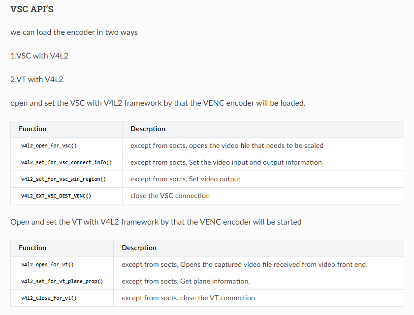
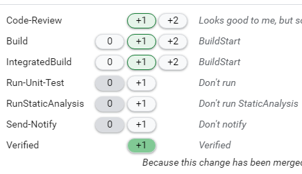
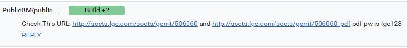

Documentation
#############

.. warning::

  Follow the guide below to write a Module Implementation Guid.

  The main purpose of the Module Implementation Guid is to clearly communicate the background technical information, requirements, API specification information, etc. required for module development to enhance the SoC Vendor's module implementation completeness.

  Due to the characteristics of each module, there may be cases where the contents described below are not applicable or not appropriate to apply, in which case they can be omitted or modified.

.. contents:: Table of Contents
   :depth: 3
   :local:

Introduction
************

Describe what is covered in the Module Implementation Guide and state any prerequisite conditions (knowledge of specific field/technology) required to understand the document.

.. panels::
  :column: col-lg-12 p-2

  Example
  ^^^^^^^

  *For example, the following is an introduction to the VSC module.*

  This document describes the Video Scaler (VSC) driver in the kernel space. The document gives an overview of the VSC driver and provides details about its functionalities and implementation requirements.

  The VSC driver is based on the V4L2 framework. Therefore, the document assumes that the readers are familiar with the V4L2 API and framework principles, which include knowledge of V4L2 controls, buffer mana  gement, and streaming handling, among others.

  The VSC driver is responsible for performing video signal processing, video scaling, and video capture. Therefore, it is necessary to understand video processing techniques and scaling algorithms, including k  nowledge of video formats, resolutions, frame rates, color formats, etc.

Revision History
================

Provide the revision history for the Module Implementation Guide in the following format.

.. panels::
  :column: col-lg-12 p-2

  Template
  ^^^^^^^^

  .. list-table::
    :header-rows: 1

    * - Version
      - Date
      - Changed by
      - Description
    * - *Document version*
      - *Change date*
      - *Author of the change*
      - *Description of major changes*
    * - 1.0
      - 2023.xx.xx
      - xxx@lge.com
      - First release

Terminology
===========

Provide the technical terms, including abbreviations, used in the guide in the following format and sort them alphabetically.

Include only the full name for abbreviations of terms that are commonly used in the industry, and include both the full name and an explanation for terms that are defined by LGE or have a special meaning in this module guide.

.. panels::
  :column: col-lg-12 p-2

  Template
  ^^^^^^^^

  The key words "must", "must not", "required", "shall", "shall not", "should", "should not", "recommended", "may", and "optional" in this document are to be interpreted as described in RFC2119.

  The following table lists the terms used throughout this document:

  .. list-table::
    :header-rows: 1

    * - Term
      - Description
    * - English abbreviations or terms
      - The full name of the abbreviation in English (required). Description of the abbreviation (recommended)
    * - HDMI
      - High-Definition Multimedia Interface.
    * - SDP
      - Secondary Data Packet. Data transported over the Main-Link which is not main video stream data, such as audio data and Infoframe SDPs.

Technical Assistance
====================

Provide the email address of the LGE engineer responsible for technical support of the module.

.. panels::
  :column: col-lg-12 p-2

  Template
  ^^^^^^^^

  For assistance or clarification on information in this guide, please create an issue in the LGE JIRA project and contact the following person:

  .. list-table::
    :header-rows: 1

    * - Module
      - Owner
    * - Module name
      - xxx@lge.com

Overview
********

Provide the information necessary to understand the module before implementing it, including its role and key features, architecture information, and overall operational flow.

General Description
===================

A general introduction to the module, focusing on the role or responsibility of the module.

* If it is an industry-standard technology, provide a brief explanation of the standard (technical definition).
* The role and responsibilities of the module.
  *Why is this module necessary in webOS TV and what role does it play?

Features
========

List the main features supported by the module.

* What functionalities does this module provide?
* Are there any LGE proprietary features?
* If there are any features or limitations not supported compared to the standard, mention them.
.. warning::

  If the length of the Features section is short, it can be included in the General Description.

Architecture
============

Provide architecture information that helps understand the overall structure and functionality of the module. Show an architecture diagram of the module and explain the roles of the components within the diagram.

In this section, you can provide the following types of architecture information:

  .. list-table::
    :header-rows: 1

    * - Architecture Type
      - Mandatory status
      - Description
    * - Driver Archiecture
      - Mandatory
      - - Demonstrates how the driver/module interacts and establishes relationships with the upper and lower layers from a platform architecture perspective.
        - You can utilize the existing diagram in the System Context section and make sure it reflects the following points:

          - Is the diagram divided into User space, Kernel space, and Hardware layers?

          - Is it distinguished and indicated which parts are provided by the webOS platform and which parts should be implemented by the SoC Vendor, with a legend added for webOS and Vendor Specific?
    * - Hardware Architecture
      - Optional
      - - Shows how the hardware IP associated with the driver/module is configured in detail.
    * - Internal Architecture
      - Optional
      - - Shows how the internal components of the module are configured.

Overall Workflow (Optional)
===========================

Explain the overall flow of the main functions provided by the module using the following diagram:

- State diagram
- Call sequence
- Logic sequence

Requirements
************

Describes the requirements that must be met when implementing the module by a SoC vendor, divided into "Functional Requirements" and "Non-functional Requirements".

.. warning::

  When writing the Requirements section, specify the level of requirements according to the keyword criteria defined in RFC2119.

  The use of “MUST”, “MUST NOT”, “REQUIRED”, “SHALL”, “SHALL NOT”, “SHOULD”, “SHOULD NOT”, “RECOMMENDED”, “MAY”, and “OPTIONAL” is per the IETF standard defined in `RFC2119 <https://datatracker.ietf.org/doc/html/rfc2119>`_.

    .. list-table::
      :header-rows: 1

      * - Keyword
        - Different Expression
        - Meaning and Usage
      * - MUST
        - REQUIRED, SHALL
        - Means an absolute requirement that must be strictly followed.
      * - MUST NOT
        - SHALL NOT
        - Menas an absolute prohibition that must not be done under any circumstances.
      * - SHOULD
        - RECOMMENDED
        - Means that there may exist valid reasons in particular circumstances to ignore a particular item, but the full implications must be understood and carefully weighed before choosing a different course.
      * - SHOULD NOT
        - NOT RECOMMENDED
        - Means that there may exist valid reasons in particular circumstances when the particular behavior is acceptable or even useful, but the full implications should be understood and the case carefully weighed before implementing any behavior described with this label.
      * - MAY
        - OPTIONAL
        - Mean that an item is truly optional.

Functional Requirements
=======================

Describes the functional requirements that must be met when implementing the module.

Provides a detailed explanation of each specific functionality unit that can be performed through one or multiple APIs, including the roles and scenarios of each functionality and the requirements that must be met when implementing the functionality.

- An introduction/definition of the functionality provided
- Requirements for the flow of operations for each functionality
- Requirements for data processing and error handling for each functionality
- Requirements for the interface that the functionality provides to other modules

Quality and Constraints
=======================

Describes the non-functional requirements that must be met when implementing the module. Non-functional requirements include quality requirements and constraints.

- Quality requirements describes the performance, security, reliability, compatibility, and other requirements that must be met from the perspective of the module's operation and usage scenarios (these are module-level requirements, not API-level requirements).
  - Requirements for security features that must be supported.
  - Minimum performance requirements to ensure consistent speed and responsiveness.
  - Requirements for reliability and interface compatibility to ensure stable operation, etc.

  .. panels::
    :column: col-lg-12 p-2

    Example
    ^^^^^^^^

    - The module must implement access control mechanisms to prevent unauthorized access to data.
    - The module must support fast switching, such as Instaport (HDMI quick switch). The input switching time between DisplayPort ports must be less than one second, assuming a webOS application is running in the background.
    - The module must have a fast startup time, with the video being displayed within 3 seconds after DC power is turned on.

- Constraints describes the software/hardware limitations and constraints that must be considered for the implementation of the module or to meet the requirements.
  - Constraints on standards that must be applied during implementation.
  - Constraints due to software or hardware limitations
  - Constraints that may be imposed by the characteristics of the module, etc.

  .. panels::
    :column: col-lg-12 p-2

    Example
    ^^^^^^^^

    - The module must be comply with ALSA standard.
    - Drivers cannot be used at the same time because the size or number of buffers to be captured differs depending on the purpose of video capture.
    - At least one Sndout Connection must be established to capture audio data.

.. warning::

  If there are multiple features provided by the module and you want to describe functional and non-functional requirements for each functional unit, you can also organize the Requirements chapter as follows:

  **Requirements**

  - Function A
    - Introduction to Function A: Describe what Function A is and provide an explanation of the related APIs.
    - Functional Requirements: Describe the functional requirements for Function A.
    - Quality and Constraints: Describe the non-functional (performance, security, quality, etc.) requirements for Function A.
  - Function B
    - Introduction to Function B: Describe what Function B is and provide an explanation of the related APIs.
    - Functional Requirements: Describe the functional requirements for Function B.
    - Quality and Constraints: Describe the non-functional (performance, security, quality, etc.) requirements for Function B.
  - ...

Implementation
**************

Describe in detail how to implement the module, including the location of the interface definition/implementation files, the order of API calls, and examples of implementations of all or major components of the module.

File Location
=============

State the path to the header file where the module's interface is defined within the BSP code delivered to the SoC vendor.

  .. panels::
    :column: col-lg-12 p-2

    Example
    ^^^^^^^^

    The OOO interfaces are defined in the OOO.h header file, which can be obtained from https://swfarmhub.lge.com/.

    - Git repository: bsp/ref/OOO-header
    - Location: [as_installed]/linux/OOO.h

API List
========

Provide a summary of the data types and functions list for the interface of the module.

  .. panels::
    :column: col-lg-12 p-2

    Example
    ^^^^^^^^

    The OOO module implementation must adhere to the interface specifications defined and implements its functions. Refer to the API Reference (해당 모듈의 API Reference 링크 추가) for more details.

Data Types
----------

Provide a summarized list of data types for the module interface, categorized as follows. Exclude any categories that do not apply.

Standard Data Types
^^^^^^^^^^^^^^^^^^^

If there are Linux standard data types used in the module, provide a list as follows. Exclude if there are none.

.. list-table::
  :header-rows: 1

  * - Data Type
    - Description
  * - The name of data type (add a link to API Reference)
    - Description on the data type

Extended Structures
^^^^^^^^^^^^^^^^^^^

If there is a list of extended structures defined by LGE, provide a list as follows. Exclude if there are none.

.. list-table::
  :header-rows: 1

  * - Data Type
    - Description
  * - The name of data type (add a link to API Reference)
    - Description on the data type

Extended Enumerations
^^^^^^^^^^^^^^^^^^^^^

If there is a list of extended enumerations defined by LGE, provide a list as follows. Exclude if there are none.

.. list-table::
  :header-rows: 1

  * - Data Type
    - Description
  * - The name of data type (add a link to API Reference)
    - Description on the data type

Functions
---------

Provide a summarized list of functions for the module interface, categorized as follows. Exclude any categories that do not apply.

Standard Functions
^^^^^^^^^^^^^^^^^^

If there are Linux standard functions used in the module, provide a list as follows. Exclude if there are none.

.. list-table::
  :header-rows: 1

  * - Function
    - Description
  * - The name of function (add a link to API Reference)
    - Brief description on the function
  * - The name of ioctl command (add a link to API Reference)
    - Brief description on the ioctl command

Standard Control IDs
^^^^^^^^^^^^^^^^^^^^

If there are Linux standard control IDs used in the module, provide a list as follows. Exclude if there are none.

.. list-table::
  :header-rows: 1

  * - Function
    - Description
  * - The name of Control ID (add a link to API Reference)
    - Brief description on the function

Extended Functions
^^^^^^^^^^^^^^^^^^

If there are extended functions defined by LGE, provide a list as follows. Exclude if there are none.

.. list-table::
  :header-rows: 1

  * - Function
    - Description
  * - The name of function (add a link to API Reference)
    - Brief description on the function
  * - The name of ioctl command (add a link to API Reference)
    - Brief description on the ioctl command

Extended Control IDs
^^^^^^^^^^^^^^^^^^^^

If there are extended control IDs defined by LGE, provide a list as follows. Exclude if there are none.

.. list-table::
  :header-rows: 1

  * - Function
    - Description
  * - The name of Control ID (add a link to API Reference)
    - Brief description on the function

.. warning::

  If it is a Linux standard header, write the API List section as follows:

  **Data Types**

  Detailed description of each data type and a link to the Linux standard data type.

  **Functions**

  Detailed description of each API function and a link to the Linux standard function.

API Function Requirements Header File Format and Writing Guide
==============================================================

This is a format and guide for writing requirements for each API function of the module.

.. seealso::

	Reference ``V4L2_CID_EXT_VSC_ORBIT_WINDOW``

(based on v4l2 docs)

.. code-block:: rst

	/**
	* @brief Connects Video Front End (Write a brief description.)
	*
	* @rst
	* Functional Requirements
	*   Write the requirements for the API interface.
	*
	* Responses to abnormal situations, including
	*   Write about the BSP exception handling in abnormal situations, negative conditions.
	*
	* Performance Requirements
	*   Write the Performance Requirements related to this Interface.
	*   If there are no requirements, write that there are no special requirements.
	*
	* Constraints
	*   A general description should be provided for all items that limit the developer's choice, such as:
	*   Regulatory plocies
	*   Hardware limitations (e.g., signal timing requirements)
	*   Interfaces to other applications
	*   Parallel operation
	*   Audit functions
	*   Control functions
	*   Higher-order language requirements
	*   Signal handshake protocols(e.g., XON-XOFF, ACK-NACK)
	*   Reliability requirements
	*   Criticality of the application
	*   Safety and security considerations
	*   If there are no requirements, write that there are no special requirements.
	*
	* Functions & Parameters
	*   .. code-block:: cpp
	*
	*     // List of functions or commands
	*
	*     // List of parameters
	*
	* Return Value
	*   Write a description about the Return Value.
	*
	* Control Type
	*   Write the function prototype or ioctl command.
	*
	* Example
	*   .. code-block:: cpp
	*
	*     // Write a sample code of the user's API function.
	*
	* Remark (optional)
	*   description
	*
	* Seealso (optional)
	*   description
	* @endrst
	*/

How to add attachments
======================

For attaching a file for additional information, use the following format.

.. code::

  :download:`example <../example.pdf>`

The 'example' is the name that will be displayed in the document, and the <> contains the relative path and name of the file to be attached with the current rst file being written.
It is recommended to place the attached file at the same depth as the file currently being written.
When viewed in HTML, the file can be downloaded immediately by clicking on the above tag.

When a file attachment is needed, write it as follows.

.. code::

  if you see this page in HTML, please click below tag.
	example

API exception for SoCTS
=======================

The SoCTS Coverage (http://swdev.lge.com/coverage.html) displays the implementation status of APIs declared in the header in SoCTS.
Due to various circumstances, if implementation into SoCTS is impossible, we need to avoid counting it as an unimplemented API in the Coverage.
The method for exception handling to avoid this is explained below.

The rule requires you to write 'except from socts' along with the reason in the Description section of the Function.
If the TAS implementation is already completed or if the SOCTS test is not implemented for other reasons, you should note 'except from socts, reason' in the Description section.

Here is an example from an actual rst file.

  .. panels::
    :column: col-lg-12 p-2

    Example
    ^^^^^^^^

    .. code-block:: none

      Function Calls
      ==============

      we can load the encoder in two ways

      1.VSC with V4L2

      2.VT with V4L2

      | open and set the VSC with V4L2 framework by that the VENC encoder will be loaded.

      ================================================ ================================================================
      Function                                         Descrption
      ================================================ ================================================================
      :cpp:func:`v4l2_open_for_vsc`                    except from socts, opens the video file that needs to be scaled
      :cpp:func:`v4l2_set_for_vsc_connect_info`        except from socts, Set the video input and output information
      :cpp:func:`v4l2_set_for_vsc_win_region`          except from socts, Set video output
      :cpp:func:`V4L2_EXT_VSC_DEST_VENC`               close the VSC connection
      ================================================ ================================================================

      | Open and set the VT with V4L2 framework by that the VENC encoder will be started

      ================================================ ===============================================================================
      Function                                         Descrption
      ================================================ ===============================================================================
      :cpp:func:`v4l2_open_for_vt`                     except from socts, Opens the captured video file received from video front end.
      :cpp:func:`v4l2_set_for_vt_plane_prop`           except from socts, Get plane information.
      :cpp:func:`v4l2_close_for_vt`                    except from socts, close the VT connection.
      ================================================ ===============================================================================

The above code will be represented as follows in HTML once the build is completed.

Implementation Details
======================

Provides detailed information related to module implementation, including guidelines and recommendations for enhancing implementation clarity and consistency, suggestions, implementation considerations, and example code if available.

- For the main functions of the module, describe any design peculiarities or considerations to be taken into account during implementation.

  .. panels::
    :column: col-lg-12 p-2

    Example
    ^^^^^^^^

    The OOO module includes functions to ~~ for supported devices:

    - The OOO function ~~
    - The OOO function ~~

- For the main functions of the module, describe any design peculiarities or considerations to be taken into account during implementation.
  - If there is a specific code implementation sequence, explain it with diagrams.
  - If there is an implementation checklist, describe it.

  .. panels::
    :column: col-lg-12 p-2

    Example
    ^^^^^^^^

    To implement Dynamic Aspect Ratio, complete these checklist:

      - Implement the interface that directly receives resolution, AFD, and PAR information from the VDEC driver.
      - Implement :c:macro:`V4L2_CID_EXT_VSC_ASPECTRATIO_POLICY` that receives Aspect Ratio UI and Policy from the videooutputd service
      - Implement export_vsc_adapter. Aspect Ratio Library use export_vsc_adapter to register the callback of ``aspectratiodrvCalculateWindow()``.
      - When the Adaptive Stream flag is 2 (Dynamic Aspect Ratio Mode), calculate the aspect ratio from ``aspectratiodrvCalculateWindow()`` registered in export_vsc_adapter and scaled in units of frames.
      - When scaling aspect ratio by changing resolution, AFD, and PAR, it should be applied seamlessly.

- If there are example codes for the module/driver, provide them.

Status Log (Optional)
=====================

Provides guidance on logging the status of the module (applicable to modules that support a Status Log file).

  .. panels::
    :column: col-lg-12 p-2

    Example
    ^^^^^^^^

    To examine the status and operation of the OOO module, you can use the status log file, a text-based log file. For more information, refer to Status Log File.

Debugging (Optional)
********************

If there are any tips for debugging the implemented module, describe them here.

How to Build Documentation
**************************

Building on Wall
================

It is possible to build SoCTS documents and binaries on the wall. As shown in the picture below, click the reply button on the wall page and do Build +1 or IntegratedBuild +1.

The difference between the Build and IntegratedBuild buttons is as follows:

.. list-table::
  :header-rows: 1

  * - Build +1
    - IntegratedBuild +1
  * - Creating a specific document related to the corresponding header when changes occur in each repository.
    - Creating a single document by integrating documents stored in separate repositories.

After about 5 minutes, the path of the output is displayed in the change log as shown below. However, if there is a build error, nothing happens and it is impossible to know where the error occurred.

Therefore, the local build method described below is recommended.

Building on Linux
=================

Preparation
-----------

Requirements:

* 'doxygen' (version 1.6 or higher)
* 'python3' (version 3.6 or higher) and it's 'pip'

.. note::
  The simplest way to use 'doxygen' and 'python3' is install via package system
  (ex, ``apt``) with the root privilege.

  If you don't have the root privilege, you can install in user space locally.
  Build tools like 'gcc', 'make', 'cmake' must be required to install locally.

  In case of installation of 'doxygen', install commands may like this:

  .. code-block:: bash

    ## doxygen installation locally
    ## check more on http://www.doxygen.nl/manual/install.html#install_src_unix

    wget http://doxygen.nl/files/doxygen-1.8.16.src.tar.gz
    tar xf doxygen-1.8.16.src.tar.gz
    cd doxygen-1.8.16
    mkdir build
    cd build
    cmake -G "Unix Makefiles" -DCMAKE_BUILD_TYPE=Release -DCMAKE_INSTALL_PREFIX=$HOME/local -Wno-dev ..
    make; make install

    ## doxygen will be installed in $HOME/local/bin
    ## modify PATH in your rc file like this:
    ## PATH=$PATH:$HOME/local/bin

  'doxygen' requires libraries 'bison', 'flex', and 'iconv'.
  If these libraries are not installed, you can install like this:

  .. code-block:: bash

    ## for example 'bison' library installation locally

    wget https://ftp.gnu.org/gnu/bison/bison-3.0.tar.gz
    tar xf bison-3.0.tar.gz
    cd bison-3.0
    ./configure --prefix=$HOME/local; make; make install

  The libraries may be OK for doxygen:

  * 'bison' version 2.0 or higher
  * 'flex' version 2.0 or higher
  * 'iconv' version 2.0 or higher

Next step requires 'python3'. You can check it's already installed via
``python3 --verison`` command. If it's not installed, install 'python3' via
package system with root privilege or `install using the source code
<https://docs.python.org/3/using/unix.html#building-python>`_.

Install python library requirements for documentation like below:

.. warning::
  If ``Documentation`` directory is not existed in project,
  switch to ``doc`` branch (``git checkout -b doc origin/doc`` or
  ``git switch -c doc origin/doc`` command).
  This situation shows the documentation is ready but not merged into master
  branch.

.. code-block:: bash

  $ cd (somewhere)/linuxtv-ext-header
  $ cd Documentation
  $ pip3 install -r requirements.txt

If last command is fail due to the permission problem, run
``pip3 install --user -r requirements.txt`` (see
https://pip.pypa.io/en/stable/reference/pip_install/#cmdoption-user).

After execution of last command ``sphinx-build`` must be executed. It may
located in ``/usr/bin`` or ``/usr/local/bin``. If not found, it may located in
``$HOME/.local/bin``. Append the directory to PATH environment variable.

Generate HTML
-------------

In ``Documentation`` directory:

.. code-block:: bash

  $ make clean html

After executing as above, the documentation result is generated in the ``build/html`` directory,
and you can open and check the ``build/html/index.html`` file through a browser.

View HTML with Python WebServer
-------------------------------

Open http://localhost:8000/ after:

.. code-block:: bash

  $ python3 -mhttp.server

or run in background:

.. code-block:: bash

  $ python3 -mhttp.server &

Generate without API Reference
------------------------------

In ``Documentation`` directory:

.. code-block:: bash

  $ export LEH_DOC_DOXYGENINPUT=none
  $ make clean html

To unset:

.. code-block:: bash

  $ unset LEH_DOC_DOXYGENINPUT

Test Specific Modules in Fast
-----------------------------

In ``Documentation`` directory:

.. code-block:: bash

  $ export LEH_DOC_DOXYGENINPUT=../../linux/alsa-ext/alsa-ext-aenc.h
  $ make clean html

To unset:

.. code-block:: bash

  $ unset LEH_DOC_DOXYGENINPUT

Use Parallel Process
--------------------

In ``Documentation`` directory:

.. code-block:: bash

  $ export SPHINXOPTS="-j 6"
  $ make clean html

To unset:

.. code-block:: bash

  $ unset SPHINXOPTS

Test only Doxygen Syntax
------------------------

The `doxygen.conf` is not used to build documentation.
But it can be used to test DocBlocks in source codes.
*(This operation requires only `doxygen`)*

In ``Documentation`` directory:

.. code-block:: bash

  $ doxygen doxygen.conf > /dev/null

will prints all warnings and errors.

in ``html`` directory ``html/index.html`` is generated in doxygen output.

Testing
*******

Provides guidance on SoCTS testing (applicable to modules that support SoCTS Producer).

  .. panels::
    :column: col-lg-12 p-2

    Example

    To test the implementation of the VSC driver, webOS provides SoCTS (SoC Test Suite) tests. The SoCTS checks the basic operation of the VSC driver and verifies the kernel event operation for the module by using a test execution file. For details, see OOO Unit Test in SoCTS Unit Test Specification.

References
**********

Provides a reference list of relevant technical standards or specifications that may be helpful for implementing the module.

  .. panels::
    :column: col-lg-12 p-2

    Example
    ^^^^^^^

    For additional information on related standards or technical topics, refer to:

    - Linux Documentation
    - Wiki
    - ...

.. warning::

  | For Linux Documentation, provides a direct link to the page where the information can be referenced, rather than the home page.
  | For internal resources, provides links accessible to SoC vendors.
