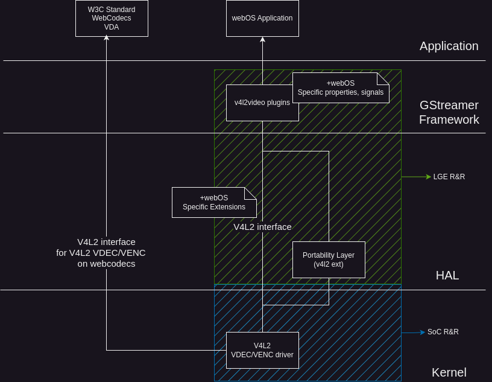

Media Video Decoder(VDEC) / Video Encoder(VENC)
##############

.. _crystal.moon: crystal.moon@lge.com
.. _byeongsu.park: byeongsu.park@lge.com

Introduction
************

|    This document describes the Media Video Decoder(VDEC) / Video Encoder(VENC) module in the kernel space. 
| This document gives an overview of the Media VDEC/VENC module and provides details about its functionalities and implementation requirements.
| The Media VDEC/VENC module is responsible for hardware accelerated media decoding and encoding.
| This hardware accelerated media decoding and encoding is powered by Linux V4L2 API <https://www.kernel.org/doc/html/v6.5/userspace-api/media/v4l/v4l2.html>_
|    For the process of decode, Linux V4L2 Memory-to-Memory Stateful Video Decoder Interface is used.
| Please see `Linux V4L2 Memory-to-Memory Stateful Video Decoder Interface documentation <https://www.kernel.org/doc/html/v6.5/userspace-api/media/v4l/dev-decoder.html>`_ for details.
| Media VDEC implementor must implement a driver which conforms to the Linux V4L2 Memory-to-Memory Stateful Video Decoder Interface.
|    For the process of encode, Linux V4L2 Memory-to-Memory Stateful Video Encoder Interface is used.
| Please see `Linux V4L2 Memory-to-Memory Stateful Video Encoder Interface documentation <https://www.kernel.org/doc/html/v6.5/userspace-api/media/v4l/dev-encoder.html>`_ for details.
| Media VENC implementor must implement a driver which conforms to the Linux V4L2 Memory-to-Memory Stateful Video Encoder Interface.
|    Furthermore, There are extended CIDs to meet a webOS specific requirement. Media VDEC/VENC implementor must implement extended CIDs to meet webOS requirement.

Revision History
================

=============== ============ =================== ============================================================================
Version         Date         Changed by          Description
=============== ============ =================== ============================================================================
0.00.04         2025-06-16   `byeongsu.park`     Add dolby vision profile ext CID and enumeration
0.00.03         2024-11-25   `byeongsu.park`     Update driver architecture, Remove deprecated CIDs, Change naming convention
0.00.02         2024-11-18   `crystal.moon`      Updated standard, common, and extended V4L2 functions; fixed formatting
0.00.01         2024-04-15   `byeongsu.park`     Initial
=============== ============ =================== ============================================================================

Terminology
===========

| The key words "must", "must not", "required", "shall", "shall not", "should", "should not", "recommended", "may", and "optional" in this document are to be interpreted as described in RFC2119.

| The following table lists the terms used in the Media VDEC/VENC module guide.

**webOS TV specific**

=============================== ===============================================================================================================
Term                            Description
=============================== ===============================================================================================================
VDEC                            Video Decoder
VENC                            Video Encoder
LFBC                            LG Frame Buffer Compression. It is a V4L2 pixel format negotiated between Media V4L2 VDEC and Media V4L2 Vsink
AFBC                            Arm Frame Buffer Compression. AFBC is a proprietary lossless image compression protocol and format
=============================== ===============================================================================================================

**V4L2 Memory-to-Mermoy Stateful interface specific**

============= ===============================
Term          Description
============= ===============================
OUTPUT        the source buffer queue; for decoders, the queue of buffers containing an encoded bytestream; for encoders, the queue of buffers containing raw frames; V4L2_BUF_TYPE_VIDEO_OUTPUT or V4L2_BUF_TYPE_VIDEO_OUTPUT_MPLANE; the hardware is fed with data from OUTPUT buffers.
CAPTURE       the destination buffer queue; for decoders, the queue of buffers containing decoded frames; for encoders, the queue of buffers containing an encoded bytestream; V4L2_BUF_TYPE_VIDEO_CAPTURE or V4L2_BUF_TYPE_VIDEO_CAPTURE_MPLANE; data is captured from the hardware into CAPTURE buffers.
============= ===============================

**Media domain specific**

============= ===============================
Term          Description
============= ===============================
coded format  encoded/compresssed video bytestream format (e.g. H.265, VP8)
raw format    uncompressed format which contains raw pixel data (e.g. YUV, RGB format)
============= ===============================

Technical Assistance
====================

For assistance or clarification on information in this guide, please create an issue in the LGE JIRA project and contact the following person:

=============== ===============================
Module          Owner
=============== ===============================
Media VDEC/VENC byeongsu.park
=============== ===============================

Overview
********

General Description
===================

| The Media VDEC/VENC module is a set of interfaces for compress, decompress video data from one format into another format.

| Please note that Media VDEC/VENC module in this document is not only used for W3C Standard WebCodecs appliations (e.g. Chromium webruntime) but also used for GStreamer which is responsible for video decoding of media playback in LGE webOS.

Features
========

| The main function of the Media VDEC/VENC module is as follows.

| In Media VDEC case, it takes complete chunks of the bytestream (e.g. Annex-B H.264 stream) and decodes them into raw video frames in display order.

| In Media VENC case, it takes raw video frames in display order and encodes them into a bytestream.

Architecture
============

This section describes the driver architecture for Media VDEC/VENC module

Driver Architecture
-------------------

The following diagram shows the driver level architecture of the Media VDEC/VENC module in perspective of interaction with other module or layer.

| The application which uses V4L2 API to aceelerate decode or encode the video data can directly utilize V4L2 video decode/encode accelerator driver.

| For example, When W3C Standard WebCodecs applications runs in webOS (e.g. Chromium webruntime), the applications are able to access the V4L2 Media VDEC/VENC driver directly.

| In this case, `Linux V4L2 Memory-to-Memory Stateful Video Decoder Interface <https://www.kernel.org/doc/html/v6.5/userspace-api/media/v4l/dev-decoder.html>`_ is used for the interaction between WebCodec VDA applictaions and V4L2 Meida VDEC driver in webOS.

| And, `Linux V4L2 Memory-to-Memory Stateful Video Encoder Interface documentation <https://www.kernel.org/doc/html/latest/userspace-api/media/v4l/dev-decoder.html>`_ is used for the interaction between WebCodec VEA applications and V4L2 VEA driver in webOS.

| Please see `Linux V4L2 Memory-to-Memory Stateful Video Encoder Interface documentation <https://www.kernel.org/doc/html/v6.5/userspace-api/media/v4l/dev-encoder.html>`_ for details.

| In LGE media pipeline, V4L2 Media VDEC is also used by GStreamer V4L2 plugins. 
| Basically, This GStreamer V4L2 plugin is open source. You can refere to the link <https://gitlab.freedesktop.org/gstreamer/gstreamer/-/tree/main/subprojects/gst-plugins-good?ref_type=heads>`_
| LGE customize this GStreamer V4L2 plugin to meet webOS specific requirement.
| Since These customized property, signals of GStreamer V4L2 plugin requires driver implementation to meet webOS specific requirement, The extension CIDs of V4L2 are defined to meet these requirements.
| For these extension CIDs, Please refer to the extended CIDs section.

Requirements
************

This section describes the main functionalities of the Media VDEC/VENC module in terms of the module's requirements and constraints.

Functional Requirements
=======================

The Functional Requirements section sets forth the requirements imposed on Media VDEC/VENC's basic funtionalities.

Media VDEC/VENC device information
----------

The following code-block shows the minor number and extension control IDs of the Media VDEC/VENC device.

.. code-block:: cpp
    :linenos:

    #define V4L2_EXT_DEV_PATH_MEDIA_VDEC "/dev/video21" // The number of Media Video decoder is 21.
    ...
    #define V4L2_EXT_DEV_PATH_MEDIA_VENC "/dev/video24" // The number of Media Video Encoder is 24.

    /* Media VDEC/VENC class control IDs */
    #define V4L2_CID_USER_EXT_MEDIA_VDEC_VENC_BASE (V4L2_CID_USER_BASE + 0x8700)
    #define V4L2_CID_EXT_MEDIA_VDEC_VENC_BASE (V4L2_CID_USER_EXT_MEDIA_VDA_VEA_BASE + 0x0)
    /* Media VDEC/VENC class subscription types */
    #define V4L2_EVENT_PRIVATE_EXT_MEDIA_VDEC_VENC_BASE (V4L2_EVENT_PRIVATE_START + 0x8700)
    #define V4L2_EVENT_PRIVATE_EXT_MEDIA_VDEC_VENC_EVENT (V4L2_EVENT_PRIVATE_EXT_MEDIA_VDEC_VENC_BASE + 1)

    /* Media VDEC/VENC class subscription event IDs */
    #define V4L2_SUB_EXT_MEDIA_VDEC_VENC_BASE (0x8700)

    #define V4L2_CID_EXT_MEDIA_RES_INFO (V4L2_CID_EXT_MEDIA_VDEC_VENC_BASE + 1)
    #define V4L2_CID_EXT_MEDIA_SVP (V4L2_CID_EXT_MEDIA_VDEC_VENC_BASE + 3)
    #define V4L2_CID_EXT_MEDIA_VDEC_APP_TYPE (V4L2_CID_EXT_MEDIA_VDEC_VENC_BASE + 4)
    #define V4L2_CID_EXT_MEDIA_DECODED_SIZE (V4L2_CID_EXT_MEDIA_VDEC_VENC_BASE + 8)
    #define V4L2_CID_EXT_MEDIA_UNDECODED_SIZE (V4L2_CID_EXT_MEDIA_VDEC_VENC_BASE + 9)
    #define V4L2_CID_EXT_MEDIA_VDEC_DOLBY_VISION (V4L2_CID_EXT_MEDIA_VDEC_VENC_BASE + 10)
    #define V4L2_CID_EXT_MEDIA_VDEC_DOLBY_VISION_PROFILE (V4L2_CID_EXT_MEDIA_VDEC_VENC_BASE + 11)
    #define V4L2_SUB_EXT_MEDIA_VDEC_CORRUPTED_FRAME (V4L2_SUB_EXT_MEDIA_VDEC_VENC_BASE + 1)

Media V4L2 VDEC (V4L2 M2M Stateful Decoder) output_mplane format requirement
----------------------------------------------------------------------------
* V4L2_PIX_FMT_XVID
* V4L2_PIX_FMT_H263
* V4L2_PIX_FMT_H264
* V4L2_PIX_FMT_HEVC
* V4L2_PIX_FMT_MPEG1
* V4L2_PIX_FMT_MPEG2
* V4L2_PIX_FMT_MPEG4
* V4L2_PIX_FMT_VP8
* V4L2_PIX_FMT_VP9
* V4L2_PIX_FMT_MJPEG

  * In case of MJPEG, if there is a separate HW block to process MJPEG so that there is no need to process MJPEG by VDEC,
    This can be removed from requirement. Since this depends on SoC HW structure, please ask Media V4L2 owner for details.
* V4L2_PIX_FMT_AV1 (v4l2_fourcc('A','V','0','1'))

  * In case of AV1, it is not defined in kernel header, Therefore, there is need to define AV1 v4l2_fourcc. In this case, v4l2_fourcc('A','V','0','1') will be used.

Media V4L2 VDEC (V4L2 M2M Stateful Decoder) capture_mplane format requirement
-----------------------------------------------------------------------------
* V4L2_PIX_FMT_NV12
* V4L2_PIX_FMT_LFBC (v4l2_fourcc('L','F','B','C'))

  * In case of LFBC, it is the format that LGE defined. See below subsection about the LFBC format.

LFBC (LG Frame Buffer Compression)
^^^^^^^^^^^^^^^^^^^^^^^^^^^^^^^^^^
| LFBC (LG Frame Buffer Compression) format is a V4L2 fourcc format which LGE defined.
| It is the abstract format which is used for format negitation of Media V4L2 VDEC and Media Vsink.
| It means that the data itself is not handled in user layer.
| Since it is the abstract format, the actual format is may be different from SoC Vendor's implmentation choice.
| For example, Even though in V4L2 level, Media V4L2 VDEC and Media Vsink is netogiated with V4L2_PIX_FMT_LFBC, AFBC (Arm Frame Buffer Compression) can be applied internally.

Quality and Constraints
=======================

TBU

Implementation
**************

| This section provides supplementary materials that are useful for Media VDEC/VENC implementation.

- The File Location section provides the location of the Git repository where you can get the header files in which the interface for the Media VDEC/VENC implementation is defined.
- The Implementation Details section sets implementation guidance for most common Media VDEC/VENC usage scenarios.
- The API List section provides a brief summary of Media VDEC/VENC APIs.

File Location
=============
| The Git repository of the Media VDEC/VENC module is available at `v4l2-ext-broadcast-header <https://wall.lge.com/admin/repos/bsp/ref/v4l2-ext-broadcast-header>`_ . This Git repository contains the header files for the Media VDEC/VENC implementation as well as documentation for the Media VDEC/VENC implementation guide and Media VDEC/VENC API reference.

| It's up to the Media VDEC/VENC implementor to make the decision where to locate their Media VDEC/VENC module implementation in their build structure.

API List
========

| Media VDEC/VENC implementation must adhere to the interface specifications defined in the Media VDEC/VENC API Reference. Refer to the Media VDEC/VENC API Reference for more information.

Data Types
----------

Standard V4L2 Structures
^^^^^^^^^^^^^^^^^^^^^^^^

================================================================================================================================================================================== ===============================================================
Name                                                                                                                                                                               Description
================================================================================================================================================================================== ===============================================================
`v4l2_control <https://linuxtv.org/downloads/v4l-dvb-apis/userspace-api/v4l/vidioc-g-ctrl.html#c.V4L.v4l2_control>`_                                                               Structure to represent a control parameter and its value
`v4l2_event <https://linuxtv.org/downloads/v4l-dvb-apis/userspace-api/v4l/vidioc-dqevent.html#c.V4L.v4l2_event>`_                                                                  Structure to represent an event that has occurred in a device
`v4l2_event_subscription <https://linuxtv.org/downloads/v4l-dvb-apis/userspace-api/v4l/vidioc-subscribe-event.html#c.V4L.v4l2_event_subscription>`_                                Structure to subscribe to specific events generated by a device
`v4l2_ext_control <https://linuxtv.org/downloads/v4l-dvb-apis/userspace-api/v4l/vidioc-g-ext-ctrls.html?highlight=v4l2_ext_control#c.V4L.v4l2_ext_control>`_                       Structure to represent an extended control for a device
`v4l2_ext_controls <https://linuxtv.org/downloads/v4l-dvb-apis/userspace-api/v4l/vidioc-g-ext-ctrls.html?highlight=v4l2_ext_controls#c.V4L.v4l2_ext_controls>`_                    Structure to represent a set of extended controls for a device
`v4l2_format <https://linuxtv.org/downloads/v4l-dvb-apis/userspace-api/v4l/vidioc-g-fmt.html?highlight=v4l2_format#c.V4L.v4l2_format>`_                                            Structure to describe the format of a video stream
`v4l2_pix_format <https://linuxtv.org/downloads/v4l-dvb-apis/userspace-api/v4l/pixfmt-v4l2.html?highlight=v4l2_pix_format#c.v4l2_pix_format>`_                                     Structure to describe the size of a image
`v4l2_fract <https://linuxtv.org/downloads/v4l-dvb-apis/userspace-api/v4l/vidioc-enumstd.html?highlight=v4l2_fract#c.V4L.v4l2_fract>`_                                             Strcuture to describe numerator / denominator
================================================================================================================================================================================== ===============================================================

Extended V4L2 Enumerations
^^^^^^^^^^^^^^^^^^^^^^^^^^

=================================================== ====================================
Name                                                Description
=================================================== ====================================
:cpp:any:`v4l2_ext_media_vdec_app_type`             Enumeration for app type info
:cpp:any:`v4l2_ext_media_vdec_dolby_vision_profile` Enumeration for dolby vision profile
=================================================== ====================================

Extended V4L2 Strucures
^^^^^^^^^^^^^^^^^^^^^^^

============================================== ==========================================================================
Name                                           Description
============================================== ==========================================================================
:cpp:any:`v4l2_ext_media_resource_info`        Struct for resource info which is used for V4L2_CID_EXT_MEDIA_RES_INFO
============================================== ==========================================================================

Extended V4L2 Definitions
^^^^^^^^^^^^^^^^^^^^^^^^^

======================================================= ==========================================================================
Name                                                    Description
======================================================= ==========================================================================
:c:macro:`V4L2_EVENT_PRIVATE_EXT_MEDIA_VDEC_VENC_EVENT` V4L2 Subscription Type for Media VDEC/VENC
======================================================= ==========================================================================

Functions
---------
Linux Common Functions
^^^^^^^^^^^^^^^^^^^^^^
================================================================================================================================================= ============================================================================================================= 
Function                                                                                                                                          Description
================================================================================================================================================= =============================================================================================================
`V4L2 open() <https://linuxtv.org/downloads/v4l-dvb-apis/userspace-api/v4l/func-open.html>`_	                                                  Opens a V4L2 device
`V4L2 close() <https://linuxtv.org/downloads/v4l-dvb-apis/userspace-api/v4l/func-close.html>`_	                                                  Closes a V4L2 device
`V4L2 poll() <https://www.kernel.org/doc/html/v4.9/media/uapi/v4l/func-poll.html>`_	                                                              Suspend execution until the driver has captured data or is ready to accept data for output or event execution
`V4L2 mmap() <https://www.kernel.org/doc/html/v4.9/media/uapi/v4l/func-mmap.html>`_	                                                              Map device memory into application address space
`V4L2 munmap() <https://www.kernel.org/doc/html/v4.9/media/uapi/v4l/func-munmap.html>`_	                                                          Unmap device memory
================================================================================================================================================= =============================================================================================================

Module Standard Functions
^^^^^^^^^^^^^^^^^^^^^^^^^
================================================================================================================================================= ================================================================================
Function                                                                                                                                          Description
================================================================================================================================================= ================================================================================
`VIDIOC_G_CTRL <https://linuxtv.org/downloads/v4l-dvb-apis/userspace-api/v4l/vidioc-g-ctrl.html#vidioc-g-ctrl>`_                                  Gets the value of a control
`VIDIOC_S_CTRL <https://linuxtv.org/downloads/v4l-dvb-apis/userspace-api/v4l/vidioc-g-ctrl.html#vidioc-g-ctrl>`_                                  Sets the value of a control
`VIDIOC_G_FMT <https://www.kernel.org/doc/html/v4.9/media/uapi/v4l/vidioc-g-fmt.html>`_                                                           Gets the data format
`VIDIOC_S_FMT <https://linuxtv.org/downloads/v4l-dvb-apis/userspace-api/v4l/vidioc-g-fmt.html#vidioc-g-fmt>`_                                     Sets the data format
`VIDIOC_G_EXT_CTRLS <https://linuxtv.org/downloads/v4l-dvb-apis/userspace-api/v4l/vidioc-g-ext-ctrls.html#vidioc-g-ext-ctrls>`_                   Gets the value of several controls
`VIDIOC_S_EXT_CTRLS	<https://linuxtv.org/downloads/v4l-dvb-apis/userspace-api/v4l/vidioc-g-ext-ctrls.html#vidioc-s-ext-ctrls>`_                   Sets the value of several controls
`VIDIOC_SUBSCRIBE_EVENT <https://linuxtv.org/downloads/v4l-dvb-apis/userspace-api/v4l/vidioc-subscribe-event.html#vidioc-subscribe-event>`_       Subscribes to an event
`VIDIOC_UNSUBSCRIBE_EVENT <https://linuxtv.org/downloads/v4l-dvb-apis/userspace-api/v4l/vidioc-subscribe-event.html#vidioc-unsubscribe-event>`_   Unsubscribes from an event
`VIDIOC_DQEVENT <https://www.kernel.org/doc/html/v4.9/media/uapi/v4l/vidioc-dqevent.html>`_                                                       Dequeue an V4L2 event from a video device
`VIDIOC_ENUM_FMT <https://www.kernel.org/doc/html/v4.9/media/uapi/v4l/vidioc-enum-fmt.html>`_                                                     Enumerate image formats which a video device supports
`VIDIOC_ENUM_FRAMESIZES <https://www.kernel.org/doc/html/v4.9/media/uapi/v4l/vidioc-enum-framesizes.html>`_                                       Enumerate all frame sizes that the devices supports for the given pixel format
`VIDIOC_EXPBUF <https://www.kernel.org/doc/html/v4.9/media/uapi/v4l/vidioc-expbuf.html>`_                                                         Export a buffer as a DMABUF file descriptor
`VIDIOC_QBUF <https://www.kernel.org/doc/html/v4.9/media/uapi/v4l/vidioc-qbuf.html>`_                                                             Exchange a buffer with the driver of the video device
`VIDIOC_DQBUF <https://www.kernel.org/doc/html/v4.9/media/uapi/v4l/vidioc-qbuf.html>`_                                                            Exchange a buffer with the driver of the video device
`VIDIOC_QUERYBUF <https://www.kernel.org/doc/html/v4.9/media/uapi/v4l/vidioc-querybuf.html>`_                                                     Query the status of a buffer
`VIDIOC_QUERYCAP <https://www.kernel.org/doc/html/v4.9/media/uapi/v4l/vidioc-querycap.html>`_                                                     Query device capabilities
`VIDIOC_REQBUFS <https://www.kernel.org/doc/html/v4.9/media/uapi/v4l/vidioc-reqbufs.html>`_                                                       Initiate Memory Mapping, User Pointer I/O or DMA buffer I/O
`VIDIOC_STREAMON <https://www.kernel.org/doc/html/v4.9/media/uapi/v4l/vidioc-streamon.html>`_                                                     Start streaming I/O
`VIDIOC_STREAMOFF <https://www.kernel.org/doc/html/v4.9/media/uapi/v4l/vidioc-streamon.html>`_                                                    Stop streaming I/O
================================================================================================================================================= ================================================================================ 

Module Extended Functions
^^^^^^^^^^^^^^^^^^^^^^^^^^^
======================================================= =====================================================================================================
Control ID                                              Description
======================================================= =====================================================================================================
:c:macro:`V4L2_CID_EXT_MEDIA_RES_INFO`	                Used to set or check the allocated resource information which can be identified after HW acquisition
:c:macro:`V4L2_CID_EXT_MEDIA_SVP`	                    Controls the current status of secure video path
:c:macro:`V4L2_CID_EXT_MEDIA_VDEC_APP_TYPE`	            Controls the current app type
:c:macro:`V4L2_CID_EXT_MEDIA_DECODED_SIZE`	            Get the size of decoder element's decoded video es
:c:macro:`V4L2_CID_EXT_MEDIA_UNDECODED_SIZE`	        Get the size of decoder element's undecoded video es
:c:macro:`V4L2_CID_EXT_MEDIA_VDEC_DOLBY_VISION`	        Indicates the current stream status as a dolby vision
:c:macro:`V4L2_CID_EXT_MEDIA_VDEC_DOLBY_VISION_PROFILE`	Indicates the profile of current dolby vision stream
:c:macro:`V4L2_SUB_EXT_MEDIA_VDEC_CORRUPTED_FRAME`	    Subscribes to or unsubscribes from a corrupted frame event on the device specified by the fd
======================================================= =====================================================================================================

Implementation Details
======================

Dolby vision stream Decoding
----------------------------
As V4L2 standard interface does not support proprietary formats like Dolby Vision, Media VDEC V4L2 interface defines extended CIDs to support Dolby Vision decoding.
Referring to the data given by the following extended CIDs, Media VDEC V4L2 driver implementor must handle Dolby vision decoding.

- :c:macro:`V4L2_CID_EXT_MEDIA_VDEC_DOLBY_VISION`: This control indicates whether the current stream is Dolby Vision stream or not.
- :c:macro:`V4L2_CID_EXT_MEDIA_VDEC_DOLBY_VISION_PROFILE`: This control indicates the profile of the current Dolby Vision stream.

Testing
*******

To test the implementation of the Media VDEC/VENC module, webOS TV provides SoCTS (SoC Test Suite) tests.
The SoCTS checks the basic operations of the Media VDEC/VENC module by using a test execution file.

References
**********
`Linux V4L2 Memory-to-Memory Stateful Video Decoder Interface documentation <https://www.kernel.org/doc/html/v6.5/userspace-api/media/v4l/dev-decoder.html>`_

`Linux V4L2 Memory-to-Memory Stateful Video Encoder Interface documentation <https://www.kernel.org/doc/html/v6.5/userspace-api/media/v4l/dev-encoder.html>`_