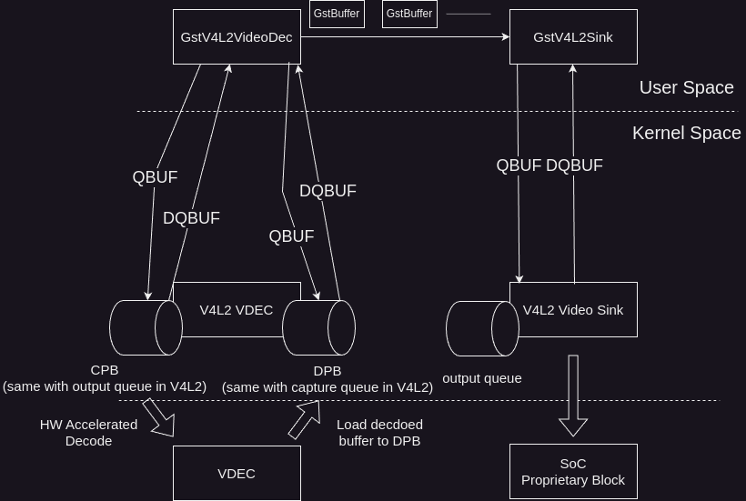

Media Video Sink (Vsink)
####

Introduction
************

| This document describes the Media video sink module in the kernel space. This document gives an overview of the Media video sink module and provides details about its functionalities and implementation requirements.

| The Media Video sink module is the end point of pipeline in perspective of logical view of LGE media pipeline.

| In hardware friendly point of view, video sink delivers the received video data VSC so that the video frame can be displayed.

| For the process of controlling video sink, V4L2 interface is used. Therefore, this guide assumes that readers are familiar with V4L2 interface.

Revision History
================

=============== ============ =================== ==============================================================
Version         Date         Changed by          Description
=============== ============ =================== ==============================================================
0.00.02         2025-06-16   `byeongsu.park`     Add dolby vision, dolby vision profile ext CID and enumeration
0.00.01         2024-07-30   `byeongsu.park`     Initial
=============== ============ =================== ==============================================================

Terminology
===========

| The key words "must", "must not", "required", "shall", "shall not", "should", "should not", "recommended", "may", and "optional" in this document are to be interpreted as described in RFC2119.

| The following table lists the terms used in the Media Video Sink module guide.

**webOS TV specific**

=============================== ===============================================================================================================
Term                            Description
=============================== ===============================================================================================================
VDO                             VDec Out. This module is responsible for delivering video data supplied to the VSC so that it can be displayed
VSC                             Video Scaler. See I/G of Scaler for details.
LFBC                            LG Frame Buffer Compression. It is a V4L2 pixel format negotiated between Media V4L2 VDEC and Media V4L2 Vsink.
AFBC                            Arm Frame Buffer Compression. AFBC is a proprietary lossless image compression protocol and format
=============================== ===============================================================================================================

**Media domain specific**

============ ===============================
Term         Description
============ ===============================
PTS          Presentation Time Stamp
============ ===============================

Technical Assistance
====================

For assistance or clarification on information in this guide, please create an issue in the LGE JIRA project and contact the following person:

================ ===============================
Module           Owner
================ ===============================
Media Video Sink byeongsu.park
================ ===============================

Overview
********

General Description
===================

| The Media Video Sink module is a set of interfaces for video sink.

Features
========

- **Rendering synchronization**
    There are CIDs that can be used for controlling rendering synchronization in Media video sink module.
    - By using V4L2_CID_EXT_MEDIA_CLOCK_SOURCE_TYPE CID, Media Video sink module client can specify the clock source which is used for rendering synchronization.
        - When the value is SYSTEM_CLOCK, it uses system clock for rendering synchronization
        - When the value is ATSC3_WALL_CLOCK, it uses wall clock of ATSC3 for rendering synchronization. For details, Please refer ATSC3.0 of references section.
        - When the value is JP4K_NETWORK_TIME_PROTOCOL, it uses NTP timestamp of IETF RFC 5905 which is mentioned in Japan UHD Specification. For details, Please refer Japan UHD of references section.
    - By using V4L2_CID_EXT_MEDIA_VIDEO_DISPLAY_DELAY_OFFSET, Media video sink module client can delay video frame out for controlling A/V synchronization.
        - it delays given amount of msec for output video frame.

- **PTS tracking**
    There are CIDs that can be used for checking the PTS. But note that the CID mentioned below is for debug purpose only.

    - By using V4L2_CID_EXT_MEDIA_CURRENT_PTS, Media video sink module client can know the pts of video frame which is now displaying.

- **Detecting Video underrun**
    There are V4L2 event that can be used for detecting video buffer underrun event.
    When sink does not have a enough data to be displayed, it should emit video underrun event so that the client knows underrun happens.

Architecture
============

| This section describes the architecture of the Media video sink module from an inter-module perspective.

| As shown in the diagram, the video data is processed according to the following procedure:

#. When the media is decoded by V4L2 Media VDEC, the buffer is delivered to GstV4L2VideoDec which is gstream plugin in LGE media pipeline.
#. GstV4L2VideoDec delivers the buffers GstV4L2Sink in forms of GstBuffer
#. GstV4L2Sink input buffer to the output queue by calling VIDIOC_QBUF ioctl call.
#. VDO delivers this buffer VSC driver so that the video data can be dispalyed
#. Since VDO is LGE domestic terminology, the name of SoC proprietary block can be different by SoC vendor.
#. Even though it can be different, Media sink module implementor must provide V4L2 Sink driver and its required functionalities as described in this document.

Requirements
************

This section describes the main functionalities of the Media Video Sink module in terms of the module's requirements and constraints.

Functional Requirements
=======================

The Functional Requirements section sets forth the requirements imposed on VDEC's basic funtionalities.

Media V4L2 Vsink output_mplane format requirement
---------------------------------------------------------------------------
* V4L2_PIX_FMT_LFBC (v4l2_fourcc('L','F','B','C'))
  * In case of LFBC, it is the format that LGE defined. See below subsection about the LFBC format.

LFBC (LG Frame Buffer Compression)
^^^^^^^^^^^^^^^^^^^^^^^
LFBC (LG Frame Buffer Compression) format is a V4L2 fourcc format which LGE defined.
It is the abstract format which is used for format negitation of Media V4L2 VDEC and Media Vsink.
It means that the data itself is not handled in user layer.
Since it is the abstract format, the actual format is may be different from SoC Vendor's implmentation choice.
For example, Even though in V4L2 level, Media V4L2 VDEC and Media Vsink is netogiated with V4L2_PIX_FMT_LFBC, AFBC (Arm Frame Buffer Compression) can be applied internally.

Quality and Constraints
=======================

TBU

Implementation
**************

| This section provides supplementary materials that are useful for Media Video Sink implementation.

- The File Location section provides the location of the Git repository where you can get the header files in which the interface for the Media video sink implementation is defined.
- The API List section provides a brief summary of Media video sink APIs.

File Location
=============
| The Git repository of the Media Video Sink module is available at `v4l2-ext-broadcast-header <https://wall.lge.com/admin/repos/bsp/ref/v4l2-ext-broadcast-header>`_ . This Git repository contains the header files for the Media Video Sink implementation as well as documentation for the Media Video Sink implementation guide and Media Video Sink API reference.

| It's up to the Media Video Sink implementor to make the decision where to locate their Media Video Sink module implementation in their build structure.

API List
========

| Media Video Sink implementation must adhere to the interface specifications defined in the Media Video Sink API Reference. Refer to the Media Video Sink API Reference for more information.

Data Types
----------

Standard V4L2 Structures
^^^^^^^^^^^^^^^^^^^^^^^^

================================================================================================================================================================================== ============
Name                                                                                                                                                                               Description
================================================================================================================================================================================== ============
`v4l2_control <https://linuxtv.org/downloads/v4l-dvb-apis/userspace-api/v4l/vidioc-g-ctrl.html#c.V4L.v4l2_control>`_                                                               Structure to represent a control parameter and its value
`v4l2_event <https://linuxtv.org/downloads/v4l-dvb-apis/userspace-api/v4l/vidioc-dqevent.html#c.V4L.v4l2_event>`_                                                                  Structure to represent an event that has occurred in a device
`v4l2_event_subscription <https://linuxtv.org/downloads/v4l-dvb-apis/userspace-api/v4l/vidioc-subscribe-event.html#c.V4L.v4l2_event_subscription>`_                                Structure to subscribe to specific events generated by a device
`v4l2_ext_control <https://linuxtv.org/downloads/v4l-dvb-apis/userspace-api/v4l/vidioc-g-ext-ctrls.html?highlight=v4l2_ext_control#c.V4L.v4l2_ext_control>`_                       Structure to represent an extended control for a device
`v4l2_ext_controls <https://linuxtv.org/downloads/v4l-dvb-apis/userspace-api/v4l/vidioc-g-ext-ctrls.html?highlight=v4l2_ext_controls#c.V4L.v4l2_ext_controls>`_                    Structure to represent a set of extended controls for a device
`v4l2_format <https://linuxtv.org/downloads/v4l-dvb-apis/userspace-api/v4l/vidioc-g-fmt.html?highlight=v4l2_format#c.V4L.v4l2_format>`_                                            Structure to describe the format of a video stream
`v4l2_pix_format <https://linuxtv.org/downloads/v4l-dvb-apis/userspace-api/v4l/pixfmt-v4l2.html?highlight=v4l2_pix_format#c.v4l2_pix_format>`_                                     Structure to describe the size of a image
`v4l2_fract <https://linuxtv.org/downloads/v4l-dvb-apis/userspace-api/v4l/vidioc-enumstd.html?highlight=v4l2_fract#c.V4L.v4l2_fract>`_                                             Strcuture to describe numerator / denominator
================================================================================================================================================================================== ============

Extended V4L2 Enumerations
^^^^^^^^^^^^^^^^^^^^^^^^^^

==================================================== ====================================
Name                                                 Description
==================================================== ====================================
:cpp:any:`v4l2_ext_media_clock_source_type`          Enumeration for clock source type
:cpp:any:`v4l2_ext_media_vsink_app_type`             Enumeration for app type info
:cpp:any:`v4l2_ext_media_hdr_type`                   Enumeration for HDR type
:cpp:any:`v4l2_ext_media_vsink_dolby_vision_profile` Enumeration for dolby vision profile
==================================================== ====================================

Extended V4L2 Strucures
^^^^^^^^^^^^^^^^^^^^^^^

============================================== ==========================================================================
Name                                           Description
============================================== ==========================================================================
:cpp:any:`v4l2_ext_media_info`                 Struct for media info
:cpp:any:`v4l2_ext_media_sink_resource_info`   Struct for resource info
============================================== ==========================================================================

Functions
---------
Linux Common Functions
^^^^^^^^^^^^^^^^^^^^^^^
================================================================================================================================================= =============================================================================================================
Function                                                                                                                                          Description
================================================================================================================================================= =============================================================================================================
`V4L2 open() <https://linuxtv.org/downloads/v4l-dvb-apis/userspace-api/v4l/func-open.html>`_	                                                  Opens a V4L2 device
`V4L2 close() <https://linuxtv.org/downloads/v4l-dvb-apis/userspace-api/v4l/func-close.html>`_	                                                  Closes a V4L2 device
`V4L2 poll() <https://www.kernel.org/doc/html/v4.9/media/uapi/v4l/func-poll.html>`_                                                               Suspend execution until the driver has captured data or is ready to accept data for output or event execution
`V4L2 mmap() <https://www.kernel.org/doc/html/v4.9/media/uapi/v4l/func-mmap.html>`_                                                               Map device memory into application address space
`V4L2 munmap() <https://www.kernel.org/doc/html/v4.9/media/uapi/v4l/func-munmap.html>`_                                                           Unmap device memory
================================================================================================================================================= =============================================================================================================

Module Standard Functions
^^^^^^^^^^^^^^^^^^^^^^^
================================================================================================================================================= ==================================
Function                                                                                                                                          Description
================================================================================================================================================= ==================================
`VIDIOC_G_CTRL <https://linuxtv.org/downloads/v4l-dvb-apis/userspace-api/v4l/vidioc-g-ctrl.html#vidioc-g-ctrl>`_                                  Gets the value of a control
`VIDIOC_S_CTRL <https://linuxtv.org/downloads/v4l-dvb-apis/userspace-api/v4l/vidioc-g-ctrl.html#vidioc-g-ctrl>`_                                  Sets the value of a control
`VIDIOC_G_FMT <https://linuxtv.org/downloads/v4l-dvb-apis/userspace-api/v4l/vidioc-g-fmt.html#vidioc-g-fmt>`_                                     Gets the data format
`VIDIOC_S_FMT <https://linuxtv.org/downloads/v4l-dvb-apis/userspace-api/v4l/vidioc-g-fmt.html#vidioc-g-fmt>`_                                     Sets the data format
`VIDIOC_G_EXT_CTRLS <https://linuxtv.org/downloads/v4l-dvb-apis/userspace-api/v4l/vidioc-g-ext-ctrls.html#vidioc-g-ext-ctrls>`_                   Gets the value of several controls
`VIDIOC_S_EXT_CTRLS	<https://linuxtv.org/downloads/v4l-dvb-apis/userspace-api/v4l/vidioc-g-ext-ctrls.html#vidioc-s-ext-ctrls>`_                   Sets the value of several controls
`VIDIOC_SUBSCRIBE_EVENT <https://linuxtv.org/downloads/v4l-dvb-apis/userspace-api/v4l/vidioc-subscribe-event.html#vidioc-subscribe-event>`_       Subscribes to an event
`VIDIOC_UNSUBSCRIBE_EVENT <https://linuxtv.org/downloads/v4l-dvb-apis/userspace-api/v4l/vidioc-subscribe-event.html#vidioc-unsubscribe-event>`_   Unsubscribes from an event
`VIDIOC_QBUF <https://linuxtv.org/downloads/v4l-dvb-apis/userspace-api/v4l/vidioc-qbuf>`_                                                         Queue a buffer to the driver
`VIDIOC_DQBUF <https://linuxtv.org/downloads/v4l-dvb-apis/userspace-api/v4l/vidioc-qbuf>`_                                                        Dequeue a buffer from the driver
`VIDIOC_DQEVENT <https://www.kernel.org/doc/html/v4.9/media/uapi/v4l/vidioc-dqevent.html>`_                                                       Dequeue an V4L2 event from a video device
`VIDIOC_ENUM_FMT <https://www.kernel.org/doc/html/v4.9/media/uapi/v4l/vidioc-enum-fmt.html>`_                                                     Enumerate image formats which a video device supports
`VIDIOC_ENUM_FRAMESIZES <https://www.kernel.org/doc/html/v4.9/media/uapi/v4l/vidioc-enum-framesizes.html>`_                                       Enumerate all frame sizes that the devices supports for the given pixel format
`VIDIOC_QUERYBUF <https://www.kernel.org/doc/html/v4.9/media/uapi/v4l/vidioc-querybuf.html>`_                                                     Query the status of a buffer
`VIDIOC_QUERYCAP <https://www.kernel.org/doc/html/v4.9/media/uapi/v4l/vidioc-querycap.html>`_                                                     Query device capabilities
`VIDIOC_REQBUFS <https://www.kernel.org/doc/html/v4.9/media/uapi/v4l/vidioc-reqbufs.html>`_                                                       Initiate Memory Mapping, User Pointer I/O or DMA buffer I/O
`VIDIOC_STREAMON <https://www.kernel.org/doc/html/v4.9/media/uapi/v4l/vidioc-streamon.html>`_                                                     Start streaming I/O
`VIDIOC_STREAMOFF <https://www.kernel.org/doc/html/v4.9/media/uapi/v4l/vidioc-streamon.html>`_                                                    Stop streaming I/O
================================================================================================================================================= ==================================

Module Extended Functions
^^^^^^^^^^^^^^^^^^^^^^^^^
============================================================ =============================================================================================================================
Control ID                                                   Description
============================================================ =============================================================================================================================
:c:macro:`V4L2_CID_EXT_MEDIA_CLOCK_SOURCE_TYPE`	             Used to specify the source clock which is used for rendering synchronization.
:c:macro:`V4L2_CID_EXT_MEDIA_CONSTANT_OUTPUT_DELAY`          Control the queue size of video sink.
:c:macro:`V4L2_CID_EXT_MEDIA_CURRENT_PTS`	                 Used to check the pts of video frame which is currently rendered. Note that this CID usage is for debug only.
:c:macro:`V4L2_CID_EXT_MEDIA_FRAME_DROP_THRESHOLD`	         Control the threshold value which start to drop the frame from video sink buffer.
:c:macro:`V4L2_CID_EXT_MEDIA_RENDER_BUFFER_LENGTH`	         Used to check the number of frame which is queued in video sink buffer.
:c:macro:`V4L2_CID_EXT_MEDIA_DISPLAY_PREROLL`	             Used to determine whether shows the video frame which is given as a preroll.
:c:macro:`V4L2_CID_EXT_MEDIA_DROPPED_FRAMES`	             Used to check the number of frame which is dropped. Note the value is updated every seconds.
:c:macro:`V4L2_CID_EXT_MEDIA_VIDEO_DISPLAY_DELAY_OFFSET`	 Used to delay the output of video frame in video sink buffer for A/V synchronization.
:c:macro:`V4L2_CID_EXT_MEDIA_LOW_DELAY`                      Used to control low delay mode which output video data as soon as it received. This mode is used in gaming mode.
:c:macro:`V4L2_CID_EXT_MEDIA_NON_FLUSHABLE_DISPLAYED_FRAMES` Used to check the number of non flushable displayed frame.
:c:macro:`V4L2_CID_EXT_MEDIA_NON_FLUSHABLE_DROPPED_FRAMES`   Used to check the number of non flushable displayed frame. Note that this is different with V4L2_CID_EXT_MEDIA_DROPPED_FRAMES
:c:macro:`V4L2_CID_EXT_MEDIA_INFO`                           This is a control id for checking the information of media.
:c:macro:`V4L2_CID_EXT_MEDIA_VSINK_SVP`                      It is a control id for using Secure Video Path(SVP) for video sink.
:c:macro:`V4L2_CID_EXT_MEDIA_VSINK_RES_INFO`                 This is a control id used to set the allocated resource information.
:c:macro:`V4L2_CID_EXT_MEDIA_VSINK_APP_TYPE`                 Controls the current app type of video sink.
:c:macro:`V4L2_CID_EXT_MEDIA_VSINK_DOLBY_VISION`             Indicates whether the current stream is dolby vision or not.
:c:macro:`V4L2_CID_EXT_MEDIA_VSINK_DOLBY_VISION_PROFILE`     Indicates the profile of current dolby vision stream.
:c:macro:`V4L2_SUB_EXT_MEDIA_VIDEO_UNDERRUN`                 Subscribes to or unsubscribes from a video underrun event on the device specified by the fd
:c:macro:`V4L2_SUB_EXT_MEDIA_INFO_READY`                     Subscribes to or unsubscribes from a media information ready event on the device specified by the fd
============================================================ =============================================================================================================================

Implementation Details
======================

Dolby vision stream Decoding
----------------------------
As V4L2 standard interface does not support proprietary formats like Dolby Vision, Media Video sink interface defines extended CIDs to support Dolby Vision decoding.
Referring to the data given by the following extended CIDs, Media Vsink driver implementor must handle Dolby vision stream information so that it can be properly rendered.

- :c:macro:`V4L2_CID_EXT_MEDIA_VSINK_DOLBY_VISION`: This control indicates whether the current stream is Dolby Vision stream or not.
- :c:macro:`V4L2_CID_EXT_MEDIA_VSINK_DOLBY_VISION_PROFILE`: This control indicates the profile of the current Dolby Vision stream.

Testing
*******

To test the implementation of the Media Video sink module, webOS TV provides SoCTS (SoC Test Suite) tests.
The SoCTS checks the basic operations of the Media Video sink module by using a test execution file

References
**********

- `ATSC 3.0 SPEC <https://www.atsc.org/atsc-documents/type/3-0-standards/>`_
- `Japan UHD SPEC(Japan4K) <https://www.arib.or.jp/english/html/overview/doc/6-STD-B32v3_11-3p3-E1.pdf>`_