VDEC
####

.. _crystal.moon: crystal.moon@lge.com
.. _yongsu.yoo: yongsu.yoo@lge.com
.. _kyoungwon.seo: kyoungwon.seo@lge.com
.. _seong.lee: seong.lee@lge.com

Introduction
************

| This document describes the Video Decoder (VDEC) module in the kernel space. This document gives an overview of the VDEC module and provides details about its functionalities and implementation requirements.

| The VDEC module is responsible for digital video decoding, which is strongly connected with digital TV standards such as ATSC and DVB. In dealing with video data, the transport stream (TS) is defined as a standard digital container format for such DTV standards. The MPEG-2 specification, also known as ISO/IEC standard 13818-1, defines the transport stream specification.

| Therefore, this guide assumes that readers are familiar with and well aware of ATSC / DVB standards as well as the transport stream and its specification defined in the MPEG-2 standard. Terms such as TS, PES, ATSC, and DVB should sound familiar to those who implement the VDEC module.

Revision History
================

=============== ============ =================== ================================
Version         Date         Changed by          Description
=============== ============ =================== ================================
1.24.03         2024-10-29   `crystal.moon`_     Corrected grammatical errors and improved formatting; added assetization/standardization status to the API list
1.24.02         2024-08-05   `kyoungwon.seo`_    | minor fix
                                                 | Remove description about deprecated CID(V4L2_CID_EXT_VDEC_STREAM_INFO / V4L2_CID_EXT_VDEC_DIRECT_MODE / V4L2_CID_EXT_VDEC_DIRECT_ESDATA)
1.24.01         2024-06-11   `kyoungwon.seo`_    | minor fix
                                                 | V4L2_CID_EXT_VDEC_LIPSYNC_MASTER CID explanation is added
1.23.01         2023-09-18   sangwook82.lee      Guide document upgrade
1.22.01         2022-03-14   `yongsu.yoo`_       PTS and STC rules are explained
1.21.01         2021-04-30   `kyoungwon.seo`_    FAST_IFRAME_MODE & Minor description is added
1.19.18         2019-06-13   `seong.lee`_        2.32 ~ 2.34
=============== ============ =================== ================================

Terminology
===========

| The key words "must", "must not", "required", "shall", "shall not", "should", "should not", "recommended", "may", and "optional" in this document are to be interpreted as described in RFC2119.

| The following table lists the terms used in the VDEC module guide. You should also refer to the MPEG-2 specification and ATSC / DVB standards for frequently used terms in the field of digital video decoding.

**webOS TV specific**

=============================== ===============================
Term                            Description
=============================== ===============================
DTV                             Refers to terrestrial / cable / satellite digital TV channels. ATSC 3.0 / Japan BS CS 4K and 8K channels are not legacy DTV, because those channels are advanced DTV decoded by gstreamer.
FE                              Front End. Also called Demod (functions as a demodulator component). FE controls the tuner and demod components. For DTV, FE converts and delivers the transport stream to SDEC.
SDEC                            System DECorder. Also called Demux (functions as a demultiplexer component). Demux is used to parse section data or PES data in the transport stream. In addition, it supports stream-related functions such as functions to check scrambling and descrambling status.
VTP                             Video Transport Processor. VTP receives video PES data from Demux and stores them in CPB. It can be operated simply as a path that receives video PES from Demux and delivers them to CPB or a path that receives video PES data and extract header information separately. Its operation mode may vary depending on the VDEC driver architecture.
CPB                             Coded Picture Buffer
DPB                             Decoded Picture Buffer
VDEC                            Video Decoder. The VDEC module receives video PES data from Demux. VDEC is responsible for decoding video elementary stream (ES) and delivering the decoded picture data to the Video Scaler (VSC) module when the time for the picture data is due for display.
VDO                             Video Decoder Out. VDO examines the PTS and STC values taken from Demux and delivers the picture data along with its metadata information to VSC according to the AV sync control logic.
Pipeline                        | A pipeline is a collection of modules arranged as a list by the TV pipeline manager (TVPM) within the webOS broadcasting module in a way that driver-related modules are managed to deal with limited hardware resources.
                                | Each pipeline is managed for open / connect / start / stop / close processes.
Good Video / Bad Video          VDEC periodically checks the decoded video status when data transfer to VSC is triggered by a picture info event, based on the time consumed to process the data.
PQ                              Picture Quality
FRC                             Frame Rate Converter
PVR                             Personal Video Recorder
ECP                             Enhanced Content Protection
CM                              Channel Manager
TVRM / TVPM                     TV Resource Manager (TVRM), TV Pipeline Manager (TVPM)
=============================== ===============================

**MPEG & DTV standards**

============ ===============================
Term         Description
============ ===============================
ES           Elementary stream
TS           Transport stream
PES          Packetized elementary stream
ATSC         The Advanced Television Systems Committee, Inc. In general, ATSC refers to the ATSC digital television standard A/53.
DVB          Digital Video Broadcasting. DVB usually stands for the DVB standard for digital television.
ISDB         Integrated Services Digital Broadcasting. Broadcasting standard for digital television (DTV).
PTS          Presentation time stamp. Used in the AV sync control logic.
STC          System time clock. Used in the AV sync control logic. STC is a reference time base whose value is determined by PCR data.
PCR          Program clock reference. Used in the AV sync control logic.
V4L2         Video for Linux Standard version 2
AFD          Active Format Description
NAL          Network Abstraction Layer
BT.2073      Use of the high efficiency video coding for UHDTV and HDTV broadcasting applications
DCT          Discrete Cosine Transform
PID          Packet Identifier
============ ===============================

Technical Assistance
====================

For assistance or clarification on information in this guide, please create an issue in the LGE JIRA project and contact the following person:

============ ===============================
Module       Owner
============ ===============================
VDEC         `kyoungwon.seo`_
============ ===============================

Overview
********

General Description
===================

| The VDEC (Video Decoder) module is a set of interfaces for digital video decoding.

| The VDEC module can recognize whether its input stream is MPEG-2 TS picture user data or not. In addition, it also provides an interface to get EIA 708 (closed caption) data.

| The VDEC module, according to ATSC/DVB specifications, handles the data related to EIA 708 D in the MPEG user data domain and the data related to the active format descriptor (AFD) in different ways.

- Its functions to handle EIA 708 D data can only be used for ATSC.
- Handling AFD data is a mandatory element in the DVB specification, but optional in the ATSC specification. This implies that its functions to handle AFD data can be used for both ATSC and DVB.

The following codec types are supported by VDEC:

- MPEG-2
- MPEG-4 Part2 ASP
- H.264/AVC/MPEG-4 Part10
- AVS
- HEVC

Note that the VDEC module in BSP described in this document is soley used for digital broadcasting video decoding. For media playback, it's not VDEC but Gstreamer that is responsible for ditigal video decoding of media playback.

Features
========

| The main function of the VDEC module is to receive video PES input from the DEMUX module and perform decoding according to the set codec, and transmit picture data decoded to VSC according to the AV sync logic.

| The key features of the VDEC module are as follows:

- **Video PES data decoding**
    - The VDEC module provides features to decode video PES or ES that are passed from SDEC to the module. Video data sent from SDEC are accumulated in the Coded Picture Buffer (CPB), and the decoder intellectual property (Decoder IP) managed by the VDEC driver performs their decoding and stores the decoded picture data.
- **AV sync control**
    - When the system time clock (STC) reaches the presentation time stamp (PTS) time of a decoded picture data, the picture data must be sent to the VSC module in order to be presented for display. STC is a reference time base whose value is given in relation with program clock reference (PCR) data from SDEC. VDEC periodically monitors the difference between the values of STC and PTS to determine its subsequent actions.
        - When the difference is within 1 / (frame rate) seconds (for example, within 16.7ms for 60Hz), VDEC presumes AV sync is achieved and thus transmits the picture data to the VSC module.
        - When the difference is greater than 5 seconds (the freerun threshold value), VDEC presumes synchronization cannot be achieved by buffering data and thus operates in the freerun mode (immediately transmits to the VSC module the picture data as it arrives without performing synchronization).
        - When the difference is less than the freerun threshold but not in synchronization, the following rules are applied:
            - If PTS is less than STC, VDEC drops the picture data because the time for display has already passed.
            - Otherwise, since the time for display is due any time now, the picture being displayed at the moment is repeated until AC sync is achieved. In this manner VDEC achieves synchronization.
- **Delivery of decoded picture and their metadata information**
    - VDEC transmits decoded picture data and their metadata information to the VSC module so that the picture data can be displayed. No specific guidelines are imposed on the format of picture data and their related metadata structure; they should be adjusted to the requirements of VDEC and VSC modules.
- **User data parsing & delivery**
    - VDEC supports a feature to parse CEA 608/708 closed captions (CC) and sends the parsed and collected data to its corresponding middleware component. The specification of the closed caption is described in the `A/53 Part 4 document <https://www.atsc.org/atsc-documents/a53-atsc-digital-television-standard/>`_ .
    - To provide closed caption parsing and delivery features, MPEG-2 and H.264 codecs must be supported. It's recommended that VDEC support H.265 also.

Architecture
============

This section describes the architecture of the VDEC module from an inter-module perspective (driver architecture) as well as its internal point of view (internal architecture).

Driver Architecture
-------------------

The following diagram shows the driver level architecture of the VDEC module where the VDEC module's interaction with other modules is described.

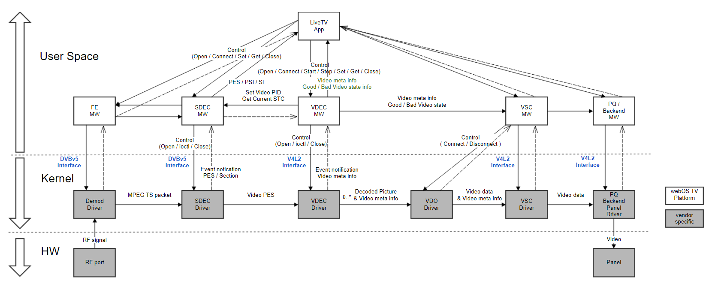

| When running the LiveTV app for watching DTV channels, a pipeline for broadcasting is generated and operated by the modules such as TV resource manager (TVRM), TV pipeline manager (TVPM), and channel manager (CM).

| As shown in the HW/Driver level in the diagram, broadcasting signal is processed according to the following procedure:

#. The broadcasting signal is received through the RF port.
#. This signal is demodulated as MPEG TS packet data by the FE / Demod components.
#. The SDEC module processes the MPEG TS packet data and the video PES data extracted via the video PID is passed to the VDEC module.
#. The VDEC module decodes the video ES data.
#. The decoded data, which consists of picture data and picture metadata information, is synchronized by the VDO module according to the system time clock (STC) criteria.
#. After synchronization by the VDO module, the video data and its video metadata information from VDO is passed to the Video module (also called VSC). The Video module (or VSC) performs deinterlacing on its input data and then the Scaler driver determines the size and position of the output window. At this time, the video mute is lifted.
#. The PQ / FRC / Backend module enhances video quality and adjusts the frame rate so that the panel can output the video for display.

| For communication between the middlewares and drivers for FE (Demod) and SDEC (Demux) is conducted through the V4L2 interface. For communication between the middlewares and drivers for VDEC, Video, and PQ is conducted through the DVBv5 interface.

| From the VDEC module's perspective, it receives control over the processed data from the VDEC middleware through the V4L2 interface. At the SDEC module, when it receives the video data in the form of either PES or ES, those data is decoded and saved to the decoded picture buffer (DPB). The decoded picture data along with its video metadata from VDEC are sent to the Video module (or VSC) in accordance with the AV sync control logic imposed by the VDO module.

Internal Architecture
---------------------

| Basically, the internal architecture of the VDEC module heavily depends on the vendor's SoC and BSP characteristics.

| Nonetheless, the essential elements of a video decoder like the VDEC module remain intact, which serves the most fundamental functionalities of a video decoder, as summarized below:

- VTP and CPB: VDEC receives video PES data or ES data from SDEC (Demux) and stores them in a separate buffer for further processing. In the VDEC module, VTP is responsible for receiving video PES data and it stores them in the buffer called CPB. CPB is a buffer that temporarily stores coded frames received from VTP.
- Decoder: VDEC's decoder takes the coded frame from CPB for decoding. Arguably, the decoder part plays the main role of the VDEC module as a video decoder.
- DPB: The picture data, which is the decoded data from the decoder, need to be stored in a buffer before they are delivered to a scaler module (VSC in the case of webOS BSP). In the VDEC module, the DPB buffer plays this role. DPB is a buffer that temporarily stores the picture data decoded by the VDEC decoder.
- VDO: VDO transfers the picture data from DPB to VSC according to the AV sync control logic. AV sync control logic is explained in the Features section.

The following diagram depicts the data flow and the composition of the essential parts of the module discussed above:

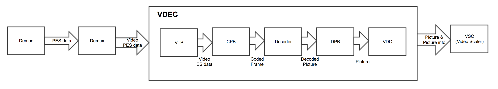

Although this section sets in place the fundamental elements of the VDEC module, it's up to the vendor's choice to make some adjustments or changes to its internal architecture.

Overall Workflow
================

| The following state diagrams of the VDEC driver and the VDO driver demonstrate the overall workflow of the VDEC module.

| The state transitions within these modules are managed by V4L2 and ioctl function calls. See VDEC API Reference for more information on the function calls made by VDEC and VDO in their state transitions.

VDEC State Diagram
------------------

The following state diagram shows the overall behavior of the VDEC driver part in the VDEC module.

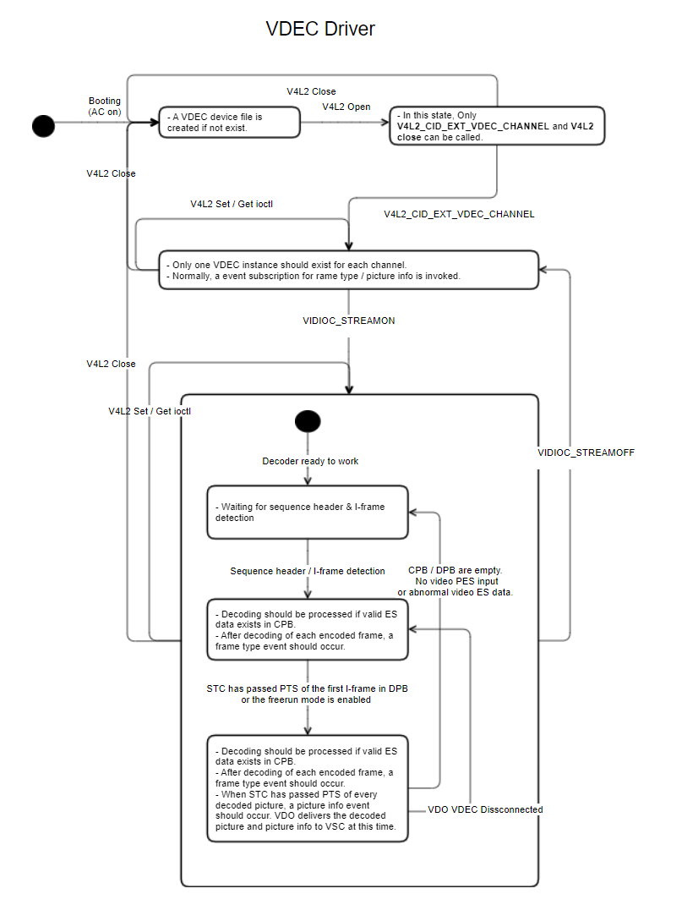

VDO State Diagram
-----------------

The following state diagram shows the overall behavior of the VDO driver part in the VDEC module.

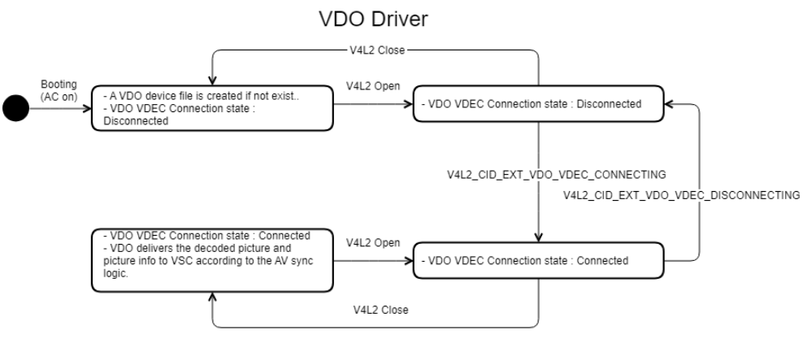

|

Requirements
************

This section describes the main functionalities of the VDEC module in terms of the module's requirements and constraints.

Functional Requirements
=======================

The Functional Requirements section sets forth the requirements imposed on VDEC's basic funtionalities.

Background
----------

This section provides extra information that helps you get some background knowledge about video decoding.

Video Frame Formats
^^^^^^^^^^^^^^^^^^^

| According to the video compression standard, pictures or frames are encoded into the following picture types of frame types: I-picture, P-picture, and B-picture.

| I-frames are used as a random access point that enables the decoder to decode a series of pictures from this starting point. A series of I/P/B pictures grouped around a random access point I-picture is called a group of pictures (GOP).

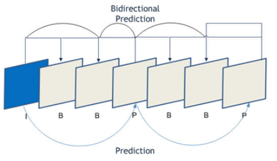

I-Picture
"""""""""

| An I-picture (intra-coded picture) or I-frame is a complete image with marginal or no loss in its quality that can be decoded independently without referencing other pictures or frames. An I-picture is formed as a JPEG or BMP file and used as a reference frame when decoding P-pictures and B-pictures. Since I-frames are used as references for decoding other frames, they should be composed of high-resolution images. This characteristic helps minimizing errors spreading over when decoding a series of P or B pictures, which explains why I-pictures are inserted into a video stream at some regular intervals.

| An I-picture is one piece of still image and composed by eliminating spatial redundancies using discrete cosine transform (DCT).

P-Picture
"""""""""

| A P-picture (predicated picture) or P-frame is generated by referencing the prior video frames. P-pictures compare the changes in the image from the previous I-frame or P-frame image and memorizes only their difference. This significantly reduces the bits required to compress or encode the image.

| P-pictures eliminates temporal redundancy by applying a technology of predicting forward motion compensation.

B-Picture
"""""""""

A B-picture (bidirectionally predicted picture) compares not only the preceding picture but also following pictures to describe its content. In addition, B-pictures can refer to interpolation images from the pictures before and after them. B-pictures drastically reduce spatial and temporal redundancy by using those predictions from past and future frames.

Discrete Cosine Transform
^^^^^^^^^^^^^^^^^^^^^^^^^

| The discrete cosine transform (DCT) is a technique for transforming a target from a representation in the time domain to a representation in the frequency domain.

| When converting an image using DCT, most part of the image belongs to the low frequency domain, and the high frequency component is extremely marginal.

| Therefore, even if the high-frequency region is expressed more coarsely than the low-frequency region, their differences are hardly perceived by human eyes.

| In this regard, DCT compresses the image through the process of reducing the high-frequency region.

VDEC Design Principles
----------------------

VDEC Instances
^^^^^^^^^^^^^^

| webOS TV requires that two instances of VDEC module be implemented. The two VDEC modules are labeled VDEC0 and VDEC1.

| webOS TV determines which of the two VDEC instances should be used based on its own policy. This implies that VDEC0 may be used for some cases or VDEC1 may be used in other cases even under the same scenario.

| webOS TV's policy on the VDEC selection might seem to be a random choice from the BSP's viewpoint. Therefore, the functionalities and performance of each VDEC module must be identical and independent from each other, regardless of their operation status, whether they are active or not, and the type of video format being decoded.

| Both of the two VDEC modules are used at the same time in the following cases:

- DTV-DTV multi-view
    - Some high-end model groups of LG TV as well as all Japanese models support the DTV-DTV multi-view functionality equipped with 2-Tuners. However, webOS TV specification does not allow decoding videos of the HEVC codec type on both sides of the VDEC modules. This is because the webOS TV specification always considers HEVC as a 4K video; decoding 4K videos on both of the VDEC modules at the same time are not permitted due to insufficient bandwidth and memory issues.
- Korean 3D-DTV
    - Korean 3D-DTV multiplexes the following two channels into one physical channel: one channel for the right side where FHD resolution video is compressed in the MPEG-2 format and another for the left side where HD resolution video is compressed in the H.264 format. When demultiplexing this channel, SDEC uses the PID filtering feature to send the right side TS to VDEC0 and the left side TS to VDEC1, respectively. The two VDEC modules then perform decoding simultaneously and decompress both the right and the left video and send them to VSC for 3D display.

Independent Design
^^^^^^^^^^^^^^^^^^

| Although the internal structure of the BSP is subject to the vendor's implementation principle, VDEC and VSC must be implemented as separate modules.

| It's generally recommended that one SW module should be implemented and operate independently from other SW modules. This requirement carries much weight for SW modules such video/audio input and video/audio renderer. This is largely due to the characteristics of TV SW architecture where TV receives input signal and renders the input on the screen display. This is because SW-modularization is appropriate and the benefits of achieving such SW-modularization can be maximized for such architecture type.

| To this end, upper SW layers of webOS TV has been undergoing a process of separating the AV input module and the AV renderer module. Therefore, their respective underlying SW layers in BSP should be designed in way that separates the AV input module (VDEC belongs to this module) and the AV renders module (VSC belongs to this module). The separation applies to using their own folders and files, prohibiting the share use of header files, prohibiting cross-referencing their APIs and global variables, and so on.

VDEC Inner Processes
^^^^^^^^^^^^^^^^^^^^

Decoder Message Process Task
""""""""""""""""""""""""""""

| VDEC's decoder, which resides in the VDEC internal architecture, submits a good deal of event messages to TV services when decoding video data. A task is required to process those event messages that can send decoding information data to the following two callbacks which were registered during initialization:

- Frame type callback: This callback must be triggered whenever a piece of frame is decoded and send information about the frame type (I/P/B type) and PTS data. :c:macro:`V4L2_SUB_EXT_VDEC_FRAME` is used for event subscription. When this event is triggered, information about the event is obtained by calling the :c:macro:`VIDIOC_DQEVENT` get ioctl. The actual event information is saved to a `v4l2_event <https://linuxtv.org/downloads/v4l-dvb-apis/userspace-api/v4l/vidioc-dqevent.html?highlight=v4l2_event#c.V4L.v4l2_event>`_ structure.
- Picture info callback: This callback sends information about the video resolution, frame rate, AFD, etc. This callback must be delivered in time with the PTS timing of the frame on which this callback is triggered. :c:macro:`V4L2_SUB_EXT_VDEC_PICINFO` is used for event subscription. When this event is triggered, information about the event is obtained by calling the :c:macro:`V4L2_CID_EXT_VDEC_PICINFO_EVENT_DATA_EXT` get ioctl. The actual event information is saved to a :c:macro:`v4l2-ext-picinfo-msg-ext structure`.

| The following table summarizes APIs data types used for frame type events and picture info events. See :c:macro:`V4L2_SUB_EXT_VDEC_FRAME` and :c:macro:`V4L2_SUB_EXT_VDEC_PICINFO` in the VDEC API Reference where you can find a sample code that explains how to use these APIs and data types.

+----------------------+----------------------------------------+------------------------------------------------------------------------------------------------------+------------------------------------------------------------------------------------------------------------------------------------------------------------+
| Event                | Subscription                           | Get ioctl                                                                                            | Event Information                                                                                                                                          |
+======================+========================================+======================================================================================================+============================================================================================================================================================+
| Frame type event     | :c:macro:`V4L2_SUB_EXT_VDEC_FRAME`     | `VIDIOC_DQEVENT <https://linuxtv.org/downloads/v4l-dvb-apis/userspace-api/v4l/vidioc-dqevent.html>`_ | `v4l2_event <https://linuxtv.org/downloads/v4l-dvb-apis/userspace-api/v4l/vidioc-dqevent.html?highlight=v4l2_event#c.V4L.v4l2_event>`_ (v4l2_event.u.data) |
+----------------------+----------------------------------------+------------------------------------------------------------------------------------------------------+------------------------------------------------------------------------------------------------------------------------------------------------------------+
| Picture info event   | :c:macro:`V4L2_SUB_EXT_VDEC_PICINFO`   | :c:macro:`V4L2_CID_EXT_VDEC_PICINFO_EVENT_DATA_EXT`                                                  | :c:macro:`v4l2-ext-picinfo-msg-ext`                                                                                                                        |
+----------------------+----------------------------------------+------------------------------------------------------------------------------------------------------+------------------------------------------------------------------------------------------------------------------------------------------------------------+

User Data Process Task
""""""""""""""""""""""

| VDEC sends user data to the User Data Process Task through a message queue. This task processes user data according to the ATSC standard and sends the processed data to LG AP through the user data callback which was registered during initialization.

| The :download:`ATSC standard <resources/a53.pdf>` explains how to process user data in the Picture User Data Syntax and Captioning Data Syntax tables. The VDEC module must process user data according to this standard and send the part of the processed data through the user data callback. When processing MPEG-2 streams, remove the "user_data_start_code" field and send the rest of the data through the user data callback. When processing H.264, send the entire data through the user data callback.

| The following summarizes key requirements for VDEC's closed caption handling:

- VDEC must be able to process 608 closed captions and 708 closed captions of user data.
- VDEC must be able to process supported closed captions normally even when they are included in the picture header.
- If the video data is of interlaced type, VDEC must be able to deal with the following two cases: one case where PTS contains two fields (top-field and bottom-filed) and the other case where PTS contains only one field (either top-field or bottom field). VDEC must be able to process supported closed captions in both cases.

| When a user data callback is called, its vPort and ID parameters are set based on which VDEC instance is involved and which path the closed captions are processed. While processing closed captions through VDEC, vPort is set to 0 and ID to 0 if VDEC0 is used, and vPort set to 0 and ID to 0 if VDEC1 is used. Besides DTV closed captions, a user data callback is also called when processing closed captions of media files played through the GStreamer path. When displaying closed captions of media files, vPort is always set to 0 and ID set to 0xff, regardless of which VDEC instance being used. This is to distinguish between cases of DTV closed captions and media closed captions. The following table summarizes how the user data callback parameters vPort and ID are set when processing closed captions:

+----------------------+-----------------+-----------+---------+
| path                 | VDEC Instance   | vPort     | ID      |
+======================+=================+===========+=========+
| DTV closed captions  | VDEC0           | 0         | 0       |
|                      +-----------------+-----------+---------+
|                      | VDEC1           | 1         | 0       |
+----------------------+-----------------+-----------+---------+
| Media closed captions| VDEC0           | 0         | Oxff    |
|                      +-----------------+-----------+---------+
|                      | VDEC1           | 0         | OxFF    |
+----------------------+-----------------+-----------+---------+

.. note::
    Playing media files are usually managed by other processes and VDEC does not get involved. However, only in case of processing closed captions in media files, VDEC gets involved in processing closed captions as an exceptional case. This exceptional handling should be employed as an interim measure and will be removed in the future releases.

VTP
^^^

| VTP is a ES buffer that outputs video ES from SDEC and delivers them to VDEC's video ES input.

| Only 2 physical ES buffers are allowed even if multiple VDEC instances are managed. As discussed in the VDEC Instances section, webOS TV decides which VDEC instance is used for decoding based on its own policy. Whichever VDEC instance is selected, the video ES must be delivered properly, independent from the selection of VDEC instance.

| When connecting to VTP, you can specify which VTP to be connected. VDEC must check whether the connection between VTP and SDEC is valid.

| Use :c:macro:`VIDIOC_S_INPUT` for VDEC VTP connection.

VDO
^^^

| While VTP is used for a physical input path, VDO is used for a physical output path. Although there are multiple instances of VDEC modules, the video output path cannot be managed with multiple number of output instances.

| Connecting to and disconnecting from VDO are managed by VSC. Although its connection is managed by VSC, VDO resides in the VDEC module. In the VDEC module, VDO must be dynamically connected to one of the multiple VDEC Instances.

Buffers
-------

Coded Picture Buffer
^^^^^^^^^^^^^^^^^^^^

| While parsed data from SDEC is supplied to VDEC at a constant bit rate, VDEC consumes the supplied data at a non-constant bit rate due to the nature of its decoding process.

| Coded Picture Buffer (CPB) is a memory buffer that stores parsed video data from SDEC so that VDEC can consume the video data in the desired amount at the desired time. This buffer is also called video ES buffer.

| The size of the buffer memory should be large enough to handle channels with high bit rates such as 4K-HEVC to prevent any possible memory overflow. Based on the experiences in other VDEC implementation projects, allocating 8 MB or above for UHD-TV and 8MB or above for FHD-TV per each VDEC port is recommended.

Decoded Picture Buffer
^^^^^^^^^^^^^^^^^^^^^^

| When VDEC completes decoding video frame/field data, the decoded data should not be presented on the screen right away but wait until the intended time for display and get updated accordingly.

| Decoded Picture Buffer (DPB) stores the decoded frame/field data in its memory so that those data can be updated on the screen at the intended time which was specified when encoding.

| The size of the DPB memory should be large enough and the speed of decoding at VDEC should be properly controlled to prevent any possible memory overflow. This guide does not dictate the size of the DPB memory and the speed of decoding, but leaves them to the vendor's decision.

Video Output Buffer
^^^^^^^^^^^^^^^^^^^

| The interval between decoding one video frame/field and decoding the next video frame/field at VDEC is irregular due to the nature of video decompression. In addition, various trick modes (2 x speed, 1/2 x speed, pause) are also supported. Thus, time intervals sending one video frame/field data to the video path always vary. On the other hand, the video path demands one frame/field data at regular intervals in order to properly display the video on the panel, regardless of VDEC's performance or the selected trick mode.

| That being said, VDEC assumes that Video Output Buffer or VO is put in place to mediate such differences in their behavioral characteristics. Some SoC vendors might not implement such VO buffer or may adopt different approaches.

| VO can be thought of as a video memory of one frame/field data size, placed between the VDEC output and the video path input. VDEC chooses the most appropriate one among the frames that have been successfully decoded based on the currently selected trick mode and the time difference between STC and PTS values, and then writes the chosen frame data into the VO buffer. In contrast, the video path keeps reading one frame/field data from the VO buffer at each frame/field interval, without considering the operating conditions of VDEC.

| Note that webOS TV does not provide VO at the HAL interface level, but leaves it to be controlled by the vendor's BSP.

DPB Auto-Clearing
^^^^^^^^^^^^^^^^^

| If a DTV stream wraps around when the stream is decoded at VDEC, then the STC values are reversed as the PCR values are reversed due to wrap-around. This might result in updating video images on the screen at a high speed, since the decoded picture data in the DPB buffer waiting for STC and PTS to be matched are abruptly flushed into the TV display due to the STC value reversal. To prevent this side effect, the VDEC module must be able to recognize the occurrence of wrap-around and automatically reset the DPB buffer by clearing all the data in the buffer.

| However, the DPB buffer should not be automatically cleared in the wrap-around situation when running in the PVR mode (the mode for playing recorded video). webOS TV's PVR MW compares the number of video frames supplied to SDEC and the number of picture type callbacks triggered to modulate the feeding rate of the recorded video. If DPB is automatically cleared, then picture type callbacks are not triggered for the video frames that have been cleared. Then the difference between the number of video frames and that of picture type callbacks triggered gets increased each time wrap-around occurs. When this difference accumulates, the PVR MW assumes that the frame data in DPB has not yet been displayed on the screen and stops supplying video frames to SDEC in order to protect the data already existing in VDEC's CPB.

| Use the :c:macro:`V4L2_CID_EXT_VDEC_PVR_MODE` set ioctl command to turn on or off the PVR mode.

Buffer Memory Allocation
^^^^^^^^^^^^^^^^^^^^^^^^

| To prevent performance degradation and malfunction, memory allocation to CPB and DPB must be done only once after the TV is turned on. Memories must not be dynamically allocated and deallocated to those buffers according to the TV's operation scenario.

| Memory sharing with other modules is not allowed to save the memory space.

| Each VDEC instance has their own CPB and DPB that operate independently with each other. They are also allocated with separate memory areas. However, under the following special circumstances, one VDEC instance can share its used memory with other VDEC instance:

- If the VDEC instance being in use deals with HEVC codec type data, it considers the HEVC data being processed as a 4K video and thus assumes and guarantees that the other VDEC instance is not in use. This is because webOS TV does not allow DTV-DTV multi-view for any 4K video (see VDEC Instances for more information about this assumption).

AV Sync Control Logic
---------------------

| AV sync control is one of the key features of the VDEC module. Its control logic is described in the Features section.

| As discussed in the Buffers section, VDEC maintains a set of buffers to harmonize synchronization of video data in terms of their presentation timing. VDEC refers to the following two reference time values to ensure the synchronization: STC and PTS. Depending on the difference between these two values, VDEC runs in one of the following AV sync control modes: freerun mode, sync mode, or drop mode.

Freerun
^^^^^^^

If the difference between PTS and STC is greater than 5 seconds (PTS - STC > 5 or PTS - STC < -5), VDEC runs in the freerun mode. In the freerun mode, VDEC immediately delivers the video frame/field data or the picture data to the video path (VSC) as soon as the data arrives in DPB at each frame/field time interval.

Sync
^^^^

| If PTS is greater than STC and their difference is not greater than 5 seconds (0 < PTS - STC <5), VDEC runs in the sync mode. In the sync mode, VDEC delivers the frame/field data in DPB to the video path (VSC) only when PTS and STC are matched with each other or their difference is within 1 / (frame rate) seconds (for example, within 16.7ms for 60Hz). This rule is also applied even if CPB or DPB in the underflow situation.

| If PTS - STC becomes less than 5 while running in the freerun mode, VDEC should switch from the freerun mode to the sync mode.

Drop
^^^^

If PTS is less than STC and their difference is greater than -5 seconds (-5 < PTS - STC < 0), VDEC runs in the drop mode. In the drop mode, VDEC drops the decoded video frame/field data or decoded picture data without rendering it on the screen.

Timing Control
--------------

Audio-Master PTS
^^^^^^^^^^^^^^^^

| When playing a recorded DTV video, PCR is not available since trick mode is realized based on the index information generated from video PES or audio PES. In this case, the STC value is determined by considering audio PTS as effective PCR. For your information, STC is a reference time base whose value is determined by PCR data from SDEC. This is called the audio-master PTS mode.

| The reason audio PTS is used instead of video PTS is that audio PTS appears more often than video PTS and thus can produce more stable and uniform STC. In addition, humans perceive audio presentation timing errors more sensitively than video presentation timing errors. This characteristic helps suppress audio presentation timing errors and generate more accurate PTS.

| See the PVR module guide if you need more information about audio-master PTS.

VDEC Delay
^^^^^^^^^^

| If an external Bluetooth sound bar is connected to the TV, the audio output delay becomes longer than when using the TV without the sound bar. To adjust this delay, VDEC has to introduce intentional video delay on some occasions. To this end, VDEC has to support a feature to delay its video output timing. The video delay in VDEC is realized by intentionally holding up the video frame/field data in DPB even when PTS and STC are matched. This requires VDEC to use more buffer memory, and this delay causes a series of performance degradation in DVT channel switching time, DVT booting time, and all other DTV-related operations.

| Use the :c:macro:`V4L2_CID_EXT_VDEC_DISPLAY_DELAY` set ioctl command to configure this VDEC delay time.

Decoding Speed
^^^^^^^^^^^^^^

| VDEC decodes the ES data from the video ES buffer (CPB) and does its best to deliver the data to DPB as frequently as possible. To enables this behavior, DPB should have some extra space left in its storage. This means that decoding speed can be adjusted by managing the speed at which the data in DPB is emptied.

| DPB delivers the video frame/field data whose PTS and STC are matched to the video path (VSC) and then empties the DPB memory by that amount. If the PTS for the data in DPB is reduced by 1/N, then DPB empties the buffer memory N times faster, resulting in increasing the decoding speed N times faster. VDEC provides an API to adjust the PTS value for video data in DPB. See VDEC API Reference for more information.

| See :c:macro:`V4L2_CID_EXT_VDEC_DECODING_SPEED` in VDEC API Reference for more information about controlling the decoding speed.

Data Handling and Recovery
--------------------------

Dealing With Noise Stream
^^^^^^^^^^^^^^^^^^^^^^^^^
| VDEC must be able to determine the validity of various pieces of information in the header of a TS payload and check whether the information in the header is destroyed or missed due to noise interference.

| VDEC must be able to detect whether the header has been damaged due to noise and should not reference such header information.

| If the data is truncated at the wrap-around point of the DTV stream, the current data block must be discarded to prevent data size errors when a new header data arrives.

| Most importantly, VDEC must be protected from such malformed headers so that VDEC should not enter into an unrecoverable state such as a memory crash.

| If VDEC detects a corruption at a macro block or slice level, VDEC must conduct the following error conceal procedure in the stated order:

#. Copy the macro block at the same position from the preceding frame
#. If the preceding frame is not available (when it's the first frame or the previous frame cannot be referenced due to the change in resolution), copy the preceding macro block (positioned directly on the left).
#. If the preceding macro block is not available (when it's the first macro block positioned at the far left), copy the macro block at the same position from the preceding line (directly above).
#. If the preceding line directly above is not available (when it's the first line), fill the block with a default color. Vendors can use black, white, or gray, in the order of our recommendation, but choose the most appropriate one that doesn't impact hardware performance.

Dealing With Header Corruption
^^^^^^^^^^^^^^^^^^^^^^^^^^^^^^

| VDEC should come up with any possible or feasible workaround measures to render in the best possible quality video stream whose header information is not lost due to noise but does not faithfully reflect the actual status of the stream.

| VDEC should be able to detect inconsistency in the header information and reflect the actual status of the stream in its decoding operation.

| VDEC should be able to detect whether the video frame rate information in the header agrees with the actual video frame rate derived from the PTS value from VDEC. If those values are not the same, VDEC should perform its decoding based on the video frame rate derived from the actual video stream.

| If the header contains information about interlaced type, VDEC should be able to detect whether the actual signal is of interlaced type and process its decoding accordingly not simply relying on the information provided in the header.

| If the header does not contain information about 3:2 pull down film type, but the video mode determined by the PTS value from VDEC is actually of 3:2 pull down film type, then VDEC should perform decoding suitable for the 3:2 pull down film mode.

| For the HEVC codec type, VDEC should be able to detect whether the bumping-related information in the header agrees with the actual status of the video signal. If inconsistency is detected, VDEC should perform its decoding based on the actual status of the video signal.

Dealing With Spec Violation
^^^^^^^^^^^^^^^^^^^^^^^^^^^

| VDEC should come up with any possible or feasible workaround measures to render in the best possible quality video stream that does not follow the specifications of the supported codecs.

| For the HEVC codec type, VDEC should respond normally for such video streams where no random access point is found due to the lack of IRAP NAL and CAR, IDR types of NAL. In such case, VDEC should consider CRA NAL is absent if it detects two consecutive I-frames that do not have the CRA type of NAL and then should implement a workaround measure to decode video stream based on I-frames instead.

| For the HEVC codec type, if PTS information is not present in the container, then VDEC should implement a workaround measure to use the PTS information in the compressed bit stream instead.

Dealing With Rare Type Stream
^^^^^^^^^^^^^^^^^^^^^^^^^^^^^

| VDEC must be able to decode rare types of video stream that seem to follow the specifications of the supported codecs.

| For the HEVC codec type, VDEC must be able to decode the stream even if the vertical resolution of 4K video is set to 2176.

| For the 1088i resolution type of stream, VDEC must be able to take only the 1008i portion from the stream and send them to VSC. The resolution of the video stream returned from VDEC must be set to 1080i.

Scrambling Bit
^^^^^^^^^^^^^^

| If the transport_scrambling_control bit in the TS header is set to 1, VDEC does not decode PES data even if the PES data is not encrypted.

| However, even if `PES_scrambling_control <https://linuxtv.org/docs/libdvbv5/structdvb__mpeg__pes__optional.html>`_ (2 bits PES Scrambling Control. Not Scrambled=00, otherwise scrambled.) in the PES header is not 00, VDEC decides whether to decode the PES data or not based on the actual scrambling status of the ES data.

P-Frame Only Stream
^^^^^^^^^^^^^^^^^^^

| A special type of field stream has been reported that all the headers of the pictures in the stream indicate each picture is of P-frame type (the stream only consists of P-frames). However, some I-frame type pictures are also included in the slice block or macro block of the pictures in such P-frame only stream.

| The stream of this structure is decodable in theory. Thus, vendors must implement their VDEC to be able to decode such type of stream, either.

Japan 4K ES Push Mode
^^^^^^^^^^^^^^^^^^^^^

| For the Japan 4K service, VDEC does not parse PTS since Japan 4K DTV data is not transmitted in PES unit. For this reason, a NAL unit stream is retrieved from the Demux module (SDEC) and pushed from ES to VDEC directly.

DTV Closed Caption
------------------

| Closed captions are textual information displayed on the TV screen. Caption text are synchronized with audio signal from the DTV stream. Closed caption data are carried as part of the DTV stream.

| The specification for closed captioning is defined in the A/53 ATSC standard and the ISO/IEC 13818 MPEG standard.

| VDEC must be able to process 608 closed captions and 708 closed captions of user data.

| The following figure shows the composition of DTV bitstream defined in the EIA 708 D specification, where CEA-608 and CEA-708 captions are noted:

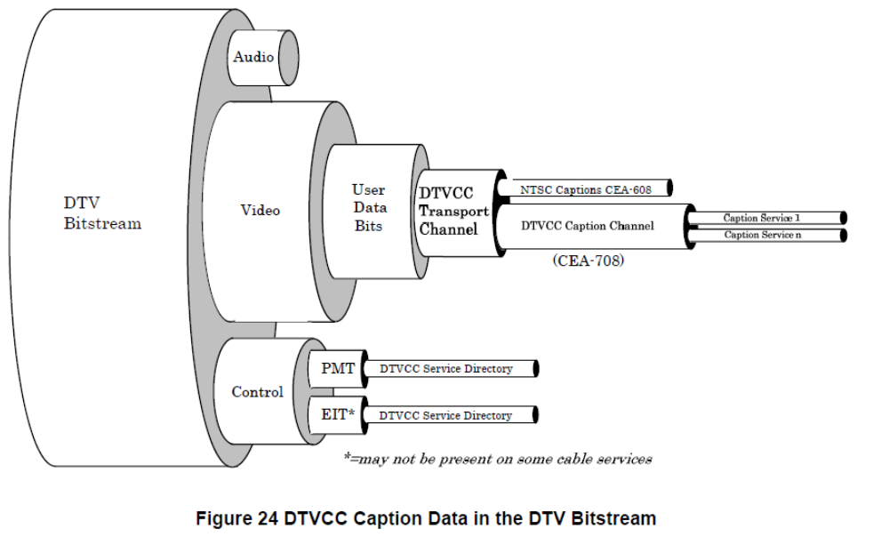

| (source: Digital Television (DTV) Closed Captioning, CEA-708-D)

| If DTV closed caption (DTVCC) related data is transported through the DTV bitstream, the related DTVCC data is present in the following three parts: picture user data, program mapping table (PMT), and event information table (EIT).

| DTVCC service data, which consists of caption text and window commands, is transported through the user data area. DTVCC Service Directory is transported through PMT and EIT (if present). PMT and EIT are multiplexed as other audio, control or synchronization bitstreams are and transported through the DTV bitstream.

| The following figure shows an example of a video decoder implementation that process MPT, EIT, and use data from DTV bitstream. This figure shows that the decoder implementation separates the path for handling CC data in the video user data area and the paths for handling service descriptors (for PMT and EIT, respectively).

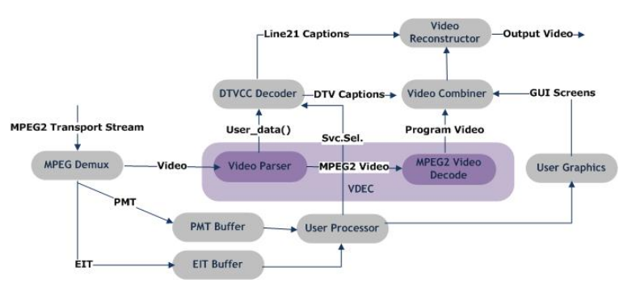

HFR Support
-----------

| High Frame Rate (HFR) is one of the features from DVB UHD-1 Phase 2. HFR supports the frame rate of 100Hz, 120/1.001Hz, and 120Hz, which are higher than standard frame rate (SFR) whose rate normally ranges up to 60Hz. HFR provides a smoother video experience for end users.

| By parsing the service description table (SDT) in the service information (SI) section data (see DVB specification for the definitions of SI and SDT), one can determine whether the current DTV channel is using HFR.

| For TV models that can support the HFR feature, 120Hz decoding and 120HZ display should be supported for the HFR channel.

| For the HFR channel that has a temporal scalability (see BT.2073 spec document), displaying video should be seamlessly switched if the frame rate of a stream switches between HFR and SFR within the stream itself.

| For TV models that cannot support the HFR feature (120Hz decoding and 120Hz displaying not supported), if the HFR channel has a temporal scalability, normal decoding and video displaying should be performed only for the sub-bitstream portion. Sub-bitstream is only composed of even frames of the full bitstream. In this case, the temporal IDs (temporalId) of all sub-bitstream frames are smaller than the temporal_id_max value in the program mapping table (PMT) of the HEVC descriptor information (see V4L2_CID_EXT_VDEC_TEMPORAL_ID_MAX in VDEC API Reference for more information).

| If the HFR channel doesn't have a temporal scalability, VDEC doesn't need to perform decoding.

| To support HFR temporal scalability stream, the temporal_id_max value has to be set. The temporal_id_max value can be obtained from the PMT table of HEVC descriptor info. If middeware components in webOS TV demands VDEC should decode HFR temporal scalability stream, then those middleware components need to set the temporal_id_max value using by using V4L2_CID_EXT_VDEC_TEMPORAL_ID_MAX. Once the temporal_id_max is set, VDEC needs to drop the subset part to support HFR temporal scalability stream decoding. Here, the subset refers to the frames composed of odd frames of full bitstream. In this case, and, the temporal IDs (temporalId) of all subset frames are the same as the temporal_id_max value.

| If the current DTV channel is detected to be HFR, call the :c:macro:`V4L2_CID_EXT_VDEC_HFR_TYPE` set ioctl command to set the appropriate HFR mode.

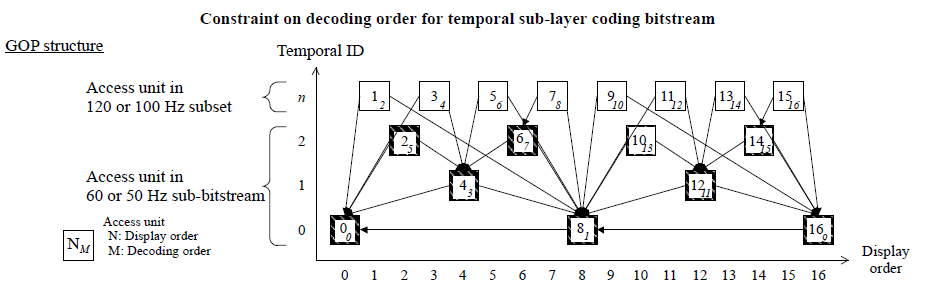

Quality and Constraints
=======================

This section lists the non-functional requirements for VDEC, such as performance,  quality requirements and design constraints.

Performance
-----------

Seamless Decoding
^^^^^^^^^^^^^^^^^

If video PES data using different video format are consecutively supplied to VDEC, VDEC should be able to decode the video data without generating video transient effects. The video format includes properties such as width, height, x-offset, y-offset, VFreq, interlaced type, and AFD.

Video Quality in Trick Mode
^^^^^^^^^^^^^^^^^^^^^^^^^^^

| Even when VDEC runs in trick mode (pause, 1/2x speed, 2x speed), webOS TV specification requires VDEC to display the same picture quality as in the normal mode.

| Depending on the SoC hardware structure, there are some cases VDEC's trick mode renders decoded video in poor quality when the video data decoded by VDEC is of interlaced type or of interlaced and 3:2 pull down film type. In such cases, vendors should come up with HW level and SW level measures to ensure reasonable video quality in trick mode. To meet this requirement, vendors might need to look into not only HW / SW level measures but also VDEC, VO, and video deinterlacer control.

Fast-App-Switching
^^^^^^^^^^^^^^^^^^

| Under the current webOS TV scenarios, VDEC stops running when the DTV input is not displayed on the screen but stays in the background, and VEC gets started and connects with VSC when the video input in the background moves to the foreground to be displayed.

| To achieve a fast DTV input switching speed, a different approach is being reviewed in which VDEC remains in the start state (VDEC keeps running) even when VDEC is in the background.

| VDEC, if it runs in the background and performs decoding, can render the video data on the screen by simply connecting to VSC. In this way, the video can be displayed on the screen a lot faster since delay factors such as I-Frame waiting, VDEC decoding time, waiting for STC and PTS to be matched are all removed.

| This feature also plays an importance role in SW module separation of VDEC and VSC, besides the enhancement of fast input switching.

| Therefore, this fast input switching feature should be implemented verified at the vendor's engineering level, although this scenario has not yet been incorporated into the webOS TV standard.

.. note::
    Vendors should contact webOS TV's VDEC representative to discuss whether this fast input switching feature must be included in their VDEC implementation or not.

Exception Cases
---------------

The following are exception cases that you must handle when implementing the VDEC module.

- If there are resources that are not cleaned up while the system is shutting down, it should be cleaned up.
- If a VDEC instance is closed, the VDEC instance should stop even if vidioc_streamoff is not called. The driver should clean up the resource of the instance being closed.
- If all of VDEC instances are closed, the connection with the VDO should be cleaned up from VDEC. However, the connection information with VDO should be maintained for recovery.
- If VDEC is opened again after closed and calls vidioc_streamon without disconnecting VDO from VDEC, the connection should be restored.
- If the VDEC connection / disconnection occurs after VDEC is all cleaned up, the connection information should be updated.
- If VDEC supports UHD channel decoding, VDEC should support 3840x2160 UHD channel decoding and 4096x2160 UHD channel decoding.
- If VDEC supports HEVC channel decoding, VDEC driver should support progressive scan type HEVC channel decoding and interlace scan type HEVC channel decoding.
- If VDEC MW doesn’t set temporal_id_max to the driver when decoding HEVC stream, the driver cannot calculate the frame rate by following the HEVC output frame rate equation. At this time, the driver should check the elemental_duration_in_tc_minus1 table and use temporal_id to calculate the effective frame rate, which could have been obtained if temporal_id_max had been set. If the elemental_duration_in_tc_minus1 table doesn’t exist in the stream, the driver should use the alternative frame rate which is obtained by dividing the FHR frame rate value by 2 if V4L2_CID_EXT_VDEC_PVR_MODE is on.
- If there is a frame which doesn’t have a PTS value, the frame should be displayed after interpolating by referring to the PTS value of another frame around it.
- Ideally, only the video frame whose video PTS is exactly matched with STC should be delivered from the VDEC’s decoded picture buffer to the video processing blocks. But according to the VDEC BSP SW structures of TV Soc vendors, there could be some time gap between the real STC obtained from HW and the STC value the VDEC BSP SW module is aware of. In this case, the time gap should be under +/- 5 msec so that the presenting time error of the decoded videos can be minimized.
- Unlike live signal, wraparound occurs as the file is repeated in the test environment. When returning to the beginning of the file, images might be damaged by noise or their display might be temporarily paused. Nonetheless, VDEC must guarantee that normal intact images will be displayed soon.
- Video PTS must not be modified for any reasons. For example, the processing delays in a video path and an audio path are usually independent from each other. Thus, you should not modify the video PTS to compensate this processing delay difference between the audio path and the video path. This is because this compensation, which is called as AV Lip Sync, will be controlled by other TV modules.
- Even if any abnormal video ES stream is sent to VDEC, VDEC must be protected from such stream input so that VDEC should not enter into an unrecoverable state such as a memory crash.
- It's possible that more than 2 instances of VDEC can run at the same time. Whether to have more than 2 VECs is determined by the video codec, the video resolution, the video frame rate, and the TV model.
- If more than 2 instances of VDEC run at the same time, each of the running VDECs should be able to run independently with each other running VDECs. Each running VDEC’s operation and performance should not affect or be affected by other running VDEC’s operation.
- In MPEG-2, the lower 8 pixels in a 1920x1088 resolution video are noise area. Since the crop information is optional, noise may be displayed. In order to provide users with better quality, the noise should not be output. VDEC must provide the original resolution information of TS to VDEC MW. By the way, when communicating between the VDEC output module and the VSC module, if TS is DTV TS & MPEG-2 & of 1920x1088 resolution & its crop size is 0, then the Bottom Crop size in the crop information must be set to 8 for the purpose of its processing. As a result, in the output module, it should be processed as a 1920x1080 video image.

Implementation
**************

| This section provides supplementary materials that are useful for VDEC implementation.

- The File Location section provides the location of the Git repository where you can get the header files in which the interface for the VDEC implementation is defined.
- The Implementation Details section sets implementation guidance for most common VDEC usage scenarios.
- The API List section provides a brief summary of VDEC APIs. VDO APIs are also included.
- The Status Log section provides information about the VDEC status log file which is used for examining the status and operation of VDEC.

File Location
=============
| The Git repository of the VDEC module is available at `v4l2-ext-broadcast-header <https://wall.lge.com/admin/repos/bsp/ref/v4l2-ext-broadcast-header>`_ . This Git repository contains the header files for the VDEC implementation as well as documentation for the VDEC implementation guide and VDEC API reference.

| It's up to the VDEC implementor to make the decision where to locate their VDEC module implementation in their build structure.

API List
========

| VDEC implementation must adhere to the interface specifications defined in the VDEC API Reference. Refer to the VDEC API Reference for more information.

Data Types
----------

Standard V4L2 Structures
^^^^^^^^^^^^^^^^^^^^^^^^

================================================================================================================================================================================== ============
Name                                                                                                                                                                               Description
================================================================================================================================================================================== ============
`v4l2_control <https://linuxtv.org/downloads/v4l-dvb-apis/userspace-api/v4l/vidioc-g-ctrl.html#c.V4L.v4l2_control>`_                                                               Structure to represent a control parameter and its value
`v4l2_event <https://linuxtv.org/downloads/v4l-dvb-apis/userspace-api/v4l/pixfmt-v4l2.html#c.v4l2_pix_format>`_                                                                    Structure to describe the format of a pixel-based video stream
`v4l2_event_subscription <https://linuxtv.org/downloads/v4l-dvb-apis/userspace-api/v4l/vidioc-g-fmt.html#c.V4L.v4l2_format>`_                                                      Structure to describe the format of a video stream
`v4l2_ext_control <https://linuxtv.org/downloads/v4l-dvb-apis/userspace-api/v4l/vidioc-g-ext-ctrls.html?highlight=v4l2_ext_control#c.V4L.v4l2_ext_control>`_                       Structure to represent an extended control for a video device
`v4l2_ext_controls <https://linuxtv.org/downloads/v4l-dvb-apis/userspace-api/v4l/vidioc-g-ext-ctrls.html?highlight=v4l2_ext_controls#c.V4L.v4l2_ext_controls>`_                    Structure to represent a set of extended controls for a video device
`v4l2_format <https://linuxtv.org/downloads/v4l-dvb-apis/userspace-api/v4l/vidioc-subscribe-event.html?highlight=v4l2_event_subscription#c.V4L.v4l2_event_subscription>`_          Structure to subscribe to specific events generated by a video device
`v4l2_pix_format <https://linuxtv.org/downloads/v4l-dvb-apis/userspace-api/v4l/vidioc-dqevent.html?highlight=v4l2_event#c.V4L.v4l2_event>`_                                        Structure to represent an event that has occurred in a video device
================================================================================================================================================================================== ============

Extended V4L2 Enumerations
^^^^^^^^^^^^^^^^^^^^^^^^^^

============================================== ===========================
Name                                           Description
============================================== ===========================
:cpp:any:`v4l2_ext_vdec_video_info`            Struct for VDEC video info
============================================== ===========================

Extended V4L2 Strucures
^^^^^^^^^^^^^^^^^^^^^^^

============================================== ==========================================================================
Name                                           Description
============================================== ==========================================================================
:cpp:any:`v4l2_ext_decoder_status`             Struct for V4L2_CID_EXT_VDEC_DECODER_STATUS
:cpp:any:`v4l2_ext_picinfo_msg_ext`            Struct for V4L2_CID_EXT_VDEC_PICINFO_EVENT_DATA_EXT
:cpp:any:`v4l2_ext_vdec_vdo_connection`        Struct for V4L2_CID_EXT_VDO_VDEC_CONNECTING
============================================== ==========================================================================

Extended V4L2 Definitions
^^^^^^^^^^^^^^^^^^^^^^^^^

============================================== ==========================================================================
Name                                           Description
============================================== ==========================================================================
:c:macro:`V4L2_EVENT_PRIVATE_EXT_VDEC_EVENT`   V4L2 Subscription Type for VDEC
============================================== ==========================================================================

Functions
---------
Linux Common Functions
^^^^^^^^^^^^^^^^^^^^^^
================================================================================================================================================= ================================== 
Function                                                                                                                                          Description
================================================================================================================================================= ================================== 
`V4L2 open() <https://linuxtv.org/downloads/v4l-dvb-apis/userspace-api/v4l/func-open.html>`_	                                                  Opens a V4L2 device
`V4L2 close() <https://linuxtv.org/downloads/v4l-dvb-apis/userspace-api/v4l/func-close.html>`_	                                                  Closes a V4L2 device
`V4L2 poll() <https://www.kernel.org/doc/html/v4.9/media/uapi/v4l/func-poll.html>`_	                                                              Suspend execution until the driver has captured data or is ready to accept data for output or event execution
`V4L2 mmap() <https://www.kernel.org/doc/html/v4.9/media/uapi/v4l/func-mmap.html>`_	                                                              Map device memory into application address space
`V4L2 munmap() <https://www.kernel.org/doc/html/v4.9/media/uapi/v4l/func-munmap.html>`_	                                                          Unmap device memory
================================================================================================================================================= ================================== 

Module Standard Functions
^^^^^^^^^^^^^^^^^^^^^^^^^

================================================================================================================================================= ==================================
Function                                                                                                                                          Description
================================================================================================================================================= ==================================
`VIDIOC_G_CTRL <https://linuxtv.org/downloads/v4l-dvb-apis/userspace-api/v4l/vidioc-g-ctrl.html#vidioc-g-ctrl>`_                                  Gets the value of a control
`VIDIOC_S_CTRL <https://linuxtv.org/downloads/v4l-dvb-apis/userspace-api/v4l/vidioc-g-ctrl.html#vidioc-g-ctrl>`_                                  Sets the value of a control
`VIDIOC_S_FMT <https://linuxtv.org/downloads/v4l-dvb-apis/userspace-api/v4l/vidioc-g-fmt.html#vidioc-g-fmt>`_                                     Sets the data format
`VIDIOC_STREAMON <https://linuxtv.org/downloads/v4l-dvb-apis/userspace-api/v4l/vidioc-streamon.html#vidioc-streamon>`_                            Starts streaming I/O
`VIDIOC_STREAMOFF <https://linuxtv.org/downloads/v4l-dvb-apis/userspace-api/v4l/vidioc-streamon.html#vidioc-streamon>`_                           Stops streaming I/O
`VIDIOC_G_EXT_CTRLS <https://linuxtv.org/downloads/v4l-dvb-apis/userspace-api/v4l/vidioc-g-ext-ctrls.html#vidioc-g-ext-ctrls>`_                   Gets the value of several controls
`VIDIOC_S_EXT_CTRLS	<https://linuxtv.org/downloads/v4l-dvb-apis/userspace-api/v4l/vidioc-g-ext-ctrls.html#vidioc-s-ext-ctrls>`_                   Sets the value of several controls
`VIDIOC_DQEVENT <https://linuxtv.org/downloads/v4l-dvb-apis/userspace-api/v4l/vidioc-dqevent.html#vidioc-dqevent>`_                               Dequeues the event
`VIDIOC_SUBSCRIBE_EVENT <https://linuxtv.org/downloads/v4l-dvb-apis/userspace-api/v4l/vidioc-subscribe-event.html#vidioc-subscribe-event>`_       Subscribes to an event
`VIDIOC_UNSUBSCRIBE_EVENT <https://linuxtv.org/downloads/v4l-dvb-apis/userspace-api/v4l/vidioc-subscribe-event.html#vidioc-unsubscribe-event>`_   Unsubscribes from an event
`VIDIOC_S_INPUT <https://linuxtv.org/downloads/v4l-dvb-apis/userspace-api/v4l/vidioc-g-input.html#vidioc-g-input>`_                               Selects the current video input
`VIDIOC_S_OUTPUT <https://linuxtv.org/downloads/v4l-dvb-apis/userspace-api/v4l/vidioc-g-output.html#vidioc-g-output>`_                            Selects the current video output
================================================================================================================================================= ==================================

Module Extended Control IDs
^^^^^^^^^^^^^^^^^^^^^^^^^^^

VDEC Control IDs
""""""""""""""""

====================================================== =================================================================================================================================================
Control ID                                             Description
====================================================== =================================================================================================================================================
:c:macro:`V4L2_CID_EXT_VDEC_CHANNEL`	               Sets the VDEC port where the file descriptor (fd) returned by V4L2 open() will be used
:c:macro:`V4L2_CID_EXT_VDEC_RESETTING`	               Resets the VDEC instance specified by the fd
:c:macro:`V4L2_CID_EXT_VDEC_AV_SYNC`	               Video sync control
:c:macro:`V4L2_CID_EXT_VDEC_FRAME_ADVANCE`	           Controls the frame advanced mode for PVR
:c:macro:`V4L2_CID_EXT_VDEC_DECODING_SPEED`	           Controls the decoding speed
:c:macro:`V4L2_CID_EXT_VDEC_DECODE_MODE`               Sets the decode mode
:c:macro:`V4L2_CID_EXT_VDEC_FREEZE_MODE`	           Turns on / off the freeze mode
:c:macro:`V4L2_CID_EXT_VDEC_STC_MODE`	               Turns on / off the STC mode
:c:macro:`V4L2_CID_EXT_VDEC_AUDIO_CHANNEL`	           Sets the audio port for AV sync logic
:c:macro:`V4L2_CID_EXT_VDEC_DISPLAY_DELAY`	           Sets the displaying delay
:c:macro:`V4L2_CID_EXT_VDEC_LIPSYNC_MASTER`            | Sets the Lipsync master
                                                       | It is used to set whether to use Audio master or Video master for video sync logic operation
:c:macro:`V4L2_CID_EXT_VDEC_VSYNC_THRESHOLD`           Sets the AV sync threshold for the VDEC instance specified by the fd
:c:macro:`V4L2_CID_EXT_VDEC_PVR_MODE`                  Turns on / off the PVR mode for the VDEC instance specified by the fd
:c:macro:`V4L2_CID_EXT_VDEC_FAST_IFRAME_MODE`          Turns on / off the Fast I-Frame mode for the VDEC instance specified by the fd
:c:macro:`V4L2_CID_EXT_VDEC_HFR_TYPE`                  Sets the type of the HFR channel for the VDEC instance specified by the fd
:c:macro:`V4L2_CID_EXT_VDEC_TEMPORAL_ID_MAX`           Sets the temporal_id_max value for the VDEC instance specified by the fd
:c:macro:`V4L2_CID_EXT_VDEC_DRIPDEC_MODE`              Indicates the decoding status
:c:macro:`V4L2_CID_EXT_VDEC_ECP_INFO_NOTI`             Used to tell VDEC to update ECP related information
:c:macro:`V4L2_CID_EXT_VDEC_ECP_OFFSET`                Receives the offset of ECP processed CPB
:c:macro:`V4L2_CID_EXT_VDEC_ECP_SIZE`                  Receives the size of ECP processed CPB
:c:macro:`V4L2_CID_EXT_VDEC_USER_EVENT_DATA`           Receives the parsed user data from the driver when a user data event occurs on the VDEC instance specified by the fd
:c:macro:`V4L2_CID_EXT_VDEC_PICINFO_EVENT_DATA`	       (duplicate) Receives the picture info data from the driver when a picture info event occurs on the VDEC instance specified by the fd
:c:macro:`V4L2_CID_EXT_VDEC_DECODER_STATUS`            Obtains the decoder status to get the current state of the VDEC decoder driver of the VDEC instance specified by the fd
:c:macro:`V4L2_CID_EXT_VDEC_VIDEO_INFO`                Obtains video information about the current image in the VDEC instance specified by the fd
:c:macro:`V4L2_CID_EXT_VDEC_PICINFO_EVENT_DATA_EXT`    (duplicate) Receives the picture info data from the driver when a picture info event occurs on the VDEC instance specified by the fd
:c:macro:`V4L2_CID_EXT_VDEC_DRIPDEC_PICTURE`           (duplicate) Receives the picture info data from the driver when a picture info event occurs on the VDEC instance specified by the fd
:c:macro:`V4L2_CID_EXT_VDEC_DECODED_PICTURE_BUFFER`    Control commands for VDEC's DPB
:c:macro:`V4L2_CID_EXT_VDEC_GET_PTS`                   Get video pts value of current decoded/displayed picture
:c:macro:`V4L2_SUB_EXT_VDEC_FRAME`                     Subscribes to or unsubscribes from a frame type event on the VDEC instance specified by the fd
:c:macro:`V4L2_SUB_EXT_VDEC_PICINFO`                   Subscribes to or unsubscribes from a picture info event on the VDEC instance specified by the fd
:c:macro:`V4L2_SUB_EXT_VDEC_USERDATA`                  Subscribes to or unsubscribes from a user data event on the VDEC instance specified by the fd
====================================================== =================================================================================================================================================

VDO Control IDs
"""""""""""""""

============================================== ===================================================================================================
Control ID                                     Description
============================================== ===================================================================================================
:c:macro:`V4L2_CID_EXT_VDO_VDEC_PORT`          Connects or disconnects VDO to or from the VDEC instance specified by the fd
:c:macro:`V4L2_CID_EXT_VDO_VDEC_CONNECTING`    Connects VDO to the VDEC instance specified by the fd
:c:macro:`V4L2_CID_EXT_VDO_VDEC_DISCONNECTING` Disconnects VDO from the VDEC instance specified by the fd
============================================== ===================================================================================================

Implementation Details
======================

| The VDEC module guide and VDEC API Reference explains fundamental features and key requirements of the VDEC module that developers must take into account.

| This section specifically focuses on the following frequent use cases or usage scenarios around VDEC and explains how these scenarios should be implemented by providing detailed function call sequences.

- init & start playing
- stop & destroy
- change channels
- switch to background / foreground

Initialize a pipeline & Start playing the DTV stream
----------------------------------------------------

| In this scenario, a DTV pipeline is initialized and it starts playing the DTV stream.

| This scenario is initiated in the following situations:

- TV AC is on under the condition that the preceding input was legacy DTV signal
- The channel changes from analog TV (ATV) to legacy DTV.
- The input source changes from an external input to legacy DTV under the condition that the legacy DTV pipeline doesn't exist in the background.

The following summarizes the call sequence of VDEC functions to realize this scenario. Developers should adhere to the sequence given below when implementing this scenario.

Normal Sequence
^^^^^^^^^^^^^^^

.. code-block:: text

    Pipeline Open
    |- SDEC Open
    |- VDEC Open
        |- VDEC V4L2 open ( path : V4L2_EXT_DEV_NO_VDEC, flag setting : O_RDWR | O_CLOEXEC | O_NONBLOCK )
        |- VDEC V4L2 ioctl invoked with V4L2_CID_EXT_VDEC_CHANNEL ( value : VDEC channel )
        |- VDEC V4L2 ioctl invoked with VIDIOC_SUBSCRIBE_EVENT ( type : V4L2_EVENT_PRIVATE_EXT_VDEC_EVENT, id : V4L2_SUB_EXT_VDEC_FRAME )
        |- VDEC V4L2 ioctl invoked with VIDIOC_SUBSCRIBE_EVENT ( type : V4L2_EVENT_PRIVATE_EXT_VDEC_EVENT, id : V4L2_SUB_EXT_VDEC_PICINFO )
        |- VDEC V4L2 ioctl invoked with VIDIOC_S_CTRL ( id : V4L2_CID_EXT_VDEC_DISPLAY_DELAY, value : 0 (0 ms) )
        |- VDEC event thread started
            VDEC V4L2 poll invoked periodically to check whether any VDEC event occurred or not.

    Pipeline Connect
    |- SDEC Connect
        |- SDEC set Input config
    |- VDEC Connect
        |- VDEC V4L2 ioctl invoked with VIDIOC_S_INPUT ( value : VTP channel )
        |- VDEC V4L2 ioctl invoked with VIDIOC_S_OUTPUT ( value : VDEC channel )
    |- Video VDO VDEC Connect
        |- VDO V4L2 open ( path : V4L2_EXT_DEV_NO_VDO0 or VDO1, flag setting : O_RDWR )
        |- VDO V4L2 ioctl invoked with VIDIOC_S_EXT_CTRLS ( id : V4L2_CID_EXT_VDO_VDEC_CONNECTING )
        |- VDO V4L2 close

    Pipeline Playing
    |- SDEC set PCR PID
    |- VDEC Start
        |- VDEC V4L2 ioctl invoked with VIDIOC_S_CTRL ( id : V4L2_CID_EXT_VDEC_FAST_IFRAME_MODE, value : 0 (off) )
        |- VDEC V4L2 ioctl invoked with VIDIOC_S_CTRL ( id : V4L2_CID_EXT_VDEC_PVR_MODE, value : 0 (off) )
        |- SDEC set Video PID
        |- VDEC V4L2 ioctl invoked with VIDIOC_S_FMT ( fmt.pix.pixelformat : v4l2_fourcc(codec type), type : V4L2_BUF_TYPE_VIDEO_OUTPUT )
        |- VDEC V4L2 ioctl invoked with VIDIOC_STREAMON ( value : V4L2_BUF_TYPE_VIDEO_OUTPUT )
    |- Demod tune is finished

    1st Frame type event fired for the new channel
    1st Picture info event fired for the new channel

Sequence Diagram
^^^^^^^^^^^^^^^^

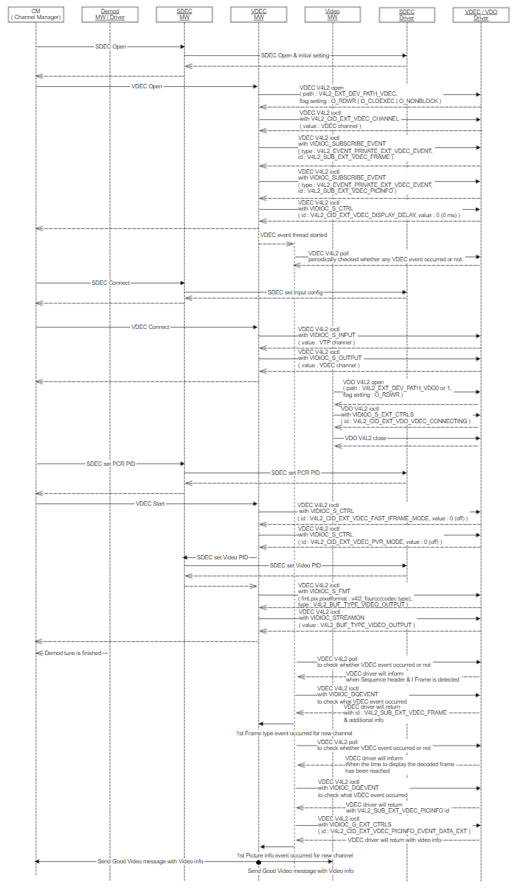

Stop and destroy the pipeline
-----------------------------

| In this scenario, the DTV pipeline which was initialized for the DTV stream stops and is destroyed.

| This scenario is initiated in the following situations:

- The channel changes from legacy DTV to ATV
- The input source changes from legacy DTV to some other input when no sufficient resources are available to switch the legacy DTV pipeline to the background.

| The following summarizes the call sequence of VDEC functions to realize this scenario. Developers should adhere to the sequence given below when implementing this scenario.

Normal Sequence
^^^^^^^^^^^^^^^

.. code-block:: text

    Pipeline Stop
    |- SDEC reset PCR PID
    |- VDEC Stop
        |- VDEC V4L2 ioctl invoked with VIDIOC_STREAMOFF
        |- VDEC V4L2 ioctl invoked with VIDIOC_S_CTRL (id: V4L2_CID_EXT_VDEC_HFR_TYPE, value: 0 (SFR, Standard Frame Rate)) for resetting
        |- VDEC V4L2 ioctl invoked with VIDIOC_S_CTRL (id: V4L2_CID_EXT_VDEC_TEMPORAL_ID_MAX, value : -1 (default value)) for resetting
        |- VDEC V4L2 ioctl invoked with VIDIOC_S_CTRL (id: V4L2_CID_EXT_VDEC_PVR_MODE, value: 0 (off)) for resetting
        |- SDEC reset Video PID

    Pipeline Destroy
    |- VDEC Close
        |- VDEC V4L2 ioctl invoked with VIDIOC_STREAMOFF
        |- VDEC V4L2 ioctl invoked with VIDIOC_UNSUBSCRIBE_EVENT (type: V4L2_EVENT_PRIVATE_EXT_VDEC_EVENT, id: V4L2_SUB_EXT_VDEC_USERDATA)
            if TV is ATSC model (Korea/US/etc.)
        |- VDEC event thread destroyed
        |- VDEC V4L2 ioctl invoked with VIDIOC_UNSUBSCRIBE_EVENT (type: V4L2_EVENT_PRIVATE_EXT_VDEC_EVENT, id: V4L2_SUB_EXT_VDEC_FRAME)
        |- VDEC V4L2 ioctl invoked with VIDIOC_UNSUBSCRIBE_EVENT (type: V4L2_EVENT_PRIVATE_EXT_VDEC_EVENT, id: V4L2_SUB_EXT_VDEC_PICINFO)
        |- VDEC V4L2 ioctl invoked with V4L2_CID_EXT_VDEC_CHANNEL (value: -1) for resetting
        |- VDEC V4L2 close
    |- SDEC Close
        |- SDEC set Input config for resetting
    |- Video VDO VDEC Disconnect
        |- VDO V4L2 open (path: V4L2_EXT_DEV_NO_VDO0 or VDO1, flag setting: O_RDWR)
        |- VDO V4L2 ioctl invoked with VIDIOC_S_EXT_CTRLS (id: V4L2_CID_EXT_VDO_VDEC_DISCONNECTING)
        |- VDO V4L2 close

Sequence Diagram
^^^^^^^^^^^^^^^^

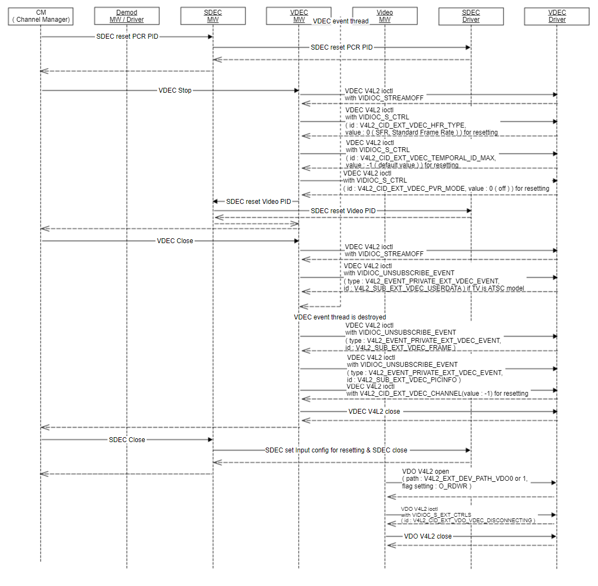

Change channels from legacy DTV to legacy DTV
---------------------------------------------

| In this scenario, the DTV pipeline stops by aborting or finishing the preceding DTV stream and starts playing again for the new legacy DTV channel.

| This scenario is initiated in the following situations:

- The channel changes from one legacy DTV channel to another legacy DTV channel.

The following summarizes the call sequence of VDEC functions to realize this scenario. Developers should adhere to the sequence given below when implementing this scenario.

Normal Sequence
^^^^^^^^^^^^^^^

.. code-block:: text

    Pipeline Stop
    |- SDEC reset PCR PID
    |- VDEC Stop
        |- VDEC V4L2 ioctl invoked with VIDIOC_STREAMOFF
        |- VDEC V4L2 ioctl invoked with VIDIOC_S_CTRL (id: V4L2_CID_EXT_VDEC_HFR_TYPE, value: 0 (SFR, Standard Frame Rate)) for resetting
        |- VDEC V4L2 ioctl invoked with VIDIOC_S_CTRL (id: V4L2_CID_EXT_VDEC_TEMPORAL_ID_MAX, value: -1 (default value)) for resetting
        |- VDEC V4L2 ioctl invoked with VIDIOC_S_CTRL (id: V4L2_CID_EXT_VDEC_PVR_MODE, value: 0 (off)) for resetting
        |- SDEC reset Video PID

    Pipeline Playing
    |- SDEC set PCR PID
    |- VDEC Start
        |- VDEC V4L2 ioctl invoked with VIDIOC_S_CTRL (id: V4L2_CID_EXT_VDEC_FAST_IFRAME_MODE, value: 0 (off))
        |- VDEC V4L2 ioctl invoked with VIDIOC_S_CTRL (id: V4L2_CID_EXT_VDEC_PVR_MODE, value: 0 (off))
        |- SDEC set Video PID
        |- VDEC V4L2 ioctl invoked with VIDIOC_S_FMT (fmt.pix.pixelformat: v4l2_fourcc(codec type), type: V4L2_BUF_TYPE_VIDEO_OUTPUT)
        |- VDEC V4L2 ioctl invoked with VIDIOC_STREAMON (value: V4L2_BUF_TYPE_VIDEO_OUTPUT)
    |- Demod tune is finished

    1st Frame type event fired for the new channel
    1st Picture info event fired for the new channel

Sequence Diagram
^^^^^^^^^^^^^^^^

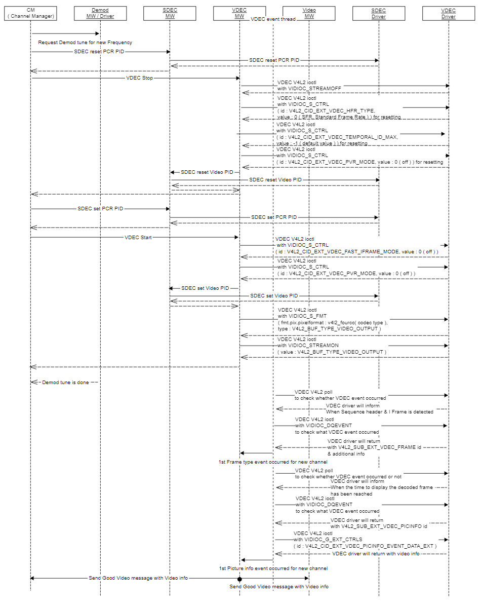

The pipeline switches to the background / foreground
----------------------------------------------------

| In this scenario, the DTV pipeline switches to the background (from the foreground) or to the foreground (from the background).

| This scenario is initiated in the following situations:

- The input source changes from legacy DTV to another input when sufficient sources are available to switch the DTV pipeline to the background.
- The input source changes from another input to legacy DTV when the under the condition that the legacy DTV pipeline exists in the background.

| The following summarizes the call sequence of VDEC functions to realize this scenario. Developers should adhere to the sequence given below when implementing this scenario.

Normal Sequence
^^^^^^^^^^^^^^^

.. code-block:: text

    Pipeline Pause ( DTV pipeline switch to background )
    |- Video VDO VDEC Disconnect
        |- VDO V4L2 open ( path : V4L2_EXT_DEV_NO_VDO0 or VDO1, flag setting : O_RDWR )
        |- VDO V4L2 ioctl invoked with VIDIOC_S_EXT_CTRLS ( id : V4L2_CID_EXT_VDO_VDEC_DISCONNECTING )
        |- VDO V4L2 close

    No VDEC Picture info event from VDEC driver

    Pipeline playing ( DTV pipeline switch to foreground )
    |- Video VDO VDEC Connect
        |- VDO V4L2 open ( path : V4L2_EXT_DEV_NO_VDO0 or VDO1, flag setting : O_RDWR )
        |- VDO V4L2 ioctl invoked with VIDIOC_S_EXT_CTRLS ( id : V4L2_CID_EXT_VDO_VDEC_CONNECTING )
        |- VDO V4L2 close

    VDEC Frame type event & Picture info event occur again from VDEC driver

Sequence Diagram
^^^^^^^^^^^^^^^^

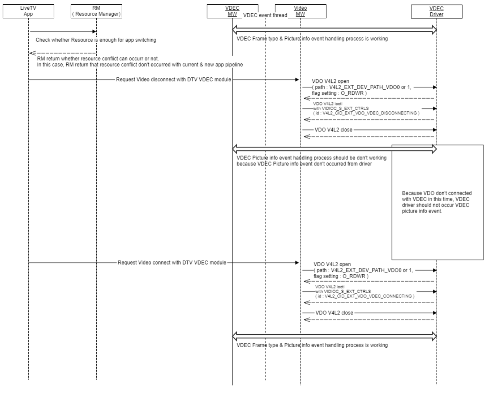

Status Log
==========

To examine the status and operation of VDEC, you can use the status log file, a text-based log file. For more information on how to use the status log file, refer to VDEC Status Log File.

Debugging
*********

| This section provides debugging tips for developers to pinpoint the source of the issues that might arise in the course of VDEC implementation.

| To identify which component causes the issue, you need to examine the following two parts:

- Data flow across the VDEC module
- Responsible component(s) at each stage of the data flow

| First, you need to track down the data flow across the VDEC module. From the VDEC's perspective, the following three points should be examined:

#. Data in: Check the integrity of the data delivered from SDEC (Demux) to the VDEC module.
#. Data inside: Check whether the data is properly decoded by the decoder within the VDEC module.
#. Data out: Check whether the decoded picture data is sent to the VSC module in accordance with the AV sync logic.

| Second, identify which component is responsible for affecting the data flow and causing the issue. The following list provides typical examples of identifying responsible components based on the data flow analysis:

- Check the sequence diagrams in Implementation Details. If the calling sequence from other MWs is out of order, contact the respective MW representatives and ask for their review.
- If the incoming data from the SDEC module seems to be wrong, contact the SDEC representative.
- If you have problems connecting the VDO module with VSC MW, contact the VSC MW representative.
- If the decoded picture data is sent to VSC in accordance with the AC sync logic but the video displayed on the screen has some problems, contact the VSC representative.

**Understanding Channel Change Process**

| The data flow through the VDEC module originates from the process of changing TV channels which triggers the overall data flow. The channel change process generally starts when a user presses a button of a remote controller and ends when the video output of a new channel is displayed. The following steps describe the entire process of changing TV channels in detail:

<Channel Change Process: The Process of Changing TV Channels>

#. The user presses one of the remote controller buttons.
#. The pressed button's key code is transmitted from the transmitter of the remote controller through an infrared (IR) wave.
#. TV's infrared wave receiver receives the key code which has been transmitted from the remote controller.
#. The micom service key handler recognizes the key code and sends information about the key code to the surface manager.
#. The surface manager sends a channel change request to the LiveTV app.
#. The LiveTV app sends a channel change request to Channel Manager (CM).
#. CM checks the channel map and resource requirement with Resource manager (RM). If resource acquisition is needed, the existing pipeline is destroyed and a new pipeline is created and initialized.
#. The pipeline stops and cleans up the previous settings.
#. The pipeline starts playing DTV video.
    #. If the mux change is needed, then FE tune is carried out.
    #. SDEC / VDEC / ADEC starts by using PID in the channel map.
    #. In case FE locked, receiving ES data starts from VDEC / ADEC.
    #. In case FE not locked, SDEC / VDEC / ADEC stops and the channel banner is displayed.
    #. After detecting 1st I Frame from VDEC, a VDEC Frame type event occurs.
    #. After matching STC - PTS from VDO, VDEC Picture info event occurs. Then VDEC sends a Good Video message to the observer. From the observer, the Good Video message is broadcasted to CM / Video modules.
    #. After getting the Good Video message from the Video module, the Video module sets in / out a window, the PQ setting is carried out, and video mute is lifted (video mute off).
    #. After finishing video mute off, the user can watch DTV video.

| In the channel change process, the time taken from initiating 'VDEC Start' or 'FE locked' until sending the 'Good Video' message is affected by the VDEC module's performance.

| The time between receiving the ES data delivered to VDEC and the occurrence of the '1st Frame type' event is affected depending on how much the GOP size (I Frame gap) of the channel has changed.

| Also, the time from the occurrence of '1st Frame type' event to the occurrence of the '1st Picture info' event is affected by the difference between PCR and PTS (PCR - PTS gap) of the channel.

| In addition, a buffering time is added to prevent underrun of ES data input. The occurrence time of the '1st Picture info' event can be shortened if the performance of 'video mute off' for changing channels is enhanced.

| The following shows an example of log messages printed when a typical channel change process is executed. Note that actual log messages will differ based on the vendor implementation.

.. code-block:: text

    channel change from ATV to DTV
    ATV 95 channel -> DTV 11-1 MBC channel
    ...
    micom service key handler recognize about key code. and send key code info to surface manager
    ...
    surface manager send channel change request to livetv app
    ...
    CM checked the channel map and channel change executed
    ...
    pipeline stop
    ...
    pipeline play
    ...
    FE tune
    ...
    SDEC / VDEC / ADEC start by using PID in the channel map
    ...
    VDEC Start
    ...
    FE locked
    ...
    1st I Frame detection
    ...
    Good Video
    ...
    Video mute off
    ...

**Issue Identifying Process**

The following summarizes the general issue identifying process. Based on the symptoms of the issue, you can identify which component should be examined.

.. code-block:: cpp

    if video data seems to be broken or abnormal
        if 'API_FE_CheckSignalState' log PKE(packet error) value is not 0
        after several second is passed after 'MSG_FE2CM_DIGITAL_LOCKED' log printed
        FE owner needs to check the issue
        else
        SDEC or VDEC needs to check the issue in more detail

    if changed to legacy DTV channel (input change & channel change,
    you can know this timing by referring 'interface_broadcast_changeChannel' log, 'APPINFO' log)
        if the channel has video and the 'VDEC Good Video' log is printed
            if the 'No signal' or 'service not supported' banner is displayed
                CM owner needs to check the screen saver
            else if the issue symptom is no video
                check the 'channel resolution' info from the 'VDEC resolution (width, height)' log
                which is printed just before the 'VDEC Good Video' log is printed

                if the 'AVproxy setDecodeInfo' log, which is included in the resolution info,
                is not printed within several seconds after the 'VDEC Good Video' log is printed
                    AVproxy owner or CM observer owner needs to check the issue

                if the 'video set video data' log, which is included in the resolution info,
                is not printed within several seconds after the 'VDEC Good Video' log is printed
                    AVproxy owner or video owner needs to check the issue

                if the 'video mute off' log in not printed within several seconds
                after the 'VDEC Good Video' log is printed
                    Video owner needs to check the issue
        else // the 'VDEC Good Video' log isn't printed
            if FE tune is executed after input change or channel change
                if the 'MSG_FE2CM_DIGITAL_LOCKED' log isn't printed
                    FE owner needs to check the issue

                if the VDEC channel which has been already started cannot connect with VDO
                (check whether the 'VDEC Start' log & the 'VDO VDEC Connect / Disconnect' log are printed)
                    AVproxy owner needs to check the issue

                if 'VDEC Start' has not been called
                    CM owner needs to check the issue

                SDEC or VDEC needs to check the issue in more detail

Testing
*******

| To test the implementation of the VDEC module, webOS TV provides SoCTS (SoC Test Suite) tests.
| The SoCTS checks the basic operations of the VDEC module and verifies the kernel event operations for the module by using a test execution file.
| For more information, see :doc:`VDEC's SoCTS Unit Test manual. </part4/socts/Documentation/source/producer-manual/producer-manual_v4l2/producer-manual_v4l2-vdec>`

References
**********

