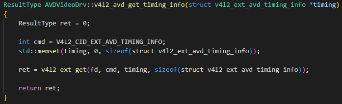
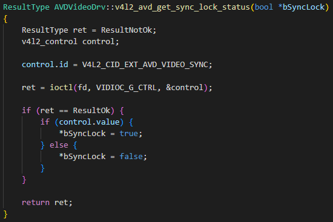
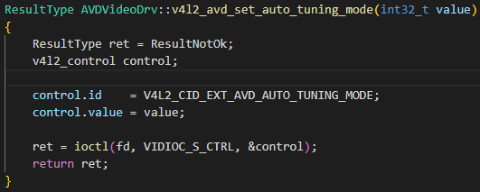

AV input
########

Introduction
************

| This document describes the av-input module in the kernel space. The document gives an overview of the av-input module and provides details about its functionalities and implementation requirements.

Revision History
================

======= ========== =================== =======
Version Date       Changed by          Comment
======= ========== =================== =======
1.1     2023-11-15 minjae.jun@lge.com  Applied new document template.
1.0     2018-12-07 yusun85.lee@lge.com First release
======= ========== =================== =======

Terminology
===========

| The key words "must", "must not", "required", "shall", "shall not", "should", "should not", "recommended", "may", and "optional" in this document are to be interpreted as described in RFC2119. 

| The following table lists the terms used throughout this document: 

====================================== ==================================
Definition                             Description
====================================== ==================================
Composite                              Cost Effective signalling method,  This way of signalling save the number of cable and the required bandwidth. But, it has such demertis that low video and audio quality and it is vulnarable to noise. it can support only limited resolution.
VBI                                    VBI means "Vertical Blanking Interval". This means the time between Video Field and Video Field in analog-TV. This time is used for transmitting character data in ATV.
ClosedCaption                          This is a type of VBI data. This is generally used in ATSC. Characters can be broadcasted by ClosedCaption.
Teletext                               This is a type of VBI data. This is generally used in Europe , This is a type of Character broadcasting, A Large number of Character or graphic can be transmitted Teletext.
VPS                                    VPS means Video Programming System. This is a type of VBI data. This is generally used in Europe, The information of channel name can be sent by VPS,
WSS                                    This is a type of VBI data. This is generally used in Europe, This signal control the aspect ratio of TV.
VBI Slicer                             VBI Slicer is the HW-block which catch the VBI-data.
CVBS                                   CVBS is an analog video format that typically carries a 525 or 625 line signal on a single channel.
====================================== ==================================

Technical Assistance
====================

| For assistance or clarification on information in this guide, please create an issue in the LGE JIRA project and contact the following person:

=============== ==========
Module          Owner
=============== ==========
av              jihoons.kim@lge.com
=============== ==========

Overview
********

General Description
===================

CVBS signal has a special signal form which save the required bandwitdh for
transmitting moving-video, audio data, auxilary data. Analog Video Decoder is
the HW block that interprets the composite signal into video-digital-data. These
video-digital data can be used further video processing. Normally, Analog TV, av-input
receives CVBS siganl in TV.

Architecture
============

Driver Architecture
-------------------

.. image:: resources/av-input-overview.jpg
  :width: 100%
  :alt: AV Input Overview

The figure shows the internal configuration block of the Analog Video Decoder (AVD), the external peripheral block of the AVD, and the signal transmission structure between them. AVD receives an Analyst-CVBS signal, which may come from an external input terminal such as AV or Scott, or may come from an Analyst. The Analyst-CVBS input signal is subjected to DC-restoration, Auto-Adjust, and digitization operations through the ADC. The Y/C separator plays a role in separating Y, U, and V from the composite signal, and for this purpose, it includes 2D/3D comb filter, Multifiler & filter, etc. The separated Y, U, and V signals are transmitted to the scaler. The composite signal VBI line includes various types of data such as CC, Teletext, VPS, and wss, which are separated and read through the VBI Slicer and transmitted to the block in charge.

Requirements
************
Functional Requirements
=======================

- The Analog Composite Signal should be processed and the image signal should be transmitted to the scaler module.
- The CC, Rating, TTX, VPS, and WSS signals should be separated from the Analog Composite Signal and delivered to each decoder module.

Quality and Constraints
=======================

Performance
-----------

The ATSC model only needs to support NTSC signals, but the DVB model must support all AV signals (PAL, NTSC, SECAM).

Design Constraints
------------------
Some functions are used differently for each broadcast system.
ATSC : Closed Caption
DVB : Teletext, VPS, WSS

Implementation
**************

This section provides materials that are useful for av-input implementation. 

- The File Location section provides the location of the Git repository where you can get the header file in which the interface for the av-input implementation is defined.
- The API List section provides a brief summary of av-input APIs that you must implement.
- The Implementation Details section sets implementation guidance and example code for some major functionalities.

File Location
=============

The av-input interfaces are defined in the v4l2-ext-avd.h header file, which can be obtained from https://swfarmhub.lge.com/.

- Git repository: bsp/ref/v4l2-ext-extinput-header
- Location: [as_installed]/linux/v4l2-ext-avd.h

API List
========

The av-input driver implementation must adhere to the interface specifications defined and implements its functions. Refer to the API Reference for more details.

Data Types
----------

Standard Data Types
^^^^^^^^^^^^^^^^^^^

Standard V4L2 Data Types

================================================================================================================================================== ================================================================
Data Type                                                                                                                                          Description
================================================================================================================================================== ================================================================
:ref:`v4l2_std_id <v4l-dvb-apis:v4l2-std-id>`                                                                                                      This type is a set, each bit representing another video standard as listed below and in Video Standards (based on itu470). The 32 most significant bits are reserved for custom (driver defined) video standards.
`v4l2_control <https://www.kernel.org/doc/html/v4.9/media/uapi/v4l/vidioc-g-ctrl.html?highlight=v4l2_control#c.v4l2_control>`_                     Get or set the value of a control, try control values
`v4l2_ext_control <https://www.kernel.org/doc/html/v4.9/media/uapi/v4l/vidioc-g-ext-ctrls.html?highlight=v4l2_ext_control#c.v4l2_ext_control>`_    Get or set the value of several controls, try control values
`v4l2_ext_controls <https://www.kernel.org/doc/html/v4.9/media/uapi/v4l/vidioc-g-ext-ctrls.html?highlight=v4l2_ext_controls#c.v4l2_ext_controls>`_ Get or set the value of several controls, try control values
================================================================================================================================================== ================================================================

Extended Enumerations
^^^^^^^^^^^^^^^^^^^^^

Extended V4L2 Data Types

============================================================= ==================================
Data Type                                                     Description
============================================================= ==================================
:cpp:any:`v4l2_ext_avd_input_src`                             Input source value
:cpp:any:`v4l2_ext_video_rect`                                Video rect values
:cpp:any:`v4l2_ext_avd_timing_info`                           Timing information of av input
============================================================= ==================================

Functions
---------

Standard Functions
^^^^^^^^^^^^^^^^^^

Standard V4L2 Function Calls & Commands

========================================================================================================================== =================================================================
Funtion                                                                                                                    Description
========================================================================================================================== =================================================================
`open <https://linuxtv.org/downloads/v4l-dvb-apis/userspace-api/v4l/func-open.html?highlight=v4l2%20open#c.V4L.open>`_     Open a V4L2 device
`close <https://linuxtv.org/downloads/v4l-dvb-apis/userspace-api/v4l/func-close.html?highlight=v4l2%20close#c.V4L.close>`_ Close a V4L2 device
:ref:`VIDIOC_S_INPUT <v4l-dvb-apis:VIDIOC_G_INPUT>`                                                                        Query or select the current video input
:ref:`VIDIOC_G_INPUT <v4l-dvb-apis:VIDIOC_G_INPUT>`                                                                        Query or select the current video input
:ref:`VIDIOC_S_STD <v4l-dvb-apis:VIDIOC_G_STD>`                                                                            Query or select the video standard of the current input
:ref:`VIDIOC_G_STD <v4l-dvb-apis:VIDIOC_G_STD>`                                                                            Query or select the video standard of the current input
:ref:`VIDIOC_S_CTRL <v4l-dvb-apis:VIDIOC_S_CTRL>`                                                                          Get or set the value of a control
:ref:`VIDIOC_G_CTRL <v4l-dvb-apis:VIDIOC_G_CTRL>`                                                                          Get or set the value of a control
:ref:`VIDIOC_S_EXT_CTRLS <v4l-dvb-apis:VIDIOC_G_EXT_CTRLS>`                                                                Get or set the value of several controls, try control values
:ref:`VIDIOC_G_EXT_CTRLS <v4l-dvb-apis:VIDIOC_G_EXT_CTRLS>`                                                                Get or set the value of several controls, try control values
:ref:`VIDIOC_QUERYCAP <v4l-dvb-apis:VIDIOC_QUERYCAP>`                                                                      Query device capabilities
========================================================================================================================== =================================================================

Extended functions
^^^^^^^^^^^^^^^^^^

Extended V4L2 Control ids

============================================= ===============================================
Funtion                                       Description
============================================= ===============================================
:c:macro:`V4L2_CID_EXT_AVD_PORT`              Set/Get AVD Port.
:c:macro:`V4L2_CID_EXT_AVD_TIMING_INFO`       Get AVD timing info.
:c:macro:`V4L2_CID_EXT_AVD_AUTO_TUNING_MODE`  Set/Get avd auto tuning mode.
:c:macro:`V4L2_CID_EXT_AVD_VIDEO_SYNC`        Get Sync Status.
:c:macro:`V4L2_CID_EXT_AVD_CHANNEL_CHANGE`    Set/Get avd channel change.
============================================= ===============================================

Implementation Details
======================
- Get Timing Info : Information of the input signal should be transmitted to the platform through the function v4l2.

- Get Sync Lock Status : Sync Lock information of an input signal should be transmitted to the platform through a v4l2 function.

- Set Auto Tuning Mode : The function v4l2 should be able to operate the Auto Tuning mode.

Testing
*******
| To test the implementation of the av-input module, webOS TV provides SoCTS (SoC Test Suite) tests. 
| The SoCTS checks the basic operations of the av-input module and verifies the kernel event operations for the module by using a test execution file. 
| For more information, see :doc:`av-input’s SoCTS Unit Test manual. </part4/socts/Documentation/source/producer-manual/producer-manual_v4l2/producer-manual_v4l2-vdec_v4l2-avd_av>`

Reference
*********

`linuxtv.org v4l-dvd-api <https://linuxtv.org/downloads/v4l-dvb-apis/index.html>`_

`v4l2-ext-avd.h <http://10.157.97.248:8000/v4l2/master/latest_html/api/file_integrated_build_source_v4l2-ext-extinput-header_linux_v4l2-ext-avd.h.html#file-integrated-build-source-v4l2-ext-extinput-header-linux-v4l2-ext-avd-h>`_

`For more information about external input status, see External Input Status page. <http://10.157.97.248:8000/bsp_document/master/latest_html/part2/v4l2-ext-extinput-header/documentation/source/status-files/external-input-status.html>`_