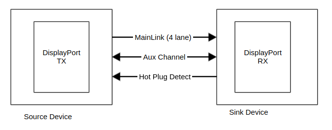
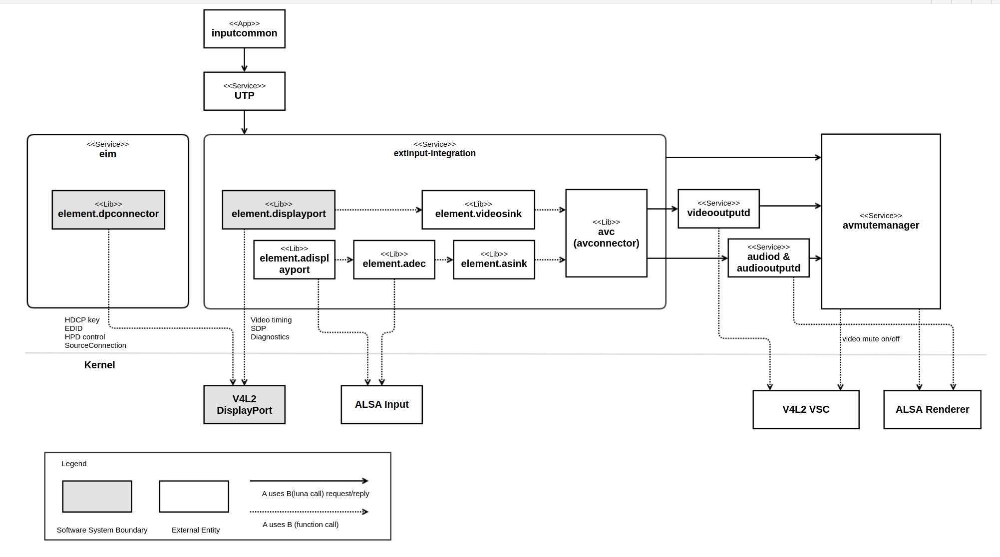
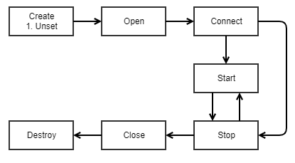
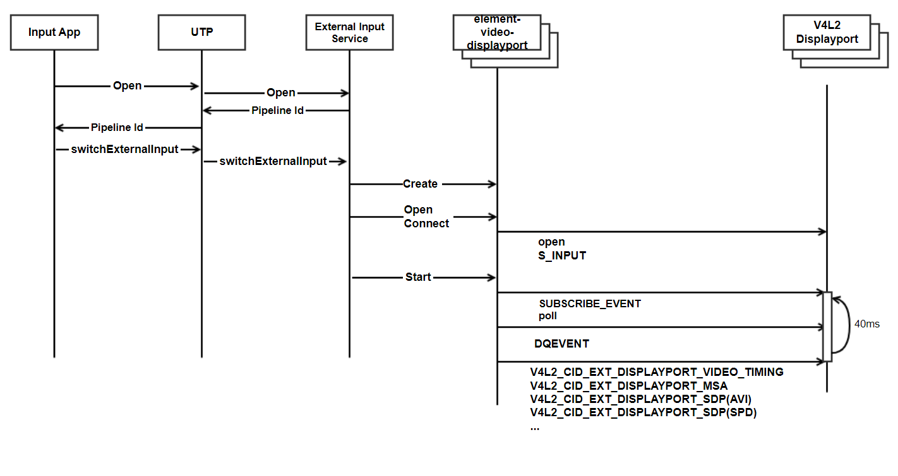
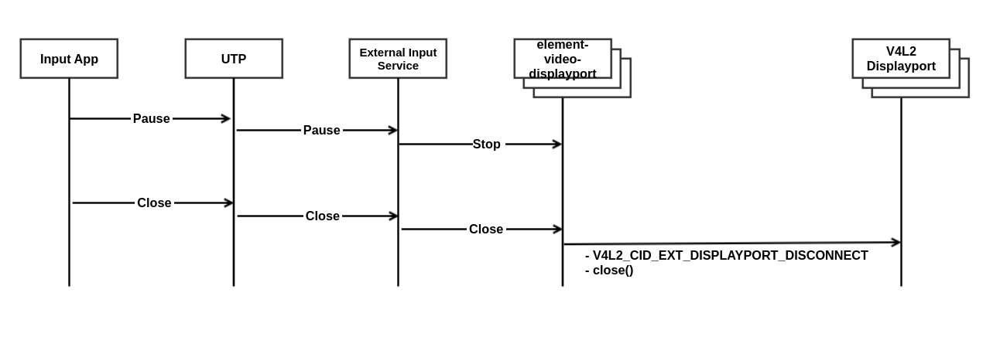
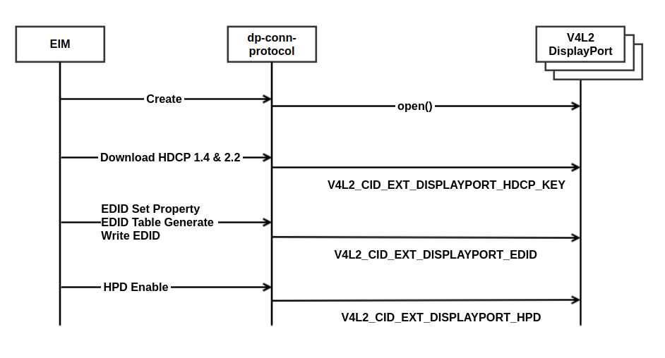

Displayport-input
#################

.. seealso::

  :doc:`/status-files/external-input-status`

Introduction
************

| This document describes the Displayport-input module in the kernel space. The document gives an overview of the Displayport-input module and provides details about its functionalities and implementation requirements.
The DisplayPort-input receives the DisplayPort micro packet signal, separates it into video, audio, and additional information and delivers the information to the corresponding module.

Revision History
================

.. _mini.nam: mini.nam@lge.com

======= ========== ============== =======
Version Date       Changed by     Comment
======= ========== ============== =======
0.6     2024-03-14 kwonwoo.kang   Except APIs from socts (V4L2_CID_EXT_DISPLAYPORT_EXPERT_SETTING)
0.5     2024-09-09 hyunwook.park  Update RST for V4L2_CID_EXT_DISPLAYPORT_EXTERNAL_DPCD_SETTING
0.4     2024-06-11 jihoons.kim    Update RST for V4L2_CID_EXT_DISPLAYPORT_EXPERT_SETTING
0.3     2023-11-15 minjae.jun     Applied new document template.
0.2     2022-11-01 mini.nam       Update audio timing. Add background timing capability
0.1     2022-09-15 mini.nam       Initial draft
======= ========== ============== =======

Terminology
===========

| The key words "must", "must not", "required", "shall", "shall not", "should", "should not", "recommended", "may", and "optional" in this document are to be interpreted as described in RFC2119.

| The following table lists the terms used throughout this document:

====================================== ==================================
Definition                             Description
====================================== ==================================
EDID                                   Extended Display Identification Data. Information about the signals that can
                                       be supported by the TV is provided to the Source through the EDID.
HPD                                    Hot Plug Detect. Name of Pin No. 19 of HDMI port. When this signal is
                                       enabled, it is used for synchronization of source and sink (EDID, HDCP).
Infoframe                              There are AVI, SPD and VSI information which is loaded
                                       on HDMI input signal. In addition to Video and Audio, HDMI has control
                                       information and can provide it.
Timing Info                            It means format information of HDMI signals and provides format information.
Link layer                             Protocol for configuring and managing the topology and flow of data over transport and auxiliary channels.
MSA                                    Main Stream Attributes.
                                       Attributes describing the main video stream format in terms of geometry and color format.
                                       Inserted once per video frame during the video blanking period. Used by the DisplayPort receiver in reconstructing the stream.
SDP                                    Secondary Data Packet.
                                       Data transported over the Main-Link which is not main video stream data, such as audio data and Infoframe SDPs.
AUX_CH                                 Auxiliary Channel.
                                       This has a half-duplex bi-directional PHY. It is composed of an differential pair with Manchester-II coding. Clock is extracted from the data stream.
                                       It provides 1Mbps data rate. Source device initiates an AUX request to read DPCD link/sink status register bits after HPD toggle.
DPCD                                   DisplayPort Configuration Data.
                                       DPCD registers are mapped to the DPRX’s 20-bit address space. Each register is 8 bits wide.
                                       The DPRX uses DPCD registers to declare DPRX capabilities and status. The DPTX uses DPCD registers to configure the DPRX, using AUX transactions.
====================================== ==================================

Technical Assistance
====================

=============== ==========
Module          Owner
=============== ==========
hdmi input      jihoons.kim@lge.com
=============== ==========

Overview
********

General Description
===================

DisplayPort is composed of Main-Link, AUX_CH and HPD line with 20 pin connector.
Main-Link is  composed of one,two or four differential pairs called lanes.
In DisplayPort 1.4, four link rates are supported 1.62Gbps/lane, 2.7Gbps, 5.4Gbps and 8.1Gbps equivalent to the RBR, HBR, HBR2 HBR3 each.
All enabled lanes shall operate at the same link rate. There is no dedicated clock channel. The clock is extracted from the data stream itself that is encoded with 8b/10b encoding rule.
AUX_CH is a half duplex, bidrectional channel used for link and device management via DPCD registers. It provides a data rate of 1Mbps.
HPD signal also serves as an interrupt request by DP sink device.

Features
========

- Connection : Must be able to connect/remove to the DP Port you set up.
- Video/Audio information : Must be able to retrieve Video/Audio information from a connected DP source device.
- Additional Information : Additional signal information should have been able to be obtained from the connected DP source device.
- EDID/HDCP : EDID and HDCP must be set/Getable.
- HPD : The HPD must be controllable.
- DPMS : V4L2 function for DPMS operation

Architecture
============

Driver Architecture
-------------------

================================================== ==================================
Definition                                         Description
================================================== ==================================
ALSA Input                                         Audio driver with linux ALSA standard interface
audioD                                             Service that controls audio decoding and output.
avc (avconnector)                                  Library that provides a unified API to the pipeline, services, or apps which require video and audio format information like videooutputd and audiod in the same way.
avmutemanager                                      Service that contorols audio and video mute while it switches input or signal is changed to prevent displaying broken audio and video.
eim (external input manager)                       Service related external devices, hdmi edid, hdcp key, cec and etc.
element.adec                                       Library of audio decoder that controls the ALSA audio decoder BSP driver.
element.ahdmi                                      Library that analyze the meta data of the HDMI audio signal from HDMI input and deliver the audio format information to element.audiosink.
element.asink                                      Library that delivers audio format information to the pipeline.
element.hdmi (AKA. element-video-hdmi)             Library that analyze the meta data of the HDMI video signal from HDMI input and deliver the video format information to element.videosink.
element.hdmiconnector                              Library that controls HDMI edid and hdcp key and hpd.
extinput-integration (AKA. External Input Service) Service that manages element resources related to external input like HDMI and Composite signal.
element.videosink                                  Library that delivers video format information to the pipeline.
inputcommon (AKA. HDMI app)                        Application for hdmi and rf tuner input.
libcecp                                            Library that communicate with source devices via HDMI CEC.
UTP (Unified TV Player)                            Service that mediates TV broadcasting and external input related services.
videooutputD                                       Service that manages video output window.
V4L2 DisplayPort                                   DisplayPort video driver with linux v4l2 standard interface
V4L2 VSC                                           Video scaler driver with linux v4l2 standard interface
================================================== ==================================

Overall Workflow
================

DisplayPort Pipeline Sequence Diagram
-------------------------------------

DisplayPort Pipeline Sequence Diagram: When the DisplayPort Pipeline is created, it is called in the order of Open, Connect, and Start. Termination is called in the order of Stop, Close, and Destroy.

DisplayPort Start Sequence Diagram
----------------------------------

This is a diagram for the DisplayPort input switching sequence. When you open via UTP in the Input App, you get Pipeline Id. When you call the switchExternalInput API with this Id, the External Input Service opens the DisplayPort BSP with the function v4l2 via element-video-displayport and then calls another v4l2 function every 40 ms.

DisplayPort End Sequence Diagram
--------------------------------

First, pass Pause through UPT in Input App and stop element-video-displayport in external input service. After that, when you call Close in Input App, call V4L2_CID_EXT_DISPLAYPORT_DISCONNECT toward the BSP through UTP, External Input Service, Element-video-displayport.

DisplayPort Connector Sequence Diagram
--------------------------------------

Create the dp-connector in the EIM and the dp-connector opens the BSP (V4L2 DisplayPort). After that, write the HDCP1.4/HDCP2.2 Key, download the EDID, and enable HPD to receive the signal from the source equipment.

Requirements
************

Functional Requirements
=======================

The data types and functions used in this module are as follows.

- Video Timing : When a DisplayPort signal is received, the Timing information must be updated periodically.
- Additional information : Need to periodically update additional information about DisplayPort.
- HDCP, EDID : EDID/HDCP should be available for download and there should be no problem with authentication with the source equipment after the download is completed.

Quality and Constraints
=======================

Performance
-----------

All v4l2 api should be returned within 10 msec if it it is not mentioned.
Fast switching like Instaport should be supported.
Input switching time between DisplayPort port should be less than one second assuming webOS application is running in the background.
Video should be displayed after DC On within 3 seconds.

Design Constraints
------------------

It is recommended that each port have its own DisplayPort Phy and Link IP.
At least it should be able to report video timing for all the ports.

Implementation
**************

This section provides materials that are useful for Display-input implementation.

- The File Location section provides the location of the Git repository where you can get the header file in which the interface for the Display-input implementation is defined.
- The API List section provides a brief summary of Display-input APIs that you must implement.

File Location
=============

The Display-input interfaces are defined in the v4l2-ext-displayport.h header file, which can be obtained from https://swfarmhub.lge.com/.

- Git repository: bsp/ref/v4l2-ext-extinput-header
- Location: [as_installed]/linux/v4l2-ext-displayport.h

API List
========

The Display-input driver implementation must adhere to the interface specifications defined and implements its functions. Refer to the API Reference for more details.

Data Types
----------

Standard Data Types
^^^^^^^^^^^^^^^^^^^

Standard V4L2 Data Types

================================================================================================================================================== ================================================================
Data Type                                                                                                                                          Description
================================================================================================================================================== ================================================================
`v4l2_control <https://www.kernel.org/doc/html/v4.9/media/uapi/v4l/vidioc-g-ctrl.html?highlight=v4l2_control#c.v4l2_control>`_                     Get or set the value of a control, try control values
`v4l2_ext_control <https://www.kernel.org/doc/html/v4.9/media/uapi/v4l/vidioc-g-ext-ctrls.html?highlight=v4l2_ext_control#c.v4l2_ext_control>`_    Get or set the value of several controls, try control values
`v4l2_ext_controls <https://www.kernel.org/doc/html/v4.9/media/uapi/v4l/vidioc-g-ext-ctrls.html?highlight=v4l2_ext_controls#c.v4l2_ext_controls>`_ Get or set the value of several controls, try control values
================================================================================================================================================== ================================================================

Extended Enumerations
^^^^^^^^^^^^^^^^^^^^^

Extended V4L2 Data Types

============================================================= ==================================
Data Type                                                     Description
============================================================= ==================================
:cpp:any:`v4l2_ext_displayport_input_port`                    Input port value
:cpp:any:`v4l2_ext_displayport_capability`                    Capability information of input port
:cpp:any:`v4l2_ext_displayport_scan_type`                     Scan type value
:cpp:any:`v4l2_ext_displayport_color_depth`                   Color depth value
:cpp:any:`v4l2_ext_displayport_video_timing`                  Video timing value
:cpp:any:`v4l2_ext_displayport_audio_format`                  Audio format value
:cpp:any:`v4l2_ext_displayport_audio_copy_protection`         Audio copy protection value
:cpp:any:`v4l2_ext_displayport_audio_timing`                  Audio timing value
:cpp:any:`v4l2_ext_displayport_msa`                           Msa information
:cpp:any:`v4l2_ext_displayport_sdp_type`                      Sdp type value
:cpp:any:`v4l2_ext_displayport_sdp`                           Sdp information
:cpp:any:`v4l2_ext_displayport_sdp_long`                      Sdp information more details
:cpp:any:`v4l2_ext_displayport_edid_size`                     Edid size value
:cpp:any:`v4l2_ext_displayport_edid`                          Edid information
:cpp:any:`v4l2_ext_displayport_source_connection_state`       Source connection state value
:cpp:any:`v4l2_ext_displayport_source_connection`             Source connection information
:cpp:any:`v4l2_ext_displayport_hpd_state`                     Hpd state value
:cpp:any:`v4l2_ext_displayport_hpd`                           Hpd information
:cpp:any:`v4l2_ext_displayport_hdcp_version`                  Hdcp version value
:cpp:any:`v4l2_ext_displayport_adaptive_sync_frequency`       Adaptive sync frequency information of input port
:cpp:any:`v4l2_ext_displayport_override_eotf`                 Override eotf value
:cpp:any:`v4l2_ext_displayport_override_drm_info`             Override eotf information of input port
:cpp:any:`v4l2_ext_displayport_dpms_mode`                     Dpms mode value
:cpp:any:`v4l2_ext_displayport_dpms`                          Dpms mode information of input port
:cpp:any:`v4l2_ext_displayport_dpcd`                          Dpcd information of input port
:cpp:any:`v4l2_ext_displayport_link_lane_number`              Link lane number value
:cpp:any:`v4l2_ext_displayport_link_rate`                     Link rate value
:cpp:any:`v4l2_ext_displayport_mode`                          Displayport mode value
:cpp:any:`v4l2_ext_displayport_phy_status`                    Phy status information of input port
:cpp:any:`v4l2_ext_displayport_link_status`                   Link status information of input port
:cpp:any:`v4l2_ext_displayport_hdcp_auth_status`              Hdcp auth status value
:cpp:any:`v4l2_ext_displayport_hdcp14_status`                 Hdcp14 status value
:cpp:any:`v4l2_ext_displayport_hdcp_status`                   Hdcp status information of input port
:cpp:any:`v4l2_ext_displayport_expert_setting_type`           Expert settting type value
:cpp:any:`v4l2_ext_displayport_expert_setting`                Expert setting information of input port
:cpp:any:`v4l2_ext_displayport_external_dpcd_setting_type`    Dpcd setting type value
:cpp:any:`v4l2_ext_displayport_external_dpcd_setting`         Dpcd setting information of input port
============================================================= ==================================

Functions
---------

Standard Functions
^^^^^^^^^^^^^^^^^^

Standard V4L2 Function Calls & Commands

========================================================================================================================== =================================================================
Funtion                                                                                                                    Description
========================================================================================================================== =================================================================
`open <https://linuxtv.org/downloads/v4l-dvb-apis/userspace-api/v4l/func-open.html?highlight=v4l2%20open#c.V4L.open>`_     Open a V4L2 device
`close <https://linuxtv.org/downloads/v4l-dvb-apis/userspace-api/v4l/func-close.html?highlight=v4l2%20close#c.V4L.close>`_ Close a V4L2 device
:ref:`VIDIOC_S_INPUT <v4l-dvb-apis:VIDIOC_G_INPUT>`                                                                        Query or select the current video input
:ref:`VIDIOC_G_INPUT <v4l-dvb-apis:VIDIOC_G_INPUT>`                                                                        Query or select the current video input
:ref:`VIDIOC_G_CTRL <v4l-dvb-apis:VIDIOC_G_CTRL>`                                                                          Get or set the value of a control. except from socts
:ref:`VIDIOC_S_EXT_CTRLS <v4l-dvb-apis:VIDIOC_G_EXT_CTRLS>`                                                                Get or set the value of several controls, try control values
:ref:`VIDIOC_G_EXT_CTRLS <v4l-dvb-apis:VIDIOC_G_EXT_CTRLS>`                                                                Get or set the value of several controls, try control values
:ref:`VIDIOC_QUERYCAP <v4l-dvb-apis:VIDIOC_QUERYCAP>`                                                                      Query device capabilities
========================================================================================================================== =================================================================

Extended functions
^^^^^^^^^^^^^^^^^^

Capability

============================================================ ===============================================
Funtion                                                      Description
============================================================ ===============================================
:c:macro:`V4L2_CID_EXT_DISPLAYPORT_CAPABILITY`               Get DisplayPort capabilities from BSP.
============================================================ ===============================================

Video format

============================================================ ===============================================
Funtion                                                      Description
============================================================ ===============================================
:c:macro:`V4L2_CID_EXT_DISPLAYPORT_VIDEO_TIMING`             Get DisplayPort video timing.
============================================================ ===============================================

Audio format

============================================================ ===============================================
Funtion                                                      Description
============================================================ ===============================================
:c:macro:`V4L2_CID_EXT_DISPLAYPORT_AUDIO_TIMING`             Get DisplayPort audio timing.
============================================================ ===============================================

Stream and packet information

============================================================ ===============================================
Funtion                                                      Description
============================================================ ===============================================
:c:macro:`V4L2_CID_EXT_DISPLAYPORT_MSA`                      Get DisplayPort MSA(main stream attribute) data.
:c:macro:`V4L2_CID_EXT_DISPLAYPORT_SDP`                      Get DisplayPort SDP PACKET.
:c:macro:`V4L2_CID_EXT_DISPLAYPORT_SDP_LONG`                 Get DisplayPort Long SDP packet.
============================================================ ===============================================

Displayport connection

============================================================ ===============================================
Funtion                                                      Description
============================================================ ===============================================
:c:macro:`V4L2_CID_EXT_DISPLAYPORT_SOURCE_CONNECTION`        Get DisplayPort Source Device Connection Status.
:c:macro:`V4L2_CID_EXT_DISPLAYPORT_HPD`                      Set/Get Port HPD Control.
:c:macro:`V4L2_CID_EXT_DISPLAYPORT_EDID`                     Get/Set DisplayPort EDID.
:c:macro:`V4L2_CID_EXT_DISPLAYPORT_HDCP_KEY`                 Write DisplayPort HDCP key.
:c:macro:`V4L2_CID_EXT_DISPLAYPORT_DISCONNECT`               Disconnect DisplayPort Port.
:c:macro:`V4L2_CID_EXT_DISPLAYPORT_DPCD`                     Get or Set DisplayPort DPCD status.
:c:macro:`V4L2_CID_EXT_DISPLAYPORT_DPMS`                     Set mode for DPMS function.
============================================================ ===============================================

Etc

============================================================================================= ===============================================
Funtion                                                                                       Description
============================================================================================= ===============================================
:c:macro:`V4L2_CID_EXT_DISPLAYPORT_ADAPTIVE_SYNC_FREQUENCY` : Get instantaneous frame rate    Get DisplayPort Adaptive Sync Frequency.
:c:macro:`V4L2_CID_EXT_DISPLAYPORT_OVERRIDE_EOTF` : Force custom HDR10 parameter              Set EOTF value to BSP.
:c:macro:`V4L2_CID_EXT_DISPLAYPORT_EXTERNAL_DPCD_SETTING` : Enable/disable Gsync of source    Set DisplayPort Dpcd setting
============================================================================================= ===============================================

Diagnostics

============================================================ =====================================================================
Funtion                                                      Description
============================================================ =====================================================================
:c:macro:`V4L2_CID_EXT_DISPLAYPORT_PHY_STATUS`               Get DisplayPort PHY status.
:c:macro:`V4L2_CID_EXT_DISPLAYPORT_LINK_STATUS`              Get DisplayPort Link status.
:c:macro:`V4L2_CID_EXT_DISPLAYPORT_HDCP_STATUS`              Get DisplayPort HDCP status.
:c:macro:`V4L2_CID_EXT_DISPLAYPORT_EXPERT_SETTING`           Set DisplayPort Expert setting. except from socts, deprecated API
============================================================ =====================================================================

Testing
*******

| To test the implementation of the Display-input module, webOS TV provides SoCTS (SoC Test Suite) tests.
| The SoCTS checks the basic operations of the Display-input module and verifies the kernel event operations for the module by using a test execution file.
| For more information, see :doc:`Display-input’s SoCTS Unit Test manual. </part4/socts/Documentation/source/producer-manual/producer-manual_v4l2/producer-manual_v4l2-displayport>`

Reference
*********

`linuxtv.org v4l-dvd-api <https://linuxtv.org/downloads/v4l-dvb-apis/index.html>`_

`v4l2-ext-displayport.h <http://10.157.97.248:8000/v4l2/master/latest_html/api/file_integrated_build_source_v4l2-ext-extinput-header_linux_v4l2-ext-displayport.h.html#file-integrated-build-source-v4l2-ext-extinput-header-linux-v4l2-ext-displayport-h>`_
