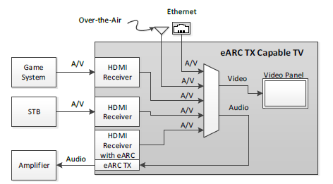
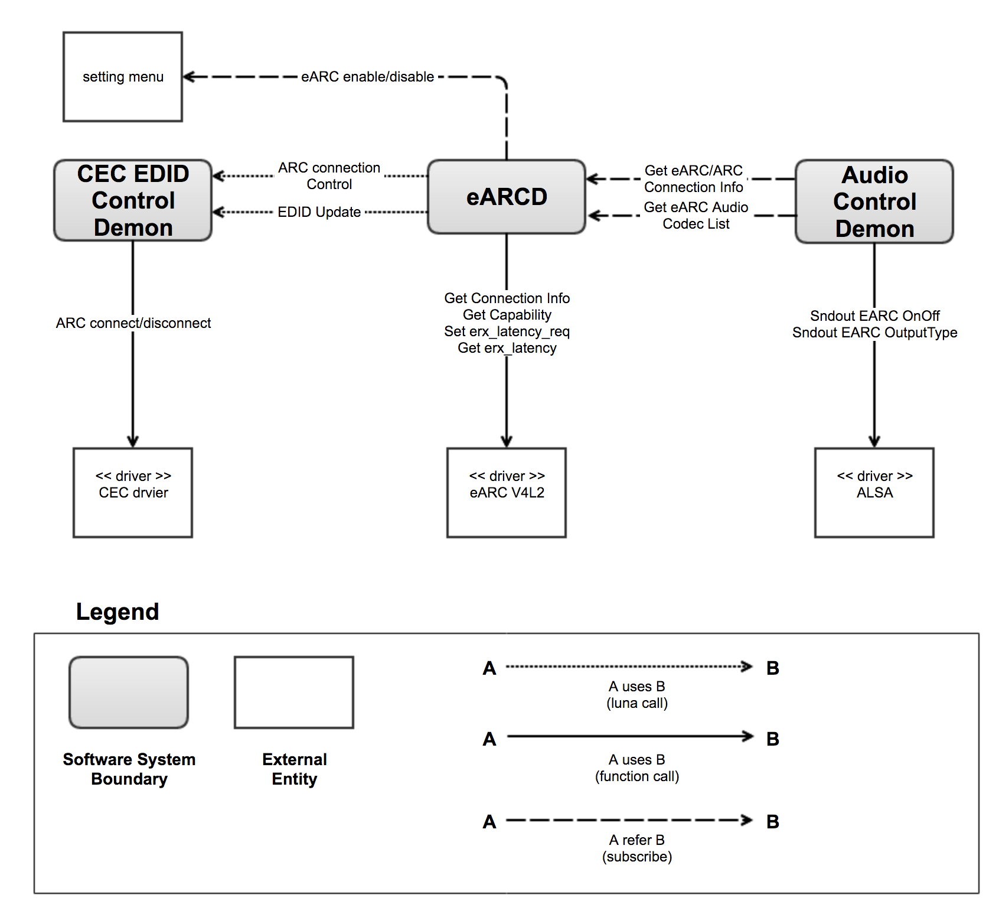
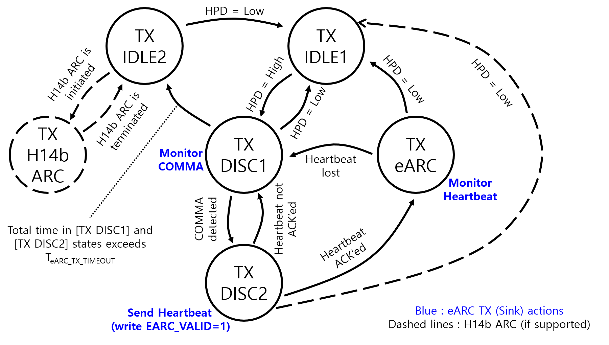

HDMI eARC
=========

.. _hyungyong.park: hyungyong.park@lge.com
.. _sanghyun.han: sanghyun.han@lge.com
.. _wookchan.kim: wookchan.kim@lge.com
.. _kwonwoo.kang: kwonwoo.kang@lge.com

Introduction
------------

| This document describes the HDMI eARC driver in the kernel space. The document gives an overview of the HDMI eARC driver and provides details about its functionalities and implementation requirements.

Revision History
^^^^^^^^^^^^^^^^

======= ========== =================== =======
Version Date       Changed by          Comment
======= ========== =================== =======
1.4     2023-11-14 `kwonwoo.kang`_     Applied new document template.
1.3     2022-04-20 `hyungyong.park`_   Update the Requirements
1.2     2022-03-29 `wookchan.kim`_     Add eARC interfaces
1.1     2021-05-06 `hyungyong.park`_   Modify typos and misdescribed points
1.0     2019-04-26 `sanghyun.han`_     First release
======= ========== =================== =======

Terminology
^^^^^^^^^^^

| The key words "must", "must not", "required", "shall", "shall not", "should", "should not", "recommended", "may", and "optional" in this document are to be interpreted as described in RFC2119. 

| The following table lists the terms used throughout this document: 

================================ ==================================
Term                             Description
================================ ==================================
(HDMI) Source                    A device with an HDMI output.
(HDMI) Sink                      A device with an HDMI input.
CEC                              Consumer Electronics Control
Rx                               Receiver
Tx                               Transmitter
eARC TX                          An HDMI Sink or HDMI Repeater capable of transmitting audio via the eARC mechanism
                                 to an HDMI Source or Repeater.
eARC RX                          An HDMI Source or HDMI Repeater capable of receiving audio via the eARC mechanism
                                 from an HDMI Sink or Repeater.
eARC Master                      Refers to the function of an eARC TX as it communicates via
                                 the Common Mode Data Channel(vs. the Differential Mode Audio Channel).
eARC Slave                       Refers to the function of an eARC RX as it communicates via
                                 the Common Mode Data Channel(vs. the Differential Mode Audio Channel).
DMDC                             Differential Mode Audio Channel (refer to HDMI Specification 2.1 document 9.5.2)
CMDC                             Common Mode Data Channel (refer to HDMI Specification 2.1 document 9.5.3)
TX IDLE1                         Non-Operation state for eARC (initial state) (refer to HDMI Specification 2.1 document 9.5.3.2 Discovery and Disconnection)
TX IDLE2                         HPD = High but neither ARC nor eARC is active (refer to HDMI Specification 2.1 document 9.5.3.2 Discovery and Disconnection)
TX DISC1                         Primary discovery state (refer to HDMI Specification 2.1 document 9.5.3.2 Discovery and Disconnection)
TX DISC2                         Secondary discovery state (refer to HDMI Specification 2.1 document 9.5.3.2 Discovery and Disconnection)
TX eARC                          eARC operation state (refer to HDMI Specification 2.1 document 9.5.3.2 Discovery and Disconnection)
================================ ==================================

Technical Assistance
^^^^^^^^^^^^^^^^^^^^

| For assistance or clarification on information in this guide, please create an issue in the LGE JIRA project and contact the following person:

=============== ==========
Module          Owner
=============== ==========
HDMI eARC       `wookchan.kim`_
=============== ==========

Overview
--------

General Description
^^^^^^^^^^^^^^^^^^^

HDMI eARC is a module responsible for HDMI Enhanced Audio Return Channel.
This document is based on High-Definition Multimedia Interface Specification
Version 2.1.

Features
^^^^^^^^

    * ARC enable/disable
    * eARC connection/disconnection
    * get Capabilities
    * audio latentity control

Architecture
^^^^^^^^^^^^

Hardware Architecture
*********************

The eARC driver supports CMDC for connection/disconnection of eARC and DMDC for
audio transmission.

Using DMDC, audio payload bandwidth has been increased (uncompressed audio:
36.864Mbps, compressed audio 24.576Mbps), and Connect and disconnect eARC
without CEC communication with discovery and disconnection process using CMDC.

Driver Architecture
*******************

The API for eARC enable/disable, connection/disconnection, Capabilities, and audio
latentity control is defined as V4L2, and the eARC output and Audio Codec
settings are defined as ALSA extention interface.

The EARC-related ALSA API is defined in the ALSA Implantation Guide 3.2.8
"Sndout EARC OnOff" and 3.9 "Sndout EARC OutputType".

EARCD receives eARC connection information through V4L2 eARC Driver Interface
and sends it to Audio Control Demon so that it can do eARC off/on through ALSA
API (Sndout EARC OnOff) if necessary.

EARCD receives eARC capability information through V4L2 eARC Driver Interface
and delivers the outputable Audio Codec List to Audio Control Demon. Audio
Control Demon sets the eARC output codec to ALSA API ("Sndout EARC OutputType")
considering input Audio Codec and User selection.

When the eARC connection fails, the eARCD requests an ARC connection to the
CEC/EDID control demon according to the user setting in the TX IDEL2 state.

All eARC V4L2 Driver Interfaces are only called in eARCD.

EARCD can HPD off/on for eARC Discovery and Disconnection Process and uses
:c:macro:`V4L2_CID_EXT_HDMI_HPD`.

:c:macro:`V4L2_CID_EXT_HDMI_HPD` can be used in other Demons, so it should be implemented
in consideration.

Overall Workflow
^^^^^^^^^^^^^^^^

The TV connects and disconnects the eARC external audio device according to the
following Discovery and Disconnection process.

TV is eARC TX.

The eARC driver must operate according to the Diagram below and deliver the
status to the TV MW.

The eARC driver provides the following functions.

* eARC Discovery and Disconnection
* HBR Audio output
* eARC RX Capabilities Data Structure
* Audio Latency Control

Requirements
------------

Functional Requirements
^^^^^^^^^^^^^^^^^^^^^^^

The data types and functions used in this module are described in the Data Types and Functions in the API List.

Quality and Constraints
^^^^^^^^^^^^^^^^^^^^^^^

Performance
***********

There are no specific Performance Requirements.

Design Constraints
******************

When eARC is connected, if abnormal signal (V-SYNC, TMDS..) occurs, there will be HPD toggle.
To prevent this, block HPD toggle when eARC is connected.

Implementation
--------------

This section provides materials that are useful for HDMI eARC implementation.

The File Location section provides the location of the Git repository where you can get the header file in which the interface for the HDMI eARC implementation is defined.

The API List section provides a brief summary of HDMI eARC APIs that you must implement.

File Location
^^^^^^^^^^^^^

The HDMI eARC interfaces are defined in the v4l2-ext-earc.h header file, which can be obtained from https://swfarmhub.lge.com/.

- Git repository: bsp/ref/v4l2-ext-extinput-header

API List
^^^^^^^^

Data Types
**********

Standard Data Types
"""""""""""""""""""

=========================================================================================================================================== ===================================================================================================
Structure                                                                                                                                   Description
=========================================================================================================================================== ===================================================================================================
`v4l2_control <https://linuxtv.org/downloads/v4l-dvb-apis/userspace-api/v4l/vidioc-g-ctrl.html#c.V4L.v4l2_control>`_                        Used for the VIDIOC_S_CTRL/VIDIOC_G_CTRL function
`v4l2_ext_control <https://linuxtv.org/downloads/v4l-dvb-apis/userspace-api/v4l/vidioc-g-ext-ctrls.html#c.V4L.v4l2_ext_control>`_           Used for the VIDIOC_S_EXT_CTRLS/VIDIOC_G_EXT_CTRLS/VIDIOC_TRY_EXT_CTRLS function
`v4l2_ext_controls <https://linuxtv.org/downloads/v4l-dvb-apis/userspace-api/v4l/vidioc-g-ext-ctrls.html#c.V4L.v4l2_ext_controls>`_         Used for the VIDIOC_S_EXT_CTRLS/VIDIOC_G_EXT_CTRLS/VIDIOC_TRY_EXT_CTRLS function
=========================================================================================================================================== ===================================================================================================

Extended Data Types
"""""""""""""""""""

================================================================================== ===================================================================================================
Structure                                                                          Description
================================================================================== ===================================================================================================
:cpp:any:`struct v4l2_ext_earc <v4l2_ext_earc>`                                    Used for the VIDIOC_S_CTRL/VIDIOC_G_CTRL function
:cpp:any:`struct v4l2_ext_earc_connection_info <v4l2_ext_earc_connection_info>`    Used for the VIDIOC_G_CTRL function
================================================================================== ===================================================================================================

Extended Enumerations
"""""""""""""""""""""

================================================================================== ===================================================================================================
Enumeration                                                                        Description
================================================================================== ===================================================================================================
:cpp:any:`enum v4l2_ext_earc_output_port <v4l2_ext_earc_output_port>`              Information about eARC output port number
:cpp:any:`enum v4l2_ext_earc_enable <v4l2_ext_earc_enable>`                        Information about whether eARC enable
:cpp:any:`enum v4l2_ext_earc_status <v4l2_ext_earc_status>`                        Information about eARC status
================================================================================== ===================================================================================================

Functions
*********

Standard Functions
""""""""""""""""""

===================================================================================================================================================================================== ===================================================================================================
Function                                                                                                                                                                              Description
===================================================================================================================================================================================== ===================================================================================================
`ioctl VIDIOC_G_EXT_CTRLS <https://linuxtv.org/downloads/v4l-dvb-apis/userspace-api/v4l/vidioc-g-ext-ctrls.html#vidioc-g-ext-ctrls>`_                                                 Gets or sets the value of several controls.
`ioctl VIDIOC_S_EXT_CTRLS <https://linuxtv.org/downloads/v4l-dvb-apis/userspace-api/v4l/vidioc-g-ext-ctrls.html#vidioc-g-ext-ctrls>`_                                                 Gets or sets the value of several controls.
===================================================================================================================================================================================== ===================================================================================================

Extended Control IDs
""""""""""""""""""""

=================================================================== ===================================================================================================
Control ID                                                          Description
=================================================================== ===================================================================================================
:c:macro:`V4L2_CID_EXT_EARC`                                        Set eARC detection enable/disable
:c:macro:`V4L2_CID_EXT_EARC_CONNECTION_INFO`	                      Get eARC state, capability and RX latency
:c:macro:`V4L2_CID_EXT_EARC_SET_ERX_LATENCY_REQ`                    Set ERX_LATENCY_REQ
:c:macro:`V4L2_CID_EXT_EARC_RESET_HDMI_HPD_BIT`                     Reset eARC HDMI_HPD bit reset
=================================================================== ===================================================================================================

Testing
-------

| To test the implementation of the HDMI eARC driver, webOS provides SoCTS (SoC Test Suite) tests. 
| The SoCTS checks the basic operation of the HDMI eARC driver and verifies the kernel event operation for the module by using a test execution file. 
| For details, see :doc:`HDMI eARC Unit Test in SoCTS Unit Test Specification.  </part4/socts/Documentation/source/producer-manual/producer-manual_v4l2/producer-manual_v4l2-earc>`

References
----------
| `Linux Kernel Media Documentation <https://linuxtv.org/downloads/v4l-dvb-apis/>`_