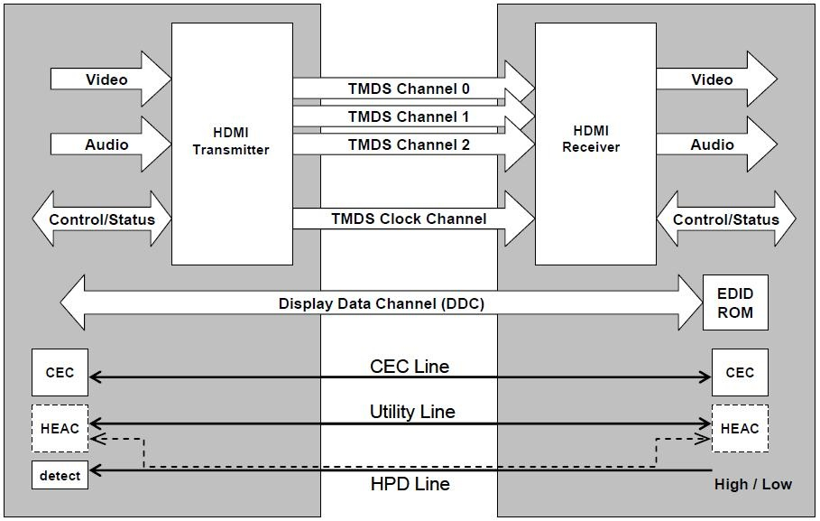
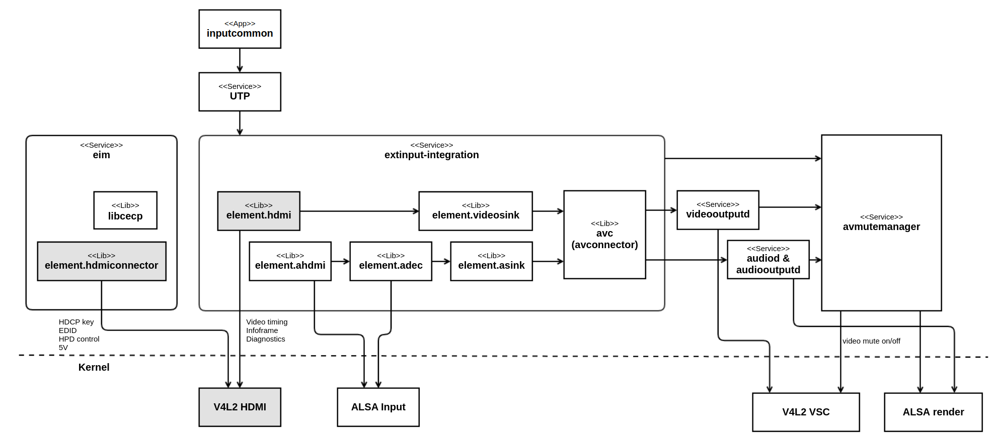
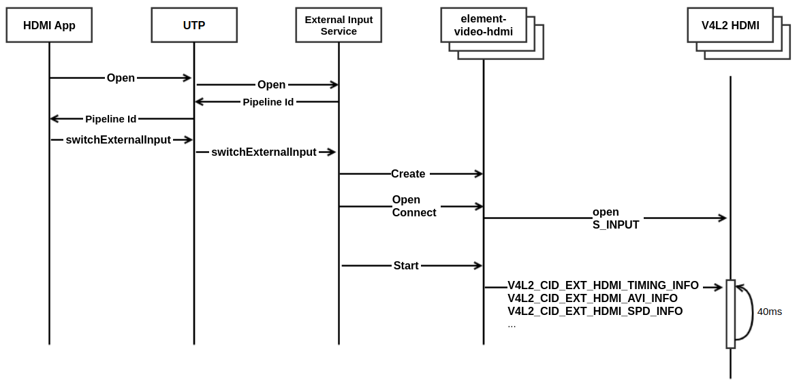
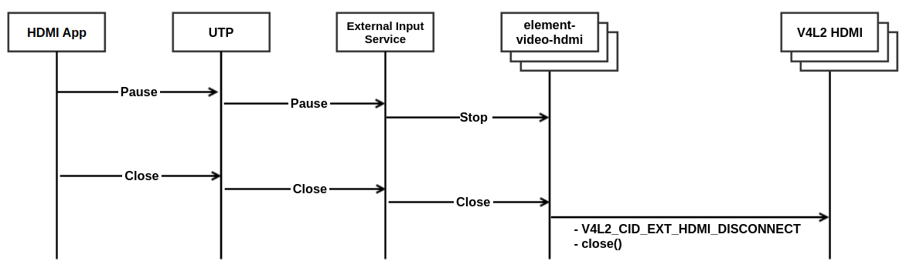
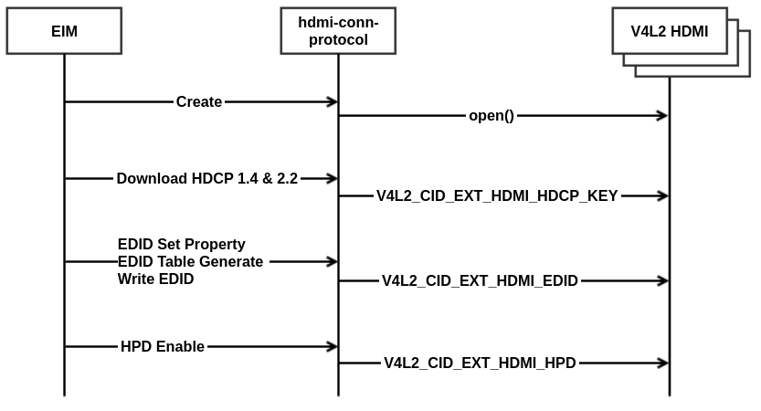
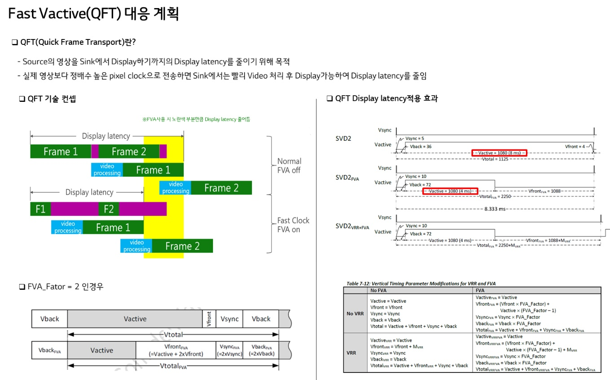

HDMI input
##########

.. _mini.nam: mini.nam@lge.com

Introduction
************

| This document describes the HDMI-input module in the kernel space. The document gives an overview of the HDMI-input module and provides details about its functionalities and implementation requirements.

Revision History
================

.. _donghoon.keum: donghoon.keum@lge.com
.. _yusun85.lee: yusun85.lee@lge.com
.. _mini.nam: mini.nam@lge.com
.. _minjae.jun: minjae.jun@lge.com
.. _seongkyun.park: seongkyun.park@lge.com
.. _jihoons.kim: jihoons.kim@lge.com
.. _sungmingogo.kim: sungmingogo.kim@lge.com
.. _joohyuk.suh: joonhyuk.suh@lge.com

======= ========== ================ =======
Version Date       Changed by       Comment
======= ========== ================ =======
1.13    2025-05-26 joonhyuk.suh_    Add HDMI EDID Access BSP Implement guide.
1.12    2025-05-16 sungmingogo.kim_ Add SettopBox HDMI HDCP Repeater BSP Implement guide.
1.11    2025-04-19 jihoons.kim_     Add V4L2_EXT_HDMI_DOLBY_HDR_TYPE_DOLBY_VISION_PC enum for Dolby HDR Type
1.10    2024-12-17 seongkyun.park_  Add description about QFT.
1.9     2023-11-14 minjae.jun_      Applied new document template.
1.8     2022-07-07 mini.nam_        Update system context and performance requirement.
1.7     2022-04-05 yusun85.lee_     Add V4L2_CID_EXT_HDMI_DPMS
1.6     2021-05-25 yusun85.lee_     Add V4L2_CID_EXT_HDMI_SLEEP
1.5     2018-07-30 donghoon.keum_   Remove 2.30
======= ========== ================ =======

Terminology
===========

| The key words "must", "must not", "required", "shall", "shall not", "should", "should not", "recommended", "may", and "optional" in this document are to be interpreted as described in RFC2119.

| The following table lists the terms used throughout this document:

====================================== ==================================
Definition                             Description
====================================== ==================================
EDID                                   Extended Display Identification Data. Information about the signals that can
                                       be supported by the TV is provided to the Source through the EDID.
HPD                                    Hot Plug Detect. Name of Pin No. 19 of HDMI port. When this signal is
                                       enabled, it is used for synchronization of source and sink (EDID, HDCP).
Infoframe                              There are AVI, SPD and VSI information which is loaded
                                       on HDMI input signal. In addition to Video and Audio, HDMI has control
                                       information and can provide it.
Timing Info                            It means format information of HDMI signals and provides format information.
5V                                     Name of Pin No. 18 of the HDMI port. It tells whether the source is connected or not.
====================================== ==================================

Technical Assistance
====================

=============== ==========
Module          Owner
=============== ==========
hdmi input      jihoons.kim@lge.com
=============== ==========

.. seealso::

  :doc:`/status-files/external-input-status`


Overview
********

General Description
===================

The HDMI Block receives the HDMI TMDS signal, separates it into video, audio,
and additional information and delivers the information to the corresponding
module.

HDMI General
------------



HDMI is composed of Source and Sink. The HDMI signal carries four differential
pairs consisting of TMDS data and clock channels. Channels carry video, audio
and auxiliary data. DDC is used to exchange information between source and sink,
and has EDID and HDCP. In addition, CEC is supported and CEC is used
as one line protocol to control equipment.

Architecture
============

Driver Architecture
-------------------



================================================== ==================================
Definition                                         Description
================================================== ==================================
ALSA Input                                         Audio driver with linux ALSA standard interface
audioD                                             Service that controls audio decoding and output.
avc (avconnector)                                  Library that provides a unified API to the pipeline, services, or apps which require video and audio format information like videooutputd and audiod in the same way.
avmutemanager                                      Service that contorols audio and video mute while it switches input or signal is changed to prevent displaying broken audio and video.
eim (external input manager)                       Service related external devices, hdmi edid, hdcp key, cec and etc.
element.adec                                       Library of audio decoder that controls the ALSA audio decoder BSP driver.
element.ahdmi                                      Library that analyze the meta data of the HDMI audio signal from HDMI input and deliver the audio format information to element.audiosink.
element.asink                                      Library that delivers audio format information to the pipeline.
element.hdmi (AKA. element-video-hdmi)             Library that analyze the meta data of the HDMI video signal from HDMI input and deliver the video format information to element.videosink.
element.hdmiconnector                              Library that controls HDMI edid and hdcp key and hpd.
extinput-integration (AKA. External Input Service) Service that manages element resources related to external input like HDMI and Composite signal.
element.videosink                                  Library that delivers video format information to the pipeline.
inputcommon (AKA. HDMI app)                        Application for hdmi and rf tuner input.
libcecp                                            Library that communicate with source devices via HDMI CEC.
UTP (Unified TV Player)                            Service that mediates TV broadcasting and external input related services.
videooutputD                                       Service that manages video output window.
V4L2 HDMI                                          HDMI video driver with linux v4l2 standard interface
V4L2 VSC                                           Video scaler driver with linux v4l2 standard interface
================================================== ==================================

Overall Workflow
================

HDMI Start Sequence Diagram
---------------------------



This is a diagram for the HDMI input switching sequence. When you open via UTP in the HDMI App, you get Pipeline Id. When you call the switchExternalInput API with this Id, the External Input Service opens the HDMI BSP with the function v4l2 via element-video-hdmi and then calls another v4l2 function every 40 ms.


HDMI End Sequence Diagram
-------------------------



First, pass Pause through UPT in HDMI APP and stop element-video-hdmi in external input service. After that, when you call Close in HDMI App, call V4L2_CID_EXT_HDMI_DISCONNECT toward the BSP through UTP, External Input Service, Element-video-hdmi.


HDMI Connector Sequence Diagram
-------------------------------



Create the hdmi-connector in the EIM and the hdmi-connector opens the BSP (V4L2 HDMI). After that, write the HDCP1.4/HDCP2.2 Key, download the EDID, and enable HPD to receive the signal from the source equipment.


Requirements
************

Quality and Constraints
=======================

Performance
-----------

All v4l2 api should be returned within 10 msec if it it is not mentioned.
Fast switching like Instaport should be supported.
Input changing time between HDMI port should be less than one second assuming webOS HDMI application is running in the background.
Video should be displayed after DC ON with in 3 seconds.

Design Constraints
------------------

It is recommended that each port have its own HDMI Phy and Link IP.
At least it should be able to report video timing for all the ports.


HDMI compatibility design guide
--------------------------------

Overview
^^^^^^^^^^^^^^^^

The purpose of this document is to reduce HDMI compatibility problem.
LG TV uses several SoCs and have different hardware and software design.
It is required that LG TV have the same behavior regardless of SoCs and avoid circumstance that causes problem with other devices by the end user.

Categorized based on topics.
They're HDMI, Packet, HDCP, EDID, EQ, Video and Audio.

Terms and Abbreviation
^^^^^^^^^^^^^^^^^^^^^^^^^

====================================== ==================================
Definition                             Description
====================================== ==================================
5V                                     HDMI port 18th pin.
                                       When source device is connected with signal, the pin remains high.
                                       Source assert the +5V power signal when it is using the DDC or TMDS signals.
ACR                                    Audio Clock Regeneration
ALLM                                   Auto Low-Latency Mode
AVI                                    Auxiliary Video Information
                                       Infoframe including video related data and sent from a Source to a Sink.
BER                                    Bit Error Rate
BSP                                    Board Support Package
                                       In webOS, it means kernel driver in general.
CED                                    Character Error Detection
CTS                                    Cycle Time Stamp
CVTEM                                  Compressed Video Transport Extended Metadata
                                       A kind of EM packet for DSC.
DDC                                    Display Data Channel
                                       It is used for configuration and status exchange between source and sink.
                                       EDID, HDCP authentification, link training uses it. It is based on I2C.
DSC                                    Display Stream Compression
                                       HDMI2.1 adopts VESA DSC 1.2a which enables visually lossless compression.
eARC                                   Enhanced Audio Return Channel
EDID                                   Extended Display Identification Data. It follows CEA-861 standard.
                                       LG supports version 3 and uses 256 bytes or 512 bytes.
EM packet                              Extended Metadata Packet
                                       Introduced in HDMI2.1 to transmit larger size than infoframe and this can transmit frame accurate packet data
EQ                                     Equalizer
                                       Some HDMI sink adopt DFE(decision feedback equalizer) and CTLE(continuous time linear equalizer).
FreeSync                               AMD proprietary adaptive frame synchronization technology.
FRL                                    Fixed Rate Link
                                       Packetized data transmission protocol in HDMI2.1.
GCP                                    General Control Packet
                                       Introduced in HDMI1.4 and includes AVMUTE flag and color depth information.
HF-VSIF                                HDMI Forum Vendor Specific Info Frame
                                       Infoframe packet optionally transmitted in HDMI2.0 signal.
HPD                                    InfoFrame
                                       A data packet defined in CTA-861 to carry auxiliary data regarding AV streams from Source to Sink across HDMI.
Link training                          HDMI2.1 introduced protocol to test link capability before transmitting AV using FRL packet.
LTP                                    Link Training Pattern
Mcsc                                   Mega-characters/second/channel
                                       Applies to TMDS character rate. This is 1/10 the bit rate.
PPS                                    Picture Parameter Set as defined by VESA DSC 1.2a.
SCDC                                   Status and Control Data Channel
                                       I2C based communication protocol enabling the exchange of data between source and sink from HDMI2.0
Sink                                   A device which receives an A/V signal.
Source                                 A device which generates an A/V signal.
SPD                                    Source Product Description
                                       Infoframe which includes name and product of the source device.
VRR                                    Variable Refresh Rate
                                       Adaptive frame synchronization technology introduced in HDMI2.1 standard.
VSIF                                   Vendor Specific Info Frame.
                                       Defined in CEA-861. Organization based infoframe. Used by AMD, Dolby and HDMI forum.
VTEM                                   A kind of EM packet for VRR.
QFT                                    Quick Frame Transport (QFT) is Fast VActive (FVA).
                                       When transmitting with a pixel clock that is a multiple of the actual video,
                                       Sink processes the video quickly and displays it, reducing display latency.
====================================== ==================================

Design Guide
^^^^^^^^^^^^^^^

AUDIO-1
``````````

The ACR should be calculated for each CTS. If HDMI audio clock is not generated, ACR should be reset.

AUDIO-2
``````````

ACR formula for 3G and 6G signal follows the HDMI standard.

  For TMDS character rates <= 340 Mcsc,
    average CTS value = (Ftmds_clk * N) / (128*Fs)
  For TMDS character rate > 340 Mcsc,
    average CTS value = ( 4* Ftmds_clk * N) / (128 *Fs)

DSC-1
````````

In HDMI 2.1 FRL DSC signal with DSC suppoorted TV, source device may try to change color depth while it is watching TV. At the time, only DSC PPS information in CVTEM would be changed without trying link training again. BSP should be able to detect that PPS information is changed and decompress video. Video timing information may be reset during the time.

Seealso(LGE only): TVPM-15003

EQ-1
```````

TMDS EQ must be individually performed per each channel.

EQ-2
`````````

CED should be calculated after PLL is locked and EQ is finished.

FRL-1
``````

When source device restart link training, TV should clear LTP request status correctly.

Seealso(LGE only) : TVPM-12819

FRL-2
`````
Both 1080p and 1080i should be supported in the FRL format.

Seealso(LGE only) : TVPM-12629, TVPM-12389

FRL-3
```````
Changing only frame rate between 50Hz and 60Hz, source device may not retry frl link training.
BSP should display video correctly in this case.

Seealso(LGE only) : TVPM-13051

FRL-4
```````

HDMI2.1 standard describes approximate BER 10^-10^ and error count during the measurement interval in the compliant link.
It is allowed for a little bit of decoding errors.
After link training has completed, even if FRL character errors are detected, sink shall not request link training.

Seealso(LGE only) : TVPM-16437

HDCP-1
````````
When HDCP2.2 and HDCP1.4 engines are separated, it should be switched without any delay.

HDCP-2
````````

Before the LG's DV event stage, BSP should remove hard-coded HDCP keys in the software if there is.
If HDCP1.4 key is in OTP memory, it also should remove temporal key in the BSP before the LG's DV event stage.

Seealso(LGE only) : TVPM-14011, TVPM-14740

HDCP-3
```````
Even if valid hdcp2.2 key is not installed, BSP should work correctly with non hdcp enabled contents.

Seealso(LGE only) : TVPM-13235

HDR-1
``````
Some DolbyVision source devices has signalling limitation. It starts DolbyVision with Dolby VSIF. But it finishes DolbyVision with HDMI1.4 VSIF.
This opposes to DolbyVision HDMI specification. But BSP should support this.

Seealso(LGE only) : TVPM-12762

HDR-2
``````
If there is no metadata when the Sink-Led Dolby Vision signal comes in, it should remain mute.

Seealso(LGE only) : TVPM-20005

HPD-1
``````
If V4L2_EXT_HDMI_RESTART is called before V4L2_EXT_HDMI_HPD_ENABLE is called during TV boot or resume sequence, BSP should ignore V4L2_EXT_HDMI_HPD_RESTART.

Seealso(LGE only) : TVPM-10814, TVPM-14329

HPD-2
``````
WebOS may request to change EDID while it is watching video.
At this time, webOS calls V4L2_CID_EXT_HDMI_EDID and V4L2_EXT_HDMI_HPD_RESTART in sequence.
BSP should mute video when V4L2_EXT_HDMI_HPD_RESTART is called.
In addition, V4L2_EXT_HDMI_HPD_RESTART might be called alone without calling V4L2_CID_EXT_HDMI_EDID. This is used to restart eARC connection.

Seealso(LGE only) : TVPM-13650

INFOFRAME-1
````````````
BSP does not need to save SPD until next SPD is received any more. WebOS would store the data while 5V signal is high.
This is applied from webOS22.

INFOFRAME-2
````````````
If the AVI infoframe does not come from the source device, the sink device should treat it RGB pixel encoding with 8-bit color depth and limited range level.

INFOFRAME-2
````````````
If there's no GCP infoframe in the signal > 340Mcsc, use 8-bit color depth.

INFOFRAME-3
`````````````
When checksum of infoframe mismatches, throw away the packet and do not send it to application.

INFOFRAME-4
````````````
Content type field in the AVI infoframe is used to support film maker mode in webOS.
BSP should update correct value in the AVI infoframe.

Seealso(LGE only) : TVPM-15800

INFOFRAME-5
````````````````
Source device may change SPD infoframe data while it is watching video.
BSP should monitor SPD infoframe and update when it is changed even if the video timing is not changed.

Seealso(LGE only) : TVPM-15214

INFOFRAME-6
`````````````
VTEM type EM packet should be updated within the similar time with other infoframe.
Otherwise it would cause video flickering switching input.

Seealso(LGE only) : TVPM-15068

INFOFRAME-7
````````````
When ALLM= 1 in the HF-VSIF, source device may stop transmitting HF-VSIF suddenly without changing ALLM=0.
BSP should handle this by resetting HF-VSIF infoframe if it is not received for 120msec.

Seealso(LGE only) : TVPM-14204

INFOFRAME-8
`````````````
BSP should handle multiple VSIFs.
WebOS expects BSP would handle four VSIF at the same time.
WebOS supports HDMI14 VSIF, HF-VSIF and Dolby VSIF.

Seealso(LGE only) : TVPM-12878, TVPM-12320

SCDC-1
``````````
When it changes EDID, video should be muted before sink resets the SCDC data. And more, sink shall reset the SCDC data whenever the Hot Plug Detection pin is low for 100ms or more.

Seealso(LGE only) : TVPM-18803

TIMING-1
```````````
For video timing that is not in the EDID, If BSP can detect the video timing, BSP should report those timing information to webOS.
WebOS would display invalid format if it is not supported.
For example, 5K resolution is not included in EDID. When the FRL supported  HDMI port detects 5K resolution, BSP should report the timing information to webOS. Then webOS will display invalid format. When the HDMI port only support HDMI2.0, BSP cannot detect video timing and will report empty video information to webOS. Then webOS will display no signal.

Seealso(LGE only) : TVPM-15291

TIMING-2
``````````
Performance requirement while changing HDMI inputs is very high.
Each HDMI port should be able to detect video timing in the background even if the port is not connected to the video scaler.

Seealso(LGE only) : TVPM-13993

TMDS-1
``````````
When clock termination resistor is deactivated, do not enable tmds clock detection.
Some device sends tmds data before clock termination resistor is activated.

Seealso(LGE only) : TVPM-15064

VRR-1
`````````
In AMD FreeSync version 2, packet length is not 9 bytes but 10 bytes. It is a typo in the AMD specification.

Seealso(LGE only) : TVPM-14847

VRR-2
````````
AMD FreeSync has support, enabled and active states. It switches between enabled and active states frequently.
This switching behavior should not cause video flickering.
BSP should remain in VRR mode internally when FreeSync state is enabled or active states.

Seealso(LGE only) : TVPM-14846, TVPM-15469

VRR-3
````````
Freesync should be supported for both TMDS and FRL signal.
VRR should be supported for both TMDS and FRL signal.

Seealso(LGE only) : TVPM-12227, TVPM-14860

VRR-4
``````````
In VRR video signal, do not detect interlaced or progressive mode. VRR signal uses only progressive type.
Refer to HDMI2.1 standard chapter 7.6.

Seealso(LGE only) : TVPM-13368

VRR-5
``````````
For VRR signal, the interval between two video frames might be shorter compared to the non-VRR signal.
When you change EDID, this might cause transient video noise even if you have muted video based on avmute signal or signal disconnection. So it will be better mute video as soon as TV changes Hot Plug Detection pin as low.

Seealso(LGE only) : TVPM-17059

VRR-6
`````````````
If Extended Metadata does not enter for 10 frames on the HDMI specification(HDMI Specification 10.10.1.3), it should be Timeout.
But it should have a margin of at least 5 frames in terms of HDMI compatibility.

Seealso(LGE only) : TVPM-20183

QFT-1
`````````````
Purpose to reduce display latency from sink to display of source video.
When transmitting with a pixel clock that is a multiple of the actual video, Sink processes the video quickly and displays it, reducing display latency.

Support equipment: Chroma A223814



1. Supported QFT input specification

There should be no video problems with the combinations below.

+-------+---------------+--------------+----------------------+
| No    | Resolution    | Frame        | Max_FVA Factor       |
+=======+===============+==============+======================+
| 1     | 1280x720      | 60Hz         | 16                   |
+-------+---------------+--------------+----------------------+
| 2     | 1280x768      | 60Hz         | 16                   |
+-------+---------------+--------------+----------------------+
| 3     | 1280x1024     | 60Hz         | 11                   |
+-------+---------------+--------------+----------------------+
| 4     | 1920x1080     | 60Hz         | 8                    |
+-------+---------------+--------------+----------------------+
| 5     | 1920x1080     | 120Hz        | 4                    |
+-------+---------------+--------------+----------------------+
| 6     | 1920x1080     | 165Hz        | 2                    |
+-------+---------------+--------------+----------------------+
| 7     | 2560x1440     | 120Hz        | 2                    |
+-------+---------------+--------------+----------------------+
| 8     | 3840x2160     | 60Hz         | 2                    |
+-------+---------------+--------------+----------------------+
| 9     | 3840x2160     | 120Hz        | 1                    |
+-------+---------------+--------------+----------------------+
| 10    | 4096x2160     | 60Hz         | 2                    |
+-------+---------------+--------------+----------------------+
| 11    | 4096x2160     | 120Hz        | 1                    |
+-------+---------------+--------------+----------------------+

2. Output quality

There should be no problem with output based on the input resolution and FVA factor combinations above.
Latency reduction: There are no specification restrictions regarding latency reduction.
Entering condition of QFT: the video mute is possible when entering QFT but there should be no mute/frame drop/frame repeat during operation.


Implementation
**************

This section provides materials that are useful for HDIM-input implementation.

- The File Location section provides the location of the Git repository where you can get the header file in which the interface for the HDMI-input implementation is defined.
- The API List section provides a brief summary of HDMI-input APIs that you must implement.

File Location
=============

The HDMI-input interfaces are defined in the v4l2-ext-hdmi.h header file, which can be obtained from https://swfarmhub.lge.com/.

- Git repository: bsp/ref/v4l2-ext-extinput-header
- Location: [as_installed]/linux/v4l2-ext-hdmi.h

API List
========

The HDMI-input driver implementation must adhere to the interface specifications defined and implements its functions. Refer to the API Reference for more details.

Data Types
----------

Standard Data Types
^^^^^^^^^^^^^^^^^^^

Standard V4L2 Data Types

================================================================================================================================================== ================================================================
Data Type                                                                                                                                          Description
================================================================================================================================================== ================================================================
`v4l2_control <https://www.kernel.org/doc/html/v4.9/media/uapi/v4l/vidioc-g-ctrl.html?highlight=v4l2_control#c.v4l2_control>`_                     Get or set the value of a control, try control values
`v4l2_ext_control <https://www.kernel.org/doc/html/v4.9/media/uapi/v4l/vidioc-g-ext-ctrls.html?highlight=v4l2_ext_control#c.v4l2_ext_control>`_    Get or set the value of several controls, try control values
`v4l2_ext_controls <https://www.kernel.org/doc/html/v4.9/media/uapi/v4l/vidioc-g-ext-ctrls.html?highlight=v4l2_ext_controls#c.v4l2_ext_controls>`_ Get or set the value of several controls, try control values
================================================================================================================================================== ================================================================

Extended Enumerations
^^^^^^^^^^^^^^^^^^^^^

Extended V4L2 Data Types

============================================================= ==================================
Data Type                                                     Description
============================================================= ==================================
:cpp:any:`v4l2_ext_hdmi_input_port`                           Input port value
:cpp:any:`v4l2_ext_hdmi_mode`                                 Hdmi mode value
:cpp:any:`v4l2_ext_hdmi_color_depth`                          Color depth value
:cpp:any:`v4l2_ext_hdmi_drm_eotf`                             Drm eotf value 
:cpp:any:`v4l2_ext_hdmi_drm_meta_desc`                        Drm meta desc value
:cpp:any:`v4l2_ext_hdmi_vsi_video_format`                     Vsi video format value
:cpp:any:`v4l2_ext_hdmi_vsi_3d_structure`                     Vsi 3d struct value
:cpp:any:`v4l2_ext_hdmi_vsi_3d_ext_data`                      Vsi 3d ext data value
:cpp:any:`v4l2_ext_hdmi_vsi_vic`                              Vsi vic value
:cpp:any:`v4l2_ext_hdmi_packet_status`                        Packet status value
:cpp:any:`v4l2_ext_hdmi_avi_csc`                              Avi csc value
:cpp:any:`v4l2_ext_hdmi_avi_active_info`                      Avi active info value
:cpp:any:`v4l2_ext_hdmi_avi_bar_info`                         Avi bar info value
:cpp:any:`v4l2_ext_hdmi_avi_scan_info`                        Avi scan info value
:cpp:any:`v4l2_ext_hdmi_avi_colorimetry`                      Avi colorimetry value
:cpp:any:`v4l2_ext_hdmi_avi_picture_arc`                      Avi picture value
:cpp:any:`v4l2_ext_hdmi_avi_active_format_arc`                Avi active format arc value
:cpp:any:`v4l2_ext_hdmi_avi_scaling`                          Avi scaling value
:cpp:any:`v4l2_ext_hdmi_avi_it_content`                       Avi it content value
:cpp:any:`v4l2_ext_hdmi_avi_ext_colorimetry`                  Avi ext colorimetry value
:cpp:any:`v4l2_ext_hdmi_avi_rgb_quantization_range`           Avi rgb quantization range value
:cpp:any:`v4l2_ext_hdmi_avi_ycc_quantization_range`           Avi ycc quantization range value
:cpp:any:`v4l2_ext_hdmi_avi_content_type`                     Avi content type value
:cpp:any:`v4l2_ext_hdmi_avi_additional_colorimetry`           Avi additional colorimetry value
:cpp:any:`v4l2_ext_hdmi_edid_size`                            Edid size value
:cpp:any:`v4l2_ext_hdmi_hpd_state`                            Hpd state value
:cpp:any:`v4l2_ext_hdmi_dolby_hdr_type`                       Dolby hdr type value
:cpp:any:`v4l2_ext_hdmi_hdcp_version`                         Hdcp version value
:cpp:any:`v4l2_ext_hdmi_emp_type`                             Emp type value
:cpp:any:`v4l2_ext_hdmi_link_type`                            Link type value
:cpp:any:`v4l2_ext_hdmi_link_lane_number`                     Link lane number value
:cpp:any:`v4l2_ext_hdmi_link_rate`                            Link rate value
:cpp:any:`v4l2_ext_hdmi_audio_format`                         Audio format value
:cpp:any:`v4l2_ext_hdmi_hdcp_auth_status`                     Hdcp auth status value
:cpp:any:`v4l2_ext_hdmi_error_type`                           Error type value
:cpp:any:`v4l2_ext_hdmi_expert_setting_type`                  Expert setting type value
:cpp:any:`v4l2_ext_hdmi_override_eotf`                        Override eotf value
:cpp:any:`v4l2_ext_video_rect`                                Video rect values
:cpp:any:`v4l2_ext_hdmi_timing_info`                          Timing information values
:cpp:any:`v4l2_ext_hdmi_drm_info`                             Drm information values
:cpp:any:`v4l2_ext_hdmi_in_packet`                            Packet information values
:cpp:any:`v4l2_ext_hdmi_vsi_info`                             Vsi information values
:cpp:any:`v4l2_ext_hdmi_spd_info`                             Spd information values
:cpp:any:`v4l2_ext_hdmi_avi_info`                             Avi information values
:cpp:any:`v4l2_ext_hdmi_packet_info`                          Packet information values
:cpp:any:`v4l2_ext_hdmi_edid`                                 Edid information values
:cpp:any:`v4l2_ext_hdmi_connection_state`                     Connection state of input port
:cpp:any:`v4l2_ext_hdmi_hpd`                                  Hpd state of input port
:cpp:any:`v4l2_ext_hdmi_dolby_hdr`                            Dolby hdr state of input port
:cpp:any:`v4l2_ext_hdmi_hdcp_key`                             Hdcp key information values
:cpp:any:`v4l2_ext_hdmi_vrr_frequency`                        Vrr frequency of input port
:cpp:any:`v4l2_ext_hdmi_emp_info`                             Emp information of input port
:cpp:any:`v4l2_ext_hdmi_hdcp_repeater`                        Hdcp repeater information of input port
:cpp:any:`v4l2_ext_hdmi_phy_status`                           Phy status of input port
:cpp:any:`v4l2_ext_hdmi_link_status`                          Link status of input port
:cpp:any:`v4l2_ext_hdmi_video_status`                         Video status of input port
:cpp:any:`v4l2_ext_hdmi_audio_status`                         Audio status of input port
:cpp:any:`v4l2_ext_hdmi_hdcp14_status`                        Hhdcp14 status of input port
:cpp:any:`v4l2_ext_hdmi_hdcp22_status`                        Hdcp22 status of input port
:cpp:any:`v4l2_ext_hdmi_hdcp_status`                          Hdcp statuus of input port
:cpp:any:`v4l2_ext_hdmi_scdc_status`                          Scdc status of input port
:cpp:any:`v4l2_ext_hdmi_diagnostics_status`                   Diagnostics status of input port
:cpp:any:`v4l2_ext_hdmi_error_status`                         Error status of input port
:cpp:any:`v4l2_ext_hdmi_expert_setting`                       Expert setting of input port
:cpp:any:`v4l2_ext_hdmi_override_drm_info`                    Override eotf information of input port
:cpp:any:`v4l2_ext_hdmi_hpd_low_duration_dc_on`               Hpd low duration value of input port
:cpp:any:`v4l2_ext_hdmi_sleep`                                Sleep mode of input port
:cpp:any:`v4l2_ext_hdmi_dpms`                                 Dpms mode of input port
:cpp:any:`v4l2_ext_hdmi_hdcp_hdmiout_auth_state`              HDCP auth state between Source and Sink
:cpp:any:`v4l2_ext_hdmi_hdcp_topology_status`                 HDCP Repeaeter Topology Data
:cpp:any:`v4l2_ext_hdmi_edid_access`                          Edid access mode of input port
============================================================= ==================================

Functions
---------

Standard Functions
^^^^^^^^^^^^^^^^^^

Standard V4L2 Function Calls & Commands

========================================================================================================================== =================================================================
Funtion                                                                                                                    Description
========================================================================================================================== =================================================================
`open <https://linuxtv.org/downloads/v4l-dvb-apis/userspace-api/v4l/func-open.html?highlight=v4l2%20open#c.V4L.open>`_     Open a V4L2 device
`close <https://linuxtv.org/downloads/v4l-dvb-apis/userspace-api/v4l/func-close.html?highlight=v4l2%20close#c.V4L.close>`_ Close a V4L2 device
:ref:`VIDIOC_S_INPUT <v4l-dvb-apis:VIDIOC_G_INPUT>`                                                                        Query or select the current video input
:ref:`VIDIOC_G_INPUT <v4l-dvb-apis:VIDIOC_G_INPUT>`                                                                        Query or select the current video input
:ref:`VIDIOC_G_CTRL <v4l-dvb-apis:VIDIOC_G_CTRL>`                                                                          Get or set the value of a control. except from socts
:ref:`VIDIOC_S_EXT_CTRLS <v4l-dvb-apis:VIDIOC_G_EXT_CTRLS>`                                                                Get or set the value of several controls, try control values
:ref:`VIDIOC_G_EXT_CTRLS <v4l-dvb-apis:VIDIOC_G_EXT_CTRLS>`                                                                Get or set the value of several controls, try control values
:ref:`VIDIOC_QUERYCAP <v4l-dvb-apis:VIDIOC_QUERYCAP>`                                                                      Query device capabilities
========================================================================================================================== =================================================================

Extended functions
^^^^^^^^^^^^^^^^^^

Capability

============================================================ ===============================================
Funtion                                                      Description
============================================================ ===============================================
:c:macro:`V4L2_CID_EXT_HDMI_QUERYCAP`                        Get HDMI capabilities from HDMI Device.
============================================================ ===============================================

Video format

============================================================ ===============================================
Funtion                                                      Description
============================================================ ===============================================
:c:macro:`V4L2_CID_EXT_HDMI_TIMING_INFO`                     Get HDMI video timing info.
============================================================ ===============================================

Infoframe

============================================================ ===============================================
Funtion                                                      Description
============================================================ ===============================================
:c:macro:`V4L2_CID_EXT_HDMI_DRM_INFO`                        Get HDMI DRM info.
:c:macro:`V4L2_CID_EXT_HDMI_VSI_INFO`                        Get HDMI VSI info.
:c:macro:`V4L2_CID_EXT_HDMI_SPD_INFO`                        Get HDMI SPD info.
:c:macro:`V4L2_CID_EXT_HDMI_AVI_INFO`                        Get HDMI AVI info.
:c:macro:`V4L2_CID_EXT_HDMI_PACKET_INFO` (deprecated)        Get HDMI Packet info.
============================================================ ===============================================

Hdmi connection

============================================================= ===============================================
Funtion                                                      Description
============================================================= ===============================================
:c:macro:`V4L2_CID_EXT_HDMI_HDCP_KEY`                         Write HDMI HDCP key.
:c:macro:`V4L2_CID_EXT_HDMI_EDID`                             Get/Set HDMI EDID.
:c:macro:`V4L2_CID_EXT_HDMI_HPD`                              Set/Get Port HPD Control.
:c:macro:`V4L2_CID_EXT_HDMI_CONNECTION_STATE` : 5V detection  Get Port Connection Status.
:c:macro:`V4L2_CID_EXT_HDMI_DISCONNECT`                       Dissconnect HDMI Port.
:c:macro:`V4L2_CID_EXT_HDMI_EDID_ACCESS`                      Set/Get HDMI EDID Access Control.
============================================================= ===============================================

Power management

=============================================================================== ===============================================
Funtion                                                                         Description
=============================================================================== ===============================================
:c:macro:`V4L2_CID_EXT_HDMI_POWER_OFF` : Notify BSP power off                   Set Power Off.
:c:macro:`V4L2_CID_EXT_HDMI_HPD_LOW_DURATION_DC_ON` : Booting time improvement  Set HPD low Duration to each HDMI port for DC on case.
:c:macro:`V4L2_CID_EXT_HDMI_SLEEP` : Always ready feature                       Set sleep mode for always ready function.
:c:macro:`V4L2_CID_EXT_HDMI_DPMS`                                               Set DPMS mode for DPMS function.
=============================================================================== ===============================================

DolbyVision support model only

============================================================ ===============================================
Funtion                                                      Description
============================================================ ===============================================
:c:macro:`V4L2_CID_EXT_HDMI_DOLBY_HDR`                       Get Dolby HDR Type.
============================================================ ===============================================

HDMI2.1 support model only

============================================================================== ===============================================
Funtion                                                                        Description
============================================================================== ===============================================
:c:macro:`V4L2_CID_EXT_HDMI_VRR_FREQUENCY` : Get instantaneous frame rate      Get HDMI VRR Frequency.
:c:macro:`V4L2_CID_EXT_HDMI_EMP_INFO` : Get EM packets of VRR or DSC           Get HDMI EMPacket Info.
============================================================================== ===============================================

Explicitly requested model only

============================================================ ===============================================
Funtion                                                      Description
============================================================ ===============================================
:c:macro:`V4L2_CID_EXT_HDMI_HDCP_REPEATER`                   Set/Get HDCP Repeater.
:c:macro:`V4L2_CID_EXT_HDMI_HDCP_REPEATER_TOPOLOGY`          Set Topology for multiple repeater device.
:c:macro:`V4L2_CID_EXT_HDMI_HDCP_REPEATER_STREAM_MANAGE`     brief Get Stream Manage value from connected device
============================================================ ===============================================

Diagnostics

============================================================================== ===============================================
Funtion                                                                        Description
============================================================================== ===============================================
:c:macro:`V4L2_CID_EXT_HDMI_DIAGNOSTICS_STATUS`                                Get HDMI Diagnostics status.
:c:macro:`V4L2_CID_EXT_HDMI_PHY_STATUS`                                        Get HDMI PHY status.
:c:macro:`V4L2_CID_EXT_HDMI_LINK_STATUS`                                       Get HDMI Link status.
:c:macro:`V4L2_CID_EXT_HDMI_VIDEO_STATUS`                                      Get HDMI Video status.
:c:macro:`V4L2_CID_EXT_HDMI_AUDIO_STATUS`                                      Get HDMI Audio status.
:c:macro:`V4L2_CID_EXT_HDMI_HDCP_STATUS`                                       Get HDMI HDCP status.
:c:macro:`V4L2_CID_EXT_HDMI_SCDC_STATUS`                                       Get HDMI SCDC status.
:c:macro:`V4L2_CID_EXT_HDMI_ERROR_STATUS`                                      Get HDMI ERROR status.
:c:macro:`V4L2_CID_EXT_HDMI_EXPERT_SETTING`                                    Set HDMI Expert setting.
:c:macro:`V4L2_CID_EXT_HDMI_OVERRIDE_EOTF` : Force custom HDR10 parameter      Set EOTF value to BSP.
============================================================================== ===============================================

STB HDCP Repeater (Settop Box model only)

============================================================================== ===============================================
Funtion                                                                        Description
============================================================================== ===============================================
:c:macro:`V4L2_CID_EXT_HDMI_HDCP_REPEATER_MODE`                                Set/Get HDMI HDCP Repeater mode.
:c:macro:`V4L2_CID_EXT_HDMI_HDCP_TOPOLOGY`                                     Set/Get HDMI HDCP Topology data.
============================================================================== ===============================================

Testing
*******
| To test the implementation of the HDMI-input module, webOS TV provides SoCTS (SoC Test Suite) tests. 
| The SoCTS checks the basic operations of the HDMI-input module and verifies the kernel event operations for the module by using a test execution file. 
| For more information, see :doc:`HDMI-input’s SoCTS Unit Test manual. </part4/socts/Documentation/source/producer-manual/producer-manual_v4l2/producer-manual_v4l2-hdmi>`

Reference
*********

`linuxtv.org v4l-dvd-api <https://linuxtv.org/downloads/v4l-dvb-apis/index.html>`_

`v4l2-ext-displayport.h <http://10.157.97.248:8000/v4l2/master/latest_html/api/file_integrated_build_source_v4l2-ext-extinput-header_linux_v4l2-ext-displayport.h.html#file-integrated-build-source-v4l2-ext-extinput-header-linux-v4l2-ext-displayport-h>`_