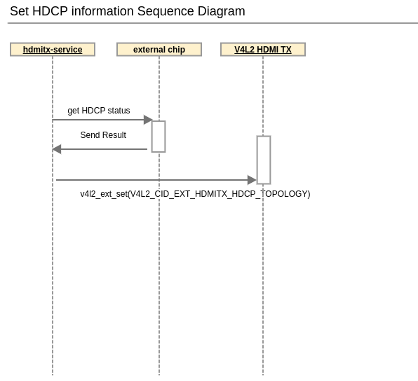

HDMI tx
##########

.. _wookchan.kim: wookchan.kim@lge.com

Introduction
************

| This document describes the HDMI-tx module in the kernel space. The document gives an overview of the HDMI-tx module and provides details about its functionalities and implementation requirements.

Revision History
================

.. _wookchan.kim: wookchan.kim@lge.com

======= ========== ============== =======
Version Date       Changed by     Comment
======= ========== ============== =======
1.0     2024-06-12 wookchan.kim_    Add new document for hdmitx.
======= ========== ============== =======

Terminology
===========

| The key words "must", "must not", "required", "shall", "shall not", "should", "should not", "recommended", "may", and "optional" in this document are to be interpreted as described in RFC2119.

| The following table lists the terms used throughout this document:

====================================== ==================================
Definition                             Description
====================================== ==================================
EDID                                   Extended Display Identification Data. Information about the signals that can
                                       be supported by the TV is provided to the Source through the EDID.
HPD                                    Hot Plug Detect. Name of Pin No. 19 of HDMI port. When this signal is
                                       enabled, it is used for synchronization of source and sink (EDID, HDCP).
Infoframe                              There are AVI, SPD and VSI information which is loaded
                                       on HDMI input signal. In addition to Video and Audio, HDMI has control
                                       information and can provide it.
Timing Info                            It means format information of HDMI signals and provides format information.
5V                                     Name of Pin No. 18 of the HDMI port. It tells whether the source is connected or not.
====================================== ==================================

Technical Assistance
====================

=============== ==========
Module          Owner
=============== ==========
hdmi tx         wookchan.kim@lge.com
=============== ==========

.. seealso::

  :doc:`/status-files/external-input-status`

Overview
********

General Description
===================

The HDMI Block receives the HDMI TMDS signal, separates it into video, audio,
and additional information and delivers the information to the corresponding
module.

HDMI General
------------

.. image:: resources/hdmi-input-overview.jpg
  :width: 100%
  :alt: HDMI Block Diagram

HDMI is composed of Source and Sink. The HDMI signal carries four differential
pairs consisting of TMDS data and clock channels. Channels carry video, audio
and auxiliary data. DDC is used to exchange information between source and sink,
and has EDID and HDCP. In addition, CEC is supported and CEC is used
as one line protocol to control equipment.

Architecture
============

Driver Architecture
-------------------

================================================== ==================================
Definition                                         Description
================================================== ==================================
V4L2 HDMI                                          HDMI video driver with linux v4l2 standard interface
V4L2 VSC                                           Video scaler driver with linux v4l2 standard interface
================================================== ==================================

Overall Workflow
================

Set HDCP information Sequence Diagram
---------------------------

Requirements
************

Quality and Constraints
=======================

Performance
-----------

All v4l2 api should be returned within 10 msec if it it is not mentioned.
Fast switching like Instaport should be supported.
Input changing time between HDMI port should be less than one second assuming webOS HDMI application is running in the background.
Video should be displayed after DC ON with in 3 seconds.

Design Constraints
------------------

It is recommended that each port have its own HDMI Phy and Link IP.
At least it should be able to report video timing for all the ports.

HDMI compatibility design guide
--------------------------------

Overview
^^^^^^^^^^^^^^^^

The purpose of this document is to reduce HDMI compatibility problem.
LG TV uses several SoCs and have different hardware and software design.
It is required that LG TV have the same behavior regardless of SoCs and avoid circumstance that causes problem with other devices by the end user.

Categorized based on topics.
They're HDMI, Packet, HDCP, EDID, EQ, Video and Audio.

Terms and Abbreviation
^^^^^^^^^^^^^^^^^^^^^^^^^

====================================== ==================================
Definition                             Description
====================================== ==================================
5V                                     HDMI port 18th pin.
                                       When source device is connected with signal, the pin remains high.
                                       Source assert the +5V power signal when it is using the DDC or TMDS signals.
EDID                                   Extended Display Identification Data. It follows CEA-861 standard.
                                       LG supports version 3 and uses 256 bytes or 512 bytes.
HPD                                    InfoFrame
====================================== ==================================

Implementation
**************

This section provides materials that are useful for HDIM-tx implementation.

- The File Location section provides the location of the Git repository where you can get the header file in which the interface for the HDMI-tx implementation is defined.
- The API List section provides a brief summary of HDMI-tx APIs that you must implement.

File Location
=============

The HDMI-tx interfaces are defined in the v4l2-ext-hdmitx.h header file, which can be obtained from https://swfarmhub.lge.com/.

- Git repository: bsp/ref/v4l2-ext-extinput-header
- Location: [as_installed]/linux/v4l2-ext-hdmitx.h

API List
========

The HDMI-tx driver implementation must adhere to the interface specifications defined and implements its functions. Refer to the API Reference for more details.

Data Types
----------

Standard Data Types
^^^^^^^^^^^^^^^^^^^

Standard V4L2 Data Types

================================================================================================================================================== ================================================================
Data Type                                                                                                                                          Description
================================================================================================================================================== ================================================================
`v4l2_control <https://www.kernel.org/doc/html/v4.9/media/uapi/v4l/vidioc-g-ctrl.html?highlight=v4l2_control#c.v4l2_control>`_                     Get or set the value of a control, try control values
`v4l2_ext_control <https://www.kernel.org/doc/html/v4.9/media/uapi/v4l/vidioc-g-ext-ctrls.html?highlight=v4l2_ext_control#c.v4l2_ext_control>`_    Get or set the value of several controls, try control values
`v4l2_ext_controls <https://www.kernel.org/doc/html/v4.9/media/uapi/v4l/vidioc-g-ext-ctrls.html?highlight=v4l2_ext_controls#c.v4l2_ext_controls>`_ Get or set the value of several controls, try control values
================================================================================================================================================== ================================================================

Extended Enumerations
^^^^^^^^^^^^^^^^^^^^^

Extended V4L2 Data Types

============================================================= ==================================
Data Type                                                     Description
============================================================= ==================================
:cpp:any:`v4l2_ext_hdmitx_hdcp_auth_status`                   hdcp authentification status
:cpp:any:`v4l2_ext_hdmitx_hdcp_version`                       hdcp version information
============================================================= ==================================

Functions
---------

Standard Functions
^^^^^^^^^^^^^^^^^^

Extended functions
^^^^^^^^^^^^^^^^^^

============================================================= ===============================================
Funtion                                                       Description
============================================================= ===============================================
:c:macro:`V4L2_CID_USER_EXT_HDMITX_BASE`                      hdmitx base
:c:macro:`V4L2_CID_EXT_HDMITX_HDCP_TOPOLOGY`                  HDCP topology
============================================================= ===============================================

Testing
*******
This Module's API is not being used. because the Streaming Speaker is deferred.
So its SoCTS is not required. If it is needed, System test can cover SoCTS.