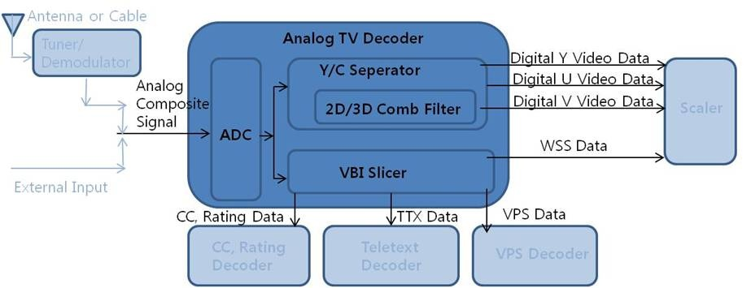

VBI
===

Introduction
------------

| This document describes the Vertical Blanking Interval (VBI) driver in the kernel space. The document gives an overview of the VBI driver and provides details about its functionalities and implementation requirements.

Revision History
^^^^^^^^^^^^^^^^

======= ========== ======================= =======
Version Date       Changed by              Comment
======= ========== ======================= =======
1.3     2025-03-05 seongkyun.park@lge.com  Add extension command V4L2_CID_EXT_VBI_SLICER_ENABLE, V4L2_CID_EXT_VBI_SLICER_DISABLE
1.2     2023-11-13 kwonwoo.kang@lge.com    Applied new document template.
1.1     2019-02-26 sangchul87.park@lge.com Add extension command V4L2_CID_EXT_VBI_FLUSH
1.0     2019-01-12 sangchul87.park@lge.com First Release
======= ========== ======================= =======

Terminology
^^^^^^^^^^^

| The key words "must", "must not", "required", "shall", "shall not", "should", "should not", "recommended", "may", and "optional" in this document are to be interpreted as described in RFC2119.

| The following table lists the terms used throughout this document:

========= =====================================================================
Term      Description
========= =====================================================================
CC        **Closed Caption**, processes of displaying text on a television, video screen, or other visual display to provide additional or interpretive information
TTX       **Teletext**, standard for displaying text and rudimentary graphics on suitably equipped television sets
VPS       **Video Programming System**, simplifies recording of television programs with the VCR
WSS       **Wide Screen Signaling**, digital metadata embedded in invisible part of the analog TV signal describing qualities of the broadcast, in particular the intended aspect ratio of the image System Context
ATSC      **Advanced Television Systems Committee**, American set of standards for digital television transmission over terrestrial, cable and satellite networks
DVB       **Digital Video Broadcasting**, set of international open standards for digital television
========= =====================================================================

Technical Assistance
^^^^^^^^^^^^^^^^^^^^

| For assistance or clarification on information in this guide, please create an issue in the LGE JIRA project and contact the following person:

=============== ==========
Module          Owner
=============== ==========
vbi             jihoons.kim@lge.com
=============== ==========
 

Overview
--------

General Description
^^^^^^^^^^^^^^^^^^^

| The vertical blanking interval (VBI) is not displayed on the screen as the time interval between the last line of a given frame and the beginning of the next frame. 
| It is the time interval allowed to move from the bottom of the current frame to the top of the next frame when scanning an image. 
| For analog TVs, you can use VBI to send digital data. 
| Types of data transmitted include closed capture (CC), TTX, VPS, and WSS.
|
| The link below is the v4l2 Sliced VBI Data Interface defined by the Linux Kernel. 
| https://linuxtv.org/downloads/v4l-dvb-apis/userspace-api/v4l/dev-sliced-vbi.html
|
| VBI is an abbreviation of Vertical Blanking Interval, a gap in the sequence of lines of an analog video signal.

Architecture
^^^^^^^^^^^^

Driver Architecture
*******************

| **VBI Slicer** : There are several types of VBI data such as Closed Caption, WSS, VPS, Teletext, and VPS, depending on the Analyst Color Standard, and it refers to HW Block that reads them.
| **Closed Caption (CC)** : Data located in the VBI section and is used to display subtitles.
| **Rating Data** : Data located in the VBI section and used to display the viewing rating of an image.
| **TTX (Teletext)** : Data located in the VBI section, mainly used in old-fashioned TVs, and used to deliver large amounts of text, graphic information, and data.
| **Video Programming System (VPS)** : Data located in the VBI section, and stands for Video Programming System, it is information used to find a specific location when the VCR device finds and plays a specific location of a recording tape. In ATV, it is used to display the name information of the Channel.
| **WSS (Wide Screen Signaling)** : Data located in the VBI section, and stands for Wide Screen Signaling, which informs you of the Aspect Ratio and CopyProtect information of the input signal.

Requirements
------------

Functional Requirements
^^^^^^^^^^^^^^^^^^^^^^^

| The VBI Slicer should be able to display data information such as Closed Caption, Rating, WSS, VPS, and Teletext according to Analysis Color Standard (ATSC, DVB).
| **CC (Closed Caption)** : Displaying caption information
| **Rating Data** : View rating of video
| **TTX (Teletext)** : Delivering large amounts of text, graphic information, and data
| **VPS(Video Programming System)** : Play specific locations of recording tape and display channel names
| **WSS(Wide Screen Signaling)** : Displaying Aspect Ratio와 Copy Protection Information

Quality and Constraints
^^^^^^^^^^^^^^^^^^^^^^^

Performance
***********

Information entering the VBI section should be updated in real time and skip or not broken.

Design Constraints
******************

| In the ATSC (NTSC) signal, closed capture (CC) and rating information are received in the VBI section
| In the DVB (PAL) signal, teletext, video programming system (VPS), and wide screen signaling (WSS) information are received. 
| The signal and the model must be matched to confirm each functional operation.

Implementation
--------------

This section provides materials that are useful for VBI implementation.

The File Location section provides the location of the Git repository where you can get the header file in which the interface for the VBI implementation is defined.

The API List section provides a brief summary of VBI APIs that you must implement.

File Location
^^^^^^^^^^^^^

The VBI interfaces are defined in the v4l2-ext-vbi.h header file, which can be obtained from https://swfarmhub.lge.com/.

- Git repository: bsp/ref/v4l2-ext-extinput-header

API List
^^^^^^^^

Data Types
**********

Standard Data Types
"""""""""""""""""""

===================================================================================================================================== ===================================================================================================
Structure                                                                                                                             Description
===================================================================================================================================== ===================================================================================================
`v4l2_control <https://linuxtv.org/downloads/v4l-dvb-apis/userspace-api/v4l/vidioc-g-ctrl.html#c.V4L.v4l2_control>`_	                Used for the VIDIOC_S_CTRL/VIDIOC_G_CTRL function
`v4l2_ext_control <https://linuxtv.org/downloads/v4l-dvb-apis/userspace-api/v4l/vidioc-g-ext-ctrls.html#c.V4L.v4l2_ext_control>`_     Used for the VIDIOC_S_EXT_CTRLS/VIDIOC_G_EXT_CTRLS/VIDIOC_TRY_EXT_CTRLS function
`v4l2_ext_controls <https://linuxtv.org/downloads/v4l-dvb-apis/userspace-api/v4l/vidioc-g-ext-ctrls.html#c.V4L.v4l2_ext_controls>`_	  Used for the VIDIOC_S_EXT_CTRLS/VIDIOC_G_EXT_CTRLS/VIDIOC_TRY_EXT_CTRLS function
===================================================================================================================================== ===================================================================================================

Functions
*********

Standard Functions
""""""""""""""""""

===================================================================================================================================================================================== ===================================================================================================
Function                                                                                                                                                                              Description
===================================================================================================================================================================================== ===================================================================================================
`V4L2 open <https://linuxtv.org/downloads/v4l-dvb-apis/userspace-api/v4l/func-open.html>`_                                                                                            Opens a V4L2 device
`V4L2 close <https://linuxtv.org/downloads/v4l-dvb-apis/userspace-api/v4l/func-close.html>`_                                                                                          Closes a V4L2 device
`V4L2 read <https://linuxtv.org/downloads/v4l-dvb-apis/userspace-api/v4l/func-read.html#func-read>`_                                                                                  Read from a V4L2 device
`ioctl VIDIOC_STREAMON <https://linuxtv.org/downloads/v4l-dvb-apis/userspace-api/v4l/vidioc-streamon.html#vidioc-streamon>`_                                                          Start or stop streaming I/O
`ioctl VIDIOC_G_FMT <https://linuxtv.org/downloads/v4l-dvb-apis/userspace-api/v4l/vidioc-g-fmt.html#vidioc-g-fmt>`_                                                                   Get or set the data format, try a format
`ioctl VIDIOC_G_CTRL <https://linuxtv.org/downloads/v4l-dvb-apis/userspace-api/v4l/vidioc-g-ctrl.html#vidioc-g-ctrl>`_                                                                Gets or Sets the value of a control. except from socts
`ioctl VIDIOC_S_CTRL <https://linuxtv.org/downloads/v4l-dvb-apis/userspace-api/v4l/vidioc-g-ctrl.html#vidioc-g-ctrl>`_                                                                Gets or Sets the value of a control.
`ioctl VIDIOC_G_EXT_CTRLS <https://linuxtv.org/downloads/v4l-dvb-apis/userspace-api/v4l/vidioc-g-ext-ctrls.html#vidioc-g-ext-ctrls>`_                                                 Gets or sets the value of several controls.
`ioctl VIDIOC_S_EXT_CTRLS <https://linuxtv.org/downloads/v4l-dvb-apis/userspace-api/v4l/vidioc-g-ext-ctrls.html#vidioc-g-ext-ctrls>`_                                                 Gets or sets the value of several controls. except from socts
===================================================================================================================================================================================== ===================================================================================================

Extended Control IDs
""""""""""""""""""""
=================================================================== ===================================================================================================
Control ID                                                          Description
=================================================================== ===================================================================================================
:c:macro:`V4L2_CID_EXT_VBI_COPY_PROTECTION_INFO`                    This function returns the copy protection informaion of current analog
:c:macro:`V4L2_CID_EXT_VBI_FLUSH`	                                  This function erases all VBI data which remain inside the VBI Buffer.
:c:macro:`V4L2_CID_EXT_VBI_SLICER_ENABLE`	                          This function enables VBI slicer for current analog video signal.
:c:macro:`V4L2_CID_EXT_VBI_SLICER_DISABLE`	                        This function disables VBI slicer for current analog video signal.
=================================================================== ===================================================================================================

Testing
-------

| To test the implementation of the VBI driver, webOS provides SoCTS (SoC Test Suite) tests.
| The SoCTS checks the basic operation of the VBI driver and verifies the kernel event operation for the module by using a test execution file.
| For details, see :doc:`VBI Unit Test in SoCTS Unit Test Specification. </part4/socts/Documentation/source/producer-manual/producer-manual_v4l2/producer-manual_v4l2-vbi>`

References
----------
| `Linux Kernel Media Documentation <https://linuxtv.org/downloads/v4l-dvb-apis/>`_