Panel controller
################

.. _jaehan.park: jaehan.park@lge.com
.. _yongsoo.jun: yongsoo.jun@lge.com
.. _oyoung.kwon: oyoung.kwon@lge.com
.. _suyeon.jeong: suyeon.jeong@lge.com
.. _mini.nam: mini.nam@lge.com
.. _hyungjun.an: hyungjun.an@lge.com

Introduction
************

| This document describes the TV Panel controller driver in the kernel space. The document gives an overview of the Panel controller driver and provides details about its functionalities and implementation requirements.
| The Panel controller driver is based on the linux V4L2 framework. Therefore, the document assumes that the readers are familiar with the V4L2 API and framework principles, which include general knowledge of V4L2 controls.

| The Panel controller driver is responsible for video display output with LCD and OLED panels. Therefore, it is necessary to understand LCD and OLED panel control techniques like power and input video timing specification for operation.

Revision History
================

+--------------+------------+----------------------+-----------------------------------------------------------------------------------------------+
| Version      | Date       | Changed by           | Description                                                                                   |
+==============+============+======================+===============================================================================================+
|3.5           | 2025-07-25 | `mini.nam`           | Add V4L2_CID_EXT_VBE_OBJECT_APL_GAIN, V4L2_CID_EXT_VBE_OBJECT_APL             |
+--------------+------------+----------------------+-----------------------------------------------------------------------------------------------+
|3.4           | 2025-06-11 | `oyoung.kwon`        | Add V4L2_CID_EXT_VBE_OUTPUT_TIMING to change output timing parameters when use tcon.bin       |
+--------------+------------+----------------------+-----------------------------------------------------------------------------------------------+
|3.3           | 2025-06-10 | `hejs.kim`           | Add PCCE control CID, V4L2_CID_EXT_VBE_PCCE                                                   |
+--------------+------------+----------------------+-----------------------------------------------------------------------------------------------+
|3.2           | 2025-06-09 | `hyungjun.an`        | Add V4L2_CID_EXT_VBE_SUBSCRIBE_VSYNC to subscribe general vbe vsync event                     |
+--------------+------------+----------------------+-----------------------------------------------------------------------------------------------+
|3.1           | 2025-06-05 | `kyusuk.lee`         | Add Genlock; V4L2_CID_EXT_ID_VBE_SET_GENLOCK,V4L2_CID_EXT_ID_VBE_GET_GENLOCK                  |
+--------------+------------+----------------------+-----------------------------------------------------------------------------------------------+
|3.0           | 2025-04-14 | `mini.nam`           | Add V4L2_CID_EXT_VBE_SUBSCRIBE_DPC to subscribe vbe vsync event for oled DPC                  |
+--------------+------------+----------------------+-----------------------------------------------------------------------------------------------+
|2.9           | 2025-02-12 | `jiwon912.choi`      | Add SoC Output Frequency Mode Change CID; V4L2_CID_EXT_VBE_FREQUENCY_MODE                     |
+--------------+------------+----------------------+-----------------------------------------------------------------------------------------------+
|2.8           | 2024-11-19 | `mini.nam`           | Change v4l2-ext-vbe.h to v4l2-ext-panel.h                                                     |
+--------------+------------+----------------------+-----------------------------------------------------------------------------------------------+
|2.7           | 2024-10-20 | `oyoung.kwon`        | Add VDF Gamma Curve param CID; V4L2_CID_EXT_VBE_VDF_GAMMA_PARAM                               |
+--------------+------------+----------------------+-----------------------------------------------------------------------------------------------+
|2.6           | 2024-06-10 | `oyoung.kwon`        | Add SoC Output Dclk Change CID; V4L2_CID_EXT_VBE_DCLK_MODE                                    |
+--------------+------------+----------------------+-----------------------------------------------------------------------------------------------+
|2.5           | 2024-03-05 | `minjo21.park`       | Add Freerun Frame Rate Control; V4L2_CID_EXT_ID_VBE_FRAME_RATE                                |
+--------------+------------+----------------------+-----------------------------------------------------------------------------------------------+
|2.4           | 2024-02-23 | `hejs.kim`           | Add definitions of eDP panel interface, QHD resolution, high frame rate for for smart monitor |
+--------------+------------+----------------------+-----------------------------------------------------------------------------------------------+
|2.3           | 2024-01-30 | `oyoung.kwon`        | Add v4l2 API for CSPI PGamma Ctrl and VDF                                                     |
+--------------+------------+----------------------+-----------------------------------------------------------------------------------------------+
|2.2           | 2023-08-18 | `mini.nam`           | Update document template                                                                      |
+--------------+------------+----------------------+-----------------------------------------------------------------------------------------------+
|2.1           | 2023-09-24 | `jaehan.park`        | Add oled APL CID; V4L2_CID_EXT_VBE_OLED_APL_CTRL_PARAM                                        |
+--------------+------------+----------------------+-----------------------------------------------------------------------------------------------+
|2.0           | 2023-06-30 | `oyoung.kwon`        | Add va panel VAC feature CID; V4L2_CID_EXT_VBE_VAC_CONTROL                                    |
+--------------+------------+----------------------+-----------------------------------------------------------------------------------------------+
|1.8           | 2022-08-26 | `jaehan.park`        | Update Overall Description                                                                    |
+--------------+------------+----------------------+-----------------------------------------------------------------------------------------------+
|1.9           | 2022-12-06 | `jaehan.park`        | Add SoC based oled TPC CID; V4L2_CID_EXT_VBE_GET_APL_FOR_TPC                                  |
+--------------+------------+----------------------+-----------------------------------------------------------------------------------------------+
|1.7           | 2022-03-14 | `jaehan.park`        | Add oled TPC CID; V4L2_CID_EXT_VBE_TPC_RECOVERY_PARAM,V4L2_CID_EXT_VBE_TPC_RECOVERY_STATUS    |
+--------------+------------+----------------------+-----------------------------------------------------------------------------------------------+
|1.6           | 2021-07-06 | `jinhyo.park`        | Add oled image retention CID; V4L2_CID_EXT_VBE_IRR_ADAPTEDLUM,V4L2_CID_EXT_VBE_IRR_ADAPTEDLUM |
+--------------+------------+----------------------+-----------------------------------------------------------------------------------------------+
|1.5           | 2021-05-24 | `jinhyo.park`        | Add oled GSR2 CID; V4L2_CID_EXT_VBE_GSR2                                                      |
+--------------+------------+----------------------+-----------------------------------------------------------------------------------------------+

Terminology
===========
| The key words "must", "must not", "required", "shall", "shall not", "should", "should not", "recommended", "may", and "optional" in this document are to be interpreted as described in RFC2119.

| The following table lists the terms used throughout this document:

============= ===============================
Term          Description
============= ===============================
APL           Average Picture Level
CEDS          Clock Embedded Differential Signaling by LX Semicon
CSPI          CSOT Point to Point Interface by TCL CSOT
DCLK          SoC output data clock for display
DGA           Digital Gamma Array
DPC           Dynamic Power Contol. Decrease OLED EVDD to save power consumption
EPI           Embedded Clock Point-Point Interface by LG Display
EPL           Enhanced Pixel Lifecycle Name of webOS service for OLED panel
GSR           Global Stress Reduction for OLED
GSR2          Additional GSR for primary color
LEA           Logo Extraction Algorithm for OLED
LLS           Low level storage. Software module of EEPROM.
LSR           Logo Stress Reduction for OLED
Luna          IPC interface in webOS
LVDS          Low Voltage Differential Signal
MPLUS         RGBW Panel
PCLRC         Primary Color Luminance Ratio Compensation
PMIC          Power Management IC
SSC           Spread Spectrum Control
STD	          Suspend to Disk. Snapshot On mode in LG
STR	          Suspend to RAM. QSM+ On mode in LG
SWU           Software Update of external ICs
TCON          Timing Controller
tcon.bin      file which has output timing related data and tcon block datas
TPC           Temporal Peak luminance Control for OLED
TSCIC         Time Sharing Clear Image Creation
VAC           Viewing Angle Compensation
VBE           Video Back End. Old driver module name referring to Panel controller module
VbyOne        Panel interface by THine with equalizer and clock data recovery
VCOM          Voltage Common of LED panel
VDF           VRR De Flicker
PCCE          Power Constrained Contrast Enhancement. Adjust contrast by separating background and foreground
============= ===============================

Technical Assistance
====================

| For assistance or clarification on information in this guide, please create an issue in the LGE Harmony JIRA project and contact the module owner:

================= ================
Module            Owner
================= ================
Panel Controller  `jaehan.park`_
================= ================

Overview
********

General Description
===================

| Panel controller driver is based on the V4L2 framework and is responsible for displaying video signal in the TV panel.
| TV Panel is composed of Output part and TCON part. Output part includes Cell, Source driver and Gate driver.
| TCON part is composed of several power supplies and EPI/CEDS data processing.
| Some panels do not include TCON and the main board should control several panel power supplies and transmit video data using EPI/CEDS protocols.
| Panel output driving power is controlled by PMIC and sub DC-DC converter so-called sub PMIC.
| Video data transmission with EPI/CEDS interface is handled by embedded TCON block inside SoC.
| For OLED TV panel, there are various features to enhance pixel lifecycle.

- Support LED and OLED TV panel from the various panel makers.
- Support various panel interface protocols like LVDS, VbyOne, EPI, CEDS and etc.
- Support various panel output resolutions like HD, FHD and UHD.
- Support LG defined various image retention compensation and prevention for OLED panel.

Features
========

| The Panel controller driver provides the following features:

- Transmit video signal to the TCON in the panel using VbyOne or LVDS interfaces.
- Transmit video signal to the panel using EPI or CEDS interfaces by embedded TCON in SoC.
- Support panel power sequence control according th to the panel specification.
- Support mirror mode by reversing video horizontally or vertically.
- Control PMIC and embedded TCON to support panel features to improve picture quality like DGA, Demura or TSCIC.
- Control panel interface signal like spread spectrum, scrambling.
- Change panel output video timing from 120hz to 60hz.
- Draw image pattern or show SoC internal patterns.
- Compensate and prevent OLED image retention using LG defined algorithms.

Architecture
============

This section describes the hardware architecture and the driver architecture for Panel controller.

Hardware Architecture
---------------------

The following figure shows the block diagrams of the two kinds of Panel Interfaces and the related parts.

| TCON is in the panel.
| This is used for both LED and OLED.
| HD and FHD model supports LVDS interface with TCON in the panel.
| UHD model supports both VbyOne interface with TCON in the panel and EPI or CEDS interface with embedded TCON in the SoC.
| OLED model supports VbyOne interface with TCON in the panel.

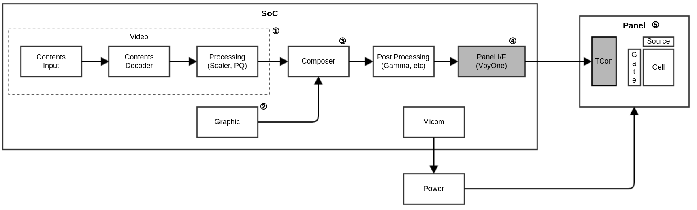

| TCON is embedded in the SoC. This is used for LED only.
| As there is no TCON in the panel, PMIC for the panel voltage supplier is required in the main board.

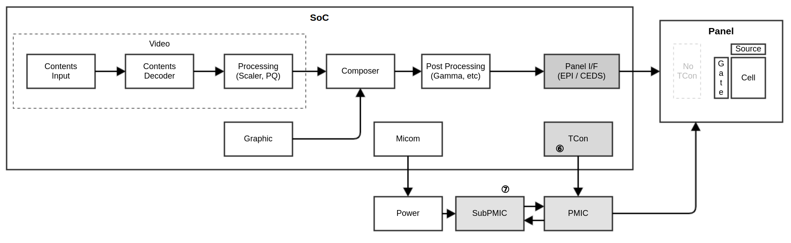

Software Architecture
-------------------

The following figure shows the block diagram of the Panel controller and related modules.
There are two webOS services related to the video output and panel.
One is Panel controller service. This service is responsible for the power on and off the panel and various panel features.
The other is EPL manager. This service is responsible for the OLED pixel lifecycle compensation and pixel damage prevention by adjusting luminance.

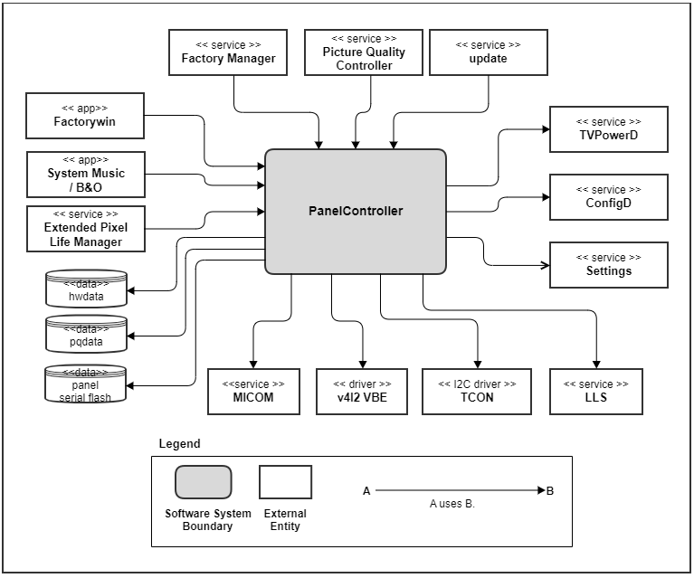

The diagram above shows Panel controller service and related services.

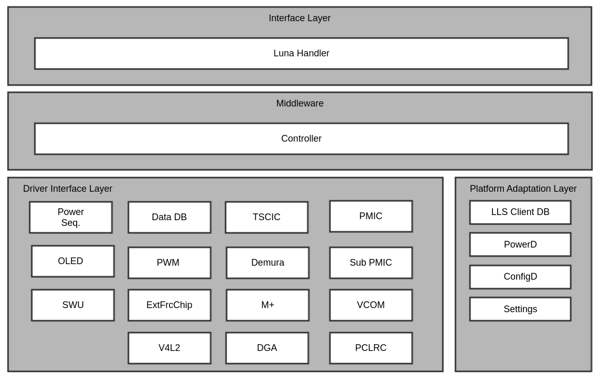

Features in Panel controller service would be enabled or disabled based on the panel type, hardware options or software configurations.

.. _PanelController Requirements:

Requirements
************

This section describes the major functionalities of the Panel controller driver, as well as its operational flow and requirements.

List of common requirements

========================== ==================================================
Feature                    Description
========================== ==================================================
Display Power Sequence     Panel power control according to the the panel specification.
Screen mute and unmute     Mute or unmute video including OSD.
Mirror Mode                Change video including OSD horizontally or vertically.
Display internal pattern   Show SoC internal pattern for debugging purpose.
Display output 50/60hz     Display 60hz input as 60hz output in the panel that support maximum 120hz refresh rate.
Output DCLK change         Change output dclk for the panel which can support above 144Hz refresh rate.
Output VSYNC Event         Subscribe gerenal vsync event
========================== ==================================================

List of requirements for Embedded TCON

========================== ==================================================
Feature                    Description
========================== ==================================================
DGA, PCLRC                 PQ setting at power on time.
Demura, PMIC data, TSCIC   Panel setting at power on time.
VCOM pattern               Draw pattern image to adjust PMIC Vcom voltage.
VAC                        Viewing angle compensation for VA panel.
CSPI Gamma                 Gamma setting for CSPI module.
VDF                        Reduce VRR Flicker by using PMIC setting or Gamma Curve.
========================== ==================================================

List of requirements for LED

========================== ==================================================
Feature                    Description
========================== ==================================================
PWM Control                Brightness control with PWM signal for global dimming of the panel.
Mplus                      Deprecated Mplus panel setting.
========================== ==================================================

List of requirements for OLED

========================== ==================================================
Feature                    Description
========================== ==================================================
CPC                        Energy saving control by LG SoC or by TCON for other SoCs.
LSR                        Panel luminance control.
GSR                        Luminance control for moving picture using libOSR library.
GSR2                       Additional luminance control for the primary color.
TPC                        Temporal peak luminance control.
IRR                        Required for LG SoC only.
DPC                        Decrease EVDD without sacrificing brightness using PWM based on APL.
PCCE                       Power Constrained Contrast Enhancement control for LG SoC only
========================== ==================================================

.. Template
  .. _(Feature name)
  (Feature name)
  ==============
  | short description
  [image]
  | (featur ename) is performed by the following extended API:
  V4L2_CID_EXT_VBE_XXXX
  Functional Requirements
  -----------------------
  
  ^^^^^^^^^^^^^
  [image]
  
  ^^^^^^^^^^^^^
  [image]
  Sequence Diagram
  ----------------
  Quality and Constraints
  -----------------------

.. _Transmitting video via panel interface

Transmitting video via panel interface
======================================

API related
-----------
- :c:macro:`V4L2_CID_EXT_VBE_DISPLAYOUTPUT`

Functional Requirements
-----------------------

| Panel controller does not have control for transmitting video using the panel interface like VbyOne, EPI or LVDS.
| Panel controller driver would set up the panel interface internally and then output video signal by Panel controller request.
| LG may request to change some interface settings by providing the required lists. But it is applied directly to the driver without V4L2 driver call.

| How to know which panel interface is used?
- Panel controller driver could know from the cmdline option at boot time.

| Transmitting video via panel interface is performed by kernel driver independently. No V4L2 is called to set up this.
| Panel controller only requests to start or stop to transmit video by the following extended CID:

.. _Display Power Sequence

Display Power Sequence
======================

API related
-----------
- Not available

Functional Requirements
-----------------------

| There're several module or services that are related to the power sequence of the display.

| Panel Controller
- It controls all power sequences except AC ON case.

| Bootloader
- During AC ON time, bootloader sets panel power, Inverter power.

| TvPowerD
- It manages TV power on or off states and requests Panel controller to run the power on or off action.

| At DC OFF time, Panel controller has the control for power.
| At AC OFF time, Micom has the control.

Example call sequence at DC ON time
^^^^^^^^^^^^^^^^^^^^^^^^^^^^^^^^^^^
There is an example sequence for embedded TCON.

    1. Set video mute with V4L2_CID_EXT_VBE_MUTE

    2. Set panel Vdd On via Micom

    3. Set V4L2_CID_EXT_VBE_RESUME

    4. Set V4L2_CID_EXT_VBE_MIRROR(optional)

    5. Initialize embedded TCON
      - set VA Demura data with V4L2_CID_EXT_VBE_DEMURA
      - set VA PMIC via I2C
      - set DGA data with V4L2_CID_EXT_VBE_DGA4CH
      - set VAC parameters using V4L2_CID_EXT_VBE_VAC_PARAM
      - Enable VAC ON using V4L2_CID_EXT_VBE_VAC_CONTROL
      - set CSPI gamma parameters using V4L2_CID_EXT_VBE_CSPI_PGAMMA_CONTROL
      - send PMIC datas for VDF using V4L2_CID_EXT_VBE_VDF_CONTROL
      - if support, send Gamma parameters for VDF using V4L2_CID_EXT_VBE_VDF_GAMMA_PARAM

    6. Enable display output
      - Delay for TxData On
      - Set V4L2_CID_EXT_VBE_DISPLAYOUTPUT True

    7. Set PWM with initial duty
      - Get V4L2_CID_EXT_VBE_PWM_PARAM
      - Set V4L2_CID_EXT_VBE_PWM_PARAM
      - Set V4L2_CID_EXT_VBE_PWM_APPLY_PARAM
      - This would be called multiple times.

    8. Turn on inverter
      - Delay for inverter
      - Set Inverter ON via Micom

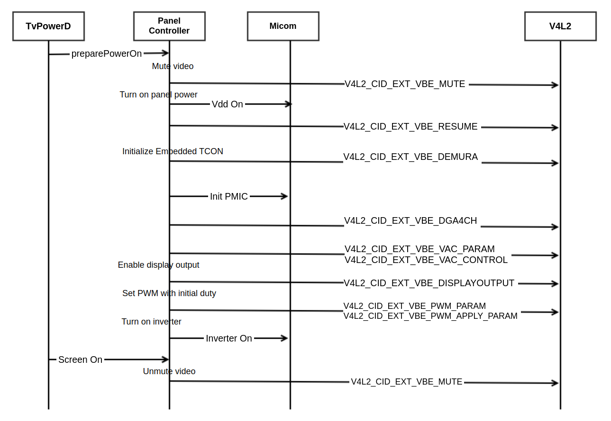

.. _Screen On and Off

Screen on and off
=================

API related
-----------
- :c:macro:`V4L2_CID_EXT_VBE_MUTE`

Functional Requirements
-----------------------

| This feature would be used to turn off screen for energy saving or for listening mode in the music app by the end user.

Screen Off Sequence in Panel controller.
1. Disable PWM access
2. Screen mute on
3. Wait 20 ms
4. Inverter power off
5. Wait 30 ms
6. PWM off

Screen On Sequence in Panel controller
1. PWM on
2. Delay between PWM & INV
3. Inverter power on.
4. Wait 10 ms
5. Screen mute off

In webOS side,
When it enters Screen off,
1. Panel controller is notified that screen off settingDB is changed.
2. Panel controller sends TvPowerD "turnOffScreen" message.
3. TvPowerD requests Panel controller to set Screen Off.
4. Panel controller does screen off.

When it enters Screen on,
1. TvPowerD sends Panel controller "turnOnScreen" message.
2. Panel controller change screenOff settingsDB value.
3. panel controller does screen on.

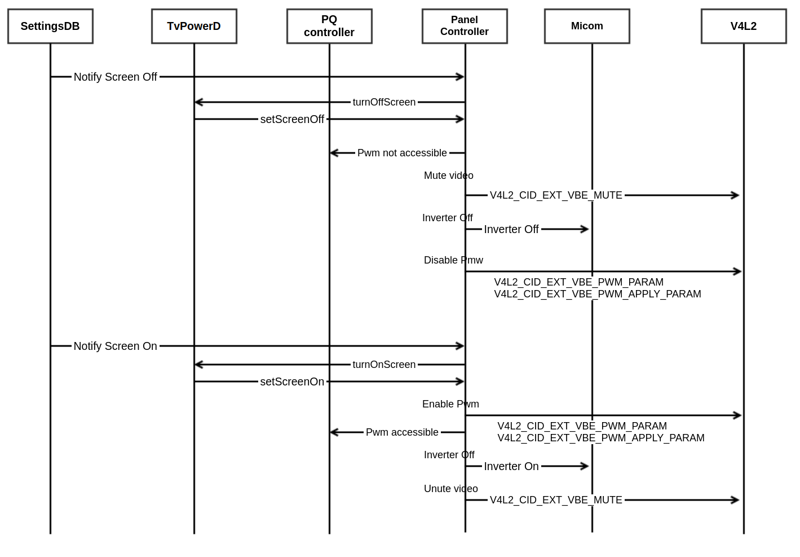

.. _Mirror Mode

Mirror Mode
===========

API related
-----------
- :c:macro:`V4L2_CID_EXT_VBE_MIRROR`

Functional Requirements
-----------------------

Video including OSD is reversed in horizontal direction or vertical direction.
It is called at the power on time.
It is used in the specific model.

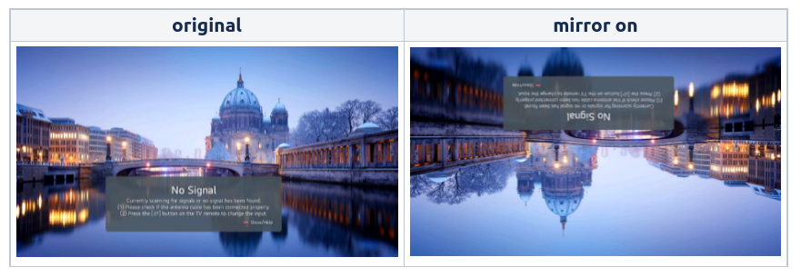

Quality and Constraints
-----------------------

  Implementation might be different depending on SoC.
  For Horizontal mirroring, it is done for OSD and video together.
  But for vertical mirroring, OSD and video is mirrored separately in the different block.

.. _Display output frame rate 50/60hz

Display output frame rate 50/60hz
=================================

API related
-----------
- :c:macro:`V4L2_CID_EXT_VBE_DISPLAYOUTPUT_5060HZ`

Functional Requirements
-----------------------

This is a kind of video gaming feature. It is introduced to enhance video input lag time while the end user plays video game.
When input frame rate is 50 or 60hz in the panel that supports 120hz,
it can match display output frame rate to the input frame rate.
For HDMI VRR signal, this feature is not supported.
It only works when the picture mode is game.
When the signal is detected, Panel controller request both V4L2 and TCON to switch the mode.

.. _PQ or panel setting at power on time

PQ or panel setting at power on time
====================================

API related
-----------
- :c:macro:`V4L2_CID_EXT_VBE_DEMURA`
- :c:macro:`V4L2_CID_EXT_VBE_DGA4CH`
- :c:macro:`V4L2_CID_EXT_VBE_TSCIC`
- :c:macro:`V4L2_CID_EXT_VBE_PCLRC`
- :c:macro:`V4L2_CID_EXT_VBE_VAC_PARAM`
- :c:macro:`V4L2_CID_EXT_VBE_VAC_CONTROL`
- :c:macro:`V4L2_CID_EXT_VBE_CSPI_PGAMMA_CONTROL`
- :c:macro:`V4L2_CID_EXT_VBE_VDF_CONTROL`
- :c:macro:`V4L2_CID_EXT_VBE_VDF_GAMMA_PARAM`

Functional Requirements
-----------------------
For product with embedded TCON, there're some requirements from panel to improve picture quality.
To achieve this, several data is delivered to embedded TCON.

TSCIC is for EPI panel from LG Display and Demura is for VA panel.
PCLRC is used for color compensation of BOE panel.
PMIC data is loaded from the panel flash memory to set up panel power signals using PMIC.
DGA is for gamma compensation.
VAC is to compensate viewing angle in the VA panel.
Viewer has different brightness because LCD cell array moves in one direction or one domain.
By controlling DGA LUT, it could show multi domain effect with average brightness and improve viewing angle.
CSPI gamma data is used for CSPI module by inserting the datas to CAPI control packet.
Some PMIC datas or Gamma parameters are sent for VRR De Flicker with different CID.

Quality and Constraints
-----------------------

VAC feature uses two DGA LUTs.
Detailed data structure should be re-defined for each SoC vendor.

.. _VCOM Pattern

VCOM Pattern
============

API related
-----------
- :c:macro:`V4L2_CID_EXT_VBE_VCOM_PAT_CTRL`
- :c:macro:`V4L2_CID_EXT_VBE_VCOM_PAT_DRAW`

Functional Requirements
-----------------------

VCOM means Vcom voltage in the TFT LCD Cell which PMIC provides.
To meet the Vcom voltage requirement in the embedded TCON product, Vcom register PMIC should be controlled.
If it is not adjusted, video would flicker or sticking image remains.

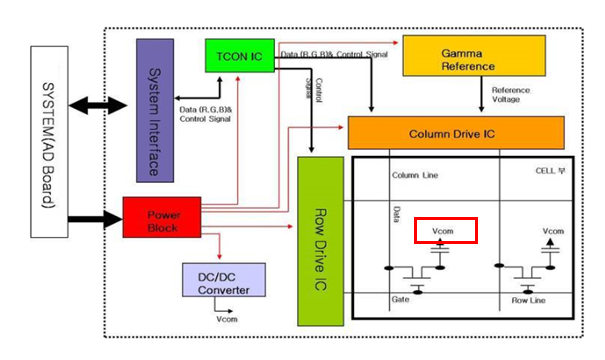

During the production in the factory, Vcom voltage is adjusted by observing the video output.
It can be done manually with RCU or automatically via UART interface.
At the time, the pattern image should be displayed.
The pattern is a repeated image of 8x4 pixels.

| VCOM pattern and Resolution

============ =============================================
Resolution   Number of VCOM pattern(8x4 pixel repetition)
============ =============================================
640 x 480    80 x 120
1024 x 768   128 x 192
1366 x 768   170.75 x 42 (right 2 pixels are cut)
1920 x 1080  240 x 270
3840 x 2160  480 x 520
============ =============================================

There are sample VCOM patterns.
The left ones are pattern designs and the right ones are displayed images in TV.

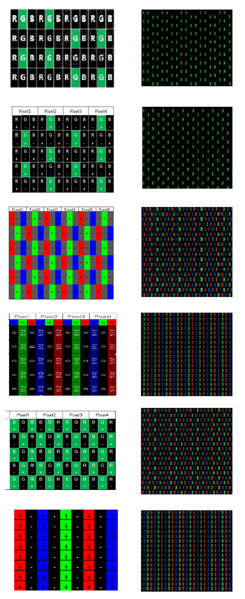

Quality and Constraints
----------------------
For 1366 x 768 resolutions, pattern would be cut in the two rightmost rows of pixel.

.. _PWM Control

PWM Control
===========

API related
-----------
- :c:macro:`V4L2_CID_EXT_VBE_PWM_INIT`
- :c:macro:`V4L2_CID_EXT_VBE_PWM_PARAM`
- :c:macro:`V4L2_CID_EXT_VBE_PWM_APPLY_PARAM`
- :c:macro:`V4L2_CID_EXT_VBE_PWM_SET_DUTY`

Functional Requirements
-----------------------

PWM is used to control global dimming of the screen by controlling backlight brightness in LED TV.
In webOS, PQ Controller change the PWM setting based on the user setting, picture mode, sensor value, APL, etc.
To meet the LED driver sequence requirement of PWM at power on or off, Panel controller initialize PWM and set initial duty for the required time.
After that, PQ Controller is allowed to change the value.

Here is an example.

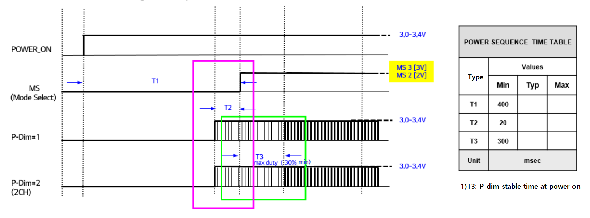

| Regarding green box, it is required that after minimum 20msec of PWM1 and PWM2 setting, Inverter and Power Mode Select should be set.
| Regarding pink box: it is reqruired that after Inverter signal and Power Mode Select signal is set, it should be kept PWM duty as 30% for 300msec.
After that, pqcontroller can change the PWM setting values.

In Panel controller, it also set minimum and maximum duty values of the PWM for the global dimming in the model.

.. _OLED Luminance Control

OLED Luminance Control
======================

Functional Requirements
-----------------------

Since OLED TV’s particle emits light by itself, the OLED particles get stressed when watching TV pictures with fixed Images/phrases for a long time.
As a result, the image retention (afterimages) on the screen appears.
Orbit feature in VideoOutputD service is also introduced to prevent this.
In EPL Manager service, there are more features and OLED luminance control and pixel refreshment is main purpose.
It has two main roles.
One is to refresh pixels for compensation periodically. This feature is performed in the TCON side.
The other is to detect sticking area or still area in the screen and adjust luminance. This  feature is applied to TV SoC side.

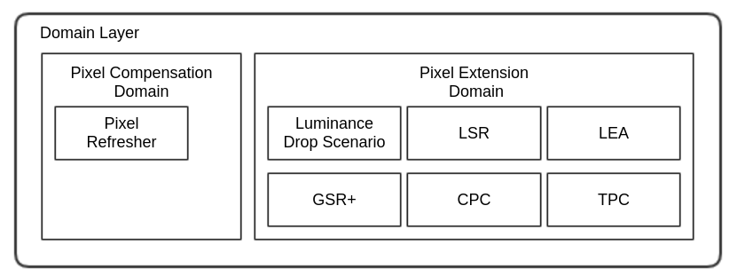

Quality and Constraints
-----------------------
Detailed information for OLED compensation will be provided only when the SoC support these features.

.. _OLED Linear DPC

OLED Linear DPC
======================

Functional Requirements
-----------------------

OLED DPC decrease panel EVDD voltage from 0V to 6V without sacrificing brightness.
It reads APL from video and osd mixed source and change PWM duty.
The PWM signal is input to the power board to control EVDD.
As APL is reqd for every video frame, driver generates vsync event.
APL is read using V4L2_CID_EXT_VBE_GET_APL_FOR_TPC CID.
tpcAplInfoTable data in v4l2_ext_vbe_panel_tpc_apl_info data type is composed of
    unsigned int tpcAplInfoTable[4];
    - tpcAplInfoTable[0]	    10 bit Y APL(non-linear domain) value
    - tpcAplInfoTable[1]	    10 bit maxRGB APL(linear domain) value
    - tpcAplInfoTable[2]	    10 bit OLED APL transmitted to TCON. video and osd mixed value.

Panelcontroller subscribe V4L2_CID_EXT_VBE_SUBSCRIBE_DPC event and detects vsync event using epoll().
V4L2_CID_EXT_VBE_SUBSCRIBE_DPC event is read using VIDIOC_DQEVENT CID.

Quality and Constraints
-----------------------
Driver should be able to generate vsync event every vbe vsync.
PWM would use 5Khz frequency and duty will be ranged from 0 to 255.

.. _Output VSYNC Event

Output VSYNC Event
======================

Functional Requirements
-----------------------

Support vsync event id V4L2_CID_EXT_VBE_SUBSCRIBE_VSYNC to get general output vsync timing of SoC

webOS subscribe V4L2_CID_EXT_VBE_SUBSCRIBE_VSYNC event and detects vsync event using epoll().
V4L2_CID_EXT_VBE_SUBSCRIBE_VSYNC event is read using VIDIOC_DQEVENT CID.

Quality and Constraints
-----------------------
There should be no delay without a special reason.

.. _PCCE on or off

PCCE on or off
======================

Functional Requirements
-----------------------
This feature would be used to enable PCCE algorithm for power consumption improvemnet.
PCCE is enabled according to PSM(ECO/APS/Standard) setting and MEC(Motion Eye Care) UI on.

Quality and Constraints
-----------------------
There should be no delay without a special reason.

.. _OUTPUT TIMING by tcon.bin file data

OUTPUT TIMING by tcon.bin file data
======================

API related
-----------
- :c:macro:`V4L2_CID_EXT_VBE_OUTPUT_TIMING`

Functional Requirements
-----------------------

Use V4L2_CID_EXT_VBE_OUTPUT_TIMING to change output timing of SoC which uses tcon.bin file for output signal.
The parameters in v4l2_ext_vbe_output_settingdata has a v4l2_ext_vbe_outputsetting_type of setType,
    v4l2_ext_vbe_output_timing of *pTimingParam and void of *extraInfo.
When setType is V4L2_EXT_VBE_OUTPUT_SET_TIMING_TYPE, Driver should change output timing with *pTimingParam.
The *pTimingParam has required timing info (frameRate, hTotal, vTotal, hResolution, vResolution, and so on.)
When setType is V4L2_EXT_VBE_OUTPUT_INIT_ALLTCONBINDATA_TYPE, Driver should save the full combined tcon.bin
    data from *extraInfo which has a address and size of the full combined tcon.bin data.
In case of setType is V4L2_EXT_VBE_OUTPUT_INIT_ALLTCONBINDATA_TYPE, it should be called only one time
    during ac power on.
Thus, Driver sould save and recover the full combined tcon.bin data to use it after dc off/on also.
When setType is V4L2_EXT_VBE_OUTPUT_SELECT_ONETCONDATA_TYPE, Driver set a single tcon data among the full
    combined tcon.bin datas to output signal timing.

Quality and Constraints
-----------------------
It could be only used to model which is applied with tcon.bin file.

.. _Local Dimming Control

Local Dimming Control
===========

API related
-----------
- :c:macro:`V4L2_CID_EXT_VBE_OBJECT_APL_GAIN`
- :c:macro:`V4L2_CID_EXT_VBE_OBJECT_APL`

Functional Requirements
-----------------------

Some kinds of object dectection is supported from SoC.
It can be used to enhance local dimming performance of LCD.
Current SoC supports face, depth, light, logo object detection.
The detected object data is expressed as APL values in this application.
They are mixed to create one APL map required for high contrast BPL in local dimming.
Because RGB local dimming ic is located outside SoC, the apl map should be read from SoC
and then transmitted to RGB local dimming ic.

Implementation
**************

This section provides materials that are useful for Panel controller implementation.

- The File Location section provides the location of the Git repository where the header file is found in which the interface for the Panel controller implementation is defined.
- The API List section provides a brief summary of APIs that must be implemented.

File Location
=============

The Panel controller driver v4l2 interfaces are defined in the v4l2-ext-panel.h header file, which can be obtained from https://swfarmhub.lge.com/.

- Git repository: bsp/ref/v4l2-ext-panel-header
- Location: [as_installed]/linux/v4l2-ext-panel.h

API List
========

The Panel controller driver implementation must adhere to the interface specifications defined and implements its functions. Refer to the API Reference for more details.

Data Types
^^^^^^^^^^

Extended V4L2 Data Type
""""""""""""""""""""""""

The following table lists the LG extended V4L2 data types.

Standard Data Type

====================================================== ===================================================================================================
Data Type                                              Description
====================================================== ===================================================================================================
:cpp:any:`v4l2_event`                                  VIDIOC_DQEVENT argument.
:cpp:any:`v4l2_event_subscription`                     VIDIOC_SUBSCRIBE_EVENT/VIDIOC_UNSUBSCRIBE_EVENT argument.
====================================================== ===================================================================================================

Common Data Type

====================================================== ===================================================================================================
Data Type                                              Description
====================================================== ===================================================================================================
:cpp:any:`v4l2_ext_vbe_user_option`                    Describe display user option.
:cpp:any:`v4l2_ext_vbe_panel_info`                     Describe various panel information.
:cpp:any:`v4l2_ext_vbe_ssc`                            Describe spread spectrum control data
:cpp:any:`v4l2_ext_vbe_mirror`                         Describe horizontal and vertical mirroring mode setting value.
:cpp:any:`v4l2_ext_vbe_inner_pattern`                  Describe intern driver pattern and types.
:cpp:any:`v4l2_ext_vbe_ucr_lut`                        Describe data table for uniformity algorithm.
:cpp:any:`v4l2_ext_vbe_frame_rate`                     Describe freerun framerate and framerate setting value.
:cpp:any:`v4l2_ext_set_vbe_genlock`                    Describe genlock and phaseshift.
:cpp:any:`v4l2_ext_get_vbe_genlock`                    Describe genlock status, framerate and phase.
:cpp:any:`v4l2_ext_vbe_object_apl_gain`                Describe ai detection object apl gain setting.
:cpp:any:`v4l2_ext_vbe_object_apl`                     Describe ai detection object apl map data.
====================================================== ===================================================================================================

Data Type for Embedded TCON

====================================================== ===================================================================================================
Data Type                                              Description
====================================================== ===================================================================================================
:cpp:any:`v4l2_ext_vbe_dga4ch`                         Describe DGA setting table for embedded TCON.
:cpp:any:`v4l2_ext_vbe_panel_demura`                   Describe LED demura data.
:cpp:any:`v4l2_ext_vbe_panel_tscic`                    Describe TSCIC data. This is supported in LG Display panel.
:cpp:any:`v4l2_ext_vbe_panel_pclrc`                    Describe PCLRC data in embedded TCON.
:cpp:any:`v4l2_ext_vbe_vcom_pat_draw`                  Describe pattern selection and size.
:cpp:any:`v4l2_ext_vbe_panel_alpha_osd_info`           Describe OSD Alpha value.
:cpp:any:`v4l2_ext_vbe_cspi_pgamma_control_param`      Describe CSPI gamma control data.
:cpp:any:`v4l2_ext_vbe_output_settingdata`             Describe output timing setting control and data. This is supported in using tcon.bin file.
====================================================== ===================================================================================================

Data Type for LED

====================================================== ===================================================================================================
Data Type                                              Description
====================================================== ===================================================================================================
:cpp:any:`v4l2_ext_vbe_pwm_adapt_freq_param`           Describe adaptive frequency mode and each frequency information of PWM. Adaptive means PWM frequency followes vsync output frequency
:cpp:any:`v4l2_ext_vbe_pwm_param_data`                 Describe PWM parameters like duty, frequency, lock and start.
:cpp:any:`v4l2_ext_vbe_pwm_param`                      Describe PWM parameter of specific device pin.
:cpp:any:`v4l2_ext_vbe_pwm_duty`                       Describe PWM duty of the specific PWM pins.
:cpp:any:`v4l2_ext_vbe_mplus_param`                    Describe MPlus parameters like frame or pixel gain limit.
:cpp:any:`v4l2_ext_vbe_mplus_data`                     Describe MPlus panel register setting.
====================================================== ===================================================================================================

Data Type for OLED

====================================================== ===================================================================================================
Data Type                                              Description
====================================================== ===================================================================================================
:cpp:any:`v4l2_ext_vbe_panel_osd_gain_info`            Describe OSD RGB gain value. OSD area will be black when the level is 0xFF.
:cpp:any:`v4l2_ext_vbe_panel_orbit_info`               Deprecated.
:cpp:any:`v4l2_ext_vbe_panel_lsr_info`                 Describe LSR mode table.
:cpp:any:`v4l2_ext_vbe_panel_gsr_info`                 Describe GSR setting table.
:cpp:any:`v4l2_ext_vbe_panel_second_gsr_info`          Describe GSR2 setting table.
:cpp:any:`v4l2_ext_vbe_panel_irr_info`                 Describe GSR2 setting table.
:cpp:any:`v4l2_ext_vbe_panel_tpc_recovery_param_info`  Describe TPC recovery parameter setting table.
:cpp:any:`v4l2_ext_vbe_panel_tpc_recovery_status_info` Describe TPC recovery status.
:cpp:any:`v4l2_ext_vbe_panel_tpc_apl_info`             Describe TPC APL information table.
:cpp:any:`v4l2_ext_vbe_panel_apl_control_param_info`   Describe TPC APL control parameter table.
====================================================== ===================================================================================================

Extended V4L2 Enumerations
""""""""""""""""""""""""""

The following table lists the LG extended V4L2 enum types.

====================================================== ===================================================================================================
Enumeration                                            Description
====================================================== ===================================================================================================
:cpp:any:`v4l2_ext_vbe_panel_inch`                     Define the size of TV panel in inch from 22 to 105.
:cpp:any:`v4l2_ext_vbe_panel_maker`                    Define the manufacturer of the panel like LGD, BOE, and etc.
:cpp:any:`v4l2_ext_vbe_panel_interface`                Define the protocol standard like VbyOne, EPI, CEDS and LVDS and etc.
:cpp:any:`v4l2_ext_vbe_panel_resolution`               Define panel resolutions supported.
:cpp:any:`v4l2_ext_vbe_panel_version`                  Define version of the panel.
:cpp:any:`v4l2_ext_vbe_panel_framerate`                Define maximum panel refresh rate supported.
:cpp:any:`v4l2_ext_vbe_panel_backlight_type`           Define backlight type like edge, direct or OLED.
:cpp:any:`v4l2_ext_vbe_panel_led_bar_type`             Define the number of led bar blocks.
:cpp:any:`v4l2_ext_vbe_panel_cell_type`                Define LED panel type like RGB or RGBW. RGBW is for Mplus type.
:cpp:any:`v4l2_ext_vbe_panel_bandwidth`                Define maximum bandwidth supported in the interface.
:cpp:any:`v4l2_ext_vbe_frc_chip`                       Define if FRC is internal or external type.
:cpp:any:`v4l2_ext_vbe_lvds_colordepth`                Define panel color depth as 8 bit or 10 bit.
:cpp:any:`v4l2_ext_vbe_lvds_type`                      Define LVDS type as VESA or JEIDA.
:cpp:any:`v4l2_ext_vbe_vcom_pat_ctrl`                  Define pattern on, off and optional patterns.
:cpp:any:`v4l2_ext_vbe_pwm_pin_sel`                    Define PWM pin selection.
:cpp:any:`v4l2_ext_vbe_pwm_pin_sel_mask`               Define PWM pin mask for multiple selection.
:cpp:any:`v4l2_ext_vbe_mplus_mode`                     Define Mplus panel operation mode. Deprecated.
:cpp:any:`v4l2_ext_vbe_panel_orbit_mode`               Define orbit mode as just scan, auto or store mode. Deprecated.
:cpp:any:`v4l2_ext_vbe_panel_lsr_mode`                 Define LSR mode as off, light or strong.
:cpp:any:`v4l2_ext_vbe_dclk_mode`                      Define soc output max dclk selection for special module.
:cpp:any:`V4L2_EXT_VBE_GENLOCK_SYNC_STATUS`            Define genlock sync status.
:cpp:any:`V4L2_EXT_VBE_GENLOCK_FRAMERATE`              Define framerate of genlock.
====================================================== ===================================================================================================

Functions
^^^^^^^^^

Standard V4L2 Functions
"""""""""""""""""""""""

The following table lists the Linux standard V4L2 functions.

===================================================================================================================================================================================== ===================================================================================================
Funtion                                                                                                                                                                               Description
===================================================================================================================================================================================== ===================================================================================================
`V4L2 open() <https://linuxtv.org/downloads/v4l-dvb-apis/userspace-api/v4l/func-open.html>`_                                                                                          Opens a V4L2 device.
`V4L2 close() <https://linuxtv.org/downloads/v4l-dvb-apis/userspace-api/v4l/func-close.html>`_                                                                                        Closes a V4L2 device.
`ioctl VIDIOC_G_CTRL <https://linuxtv.org/downloads/v4l-dvb-apis/userspace-api/v4l/vidioc-g-ctrl.html#vidioc-g-ctrl>`_                                                                Gets or Sets the value of a control.
`ioctl VIDIOC_S_CTRL <https://linuxtv.org/downloads/v4l-dvb-apis/userspace-api/v4l/vidioc-g-ctrl.html#vidioc-g-ctrl>`_                                                                Gets or Sets the value of a control.
`ioctl VIDIOC_G_EXT_CTRLS <https://linuxtv.org/downloads/v4l-dvb-apis/userspace-api/v4l/vidioc-g-ext-ctrls.html#vidioc-g-ext-ctrls>`_                                                 Gets or sets the value of several controls.
`ioctl VIDIOC_S_EXT_CTRLS <https://linuxtv.org/downloads/v4l-dvb-apis/userspace-api/v4l/vidioc-g-ext-ctrls.html#vidioc-g-ext-ctrls>`_                                                 Gets or sets the value of several controls.
`ioctl VIDIOC_DQEVENT <https://linuxtv.org/downloads/v4l-dvb-apis/userspace-api/v4l/vidioc-dqevent.html#V4L.VIDIOC_DQEVENT>`_                                                         Dequeue event.
`ioctl VIDIOC_SUBSCRIBE_EVENT <https://linuxtv.org/downloads/v4l-dvb-apis/userspace-api/v4l/vidioc-subscribe-event.html#vidioc_subscribe_event>`_                                     Subscribe or unsubscribe event
`ioctl VIDIOC_UNSUBSCRIBE_EVENT <https://linuxtv.org/downloads/v4l-dvb-apis/userspace-api/v4l/vidioc-subscribe-event.html#vidioc_subscribe_event>`_                                   Subscribe or unsubscribe event
===================================================================================================================================================================================== ===================================================================================================

Extended V4L2 Controls
""""""""""""""""""""""

The following table lists the LG extended V4L2 controls.

Common Cotrol IDs

==================================================== ======================================================================================
Control ID                                           Description
==================================================== ======================================================================================
:c:macro:`V4L2_CID_EXT_VBE_INIT`                     Initialize driver and share panel information.
:c:macro:`V4L2_CID_EXT_VBE_RESUME`                   Resume Panel controller driver from STR.
:c:macro:`V4L2_CID_EXT_VBE_DISPLAYOUTPUT`            Enable or disable LVDS, EPI or VbyOne signal output from SoC to the panel.
:c:macro:`V4L2_CID_EXT_VBE_MUTE`                     Mute or unmute video including OSD.
:c:macro:`V4L2_CID_EXT_VBE_MIRROR`                   Horizontal or vertical reversed output
:c:macro:`V4L2_CID_EXT_VBE_LOCK_STATUS`              Get Vx1 signal lock status
:c:macro:`V4L2_CID_EXT_VBE_INNER_PATTERN`            Display pattern images from several SoC internal blocks. Debugging purpose. except from socts, deprecated.
:c:macro:`V4L2_CID_EXT_VBE_SSC`                      Control spread spectrum.
:c:macro:`V4L2_CID_EXT_VBE_DISPLAYOUTPUT_5060HZ`     Decrease panel frame rate to 50Hz or 60Hz from 120Hz when HDMI input is 50 or 60Hz.
:c:macro:`V4L2_CID_EXT_VBE_ALPHA_OSD`                Get OSD alpha value from the separated 16 blocks of the screen to detect if OSD is displayed or not in the region.
:c:macro:`V4L2_CID_EXT_VBE_DCLK_MODE`                Change the soc output dclk and only for OLED.
:c:macro:`V4L2_CID_EXT_ID_VBE_UCR_DATA`              Get position and color data for uniformity algorithm.
:c:macro:`V4L2_CID_EXT_ID_VBE_FRAME_RATE`            Set or get freerun frame rate
:c:macro:`V4L2_CID_EXT_VBE_FREQUENCY_MODE`           Change the soc output frequency mode.
:c:macro:`V4L2_CID_EXT_ID_VBE_SET_GENLOCK`           Set genlock on/off
:c:macro:`V4L2_CID_EXT_ID_VBE_GET_GENLOCK`           Get genlock status
:c:macro:`V4L2_CID_EXT_VBE_SUBSCRIBE_VSYNC`          Subscribe general vbe vsync event every frame
==================================================== ======================================================================================

Control IDs for Embedded TCON

==================================================== ===================================================================================================
Control ID                                           Description
==================================================== ===================================================================================================
:c:macro:`V4L2_CID_EXT_VBE_DGA4CH`                   Set DGA data to embedded TCON. For RGB panel, white gamma data is discarded.
:c:macro:`V4L2_CID_EXT_VBE_DEMURA`                   Set demura data to embedded TCON from SiliconWorks TCON IP.
:c:macro:`V4L2_CID_EXT_VBE_PCLRC`                    Set PCLRC data to embedded TCON from SiliconWorks TCON IP.
:c:macro:`V4L2_CID_EXT_VBE_TSCIC`                    Set TSCIC data to embedded TCON with LGD EPI panel only.
:c:macro:`V4L2_CID_EXT_VBE_EPI_SCRAMBLE`             Enable or disable EPI data scramble.
:c:macro:`V4L2_CID_EXT_VBE_EPI_10BIT`                Enable or disable EPI 10 bit mode.
:c:macro:`V4L2_CID_EXT_VBE_VCOM_PAT_CTRL`            Turn on or off Vcom pattern.
:c:macro:`V4L2_CID_EXT_VBE_VCOM_PAT_DRAW`            Draw Vcom pattern used for adjustment in the factory.
:c:macro:`V4L2_CID_EXT_VBE_VAC_PARAM`                Set parameters for VAC feature in the special block of SoC.
:c:macro:`V4L2_CID_EXT_VBE_VAC_CONTROL`              Enable or disable VAC feature.
:c:macro:`V4L2_CID_EXT_VBE_CSPI_PGAMMA_CONTROL`      Set CSPI gamma datas of CSPI interface module.
:c:macro:`V4L2_CID_EXT_VBE_VDF_CONTROL`              Set PMIC data for VRR De Flicker.
:c:macro:`V4L2_CID_EXT_VBE_VDF_GAMMA_PARAM`          Set Gamma parameters for VRR De Flicker.
:c:macro:`V4L2_CID_EXT_VBE_OUTPUT_TIMING`            Change output timing parameters in case of using tcon.bin file.
==================================================== ===================================================================================================

Control IDs for LED

==================================================== ===================================================================================================
Control ID                                           Description
==================================================== ===================================================================================================
:c:macro:`V4L2_CID_EXT_VBE_PWM_INIT`                 Initialize PWM.
:c:macro:`V4L2_CID_EXT_VBE_PWM_PARAM`                Sets the PWM parameter of the pwmIndex
:c:macro:`V4L2_CID_EXT_VBE_PWM_APPLY_PARAM`          Apply PWM parameter with mask of pwm device pin number.
:c:macro:`V4L2_CID_EXT_VBE_PWM_SET_DUTY`             Set PWM duty for the selected pins.
:c:macro:`V4L2_CID_EXT_VBE_OBJECT_APL_GAIN`    Set apl gain for each kind of ai detection objects.
:c:macro:`V4L2_CID_EXT_VBE_OBJECT_APL`     Get one mixed apl map data of all ai detection objects.
==================================================== ===================================================================================================

Control IDs for OLED

==================================================== ===================================================================================================
Control ID                                           Description
==================================================== ===================================================================================================
:c:macro:`V4L2_CID_EXT_VBE_OSD_GAIN`                 Control OSD RGB gain.
:c:macro:`V4L2_CID_EXT_VBE_CPC`                      CPC HW control. (LG SoC only)
:c:macro:`V4L2_CID_EXT_VBE_LSR`                      Control LSR mode and setting for sticky reduction.
:c:macro:`V4L2_CID_EXT_VBE_GSR`                      Control global sticky reduction for video area using LG proprietary libosr library.
:c:macro:`V4L2_CID_EXT_VBE_GSR_STATUS`               Get GSR running status.
:c:macro:`V4L2_CID_EXT_VBE_GSR_STRESS_COUNT`         Get still area count with GSP detect bock measured for 10 minutes after power on.
:c:macro:`V4L2_CID_EXT_VBE_GSR2`                     Control GSR2 to adjust panel luminance.
:c:macro:`V4L2_CID_EXT_VBE_IRR_ADAPTEDLUM`           Reduce image retention risk with luminance control. (LG SoC only)
:c:macro:`V4L2_CID_EXT_VBE_IRR_RESULT`               Get AI image retention risk detection data. (LG SoC only)
:c:macro:`V4L2_CID_EXT_VBE_TPC_RECOVERY_PARAM`       Mouse, keyboard movement detection by SoC driver to exit TPC by PQ controlling oled light via TCON.
:c:macro:`V4L2_CID_EXT_VBE_TPC_RECOVERY_STATUS`      Get the calculated result if TPC dimming should be recovered or not. (LG SoC only)
:c:macro:`V4L2_CID_EXT_VBE_GET_APL_FOR_TPC`          SoC TPC used to get APL from SoC driver and PQ controls oled light via TCON.
:c:macro:`V4L2_CID_EXT_VBE_OLED_APL_CTRL_PARAM`      Set APL control parameter. (LG SoC only)
:c:macro:`V4L2_CID_EXT_VBE_SUBSCRIBE_DPC`            Subscribe vbe vsync event every frame for linear DPC
:c:macro:`V4L2_CID_EXT_VBE_PCCE`                     Enable or disable PCCE. (LG SoC only)
==================================================== ===================================================================================================

Deprecated Control IDs

==================================================== ===================================================================================================
Control ID                                           Description
==================================================== ===================================================================================================
:c:macro:`V4L2_CID_EXT_VBE_MPLUS_MODE`               Deprecated since webOS6.0 No Mplus IP in SoC
:c:macro:`V4L2_CID_EXT_VBE_MPLUS_PARAM`              Deprecated since webOS6.0 No Mplus IP in SoC
:c:macro:`V4L2_CID_EXT_VBE_MPLUS_DATA`               Deprecated since webOS6.0 No Mplus IP in SoC
:c:macro:`V4L2_CID_EXT_VBE_MPLUS_BOEBYPASS`          Deprecated since webOS6.0 No Mplus IP in SoC
:c:macro:`V4L2_CID_EXT_VBE_ORBIT`                    Deprecated since webOS6.0 Orbit runs in videoOutptutD service. except from socts, deprecated since webOS6.0.
==================================================== ===================================================================================================

Testing
*******

| To test the implementation of the Panel controller driver, webOS provides SoC Test Suite, so-called SoCTS.
| SoCTS is composed of binary executable and scrit files. It calls each V4L2 extension CIDs and verifies the kernel driver operation.
| Details are in :doc:`Panel Controller Unit Test in SoCTS Unit Test Specification. </part4/socts/Documentation/source/producer-manual/producer-manual_v4l2/producer-manual_v4l2-vbe>`

References
**********

For additional information on related standards or technical topics, refer to:

- `Part I - Video for Linux API <https://docs.kernel.org/userspace-api/media/v4l/v4l2.html>`_
- `Linux Kernel Media Documentation <https://linuxtv.org/downloads/v4l-dvb-apis/>`_

.. The END
