PQ
==

.. _taesun.song: taesun.song@lge.com
.. _goo.alex: goo.alex@lge.com
.. _youngin.choi: youngin.choi@lge.com
.. _woojoong.kim: woojoong.kim@lge.com
.. _hyeonseok8695.lee: hyeonseok8695.lee@lge.com
.. _misuk.jin: misuk.jin@lge.com
.. _sunggon.an: sunggon.an@lge.com
.. _jisoo01.jeong: jisoo01.jeong@lge.com

Introduction
************

| This document describes the Picture Quality (PQ) driver in the kernel space. The document gives an overview of the PQ driver and provides details about its functionalities and implementation requirements.

| The PQ driver is based on the V4L2 framework. Therefore, the document assumes that the readers are familiar with the V4L2 API and framework principles, which include knowledge of V4L2 controls, buffer management, and streaming handling, among others.

| The PQ driver is responsible for performing picture quality processing, local dimming, frame rate control, and AI function control. Therefore, it is necessary to understand picture quality processing techniques and algorithms, including knowledge of video formats, resolutions, frame rates, color formats, LED driver, MEMC, etc.

| Picture Quality driver has below sub-modules.

- LED : Local Dimming functions
- MEMC : MEMC, FRC functions
- HDR : HDR PQ functions like HDR Tonemapping
- DOLBY : Dolby Vision PQ functions
- VPQ : other PQ functions including Brightness, Color, Gamma, Noise Reduction, Sharpness, ...
- AIPQ : AI PQ functions

Revision History
^^^^^^^^^^^^^^^^

+-----------+------------+-----------------------+---------------------------------------------------------------------------------------+
| Version   | Date       | Changed by            | Description                                                                           |
+===========+============+=======================+=======================================================================================+
|  2.1.0    | 2025-07-08 | `amar.s`_             | Add MCC v4l2 for OLED (V4L2_CID_EXT_VPQ_MCC_DATA, V4L2_CID_EXT_VPQ_MCC_LUT)           |
+----------------------------------------------------------------------------------------------------------------------------------------+
|  2.0.9    | 2025-07-04 | `lavanuru.jagadeesh`_ | modify vpq_inner_pattern_ire for IRE 24-point                                         |
+----------------------------------------------------------------------------------------------------------------------------------------+
|  2.0.8    | 2025-06-18 | `lavanuru.jagadeesh`_ | Add V4L2_CID_EXT_HDR_LOCAL_TONEMAP                                                    |
+----------------------------------------------------------------------------------------------------------------------------------------+
|  2.0.7    | 2025-05-26 | 'jisoo01.jeong'_      | Add V4L2_CID_EXT_VPQ_SIGNAGE_COLORTEMP_DATA                                           |
+----------------------------------------------------------------------------------------------------------------------------------------+
|  2.0.6    | 2024-10-10 | `sunggon.an`_         | Add V4L2_EXT_MEMC_SMALL_OBJ to V4L2_CID_EXT_MEMC_MOTION_COMP                          |
+-----------+------------+-----------------------+---------------------------------------------------------------------------------------+
|  2.0.5    | 2024-09-09 | `aniket.varshney`_    | Add CID V4L2_CID_EXT_VPQ_OLED_APL_MAX_WEIGHT                                          |
+-----------+------------+-----------------------+---------------------------------------------------------------------------------------+
|  2.0.4    | 2024-05-14 | `hwiyoung.noh`_       | Add CID V4L2_CID_EXT_VPQ_FRAME_DELAY_MODE                                             |
+-----------+------------+-----------------------+---------------------------------------------------------------------------------------+
|  2.0.3    | 2024-03-12 | `jisoo01.jeong`_      | Add CID V4L2_CID_EXT_VPQ_DEGAMMA_REGAMMA                                              |
+-----------+------------+-----------------------+---------------------------------------------------------------------------------------+
|  2.0.2    | 2023-11-10 | `youngin.choi`_       | Add CID V4L2_CID_EXT_VPQ_SUBSCRIBE_BSP_ERROR                                          |
+-----------+------------+-----------------------+---------------------------------------------------------------------------------------+
|  2.0.1    | 2023-11-15 | `hyeonseok8695.lee`_  | add V4L2_CID_EXT_VPQ_MULTIWINDOW_GAMUT_ENABLE                                         |
+-----------+------------+-----------------------+---------------------------------------------------------------------------------------+
|  2.0.0    | 2023-10-24 | `youngin.choi`_       | Applied new document template.                                                        |
+-----------+------------+-----------------------+---------------------------------------------------------------------------------------+
|  1.3.4    | 2023-08-10 | `hyeonseok8695.lee`_  | modify LED INIT enum ld_block                                                         |
+-----------+------------+-----------------------+---------------------------------------------------------------------------------------+
|  1.3.3    | 2023-07-12 | `goo.alex`_           | add V4L2_CID_EXT_AIPQ_NPU_ENABLE                                                      |
+-----------+------------+-----------------------+---------------------------------------------------------------------------------------+
|  1.3.2    | 2023-06-27 | `goo.alex`_           | add V4L2_CID_EXT_LED_ABI                                                              |
+-----------+------------+-----------------------+---------------------------------------------------------------------------------------+
|  1.3.1    | 2023-05-23 | `goo.alex`_           | modify V4L2_CID_EXT_VPQ_BLACK_LEVEL_v2                                                |
+-----------+------------+-----------------------+---------------------------------------------------------------------------------------+
|  1.3.0    | 2022-06-10 | `hyeonseok8695.lee`_  | Update Modular Behavior View Point                                                    |
+-----------+------------+-----------------------+---------------------------------------------------------------------------------------+
|  1.2.18   | 2022-07-21 | `hyeonseok8695.lee`_  | modify LED INIT enum                                                                  |
+-----------+------------+-----------------------+---------------------------------------------------------------------------------------+
|  1.2.17   | 2022-05-24 | `youngin.choi`_       | add V4L2_CID_EXT_VPQ_DELTA_BRIGHTNESS_CONPENSATION_LUT                                |
+-----------+------------+-----------------------+---------------------------------------------------------------------------------------+
|  1.2.16   | 2022-01-19 | `woojoong.kim`_       | modify V4L2_CID_EXT_VPQ_BLACK_LEVEL                                                   |
+-----------+------------+-----------------------+---------------------------------------------------------------------------------------+
|  1.2.15   | 2022-01-19 | `hyeonseok8695.lee`_  | add V4L2_CID_EXT_DOLBY_PD_CTRL                                                        |
+-----------+------------+-----------------------+---------------------------------------------------------------------------------------+
|  1.2.14   | 2021-09-16 | `misuk.jin`_          | add V4L2_CID_EXT_VPQ_REGISTER_CTRL                                                    |
+-----------+------------+-----------------------+---------------------------------------------------------------------------------------+
|  1.2.13   | 2021-09-15 | `misuk.jin`_          | add V4L2_CID_EXT_VPQ_PHDR_APL_GAIN_LUT                                                |
+-----------+------------+-----------------------+---------------------------------------------------------------------------------------+
|  1.2.12   | 2021-07-08 | `youngin.choi`_       | add CID for AI Scene and Genre                                                        |
+-----------+------------+-----------------------+---------------------------------------------------------------------------------------+
|  1.2.11   | 2021-07-02 | `hyeonseok8695.lee`_  | add miniled backlight type and sync bar type to ld blocks                             |
+-----------+------------+-----------------------+---------------------------------------------------------------------------------------+
|  1.2.10   | 2021-06-23 | `hyeonseok8695.lee`_  | add V4L2_CID_EXT_AIPQ_DEPTH_MODE                                                      |
+-----------+------------+-----------------------+---------------------------------------------------------------------------------------+
|  1.2.9    | 2021-05-24 | `woojoong.kim`_       | add V4L2_CID_EXT_VPQ_SUBSCRIBE_VIDEO_LATENCY                                          |
+-----------+------------+-----------------------+---------------------------------------------------------------------------------------+
|  1.2.8    | 2021-04-29 | `youngin.choi`_       | add V4L2_CID_EXT_VPQ_VIDEO_PATTERN_INFO                                               |
+-----------+------------+-----------------------+---------------------------------------------------------------------------------------+
|  1.2.7    | 2020-08-26 | `woojoong.kim`_       | Add V4L2_CID_EXT_VPQ_DB_DATA                                                          |
+-----------+------------+-----------------------+---------------------------------------------------------------------------------------+
|  1.2.6    | 2020-08-14 | `hyeonseok8695.lee`_  | modify extra inner pattern's MAX_EXT_PATTERN_WINBOX and dolby sw version doc          |
+-----------+------------+-----------------------+---------------------------------------------------------------------------------------+
|  1.2.5    | 2020-06-30 | `youngin.choi`_       | add V4L2 CID for aipq(V4L2_CID_EXT_AIPQ_SQM_MODE, V4L2_CID_EXT_AIPQ_SR_MODE)          |
+-----------+------------+-----------------------+---------------------------------------------------------------------------------------+
|  1.2.4    | 2020-06-01 | `woojoong.kim`_       | add V4L2 CID for video latency(V4L2_CID_EXT_VPQ_VIDEO_LATENCY)                        |
+-----------+------------+-----------------------+---------------------------------------------------------------------------------------+
|  1.2.3    | 2019-10-01 | `hyeonseok8695.lee`_  | VPQ Set Dolby GD Delay - Add 100, 120 frame rate for Dolby HFR ready                  |
+-----------+------------+-----------------------+---------------------------------------------------------------------------------------+

Terminology
^^^^^^^^^^^
| Definitions of terms and abbreviations used in this document are as follows.

============================ ============
Definition                   Description
============================ ============
VPQ                          Video Picture Quality
MEMC                         Motion Estimation & Motion Compensation
SDR                          Standard Dynamic Range
HDR                          High Dynamic Range
HLG                          Hybrid Log Gamma
VBE                          Video BackEnd
APL                          Average Picture Level
BFI                          Black Frame Insertion
CM                           Color Management
NR	                         Noise Reduction
CSC                          Color Space Conversion
OD                           Over Drive
DI	                         Deinterlacer
FB	                         Frame Buffer.
HDMI	                       High Definition Multimedia Interface
Input resource	             The module that receives input video from external equipment such as HDMI, DTV, or ATV, or decodes media video.
Input signal	               Video signal passed from the input resource to the VSC driver.
Input signal information	   Information about the input signal that is used when setting the window. It includes details such as resolution, AFD, PAR, and Overscan information.
Input window	               The area displayed on the screen in the input resolution.
LSM	                         Luna Surface Manager. A component that works as a graphics and window manager. It displays graphical elements on the screen, manages the composition of these elements, and performs the event handling for input devices such as keyboard and pointer.
MEMC	                       Motion Estimation Motion Compensation. The technology is used for motion smoothing and works by increasing the framerate (the speed at which a TV shows a new image) of the video by inserting additional frames between each real frame.
OSD 	                       On Screen Display.  A graphical layer designed to display information or essential data that users need to know over a TV screen.
Output window	               The area where the video is displayed when it is being output.
PBP	                         Picture by Picture. A feature that allows multiple sources to be displayed on a single screen, with each source being displayed in its own independent area of the screen.
PIP	                         Picture in Picture. A feature that allows an independent image or graphic to be displayed in a specific area of the screen.
VDEC                         Video Decoder
VDO                          Video Decoder Output. Intermediate module between VSC and VDEC.
VRR                          Variable Refresh Rate. A technology that prevents stuttering or distorted images by syncing the PC graphics card's image transfer with the TV screen's representation.
Video latency	               The delay from input to output of the video path
LUT                          Look Up Table
EOTF                         Electro-Optical Transfer Function
OETF                         Optical-Electro Transfer Function
============================ ============

Technical Assistance
^^^^^^^^^^^^^^^^^^^^

| For assistance or clarification on information in this guide, please create an issue in the LGE JIRA project and contact the following person:

=============== ============
Module          Owner
=============== ============
PQ              `taesun.song`_
=============== ============

Overview
********

General Description
^^^^^^^^^^^^^^^^^^^

| The Picture Quality (PQ) driver is based on the V4L2 framework and is responsible for controling the quality of the video output on the TV screen. PQ features include Local Dimming control, HDR video processing, MEMC, and AI PQ control. The PQ driver receives the setting data of each PQ function, and write it to target register or set to HW PQ block.

- PQ driver controls the LED module to implement Local Dimming functions.
- PQ driver does the HDR video processing for HDR10, HLG, Dolby Vision, etc.
- MEMC is Motion Estimation, Motion Compensation technic. With the help of MEMC, the footage becomes much smoother.
- The basic Picture Quality functions include Contrast, Brightness, Color, Sharpness, Noise Reduction, Gamma, Color Gamut, And etc, and these functions also be controlled by the PQ driver.

Architecture
^^^^^^^^^^^^

This section describes the hardware architecture and the driver architecture for video scaler.

System Context
--------------
PQ service set each API functions by event about video input, user input or periodic.

1. PQ settings by video input.
   input source changed, video information changed, ...
2. PQ settings by settings input.
   user changed settings menu(picture mode, and other settings..)
3. PQ settings by other functions.
   illumination sensor and periodic algorithm on pq service and also

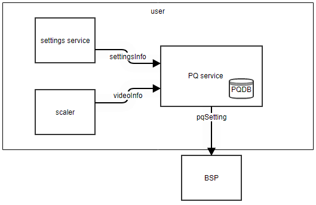

Requirements
************
This section describes the major functionalities of the PQ driver, as well as its operational flow and requirements.

HDR
^^^
| The PQ driver sets the picture quality for HDR video signal. The PQ driver controls blocks such as tone mapping, EOTF, OETF, and etc to set the picture quality suitable for HDR video.

| The following picture shows a typical HDR block.
| It can be classified into three types depending on how it operates.
| 1. Provide histogram information of video
| 2. Set tone, color compensation, and 3D lut values
| 3. Set EOTF and OETF values

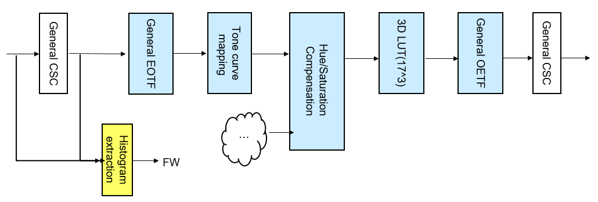

| The control of HDR block is performed by the following extended API:

* :c:macro:`V4L2_CID_EXT_HDR_PIC_INFO`
* :c:macro:`V4L2_CID_EXT_HDR_3DLUT`
* :c:macro:`V4L2_CID_EXT_HDR_TONEMAP`
* :c:macro:`V4L2_CID_EXT_HDR_COLOR_CORRECTION`

Functional Requirements
-----------------------

Provide histogram information of video
"""""""""""""""""""""""""""""""""""""""""
| The PQ driver must provide the histogram information of the video signal before the hdr block. And, this histogram information must be transmitted through the :c:macro:`V4L2_CID_EXT_HDR_PIC_INFO` function.
| More details about histograms will be discussed with the PQ team.
| Because this histogram information is used to calculate the tone mapping curve, it continues to be called periodically while the HDR video is played.

Set tone, color compensation, and 3D lut values
""""""""""""""""""""""""""""""""""""""""""""""""""
| The PQ driver must control the HW block such as Tone curve mapping, Hue/Saturation Compensation, 3D LUT.
| A function to control each block must be provided as shown below.
| When the webos platform transmits the data to be set in each H/W block through the CID below, the pq driver must set the corresponding value in the H/W block.

+-------------------------------+----------------------------------------------+
| Tone curve mapping            |:c:macro:`V4L2_CID_EXT_HDR_TONEMAP`           |
+-------------------------------+----------------------------------------------+
| Hue/Saturation Compensation   |:c:macro:`V4L2_CID_EXT_HDR_COLOR_CORRECTION`  |
+-------------------------------+----------------------------------------------+
| 3D LUT                        |:c:macro:`V4L2_CID_EXT_HDR_3DLUT`             |
+-------------------------------+----------------------------------------------+

| An example flow that controls ToneMap and 3D LUT is as follows:

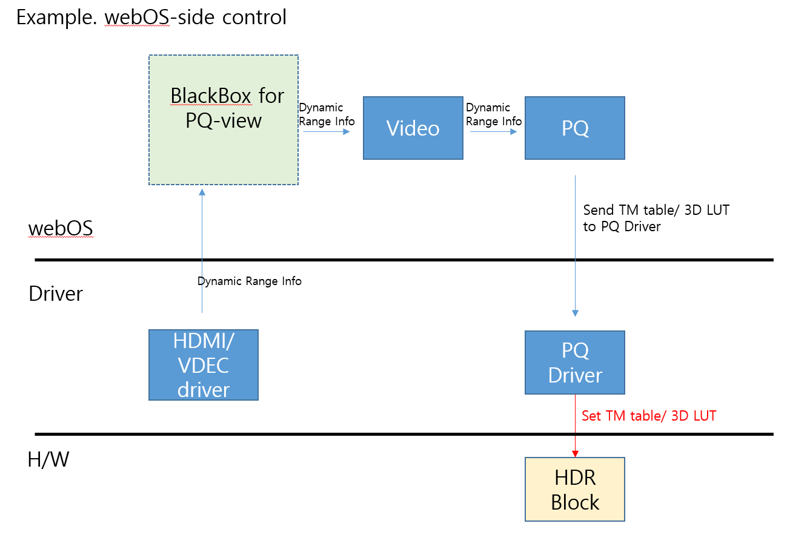

Set EOTF and OETF values
"""""""""""""""""""""""""""
| The PQ driver must control EOTF and OETF block.
| Generally, different LUTs are applied to SDR and HDR signals. The PQ driver must have a LUT to set according to the signal, and the LUT can be provided from the LG picture quality team.
| Since these EOTF and OETF are not set in the webos platform, the PQ driver needs to know what the current signal is. You must obtain the signal's dynamic range information from the VSC or decoder driver and set a LUT that matches the dynamic range information.
| An example flow that controls EOFT and OETF is as follows:

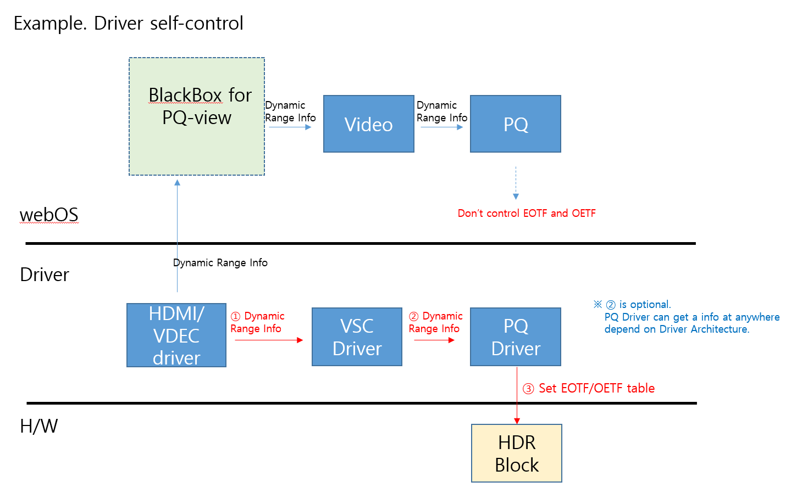

Quality and Constraints
-----------------------
| V4L2_CID_EXT_HDR_3DLUT and V4L2_CID_EXT_HDR_TONEMAP is called per 30ms. But if the data of parameter is same as previous call, call will be skipped.
| There should be no transient in video when V4L2_CID_EXT_HDR_3DLUT and V4L2_CID_EXT_HDR_TONEMAP setting.
|

LED
^^^^^^^^^^^^

| The LED driver sets the data related to LD(Local Dimming) controls. It has functionalities control and coefficient setting.

| LED APIs can be grouped by the use case and characteristics

Functional Requirements
-----------------------

Initialize
""""""""""""

Usually during STR or STD booting, following extended API will be called for LED initialization.
But when webOS's panel configuration changes, those API can be also called again with different setting data.
Driver should change the LD configuration and finish the initiation.

* :c:macro:`V4L2_CID_EXT_LED_INIT`
* :c:macro:`V4L2_CID_EXT_LED_EN`
* :c:macro:`V4L2_CID_EXT_LED_DB_DATA`

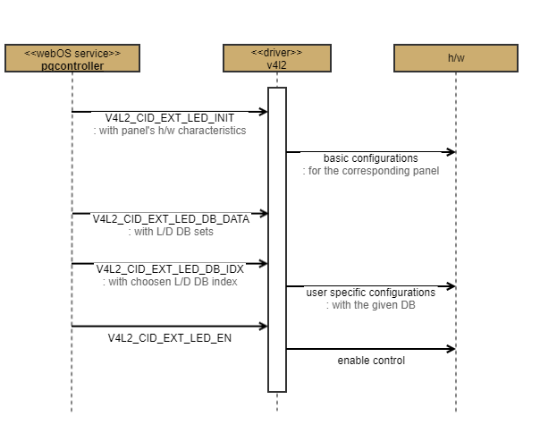

Changing detail coefficients
""""""""""""""""""""""""""""""

While input signal or UI value is changed, webOS can change the coefficients. Except user or input signal's change, light sensor data or image analysis value like histogram, may call following API.
To check the trigger's changes, webOS use polling thread having 30~50ms interval. So driver should process the APIs in 30ms as a worst case.

* :c:macro:`V4L2_CID_EXT_LED_DB_IDX`
* :c:macro:`V4L2_CID_EXT_LED_BPL_DATA`
* :c:macro:`V4L2_CID_EXT_LED_CONTROL_SPI`
* :c:macro:`V4L2_CID_EXT_LED_ABI`

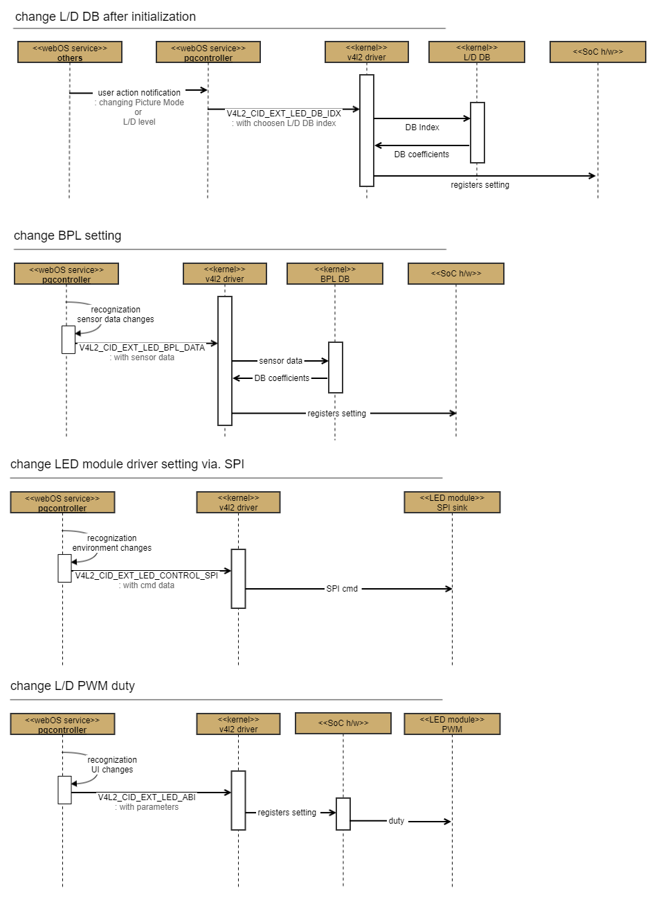

Special mode
""""""""""""""

It's not used for normal customers. Only in special use case like a manufacture site, it can be called.
Driver should switch the normal/special mode by following API.

* :c:macro:`V4L2_CID_EXT_LED_DEMOMODE`

Analysis value reporting
""""""""""""""""""""""""""

webOS monitors some reports sent by LD H/W analyzer like APL(Average Peak Level). The monitor thread's polling interval is 30~50ms. Following APSs are used for the monitoring.
So driver should send the given value from H/W without any delay.

* :c:macro:`V4L2_CID_EXT_LED_APL_DATA`

Quality and Constraints
-----------------------
| Every V4L2 functions should return the return-value in 50ms
| If a setting change that requires video frame and sync occurs, you must save the setting data, return to v4l2, and then change the setting value to match the video blank section.

DOLBY
^^^^^^^^^^^^

| The DOLBY driver sets webOS's dolby vision profile and changes some PQ related settings
| All details are done through DOLBY IP and the driver must be able to control DOLBY IP.

Functional Requirements
-----------------------

Profile configuration by model
""""""""""""""""""""""""""""""""

webOS has profiles based on the hardware characteristics of various models,
and tells DOLBY IP which profile webOS currently wants to use.

* :c:macro:`V4L2_CID_EXT_DOLBY_CFG_PATH`
* :c:macro:`V4L2_CID_EXT_DOLBY_GD_DELAY`

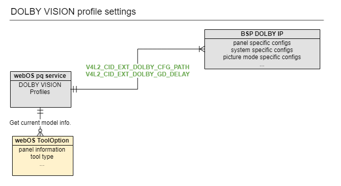

Settings by user scenario
"""""""""""""""""""""""""""

Some Dolby PQ settings can be changed by user's choice or their use case.
webOS transmits the user's operation status to Dolby IP through the driver,
allowing Dolby IP to change the picture quality value to suit the user's situation(or choice).

* :c:macro:`V4L2_CID_EXT_DOLBY_PICTURE_MODE`
* :c:macro:`V4L2_CID_EXT_DOLBY_PICTURE_MENU`
* :c:macro:`V4L2_CID_EXT_DOLBY_PWM_RATIO`
* :c:macro:`V4L2_CID_EXT_DOLBY_AMBIENT_LIGHT`
* :c:macro:`V4L2_CID_EXT_DOLBY_PD_CTRL`

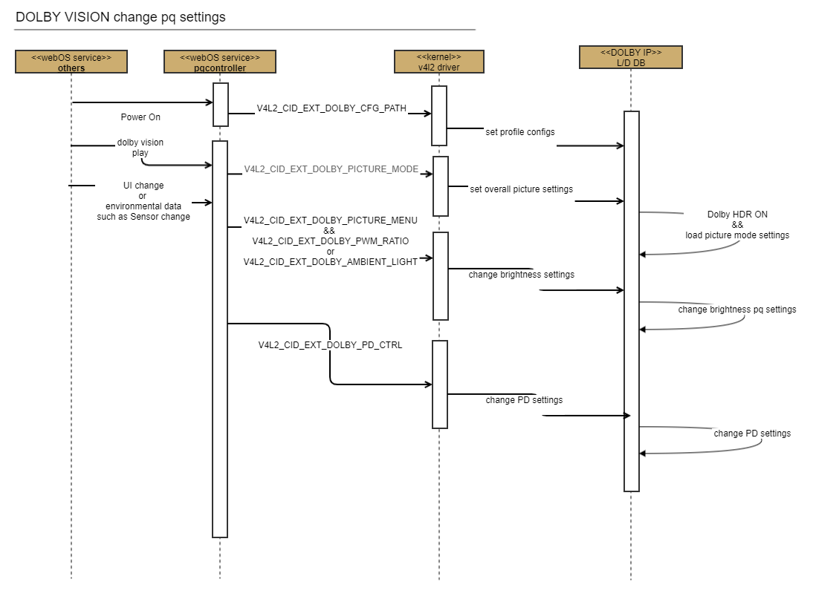

Query to Dolby IP
"""""""""""""""""""

Sometimes webOS needs information that only Dolby IP has.
The driver must forward these requests to Dolby IP and notify webOS of the query response.

* :c:macro:`V4L2_CID_EXT_DOLBY_SW_VERSION`
* :c:macro:`V4L2_CID_EXT_DOLBY_CONTENTS_TYPE`

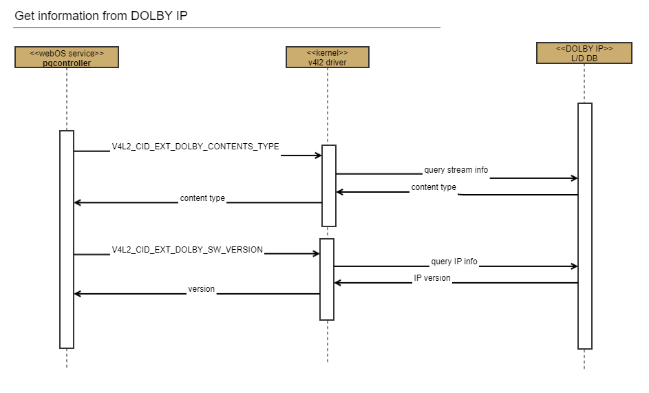

Quality and Constraints
-----------------------
| Every V4L2 functions should return the return-value in 50ms
| If a setting change that requires video frame and sync occurs, you must save the setting data, return to v4l2, and then change the setting value to match the video blank section.

MEMC
^^^^^^^^^^^^

| The MEMC driver controls ME(Motion Estimation) and MC(Motion Compensation) block
| It allows to make new interpolation video frames or modify original frames

| The control of MEMC block is performed by the following extended API:

* :c:macro:`V4L2_CID_EXT_MEMC_INIT`
* :c:macro:`V4L2_CID_EXT_MEMC_LOW_DELAY_MODE`
* :c:macro:`V4L2_CID_EXT_MEMC_MOTION_COMP`
* :c:macro:`V4L2_CID_EXT_MEMC_MOTION_PRO`

Functional Requirements
-----------------------

Typical MEMC
""""""""""""
In many display devices, such as TVs, it is important to improve the blurr and judder quality of the original video frame.
The typical MEMC driver must extract motion from the original video frame and control the de-blurr and de-judder functions.

Special video clearer using MEMC IP
"""""""""""""""""""""""""""""""""""
Like :c:macro:`V4L2_CID_EXT_MEMC_MOTION_PRO` feature,
webOS requires special funcionalities to make video clearer using MEMC IP.

Seamless MEMC low delay mode conversion
"""""""""""""""""""""""""""""""""""""""
:c:macro:`V4L2_CID_EXT_MEMC_LOW_DELAY_MODE` requires seamless mode change controlling the MEMC's delay(video latency).
When it changes the mode, MEMC's output should not have any video mute.

Quality and Constraints
-----------------------
| Every V4L2 functions should return the return-value in 50ms
| all others of MEMC_V4L2 can't work normally, while :c:macro:`V4L2_CID_EXT_VPQ_LOW_DELAY_MODE` or :c:macro:`V4L2_CID_EXT_MEMC_LOW_DELAY_MODE` is turned on.
| The driver should just save the API's input, while those LOW_DELAY_MODE is on.
| After :c:macro:`V4L2_CID_EXT_VPQ_LOW_DELAY_MODE` is turned off, the last saved API will work.

AIPQ
^^^^^^^^^^^^

| The AIPQ driver controls NPU and other PQ block together.
| They give informations measured from video frames by NPU to BSP's PQ drivers or webOS Platform's PQ service.
| With the given informations, PQ drivers or service can adjust PQ blocks.

| The control of AIPQ is performed by the following extended API:

* :c:macro:`V4L2_CID_EXT_AIPQ_DEPTH_MODE`
* :c:macro:`V4L2_CID_EXT_AIPQ_GENRE_INFO`
* :c:macro:`V4L2_CID_EXT_AIPQ_GENRE_MODE`
* :c:macro:`V4L2_CID_EXT_AIPQ_NPU_ENABLE`
* :c:macro:`V4L2_CID_EXT_AIPQ_SCENE_INFO`
* :c:macro:`V4L2_CID_EXT_AIPQ_SCENE_MODE`
* :c:macro:`V4L2_CID_EXT_AIPQ_SQM_MODE`
* :c:macro:`V4L2_CID_EXT_AIPQ_SR_MODE`

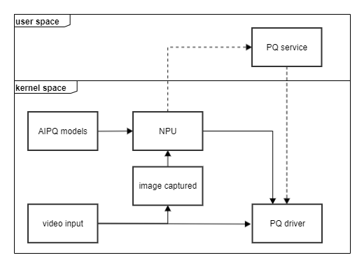

Functional Requirements
-----------------------

Measure image captured
""""""""""""""""""""""""
Except :c:macro:`V4L2_CID_EXT_AIPQ_NPU_ENABLE`, all the APIs should analyze the input video according to the given NPU models.
The pre/post processing of NPU can be decided by BSP self according to each feature's purpose.

Reporting informations measured
"""""""""""""""""""""""""""""""""
The NPU would deliver the final result to BSP's PQ driver or platform's PQ service.
If PQ driver recieve ths NPU's result, it'll do fine tunning the internal PQ data using the information.

Quality and Constraints
-----------------------
:c:macro:`V4L2_CID_EXT_AIPQ_NPU_ENABLE` is an API for NPU resource load balancing.
When an off request is received through this API,
the NPU must release all resources for AIPQ and stop the related PQ operations that are being started by other AIPQ API requests.
However, this is a temporary API and we plan to replace it by finding a better NPU load balancing method.

Basic Picture Control
^^^^^^^^^^^^^^^^^^^^^
| The PQ driver controls a basic picture quality. This includes Contrast, Brightness, Saturation(Color), and Hue(Tint).
| These functions are controled by :c:macro:`V4L2_CID_EXT_VPQ_PICTURE_CTRL`. And, the tuning data is delivered by putting it in :cpp:any:`v4l2_ext_vpq_picture_ctrl_data`.
| Each corresponding UI(User Interface) values are passed within picture_ui_value. And, The chipData_contrast, chipData_brightness, chipData_saturation and chipData_hue values are tunning data made by LG PQ Team.
| The range of each values are shown in the table below.

+------------------------------------+-----------------------+---------------------+
|                                    | UI value Range        | Tuning Value Range  |
+====================================+=======================+=====================+
| Contrast                           | 0 ~ 100               | 0 ~ 1023            |
+------------------------------------+-----------------------+---------------------+
| Brightness(LG UI : Black Level)    | 0 ~ 100               | 0 ~ 1023            |
+------------------------------------+-----------------------+---------------------+
| Saturation(LG UI : Color depth)    | 0 ~ 100               | 0 ~ 255             |
+------------------------------------+-----------------------+---------------------+
| Hue(LG UI : Tint)                  | -50 ~ 50 (R50 ~ G50)  | 0 ~ 255             |
+------------------------------------+-----------------------+---------------------+

Functional Requirements
-----------------------
Contrast
""""""""
| This is the difference between the bright and dark parts of the video.
| A large value means that the difference between the dark and bright parts is large.

Brightness(LG UI : Black Level)
"""""""""""""""""""""""""""""""
| This is the brightness of whole areas of the video.
| When the brightness is low, it is expressed as 'dark', and when the brightness is high, it is expressed as 'bright'
| See example below.

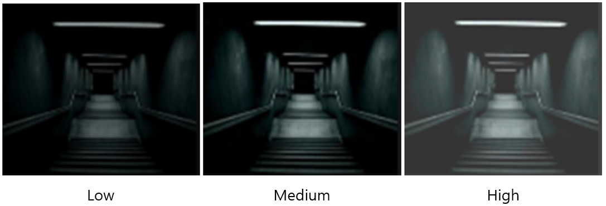

Saturation(LG UI : Color depth)
"""""""""""""""""""""""""""""""
| This is the color depth of the video.
| A large value means that video is more vivid color. If the value is 0, it is the black and white video.

Hue(LG UI : Tint)
"""""""""""""""""
| This is the color balance between red and green displayed on the screen
| A small value represents a redish image, and a large value represents a greenish image.

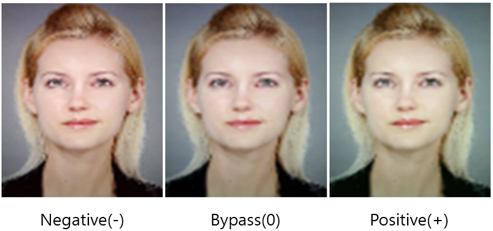

Quality and Constraints
-----------------------
| The PQ driver should process only what is necessary and return immediately. Actual register setting must be performed separately in the porch section.
| There should be no flicker transient during operation.

Low Delay Mode
^^^^^^^^^^^^^^
| The PQ driver should be support a Low Delay Mode. Low Delay Mode is the function to minimizes input delay time of the video and is used to implement Game mode.
| When a user executes game mode, :c:macro:`V4L2_CID_EXT_VPQ_LOW_DELAY_MODE` will be called with parameter TRUE. Then, the PQ driver must bypass all functions that may cause the frame delay.

Functional Requirements
-----------------------
| If Low Delay Mode enables, the PQ drvier must bypass the PQ block to minimizes frame delay. The PQ block causing frame delay may vary depending on the chip. Therefore, we need to find the block that has the frame delay, turn it off and bypass the signal.
| On the other hand, if Low Delay Mode disables, turn on that PQ block and process the signal.
| When turning on and off the PQ block, the garbage may occur in the video output, so the driver must mask the video with Video Mute.

Quality and Constraints
-----------------------
| There should be no flicker transient during operation.
| When Low Delay Mode is enable or disable, it should not affect other functions. For example, the :c:macro:`V4L2_CID_EXT_MEMC_LOW_DELAY_MODE` function in MEMC is a function to reduce the delay in the MEMC block.
| If Low Delay Mode is enabled while MEMC is reduction delay mode by :c:macro:`V4L2_CID_EXT_MEMC_LOW_DELAY_MODE`, the MEMC block must be turned off. And when Low Delay Mode is disabled again, the MEMC block should be turned on and the delay reduction should be maintained.

Frame Delay Mode
^^^^^^^^^^^^^^^^
| This function is for video wall installation scene to prevent screen difference between sets caused by PQ process timing of each set.
| When turn on Frame Delay Mode, :c:macro:`V4L2_CID_EXT_VPQ_FRAME_DELAY_MODE` will be called with parameter frame delay mode. Then, the PQ driver set Frame delay by force based on Low Delay Mode.

Functional Requirements
-----------------------
| If Frame Delay Mode enables, the PQ driver make frame delay by force. Frame delay time depends on input video timing. For Example, On 60Hz input 1 frame delay will be 16.67ms. On 30Hz input, 1 frame delay will be ≈33.33ms.
| If Frame Delay Mode disabled, Delay mode will depend on Low Delay Mode, MEMC Delay Mode.

Quality and Constraints
-----------------------
| Maybe there will be black mute during operation for a while. Because the PQ driver should set video sync again,  video output setting will be changed. So black mute will be shown while re-sync video timing.
| The PQ driver should process only what is necessary and return immediately.

IRE TEST PATTERN
^^^^^^^^^^^^^^^^^^^^^
| The PQ driver should display the IRE(Institute of Radio Engineer) Inner Pattern. This functions are controled by :c:macro:`V4L2_CID_EXT_VPQ_TESTPATTERN`.
| A value of 100IRE indicates a white level of a video signal, and 0IRE indicates a blanking level. It has a range of 0-100 as a relative standard for Black & White. (White: 100IRE, Black: 1IRE)

Functional Requirements
-----------------------
| This test pattern is gray-scale pattern. And since it is used to adjust gamma, it must be generated before the GAMMA block.
| The value of IRE pattern is defined in :cpp:any:`v4l2_ext_vpq_inner_pattern_ire`.
| V4L2_EXT_VPQ_INNER_PATTERN_DISABLE means do not display the pattern. And, it is the default value of PQ driver.
| Other values from V4L2_EXT_VPQ_INNER_PATTERN_IRE_0 to V4L2_EXT_VPQ_INNER_PATTERN_IRE_100 mean displaying the test pattern and the number at the end of string indicates the IRE level of pattern.
| The 24-point IRE inner pattern is distinguished from V4L2_EXT_VPQ_INNER_PATTERN_24P_BASE.
| V4L2_EXT_VPQ_INNER_PATTERN_24P_BASE is the starting base value used for the 24-point IRE inner pattern.
| V4L2_EXT_VPQ_INNER_PATTERN_24P_DISABLE means do not display the pattern for 24-point IRE inner pattern. And, it is the default value of PQ driver for 24-point IRE inner pattern.
| Other values from V4L2_EXT_VPQ_INNER_PATTERN_24P_IRE_0 to V4L2_EXT_VPQ_INNER_PATTERN_24P_IRE_100 means displaying the test pattern for 24-point IRE and the number at the end of string indicates the IRE level of pattern.

Quality and Constraints
-----------------------
| There must be no flicker or transient or garbage at video when turning patterns on and off or changing IRE levels.
| It must operate independently of other video patterns. Taking the Video Mute pattern as an example, the IRE test pattern often conflicts with the Video Mute pattern. Typically, a internal black pattern is used for Video Mute. The IRE pattern must be display during Viedo Mute. Also, the IRE pattern must not disappear when Video Mute pattern is erased.

PQ MODE INFO
^^^^^^^^^^^^
| It is necessary to transmit information about PQ mode to the PQ driver. :c:macro:`V4L2_CID_EXT_VPQ_PQ_MODE_INFO` is used to read or write information about PQ mode.
| Currently, information about the PQ mode is delivered as an array with a size of 5, but the size of the array can be changed. The current item list is below.

+--------------------+---------------------+
| Index of Array     | Item                |
+====================+=====================+
| 0                  | HDR Mode            |
+--------------------+---------------------+
| 1                  | Colorimetry         |
+--------------------+---------------------+
| 2                  | Reserved            |
+--------------------+---------------------+
| 3                  | Reserved            |
+--------------------+---------------------+
| 4                  | Reserved            |
+--------------------+---------------------+

Functional Requirements
-----------------------

HDR Mode
"""""""""
| This is a information about the dynamic range of the current video. This value is as follows and is defined in :cpp:any:`v4l2_ext_hdr_mode`.

+-----------+----------------+
| Value     | Dynamic Range  |
+===========+================+
| 0         | SDR            |
+-----------+----------------+
| 1         | Dolby Vision   |
+-----------+----------------+
| 2         | HDR10          |
+-----------+----------------+
| 3         | HLG            |
+-----------+----------------+
| 4         | Technicolor    |
+-----------+----------------+
| 5         | HDR Effect     |
+-----------+----------------+

| When the PQ driver receives this value, PQ driver must compare it with the dynamic range value currently used by the driver and check whether there are any abnormalities.
| In general, the PQ driver receives dynamic range values from the Scaler driver, so the two values may be different.
| In a situation where stable video is output rather than a video transient section, if the two values are different, the PQ driver must perform appropriate error processing.

Colorimetry
"""""""""""
| This is a information about the colorimetry info of the current video. This value is as follows and is defined in :cpp:any:`v4l2_ext_colorimetry_info`.

+-----------+----------------+
| Value     | Colorimetry    |
+===========+================+
| 0         | BT601          |
+-----------+----------------+
| 1         | BT709          |
+-----------+----------------+
| 2         | BT2020         |
+-----------+----------------+

| If PQ Driver needs a colorimetry information, this value can be used.
| In general, since colorimetry information is already reflected in PQ tuning data, there are no special requirements for colorimetry processing in this function.

Quality and Constraints
-----------------------
| When requesting PQ Mode Info via VIDIOC_G_EXT_CTRLS, the PQ Driver should not simply return the HDR Mode information previously received via VIDIOC_S_EXT_CTRLS.
| The PQ Driver must return the HDR Mode information being used in the current setup.

Implementation
**************

| This section provides materials that are useful for PQ implementation.

- The File Location section provides the location of the Git repository where you can get the header file in which the interface for the PQ implementation is defined.
- The API List section provides a brief summary of PQ APIs that you must implement.
- The Implementation Details section sets implementation guidance and example code for some major functionalities.
- The Status Log section provides information about the PQ status log file which is used for examining the status and operation of PQ.

File Location
^^^^^^^^^^^^^

The PQ interfaces are defined in the v4l2-ext-pq.h header file, which can be obtained from https://swfarmhub.lge.com/.

- Git repository: bsp/ref/v4l2-ext-Picturequality-header
- Location: [as_installed]/linux/v4l2-ext-pq.h

V4L2 API Implementation Guide
^^^^^^^^^^^^^^^^^^^^^^^^^^^^^

| V4L2 API sends various values to the BSP.
| data structure should be defined each BSP and application side.
| If data is not defined, it could be sent NULL or default values.
| If data is not defined or wrong data, BSP should work with UI value only.

- UI Setting Value : The values set by the user through the TV UI settings.
- Tunning Data : made by LG or others.
- Chip Data : Chip datas are different each SoC, need to define data structure for each SoC. 

API List
^^^^^^^^

Data Types
----------

Extended V4L2 Structures
""""""""""""""""""""""""

The following table lists the LG extended V4L2 struct types.

============================================================= ===================================================================================================
Structure                                                     Description
============================================================= ===================================================================================================
:cpp:any:`v4l2_ext_vpq_cmn_data`  	                          Describes
:cpp:any:`v4l2_ext_led_panel_info`                            Contains the information required to initialize the local dimming block.
:cpp:any:`v4l2_ext_led_ldim_demo_info`                        Contains the information for controlling the local dimming demo.
:cpp:any:`v4l2_ext_led_apl_info`                              Contains the apl information of local dimming block.
:cpp:any:`v4l2_ext_led_spi_ctrl_info`                         Contains the control data of spi in local dimming
:cpp:any:`v4l2_ext_led_bpl_info`                              Contains the bpl info of local dimming
:cpp:any:`v4l2_ext_led_abi_settings`                          Contains the setting data for ABI function
:cpp:any:`v4l2_ext_led_abi_ctrl`                              Contains the control data for ABI function
:cpp:any:`v4l2_ext_memc_motion_comp_info`                     Contains the control data for motion compensation of MEMC
:cpp:any:`v4l2_ext_hdr_color_correction`                      Contains the setting value of HDR color correction
:cpp:any:`v4l2_ext_pq_mode_info`                              Contains the information of PQ mode
:cpp:any:`v4l2_ext_hdr_tonemap`                               Contains the setting data for HDR tone-map
:cpp:any:`v4l2_ext_hdr_3dlut`                                 Contains the setting data for HDR 3D LUT
:cpp:any:`v4l2_ext_dolby_config_path`                         Contains the path information of dolby configuration file
:cpp:any:`v4l2_ext_dolby_picture_mode`                        Contains the picture mode and on/off information for dolby
:cpp:any:`v4l2_ext_dolby_picture_data`                        Contains the information of picture menu for dolby
:cpp:any:`v4l2_ext_dolby_gd_delay`                            Contains the delay information of each video type
:cpp:any:`v4l2_ext_dolby_gd_delay_lut`                        Contains the delay information of each picture mode
:cpp:any:`v4l2_ext_dolby_gd_delay_param`                      Contains full delay information
:cpp:any:`v4l2_ext_dolby_ambient_light_param`                 Contains the control data for dolby ambient light
:cpp:any:`v4l2_ext_vpq_dc2p_histodata_info`                   Contains the histogram information of video
:cpp:any:`v4l2_ext_vpq_color_temp`                            Contains the setting data for color temperature function
:cpp:any:`v4l2_ext_vpq_gamut_add_info`                        Contains the additional information for color gamut
:cpp:any:`v4l2_ext_vpq_gamut_lut`                             Contains the setting data for color gamut
:cpp:any:`v4l2_ext_oled_luminance_boost`                      Contains the setting data for OLED luminance boost
:cpp:any:`v4l2_ext_vpq_block_bypass`                          Contains the bypass information of PQ Block
:cpp:any:`v4l2_ext_vpq_od`                                    Contains the setting data for OD
:cpp:any:`v4l2_ext_vpq_od_extension`                          Contains the setting data for POD and LOD
:cpp:any:`v4l2_ext_gamma_lut`                                 Contains the setting value of Gamma
:cpp:any:`v4l2_ext_csc_mux_lut`                               Contains the setting value for CSC Mux
:cpp:any:`v4l2_ext_gamut_post`                                Contains the control data for Gamut
:cpp:any:`v4l2_ext_cm_dynamic_color_ui`                       Contains the ui value of dynamic color(LG UI : Color Adjustment)
:cpp:any:`v4l2_ext_cm_perferred_color_ui`                     Contains the ui value of preferred color
:cpp:any:`v4l2_ext_cm_cms_ui`                                 Contains the ui value of color management
:cpp:any:`v4l2_ext_cm_ui_status`                              Contains the ui value of dynamic color(LG UI : Color Adjustment), preferred color, color management
:cpp:any:`v4l2_ext_cm_info`                                   Contains the control data for color management
:cpp:any:`v4l2_ext_dynamnic_contrast_ctrl`                    Contains the setting data for dynamic contrast
:cpp:any:`v4l2_ext_dynamnic_contrast_lut`                     Contains the lut for dynamic contrast
:cpp:any:`v4l2_ext_vpq_black_level_info`                      Contains the control data for black level(LG UI : Video Range) (Old)
:cpp:any:`v4l2_ext_vpq_black_level_info_v2`                   Contains the control data for black level(LG UI : Video Range) (New)
:cpp:any:`v4l2_ext_vpq_picture_ctrl_data`                     Contains the setting data for contrast, brightness(LG UI : Black level), saturation(LG UI : Color depth), and hue(LG UI : Tint)
:cpp:any:`v4l2_ext_vpq_super_resolution_data`                 Contains the setting data for super resolution
:cpp:any:`v4l2_ext_vpq_mpeg_noise_reduction_data`             Contains the setting data for MPEG noise reduction
:cpp:any:`v4l2_ext_vpq_decontour_data`                        Contains the setting data for de-contour(LG UI : Smooth Gradation)
:cpp:any:`v4l2_ext_vpq_sharpness_data`                        Contains the setting data for sharpness
:cpp:any:`v4l2_ext_vpq_noise_reduction_data`                  Contains the setting data for noise reduction
:cpp:any:`v4l2_vpq_ext_pattern_gradation_line_attr`           Contains the line information of gradation for Test Pattern
:cpp:any:`v4l2_vpq_ext_pattern_gradation_info`                Contains the information of gradation for Test Pattern
:cpp:any:`v4l2_vpq_ext_pattern_winbox_win_attr`               Contains the information of window for Test Pattern
:cpp:any:`v4l2_vpq_ext_pattern_winbox_info`                   Contains the information of multiple windows for Test Pattern
:cpp:any:`v4l2_vpq_ext_pattern_info`                          Contains the information of gradation and windows for for Test Pattern (Old)
:cpp:any:`v4l2_vpq_ext_pattern_info_v2`                       Contains the information of gradation and windows for for Test Pattern (New)
:cpp:any:`v4l2_ext_vpq_register_data`                         Contains the data for controlling the register
:cpp:any:`v4l2_ext_vpq_register_ctrl`                         Contains the multiple v4l2_ext_vpq_register_data
:cpp:any:`v4l2_ext_vpq_delta_brightness_conpensation_lut`     Contains the setting data for delta brightness compensation
:cpp:any:`v4l2_ext_vpq_degamma_regamma`                       Contains the setting data for degamma regamma
:cpp:any:`v4l2_ext_vpq_frame_delay_mode`                      Contains the setting data for frame delay mode data
============================================================= ===================================================================================================

Extended V4L2 Enumerations
""""""""""""""""""""""""""

The following table lists the LG extended V4L2 enum types.

====================================================== ===================================================================================================
Enumeration                                            Description
====================================================== ===================================================================================================
:cpp:any:`v4l2_ext_led_localdimming_demo_type`         Deprecated - Defines the demo type of Local Dimming
:cpp:any:`v4l2_ext_led_backlight_type`                 Defines the type of the backlight
:cpp:any:`v4l2_ext_led_panel_inch_type`                Defines the size of the panel
:cpp:any:`v4l2_ext_led_bar_type`                       Defines the LED bar type of the panel
:cpp:any:`v4l2_ext_led_module_maker_type`              Defines the module maker
:cpp:any:`v4l2_ext_led_lut_number_type`                Deprecated
:cpp:any:`v4l2_ext_led_ldim_ic`                        Defines the type of the local dimming IC
:cpp:any:`v4l2_ext_led_wcg_panel_type`                 Defines the panel type
:cpp:any:`v4l2_ext_led_ldim_demo_type`                 Defines the demo type of Local Dimming
:cpp:any:`v4l2_ext_memc_type_old`                      Defines the MEMC type (Old)
:cpp:any:`v4l2_ext_memc_type`                          Defines the MEMC type (New)
:cpp:any:`v4l2_ext_vpq_rgb_index`                      Defines the order of RED, GREEN, BLUE.
:cpp:any:`v4l2_ext_hdr_mode`                           Defines the type of HDR mode
:cpp:any:`v4l2_ext_colorimetry_info`                   Defines the type of colorimetry info
:cpp:any:`v4l2_ext_dolby_config_type`                  Defines the config type of dolby
:cpp:any:`v4l2_ext_dolby_picture_menu`                 Defines the index of picture menu for dolby
:cpp:any:`v4l2_ext_vpq_inner_pattern_ire`              Defines the IRE value of inner pattern
:cpp:any:`v4l2_ext_vpq_input`                          Defines the input type
:cpp:any:`v4l2_ext_cm_dynamic_color_level`             Defines the type of dynamic color(UI : Color Adjustment) menu
:cpp:any:`v4l2_ext_cm_perferred_color_type`            Defines the order of SKIN, GRASS, SKYBLUE menu
:cpp:any:`v4l2_ext_cm_cms_color_type`                  Defines the color type of color management menu
:cpp:any:`v4l2_ext_vpq_black_level_type`               Defines the type of the black level(UI : Video Range) (Old)
:cpp:any:`v4l2_ext_vpq_black_level_type_v2`            Defines the type of the black level(UI : Video Range) (New)
:cpp:any:`v4l2_ext_vpq_picture_ctrl_type`              Defines the order of basic picture control
:cpp:any:`V4L2_VPQ_EXT_PATTERN_MODE`                   Defines the type of Test Pattern
:cpp:any:`V4L2_VPQ_EXT_PATTERN_GRADATION_DIRECTION`    Defines the direction of gradation for Test Pattern
:cpp:any:`v4l2_ext_aipq_mode`                          Defines the mode of AIPQ
:cpp:any:`v4l2_ext_aipq_scene_info`                    Defines the type of the scene info
:cpp:any:`v4l2_ext_aipq_genre_info`                    Defines the type of the genre info
====================================================== ===================================================================================================

Functions
---------

Standard V4L2 Functions
"""""""""""""""""""""""

The following table lists the Linux standard V4L2 functions.

===================================================================================================================================================================================== ===================================================================================================
Funtion                                                                                                                                                                               Description
===================================================================================================================================================================================== ===================================================================================================
`V4L2 open() <https://linuxtv.org/downloads/v4l-dvb-apis/userspace-api/v4l/func-open.html>`_                                                                                          Opens a V4L2 device.
`V4L2 close() <https://linuxtv.org/downloads/v4l-dvb-apis/userspace-api/v4l/func-close.html>`_                                                                                        Closes a V4L2 device.
`ioctl VIDIOC_G_CTRL <https://linuxtv.org/downloads/v4l-dvb-apis/userspace-api/v4l/vidioc-g-ctrl.html#vidioc-g-ctrl>`_                                                                Gets or Sets the value of a control.
`ioctl VIDIOC_S_CTRL <https://linuxtv.org/downloads/v4l-dvb-apis/userspace-api/v4l/vidioc-g-ctrl.html#vidioc-g-ctrl>`_                                                                Gets or Sets the value of a control.
`ioctl VIDIOC_G_EXT_CTRLS <https://linuxtv.org/downloads/v4l-dvb-apis/userspace-api/v4l/vidioc-g-ext-ctrls.html#vidioc-g-ext-ctrls>`_                                                 Gets or sets the value of several controls.
`ioctl VIDIOC_S_EXT_CTRLS <https://linuxtv.org/downloads/v4l-dvb-apis/userspace-api/v4l/vidioc-g-ext-ctrls.html#vidioc-g-ext-ctrls>`_                                                 Gets or sets the value of several controls.
`ioctl VIDIOC_DQEVENT <https://linuxtv.org/downloads/v4l-dvb-apis/userspace-api/v4l/vidioc-dqevent.html#vidioc-dqevent>`_                                                             Dequeues an event from a video device.
`ioctl VIDIOC_QUERYCAP <https://linuxtv.org/downloads/v4l-dvb-apis/userspace-api/v4l/vidioc-querycap.html#vidioc-querycap>`_                                                          Queries device capabilities.
===================================================================================================================================================================================== ===================================================================================================

Extended V4L2 Controls for PQ_LED
"""""""""""""""""""""""""""""""""

The following table lists the LG extended V4L2 controls.

=================================================================== ===================================================================================================
Control ID                                                          Description
=================================================================== ===================================================================================================
:c:macro:`V4L2_CID_EXT_LED_INIT`                                    Initialize the LED block using the given information
:c:macro:`V4L2_CID_EXT_LED_DB_IDX`                                  Control local dimming level by lut index
:c:macro:`V4L2_CID_EXT_LED_DEMOMODE`                                Control local dimming demo mode
:c:macro:`V4L2_CID_EXT_LED_EN`                                      Control local dimming block on/off
:c:macro:`V4L2_CID_EXT_LED_DB_DATA`                                 Set Local Dimming DB Look up table
:c:macro:`V4L2_CID_EXT_LED_CONTROL_SPI`                             Control SPI command bit
:c:macro:`V4L2_CID_EXT_LED_APL_DATA`                                Get Local Dimming APL value
:c:macro:`V4L2_CID_EXT_LED_BPL_DATA`                                Set/Get BPL DATA
:c:macro:`V4L2_CID_EXT_LED_ABI`                                     Set/Get ABI(Adaptive BlackFrame Insertion) control
=================================================================== ===================================================================================================

Extended V4L2 Controls for PQ_MEMC
""""""""""""""""""""""""""""""""""

The following table lists the LG extended V4L2 controls.

=================================================================== ===================================================================================================
Control ID                                                          Description
=================================================================== ===================================================================================================
:c:macro:`V4L2_CID_EXT_MEMC_INIT`                                   Defines the Control ID to initialize the MEMC(Motion Estimation Motion Compensation) block.
:c:macro:`V4L2_CID_EXT_MEMC_LOW_DELAY_MODE`                         Defines the Control ID to set/get the control of frame delay
:c:macro:`V4L2_CID_EXT_MEMC_MOTION_COMP`                            Defines the Control ID to set/get the MEMC(Motion Estimation Motion Compensation) level.
:c:macro:`V4L2_CID_EXT_MEMC_MOTION_PRO`                             Defines the Control ID to set/get the control of Motion Pro.
=================================================================== ===================================================================================================

Extended V4L2 Controls for PQ_HDR
"""""""""""""""""""""""""""""""""

=================================================================== ===================================================================================================
Control ID                                                          Description
=================================================================== ===================================================================================================
:c:macro:`V4L2_CID_EXT_HDR_PIC_INFO`                                Get histogram in front of hdr block
:c:macro:`V4L2_CID_EXT_HDR_3DLUT`                                   Set Tone Mapping Look up table(3D LUT) in HDR Block
:c:macro:`V4L2_CID_EXT_HDR_TONEMAP`                                 Set Tone Mapping data table
:c:macro:`V4L2_CID_EXT_HDR_COLOR_CORRECTION`                        Control hue shift & saturation compensation block
:c:macro:`V4L2_CID_EXT_HDR_HLG_Y_GAIN_TBL`                          Set HLG Y Gain table
:c:macro:`V4L2_CID_EXT_HDR_LOCAL_TONEMAP`                           Set Local Tone Mapping data table
=================================================================== ===================================================================================================

Extended V4L2 Controls for PQ_DOLBY
"""""""""""""""""""""""""""""""""""

=================================================================== ===================================================================================================
Control ID                                                          Description
=================================================================== ===================================================================================================
:c:macro:`V4L2_CID_EXT_DOLBY_CFG_PATH`                              Set path of Dolby Picture configuration file
:c:macro:`V4L2_CID_EXT_DOLBY_PICTURE_MODE`                          Set Dolby HDR On/Off and Dolby Picture Mode
:c:macro:`V4L2_CID_EXT_DOLBY_PICTURE_MENU`                          Set Dolby HDR On/Off and Picture Menu value
:c:macro:`V4L2_CID_EXT_DOLBY_SW_VERSION`                            Get dolby software version
:c:macro:`V4L2_CID_EXT_DOLBY_PWM_RATIO`                             Pass the dimming info
:c:macro:`V4L2_CID_EXT_DOLBY_GD_DELAY`                              Set delay table value
:c:macro:`V4L2_CID_EXT_DOLBY_AMBIENT_LIGHT`                         Setting on/off flag and sensor raw data and lux data
:c:macro:`V4L2_CID_EXT_DOLBY_CONTENTS_TYPE`                         Get the Dolby Vision contents type metadata
:c:macro:`V4L2_CID_EXT_DOLBY_PD_CTRL`                               Set the Dolby Precision Rendering on/off
=================================================================== ===================================================================================================

Extended V4L2 Controls for PQ_VPQ
"""""""""""""""""""""""""""""""""

=================================================================== ===================================================================================================
Control ID                                                          Description
=================================================================== ===================================================================================================
:c:macro:`V4L2_CID_EXT_VPQ_INIT`                                    Defines the Control ID to initialize the VPQ(Video Picture Quality) module.
:c:macro:`V4L2_CID_EXT_VPQ_PICTURE_CTRL`                            Defines the Control ID to set/get the picture controls.
:c:macro:`V4L2_CID_EXT_VPQ_SHARPNESS`                               Set sharpness
:c:macro:`V4L2_CID_EXT_VPQ_HISTO_DATA`                              Get histogram data
:c:macro:`V4L2_CID_EXT_VPQ_DYNAMIC_CONTRAST`                        Set Contrast(luma, Y) Enhancement control
:c:macro:`V4L2_CID_EXT_VPQ_DYNAMIC_CONTRAST_LUT`                    Set Contrast(luma, Y) Enhancement LUT(lookup table)
:c:macro:`V4L2_CID_EXT_VPQ_CM_DB_DATA`                              Set color management parameters
:c:macro:`V4L2_CID_EXT_VPQ_NOISE_REDUCTION`                         Set noise reduction
:c:macro:`V4L2_CID_EXT_VPQ_MPEG_NOISE_REDUCTION`                    Set Mpeg NR
:c:macro:`V4L2_CID_EXT_VPQ_BYPASS_BLOCK`                            Defines the Control ID to set/get bypass pq(picture quility) blocks.
:c:macro:`V4L2_CID_EXT_VPQ_BLACK_LEVEL`                             Set the Black Level of ATV and Video Range of Others
:c:macro:`V4L2_CID_EXT_VPQ_GAMMA_DATA`                              Set gamma LUT data
:c:macro:`V4L2_CID_EXT_VPQ_SUPER_RESOLUTION`                        Set Super Resolution
:c:macro:`V4L2_CID_EXT_VPQ_LOW_DELAY_MODE`                          Defines the Control ID to set/get the control of Game Mode.
:c:macro:`V4L2_CID_EXT_VPQ_DYNAMIC_CONTRAST_COLOR_GAIN`             Set Color Gain for Auto Dynamic Contrast
:c:macro:`V4L2_CID_EXT_VPQ_TESTPATTERN`                             Set IRE Inner Pattern
:c:macro:`V4L2_CID_EXT_VPQ_COLORTEMP_DATA`                          Set offset and gain value of RGB for adjusting Colortemperature
:c:macro:`V4L2_CID_EXT_VPQ_REAL_CINEMA`                             Control the Film Detection
:c:macro:`V4L2_CID_EXT_VPQ_GAMUT_3DLUT`                             Set color gamut LUT
:c:macro:`V4L2_CID_EXT_VPQ_OD_TABLE`                                Control look up table for OD
:c:macro:`V4L2_CID_EXT_VPQ_OD_EXTENSION`                            Control LUT for OD extension POD or PCID
:c:macro:`V4L2_CID_EXT_VPQ_LOCALCONTRAST_TABLE`                     Set LUT table of local contrast of LG SoC
:c:macro:`V4L2_CID_EXT_VPQ_LOCALCONTRAST_DATA`                      Control Local Contrast
:c:macro:`V4L2_CID_EXT_VPQ_GAMUT_MATRIX_POST`                       Set 3x3 Matrix for adjust color gamut
:c:macro:`V4L2_CID_EXT_VPQ_PQ_MODE_INFO`                            Defines the Control ID to set/get mode info of PQ(Picture Quility).
:c:macro:`V4L2_CID_EXT_VPQ_LUMINANCE_BOOST`                         Control video 10to11-bit conversion block registers
:c:macro:`V4L2_CID_EXT_VPQ_OBC_DATA`                                Get object data for Object based contrast
:c:macro:`V4L2_CID_EXT_VPQ_OBC_LUT`                                 Set Foreground/Background LUT to OBC/OBE(Object Based Contrast)
:c:macro:`V4L2_CID_EXT_VPQ_OBC_CTRL`                                Set OBC/OBE(Object Based Contrast) control
:c:macro:`V4L2_CID_EXT_VPQ_DECONTOUR`                               Control the De-Contour( LG UI : Smooth Gradation ) function
:c:macro:`V4L2_CID_EXT_VPQ_EXTRA_PATTERN`                           Set extra inner pattern display
:c:macro:`V4L2_CID_EXT_VPQ_STEREO_FACE_CTRL`                        Stereo Face effect for AI picture
:c:macro:`V4L2_CID_EXT_VPQ_DB_DATA`                                 Set extra PQDB data to driver for special case
:c:macro:`V4L2_CID_EXT_VPQ_VIDEO_PATTERN_INFO`                      Get information of video pattern
:c:macro:`V4L2_CID_EXT_VPQ_SUBSCRIBE_VIDEO_LATENCY`                 Defines the Control ID to subscribe Video latency time.
:c:macro:`V4L2_CID_EXT_VPQ_PHDR_APL_GAIN_LUT`                       Control video 10to11_bit conversion apl gain setting
:c:macro:`V4L2_CID_EXT_VPQ_REGISTER_CTRL`                           To set/get the register directly
:c:macro:`V4L2_CID_EXT_VPQ_DELTA_BRIGHTNESS_CONPENSATION_LUT`       Send LUT for DBC(Delta Brightness Compensation)
:c:macro:`V4L2_CID_EXT_VPQ_MULTIWINDOW_GAMUT_ENABLE`                Set gamut enable on multiwindow env
:c:macro:`V4L2_CID_EXT_VPQ_SUBSCRIBE_BSP_ERROR`                     Subscribe the BSP Error Log
:c:macro:`V4L2_CID_EXT_VPQ_OLED_APL_MAX_WEIGHT`                     Defines the Control ID to control OLED APL's max value
:c:macro:`V4L2_CID_EXT_VPQ_MCC_DATA`                                Defines the Control ID to control MCC DATA
:c:macro:`V4L2_CID_EXT_VPQ_MCC_LUT`                                 Defines the Control ID to control MCC LUT
=================================================================== ===================================================================================================

Extended V4L2 Controls for PQ_AI
""""""""""""""""""""""""""""""""

=================================================================== ===================================================================================================
Control ID                                                          Description
=================================================================== ===================================================================================================
:c:macro:`V4L2_CID_EXT_AIPQ_SQM_MODE`                               Set/Get SQM Mode for AI picture
:c:macro:`V4L2_CID_EXT_AIPQ_SR_MODE`                                Set/Get Super Resolution Mode for AI picture
:c:macro:`V4L2_CID_EXT_AIPQ_DEPTH_MODE`                             Set/Get Depth for AI picture
:c:macro:`V4L2_CID_EXT_AIPQ_SCENE_MODE`                             Set/Get SCENE Detect Mode for AI picture
:c:macro:`V4L2_CID_EXT_AIPQ_SCENE_INFO`                             Get a result of SCENE Detect
:c:macro:`V4L2_CID_EXT_AIPQ_GENRE_MODE`                             Set/Get Genre Selection Mode for AI picture
:c:macro:`V4L2_CID_EXT_AIPQ_GENRE_INFO`                             Get a result of Auto Genre Selection
:c:macro:`V4L2_CID_EXT_AIPQ_NPU_ENABLE`                             Set AI PQ's NPU access permission
=================================================================== ===================================================================================================

Extended V4L2 Controls for PQ_COMMERCIAL
""""""""""""""""""""""""""""""""""""""""

=================================================================== ===================================================================================================
Control ID                                                          Description
=================================================================== ===================================================================================================
:c:macro:`V4L2_CID_EXT_VPQ_DEGAMMA_REGAMMA`                         Set degamma regamma data
:c:macro:`V4L2_CID_EXT_VPQ_FRAME_DELAY_MODE`                        Set frame delay mode data
:c:macro:`V4L2_CID_EXT_VPQ_SIGNAGE_COLORTEMP_DATA`                  Set offset, gain and WB_GAIN_STEP2 value of RGB for adjusting signage Colortemperature
=================================================================== ===================================================================================================

Deprecated API
""""""""""""""
|  It will be removed from webOS 24
|  except from socts, deprecated API

* deprecated:: webOS5.0
=================================================================== ===================================================================================================
Control ID                                                          Description
=================================================================== ===================================================================================================
:c:macro:`V4L2_CID_EXT_LED_FIN`                                     Uninitialize Local Dimming. except from socts, deprecated API
:c:macro:`V4L2_CID_EXT_HDR_INV_GAMMA`                               Set inverse gamma on/off. except from socts, deprecated API
:c:macro:`V4L2_CID_EXT_HDR_EOTF`                                    Set EOTF data table. except from socts, deprecated API
:c:macro:`V4L2_CID_EXT_HDR_OETF`                                    Set OETF data table. except from socts, deprecated API
:c:macro:`V4L2_CID_EXT_VPQ_NOISE_LEVEL`                             Get Noise Level
:c:macro:`V4L2_CID_EXT_VPQ_DYNAMIC_CONTRAST_BYPASS_LUT`             Get Chip Bypass LUT for Dynamic Contrast. except from socts, deprecated API
:c:macro:`V4L2_CID_EXT_VPQ_PSP`                                     Control the contrast between the object and the background. except from socts, deprecated API
:c:macro:`V4L2_CID_EXT_VPQ_GAMUT_MATRIX_PRE`                        Color Gamut Mapping for HDR block.
:c:macro:`V4L2_CID_EXT_VPQ_DEGAMMA_DATA`                            Set Degamma data. except from socts, deprecated API
=================================================================== ===================================================================================================

* deprecated:: webOS6.0
=================================================================== ===================================================================================================
Control ID                                                          Description
=================================================================== ===================================================================================================
:c:macro:`V4L2_CID_EXT_VPQ_VIDEO_LATENCY`                           Defines the Control ID to get video latency timing info.
=================================================================== ===================================================================================================

Implementation Details
^^^^^^^^^^^^^^^^^^^^^^

HDR
---
| The CID and data structure used for ToneMapping and 3D LUT control are shown in the table below.

+-------------------------+--------------------------------------------+-----------------------------------+
| Function                | Control ID                                 | Data Struct for PQ Setting        |
+=========================+============================================+===================================+
| Tone curve mapping      |:c:macro:`V4L2_CID_EXT_HDR_TONEMAP`         |:cpp:any:`v4l2_ext_hdr_tonemap`    |
+-------------------------+--------------------------------------------+-----------------------------------+
| 3D LUT                  |:c:macro:`V4L2_CID_EXT_HDR_3DLUT`           |:cpp:any:`v4l2_ext_hdr_3dlut`      |
+-------------------------+--------------------------------------------+-----------------------------------+

| "r_data", "g_data", and "b_data" under :cpp:any:`v4l2_ext_hdr_tonemap` are LUTs that must be set in the Tone Mapping Block. In general, Tone Mapping has LUTs for each of Red, Green, and Blue.
| Since the value range and tuning point may differ depending on the specifications of each SoC, it is necessary to discuss with the PQ-team how to set the contained LUT at the HW register.

| If you look at :cpp:any:`v4l2_ext_hdr_3dlut`, there are data_size and p3dLut. If the pointer and size of the 3d LUT are transmitted, PQ drvier have to copy the LUT and set it 3D LUT block.

| And you can see "hdr_mode" in both :cpp:any:`v4l2_ext_hdr_tonemap` and :cpp:any:`v4l2_ext_hdr_3dlut`. "hdr_mode" uses the :cpp:any:`v4l2_ext_hdr_mode` type, and if you look at :cpp:any:`v4l2_ext_hdr_mode`, you can see that it indicates dynamic range information such as SDR, Dolby, HDR, HLG, etc. This information tells you the dynamic range information of the transmitted LUT.
| In some cases, the Dynamic Range determined by webOS and PQ Driver may be different. In this case, if you set the delivered LUT as is, video problems may occur due to incorrect settings of ToneMap and 3D LUT. The PQ Driver must check whether the received hdr_mode and the dynamic range determined by the PQ Driver are the same. If these are different, you need to do some error handling.

.. code-block:: cpp

  enum v4l2_ext_hdr_mode {
      V4L2_EXT_HDR_MODE_SDR,
      V4L2_EXT_HDR_MODE_DOLBY,
      V4L2_EXT_HDR_MODE_HDR10,
      V4L2_EXT_HDR_MODE_HLG,
      V4L2_EXT_HDR_MODE_TECHNICOLOR,
      V4L2_EXT_HDR_MODE_HDREFFECT,
      V4L2_EXT_HDR_MODE_MAX
  };

  struct v4l2_ext_hdr_tonemap {
      enum v4l2_ext_hdr_mode hdr_mode;
      unsigned int r_data[66]; ///<0~4294967295, 33point x,y data
      unsigned int g_data[66]; ///<0~4294967295, 33point x,y data
      unsigned int b_data[66]; ///<0~4294967295, 33point x,y data
  };

  struct v4l2_ext_hdr_3dlut {
    enum v4l2_ext_hdr_mode hdr_mode;
    unsigned int data_size;
    union {
        unsigned int *p3dlut; ///< p_data
        unsigned int compat_data;
        unsigned long long sizer;
    };
  };

| This is an example code that shows how to call v4l2 to set up ToneMap in the webOS platform.
| You can see that dynamic range information is entered into hdr_mode. Also, you can see that the redToneMapLUT, greenToneMapLUT, blueToneMapLUT are copied to r_data, g_data, and b_data.

.. code-block:: cpp

   v4l2_ext_controls ext_controls;
   v4l2_ext_control ext_control;
   v4l2_ext_vpq_cmn_data pqData;
   v4l2_ext_hdr_tonemap stToneMapData;

   memset(&ext_controls, 0, sizeof(v4l2_ext_controls));
   memset(&ext_control, 0, sizeof(v4l2_ext_control));
   memset(&pqData, 0, sizeof(PQ_CMN_DATA_T));
   memset(&stToneMapData, 0, sizeof(HAL_VPQ_HDR_TONEMAP_T));

   stToneMapData.hdr_mode = V4L2_EXT_HDR_MODE_HDR10;
   memcpy(stToneMapData.r_data, redToneMapLUT, sizeof(unsigned int)*66);
   memcpy(stToneMapData.g_data, greenToneMapLUT, sizeof(unsigned int)*66);
   memcpy(stToneMapData.b_data, blueToneMapLUT, sizeof(unsigned int)*66);

   //PQ DATA
   pqData.version=1;
   pqData.length = sizeof(v4l2_ext_hdr_tonemap);
   pqData.wId=0;
   pqData.pData=(char*)&stToneMapData;

   //EXT CONTROL
   ext_control.id = V4L2_CID_EXT_HDR_TONEMAP;
   ext_control.ptr = (void *)&pqData;

   //EXT CONTROLS
   ext_controls.count = 1;
   ext_controls.controls = &ext_control;

   ioctl(fd, VIDIOC_S_EXT_CTRLS, &ext_controls); // implement

Testing
*******

| To test the implementation of the PQ driver, webOS provides SoCTS (SoC Test Suite) tests.
| The SoCTS checks the basic operation of the PQ driver and verifies the kernel event operation for the module by using a test execution file.
| For details, see :doc:`PQ Unit Test in SoCTS Unit Test Specification. </part4/socts/Documentation/source/producer-manual/producer-manual_v4l2/producer-manual_v4l2-pq>`

References
**********

| For additional information on related standards or technical topics, refer to:

- Part I - Video for Linux API
- `Linux Kernel Media Documentation <https://linuxtv.org/downloads/v4l-dvb-apis/>`_

| For more information about PQ status, see `PQ Status </status-files/pq-status>`_ page
