GP Scaler
#########

.. _jongsang.park: jongsang.park@lge.com
.. _dongheon.kim: dongheon.kim@lge.com
.. _sangho.jo: sangho.jo@lge.com
.. _hyungjun.an: hyungjun.an@lge.com

Introduction
************

| This document describes the General Purpose Scaler (GPSC) driver in the kernel space. The document gives an overview of the GPSC driver and provides details about its functionalities and implementation requirements.

| The GPSC driver is based on the V4L2 framework. Therefore, the document assumes that the readers are familiar with the V4L2 API and framework principles, which include knowledge of V4L2 controls, buffer management, and streaming handling, among others.

| The GPSC driver is responsible for performing video scaling and video capture. Therefore, it is necessary to understand video processing techniques and scaling algorithms, including knowledge of video formats, resolutions, frame rates, color formats, etc.

Revision History
================

+--------------+------------+----------------------+---------------------------------------------------------------------------------------+
| Version      | Date       | Changed by           | Description                                                                           |
+==============+============+======================+=======================================================================================+
|1.8           | 2025-06-09 | `hyungjun.an`_       | Add define for external input                                                         |
+--------------+------------+----------------------+---------------------------------------------------------------------------------------+
|1.7           | 2025-05-22 | `hyungjun.an`_       | Add define for source attribute                                                       |
+--------------+------------+----------------------+---------------------------------------------------------------------------------------+
|1.6           | 2024-01-09 | `sangho.jo`_         | Update the document to unify the module name                                          |
+--------------+------------+----------------------+---------------------------------------------------------------------------------------+
|1.5           | 2024-01-03 | `sangho.jo`_         | Applied new document template.                                                        |
+--------------+------------+----------------------+---------------------------------------------------------------------------------------+
|1.4           | 2022-08-25 | `sangho.jo`_         | Update documents for missing items                                                    |
+--------------+------------+----------------------+---------------------------------------------------------------------------------------+
|1.3           | 2022-04-19 | `sangho.jo`_         | Update documents and png files                                                        |
+--------------+------------+----------------------+---------------------------------------------------------------------------------------+
|1.2           | 2020-05-22 | `sangho.jo`_         | Add define for adaptive streaming                                                     |
+--------------+------------+----------------------+---------------------------------------------------------------------------------------+
|1.1           | 2020-05-07 | `dongheon.kim`_      | Add define for active region detection                                                |
+--------------+------------+----------------------+---------------------------------------------------------------------------------------+
|1.0           | 2020-04-27 | `jongsang.park`_     | First release                                                                         |
+--------------+------------+----------------------+---------------------------------------------------------------------------------------+

Terminology
===========

| The following table lists the terms used throughout this document:

===== =============================================================================================
Term  Description
===== =============================================================================================
DPB   Decoded Picture Buffer
GAV   Generic Audio Video. Unified Compositor that integrates video rendering and graphic rendering
GPSC  General Purpose Scaler
GST   Gstreamer
LSM   Luna Surface Manager. The graphic compositor on the webOS platform.
VDEC  Video Decoder
VDO   Video Decoder Output. Intermediate module between the VSC and the VDEC.
VSC   Video Scaler
===== =============================================================================================

Technical Assistance
====================

| For assistance or clarification on information in this guide, please create an issue in the LGE JIRA project and contact the following person:

=============== ============
Module          Owner
=============== ============
GPSC            `sangho.jo`_
=============== ============

Overview
********

The GAV is designed as a unified compositor that integrates video rendering and graphic rendering, which was previously divided.
Previously, only up to two media could be played due to hardware limitations.
By supporting graphic rendering, two or more HW decoded videos can now be played simultaneously.

The following shows the basic structure of the GAV.

- Video Rendering : Render the video plane with a punch-through.

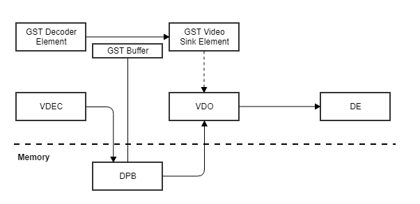

- Graphic Rendering : Render the graphic plane with a video texture.

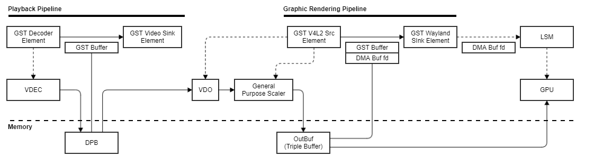

Currently, the GAV graphic rendering is used for remote meetings, hbbtv ads, YouTube dual video test cases, etc.
However, in the future, it can be used in a variety of scenarios where multiple media must be played.

General Description
===================

| The GPSC driver can be modeled as a capture (grabbing) device can do.
| It is used in the GAV graphic rendering and implemented with gstreamer v4l2src-based plugins.

Features
========

| The GPSC driver provides the following features:

- Support HDR/Interlaced Stream
    - Tone mapping for HDR10/HLG for HDR

- Support adaptive streaming
    - Seamless playback support when resolution changes

- Support active region detection
    - Use in miracast's portrait mode

- Support for H/W color converting
    - NV12 and ARGB888 can be used

- Support for seamless mode switching between video and graphic
    - Dynamically switch between video and graphic in the middle of video playback

Architecture
============

Driver Architecture
-------------------

The GPSC driver architecture shown in the figure below, is mainly divided into two layers user space, kernel space.

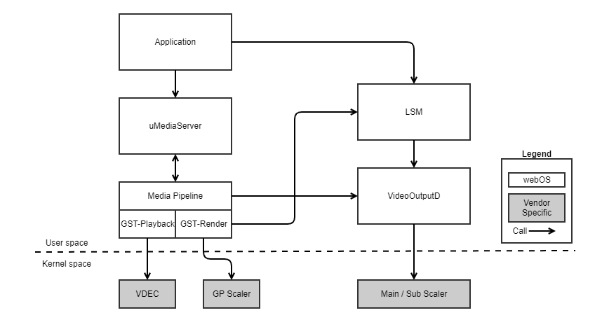

- uMediaServer : Acquire/Release resource
- LSM : Create/Composite window
- Media Pipeline : Load/Play Media
- GST-playback : Gstreamer pipeline for playback
- GST-render : Gstreamer pipeline for graphic rendering
- VideoOutputd : Connect/Disconnet video output

Requirements
************

Functional Requirements
=======================

General Purpose Scaler Driver must support next 3 things.

Connection Control
------------------

1) Can connect the VDEC and the VDO by setting VIDIOC_S_EXT_CTRLS with the VDEC instance number and
   the VDO for the GPSC.(Please refer to :c:macro:`V4L2_CID_EXT_VDO_VDEC_CONNECTING`)
2) Can connect the GPSC and 1) by setting VIDIOC_S_INPUT with the VDEC instance number and the GPSC.
3) Should support multiple instances of [VDEC]-[VDO]-[GPSC] connection like below diagram.

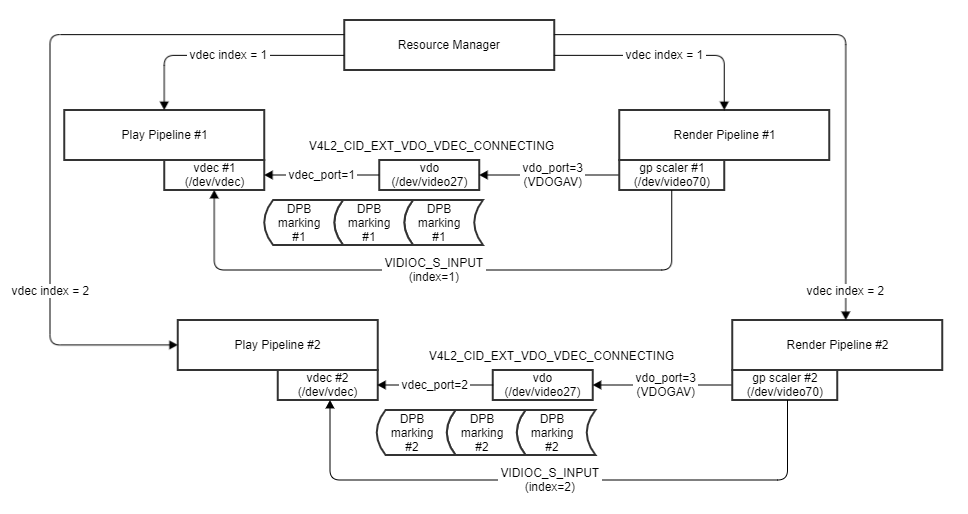

Size Control
------------

1) Can control the size for scale down by setting VIDIOC_S_FMT.
2) The image format should be YUV420 to reduce bandwidth.
3) Can get the width and height information which was set by VIDIOC_S_FMT after
   DQBUF by VIDIOC_G_FMT.

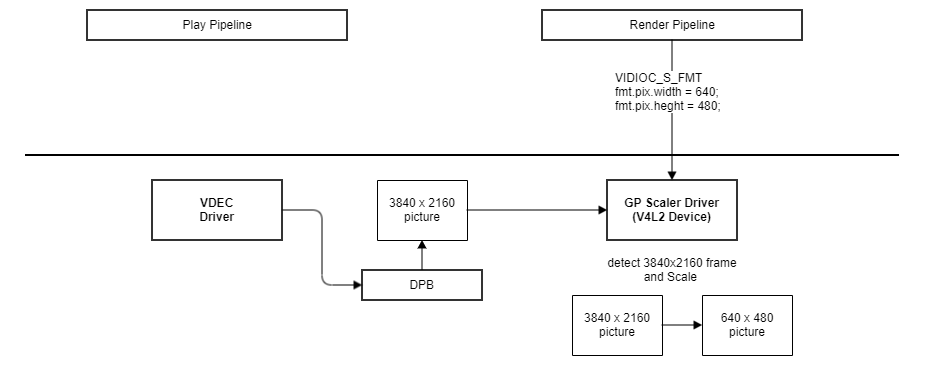

DMA Buffer Control
------------------

1) The DMA Buffers(VIDIOC_REQBUFS-VIDIOC_EXPBUF-VIDIOC_QBUF) will set like below diagram.
   The DMA buffers will be filled after VIDIOC_STREAMON
   If a DMA Buffer is filled fully, data will be got by using poll.

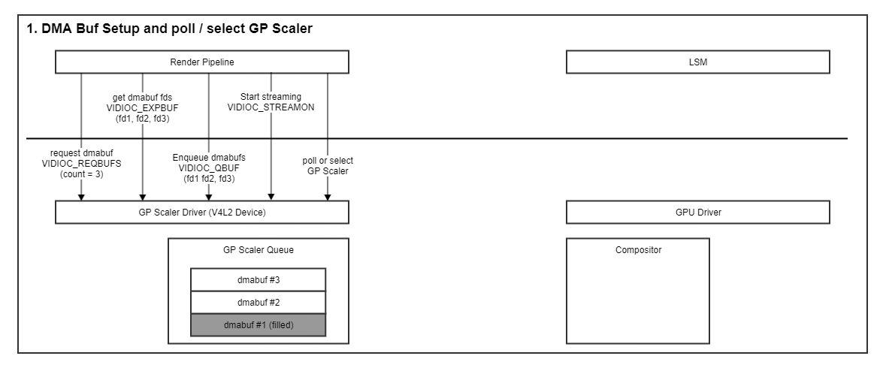

2) If dmabuf#1 is filled fully like below diagram, the fd of dmabuf#1 which can be got by
   VIDIOC_DQBUF will be passed into LSM by wayland protocol.

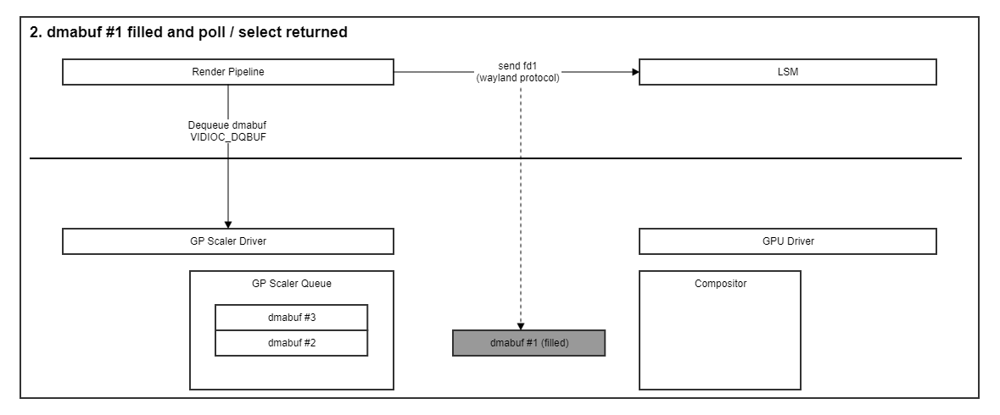

3) LSM will return the fd of dmabuf#1 after LSM uses all of it.

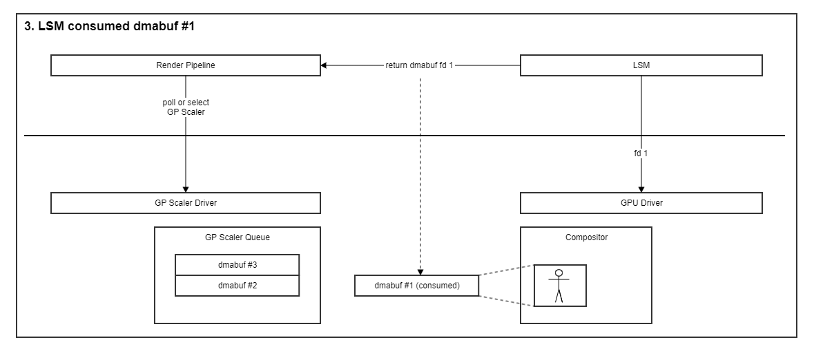

4) The fd of dmabuf#1 will be enqueued again by VIDIOC_QBUF.
   2) ~ 4) will be repeated but the number of dmabuf just will be changed.

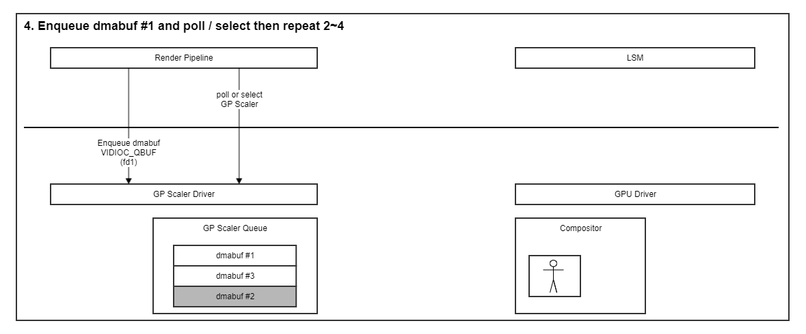

5) This DMA Buffer control can be stopped by VIDIOC_STRAMOFF if the data don't be
   needed any more.

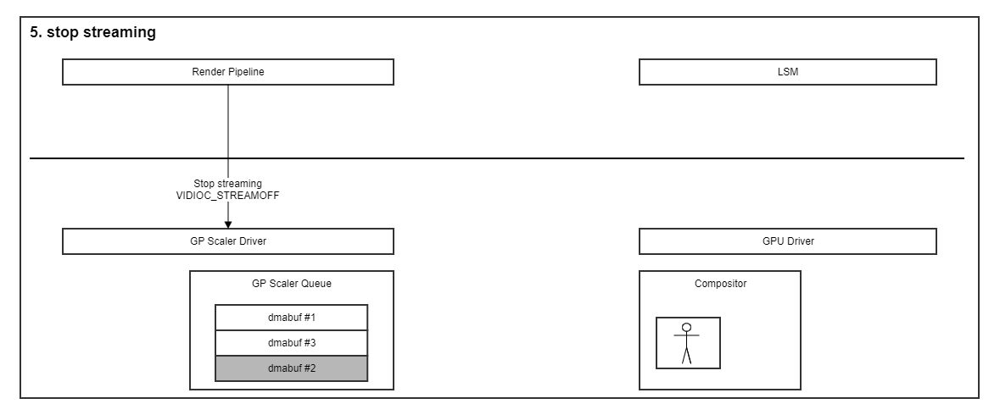

Quality and Constraints
=======================

Performance Requirements
------------------------
The response time of each function should be within 100ms, if there are no special reasons.

Design Constraints
------------------
The GPSC driver supports more than four multi-instance and up to 1920x1080 output resolution.

Implementation
**************

This section provides materials that are useful for the GPSC implementation.

- The File Location section provides the location of the Git repository where you can get the header file in which the interface for the GPSC implementation is defined.
- The API List section provides a brief summary of the GPSC APIs that you must implement.
- The Implementation Details section sets implementation guidance and example code for some major functionalities.
- The Status Log section provides information about the GPSC status log file which is used for examining the status and operation of the GPSC.

File Location
=============

The GPSC interfaces are defined in the v4l2-ext-gpsc.h header file, which can be obtained from https://swfarmhub.lge.com/.

- Git repository: bsp/ref/v4l2-ext-renderer-header
- Location: [as_installed]/linux/v4l2-ext-gpsc.h

API List
========

The GPSC driver implementation must adhere to the interface specifications defined and implements its functions. Refer to the API Reference for more details.

Data Types
----------

Standard Data Types
^^^^^^^^^^^^^^^^^^^

The following table lists the Linux standard V4L2 struct types.

======================================================================================================================================================================================= =========================================================
Data Type                                                                                                                                                                               Description
======================================================================================================================================================================================= =========================================================
`v4l2_buffer <https://linuxtv.org/downloads/v4l-dvb-apis/userspace-api/v4l/buffer.html#c.V4L.v4l2_buffer>`_                                                                             VIDIOC_QBUF/VIDIOC_DQBUF/VIDIOC_QUERYBUF argument
`v4l2_buf_type <https://linuxtv.org/downloads/v4l-dvb-apis/userspace-api/v4l/buffer.html#c.V4L.v4l2_buf_type>`_                                                                         VIDIOC_STREAMOFF/VIDIOC_STREAMON argument
`v4l2_capability <https://linuxtv.org/downloads/v4l-dvb-apis/userspace-api/v4l/vidioc-querycap.html#c.V4L.v4l2_capability>`_                                                            VIDIOC_QUERYCAP argument
`v4l2_control <https://linuxtv.org/downloads/v4l-dvb-apis/userspace-api/v4l/vidioc-g-ctrl.html#c.V4L.v4l2_control>`_                                                                    VIDIOC_G_CTRL/VIDIOC_S_CTRL/VIDIOC_QUERYCTRL argument
`v4l2_create_buffers <https://linuxtv.org/downloads/v4l-dvb-apis/userspace-api/v4l/vidioc-create-bufs.html#c.V4L.v4l2_create_buffers>`_                                                 VIDIOC_CREATE_BUFS argument
`v4l2_event <https://linuxtv.org/downloads/v4l-dvb-apis/userspace-api/v4l/vidioc-dqevent.html?highlight=v4l2_event#c.V4L.v4l2_event>`_                                                  VIDIOC_DQEVENT argument
`v4l2_event_subscription <https://linuxtv.org/downloads/v4l-dvb-apis/userspace-api/v4l/vidioc-subscribe-event.html?highlight=v4l2_event_subscription#c.V4L.v4l2_event_subscription>`_   VIDIOC_SUBSCRIBE_EVENT/VIDIOC_UNSUBSCRIBE_EVENT argument
`v4l2_exportbuffer <https://linuxtv.org/downloads/v4l-dvb-apis/userspace-api/v4l/vidioc-expbuf.html#c.V4L.v4l2_exportbuffer>`_                                                          VIDIOC_EXPBUF argument
`v4l2_ext_controls <https://linuxtv.org/downloads/v4l-dvb-apis/userspace-api/v4l/vidioc-g-ext-ctrls.html?highlight=v4l2_ext_controls#c.V4L.v4l2_ext_controls>`_                         VIDIOC_S_EXT_CTRLS argument
`v4l2_fmtdesc <https://linuxtv.org/downloads/v4l-dvb-apis/userspace-api/v4l/vidioc-enum-fmt.html#c.V4L.v4l2_fmtdesc>`_                                                                  VIDIOC_ENUM_FMT argument
`v4l2_frmivalenum <https://linuxtv.org/downloads/v4l-dvb-apis/userspace-api/v4l/vidioc-enum-frameintervals.html#c.V4L.v4l2_frmivalenum>`_                                               VIDIOC_ENUM_FRAMEINTERVALS argument
`v4l2_frmsizeenum <https://linuxtv.org/downloads/v4l-dvb-apis/userspace-api/v4l/vidioc-enum-framesizes.html#c.V4L.v4l2_frmsizeenum>`_                                                   VIDIOC_ENUM_FRAMESIZES argument
`v4l2_format <https://linuxtv.org/downloads/v4l-dvb-apis/userspace-api/v4l/vidioc-g-fmt.html#c.V4L.v4l2_format>`_                                                                       VIDIOC_G_FMT/VIDIOC_S_FMT/VIDIOC_TRY_FMT argument
`v4l2_input <https://linuxtv.org/downloads/v4l-dvb-apis/userspace-api/v4l/vidioc-enuminput.html#c.V4L.v4l2_input>`_                                                                     VIDIOC_G_INPUT/VIDIOC_S_INPUT/VIDIOC_ENUMINPUT argument
`v4l2_queryctrl <https://linuxtv.org/downloads/v4l-dvb-apis/userspace-api/v4l/vidioc-queryctrl.html#id2>`_                                                                              VIDIOC_QUERYCTRL argument
`v4l2_querymenu <https://linuxtv.org/downloads/v4l-dvb-apis/userspace-api/v4l/vidioc-queryctrl.html#id4>`_                                                                              VIDIOC_QUERYMENU argument
`v4l2_requestbuffers <https://linuxtv.org/downloads/v4l-dvb-apis/userspace-api/v4l/vidioc-reqbufs.html#c.V4L.v4l2_requestbuffers>`_                                                     VIDIOC_REQBUFS argument
`v4l2_streamparm <https://linuxtv.org/downloads/v4l-dvb-apis/userspace-api/v4l/vidioc-g-parm.html#c.V4L.v4l2_streamparm>`_                                                              VIDIOC_G_PARM/VIDIOC_S_PARM argument
======================================================================================================================================================================================= =========================================================

Functions
---------

Standard Functions
^^^^^^^^^^^^^^^^^^

The following table lists the Linux standard V4L2 functions.

=============================================================================== ==================================================================
Function                                                                        Description
=============================================================================== ==================================================================
:ref:`v4l-dvb-apis:VIDIOC_CREATE_BUFS`                                          Create buffers for Memory Mapped or User Pointer or DMA Buffer I/O
:ref:`v4l-dvb-apis:VIDIOC_DQEVENT`                                              Dequeue event
:ref:`v4l-dvb-apis:VIDIOC_ENUMINPUT`                                            Enumerate video inputs
:ref:`v4l-dvb-apis:VIDIOC_ENUM_FMT`                                             Enumerate image formats
:ref:`v4l-dvb-apis:VIDIOC_ENUM_FRAMEINTERVALS`                                  Enumerate frame intervals
:ref:`v4l-dvb-apis:VIDIOC_ENUM_FRAMESIZES`                                      Enumerate frame sizes
:ref:`v4l-dvb-apis:VIDIOC_EXPBUF`                                               Export a buffer as a DMABUF file descriptor
:ref:`v4l-dvb-apis:VIDIOC_G_CTRL`                                               Get or set the value of a control
:ref:`v4l-dvb-apis:VIDIOC_G_FMT`                                                Get or set the data format, try a format
:ref:`v4l-dvb-apis:VIDIOC_G_INPUT`                                              Query or select the current video input
:ref:`v4l-dvb-apis:VIDIOC_G_PARM`                                               Get or set streaming parameters
:ref:`v4l-dvb-apis:VIDIOC_QBUF`                                                 Exchange a buffer with the driver
:ref:`v4l-dvb-apis:VIDIOC_QUERYBUF`                                             Query the status of a buffer
:ref:`v4l-dvb-apis:VIDIOC_QUERYCAP`                                             Query device capabilities
:ref:`ioctl VIDIOC_QUERYCTRL <v4l-dvb-apis:VIDIOC_QUERYCTRL>`                   Enumerate controls and menu control items
:ref:`ioctl VIDIOC_QUERYMENU <v4l-dvb-apis:VIDIOC_QUERYCTRL>`                   Enumerate controls and menu control items
:ref:`v4l-dvb-apis:VIDIOC_REQBUFS`                                              Initiate Memory Mapping, User Pointer I/O or DMA buffer I/O
:ref:`v4l-dvb-apis:VIDIOC_STREAMON`                                             Start or stop streaming I/O
:ref:`v4l-dvb-apis:VIDIOC_SUBSCRIBE_EVENT`                                      Subscribe or unsubscribe event
=============================================================================== ==================================================================

Extended Control IDs
^^^^^^^^^^^^^^^^^^^^

The following table lists the LG extended V4L2 controls

=============================================================== ====================================================
Function                                                        Description
=============================================================== ====================================================
:c:macro:`V4L2_CID_EXT_GPSCALER_ACTIVE_REGION_DETECTION_INFO_H` Get GPSCALER ACTIVE REGION DETECTION INFO HORIZONTAL
:c:macro:`V4L2_CID_EXT_GPSCALER_ACTIVE_REGION_DETECTION_INFO_V` Get GPSCALER ACTIVE REGION DETECTION INFO VERTICAL
:c:macro:`V4L2_CID_EXT_GPSCALER_ACTIVE_REGION_DETECTION_MODE`   Set GPSCALER ACTIVE REGION DETECTION MODE
:c:macro:`V4L2_CID_EXT_GPSCALER_INPUT_FRAME_SIZE`               Get GPSCALER INPUT FRAME SIZE
:c:macro:`V4L2_CID_EXT_GPSCALER_MAX_FRAME_SIZE`                 Set GPSCALER MAX FRAME SIZE
:c:macro:`V4L2_CID_EXT_GPSCALER_SOURCE_ATTRIBUTE`               Set and Get GPSCALER SOURCE ATTRIBUTE
:c:macro:`V4L2_CID_EXT_GPSCALER_EXTERNAL_INPUT`                 Set and Get GPSCALER EXTERNAL INPUT
=============================================================== ====================================================

The following shows the minor number and extension control IDs of the GPSC.

.. code-block:: cpp
  :linenos:

  #define V4L2_EXT_DEV_NO_VDOGAV     27
  #define V4L2_EXT_DEV_NO_GPSCALER   70
  #define V4L2_EXT_DEV_PATH_VDOGAV   "/dev/video27"
  #define V4L2_EXT_DEV_PATH_GPSCALER "/dev/video70"

  /* User-class control Bases */
  #define V4L2_CID_USER_EXT_GPSCALER_BASE (V4L2_CID_USER_BASE + 0xA000)
  /* Gpscaler class control IDs */
  #define V4L2_CID_EXT_GPSCALER_MAX_FRAME_SIZE (V4L2_CID_USER_EXT_GPSCALER_BASE + 1)
  #define V4L2_CID_EXT_GPSCALER_INPUT_FRAME_SIZE (V4L2_CID_USER_EXT_GPSCALER_BASE + 2)
  #define V4L2_CID_EXT_GPSCALER_ACTIVE_REGION_DETECTION_MODE (V4L2_CID_USER_EXT_GPSCALER_BASE + 3)
  #define V4L2_CID_EXT_GPSCALER_ACTIVE_REGION_DETECTION_INFO_H (V4L2_CID_USER_EXT_GPSCALER_BASE + 4)
  #define V4L2_CID_EXT_GPSCALER_ACTIVE_REGION_DETECTION_INFO_V (V4L2_CID_USER_EXT_GPSCALER_BASE + 5)
  #define V4L2_CID_EXT_GPSCALER_SOURCE_ATTRIBUTE (V4L2_CID_USER_EXT_GPSCALER_BASE + 6)
  #define V4L2_CID_EXT_GPSCALER_EXTERNAL_INPUT (V4L2_CID_USER_EXT_GPSCALER_BASE + 7)

Implementation Details
======================

The GPSC driver operates through gstreamer v4l2src-based plugins, and the basic sequence is as follows.

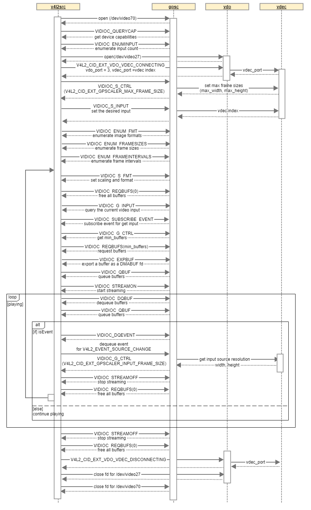

VIDIOC_DQEVENT
--------------

This interface dequeue an event, then check the struct v4l2_event.
If the resolution of input frame is changed, driver should queue event by filling the fields of the struct v4l2_event as follows.

1) type : V4L2_EVENT_SOURCE_CHANGE
2) id : vdec instance number
3) u.src_change.changes : V4L2_EVENT_SRC_CH_RESOLUTION

VIDIOC_ENUMINPUT
----------------

This interface can get index [0 ~ (Max Vdec Instance Num -1)]
to know the maximum number of Instances (number of the VDEC connections)
supported by the GPSC, otherwise return EINVAL.

VIDIOC_G_CTRL
-------------

This interface returns the number of buffers only if id is V4L2_CID_MIN_BUFFERS_FOR_CAPTURE.

VIDIOC_G_FMT
------------

This interface returns the default value (or the size of the input frame)
if VIDIOC_G_FMT is performed before VIDIOC_S_FMT, and returns the actual Scale result of the frame
passed to DQBUF after VIDIOC_S_FMT is set.
The stride value should be inserted in bytesperline variable of argument v4l2_format struct by driver.

VIDIOC_QUERYCTRL
----------------

This interface returns the number of buffers only if id is V4L2_CID_MIN_BUFFERS_FOR_CAPTURE.

VIDIOC_REQBUFS
--------------

If the application sets count variable value of v4l2_requestbuffers structure by
this interface, driver should be worked like below following MIN_BUFFERS which can be returned by
VIDIOC_G_CTRL ioctl.

1) count == 0 : buffer free
2) 0 < count < MIN_BUFFERS : Invalid argument error return
3) count >= MIN_BUFFERS : set buffer into MIN_BUFFERS value

VIDIOC_SUBSCRIBE_EVENT
----------------------

This interface subscribe to the V4L2_EVENT_SOURCE_CHANGE for the current input.
The current input means vdec instance number, it can get using VIDIOC_G_INPUT ioctl.

VIDIOC_S_INPUT
--------------

The vdec instance number to be connected with * argp is set by this interface.
If it is set to greater than max vdec Instance number, EINVAL is returned.

Status Log
==========

To examine the status and operation of the GPSC driver, you can use the status log file, a text-based log file. For more information on how to use the status log file, refer to Status Log File.

Testing
*******

| To test the implementation of the GPSC driver, webOS provides SoCTS (SoC Test Suite) tests.
| The SoCTS checks the basic operation of the GPSC driver and verifies the kernel event operation for the module by using a test execution file.
| For details, see :doc:`GPSC Unit Test in SoCTS Unit Test Specification. </part4/socts/Documentation/source/producer-manual/producer-manual_v4l2/producer-manual_v4l2-gpsc>`

Reference
*********

For additional information on related standards or technical topics, refer to:

- `Part I - Video for Linux API <https://linuxtv.org/downloads/v4l-dvb-apis/userspace-api/v4l/v4l2.html#part-i-video-for-linux-api>`_
- `Linux Kernel Media Documentation <https://linuxtv.org/downloads/v4l-dvb-apis/>`_
