Scaler
######

.. _seongcheoll.kim: seongcheoll.kim@lge.com
.. _jongsang.park: jongsang.park@lge.com
.. _may.yoon: may.yoon@lge.com
.. _choonghoon.park: choonghoon.park@lge.com
.. _youngman.jung: youngman.jung@lge.com
.. _jjaem.kim: jjaem.kim@lge.com
.. _dongkeun.jong: dongkeun.jang@lge.com
.. _jinseong1.yang: jinseong1.yang@lge.com
.. _gaok.lee: gaok.lee@lge.com

Introduction
************

| This document describes the Video Scaler (VSC) driver in the kernel space. The document gives an overview of the VSC driver and provides details about its functionalities and implementation requirements.

| The VSC driver is based on the V4L2 framework. Therefore, the document assumes that the readers are familiar with the V4L2 API and framework principles, which include knowledge of V4L2 controls, buffer management, and streaming handling, among others.

| The VSC driver is responsible for performing video signal processing, video scaling, and video capture. Therefore, it is necessary to understand video processing techniques and scaling algorithms, including knowledge of video formats, resolutions, frame rates, color formats, etc.

Revision History
================

+--------------+------------+----------------------+---------------------------------------------------------------------------------------+
| Version      | Date       | Changed by           | Description                                                                           |
+==============+============+======================+=======================================================================================+
|2.1           | 2023-08-18 | `choonghoon.park`_   | Applied new document template.                                                        |
|              |            |                      |                                                                                       |
|              |            | `eunyoung.lee`_      | Added descriptions for the major function requirements of the driver.                 |
+--------------+------------+----------------------+---------------------------------------------------------------------------------------+
|2.0           | 2022-01-10 | `choonghoon.park`_   | Added a new CID: V4L2_CID_EXT_VSC_ASPECTRATIO_POLICY                                  |
+--------------+------------+----------------------+---------------------------------------------------------------------------------------+
|1.9           | 2020-06-10 | `sangchul87.park`_   | Added new CIDs: V4L2_CID_EXT_VSC_ORBIT_WINDOW, V4L2_CID_EXT_VSC_ORBIT_MOVE            |
+--------------+------------+----------------------+---------------------------------------------------------------------------------------+
|1.8           | 2019-07-18 | `seonghoon1128.do`_  | Added new AirPlay mode: V4L2_CID_EXT_VSC_ADAPTIVE_STREAM                              |
+--------------+------------+----------------------+---------------------------------------------------------------------------------------+

Terminology
===========
| The key words "must", "must not", "required", "shall", "shall not", "should", "should not", "recommended", "may", and "optional" in this document are to be interpreted as described in RFC2119. 

| The following table lists the terms used throughout this document: 

=============================== ===============================
Term                            Description
=============================== =============================== 
ADC	                            Analog Digital Converter
AFD	                            Active Format Description. A standard set of codes that indicate both the aspect ratio of the stream and the active portion (letter box, pillar box) of the image.
APL	                            Average Picture Level
AVD	                            Analog Video Decoder
DI	                            Deinterlacer
FB	                            Frame Buffer.
HDMI	                        High Definition Multimedia Interface
HDR	                            High Dynamic Range
Input resource	                The module that receives input video from external equipment such as HDMI, DTV, or ATV, or decodes media video.
Input signal	                Video signal passed from the input resource to the VSC driver.
Input signal information	    Information about the input signal that is used when setting the window. It includes details such as resolution, AFD, PAR, and Overscan information.
Input window	                The area displayed on the screen in the input resolution.
LSM	                            Luna Surface Manager. A component that works as a graphics and window manager. It displays graphical elements on the screen, manages the composition of these elements, and performs the event handling for input devices such as keyboard and pointer.
MEMC	                        Motion Estimation Motion Compensation. The technology is used for motion smoothing and works by increasing the framerate (the speed at which a TV shows a new image) of the video by inserting additional frames between each real frame.
NR	                            Noise Reduction
OSD 	                        On Screen Display.  A graphical layer designed to display information or essential data that users need to know over a TV screen.
Output window	                The area where the video is displayed when it is being output.
PAR	                            Pixel Aspect Ratio. The ratio of a pixel's width to its height.
PBP	                            Picture by Picture. A feature that allows multiple sources to be displayed on a single screen, with each source being displayed in its own independent area of the screen.
PIP	                            Picture in Picture. A feature that allows an independent image or graphic to be displayed in a specific area of the screen. 
PQ 	                            Picture Quality. A feature that allows a small independent video to be displayed in a specific area of the screen.
STD	                            Suspend to Disk (Snapshot On). A state in which all contents of the current memory are saved to the disk and all power is turned off. It is also known as Hibernation. During restoration, no booting process is required, resulting in faster boot times.
STR	                            Suspend to RAM (QSM+ On). A standby mode in which only power to the RAM is supplied, consuming minimal power. It allows for quick restoration as the memory contents are retained.
VDEC                           	Video Decoder
VENC                           	Video Encoder
VDO                           	Video Decoder Output. Intermediate module between VSC and VDEC.
VRR                           	Variable Refresh Rate. A technology that prevents stuttering or distorted images by syncing the PC graphics card's image transfer with the TV screen's representation.
Video artifact                  An abnormality or distortion that occurs in videos. It can take various forms, including blocking, blurring, mosaic, noise, and distortion.
Video latency	                The delay from input to output of the video path
=============================== =============================== 

Technical Assistance
====================

| For assistance or clarification on information in this guide, please create an issue in the LGE JIRA project and contact the following person:

=============== ============ 
Module          Owner         
=============== ============ 
VSC             `seongcheoll.kim`_ 
=============== ============ 

Overview
********

General Description
===================

| The Video Scaler (VSC) driver is based on the V4L2 framework and is responsible for performing video signal processing, video scaling, and video capture by controlling the Scaler IP. The VSC driver receives the video input data from VDEC/HDMI/AVD, scales it to fit the main/sub window, and then transmits the video output data to other modules to display on the TV screen.

- Video signal processing passes the video data to the backend after further signal processing for the digitized video signal input from VDEC/HDMI/AVD. 
- Video scaling involves scaling up or down, cropping, and zooming the video by setting the input window and output window of the incoming video data.
- Video capture transfers the video data stored in memory to an external module such as Picture Quality (PQ) or Video Composer to display on the TV screen.

Features
========

| The VSC driver provides the following features:

- Video input connection
    - The VSC driver is connected to VDEC/HDMI/AVD, which corresponds to the input. When the video frames and related information are sent from VDEC/HDMI/AVD to VSC, the VSC driver processes these video frames and related information.
- Video signal processing
    - The VSC driver processes the video signal by passing the video data to the backend after additional signal processing for the digitized video signal input from VDEC/HDMI/AVD.
- Video size settings
    - The VSC driver enables the adjustment of the video size including scaling up or down, cropping, and zooming the video by setting the input window and output window of the incoming video data.
- Video mode settings (Single/PIP/PBP)
    - The VSC driver supports Multi View modes that can split the TV screen into two areas and display different sources in each area. These modes include Single (displaying a single video source), PIP (Picture-in-Picture, displaying a smaller video source within a larger one), and PBP (Picture-by-Picture, displaying multiple video sources side by side).
- Video memory data reading
    - The VSC driver supports reading data from the input video frame buffer for verifying video data. This feature is utilized by SoC Compliance Test Suite (SoCTS).
- Video mute control
    - Noise may occur during video transitions caused by input or signal switching. The VSC driver controls video mute (blank) during the transition period to cover them with black.
- Video freeze control
    - The VSC driver supports freezing the video frame, allowing it to be held or paused, resulting in a static image being displayed. This feature enables the video output to appear as if it is paused or stopped at a specific frame. 

Architecture
============

This section describes the hardware architecture and the driver architecture for video scaler.

Hardware Architecture
---------------------

The following figure shows the block diagram of the Scaler IP, which is controlled by the VSC driver to achieve video signal processing, video scaling, and video capture.

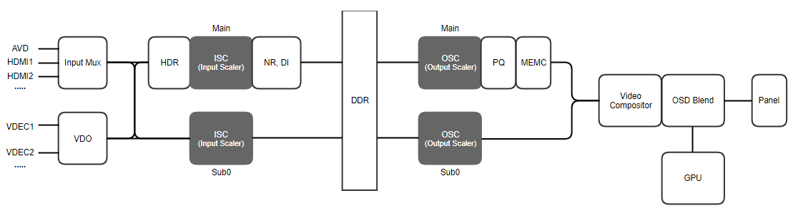

| The Scaler IP can be divided into the following major parts:

- Input Mux connects the video input from the AVD/HDMI to the main or sub scaler.
- Video Decoder Output (VDO) is an intermediate module between the VSC and VDEC drivers, delivering the video data and its metadata to the main or sub scaler according to the AV sync control logic.
- Main scaler is responsible for outputting video to a full window. 
- Sub scaler is responsible for outputting video to a sub window in the Multi View mode.
- DDR is the video memory used to perform video signal processing.
- PQ performs video signal processing after the video scaling operation. 

Driver Architecture
-------------------

The VSC driver architecture shown in the figure below, is mainly divided into three layers user space, kernel space and hardware. 

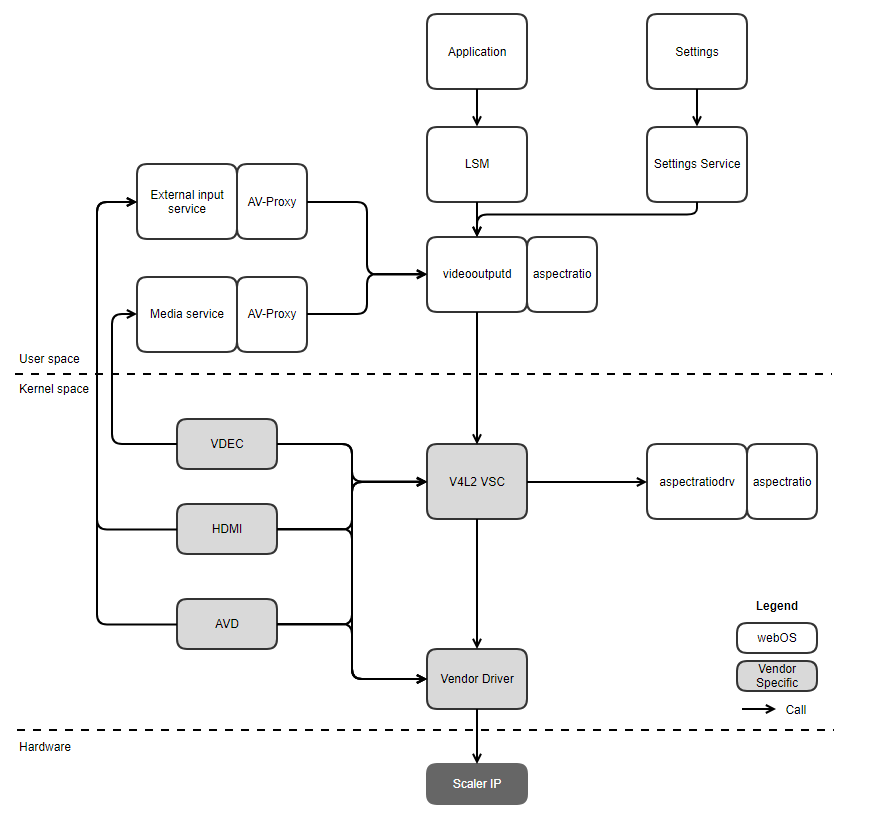

The user space service, videooutputd, delivers video scaling requests to VSC, which then interacts with the Vendor Driver to control the Scaler IP for video scaling. The following is a brief summary on how the architecture is exercised:

- videooutputd → VSC: videooutputd sends the calculated window region to VSC and control VSC to manage rendering video output.
- VSC → Vendor Driver: VSC controls the Vendor Driver for video processing.
- VSC → aspectratiodrv: VSC requests the calculated window region every frame to aspectratiodrv for dynamic aspect ratio. aspectratiodrv calculates window region according to the aspect ratio policy using the aspectratio library.
- VDEC/HDMI/AVD → VSC: VDEC/HDMI/AVD sends video frames and related information to VSC.
- VDEC/HDMI/AVD → Vendor Driver: VDEC/HDMI/AVD sends video frames and related information to Vendor Driver.
- Application → LSM → videooutputd: An application sends the app and punch region to LSM, and LSM sends the input/output region of the video to videooutputd.
- Settings → Settings Service → videooutputd: The Settings app changes user aspect ratio value, and then the Settings Service sends changed aspect ratio value to videooutputd.
- VDEC/HDMI/AVD → External input service/Media service → videooutputd: VDEC/HDMI/AVD sends the signal information to the External input service or Media service, and then the External input service or Media service sends the signal information to videooutputd. The External input service manages external input sources (HDMI, ATV, or AV), while the Media service manages VDEC sources (Media or DTV).

.. _VSC Requirements:

Requirements
************

This section describes the major functionalities of the VSC driver, as well as its operational flow and requirements.

.. _Window Setting:

Window Setting
==============

| The VSC driver sets the window region to display the video when a new video input signal is detected. The video input signal is passed from the input resource to the VSC driver. Here, the input resource refers to the module that receives input video from external devices such as HDMI and ATV, or the module that decodes media video. The VSC driver sets the window region based on the input signal information and the app's policy.

| Window setting is performed by the following extended API:

* :c:macro:`V4L2_CID_EXT_VSC_WIN_REGION`

Functional Requirements
-----------------------

The following figure shows the operation sequence of the video driver related to window setting when a new input signal is detected. This scenario occurs when the input signal is disconnected and then reconnected, the input source is switched, the input signal information is changed, or during STR booting and STD booting.

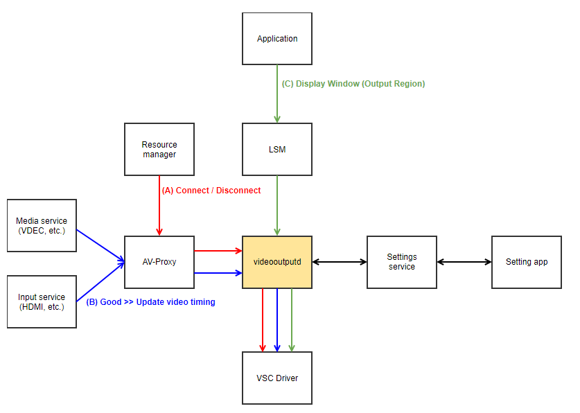

When a new input signal is detected, the following behaviors occur:

- ( A ) Connect input resource and the VSC driver
- ( B ) Window setting according to the input signal information (Resolution, AFD, PAR, and Overscan information)
- ( C ) Window setting defined in the App

| (B) and (C) operate after the input resource and VSC are connected in (A) first.

| (B) operates more than once after a new input signal is detected. 

| (C) operates by the App regardless of the input signal.

| (C) may not work if window change is not necessary.

| 

| In both (B) and (C), the input window, output window, and rotate can be changed.

| When a new input signal is detected and (A), (B), and (C) operate, the section is covered by mute. The noise caused by window setting must not be seen.

| In the mute section, (B) and (C) can be called multiple times. The middle window setting can be skipped, but the last window setting must be applied.

| (C) can be called without mute. In this case, the window must be changed naturally without noise or broken symptoms caused by the window setting.

Window setting according to the input signal information
^^^^^^^^^^^^^^^^^^^^^^^^^^^^^^^^^^^^^^^^^^^^^^^^^^^^^^^^

The following diagram shows the overall workflow of window setting according to the input signal information:

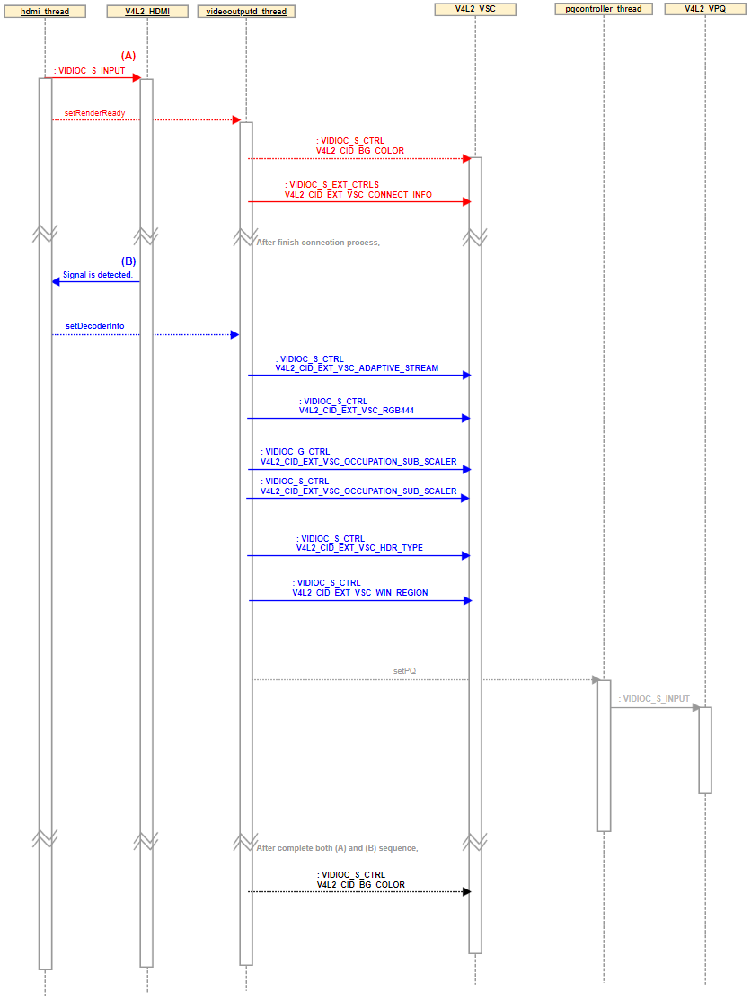

Window setting defined in the App
^^^^^^^^^^^^^^^^^^^^^^^^^^^^^^^^^

The following diagram shows the overall workflow of window setting according to the app's policy:

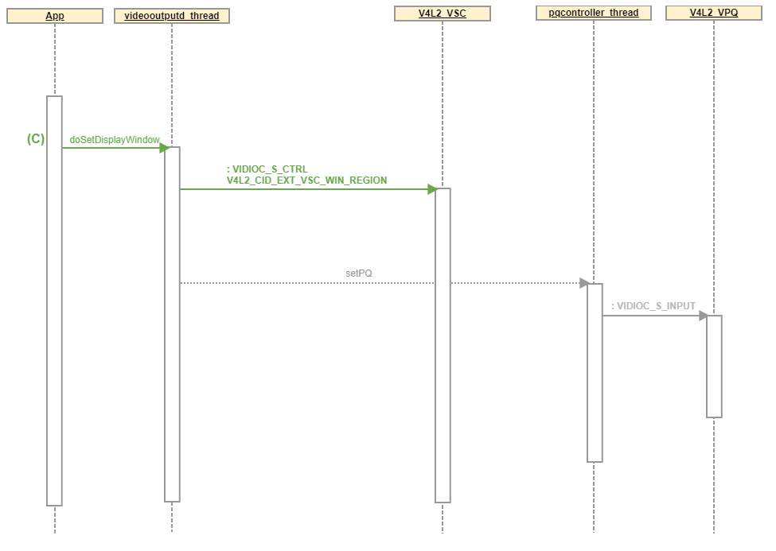

Quality and Constraints
-----------------------

| The following are the quality requirements for the functionality implementation:

- Mute off time
    - Minimize the Mute Off Time which a new input signal is detected. This includes input switching, STR booting, and STD booting.
    - The Mute Off Time is affected by window setting, Picture Quality (PQ) setting, and Internal Mute release time.
- Mute setting 
    - Before muting or unmuting, BSP must first set the output region
    - i.e.) (LG) Sub Video Output Region Setting (0,0,0,0) → (BSP) Output Region Set → (BSP) Set Internal Mute 
    -        → (LG) Sub Video Output Region Setting (700,600,1000,1000) → (BSP) Output Region Set → (BSP) Set Unmute
- PQ effect
    - When the sub video is muted, it must not affect the main video's Average Picture Level (APL) or PQ settings

|
| The following are the technical constraints for the functionality implementation:

- STR thread and race condition
    - When booting STR, it should be designed with consideration for the race condition between the window setting thread and the STR thread (resume/suspend).
- VDEC / VDO / VSC
    - Window setting should be operated after the input signal and input signal information are normally updated in the order of VDEC→ VDO→ VSC.
- Video latency
    - If it affects the video latency, the :c:macro:`V4L2_CID_EXT_VPQ_VIDEO_LATENCY` table must be modified together.

Aspect Ratio
============

| Aspect ratio is the proportional relationship between the width and height of a video image and typically expressed as W:H (where W is the width, and H is the height). webOS TV supports the aspect ratio of 16:9, 4:3, Original, Vertical Zoom, and 4-Way Zoom, and users can change it in webOS TV Settings.

| The window setting based on the aspect ratio of the input video is performed by the following extended API:

- :c:macro:`V4L2_CID_EXT_VSC_WIN_REGION`

Functional Requirements
-----------------------

When a new input signal is detected, the window region is adjusted according to the input signal information, including resolution, AFD, PAR, and aspect ratio.

- Input window region
    Sets the area to be displayed on the screen in input signal resolution. This operation can be executed without Mute.

- Output window region
    Sets the location and size of the video to be output. This operation can be executed without Mute.

- Input and output window region
    Sets input and out window regions simultaneously. This operation can be executed without Mute.

| To better understand the requirements summarized above, the following examples demonstrate how input window region and output window region is adjusted based on the aspect ratio setting.

Input Window Region
^^^^^^^^^^^^^^^^^^^

| webOS TV has two main display modes: Just Scan and Overscan. Just Scan shows the original screen as it is received from broadcasts signal or connected device without cropping the edges. Overscan is a behavior in which part of the input video is cut off by the visible bounds of the screen. The Overscan ratio varies according to the input signal and video resolution.

| webOS TV users can select their preferred mode in webOS TV Settings.

- Just Scan is turned On → The video is displayed as Just Scan.
- Just Scan is turned Off → The video is displayed as Overscan. 

| When Just Scan is turned off, which means Overscan is enabled, only the input window is adjusted as follows:

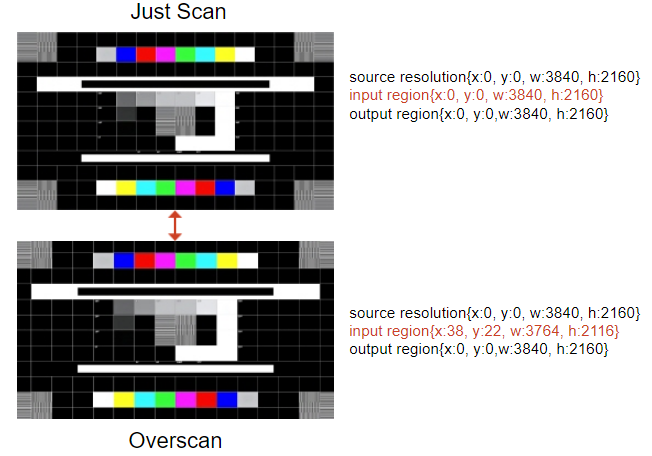

Output Window Region
^^^^^^^^^^^^^^^^^^^^

When the aspect ratio changes from 16:9 to 4:3, only the output window is adjusted as follows:

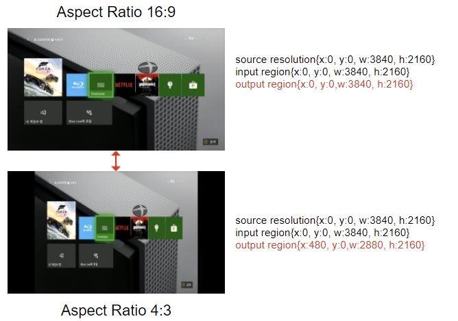

Input and Output Window Region
^^^^^^^^^^^^^^^^^^^^^^^^^^^^^^

When the aspect ratio changes from 16:9 to 4-Way Zoom, both the input and output windows are adjusted as follows:

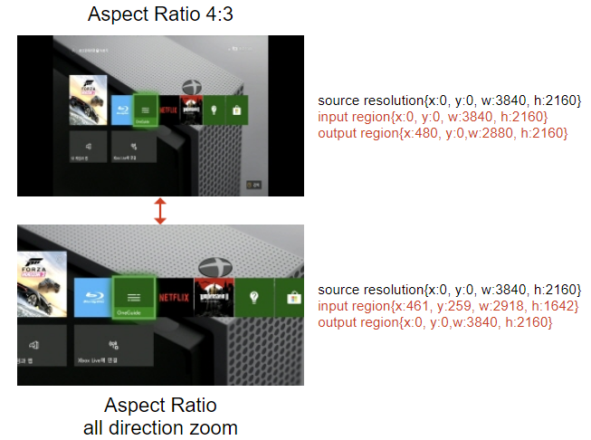

Quality and Constraints
-----------------------

The following are the quality requirements for the functionality implementation:

- Video artifacts
    - When operating without Mute
        - During operation, the video must be output normally without noises.
        - The movement must be performed smoothly at once. Don't be rattled.
        - When setting input and output window regions simultaneously the movement must be performed smoothly at once.
    - When operating within the Mute section
        - Mute must be canceled after all window settings are completed.
        - Noises must not be exposed before or after the Mute.
    - MPEC-2 video
        - In MPEG-2, the lower 8 pixels in a 1920x1088 resolution video are noise area. Since the crop information is optional, noise may be displayed. In order to provide users with better quality, the noise should not be output. VDEC must provide the original resolution information of TS to VDEC MW. By the way, when communicating between the VDEC output module and the VSC module, if TS is DTV TS & MPEG-2 & of 1920x1088 resolution & its crop size is 0, then the Bottom Crop size in the crop information must be set to 8 for the purpose of its processing. Therefore the video image should be processed as 1920x1080.
- Multiple call
    - If it is called multiple times, it is set as the last value based on the next v-sync.
    - When called multiple times, each uses the last value.

The following are the technical constraints for the functionality implementation:

- Video latency
    - Video latency can be affected when cropping the input window. It may also be affected when the size or position of the output window is changed. If video latency is affected, the :c:macro:`V4L2_CID_EXT_VPQ_VIDEO_LATENCY` table must be modified accordingly. Any increase in latency in Low Latency Mode must be reported as a constraint.
- RGB444 / VRR
    - When operating in RGB444 / VRR, if there are restrictions on the input window and output window, it must be reported.
- Multi thread
    - Aspect Ratio value from webOS must not be reset due to internal operation of BSP. If the scaler is shared by various threads, the value must be shared.
- VSC freeze
    - Window setting must work normally in VSC Freeze state (pause recording). Image quality issues, such as jagged edges caused by deinterlace, must not occur.
- Mirror Mode
    - When operating in Mirror Mode, both the output window and the input window must be calculated as the value in which the y position and h size are normally inverted.

Rotation
========

| webOS TV supports rotation in clockwise increments of 0, 90, 180, and 270 degrees. The input signal information received from the input resource includes the rotation angle of the video. When a new signal is detected, the video can be rotated simultaneously with the window settings. 

| The rotation setting is performed by the following extended API:

- :c:macro:`V4L2_CID_EXT_VSC_WIN_REGION`

Functional Requirements
-----------------------

| The operation sequence for video rotation is the same as Window Setting, described above. For details, please refer to the :ref:`Window Setting` section.

| The rotate operation is divided into the following two categories:

- ( B ) Rotate setting according to the input signal information 
- ( C ) Rotate setting defined in the App

| Rotation should meet the following requirements:

- Should be supported on all inputs.
- Should be supported on main/sub scaler independently.
- Should support changing the input/output window during rotation.
- The rotate operation is covered by Mute. Rotation and window setting must be completed within the Mute section.

| When rotated, the input/output window changes are as follows:

- Degree: 0 degree / 90 degree / 180 degree / 270 degree
- Output window: Set the output window region of the shape rotated based on 0 degree.
- Input window: Set the input window region based on 0 degree. If the rotation is applied to the video first, the input window region must also be adjusted according to the rotated degree.

| The following is an example of rotating an image by 90 degrees. The process involves rotation to reverse the height and width of the window, up-scaling to crop the input window, and down-scaling to resize the output window.

- Panel (0, 0, 3840, 2160)
- Video Resolution (0, 0, 1920, 1080)
- Degree (90 degrees) / Input window (200, 10, 960, 540) / Output window (1920, 100, 1080, 1920)

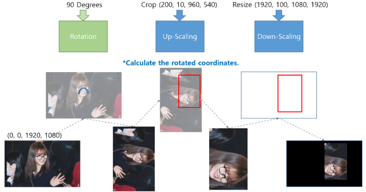

Quality and Constrains
----------------------

The following are the quality requirements for the functionality implementation:

- Video artifacts
    - After completing all rotation and window settings, the following requirements must be met:
        - The aspect ratio must not be broken.
        - Degradation must not occur.
        - The mute must be turned off. Noises must not be exposed before or after the mute.

| The following are the technical constraints for the functionality implementation:

- All input
    - Rotation should be able to operate on all inputs. Input/output window changes should be supported even when rotated.
- Adaptive stream
    - Adaptive stream is a stream in which the video resolution or frame rate is adjusted based on changes in data transmission speed caused by the network environment. Both rotation and input/output window settings must work properly in the adaptive stream. 

YouTube Dynamic Resize
======================

| YouTube Dynamic Resize refer to the feature supported by the YouTube app that smoothly adjusts the window size when the user changes the screen size while watching a video. When the feature is operated, the size of the On Screen Display (OSD) boundary should change in the same way as the video window size changes.

| To support YouTube Dynamic Resize, it is necessary to send the information about delay time between the Scaler IP and OSD blending from the VSC driver to the webOS service through the following event:

- :cpp:any:`V4L2_CID_EXT_VSC_SUBSCRIBE_APPLYING_DONE_WINDOW_REGION`

Functional Requirements
-----------------------

| Define the sequence of operations for continuously changing the window size to support YouTube Dynamic Resize. The following requirements must be met:

- When the window size is continuously changed, it should be able to maintain a performance of 30 fps.
- When operating with the OSD, the boundaries of the video and OSD must be matched.

To meet the above requirements, the following issues need to be addressed:

- Skip the other functions that are associated with the window setting operation and apply them after the continuous window setting scenario
- To achieve 30 fps performance, the delay between the Scaler IP and OSD blending in the video path should be reduced to 33 ms or less
- The boundaries of video and OSD, which are processed in different threads and hardware blocks, must be matched.

|
| The following figure illustrates an example of a physical delay that exists between the Scaler IP and OSD blending in the video path.

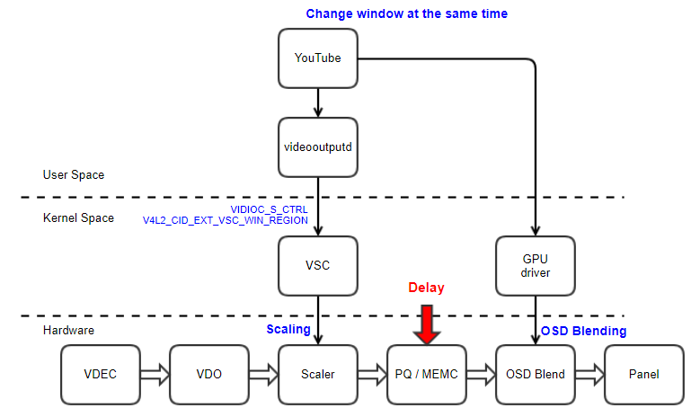

In order to satisfy the above requirements, it is classified into the following two actions.

- ( A ) Distinguish and execute the functions that operate during the continuous window setting and those that operate after the continuous window setting
- ( B ) To match the boundary between the video and the OSD, receive a reply from the driver at the moment when Scaling, PQ, and Motion Estimation Motion Compensation (MEMC) are finished.

| Distinguish the functions that operate during the continuous window setting and those that operate after the continuous window setting as follows:

- (A-1) The functions that operate during the continuous window setting: Window setting / MEMC low delay mode is on
- (A-2) The functions that operate after the continuous window setting: PQ setting / MEMC low delay mode is off

|
| The MEMC low delay mode in (A) is a mode that reduces the delay between the Scaler IP and OSD blending in the video path.

| The MEMC low delay mode in (A) should be able to reduce the delay to 33 ms or less.

| There must be no artifacts or video muting when turning on/off the MEMC low delay mode in (A).
|

| To match the boundary between the video and the OSD, receive a reply from the driver at the moment when the Scaling, PQ, and MEME are finished, as follows:

- (B-1) A subscribe event is requested with V4L2_CID_EXT_VSC_SUBSCRIBE_APPLYING_DONE_WINDOW_REGION to receive a reply from the driver.
- (B-2) A reply is received from the driver through VIDIOC_DQEVENT at the moment the Scaling, PQ, and MEME are finished. The reply must be received within 33 ms after the window setting.

| The following figure illustrates an example for the operation (B-2) above:

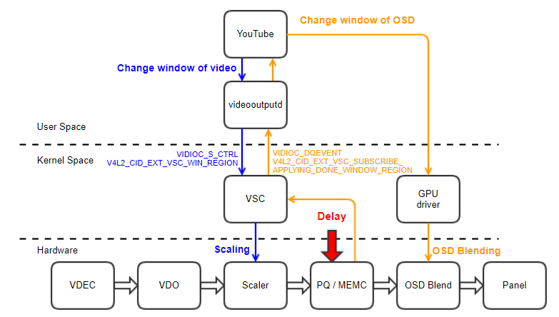

The figure below provides a sequence diagram for the operation (A-1), (A-2) and (B-2) above:

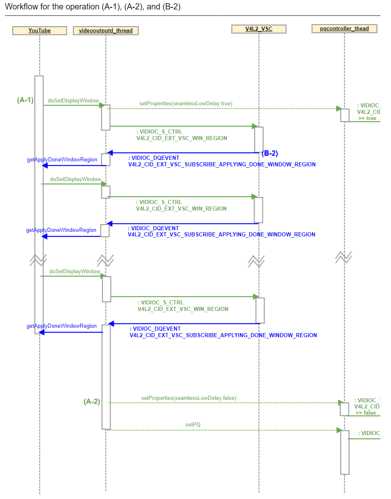

The figure below provides a sequence diagram for the operation (B-1) above:

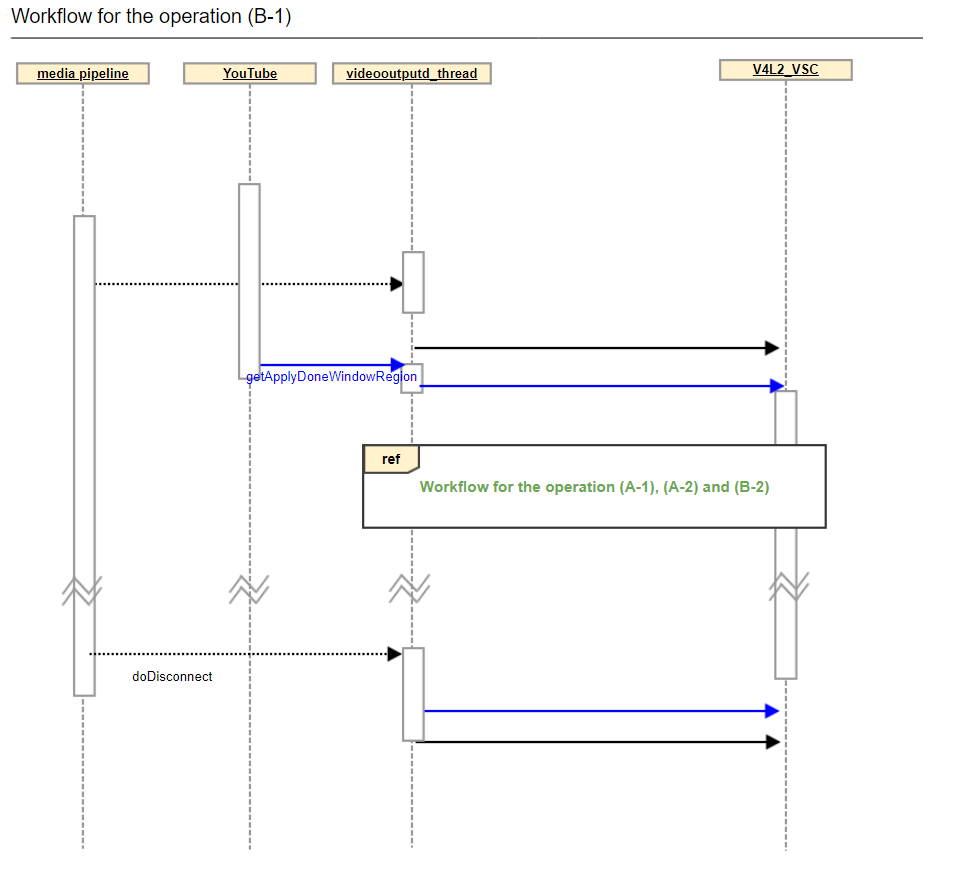

The hardware restriction for the MEMC low delay mode is as follows:

- The MEMC low delay mode cannot be turned on/off without any artifacts or video mute when the delay between the Scaler IP and OSD blending in the video path is reduced to 33 ms or less.

Work arounds to address the above restriction are as follows:

- Utilize the Scaler block for dynamic resize at the back end of the MEMC (hardware where the delay occurs).
- Minimizes delay per frame to 16.6 ms by processing MEMC (hardware where the delay occurs) input at 60Hz.

Quality and Constraints
-----------------------
The following are the technical constraints for the functionality implementation:

- MEMC and picture quality processing
    - Before and after YouTube Dynamic Resize, MEMC and picture quality processing must be applied normally.
- Video artifacts
    - Any artifacts must not occur during the YouTube Dynamic Resize or before and after the operation.
    - Short instances of frame repeat and frame drop (approximately 1-3 frames) that may occur due to changes in physical delay during the YouTube Dynamic Resize operation are allowed.

The following are the technical constraints for the functionality implementation:

- Eliminating the delay between the Scaler IP and OSD blending
    - When viewing the video, MEMC and picture quality processing must be performed normally.
    - When operating YouTube Dynamic Resize, MEMC and picture quality processing can be bypassed to reduce the video delay to 33 ms.
    - However, Mute or transient is not allowed when switching between the above states.

Adaptive Stream
===============

| An adaptive stream is a type of stream where the resolution or frame rate of the video is adjusted based on changes in data transmission speed caused by the network environment. When playing an adaptive stream, all video paths must handle any changes in the resolution or frame rate smoothly and without noise or flickering, ensuring that there is no distortion or flickering when the video is output.

| The following extended API is used to set or get the adaptive stream mode. A value of 1 for the control ID indicates the adaptive stream mode, and a value of 2 indicates the Dynamic Aspect Ratio mode (adaptive stream mode with dynamic aspect ratio applied).

- :c:macro:`V4L2_CID_EXT_VSC_ADAPTIVE_STREAM`

Functional Requirements
-----------------------

| This section describes the functional requirements based on the value of the :c:macro:`V4L2_CID_EXT_VSC_ADAPTIVE_STREAM` setting.
|

Adaptive Stream Mode
^^^^^^^^^^^^^^^^^^^^

| The following are the functional requirements that must be met when the value of :c:macro:`V4L2_CID_EXT_VSC_ADAPTIVE_STREAM` is set to 1, which is when video content is an adaptive stream.

1. BBC Seamless Requirements

    1-1. Must support a resolution change

        ex. 640x480 ↔ 720x480 ↔ 1280x720 ↔ 1920x1080 ↔ 3840x2160

    1-2. Must support both a resolution and a progressive / interlaced change

        ex. 1280x720p ↔ 1920x1080i

    1-3. Must support both a frame rate and a resolution change

        1) 25Hz ↔ 50Hz
        2) 29.97(30/1,001)Hz ↔ 59.94(60/1,001)Hz
        3) 30Hz ↔ 60Hz
        4) 24Hz ↔ 48Hz
        5) 23.98(24/1001)Hz

        ex. 1280x720p/25Hz ↔ 1920x1080p/50Hz

2. Rakuten Seamless Requirements

    2-1. Must support the following codecs, resolutions, and bitrates:

        | Our media in SD, HD and FHD are encoded in H.264 with 8 renditions:
        | - 216p @ 350kbps
        | - 432p @ 750kbps
        | - 432p @ 1100kbps
        | - 432p @ 1500kbps
        | - 540p @ 2100kbps
        | - 720p @ 2500kbps
        | - 720p @ 3400kbps
        | - 1080p @ 5500kbps

        | UHD medias are encoded in H.265 with 8 renditions as well:
        | - 216p @ 350kbps
        | - 432p @ 750kbps
        | - 432p @ 1400kbps
        | - 540p @ 2100kbps
        | - 720p @ 3400kbps
        | - 1080p @ 5000kbps
        | - 2160p @ 8000kbps
        | - 2160p @ 16000kbps

    For UHD contents, depending on the content itself, we have SDR, HDR10 and/or Dolby Vision versions.

3. Dynamic Stream Change (DSC)

    The two different streams must play seamlessly back-to-back without any changes to the pipeline, just like a single stream.

    3-1. The requirements in sections 10.3 and 10.4 of the :download:`MPEG-DASH Profile for Transport of ISO BMFF Based DVB Services over IP Based Networks <resources/mpeg_Dash.pdf>` document must be met.

    - 10.3 Bitstreams, Luminance Resolutions and Frame Rates
    - 10.4 Audio/Video Switching Between Different Representations in the same Adaptation Set
    
        The following is a partial of the key content from the 10.4 Audio/Video Switching Between Different Representations in the same Adaptation Set section.

        .. image:: resources/vsc_pic2.PNG
            :width: 100%

    There must be no video scaling issues when changing codecs and resolutions in the stream. For example, the following cases must be supported in the DASH test case:

    | 1 ) SVP (H265 4K) (20 sec) -> SVP (H264 2K)
    | 2 ) SVP (H265 4K) (20 sec) -> Clear (H264 2K)
    | 3 ) Clear (H265 4K) (60 sec) -> Clear (H264 2K)

Dynamic Aspect Ratio Mode
^^^^^^^^^^^^^^^^^^^^^^^^^

The following are the functional requirements that must be met when the value of :c:macro:`V4L2_CID_EXT_VSC_ADAPTIVE_STREAM` is set to 2, which is when video content is an adaptive stream with Dynamic Aspect Ratio applied.

4. Dynamic Aspect Ratio

    4-1. If the video resolution is different, the aspect ratio must be seamlessly adjusted in units of frames without noises or flickering. For details, see :ref:`Dynamic Aspect Ratio`. 

Quality and Constraints
-----------------------

The following are the quality requirements for the functionality implementation:

- Video artifacts
    - The video must be displayed continuously and without any issues.
    - During seamless switching, there must be no muting, noise, interruptions, or distortion.
    - The picture quality settings before and after seamless conversion must be identical.

The following are the technical constraints for the functionality implementation:

- Main and sub scalers
    - Adaptive stream, Dynamic Stream Change (DSC), and Dynamic Aspect Ratio must be support on both the main scaler and sub scaler.
- Window settings
    - Adaptive stream, DSC, and Dynamic Aspect Ratio must operate normally regardless of the window size setting.
- Low Latency Mode
    - Adaptive stream, DSC, and Dynamic Aspect Ratio must operate normally in Low Latency Mode.
- Video latency
    - Video Latency is very short and provides near-zero latency for gamers. If it affects the video latency, the :cpp:any:`V4l2_CID_EXT_VPQ_VIDEO_LATENCY` table must be modified accordingly.

Orbit
=====

| Since OLED TV's particle emits light by itself, the OLED particle gets stress when watching TV pictures with fixed Images/phrases for a long time. As a result, the image retention (afterimages) on the screen take place. Orbit is a function that moves the screen at specific time intervals to reduce the potential of the image retention when the screen image is fixed for a long time. Users can turn the feature on or off in the Screen Shift option of webOS TV Settings. Screen Shift moves the pixels of the static area.

| The following extended APIs are used to send input cropping and output window size information for Orbit. :c:macro:`V4L2_CID_EXT_VSC_ORBIT_WINDOW` properly crops the video/OSD input window based on the given crop window information and scales the cropped video/OSD up or down to the given output window size. The actual display area is then determined by :c:macro:`V4L2_CID_EXT_VSC_ORBIT_MOVE`.

- :c:macro:`V4L2_CID_EXT_VSC_ORBIT_MOVE`
- :c:macro:`V4L2_CID_EXT_VSC_ORBIT_WINDOW`

Functional Requirements
-----------------------

This section provides a detailed description of the functional requirements for Orbit.

1. Orbit Mode and Size
^^^^^^^^^^^^^^^^^^^^^^

1-1. By referring to video cropping information (Overscan/Just Scan), full screen settings (PIG/PIP, etc.), and foreground app information, crop information and moving size are provided for each Video/OSD. LG will calculate and send the necessary values, so SoC Vendors only need to refer to the size and orbit mode information from the table below:

+--------------------------+-------------------------------+--------------------------------------------------------------------------+---------------------------------------------------------+
|Scene                     |Cropping of Full Video         |                           Home Mode                                      |          Store Mode                                     |
|                          |                               +------------------+----------------------------+--------------------------+--------------------------------+------------------------+
|                          |                               | FullVideo        |   Small Video              |  OSD                     |  Full Video                    | Small Video /OSD       |
+==========================+===============================+==================+============================+==========================+================================+========================+
| Full Video               |Overscan                       | Size: 32x16      |                            | Size: 20x10              | Size: 64x32                    |The same as Home Mode   |
|                          |                               | Orbit: Overscan  |                            | Orbit: Overscan          |                                |                        |
|                          +-------------------------------+------------------+----------------------------+                          +--------------------------------+------------------------+
|                          |Just scan                      | Size: 20x10      |                            |                          | The same as Home Mode                                   |
|                          |                               | Orbit: Just scan |                            |                          |                                                         |
+--------------------------+-------------------------------+------------------+----------------------------+                          +                                                         |
|PIG                       |                               |                  | Size: 20x10                |                          |                                                         |
|(Small Video)             |                               |                  | Orbit: Just scan           |                          |                                                         |
+--------------------------+-------------------------------+------------------+----------------------------+                          +--------------------------------+------------------------+
|PIP                       | Overscan                      | Size: 32x16      | Size: 20x10                |                          | Size: 64x32                    |The same as Home Mode   |
|(Full Video +             |                               | Orbit: Overscan  | Orbit: Just scan           |                          | Orbit: Overscan                |                        |
|Small Video)              |                               |                  |                            |                          |                                |                        |
|                          +-------------------------------+------------------+----------------------------+                          +--------------------------------+------------------------+
|                          |Just scan                      | Size: 20x10      | Size: 20x10                |                          | The same as Home Mode                                   |
|                          |                               | Orbit: Just scan | Orbit: Just scan           |                          |                                                         |
+--------------------------+-------------------------------+------------------+----------------------------+                          +                                                         |
|PIG + PIP                 |                               |                  | Size: 20x10                |                          |                                                         |
|(Small Video +            |                               |                  | Orbit: Just scan           |                          |                                                         |
|Small Video)              |                               |                  |                            |                          |                                                         |
+--------------------------+-------------------------------+------------------+----------------------------+--------------------------+                                                         |
|Exception #1:             |                               |                    Size: 20x10                                           |                                                         |
|Netflix                   |                               |                    Orbit: Just scan                                      |                                                         |
|Miracast                  |                               |                                                                          |                                                         |
|Dual Monitor              |                               |                                                                          |                                                         |
|Gallery                   |                               |                                                                          |                                                         |
|Power Only                |                               |                                                                          |                                                         |
+--------------------------+-------------------------------+------------------+----------------------------+--------------------------+                                                         |
|Exception #2:             |                               |Size: 20x10       | Size: 20x10                |Size: 20x10               |                                                         |
|Dynamic Aspect            |                               |Orbit: Just scan  | Orbit: Just scan           |Orbit: Just scan          |                                                         |
|Ratio                     |                               |                  |                            |                          |                                                         |
+--------------------------+-------------------------------+------------------+----------------------------+--------------------------+---------------------------------------------------------+
|Exception #3 :            |                               | Performs the off operation regardless of whether Screen Shift is turned on or off.                                                 |
|Partial View Scene        |                               |                                                                                                                                    |
|VR360 (VTG)               |                               |                                                                                                                                    |
|OCP (OLED Care Program)   |                               |                                                                                                                                    |
|Gallery Type App          |                               |                                                                                                                                    |
+--------------------------+-------------------------------+------------------------------------------------------------------------------------------------------------------------------------+
|* Small Video follows the OSD steps                                                                                                                                                            |
|* 4K : 3min/1pixel, 8K: 1min 30sec/1pixel & double the size                                                                                                                                    |
|* Home/Store Mode: Users can choose between Home Mode and Store Mode. Home Mode is for using the TV at home, while Store Mode is used only when the TV will be displayed in a store.           |
|Store Mode provides settings optimized for store display.                                                                                                                                      |
+-----------------------------------------------------------------------------------------------------------------------------------------------------------------------------------------------+

1-2. Orbit: Cropping of Full Video

| When Orbit is activated on a video adjusted as Just Scan, a black area without any video appears.
| When Orbit is activated on a video adjusted as Overscan, the video is expanded, preventing the exposure of a black area. To avoid exposing the cropped areas caused by Overscan, the video is further expanded by the Orbit size.

+--------------------------------------------------+--------------------------------------------------------------+--------------------------------------------------------------+
|                                                  | LCD                                                          | OLED                                                         |
+==================================================+==============================================================+==============================================================+
|Original Video                                    | Just Scan                                                    | JustScan + Orbit : Just Scan                                 |
|                                                  |                                                              |                                                              |
|.. image:: resources/crop_original.PNG            | .. image:: resources/crop_original_justscan.PNG              | .. image:: resources/crop_original_justscan_OLED.PNG         |
|    :width: 100%                                  |     :width: 100%                                             |     :width: 100%                                             |
|                                                  +--------------------------------------------------------------+--------------------------------------------------------------+
|                                                  |Overscan                                                      | Overscan + Orbit : Overscan                                  |
|                                                  |                                                              |                                                              |
|                                                  | .. image:: resources/crop_original_overscan.PNG              | .. image:: resources/crop_original_overscan_OLED.PNG         |
|                                                  |     :width: 100%                                             |     :width: 100%                                             |
+--------------------------------------------------+--------------------------------------------------------------+--------------------------------------------------------------+

1-3. Orbit: OSD & Small Video

| When Orbit is activated in the OSD adjusted as Just Scan, an area where the OSD is not output occurs.
| If the Overscan is applied to the OSD, the Orbit can be activated by expanding the OSD. The Small Video is also expanded in proportion to the OSD. The Small Video must move according to the Orbit steps of the OSD.

+--------------------------------------------------+--------------------------------------------------------------+--------------------------------------------------------------+
|                                                  | LCD                                                          | OLED                                                         |
+==================================================+==============================================================+==============================================================+
|Original Video                                    |                                                              | JustScan + Orbit : Just Scan                                 |
|                                                  |                                                              |                                                              |
|.. image:: resources/OSD_original.PNG             | .. image:: resources/OSD_LCD.PNG                             | .. image:: resources/OSD_justscan_OLED.PNG                   |
|    :width: 100%                                  |     :width: 100%                                             |     :width: 100%                                             |
|                                                  |                                                              +--------------------------------------------------------------+
|                                                  |                                                              | Overscan + Orbit : Overscan                                  |
|                                                  |                                                              |                                                              |
|                                                  |                                                              |  .. image:: resources/OSD_overscan_OLED.PNG                  |
|                                                  |                                                              |      :width: 100%                                            |
+--------------------------------------------------+--------------------------------------------------------------+--------------------------------------------------------------+

2. Video/OSD Move
^^^^^^^^^^^^^^^^^

2-1. The screen is moved horizontally or vertically by 1 pixel at certain intervals of time.

| The movement proceeds from the bottom right direction, as shown in the figure below.

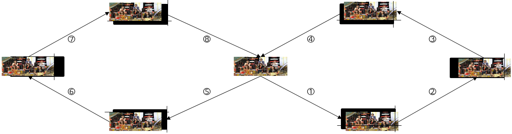

| In the following cases, the movement will start again from the first step:
|    (1) When turning Orbit on/off.
|    (2) When switching to Home/Store mode.
|    (3) When switching OSD Overscan/Just Scan orbit mode.

2-2. The movement interval is 3 minutes based on the video.
| If the Orbit size of Video/OSD is the same, they move together every 3 minutes. 
| However, if the Orbit size of Video/OSD is different, the behavior depends on the mode and the Overscan settings:

|   (1) Store Mode + Overscan (Video-64x32, OSD-20x10)
        - Video moves 1 step every 3 minutes. 
        - OSD moves 1 step every 9.6 minutes. 

|   (2) Home Mode + Overscan (Video-32x16, OSD-20x10)
        - Video moves 1 step every 3 minutes.
        - OSD moves 1 step every 4.8 minutes.

3. Just Scan Mode
^^^^^^^^^^^^^^^^^

When the Just Scan mode is enabled, the blank area of the Orbit operation is replaced with a black area.

Quality and Constraints
-----------------------

The following are the technical constraints for the functionality implementation:

- Picture in Graphic (PIG) / Picture in Picture (PIP) 
    - In the case of non-full video such as PIG/PIP, video/OSD movement cannot be taken separately, so it is restricted to maintain the same movement.

.. _Multi View:

Multi View
==========
| Multi View is a function that allows users to watch two different sources simultaneously. With this function, users can split the TV screen into two areas and display different sources in each area. For example, users can watch a TV program and a smartphone app at the same time, or watch two TV programs at the same time. Users can turn on Multi View in webOS TV Settings.

**Multi View Mode**

| webOS TV supports the following Multi View modes:

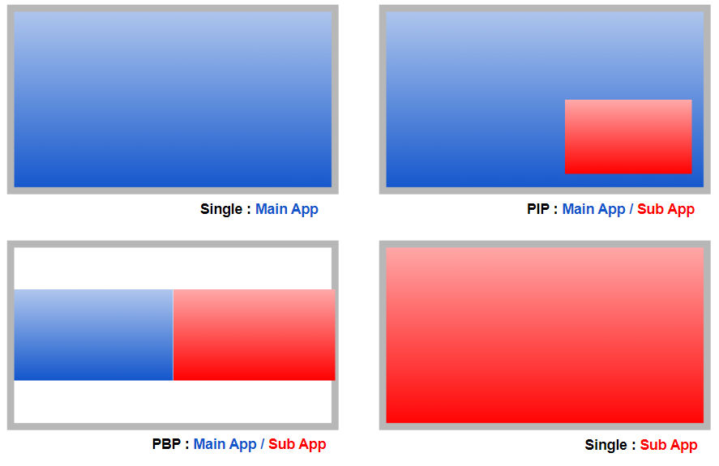

- **Single** : Main App - Only one source is connected to the main scaler.
- **Picture in Picture (PIP)** : Main App/Sub App - One source is connected to the main scaler and another source to the sub scaler. The main window is full-sized and the sub window is small. The size and position of the sub window can be changed.
- **Picture by Picture (PBP)** : Main App/Sub App - One source is connected to the main scaler and another source to the sub scaler. The main and sub windows are displayed side by side. If the aspect ratio of the main and sub is different, the size and position of the two videos may be asymmetrical.
- **Single** : Sub App - Only one source is connected to the main scaler. We only use the main scaler for full-sized video and do not use the sub scaler.

| The Multi View mode can be controlled by window property parameters of the following extended API.

- :c:macro:`V4L2_CID_EXT_VSC_WIN_PROP`

Functional Requirements
-----------------------

| The following figure shows the operation sequence of the video driver related to Multi View:

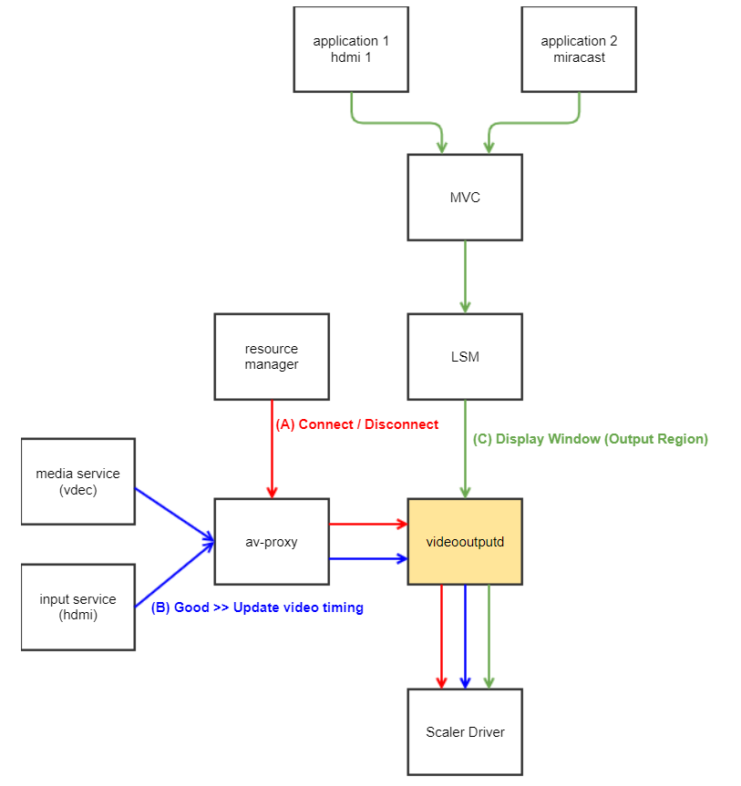

| When Multi View is activated, two apps perform actions (A), (B), and (C) equally. Please refer to the operation sequence for :ref:`Window Setting` to understand actions (A), (B), and (C) in detail.
|
| (A-1) Connect input resource to the main scaler (e.g. HDMI input source).
| (B-1) Perform window setting according to input signal information (e.g. HDMI input timing).
| (C-1) Perform window setting defined in the app (e.g. HDMI1 app).
|
| (A-2) Connect input resource to the sub scaler (e.g. VDEC input source).
| (B-2) Perform window setting according to input signal information (e.g. VDEC input timing).
| (C-2) Perform window setting defined in the app (e.g. Miracast app).
|
| To learn more about the operation sequence and example code according to two Multi View mode switching scenarios, see :ref:`Multi View` in the :ref:`Implementation Details <VSC Implementation Details>` section. 

Quality and Constraints
-----------------------

| The following are the quality requirements for the functionality implementation:

- The main and sub windows can operate simultaneously.
- The main and sub can be used as a combination of different input sources.
- The sub window also supports HDR (HDR10/HLG/DolbyVision).
- HDR can be supported through the sub window.
- Only the sub window can be used.
- Even if the main video path is disconnected, the sub video path can still work properly.
- The sub window can support any input.
- ATV/DTV/HDMI/Media input sources can be used in the sub window.

Miracast: Black Boundary Detection
==================================

| Miracast allows users to view the content they are viewing on their smartphone or tablet while performing other tasks on the TV. The Miracast-enabled app can be displayed on either the main or sub-window of the TV screen. The active video region must be supported by both the main scaler and sub scaler. 
|
| To support Miracast Black Boundary Detection, the active video region must be reported whenever it changes through the following event:

- :c:macro:`V4L2_CID_EXT_VSC_SUBSCRIBE_ACTIVE_WIN`

Functional Description
----------------------

This section provides a detailed description of the functional requirements for Miracast.
|

Black Boundary Detection (BBD)
^^^^^^^^^^^^^^^^^^^^^^^^^^^^^^

| The active video window refers to the real video area from pillar box or letter box video image which includes black bars. When there are two video objects, such as the red circle and yellow rectangle in the picture below, the original video window is a black rectangle. The active video window detected will be a blue rectangle. To calculate the active video area, assume that the inactive area is filled with black color. It must not be assumed that the active area is centered on the screen. If there is a performance issue, assume that the active window's height is the same as the video window's height.

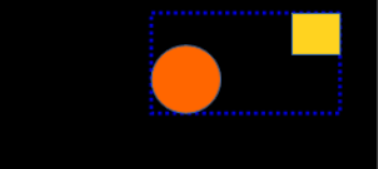

| The active video area must be detected from the Miracast input source and reported whenever the active video area changes. This can be achieved by subscribing to the :c:macro:`V4L2_CID_EXT_VSC_SUBSCRIBE_ACTIVE_WIN` event using the `VIDIOC_SUBSCRIBE_EVENT` ioctl() function. This subscription event function must be implemented using the `epoll <https://man7.org/linux/man-pages/man7/epoll.7.html>`_ event mechanism provided by the kernel. 

| After connecting Miracast, the BBD call sequence is as follows:

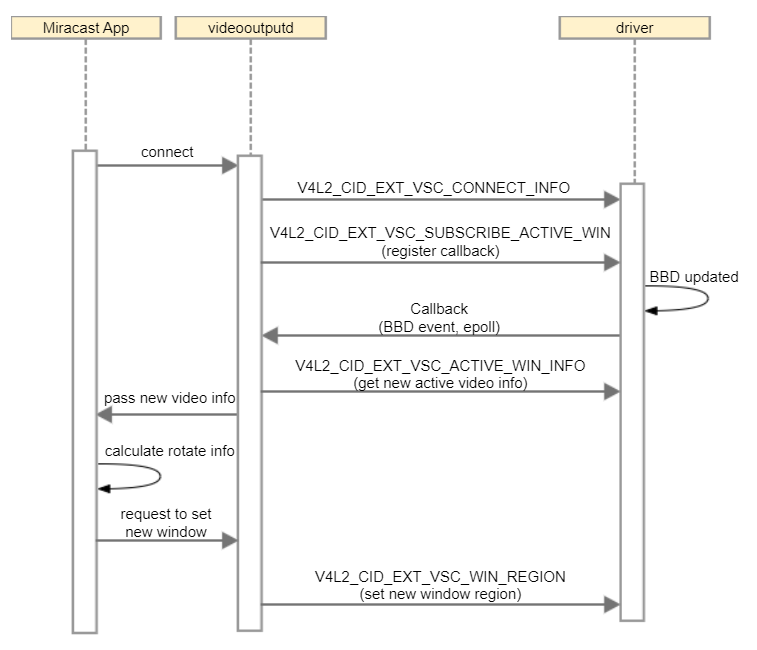

Adaptive
^^^^^^^^

| The Miracast-enabled app will have an adaptive property, as it will change the sub-window size when the active video region changes.
| 

Input combination with the Main scaler
^^^^^^^^^^^^^^^^^^^^^^^^^^^^^^^^^^^^^^

| Miracast works with every ATV/DTV/HDMI/AV/Media input.
|

Quality and Constraints
-----------------------

The following are the quality requirements for the functionality implementation:

- BBD accuracy, The detected video area must be outputted without any black areas on the top, bottom, left, and right.
- Video transient, There must be no video transient when changing the input/output window due to BBD change.

RGB444 Bypass
=============

| RGB444 is an RGB color space represented by 24 bits, consisting of three channels (R, G, B) represented by 8 bits each. Typically, when the input video in RGB444, the webOS TV performs Color Space Conversion (CSC) and Sub Sampling from RGB to YUV (YCbCr) to facilitate the application of image quality factors during multimedia processing. However, RGB444 Bypass Mode enables the output of color information as it is, without performing any other processing such as CSC and Sub Sampling, while maintaining the color information of the input signal without any distortion.
| 
| RGB444 Bypass Mode is set by the following extended API. If the value of the control ID is set to '1', RGB444 Bypass Mode is enabled, and if set to 0, it is disabled.

- :c:macro:`V4L2_CID_EXT_VSC_RGB444`

Functional Requirements
-----------------------

When RGB444 Bypass Mode is enabled through :c:macro:`V4L2_CID_EXT_VSC_RGB444`, the driver does not perform the following actions and outputs color information of the original input signal without any loss or distortion.

#. Sub Sampling to reduce the system bandwidth
#. CSC for image quality enhancement
#. Other video/quality features may affect this function

| When RGB444 Bypass Mode is disabled through :c:macro:`V4L2_CID_EXT_VSC_RGB444`, the driver performs CSC and Sub Sampling from RGB444 to YCbCr422 and applies image quality factors during multimedia processing.

Verification
^^^^^^^^^^^^

The functional requirements above can be verified on a pattern generator or on a PC. 

1. Pattern Generator
""""""""""""""""""""

| Multiple Signal Pattern Generator (MSPG) or another instrument can be used to verify the functional requirements for RGB444

| In a module that can separate R/G/B (gamma curve, etc.), it can be verified by performing each color filter as follows:

#. Set the RGB output timing (signal) and set the RGB pattern in the device.
#. By setting the instrument to output only one R/G/B each, check that all pixels are output normally on the TV. For example, in the MSPG pattern generator, you can turn on/off each color element using the R/G/B touch button on the panel.
#. Using the R/G/B filter for each color element, check whether a complete black video is output or not. For example, in the MSPG pattern generator, use the R/G/B touch button on the panel to output only 'R' and apply the 'R' filter

    .. image:: resources/mspg.PNG
        :width: 100%

2. PC
"""""

| To verify the functional requirements above using the RGB verification picture file, follow these steps on a PC device:

#. Download the RGB verification picture file to your PC.
#. Ensure that the size of the RGB verification picture file is the same as the size of the TV display.
#. Set Color Space of the PC device to RGB 4:4:4.
#. Open the image file and carefully observe for any distortion or color issues.

Quality and Constraints
-----------------------

The following are the quality requirements for the functionality implementation:

- Bandwidth
    The driver must be able to operate RGB444 for all signals supported by webOS TV.
- Side effect
    When operating RGB444 mode, there must be no impact on functions other than image quality. In particular, there must not be any issues with the performance indicators.
    For example, even if RGB444 is in operation, the following features must not be affected and should function normally as requested for each item:

    - Input lag (zero delay)
    - Variable Refresh Rate (VRR)
    - Power on time
    - Fast switching
    - API performance
    - Orbit
    - Other webOS TV video performance indicators

| The following are the technical constraints for the functionality implementation:

- Scaling
    If the resolution of the original input signal and the output resolution do not match, it may result in distortion by scaling functions such as video size adjustment.
    Examples of such scenarios include:

    1. 2K signal input → Output in full size to 4K panel
    2. 4K signal input → Output in 2K window size
    3. Other video scaling/cropping scenarios.

- Converter board
    There may be cases where this function cannot be supported according to the specifications of the converter board when using it.

Variable Refresh Rate (VRR)
===========================

Variable Refresh Rate (VRR), also known as G-Sync by NVIDIA and FreeSync by AMD, is a technology that resolves the problems of stuttering or distorted image representation caused by a discrepancy between image transfer from the PC graphics card and the representation on the TV screen. This allows users to fully enjoy smooth and seamless motion on a high-quality game screen implemented by a graphics card.

Functional Requirements
-----------------------

The VSC driver must support HDMI 2.1 VRR, NVIDIA G-Sync, and AMD FreeSync and meet the certification criteria for each standard.

HDMI 2.1
^^^^^^^^

The following figure shows the section 7.6.3.1 Derivation of MVRR Equations in HDMI Specification Version 2.1.

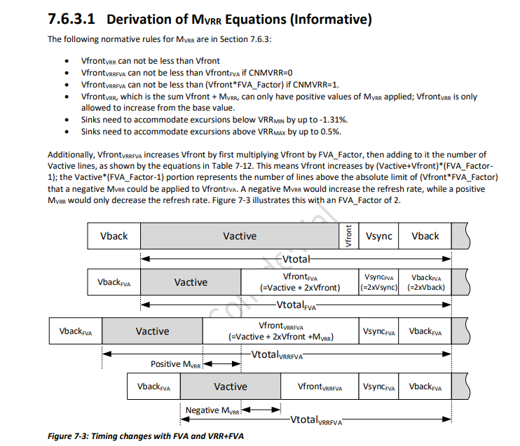

AMD FreeSync
^^^^^^^^^^^^

| AMD FreeSync manages its status as Supported / Enabled / Active, and this status information is transmitted through the HDMI SDP Info frame. The criteria for VRR operation in AMD FreeSync are as follows:

- When the FreeSync status is Enabled or Active, the VSC driver must activate VRR.

Quality and Constraints
-----------------------

The following are the quality requirements for the functionality implementation:

- Video artifacts
    During VRR operation, there must be no video artifacts such as tearing, video noise, or stuttering in the output image.
- Low delay
    Zero delay must be maintained while operating VRR.
    VRR/G-Sync/FreeSync video latency certification criteria must be met.
- Side effect
    During VRR operation, other video requirements must be supported normally.

    1. Aspect ratio
    2. RGB 4:4:4
    3. Power on time
    4. Fast switching
    5. API performance
    6. Orbit
    7. Other webOS TV video performance indicators

The following are the technical constraints for the functionality implementation:

- Panel
    VRR is only supported in panels that are capable of supporting it.
- Flickering
    During the activation or release of VRR, flickering may occur one to two times, depending on the type of panel and other Backlight Enhancement (BE) functions being used.
- Picture
    While VRR is active, the TV must maintain zero delay and deactivate related picture features due to the characteristics of VRR, which synchronizes input and output.
- OLED motion pro
    While VRR is active, the TV does not support OLED motion pro.
- Converter board
    The VRR function is not supported when using the converter board.

Quick Frame Transport (QFT)
===========================

Quick Frame Transport (QFT) is Fast VActive (FVA). QFT reduces the time that it takes to transmit a picture in cases where the maximum supported character rate of the link is greater than the rate needed for a given Video Timing.

- Purpose to reduce display latency from sink to display of source video

- When transmitting with a pixel clock that is a multiple of the actual video, Sink processes the video quickly and displays it, reducing display latency.

Functional Requirements
-----------------------

The VSC driver must support HDMI 2.1 QFT and meet the certification criteria for each standard.

HDMI 2.1
^^^^^^^^

  The following figure shows the section 7.6.3.1 Derivation of MVRR Equations in HDMI Specification Version 2.1.

  .. image:: resources/hdmi2_1.PNG
      :width: 100%

Reduced display latency through FVA (yellow area)
^^^^^^^^^^^^^^^^^^^^^^^^^^^^^^^^^^^^^^^^^^^^^^^^^

  .. image:: resources/QFT1.png
      :width: 100%

FVA_Factor = 2
^^^^^^^^^^^^^^

  .. image:: resources/QFT2.png
      :width: 100%

Reduced display latency effect
^^^^^^^^^^^^^^^^^^^^^^^^^^^^^^

  .. image:: resources/QFT3.png
      :width: 100%

Quality and Constraints
-----------------------

The following are the quality requirements for the functionality implementation:

- Supported QFT input specification
      There should be no video problems with the combinations below.

[QFT input Specification]

+-------+---------------+--------------+----------------------+
| No    | Resolution    | Frame        | Max_FVA Factor       |
+=======+===============+==============+======================+
| 1     | 1280x720      | 60Hz         | 16                   |
+-------+---------------+--------------+----------------------+
| 2     | 1280x768      | 60Hz         | 16                   |
+-------+---------------+--------------+----------------------+
| 3     | 1280x1024     | 60Hz         | 11                   |
+-------+---------------+--------------+----------------------+
| 4     | 1920x1080     | 60Hz         | 8                    |
+-------+---------------+--------------+----------------------+
| 5     | 1920x1080     | 120Hz        | 4                    |
+-------+---------------+--------------+----------------------+
| 6     | 1920x1080     | 165Hz        | 2                    |
+-------+---------------+--------------+----------------------+
| 7     | 2560x1440     | 120Hz        | 2                    |
+-------+---------------+--------------+----------------------+
| 8     | 3840x2160     | 60Hz         | 2                    |
+-------+---------------+--------------+----------------------+
| 9     | 3840x2160     | 120Hz        | 1                    |
+-------+---------------+--------------+----------------------+
| 10    | 4096x2160     | 60Hz         | 2                    |
+-------+---------------+--------------+----------------------+
| 11    | 4096x2160     | 120Hz        | 1                    |
+-------+---------------+--------------+----------------------+

- Output quality
      There should be no problem under FVA factor=2 at 4K60P resolution.
      Entering condition of QFT: the video mute is possible when entering QFT but there should be no mute/frame drop/frame repeat during operation.

- Side effect
      During VRR operation, other video requirements must be supported normally.

      1. Aspect ratio
      2. RGB 4:4:4
      3. Display latency
      4. Orbit

The following are the technical constraints for the functionality implementation:

- Low latency
      QFT operates only in Low latency mode. Picture quality and MEMC functions are not supported.
- Panel
      VRR(FVA) is only supported in panels that are capable of supporting it.
- Flickering
      During the activation or release of VRR(FVA), flickering may occur one to two times, depending on the type of panel and other Backlight Enhancement (BE) functions being used.
- Picture
      While VRR(FVA) is active, the TV must maintain zero delay and deactivate related picture features due to the characteristics of VRR(FVA), which synchronizes input and output.
- OLED motion pro
      While VRR(FVA) is active, the TV does not support OLED motion pro.
- Converter board
      The VRR(FVA) function is not supported when using the converter board.

Low Latency Mode
================

Low Latency Mode is a function designed to reduce input response latency, which is a crucial factor for gamers. It focuses on minimizing the delay between a TV receiving video signals from a specific input and outputting the corresponding pictures on the screen. This section provides guidelines for the input response latency that must be achieved for each panel and input environment in order to reduce the delay in the display's response to user input on the controller.

Functional Requirements
-----------------------

The following are the functional requirements for Low Latency Mode:

- The SoC can support low latency (or zero latency).
- For VDEC and HDMI input types, low latency must be supported for all resolutions supported by each input.
- When HDMI 2.1 VRR/NVIDIA G-Sync/AMD FreeSync is enabled or active, zero delay must be operated.

Quality and Constraints
-----------------------

The following are the quality requirements for the functionality implementation:

- Video artifacts
    In Low Latency Mode, there must be no video noise, tearing, or stuttering in the video.
- Latency
    The BSP must meet the target delay specified in the table below when operating in Low Latency Mode.
- Locking
    Once Low Latency Mode is locked, it must maintain the target delay until it is terminated.
- VRR
    For models that support VRR, the video latency must meet the HDMI 2.1 VRR/G-Sync/FreeSync certification requirements.

[Target Delay]

+----------------+---------------+--------------+----------------------+--------------------+--------------------+-------------------+
| Panel          | Input         | Module       | Theoretical          | 8K Model           | Acceptable         | Target Delay      |
| Resolution     | Resolution    |              | Minimum Delay        | Additional Delay   | Maximum SoC Delay  |                   |
+================+===============+==============+======================+====================+====================+===================+
|4K Panel        | 4K 60Hz       | 60Hz LCD     | 9.3 ms               |                    | SoC x1 | 2 ms      | 11.3 ms           |
|                |               +--------------+----------------------+--------------------+--------------------+-------------------+
|                |               | 120Hz LCD    | 13.5 ms              |                    | SoC x1 | 2 ms      | 15.5 ms           |
|                |               +--------------+----------------------+--------------------+--------------------+-------------------+
|                |               | 120Hz OLED   | 12.5 ms              |                    | SoC x1 | 2 ms      | 14.5 ms           |
|                +---------------+--------------+----------------------+--------------------+--------------------+-------------------+
|                | 4K 120Hz      | 120Hz LCD    | 5.2 ms               |                    | SoC x1 | 2 ms      | 7.2 ms            |
|                |               +--------------+----------------------+--------------------+--------------------+-------------------+
|                |               | 120Hz OLED   | 4.2 ms               | Expected: 2 ms     | SoC x1 | 2 ms      | 6.2 ms            |
+----------------+---------------+--------------+----------------------+--------------------+--------------------+-------------------+
|8K Panel        | 4K 60Hz       |60Hz LCD(E60)| 9.3 ms                | Expected: 2 ms     | SoC x1 | 2 ms      | 13.3 ms           |
|                |               +--------------+----------------------+--------------------+--------------------+-------------------+
|                |               | 60Hz LCD     | 17.6 ms              | Expected: 2 ms     | SoC x2 | 4 ms      | 23.6 ms           |
|                |               | (O20 + F20)  |                      |                    |                    |                   |
|                |               +--------------+----------------------+--------------------+--------------------+-------------------+
|                |               | 120Hz LCD    | 13.5 ms              | Expected: 2 ms     | SoC x2 | 4 ms      | 19.5 ms           |
|                |               +--------------+----------------------+--------------------+--------------------+-------------------+
|                |               | 120Hz OLED   | 12.5 ms              |                    | SoC x2 | 4 ms      | 16.5 ms           |
|                +---------------+--------------+----------------------+--------------------+--------------------+-------------------+
|                | 4K 120Hz      | 120Hz LCD    | 5.2 ms               | Expected: 2 ms     | SoC x2 | 4 ms      | 11.5 ms           |
|                |               +--------------+----------------------+--------------------+--------------------+-------------------+
|                |               | 120Hz OLED   | 4.2 ms               |                    | SoC x2 | 4 ms      | 8.2 ms            |
+----------------+---------------+--------------+----------------------+--------------------+--------------------+-------------------+

The following are the technical constraints for the functionality implementation:

- Scaling
    The input lag can increase when the video crop/position is changed.
- Picture
    During low latency operation, disable the picture functions that affect video latency.
- Video latency
    If the video latency changes for any reason, the :cpp:any:`V4l2_CID_EXT_VPQ_VIDEO_LATENCY` table must be modified accordingly.

.. _Dynamic Aspect Ratio:

Dynamic Aspect Ratio
====================

| Two independent streams have different resolutions, AFD, and PAR information. Dynamic Aspect Ratio refers to the process of setting the suitable aspect ratio for each stream seamlessly by referring to the information of each stream when switching between these independent streams.

| Dynamic Aspect Ratio is controlled by the following APIs:

- :c:macro:`V4L2_CID_EXT_VSC_ADAPTIVE_STREAM`
- :c:macro:`V4L2_CID_EXT_VSC_WIN_REGION`
- :c:macro:`V4L2_CID_EXT_VSC_ASPECTRATIO_POLICY`
- Aspect Ratio Library API 

.. warning::
    AFD defines the active format of the video. It is referred to when setting the aspect ratio and crop area. The figure on the left below illustrates the AFD codes expected to be used in North America (ATSC System). The meaning of each AFD value is Coded Frame context sensitive and each is defined in the table. The figure on the right below illustrates the AFD codes expected to be used in Europe (DVB System). 
    
    .. image:: resources/warning.PNG
    :width: 100%
    
    For details on the application of AFD for video coded as constrained by the Advanced Television Systems Committee system (ATSC) and by the Digital Video Broadcast system (DVB), refer to the ​CTA-861-F​ standard document.

Functional Requirements
-----------------------

| There is a requirement to seamlessly connect two independent streams for playback. A typical example is inserting advertisements in the middle of media content. In this case, the two independent streams have different resolution, AFD, and PAR information, so the videooutputd service sets the suitable aspect ratio for each stream by referring to the information of each stream. To seamlessly switch streams without any noise or flickering, scaling must be done on a frame-by-frame basis.

| Dynamic Aspect Ratio is applied when the value of :c:macro:`V4L2_CID_EXT_VSC_ADAPTIVE_STREAM`, which is the adaptive stream flag, is 2. The following pictures show the process of calculating and applying Aspect Ratio or Dynamic Aspect Ratio depending on the value of adaptive stream flag:

1) Normal Mode (Adaptive Stream flag != 2)
^^^^^^^^^^^^^^^^^^^^^^^^^^^^^^^^^^^^^^^^^^

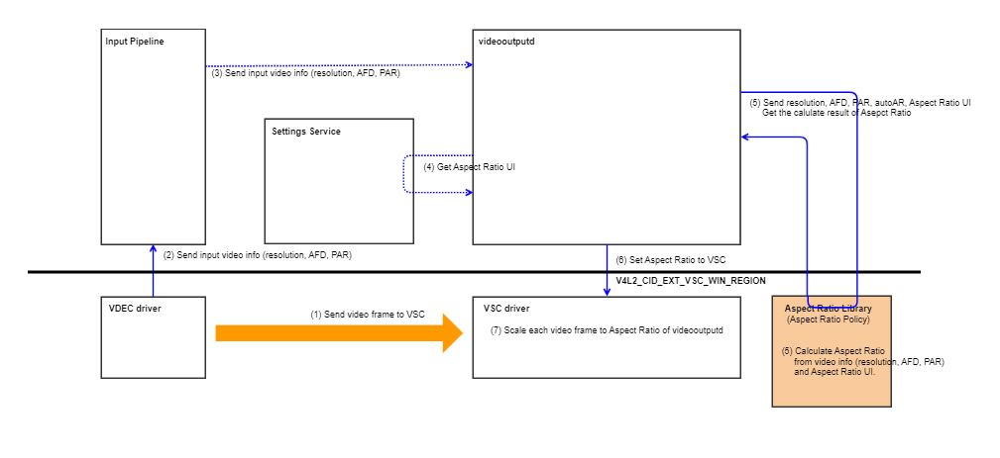

| The following three modules in kernel space and user space work together for Dynamic Aspect Ratio:

- Videooutputd: calculates the aspect ratio by applying the aspect ratio policy from Aspect Ratio Library.
- Aspect Ratio Library: provides the aspect ratio policy to the VSC driver. 
- VSC driver: performs scaling on a frame-by-frame basis and calculates the aspect ratio by applying the aspect ratio policy from Aspect Ratio Library.

| At the initial playback, the video frame is delivered to the VSC driver in step (1), and video information and Aspect Ratio UI are delivered to videooutputd through steps (2), (3), and (4).

| videooutputd calculates the aspect ratio using the Aspect Ratio Library in step (5).

| videooutputd sets the aspect ratio to the VSC driver in step (6). For more information, see V4L2_CID_EXT_VSC_WIN_REGION.
| 
| The figure below provides a sequence diagram for the Normal Mode above:

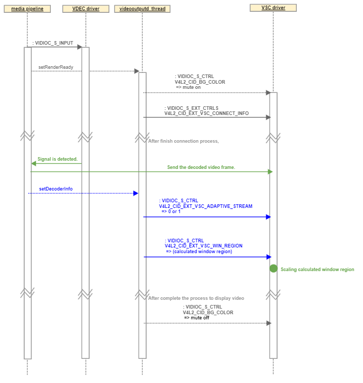

2) Dynamic Aspect Ratio Mode (Adaptive Stream flag == 2)
^^^^^^^^^^^^^^^^^^^^^^^^^^^^^^^^^^^^^^^^^^^^^^^^^^^^^^^^

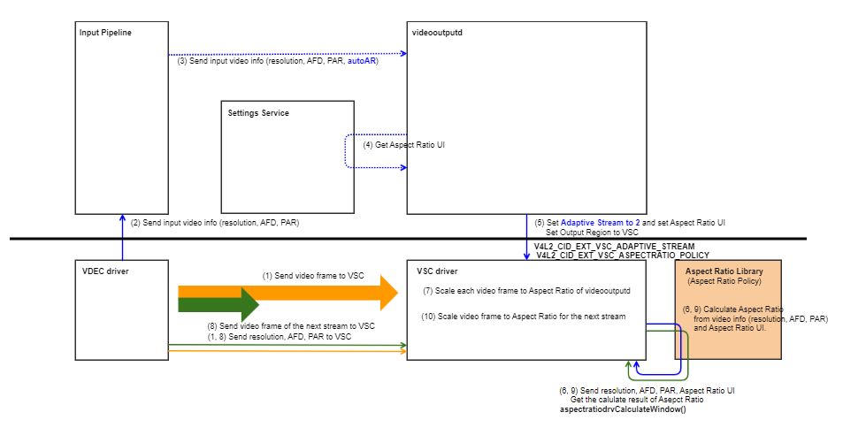

| At the initial playback, the video frame is delivered to the VSC driver in step (1), and video information and Aspect Ratio UI are delivered to videooutputd through steps (2), (3), and (4).

| When the video frame is transmitted in step (1), the resolution, AFD, and PAR information must be transmitted together to the VSC driver.

| In step (5), videooutputd checks the autoAR information, which means Dynamic Aspect Ratio operation is performed, and transmits the Adaptive Stream flag as 2 (Dynamic Aspect Ratio Mode) to VSC. It also transmits Aspect Ratio UI (Aspect Ratio, Overscan, etc.) information and the Output Region to the VSC driver. For more information, see :c:macro:`V4L2_CID_EXT_VSC_ASPECTRATIO_POLICY`.

| In step (6), if the Adaptive Stream flag is 2 (Dynamic Aspect Ratio Mode), the VSC driver directly calculates the aspect ratio through the Aspect Ratio Library using resolution, AFD, PAR, and Aspect Ratio UI. For more information and example codes for Aspect Ratio Library API, see the Aspect Ratio Library API and Implementing Export VSC Adapter section in Implementation Details.

| In step (7), the aspect ratio calculated on the video frame is scaled.

| In step (8), it is switched to the next stream, and the video frame of the new stream is delivered to the VSC driver. When video frame is transmitted in step (8), resolution, AFD, and PAR must be transmitted together to VSC.

| In step (9), the VSC driver directly calculates the aspect ratio through Aspect Ratio Library using resolution, AFD, PAR, and Aspect Ratio UI. For more information and example codes for Aspect Ratio Library API, see the Aspect Ratio Library API and Implementing Export VSC Adapter section in :ref:`Implementation Details <VSC Implementation Details>`.

| The newly calculated Aspect Ratio is scaled in the video frame of the new stream in step (10).

| In step (10), the newly calculated aspect ratio is scaled to the video frame of the new stream.
| 
| The figure below provides a sequence diagram for the Dynamic Aspect Ratio Mode above:

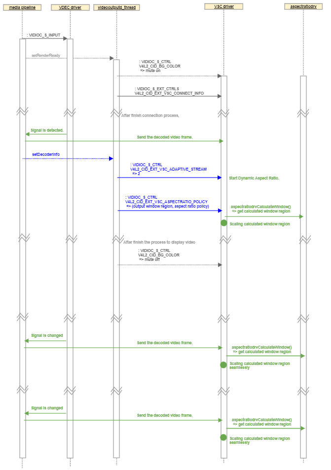

| To learn more about the implementation checklist for Dynamic Aspect Ratio and to get information and example codes for Aspect Ratio Library, refer to the :ref:`Dynamic Aspect Ratio` section in the :ref:`Implementation Details <VSC Implementation Details>`.

Dynamic Aspect Ratio and Orbit (for only OLED models)
^^^^^^^^^^^^^^^^^^^^^^^^^^^^^^^^^^^^^^^^^^^^^^^^^^^^^

| If Overscan is applied when Orbit is activated, the video and OSD areas will be expanded.

| In Dynamic Aspect Ratio, the Orbit Window area must be expanded in the Real Video Area after Aspect Ratio is applied.
| 
| The figure below illustrates the Orbit Window in Dynamic Aspect Ratio.

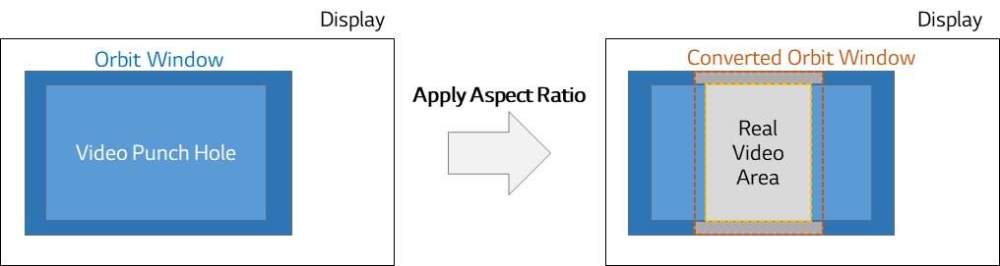

3) Dynamic Aspect Ratio Mode for OLED Models (Adaptive Stream flag == 2)
^^^^^^^^^^^^^^^^^^^^^^^^^^^^^^^^^^^^^^^^^^^^^^^^^^^^^^^^^^^^^^^^^^^^^^^^

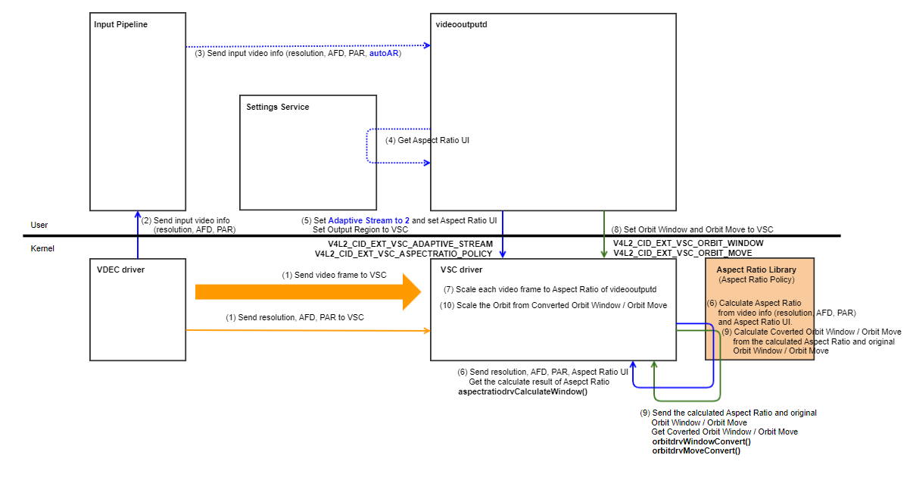

| The steps from (1) to (7) are the same as the previous Dynamic Aspect Ratio Mode (adaptive stream flag == 2) operation.

| In step (8), videooutputd transmits the Orbit Window and Orbit Move, without applying Aspect Ratio calculation, to the VSC driver according to the Orbit cycle.

| In step (9), if the Adaptive Stream flag is 2 (Dynamic Aspect Ratio Mode), the VSC driver calculates the Converted Orbit Window and Orbit Move using the calculated Aspect Ratio result and the original Orbit Window and Orbit Move received from videooutputd.

| In step (10), the VSC driver scales the Convert Orbit Window and Orbit Move.
| 
| For more information and example codes for Aspect Ratio Library in Step (6), see the Aspect Ratio Library API and Implementing Export VSC Adapter section in :ref:`Implementation Details <VSC Implementation Details>`.

Quality and Constraints
-----------------------

| The following are the quality requirements for the functionality implementation:

- Video artifacts
    The video must be continuously displayed normally.
    During seamless switching, no muting, noise, bumping, or cracking must occur.
    The picture quality settings before and after seamless conversion must be identical.
- Aspect ratio
    After seamless switching, a normal aspect ratio suitable for the stream must be applied.

| The following are the technical constraints for the functionality implementation:

- Performance
    When changing stream seamlessly, the aspect ratio must be applied on a frame-by-frame basis.
- Main scaler and sub scaler
    Dynamic Aspect Ratio must support both the main scaler and the sub scaler.
- Window setting
    Dynamic Aspect Ratio must operate normally regardless of the window setting size.
- Low Latency Mode
    Dynamic Aspect Ratio must operate normally in Low Latency Mode.
- Video latency
    If it affects the video latency, the :c:macro:`V4L2_CID_EXT_VPQ_VIDEO_LATENCY` table must be modified together.

Implementation
**************

This section provides materials that are useful for VSC implementation. 

- The File Location section provides the location of the Git repository where you can get the header file in which the interface for the VSC implementation is defined.
- The API List section provides a brief summary of VSC APIs that you must implement.
- The Implementation Details section sets implementation guidance and example code for some major functionalities.
- The Status Log section provides information about the VSC status log file which is used for examining the status and operation of VSC.

File Location
=============

The VSC interfaces are defined in the v4l2-ext-vsc.h header file, which can be obtained from https://swfarmhub.lge.com/.

- Git repository: bsp/ref/v4l2-ext-renderer-header
- Location: [as_installed]/linux/v4l2-ext-vsc.h

API List
========

The VSC driver implementation must adhere to the interface specifications defined and implements its functions. Refer to the API Reference for more details.

Data Types
^^^^^^^^^^

Extended V4L2 Structures
""""""""""""""""""""""""

The following table lists the LG extended V4L2 struct types.

====================================================== ===================================================================================================
Structure                                              Description
====================================================== ===================================================================================================
:cpp:any:`v4l2_ext_setting_policy`	                   Describes the policy related to the TV Settings that is required for calculating the aspect ratio. This is used for the Dynamic Aspect Ratio operation.
:cpp:any:`v4l2_ext_system_policy`	                   Describes the policy related to the system that is required for calculating the aspect ratio. This is used for the Dynamic Aspect Ratio operation.
:cpp:any:`v4l2_ext_video_rect`	                       Contains the coordinates of a video window rectangle in (x,y,w,h) format.
:cpp:any:`v4l2_ext_vsc_active_win_info`	               Contains the coordinates of the active area excluding the black area in the original video.
:cpp:any:`v4l2_ext_vsc_aspectratio_policy`	           Describes all policies required for the Dynamic Aspect Ratio operation.
:cpp:any:`v4l2_ext_vsc_color_pixel_data`               Contains the color pixel data of the frame buffer in (y, Cb, Cr) format.
:cpp:any:`v4l2_ext_vsc_color_pixel_data`	           Contains the information required to connect to VSC.
:cpp:any:`v4l2_ext_vsc_input_region`	               Describes the input window region that is cropped from the original video.
:cpp:any:`v4l2_ext_vsc_input_src_info`	               Contains the information about the source connected to VSC or VDO.
:cpp:any:`v4l2_ext_vsc_latency_pattern_info`	       Contains the pattern information for measuring low latency
:cpp:any:`v4l2_ext_vsc_orbit_move`                     Contains the coordinates of the video/OSD actually moved by the Orbit operation. The Orbit region moves within that area.
:cpp:any:`v4l2_ext_vsc_orbit_window`                   Contains the coordinates of the video/OSD that is zoomed in for the Orbit operation.
:cpp:any:`v4l2_ext_vsc_pixel_color_info`               Contains the pixel color information of the frame buffer.
:cpp:any:`v4l2_ext_vsc_scaler_ratio`                   Describes the maximum possible scale up, scale down ratio.
:cpp:any:`v4l2_ext_vsc_vdo_mode`                       Not currently in use.
:cpp:any:`v4l2_ext_vsc_win_prop`                       Contains the properties required for connecting the sub window.
:cpp:any:`v4l2_ext_vsc_win_region`                     Contains the coordinate information for scaling the video window.
:cpp:any:`v4l2_ext_vsc_zoom_data`                      Contains the zoom data of the aspect ratio.
:cpp:any:`v4l2_ext_vsc_zorder`                         (Not Used from webOS26) Contains the z-directional and transparency information of the window.
:cpp:any:`v4l2_ext_vsc_device_capability`              Contains the information about scaler device.
:cpp:any:`v4l2_ext_vsc_zorder_info`                    Contains the z-directional and transparency information for all windows at once.
====================================================== ===================================================================================================

Extended V4L2 Enumerations
""""""""""""""""""""""""""

The following table lists the LG extended V4L2 enum types.

====================================================== ===================================================================================================
Enumeration                                            Description
====================================================== ===================================================================================================
:cpp:any:`v4l2_ext_vsc_color_pixel_depth`              Defines the color depth of a pixel: 8-bit or 10-bit.
:cpp:any:`v4l2_ext_vsc_color_pixel_format`             Defines the pixel format: YUV or RGB.
:cpp:any:`v4l2_ext_vsc_dest`                           Defines the purpose of using VSC resources.
:cpp:any:`v4l2_ext_vsc_hdr_type`                       Defines the HDR (high dynamic range) type of the video.
:cpp:any:`v4l2_ext_vsc_input_src`                      Defines the source type that connects to VSC.
:cpp:any:`v4l2_ext_vsc_latency_pattern`                Defines the latency pattern color: white or black.
:cpp:any:`v4l2_ext_vsc_memory_type`                    Defines the memory type of the sub window.
:cpp:any:`v4l2_ext_vsc_mirror_mode`                    Defines the mirror mode type of the sub window.
:cpp:any:`v4l2_ext_vsc_pattern`                        Defines the pattern type to be output.
:cpp:any:`v4l2_ext_vsc_rotation`                       Defines the degree of rotation.
:cpp:any:`v4l2_ext_vsc_vdo_port`                       Not currently in use.
:cpp:any:`v4l2_ext_vsc_win_color`                      Defines the type of video blank color.
:cpp:any:`v4l2_ext_vsc_win_mode`                       Defines the mode type of a sub window.
:cpp:any:`v4l2_ext_vsc_scan_mode`                      Defines the mode type of a scan mode(deinterlace).
====================================================== ===================================================================================================

Functions
^^^^^^^^^

Standard V4L2 Functions
"""""""""""""""""""""""

The following table lists the Linux standard V4L2 functions.

===================================================================================================================================================================================== ===================================================================================================
Funtion                                                                                                                                                                               Description
===================================================================================================================================================================================== ===================================================================================================
`V4L2 open() <https://linuxtv.org/downloads/v4l-dvb-apis/userspace-api/v4l/func-open.html>`_                                                                                          Opens a V4L2 device.
`V4L2 close() <https://linuxtv.org/downloads/v4l-dvb-apis/userspace-api/v4l/func-close.html>`_                                                                                        Closes a V4L2 device.
`ioctl VIDIOC_G_CTRL <https://linuxtv.org/downloads/v4l-dvb-apis/userspace-api/v4l/vidioc-g-ctrl.html#vidioc-g-ctrl>`_                                                                Gets or Sets the value of a control.
`ioctl VIDIOC_S_CTRL <https://linuxtv.org/downloads/v4l-dvb-apis/userspace-api/v4l/vidioc-g-ctrl.html#vidioc-g-ctrl>`_                                                                Gets or Sets the value of a control.
`ioctl VIDIOC_G_EXT_CTRLS <https://linuxtv.org/downloads/v4l-dvb-apis/userspace-api/v4l/vidioc-g-ext-ctrls.html#vidioc-g-ext-ctrls>`_                                                 Gets or sets the value of several controls.
`ioctl VIDIOC_S_EXT_CTRLS <https://linuxtv.org/downloads/v4l-dvb-apis/userspace-api/v4l/vidioc-g-ext-ctrls.html#vidioc-g-ext-ctrls>`_                                                 Gets or sets the value of several controls.
`ioctl VIDIOC_DQEVENT <https://linuxtv.org/downloads/v4l-dvb-apis/userspace-api/v4l/vidioc-dqevent.html#vidioc-dqevent>`_                                                             Dequeues an event from a video device.
`ioctl VIDIOC_QUERYCAP <https://linuxtv.org/downloads/v4l-dvb-apis/userspace-api/v4l/vidioc-querycap.html#vidioc-querycap>`_                                                          Queries device capabilities.
===================================================================================================================================================================================== ===================================================================================================

Extended V4L2 Controls
""""""""""""""""""""""

The following table lists the LG extended V4L2 controls.

=================================================================== ===================================================================================================
Control ID                                                          Description
=================================================================== ===================================================================================================
:c:macro:`V4L2_CID_BG_COLOR`                                        Passes video blank information set by the v4l2_ext_vsc_win_color enum.
:c:macro:`V4L2_CID_EXT_VSC_CONNECT_INFO`                            Connects video front end and video output.
:c:macro:`V4L2_CID_EXT_VSC_HDR_TYPE`                                Sets SDR/HDR Type.
:c:macro:`V4L2_CID_EXT_VSC_WIN_REGION`                              Sets video window.
:c:macro:`V4L2_CID_EXT_VSC_FREEZE`                                  Freezes or unfreezes the specified video window.
:c:macro:`V4L2_CID_EXT_VSC_RGB444`                                  Sets RGB 444 Mode.
:c:macro:`V4L2_CID_EXT_VSC_ADAPTIVE_STREAM`                         Sets adaptive stream or dynamic aspect ratio mode.
:c:macro:`V4L2_CID_EXT_VSC_FRAME_DELAY`                             Sets frame delay.
:c:macro:`V4L2_CID_EXT_VSC_WIN_PROP`                                Sets sub window mode.
:c:macro:`V4L2_CID_EXT_VSC_ZORDER`                                  (Not Used from webOS26) Sets Z order mode.
:c:macro:`V4L2_CID_EXT_VSC_PATTERN`                                 Sets video internal pattern.
:c:macro:`V4L2_CID_EXT_VSC_LIMITED_WIN_RATIO`                       Sets pattern mode.
:c:macro:`V4L2_CID_EXT_VSC_LATENCY_PATTERN`                         Measures video latency.
:c:macro:`V4L2_CID_EXT_VSC_SUBSCRIBE_MUTE_OFF`                      Notifies mute off.
:c:macro:`V4L2_CID_EXT_VSC_SUBSCRIBE_ACTIVE_WIN`                    Registers or unregisters active window event.
:c:macro:`V4L2_CID_EXT_VSC_ACTIVE_WIN_INFO`                         Gets active window data.
:c:macro:`V4L2_CID_EXT_VSC_FREEZE_FRAME_BUFFER`                     Controls freeze mode.
:c:macro:`V4L2_CID_EXT_VSC_READ_FRAME_BUFFER_INFO`                  Reads frame information.
:c:macro:`V4L2_CID_EXT_VSC_OCCUPATION_SUB_SCALER`                   Sets occupation of another path.
:c:macro:`V4L2_CID_EXT_VSC_ORBIT_WINDOW`                            Sets video/OSD input crop window and output window region for Orbit.
:c:macro:`V4L2_CID_EXT_VSC_ORBIT_MOVE`                              Sends display window information for Orbit
:c:macro:`V4L2_CID_EXT_VSC_SUBSCRIBE_APPLYING_DONE_WINDOW_REGION`   Gets video size and delay.
:c:macro:`V4L2_CID_EXT_VSC_ASPECTRATIO_POLICY`                      Sends the aspect ratio policy values to the VSC driver.
:c:macro:`V4L2_CID_EXT_VSC_SUBSCRIBE_BSP_ERROR`                     Gets BSP error.
:c:macro:`V4L2_CID_EXT_VSC_SUBSCRIBE_VIDEO_DELAY`                   Gets actual video delay from scaler input to SoC output.
:c:macro:`V4L2_CID_EXT_VSC_DEVICE_CAPABILITY`                       Gets information about scaler device.
:c:macro:`V4L2_CID_EXT_VSC_SCAN_MODE`                               Sets scan mode(deinterlace).
:c:macro:`V4L2_CID_EXT_VSC_PIXEL_TO_PIXEL`                          Controls window region scaling option.
:c:macro:`V4L2_CID_EXT_VSC_ALPHA_ZORDER`                            Sets Z order mode of all windows at once.
:c:macro:`V4L2_CID_EXT_VSC_ORBIT_POLICY`                            Sends the orbit policy values to the VSC driver.
=================================================================== ===================================================================================================

.. _VSC Implementation Details:

Implementation Details
======================

This section contains implementation details and example code for some functionality described in the :ref:`Requirements <VSC Requirements>` section.

Multi View
----------

For detail description on Multi View Mode, see Multi View. This section describes the structure used to set up Multi-View mode and how to initialize it. It also provides the operation sequence and example code according to two Multi View mode switching scenarios.

Multi View Mode
^^^^^^^^^^^^^^^

The Multi View mode can be controlled by win_prop parameters of :c:macro:`V4L2_CID_EXT_VSC_WIN_PROP`. The following code shows the definition of the ``v4l2_ext_vsc_win_prop`` structure and its enumerations used to set the Multi View mode.

.. code-block:: cpp

    struct v4l2_ext_vsc_win_prop
    {
        enum v4l2_ext_vsc_win_mode win_mode;
        enum v4l2_ext_vsc_mirror_mode mirror_mode;
        enum v4l2_ext_vsc_memory_type mem_type;
    };
    
    enum v4l2_ext_vsc_win_mode
    {
        V4L2_EXT_VSC_WIN_MODE_NONE = 0,
        V4L2_EXT_VSC_WIN_MODE_PIP,
        V4L2_EXT_VSC_WIN_MODE_PBP
    };
    
    enum v4l2_ext_vsc_mirror_mode
    {
        V4L2_EXT_VSC_MIRROR_MODE_NONE = 0,
        V4L2_EXT_VSC_MIRROR_MODE_ON,
        V4L2_EXT_VSC_MIRROR_MODE_OFF
    };
    
    enum v4l2_ext_vsc_memory_type
    {
        V4L2_EXT_VSC_MEMORY_TYPE_NONE = 0,
        V4L2_EXT_VSC_MEMORY_TYPE_SINGLE,
        V4L2_EXT_VSC_MEMORY_TYPE_MULTI
    };

The following code shows how to initialize the win_prop structure variable using the v4l2_ext_vsc_win_prop structure to display multiple windows in each Multi View mode.

.. code-block:: text

    1) Single
        struct v4l2_ext_vsc_win_prop win_prop;
        win_prop.memoryType = V4L2_EXT_VSC_MEMORY_TYPE_NONE;
        win_prop.mirror_mode = V4L2_EXT_VSC_MIRROR_MODE_NONE;
        win_prop.modeType = V4L2_EXT_VSC_WIN_MODE_NONE;
    
    2) PIP
        struct v4l2_ext_vsc_win_prop win_prop;
        win_prop.memoryType = V4L2_EXT_VSC_MEMORY_TYPE_MULTI;
        win_prop.mirror_mode = V4L2_EXT_VSC_MIRROR_MODE_OFF;
        win_prop.modeType = V4L2_EXT_VSC_WIN_MODE_PIP;
    
    3) PBP
        struct v4l2_ext_vsc_win_prop win_prop;
        win_prop.memoryType = V4L2_EXT_VSC_MEMORY_TYPE_MULTI;
        win_prop.mirror_mode = V4L2_EXT_VSC_MIRROR_MODE_OFF;
        win_prop.modeType = V4L2_EXT_VSC_WIN_MODE_PBP;

Switching between Multi View modes is done as follows:

- Single → PIP
    Set V4L2_CID_EXT_VSC_WIN_PROP → Connect the sub scaler
    (BSP cannot change PQ resource. Each scaler can use its own PQ resource which is already allocated.)
- PIP → Single
    Disconnect the sub scaler → Set V4L2_CID_EXT_VSC_WIN_PROP
    (BSP cannot change PQ resource. Each scaler can use its own PQ resource which is already allocated.)
- PBP ↔ Others (Single or PIP)
    Disconnect the main scaler / Disconnect the sub scaler → Set V4L2_CID_EXT_VSC_WIN_PROP → Connect the main scaler / Connect the sub scaler
    (BSP can change PQ resource for PBP status during both the main and sub scalers are disconnected. *Not mandatory.)

Example Scenario 1
^^^^^^^^^^^^^^^^^^

In Example Scenario 1, the Multi View mode is switched as follows:

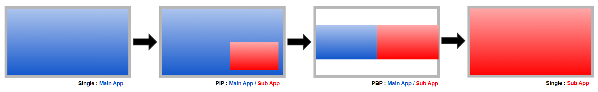

#. Main App Full-size: displays the main app in full-size (Main scaler)
#. PIP: displays both the main and sub apps in PIP mode (Main / Sub scaler)
#. PBP: displays both the main and sub apps in PBP mode (Main / Sub scaler)
#. Sub App Full-size: displays the sub app in full-size (Main scaler)

1. Main App Full-size (Main scaler)
"""""""""""""""""""""""""""""""""""

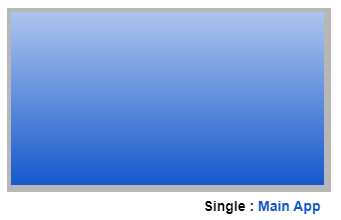

The diagram below illustrates a call sequence for displaying the main app in full-size.

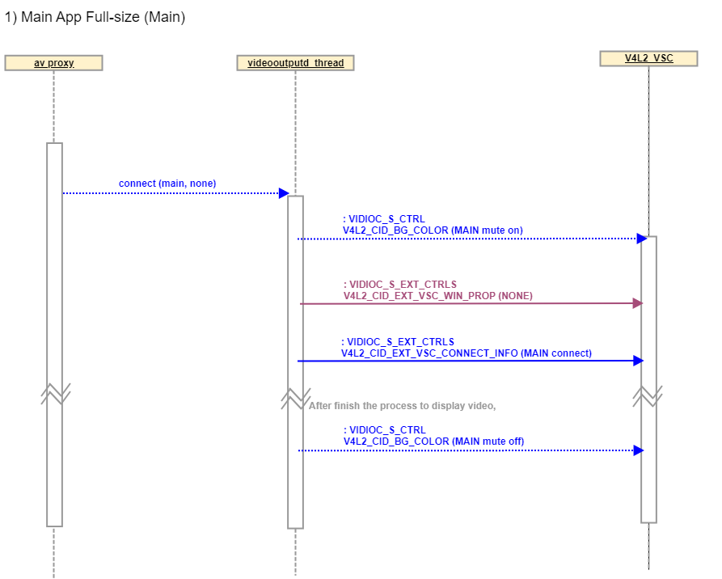

To display the main app in full-size, it is necessary to set to single window mode and connect the Main scaler. These steps are shown in the following code:

.. code-block:: cpp

    // 1. V4L2_CID_EXT_VSC_WIN_PROP -> Single
    {
        struct v4l2_ext_controls ext_controls;
        struct v4l2_ext_control ext_control;
        struct v4l2_ext_vsc_win_prop win_prop;
    
        win_prop.memoryType = V4L2_EXT_VSC_MEMORY_TYPE_NONE;
        win_prop.mirror_mode= V4L2_EXT_VSC_MIRROR_MODE_NONE;
        win_prop.modeType = V4L2_EXT_VSC_WIN_MODE_NONE;
    
        ext_controls.ctrl_class = V4L2_CTRL_CLASS_USER;
        ext_controls.count = 1;
        ext_controls.controls = &ext_control;
        ext_controls.controls->id = V4L2_CID_EXT_VSC_WIN_PROP;
        ext_controls.controls->ptr = (void *)&win_prop;
    
        ioctl(fd_scaler_1, VIDIOC_S_EXT_CTRLS, &ext_controls);
    }
    
    // 2. V4L2_CID_EXT_VSC_CONNECT_INFO -> Connect Main Scaler
    {
        struct v4l2_ext_controls ext_controls;
        struct v4l2_ext_control ext_control;
        struct v4l2_ext_vsc_connect_info info;
    
        info.in.src = V4L2_EXT_VSC_INPUT_SRC_HDMI;
        info.in.index = 1;
        info.out_mode = V4L2_EXT_VSC_DEST_DISPLAY;
    
        ext_controls.ctrl_class    = V4L2_CTRL_CLASS_USER;
        ext_controls.count = 1;
        ext_controls.controls = &ext_control;
        ext_controls.controls->id = V4L2_CID_EXT_VSC_CONNECT_INFO;
        ext_controls.controls->ptr = (void *)&info;
    
        ioctl(fd_scaler_0, VIDIOC_S_EXT_CTRLS, &ext_controls);
    }

2. PIP (Main / Sub scaler)
""""""""""""""""""""""""""

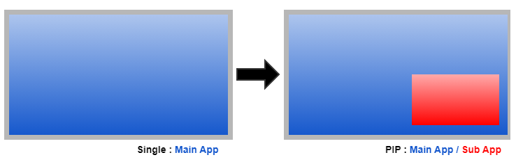

The diagram below illustrates a call sequence for switching from single window mode to PIP mode, which displays both the main and sub apps. 

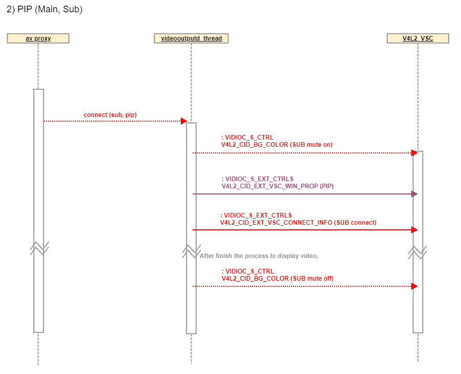

To switch from single window mode to PIP mode, it is necessary to set to PIP mode and connect the Sub scaler. These steps are shown in the following code:

.. code-block:: cpp

    // 1. V4L2_CID_EXT_VSC_WIN_PROP -> PIP
    {
        struct v4l2_ext_controls ext_controls;
        struct v4l2_ext_control ext_control;
        struct v4l2_ext_vsc_win_prop win_prop;
    
        win_prop.memoryType = V4L2_EXT_VSC_MEMORY_TYPE_MULTI;
        win_prop.mirror_mode= V4L2_EXT_VSC_MIRROR_MODE_OFF;
        win_prop.modeType = V4L2_EXT_VSC_WIN_MODE_PIP;
    
        ext_controls.ctrl_class = V4L2_CTRL_CLASS_USER;
        ext_controls.count = 1;
        ext_controls.controls = &ext_control;
        ext_controls.controls->id = V4L2_CID_EXT_VSC_WIN_PROP;
        ext_controls.controls->ptr = (void *)&win_prop;
    
        ioctl(fd_scaler_1, VIDIOC_S_EXT_CTRLS, &ext_controls);
    }
    
    // 2. V4L2_CID_EXT_VSC_CONNECT_INFO -> Connect Sub Scaler
    {
        struct v4l2_ext_controls ext_controls;
        struct v4l2_ext_control ext_control;
        struct v4l2_ext_vsc_connect_info info;
    
        info.in.src = V4L2_EXT_VSC_INPUT_SRC_VDEC;
        info.in.index = 2;
        info.out_mode = V4L2_EXT_VSC_DEST_DISPLAY;
    
        ext_controls.ctrl_class    = V4L2_CTRL_CLASS_USER;
        ext_controls.count = 1;
        ext_controls.controls = &ext_control;
        ext_controls.controls->id = V4L2_CID_EXT_VSC_CONNECT_INFO;
        ext_controls.controls->ptr = (void *)&info;
    
        ioctl(fd_scaler_1, VIDIOC_S_EXT_CTRLS, &ext_controls);
    }

3. PBP (Main / Sub scaler)
""""""""""""""""""""""""""

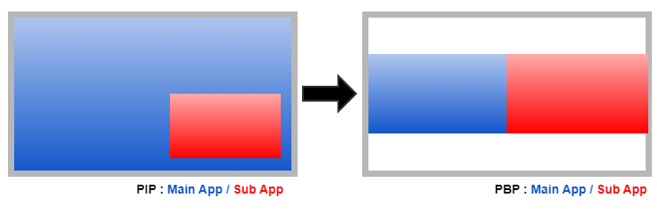

The diagram below illustrates a call sequence for switching from PIP mode to PBP mode, which displays both the main and sub apps. 

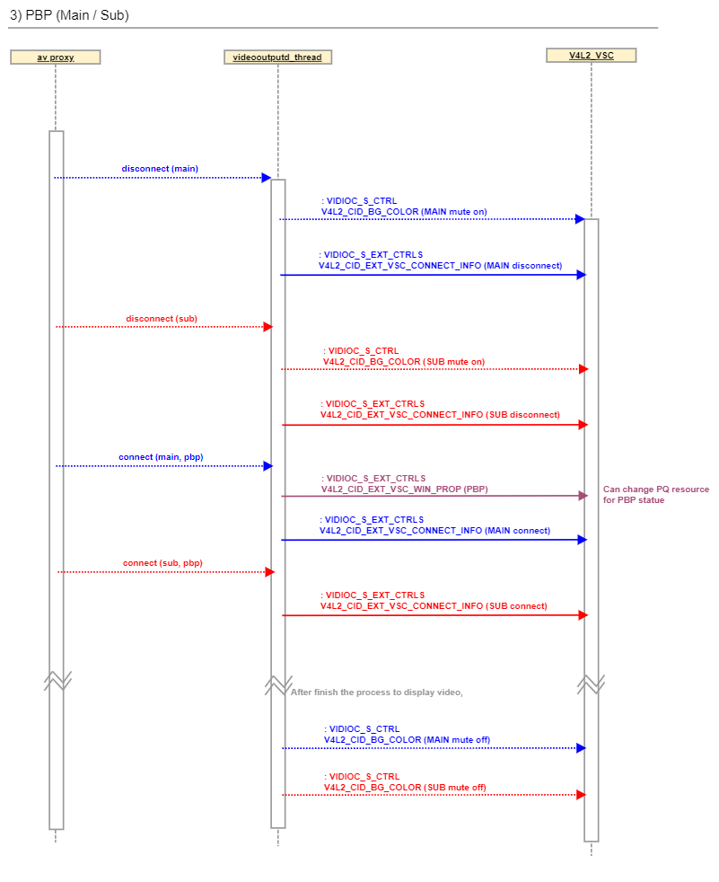

To switch from PIP mode to PBP mode, it is necessary to disconnect the Main and Sub scalers, set to PBP mode, and then reconnect the Main and Sub scalers. These steps are shown in the following code:

.. code-block:: cpp

    // 1. V4L2_CID_EXT_VSC_CONNECT_INFO -> Disconnect Main Scaler
    {
        struct v4l2_ext_controls ext_controls;
        struct v4l2_ext_control ext_control;
        struct v4l2_ext_vsc_connect_info info;
    
        info.in.src = V4L2_VSC_EXT_INPUT_SRC_NONE;
        info.out = V4L2_EXT_VSC_DEST_NONE;
    
        ext_controls.ctrl_class    = V4L2_CTRL_CLASS_USER;
        ext_controls.count = 1;
        ext_controls.controls = &ext_control;
        ext_controls.controls->id = V4L2_CID_EXT_VSC_CONNECT_INFO;
        ext_controls.controls->ptr = (void *)&info;
    
        ioctl(fd_scaler_0), VIDIOC_G_EXT_CTRLS, &ext_controls);
    }
    
    // 2. V4L2_CID_EXT_VSC_CONNECT_INFO -> Disconnect Sub Scaler
    {
        struct v4l2_ext_controls ext_controls;
        struct v4l2_ext_control ext_control;
        struct v4l2_ext_vsc_connect_info info;
    
        info.in.src = V4L2_VSC_EXT_INPUT_SRC_NONE;
        info.out = V4L2_EXT_VSC_DEST_NONE;
    
        ext_controls.ctrl_class    = V4L2_CTRL_CLASS_USER;
        ext_controls.count = 1;
        ext_controls.controls = &ext_control;
        ext_controls.controls->id = V4L2_CID_EXT_VSC_CONNECT_INFO;
        ext_controls.controls->ptr = (void *)&info;
    
        ioctl(fd_scaler_1), VIDIOC_G_EXT_CTRLS, &ext_controls);
    }
    
    // 3. V4L2_CID_EXT_VSC_WIN_PROP -> PBP
    {
        struct v4l2_ext_controls ext_controls;
        struct v4l2_ext_control ext_control;
        struct v4l2_ext_vsc_win_prop win_prop;
    
        win_prop.memoryType = V4L2_EXT_VSC_MEMORY_TYPE_MULTI;
        win_prop.mirror_mode= V4L2_EXT_VSC_MIRROR_MODE_OFF;
        win_prop.modeType = V4L2_EXT_VSC_WIN_MODE_PBP;
    
        ext_controls.ctrl_class = V4L2_CTRL_CLASS_USER;
        ext_controls.count = 1;
        ext_controls.controls = &ext_control;
        ext_controls.controls->id = V4L2_CID_EXT_VSC_WIN_PROP;
        ext_controls.controls->ptr = (void *)&win_prop;
    
        ioctl(fd_scaler_1, VIDIOC_S_EXT_CTRLS, &ext_controls);
    }
    
    // 4. V4L2_CID_EXT_VSC_CONNECT_INFO -> Connect Main Scaler
    {
        struct v4l2_ext_controls ext_controls;
        struct v4l2_ext_control ext_control;
        struct v4l2_ext_vsc_connect_info info;
    
        info.in.src = V4L2_EXT_VSC_INPUT_SRC_HDMI;
        info.in.index = 1;
        info.out_mode = V4L2_EXT_VSC_DEST_DISPLAY;
    
        ext_controls.ctrl_class    = V4L2_CTRL_CLASS_USER;
        ext_controls.count = 1;
        ext_controls.controls = &ext_control;
        ext_controls.controls->id = V4L2_CID_EXT_VSC_CONNECT_INFO;
        ext_controls.controls->ptr = (void *)&info;
    
        ioctl(fd_scaler_0, VIDIOC_S_EXT_CTRLS, &ext_controls);
    }
    
    // 5. V4L2_CID_EXT_VSC_CONNECT_INFO -> Connect Sub Scaler
    {
        struct v4l2_ext_controls ext_controls;
        struct v4l2_ext_control ext_control;
        struct v4l2_ext_vsc_connect_info info;
    
        info.in.src = V4L2_EXT_VSC_INPUT_SRC_VDEC;
        info.in.index = 2;
        info.out_mode = V4L2_EXT_VSC_DEST_DISPLAY;
    
        ext_controls.ctrl_class    = V4L2_CTRL_CLASS_USER;
        ext_controls.count = 1;
        ext_controls.controls = &ext_control;
        ext_controls.controls->id = V4L2_CID_EXT_VSC_CONNECT_INFO;
        ext_controls.controls->ptr = (void *)&info;
    
        ioctl(fd_scaler_1, VIDIOC_S_EXT_CTRLS, &ext_controls);
    }

4. Sub App Full-size (Main scaler)
""""""""""""""""""""""""""""""""""

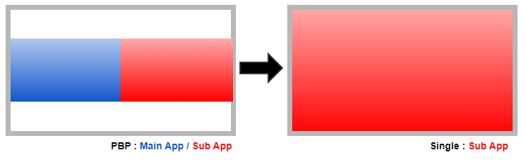

The diagram below illustrates a call sequence for switching from PBP mode to single window mode, which displays the sub app in full size. 

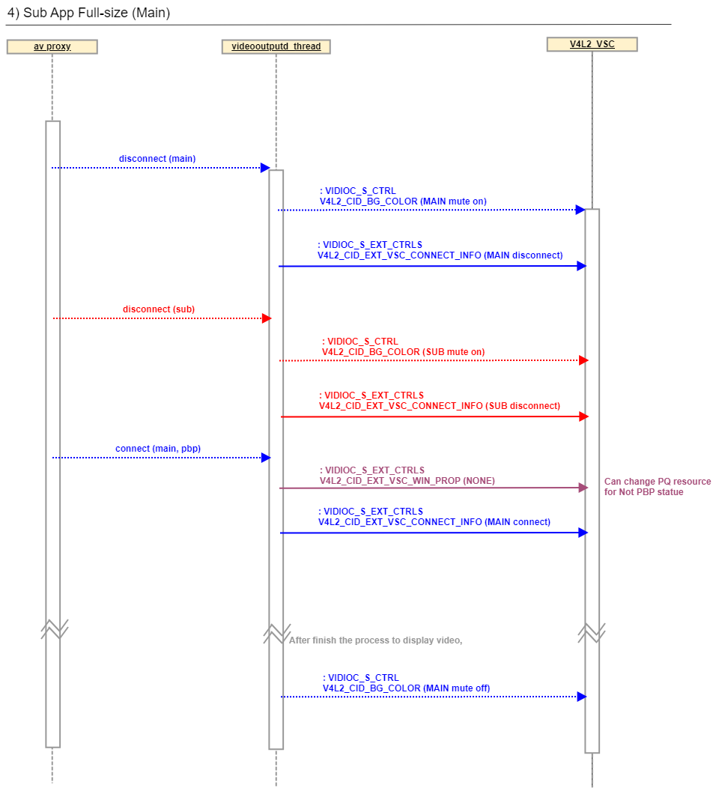

To switch from PBP mode to the single window mode, it is necessary to disconnect the Main and Sub scalers, set to the single window mode, and then reconnect the Main and Sub scalers. These steps are shown in the following code:

.. code-block:: cpp

    // 1. V4L2_CID_EXT_VSC_CONNECT_INFO -> Disconnect Main Scaler
    {
        struct v4l2_ext_controls ext_controls;
        struct v4l2_ext_control ext_control;
        struct v4l2_ext_vsc_connect_info info;
    
        info.in.src = V4L2_VSC_EXT_INPUT_SRC_NONE;
        info.out = V4L2_EXT_VSC_DEST_NONE;
    
        ext_controls.ctrl_class    = V4L2_CTRL_CLASS_USER;
        ext_controls.count = 1;
        ext_controls.controls = &ext_control;
        ext_controls.controls->id = V4L2_CID_EXT_VSC_CONNECT_INFO;
        ext_controls.controls->ptr = (void *)&info;
    
        ioctl(fd_scaler_0), VIDIOC_G_EXT_CTRLS, &ext_controls);
    }
    
    // 2. V4L2_CID_EXT_VSC_CONNECT_INFO -> Disconnect Sub Scaler
    {
        struct v4l2_ext_controls ext_controls;
        struct v4l2_ext_control ext_control;
        struct v4l2_ext_vsc_connect_info info;
    
        info.in.src = V4L2_VSC_EXT_INPUT_SRC_NONE;
        info.out = V4L2_EXT_VSC_DEST_NONE;
    
        ext_controls.ctrl_class    = V4L2_CTRL_CLASS_USER;
        ext_controls.count = 1;
        ext_controls.controls = &ext_control;
        ext_controls.controls->id = V4L2_CID_EXT_VSC_CONNECT_INFO;
        ext_controls.controls->ptr = (void *)&info;
    
        ioctl(fd_scaler_1), VIDIOC_G_EXT_CTRLS, &ext_controls);
    }
    
    // 3. V4L2_CID_EXT_VSC_WIN_PROP -> Single
    {
        struct v4l2_ext_controls ext_controls;
        struct v4l2_ext_control ext_control;
        struct v4l2_ext_vsc_win_prop win_prop;
    
        win_prop.memoryType = V4L2_EXT_VSC_MEMORY_TYPE_NONE;
        win_prop.mirror_mode= V4L2_EXT_VSC_MIRROR_MODE_NONE;
        win_prop.modeType = V4L2_EXT_VSC_WIN_MODE_NONE;
    
        ext_controls.ctrl_class = V4L2_CTRL_CLASS_USER;
        ext_controls.count = 1;
        ext_controls.controls = &ext_control;
        ext_controls.controls->id = V4L2_CID_EXT_VSC_WIN_PROP;
        ext_controls.controls->ptr = (void *)&win_prop;
    
        ioctl(fd_scaler_1, VIDIOC_S_EXT_CTRLS, &ext_controls);
    }
    
    // 4. V4L2_CID_EXT_VSC_CONNECT_INFO -> Connect Main Scaler
    {
        struct v4l2_ext_controls ext_controls;
        struct v4l2_ext_control ext_control;
        struct v4l2_ext_vsc_connect_info info;
    
        info.in.src = V4L2_EXT_VSC_INPUT_SRC_HDMI;
        info.in.index = 1;
        info.out_mode = V4L2_EXT_VSC_DEST_DISPLAY;
    
        ext_controls.ctrl_class    = V4L2_CTRL_CLASS_USER;
        ext_controls.count = 1;
        ext_controls.controls = &ext_control;
        ext_controls.controls->id = V4L2_CID_EXT_VSC_CONNECT_INFO;
        ext_controls.controls->ptr = (void *)&info;
    
        ioctl(fd_scaler_0, VIDIOC_S_EXT_CTRLS, &ext_controls);
    }

Example Scenario 2
^^^^^^^^^^^^^^^^^^

In Example Scenario 2, the Multi View mode is switched as follows:

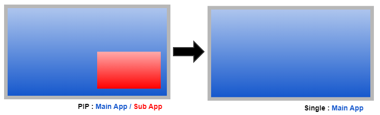

#. PIP: displays both the main and sub apps in PIP mode (Main / Sub scaler)
#. Main App Full-size: displays the main app in full-size (Main scaler)

The diagram below illustrates a call sequence for switching from PIP mode to single window mode, which displays the main app in full size.

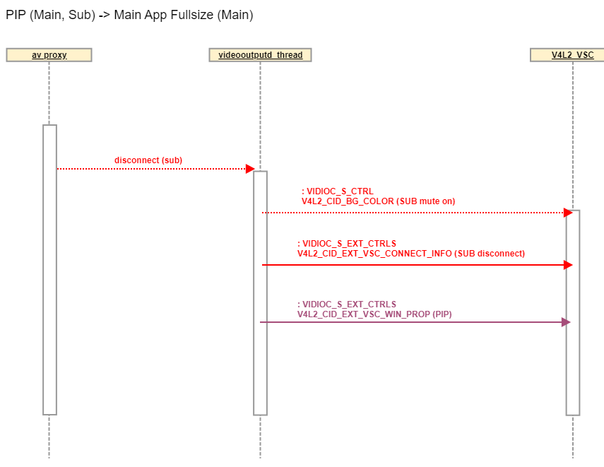

To switch from PIP mode to the single window mode, it is necessary to disconnect the Sub scalers, set to the single window mode. These steps are shown in the following code:

.. code-block:: cpp

    // 1. V4L2_CID_EXT_VSC_CONNECT_INFO -> Disconnect Sub Scaler
    {
        struct v4l2_ext_controls ext_controls;
        struct v4l2_ext_control ext_control;
        struct v4l2_ext_vsc_connect_info info;
    
        info.in.src = V4L2_VSC_EXT_INPUT_SRC_NONE;
        info.out = V4L2_EXT_VSC_DEST_NONE;
    
        ext_controls.ctrl_class    = V4L2_CTRL_CLASS_USER;
        ext_controls.count = 1;
        ext_controls.controls = &ext_control;
        ext_controls.controls->id = V4L2_CID_EXT_VSC_CONNECT_INFO;
        ext_controls.controls->ptr = (void *)&info;
    
        ioctl(fd_scaler_1), VIDIOC_G_EXT_CTRLS, &ext_controls);
    }
    
    // 2. V4L2_CID_EXT_VSC_WIN_PROP -> Single
    {
        struct v4l2_ext_controls ext_controls;
        struct v4l2_ext_control ext_control;
        struct v4l2_ext_vsc_win_prop win_prop;
    
        win_prop.memoryType = V4L2_EXT_VSC_MEMORY_TYPE_NONE;
        win_prop.mirror_mode= V4L2_EXT_VSC_MIRROR_MODE_NONE;
        win_prop.modeType = V4L2_EXT_VSC_WIN_MODE_NONE;
    
        ext_controls.ctrl_class = V4L2_CTRL_CLASS_USER;
        ext_controls.count = 1;
        ext_controls.controls = &ext_control;
        ext_controls.controls->id = V4L2_CID_EXT_VSC_WIN_PROP;
        ext_controls.controls->ptr = (void *)&win_prop;
    
        ioctl(fd_scaler_1, VIDIOC_S_EXT_CTRLS, &ext_controls);
    }

Dynamic Aspect Ratio
--------------------

To implement Dynamic Aspect Ratio, complete these checklist:

- Implement the interface that directly receives resolution, AFD, and PAR information from the VDEC driver.
- Implement :c:macro:`V4L2_CID_EXT_VSC_ASPECTRATIO_POLICY` that receives Aspect Ratio UI and Policy from the videooutputd service
- Implement export_vsc_adapter. Aspect Ratio Library use export_vsc_adapter to register the callback of ``aspectratiodrvCalculateWindow()``.
- When the Adaptive Stream flag is 2 (Dynamic Aspect Ratio Mode), calculate the aspect ratio from ``aspectratiodrvCalculateWindow()`` registered in export_vsc_adapter and scaled in units of frames.
- When scaling aspect ratio by changing resolution, AFD, and PAR, it must be applied seamlessly.
- The following sections describe Aspect Ratio Library and how to Implement export_vsc_adapter mentioned above.

Aspect Ratio Library API
^^^^^^^^^^^^^^^^^^^^^^^^

| LG will provide the Aspect Ratio Library (aspectratiodrv.ko), which offers the ``aspectratiodrvCalculateWindow()``, ``orbitdrvWindowConvert()``, and ``orbitdrvMoveConvert()`` API. 

| The following tables provide the functional specification of ``aspectratiodrvCalculateWindow()``, ``orbitdrvWindowConvert()``, and ``orbitdrvMoveConvert()`` API.

aspectratiodrvCalculateWindow
"""""""""""""""""""""""""""""

+---------------+---------------------------------------------------------------------------------------------------------------------------------------------------------------------+
| Description   | Calculates aspect ratio window.                                                                                                                                     |
+===============+=====================================================================================================================================================================+
| Syntax        | .. code-block:: cpp                                                                                                                                                 |
|               |                                                                                                                                                                     |
|               |     int aspectratiodrvCalculateWindow(                                                                                                                              |
|               |     // Input Parameter                                                                                                                                              |
|               |     struct v4l2_ext_video_rect source_rect,        // Resolution of input source                                                                                    |
|               |     struct v4l2_ext_video_rect output_rect,        // Output region to display video                                                                                |
|               |     unsigned short wss_afd,                        // AFD or WSS of input source                                                                                    |
|               |     unsigned short par_width,                      // PAR width of input source                                                                                     |
|               |     unsigned short par_height,                     // PAR height of input source                                                                                    |
|               |     struct v4l2_ext_system_policy system_policy,   // webOS policy of system                                                                                        |
|               |     struct v4l2_ext_setting_policy setting_policy, // webOS policy of setting                                                                                       |
|               |                                                                                                                                                                     |
|               |     // Output Parameter                                                                                                                                             |
|               |     struct v4l2_ext_video_rect *calculated_input_rect, // calculated crop region for input source                                                                   |
|               |     struct v4l2_ext_video_rect *calculated_output_rect // calculated output region to display video                                                                 |
|               |     );                                                                                                                                                              |
|               |                                                                                                                                                                     |
+---------------+---------------------------------------------------------------------------------------------------------------------------------------------------------------------+
| Input         | - source_rect: Resolution of the input source.                                                                                                                      |
|               | - output_rect: The output region to display video. This is an app policy. videooutputd will offer this information through V4L2_CID_EXT_VSC_ASPECTRATIO_POLICY.     |
|               | - wss_afd: AFD or WSS of the input source.                                                                                                                          |
|               | - par_width: PAR width of the input source.                                                                                                                         |
|               | - par_height: PAR height of the input source.                                                                                                                       |
|               | - system_policy: webOS policy of the system. videooutputd will offer this information through V4L2_CID_EXT_VSC_ASPECTRATIO_POLICY.                                  |
|               | - setting_policy: webOS policy of the Settings service. videooutputd will offer this information through V4L2_CID_EXT_VSC_ASPECTRATIO_POLICY.                       |
+---------------+---------------------------------------------------------------------------------------------------------------------------------------------------------------------+
| Output        | - calculated_input_rect: A pointer to the calculated crop region for the input source.                                                                              |
|               | - calculated_output_rect: A pointer to the calculated output region to display video.                                                                               |
+---------------+---------------------------------------------------------------------------------------------------------------------------------------------------------------------+
| Return Value  | Returns the API result. (0 means OK / 1 means NOT OK)                                                                                                               |
+---------------+---------------------------------------------------------------------------------------------------------------------------------------------------------------------+

orbitWindowConvert
""""""""""""""""""

+---------------+----------------------------------------------------------------------------------------------------------------------------------------------------------+
| Description   | Converts orbit window from basic size to real size calculated from aspect ratio window.                                                                  |
+===============+==========================================================================================================================================================+
| Syntax        | .. code-block:: cpp                                                                                                                                      |
|               |                                                                                                                                                          |
|               |     int orbitdrvWindowConvert(                                                                                                                           |
|               |     // Input Parameter                                                                                                                                   |
|               |     struct v4l2_ext_system_policy system_policy,        // webOS policy of system                                                                        |
|               |     struct v4l2_ext_video_rect calculated_input_rect,   // calculated crop region for input source                                                       |
|               |     struct v4l2_ext_video_rect calculated_output_rect,  // calculated output region to display video                                                     |
|               |     v4l2_ext_vsc_orbit_window orbit_window,             // orbit_window from videooutputd                                                                |
|               |                                                                                                                                                          |
|               |     // Output Parameter                                                                                                                                  |
|               |     4l2_ext_vsc_orbit_window &calculated_orbit_window  // calculated_orbit_window for real size orbit                                                    |
|               |     );                                                                                                                                                   |
|               |                                                                                                                                                          |
+---------------+----------------------------------------------------------------------------------------------------------------------------------------------------------+
| Input         | - setting_policy: webOS policy of the Settings service. videooutputd will offer this information through V4L2_CID_EXT_VSC_ASPECTRATIO_POLICY.            |
|               | - calculated_input_rect: The calculated crop region for the input source from aspectratiodrvCalculateWindow().                                           |
|               | - calculated_output_rect: The calculated output region to display video from aspectratiodrvCalculateWindow().                                            |
|               | - orbit_window : The basic window region for orbit. videooutputd will offer this information through V4L2_CID_EXT_VSC_ORBIT_WINDOW.                      |
+---------------+----------------------------------------------------------------------------------------------------------------------------------------------------------+
| Output        | - calculated_orbit_window: A pointer to the calculated orbit window region for real size orbit.                                                          |
+---------------+----------------------------------------------------------------------------------------------------------------------------------------------------------+
| Return Value  | Returns the API result. (0 means OK / 1 means NOT OK)                                                                                                    |
+---------------+----------------------------------------------------------------------------------------------------------------------------------------------------------+

orbitdrvMoveConvert
"""""""""""""""""""

+---------------+----------------------------------------------------------------------------------------------------------------------------------------------------------+
| Description   | Converts orbit move from basic size to real size calculated from aspect ratio window.                                                                    |
+===============+==========================================================================================================================================================+
| Syntax        | .. code-block:: cpp                                                                                                                                      |
|               |                                                                                                                                                          |
|               |     int orbitdrvMoveConvert(                                                                                                                             |
|               |     // Input Parameter                                                                                                                                   |
|               |     struct v4l2_ext_system_policy system_policy,        // webOS policy of system                                                                        |
|               |     v4l2_ext_vsc_orbit_window orbit_window,             // orbit_window from videooutputd                                                                |
|               |     v4l2_ext_vsc_orbit_window calculated_orbit_window   // calculated_orbit_window for real size orbit                                                   |
|               |     v4l2_ext_vsc_orbit_move orbit_move,                 // orbit_move from videooutputd                                                                  |
|               |                                                                                                                                                          |
|               |     // Output Parameter                                                                                                                                  |
|               |     v4l2_ext_vsc_orbit_move orbit_move,                 // orbit_move from videooutputd                                                                  |
|               |     );                                                                                                                                                   |
|               |                                                                                                                                                          |
+---------------+----------------------------------------------------------------------------------------------------------------------------------------------------------+
| Input         | - setting_policy: webOS policy of the Settings service. videooutputd will offer this information through V4L2_CID_EXT_VSC_ASPECTRATIO_POLICY.            |
|               | - orbit_window : The basic window region for orbit. videooutputd will offer this information through V4L2_CID_EXT_VSC_ORBIT_WINDOW.                      |
|               | - alculated_orbit_window: The calculated orbit window region for real size orbit.                                                                        |
|               | - orbit_move : The basic move region for orbit. videooutputd will offer this information through V4L2_CID_EXT_VSC_ORBIT_MOVE.                            |
+---------------+----------------------------------------------------------------------------------------------------------------------------------------------------------+
| Output        | - calculated_orbit_move: A pointer to the calculated orbit move region for real size orbit.                                                              |
+---------------+----------------------------------------------------------------------------------------------------------------------------------------------------------+
| Return Value  | Returns the API result. (0 means OK / 1 means NOT OK)                                                                                                    |
+---------------+----------------------------------------------------------------------------------------------------------------------------------------------------------+

Implementing Export VSC Adapter
^^^^^^^^^^^^^^^^^^^^^^^^^^^^^^^

| Since the VSC driver in the kernel space cannot call the ``aspectratiodrvCalculateWindow()`` function directly, the VSC driver uses Export VSC Adapter to call the function of Aspect Ratio Library on the kernel driver. Export VSC Adapter only provides the register callback function to the Aspect Ratio Library.

| Implement the ``export_vsc_adapter.h`` / ``export_vsc_adapter.c`` on the VSC driver. The following code shows the ``export_vsc_adapter.h``.

.. code-block:: cpp

    #ifndef _EXPORT_VSC_ADAPTER_
    #define _EXPORT_VSC_ADAPTER_
    
    typedef struct ASPECTRATIO_CALLBACK {
        int (*pfnAspectratiodrvCalculate)(
            struct v4l2_ext_video_rect,     // source_rect, Resolution of input source
            struct v4l2_ext_video_rect,     // output_rect, Output region to display video
            unsigned short,                 // wss_afd, AFD or WSS of input source
            unsigned short,                 // par_width, PAR width of input source
            unsigned short,                 // par_height, PAR height of input source
            struct v4l2_ext_system_policy,  // system_policy, webOS policy of system
            struct v4l2_ext_setting_policy, // setting_policy, webOS policy of setting
            struct v4l2_ext_video_rect *,   // calculated_input_rect, calculated crop region for input source
            struct v4l2_ext_video_rect *    // calculated_output_rect, calculated output region to display video
            );
    
        int (*pfnOrbitdrvMoveConvert)(struct v4l2_ext_system_policy,    // system_policy, webOS policy of system
                                    struct v4l2_ext_vsc_orbit_window, // old_orbit_window
                                    struct v4l2_ext_vsc_orbit_window, // new_orbit_window
                                    struct v4l2_ext_vsc_orbit_move,   // orbit_move
                                    struct v4l2_ext_vsc_orbit_move *  // calculated_orbit_move
                                    );
    
        int (*pfnOrbitdrvWindowConvert)(
            struct v4l2_ext_system_policy,     // system_policy, webOS policy of system
            struct v4l2_ext_video_rect,        // input_rect, calculated crop region for input source
            struct v4l2_ext_video_rect,        // output_rect, calculated output region to display video
            struct v4l2_ext_vsc_orbit_window,  // orbit_window
            struct v4l2_ext_vsc_orbit_window * // calculated_orbit_window
            );
    } ASPECTRATIO_CALLBACK_T;
    
    void vsc_registerAspectratioCB(ASPECTRATIO_CALLBACK_T *pfn);
    ASPECTRATIO_CALLBACK_T *vsc_getAspectratioCalculateFp(void);
    ASPECTRATIO_CALLBACK_T *vsc_getOrbitdrvMoveConvertFp(void);
    ASPECTRATIO_CALLBACK_T *vsc_getOrbitdrvWindowConvertFp(void);
    
    #endif // _EXPORT_VSC_ADAPTER_

The following code shows the ``export_vsc_adapter.c``.

.. code-block:: cpp

    #include "export_vsc_adapter.h"
    #include <linux/export.h>
    #include <stddef.h>
    
    bool gDoneRegisterAspectratioCB = false;
    bool gDoneRegisterOrbitdrvMoveConvertCB = false;
    bool gDoneRegisterOrbitdrvWindowConvertCB = false;
    
    ASPECTRATIO_CALLBACK_T gAspectratioCallbackFp;
    
    void vsc_registerAspectratioCB(ASPECTRATIO_CALLBACK_T *pfn)
    {
        if (pfn != NULL) {
            if (pfn->pfnAspectratiodrvCalculate != NULL) {
                gAspectratioCallbackFp.pfnAspectratiodrvCalculate = pfn->pfnAspectratiodrvCalculate;
                gDoneRegisterAspectratioCB                        = true;
            } else // if (pfn->pfnAspectratiodrvCalculate == NULL) {
                gAspectratioCallbackFp.pfnAspectratiodrvCalculate = NULL;
                gDoneRegisterAspectratioCB                        = false;
            }
    
            if (pfn->pfnOrbitdrvMoveConvert != NULL) {
                gAspectratioCallbackFp.pfnOrbitdrvMoveConvert     = pfn->pfnOrbitdrvMoveConvert;
                gDoneRegisterOrbitdrvMoveConvertCB                = true;
            } else // if (pfn->pfnOrbitdrvMoveConvert == NULL) {
                gAspectratioCallbackFp.pfnOrbitdrvMoveConvert     = NULL;
                gDoneRegisterOrbitdrvMoveConvertCB                = false;
            }
    
            if (pfn->pfnOrbitdrvWindowConvert != NULL) {
                gAspectratioCallbackFp.pfnOrbitdrvWindowConvert   = pfn->pfnOrbitdrvWindowConvert;
                gDoneRegisterOrbitdrvWindowConvertCB              = true;
            } else // if (pfn->pfnOrbitdrvWindowConvert == NULL) {
                gAspectratioCallbackFp.pfnOrbitdrvWindowConvert   = NULL;
                gDoneRegisterOrbitdrvWindowConvertCB              = false;
            }
        } else // if (pfn == NULL) {
            gAspectratioCallbackFp.pfnAspectratiodrvCalculate = NULL;
            gAspectratioCallbackFp.pfnOrbitdrvMoveConvert     = NULL;
            gAspectratioCallbackFp.pfnOrbitdrvWindowConvert   = NULL;
            gDoneRegisterAspectratioCB                        = false;
            gDoneRegisterOrbitdrvMoveConvertCB                = false;
            gDoneRegisterOrbitdrvWindowConvertCB              = false;
        }
    }
    EXPORT_SYMBOL(vsc_registerAspectratioCB);
    
    ASPECTRATIO_CALLBACK_T *vsc_getAspectratioCalculateFp(void)
    {
        if (gDoneRegisterAspectratioCB)
            return &gAspectratioCallbackFp.pfnAspectratiodrvCalculate;
        else
            return NULL;
    }
    EXPORT_SYMBOL(vsc_getAspectratioCalculateFp);
    
    ASPECTRATIO_CALLBACK_T *vsc_getOrbitdrvMoveConvertFp(void)
    {
        if (gDoneRegisterOrbitdrvMoveConvertCB)
            return &gAspectratioCallbackFp.pfnOrbitdrvMoveConvert;
        else
            return NULL;
    }
    EXPORT_SYMBOL(vsc_getOrbitdrvMoveConvertFp);
    
    ASPECTRATIO_CALLBACK_T *vsc_getOrbitdrvWindowConvertFp(void)
    {
        if (gDoneRegisterOrbitdrvWindowConvertCB)
            return &gAspectratioCallbackFp.pfnOrbitdrvWindowConvert;
        else
            return NULL;
    }
    EXPORT_SYMBOL(vsc_getOrbitdrvWindowConvertFp);

The following code shows how to call the callback function of the ``aspectratiodrvCalculateWindow()`` API through Export VSC Adpater on the VSC driver (dynamic aspect ratio body).

.. code-block:: cpp

    #include "export_vsc_adapter.h"
    #include "videodev2-ext.h"
    
    
    struct v4l2_ext_vsc_aspectratio_policy aspectratio_policy; // policy from videooutputd thru V4L2_CID_EXT_VSC_ASPECTRATIO_POLICY
    int adaptive_stream_flag;                                  // 0 (Off), 1 (On), 2 (Dynamic Aspect Ratop)
    
    struct v4l2_ext_video_rect source_rect;                    // Resolution from input source
    unsigned short wss_afd;                                    // AFD or WSS from input source
    unsigned short par_width;                                  // PAR width from input source
    unsigned short par_height;                                 // PAR height from input source
    
    struct v4l2_ext_video_rect calculated_input_rect;  // calculated crop region for input source
    struct v4l2_ext_video_rect calculated_output_rect; // calculated output region to display video
    
    
    ioctl
    {
        switch (controls->id)
        {
            case V4L2_CID_EXT_VSC_ADAPTIVE_STREAM :
                adaptive_stream_flag = control.value;
    
            case V4L2_CID_EXT_VSC_ASPECTRATIO_POLICY :
                aspectratio_policy.out = controls->ptr->out;
                aspectratio_policy.system_policy = controls->ptr->system_policy;
                aspectratio_policy.setting_policy = controls->ptr->setting_policy;
        }
    }
    
    
    dynamic_aspectratio_body
    {
        int ret;
    
        if (adaptive_stream_flag == 2 && vsc_getAspectratioCallbackFp->pfnAspectratiodrvCalculate != NULL)
        {
            ret = vsc_getAspectratioCallbackFp->pfnAspectratiodrvCalculate(
                    source_rect,                        // Resolution of input source
                    aspectratio_policy.out,             // Output region to display video
                    wss_afd,                            // AFD or WSS of input source
                    par_width,                          // PAR width of input source
                    par_height,                         // PAR height of input source
                    aspectratio_policy.system_policy,   // webOS policy of system
                    aspectratio_policy.setting_policy,  // webOS policy of setting
            
                    &calculated_input_rect, // calculated crop region for input source
                    &calculated_output_rect // calculated output region to display video
                    );
        }
    }

The following code shows how to call the callback function of the ``orbitdrvWindowConvert`` / ``orbitdrvMoveConvert()`` API through Export VSC Adpater on the VSC driver (dynamic aspect ratio body) **for only OLED models.**

.. code-block:: cpp

    #include "export_vsc_adapter.h"
    #include "videodev2-ext.h"
    
    
    struct v4l2_ext_vsc_aspectratio_policy aspectratio_policy; // policy from videooutputd thru V4L2_CID_EXT_VSC_ASPECTRATIO_POLICY
    struct v4l2_ext_vsc_orbit_window orbit_window;             // orbit_window from videooutputd thru V4L2_CID_EXT_VSC_ORBIT_WINDOW
    struct v4l2_ext_vsc_orbit_move orbit_move;                 // orbit_move from videooutputd thru V4L2_CID_EXT_VSC_ORBIT_MOVE
    int adaptive_stream_flag;                                  // 0 (Off), 1 (On), 2 (Dynamic Aspect Ratop)
    
    struct v4l2_ext_video_rect source_rect;                    // Resolution from input source
    unsigned short wss_afd;                                    // AFD or WSS from input source
    unsigned short par_width;                                  // PAR width from input source
    unsigned short par_height;                                 // PAR height from input source
    
    struct v4l2_ext_video_rect calculated_input_rect;          // calculated crop region for input source
    struct v4l2_ext_video_rect calculated_output_rect;         // calculated output region to display video
    struct v4l2_ext_vsc_orbit_window calculated_orbit_window;  // calculated_orbit_window for real size orbit
    struct v4l2_ext_vsc_orbit_move calculated_orbit_move;      // calculated_orbit_move for real size orbit
    
    
    ioctl
    {
        switch (controls->id)
        {
            case V4L2_CID_EXT_VSC_ADAPTIVE_STREAM :
                adaptive_stream_flag = control.value;
    
            case V4L2_CID_EXT_VSC_ASPECTRATIO_POLICY :
                aspectratio_policy.out = controls->ptr->out;
                aspectratio_policy.system_policy = controls->ptr->system_policy;
                aspectratio_policy.setting_policy = controls->ptr->setting_policy;
    
            case V4L2_CID_EXT_VSC_ORBIT_WINDOW :
                orbit_window.osd_input = controls->ptr->osd_input;
                orbit_window.video_input = controls->ptr->video_input;
                orbit_window.osd_output = controls->ptr->osd_output;
                orbit_window.video_output = controls->ptr->video_output;
    
            case V4L2_CID_EXT_VSC_ORBIT_MOVE :
                orbit_move.osd_input = controls->ptr->osd_input;
                orbit_move.video_input = controls->ptr->video_input;
                orbit_move.osd_output = controls->ptr->osd_output;
                orbit_move.video_output = controls->ptr->video_output;
        }
    }
    
    
    dynamic_aspectratio_body
    {
        int ret;
    
        if (adaptive_stream_flag == 2 && vsc_getAspectratioCallbackFp->pfnAspectratiodrvCalculate != NULL)
        {
            ret = vsc_getAspectratioCallbackFp->pfnAspectratiodrvCalculate(
                    source_rect,                        // Resolution of input source
                    aspectratio_policy.out,             // Output region to display video
                    wss_afd,                            // AFD or WSS of input source
                    par_width,                          // PAR width of input source
                    par_height,                         // PAR height of input source
                    aspectratio_policy.system_policy,   // webOS policy of system
                    aspectratio_policy.setting_policy,  // webOS policy of setting
            
                    &calculated_input_rect, // calculated crop region for input source
                    &calculated_output_rect // calculated output region to display video
                    );
    
            ret = vsc_getAspectratioCallbackFp->pfnOrbitdrvWindowConvert(
                    aspectratio_policy.system_policy,   // webOS policy of system 
                    calculated_input_rect,              // calculated crop region for input source
                    calculated_output_rect,             // calculated output region to display video
                    orbit_window,                       // orbit_window from videooutputd
    
                    &calculated_orbit_window // calculated_orbit_window for real size orbit
                    );
    
            ret = vsc_getAspectratioCallbackFp->pfnOrbitdrvMoveConvert(
                    aspectratio_policy.system_policy,   // webOS policy of system
                    orbit_window,                       // orbit_window from videooutputd
                    calculated_orbit_window             // calculated_orbit_window for real size orbit
                    orbit_move,                         // orbit_move from videooutputd
    
                    &calculated_orbit_move // calculated_orbit_move for real size orbit
                    );
        }
    }

Status Log
==========

To examine the status and operation of the VSC driver, you can use the status log file, a text-based log file. For more information on how to use the status log file, refer to Status Log File.

Testing
*******

| To test the implementation of the VSC driver, webOS provides SoCTS (SoC Test Suite) tests. 
| The SoCTS checks the basic operation of the VSC driver and verifies the kernel event operation for the module by using a test execution file. 
| For details, see :doc:`VSC Unit Test in SoCTS Unit Test Specification. </part4/socts/Documentation/source/producer-manual/producer-manual_v4l2/producer-manual_v4l2-vsc>`

References
**********

For additional information on related standards or technical topics, refer to:

- Part I - Video for Linux API
- `Linux Kernel Media Documentation <https://linuxtv.org/downloads/v4l-dvb-apis/>`_
