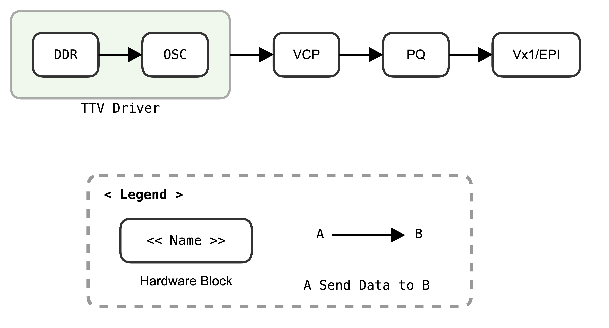
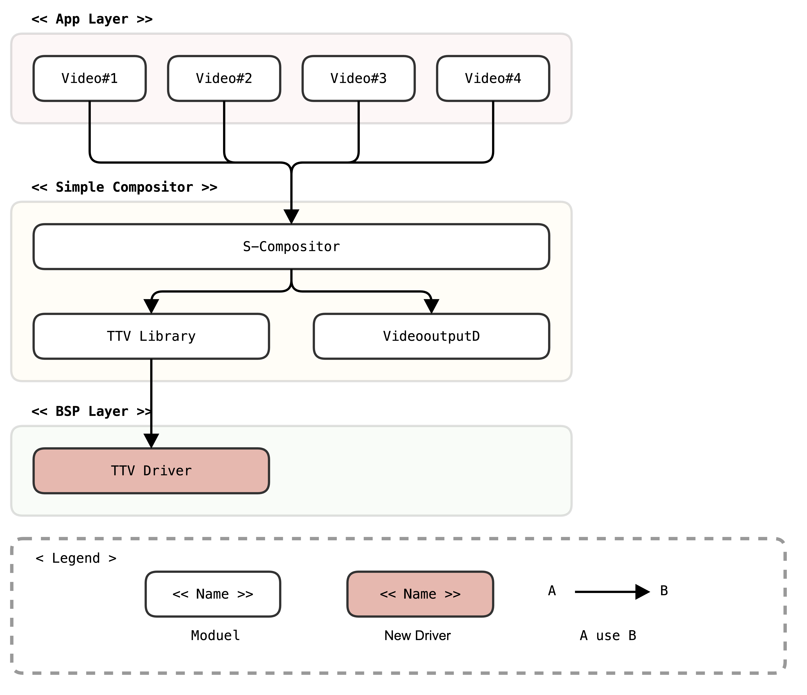
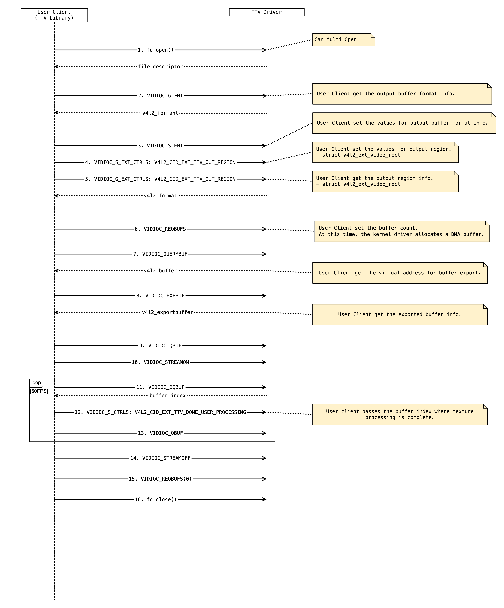

Texture to Video
################

.. _jjaem.kim: jjaem.kim@lge.com
.. _youngman.jung: youngman.jung@lge.com
.. _jinseong1.yang: jinseong1.yang@lge.com

Introduction
************

| This document describes the Texture to Video (TTV) driver in the kernel space. The document gives an overview of the TTV driver and provides details about its functionalities and implementation requirements.

| The TTV driver is based on the V4L2 framework. Therefore, the document assumes that the readers are familiar with the V4L2 API and framework principles, which include knowledge of V4L2 controls, buffer management, and streaming handling, among others.

| The TTV driver is responsible for outputting graphic texture to video path. Therefore, it is necessary to understand video processing techniques and scaling algorithms, including knowledge of video formats, resolutions, frame rates, color formats, etc.

Revision History
================

+--------------+------------+----------------------+---------------------------------------------------------------------------------------+
| Version      | Date       | Changed by           | Description                                                                           |
+==============+============+======================+=======================================================================================+
|1.0           | 2025-05-23 | `jjaem.kim`_         | 1st release.                                                                          |
+--------------+------------+----------------------+---------------------------------------------------------------------------------------+

Terminology
===========
| The key words "must", "must not", "required", "shall", "shall not", "should", "should not", "recommended", "may", and "optional" in this document are to be interpreted as described in RFC2119.

| The following table lists the terms used throughout this document:

=============================== ===============================
Term                            Description
=============================== ===============================
DDR                             DDR(Double Data Rate) memory. A type of memory that allows data to be read and written on both the rising and falling edges of the clock signal.
DMA	                            Direct Memory Access. The process of transferring data from one location to another without involving the CPU.
SGR                             Secure Graphics Rendering. A module responsible for rendering graphics securely.
V4L2                            Video for Linux 2. A video capture and output API for Linux.
=============================== ===============================

Technical Assistance
====================

| For assistance or clarification on information in this guide, please create an issue in the LGE JIRA project and contact the following person:

=============== ============
Module          Owner
=============== ============
TTV             `jjaem.kim`_
=============== ============

Overview
********

General Description
===================

| The Texture to Video (TTV) driver is based on the V4L2 framework and is responsible for outputting graphic texture to the video path. The TTV driver receives the graphic texture data, processes it, and then transmits the video output data to other modules to display on the TV screen.

Features
========

| The TTV driver provides the following features:

- Export the graphic texture buffer to the video path
    - The TTV driver exports the graphic texture buffer to the video path, allowing the graphic texture data to be processed and displayed on the TV screen.

Architecture
============

This section describes the hardware architecture and the driver architecture for texture to video.

Hardware Architecture
---------------------

The following figure shows the block diagram of the Texture to Video (TTV) driver.

| The TTV path can be divided into the following major parts:

- The TTV driver provides a DMA buffer and passes it to the OSC.
- The buffer passed to the OSC passes through the VCP and PQ H/W blocks to the output Vx1/EPI panel.

Driver Architecture
-------------------

The TTV driver architecture shown in the figure below, is mainly divided into 3 layers Application Layer, Compositor Layer and BSP Layer.

The application opens four video pipelines and connects them to the Simple Compositor.
The Simple Compositor composites the four videos into a single graphic texture and passes it to the ttv driver.
The graphic texture passed to the ttv is finally output to the video plane set by videooutputd.

Requirements
************

This section describes the main functions, operational flow, and requirements of the TTV driver.
The TTV driver is responsible for transferring graphic textures received from the user to the video path.

Functional Requirements
=======================

User Client Sequence
--------------------

| Below is the overall flow of using the TTV driver in a user client.

TTV video device information
---------------------------

| The following shows the minor number and extension control IDs of the TTV Video device.

.. code-block:: cpp
  :linenos:

  // The number of ttv video device is 71.
  #define V4L2_EXT_DEV_NO_TTV     71
  #define V4L2_EXT_DEV_PATH_TTV   "/dev/video71"

  /* User-class control Bases */
  #define V4L2_CID_USER_EXT_TTV_BASE (V4L2_CID_USER_BASE + 0xA500)

  /* Texture to Video class control IDs */
  #define V4L2_CID_EXT_TTV_DONE_USER_PROCESSING    (V4L2_CID_USER_EXT_TTV_BASE + 0)
  #define V4L2_CID_EXT_TTV_OUT_REGION              (V4L2_CID_USER_EXT_TTV_BASE + 1)

Quality and Constraints
=======================

Performance Requirements
------------------------

| The response time of each function must respond within 10ms for each function, unless there is a special reason. However, the following functions must respond within the time shown in the table below.

================================= ======================================
Function name                     Response time (ms)
================================= ======================================
open                              50
close                             50
VIDIOC_REQBUFS                    200
VIDIOC_STREAMON                   200
================================= ======================================

Design Constraints
------------------

| When passing Graphic Texture to Video Path, Device Driver does not support multi-open due to H/W constraints.
| The following should be considered from a performance and memory perspective.
| - 3 or 5 Graphic Textures with 4K resolution should be used.
| - 60FPS buffer swap performance should be met, and continuous memory should be used for this.

Implementation
**************

This section provides materials that are useful for TTV implementation.

- The File Location section provides the location of the Git repository where you can get the header file in which the interface for the TTV implementation is defined.
- The API List section provides a brief summary of TTV APIs that you must implement.
- The Implementation Details section sets implementation guidance and some major functionalities.

File Location
=============

The TTV interfaces are defined in the v4l2-ext-ttv.h header file, which can be obtained from https://swfarmhub.lge.com/.

- Git repository: bsp/ref/v4l2-ext-renderer-header
- Location: [as_installed]/linux/v4l2-ext-ttv.h

API List
========

The TTV driver implementation must adhere to the interface specifications defined and implements its functions. Refer to the API Reference for more details.

Data Types
----------

Standard V4L2 Structures
""""""""""""""""""""""""

The following table lists the Linux standard V4L2 struct types.

===================================================================================================================================================================== ===================================================================================================
Structure                                                                                                                                                             Description
===================================================================================================================================================================== ===================================================================================================
`v4l2_control <https://linuxtv.org/downloads/v4l-dvb-apis/userspace-api/v4l/vidioc-g-ctrl.html#c.V4L.v4l2_control>`_                     	                           Contains id and value to identify the control and value.
`v4l2_ext_control <https://linuxtv.org/downloads/v4l-dvb-apis/userspace-api/v4l/vidioc-g-ext-ctrls.html#c.V4L.v4l2_ext_control>`_                                      Contains id,size and union values to control device driver.
`v4l2_ext_controls <https://linuxtv.org/downloads/v4l-dvb-apis/userspace-api/v4l/vidioc-g-ext-ctrls.html#c.V4L.v4l2_ext_controls>`_                                    Contains ctrl_class, count and controls to multiple controls atomically.
`v4l2_requestbuffers <https://linuxtv.org/downloads/v4l-dvb-apis/userspace-api/v4l/vidioc-reqbufs.html#c.V4L.v4l2_requestbuffers>`_	                                   Contains the number of buffers requested or granted, type and capabilities.
`v4l2_capability <https://linuxtv.org/downloads/v4l-dvb-apis/userspace-api/v4l/vidioc-querycap.html#c.V4L.v4l2_capability>`_	                                       Contains driver information and capabilities.
`v4l2_buffer <https://linuxtv.org/downloads/v4l-dvb-apis/userspace-api/v4l/buffer.html#struct-v4l2-buffer>`_	                                                       Contains number of the buffer, type and buffer informations.
`v4l2_plane <https://linuxtv.org/downloads/v4l-dvb-apis/userspace-api/v4l/buffer.html#struct-v4l2-plane>`_                                                             Contains the number of bytes occupied by date in the plane and plane informations.
`v4l2_buf_type <https://linuxtv.org/downloads/v4l-dvb-apis/userspace-api/v4l/buffer.html#enum-v4l2-buf-type>`_                                                         Contains buffer type information and flags.
`v4l2_format <https://linuxtv.org/downloads/v4l-dvb-apis/userspace-api/v4l/vidioc-g-fmt.html#c.V4L.v4l2_format>`_	                                                   Contains parameters against hardware abilities.
===================================================================================================================================================================== ===================================================================================================

Standard V4L2 Enumerations
""""""""""""""""""""""""""

The following table lists the Linux standard V4L2 enum types.

======================================================================================================================================================== ===================================================================================================
Enumeration                                            Description
======================================================================================================================================================== ===================================================================================================
`v4l2_buf_type <https://linuxtv.org/downloads/v4l-dvb-apis/userspace-api/v4l/buffer.html#enum-v4l2-buf-type>`_                                            Defines the buffer types.
`v4l2_memory <https://linuxtv.org/downloads/v4l-dvb-apis/userspace-api/v4l/buffer.html#enum-v4l2-memory>`_                                                Defines memory: used for MMAP or USERPTR or DMABUF.
======================================================================================================================================================== ===================================================================================================

Extended V4L2 Structures
""""""""""""""""""""""""

The following table lists the LG extended V4L2 struct types.

=============================================================== ===================================================================================================
Structure                                                       Description
=============================================================== ===================================================================================================
:cpp:any:`v4l2_ext_video_rect`                                  Contains the coordinates of a video window rectangle in (x,y,w,h) format.
=============================================================== ===================================================================================================

Functions
---------

Standard V4L2 Functions
"""""""""""""""""""""""

The following table lists the Linux standard V4L2 functions.

===================================================================================================================================================================================== ===================================================================================================
Funtion                                                                                                                                                                               Description
===================================================================================================================================================================================== ===================================================================================================
`V4L2 open() <https://linuxtv.org/downloads/v4l-dvb-apis/userspace-api/v4l/func-open.html>`_                                                                                          Opens a V4L2 device.
`V4L2 close() <https://linuxtv.org/downloads/v4l-dvb-apis/userspace-api/v4l/func-close.html>`_                                                                                        Closes a V4L2 device.
`ioctl VIDIOC_STREAMON <https://linuxtv.org/downloads/v4l-dvb-apis/userspace-api/v4l/vidioc-streamon.html>`_                                                                          Start of stop streaming I/O.
`ioctl VIDIOC_STREAMOFF <https://linuxtv.org/downloads/v4l-dvb-apis/userspace-api/v4l/vidioc-streamon.html>`_                                                                         Start of stop streaming I/O.
`ioctl VIDIOC_QBUF <https://linuxtv.org/downloads/v4l-dvb-apis/userspace-api/v4l/vidioc-qbuf.html>`_                                                                                  Exchange a bffer with the driver.
`ioctl VIDIOC_DQBUF <https://linuxtv.org/downloads/v4l-dvb-apis/userspace-api/v4l/vidioc-qbuf.html>`_                                                                                 Exchange a bffer with the driver.
`ioctl VIDIOC_G_FMT <https://linuxtv.org/downloads/v4l-dvb-apis/userspace-api/v4l/vidioc-g-fmt.html>`_                                                                                Get or set the data format, try a format.
`ioctl VIDIOC_S_FMT <https://linuxtv.org/downloads/v4l-dvb-apis/userspace-api/v4l/vidioc-g-fmt.html>`_                                                                                Get or set the data format, try a format.
`ioctl VIDIOC_QUERYCAP <https://linuxtv.org/downloads/v4l-dvb-apis/userspace-api/v4l/vidioc-querycap.html>`_                                                                          Queries device capabilities.
`ioctl VIDIOC_REQBUFS <https://linuxtv.org/downloads/v4l-dvb-apis/userspace-api/v4l/vidioc-reqbufs.html>`_                                                                            Initiate Memory Mapping, User Pointer I/O or DMA buffer I/O.
`ioctl VIDIOC_QUERYBUF <https://linuxtv.org/downloads/v4l-dvb-apis/userspace-api/v4l/vidioc-querybuf.html>`_                                                                          Query the status of a buffer.
`ioctl VIDIOC_EXPBUF <https://linuxtv.org/downloads/v4l-dvb-apis/userspace-api/v4l/vidioc-expbuf.html>`_                                                                              Export a buffer as a DMABUF file descriptor.
===================================================================================================================================================================================== ===================================================================================================

Extended V4L2 Controls
""""""""""""""""""""""

The following table lists the LG extended V4L2 controls.

=================================================================== ===================================================================================================
Control ID                                                          Description
=================================================================== ===================================================================================================
:c:macro:`V4L2_CID_EXT_TTV_DONE_USER_PROCESSING`                    Set the buffer index where texture processing is done by the user client.
:c:macro:`V4L2_CID_EXT_TTV_OUT_REGION`                              Set the values for video output region.
=================================================================== ===================================================================================================

Implementation Details
======================

This section contains implementation details and example code for some functionality described in the Requirements section.

The following V4L2 standard functions are described in more detail to help you better understand their usage.

VIDIOC_S_FMT
^^^^^^^^^^^^^^^^

.. function:: VIDIOC_S_FMT()

    Linux Standard Command: :ref:`VIDIOC_S_FMT <v4l-dvb-apis:VIDIOC_S_FMT>`

    **Functional Requirements**

        * The user can set the property of graphic texture as follows through the corresponding command.

          a. Graphic texture width
          b. Graphic texture height

        User uses the standard structure, Struct v4l2_format, in the following way.
        The driver should look at the type of format to determine what information
        to read.

    **Responses to abnormal situations, including**

        If abnormal data is set, the driver should return an error.
        The generic error codes are described at the :ref:`gen_errors` chapter.

    **Performance Requirements**

        The response time must respond within 10ms, unless there is a special reason.

    **Constraints**

        None

    **Functions & Parameters**

        .. code-block:: cpp
            :linenos:

            //
            //Command
            //
            VIDIOC_S_FMT

            //
            //parameter
            //
            struct v4l2_format {
                __u32    type;
                union {
                    struct v4l2_pix_format           pix;     /* V4L2_BUF_TYPE_VIDEO_CAPTURE */
                    struct v4l2_pix_format_mplane    pix_mp;  /* V4L2_BUF_TYPE_VIDEO_CAPTURE_MPLANE */
                    struct v4l2_window               win;     /* V4L2_BUF_TYPE_VIDEO_OVERLAY */
                    struct v4l2_vbi_format           vbi;     /* V4L2_BUF_TYPE_VBI_CAPTURE */
                    struct v4l2_sliced_vbi_format    sliced;  /* V4L2_BUF_TYPE_SLICED_VBI_CAPTURE */
                    __u8   raw_data[200];                     /* user-defined */
                } fmt;
            };

    **Return Value**

        Refer to the Return Values section of the Linux Standards documentation above.

    **Example**

        .. code-block:: cpp
            :linenos:

            // We use that format.type is V4L2_BUF_TYPE_VIDEO_CAPTURE_MPLANE,
            // user set data in format.fmt.pix_mp.
            struct v4l2_format format;
            memset(&format, 0, sizeof(struct v4l2_format));

            format.type = V4L2_BUF_TYPE_VIDEO_CAPTURE_MPLANE;
            format.fmt.pix_mp.width = 3840;
            format.fmt.pix_mp.height = 2160;
            format.fmt.pix_mp.pixelformat = V4L2_PIX_FMT_NV12M;

            ret = ioctl(fd, VIDIOC_S_FMT, &format);

VIDIOC_G_FMT
^^^^^^^^^^^^^^^^

.. function:: VIDIOC_G_FMT()

    Linux Standard Command: :ref:`VIDIOC_G_FMT <v4l-dvb-apis:VIDIOC_G_FMT>`

    **Functional Requirements**

        * Driver just returns current information for width, height and flags.

    **Responses to abnormal situations, including**

        If abnormal data is set, the driver should return an error.
        The generic error codes are described at the :ref:`gen_errors` chapter.

    **Performance Requirements**

        The response time must respond within 10ms, unless there is a special reason.

    **Constraints**

        None

    **Functions & Parameters**

        .. code-block:: cpp
            :linenos:

            //
            //Command
            //
            VIDIOC_G_FMT

            //
            //parameter
            //
            struct v4l2_format {
                __u32    type;
                union {
                    struct v4l2_pix_format           pix;     /* V4L2_BUF_TYPE_VIDEO_CAPTURE */
                    struct v4l2_pix_format_mplane    pix_mp;  /* V4L2_BUF_TYPE_VIDEO_CAPTURE_MPLANE */
                    struct v4l2_window               win;     /* V4L2_BUF_TYPE_VIDEO_OVERLAY */
                    struct v4l2_vbi_format           vbi;     /* V4L2_BUF_TYPE_VBI_CAPTURE */
                    struct v4l2_sliced_vbi_format    sliced;  /* V4L2_BUF_TYPE_SLICED_VBI_CAPTURE */
                    __u8   raw_data[200];                     /* user-defined */
                } fmt;
            };

    **Return Value**

        Refer to the Return Values section of the Linux Standards documentation above.

    **Example**

        .. code-block:: cpp
            :linenos:

            unsigned int numPlanes;
            unsigned int width;
            unsigned int height;
            unsigned int stride;
            unsigned int pixelFormat;

            struct v4l2_format  format;
            format.type = V4L2_BUF_TYPE_VIDEO_CAPTURE_MPLANE;

            if(ioctl(fd, VIDIOC_G_FMT, &format) >= 0) {
                numPlanes = format.fmt.pix_mp.num_planes;
	            width = format.fmt.pix_mp.width;
	            height = format.fmt.pix_mp.height;
	            stride = format.fmt.pix_mp.plane_fmt[0].bytesperline;
	            pixelFormat = format.fmt.pix_mp.pixelformat;
            }

VIDIOC_REQBUFS
^^^^^^^^^^^^^^^^

.. function:: VIDIOC_REQBUFS()

    Linux Standard Command: :ref:`VIDIOC_REQBUFS <v4l-dvb-apis:VIDIOC_REQBUFS>`

    **Functional Requirements**

        Allocate and initialize buffers in the following scenarios:

          a. Buffer allocation

            - When the count value of the v4l2_buffer structure is greater than 0.

          b. Buffer initialization (resource cleanup)

            - Release buffers by setting the count value of VIDIOC_REQBUFS to 0
              after VIDIOC_STREAMOFF and after munmap in user client for buffer
              initialization.

        .. image:: resources/ttv-reqbufs-diagram.png
            :width: 100%

    **Responses to abnormal situations, including**

        If abnormal data is set, the driver should return an error.
        The generic error codes are described at the :ref:`gen_errors` chapter.

    **Performance Requirements**

        The response time must respond within 10ms, unless there is a special reason.

    **Constraints**

        None

    **Functions & Parameters**

        .. code-block:: cpp
            :linenos:

            //
            //Command
            //
            VIDIOC_REQBUFS

            //
            //parameter
            //
            struct v4l2_requestbuffers {
                __u32           count;      /* number of buffers to get  */
                __u32           type;       /* enum v4l2_buf_type */
                __u32           memory;     /* enum v4l2_memory */
                __u32           reserved[2];
            };

    **Return Value**

        Refer to the Return Values section of the Linux Standards documentation above.

    **Example**

        .. code-block:: cpp
            :linenos:

            struct v4l2_requestbuffers reqBuf;
            reqBuf.count = 5;
            reqBuf.type = V4L2_BUF_TYPE_VIDEO_CAPTURE_MPLANE;
            reqBuf.memory = V4L2_MEMORY_MMAP;

            ret = ioctl(pV4l2Handle->fd, VIDIOC_REQBUFS, &reqBuf);

VIDIOC_QUERYBUF
^^^^^^^^^^^^^^^^

.. function:: VIDIOC_QUERYBUF()

    Linux Standard Command: :ref:`VIDIOC_QUERYBUF <v4l-dvb-apis:VIDIOC_QUERYBUF>`

    **Functional Requirements**

        One buffer has two structs v4l2_plane. One Plane has Y information, and the
        other one has UV information. Each Plane MUST return mem_offset and length
        information in struct v4l2_buffer for mmap, when calling VIDIOC_QUERYBUF by
        user. The driver should return the length of memory allocated from the
        kernel. The below is an example.

          Condition-1. User client set width to 1280 and height to 720,

          Condition-2. If the stride value is 1920 when user client reads the value
          of stride from driver.

              - If pixel format is YUV420, user calls mmap(size: stride*height
                (1920*720)) for Y and mmap(size:stride*height/2 ((1920*720)/2))
                for UV.

              - If pixel format is YUV422, user calls mmap(size: stride*height
                (1920*720)) for Y and mmap(size:stride*height(1920*720)) for UV.

              - Maybe kernel memory size is also same with the above example.

    **Responses to abnormal situations, including**

        If abnormal data is set, the driver should return an error.
        The generic error codes are described at the :ref:`gen_errors` chapter.

    **Performance Requirements**

        The response time must respond within 10ms, unless there is a special reason.

    **Constraints**

        None

    **Functions & Parameters**

        .. code-block:: cpp
            :linenos:

            //
            //Command
            //
            VIDIOC_QUERYBUF

            //
            //parameter
            //
            struct v4l2_buffer {
                __u32                   index;
                __u32                   type;
                __u32                   bytesused;
                __u32                   flags;
                __u32                   field;
                struct timeval          timestamp;
                struct v4l2_timecode    timecode;
                __u32                   sequence;

                /* memory location */
                __u32           memory;
                union {
                    __u32             offset;
                    unsigned long     userptr;
                    struct v4l2_plane *planes;
                } m;
                __u32           length;
                __u32           reserved2;
                __u32           reserved;
            };

    **Return Value**

        Refer to the Return Values section of the Linux Standards documentation above.

    **Example**

        .. code-block:: cpp
            :linenos:

            struct v4l2_buffer buf;
            struct v4l2_plane *pPlane = NULL;
            int bufCount = 3;
            int num_plane = 2;

            pPlane = (struct v4l2_plane *)malloc(sizeof(struct v4l2_plane) * num_plane);

            for(i = 0; i < bufCount; i++)
            {
                buf.index = i;
                buf.type = V4L2_BUF_TYPE_VIDEO_CAPTURE_MPLANE;
                buf.memory = V4L2_MEMORY_MMAP;
                buf.length = pV4l2Handle->numOfPlane;
                buf.m.planes = pPlane;

                ret = ioctl(fd, VIDIOC_QUERYBUF, &buf);
            }

VIDIOC_DQBUF
^^^^^^^^^^^^^^^^

.. function:: VIDIOC_DQBUF()

    Linux Standard Command: :ref:`VIDIOC_DQBUF <v4l-dvb-apis:VIDIOC_QBUF>`

    **Functional Requirements**

        * User is waiting the response from kernel driver after calling
          VIDIOC_DQBUF.

        * When graphic texture is ready in buffer 'X', driver just returns
          buffer index 'X' in index field in struct v4l2_buffer.

        * When the user client calls open(), at this time, SoC driver should return
          the EACCES(permission denied) to user client.

        .. image:: resources/ttv-dqbuf-diagram.png
            :width: 100%

    **Responses to abnormal situations, including**

        If abnormal data is set, the driver should return an error.
        The generic error codes are described at the :ref:`gen_errors` chapter.

    **Performance Requirements**

        The response time must respond according to 60FPS. (about 16.6ms)

    **Constraints**

        None

    **Functions & Parameters**

        .. code-block:: cpp
            :linenos:

            //
            //Command
            //
            VIDIOC_DQBUF

            //
            //parameter
            //
            struct v4l2_buffer {
                __u32           index;
                __u32           type;
                __u32           bytesused;
                __u32           flags;
                __u32           field;
                struct timeval      timestamp;
                struct v4l2_timecode    timecode;
                __u32           sequence;

                /* memory location */
                __u32           memory;
                union {
                    __u32           offset;
                    unsigned long   userptr;
                    struct v4l2_plane *planes;
                } m;
                __u32           length;
                __u32           reserved2;
                __u32           reserved;
            };

    **Return Value**

        On success 0 is returned, on error -1 and the errno variable is set appropriately.

        ======================== =======================================
        Error Value              Description
        ======================== =======================================
        ENOMEM                   It indicates that the memory allocation failed.
        EBUSY                    It indicates that the driver is busy.
		EAGAIN                   It indicates the driver has failed and needs to be reinitialized.
        ======================== =======================================

    **Example**

        .. code-block:: cpp
            :linenos:

            struct v4l2_buffer buf;
            struct v4l2_plane *pPlane = NULL;
            int num_plane = 2; // It is from V4L2_CID_EXT_CAPTURE_CAPABILITY_INFO

            pPlane = (struct v4l2_plane *)malloc(sizeof(struct v4l2_plane) * num_plane);

            buf.type = V4L2_BUF_TYPE_VIDEO_CAPTURE_MPLANE;
            buf.memory = V4L2_MEMORY_MMAP;
            buf.length = numOfPlane;
            buf.m.planes = pPlane;

            ret = ioctl(fd, VIDIOC_DQBUF, &buf);

Testing
*******

| To test the implementation of the TTV driver, webOS provides SoCTS (SoC Test Suite) tests.
| The SoCTS checks the basic operation of the TTV driver and verifies the kernel event operation for the module by using a test execution file.
| For details, see :doc:`TTV Unit Test in SoCTS Unit Test Specification. </part4/socts/Documentation/source/producer-manual/producer-manual_v4l2/producer-manual_v4l2-ttv>`

References
**********

For additional information on related standards or technical topics, refer to:

- `Part I - Video for Linux API <https://linuxtv.org/downloads/v4l-dvb-apis/userspace-api/v4l/v4l2.html>`_
- `Linux Kernel Media Documentation <https://linuxtv.org/downloads/v4l-dvb-apis/>`_