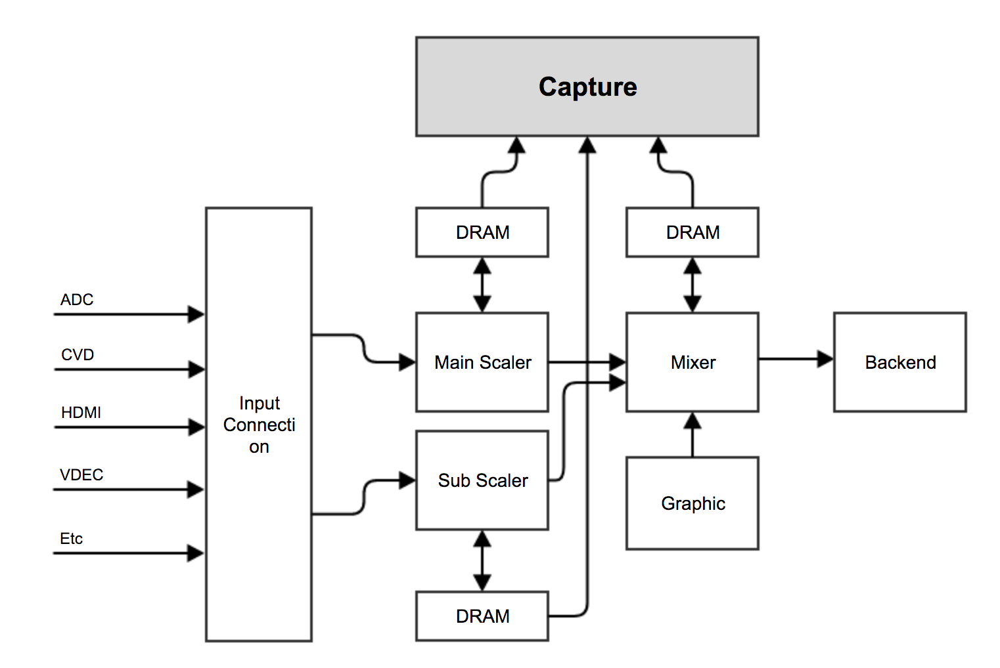
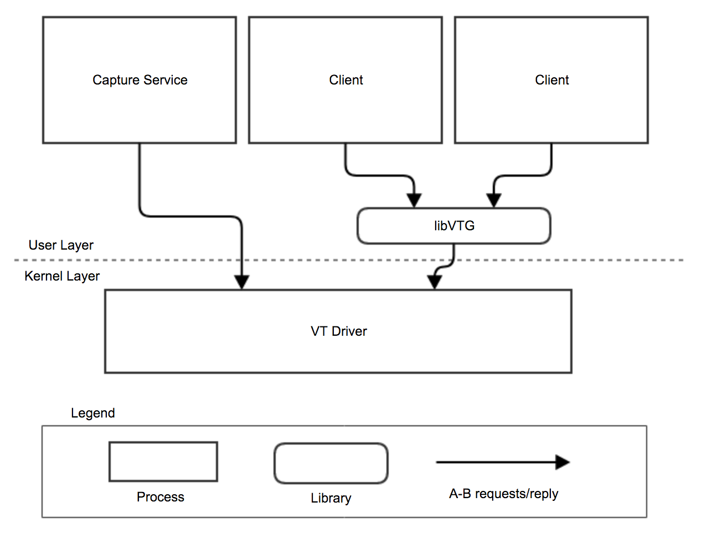
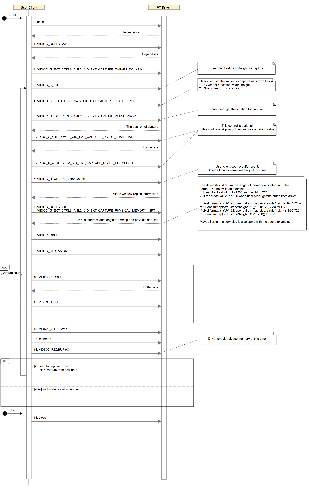

Video Texture
#############

.. _jjaem.kim: jjaem.kim@lge.com
.. _youngman.jung: youngman.jung@lge.com
.. _jinseong1.yang: jinseong1.yang@lge.com

Introduction
************

| This document describes the Video Texture (VT) driver in the kernel space. The document gives an overview of the VT driver and provides details about its functionalities and implementation requirements.

| The VT driver is based on the V4L2 framework. Therefore, the document assumes that the readers are familiar with the V4L2 API and framework principles, which include knowledge of V4L2 controls, buffer management, and streaming handling, among others.

| The VT driver is responsible for performing video capture. Therefore, it is necessary to understand video processing techniques and scaling algorithms, including knowledge of video formats, resolutions, frame rates, color formats, etc.

Revision History
================

+--------------+------------+----------------------+---------------------------------------------------------------------------------------+
| Version      | Date       | Changed by           | Description                                                                           |
+==============+============+======================+=======================================================================================+
|2.3.2         | 2025-06-18 | `jjaem.kim`_         | Added V4L2_EXT_CAPTURE_SUB_SCALER_OUTPUT enum value in v4l2_ext_capture_location .    |
+--------------+------------+----------------------+---------------------------------------------------------------------------------------+
|2.3.1         | 2025-03-20 | `jjaem.kim`_         | Added v4l2_ext_capture_rect struct.                                                   |
+--------------+------------+----------------------+---------------------------------------------------------------------------------------+
|2.3.0         | 2025-02-18 | `jjaem.kim`_         | Forked from the v4l2-exc-renderer-header repository.                                  |
+--------------+------------+----------------------+---------------------------------------------------------------------------------------+
|2.2.0         | 2024-06-11 | `jjaem.kim`_         | Added new CID for histogram function.                                                 |
+--------------+------------+----------------------+---------------------------------------------------------------------------------------+
|2.1.0         | 2023-11-18 | `youngman.jung`_     | Applied new document template.                                                        |
|              |            |                      |                                                                                       |
|              |            | `jinseong1.yang`_    | Added descriptions for the major function requirements of the driver.                 |
+--------------+------------+----------------------+---------------------------------------------------------------------------------------+
|2.0.1         | 2022-04-29 | `lewis.kim`_         | Add perfomance reqirement and constraints                                             |
+--------------+------------+----------------------+---------------------------------------------------------------------------------------+
|1.9.1         | 2019-06-19 | `seonghoon1128.do`_  | VIDIOC_DQBUF, Open                                                                    |
+--------------+------------+----------------------+---------------------------------------------------------------------------------------+

Terminology
===========
| The key words "must", "must not", "required", "shall", "shall not", "should", "should not", "recommended", "may", and "optional" in this document are to be interpreted as described in RFC2119.

| The following table lists the terms used throughout this document:

=============================== ===============================
Term                            Description
=============================== ===============================
VTG	                            Video texture to Graphic, a library that transforms captured video data into textures into data accessible by the GPU.
SVP	                            Active Format Description. A standard set of codes that indicate both the aspect ratio of the stream and the active portion (letter box, pillar box) of the image.
=============================== ===============================

Technical Assistance
====================

| For assistance or clarification on information in this guide, please create an issue in the LGE JIRA project and contact the following person:

=============== ============
Module          Owner
=============== ============
VT              `jjaem.kim`_
=============== ============

Overview
********

General Description
===================

| The Video Texture (VT) driver is based on the V4L2 framework and is responsible for performing video capture. The VT driver receives the video data from video path, and then transmits it to the client.

Features
========

| The VT driver provides the following features:

- Video capture
    - Video capture transfers the video data stored in memory to the client.
- Single resource
    - The VT V4L2 video device driver can be opened from multiple clients. However the VT Driver is managed as a single resource so that capture does not work simultaneously in the User Layer.
- Histogram extraction
    - The VT V4L2 video device driver can use TA to capture SVP and DRM content in the TEE area. The capture results allow the driver to make histogram data.

Architecture
============

This section describes the hardware architecture and the driver architecture for video texture.

Hardware Architecture
---------------------

The following figure shows the block diagram of the Video Texture.

| The Scaler IP can be divided into the following major parts:

- Input Mux connects the video input from the AVD/HDMI to the main or sub scaler.
- Main scaler is responsible for outputting video to a full window.
- Sub scaler is responsible for outputting video to a sub window in the Multi View mode.
- Mixer is responsible for blending with graphic and video date through scaler.
- The Capture can be done  in main scaler, sub scaler, mixer.

Driver Architecture
-------------------

The VT driver architecture shown in the figure below, is mainly divided into two layers user space and kernel space.

The user space (Capture service, Client through libVTG) requests to VT, which then interacts with the Video texture to capture the video. The following is a brief description of the architecture:

- Capture service → VT: Capture service send capture setting information and request to capture video
- Client → VT: Client (CP apps, media player, etc.) send capture setting information and request  to capture video

Requirements
************

This section describes the major functionalities of the VT driver, as well as its operational flow and requirements.
The VT driver do video capture that transfers the video data stored in memory to the client.

Functional Requirements
=======================

User Client Sequence
--------------------

| The following shows the entire flow for Capture using VT Driver in User Client. V4L2_CID_EXT_CAPTURE_VIDEO_WIN_INFO and V4L2_CID_EXT_CAPTURE_PLANE_INFO are excluded from below because VT Video Device is open and can be used at any time in the User Client without any command or dependency.

VT video device information
---------------------------

| The following shows the minor number and extension control IDs of the VT Video device.

.. code-block:: cpp
  :linenos:

  // The number of capture video device is 60.
  #define V4L2_EXT_DEV_NO_CAPTURE     60
  #define V4L2_EXT_DEV_PATH_CAPTURE   "/dev/video60"

  /* User-class control Bases */
  #define V4L2_CID_USER_EXT_CAPTURE_BASE (V4L2_CID_USER_BASE + 0x2100)

  /* Capture class control IDs */
  #define V4L2_CID_EXT_CAPTURE_CAPABILITY_INFO       (V4L2_CID_USER_EXT_CAPTURE_BASE + 0)
  #define V4L2_CID_EXT_CAPTURE_PLANE_INFO            (V4L2_CID_USER_EXT_CAPTURE_BASE + 1)
  #define V4L2_CID_EXT_CAPTURE_VIDEO_WIN_INFO        (V4L2_CID_USER_EXT_CAPTURE_BASE + 2)
  #define V4L2_CID_EXT_CAPTURE_PLANE_PROP            (V4L2_CID_USER_EXT_CAPTURE_BASE + 3)
  #define V4L2_CID_EXT_CAPTURE_FREEZE_MODE           (V4L2_CID_USER_EXT_CAPTURE_BASE + 4)
  #define V4L2_CID_EXT_CAPTURE_DONE_USER_PROCESSING  (V4L2_CID_USER_EXT_CAPTURE_BASE + 5)
  #define V4L2_CID_EXT_CAPTURE_PHYSICAL_MEMORY_INFO  (V4L2_CID_USER_EXT_CAPTURE_BASE + 6)
  #define V4L2_CID_EXT_CAPTURE_OUTPUT_FRAMERATE      (V4L2_CID_USER_EXT_CAPTURE_BASE + 7)
  #define V4L2_CID_EXT_CAPTURE_DIVIDE_FRAMERATE      (V4L2_CID_USER_EXT_CAPTURE_BASE + 8)

  /* videotexture class control IDs for histogram */
  #define V4L2_CID_EXT_HISTOGRAM_START     (V4L2_CID_USER_EXT_CAPTURE_BASE + 20)
  #define V4L2_CID_EXT_HISTOGRAM_PRESET    (V4L2_CID_USER_EXT_CAPTURE_BASE + 21)
  #define V4L2_CID_EXT_HISTOGRAM_DATA      (V4L2_CID_USER_EXT_CAPTURE_BASE + 22)
  #define V4L2_CID_EXT_HISTOGRAM_STOP      (V4L2_CID_USER_EXT_CAPTURE_BASE + 23)

  /* Capture class subscription IDs */
  #define V4L2_CID_EXT_CAPTURE_SUBSCRIBE_FRAME_READY (V4L2_CID_USER_EXT_CAPTURE_BASE + 30)

  /* Capture class subscription types */
  #define V4L2_EVENT_PRIVATE_EXT_CAPTURE_BASE  (V4L2_EVENT_PRIVATE_START + 0x2100)
  #define V4L2_EVENT_PRIVATE_EXT_CAPTURE_EVENT (V4L2_EVENT_PRIVATE_EXT_CAPTURE_BASE + 1)

Quality and Constraints
=======================

Performance Requirements
------------------------

| The response time of each function must respond within 10ms for each function, unless there is a special reason. However, the following functions must respond within the time shown in the table below.

================================= ======================================
Function name                     Response time (ms)
================================= ======================================
open                              50
close                             50
V4L2_CID_EXT_CAPTURE_PLANE_PROP   200
VIDIOC_REQBUFS                    200
VIDIOC_STREAMON                   200
================================= ======================================

Design Constraints
------------------

| Drivers cannot be used at the same time because the size or number of buffers to be captured differs depending on the purpose of video capture. For this, if open() is performed in a certain process, open() cannot be allowed in another process until close().
| From a memory point of view, it should be considered as two types of memory for video capture. One is the 1 buffer of 4K size that is frequently captured on any input sources, the other is the 3 or 5 buffers of 4K size that is captured on specific input sources such as YouTube and Media app. So, the fommer must use dedicated memory, and the latter does not have to be a dedicated memory. And the memory must be cotiguous memory.

Implementation
**************

This section provides materials that are useful for VT implementation.

- The File Location section provides the location of the Git repository where you can get the header file in which the interface for the VT implementation is defined.
- The API List section provides a brief summary of VT APIs that you must implement.
- The Implementation Details section sets implementation guidance and some major functionalities.

File Location
=============

The VT interfaces are defined in the v4l2-ext-screencapture.h header file, which can be obtained from https://swfarmhub.lge.com/.

- Git repository: bsp/ref/v4l2-ext-screeencapture-header
- Location: [as_installed]/linux/v4l2-ext-screencapture.h

API List
========

The VT driver implementation must adhere to the interface specifications defined and implements its functions. Refer to the API Reference for more details.

Data Types
----------

Standard V4L2 Structures
""""""""""""""""""""""""

The following table lists the Linux standard V4L2 struct types.

===================================================================================================================================================================== ===================================================================================================
Structure                                                                                                                                                             Description
===================================================================================================================================================================== ===================================================================================================
`v4l2_control <https://linuxtv.org/downloads/v4l-dvb-apis/userspace-api/v4l/vidioc-g-ctrl.html#c.V4L.v4l2_control>`_                     	                           Contains id and value to identify the control and value.
`v4l2_ext_control <https://linuxtv.org/downloads/v4l-dvb-apis/userspace-api/v4l/vidioc-g-ext-ctrls.html#c.V4L.v4l2_ext_control>`_                                      Contains id,size and union values to control device driver.
`v4l2_ext_controls <https://linuxtv.org/downloads/v4l-dvb-apis/userspace-api/v4l/vidioc-g-ext-ctrls.html#c.V4L.v4l2_ext_controls>`_                                    Contains ctrl_class, count and controls to multiple controls atomically.
`v4l2_requestbuffers <https://linuxtv.org/downloads/v4l-dvb-apis/userspace-api/v4l/vidioc-reqbufs.html#c.V4L.v4l2_requestbuffers>`_	                                   Contains the number of buffers requested or granted, type and capabilities.
`v4l2_capability <https://linuxtv.org/downloads/v4l-dvb-apis/userspace-api/v4l/vidioc-querycap.html#c.V4L.v4l2_capability>`_	                                       Contains driver information and capabilities.
`v4l2_buffer <https://linuxtv.org/downloads/v4l-dvb-apis/userspace-api/v4l/buffer.html#struct-v4l2-buffer>`_	                                                       Contains number of the buffer, type and buffer informations.
`v4l2_plane <https://linuxtv.org/downloads/v4l-dvb-apis/userspace-api/v4l/buffer.html#struct-v4l2-plane>`_                                                             Contains the number of bytes occupied by date in the plane and plane informations.
`v4l2_buf_type <https://linuxtv.org/downloads/v4l-dvb-apis/userspace-api/v4l/buffer.html#enum-v4l2-buf-type>`_                                                         Contains buffer type information and flags.
`v4l2_format <https://linuxtv.org/downloads/v4l-dvb-apis/userspace-api/v4l/vidioc-g-fmt.html#c.V4L.v4l2_format>`_	                                                   Contains parameters against hardware abilities.
===================================================================================================================================================================== ===================================================================================================

Standard V4L2 Enumerations
""""""""""""""""""""""""""

The following table lists the Linux standard V4L2 enum types.

======================================================================================================================================================== ===================================================================================================
Enumeration                                            Description
======================================================================================================================================================== ===================================================================================================
`v4l2_buf_type <https://linuxtv.org/downloads/v4l-dvb-apis/userspace-api/v4l/buffer.html#enum-v4l2-buf-type>`_                                            Defines the buffer types.
`v4l2_memory <https://linuxtv.org/downloads/v4l-dvb-apis/userspace-api/v4l/buffer.html#enum-v4l2-memory>`_                                                Defines memory: used for MMAP or USERPTR or DMABUF.
======================================================================================================================================================== ===================================================================================================

Extended V4L2 Structures
""""""""""""""""""""""""

The following table lists the LG extended V4L2 struct types.

=============================================================== ===================================================================================================
Structure                                                       Description
=============================================================== ===================================================================================================
:c:macro:`v4l-dvb-apis:v4l2_ext_capture_rect`	                Contains rect(x, y, w, h) information.
:c:macro:`v4l-dvb-apis:v4l2_ext_capture_capability_info`	    Contains capture capability information.
:c:macro:`v4l-dvb-apis:v4l2_ext_capture_plane_info`	            Contains plane information.
:c:macro:`v4l-dvb-apis:v4l2_ext_capture_video_win_info`	        Contains capture video window information.
:c:macro:`v4l-dvb-apis:v4l2_ext_capture_plane_prop`	            Contains capture plane property.
:c:macro:`v4l-dvb-apis:v4l2_ext_capture_freeze_mode`	        Contains freeze mode.
:c:macro:`v4l-dvb-apis:v4l2_ext_capture_physical_memory_info`	Contains capture physical memory information.
:c:macro:`v4l-dvb-apis:v4l2_ext_histogram_data`	                Contains histogram area ID and RGB informations.
=============================================================== ===================================================================================================

Extended V4L2 Enumerations
""""""""""""""""""""""""""

The following table lists the LG extended V4L2 enum types.

======================================================================== ===================================================================================================
Enumeration                                            Description
======================================================================== ===================================================================================================
:c:macro:`v4l-dvb-apis:v4l2_ext_capture_video_frame_buffer_pixel_format` Defines capture video frame buffer pixel format.
:c:macro:`v4l-dvb-apis:v4l2_ext_capture_video_frame_buffer_plane_num`    Defines capture video frame buffer plane number.
:c:macro:`v4l-dvb-apis:v4l2_ext_capture_video_scan_type`                 Defines capture video scan type.
:c:macro:`v4l-dvb-apis:v4l2_ext_capture_location`                        Defines capture location.
:c:macro:`v4l-dvb-apis:v4l2_ext_capture_buf_location`                    Defines capture buffer location.
======================================================================== ===================================================================================================

Functions
---------

Standard V4L2 Functions
"""""""""""""""""""""""

The following table lists the Linux standard V4L2 functions.

===================================================================================================================================================================================== ===================================================================================================
Funtion                                                                                                                                                                               Description
===================================================================================================================================================================================== ===================================================================================================
`V4L2 open() <https://linuxtv.org/downloads/v4l-dvb-apis/userspace-api/v4l/func-open.html>`_                                                                                          Opens a V4L2 device.
`V4L2 close() <https://linuxtv.org/downloads/v4l-dvb-apis/userspace-api/v4l/func-close.html>`_                                                                                        Closes a V4L2 device.
`void* mmap() <https://linuxtv.org/downloads/v4l-dvb-apis/userspace-api/v4l/func-mmap.html>`_                                                                                         Map device memory into application address space.
`ioctl VIDIOC_STREAMON <https://linuxtv.org/downloads/v4l-dvb-apis/userspace-api/v4l/vidioc-streamon.html>`_                                                                          Start of stop streaming I/O.
`ioctl VIDIOC_STREAMOFF <https://linuxtv.org/downloads/v4l-dvb-apis/userspace-api/v4l/vidioc-streamon.html>`_                                                                         Start of stop streaming I/O.
`ioctl VIDIOC_QBUF <https://linuxtv.org/downloads/v4l-dvb-apis/userspace-api/v4l/vidioc-qbuf.html>`_                                                                                  Exchange a bffer with the driver.
`ioctl VIDIOC_DQBUF <https://linuxtv.org/downloads/v4l-dvb-apis/userspace-api/v4l/vidioc-qbuf.html>`_                                                                                 Exchange a bffer with the driver.
`ioctl VIDIOC_G_FMT <https://linuxtv.org/downloads/v4l-dvb-apis/userspace-api/v4l/vidioc-g-fmt.html>`_                                                                                Get or set the data format, try a format.
`ioctl VIDIOC_S_FMT <https://linuxtv.org/downloads/v4l-dvb-apis/userspace-api/v4l/vidioc-g-fmt.html>`_                                                                                Get or set the data format, try a format.
`ioctl VIDIOC_QUERYCAP <https://linuxtv.org/downloads/v4l-dvb-apis/userspace-api/v4l/vidioc-querycap.html>`_                                                                          Queries device capabilities.
`ioctl VIDIOC_REQBUFS <https://linuxtv.org/downloads/v4l-dvb-apis/userspace-api/v4l/vidioc-reqbufs.html>`_                                                                            Initiate Memory Mapping, User Pointer I/O or DMA buffer I/O.
`ioctl VIDIOC_QUERYBUF <https://linuxtv.org/downloads/v4l-dvb-apis/userspace-api/v4l/vidioc-querybuf.html>`_                                                                          Query the status of a buffer.
===================================================================================================================================================================================== ===================================================================================================

Extended V4L2 Controls
""""""""""""""""""""""

The following table lists the LG extended V4L2 controls.

=================================================================== ===================================================================================================
Control ID                                                          Description
=================================================================== ===================================================================================================
:c:macro:`V4L2_CID_EXT_CAPTURE_CAPABILITY_INFO`                     Get the capture capabilities.
:c:macro:`V4L2_CID_EXT_CAPTURE_PLANE_INFO`                          Get plane information.
:c:macro:`V4L2_CID_EXT_CAPTURE_VIDEO_WIN_INFO`                      Set video window.
:c:macro:`V4L2_CID_EXT_CAPTURE_FREEZE_MODE`                         Set/get freeze.
:c:macro:`V4L2_CID_EXT_CAPTURE_DONE_USER_PROCESSING`                Notify done processing to driver.
:c:macro:`V4L2_CID_EXT_CAPTURE_PHYSICAL_MEMORY_INFO`                Get physical memory.
:c:macro:`V4L2_CID_EXT_CAPTURE_PLANE_PROP`                          Set/get properties.
:c:macro:`V4L2_CID_EXT_CAPTURE_OUTPUT_FRAMERATE`                    Get output frame rate.
:c:macro:`V4L2_CID_EXT_CAPTURE_DIVIDE_FRAMERATE`                    Divide output frame rate.
:c:macro:`V4L2_CID_EXT_HISTOGRAM_START`                             Activate the histogram mode.
:c:macro:`V4L2_CID_EXT_HISTOGRAM_PRESET`                            Set the histogram preset mode value.
:c:macro:`V4L2_CID_EXT_HISTOGRAM_DATA`                              Get histogram data from the selected area.
:c:macro:`V4L2_CID_EXT_HISTOGRAM_STOP`                              Deactivate the histogram mode.
=================================================================== ===================================================================================================

Implementation Details
======================

This section contains implementation details and example code for some functionality described in the Requirements section.

The following V4L2 standard functions are described in more detail to help you better understand their usage.

VIDIOC_S_FMT
^^^^^^^^^^^^^^^^

.. function:: VIDIOC_S_FMT()

    Linux Standard Command: :ref:`VIDIOC_S_FMT <v4l-dvb-apis:VIDIOC_G_FMT>`

    **Functional Requirements**

        * The user can set the property of capture as follows through the corresponding command.

          a. Capture image width
          b. Capture image height

        User uses the standard structure, Struct v4l2_format, in the following way.
        The driver should look at the type of format to determine what information
        to read.

    **Responses to abnormal situations, including**

        If abnormal data is set, the driver should return an error.
        The generic error codes are described at the :ref:`gen_errors` chapter.

    **Performance Requirements**

        The response time must respond within 10ms, unless there is a special reason.

    **Constraints**

        None

    **Functions & Parameters**

        .. code-block:: cpp
            :linenos:

            //
            //Command
            //
            VIDIOC_S_FMT

            //
            //parameter
            //
            struct v4l2_format {
                __u32    type;
                union {
                    struct v4l2_pix_format      pix;     /* V4L2_BUF_TYPE_VIDEO_CAPTURE */
                    struct v4l2_pix_format_mplane   pix_mp;  /* V4L2_BUF_TYPE_VIDEO_CAPTURE_MPLANE */
                    struct v4l2_window      win;     /* V4L2_BUF_TYPE_VIDEO_OVERLAY */
                    struct v4l2_vbi_format      vbi;     /* V4L2_BUF_TYPE_VBI_CAPTURE */
                    struct v4l2_sliced_vbi_format   sliced;  /* V4L2_BUF_TYPE_SLICED_VBI_CAPTURE */
                    __u8    raw_data[200];                   /* user-defined */
                } fmt;
            };

    **Return Value**

        Refer to the Return Values section of the Linux Standards documentation above.

    **Example**

        .. code-block:: cpp
            :linenos:

            // We use that format.type is V4L2_BUF_TYPE_VIDEO_CAPTURE_MPLANE,
            // user set data in format.fmt.pix_mp.
            struct v4l2_format format;
            memset(&format, 0, sizeof(struct v4l2_format));

            format.type = V4L2_BUF_TYPE_VIDEO_CAPTURE_MPLANE;
            format.fmt.pix_mp.width = 640;
            format.fmt.pix_mp.height = 480;

            ret = ioctl(fd, VIDIOC_S_FMT, &format);

VIDIOC_G_FMT
^^^^^^^^^^^^^^^^

.. function:: VIDIOC_G_FMT()

    Linux Standard Command: :ref:`VIDIOC_G_FMT <v4l-dvb-apis:VIDIOC_G_FMT>`

    **Functional Requirements**

        * Driver just returns current information for width, height and flags.

    **Responses to abnormal situations, including**

        If abnormal data is set, the driver should return an error.
        The generic error codes are described at the :ref:`gen_errors` chapter.

    **Performance Requirements**

        The response time must respond within 10ms, unless there is a special reason.

    **Constraints**

        None

    **Functions & Parameters**

        .. code-block:: cpp
            :linenos:

            //
            //Command
            //
            VIDIOC_G_FMT

            //
            //parameter
            //
            struct v4l2_format {
                __u32    type;
                union {
                    struct v4l2_pix_format      pix;     /* V4L2_BUF_TYPE_VIDEO_CAPTURE */
                    struct v4l2_pix_format_mplane   pix_mp;  /* V4L2_BUF_TYPE_VIDEO_CAPTURE_MPLANE */
                    struct v4l2_window      win;     /* V4L2_BUF_TYPE_VIDEO_OVERLAY */
                    struct v4l2_vbi_format      vbi;     /* V4L2_BUF_TYPE_VBI_CAPTURE */
                    struct v4l2_sliced_vbi_format   sliced;  /* V4L2_BUF_TYPE_SLICED_VBI_CAPTURE */
                    __u8    raw_data[200];                   /* user-defined */
                } fmt;
            };

    **Return Value**

        Refer to the Return Values section of the Linux Standards documentation above.

    **Example**

        .. code-block:: cpp
            :linenos:

            int width = 0, height = 0;
            struct v4l2_format  format;
            format.type = V4L2_BUF_TYPE_VIDEO_CAPTURE_MPLANE;

            if(ioctl(fd, VIDIOC_G_FMT, &format) >= 0) {
              width = (int)format.fmt.pix_mp.width;
              height = (int)format.fmt.pix_mp.height;
            }

VIDIOC_QUERYCAP
^^^^^^^^^^^^^^^^

.. function:: VIDIOC_QUERYCAP()

    Linux Standard Command: :ref:`VIDIOC_QUERYCAP <v4l-dvb-apis:VIDIOC_QUERYCAP>`

    **Functional Requirements**

      * Need to support the following Capabilities Type for LG requirement.

        __u8 driver[16];
        ex) m16p3, o20, k6lp, k6hp, lm14a,lm14a_lite - Among the same chip
        series, there are some chips that need to be separated for operation
        such as the low or high groups. If separation is required, you must set
        it to a distinguishable name.

        __u8 card[32];
        ex) /dev/video60 is "vt"

        __u32 capabilities;
        ex) V4L2_CAP_VIDEO_CAPTURE_MPLANE, V4L2_CAP_STREAMING

    **Responses to abnormal situations, including**

        If abnormal data is set, the driver should return an error.
        The generic error codes are described at the :ref:`gen_errors` chapter.

    **Performance Requirements**

        The response time must respond within 10ms, unless there is a special reason.

    **Constraints**

        None

    **Functions & Parameters**

        .. code-block:: cpp
            :linenos:

            //
            //Command
            //
            VIDIOC_QUERYCAP

            //
            //parameter
            //
            struct v4l2_capability
            {
                __u8    driver[16];    /* SoC chip Name */
                __u8    card[32];      /* driver name */
                __u8    bus_info[32];  /* NA */
                __u32   version;       /* should use KERNEL_VERSION() */
                __u32   capabilities;  /* Device capabilities */
                __u32   reserved[4];
            };

    **Return Value**

        Refer to the Return Values section of the Linux Standards documentation above.

    **Example**

        .. code-block:: cpp
            :linenos:

            struct v4l2_capability v4l2Cap = {0,};
            bool bAvailableCapture = false;

            if(ioctl(fd, VIDIOC_QUERYCAP, &v4l2Cap) >= 0)
                bAvailableCapture = (v4l2Cap.capabilities & V4L2_CAP_STREAMING) && (v4l2Cap.capabilities & V4L2_CAP_VIDEO_CAPTURE_MPLANE);

VIDIOC_REQBUFS
^^^^^^^^^^^^^^^^

.. function:: VIDIOC_REQBUFS()

    Linux Standard Command: :ref:`VIDIOC_REQBUFS <v4l-dvb-apis:VIDIOC_REQBUFS>`

    **Functional Requirements**

        Allocate and initialize buffers in the following scenarios:

          a. Buffer allocation

            - When the count value of the v4l2_buffer structure is greater than 0.

          b. Buffer initialization (resource cleanup)

            - Release buffers by setting the count value of VIDIOC_REQBUFS to 0
              after VIDIOC_STREAMOFF and after munmap in user client for buffer
              initialization.

        .. image:: resources/video-texture-VIDIOC_REQBUFS.png
            :width: 100%

    **Responses to abnormal situations, including**

        If abnormal data is set, the driver should return an error.
        The generic error codes are described at the :ref:`gen_errors` chapter.

    **Performance Requirements**

        The response time must respond within 10ms, unless there is a special reason.

    **Constraints**

        None

    **Functions & Parameters**

        .. code-block:: cpp
            :linenos:

            //
            //Command
            //
            VIDIOC_REQBUFS

            //
            //parameter
            //
            struct v4l2_requestbuffers {
                __u32           count;      /* number of buffers to get  */
                __u32           type;       /* enum v4l2_buf_type */
                __u32           memory;     /* enum v4l2_memory */
                __u32           reserved[2];
            };

    **Return Value**

        Refer to the Return Values section of the Linux Standards documentation above.

    **Example**

        .. code-block:: cpp
            :linenos:

            struct v4l2_requestbuffers reqBuf;
            reqBuf.count = 3;
            reqBuf.type = V4L2_BUF_TYPE_VIDEO_CAPTURE_MPLANE;
            reqBuf.memory = V4L2_MEMORY_MMAP;

            ret = ioctl(pV4l2Handle->fd, VIDIOC_REQBUFS, &reqBuf);

VIDIOC_QUERYBUF
^^^^^^^^^^^^^^^^

.. function:: VIDIOC_QUERYBUF()

    Linux Standard Command: :ref:`VIDIOC_QUERYBUF <v4l-dvb-apis:VIDIOC_QUERYBUF>`

    **Functional Requirements**

        One buffer has two structs v4l2_plane. One Plane has Y information, and the
        other one has UV information. Each Plane MUST return mem_offset and length
        information in struct v4l2_buffer for mmap, when calling VIDIOC_QUERYBUF by
        user. The driver should return the length of memory allocated from the
        kernel. The below is an example.

          Condition-1. User client set width to 1280 and height to 720,

          Condition-2. If the stride value is 1920 when user client reads the value
          of stride from driver.

              - If pixel format is YUV420, user calls mmap(size: stride*height
                (1920*720)) for Y and mmap(size:stride*height/2 ((1920*720)/2))
                for UV.

              - If pixel format is YUV422, user calls mmap(size: stride*height
                (1920*720)) for Y and mmap(size:stride*height(1920*720)) for UV.

              - Maybe kernel memory size is also same with the above example.

    **Responses to abnormal situations, including**

        If abnormal data is set, the driver should return an error.
        The generic error codes are described at the :ref:`gen_errors` chapter.

    **Performance Requirements**

        The response time must respond within 10ms, unless there is a special reason.

    **Constraints**

        None

    **Functions & Parameters**

        .. code-block:: cpp
            :linenos:

            //
            //Command
            //
            VIDIOC_QUERYBUF

            //
            //parameter
            //
            struct v4l2_buffer {
                __u32           index;
                __u32           type;
                __u32           bytesused;
                __u32           flags;
                __u32           field;
                struct timeval      timestamp;
                struct v4l2_timecode    timecode;
                __u32           sequence;

                /* memory location */
                __u32           memory;
                union {
                    __u32           offset;
                    unsigned long   userptr;
                    struct v4l2_plane *planes;
                } m;
                __u32           length;
                __u32           reserved2;
                __u32           reserved;
            };

    **Return Value**

        Refer to the Return Values section of the Linux Standards documentation above.

    **Example**

        .. code-block:: cpp
            :linenos:

            struct v4l2_buffer buf;
            struct v4l2_plane *pPlane = NULL;
            int bufCount = 3; // It is same value at VIDIOC_REQBUFS
            int num_plane = 2; // It is from V4L2_CID_EXT_CAPTURE_CAPABILITY_INFO

            pPlane = (struct v4l2_plane *)malloc(sizeof(struct v4l2_plane) * num_plane);

            for(i = 0; i < bufCount; i++)
            {
                buf.index = i;
                buf.type = V4L2_BUF_TYPE_VIDEO_CAPTURE_MPLANE;
                buf.memory = V4L2_MEMORY_MMAP;
                buf.length = pV4l2Handle->numOfPlane;
                buf.m.planes = pPlane;

                ret = ioctl(fd, VIDIOC_QUERYBUF, &buf);
            }

VIDIOC_DQBUF
^^^^^^^^^^^^^^^^

.. function:: VIDIOC_DQBUF()

    Linux Standard Command: :ref:`VIDIOC_DQBUF <v4l-dvb-apis:VIDIOC_QBUF>`

    **Functional Requirements**

        * User is waiting the response from kernel driver after calling
          VIDIOC_DQBUF.

        * When video frame capture is completed in buffer 'X', driver just returns
          buffer index 'X' in index field in struct v4l2_buffer.

        * When the user client calls open(), at this time, SoC driver should return
          the EACCES(permission denied) to user client, if the SoC driver uses the
          SVP(secure video path) for security. Also buffer index should be 0xFF.

        .. image:: resources/video-texture-VIDIOC_DQBUF.png
            :width: 100%

    **Responses to abnormal situations, including**

        If abnormal data is set, the driver should return an error.
        The generic error codes are described at the :ref:`gen_errors` chapter.

    **Performance Requirements**

        The response time must respond according to the set FPS.
        For example, if the FPS is set 60, the response time must respond about 16.6ms.

    **Constraints**

        None

    **Functions & Parameters**

        .. code-block:: cpp
            :linenos:

            //
            //Command
            //
            VIDIOC_DQBUF

            //
            //parameter
            //
            struct v4l2_buffer {
                __u32           index;
                __u32           type;
                __u32           bytesused;
                __u32           flags;
                __u32           field;
                struct timeval      timestamp;
                struct v4l2_timecode    timecode;
                __u32           sequence;

                /* memory location */
                __u32           memory;
                union {
                    __u32           offset;
                    unsigned long   userptr;
                    struct v4l2_plane *planes;
                } m;
                __u32           length;
                __u32           reserved2;
                __u32           reserved;
            };

    **Return Value**

        On success 0 is returned, on error -1 and the errno variable is set appropriately.

        ======================== =======================================
        Error Value              Description
        ======================== =======================================
		EACCES                   It indicates access to secure video is not possible.
		EAGAIN                   It indicates the driver has failed and needs to be reinitialized.
        ENODATA                  It indicates a video problem occurred such as no signal.
        ======================== =======================================

    **Example**

        .. code-block:: cpp
            :linenos:

            struct v4l2_buffer buf;
            struct v4l2_plane *pPlane = NULL;
            int num_plane = 2; // It is from V4L2_CID_EXT_CAPTURE_CAPABILITY_INFO

            pPlane = (struct v4l2_plane *)malloc(sizeof(struct v4l2_plane) * num_plane);

            buf.type = V4L2_BUF_TYPE_VIDEO_CAPTURE_MPLANE;
            buf.memory = V4L2_MEMORY_MMAP;
            buf.length = numOfPlane;
            buf.m.planes = pPlane;

            ret = ioctl(fd, VIDIOC_DQBUF, &buf);

Testing
*******

| To test the implementation of the VT driver, webOS provides SoCTS (SoC Test Suite) tests.
| The SoCTS checks the basic operation of the VT driver and verifies the kernel event operation for the module by using a test execution file.
| For details, see :doc:`VT Unit Test in SoCTS Unit Test Specification. </part4/socts/Documentation/source/producer-manual/producer-manual_v4l2/producer-manual_v4l2-vt>`

References
**********

For additional information on related standards or technical topics, refer to:

- `Part I - Video for Linux API <https://linuxtv.org/downloads/v4l-dvb-apis/userspace-api/v4l/v4l2.html>`_
- `Linux Kernel Media Documentation <https://linuxtv.org/downloads/v4l-dvb-apis/>`_
